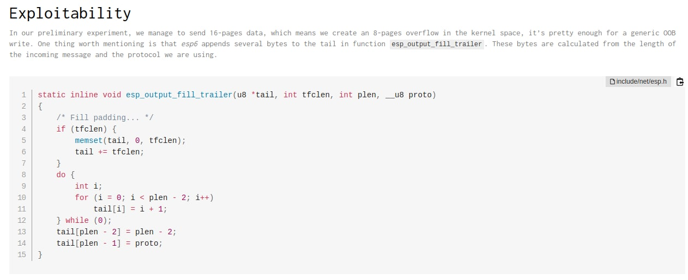
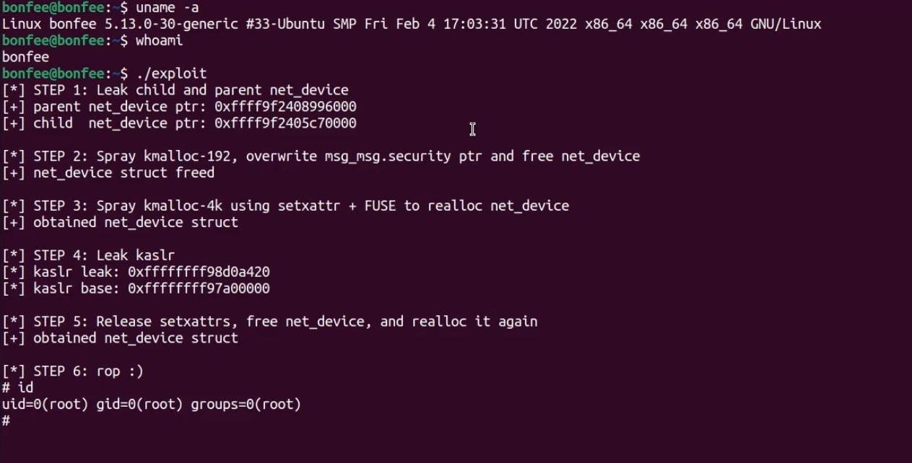

# defcon_news
`2022-03-31`

<blockquote>
Spring Fixes Zero-Day Vulnerability in Framework and Spring Boot
https://www.darkreading.com/vulnerabilities-threats/spring-fixes-zero-day-vulnerability-in-framework-spring-boot

via Dark Reading
</blockquote>

<table><tr><td><b>→</b><a href="https://www.darkreading.com/vulnerabilities-threats/spring-fixes-zero-day-vulnerability-in-framework-spring-boot">
https://www.darkreading.com/vulnerabilities-threats/spring-fixes-zero-day-vulnerability-in-framework-spring-boot
</a>
<blockquote>
The exploit requires a specific nonstandard configuration to work, limiting the danger it poses, but future research could turn up more broadly usable attacks.
</blockquote>
</td></tr></table>

---

# cibsecurity
`2022-03-31`

* https://web.nvd.nist.gov/view/vuln/detail?vulnId=CVE-2021-43479

<blockquote>
‼ CVE-2021-43479 ‼

A Remote Code Execution (RCE) vulnerability exists in The-Secretary 2.5 via install.php.

📖 Read

via &quot;National Vulnerability Database&quot;.
</blockquote>

---

# cibsecurity
`2022-03-31`

* https://web.nvd.nist.gov/view/vuln/detail?vulnId=CVE-2021-43707

<blockquote>
‼ CVE-2021-43707 ‼

Cross Site Scripting (XSS) vulnerability exists in Maccms v10 via link_Name parameter.

📖 Read

via &quot;National Vulnerability Database&quot;.
</blockquote>

---

# defcon_news
`2022-03-31`

<blockquote>
Spring-Spel-0Day-Poc - Spring-Cloud / spring-cloud-function, spring.cloud.function.routing-expression, RCE, 0day, 0-day, POC, EXP
http://www.kitploit.com/2022/03/spring-spel-0day-poc-spring-cloud.html

via KitPloit - PenTest Tools!
</blockquote>

<table><tr><td><b>→</b><a href="https://www.kitploit.com/2022/03/spring-spel-0day-poc-spring-cloud.html">
https://www.kitploit.com/2022/03/spring-spel-0day-poc-spring-cloud.html
</a>
</td></tr></table>

---

# cibsecurity
`2022-03-31`

* https://web.nvd.nist.gov/view/vuln/detail?vulnId=CVE-2021-42946

<blockquote>
‼ CVE-2021-42946 ‼

A Cross Site Scripting (XSS) vulnerability exists in htmly.2.8.1 via the Copyright field in the /admin/config page.

📖 Read

via &quot;National Vulnerability Database&quot;.
</blockquote>

---

# cibsecurity
`2022-03-31`

* https://web.nvd.nist.gov/view/vuln/detail?vulnId=CVE-2021-36625

<blockquote>
‼ CVE-2021-36625 ‼

An SQL Injection vulnerability exists in Dolibarr ERP/CRM 13.0.2 (fixed version is 14.0.0) via a POST request to the country_id parameter in an UPDATE statement.

📖 Read

via &quot;National Vulnerability Database&quot;.
</blockquote>

---

# cibsecurity
`2022-03-31`

* https://web.nvd.nist.gov/view/vuln/detail?vulnId=CVE-2021-42867

<blockquote>
‼ CVE-2021-42867 ‼

A Cross Site Scripting (XSS) vulnerability exists in DanPros htmly 2.8.1 via the Description field in (1) admin/config, and (2) index.php pages.

📖 Read

via &quot;National Vulnerability Database&quot;.
</blockquote>

---

# cibsecurity
`2022-03-31`

* https://web.nvd.nist.gov/view/vuln/detail?vulnId=CVE-2021-42868

<blockquote>
‼ CVE-2021-42868 ‼

A Cross Site Scripting (XSS) vulnerability exists in Chikista Patient Management Software 2.0.2 in the first_name parameter in (1) patient/insert, (2) patient_report, (3) appointment_report, (4) visit_report, and (5) bill_detail_report pages. .

📖 Read

via &quot;National Vulnerability Database&quot;.
</blockquote>

---

# cibsecurity
`2022-03-31`

* https://web.nvd.nist.gov/view/vuln/detail?vulnId=CVE-2021-42869

<blockquote>
‼ CVE-2021-42869 ‼

A Cross Site Scripting (XSS) vulnerability exists in Chikista Patient Management Software 2.0.2 via the last_name parameter in the (1) patient/insert, (2) patient_report, (3) /appointment_report, (4) visit_report, and (5) /bill_detail_report pages.

📖 Read

via &quot;National Vulnerability Database&quot;.
</blockquote>

---

# cibsecurity
`2022-03-31`

* https://web.nvd.nist.gov/view/vuln/detail?vulnId=CVE-2021-43484

<blockquote>
‼ CVE-2021-43484 ‼

A Remote Code Execution (RCE) vulnerability exists in Simple Client Management System 1.0 in create.php due to the failure to validate the extension of the file being sent in a request.

📖 Read

via &quot;National Vulnerability Database&quot;.
</blockquote>

---

# defcon_news
`2022-03-31`

<blockquote>
&#35;0daytoday &#35;Spoofer 1.4.6 Privilege Escalation / Unquoted Service Path Vulnerabilities [&#35;0day &#35;Exploit]
https://0day.today/exploits/37569

via 0day.today
</blockquote>

---

# defcon_news
`2022-03-31`

<blockquote>
&#35;0daytoday &#35;EG Free AntiVirus 2020 Privilege Escalation / Unquoted Service Path Vulnerabilities [&#35;0day &#35;Exploit]
https://0day.today/exploits/37568

via 0day.today
</blockquote>

---

# defcon_news
`2022-03-31`

<blockquote>
&#35;0daytoday &#35;IdeaRE RefTree Shell Upload Vulnerability CVE-2022-27249 [webapps &#35;exploits &#35;Vulnerability &#35;0day &#35;Exploit]
https://0day.today/exploits/37567

via 0day.today
</blockquote>

---

# defcon_news
`2022-03-31`

<blockquote>
&#35;0daytoday &#35;IdeaRE RefTree Path Traversal Vulnerability CVE-2022-27248 [webapps &#35;exploits &#35;Vulnerability &#35;0day &#35;Exploit]
https://0day.today/exploits/37566

via 0day.today
</blockquote>

---

# defcon_news
`2022-03-31`

<blockquote>
&#35;0daytoday &#35;Spring Cloud Function SpEL Injection Exploit CVE-2022-22963 [remote &#35;exploits &#35;0day &#35;Exploit]
https://0day.today/exploits/37565

via 0day.today
</blockquote>

---

# defcon_news
`2022-03-31`

<blockquote>
Medical Hub Directory Site 1.0 SQL Injection
https://exploit.kitploit.com/2022/03/medical-hub-directory-site-10-sql_31.html

via Exploit Collector
</blockquote>

<table><tr><td><b>→</b><a href="https://exploit.kitploit.com/2022/03/medical-hub-directory-site-10-sql_31.html">
https://exploit.kitploit.com/2022/03/medical-hub-directory-site-10-sql_31.html
</a>
<blockquote>
Exploit Collector is the ultimate collection of public exploits and exploitable vulnerabilities. Remote/Local Exploits, Shellcode and 0days.
</blockquote>
</td></tr></table>

---

# defcon_news
`2022-03-31`

<blockquote>
Message System 1.0 SQL Injection
https://exploit.kitploit.com/2022/03/message-system-10-sql-injection.html

via Exploit Collector
</blockquote>

<table><tr><td><b>→</b><a href="https://exploit.kitploit.com/2022/03/message-system-10-sql-injection.html">
https://exploit.kitploit.com/2022/03/message-system-10-sql-injection.html
</a>
<blockquote>
Exploit Collector is the ultimate collection of public exploits and exploitable vulnerabilities. Remote/Local Exploits, Shellcode and 0days.
</blockquote>
</td></tr></table>

---

# cibsecurity
`2022-03-31`

* https://web.nvd.nist.gov/view/vuln/detail?vulnId=CVE-2021-43505

<blockquote>
‼ CVE-2021-43505 ‼

Multiple Cross Site Scripting (XSS) vulnerabilities exist in Ssourcecodester Simple Client Management System v1 via (1) Add new Client and (2) Add new invoice.

📖 Read

via &quot;National Vulnerability Database&quot;.
</blockquote>

---

# cibsecurity
`2022-03-31`

* https://web.nvd.nist.gov/view/vuln/detail?vulnId=CVE-2021-43506

<blockquote>
‼ CVE-2021-43506 ‼

An SQL Injection vulnerability exists in Sourcecodester Simple Client Management System 1.0 via the password parameter in Login.php.

📖 Read

via &quot;National Vulnerability Database&quot;.
</blockquote>

---

# cibsecurity
`2022-03-31`

* https://web.nvd.nist.gov/view/vuln/detail?vulnId=CVE-2022-0350

<blockquote>
‼ CVE-2022-0350 ‼

Cross-site Scripting (XSS) - Stored in GitHub repository vanessa219/vditor prior to 3.8.13.

📖 Read

via &quot;National Vulnerability Database&quot;.
</blockquote>

---

# defcon_news
`2022-03-31`

<blockquote>
Medical Hub Directory Site 1.0 SQL Injection
https://packetstormsecurity.com/files/166550/mhds10blind-sql.txt

via Exploit Files ≈ Packet Storm
</blockquote>

<table><tr><td><b>→</b><a href="https://packetstormsecurity.com/files/166550/mhds10blind-sql.txt">
https://packetstormsecurity.com/files/166550/mhds10blind-sql.txt
</a>
<blockquote>
Information Security Services, News, Files, Tools, Exploits, Advisories and Whitepapers
</blockquote>
</td></tr></table>

---

# defcon_news
`2022-03-31`

<blockquote>
Message System 1.0 SQL Injection
https://packetstormsecurity.com/files/166549/messagesystem10-sql.txt

via Exploit Files ≈ Packet Storm
</blockquote>

<table><tr><td><b>→</b><a href="https://packetstormsecurity.com/files/166549/messagesystem10-sql.txt">
https://packetstormsecurity.com/files/166549/messagesystem10-sql.txt
</a>
<blockquote>
Information Security Services, News, Files, Tools, Exploits, Advisories and Whitepapers
</blockquote>
</td></tr></table>

---

# cibsecurity
`2022-03-31`

* https://portswigger.net/daily-swig/spring4shell-spring-users-face-new-zero-day-vulnerability

<blockquote>
🗓️ Spring4Shell: Spring users face new, zero-day vulnerability 🗓️

Both security bugs are now reportedly being exploited in the wild

📖 Read

via &quot;The Daily Swig&quot;.
</blockquote>

<table><tr><td><b>→</b><a href="https://portswigger.net/daily-swig/spring4shell-spring-users-face-new-zero-day-vulnerability">
https://portswigger.net/daily-swig/spring4shell-spring-users-face-new-zero-day-vulnerability
</a>
<blockquote>
Both security bugs are now reportedly being exploited in the wild
</blockquote>
</td></tr></table>

---

# cibsecurity
`2022-03-31`

* https://nakedsecurity.sophos.com/2022/03/30/vmware-spring-cloud-java-bug-gives-instant-remote-code-execution-update-now/

<blockquote>
⚠ “VMware Spring Cloud” Java bug gives instant remote code execution – update now! ⚠

Easy unauthenticated remote code execution - PoC code already out

📖 Read

via &quot;Naked Security&quot;.
</blockquote>

<table><tr><td><b>→</b><a href="https://nakedsecurity.sophos.com/2022/03/30/vmware-spring-cloud-java-bug-gives-instant-remote-code-execution-update-now/">
https://nakedsecurity.sophos.com/2022/03/30/vmware-spring-cloud-java-bug-gives-instant-remote-code-execution-update-now/
</a>
<blockquote>
Easy unauthenticated remote code execution – PoC code already out
</blockquote>
</td></tr></table>

---

# cibsecurity
`2022-03-31`

* https://portswigger.net/daily-swig/critical-sql-injection-flaw-fixed-in-rapid7s-nexpose-vulnerability-scanner

<blockquote>
🗓️ Critical SQL injection flaw fixed in Rapid7’s Nexpose vulnerability scanner 🗓️

Attacks could be mounted via manipulation of query operators in search criteria

📖 Read

via &quot;The Daily Swig&quot;.
</blockquote>

<table><tr><td><b>→</b><a href="https://portswigger.net/daily-swig/critical-sql-injection-flaw-fixed-in-rapid7s-nexpose-vulnerability-scanner">
https://portswigger.net/daily-swig/critical-sql-injection-flaw-fixed-in-rapid7s-nexpose-vulnerability-scanner
</a>
<blockquote>
Attacks could be mounted via manipulation of query operators in search criteria
</blockquote>
</td></tr></table>

---

# defcon_news
`2022-03-31`

<blockquote>
How to Prevent the Next Log4j-Style Zero-Day Vulnerability
https://www.darkreading.com/dr-tech/how-to-prevent-the-next-log4j-style-zero-day-vulnerability

via Dark Reading
</blockquote>

<table><tr><td><b>→</b><a href="https://www.darkreading.com/dr-tech/how-to-prevent-the-next-log4j-style-zero-day-vulnerability?utm_source=dlvr.it&utm_medium=twitter">
https://www.darkreading.com/dr-tech/how-to-prevent-the-next-log4j-style-zero-day-vulnerability?utm_source=dlvr.it&utm_medium=twitter
</a>
<blockquote>
An interactive static analyzer gives developers information on potential risks arising from user inputs while they code. This could be a game-changer.
</blockquote>
</td></tr></table>

---

# defcon_news
`2022-03-31`

<blockquote>
CVE-2022-22963 - PoC Spring Java Framework 0-day Remote Code Execution Vulnerability
http://www.kitploit.com/2022/03/cve-2022-22963-poc-spring-java.html

via KitPloit - PenTest Tools!
</blockquote>

<table><tr><td><b>→</b><a href="https://www.kitploit.com/2022/03/cve-2022-22963-poc-spring-java.html">
https://www.kitploit.com/2022/03/cve-2022-22963-poc-spring-java.html
</a>
</td></tr></table>

---

# defcon_news
`2022-03-31`

<blockquote>
Chrome Zero-Day from North Korea
https://www.schneier.com/blog/archives/2022/03/chrome-zero-day-from-north-korea.html

via Schneier on Security
</blockquote>

---

# defcon_news
`2022-03-31`

<blockquote>
GitHub Security Lab: [Python]: CWE-611: XXE
https://vulners.com/hackerone/H1:1512937?utm_source&#61;rss&amp;utm_medium&#61;rss&amp;utm_campaign&#61;rss

via Vulners
</blockquote>

<table><tr><td><b>→</b><a href="https://vulners.com/hackerone/H1:1512937?utm_source=rss&utm_medium=rss&utm_campaign=rss">
https://vulners.com/hackerone/H1:1512937?utm_source=rss&utm_medium=rss&utm_campaign=rss
</a>
<blockquote>
This bug was reported directly to GitHub Security...
</blockquote>
</td></tr></table>

---

# defcon_news
`2022-03-31`

<blockquote>
GitHub Security Lab: [Java]: Add JDBC connection SSRF sinks
https://vulners.com/hackerone/H1:1512936?utm_source&#61;rss&amp;utm_medium&#61;rss&amp;utm_campaign&#61;rss

via Vulners
</blockquote>

<table><tr><td><b>→</b><a href="https://vulners.com/hackerone/H1:1512936?utm_source=rss&utm_medium=rss&utm_campaign=rss">
https://vulners.com/hackerone/H1:1512936?utm_source=rss&utm_medium=rss&utm_campaign=rss
</a>
<blockquote>
This bug was reported directly to GitHub Security...
</blockquote>
</td></tr></table>

---

# cibsecurity
`2022-03-31`

* https://web.nvd.nist.gov/view/vuln/detail?vulnId=CVE-2022-1191

<blockquote>
‼ CVE-2022-1191 ‼

SSRF on index.php/cobrowse/proxycss/ in GitHub repository livehelperchat/livehelperchat prior to 3.96.

📖 Read

via &quot;National Vulnerability Database&quot;.
</blockquote>

---

# cibsecurity
`2022-03-31`

* https://web.nvd.nist.gov/view/vuln/detail?vulnId=CVE-2022-24299

<blockquote>
‼ CVE-2022-24299 ‼

Improper input validation vulnerability in pfSense CE and pfSense Plus (pfSense CE software versions prior to 2.6.0 and pfSense Plus software versions prior to 22.01) allows a remote attacker with the privilege to change OpenVPN client or server settings to execute an arbitrary command.

📖 Read

via &quot;National Vulnerability Database&quot;.
</blockquote>

---

# defcon_news
`2022-03-31`

<blockquote>
&#35;0daytoday &#35;COMPIE CMS Leado Local File Include Vulnerability [webapps &#35;exploits &#35;Vulnerability &#35;0day &#35;Exploit]
https://0day.today/exploits/37564

via 0day.today
</blockquote>

---

# cibsecurity
`2022-03-31`

* https://web.nvd.nist.gov/view/vuln/detail?vulnId=CVE-2022-26646

<blockquote>
‼ CVE-2022-26646 ‼

Online Banking System Protect v1.0 was discovered to contain a local file inclusion (LFI) vulnerability via the pages parameter.

📖 Read

via &quot;National Vulnerability Database&quot;.
</blockquote>

---

# cibsecurity
`2022-03-31`

* https://web.nvd.nist.gov/view/vuln/detail?vulnId=CVE-2022-26645

<blockquote>
‼ CVE-2022-26645 ‼

A remote code execution (RCE) vulnerability in Online Banking System Protect v1.0 allows attackers to execute arbitrary code via a crafted PHP file uploaded through the Upload Image function.

📖 Read

via &quot;National Vulnerability Database&quot;.
</blockquote>

---

# cibsecurity
`2022-03-31`

* https://web.nvd.nist.gov/view/vuln/detail?vulnId=CVE-2021-33581

<blockquote>
‼ CVE-2021-33581 ‼

MashZone NextGen through 10.7 GA has an SSRF vulnerability that allows an attacker to interact with arbitrary TCP services, by abusing the feature to check the availability of a PPM connection. This occurs in com.idsscheer.ppmmashup.web.webservice.impl.ZPrestoAdminWebService.

📖 Read

via &quot;National Vulnerability Database&quot;.
</blockquote>

---

# cibsecurity
`2022-03-31`

* https://web.nvd.nist.gov/view/vuln/detail?vulnId=CVE-2022-26644

<blockquote>
‼ CVE-2022-26644 ‼

Online Banking System Protect v1.0 was discovered to contain multiple cross-site scripting (XSS) vulnerabilities via parameters on user profile, system_info and accounts management.

📖 Read

via &quot;National Vulnerability Database&quot;.
</blockquote>

---

# cibsecurity
`2022-03-31`

* https://web.nvd.nist.gov/view/vuln/detail?vulnId=CVE-2021-33208

<blockquote>
‼ CVE-2021-33208 ‼

The &quot;Register an Ehcache Configuration File&quot; admin feature in MashZone NextGen through 10.7 GA allows XXE attacks via a malicious XML configuration file.

📖 Read

via &quot;National Vulnerability Database&quot;.
</blockquote>

---

# cibsecurity
`2022-03-31`

* https://web.nvd.nist.gov/view/vuln/detail?vulnId=CVE-2021-43142

<blockquote>
‼ CVE-2021-43142 ‼

An XML External Entity (XXE) vulnerability exists in wuta jox 1.16 in the readObject method in JOXSAXBeanInput.

📖 Read

via &quot;National Vulnerability Database&quot;.
</blockquote>

---

# cibsecurity
`2022-03-30`

* https://www.darkreading.com/application-security/zero-day-vulnerability-discovered-in-java-spring-framework

<blockquote>
🕴 Zero-Day Vulnerability Discovered in Java Spring Framework 🕴

A proof-of-concept exploit allows remote compromises of Spring Web applications.

📖 Read

via &quot;Dark Reading&quot;.
</blockquote>

<table><tr><td><b>→</b><a href="https://www.darkreading.com/application-security/zero-day-vulnerability-discovered-in-java-spring-framework">
https://www.darkreading.com/application-security/zero-day-vulnerability-discovered-in-java-spring-framework
</a>
<blockquote>
A proof-of-concept exploit allows remote compromises of Spring Web applications.
</blockquote>
</td></tr></table>

---

# cibsecurity
`2022-03-30`

* https://web.nvd.nist.gov/view/vuln/detail?vulnId=CVE-2021-40644

<blockquote>
‼ CVE-2021-40644 ‼

An SQL Injection vulnerability exists in oasys oa_system as of 9/7/2021 in resources/mappers/notice-mapper.xml.

📖 Read

via &quot;National Vulnerability Database&quot;.
</blockquote>

---

# cibsecurity
`2022-03-30`

* https://web.nvd.nist.gov/view/vuln/detail?vulnId=CVE-2021-40645

<blockquote>
‼ CVE-2021-40645 ‼

An SQL Injection vulnerability exists in glorylion JFinalOA as of 9/7/2021 in the defkey parameter getHaveDoneTaskDataList method of the FlowTaskController.

📖 Read

via &quot;National Vulnerability Database&quot;.
</blockquote>

---

# defcon_news
`2022-03-30`

<blockquote>
Zero-Day Vulnerability Discovered in Java Spring Framework
https://www.darkreading.com/application-security/zero-day-vulnerability-discovered-in-java-spring-framework

via Dark Reading
</blockquote>

<table><tr><td><b>→</b><a href="https://www.darkreading.com/application-security/zero-day-vulnerability-discovered-in-java-spring-framework">
https://www.darkreading.com/application-security/zero-day-vulnerability-discovered-in-java-spring-framework
</a>
<blockquote>
A proof-of-concept exploit allows remote compromises of Spring Web applications.
</blockquote>
</td></tr></table>

---

# cibsecurity
`2022-03-30`

* https://web.nvd.nist.gov/view/vuln/detail?vulnId=CVE-2022-24135

<blockquote>
‼ CVE-2022-24135 ‼

QingScan 1.3.0 is affected by Cross Site Scripting (XSS) vulnerability in all search functions.

📖 Read

via &quot;National Vulnerability Database&quot;.
</blockquote>

---

# defcon_news
`2022-03-30`

<blockquote>
&#35;0daytoday &#35;Joomla! 4.1.0 Zip Slip File Overwrite / Path Traversal Vulnerabilities [&#35;0day &#35;Exploit]
https://0day.today/exploits/37563

via 0day.today
</blockquote>

---

# defcon_news
`2022-03-30`

<blockquote>
&#35;0daytoday &#35;WordPress CleanTalk 5.173 Cross Site Scripting Vulnerability [webapps &#35;exploits &#35;Vulnerability &#35;0day &#35;Exploit]
https://0day.today/exploits/37562

via 0day.today
</blockquote>

---

# defcon_news
`2022-03-30`

<blockquote>
&#35;0daytoday &#35;Medical Hub Directory Site 1.0 Shell Upload Vulnerability [webapps &#35;exploits &#35;Vulnerability &#35;0day &#35;Exploit]
https://0day.today/exploits/37561

via 0day.today
</blockquote>

---

# defcon_news
`2022-03-30`

<blockquote>
&#35;0daytoday &#35;Medical Hub Directory Site 1.0 Local File Inclusion Vulnerability [webapps &#35;exploits &#35;Vulnerability &#35;0day &#35;Exploit]
https://0day.today/exploits/37560

via 0day.today
</blockquote>

---

# defcon_news
`2022-03-30`

<blockquote>
&#35;0daytoday &#35;Medical Hub Directory Site 1.0 Cross Site Scripting Vulnerability [webapps &#35;exploits &#35;Vulnerability &#35;0day &#35;Exploit]
https://0day.today/exploits/37559

via 0day.today
</blockquote>

---

# cibsecurity
`2022-03-30`

* https://web.nvd.nist.gov/view/vuln/detail?vulnId=CVE-2022-27907

<blockquote>
‼ CVE-2022-27907 ‼

Sonatype Nexus Repository Manager 3.x before 3.38.0 allows SSRF.

📖 Read

via &quot;National Vulnerability Database&quot;.
</blockquote>

---

# cibsecurity
`2022-03-30`

* https://web.nvd.nist.gov/view/vuln/detail?vulnId=CVE-2022-23796

<blockquote>
‼ CVE-2022-23796 ‼

An issue was discovered in Joomla! 3.7.0 through 3.10.6. Lack of input validation could allow an XSS attack using com_fields.

📖 Read

via &quot;National Vulnerability Database&quot;.
</blockquote>

---

# cibsecurity
`2022-03-30`

* https://web.nvd.nist.gov/view/vuln/detail?vulnId=CVE-2022-23800

<blockquote>
‼ CVE-2022-23800 ‼

An issue was discovered in Joomla! 4.0.0 through 4.1.0. Inadequate content filtering leads to XSS vulnerabilities in various components.

📖 Read

via &quot;National Vulnerability Database&quot;.
</blockquote>

---

# cibsecurity
`2022-03-30`

* https://web.nvd.nist.gov/view/vuln/detail?vulnId=CVE-2022-23136

<blockquote>
‼ CVE-2022-23136 ‼

There is a stored XSS vulnerability in ZTE home gateway product. An attacker could modify the gateway name by inserting special characters and trigger an XSS attack when the user views the current topology of the device through the management page.

📖 Read

via &quot;National Vulnerability Database&quot;.
</blockquote>

---

# cibsecurity
`2022-03-30`

* https://web.nvd.nist.gov/view/vuln/detail?vulnId=CVE-2021-39764

<blockquote>
‼ CVE-2021-39764 ‼

In Settings, there is a possible way to display an incorrect app name due to improper input validation. This could lead to local escalation of privilege via app spoofing with no additional execution privileges needed. User interaction is needed for exploitation.Product: AndroidVersions: Android-12LAndroid ID: A-170642995

📖 Read

via &quot;National Vulnerability Database&quot;.
</blockquote>

---

# cibsecurity
`2022-03-30`

* https://web.nvd.nist.gov/view/vuln/detail?vulnId=CVE-2021-44310

<blockquote>
‼ CVE-2021-44310 ‼

An issue was discovered in Firmware Analysis and Comparison Tool v3.2. With administrator privileges, the attacker could perform stored XSS attacks by inserting JavaScript and HTML code in user creation functionality.

📖 Read

via &quot;National Vulnerability Database&quot;.
</blockquote>

---

# cibsecurity
`2022-03-30`

* https://web.nvd.nist.gov/view/vuln/detail?vulnId=CVE-2022-22772

<blockquote>
‼ CVE-2022-22772 ‼

The cfsend, cfrecv, and CyberResp components of TIBCO Software Inc.'s TIBCO Managed File Transfer Platform Server for UNIX and TIBCO Managed File Transfer Platform Server for z/Linux contain a difficult to exploit Remote Code Execution (RCE) vulnerability that allows a low privileged attacker with network access to execute arbitrary code on the affected system. Affected releases are TIBCO Software Inc.'s TIBCO Managed File Transfer Platform Server for UNIX: versions 8.1.0 and below and TIBCO Managed File Transfer Platform Server for z/Linux: versions 8.1.0 and below.

📖 Read

via &quot;National Vulnerability Database&quot;.
</blockquote>

---

# cibsecurity
`2022-03-30`

* https://web.nvd.nist.gov/view/vuln/detail?vulnId=CVE-2022-23797

<blockquote>
‼ CVE-2022-23797 ‼

An issue was discovered in Joomla! 3.0.0 through 3.10.6 &amp; 4.0.0 through 4.1.0. Inadequate filtering on the selected Ids on an request could resulted into an possible SQL injection.

📖 Read

via &quot;National Vulnerability Database&quot;.
</blockquote>

---

# cibsecurity
`2022-03-30`

* https://web.nvd.nist.gov/view/vuln/detail?vulnId=CVE-2022-23801

<blockquote>
‼ CVE-2022-23801 ‼

An issue was discovered in Joomla! 4.0.0 through 4.1.0. Possible XSS atack vector through SVG embedding in com_media.

📖 Read

via &quot;National Vulnerability Database&quot;.
</blockquote>

---

# defcon_news
`2022-03-30`

<blockquote>
Medical Hub Directory Site 1.0 SQL Injection
https://packetstormsecurity.com/files/166539/mhds10-sql.txt

via Exploit Files ≈ Packet Storm
</blockquote>

<table><tr><td><b>→</b><a href="https://packetstormsecurity.com/files/166539/mhds10-sql.txt">
https://packetstormsecurity.com/files/166539/mhds10-sql.txt
</a>
<blockquote>
Information Security Services, News, Files, Tools, Exploits, Advisories and Whitepapers
</blockquote>
</td></tr></table>

---

# defcon_news
`2022-03-30`

<blockquote>
Medical Hub Directory Site 1.0 Local File Inclusion
https://packetstormsecurity.com/files/166536/mhds10-lfi.txt

via Exploit Files ≈ Packet Storm
</blockquote>

<table><tr><td><b>→</b><a href="https://packetstormsecurity.com/files/166536/mhds10-lfi.txt">
https://packetstormsecurity.com/files/166536/mhds10-lfi.txt
</a>
<blockquote>
Information Security Services, News, Files, Tools, Exploits, Advisories and Whitepapers
</blockquote>
</td></tr></table>

---

# defcon_news
`2022-03-30`

<blockquote>
CSZ CMS 1.2.9 SQL Injection
https://packetstormsecurity.com/files/166535/cszcms129-sql.txt

via Exploit Files ≈ Packet Storm
</blockquote>

<table><tr><td><b>→</b><a href="https://packetstormsecurity.com/files/166535/cszcms129-sql.txt">
https://packetstormsecurity.com/files/166535/cszcms129-sql.txt
</a>
<blockquote>
Information Security Services, News, Files, Tools, Exploits, Advisories and Whitepapers
</blockquote>
</td></tr></table>

---

# defcon_news
`2022-03-30`

<blockquote>
WordPress Video-Synchro-PDF 1.7.4 Local File Inclusion
https://packetstormsecurity.com/files/166534/wpvsp174-lfi.txt

via Exploit Files ≈ Packet Storm
</blockquote>

<table><tr><td><b>→</b><a href="https://packetstormsecurity.com/files/166534/wpvsp174-lfi.txt">
https://packetstormsecurity.com/files/166534/wpvsp174-lfi.txt
</a>
<blockquote>
Information Security Services, News, Files, Tools, Exploits, Advisories and Whitepapers
</blockquote>
</td></tr></table>

---

# defcon_news
`2022-03-30`

<blockquote>
WordPress Cab-Fare-Calculator 1.0.3 Local File Inclusion
https://packetstormsecurity.com/files/166533/wpcfc103-lfi.txt

via Exploit Files ≈ Packet Storm
</blockquote>

<table><tr><td><b>→</b><a href="https://packetstormsecurity.com/files/166533/wpcfc103-lfi.txt">
https://packetstormsecurity.com/files/166533/wpcfc103-lfi.txt
</a>
<blockquote>
Information Security Services, News, Files, Tools, Exploits, Advisories and Whitepapers
</blockquote>
</td></tr></table>

---

# cibsecurity
`2022-03-30`

* https://nakedsecurity.sophos.com/2022/03/30/vmware-spring-cloud-java-bug-gives-instant-remote-code-execution-update-now/

<blockquote>
⚠ “VMWare Spring Cloud” Java bug gives instant remote code execution – update now! ⚠

Easy unauthenticated remote code execution - PoC code already out

📖 Read

via &quot;Naked Security&quot;.
</blockquote>

<table><tr><td><b>→</b><a href="https://nakedsecurity.sophos.com/2022/03/30/vmware-spring-cloud-java-bug-gives-instant-remote-code-execution-update-now/">
https://nakedsecurity.sophos.com/2022/03/30/vmware-spring-cloud-java-bug-gives-instant-remote-code-execution-update-now/
</a>
<blockquote>
Easy unauthenticated remote code execution – PoC code already out
</blockquote>
</td></tr></table>

---

# cibsecurity
`2022-03-30`

* https://portswigger.net/daily-swig/spring-cloud-framework-commits-patch-for-code-injection-flaw

<blockquote>
🗓️ Spring Cloud framework commits patch for code injection flaw 🗓️

A fix appears to have been pushed but is not available in a stable release yet

📖 Read

via &quot;The Daily Swig&quot;.
</blockquote>

<table><tr><td><b>→</b><a href="https://portswigger.net/daily-swig/spring-cloud-framework-commits-patch-for-code-injection-flaw">
https://portswigger.net/daily-swig/spring-cloud-framework-commits-patch-for-code-injection-flaw
</a>
<blockquote>
A fix appears to have been pushed but is not available in a stable release yet
</blockquote>
</td></tr></table>

---

# cibsecurity
`2022-03-30`

* https://web.nvd.nist.gov/view/vuln/detail?vulnId=CVE-2022-25620

<blockquote>
‼ CVE-2022-25620 ‼

Improper Neutralization of Script-Related HTML Tags in a Web Page (Basic XSS) vulnerability in Group Functionality of Profelis IT Consultancy SambaBox allows AUTHENTICATED user to cause execute arbitrary codes on the vulnerable server. This issue affects: Profelis IT Consultancy SambaBox 4.0 version 4.0 and prior versions on x86.

📖 Read

via &quot;National Vulnerability Database&quot;.
</blockquote>

---

# defcon_news
`2022-03-30`

<blockquote>
Medical Hub Directory Site 1.0 SQL Injection
https://exploit.kitploit.com/2022/03/medical-hub-directory-site-10-sql.html

via Exploit Collector
</blockquote>

<table><tr><td><b>→</b><a href="https://exploit.kitploit.com/2022/03/medical-hub-directory-site-10-sql.html">
https://exploit.kitploit.com/2022/03/medical-hub-directory-site-10-sql.html
</a>
<blockquote>
Exploit Collector is the ultimate collection of public exploits and exploitable vulnerabilities. Remote/Local Exploits, Shellcode and 0days.
</blockquote>
</td></tr></table>

---

# cibsecurity
`2022-03-30`

* https://portswigger.net/daily-swig/sql-injection-protections-in-impresscms-could-be-bypassed-to-achieve-rce

<blockquote>
🗓️ SQL injection protections in ImpressCMS could be bypassed to achieve RCE 🗓️

Features designed to protect against SQL injection could be abused and turned against the host application

📖 Read

via &quot;The Daily Swig&quot;.
</blockquote>

<table><tr><td><b>→</b><a href="https://portswigger.net/daily-swig/sql-injection-protections-in-impresscms-could-be-bypassed-to-achieve-rce">
https://portswigger.net/daily-swig/sql-injection-protections-in-impresscms-could-be-bypassed-to-achieve-rce
</a>
<blockquote>
Features designed to protect against SQL injection could be abused and turned against the host application
</blockquote>
</td></tr></table>

---

# defcon_news
`2022-03-30`

<blockquote>
Medical Hub Directory Site 1.0 Local File Inclusion
https://exploit.kitploit.com/2022/03/medical-hub-directory-site-10-local.html

via Exploit Collector
</blockquote>

<table><tr><td><b>→</b><a href="https://exploit.kitploit.com/2022/03/medical-hub-directory-site-10-local.html">
https://exploit.kitploit.com/2022/03/medical-hub-directory-site-10-local.html
</a>
<blockquote>
Exploit Collector is the ultimate collection of public exploits and exploitable vulnerabilities. Remote/Local Exploits, Shellcode and 0days.
</blockquote>
</td></tr></table>

---

# defcon_news
`2022-03-30`

<blockquote>
CSZ CMS 1.2.9 SQL Injection
https://exploit.kitploit.com/2022/03/csz-cms-129-sql-injection.html

via Exploit Collector
</blockquote>

<table><tr><td><b>→</b><a href="https://exploit.kitploit.com/2022/03/csz-cms-129-sql-injection.html">
https://exploit.kitploit.com/2022/03/csz-cms-129-sql-injection.html
</a>
<blockquote>
Exploit Collector is the ultimate collection of public exploits and exploitable vulnerabilities. Remote/Local Exploits, Shellcode and 0days.
</blockquote>
</td></tr></table>

---

# defcon_news
`2022-03-30`

<blockquote>
WordPress Video-Synchro-PDF 1.7.4 Local File Inclusion
https://exploit.kitploit.com/2022/03/wordpress-video-synchro-pdf-174-local.html

via Exploit Collector
</blockquote>

<table><tr><td><b>→</b><a href="https://exploit.kitploit.com/2022/03/wordpress-video-synchro-pdf-174-local.html">
https://exploit.kitploit.com/2022/03/wordpress-video-synchro-pdf-174-local.html
</a>
<blockquote>
Exploit Collector is the ultimate collection of public exploits and exploitable vulnerabilities. Remote/Local Exploits, Shellcode and 0days.
</blockquote>
</td></tr></table>

---

# defcon_news
`2022-03-30`

<blockquote>
WordPress Cab-Fare-Calculator 1.0.3 Local File Inclusion
https://exploit.kitploit.com/2022/03/wordpress-cab-fare-calculator-103-local.html

via Exploit Collector
</blockquote>

<table><tr><td><b>→</b><a href="https://exploit.kitploit.com/2022/03/wordpress-cab-fare-calculator-103-local.html">
https://exploit.kitploit.com/2022/03/wordpress-cab-fare-calculator-103-local.html
</a>
<blockquote>
Exploit Collector is the ultimate collection of public exploits and exploitable vulnerabilities. Remote/Local Exploits, Shellcode and 0days.
</blockquote>
</td></tr></table>

---

# cibsecurity
`2022-03-30`

* https://web.nvd.nist.gov/view/vuln/detail?vulnId=CVE-2022-24131

<blockquote>
‼ CVE-2022-24131 ‼

DouPHP v1.6 Release 20220121 is affected by Cross Site Scripting (XSS) through /admin/login.php in the background, which will lead to JavaScript code execution.

📖 Read

via &quot;National Vulnerability Database&quot;.
</blockquote>

---

# cibsecurity
`2022-03-30`

* https://web.nvd.nist.gov/view/vuln/detail?vulnId=CVE-2022-23868

<blockquote>
‼ CVE-2022-23868 ‼

RuoYi v4.7.2 contains a CSV injection vulnerability through ruoyi-admin when a victim opens .xlsx log file.

📖 Read

via &quot;National Vulnerability Database&quot;.
</blockquote>

---

# defcon_news
`2022-03-30`

<blockquote>
Spring Cloud Gateway Actuator API SpEL Code Injection (CVE-2022-22947)
https://www.reddit.com/r/netsec/comments/ts0ujw/spring_cloud_gateway_actuator_api_spel_code/

via /r/netsec - Information Security News &amp; Discussion
</blockquote>

<table><tr><td><b>→</b><a href="https://www.reddit.com/r/netsec/comments/ts0ujw/spring_cloud_gateway_actuator_api_spel_code/">
https://www.reddit.com/r/netsec/comments/ts0ujw/spring_cloud_gateway_actuator_api_spel_code/
</a>
<blockquote>
Posted in r/netsec by u/Gallus • 1 point and 0 comments
</blockquote>
</td></tr></table>

---

# defcon_news
`2022-03-30`

<blockquote>
&#35;0daytoday &#35;Fingerprint Attendance 1.0 Shell Upload Vulnerability [webapps &#35;exploits &#35;Vulnerability &#35;0day &#35;Exploit]
https://0day.today/exploits/37558

via 0day.today
</blockquote>

---

# defcon_news
`2022-03-30`

<blockquote>
&#35;0daytoday &#35;Fingerprint Attendance 1.0 Account Takeover Vulnerability [webapps &#35;exploits &#35;Vulnerability &#35;0day &#35;Exploit]
https://0day.today/exploits/37557

via 0day.today
</blockquote>

---

# defcon_news
`2022-03-30`

<blockquote>
&#35;0daytoday &#35;Fingerprint Attendance 1.0 SQL Injection Vulnerability [webapps &#35;exploits &#35;Vulnerability &#35;0day &#35;Exploit]
https://0day.today/exploits/37556

via 0day.today
</blockquote>

---

# defcon_news
`2022-03-30`

<blockquote>
&#35;0daytoday &#35;Message System 1.0 Local File Inclusion Vulnerability [webapps &#35;exploits &#35;Vulnerability &#35;0day &#35;Exploit]
https://0day.today/exploits/37555

via 0day.today
</blockquote>

---

# defcon_news
`2022-03-30`

<blockquote>
&#35;0daytoday &#35;Sports Complex Booking System 1.0 Local File Inclusion Vulnerability [&#35;0day &#35;Exploit]
https://0day.today/exploits/37554

via 0day.today
</blockquote>

---

# defcon_news
`2022-03-30`

<blockquote>
&#35;0daytoday &#35;PHP filter_var Bypass Patch Vulnerability [remote &#35;exploits &#35;Vulnerability &#35;0day &#35;Exploit]
https://0day.today/exploits/37553

via 0day.today
</blockquote>

---

# defcon_news
`2022-03-30`

<blockquote>
&#35;0daytoday &#35;Kramer VIAware 2.5.0719.1034 - Remote Code Execution Exploit [remote &#35;exploits &#35;0day &#35;Exploit]
https://0day.today/exploits/37552

via 0day.today
</blockquote>

---

# defcon_news
`2022-03-30`

<blockquote>
&#35;0daytoday &#35;PostgreSQL 9.3-11.7 - Remote Code Execution (Authenticated) Exploit [remote &#35;exploits &#35;0day &#35;Exploit]
https://0day.today/exploits/37551

via 0day.today
</blockquote>

---

# defcon_news
`2022-03-30`

<blockquote>
&#35;0daytoday &#35;CSZ CMS 1.2.9 - Multiple Blind SQL injection (Authenticated) Vulnerability [&#35;0day &#35;Exploit]
https://0day.today/exploits/37550

via 0day.today
</blockquote>

---

# defcon_news
`2022-03-30`

<blockquote>
&#35;0daytoday &#35;Drupal avatar_uploader v7.x-1.0-beta8 - Cross Site Scripting Vulnerability [&#35;0day &#35;Exploit]
https://0day.today/exploits/37549

via 0day.today
</blockquote>

---

# defcon_news
`2022-03-30`

<blockquote>
&#35;0daytoday &#35;Atom CMS 2.0 - Remote Code Execution Exploit CVE-2022-25487 [webapps &#35;exploits &#35;0day &#35;Exploit]
https://0day.today/exploits/37548

via 0day.today
</blockquote>

---

# defcon_news
`2022-03-30`

<blockquote>
&#35;0daytoday &#35;ImpressCMS 1.4.2 - Remote Code Execution Exploit CVE-2021-26599 [webapps &#35;exploits &#35;0day &#35;Exploit]
https://0day.today/exploits/37547

via 0day.today
</blockquote>

---

# defcon_news
`2022-03-30`

<blockquote>
&#35;0daytoday &#35;WordPress Easy Cookie Policy 1.6.2 Plugin - Broken Access Control to Stored XSS Vulnera [&#35;0day &#35;Exploit]
https://0day.today/exploits/37546

via 0day.today
</blockquote>

---

# defcon_news
`2022-03-30`

<blockquote>
&#35;0daytoday &#35;WordPress video-synchro-pdf 1.7.4 Plugin - Local File Inclusion Vulnerability [&#35;0day &#35;Exploit]
https://0day.today/exploits/37545

via 0day.today
</blockquote>

---

# defcon_news
`2022-03-30`

<blockquote>
&#35;0daytoday &#35;WordPress cab-fare-calculator 1.0.3 Plugin - Local File Inclusion Vulnerability [&#35;0day &#35;Exploit]
https://0day.today/exploits/37544

via 0day.today
</blockquote>

---

# defcon_news
`2022-03-30`

<blockquote>
&#35;0daytoday &#35;WordPress Curtain 1.0.2 Plugin - Cross-site Request Forgery Vulnerability [&#35;0day &#35;Exploit]
https://0day.today/exploits/37543

via 0day.today
</blockquote>

---

# defcon_news
`2022-03-30`

<blockquote>
[webapps] WordPress Plugin Easy Cookie Policy 1.6.2 - Broken Access Control to Stored XSS
https://www.exploit-db.com/exploits/50849

via Exploit Database
</blockquote>

<table><tr><td><b>→</b><a href="https://www.exploit-db.com/exploits/50849?utm_source=dlvr.it&utm_medium=twitter">
https://www.exploit-db.com/exploits/50849?utm_source=dlvr.it&utm_medium=twitter
</a>
<blockquote>
WordPress Plugin Easy Cookie Policy 1.6.2 - Broken Access Control to Stored XSS. CVE-2021-24405 . webapps exploit for PHP platform
</blockquote>
</td></tr></table>

---

# defcon_news
`2022-03-30`

<blockquote>
[webapps] WordPress Plugin video-synchro-pdf 1.7.4 - Local File Inclusion
https://www.exploit-db.com/exploits/50844

via Exploit Database
</blockquote>

<table><tr><td><b>→</b><a href="https://www.exploit-db.com/exploits/50844?utm_source=dlvr.it&utm_medium=twitter">
https://www.exploit-db.com/exploits/50844?utm_source=dlvr.it&utm_medium=twitter
</a>
<blockquote>
WordPress Plugin video-synchro-pdf 1.7.4 - Local File Inclusion.. webapps exploit for PHP platform
</blockquote>
</td></tr></table>

---

# defcon_news
`2022-03-30`

<blockquote>
[webapps] WordPress Plugin cab-fare-calculator 1.0.3 - Local File Inclusion
https://www.exploit-db.com/exploits/50843

via Exploit Database
</blockquote>

<table><tr><td><b>→</b><a href="https://www.exploit-db.com/exploits/50843?utm_source=dlvr.it&utm_medium=twitter">
https://www.exploit-db.com/exploits/50843?utm_source=dlvr.it&utm_medium=twitter
</a>
<blockquote>
WordPress Plugin cab-fare-calculator 1.0.3 - Local File Inclusion.. webapps exploit for PHP platform
</blockquote>
</td></tr></table>

---

# defcon_news
`2022-03-30`

<blockquote>
[webapps] Drupal avatar_uploader v7.x-1.0-beta8 - Cross Site Scripting (XSS)
https://www.exploit-db.com/exploits/50841

via Exploit Database
</blockquote>

<table><tr><td><b>→</b><a href="https://www.exploit-db.com/exploits/50841?utm_source=dlvr.it&utm_medium=twitter">
https://www.exploit-db.com/exploits/50841?utm_source=dlvr.it&utm_medium=twitter
</a>
<blockquote>
Drupal avatar_uploader v7.x-1.0-beta8 - Cross Site Scripting (XSS).. webapps exploit for PHP platform
</blockquote>
</td></tr></table>

---

# cibsecurity
`2022-03-30`

* https://web.nvd.nist.gov/view/vuln/detail?vulnId=CVE-2020-24770

<blockquote>
‼ CVE-2020-24770 ‼

SQL injection vulnerability in modrules.php in NexusPHP 1.5 allows remote attackers to execute arbitrary SQL commands via the id parameter.

📖 Read

via &quot;National Vulnerability Database&quot;.
</blockquote>

---

# cibsecurity
`2022-03-30`

* https://web.nvd.nist.gov/view/vuln/detail?vulnId=CVE-2022-26951

<blockquote>
‼ CVE-2022-26951 ‼

Archer 6.x through 6.10 (6.10.0.0) contains a reflected XSS vulnerability. A remote SAML-unauthenticated malicious Archer user could potentially exploit this vulnerability by tricking a victim application user into supplying malicious HTML or JavaScript code to the vulnerable web application; the malicious code is then reflected back to the victim and gets executed by the web browser in the context of the vulnerable web application.

📖 Read

via &quot;National Vulnerability Database&quot;.
</blockquote>

---

# cibsecurity
`2022-03-30`

* https://web.nvd.nist.gov/view/vuln/detail?vulnId=CVE-2022-26947

<blockquote>
‼ CVE-2022-26947 ‼

Archer 6.x through 6.9 SP3 (6.9.3.0) contains a reflected XSS vulnerability. A remote authenticated malicious Archer user could potentially exploit this vulnerability by tricking a victim application user into supplying malicious HTML or JavaScript code to the vulnerable web application; the malicious code is then reflected back to the victim and gets executed by the web browser in the context of the vulnerable web application.

📖 Read

via &quot;National Vulnerability Database&quot;.
</blockquote>

---

# cibsecurity
`2022-03-30`

* https://web.nvd.nist.gov/view/vuln/detail?vulnId=CVE-2022-26244

<blockquote>
‼ CVE-2022-26244 ‼

A stored cross-site scripting (XSS) vulnerability in Hospital Patient Record Management System v1.0 allows attackers to execute arbitrary web scripts or HTML via a crafted payload injected into the &quot;special&quot; field.

📖 Read

via &quot;National Vulnerability Database&quot;.
</blockquote>

---

# cibsecurity
`2022-03-30`

* https://web.nvd.nist.gov/view/vuln/detail?vulnId=CVE-2020-24769

<blockquote>
‼ CVE-2020-24769 ‼

SQL injection vulnerability in takeconfirm.php in NexusPHP 1.5 allows remote attackers to execute arbitrary SQL commands via the classes parameter.

📖 Read

via &quot;National Vulnerability Database&quot;.
</blockquote>

---

# cibsecurity
`2022-03-30`

* https://web.nvd.nist.gov/view/vuln/detail?vulnId=CVE-2021-44082

<blockquote>
‼ CVE-2021-44082 ‼

textpattern 4.8.7 is vulnerable to Cross Site Scripting (XSS) via /textpattern/index.php,Body. A remote and unauthenticated attacker can use XSS to trigger remote code execution by uploading a webshell. To do so they must first steal the CSRF token before submitting a file upload request.

📖 Read

via &quot;National Vulnerability Database&quot;.
</blockquote>

---

# defcon_news
`2022-03-29`

<blockquote>
Message System 1.0 Local File Inclusion
https://packetstormsecurity.com/files/166511/messagesystem10-lfi.txt

via Exploit Files ≈ Packet Storm
</blockquote>

<table><tr><td><b>→</b><a href="https://packetstormsecurity.com/files/166511/messagesystem10-lfi.txt">
https://packetstormsecurity.com/files/166511/messagesystem10-lfi.txt
</a>
<blockquote>
Information Security Services, News, Files, Tools, Exploits, Advisories and Whitepapers
</blockquote>
</td></tr></table>

---

# defcon_news
`2022-03-29`

<blockquote>
Fingerprint Attendance 1.0 SQL Injection
https://packetstormsecurity.com/files/166508/fa10-sql.txt

via Exploit Files ≈ Packet Storm
</blockquote>

<table><tr><td><b>→</b><a href="https://packetstormsecurity.com/files/166508/fa10-sql.txt">
https://packetstormsecurity.com/files/166508/fa10-sql.txt
</a>
<blockquote>
Information Security Services, News, Files, Tools, Exploits, Advisories and Whitepapers
</blockquote>
</td></tr></table>

---

# defcon_news
`2022-03-29`

<blockquote>
Sports Complex Booking System 1.0 Local File Inclusion
https://packetstormsecurity.com/files/166507/scbs10-lfi.txt

via Exploit Files ≈ Packet Storm
</blockquote>

<table><tr><td><b>→</b><a href="https://packetstormsecurity.com/files/166507/scbs10-lfi.txt">
https://packetstormsecurity.com/files/166507/scbs10-lfi.txt
</a>
<blockquote>
Information Security Services, News, Files, Tools, Exploits, Advisories and Whitepapers
</blockquote>
</td></tr></table>

---

# cibsecurity
`2022-03-29`

* https://web.nvd.nist.gov/view/vuln/detail?vulnId=CVE-2021-42970

<blockquote>
‼ CVE-2021-42970 ‼

Cross Site Scripting (XSS) vulnerability exists in cxuucms v3 via the imgurl of /feedback/post/ content parameter.

📖 Read

via &quot;National Vulnerability Database&quot;.
</blockquote>

---

# cibsecurity
`2022-03-29`

* https://web.nvd.nist.gov/view/vuln/detail?vulnId=CVE-2021-43109

<blockquote>
‼ CVE-2021-43109 ‼

An SQL Injection vulnerability exits in PuneethReddyHC online-shopping-system as of 11/01/2021 via the p parameter in product.php.

📖 Read

via &quot;National Vulnerability Database&quot;.
</blockquote>

---

# cibsecurity
`2022-03-29`

* https://web.nvd.nist.gov/view/vuln/detail?vulnId=CVE-2022-26069

<blockquote>
‼ CVE-2022-26069 ‼

Delta Electronics DIAEnergie (All versions prior to 1.8.02.004) has a blind SQL injection vulnerability that exists in HandlerPage_KID.ashx. This allows an attacker to inject arbitrary SQL queries, retrieve and modify database contents, and execute system commands.

📖 Read

via &quot;National Vulnerability Database&quot;.
</blockquote>

---

# cibsecurity
`2022-03-29`

* https://web.nvd.nist.gov/view/vuln/detail?vulnId=CVE-2022-26836

<blockquote>
‼ CVE-2022-26836 ‼

Delta Electronics DIAEnergie (All versions prior to 1.8.02.004) has a blind SQL injection vulnerability that exists in HandlerExport.ashx/Calendar. This allows an attacker to inject arbitrary SQL queries, retrieve and modify database contents, and execute system commands.

📖 Read

via &quot;National Vulnerability Database&quot;.
</blockquote>

---

# cibsecurity
`2022-03-29`

* https://web.nvd.nist.gov/view/vuln/detail?vulnId=CVE-2022-26065

<blockquote>
‼ CVE-2022-26065 ‼

Delta Electronics DIAEnergie (All versions prior to 1.8.02.004) has a blind SQL injection vulnerability that exists in GetLatestDemandNode and GetDemandAnalysisData. This allows an attacker to inject arbitrary SQL queries, retrieve and modify database contents, and execute system commands.

📖 Read

via &quot;National Vulnerability Database&quot;.
</blockquote>

---

# cibsecurity
`2022-03-29`

* https://web.nvd.nist.gov/view/vuln/detail?vulnId=CVE-2022-26013

<blockquote>
‼ CVE-2022-26013 ‼

Delta Electronics DIAEnergie (All versions prior to 1.8.02.004) has a blind SQL injection vulnerability that exists in DIAE_dmdsetHandler.ashx. This allows an attacker to inject arbitrary SQL queries, retrieve and modify database contents, and execute system commands.

📖 Read

via &quot;National Vulnerability Database&quot;.
</blockquote>

---

# cibsecurity
`2022-03-29`

* https://web.nvd.nist.gov/view/vuln/detail?vulnId=CVE-2022-26667

<blockquote>
‼ CVE-2022-26667 ‼

Delta Electronics DIAEnergie (All versions prior to 1.8.02.004) has a blind SQL injection vulnerability that exists in GetDemandAnalysisData. This allows an attacker to inject arbitrary SQL queries, retrieve and modify database contents, and execute system commands.

📖 Read

via &quot;National Vulnerability Database&quot;.
</blockquote>

---

# cibsecurity
`2022-03-29`

* https://web.nvd.nist.gov/view/vuln/detail?vulnId=CVE-2022-26666

<blockquote>
‼ CVE-2022-26666 ‼

Delta Electronics DIAEnergie (All versions prior to 1.8.02.004) has a blind SQL injection vulnerability that exists in HandlerDialogECC.ashx. This allows an attacker to inject arbitrary SQL queries, retrieve and modify database contents, and execute system commands.

📖 Read

via &quot;National Vulnerability Database&quot;.
</blockquote>

---

# cibsecurity
`2022-03-29`

* https://web.nvd.nist.gov/view/vuln/detail?vulnId=CVE-2022-26338

<blockquote>
‼ CVE-2022-26338 ‼

Delta Electronics DIAEnergie (All versions prior to 1.8.02.004) has a blind SQL injection vulnerability that exists in DIAE_hierarchyHandler.ashx. This allows an attacker to inject arbitrary SQL queries, retrieve and modify database contents, and execute system commands.

📖 Read

via &quot;National Vulnerability Database&quot;.
</blockquote>

---

# cibsecurity
`2022-03-29`

* https://web.nvd.nist.gov/view/vuln/detail?vulnId=CVE-2022-27175

<blockquote>
‼ CVE-2022-27175 ‼

Delta Electronics DIAEnergie (All versions prior to 1.8.02.004) has a blind SQL injection vulnerability that exists in GetCalcTagList. This allows an attacker to inject arbitrary SQL queries, retrieve and modify database contents, and execute system commands.

📖 Read

via &quot;National Vulnerability Database&quot;.
</blockquote>

---

# cibsecurity
`2022-03-29`

* https://web.nvd.nist.gov/view/vuln/detail?vulnId=CVE-2022-26887

<blockquote>
‼ CVE-2022-26887 ‼

Delta Electronics DIAEnergie (All versions prior to 1.8.02.004) has a blind SQL injection vulnerability that exists in DIAE_HandlerTag_KID.ashx. This allows an attacker to inject arbitrary SQL queries, retrieve and modify database contents, and execute system commands.

📖 Read

via &quot;National Vulnerability Database&quot;.
</blockquote>

---

# cibsecurity
`2022-03-29`

* https://web.nvd.nist.gov/view/vuln/detail?vulnId=CVE-2022-0923

<blockquote>
‼ CVE-2022-0923 ‼

Delta Electronics DIAEnergie (All versions prior to 1.8.02.004) has a blind SQL injection vulnerability that exists in HandlerDialog_KID.ashx. This allows an attacker to inject arbitrary SQL queries, retrieve and modify database contents, and execute system commands.

📖 Read

via &quot;National Vulnerability Database&quot;.
</blockquote>

---

# cibsecurity
`2022-03-29`

* https://web.nvd.nist.gov/view/vuln/detail?vulnId=CVE-2022-26514

<blockquote>
‼ CVE-2022-26514 ‼

Delta Electronics DIAEnergie (All versions prior to 1.8.02.004) has a blind SQL injection vulnerability that exists in DIAE_tagHandler.ashx. This allows an attacker to inject arbitrary SQL queries, retrieve and modify database contents, and execute system commands.

📖 Read

via &quot;National Vulnerability Database&quot;.
</blockquote>

---

# cibsecurity
`2022-03-29`

* https://web.nvd.nist.gov/view/vuln/detail?vulnId=CVE-2022-26059

<blockquote>
‼ CVE-2022-26059 ‼

Delta Electronics DIAEnergie (All versions prior to 1.8.02.004) has a blind SQL injection vulnerability that exists in GetQueryData. This allows an attacker to inject arbitrary SQL queries, retrieve and modify database contents, and execute system commands.

📖 Read

via &quot;National Vulnerability Database&quot;.
</blockquote>

---

# cibsecurity
`2022-03-29`

* https://web.nvd.nist.gov/view/vuln/detail?vulnId=CVE-2022-25880

<blockquote>
‼ CVE-2022-25880 ‼

Delta Electronics DIAEnergie (All versions prior to 1.8.02.004) has a blind SQL injection vulnerability that exists in DIAE_hierarchyHandler.ashx. This allows an attacker to inject arbitrary SQL queries, retrieve and modify database contents, and execute system commands.

📖 Read

via &quot;National Vulnerability Database&quot;.
</blockquote>

---

# defcon_news
`2022-03-29`

<blockquote>
Message System 1.0 Local File Inclusion
https://exploit.kitploit.com/2022/03/message-system-10-local-file-inclusion.html

via Exploit Collector
</blockquote>

<table><tr><td><b>→</b><a href="https://exploit.kitploit.com/2022/03/message-system-10-local-file-inclusion.html">
https://exploit.kitploit.com/2022/03/message-system-10-local-file-inclusion.html
</a>
<blockquote>
Exploit Collector is the ultimate collection of public exploits and exploitable vulnerabilities. Remote/Local Exploits, Shellcode and 0days.
</blockquote>
</td></tr></table>

---

# defcon_news
`2022-03-29`

<blockquote>
Fingerprint Attendance 1.0 SQL Injection
https://exploit.kitploit.com/2022/03/fingerprint-attendance-10-sql-injection.html

via Exploit Collector
</blockquote>

<table><tr><td><b>→</b><a href="https://exploit.kitploit.com/2022/03/fingerprint-attendance-10-sql-injection.html">
https://exploit.kitploit.com/2022/03/fingerprint-attendance-10-sql-injection.html
</a>
<blockquote>
Exploit Collector is the ultimate collection of public exploits and exploitable vulnerabilities. Remote/Local Exploits, Shellcode and 0days.
</blockquote>
</td></tr></table>

---

# defcon_news
`2022-03-29`

<blockquote>
Sports Complex Booking System 1.0 Local File Inclusion
https://exploit.kitploit.com/2022/03/sports-complex-booking-system-10-local.html

via Exploit Collector
</blockquote>

<table><tr><td><b>→</b><a href="https://exploit.kitploit.com/2022/03/sports-complex-booking-system-10-local.html">
https://exploit.kitploit.com/2022/03/sports-complex-booking-system-10-local.html
</a>
<blockquote>
Exploit Collector is the ultimate collection of public exploits and exploitable vulnerabilities. Remote/Local Exploits, Shellcode and 0days.
</blockquote>
</td></tr></table>

---

# defcon_news
`2022-03-29`

<blockquote>
&#35;0daytoday &#35;Royale Event Management System 1.0 Cross Site Scripting Vulnerability [&#35;0day &#35;Exploit]
https://0day.today/exploits/37542

via 0day.today
</blockquote>

---

# cibsecurity
`2022-03-29`

* https://web.nvd.nist.gov/view/vuln/detail?vulnId=CVE-2022-28154

<blockquote>
‼ CVE-2022-28154 ‼

Jenkins Coverage/Complexity Scatter Plot Plugin 1.1.1 and earlier does not configure its XML parser to prevent XML external entity (XXE) attacks.

📖 Read

via &quot;National Vulnerability Database&quot;.
</blockquote>

---

# cibsecurity
`2022-03-29`

* https://web.nvd.nist.gov/view/vuln/detail?vulnId=CVE-2022-23903

<blockquote>
‼ CVE-2022-23903 ‼

A Cross Site Scripting (XSS) vulnerability exists in pearadmin pear-admin-think &lt;&#61;5.0.6, which allows a login account to access arbitrary functions and cause stored XSS through a fake User-Agent.

📖 Read

via &quot;National Vulnerability Database&quot;.
</blockquote>

---

# cibsecurity
`2022-03-29`

* https://web.nvd.nist.gov/view/vuln/detail?vulnId=CVE-2022-28153

<blockquote>
‼ CVE-2022-28153 ‼

Jenkins SiteMonitor Plugin 0.6 and earlier does not escape URLs of sites to monitor in tooltips, resulting in a stored cross-site scripting (XSS) vulnerability exploitable by attackers with Item/Configure permission.

📖 Read

via &quot;National Vulnerability Database&quot;.
</blockquote>

---

# cibsecurity
`2022-03-29`

* https://web.nvd.nist.gov/view/vuln/detail?vulnId=CVE-2022-28155

<blockquote>
‼ CVE-2022-28155 ‼

Jenkins Pipeline: Phoenix AutoTest Plugin 1.3 and earlier does not configure its XML parser to prevent XML external entity (XXE) attacks.

📖 Read

via &quot;National Vulnerability Database&quot;.
</blockquote>

---

# cibsecurity
`2022-03-29`

* https://web.nvd.nist.gov/view/vuln/detail?vulnId=CVE-2022-28140

<blockquote>
‼ CVE-2022-28140 ‼

Jenkins Flaky Test Handler Plugin 1.2.1 and earlier does not configure its XML parser to prevent XML external entity (XXE) attacks.

📖 Read

via &quot;National Vulnerability Database&quot;.
</blockquote>

---

# cibsecurity
`2022-03-29`

* https://web.nvd.nist.gov/view/vuln/detail?vulnId=CVE-2022-28133

<blockquote>
‼ CVE-2022-28133 ‼

Jenkins Bitbucket Server Integration Plugin 3.1.0 and earlier does not limit URL schemes for callback URLs on OAuth consumers, resulting in a stored cross-site scripting (XSS) vulnerability exploitable by attackers able to create BitBucket Server consumers.

📖 Read

via &quot;National Vulnerability Database&quot;.
</blockquote>

---

# cibsecurity
`2022-03-29`

* https://web.nvd.nist.gov/view/vuln/detail?vulnId=CVE-2022-28148

<blockquote>
‼ CVE-2022-28148 ‼

The file browser in Jenkins Continuous Integration with Toad Edge Plugin 2.3 and earlier may interpret some paths to files as absolute on Windows, resulting in a path traversal vulnerability allowing attackers with Item/Read permission to obtain the contents of arbitrary files on Windows controllers.

📖 Read

via &quot;National Vulnerability Database&quot;.
</blockquote>

---

# cibsecurity
`2022-03-29`

* https://web.nvd.nist.gov/view/vuln/detail?vulnId=CVE-2022-28145

<blockquote>
‼ CVE-2022-28145 ‼

Jenkins Continuous Integration with Toad Edge Plugin 2.3 and earlier does not apply Content-Security-Policy headers to report files it serves, resulting in a stored cross-site scripting (XSS) exploitable by attackers with Item/Configure permission or otherwise able to control report contents.

📖 Read

via &quot;National Vulnerability Database&quot;.
</blockquote>

---

# cibsecurity
`2022-03-29`

* https://web.nvd.nist.gov/view/vuln/detail?vulnId=CVE-2022-28159

<blockquote>
‼ CVE-2022-28159 ‼

Jenkins Tests Selector Plugin 1.3.3 and earlier does not escape the Properties File Path option for Choosing Tests parameters, resulting in a stored cross-site scripting (XSS) vulnerability exploitable by attackers with Item/Configure permission.

📖 Read

via &quot;National Vulnerability Database&quot;.
</blockquote>

---

# cibsecurity
`2022-03-29`

* https://web.nvd.nist.gov/view/vuln/detail?vulnId=CVE-2022-28149

<blockquote>
‼ CVE-2022-28149 ‼

Jenkins Job and Node ownership Plugin 0.13.0 and earlier does not escape the names of the secondary owners, resulting in a stored cross-site scripting (XSS) vulnerability exploitable by attackers with Item/Configure permission.

📖 Read

via &quot;National Vulnerability Database&quot;.
</blockquote>

---

# cibsecurity
`2022-03-29`

* https://portswigger.net/daily-swig/html-parser-bug-triggers-chromium-xss-security-flaw

<blockquote>
🗓️ HTML parser bug triggers Chromium XSS security flaw 🗓️

Websites thought to be XSS-protected could have been unintentionally exposed to XSS attacks in Chrome sessions

📖 Read

via &quot;The Daily Swig&quot;.
</blockquote>

<table><tr><td><b>→</b><a href="https://portswigger.net/daily-swig/html-parser-bug-triggers-chromium-xss-security-flaw">
https://portswigger.net/daily-swig/html-parser-bug-triggers-chromium-xss-security-flaw
</a>
<blockquote>
Websites thought to be XSS-protected could have been unintentionally exposed to XSS attacks in Chrome sessions
</blockquote>
</td></tr></table>

---

# cibsecurity
`2022-03-29`

* https://web.nvd.nist.gov/view/vuln/detail?vulnId=CVE-2022-23059

<blockquote>
‼ CVE-2022-23059 ‼

A Stored Cross Site Scripting (XSS) vulnerability exists in Shopizer versions v2.0.2 through v2.17.0 via the “Manage Images� tab, which allows an attacker to upload a SVG file containing malicious JavaScript code.

📖 Read

via &quot;National Vulnerability Database&quot;.
</blockquote>

---

# sysadm_in_channel
`2022-03-29`

* https://t.me/sysadm_in_channel/3894

<blockquote>
/ Unauthenticated Stack-based Buffer Overflow Vulnerability In Sonicos

Score 9.4 (Sophos was recently)

A Stack-based buffer overflow vulnerability in the SonicOS via HTTP request allows a remote unauthenticated attacker to cause Denial of Service (DoS) or potentially results in code execution in the firewall:

https://psirt.global.sonicwall.com/vuln-detail/SNWLID-2022-0003
</blockquote>

<table><tr><td><b>→</b><a href="https://t.me/sysadm_in_channel/3894">
https://t.me/sysadm_in_channel/3894
</a>
<blockquote>
/ Resolved RCE in Sophos Firewall (CVE-2022-1040)

An authentication bypass vulnerability allowing remote code execution was discovered in the User Portal and Webadmin of Sophos Firewall and responsibly disclosed to Sophos

https://www.sophos.com/en-us/security-advisories/sophos-sa-20220325-sfos-rce
</blockquote>
</td></tr></table>

---

# defcon_news
`2022-03-29`

<blockquote>
Critical Sophos Firewall RCE Vulnerability Under Active Exploitation
https://thehackernews.com/2022/03/critical-sophos-firewall-rce.html

via The Hacker News
</blockquote>

---

# freedomf0x
`2022-03-29`

* https://github.com/plummm/CVE-2022-27666
* https://etenal.me/archives/1825

<blockquote>
CVE-2022-27666 LPE exploit
Писали сплоит под Ubuntu Desktop 21.10 в рамках pwn2own 2022, а в итоге задевает последние версии Ubuntu, Fedora и Debian.
Сам exploit
А тут крутой разбор - рекомендую к прочтению
&#35;exploit &#35;LPE &#35;linux
</blockquote>

---

# defcon_news
`2022-03-29`

<blockquote>
&#35;0daytoday &#35;WordPress Admin Word Count Column 2.2 Local File Inclusion Vulnerability [&#35;0day &#35;Exploit]
https://0day.today/exploits/37541

via 0day.today
</blockquote>

---

# defcon_news
`2022-03-29`

<blockquote>
&#35;0daytoday &#35;ALLMediaServer 1.6 Remote Buffer Overflow Exploit [dos &#35;exploits &#35;0day &#35;Exploit]
https://0day.today/exploits/37540

via 0day.today
</blockquote>

---

# defcon_news
`2022-03-29`

<blockquote>
&#35;0daytoday &#35;PDF Generator Web App Using TCPDF 1.0 Local File Inclusion Vulnerability [&#35;0day &#35;Exploit]
https://0day.today/exploits/37539

via 0day.today
</blockquote>

---

# defcon_news
`2022-03-29`

<blockquote>
&#35;0daytoday &#35;Covid-19 Directory On Vaccination System 1.0 SQL Injection Vulnerability [&#35;0day &#35;Exploit]
https://0day.today/exploits/37538

via 0day.today
</blockquote>

---

# defcon_news
`2022-03-29`

<blockquote>
&#35;0daytoday &#35;Pay Slip PDF Generator System 1.0 Shell Upload Vulnerability [webapps &#35;exploits &#35;Vulnerability &#35;0day &#35;Exploit]
https://0day.today/exploits/37537

via 0day.today
</blockquote>

---

# defcon_news
`2022-03-29`

<blockquote>
&#35;0daytoday &#35;Pay Slip PDF Generator System 1.0 SQL Injection Vulnerability [webapps &#35;exploits &#35;Vulnerability &#35;0day &#35;Exploit]
https://0day.today/exploits/37536

via 0day.today
</blockquote>

---

# defcon_news
`2022-03-29`

<blockquote>
&#35;0daytoday &#35;FruityWifi Remote Code Execution Exploit [remote &#35;exploits &#35;0day &#35;Exploit]
https://0day.today/exploits/37535

via 0day.today
</blockquote>

---

# defcon_news
`2022-03-29`

<blockquote>
&#35;0daytoday &#35;Royale Event Management System 1.0 Privilege Escalation Vulnerability [&#35;0day &#35;Exploit]
https://0day.today/exploits/37534

via 0day.today
</blockquote>

---

# defcon_news
`2022-03-29`

<blockquote>
&#35;0daytoday &#35;Microfinance Management System 1.0 SQL Injection Vulnerability [webapps &#35;exploits &#35;Vulnerability &#35;0day &#35;Exploit]
https://0day.today/exploits/37533

via 0day.today
</blockquote>

---

# defcon_news
`2022-03-29`

<blockquote>
&#35;0daytoday &#35;Microfinance Management System 1.0 Cross Site Scripting Vulnerability [&#35;0day &#35;Exploit]
https://0day.today/exploits/37532

via 0day.today
</blockquote>

---

# defcon_news
`2022-03-29`

<blockquote>
&#35;0daytoday &#35;One Church Management System 1.0 SQL Injection Vulnerability [webapps &#35;exploits &#35;Vulnerability &#35;0day &#35;Exploit]
https://0day.today/exploits/37531

via 0day.today
</blockquote>

---

# defcon_news
`2022-03-29`

<blockquote>
&#35;0daytoday &#35;One Church Management System 1.0 Cross Site Scripting Vulnerability [webapps &#35;exploits &#35;Vulnerability &#35;0day &#35;Exploit]
https://0day.today/exploits/37530

via 0day.today
</blockquote>

---

# cibsecurity
`2022-03-29`

* https://web.nvd.nist.gov/view/vuln/detail?vulnId=CVE-2022-24957

<blockquote>
‼ CVE-2022-24957 ‼

DHC Vision eQMS through 5.4.8.322 has Persistent XSS due to insufficient encoding of untrusted input/output. To exploit the vulnerability, the attacker has to create or edit a new information object and use the XSS payload as the name. Any user that opens the object's version or history tab will be attacked.

📖 Read

via &quot;National Vulnerability Database&quot;.
</blockquote>

---

# cibsecurity
`2022-03-29`

* https://web.nvd.nist.gov/view/vuln/detail?vulnId=CVE-2022-24956

<blockquote>
‼ CVE-2022-24956 ‼

An issue was discovered in Shopware B2B-Suite through 4.4.1. The sort-by parameter of the search functionality of b2border and b2borderlist allows SQL injection. Possible techniques are boolean-based blind, time-based blind, and potentially stacked queries. The vulnerability allows a remote authenticated attacker to dump the underlying database.

📖 Read

via &quot;National Vulnerability Database&quot;.
</blockquote>

---

# cibsecurity
`2022-03-29`

* https://web.nvd.nist.gov/view/vuln/detail?vulnId=CVE-2021-45866

<blockquote>
‼ CVE-2021-45866 ‼

A Stored Cross Site Scripting (XSS) vulnerability exists in Sourcecodester Student Attendance Management System 1.0 via the couse filed in index.php.

📖 Read

via &quot;National Vulnerability Database&quot;.
</blockquote>

---

# cibsecurity
`2022-03-29`

* https://web.nvd.nist.gov/view/vuln/detail?vulnId=CVE-2021-44581

<blockquote>
‼ CVE-2021-44581 ‼

An SQL Injection vulnerabilty exists in Kreado Kreasfero 1.5 via the id parameter.

📖 Read

via &quot;National Vulnerability Database&quot;.
</blockquote>

---

# defcon_news
`2022-03-29`

<blockquote>
Backdoor.Win32.Chubo.c / Cross Site Scripting (XSS)
https://seclists.org/fulldisclosure/2022/Mar/58

via Full Disclosure
</blockquote>

<table><tr><td><b>→</b><a href="https://seclists.org/fulldisclosure/2022/Mar/58">
https://seclists.org/fulldisclosure/2022/Mar/58
</a>
</td></tr></table>

---

# cibsecurity
`2022-03-29`

* https://web.nvd.nist.gov/view/vuln/detail?vulnId=CVE-2022-24789

<blockquote>
‼ CVE-2022-24789 ‼

C1 CMS is an open-source, .NET based Content Management System (CMS). Versions prior to 6.12 allow an authenticated user to exploit Server Side Request Forgery (SSRF) by causing the server to make arbitrary GET requests to other servers in the local network or on localhost. The attacker may also truncate arbitrary files to zero size (effectively delete them) leading to denial of service (DoS) or altering application logic. The authenticated user may unknowingly perform the actions by visiting a specially crafted site. Patched in C1 CMS v6.12, no known workarounds exist.

📖 Read

via &quot;National Vulnerability Database&quot;.
</blockquote>

---

# defcon_news
`2022-03-29`

<blockquote>
Re: ImpressCMS: from unauthenticated SQL injection to RCE
https://seclists.org/fulldisclosure/2022/Mar/53

via Full Disclosure
</blockquote>

<table><tr><td><b>→</b><a href="https://seclists.org/fulldisclosure/2022/Mar/53">
https://seclists.org/fulldisclosure/2022/Mar/53
</a>
</td></tr></table>

---

# defcon_news
`2022-03-28`

<blockquote>
Severe XSS Vulnerability Found In Microweber CMS
https://latesthackingnews.com/2022/03/28/severe-xss-vulnerability-found-in-microweber-cms/

via Latest Hacking News
</blockquote>

<table><tr><td><b>→</b><a href="https://latesthackingnews.com/2022/03/28/severe-xss-vulnerability-found-in-microweber-cms/">
https://latesthackingnews.com/2022/03/28/severe-xss-vulnerability-found-in-microweber-cms/
</a>
<blockquote>
Researchers found a severe cross-site scripting (XSS) vulnerability in Microweber CMS. Exploiting the bug could allow an adversary to upload malicious payloads to the platform. Microweber XSS Vulnerability According to the details shared in a bug report,
</blockquote>
</td></tr></table>

---

# cibsecurity
`2022-03-28`

* https://web.nvd.nist.gov/view/vuln/detail?vulnId=CVE-2021-24978

<blockquote>
‼ CVE-2021-24978 ‼

The OSMapper WordPress plugin through 2.1.5 contains an AJAX action to delete a plugin related post type named 'map' and is registered with the wp_ajax_nopriv prefix, making it available to unauthenticated users. There is no authorisation, CSRF and checks in place to ensure that the post to delete is a map one. As a result, unauthenticated user can delete arbitrary posts from the blog

📖 Read

via &quot;National Vulnerability Database&quot;.
</blockquote>

---

# cibsecurity
`2022-03-28`

* https://web.nvd.nist.gov/view/vuln/detail?vulnId=CVE-2022-0846

<blockquote>
‼ CVE-2022-0846 ‼

The SpeakOut! Email Petitions WordPress plugin before 2.14.15.1 does not sanitise and escape the id parameter before using it in a SQL statement via the dk_speakout_sendmail AJAX action, leading to an SQL Injection exploitable by unauthenticated users

📖 Read

via &quot;National Vulnerability Database&quot;.
</blockquote>

---

# cibsecurity
`2022-03-28`

* https://web.nvd.nist.gov/view/vuln/detail?vulnId=CVE-2021-25068

<blockquote>
‼ CVE-2021-25068 ‼

The Sync WooCommerce Product feed to Google Shopping WordPress plugin through 1.2.4 uses the 'feed_id' POST parameter which is not properly sanitized for use in a SQL statement, leading to a SQL injection vulnerability in the admin dashboard

📖 Read

via &quot;National Vulnerability Database&quot;.
</blockquote>

---

# cibsecurity
`2022-03-28`

* https://web.nvd.nist.gov/view/vuln/detail?vulnId=CVE-2021-25070

<blockquote>
‼ CVE-2021-25070 ‼

The Block Bad Bots WordPress plugin before 6.88 does not properly sanitise and escape the User Agent before using it in a SQL statement to record logs, leading to an SQL Injection issue

📖 Read

via &quot;National Vulnerability Database&quot;.
</blockquote>

---

# cibsecurity
`2022-03-28`

* https://web.nvd.nist.gov/view/vuln/detail?vulnId=CVE-2022-0784

<blockquote>
‼ CVE-2022-0784 ‼

The Title Experiments Free WordPress plugin before 9.0.1 does not sanitise and escape the id parameter before using it in a SQL statement via the wpex_titles AJAX action (available to unauthenticated users), leading to an unauthenticated SQL injection

📖 Read

via &quot;National Vulnerability Database&quot;.
</blockquote>

---

# cibsecurity
`2022-03-28`

* https://web.nvd.nist.gov/view/vuln/detail?vulnId=CVE-2022-0479

<blockquote>
‼ CVE-2022-0479 ‼

The Popup Builder WordPress plugin before 4.1.1 does not sanitise and escape the sgpb-subscription-popup-id parameter before using it in a SQL statement in the All Subscribers admin dashboard, leading to a SQL injection, which could also be used to perform Reflected Cross-Site Scripting attack against a logged in admin opening a malicious link

📖 Read

via &quot;National Vulnerability Database&quot;.
</blockquote>

---

# cibsecurity
`2022-03-28`

* https://web.nvd.nist.gov/view/vuln/detail?vulnId=CVE-2022-0818

<blockquote>
‼ CVE-2022-0818 ‼

The WooCommerce Affiliate Plugin WordPress plugin before 4.16.4.5 does not have authorization and CSRF checks on a specific action handler, as well as does not sanitize its settings, which enables an unauthenticated attacker to inject malicious XSS payloads into the settings page of the plugin.

📖 Read

via &quot;National Vulnerability Database&quot;.
</blockquote>

---

# cibsecurity
`2022-03-28`

* https://web.nvd.nist.gov/view/vuln/detail?vulnId=CVE-2022-26980

<blockquote>
‼ CVE-2022-26980 ‼

Teampass 2.1.26 allows reflected XSS via the index.php PATH_INFO.

📖 Read

via &quot;National Vulnerability Database&quot;.
</blockquote>

---

# defcon_news
`2022-03-28`

<blockquote>
Covid-19 Directory On Vaccination System 1.0 SQL Injection
https://packetstormsecurity.com/files/166482/c19dvs10hz-sql.txt

via Exploit Files ≈ Packet Storm
</blockquote>

<table><tr><td><b>→</b><a href="https://packetstormsecurity.com/files/166482/c19dvs10hz-sql.txt">
https://packetstormsecurity.com/files/166482/c19dvs10hz-sql.txt
</a>
<blockquote>
Information Security Services, News, Files, Tools, Exploits, Advisories and Whitepapers
</blockquote>
</td></tr></table>

---

# defcon_news
`2022-03-28`

<blockquote>
Covid-19 Directory On Vaccination System 1.0 SQL Injection
https://packetstormsecurity.com/files/166481/c19dvs10sa-sql.txt

via Exploit Files ≈ Packet Storm
</blockquote>

<table><tr><td><b>→</b><a href="https://packetstormsecurity.com/files/166481/c19dvs10sa-sql.txt">
https://packetstormsecurity.com/files/166481/c19dvs10sa-sql.txt
</a>
<blockquote>
Information Security Services, News, Files, Tools, Exploits, Advisories and Whitepapers
</blockquote>
</td></tr></table>

---

# defcon_news
`2022-03-28`

<blockquote>
PDF Generator Web Application 1.0 SQL Injection
https://packetstormsecurity.com/files/166480/pdfgwa10-sql.txt

via Exploit Files ≈ Packet Storm
</blockquote>

<table><tr><td><b>→</b><a href="https://packetstormsecurity.com/files/166480/pdfgwa10-sql.txt">
https://packetstormsecurity.com/files/166480/pdfgwa10-sql.txt
</a>
<blockquote>
Information Security Services, News, Files, Tools, Exploits, Advisories and Whitepapers
</blockquote>
</td></tr></table>

---

# defcon_news
`2022-03-28`

<blockquote>
WordPress Admin Word Count Column 2.2 Local File Inclusion
https://packetstormsecurity.com/files/166476/wpawcc22-lfi.txt

via Exploit Files ≈ Packet Storm
</blockquote>

<table><tr><td><b>→</b><a href="https://packetstormsecurity.com/files/166476/wpawcc22-lfi.txt">
https://packetstormsecurity.com/files/166476/wpawcc22-lfi.txt
</a>
<blockquote>
Information Security Services, News, Files, Tools, Exploits, Advisories and Whitepapers
</blockquote>
</td></tr></table>

---

# defcon_news
`2022-03-28`

<blockquote>
Online Banking System 1.0 SQL Injection
https://packetstormsecurity.com/files/166475/onlinebankingsys10-sql.txt

via Exploit Files ≈ Packet Storm
</blockquote>

<table><tr><td><b>→</b><a href="https://packetstormsecurity.com/files/166475/onlinebankingsys10-sql.txt">
https://packetstormsecurity.com/files/166475/onlinebankingsys10-sql.txt
</a>
<blockquote>
Information Security Services, News, Files, Tools, Exploits, Advisories and Whitepapers
</blockquote>
</td></tr></table>

---

# defcon_news
`2022-03-28`

<blockquote>
PDF Generator Web App Using TCPDF 1.0 Local File Inclusion
https://packetstormsecurity.com/files/166468/pgwaut10-lfi.txt

via Exploit Files ≈ Packet Storm
</blockquote>

<table><tr><td><b>→</b><a href="https://packetstormsecurity.com/files/166468/pgwaut10-lfi.txt">
https://packetstormsecurity.com/files/166468/pgwaut10-lfi.txt
</a>
<blockquote>
Information Security Services, News, Files, Tools, Exploits, Advisories and Whitepapers
</blockquote>
</td></tr></table>

---

# defcon_news
`2022-03-28`

<blockquote>
Pay Slip PDF Generator System 1.0 SQL Injection
https://packetstormsecurity.com/files/166466/pspgs10-sql.txt

via Exploit Files ≈ Packet Storm
</blockquote>

<table><tr><td><b>→</b><a href="https://packetstormsecurity.com/files/166466/pspgs10-sql.txt">
https://packetstormsecurity.com/files/166466/pspgs10-sql.txt
</a>
<blockquote>
Information Security Services, News, Files, Tools, Exploits, Advisories and Whitepapers
</blockquote>
</td></tr></table>

---

# defcon_news
`2022-03-28`

<blockquote>
One Church Management System 1.0 SQL Injection
https://packetstormsecurity.com/files/166463/onechurchms10-sql.txt

via Exploit Files ≈ Packet Storm
</blockquote>

<table><tr><td><b>→</b><a href="https://packetstormsecurity.com/files/166463/onechurchms10-sql.txt">
https://packetstormsecurity.com/files/166463/onechurchms10-sql.txt
</a>
<blockquote>
Information Security Services, News, Files, Tools, Exploits, Advisories and Whitepapers
</blockquote>
</td></tr></table>

---

# defcon_news
`2022-03-28`

<blockquote>
Microfinance Management System 1.0 SQL Injection
https://packetstormsecurity.com/files/166469/microfinancems10-sql.txt

via Exploit Files ≈ Packet Storm
</blockquote>

<table><tr><td><b>→</b><a href="https://packetstormsecurity.com/files/166469/microfinancems10-sql.txt">
https://packetstormsecurity.com/files/166469/microfinancems10-sql.txt
</a>
<blockquote>
Information Security Services, News, Files, Tools, Exploits, Advisories and Whitepapers
</blockquote>
</td></tr></table>

---

# cibsecurity
`2022-03-28`

* https://web.nvd.nist.gov/view/vuln/detail?vulnId=CVE-2021-43721

<blockquote>
‼ CVE-2021-43721 ‼

Leanote 2.7.0 is vulnerable to Cross Site Scripting (XSS) in the markdown type note. This leads to remote code execution with payload : &lt;video src&#61;x onerror&#61;(function(){require('child_process').exec('calc');})();&gt;

📖 Read

via &quot;National Vulnerability Database&quot;.
</blockquote>

---

# defcon_news
`2022-03-28`

<blockquote>
Covid-19 Directory On Vaccination System 1.0 SQL Injection
http://exploit.kitploit.com/2022/03/covid-19-directory-on-vaccination_28.html

via Exploit Collector
</blockquote>

<table><tr><td><b>→</b><a href="https://exploit.kitploit.com/2022/03/covid-19-directory-on-vaccination_28.html">
https://exploit.kitploit.com/2022/03/covid-19-directory-on-vaccination_28.html
</a>
<blockquote>
Exploit Collector is the ultimate collection of public exploits and exploitable vulnerabilities. Remote/Local Exploits, Shellcode and 0days.
</blockquote>
</td></tr></table>

---

# defcon_news
`2022-03-28`

<blockquote>
Covid-19 Directory On Vaccination System 1.0 SQL Injection
http://exploit.kitploit.com/2022/03/covid-19-directory-on-vaccination.html

via Exploit Collector
</blockquote>

<table><tr><td><b>→</b><a href="https://exploit.kitploit.com/2022/03/covid-19-directory-on-vaccination.html">
https://exploit.kitploit.com/2022/03/covid-19-directory-on-vaccination.html
</a>
<blockquote>
Exploit Collector is the ultimate collection of public exploits and exploitable vulnerabilities. Remote/Local Exploits, Shellcode and 0days.
</blockquote>
</td></tr></table>

---

# defcon_news
`2022-03-28`

<blockquote>
PDF Generator Web Application 1.0 SQL Injection
http://exploit.kitploit.com/2022/03/pdf-generator-web-application-10-sql.html

via Exploit Collector
</blockquote>

<table><tr><td><b>→</b><a href="https://exploit.kitploit.com/2022/03/pdf-generator-web-application-10-sql.html">
https://exploit.kitploit.com/2022/03/pdf-generator-web-application-10-sql.html
</a>
<blockquote>
Exploit Collector is the ultimate collection of public exploits and exploitable vulnerabilities. Remote/Local Exploits, Shellcode and 0days.
</blockquote>
</td></tr></table>

---

# defcon_news
`2022-03-28`

<blockquote>
WordPress Admin Word Count Column 2.2 Local File Inclusion
http://exploit.kitploit.com/2022/03/wordpress-admin-word-count-column-22.html

via Exploit Collector
</blockquote>

<table><tr><td><b>→</b><a href="https://exploit.kitploit.com/2022/03/wordpress-admin-word-count-column-22.html">
https://exploit.kitploit.com/2022/03/wordpress-admin-word-count-column-22.html
</a>
<blockquote>
Exploit Collector is the ultimate collection of public exploits and exploitable vulnerabilities. Remote/Local Exploits, Shellcode and 0days.
</blockquote>
</td></tr></table>

---

# defcon_news
`2022-03-28`

<blockquote>
Online Banking System 1.0 SQL Injection
http://exploit.kitploit.com/2022/03/online-banking-system-10-sql-injection.html

via Exploit Collector
</blockquote>

<table><tr><td><b>→</b><a href="https://exploit.kitploit.com/2022/03/online-banking-system-10-sql-injection.html">
https://exploit.kitploit.com/2022/03/online-banking-system-10-sql-injection.html
</a>
<blockquote>
Exploit Collector is the ultimate collection of public exploits and exploitable vulnerabilities. Remote/Local Exploits, Shellcode and 0days.
</blockquote>
</td></tr></table>

---

# defcon_news
`2022-03-28`

<blockquote>
PDF Generator Web App Using TCPDF 1.0 Local File Inclusion
http://exploit.kitploit.com/2022/03/pdf-generator-web-app-using-tcpdf-10.html

via Exploit Collector
</blockquote>

<table><tr><td><b>→</b><a href="https://exploit.kitploit.com/2022/03/pdf-generator-web-app-using-tcpdf-10.html">
https://exploit.kitploit.com/2022/03/pdf-generator-web-app-using-tcpdf-10.html
</a>
<blockquote>
Exploit Collector is the ultimate collection of public exploits and exploitable vulnerabilities. Remote/Local Exploits, Shellcode and 0days.
</blockquote>
</td></tr></table>

---

# cibsecurity
`2022-03-28`

* https://portswigger.net/daily-swig/attackers-getting-faster-at-latching-onto-unpatched-vulnerabilities-for-stealth-hacking-campaigns-report

<blockquote>
🗓️ Attackers getting faster at latching onto unpatched vulnerabilities for stealth hacking campaigns – report 🗓️

Enterprises need to be ready with ‘battle-tested incident response procedures’ as zero-day exploitation ramps up

📖 Read

via &quot;The Daily Swig&quot;.
</blockquote>

<table><tr><td><b>→</b><a href="https://portswigger.net/daily-swig/attackers-getting-faster-at-latching-onto-unpatched-vulnerabilities-for-stealth-hacking-campaigns-report">
https://portswigger.net/daily-swig/attackers-getting-faster-at-latching-onto-unpatched-vulnerabilities-for-stealth-hacking-campaigns-report
</a>
<blockquote>
Enterprises need to be ready with ‘battle-tested incident response procedures’ as zero-day exploitation ramps up
</blockquote>
</td></tr></table>

---

# defcon_news
`2022-03-28`

<blockquote>
Pay Slip PDF Generator System 1.0 SQL Injection
http://exploit.kitploit.com/2022/03/pay-slip-pdf-generator-system-10-sql.html

via Exploit Collector
</blockquote>

<table><tr><td><b>→</b><a href="https://exploit.kitploit.com/2022/03/pay-slip-pdf-generator-system-10-sql.html">
https://exploit.kitploit.com/2022/03/pay-slip-pdf-generator-system-10-sql.html
</a>
<blockquote>
Exploit Collector is the ultimate collection of public exploits and exploitable vulnerabilities. Remote/Local Exploits, Shellcode and 0days.
</blockquote>
</td></tr></table>

---

# defcon_news
`2022-03-28`

<blockquote>
One Church Management System 1.0 SQL Injection
http://exploit.kitploit.com/2022/03/one-church-management-system-10-sql.html

via Exploit Collector
</blockquote>

<table><tr><td><b>→</b><a href="https://exploit.kitploit.com/2022/03/one-church-management-system-10-sql.html">
https://exploit.kitploit.com/2022/03/one-church-management-system-10-sql.html
</a>
<blockquote>
Exploit Collector is the ultimate collection of public exploits and exploitable vulnerabilities. Remote/Local Exploits, Shellcode and 0days.
</blockquote>
</td></tr></table>

---

# defcon_news
`2022-03-28`

<blockquote>
Microfinance Management System 1.0 SQL Injection
http://exploit.kitploit.com/2022/03/microfinance-management-system-10-sql_28.html

via Exploit Collector
</blockquote>

<table><tr><td><b>→</b><a href="https://exploit.kitploit.com/2022/03/microfinance-management-system-10-sql_28.html">
https://exploit.kitploit.com/2022/03/microfinance-management-system-10-sql_28.html
</a>
<blockquote>
Exploit Collector is the ultimate collection of public exploits and exploitable vulnerabilities. Remote/Local Exploits, Shellcode and 0days.
</blockquote>
</td></tr></table>

---

# defcon_news
`2022-03-28`

<blockquote>
&#35;0daytoday &#35;Online Student Admission v1.0 SQL injection Vulnerability [webapps &#35;exploits &#35;Vulnerability &#35;0day &#35;Exploit]
https://0day.today/exploits/37529

via 0day.today
</blockquote>

---

# defcon_news
`2022-03-28`

<blockquote>
Sophos Patches Critical Remote Code Execution Vulnerability In Firewall
https://www.zdnet.com/article/sophos-patches-critical-remote-code-execution-vulnerability-in-firewall-defense-product/

via Packet Storm Security
</blockquote>

<table><tr><td><b>→</b><a href="https://www.zdnet.com/article/sophos-patches-critical-remote-code-execution-vulnerability-in-firewall-defense-product/">
https://www.zdnet.com/article/sophos-patches-critical-remote-code-execution-vulnerability-in-firewall-defense-product/
</a>
<blockquote>
Sophos Firewall is a network protection solution for the enterprise market.
</blockquote>
</td></tr></table>

---

# defcon_news
`2022-03-28`

<blockquote>
Sophos Fixed A Critical RCE Vulnerability In Sophos Firewall
https://latesthackingnews.com/2022/03/28/sophos-fixed-a-critical-rce-vulnerability-in-sophos-firewall/

via Latest Hacking News
</blockquote>

<table><tr><td><b>→</b><a href="https://latesthackingnews.com/2022/03/28/sophos-fixed-a-critical-rce-vulnerability-in-sophos-firewall/">
https://latesthackingnews.com/2022/03/28/sophos-fixed-a-critical-rce-vulnerability-in-sophos-firewall/
</a>
<blockquote>
Sophos has recently rolled out a significant update to its Firewall, addressing a critical vulnerability. Exploiting the bug could allow remote code execution attacks. Users are urged to update ASAP. Sophos Firewall Vulnerability The security firm Sophos
</blockquote>
</td></tr></table>

---

# cibsecurity
`2022-03-28`

* https://web.nvd.nist.gov/view/vuln/detail?vulnId=CVE-2021-43725

<blockquote>
‼ CVE-2021-43725 ‼

There is a Cross Site Scripting (XSS) vulnerability in SpotPage_login.php of Spotweb 1.5.1 and below, which allows remote attackers to inject arbitrary web script or HTML via the data[performredirect] parameter.

📖 Read

via &quot;National Vulnerability Database&quot;.
</blockquote>

---

# cibsecurity
`2022-03-28`

* https://web.nvd.nist.gov/view/vuln/detail?vulnId=CVE-2022-23882

<blockquote>
‼ CVE-2022-23882 ‼

TuziCMS 2.0.6 is affected by SQL injection in \App\Manage\Controller\BannerController.class.php.

📖 Read

via &quot;National Vulnerability Database&quot;.
</blockquote>

---

# defcon_news
`2022-03-28`

<blockquote>
Update now! Google releases emergency patch for Chrome zero-day used in the wild
https://blog.malwarebytes.com/exploits-and-vulnerabilities/2022/03/update-now-google-releases-emergency-patch-for-chrome-zero-day-used-in-the-wild/

via Malwarebytes Labs
</blockquote>

<table><tr><td><b>→</b><a href="https://blog.malwarebytes.com/exploits-and-vulnerabilities/2022/03/update-now-google-releases-emergency-patch-for-chrome-zero-day-used-in-the-wild/">
https://blog.malwarebytes.com/exploits-and-vulnerabilities/2022/03/update-now-google-releases-emergency-patch-for-chrome-zero-day-used-in-the-wild/
</a>
<blockquote>
Google's rolled out a patch for Chrome that affects the V8 JavaScript engine. This high-severity flaw is currently being exploited.
</blockquote>
</td></tr></table>

---

# defcon_news
`2022-03-28`

<blockquote>
&#35;0daytoday &#35;Online Banking System v1.0 SQL injection Vulnerability [webapps &#35;exploits &#35;Vulnerability &#35;0day &#35;Exploit]
https://0day.today/exploits/37528

via 0day.today
</blockquote>

---

# defcon_news
`2022-03-28`

<blockquote>
Экстренный патч для Chrome исправил 0-day уязвимость, находящуюся под атаками
https://xakep.ru/2022/03/28/new-chrome-0day/

via «Хакер»
</blockquote>

<table><tr><td><b>→</b><a href="https://xakep.ru/2022/03/28/new-chrome-0day/">
https://xakep.ru/2022/03/28/new-chrome-0day/
</a>
<blockquote>
Разработчики Google выпустили Chrome 99.0.4844.84 для Windows, Mac и Linux, устранив в новой версии браузера уязвимость нулевого дня, которую уже активно применяли в своих атаках хакеры.
</blockquote>
</td></tr></table>

---

# defcon_news
`2022-03-28`

<blockquote>
Google Issues Urgent Chrome Update to Patch Actively Exploited Zero-Day Vulnerability. CVE-2022-1096 is the second zero-day vulnerability addressed by Google in Chrome since the start of the year.
https://www.reddit.com/r/netsec/comments/tpyqhl/google_issues_urgent_chrome_update_to_patch/

via /r/netsec - Information Security News &amp; Discussion
</blockquote>

<table><tr><td><b>→</b><a href="https://www.reddit.com/r/netsec/comments/tpyqhl/google_issues_urgent_chrome_update_to_patch/">
https://www.reddit.com/r/netsec/comments/tpyqhl/google_issues_urgent_chrome_update_to_patch/
</a>
<blockquote>
Posted in r/netsec by u/Late_Ice_9288 • 106 points and 2 comments
</blockquote>
</td></tr></table>

---

# cibsecurity
`2022-03-28`

* https://web.nvd.nist.gov/view/vuln/detail?vulnId=CVE-2021-44212

<blockquote>
‼ CVE-2021-44212 ‼

OX App Suite through 7.10.5 allows XSS via a trailing control character such as the SCRIPT\t substring.

📖 Read

via &quot;National Vulnerability Database&quot;.
</blockquote>

---

# cibsecurity
`2022-03-28`

* https://web.nvd.nist.gov/view/vuln/detail?vulnId=CVE-2021-44209

<blockquote>
‼ CVE-2021-44209 ‼

OX App Suite through 7.10.5 allows XSS via an HTML 5 element such as AUDIO.

📖 Read

via &quot;National Vulnerability Database&quot;.
</blockquote>

---

# cibsecurity
`2022-03-28`

* https://web.nvd.nist.gov/view/vuln/detail?vulnId=CVE-2021-44210

<blockquote>
‼ CVE-2021-44210 ‼

OX App Suite through 7.10.5 allows XSS via NIFF (Notation Interchange File Format) data.

📖 Read

via &quot;National Vulnerability Database&quot;.
</blockquote>

---

# cibsecurity
`2022-03-28`

* https://web.nvd.nist.gov/view/vuln/detail?vulnId=CVE-2021-44211

<blockquote>
‼ CVE-2021-44211 ‼

OX App Suite through 7.10.5 allows XSS via the class attribute of an element in an HTML e-mail signature.

📖 Read

via &quot;National Vulnerability Database&quot;.
</blockquote>

---

# cibsecurity
`2022-03-28`

* https://web.nvd.nist.gov/view/vuln/detail?vulnId=CVE-2022-26258

<blockquote>
‼ CVE-2022-26258 ‼

D-Link DIR-820L 1.05B03 was discovered to contain a remote command execution (RCE) vulnerability via the Device Name parameter in /lan.asp.

📖 Read

via &quot;National Vulnerability Database&quot;.
</blockquote>

---

# cibsecurity
`2022-03-28`

* https://web.nvd.nist.gov/view/vuln/detail?vulnId=CVE-2021-44213

<blockquote>
‼ CVE-2021-44213 ‼

OX App Suite through 7.10.5 allows XSS via uuencoding in a multipart/alternative message.

📖 Read

via &quot;National Vulnerability Database&quot;.
</blockquote>

---

# cibsecurity
`2022-03-28`

* https://web.nvd.nist.gov/view/vuln/detail?vulnId=CVE-2021-44617

<blockquote>
‼ CVE-2021-44617 ‼

A SQL Injection vulnerability exits in the Ramo plugin for GLPI 9.4.6 via the idu parameter in plugins/ramo/ramoapirest.php/getOutdated.

📖 Read

via &quot;National Vulnerability Database&quot;.
</blockquote>

---

# cibsecurity
`2022-03-28`

* https://web.nvd.nist.gov/view/vuln/detail?vulnId=CVE-2021-26599

<blockquote>
‼ CVE-2021-26599 ‼

ImpressCMS before 1.4.3 allows include/findusers.php groups SQL Injection.

📖 Read

via &quot;National Vulnerability Database&quot;.
</blockquote>

---

# cibsecurity
`2022-03-28`

* https://web.nvd.nist.gov/view/vuln/detail?vulnId=CVE-2022-26268

<blockquote>
‼ CVE-2022-26268 ‼

Xiaohuanxiong v1.0 was discovered to contain a SQL injection vulnerability via the id parameter at /app/controller/Books.php.

📖 Read

via &quot;National Vulnerability Database&quot;.
</blockquote>

---

# cibsecurity
`2022-03-28`

* https://web.nvd.nist.gov/view/vuln/detail?vulnId=CVE-2021-44208

<blockquote>
‼ CVE-2021-44208 ‼

OX App Suite through 7.10.5 allows XSS via an unknown system message in Chat.

📖 Read

via &quot;National Vulnerability Database&quot;.
</blockquote>

---

# cibsecurity
`2022-03-27`

* https://web.nvd.nist.gov/view/vuln/detail?vulnId=CVE-2022-26245

<blockquote>
‼ CVE-2022-26245 ‼

Falcon-plus v0.3 was discovered to contain a SQL injection vulnerability via the parameter grpName in /config/service/host.go.

📖 Read

via &quot;National Vulnerability Database&quot;.
</blockquote>

---

# defcon_news
`2022-03-27`

<blockquote>
&#35;0daytoday &#35;Online Sports Complex Booking v1.0 SQL injection Vulnerability [webapps &#35;exploits &#35;Vulnerability &#35;0day &#35;Exploit]
https://0day.today/exploits/37527

via 0day.today
</blockquote>

---

# cibsecurity
`2022-03-27`

* https://web.nvd.nist.gov/view/vuln/detail?vulnId=CVE-2022-26205

<blockquote>
‼ CVE-2022-26205 ‼

Marky commit 3686565726c65756e was discovered to contain a remote code execution (RCE) vulnerability via the Display text fields. This vulnerability allows attackers to execute arbitrary code via injection of a crafted payload.

📖 Read

via &quot;National Vulnerability Database&quot;.
</blockquote>

---

# defcon_news
`2022-03-26`

<blockquote>
Google Issues Urgent Chrome Update to Patch Actively Exploited Zero-Day Vulnerability
https://thehackernews.com/2022/03/google-issues-urgent-chrome-update-to.html

via The Hacker News
</blockquote>

---

# cibsecurity
`2022-03-26`

* https://web.nvd.nist.gov/view/vuln/detail?vulnId=CVE-2022-27920

<blockquote>
‼ CVE-2022-27920 ‼

libkiwix 10.0.0 and 10.0.1 allows XSS in the built-in webserver functionality via the search suggestions URL parameter. This is fixed in 10.1.0.

📖 Read

via &quot;National Vulnerability Database&quot;.
</blockquote>

---

# cibsecurity
`2022-03-25`

* https://web.nvd.nist.gov/view/vuln/detail?vulnId=CVE-2022-26197

<blockquote>
‼ CVE-2022-26197 ‼

Joget DX 7 was discovered to contain a cross-site scripting (XSS) vulnerability via the Datalist table.

📖 Read

via &quot;National Vulnerability Database&quot;.
</blockquote>

---

# cibsecurity
`2022-03-25`

* https://web.nvd.nist.gov/view/vuln/detail?vulnId=CVE-2022-24643

<blockquote>
‼ CVE-2022-24643 ‼

A stored cross-site scripting (XSS) issue was discovered in the OpenEMR Hospital Information Management System version 6.0.0.

📖 Read

via &quot;National Vulnerability Database&quot;.
</blockquote>

---

# cibsecurity
`2022-03-25`

* https://web.nvd.nist.gov/view/vuln/detail?vulnId=CVE-2022-25606

<blockquote>
‼ CVE-2022-25606 ‼

Multiple Authenticated Stored Cross-Site Scripting (XSS) vulnerabilities discovered in WP-DownloadManager WordPress plugin (versions &lt;&#61; 1.68.6). Vulnerable parameters &amp;download_path, &amp;download_path_url, &amp;download_page_url, &amp;download_categories.

📖 Read

via &quot;National Vulnerability Database&quot;.
</blockquote>

---

# cibsecurity
`2022-03-25`

* https://web.nvd.nist.gov/view/vuln/detail?vulnId=CVE-2022-25610

<blockquote>
‼ CVE-2022-25610 ‼

Unauthenticated Stored Cross-Site Scripting (XSS) in Simple Ajax Chat &lt;&#61; 20220115 allows an attacker to store the malicious code. However, the attack requires specific conditions, making it hard to exploit.

📖 Read

via &quot;National Vulnerability Database&quot;.
</blockquote>

---

# cibsecurity
`2022-03-25`

* https://web.nvd.nist.gov/view/vuln/detail?vulnId=CVE-2022-27884

<blockquote>
‼ CVE-2022-27884 ‼

Maccms v10 was discovered to contain a reflected cross-site scripting (XSS) vulnerability in /admin.php/admin/plog/index.html via the wd parameter.

📖 Read

via &quot;National Vulnerability Database&quot;.
</blockquote>

---

# cibsecurity
`2022-03-25`

* https://web.nvd.nist.gov/view/vuln/detail?vulnId=CVE-2022-25611

<blockquote>
‼ CVE-2022-25611 ‼

Authenticated Stored Cross-Site Scripting (XSS) in Simple Event Planner plugin &lt;&#61; 1.5.4 allows attackers with contributor or higher user roles to inject the malicious script by using vulnerable parameter &amp;custom[add_seg][].

📖 Read

via &quot;National Vulnerability Database&quot;.
</blockquote>

---

# cibsecurity
`2022-03-25`

* https://web.nvd.nist.gov/view/vuln/detail?vulnId=CVE-2022-26573

<blockquote>
‼ CVE-2022-26573 ‼

Maccms v10 was discovered to contain multiple reflected cross-site scripting (XSS) vulnerabilities in /admin.php/admin/art/data.html via the select and input parameters.

📖 Read

via &quot;National Vulnerability Database&quot;.
</blockquote>

---

# cibsecurity
`2022-03-25`

* https://web.nvd.nist.gov/view/vuln/detail?vulnId=CVE-2021-44477

<blockquote>
‼ CVE-2021-44477 ‼

GE Gas Power ToolBoxST Version v04.07.05C suffers from an XML external entity (XXE) vulnerability using the DTD parameter entities technique that could result in disclosure and retrieval of arbitrary data on the affected node via an out-of-band (OOB) attack. The vulnerability is triggered when input passed to the XML parser is not sanitized while parsing the XML project/template file.

📖 Read

via &quot;National Vulnerability Database&quot;.
</blockquote>

---

# cibsecurity
`2022-03-25`

* https://web.nvd.nist.gov/view/vuln/detail?vulnId=CVE-2022-0983

<blockquote>
‼ CVE-2022-0983 ‼

An SQL injection risk was identified in Badges code relating to configuring criteria. Access to the relevant capability was limited to teachers and managers by default.

📖 Read

via &quot;National Vulnerability Database&quot;.
</blockquote>

---

# cibsecurity
`2022-03-25`

* https://web.nvd.nist.gov/view/vuln/detail?vulnId=CVE-2022-27885

<blockquote>
‼ CVE-2022-27885 ‼

Maccms v10 was discovered to contain multiple reflected cross-site scripting (XSS) vulnerabilities in /admin.php/admin/website/data.html via the select and input parameters.

📖 Read

via &quot;National Vulnerability Database&quot;.
</blockquote>

---

# cibsecurity
`2022-03-25`

* https://web.nvd.nist.gov/view/vuln/detail?vulnId=CVE-2021-46426

<blockquote>
‼ CVE-2021-46426 ‼

phpIPAM 1.4.4 allows Reflected XSS and CSRF via app/admin/subnets/find_free_section_subnets.php of the subnets functionality.

📖 Read

via &quot;National Vulnerability Database&quot;.
</blockquote>

---

# cibsecurity
`2022-03-25`

* https://web.nvd.nist.gov/view/vuln/detail?vulnId=CVE-2022-25574

<blockquote>
‼ CVE-2022-25574 ‼

A stored cross-site scripting (XSS) vulnerability in the upload function of /admin/show.php allows attackers to execute arbitrary web scripts or HTML via a crafted image file.

📖 Read

via &quot;National Vulnerability Database&quot;.
</blockquote>

---

# cibsecurity
`2022-03-25`

* https://web.nvd.nist.gov/view/vuln/detail?vulnId=CVE-2022-25582

<blockquote>
‼ CVE-2022-25582 ‼

A stored cross-site scripting (XSS) vulnerability in the Column module of ClassCMS v2.5 and below allows attackers to execute arbitrary web scripts or HTML via a crafted payload injected into the Add Articles field.

📖 Read

via &quot;National Vulnerability Database&quot;.
</blockquote>

---

# cibsecurity
`2022-03-25`

* https://web.nvd.nist.gov/view/vuln/detail?vulnId=CVE-2021-43091

<blockquote>
‼ CVE-2021-43091 ‼

An SQL Injection vlnerability exits in Yeswiki doryphore 20211012 via the email parameter in the registration form.

📖 Read

via &quot;National Vulnerability Database&quot;.
</blockquote>

---

# cibsecurity
`2022-03-25`

* https://web.nvd.nist.gov/view/vuln/detail?vulnId=CVE-2022-26263

<blockquote>
‼ CVE-2022-26263 ‼

Yonyou u8 v13.0 was discovered to contain a DOM-based cross-site scripting (XSS) vulnerability via the component /u8sl/WebHelp.

📖 Read

via &quot;National Vulnerability Database&quot;.
</blockquote>

---

# cibsecurity
`2022-03-25`

* https://web.nvd.nist.gov/view/vuln/detail?vulnId=CVE-2021-43090

<blockquote>
‼ CVE-2021-43090 ‼

An XML External Entity (XXE) vulnerability exists in all versions of soa-model (as of 11.01/2021) in the WSDLParser function.

📖 Read

via &quot;National Vulnerability Database&quot;.
</blockquote>

---

# defcon_news
`2022-03-25`

<blockquote>
Северокорейские хакеры использовали 0-day баг в Chrome
https://xakep.ru/2022/03/25/chrome-0day-attacks/

via «Хакер»
</blockquote>

<table><tr><td><b>→</b><a href="https://xakep.ru/2022/03/25/chrome-0day-attacks/">
https://xakep.ru/2022/03/25/chrome-0day-attacks/
</a>
<blockquote>
Северокорейские правительственные хакеры эксплуатировали уязвимость нулевого дня для удаленного выполнения кода в браузере Google Chrome. Патч для этого бага вышел только через месяц после начала атак. Активность хакеров была направлена на СМИ, ИТ-компании, криптовалютные и финтех-организации.
</blockquote>
</td></tr></table>

---

# defcon_news
`2022-03-25`

<blockquote>
&#35;0daytoday &#35;Event Management System 1.0 Shell Upload Vulnerability [webapps &#35;exploits &#35;Vulnerability &#35;0day &#35;Exploit]
https://0day.today/exploits/37526

via 0day.today
</blockquote>

---

# defcon_news
`2022-03-25`

<blockquote>
&#35;0daytoday &#35;Microfinance Management System 1.0 SQL Injection Vulnerability [webapps &#35;exploits &#35;Vulnerability &#35;0day &#35;Exploit]
https://0day.today/exploits/37525

via 0day.today
</blockquote>

---

# defcon_news
`2022-03-25`

<blockquote>
&#35;0daytoday &#35;Sports Complex Booking System 1.0 Shell Upload Vulnerability [webapps &#35;exploits &#35;Vulnerability &#35;0day &#35;Exploit]
https://0day.today/exploits/37524

via 0day.today
</blockquote>

---

# defcon_news
`2022-03-25`

<blockquote>
&#35;0daytoday &#35;Sports Complex Booking System 1.0 SQL Injection Vulnerability [webapps &#35;exploits &#35;Vulnerability &#35;0day &#35;Exploit]
https://0day.today/exploits/37523

via 0day.today
</blockquote>

---

# defcon_news
`2022-03-25`

<blockquote>
&#35;0daytoday &#35;Trend Micro Virtual Mobile Infrastructure 6.0.1278 Denial Of Service Vulnerability [&#35;0day &#35;Exploit]
https://0day.today/exploits/37522

via 0day.today
</blockquote>

---

# defcon_news
`2022-03-25`

<blockquote>
&#35;0daytoday &#35;Foxit PDF Editor 11.3.1 Arbitrary File Upload Vulnerability [webapps &#35;exploits &#35;Vulnerability &#35;0day &#35;Exploit]
https://0day.today/exploits/37521

via 0day.today
</blockquote>

---

# defcon_news
`2022-03-25`

<blockquote>
&#35;0daytoday &#35;Online Sports Complex Booking System 1.0 Account Takeover Vulnerability [&#35;0day &#35;Exploit]
https://0day.today/exploits/37520

via 0day.today
</blockquote>

---

# defcon_news
`2022-03-25`

<blockquote>
&#35;0daytoday &#35;Online Sports Complex Booking System 1.0 SQL Injection Vulnerability [&#35;0day &#35;Exploit]
https://0day.today/exploits/37519

via 0day.today
</blockquote>

---

# defcon_news
`2022-03-25`

<blockquote>
&#35;0daytoday &#35;containerd Image Volume Insecure Handling Exploit CVE-2022-23648 [remote &#35;exploits &#35;0day &#35;Exploit]
https://0day.today/exploits/37518

via 0day.today
</blockquote>

---

# defcon_news
`2022-03-25`

<blockquote>
&#35;0daytoday &#35;ImpressCMS 1.4.2 SQL Injection Vulnerability CVE-2021-26599 [webapps &#35;exploits &#35;Vulnerability &#35;0day &#35;Exploit]
https://0day.today/exploits/37517

via 0day.today
</blockquote>

---

# defcon_news
`2022-03-25`

<blockquote>
&#35;0daytoday &#35;ImpressCMS 1.4.2 Authentication Bypass Vulnerability CVE-2021-26600 [webapps &#35;exploits &#35;Vulnerability &#35;0day &#35;Exploit]
https://0day.today/exploits/37516

via 0day.today
</blockquote>

---

# defcon_news
`2022-03-25`

<blockquote>
&#35;0daytoday &#35;ImpressCMS 1.4.2 Incorrect Access Control Vulnerability CVE-2021-26598 [webapps &#35;exploits &#35;Vulnerability &#35;0day &#35;Exploit]
https://0day.today/exploits/37515

via 0day.today
</blockquote>

---

# defcon_news
`2022-03-25`

<blockquote>
&#35;0daytoday &#35;ImpressCMS 1.4.2 Path Traversal Vulnerability CVE-2021-26601 [webapps &#35;exploits &#35;Vulnerability &#35;0day &#35;Exploit]
https://0day.today/exploits/37514

via 0day.today
</blockquote>

---

# defcon_news
`2022-03-25`

<blockquote>
&#35;0daytoday &#35;Poultry Farm Management System 1.0 Shell Upload Vulnerability [webapps &#35;exploits &#35;Vulnerability &#35;0day &#35;Exploit]
https://0day.today/exploits/37513

via 0day.today
</blockquote>

---

# defcon_news
`2022-03-25`

<blockquote>
&#35;0daytoday &#35;Xlight FTP 3.9.3.2 Buffer Overflow Exploit [dos &#35;exploits &#35;0day &#35;Exploit]
https://0day.today/exploits/37512

via 0day.today
</blockquote>

---

# defcon_news
`2022-03-25`

<blockquote>
&#35;0daytoday &#35;Amazing CD Ripper 1.2 Buffer Overflow Exploit [dos &#35;exploits &#35;0day &#35;Exploit]
https://0day.today/exploits/37511

via 0day.today
</blockquote>

---

# defcon_news
`2022-03-25`

<blockquote>
&#35;0daytoday &#35;Home Owners Collection Management System 1.0 SQL Injection Vulnerability [&#35;0day &#35;Exploit]
https://0day.today/exploits/37510

via 0day.today
</blockquote>

---

# defcon_news
`2022-03-25`

<blockquote>
&#35;0daytoday &#35;Inventory Management System 1.0 SQL Injection Vulnerability [webapps &#35;exploits &#35;Vulnerability &#35;0day &#35;Exploit]
https://0day.today/exploits/37509

via 0day.today
</blockquote>

---

# defcon_news
`2022-03-25`

<blockquote>
&#35;0daytoday &#35;Inventory Management System 1.0 Cross Site Scripting Vulnerability [webapps &#35;exploits &#35;Vulnerability &#35;0day &#35;Exploit]
https://0day.today/exploits/37508

via 0day.today
</blockquote>

---

# defcon_news
`2022-03-25`

<blockquote>
&#35;0daytoday &#35;WordPress amministrazione-aperta 3.7.3 Plugin - Local File Read - Unauthenticated Vulne [&#35;0day &#35;Exploit]
https://0day.today/exploits/37507

via 0day.today
</blockquote>

---

# defcon_news
`2022-03-25`

<blockquote>
&#35;0daytoday &#35;ProtonVPN 1.26.0 - Unquoted Service Path Vulnerability [remote &#35;exploits &#35;Vulnerability &#35;0day &#35;Exploit]
https://0day.today/exploits/37506

via 0day.today
</blockquote>

---

# defcon_news
`2022-03-25`

<blockquote>
&#35;0daytoday &#35;ICT Protege GX/WX 2.08 - Client-Side SHA1 Password Hash Disclosure Vulnerability [&#35;0day &#35;Exploit]
https://0day.today/exploits/37505

via 0day.today
</blockquote>

---

# defcon_news
`2022-03-25`

<blockquote>
&#35;0daytoday &#35;ICT Protege GX/WX 2.08 - Stored Cross-Site Scripting Vulnerability [remote &#35;exploits &#35;Vulnerability &#35;0day &#35;Exploit]
https://0day.today/exploits/37504

via 0day.today
</blockquote>

---

# defcon_news
`2022-03-25`

<blockquote>
&#35;0daytoday &#35;Sysax FTP Automation 6.9.0 - Privilege Escalation Vulnerability [remote &#35;exploits &#35;Vulnerability &#35;0day &#35;Exploit]
https://0day.today/exploits/37503

via 0day.today
</blockquote>

---

# defcon_news
`2022-03-25`

<blockquote>
&#35;0daytoday &#35;Ivanti Endpoint Manager 4.6 - Remote Code Execution Vulnerability [remote &#35;exploits &#35;Vulnerability &#35;0day &#35;Exploit]
https://0day.today/exploits/37502

via 0day.today
</blockquote>

---

# defcon_news
`2022-03-25`

<blockquote>
&#35;0daytoday &#35;iRZ Mobile Router - CSRF to Remote Code Execution Exploit [remote &#35;exploits &#35;0day &#35;Exploit]
https://0day.today/exploits/37501

via 0day.today
</blockquote>

---

# defcon_news
`2022-03-25`

<blockquote>
&#35;0daytoday &#35;ICEHRM 31.0.0.0S - Cross-site Request Forgery to Account Takeover Vulnerability [&#35;0day &#35;Exploit]
https://0day.today/exploits/37500

via 0day.today
</blockquote>

---

# defcon_news
`2022-03-25`

<blockquote>
&#35;0daytoday &#35;Online Project Time Management v1.0 SQL injection Vulnerability [webapps &#35;exploits &#35;Vulnerability &#35;0day &#35;Exploit]
https://0day.today/exploits/37499

via 0day.today
</blockquote>

---

# defcon_news
`2022-03-25`

<blockquote>
&#35;0daytoday &#35;Wordpress iQ Block Country 1.2.13 Plugin - Arbitrary File Deletion via Zip Slip Vulnera [&#35;0day &#35;Exploit]
https://0day.today/exploits/37498

via 0day.today
</blockquote>

---

# freedomf0x
`2022-03-25`

<blockquote>
✅ Сейчас вокруг нас происходят турбулентные процессы: взломы, инсайды, ддосы, в открытый доступ попадают различные базы данных.

✅ Внимание всех агрегаторов утечек приковано:
а) к электронным почтам;
б) к утечкам западных сервисов. 

✅ Исправляем эту вопиющую несправедливость. Если вам любопытно узнать в каких утечках фигурировал номер телефона, то проект Data1eaks представляет телеграм-бот @PhoneLeaks_bot, который проверит номер на наличие в сливах, в том числе самых свежих и громких.

✅ Прямо сейчас бот знает о более чем 150 основных РУ/СНГ утечках последнего времени и будет знать больше с каждым днём. 

✅ Спасибо всем, кто помогает мне делать эту работу в условиях тотального дефицита времени. Спасибо сообществу XSS и фрикера.

✅ А мы будем и дальше следить за утечками и рассказывать вам о последних новостях.

🌐 Агрегатор утечек @data1eaks
Не протекайте, друзья 🖥💦
</blockquote>

---

# cibsecurity
`2022-03-25`

* https://web.nvd.nist.gov/view/vuln/detail?vulnId=CVE-2022-1064

<blockquote>
‼ CVE-2022-1064 ‼

SQL injection through marking blog comments on bulk as spam in GitHub repository forkcms/forkcms prior to 5.11.1.

📖 Read

via &quot;National Vulnerability Database&quot;.
</blockquote>

---

# cibsecurity
`2022-03-25`

* https://threatpost.com/google-chrome-zero-day-bugs-exploited-weeks-ahead-of-patch/179103/

<blockquote>
❌ Google Chrome Zero-Day Bugs Exploited Weeks Ahead of Patch ❌

Two separate campaigns from different threat actors targeted users with the same exploit kit for more than a month before the company fixed an RCE flaw found in February.

📖 Read

via &quot;Threat Post&quot;.
</blockquote>

<table><tr><td><b>→</b><a href="https://threatpost.com/google-chrome-zero-day-bugs-exploited-weeks-ahead-of-patch/179103/">
https://threatpost.com/google-chrome-zero-day-bugs-exploited-weeks-ahead-of-patch/179103/
</a>
<blockquote>
Two separate campaigns from different threat actors targeted users with the same exploit kit for more than a month before the company fixed an RCE flaw found in February.
</blockquote>
</td></tr></table>

---

# defcon_news
`2022-03-25`

<blockquote>
Google Chrome Zero-Day Bugs Exploited Weeks Ahead of Patch
https://threatpost.com/google-chrome-zero-day-bugs-exploited-weeks-ahead-of-patch/179103/

via Threatpost
</blockquote>

<table><tr><td><b>→</b><a href="https://threatpost.com/google-chrome-zero-day-bugs-exploited-weeks-ahead-of-patch/179103/">
https://threatpost.com/google-chrome-zero-day-bugs-exploited-weeks-ahead-of-patch/179103/
</a>
<blockquote>
Two separate campaigns from different threat actors targeted users with the same exploit kit for more than a month before the company fixed an RCE flaw found in February.
</blockquote>
</td></tr></table>

---

# defcon_news
`2022-03-25`

<blockquote>
North Korean Hackers Exploited Chrome Zero-Day to Target Fintech, IT and Media Firms
https://thehackernews.com/2022/03/north-korean-hackers-exploited-chrome.html

via The Hacker News
</blockquote>

---

# cibsecurity
`2022-03-25`

* https://web.nvd.nist.gov/view/vuln/detail?vulnId=CVE-2022-25575

<blockquote>
‼ CVE-2022-25575 ‼

Multiple cross-site scripting (XSS) vulnerabilities in Parking Management System v1.0 allows attackers to execute arbitrary web scripts or HTML via crafted payloads injected into the user name, password, and verification code text boxes.

📖 Read

via &quot;National Vulnerability Database&quot;.
</blockquote>

---

# cibsecurity
`2022-03-25`

* https://web.nvd.nist.gov/view/vuln/detail?vulnId=CVE-2022-26272

<blockquote>
‼ CVE-2022-26272 ‼

A remote code execution (RCE) vulnerability in Ionize v1.0.8.1 allows attackers to execute arbitrary code via a crafted string written to the file application/config/config.php.

📖 Read

via &quot;National Vulnerability Database&quot;.
</blockquote>

---

# cibsecurity
`2022-03-25`

* https://web.nvd.nist.gov/view/vuln/detail?vulnId=CVE-2022-26301

<blockquote>
‼ CVE-2022-26301 ‼

TuziCMS v2.0.6 was discovered to contain a SQL injection vulnerability via the component App\Manage\Controller\ZhuantiController.class.php.

📖 Read

via &quot;National Vulnerability Database&quot;.
</blockquote>

---

# cibsecurity
`2022-03-25`

* https://web.nvd.nist.gov/view/vuln/detail?vulnId=CVE-2022-26249

<blockquote>
‼ CVE-2022-26249 ‼

Survey King v0.3.0 does not filter data properly when exporting excel files, allowing attackers to execute arbitrary code or access sensitive information via a CSV injection attack.

📖 Read

via &quot;National Vulnerability Database&quot;.
</blockquote>

---

# cibsecurity
`2022-03-24`

* https://web.nvd.nist.gov/view/vuln/detail?vulnId=CVE-2021-43084

<blockquote>
‼ CVE-2021-43084 ‼

An SQL Injection vulnerability exists in Dreamer CMS 4.0.0 via the tableName parameter.

📖 Read

via &quot;National Vulnerability Database&quot;.
</blockquote>

---

# defcon_news
`2022-03-24`

<blockquote>
Microfinance Management System 1.0 SQL Injection
https://packetstormsecurity.com/files/166438/mms10-sqlexec.txt

via Exploit Files ≈ Packet Storm
</blockquote>

<table><tr><td><b>→</b><a href="https://packetstormsecurity.com/files/166438/mms10-sqlexec.txt">
https://packetstormsecurity.com/files/166438/mms10-sqlexec.txt
</a>
<blockquote>
Information Security Services, News, Files, Tools, Exploits, Advisories and Whitepapers
</blockquote>
</td></tr></table>

---

# defcon_news
`2022-03-24`

<blockquote>
Sports Complex Booking System 1.0 SQL Injection
https://packetstormsecurity.com/files/166435/scbs10-sqlexec.txt

via Exploit Files ≈ Packet Storm
</blockquote>

<table><tr><td><b>→</b><a href="https://packetstormsecurity.com/files/166435/scbs10-sqlexec.txt">
https://packetstormsecurity.com/files/166435/scbs10-sqlexec.txt
</a>
<blockquote>
Information Security Services, News, Files, Tools, Exploits, Advisories and Whitepapers
</blockquote>
</td></tr></table>

---

# defcon_news
`2022-03-24`

<blockquote>
Online Sports Complex Booking System 1.0 SQL Injection
https://packetstormsecurity.com/files/166424/oscbs10-sql.txt

via Exploit Files ≈ Packet Storm
</blockquote>

<table><tr><td><b>→</b><a href="https://packetstormsecurity.com/files/166424/oscbs10-sql.txt">
https://packetstormsecurity.com/files/166424/oscbs10-sql.txt
</a>
<blockquote>
Information Security Services, News, Files, Tools, Exploits, Advisories and Whitepapers
</blockquote>
</td></tr></table>

---

# cibsecurity
`2022-03-24`

* https://web.nvd.nist.gov/view/vuln/detail?vulnId=CVE-2022-0153

<blockquote>
‼ CVE-2022-0153 ‼

SQL Injection in GitHub repository forkcms/forkcms prior to 5.11.1.

📖 Read

via &quot;National Vulnerability Database&quot;.
</blockquote>

---

# cibsecurity
`2022-03-24`

* https://web.nvd.nist.gov/view/vuln/detail?vulnId=CVE-2022-0550

<blockquote>
‼ CVE-2022-0550 ‼

Improper Input Validation vulnerability in custom report logo upload in Nozomi Networks Guardian, and CMC allows an authenticated attacker with admin or report manager roles to execute unattended commands on the appliance using web server user privileges. This issue affects: Nozomi Networks Guardian versions prior to 22.0.0. Nozomi Networks CMC versions prior to 22.0.0.

📖 Read

via &quot;National Vulnerability Database&quot;.
</blockquote>

---

# cibsecurity
`2022-03-24`

* https://web.nvd.nist.gov/view/vuln/detail?vulnId=CVE-2021-39491

<blockquote>
‼ CVE-2021-39491 ‼

A Cross Site Scripting (XSS) vulnerability exists in Yogesh Ojha reNgine v1.0 via the Scan Engine name file in the Scan Engine deletion confirmation modal box . .

📖 Read

via &quot;National Vulnerability Database&quot;.
</blockquote>

---

# cibsecurity
`2022-03-24`

* https://web.nvd.nist.gov/view/vuln/detail?vulnId=CVE-2022-0955

<blockquote>
‼ CVE-2022-0955 ‼

Cross-site Scripting (XSS) - Stored in GitHub repository pimcore/data-hub prior to 1.2.4.

📖 Read

via &quot;National Vulnerability Database&quot;.
</blockquote>

---

# cibsecurity
`2022-03-24`

* https://web.nvd.nist.gov/view/vuln/detail?vulnId=CVE-2021-43659

<blockquote>
‼ CVE-2021-43659 ‼

In halo 1.4.14, the function point of uploading the avatar, any file can be uploaded, such as uploading an HTML file, which will cause a stored XSS vulnerability.

📖 Read

via &quot;National Vulnerability Database&quot;.
</blockquote>

---

# cibsecurity
`2022-03-24`

* https://web.nvd.nist.gov/view/vuln/detail?vulnId=CVE-2022-0551

<blockquote>
‼ CVE-2022-0551 ‼

Improper Input Validation vulnerability in project file upload in Nozomi Networks Guardian and CMC allows an authenticated attacker with admin or import manager roles to execute unattended commands on the appliance using web server user privileges. This issue affects: Nozomi Networks Guardian versions prior to 22.0.0. Nozomi Networks CMC versions prior to 22.0.0.

📖 Read

via &quot;National Vulnerability Database&quot;.
</blockquote>

---

# cibsecurity
`2022-03-24`

* https://portswigger.net/daily-swig/microweber-developers-resolve-xss-vulnerability-in-cms-software

<blockquote>
🗓️ Microweber developers resolve XSS vulnerability in CMS software 🗓️

Content filtering shortcomings led to web security flaw

📖 Read

via &quot;The Daily Swig&quot;.
</blockquote>

<table><tr><td><b>→</b><a href="https://portswigger.net/daily-swig/microweber-developers-resolve-xss-vulnerability-in-cms-software">
https://portswigger.net/daily-swig/microweber-developers-resolve-xss-vulnerability-in-cms-software
</a>
<blockquote>
Content filtering shortcomings led to web security flaw
</blockquote>
</td></tr></table>

---

# defcon_news
`2022-03-24`

<blockquote>
Microfinance Management System 1.0 SQL Injection
http://exploit.kitploit.com/2022/03/microfinance-management-system-10-sql.html

via Exploit Collector
</blockquote>

<table><tr><td><b>→</b><a href="https://exploit.kitploit.com/2022/03/microfinance-management-system-10-sql.html">
https://exploit.kitploit.com/2022/03/microfinance-management-system-10-sql.html
</a>
<blockquote>
Exploit Collector is the ultimate collection of public exploits and exploitable vulnerabilities. Remote/Local Exploits, Shellcode and 0days.
</blockquote>
</td></tr></table>

---

# defcon_news
`2022-03-24`

<blockquote>
Sports Complex Booking System 1.0 SQL Injection
http://exploit.kitploit.com/2022/03/sports-complex-booking-system-10-sql.html

via Exploit Collector
</blockquote>

<table><tr><td><b>→</b><a href="https://exploit.kitploit.com/2022/03/sports-complex-booking-system-10-sql.html">
https://exploit.kitploit.com/2022/03/sports-complex-booking-system-10-sql.html
</a>
<blockquote>
Exploit Collector is the ultimate collection of public exploits and exploitable vulnerabilities. Remote/Local Exploits, Shellcode and 0days.
</blockquote>
</td></tr></table>

---

# defcon_news
`2022-03-24`

<blockquote>
Online Sports Complex Booking System 1.0 SQL Injection
http://exploit.kitploit.com/2022/03/online-sports-complex-booking-system-10_24.html

via Exploit Collector
</blockquote>

<table><tr><td><b>→</b><a href="https://exploit.kitploit.com/2022/03/online-sports-complex-booking-system-10_24.html">
https://exploit.kitploit.com/2022/03/online-sports-complex-booking-system-10_24.html
</a>
<blockquote>
Exploit Collector is the ultimate collection of public exploits and exploitable vulnerabilities. Remote/Local Exploits, Shellcode and 0days.
</blockquote>
</td></tr></table>

---

# cibsecurity
`2022-03-24`

* https://web.nvd.nist.gov/view/vuln/detail?vulnId=CVE-2021-43700

<blockquote>
‼ CVE-2021-43700 ‼

An issue was discovered in ApiManager 1.1. there is sql injection vulnerability that can use in /index.php?act&#61;api&amp;tag&#61;8.

📖 Read

via &quot;National Vulnerability Database&quot;.
</blockquote>

---

# cibsecurity
`2022-03-24`

* https://web.nvd.nist.gov/view/vuln/detail?vulnId=CVE-2022-0145

<blockquote>
‼ CVE-2022-0145 ‼

Cross-site Scripting (XSS) - Stored in GitHub repository forkcms/forkcms prior to 5.11.1.

📖 Read

via &quot;National Vulnerability Database&quot;.
</blockquote>

---

# cibsecurity
`2022-03-24`

* https://web.nvd.nist.gov/view/vuln/detail?vulnId=CVE-2022-27192

<blockquote>
‼ CVE-2022-27192 ‼

The Reporting module in Aseco Lietuva document management system DVS Avilys before 2022-03-10 allows unauthorized file download. An unauthenticated attacker can impersonate an administrator by reading administrative files.

📖 Read

via &quot;National Vulnerability Database&quot;.
</blockquote>

---

# cibsecurity
`2022-03-24`

* https://web.nvd.nist.gov/view/vuln/detail?vulnId=CVE-2022-25269

<blockquote>
‼ CVE-2022-25269 ‼

Passwork On-Premise Edition before 4.6.13 has multiple XSS issues.

📖 Read

via &quot;National Vulnerability Database&quot;.
</blockquote>

---

# cibsecurity
`2022-03-23`

* https://web.nvd.nist.gov/view/vuln/detail?vulnId=CVE-2022-24731

<blockquote>
‼ CVE-2022-24731 ‼

Argo CD is a declarative, GitOps continuous delivery tool for Kubernetes. Argo CD starting with version 1.5.0 but before versions 2.1.11, 2.2.6, and 2.3.0 is vulnerable to a path traversal vulnerability, allowing a malicious user with read/write access to leak sensitive files from Argo CD's repo-server. A malicious Argo CD user who has been granted `create` or `update` access to Applications can leak the contents of any text file on the repo-server. By crafting a malicious Helm chart and using it in an Application, the attacker can retrieve the sensitive file's contents either as part of the generated manifests or in an error message. The attacker would have to know or guess the location of the target file. Sensitive files which could be leaked include files from another Application's source repositories or any secrets which have been mounted as files on the repo-server. This vulnerability is patched in Argo CD versions 2.1.11, 2.2.6, and 2.3.0. The problem can be mitigated by avoiding storing secrets in git, avoiding mounting secrets as files on the repo-server, avoiding decrypting secrets into files on the repo-server, and carefully limiting who can `create` or `update` Applications.

📖 Read

via &quot;National Vulnerability Database&quot;.
</blockquote>

---

# cibsecurity
`2022-03-23`

* https://web.nvd.nist.gov/view/vuln/detail?vulnId=CVE-2022-25609

<blockquote>
‼ CVE-2022-25609 ‼

Stored Cross-Site Scripting (XSS) in Yoo Slider – Image Slider &amp; Video Slider (WordPress plugin) allows attackers with contributor or higher user role to inject the malicious code.

📖 Read

via &quot;National Vulnerability Database&quot;.
</blockquote>

---

# cibsecurity
`2022-03-23`

* https://web.nvd.nist.gov/view/vuln/detail?vulnId=CVE-2022-25222

<blockquote>
‼ CVE-2022-25222 ‼

Money Transfer Management System Version 1.0 allows an unauthenticated user to inject SQL queries in 'admin/maintenance/manage_branch.php' and 'admin/maintenance/manage_fee.php' via the 'id' parameter.

📖 Read

via &quot;National Vulnerability Database&quot;.
</blockquote>

---

# cibsecurity
`2022-03-23`

* https://web.nvd.nist.gov/view/vuln/detail?vulnId=CVE-2022-22951

<blockquote>
‼ CVE-2022-22951 ‼

VMware Carbon Black App Control (8.5.x prior to 8.5.14, 8.6.x prior to 8.6.6, 8.7.x prior to 8.7.4 and 8.8.x prior to 8.8.2) contains an OS command injection vulnerability. An authenticated, high privileged malicious actor with network access to the VMware App Control administration interface may be able to execute commands on the server due to improper input validation leading to remote code execution.

📖 Read

via &quot;National Vulnerability Database&quot;.
</blockquote>

---

# cibsecurity
`2022-03-23`

* https://web.nvd.nist.gov/view/vuln/detail?vulnId=CVE-2021-27466

<blockquote>
‼ CVE-2021-27466 ‼

A deserialization vulnerability exists in how the ArchiveService.rem service in Rockwell Automation FactoryTalk AssetCentre v10.00 and earlier verifies serialized data. This vulnerability may allow a remote, unauthenticated attacker to execute arbitrary commands in FactoryTalk AssetCentre.

📖 Read

via &quot;National Vulnerability Database&quot;.
</blockquote>

---

# cibsecurity
`2022-03-23`

* https://web.nvd.nist.gov/view/vuln/detail?vulnId=CVE-2022-23881

<blockquote>
‼ CVE-2022-23881 ‼

ZZZCMS zzzphp v2.1.0 was discovered to contain a remote command execution (RCE) vulnerability via danger_key() at zzz_template.php.

📖 Read

via &quot;National Vulnerability Database&quot;.
</blockquote>

---

# cibsecurity
`2022-03-23`

* https://web.nvd.nist.gov/view/vuln/detail?vulnId=CVE-2021-3748

<blockquote>
‼ CVE-2021-3748 ‼

A use-after-free vulnerability was found in the virtio-net device of QEMU. It could occur when the descriptor's address belongs to the non direct access region, due to num_buffers being set after the virtqueue elem has been unmapped. A malicious guest could use this flaw to crash QEMU, resulting in a denial of service condition, or potentially execute code on the host with the privileges of the QEMU process.

📖 Read

via &quot;National Vulnerability Database&quot;.
</blockquote>

---

# defcon_news
`2022-03-23`

<blockquote>
ImpressCMS: From Unauthenticated SQL Injection To RCE
https://packetstormsecurity.com/news/view/33248/ImpressCMS-From-Unauthenticated-SQL-Injection-To-RCE.html

via Packet Storm Security
</blockquote>

---

# cibsecurity
`2022-03-23`

* https://web.nvd.nist.gov/view/vuln/detail?vulnId=CVE-2021-44139

<blockquote>
‼ CVE-2021-44139 ‼

Sentinel 1.8.2 is vulnerable to Server-side request forgery (SSRF).

📖 Read

via &quot;National Vulnerability Database&quot;.
</blockquote>

---

# cibsecurity
`2022-03-23`

* https://web.nvd.nist.gov/view/vuln/detail?vulnId=CVE-2021-43736

<blockquote>
‼ CVE-2021-43736 ‼

CmsWing CMS 1.3.7 is affected by a Remote Code Execution (RCE) vulnerability via parameter: log rule

📖 Read

via &quot;National Vulnerability Database&quot;.
</blockquote>

---

# ctfchat
`2022-03-23`

<blockquote>
Xss вроде адекватнее, но там самого админа xss уже сажали, сервера изымали, он старается соблюдать нейтралитет
</blockquote>

---

# ctfchat
`2022-03-23`

<blockquote>
bhf io, xss is
</blockquote>

---

# defcon_news
`2022-03-23`

<blockquote>
pixiv: XSS Reflected at https://sketch.pixiv.net/ Via `next_url`
https://vulners.com/hackerone/H1:1503601?utm_source&#61;rss&amp;utm_medium&#61;rss&amp;utm_campaign&#61;rss

via Vulners
</blockquote>

<table><tr><td><b>→</b><a href="https://sketch.pixiv.net/">
https://sketch.pixiv.net/
</a>
<blockquote>
日々のお絵かきを手軽に楽しめるお絵かきコミュニケーションアプリ。落書きや描きかけの絵も気軽にシェア、いつでもどこでもお絵かきを楽しめます。
</blockquote>
</td></tr></table>

---

# cibsecurity
`2022-03-23`

* https://web.nvd.nist.gov/view/vuln/detail?vulnId=CVE-2021-44040

<blockquote>
‼ CVE-2021-44040 ‼

Improper Input Validation vulnerability in request line parsing of Apache Traffic Server allows an attacker to send invalid requests. This issue affects Apache Traffic Server 8.0.0 to 8.1.3 and 9.0.0 to 9.1.1.

📖 Read

via &quot;National Vulnerability Database&quot;.
</blockquote>

---

# cibsecurity
`2022-03-23`

* https://web.nvd.nist.gov/view/vuln/detail?vulnId=CVE-2022-0858

<blockquote>
‼ CVE-2022-0858 ‼

A cross-site scripting (XSS) vulnerability in McAfee Enterprise ePolicy Orchestrator (ePO) prior to 5.10 Update 13 allows a remote attacker to potentially obtain access to an ePO administrator's session by convincing the attacker to click on a carefully crafted link. This would lead to limited ability to alter some information in ePO due to the area of the User Interface the vulnerability is present in.

📖 Read

via &quot;National Vulnerability Database&quot;.
</blockquote>

---

# cibsecurity
`2022-03-23`

* https://web.nvd.nist.gov/view/vuln/detail?vulnId=CVE-2022-0842

<blockquote>
‼ CVE-2022-0842 ‼

A blind SQL injection vulnerability in McAfee Enterprise ePolicy Orchestrator (ePO) prior to 5.10 Update 13 allows a remote authenticated attacker to potentially obtain information from the ePO database. The data obtained is dependent on the privileges the attacker has and to obtain sensitive data the attacker would require administrator privileges.

📖 Read

via &quot;National Vulnerability Database&quot;.
</blockquote>

---

# cibsecurity
`2022-03-23`

* https://web.nvd.nist.gov/view/vuln/detail?vulnId=CVE-2022-0857

<blockquote>
‼ CVE-2022-0857 ‼

A reflected cross-site scripting (XSS) vulnerability in McAfee Enterprise ePolicy Orchestrator (ePO) prior to 5.10 Update 13 allows a remote attacker to potentially obtain access to an ePO administrator's session by convincing the attacker to click on a carefully crafted link. This would lead to limited access to sensitive information and limited ability to alter some information in ePO due to the area of the User Interface the vulnerability is present in.

📖 Read

via &quot;National Vulnerability Database&quot;.
</blockquote>

---

# defcon_news
`2022-03-23`

<blockquote>
ImpressCMS 1.4.2 SQL Injection / Remote Code Execution
http://exploit.kitploit.com/2022/03/impresscms-142-sql-injection-remote.html

via Exploit Collector
</blockquote>

<table><tr><td><b>→</b><a href="https://exploit.kitploit.com/2022/03/impresscms-142-sql-injection-remote.html">
https://exploit.kitploit.com/2022/03/impresscms-142-sql-injection-remote.html
</a>
<blockquote>
Exploit Collector is the ultimate collection of public exploits and exploitable vulnerabilities. Remote/Local Exploits, Shellcode and 0days.
</blockquote>
</td></tr></table>

---

# defcon_news
`2022-03-23`

<blockquote>
ImpressCMS 1.4.2 SQL Injection / Remote Code Execution
https://packetstormsecurity.com/files/166419/impresscms142preauth-exec.txt

via Exploit Files ≈ Packet Storm
</blockquote>

<table><tr><td><b>→</b><a href="https://packetstormsecurity.com/files/166419/impresscms142preauth-exec.txt">
https://packetstormsecurity.com/files/166419/impresscms142preauth-exec.txt
</a>
<blockquote>
Information Security Services, News, Files, Tools, Exploits, Advisories and Whitepapers
</blockquote>
</td></tr></table>

---

# cibsecurity
`2022-03-23`

* https://portswigger.net/daily-swig/sophos-fixes-sql-injection-vulnerability-in-utm-appliance

<blockquote>
🗓️ Sophos fixes SQL injection vulnerability in UTM appliance 🗓️

‘God box’ loses its religion

📖 Read

via &quot;The Daily Swig&quot;.
</blockquote>

<table><tr><td><b>→</b><a href="https://portswigger.net/daily-swig/sophos-fixes-sql-injection-vulnerability-in-utm-appliance">
https://portswigger.net/daily-swig/sophos-fixes-sql-injection-vulnerability-in-utm-appliance
</a>
<blockquote>
‘God box’ loses its religion
</blockquote>
</td></tr></table>

---

# defcon_news
`2022-03-23`

<blockquote>
ImpressCMS: from unauthenticated SQL injection to RCE
https://seclists.org/fulldisclosure/2022/Mar/47

via Full Disclosure
</blockquote>

<table><tr><td><b>→</b><a href="https://seclists.org/fulldisclosure/2022/Mar/47">
https://seclists.org/fulldisclosure/2022/Mar/47
</a>
</td></tr></table>

---

# cibsecurity
`2022-03-22`

* https://web.nvd.nist.gov/view/vuln/detail?vulnId=CVE-2021-33961

<blockquote>
‼ CVE-2021-33961 ‼

A Cross Site Scripting (XSS) vulnerabililty exists in enhanced-github v5.0.11 via the file name parameter.

📖 Read

via &quot;National Vulnerability Database&quot;.
</blockquote>

---

# cibsecurity
`2022-03-22`

* https://web.nvd.nist.gov/view/vuln/detail?vulnId=CVE-2022-24774

<blockquote>
‼ CVE-2022-24774 ‼

CycloneDX BOM Repository Server is a bill of materials (BOM) repository server for distributing CycloneDX BOMs. CycloneDX BOM Repository Server before version 2.0.1 has an improper input validation vulnerability leading to path traversal. A malicious user may potentially exploit this vulnerability to create arbitrary directories or a denial of service by deleting arbitrary directories. The vulnerability is resolved in version 2.0.1. The vulnerability is not exploitable with the default configuration with the post and delete methods disabled. This can be configured by modifying the `appsettings.json` file, or alternatively, setting the environment variables `ALLOWEDMETHODS__POST` and `ALLOWEDMETHODS__DELETE` to `false`.

📖 Read

via &quot;National Vulnerability Database&quot;.
</blockquote>

---

# cibsecurity
`2022-03-22`

* https://web.nvd.nist.gov/view/vuln/detail?vulnId=CVE-2021-43650

<blockquote>
‼ CVE-2021-43650 ‼

WebRun 3.6.0.42 is vulnerable to SQL Injection via the P_0 parameter used to set the username during the login process.

📖 Read

via &quot;National Vulnerability Database&quot;.
</blockquote>

---

# defcon_news
`2022-03-22`

<blockquote>
ImpressCMS 1.4.2 SQL Injection
https://packetstormsecurity.com/files/166404/KIS-2022-04.txt

via Exploit Files ≈ Packet Storm
</blockquote>

<table><tr><td><b>→</b><a href="https://packetstormsecurity.com/files/166404/KIS-2022-04.txt">
https://packetstormsecurity.com/files/166404/KIS-2022-04.txt
</a>
<blockquote>
Information Security Services, News, Files, Tools, Exploits, Advisories and Whitepapers
</blockquote>
</td></tr></table>

---

# defcon_news
`2022-03-22`

<blockquote>
ImpressCMS 1.4.2 SQL Injection
https://exploit.kitploit.com/2022/03/impresscms-142-sql-injection.html

via Exploit Collector
</blockquote>

<table><tr><td><b>→</b><a href="https://exploit.kitploit.com/2022/03/impresscms-142-sql-injection.html">
https://exploit.kitploit.com/2022/03/impresscms-142-sql-injection.html
</a>
<blockquote>
Exploit Collector is the ultimate collection of public exploits and exploitable vulnerabilities. Remote/Local Exploits, Shellcode and 0days.
</blockquote>
</td></tr></table>

---

# defcon_news
`2022-03-22`

<blockquote>
[KIS-2022-04] ImpressCMS &lt;&#61;1.4.3 (findusers.php) SQL Injection Vulnerability
https://seclists.org/fulldisclosure/2022/Mar/46

via Full Disclosure
</blockquote>

<table><tr><td><b>→</b><a href="https://seclists.org/fulldisclosure/2022/Mar/46">
https://seclists.org/fulldisclosure/2022/Mar/46
</a>
</td></tr></table>

---

# defcon_news
`2022-03-22`

<blockquote>
[KIS-2022-02] ImpressCMS &lt;&#61;1.4.2 (image-edit.php) Path Traversal Vulnerability
https://seclists.org/fulldisclosure/2022/Mar/44

via Full Disclosure
</blockquote>

<table><tr><td><b>→</b><a href="https://seclists.org/fulldisclosure/2022/Mar/44">
https://seclists.org/fulldisclosure/2022/Mar/44
</a>
</td></tr></table>

---

# defcon_news
`2022-03-22`

<blockquote>
BuilderRevengeRAT - (Revenge-RAT v0.3) / XML External Entity Injection
https://seclists.org/fulldisclosure/2022/Mar/40

via Full Disclosure
</blockquote>

<table><tr><td><b>→</b><a href="https://seclists.org/fulldisclosure/2022/Mar/40">
https://seclists.org/fulldisclosure/2022/Mar/40
</a>
</td></tr></table>

---

# defcon_news
`2022-03-22`

<blockquote>
BuilderTorCTPHPRAT.b / Remote Persistent XSS
https://seclists.org/fulldisclosure/2022/Mar/39

via Full Disclosure
</blockquote>

<table><tr><td><b>→</b><a href="https://seclists.org/fulldisclosure/2022/Mar/39">
https://seclists.org/fulldisclosure/2022/Mar/39
</a>
</td></tr></table>

---

# defcon_news
`2022-03-22`

<blockquote>
[remote] ICT Protege GX/WX 2.08 - Stored Cross-Site Scripting (XSS)
https://www.exploit-db.com/exploits/50835

via Exploit Database
</blockquote>

<table><tr><td><b>→</b><a href="https://www.exploit-db.com/exploits/50835">
https://www.exploit-db.com/exploits/50835
</a>
<blockquote>
ICT Protege GX/WX 2.08 - Stored Cross-Site Scripting (XSS).. remote exploit for Hardware platform
</blockquote>
</td></tr></table>

---

# cibsecurity
`2022-03-22`

* https://web.nvd.nist.gov/view/vuln/detail?vulnId=CVE-2022-26285

<blockquote>
‼ CVE-2022-26285 ‼

Simple Subscription Website v1.0 was discovered to contain a SQL injection vulnerability via the id parameter in the apply endpoint. This vulnerability allows attackers to dump the application's database via crafted HTTP requests.

📖 Read

via &quot;National Vulnerability Database&quot;.
</blockquote>

---

# cibsecurity
`2022-03-22`

* https://web.nvd.nist.gov/view/vuln/detail?vulnId=CVE-2022-26174

<blockquote>
‼ CVE-2022-26174 ‼

A remote code execution (RCE) vulnerability in Beekeeper Studio v3.2.0 allows attackers to execute arbitrary code via a crafted payload injected into the display fields.

📖 Read

via &quot;National Vulnerability Database&quot;.
</blockquote>

---

# cibsecurity
`2022-03-22`

* https://web.nvd.nist.gov/view/vuln/detail?vulnId=CVE-2022-26284

<blockquote>
‼ CVE-2022-26284 ‼

Simple Client Management System v1.0 was discovered to contain a SQL injection vulnerability via the id parameter in the manage_client endpoint. This vulnerability allows attackers to dump the application's database via crafted HTTP requests.

📖 Read

via &quot;National Vulnerability Database&quot;.
</blockquote>

---

# cibsecurity
`2022-03-22`

* https://web.nvd.nist.gov/view/vuln/detail?vulnId=CVE-2022-26283

<blockquote>
‼ CVE-2022-26283 ‼

Simple Subscription Website v1.0 was discovered to contain a SQL injection vulnerability via the id parameter in the view_plan endpoint. This vulnerability allows attackers to dump the application's database via crafted HTTP requests.

📖 Read

via &quot;National Vulnerability Database&quot;.
</blockquote>

---

# cibsecurity
`2022-03-21`

* https://web.nvd.nist.gov/view/vuln/detail?vulnId=CVE-2021-38745

<blockquote>
‼ CVE-2021-38745 ‼

Chamilo LMS v1.11.14 was discovered to contain a zero click code injection vulnerability which allows attackers to execute arbitrary code via a crafted plugin. This vulnerability is triggered through user interaction with the attacker's profile page.

📖 Read

via &quot;National Vulnerability Database&quot;.
</blockquote>

---

# cibsecurity
`2022-03-21`

* https://web.nvd.nist.gov/view/vuln/detail?vulnId=CVE-2022-23350

<blockquote>
‼ CVE-2022-23350 ‼

BigAnt Software BigAnt Server v5.6.06 was discovered to contain a cross-site scripting (XSS) vulnerability.

📖 Read

via &quot;National Vulnerability Database&quot;.
</blockquote>

---

# cibsecurity
`2022-03-21`

* https://web.nvd.nist.gov/view/vuln/detail?vulnId=CVE-2022-0760

<blockquote>
‼ CVE-2022-0760 ‼

The Simple Link Directory WordPress plugin before 7.7.2 does not validate and escape the post_id parameter before using it in a SQL statement via the qcopd_upvote_action AJAX action (available to unauthenticated and authenticated users), leading to an unauthenticated SQL Injection

📖 Read

via &quot;National Vulnerability Database&quot;.
</blockquote>

---

# cibsecurity
`2022-03-21`

* https://web.nvd.nist.gov/view/vuln/detail?vulnId=CVE-2022-0747

<blockquote>
‼ CVE-2022-0747 ‼

The Infographic Maker WordPress plugin before 4.3.8 does not validate and escape the post_id parameter before using it in a SQL statement via the qcld_upvote_action AJAX action (available to unauthenticated and authenticated users), leading to an unauthenticated SQL Injection

📖 Read

via &quot;National Vulnerability Database&quot;.
</blockquote>

---

# cibsecurity
`2022-03-21`

* https://web.nvd.nist.gov/view/vuln/detail?vulnId=CVE-2022-0694

<blockquote>
‼ CVE-2022-0694 ‼

The Advanced Booking Calendar WordPress plugin before 1.7.0 does not validate and escape the calendar parameter before using it in a SQL statement via the abc_booking_getSingleCalendar AJAX action (available to both unauthenticated and authenticated users), leading to an unauthenticated SQL injection

📖 Read

via &quot;National Vulnerability Database&quot;.
</blockquote>

---

# cibsecurity
`2022-03-21`

* https://web.nvd.nist.gov/view/vuln/detail?vulnId=CVE-2022-0591

<blockquote>
‼ CVE-2022-0591 ‼

The FormCraft WordPress plugin before 3.8.28 does not validate the URL parameter in the formcraft3_get AJAX action, leading to SSRF issues exploitable by unauthenticated users

📖 Read

via &quot;National Vulnerability Database&quot;.
</blockquote>

---

# defcon_news
`2022-03-21`

<blockquote>
Home Owners Collection Management System 1.0 SQL Injection
http://exploit.kitploit.com/2022/03/home-owners-collection-management.html

via Exploit Collector
</blockquote>

<table><tr><td><b>→</b><a href="https://exploit.kitploit.com/2022/03/home-owners-collection-management.html">
https://exploit.kitploit.com/2022/03/home-owners-collection-management.html
</a>
<blockquote>
Exploit Collector is the ultimate collection of public exploits and exploitable vulnerabilities. Remote/Local Exploits, Shellcode and 0days.
</blockquote>
</td></tr></table>

---

# defcon_news
`2022-03-21`

<blockquote>
Inventory Management System 1.0 SQL Injection
http://exploit.kitploit.com/2022/03/inventory-management-system-10-sql.html

via Exploit Collector
</blockquote>

<table><tr><td><b>→</b><a href="https://exploit.kitploit.com/2022/03/inventory-management-system-10-sql.html">
https://exploit.kitploit.com/2022/03/inventory-management-system-10-sql.html
</a>
<blockquote>
Exploit Collector is the ultimate collection of public exploits and exploitable vulnerabilities. Remote/Local Exploits, Shellcode and 0days.
</blockquote>
</td></tr></table>

---

# defcon_news
`2022-03-21`

<blockquote>
Home Owners Collection Management System 1.0 SQL Injection
https://packetstormsecurity.com/files/166378/hocms10-sqlexec.txt

via Exploit Files ≈ Packet Storm
</blockquote>

<table><tr><td><b>→</b><a href="https://packetstormsecurity.com/files/166378/hocms10-sqlexec.txt">
https://packetstormsecurity.com/files/166378/hocms10-sqlexec.txt
</a>
<blockquote>
Information Security Services, News, Files, Tools, Exploits, Advisories and Whitepapers
</blockquote>
</td></tr></table>

---

# defcon_news
`2022-03-21`

<blockquote>
Inventory Management System 1.0 SQL Injection
https://packetstormsecurity.com/files/166374/inventorymgmsys10-sqlexec.txt

via Exploit Files ≈ Packet Storm
</blockquote>

<table><tr><td><b>→</b><a href="https://packetstormsecurity.com/files/166374/inventorymgmsys10-sqlexec.txt">
https://packetstormsecurity.com/files/166374/inventorymgmsys10-sqlexec.txt
</a>
<blockquote>
Information Security Services, News, Files, Tools, Exploits, Advisories and Whitepapers
</blockquote>
</td></tr></table>

---

# cibsecurity
`2022-03-22`

* https://web.nvd.nist.gov/view/vuln/detail?vulnId=CVE-2022-26494

<blockquote>
‼ CVE-2022-26494 ‼

An XSS was identified in the Admin Web interface of PrimeKey SignServer before 5.8.1. JavaScript code must be used in a worker name before a Generate CSR request. Only an administrator can update a worker name.

📖 Read

via &quot;National Vulnerability Database&quot;.
</blockquote>

---

# defcon_news
`2022-03-21`

<blockquote>
[CVE-2021-42063] SAP Knowledge Warehouse &lt;&#61;7.50 &quot;SAPIrExtHelp&quot; Reflected XSS
https://seclists.org/fulldisclosure/2022/Mar/32

via Full Disclosure
</blockquote>

<table><tr><td><b>→</b><a href="https://seclists.org/fulldisclosure/2022/Mar/32">
https://seclists.org/fulldisclosure/2022/Mar/32
</a>
</td></tr></table>

---

# cibsecurity
`2022-03-21`

* https://web.nvd.nist.gov/view/vuln/detail?vulnId=CVE-2021-39383

<blockquote>
‼ CVE-2021-39383 ‼

DWSurvey v3.2.0 was discovered to contain a remote command execution (RCE) vulnerability via the component /sysuser/SysPropertyAction.java.

📖 Read

via &quot;National Vulnerability Database&quot;.
</blockquote>

---

# cibsecurity
`2022-03-21`

* https://web.nvd.nist.gov/view/vuln/detail?vulnId=CVE-2021-42194

<blockquote>
‼ CVE-2021-42194 ‼

The wechat_return function in /controller/Index.php of EyouCms V1.5.4-UTF8-SP3 passes the user's input directly into the simplexml_ load_ String function, which itself does not prohibit external entities, triggering a XML external entity (XXE) injection vulnerability.

📖 Read

via &quot;National Vulnerability Database&quot;.
</blockquote>

---

# sysadm_in_channel
`2022-03-19`

<blockquote>
/ dompdf security alert: RCE vulnerability found in popular PHP PDF library

https://snyk.io/blog/security-alert-php-pdf-library-dompdf-rce/
</blockquote>

<table><tr><td><b>→</b><a href="https://snyk.io/blog/security-alert-php-pdf-library-dompdf-rce/">
https://snyk.io/blog/security-alert-php-pdf-library-dompdf-rce/
</a>
<blockquote>
A major RCE vulnerability has been identified in PHP library dompdf. Code can be loaded into an application and then remotely executed whilst a PDF is being generated.
</blockquote>
</td></tr></table>

---

# cibsecurity
`2022-03-19`

* https://web.nvd.nist.gov/view/vuln/detail?vulnId=CVE-2022-26266

<blockquote>
‼ CVE-2022-26266 ‼

Piwigo v12.2.0 was discovered to contain a SQL injection vulnerability via pwg.users.php.

📖 Read

via &quot;National Vulnerability Database&quot;.
</blockquote>

---

# cibsecurity
`2022-03-19`

* https://web.nvd.nist.gov/view/vuln/detail?vulnId=CVE-2022-25578

<blockquote>
‼ CVE-2022-25578 ‼

taocms v3.0.2 allows attackers to execute code injection via arbitrarily editing the .htaccess file.

📖 Read

via &quot;National Vulnerability Database&quot;.
</blockquote>

---

# cibsecurity
`2022-03-19`

* https://web.nvd.nist.gov/view/vuln/detail?vulnId=CVE-2022-25390

<blockquote>
‼ CVE-2022-25390 ‼

DCN Firewall DCME-520 was discovered to contain a remote command execution (RCE) vulnerability via the host parameter in the file /system/tool/ping.php.

📖 Read

via &quot;National Vulnerability Database&quot;.
</blockquote>

---

# cibsecurity
`2022-03-19`

* https://web.nvd.nist.gov/view/vuln/detail?vulnId=CVE-2022-25581

<blockquote>
‼ CVE-2022-25581 ‼

Classcms v2.5 and below contains an arbitrary file upload via the component \class\classupload. This vulnerability allows attackers to execute code injection via a crafted .txt file.

📖 Read

via &quot;National Vulnerability Database&quot;.
</blockquote>

---

# cibsecurity
`2022-03-19`

* https://web.nvd.nist.gov/view/vuln/detail?vulnId=CVE-2022-26265

<blockquote>
‼ CVE-2022-26265 ‼

Contao Managed Edition v1.5.0 was discovered to contain a remote command execution (RCE) vulnerability via the component php_cli parameter.

📖 Read

via &quot;National Vulnerability Database&quot;.
</blockquote>

---

# cibsecurity
`2022-03-18`

* https://web.nvd.nist.gov/view/vuln/detail?vulnId=CVE-2022-25441

<blockquote>
‼ CVE-2022-25441 ‼

Tenda AC9 v15.03.2.21 was discovered to contain a remote command execution (RCE) vulnerability via the vlanid parameter in the SetIPTVCfg function.

📖 Read

via &quot;National Vulnerability Database&quot;.
</blockquote>

---

# cibsecurity
`2022-03-18`

* https://web.nvd.nist.gov/view/vuln/detail?vulnId=CVE-2020-25182

<blockquote>
‼ CVE-2020-25182 ‼

Rockwell Automation ISaGRAF Runtime Versions 4.x and 5.x searches for and loads DLLs as dynamic libraries. Uncontrolled loading of dynamic libraries could allow a local, unauthenticated attacker to execute arbitrary code. This vulnerability only affects ISaGRAF Runtime when running on Microsoft Windows systems.

📖 Read

via &quot;National Vulnerability Database&quot;.
</blockquote>

---

# cibsecurity
`2022-03-18`

* https://web.nvd.nist.gov/view/vuln/detail?vulnId=CVE-2022-27244

<blockquote>
‼ CVE-2022-27244 ‼

An issue was discovered in MISP before 2.4.156. A malicious site administrator could store an XSS payload in the custom auth name. This would be executed each time the administrator modifies a user.

📖 Read

via &quot;National Vulnerability Database&quot;.
</blockquote>

---

# cibsecurity
`2022-03-18`

* https://web.nvd.nist.gov/view/vuln/detail?vulnId=CVE-2022-27245

<blockquote>
‼ CVE-2022-27245 ‼

An issue was discovered in MISP before 2.4.156. app/Model/Server.php does not restrict generateServerSettings to the CLI. This could lead to SSRF.

📖 Read

via &quot;National Vulnerability Database&quot;.
</blockquote>

---

# cibsecurity
`2022-03-18`

* https://web.nvd.nist.gov/view/vuln/detail?vulnId=CVE-2022-25607

<blockquote>
‼ CVE-2022-25607 ‼

Authenticated (author or higher user role) SQL Injection (SQLi) vulnerability discovered in FV Flowplayer Video Player WordPress plugin (versions &lt;&#61; 7.5.15.727).

📖 Read

via &quot;National Vulnerability Database&quot;.
</blockquote>

---

# cibsecurity
`2022-03-18`

* https://web.nvd.nist.gov/view/vuln/detail?vulnId=CVE-2022-25603

<blockquote>
‼ CVE-2022-25603 ‼

Authenticated (author or higher user role) Stored Cross-Site Scripting (XSS) vulnerability discovered in MaxGalleria WordPress plugin (versions 6.2.5).

📖 Read

via &quot;National Vulnerability Database&quot;.
</blockquote>

---

# cibsecurity
`2022-03-18`

* https://web.nvd.nist.gov/view/vuln/detail?vulnId=CVE-2022-27243

<blockquote>
‼ CVE-2022-27243 ‼

An issue was discovered in MISP before 2.4.156. app/View/Users/terms.ctp allows Local File Inclusion via the custom terms file setting.

📖 Read

via &quot;National Vulnerability Database&quot;.
</blockquote>

---

# cibsecurity
`2022-03-18`

* https://web.nvd.nist.gov/view/vuln/detail?vulnId=CVE-2022-25605

<blockquote>
‼ CVE-2022-25605 ‼

Multiple Authenticated Stored Cross-Site Scripting (XSS) vulnerabilities discovered in WP-DownloadManager WordPress plugin (versions &lt;&#61; 1.68.6). Vvulnerable parameters &amp;download_path, &amp;download_path_url, &amp;download_page_url.

📖 Read

via &quot;National Vulnerability Database&quot;.
</blockquote>

---

# cibsecurity
`2022-03-18`

* https://web.nvd.nist.gov/view/vuln/detail?vulnId=CVE-2021-45835

<blockquote>
‼ CVE-2021-45835 ‼

The Online Admission System 1.0 allows an unauthenticated attacker to upload or transfer files of dangerous types to the application through documents.php, which may be used to execute malicious code or lead to code execution.

📖 Read

via &quot;National Vulnerability Database&quot;.
</blockquote>

---

# cibsecurity
`2022-03-18`

* https://web.nvd.nist.gov/view/vuln/detail?vulnId=CVE-2021-45968

<blockquote>
‼ CVE-2021-45968 ‼

An issue was discovered in xmppserver jar in the XMPP Server component of the JIve platform, as used in Pascom Cloud Phone System before 7.20.x (and in other products). An endpoint in the backend Tomcat server of the Pascom allows SSRF, a related issue to CVE-2019-18394.

📖 Read

via &quot;National Vulnerability Database&quot;.
</blockquote>

---

# defcon_news
`2022-03-18`

<blockquote>
&#35;0daytoday &#35;Windows SpoolFool Privilege Escalation Exploit CVE-2022-21999 [remote &#35;exploits &#35;0day &#35;Exploit]
https://0day.today/exploits/37497

via 0day.today
</blockquote>

---

# defcon_news
`2022-03-18`

<blockquote>
&#35;0daytoday &#35;Apache APISIX 2.12.1 - Remote Code Execution Exploit CVE-2022-24112 [remote &#35;exploits &#35;0day &#35;Exploit]
https://0day.today/exploits/37496

via 0day.today
</blockquote>

---

# defcon_news
`2022-03-18`

<blockquote>
&#35;0daytoday &#35;Tiny File Manager 2.4.6 - Remote Code Execution Exploit [webapps &#35;exploits &#35;0day &#35;Exploit]
https://0day.today/exploits/37495

via 0day.today
</blockquote>

---

# defcon_news
`2022-03-18`

<blockquote>
&#35;0daytoday &#35;Hikvision IP Camera - Backdoor Vulnerability [remote &#35;exploits &#35;Vulnerability &#35;0day &#35;Exploit]
https://0day.today/exploits/37494

via 0day.today
</blockquote>

---

# defcon_news
`2022-03-18`

<blockquote>
&#35;0daytoday &#35;Laravel Media Library Pro 2.1.6 Shell Upload Vulnerability [webapps &#35;exploits &#35;Vulnerability &#35;0day &#35;Exploit]
https://0day.today/exploits/37493

via 0day.today
</blockquote>

---

# defcon_news
`2022-03-18`

<blockquote>
&#35;0daytoday &#35;College Website Management System 1.0 SQL Injection Vulnerability [webapps &#35;exploits &#35;Vulnerability &#35;0day &#35;Exploit]
https://0day.today/exploits/37492

via 0day.today
</blockquote>

---

# defcon_news
`2022-03-18`

<blockquote>
&#35;0daytoday &#35;Pluck CMS 4.7.16 - Remote Code Execution (Authenticated) Exploit [webapps &#35;exploits &#35;0day &#35;Exploit]
https://0day.today/exploits/37490

via 0day.today
</blockquote>

---

# defcon_news
`2022-03-18`

<blockquote>
&#35;0daytoday &#35;Moodle 3.11.5 - SQL injection (Authenticated) Exploit [webapps &#35;exploits &#35;0day &#35;Exploit]
https://0day.today/exploits/37491

via 0day.today
</blockquote>

---

# defcon_news
`2022-03-18`

<blockquote>
&#35;0daytoday &#35;WordPress Core 5.9.0 / 5.9.1 Cross Site Scripting Vulnerability [webapps &#35;exploits &#35;Vulnerability &#35;0day &#35;Exploit]
https://0day.today/exploits/37488

via 0day.today
</blockquote>

---

# defcon_news
`2022-03-18`

<blockquote>
&#35;0daytoday &#35;Automatic Question Paper Generator System 1.0 Cross Site Scripting Vulnerability [&#35;0day &#35;Exploit]
https://0day.today/exploits/37487

via 0day.today
</blockquote>

---

# defcon_news
`2022-03-18`

<blockquote>
&#35;0daytoday &#35;Hades RAT Web Panel Cross Site Scripting Vulnerability [webapps &#35;exploits &#35;Vulnerability &#35;0day &#35;Exploit]
https://0day.today/exploits/37489

via 0day.today
</blockquote>

---

# defcon_news
`2022-03-18`

<blockquote>
&#35;0daytoday &#35;Hades RAT Web Panel Insecure Credential Storage Vulnerability [webapps &#35;exploits &#35;Vulnerability &#35;0day &#35;Exploit]
https://0day.today/exploits/37486

via 0day.today
</blockquote>

---

# defcon_news
`2022-03-18`

<blockquote>
&#35;0daytoday &#35;Hades RAT Web Panel Information Disclosure Vulnerability [webapps &#35;exploits &#35;Vulnerability &#35;0day &#35;Exploit]
https://0day.today/exploits/37485

via 0day.today
</blockquote>

---

# defcon_news
`2022-03-18`

<blockquote>
&#35;0daytoday &#35;RedLine.MainPanel Insecure Permissions Vulnerability [remote &#35;exploits &#35;Vulnerability &#35;0day &#35;Exploit]
https://0day.today/exploits/37484

via 0day.today
</blockquote>

---

# defcon_news
`2022-03-18`

<blockquote>
&#35;0daytoday &#35;Student Grading System v1.0 SQL Injection Vulnerability [webapps &#35;exploits &#35;Vulnerability &#35;0day &#35;Exploit]
https://0day.today/exploits/37483

via 0day.today
</blockquote>

---

# defcon_news
`2022-03-18`

<blockquote>
&#35;0daytoday &#35;VIVE Runtime Service - (ViveAgentService) Unquoted Service Path Vulnerability [&#35;0day &#35;Exploit]
https://0day.today/exploits/37482

via 0day.today
</blockquote>

---

# defcon_news
`2022-03-18`

<blockquote>
&#35;0daytoday &#35;Baixar GLPI Project 9.4.6 - SQL injection Vulnerability [webapps &#35;exploits &#35;Vulnerability &#35;0day &#35;Exploit]
https://0day.today/exploits/37481

via 0day.today
</blockquote>

---

# defcon_news
`2022-03-18`

<blockquote>
&#35;0daytoday &#35;Insurance Management System v1.0 SQL injection Vulnerability [webapps &#35;exploits &#35;Vulnerability &#35;0day &#35;Exploit]
https://0day.today/exploits/37480

via 0day.today
</blockquote>

---

# defcon_news
`2022-03-18`

<blockquote>
&#35;0daytoday &#35;FLEX 1080/1085 Web 1.6.0 Information Disclosure Vulnerability [webapps &#35;exploits &#35;Vulnerability &#35;0day &#35;Exploit]
https://0day.today/exploits/37479

via 0day.today
</blockquote>

---

# defcon_news
`2022-03-18`

<blockquote>
&#35;0daytoday &#35;Linux/x86_64 - sudo enumeration Shellcode (245 bytes) [shellcode &#35;0day &#35;Exploit]
https://0day.today/exploits/37478

via 0day.today
</blockquote>

---

# defcon_news
`2022-03-18`

<blockquote>
&#35;0daytoday &#35;Employee Performance Evaluation v1.0 SQL injection Vulnerability [webapps &#35;exploits &#35;Vulnerability &#35;0day &#35;Exploit]
https://0day.today/exploits/37477

via 0day.today
</blockquote>

---

# defcon_news
`2022-03-18`

<blockquote>
&#35;0daytoday &#35;Tdarr 2.00.15 - Command Injection Vulnerability [remote &#35;exploits &#35;Vulnerability &#35;0day &#35;Exploit]
https://0day.today/exploits/37476

via 0day.today
</blockquote>

---

# defcon_news
`2022-03-18`

<blockquote>
&#35;0daytoday &#35;Seowon SLR-120 Router - Remote Code Execution (Unauthenticated) Exploit [&#35;0day &#35;Exploit]
https://0day.today/exploits/37475

via 0day.today
</blockquote>

---

# defcon_news
`2022-03-18`

<blockquote>
&#35;0daytoday &#35;Dirty Pipe Local Privilege Escalation Exploit CVE-2022-0847 [remote &#35;exploits &#35;0day &#35;Exploit]
https://0day.today/exploits/37474

via 0day.today
</blockquote>

---

# defcon_news
`2022-03-18`

<blockquote>
&#35;0daytoday &#35;Siemens S7-1200 - Unauthenticated Start / Stop Command Vulnerability [&#35;0day &#35;Exploit]
https://0day.today/exploits/37472

via 0day.today
</blockquote>

---

# defcon_news
`2022-03-18`

<blockquote>
&#35;0daytoday &#35;Sandboxie Plus 5.50.2 - (Service SbieSvc) Unquoted Service Path Vulnerability [&#35;0day &#35;Exploit]
https://0day.today/exploits/37471

via 0day.today
</blockquote>

---

# defcon_news
`2022-03-18`

<blockquote>
&#35;0daytoday &#35;WOW21 5.0.1.9 - (Service WOW21_Servic) Unquoted Service Path Vulnerability [&#35;0day &#35;Exploit]
https://0day.today/exploits/37470

via 0day.today
</blockquote>

---

# defcon_news
`2022-03-18`

<blockquote>
&#35;0daytoday &#35;Sony playmemories home - (PMBDeviceInfoProvider) Unquoted Service Path Vulnerability [&#35;0day &#35;Exploit]
https://0day.today/exploits/37469

via 0day.today
</blockquote>

---

# defcon_news
`2022-03-18`

<blockquote>
&#35;0daytoday &#35;Zabbix 5.0.17 - Remote Code Execution (Authenticated) Exploit [webapps &#35;exploits &#35;0day &#35;Exploit]
https://0day.today/exploits/37468

via 0day.today
</blockquote>

---

# defcon_news
`2022-03-18`

<blockquote>
&#35;0daytoday &#35;McAfee Safe Connect VPN - Unquoted Service Path Elevation Of Privilege Vulnerability [&#35;0day &#35;Exploit]
https://0day.today/exploits/37467

via 0day.today
</blockquote>

---

# defcon_news
`2022-03-18`

<blockquote>
&#35;0daytoday &#35;BattlEye 0.9 - (BEService) Unquoted Service Path Vulnerability [remote &#35;exploits &#35;Vulnerability &#35;0day &#35;Exploit]
https://0day.today/exploits/37473

via 0day.today
</blockquote>

---

# defcon_news
`2022-03-18`

<blockquote>
&#35;0daytoday &#35;Wondershare Dr.Fone 12.0.18 - (Wondershare InstallAssist) Unquoted Service Path Vulnera [&#35;0day &#35;Exploit]
https://0day.today/exploits/37466

via 0day.today
</blockquote>

---

# defcon_news
`2022-03-18`

<blockquote>
&#35;0daytoday &#35;Printix Client 1.3.1106.0 - Privilege Escalation Exploit CVE-2022-25090 [remote &#35;exploits &#35;0day &#35;Exploit]
https://0day.today/exploits/37465

via 0day.today
</blockquote>

---

# defcon_news
`2022-03-18`

<blockquote>
&#35;0daytoday &#35;Audio Conversion Wizard v2.01 - Buffer Overflow Exploit [remote &#35;exploits &#35;0day &#35;Exploit]
https://0day.today/exploits/37464

via 0day.today
</blockquote>

---

# defcon_news
`2022-03-18`

<blockquote>
&#35;0daytoday &#35;Cobian Backup 0.9 - Unquoted Service Path Vulnerability [remote &#35;exploits &#35;Vulnerability &#35;0day &#35;Exploit]
https://0day.today/exploits/37463

via 0day.today
</blockquote>

---

# defcon_news
`2022-03-18`

<blockquote>
&#35;0daytoday &#35;Webmin 1.984 - Remote Code Execution (Authenticated) Exploit [webapps &#35;exploits &#35;0day &#35;Exploit]
https://0day.today/exploits/37462

via 0day.today
</blockquote>

---

# defcon_news
`2022-03-18`

<blockquote>
&#35;0daytoday &#35;Dirty Pipe SUID Binary Hijack Privilege Escalation Exploit [remote &#35;exploits &#35;0day &#35;Exploit]
https://0day.today/exploits/37461

via 0day.today
</blockquote>

---

# defcon_news
`2022-03-18`

<blockquote>
&#35;0daytoday &#35;Dirty Pipe Linux Privilege Escalation Exploit CVE-2022-0847 [remote &#35;exploits &#35;0day &#35;Exploit]
https://0day.today/exploits/37460

via 0day.today
</blockquote>

---

# defcon_news
`2022-03-18`

<blockquote>
&#35;0daytoday &#35;DEOS AG OPEN 710/810 Cross Site Scripting Vulnerability [webapps &#35;exploits &#35;Vulnerability &#35;0day &#35;Exploit]
https://0day.today/exploits/37459

via 0day.today
</blockquote>

---

# defcon_news
`2022-03-18`

<blockquote>
&#35;0daytoday &#35;Linux Kernel 5.8 &lt; 5.16.11 - Local Privilege Escalation (DirtyPipe) Exploit [&#35;0day &#35;Exploit]
https://0day.today/exploits/37458

via 0day.today
</blockquote>

---

# defcon_news
`2022-03-18`

<blockquote>
&#35;0daytoday &#35;Online Leave Management System 1.0 System SQL injection Vulnerability [&#35;0day &#35;Exploit]
https://0day.today/exploits/37457

via 0day.today
</blockquote>

---

# defcon_news
`2022-03-18`

<blockquote>
&#35;0daytoday &#35;Apache APISIX Remote Code Execution Exploit [remote &#35;exploits &#35;0day &#35;Exploit]
https://0day.today/exploits/37456

via 0day.today
</blockquote>

---

# defcon_news
`2022-03-18`

<blockquote>
&#35;0daytoday &#35;Loki RAT (Relapse) SQL Injection Vulnerability [webapps &#35;exploits &#35;Vulnerability &#35;0day &#35;Exploit]
https://0day.today/exploits/37455

via 0day.today
</blockquote>

---

# defcon_news
`2022-03-18`

<blockquote>
&#35;0daytoday &#35;Foxit PDF Reader 11.0 - Unquoted Service Path Vulnerability [remote &#35;exploits &#35;Vulnerability &#35;0day &#35;Exploit]
https://0day.today/exploits/37454

via 0day.today
</blockquote>

---

# defcon_news
`2022-03-18`

<blockquote>
&#35;0daytoday &#35;Malwarebytes 4.5 - Unquoted Service Path Vulnerability [remote &#35;exploits &#35;Vulnerability &#35;0day &#35;Exploit]
https://0day.today/exploits/37453

via 0day.today
</blockquote>

---

# defcon_news
`2022-03-18`

<blockquote>
&#35;0daytoday &#35;Cloudflare WARP 1.4 - Unquoted Service Path Vulnerability [remote &#35;exploits &#35;Vulnerability &#35;0day &#35;Exploit]
https://0day.today/exploits/37452

via 0day.today
</blockquote>

---

# defcon_news
`2022-03-18`

<blockquote>
&#35;0daytoday &#35;Private Internet Access 3.3 - (pia-service) Unquoted Service Path Vulnerability [&#35;0day &#35;Exploit]
https://0day.today/exploits/37451

via 0day.today
</blockquote>

---

# defcon_news
`2022-03-18`

<blockquote>
&#35;0daytoday &#35;Hasura GraphQL 2.2.0 - Information Disclosure Exploit [webapps &#35;exploits &#35;0day &#35;Exploit]
https://0day.today/exploits/37450

via 0day.today
</blockquote>

---

# defcon_news
`2022-03-18`

<blockquote>
&#35;0daytoday &#35;Attendance and Payroll System v1.0 - SQL injection Authentication Bypass Exploit [&#35;0day &#35;Exploit]
https://0day.today/exploits/37449

via 0day.today
</blockquote>

---

# defcon_news
`2022-03-18`

<blockquote>
&#35;0daytoday &#35;Attendance and Payroll System v1.0 - Remote Code Execution Exploit [webapps &#35;exploits &#35;0day &#35;Exploit]
https://0day.today/exploits/37448

via 0day.today
</blockquote>

---

# cibsecurity
`2022-03-18`

* https://web.nvd.nist.gov/view/vuln/detail?vulnId=CVE-2022-0757

<blockquote>
‼ CVE-2022-0757 ‼

Rapid7 Nexpose versions 6.6.93 and earlier are susceptible to an SQL Injection vulnerability, whereby valid search operators are not defined. This lack of validation can allow an attacker to manipulate the &quot;ANY&quot; and &quot;OR&quot; operators in the SearchCriteria and inject SQL code. This issue was fixed in Rapid7 Nexpose version 6.6.129.

📖 Read

via &quot;National Vulnerability Database&quot;.
</blockquote>

---

# cibsecurity
`2022-03-18`

* https://web.nvd.nist.gov/view/vuln/detail?vulnId=CVE-2021-44087

<blockquote>
‼ CVE-2021-44087 ‼

A Remote Code Execution (RCE) vulnerability exists in Sourcecodester Attendance and Payroll System v1.0 which allows an unauthenticated remote attacker to upload a maliciously crafted PHP via photo upload.

📖 Read

via &quot;National Vulnerability Database&quot;.
</blockquote>

---

# cibsecurity
`2022-03-18`

* https://web.nvd.nist.gov/view/vuln/detail?vulnId=CVE-2021-44088

<blockquote>
‼ CVE-2021-44088 ‼

An SQL Injection vulnerability exists in Sourcecodester Attendance and Payroll System v1.0 which allows a remote attacker to bypass authentication via unsanitized login parameters.

📖 Read

via &quot;National Vulnerability Database&quot;.
</blockquote>

---

# cibsecurity
`2022-03-18`

* https://web.nvd.nist.gov/view/vuln/detail?vulnId=CVE-2022-0758

<blockquote>
‼ CVE-2022-0758 ‼

Rapid7 Nexpose versions 6.6.129 and earlier suffer from a reflected cross site scripting vulnerability, within the shared scan configuration component of the tool. With this vulnerability an attacker could pass literal values as the test credentials, providing the opportunity for a potential XSS attack. This issue is fixed in Rapid7 Nexpose version 6.6.130.

📖 Read

via &quot;National Vulnerability Database&quot;.
</blockquote>

---

# cibsecurity
`2022-03-17`

* https://web.nvd.nist.gov/view/vuln/detail?vulnId=CVE-2021-46107

<blockquote>
‼ CVE-2021-46107 ‼

Ligeo Archives Ligeo Basics as of 02_01-2022 is vulnerable to Server Side Request Forgery (SSRF) which allows an attacker to read any documents via the download features.

📖 Read

via &quot;National Vulnerability Database&quot;.
</blockquote>

---

# cibsecurity
`2022-03-17`

* https://web.nvd.nist.gov/view/vuln/detail?vulnId=CVE-2020-15591

<blockquote>
‼ CVE-2020-15591 ‼

fexsrv in F*EX (aka Frams' Fast File EXchange) before fex-20160919_2 allows eval injection (for unauthenticated remote code execution).

📖 Read

via &quot;National Vulnerability Database&quot;.
</blockquote>

---

# cibsecurity
`2022-03-17`

* https://web.nvd.nist.gov/view/vuln/detail?vulnId=CVE-2022-26503

<blockquote>
‼ CVE-2022-26503 ‼

Deserialization of untrusted data in Veeam Agent for Windows 2.0, 2.1, 2.2, 3.0.2, 4.x, and 5.x allows local users to run arbitrary code with local system privileges.

📖 Read

via &quot;National Vulnerability Database&quot;.
</blockquote>

---

# cibsecurity
`2022-03-17`

* https://web.nvd.nist.gov/view/vuln/detail?vulnId=CVE-2021-45794

<blockquote>
‼ CVE-2021-45794 ‼

Slims9 Bulian 9.4.2 is affected by SQL injection in /admin/modules/system/backup.php. User data can be obtained.

📖 Read

via &quot;National Vulnerability Database&quot;.
</blockquote>

---

# cibsecurity
`2022-03-17`

* https://web.nvd.nist.gov/view/vuln/detail?vulnId=CVE-2021-45793

<blockquote>
‼ CVE-2021-45793 ‼

Slims9 Bulian 9.4.2 is affected by SQL injection in lib/comment.inc.php. User data can be obtained.

📖 Read

via &quot;National Vulnerability Database&quot;.
</blockquote>

---

# cibsecurity
`2022-03-17`

* https://web.nvd.nist.gov/view/vuln/detail?vulnId=CVE-2022-25760

<blockquote>
‼ CVE-2022-25760 ‼

All versions of package accesslog are vulnerable to Arbitrary Code Injection due to the usage of the Function constructor without input sanitization. If (attacker-controlled) user input is given to the format option of the package's exported constructor function, it is possible for an attacker to execute arbitrary JavaScript code on the host that this package is being run on.

📖 Read

via &quot;National Vulnerability Database&quot;.
</blockquote>

---

# cibsecurity
`2022-03-17`

* https://web.nvd.nist.gov/view/vuln/detail?vulnId=CVE-2021-45792

<blockquote>
‼ CVE-2021-45792 ‼

Slims9 Bulian 9.4.2 is affected by Cross Site Scripting (XSS) in /admin/modules/system/custom_field.php.

📖 Read

via &quot;National Vulnerability Database&quot;.
</blockquote>

---

# cibsecurity
`2022-03-17`

* https://web.nvd.nist.gov/view/vuln/detail?vulnId=CVE-2021-45791

<blockquote>
‼ CVE-2021-45791 ‼

Slims8 Akasia 8.3.1 is affected by SQL injection in /admin/modules/bibliography/index.php, /admin/modules/membership/member_type.php, /admin/modules/system/user_group.php, and /admin/modules/membership/index.php through the dir parameter. It can be used by remotely authenticated librarian users.

📖 Read

via &quot;National Vulnerability Database&quot;.
</blockquote>

---

# defcon_news
`2022-03-17`

<blockquote>
From XSS to RCE (dompdf 0day)
https://www.reddit.com/r/netsec/comments/tfet61/from_xss_to_rce_dompdf_0day/

via /r/netsec - Information Security News &amp; Discussion
</blockquote>

<table><tr><td><b>→</b><a href="https://www.reddit.com/r/netsec/comments/tfet61/from_xss_to_rce_dompdf_0day/">
https://www.reddit.com/r/netsec/comments/tfet61/from_xss_to_rce_dompdf_0day/
</a>
<blockquote>
Posted in r/netsec by u/mckirk_ • 1 point and 0 comments
</blockquote>
</td></tr></table>

---

# defcon_news
`2022-03-17`

<blockquote>
Critical Remote Code Execution Vulnerability Found In Parse Server
https://latesthackingnews.com/2022/03/17/critical-remote-code-execution-vulnerability-found-in-parse-server/

via Latest Hacking News
</blockquote>

<table><tr><td><b>→</b><a href="https://latesthackingnews.com/2022/03/17/critical-remote-code-execution-vulnerability-found-in-parse-server/">
https://latesthackingnews.com/2022/03/17/critical-remote-code-execution-vulnerability-found-in-parse-server/
</a>
<blockquote>
Researchers have discoverd a critical-severity bug in the opensource tool Parse Server. Exploiting this server vulnerability could allow remote code execution attacks. Parse Server RCE Vulnerability As explained in a recent advisory on GitHub, the RCE vulnerability
</blockquote>
</td></tr></table>

---

# cibsecurity
`2022-03-16`

* https://web.nvd.nist.gov/view/vuln/detail?vulnId=CVE-2022-26293

<blockquote>
‼ CVE-2022-26293 ‼

Online Project Time Management System v1.0 was discovered to contain a SQL injection vulnerability via the id parameter in the function save_employee at /ptms/classes/Users.php.

📖 Read

via &quot;National Vulnerability Database&quot;.
</blockquote>

---

# cibsecurity
`2022-03-16`

* https://web.nvd.nist.gov/view/vuln/detail?vulnId=CVE-2022-26295

<blockquote>
‼ CVE-2022-26295 ‼

A stored cross-site scripting (XSS) vulnerability in /ptms/?page&#61;user of Online Project Time Management System v1.0 allows attackers to execute arbitrary web scripts or HTML via a crafted payload injected into the user name field.

📖 Read

via &quot;National Vulnerability Database&quot;.
</blockquote>

---

# cibsecurity
`2022-03-16`

* https://web.nvd.nist.gov/view/vuln/detail?vulnId=CVE-2021-45822

<blockquote>
‼ CVE-2021-45822 ‼

A cross-site scripting vulnerability is present in Xbtit 3.1. The stored XSS vulnerability occurs because /ajaxchat/sendChatData.php does not properly validate the value of the &quot;n&quot; (POST) parameter. Through this vulnerability, an attacker is capable to execute malicious JavaScript code.

📖 Read

via &quot;National Vulnerability Database&quot;.
</blockquote>

---

# cibsecurity
`2022-03-16`

* https://web.nvd.nist.gov/view/vuln/detail?vulnId=CVE-2021-23648

<blockquote>
‼ CVE-2021-23648 ‼

The package @braintree/sanitize-url before 6.0.0 are vulnerable to Cross-site Scripting (XSS) due to improper sanitization in sanitizeUrl function.

📖 Read

via &quot;National Vulnerability Database&quot;.
</blockquote>

---

# defcon_news
`2022-03-16`

<blockquote>
Moodle 3.11.5 SQL Injection
https://exploit.kitploit.com/2022/03/moodle-3115-sql-injection.html

via Exploit Collector
</blockquote>

<table><tr><td><b>→</b><a href="https://exploit.kitploit.com/2022/03/moodle-3115-sql-injection.html">
https://exploit.kitploit.com/2022/03/moodle-3115-sql-injection.html
</a>
<blockquote>
Exploit Collector is the ultimate collection of public exploits and exploitable vulnerabilities. Remote/Local Exploits, Shellcode and 0days.
</blockquote>
</td></tr></table>

---

# defcon_news
`2022-03-16`

<blockquote>
Moodle 3.11.5 SQL Injection
https://packetstormsecurity.com/files/166339/moodle3115-sql.txt

via Exploit Files ≈ Packet Storm
</blockquote>

<table><tr><td><b>→</b><a href="https://packetstormsecurity.com/files/166339/moodle3115-sql.txt">
https://packetstormsecurity.com/files/166339/moodle3115-sql.txt
</a>
<blockquote>
Information Security Services, News, Files, Tools, Exploits, Advisories and Whitepapers
</blockquote>
</td></tr></table>

---

# cibsecurity
`2022-03-16`

* https://web.nvd.nist.gov/view/vuln/detail?vulnId=CVE-2021-40768

<blockquote>
‼ CVE-2021-40768 ‼

Adobe Character Animator version 4.4 (and earlier) is affected by a Null pointer dereference vulnerability when parsing a specially crafted file. An unauthenticated attacker could leverage this vulnerability to achieve an application denial-of-service in the context of the current user. Exploitation of this issue requires user interaction in that a victim must open a malicious file.

📖 Read

via &quot;National Vulnerability Database&quot;.
</blockquote>

---

# cibsecurity
`2022-03-16`

* https://web.nvd.nist.gov/view/vuln/detail?vulnId=CVE-2021-33853

<blockquote>
‼ CVE-2021-33853 ‼

A Cross-Site Scripting (XSS) attack can cause arbitrary code (javascript) to run in a user’s browser while the browser is connected to a trusted website. As the vehicle for the attack, the application targets the users and not the application itself. Additionally, the XSS payload is executed when the user attempts to access any page of the CRM.

📖 Read

via &quot;National Vulnerability Database&quot;.
</blockquote>

---

# cibsecurity
`2022-03-16`

* https://web.nvd.nist.gov/view/vuln/detail?vulnId=CVE-2021-40782

<blockquote>
‼ CVE-2021-40782 ‼

Adobe Media Encoder 15.4.1 (and earlier) is affected by a Null pointer dereference vulnerability when parsing a specially crafted file. An unauthenticated attacker could leverage this vulnerability to achieve an application denial-of-service in the context of the current user. Exploitation of this issue requires user interaction in that a victim must open a malicious file.

📖 Read

via &quot;National Vulnerability Database&quot;.
</blockquote>

---

# cibsecurity
`2022-03-16`

* https://web.nvd.nist.gov/view/vuln/detail?vulnId=CVE-2021-40796

<blockquote>
‼ CVE-2021-40796 ‼

Adobe Premiere Pro 15.4.1 (and earlier) is affected by a Null pointer dereference vulnerability when parsing a specially crafted file. An unauthenticated attacker could leverage this vulnerability to achieve an application denial-of-service in the context of the current user. Exploitation of this issue requires user interaction in that a victim must open a malicious file.

📖 Read

via &quot;National Vulnerability Database&quot;.
</blockquote>

---

# cibsecurity
`2022-03-16`

* https://web.nvd.nist.gov/view/vuln/detail?vulnId=CVE-2022-25249

<blockquote>
‼ CVE-2022-25249 ‼

When connecting to a certain port Axeda agent (All versions) and Axeda Desktop Server for Windows (All versions) (disregarding Axeda agent v6.9.2 and v6.9.3) is vulnerable to directory traversal, which could allow a remote unauthenticated attacker to obtain file system read access via web server..

📖 Read

via &quot;National Vulnerability Database&quot;.
</blockquote>

---

# cibsecurity
`2022-03-16`

* https://web.nvd.nist.gov/view/vuln/detail?vulnId=CVE-2021-39733

<blockquote>
‼ CVE-2021-39733 ‼

In amcs_cdev_unlocked_ioctl of audiometrics.c, there is a possible out of bounds write due to improper input validation. This could lead to local escalation of privilege with System execution privileges needed. User interaction is not needed for exploitation.Product: AndroidVersions: Android kernelAndroid ID: A-206128522References: N/A

📖 Read

via &quot;National Vulnerability Database&quot;.
</blockquote>

---

# cibsecurity
`2022-03-16`

* https://web.nvd.nist.gov/view/vuln/detail?vulnId=CVE-2022-0918

<blockquote>
‼ CVE-2022-0918 ‼

A vulnerability was discovered in the 389 Directory Server that allows an unauthenticated attacker with network access to the LDAP port to cause a denial of service. The denial of service is triggered by a single message sent over a TCP connection, no bind or other authentication is required. The message triggers a segmentation fault that results in slapd crashing.

📖 Read

via &quot;National Vulnerability Database&quot;.
</blockquote>

---

# cibsecurity
`2022-03-16`

* https://web.nvd.nist.gov/view/vuln/detail?vulnId=CVE-2021-39701

<blockquote>
‼ CVE-2021-39701 ‼

In serviceConnection of ControlsProviderLifecycleManager.kt, there is a possible way to keep service running in foreground without notification or permission due to improper input validation. This could lead to local escalation of privilege with no additional execution privileges needed. User interaction is needed for exploitation.Product: AndroidVersions: Android-11 Android-12Android ID: A-212286849

📖 Read

via &quot;National Vulnerability Database&quot;.
</blockquote>

---

# cibsecurity
`2022-03-16`

* https://web.nvd.nist.gov/view/vuln/detail?vulnId=CVE-2021-40778

<blockquote>
‼ CVE-2021-40778 ‼

Adobe Media Encoder 15.4.1 (and earlier) is affected by a Null pointer dereference vulnerability when parsing a specially crafted file. An unauthenticated attacker could leverage this vulnerability to achieve an application denial-of-service in the context of the current user. Exploitation of this issue requires user interaction in that a victim must open a malicious file.

📖 Read

via &quot;National Vulnerability Database&quot;.
</blockquote>

---

# cibsecurity
`2022-03-16`

* https://web.nvd.nist.gov/view/vuln/detail?vulnId=CVE-2022-25251

<blockquote>
‼ CVE-2022-25251 ‼

When connecting to a certain port Axeda agent (All versions) and Axeda Desktop Server for Windows (All versions) may allow an attacker to send certain XML messages to a specific port without proper authentication. Successful exploitation of this vulnerability could allow a remote unauthenticated attacker to read and modify the affected product’s configuration.

📖 Read

via &quot;National Vulnerability Database&quot;.
</blockquote>

---

# cibsecurity
`2022-03-16`

* https://web.nvd.nist.gov/view/vuln/detail?vulnId=CVE-2021-40741

<blockquote>
‼ CVE-2021-40741 ‼

Adobe Audition version 14.4 (and earlier) is affected by an Access of Memory Location After End of Buffer vulnerability when parsing a specially crafted file. An unauthenticated attacker could leverage this vulnerability to achieve an application denial-of-service in the context of the current user. Exploitation of this issue requires user interaction in that a victim must open a malicious file.

📖 Read

via &quot;National Vulnerability Database&quot;.
</blockquote>

---

# cibsecurity
`2022-03-16`

* https://web.nvd.nist.gov/view/vuln/detail?vulnId=CVE-2021-40781

<blockquote>
‼ CVE-2021-40781 ‼

Adobe Media Encoder 15.4.1 (and earlier) is affected by a Null pointer dereference vulnerability when parsing a specially crafted file. An unauthenticated attacker could leverage this vulnerability to achieve an application denial-of-service in the context of the current user. Exploitation of this issue requires user interaction in that a victim must open a malicious file.

📖 Read

via &quot;National Vulnerability Database&quot;.
</blockquote>

---

# cibsecurity
`2022-03-16`

* https://web.nvd.nist.gov/view/vuln/detail?vulnId=CVE-2021-40788

<blockquote>
‼ CVE-2021-40788 ‼

Adobe Premiere Elements 20210809.daily.2242976 (and earlier) is affected by a Null pointer dereference vulnerability when parsing a specially crafted file. An unauthenticated attacker could leverage this vulnerability to achieve an application denial-of-service in the context of the current user. Exploitation of this issue requires user interaction in that a victim must open a malicious file.

📖 Read

via &quot;National Vulnerability Database&quot;.
</blockquote>

---

# cibsecurity
`2022-03-16`

* https://web.nvd.nist.gov/view/vuln/detail?vulnId=CVE-2021-40742

<blockquote>
‼ CVE-2021-40742 ‼

Adobe Audition version 14.4 (and earlier) is affected by a Null pointer dereference vulnerability when parsing a specially crafted file. An unauthenticated attacker could leverage this vulnerability to achieve an application denial-of-service in the context of the current user. Exploitation of this issue requires user interaction in that a victim must open a malicious file.

📖 Read

via &quot;National Vulnerability Database&quot;.
</blockquote>

---

# cibsecurity
`2022-03-16`

* https://web.nvd.nist.gov/view/vuln/detail?vulnId=CVE-2021-40767

<blockquote>
‼ CVE-2021-40767 ‼

Adobe Character Animator version 4.4 (and earlier) is affected by an Access of Memory Location After End of Buffer vulnerability when parsing a specially crafted file. An unauthenticated attacker could leverage this vulnerability to achieve an application denial-of-service in the context of the current user. Exploitation of this issue requires user interaction in that a victim must open a malicious file.

📖 Read

via &quot;National Vulnerability Database&quot;.
</blockquote>

---

# cibsecurity
`2022-03-16`

* https://web.nvd.nist.gov/view/vuln/detail?vulnId=CVE-2022-0986

<blockquote>
‼ CVE-2022-0986 ‼

Reflected Cross-site Scripting (XSS) Vulnerability in GitHub repository hestiacp/hestiacp prior to 1.5.11.

📖 Read

via &quot;National Vulnerability Database&quot;.
</blockquote>

---

# cibsecurity
`2022-03-16`

* https://web.nvd.nist.gov/view/vuln/detail?vulnId=CVE-2021-42552

<blockquote>
‼ CVE-2021-42552 ‼

Cross-site Scripting (XSS) vulnerability in ArchivistaBox webclient allows an attacker to craft a malicious link, executing JavaScript in the context of a victim's browser. This issue affects all ArchivistaBox versions prior to 2022/I.

📖 Read

via &quot;National Vulnerability Database&quot;.
</blockquote>

---

# cibsecurity
`2022-03-16`

* https://web.nvd.nist.gov/view/vuln/detail?vulnId=CVE-2021-45787

<blockquote>
‼ CVE-2021-45787 ‼

There is a stored Cross Site Scripting (XSS) vulnerability in maccms v10 through adding videos. XSS code can be inserted at parameter positions including name and remarks.

📖 Read

via &quot;National Vulnerability Database&quot;.
</blockquote>

---

# sysadm_in_channel
`2022-03-16`

<blockquote>
/ Node.js security: Parse Server remote code execution vulnerability resolved

https://portswigger.net/daily-swig/node-js-security-parse-server-remote-code-execution-vulnerability-resolved
</blockquote>

<table><tr><td><b>→</b><a href="https://portswigger.net/daily-swig/node-js-security-parse-server-remote-code-execution-vulnerability-resolved">
https://portswigger.net/daily-swig/node-js-security-parse-server-remote-code-execution-vulnerability-resolved
</a>
<blockquote>
GitHub has awarded the bug a severity score of 10 – the highest available
</blockquote>
</td></tr></table>

---

# cibsecurity
`2022-03-16`

* https://web.nvd.nist.gov/view/vuln/detail?vulnId=CVE-2022-0705

<blockquote>
‼ CVE-2022-0705 ‼

Cross-site Scripting (XSS) - Stored in GitHub repository pimcore/pimcore prior to 10.4.0.

📖 Read

via &quot;National Vulnerability Database&quot;.
</blockquote>

---

# cibsecurity
`2022-03-16`

* https://web.nvd.nist.gov/view/vuln/detail?vulnId=CVE-2022-0704

<blockquote>
‼ CVE-2022-0704 ‼

Cross-site Scripting (XSS) - Stored in GitHub repository pimcore/pimcore prior to 10.4.0.

📖 Read

via &quot;National Vulnerability Database&quot;.
</blockquote>

---

# cibsecurity
`2022-03-16`

* https://web.nvd.nist.gov/view/vuln/detail?vulnId=CVE-2021-45851

<blockquote>
‼ CVE-2021-45851 ‼

A Server-Side Request Forgery (SSRF) attack in FUXA 1.1.3 can be carried out leading to the obtaining of sensitive information from the server's internal environment and services, often potentially leading to the attacker executing commands on the server.

📖 Read

via &quot;National Vulnerability Database&quot;.
</blockquote>

---

# phd_soc
`2022-03-16`

* https://nickgregory.me/linux/security/2022/03/12/cve-2022-25636/
* https://github.com/Bonfee/CVE-2022-25636

<blockquote>
LPE exploit for CVE-2022-25636 
* Дырка модуле межсетевого экрана Netfilter в ядре Linux
* Затрагивает версии ядра Linux с 5.4 по 5.6.10
* сплоит такой что либо root либо DOS
* Полный разбор тут
* сплоит тут
&#35;exploit &#35;lpe &#35;linux
</blockquote>

---

# cibsecurity
`2022-03-15`

* https://web.nvd.nist.gov/view/vuln/detail?vulnId=CVE-2022-25487

<blockquote>
‼ CVE-2022-25487 ‼

Atom CMS v2.0 was discovered to contain a remote code execution (RCE) vulnerability via /admin/uploads.php.

📖 Read

via &quot;National Vulnerability Database&quot;.
</blockquote>

---

# cibsecurity
`2022-03-15`

* https://web.nvd.nist.gov/view/vuln/detail?vulnId=CVE-2022-25493

<blockquote>
‼ CVE-2022-25493 ‼

HMS v1.0 was discovered to contain a reflected cross-site scripting (XSS) vulnerability via treatmentrecord.php.

📖 Read

via &quot;National Vulnerability Database&quot;.
</blockquote>

---

# cibsecurity
`2022-03-15`

* https://web.nvd.nist.gov/view/vuln/detail?vulnId=CVE-2022-25490

<blockquote>
‼ CVE-2022-25490 ‼

HMS v1.0 was discovered to contain a SQL injection vulnerability via the editid parameter in department.php.

📖 Read

via &quot;National Vulnerability Database&quot;.
</blockquote>

---

# cibsecurity
`2022-03-15`

* https://web.nvd.nist.gov/view/vuln/detail?vulnId=CVE-2022-25498

<blockquote>
‼ CVE-2022-25498 ‼

CuppaCMS v1.0 was discovered to contain a remote code execution (RCE) vulnerability via the saveConfigData function in /classes/ajax/Functions.php.

📖 Read

via &quot;National Vulnerability Database&quot;.
</blockquote>

---

# cibsecurity
`2022-03-15`

* https://web.nvd.nist.gov/view/vuln/detail?vulnId=CVE-2022-25489

<blockquote>
‼ CVE-2022-25489 ‼

Atom CMS v2.0 was discovered to contain a reflected cross-site scripting (XSS) vulnerability via the &quot;A&quot; parameter in /widgets/debug.php.

📖 Read

via &quot;National Vulnerability Database&quot;.
</blockquote>

---

# cibsecurity
`2022-03-15`

* https://web.nvd.nist.gov/view/vuln/detail?vulnId=CVE-2022-25491

<blockquote>
‼ CVE-2022-25491 ‼

HMS v1.0 was discovered to contain a SQL injection vulnerability via the editid parameter in appointment.php.

📖 Read

via &quot;National Vulnerability Database&quot;.
</blockquote>

---

# cibsecurity
`2022-03-15`

* https://web.nvd.nist.gov/view/vuln/detail?vulnId=CVE-2022-25492

<blockquote>
‼ CVE-2022-25492 ‼

HMS v1.0 was discovered to contain a SQL injection vulnerability via the medicineid parameter in ajaxmedicine.php.

📖 Read

via &quot;National Vulnerability Database&quot;.
</blockquote>

---

# cibsecurity
`2022-03-15`

* https://web.nvd.nist.gov/view/vuln/detail?vulnId=CVE-2022-25486

<blockquote>
‼ CVE-2022-25486 ‼

CuppaCMS v1.0 was discovered to contain a local file inclusion via the url parameter in /alerts/alertConfigField.php.

📖 Read

via &quot;National Vulnerability Database&quot;.
</blockquote>

---

# cibsecurity
`2022-03-15`

* https://web.nvd.nist.gov/view/vuln/detail?vulnId=CVE-2022-25485

<blockquote>
‼ CVE-2022-25485 ‼

CuppaCMS v1.0 was discovered to contain a local file inclusion via the url parameter in /alerts/alertLightbox.php.

📖 Read

via &quot;National Vulnerability Database&quot;.
</blockquote>

---

# cibsecurity
`2022-03-15`

* https://web.nvd.nist.gov/view/vuln/detail?vulnId=CVE-2022-25494

<blockquote>
‼ CVE-2022-25494 ‼

Online Banking System v1.0 was discovered to contain a SQL injection vulnerability via staff_login.php.

📖 Read

via &quot;National Vulnerability Database&quot;.
</blockquote>

---

# cibsecurity
`2022-03-15`

* https://web.nvd.nist.gov/view/vuln/detail?vulnId=CVE-2022-25488

<blockquote>
‼ CVE-2022-25488 ‼

Atom CMS v2.0 was discovered to contain a SQL injection vulnerability via the id parameter in /admin/ajax/avatar.php.

📖 Read

via &quot;National Vulnerability Database&quot;.
</blockquote>

---

# cibsecurity
`2022-03-15`

* https://web.nvd.nist.gov/view/vuln/detail?vulnId=CVE-2022-27200

<blockquote>
‼ CVE-2022-27200 ‼

Jenkins Folder-based Authorization Strategy Plugin 1.3 and earlier does not escape the names of roles shown on the configuration form, resulting in a stored cross-site scripting (XSS) vulnerability exploitable by attackers with Overall/Administer permission.

📖 Read

via &quot;National Vulnerability Database&quot;.
</blockquote>

---

# cibsecurity
`2022-03-15`

* https://web.nvd.nist.gov/view/vuln/detail?vulnId=CVE-2022-0964

<blockquote>
‼ CVE-2022-0964 ‼

Stored XSS viva .webmv file upload in GitHub repository star7th/showdoc prior to 2.10.4.

📖 Read

via &quot;National Vulnerability Database&quot;.
</blockquote>

---

# cibsecurity
`2022-03-15`

* https://web.nvd.nist.gov/view/vuln/detail?vulnId=CVE-2022-27213

<blockquote>
‼ CVE-2022-27213 ‼

Jenkins Environment Dashboard Plugin 1.1.10 and earlier does not escape the Environment order and the Component order configuration values in its views, resulting in a stored cross-site scripting (XSS) vulnerability exploitable by attackers with View/Configure permission.

📖 Read

via &quot;National Vulnerability Database&quot;.
</blockquote>

---

# cibsecurity
`2022-03-15`

* https://web.nvd.nist.gov/view/vuln/detail?vulnId=CVE-2022-27212

<blockquote>
‼ CVE-2022-27212 ‼

Jenkins List Git Branches Parameter Plugin 0.0.9 and earlier does not escape the name of the 'List Git branches (and more)' parameter, resulting in a stored cross-site scripting (XSS) vulnerability exploitable by attackers with Item/Configure permission.

📖 Read

via &quot;National Vulnerability Database&quot;.
</blockquote>

---

# cibsecurity
`2022-03-15`

* https://web.nvd.nist.gov/view/vuln/detail?vulnId=CVE-2022-27197

<blockquote>
‼ CVE-2022-27197 ‼

Jenkins Dashboard View Plugin 2.18 and earlier does not perform URL validation for the Iframe Portlet's Iframe source URL, resulting in a stored cross-site scripting (XSS) vulnerability exploitable by attackers able to configure views.

📖 Read

via &quot;National Vulnerability Database&quot;.
</blockquote>

---

# cibsecurity
`2022-03-15`

* https://web.nvd.nist.gov/view/vuln/detail?vulnId=CVE-2022-0967

<blockquote>
‼ CVE-2022-0967 ‼

Stored XSS via File Upload in star7th/showdoc in star7th/showdoc in GitHub repository star7th/showdoc prior to 2.10.4.

📖 Read

via &quot;National Vulnerability Database&quot;.
</blockquote>

---

# cibsecurity
`2022-03-15`

* https://web.nvd.nist.gov/view/vuln/detail?vulnId=CVE-2022-22771

<blockquote>
‼ CVE-2022-22771 ‼

The Server component of TIBCO Software Inc.'s TIBCO JasperReports Library, TIBCO JasperReports Library for ActiveMatrix BPM, TIBCO JasperReports Server, TIBCO JasperReports Server for AWS Marketplace, TIBCO JasperReports Server for ActiveMatrix BPM, and TIBCO JasperReports Server for Microsoft Azure contains a directory-traversal vulnerability that may theoretically allow web server users to access contents of the host system. Affected releases are TIBCO Software Inc.'s TIBCO JasperReports Library: version 7.9.0, TIBCO JasperReports Library for ActiveMatrix BPM: version 7.9.0, TIBCO JasperReports Server: versions 7.9.0 and 7.9.1, TIBCO JasperReports Server for AWS Marketplace: versions 7.9.0 and 7.9.1, TIBCO JasperReports Server for ActiveMatrix BPM: versions 7.9.0 and 7.9.1, and TIBCO JasperReports Server for Microsoft Azure: version 7.9.1.

📖 Read

via &quot;National Vulnerability Database&quot;.
</blockquote>

---

# cibsecurity
`2022-03-15`

* https://web.nvd.nist.gov/view/vuln/detail?vulnId=CVE-2022-0965

<blockquote>
‼ CVE-2022-0965 ‼

Stored XSS viva .ofd file upload in GitHub repository star7th/showdoc prior to 2.10.4.

📖 Read

via &quot;National Vulnerability Database&quot;.
</blockquote>

---

# cibsecurity
`2022-03-15`

* https://web.nvd.nist.gov/view/vuln/detail?vulnId=CVE-2022-27207

<blockquote>
‼ CVE-2022-27207 ‼

Jenkins global-build-stats Plugin 1.5 and earlier does not escape multiple fields in the chart configuration on the 'Global Build Stats' page, resulting in a stored cross-site scripting (XSS) vulnerability exploitable by attackers with Overall/Administer permission.

📖 Read

via &quot;National Vulnerability Database&quot;.
</blockquote>

---

# cibsecurity
`2022-03-15`

* https://web.nvd.nist.gov/view/vuln/detail?vulnId=CVE-2022-27202

<blockquote>
‼ CVE-2022-27202 ‼

Jenkins Extended Choice Parameter Plugin 346.vd87693c5a_86c and earlier does not escape the value and description of extended choice parameters of radio buttons or check boxes type, resulting in a stored cross-site scripting (XSS) vulnerability exploitable by attackers with Item/Configure permission.

📖 Read

via &quot;National Vulnerability Database&quot;.
</blockquote>

---

# defcon_news
`2022-03-15`

<blockquote>
College Website Management System 1.0 SQL Injection
https://packetstormsecurity.com/files/166307/cwms10-sql.txt

via Exploit Files ≈ Packet Storm
</blockquote>

<table><tr><td><b>→</b><a href="https://packetstormsecurity.com/files/166307/cwms10-sql.txt">
https://packetstormsecurity.com/files/166307/cwms10-sql.txt
</a>
<blockquote>
Information Security Services, News, Files, Tools, Exploits, Advisories and Whitepapers
</blockquote>
</td></tr></table>

---

# cibsecurity
`2022-03-15`

* https://web.nvd.nist.gov/view/vuln/detail?vulnId=CVE-2022-0942

<blockquote>
‼ CVE-2022-0942 ‼

Stored XSS due to Unrestricted File Upload in GitHub repository star7th/showdoc prior to 2.10.4.

📖 Read

via &quot;National Vulnerability Database&quot;.
</blockquote>

---

# defcon_news
`2022-03-15`

<blockquote>
College Website Management System 1.0 SQL Injection
https://exploit.kitploit.com/2022/03/college-website-management-system-10.html

via Exploit Collector
</blockquote>

<table><tr><td><b>→</b><a href="https://exploit.kitploit.com/2022/03/college-website-management-system-10.html">
https://exploit.kitploit.com/2022/03/college-website-management-system-10.html
</a>
<blockquote>
Exploit Collector is the ultimate collection of public exploits and exploitable vulnerabilities. Remote/Local Exploits, Shellcode and 0days.
</blockquote>
</td></tr></table>

---

# cibsecurity
`2022-03-15`

* https://portswigger.net/daily-swig/node-js-security-parse-server-remote-code-execution-vulnerability-resolved

<blockquote>
🗓️ Node.js security: Parse Server remote code execution vulnerability resolved 🗓️

GitHub has awarded the bug a severity score of 10 – the highest available

📖 Read

via &quot;The Daily Swig&quot;.
</blockquote>

<table><tr><td><b>→</b><a href="https://portswigger.net/daily-swig/node-js-security-parse-server-remote-code-execution-vulnerability-resolved">
https://portswigger.net/daily-swig/node-js-security-parse-server-remote-code-execution-vulnerability-resolved
</a>
<blockquote>
GitHub has awarded the bug a severity score of 10 – the highest available
</blockquote>
</td></tr></table>

---

# aptreports
`2022-03-15`

<blockquote>
Tue, 15 Mar 2022 14:43:24 +0000 cr8escape: Zero-day in CRI-O Container Engine Discovered by CrowdStrike (CVE-2022-0811) https://www.crowdstrike.com/blog/cr8escape-zero-day-vulnerability-discovered-in-cri-o-container-engine-cve-2022-0811/
</blockquote>

<table><tr><td><b>→</b><a href="https://www.crowdstrike.com/blog/cr8escape-zero-day-vulnerability-discovered-in-cri-o-container-engine-cve-2022-0811/">
https://www.crowdstrike.com/blog/cr8escape-zero-day-vulnerability-discovered-in-cri-o-container-engine-cve-2022-0811/
</a>
<blockquote>
Learn how CrowdStrike discovered a new vulnerability in the CRI-O Container Engine (CVE-2022-0811), and what organizations can do to remediate this vulnerability.
</blockquote>
</td></tr></table>

---

# cibsecurity
`2022-03-15`

* https://web.nvd.nist.gov/view/vuln/detail?vulnId=CVE-2022-0956

<blockquote>
‼ CVE-2022-0956 ‼

Stored XSS via File Upload in GitHub repository star7th/showdoc prior to v.2.10.4.

📖 Read

via &quot;National Vulnerability Database&quot;.
</blockquote>

---

# cibsecurity
`2022-03-15`

* https://web.nvd.nist.gov/view/vuln/detail?vulnId=CVE-2021-45010

<blockquote>
‼ CVE-2021-45010 ‼

Path traversal vulnerability in the file upload functionality in tinyfilemanager.php in Tiny File Manager Project's Tiny File Manager 2.4.1 allows remote attackers with valid user accounts to upload malicious PHP files to the webroot and achieve code execution on the target server.

📖 Read

via &quot;National Vulnerability Database&quot;.
</blockquote>

---

# cibsecurity
`2022-03-15`

* https://web.nvd.nist.gov/view/vuln/detail?vulnId=CVE-2022-0954

<blockquote>
‼ CVE-2022-0954 ‼

Multiple Stored Cross-site Scripting (XSS) Vulnerabilities in Shop's Other Settings, Shop's Autorespond E-mail Settings and Shops' Payments Methods in GitHub repository microweber/microweber prior to 1.2.11.

📖 Read

via &quot;National Vulnerability Database&quot;.
</blockquote>

---

# cibsecurity
`2022-03-15`

* https://web.nvd.nist.gov/view/vuln/detail?vulnId=CVE-2022-0957

<blockquote>
‼ CVE-2022-0957 ‼

Stored XSS via File Upload in GitHub repository star7th/showdoc prior to 2.10.4.

📖 Read

via &quot;National Vulnerability Database&quot;.
</blockquote>

---

# cibsecurity
`2022-03-15`

* https://web.nvd.nist.gov/view/vuln/detail?vulnId=CVE-2022-0894

<blockquote>
‼ CVE-2022-0894 ‼

Cross-site Scripting (XSS) - Stored in GitHub repository pimcore/pimcore prior to 10.4.0.

📖 Read

via &quot;National Vulnerability Database&quot;.
</blockquote>

---

# cibsecurity
`2022-03-16`

* https://web.nvd.nist.gov/view/vuln/detail?vulnId=CVE-2022-0893

<blockquote>
‼ CVE-2022-0893 ‼

Cross-site Scripting (XSS) - Stored in GitHub repository pimcore/pimcore prior to 10.4.0.

📖 Read

via &quot;National Vulnerability Database&quot;.
</blockquote>

---

# aptreports
`2022-03-08`

<blockquote>
Tue, 08 Mar 2022 16:52:03 +0000 PROPHET SPIDER Exploits Citrix ShareFile Remote Code Execution Vulnerability CVE-2021-22941 to Deliver Webshell https://www.crowdstrike.com/blog/prophet-spider-exploits-citrix-sharefile/
</blockquote>

<table><tr><td><b>→</b><a href="https://www.crowdstrike.com/blog/prophet-spider-exploits-citrix-sharefile/">
https://www.crowdstrike.com/blog/prophet-spider-exploits-citrix-sharefile/
</a>
<blockquote>
Read our blog post to learn how PROPHET SPIDER continues to evolve their tradecraft while continuing to exploit known web-server vulnerabilities.
</blockquote>
</td></tr></table>

---

