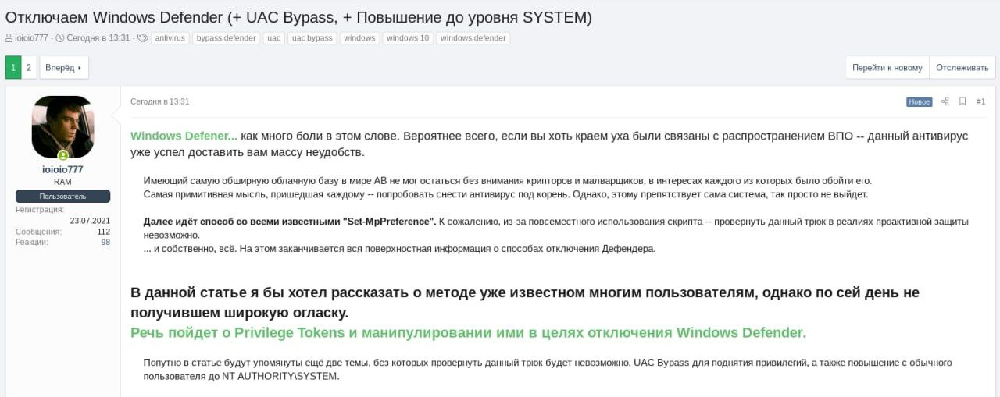

# cibsecurity
`2022-05-17`

* https://web.nvd.nist.gov/view/vuln/detail?vulnId=CVE-2022-30966

<blockquote>
‼ CVE-2022-30966 ‼

Jenkins Random String Parameter Plugin 1.0 and earlier does not escape the name and description of Random String parameters on views displaying parameters, resulting in a stored cross-site scripting (XSS) vulnerability exploitable by attackers with Item/Configure permission.

📖 Read

via &quot;National Vulnerability Database&quot;.
</blockquote>

---

# cibsecurity
`2022-05-17`

* https://web.nvd.nist.gov/view/vuln/detail?vulnId=CVE-2022-30960

<blockquote>
‼ CVE-2022-30960 ‼

Jenkins Application Detector Plugin 1.0.8 and earlier does not escape the name of Chois Application Version parameters on views displaying parameters, resulting in a stored cross-site scripting (XSS) vulnerability exploitable by attackers with Item/Configure permission.

📖 Read

via &quot;National Vulnerability Database&quot;.
</blockquote>

---

# cibsecurity
`2022-05-17`

* https://web.nvd.nist.gov/view/vuln/detail?vulnId=CVE-2022-30972

<blockquote>
‼ CVE-2022-30972 ‼

A cross-site request forgery (CSRF) vulnerability in Jenkins Storable Configs Plugin 1.0 and earlier allows attackers to have Jenkins parse a local XML file (e.g., archived artifacts) that uses external entities for extraction of secrets from the Jenkins controller or server-side request forgery.

📖 Read

via &quot;National Vulnerability Database&quot;.
</blockquote>

---

# cibsecurity
`2022-05-17`

* https://web.nvd.nist.gov/view/vuln/detail?vulnId=CVE-2022-30968

<blockquote>
‼ CVE-2022-30968 ‼

Jenkins vboxwrapper Plugin 1.3 and earlier does not escape the name and description of VBox node parameters on views displaying parameters, resulting in a stored cross-site scripting (XSS) vulnerability exploitable by attackers with Item/Configure permission.

📖 Read

via &quot;National Vulnerability Database&quot;.
</blockquote>

---

# cibsecurity
`2022-05-17`

* https://web.nvd.nist.gov/view/vuln/detail?vulnId=CVE-2022-30964

<blockquote>
‼ CVE-2022-30964 ‼

Jenkins Multiselect parameter Plugin 1.3 and earlier does not escape the name and description of Multiselect parameters on views displaying parameters, resulting in a stored cross-site scripting (XSS) vulnerability exploitable by attackers with Item/Configure permission.

📖 Read

via &quot;National Vulnerability Database&quot;.
</blockquote>

---

# cibsecurity
`2022-05-17`

* https://web.nvd.nist.gov/view/vuln/detail?vulnId=CVE-2022-30962

<blockquote>
‼ CVE-2022-30962 ‼

Jenkins Global Variable String Parameter Plugin 1.2 and earlier does not escape the name and description of Global Variable String parameters on views displaying parameters, resulting in a stored cross-site scripting (XSS) vulnerability exploitable by attackers with Item/Configure permission.

📖 Read

via &quot;National Vulnerability Database&quot;.
</blockquote>

---

# cibsecurity
`2022-05-17`

* https://web.nvd.nist.gov/view/vuln/detail?vulnId=CVE-2022-30956

<blockquote>
‼ CVE-2022-30956 ‼

Jenkins Rundeck Plugin 3.6.10 and earlier does not restrict URL schemes in Rundeck webhook submissions, resulting in a stored cross-site scripting (XSS) vulnerability exploitable by attackers able to submit crafted Rundeck webhook payloads.

📖 Read

via &quot;National Vulnerability Database&quot;.
</blockquote>

---

# cibsecurity
`2022-05-17`

* https://web.nvd.nist.gov/view/vuln/detail?vulnId=CVE-2022-30963

<blockquote>
‼ CVE-2022-30963 ‼

Jenkins JDK Parameter Plugin 1.0 and earlier does not escape the name and description of JDK parameters on views displaying parameters, resulting in a stored cross-site scripting (XSS) vulnerability exploitable by attackers with Item/Configure permission.

📖 Read

via &quot;National Vulnerability Database&quot;.
</blockquote>

---

# cibsecurity
`2022-05-17`

* https://web.nvd.nist.gov/view/vuln/detail?vulnId=CVE-2022-30961

<blockquote>
‼ CVE-2022-30961 ‼

Jenkins Autocomplete Parameter Plugin 1.1 and earlier does not escape the name of Dropdown Autocomplete and Auto Complete String parameters on views displaying parameters, resulting in a stored cross-site scripting (XSS) vulnerability exploitable by attackers with Item/Configure permission.

📖 Read

via &quot;National Vulnerability Database&quot;.
</blockquote>

---

# cibsecurity
`2022-05-17`

* https://web.nvd.nist.gov/view/vuln/detail?vulnId=CVE-2022-30970

<blockquote>
‼ CVE-2022-30970 ‼

Jenkins Autocomplete Parameter Plugin 1.1 and earlier references Dropdown Autocomplete parameter and Auto Complete String parameter names in an unsafe manner from Javascript embedded in view definitions, resulting in a stored cross-site scripting (XSS) vulnerability exploitable by attackers with Item/Configure permission.

📖 Read

via &quot;National Vulnerability Database&quot;.
</blockquote>

---

# cibsecurity
`2022-05-17`

* https://web.nvd.nist.gov/view/vuln/detail?vulnId=CVE-2022-1711

<blockquote>
‼ CVE-2022-1711 ‼

Server-Side Request Forgery (SSRF) in GitHub repository jgraph/drawio prior to 18.0.5.

📖 Read

via &quot;National Vulnerability Database&quot;.
</blockquote>

---

# cibsecurity
`2022-05-17`

* https://web.nvd.nist.gov/view/vuln/detail?vulnId=CVE-2022-1723

<blockquote>
‼ CVE-2022-1723 ‼

Server-Side Request Forgery (SSRF) in GitHub repository jgraph/drawio prior to 18.0.6.

📖 Read

via &quot;National Vulnerability Database&quot;.
</blockquote>

---

# cibsecurity
`2022-05-16`

* https://web.nvd.nist.gov/view/vuln/detail?vulnId=CVE-2022-23668

<blockquote>
‼ CVE-2022-23668 ‼

A remote authenticated server-side request forgery (ssrf) vulnerability was discovered in Aruba ClearPass Policy Manager version(s): 6.10.4 and below, 6.9.9 and below, 6.8.9-HF2 and below, 6.7.x and below. Aruba has released updates to ClearPass Policy Manage that address this security vulnerability.

📖 Read

via &quot;National Vulnerability Database&quot;.
</blockquote>

---

# cibsecurity
`2022-05-16`

* https://web.nvd.nist.gov/view/vuln/detail?vulnId=CVE-2022-23659

<blockquote>
‼ CVE-2022-23659 ‼

A remote reflected cross site scripting (xss) vulnerability was discovered in Aruba ClearPass Policy Manager version(s): 6.10.4 and below, 6.9.9 and below, 6.8.9-HF2 and below, 6.7.x and below. Aruba has released updates to ClearPass Policy Manager that address this security vulnerability.

📖 Read

via &quot;National Vulnerability Database&quot;.
</blockquote>

---

# cibsecurity
`2022-05-16`

* https://web.nvd.nist.gov/view/vuln/detail?vulnId=CVE-2021-27444

<blockquote>
‼ CVE-2021-27444 ‼

The Weintek cMT product line is vulnerable to various improper access controls, which may allow an unauthenticated attacker to remotely access and download sensitive information and perform administrative actions on behalf of a legitimate administrator.

📖 Read

via &quot;National Vulnerability Database&quot;.
</blockquote>

---

# cibsecurity
`2022-05-16`

* https://web.nvd.nist.gov/view/vuln/detail?vulnId=CVE-2021-27446

<blockquote>
‼ CVE-2021-27446 ‼

The Weintek cMT product line is vulnerable to code injection, which may allow an unauthenticated remote attacker to execute commands with root privileges on the operation system.

📖 Read

via &quot;National Vulnerability Database&quot;.
</blockquote>

---

# cibsecurity
`2022-05-16`

* https://web.nvd.nist.gov/view/vuln/detail?vulnId=CVE-2022-1731

<blockquote>
‼ CVE-2022-1731 ‼

Metasonic Doc WebClient 7.0.14.0 / 7.0.12.0 / 7.0.3.0 is vulnerable to a SQL injection attack in the username field. SSO or System authentication are required to be enabled for vulnerable conditions to exist.

📖 Read

via &quot;National Vulnerability Database&quot;.
</blockquote>

---

# cibsecurity
`2022-05-16`

* https://web.nvd.nist.gov/view/vuln/detail?vulnId=CVE-2022-30050

<blockquote>
‼ CVE-2022-30050 ‼

Gnuboard 5.55 and 5.56 is vulnerable to Cross Site Scripting (XSS) via bbs/member_confirm.php.

📖 Read

via &quot;National Vulnerability Database&quot;.
</blockquote>

---

# cibsecurity
`2022-05-16`

* https://web.nvd.nist.gov/view/vuln/detail?vulnId=CVE-2022-30776

<blockquote>
‼ CVE-2022-30776 ‼

atmail 6.5.0 allows XSS via the index.php/admin/index/ error parameter.

📖 Read

via &quot;National Vulnerability Database&quot;.
</blockquote>

---

# cibsecurity
`2022-05-16`

* https://web.nvd.nist.gov/view/vuln/detail?vulnId=CVE-2022-30777

<blockquote>
‼ CVE-2022-30777 ‼

Parallels H-Sphere 3.6.2 allows XSS via the index_en.php from parameter.

📖 Read

via &quot;National Vulnerability Database&quot;.
</blockquote>

---

# cibsecurity
`2022-05-16`

* https://web.nvd.nist.gov/view/vuln/detail?vulnId=CVE-2022-1722

<blockquote>
‼ CVE-2022-1722 ‼

SSRF in editor's proxy via IPv6 link-local address in GitHub repository jgraph/drawio prior to 18.0.5. SSRF to internal link-local IPv6 addresses

📖 Read

via &quot;National Vulnerability Database&quot;.
</blockquote>

---

# cibsecurity
`2022-05-16`

* https://web.nvd.nist.gov/view/vuln/detail?vulnId=CVE-2022-1726

<blockquote>
‼ CVE-2022-1726 ‼

Bootstrap Tables XSS vulnerability with Table Export plug-in when exportOptions: htmlContent is true in GitHub repository wenzhixin/bootstrap-table prior to 1.20.2. Disclosing session cookies, disclosing secure session data, exfiltrating data to third-parties.

📖 Read

via &quot;National Vulnerability Database&quot;.
</blockquote>

---

# cibsecurity
`2022-05-16`

* https://web.nvd.nist.gov/view/vuln/detail?vulnId=CVE-2022-30013

<blockquote>
‼ CVE-2022-30013 ‼

A stored cross-site scripting (XSS) vulnerability in the upload function of totaljs CMS 3.4.5 allows attackers to execute arbitrary web scripts via a JavaScript embedded PDF file.

📖 Read

via &quot;National Vulnerability Database&quot;.
</blockquote>

---

# cibsecurity
`2022-05-16`

* https://web.nvd.nist.gov/view/vuln/detail?vulnId=CVE-2022-1713

<blockquote>
‼ CVE-2022-1713 ‼

SSRF on /proxy in GitHub repository jgraph/drawio prior to 18.0.4. An attacker can make a request as the server and read its contents. This can lead to a leak of sensitive information.

📖 Read

via &quot;National Vulnerability Database&quot;.
</blockquote>

---

# cibsecurity
`2022-05-16`

* https://web.nvd.nist.gov/view/vuln/detail?vulnId=CVE-2021-42897

<blockquote>
‼ CVE-2021-42897 ‼

A remote command execution (RCE) vulnerability was found in FeMiner wms V1.0 in /wms/src/system/datarec.php. The $_POST[r_name] is directly passed into the $mysqlstr and is executed by exec.

📖 Read

via &quot;National Vulnerability Database&quot;.
</blockquote>

---

# freedomf0x
`2022-05-16`

<blockquote>
&#35;Laravel RCE exploit. CVE-2018-15133

https://github.com/PwnedShell/Larascript
</blockquote>

---

# cibsecurity
`2022-05-16`

* https://web.nvd.nist.gov/view/vuln/detail?vulnId=CVE-2022-30012

<blockquote>
‼ CVE-2022-30012 ‼

In the POST request of the appointment.php page of HMS v.0, there are SQL injection vulnerabilities in multiple parameters, and database information can be obtained through injection.

📖 Read

via &quot;National Vulnerability Database&quot;.
</blockquote>

---

# cibsecurity
`2022-05-16`

* https://web.nvd.nist.gov/view/vuln/detail?vulnId=CVE-2022-30011

<blockquote>
‼ CVE-2022-30011 ‼

In HMS 1.0 when requesting appointment.php through POST, multiple parameters can lead to a SQL injection vulnerability.

📖 Read

via &quot;National Vulnerability Database&quot;.
</blockquote>

---

# cibsecurity
`2022-05-16`

* https://web.nvd.nist.gov/view/vuln/detail?vulnId=CVE-2022-30765

<blockquote>
‼ CVE-2022-30765 ‼

Calibre-Web before 0.6.18 allows user table SQL Injection.

📖 Read

via &quot;National Vulnerability Database&quot;.
</blockquote>

---

# cibsecurity
`2022-05-16`

* https://web.nvd.nist.gov/view/vuln/detail?vulnId=CVE-2022-30770

<blockquote>
‼ CVE-2022-30770 ‼

Terminalfour before 8.3.8 allows XSS, aka RDSM-31817. 8.2.18.2.1 and 8.2.18.5 are also fixed versions.

📖 Read

via &quot;National Vulnerability Database&quot;.
</blockquote>

---

# cibsecurity
`2022-05-15`

* https://web.nvd.nist.gov/view/vuln/detail?vulnId=CVE-2021-41965

<blockquote>
‼ CVE-2021-41965 ‼

A SQL injection vulnerability exists in ChurchCRM version 2.0.0 to 4.4.5 that allows an authenticated attacker to issue an arbitrary SQL command to the database through the unsanitized EN_tyid, theID and EID fields used when an Edit action on an existing record is being performed.

📖 Read

via &quot;National Vulnerability Database&quot;.
</blockquote>

---

# cibsecurity
`2022-05-14`

* https://web.nvd.nist.gov/view/vuln/detail?vulnId=CVE-2022-1379

<blockquote>
‼ CVE-2022-1379 ‼

URL Restriction Bypass in GitHub repository plantuml/plantuml prior to V1.2022.5. An attacker can abuse this to bypass URL restrictions that are imposed by the different security profiles and achieve server side request forgery (SSRF). This allows accessing restricted internal resources/servers or sending requests to third party servers.

📖 Read

via &quot;National Vulnerability Database&quot;.
</blockquote>

---

# cibsecurity
`2022-05-14`

* https://web.nvd.nist.gov/view/vuln/detail?vulnId=CVE-2022-24831

<blockquote>
‼ CVE-2022-24831 ‼

OpenClinica is an open source software for Electronic Data Capture (EDC) and Clinical Data Management (CDM). Versions prior to 3.16.1 are vulnerable to SQL injection due to the use of string concatenation to create SQL queries instead of prepared statements. No known workarounds exist. This issue has been patched in 3.16.1, 3.15.9, 3.14.1, and 3.13.1 and users are advised to upgrade.

📖 Read

via &quot;National Vulnerability Database&quot;.
</blockquote>

---

# cibsecurity
`2022-05-13`

* https://web.nvd.nist.gov/view/vuln/detail?vulnId=CVE-2022-29433

<blockquote>
‼ CVE-2022-29433 ‼

Authenticated (contributor or higher role) Cross-Site Scripting (XSS) vulnerability in Donations plugin &lt;&#61; 1.8 on WordPress.

📖 Read

via &quot;National Vulnerability Database&quot;.
</blockquote>

---

# cibsecurity
`2022-05-13`

* https://web.nvd.nist.gov/view/vuln/detail?vulnId=CVE-2022-30415

<blockquote>
‼ CVE-2022-30415 ‼

Covid-19 Travel Pass Management System v1.0 is vulnerable to SQL Injection via /ctpms/admin/applications/update_status.php?id&#61;.

📖 Read

via &quot;National Vulnerability Database&quot;.
</blockquote>

---

# cibsecurity
`2022-05-13`

* https://web.nvd.nist.gov/view/vuln/detail?vulnId=CVE-2022-30396

<blockquote>
‼ CVE-2022-30396 ‼

Merchandise Online Store v1.0 is vulnerable to SQL Injection via /vloggers_merch/admin/?page&#61;inventory/manage_inventory&amp;id&#61;.

📖 Read

via &quot;National Vulnerability Database&quot;.
</blockquote>

---

# cibsecurity
`2022-05-13`

* https://web.nvd.nist.gov/view/vuln/detail?vulnId=CVE-2022-30376

<blockquote>
‼ CVE-2022-30376 ‼

Sourcecodester Simple Social Networking Site v1.0 is vulnerable to SQL Injection via /sns/admin/members/view_member.php?id&#61;.

📖 Read

via &quot;National Vulnerability Database&quot;.
</blockquote>

---

# cibsecurity
`2022-05-13`

* https://web.nvd.nist.gov/view/vuln/detail?vulnId=CVE-2022-30391

<blockquote>
‼ CVE-2022-30391 ‼

Merchandise Online Store v1.0 is vulnerable to SQL Injection via /vloggers_merch/classes/Master.php?f&#61;delete_category.

📖 Read

via &quot;National Vulnerability Database&quot;.
</blockquote>

---

# cibsecurity
`2022-05-13`

* https://web.nvd.nist.gov/view/vuln/detail?vulnId=CVE-2022-29854

<blockquote>
‼ CVE-2022-29854 ‼

A vulnerability in Mitel 6900 Series IP (MiNet) phones excluding 6970, versions 1.8 (1.8.0.12) and earlier, could allow a unauthenticated attacker with physical access to the phone to gain root access due to insufficient access control for test functionality during system startup. A successful exploit could allow access to sensitive information and code execution.

📖 Read

via &quot;National Vulnerability Database&quot;.
</blockquote>

---

# cibsecurity
`2022-05-13`

* https://web.nvd.nist.gov/view/vuln/detail?vulnId=CVE-2022-30379

<blockquote>
‼ CVE-2022-30379 ‼

Sourcecodester Simple Social Networking Site v1.0 is vulnerable to SQL Injection via /sns/admin/?page&#61;user/manage_user&amp;id&#61;.

📖 Read

via &quot;National Vulnerability Database&quot;.
</blockquote>

---

# cibsecurity
`2022-05-13`

* https://web.nvd.nist.gov/view/vuln/detail?vulnId=CVE-2022-30401

<blockquote>
‼ CVE-2022-30401 ‼

Merchandise Online Store v1.0 is vulnerable to SQL Injection via /vloggers_merch/?p&#61;view_product&amp;id&#61;.

📖 Read

via &quot;National Vulnerability Database&quot;.
</blockquote>

---

# cibsecurity
`2022-05-13`

* https://web.nvd.nist.gov/view/vuln/detail?vulnId=CVE-2022-30392

<blockquote>
‼ CVE-2022-30392 ‼

Merchandise Online Store v1.0 is vulnerable to SQL Injection via /vloggers_merch/classes/Master.php?f&#61;delete_sub_category.

📖 Read

via &quot;National Vulnerability Database&quot;.
</blockquote>

---

# cibsecurity
`2022-05-13`

* https://web.nvd.nist.gov/view/vuln/detail?vulnId=CVE-2022-30402

<blockquote>
‼ CVE-2022-30402 ‼

Merchandise Online Store v1.0 is vulnerable to SQL Injection via /vloggers_merch/admin/?page&#61;maintenance/manage_sub_category&amp;id&#61;.

📖 Read

via &quot;National Vulnerability Database&quot;.
</blockquote>

---

# cibsecurity
`2022-05-13`

* https://web.nvd.nist.gov/view/vuln/detail?vulnId=CVE-2022-30403

<blockquote>
‼ CVE-2022-30403 ‼

Merchandise Online Store v1.0 is vulnerable to SQL Injection via /vloggers_merch/?p&#61;products&amp;c&#61;.

📖 Read

via &quot;National Vulnerability Database&quot;.
</blockquote>

---

# cibsecurity
`2022-05-13`

* https://web.nvd.nist.gov/view/vuln/detail?vulnId=CVE-2022-30395

<blockquote>
‼ CVE-2022-30395 ‼

Merchandise Online Store v1.0 is vulnerable to SQL Injection via /vloggers_merch/classes/Master.php?f&#61;delete_cart.

📖 Read

via &quot;National Vulnerability Database&quot;.
</blockquote>

---

# cibsecurity
`2022-05-13`

* https://web.nvd.nist.gov/view/vuln/detail?vulnId=CVE-2022-30399

<blockquote>
‼ CVE-2022-30399 ‼

Merchandise Online Store v1.0 is vulnerable to SQL Injection via /vloggers_merch/admin/?page&#61;maintenance/manage_category&amp;id&#61;.

📖 Read

via &quot;National Vulnerability Database&quot;.
</blockquote>

---

# cibsecurity
`2022-05-13`

* https://web.nvd.nist.gov/view/vuln/detail?vulnId=CVE-2022-30411

<blockquote>
‼ CVE-2022-30411 ‼

Covid-19 Travel Pass Management System v1.0 is vulnerable to SQL Injection via /ctpms/admin/?page&#61;individuals/view_individual&amp;id&#61;.

📖 Read

via &quot;National Vulnerability Database&quot;.
</blockquote>

---

# cibsecurity
`2022-05-13`

* https://web.nvd.nist.gov/view/vuln/detail?vulnId=CVE-2022-30393

<blockquote>
‼ CVE-2022-30393 ‼

Merchandise Online Store v1.0 is vulnerable to SQL Injection via /vloggers_merch/admin/?page&#61;product/manage_product&amp;id&#61;.

📖 Read

via &quot;National Vulnerability Database&quot;.
</blockquote>

---

# cibsecurity
`2022-05-13`

* https://web.nvd.nist.gov/view/vuln/detail?vulnId=CVE-2022-30400

<blockquote>
‼ CVE-2022-30400 ‼

Merchandise Online Store v1.0 is vulnerable to SQL Injection via /vloggers_merch/admin/orders/view_order.php?view&#61;user&amp;id&#61;.

📖 Read

via &quot;National Vulnerability Database&quot;.
</blockquote>

---

# cibsecurity
`2022-05-13`

* https://web.nvd.nist.gov/view/vuln/detail?vulnId=CVE-2022-30404

<blockquote>
‼ CVE-2022-30404 ‼

College Management System v1.0 is vulnerable to SQL Injection via /College_Management_System/admin/display-teacher.php?teacher_id&#61;.

📖 Read

via &quot;National Vulnerability Database&quot;.
</blockquote>

---

# cibsecurity
`2022-05-13`

* https://web.nvd.nist.gov/view/vuln/detail?vulnId=CVE-2022-30387

<blockquote>
‼ CVE-2022-30387 ‼

Merchandise Online Store v1.0 is vulnerable to SQL Injection via /vloggers_merch/classes/Master.php?f&#61;pay_order.

📖 Read

via &quot;National Vulnerability Database&quot;.
</blockquote>

---

# cibsecurity
`2022-05-13`

* https://web.nvd.nist.gov/view/vuln/detail?vulnId=CVE-2022-30412

<blockquote>
‼ CVE-2022-30412 ‼

Covid-19 Travel Pass Management System v1.0 is vulnerable to SQL Injection via /ctpms/admin/individuals/update_status.php?id&#61;.

📖 Read

via &quot;National Vulnerability Database&quot;.
</blockquote>

---

# cibsecurity
`2022-05-13`

* https://web.nvd.nist.gov/view/vuln/detail?vulnId=CVE-2022-30398

<blockquote>
‼ CVE-2022-30398 ‼

Merchandise Online Store v1.0 is vulnerable to SQL Injection via /vloggers_merch/admin/?page&#61;orders/view_order&amp;id&#61;.

📖 Read

via &quot;National Vulnerability Database&quot;.
</blockquote>

---

# cibsecurity
`2022-05-13`

* https://web.nvd.nist.gov/view/vuln/detail?vulnId=CVE-2022-30384

<blockquote>
‼ CVE-2022-30384 ‼

Merchandise Online Store v1.0 is vulnerable to SQL Injection via /vloggers_merch/classes/Master.php?f&#61;delete_inventory.

📖 Read

via &quot;National Vulnerability Database&quot;.
</blockquote>

---

# cibsecurity
`2022-05-13`

* https://web.nvd.nist.gov/view/vuln/detail?vulnId=CVE-2022-30417

<blockquote>
‼ CVE-2022-30417 ‼

Covid-19 Travel Pass Management System v1.0 is vulnerable to SQL Injection via ctpms/admin/?page&#61;user/manage_user&amp;id&#61;.

📖 Read

via &quot;National Vulnerability Database&quot;.
</blockquote>

---

# cibsecurity
`2022-05-13`

* https://web.nvd.nist.gov/view/vuln/detail?vulnId=CVE-2022-30386

<blockquote>
‼ CVE-2022-30386 ‼

Merchandise Online Store v1.0 is vulnerable to SQL Injection via /vloggers_merch/classes/Master.php?f&#61;delete_featured.

📖 Read

via &quot;National Vulnerability Database&quot;.
</blockquote>

---

# cibsecurity
`2022-05-13`

* https://web.nvd.nist.gov/view/vuln/detail?vulnId=CVE-2022-30373

<blockquote>
‼ CVE-2022-30373 ‼

Air Cargo Management System 1.0 is vulnerable to SQL Injection via /acms/admin/cargo_types/manage_cargo_type.php?id&#61;.

📖 Read

via &quot;National Vulnerability Database&quot;.
</blockquote>

---

# cibsecurity
`2022-05-13`

* https://web.nvd.nist.gov/view/vuln/detail?vulnId=CVE-2022-30489

<blockquote>
‼ CVE-2022-30489 ‼

WAVLINK WN535 G3 was discovered to contain a cross-site scripting (XSS) vulnerability via the hostname parameter at /cgi-bin/login.cgi.

📖 Read

via &quot;National Vulnerability Database&quot;.
</blockquote>

---

# cibsecurity
`2022-05-13`

* https://web.nvd.nist.gov/view/vuln/detail?vulnId=CVE-2022-29383

<blockquote>
‼ CVE-2022-29383 ‼

NETGEAR ProSafe SSL VPN firmware FVS336Gv2 and FVS336Gv3 was discovered to contain a SQL injection vulnerability via USERDBDomains.Domainname at cgi-bin/platform.cgi.

📖 Read

via &quot;National Vulnerability Database&quot;.
</blockquote>

---

# cibsecurity
`2022-05-13`

* https://web.nvd.nist.gov/view/vuln/detail?vulnId=CVE-2021-42967

<blockquote>
‼ CVE-2021-42967 ‼

Unrestricted file upload in /novel-admin/src/main/java/com/java2nb/common/controller/FileController.java in novel-plus all versions allows allows an attacker to upload malicious JSP files.

📖 Read

via &quot;National Vulnerability Database&quot;.
</blockquote>

---

# cibsecurity
`2022-05-13`

* https://web.nvd.nist.gov/view/vuln/detail?vulnId=CVE-2022-30374

<blockquote>
‼ CVE-2022-30374 ‼

Air Cargo Management System 1.0 is vulnerable to SQL Injection via /acms/admin/?page&#61;transactions/manage_transaction&amp;id&#61;.

📖 Read

via &quot;National Vulnerability Database&quot;.
</blockquote>

---

# cibsecurity
`2022-05-13`

* https://web.nvd.nist.gov/view/vuln/detail?vulnId=CVE-2022-30370

<blockquote>
‼ CVE-2022-30370 ‼

Air Cargo Management System 1.0 is vulnerable to SQL Injection via /acms/classes/Master.php?f&#61;delete_cargo_type.

📖 Read

via &quot;National Vulnerability Database&quot;.
</blockquote>

---

# cibsecurity
`2022-05-13`

* https://web.nvd.nist.gov/view/vuln/detail?vulnId=CVE-2022-30371

<blockquote>
‼ CVE-2022-30371 ‼

Air Cargo Management System 1.0 is vulnerable to SQL Injection via /acms/admin/cargo_types/view_cargo_type.php?id&#61;.

📖 Read

via &quot;National Vulnerability Database&quot;.
</blockquote>

---

# cibsecurity
`2022-05-13`

* https://web.nvd.nist.gov/view/vuln/detail?vulnId=CVE-2022-30372

<blockquote>
‼ CVE-2022-30372 ‼

Air Cargo Management System 1.0 is vulnerable to SQL Injection via /acms/classes/Master.php?f&#61;delete_cargo.

📖 Read

via &quot;National Vulnerability Database&quot;.
</blockquote>

---

# cibsecurity
`2022-05-13`

* https://web.nvd.nist.gov/view/vuln/detail?vulnId=CVE-2020-22983

<blockquote>
‼ CVE-2020-22983 ‼

A Server-Side Request Forgery (SSRF) vulnerability exists in MicroStrategy Web SDK 11.1 and earlier, allows remote unauthenticated attackers to conduct a server-side request forgery (SSRF) attack via the srcURL parameter to the shortURL task.

📖 Read

via &quot;National Vulnerability Database&quot;.
</blockquote>

---

# cibsecurity
`2022-05-12`

* https://web.nvd.nist.gov/view/vuln/detail?vulnId=CVE-2020-22985

<blockquote>
‼ CVE-2020-22985 ‼

Cross-Site Scripting (XSS) vulnerability in MicroStrategy Web SDK 10.11 and earlier, allows remote unauthenticated attackers to execute arbitrary code via the key parameter to the getESRIExtraConfig task.

📖 Read

via &quot;National Vulnerability Database&quot;.
</blockquote>

---

# cibsecurity
`2022-05-12`

* https://web.nvd.nist.gov/view/vuln/detail?vulnId=CVE-2022-23166

<blockquote>
‼ CVE-2022-23166 ‼

Sysaid – Sysaid Local File Inclusion (LFI) – An unauthenticated attacker can access to the system by accessing to &quot;/lib/tinymce/examples/index.html&quot; path. in the &quot;Insert/Edit Embedded Media&quot; window Choose Type : iFrame and File/URL : [here is the LFI] Solution: Update to 22.2.20 cloud version, or to 22.1.64 on premise version.

📖 Read

via &quot;National Vulnerability Database&quot;.
</blockquote>

---

# cibsecurity
`2022-05-12`

* https://web.nvd.nist.gov/view/vuln/detail?vulnId=CVE-2020-22986

<blockquote>
‼ CVE-2020-22986 ‼

Cross-Site Scripting (XSS) vulnerability in MicroStrategy Web SDK 10.11 and earlier, allows remote unauthenticated attackers to execute arbitrary code via the searchString parameter to the wikiScrapper task.

📖 Read

via &quot;National Vulnerability Database&quot;.
</blockquote>

---

# cibsecurity
`2022-05-12`

* https://web.nvd.nist.gov/view/vuln/detail?vulnId=CVE-2022-23165

<blockquote>
‼ CVE-2022-23165 ‼

Sysaid – Sysaid 14.2.0 Reflected Cross-Site Scripting (XSS) - The parameter &quot;helpPageName&quot; used by the page &quot;/help/treecontent.jsp&quot; suffers from a Reflected Cross-Site Scripting vulnerability. For an attacker to exploit this Cross-Site Scripting vulnerability, it's necessary for the affected product to expose the Offline Help Pages. An attacker may gain access to sensitive information or execute client-side code in the browser session of the victim user. Furthermore, an attacker would require the victim to open a malicious link. An attacker may exploit this vulnerability in order to perform phishing attacks. The attacker can receive sensitive data like server details, usernames, workstations, etc. He can also perform actions such as uploading files, deleting calls from the system

📖 Read

via &quot;National Vulnerability Database&quot;.
</blockquote>

---

# cibsecurity
`2022-05-12`

* https://web.nvd.nist.gov/view/vuln/detail?vulnId=CVE-2020-22987

<blockquote>
‼ CVE-2020-22987 ‼

Cross-Site Scripting (XSS) vulnerability in MicroStrategy Web SDK 10.11 and earlier, allows remote unauthenticated attackers to execute arbitrary code via the fileToUpload parameter to the uploadFile task.

📖 Read

via &quot;National Vulnerability Database&quot;.
</blockquote>

---

# cibsecurity
`2022-05-12`

* https://web.nvd.nist.gov/view/vuln/detail?vulnId=CVE-2020-22984

<blockquote>
‼ CVE-2020-22984 ‼

Cross-Site Scripting (XSS) vulnerability in MicroStrategy Web SDK 10.11 and earlier, allows remote unauthenticated attackers to execute arbitrary code via key parameter to the getGoogleExtraConfig task.

📖 Read

via &quot;National Vulnerability Database&quot;.
</blockquote>

---

# cibsecurity
`2022-05-12`

* https://web.nvd.nist.gov/view/vuln/detail?vulnId=CVE-2022-28818

<blockquote>
‼ CVE-2022-28818 ‼

ColdFusion versions CF2021U3 (and earlier) and CF2018U13 are affected by a reflected Cross-Site Scripting (XSS) vulnerability. If an attacker is able to convince a victim to visit a URL referencing a vulnerable page, malicious JavaScript content may be executed within the context of the victim's browser.

📖 Read

via &quot;National Vulnerability Database&quot;.
</blockquote>

---

# cibsecurity
`2022-05-12`

* https://web.nvd.nist.gov/view/vuln/detail?vulnId=CVE-2022-27172

<blockquote>
‼ CVE-2022-27172 ‼

A hard-coded password vulnerability exists in the console infactory functionality of InHand Networks InRouter302 V3.5.37. A specially-crafted network request can lead to privileged operation execution. An attacker can send a sequence of requests to trigger this vulnerability.

📖 Read

via &quot;National Vulnerability Database&quot;.
</blockquote>

---

# cibsecurity
`2022-05-12`

* https://web.nvd.nist.gov/view/vuln/detail?vulnId=CVE-2022-30002

<blockquote>
‼ CVE-2022-30002 ‼

Insurance Management System 1.0 is vulnerable to SQL Injection via /insurance/editNominee.php?nominee_id&#61;.

📖 Read

via &quot;National Vulnerability Database&quot;.
</blockquote>

---

# cibsecurity
`2022-05-12`

* https://web.nvd.nist.gov/view/vuln/detail?vulnId=CVE-2022-30000

<blockquote>
‼ CVE-2022-30000 ‼

Insurance Management System 1.0 is vulnerable to SQL Injection via /insurance/editPayment.php?recipt_no&#61;.

📖 Read

via &quot;National Vulnerability Database&quot;.
</blockquote>

---

# cibsecurity
`2022-05-12`

* https://web.nvd.nist.gov/view/vuln/detail?vulnId=CVE-2022-29745

<blockquote>
‼ CVE-2022-29745 ‼

Money Transfer Management System 1.0 is vulnerable to SQL Injection via \mtms\classes\Master.php?f&#61;delete_transaction.

📖 Read

via &quot;National Vulnerability Database&quot;.
</blockquote>

---

# cibsecurity
`2022-05-12`

* https://web.nvd.nist.gov/view/vuln/detail?vulnId=CVE-2022-26780

<blockquote>
‼ CVE-2022-26780 ‼

Multiple improper input validation vulnerabilities exists in the libnvram.so nvram_import functionality of InHand Networks InRouter302 V3.5.4. A specially-crafted file can lead to remote code execution. An attacker can send a sequence of requests to trigger this vulnerability.An improper input validation vulnerability exists in the `httpd`'s `user_define_init` function. Controlling the `user_define_timeout` nvram variable can lead to remote code execution.

📖 Read

via &quot;National Vulnerability Database&quot;.
</blockquote>

---

# cibsecurity
`2022-05-12`

* https://web.nvd.nist.gov/view/vuln/detail?vulnId=CVE-2021-0126

<blockquote>
‼ CVE-2021-0126 ‼

Improper input validation for the Intel(R) Manageability Commander before version 2.2 may allow an authenticated user to potentially enable escalation of privilege via adjacent access.

📖 Read

via &quot;National Vulnerability Database&quot;.
</blockquote>

---

# cibsecurity
`2022-05-12`

* https://web.nvd.nist.gov/view/vuln/detail?vulnId=CVE-2022-29739

<blockquote>
‼ CVE-2022-29739 ‼

Money Transfer Management System 1.0 is vulnerable to SQL Injection via /mtms/admin/?page&#61;user/manage_user&amp;id&#61;.

📖 Read

via &quot;National Vulnerability Database&quot;.
</blockquote>

---

# cibsecurity
`2022-05-12`

* https://web.nvd.nist.gov/view/vuln/detail?vulnId=CVE-2022-22413

<blockquote>
‼ CVE-2022-22413 ‼

IBM Robotic Process Automation 21.0.0, 21.0.1, and 21.0.2 is vulnerable to SQL injection. A remote attacker could send specially crafted SQL statements, which could allow the attacker to view, add, modify or delete information in the back-end database. IBM X-Force ID: 223022.

📖 Read

via &quot;National Vulnerability Database&quot;.
</blockquote>

---

# cibsecurity
`2022-05-12`

* https://web.nvd.nist.gov/view/vuln/detail?vulnId=CVE-2022-29998

<blockquote>
‼ CVE-2022-29998 ‼

Insurance Management System 1.0 is vulnerable to SQL Injection via /insurance/clientStatus.php?client_id&#61;.

📖 Read

via &quot;National Vulnerability Database&quot;.
</blockquote>

---

# cibsecurity
`2022-05-12`

* https://web.nvd.nist.gov/view/vuln/detail?vulnId=CVE-2021-33108

<blockquote>
‼ CVE-2021-33108 ‼

Improper input validation in the Intel(R) In-Band Manageability software before version 2.13.0 may allow a privileged user to potentially enable escalation of privilege via local access.

📖 Read

via &quot;National Vulnerability Database&quot;.
</blockquote>

---

# cibsecurity
`2022-05-12`

* https://web.nvd.nist.gov/view/vuln/detail?vulnId=CVE-2022-0004

<blockquote>
‼ CVE-2022-0004 ‼

Hardware debug modes and processor INIT setting that allow override of locks for some Intel(R) Processors in Intel(R) Boot Guard and Intel(R) TXT may allow an unauthenticated user to potentially enable escalation of privilege via physical access.

📖 Read

via &quot;National Vulnerability Database&quot;.
</blockquote>

---

# cibsecurity
`2022-05-12`

* https://web.nvd.nist.gov/view/vuln/detail?vulnId=CVE-2021-33080

<blockquote>
‼ CVE-2021-33080 ‼

Exposure of sensitive system information due to uncleared debug information in firmware for some Intel(R) SSD DC, Intel(R) Optane(TM) SSD and Intel(R) Optane(TM) SSD DC Products may allow an unauthenticated user to potentially enable information disclosure or escalation of privilege via physical access.

📖 Read

via &quot;National Vulnerability Database&quot;.
</blockquote>

---

# cibsecurity
`2022-05-12`

* https://web.nvd.nist.gov/view/vuln/detail?vulnId=CVE-2021-33077

<blockquote>
‼ CVE-2021-33077 ‼

Insufficient control flow management in firmware for some Intel(R) SSD, Intel(R) Optane(TM) SSD and Intel(R) SSD DC Products may allow an unauthenticated user to potentially enable escalation of privilege via physical access.

📖 Read

via &quot;National Vulnerability Database&quot;.
</blockquote>

---

# cibsecurity
`2022-05-12`

* https://web.nvd.nist.gov/view/vuln/detail?vulnId=CVE-2022-21136

<blockquote>
‼ CVE-2022-21136 ‼

Improper input validation for some Intel(R) Xeon(R) Processors may allow a privileged user to potentially enable denial of service via local access.

📖 Read

via &quot;National Vulnerability Database&quot;.
</blockquote>

---

# cibsecurity
`2022-05-12`

* https://web.nvd.nist.gov/view/vuln/detail?vulnId=CVE-2021-33074

<blockquote>
‼ CVE-2021-33074 ‼

Protection mechanism failure in firmware for some Intel(R) SSD, Intel(R) SSD DC and Intel(R) Optane(TM) SSD Products may allow an unauthenticated user to potentially enable information disclosure via physical access.

📖 Read

via &quot;National Vulnerability Database&quot;.
</blockquote>

---

# cibsecurity
`2022-05-12`

* https://web.nvd.nist.gov/view/vuln/detail?vulnId=CVE-2021-33082

<blockquote>
‼ CVE-2021-33082 ‼

Sensitive information in resource not removed before reuse in firmware for some Intel(R) SSD and Intel(R) Optane(TM) SSD Products may allow an unauthenticated user to potentially enable information disclosure via physical access.

📖 Read

via &quot;National Vulnerability Database&quot;.
</blockquote>

---

# cibsecurity
`2022-05-12`

* https://web.nvd.nist.gov/view/vuln/detail?vulnId=CVE-2022-29993

<blockquote>
‼ CVE-2022-29993 ‼

Online Sports Complex Booking System 1.0 is vulnerable to SQL Injection via /scbs/admin/bookings/view_booking.php?id&#61;.

📖 Read

via &quot;National Vulnerability Database&quot;.
</blockquote>

---

# cibsecurity
`2022-05-12`

* https://web.nvd.nist.gov/view/vuln/detail?vulnId=CVE-2022-29748

<blockquote>
‼ CVE-2022-29748 ‼

Simple Client Management System 1.0 is vulnerable to SQL Injection via \cms\admin?page&#61;client/manage_client&amp;id&#61;.

📖 Read

via &quot;National Vulnerability Database&quot;.
</blockquote>

---

# cibsecurity
`2022-05-12`

* https://web.nvd.nist.gov/view/vuln/detail?vulnId=CVE-2022-29750

<blockquote>
‼ CVE-2022-29750 ‼

Simple Client Management System 1.0 is vulnerable to SQL Injection via /cms/classes/Master.php?f&#61;delete_service.

📖 Read

via &quot;National Vulnerability Database&quot;.
</blockquote>

---

# cibsecurity
`2022-05-12`

* https://web.nvd.nist.gov/view/vuln/detail?vulnId=CVE-2022-29539

<blockquote>
‼ CVE-2022-29539 ‼

resi-calltrace in RESI Gemini-Net 4.2 is affected by OS Command Injection. It does not properly check the parameters sent as input before they are processed on the server. Due to the lack of validation of user input, an unauthenticated attacker can bypass the syntax intended by the software (e.g., concatenate `&amp;|;\r\ commands) and inject arbitrary system commands with the privileges of the application user.

📖 Read

via &quot;National Vulnerability Database&quot;.
</blockquote>

---

# cibsecurity
`2022-05-12`

* https://web.nvd.nist.gov/view/vuln/detail?vulnId=CVE-2022-29538

<blockquote>
‼ CVE-2022-29538 ‼

RESI Gemini-Net Web 4.2 is affected by Improper Access Control in authorization logic. An unauthenticated user is able to access some critical resources.

📖 Read

via &quot;National Vulnerability Database&quot;.
</blockquote>

---

# cibsecurity
`2022-05-12`

* https://web.nvd.nist.gov/view/vuln/detail?vulnId=CVE-2022-29985

<blockquote>
‼ CVE-2022-29985 ‼

Online Sports Complex Booking System 1.0 is vulnerable to SQL Injection via \scbs\classes\Master.php?f&#61;delete_category.

📖 Read

via &quot;National Vulnerability Database&quot;.
</blockquote>

---

# cibsecurity
`2022-05-12`

* https://web.nvd.nist.gov/view/vuln/detail?vulnId=CVE-2022-29994

<blockquote>
‼ CVE-2022-29994 ‼

Online Sports Complex Booking System 1.0 is vulnerable to SQL Injection via /scbs/admin/?page&#61;facilities/manage_facility&amp;id&#61;.

📖 Read

via &quot;National Vulnerability Database&quot;.
</blockquote>

---

# cibsecurity
`2022-05-12`

* https://web.nvd.nist.gov/view/vuln/detail?vulnId=CVE-2022-29747

<blockquote>
‼ CVE-2022-29747 ‼

Simple Client Management System 1.0 is vulnerable to SQL Injection via /cms/admin/?page&#61;invoice/manage_invoice&amp;id&#61; // Leak place ---&gt; id.

📖 Read

via &quot;National Vulnerability Database&quot;.
</blockquote>

---

# cibsecurity
`2022-05-12`

* https://web.nvd.nist.gov/view/vuln/detail?vulnId=CVE-2022-29987

<blockquote>
‼ CVE-2022-29987 ‼

Online Sports Complex Booking System 1.0 is vulnerable to SQL Injection via /scbs/admin/?page&#61;user/manage_user&amp;id&#61;.

📖 Read

via &quot;National Vulnerability Database&quot;.
</blockquote>

---

# cibsecurity
`2022-05-12`

* https://web.nvd.nist.gov/view/vuln/detail?vulnId=CVE-2022-29981

<blockquote>
‼ CVE-2022-29981 ‼

Simple Client Management System 1.0 is vulnerable to SQL Injection via /cms/classes/Users.php?f&#61;delete.

📖 Read

via &quot;National Vulnerability Database&quot;.
</blockquote>

---

# cibsecurity
`2022-05-12`

* https://web.nvd.nist.gov/view/vuln/detail?vulnId=CVE-2022-29995

<blockquote>
‼ CVE-2022-29995 ‼

Online Sports Complex Booking System 1.0 is vulnerable to SQL Injection via /scbs/admin/?page&#61;clients/manage_client&amp;id&#61;.

📖 Read

via &quot;National Vulnerability Database&quot;.
</blockquote>

---

# cibsecurity
`2022-05-12`

* https://web.nvd.nist.gov/view/vuln/detail?vulnId=CVE-2022-29983

<blockquote>
‼ CVE-2022-29983 ‼

Simple Client Management System 1.0 is vulnerable to SQL Injection via /cms/admin/?page&#61;invoice/view_invoice&amp;id&#61;.

📖 Read

via &quot;National Vulnerability Database&quot;.
</blockquote>

---

# cibsecurity
`2022-05-12`

* https://web.nvd.nist.gov/view/vuln/detail?vulnId=CVE-2022-29988

<blockquote>
‼ CVE-2022-29988 ‼

Online Sports Complex Booking System 1.0 is vulnerable to SQL Injection via \scbs\classes\Master.php?f&#61;delete.

📖 Read

via &quot;National Vulnerability Database&quot;.
</blockquote>

---

# cibsecurity
`2022-05-12`

* https://web.nvd.nist.gov/view/vuln/detail?vulnId=CVE-2022-29986

<blockquote>
‼ CVE-2022-29986 ‼

Online Sports Complex Booking System 1.0 is vulnerable to SQL Injection via \scbs\classes\Master.php?f&#61;delete_facility.

📖 Read

via &quot;National Vulnerability Database&quot;.
</blockquote>

---

# cibsecurity
`2022-05-12`

* https://web.nvd.nist.gov/view/vuln/detail?vulnId=CVE-2022-29980

<blockquote>
‼ CVE-2022-29980 ‼

Simple Client Management System 1.0 is vulnerable to SQL Injection via /cms/admin/?page&#61;user/manage_user&amp;id&#61;.

📖 Read

via &quot;National Vulnerability Database&quot;.
</blockquote>

---

# cibsecurity
`2022-05-12`

* https://web.nvd.nist.gov/view/vuln/detail?vulnId=CVE-2022-29992

<blockquote>
‼ CVE-2022-29992 ‼

Online Sports Complex Booking System 1.0 is vulnerable to SQL Injection via /scbs/admin/categories/manage_category.php?id&#61;.

📖 Read

via &quot;National Vulnerability Database&quot;.
</blockquote>

---

# cibsecurity
`2022-05-12`

* https://web.nvd.nist.gov/view/vuln/detail?vulnId=CVE-2022-29751

<blockquote>
‼ CVE-2022-29751 ‼

Simple Client Management System 1.0 is vulnerable to SQL Injection via /cms/classes/Master.php?f&#61;delete_client.

📖 Read

via &quot;National Vulnerability Database&quot;.
</blockquote>

---

# cibsecurity
`2022-05-12`

* https://web.nvd.nist.gov/view/vuln/detail?vulnId=CVE-2022-29982

<blockquote>
‼ CVE-2022-29982 ‼

Simple Client Management System 1.0 is vulnerable to SQL Injection via /cms/admin/maintenance/manage_service.php?id&#61;.

📖 Read

via &quot;National Vulnerability Database&quot;.
</blockquote>

---

# cibsecurity
`2022-05-12`

* https://web.nvd.nist.gov/view/vuln/detail?vulnId=CVE-2022-29989

<blockquote>
‼ CVE-2022-29989 ‼

Online Sports Complex Booking System 1.0 is vulnerable to SQL Injection via \scbs\classes\Master.php?f&#61;delete_booking.

📖 Read

via &quot;National Vulnerability Database&quot;.
</blockquote>

---

# freedomf0x
`2022-05-12`

<blockquote>
&#35;CVE &#35;exploit

https://labs.nettitude.com/blog/cve-2022-21972-windows-server-vpn-remote-kernel-use-after-free-vulnerability/
</blockquote>

<table><tr><td><b>→</b><a href="https://labs.nettitude.com/blog/cve-2022-21972-windows-server-vpn-remote-kernel-use-after-free-vulnerability/">
https://labs.nettitude.com/blog/cve-2022-21972-windows-server-vpn-remote-kernel-use-after-free-vulnerability/
</a>
<blockquote>
CVE-2022-21972 is a Windows VPN Use after Free (UaF) vulnerability that was discovered through reverse engineering the raspptp.sys kernel driver. The vulnerability is a race condition issue and can be reliably triggered through sending crafted input to a vulnerable server. The vulnerability can be be used to corrupt memory and could be used to gain
</blockquote>
</td></tr></table>

---

# cibsecurity
`2022-05-11`

* https://web.nvd.nist.gov/view/vuln/detail?vulnId=CVE-2022-29855

<blockquote>
‼ CVE-2022-29855 ‼

Mitel 6800 and 6900 Series SIP phone devices through 2022-04-27 have &quot;undocumented functionality.&quot; A vulnerability in Mitel 6800 Series and 6900 Series SIP phones excluding 6970, versions 5.1 SP8 (5.1.0.8016) and earlier, and 6.0 (6.0.0.368) through 6.1 HF4 (6.1.0.165), could allow a unauthenticated attacker with physical access to the phone to gain root access due to insufficient access control for test functionality during system startup. A successful exploit could allow access to sensitive information and code execution.

📖 Read

via &quot;National Vulnerability Database&quot;.
</blockquote>

---

# cibsecurity
`2022-05-11`

* https://web.nvd.nist.gov/view/vuln/detail?vulnId=CVE-2022-30453

<blockquote>
‼ CVE-2022-30453 ‼

ShopWind &lt;&#61; 3.4.2 has a RCE vulnerability in Database.php

📖 Read

via &quot;National Vulnerability Database&quot;.
</blockquote>

---

# cibsecurity
`2022-05-11`

* https://web.nvd.nist.gov/view/vuln/detail?vulnId=CVE-2022-30057

<blockquote>
‼ CVE-2022-30057 ‼

Shopwind &lt;&#61;v3.4.2 was discovered to contain a stored cross-site scripting (XSS) vulnerability.

📖 Read

via &quot;National Vulnerability Database&quot;.
</blockquote>

---

# cibsecurity
`2022-05-11`

* https://web.nvd.nist.gov/view/vuln/detail?vulnId=CVE-2022-30449

<blockquote>
‼ CVE-2022-30449 ‼

Hospital Management System in PHP with Source Code (HMS) 1.0 was discovered to contain a SQL injection vulnerability via the editid parameter in room.php.

📖 Read

via &quot;National Vulnerability Database&quot;.
</blockquote>

---

# cibsecurity
`2022-05-11`

* https://web.nvd.nist.gov/view/vuln/detail?vulnId=CVE-2022-29846

<blockquote>
‼ CVE-2022-29846 ‼

In Progress Ipswitch WhatsUp Gold 16.1 through 21.1.1, and 22.0.0, it is possible for an unauthenticated attacker to obtain the WhatsUp Gold installation serial number.

📖 Read

via &quot;National Vulnerability Database&quot;.
</blockquote>

---

# cibsecurity
`2022-05-11`

* https://web.nvd.nist.gov/view/vuln/detail?vulnId=CVE-2022-28240

<blockquote>
‼ CVE-2022-28240 ‼

Acrobat Reader DC version 22.001.2011x (and earlier), 20.005.3033x (and earlier) and 17.012.3022x (and earlier) are affected by a use-after-free vulnerability that could result in arbitrary code execution in the context of the current user. Exploitation of this issue requires user interaction in that a victim must open a malicious file.

📖 Read

via &quot;National Vulnerability Database&quot;.
</blockquote>

---

# cibsecurity
`2022-05-11`

* https://web.nvd.nist.gov/view/vuln/detail?vulnId=CVE-2022-28269

<blockquote>
‼ CVE-2022-28269 ‼

Acrobat Reader DC versions 22.001.20085 (and earlier), 20.005.3031x (and earlier) and 17.012.30205 (and earlier) are affected by a use-after-free vulnerability in the processing of Annotation objects that could result in a memory leak in the context of the current user. Exploitation of this issue requires user interaction in that a victim must open a malicious file.

📖 Read

via &quot;National Vulnerability Database&quot;.
</blockquote>

---

# cibsecurity
`2022-05-11`

* https://web.nvd.nist.gov/view/vuln/detail?vulnId=CVE-2022-30047

<blockquote>
‼ CVE-2022-30047 ‼

Mingsoft MCMS v5.2.7 was discovered to contain a SQL injection vulnerability in /mdiy/dict/listExcludeApp URI via orderBy parameter.

📖 Read

via &quot;National Vulnerability Database&quot;.
</blockquote>

---

# cibsecurity
`2022-05-11`

* https://web.nvd.nist.gov/view/vuln/detail?vulnId=CVE-2022-30048

<blockquote>
‼ CVE-2022-30048 ‼

Mingsoft MCMS 5.2.7 was discovered to contain a SQL injection vulnerability in /mdiy/dict/list URI via orderBy parameter.

📖 Read

via &quot;National Vulnerability Database&quot;.
</blockquote>

---

# cibsecurity
`2022-05-11`

* https://web.nvd.nist.gov/view/vuln/detail?vulnId=CVE-2022-28237

<blockquote>
‼ CVE-2022-28237 ‼

Acrobat Reader DC versions 22.001.20085 (and earlier), 20.005.3031x (and earlier) and 17.012.30205 (and earlier) are affected by a use-after-free vulnerability in the processing of annotations that could result in arbitrary code execution in the context of the current user. Exploitation of this issue requires user interaction in that a victim must open a malicious file.

📖 Read

via &quot;National Vulnerability Database&quot;.
</blockquote>

---

# cibsecurity
`2022-05-11`

* https://web.nvd.nist.gov/view/vuln/detail?vulnId=CVE-2022-28256

<blockquote>
‼ CVE-2022-28256 ‼

Acrobat Reader DC version 22.001.2011x (and earlier), 20.005.3033x (and earlier) and 17.012.3022x (and earlier) are affected by a use-after-free vulnerability that could lead to disclosure of sensitive memory. An attacker could leverage this vulnerability to bypass mitigations such as ASLR. Exploitation of this issue requires user interaction in that a victim must open a malicious file.

📖 Read

via &quot;National Vulnerability Database&quot;.
</blockquote>

---

# cibsecurity
`2022-05-11`

* https://web.nvd.nist.gov/view/vuln/detail?vulnId=CVE-2022-27797

<blockquote>
‼ CVE-2022-27797 ‼

Acrobat Reader DC versions 22.001.20085 (and earlier), 20.005.3031x (and earlier) and 17.012.30205 (and earlier) are affected by a use-after-free vulnerability in the processing of annotations that could result in arbitrary code execution in the context of the current user. Exploitation of this issue requires user interaction in that a victim must open a malicious file.

📖 Read

via &quot;National Vulnerability Database&quot;.
</blockquote>

---

# cibsecurity
`2022-05-11`

* https://web.nvd.nist.gov/view/vuln/detail?vulnId=CVE-2022-28232

<blockquote>
‼ CVE-2022-28232 ‼

Acrobat Reader DC versions 22.001.20085 (and earlier), 20.005.3031x (and earlier) and 17.012.30205 (and earlier) are affected by a use-after-free vulnerability in the processing of the collab object that could result in arbitrary code execution in the context of the current user. Exploitation of this issue requires user interaction in that a victim must open a malicious file.

📖 Read

via &quot;National Vulnerability Database&quot;.
</blockquote>

---

# cibsecurity
`2022-05-11`

* https://web.nvd.nist.gov/view/vuln/detail?vulnId=CVE-2022-28233

<blockquote>
‼ CVE-2022-28233 ‼

Acrobat Reader DC versions 22.001.20085 (and earlier), 20.005.3031x (and earlier) and 17.012.30205 (and earlier) are affected by a use-after-free vulnerability in the processing of annotations that could result in arbitrary code execution in the context of the current user. Exploitation of this issue requires user interaction in that a victim must open a malicious file.

📖 Read

via &quot;National Vulnerability Database&quot;.
</blockquote>

---

# cibsecurity
`2022-05-11`

* https://web.nvd.nist.gov/view/vuln/detail?vulnId=CVE-2022-27786

<blockquote>
‼ CVE-2022-27786 ‼

Acrobat Reader DC versions 22.001.20085 (and earlier), 20.005.3031x (and earlier) and 17.012.30205 (and earlier) are affected by a use-after-free vulnerability in the processing of fonts that could result in arbitrary code execution in the context of the current user. Exploitation of this issue requires user interaction in that a victim must open a malicious file.

📖 Read

via &quot;National Vulnerability Database&quot;.
</blockquote>

---

# cibsecurity
`2022-05-11`

* https://web.nvd.nist.gov/view/vuln/detail?vulnId=CVE-2021-28290

<blockquote>
‼ CVE-2021-28290 ‼

A cross-site scripting (XSS) vulnerability in Skoruba IdentityServer4.Admin before 2.0.0 via unencoded value passed to the data-secret-value parameter.

📖 Read

via &quot;National Vulnerability Database&quot;.
</blockquote>

---

# cibsecurity
`2022-05-11`

* https://web.nvd.nist.gov/view/vuln/detail?vulnId=CVE-2022-24101

<blockquote>
‼ CVE-2022-24101 ‼

Acrobat Reader DC versions 20.001.20085 (and earlier), 20.005.3031x (and earlier) and 17.012.30205 (and earlier) are affected by a use-after-free vulnerability that could lead to disclosure of sensitive memory. An attacker could leverage this vulnerability to bypass mitigations such as ASLR. Exploitation of this issue requires user interaction in that a victim must open a malicious file.

📖 Read

via &quot;National Vulnerability Database&quot;.
</blockquote>

---

# cibsecurity
`2022-05-11`

* https://web.nvd.nist.gov/view/vuln/detail?vulnId=CVE-2022-27799

<blockquote>
‼ CVE-2022-27799 ‼

Acrobat Reader DC versions 22.001.20085 (and earlier), 20.005.3031x (and earlier) and 17.012.30205 (and earlier) are affected by a use-after-free vulnerability in the processing of the acroform event that could result in arbitrary code execution in the context of the current user. Exploitation of this issue requires user interaction in that a victim must open a malicious file.

📖 Read

via &quot;National Vulnerability Database&quot;.
</blockquote>

---

# cibsecurity
`2022-05-12`

* https://web.nvd.nist.gov/view/vuln/detail?vulnId=CVE-2021-42646

<blockquote>
‼ CVE-2021-42646 ‼

XML External Entity (XXE) vulnerability in the file based service provider creation feature of the Management Console in WSO2 API Manager 2.6.0, 3.0.0, 3.1.0, 3.2.0, and 4.0.0; and WSO2 IS as Key Manager 5.7.0, 5.9.0, and 5.10.0; and WSO2 Identity Server 5.7.0, 5.8.0, 5.9.0, 5.10.0, and 5.11.0. Allows attackers to gain read access to sensitive information or cause a denial of service via crafted GET requests.

📖 Read

via &quot;National Vulnerability Database&quot;.
</blockquote>

---

# cibsecurity
`2022-05-11`

* https://web.nvd.nist.gov/view/vuln/detail?vulnId=CVE-2022-28235

<blockquote>
‼ CVE-2022-28235 ‼

Acrobat Reader DC versions 22.001.20085 (and earlier), 20.005.3031x (and earlier) and 17.012.30205 (and earlier) are affected by a use-after-free vulnerability in the processing of the acroform event that could result in arbitrary code execution in the context of the current user. Exploitation of this issue requires user interaction in that a victim must open a malicious file.

📖 Read

via &quot;National Vulnerability Database&quot;.
</blockquote>

---

# cibsecurity
`2022-05-11`

* https://web.nvd.nist.gov/view/vuln/detail?vulnId=CVE-2022-24102

<blockquote>
‼ CVE-2022-24102 ‼

Acrobat Reader DC versions 20.001.20085 (and earlier), 20.005.3031x (and earlier) and 17.012.30205 (and earlier) are affected by a use-after-free vulnerability that could result in arbitrary code execution in the context of the current user. Exploitation of this issue requires user interaction in that a victim must open a malicious file.

📖 Read

via &quot;National Vulnerability Database&quot;.
</blockquote>

---

# cibsecurity
`2022-05-11`

* https://web.nvd.nist.gov/view/vuln/detail?vulnId=CVE-2021-42648

<blockquote>
‼ CVE-2021-42648 ‼

Cross-site scripting (XSS) vulnerability exists in Coder Code-Server before 3.12.0, allows attackers to execute arbitrary code via crafted URL.

📖 Read

via &quot;National Vulnerability Database&quot;.
</blockquote>

---

# cibsecurity
`2022-05-11`

* https://web.nvd.nist.gov/view/vuln/detail?vulnId=CVE-2022-27800

<blockquote>
‼ CVE-2022-27800 ‼

Acrobat Reader DC versions 22.001.20085 (and earlier), 20.005.3031x (and earlier) and 17.012.30205 (and earlier) are affected by a use-after-free vulnerability in the processing of annotations that could result in arbitrary code execution in the context of the current user. Exploitation of this issue requires user interaction in that a victim must open a malicious file.

📖 Read

via &quot;National Vulnerability Database&quot;.
</blockquote>

---

# cibsecurity
`2022-05-11`

* https://web.nvd.nist.gov/view/vuln/detail?vulnId=CVE-2022-29007

<blockquote>
‼ CVE-2022-29007 ‼

Multiple SQL injection vulnerabilities via the username and password parameters in the Admin panel of Dairy Farm Shop Management System v1.0 allows attackers to bypass authentication.

📖 Read

via &quot;National Vulnerability Database&quot;.
</blockquote>

---

# cibsecurity
`2022-05-11`

* https://web.nvd.nist.gov/view/vuln/detail?vulnId=CVE-2022-29897

<blockquote>
‼ CVE-2022-29897 ‼

On various RAD-ISM-900-EN-* devices by PHOENIX CONTACT an admin user could use the traceroute utility integrated in the WebUI to execute arbitrary code with root privileges on the OS due to an improper input validation in all versions of the firmware.

📖 Read

via &quot;National Vulnerability Database&quot;.
</blockquote>

---

# cibsecurity
`2022-05-11`

* https://web.nvd.nist.gov/view/vuln/detail?vulnId=CVE-2022-28078

<blockquote>
‼ CVE-2022-28078 ‼

Home Owners Collection Management v1 was discovered to contain a reflected cross-site scripting (XSS) vulnerability in the Admin panel via the $_GET['page'] parameter.

📖 Read

via &quot;National Vulnerability Database&quot;.
</blockquote>

---

# cibsecurity
`2022-05-11`

* https://web.nvd.nist.gov/view/vuln/detail?vulnId=CVE-2022-29006

<blockquote>
‼ CVE-2022-29006 ‼

Multiple SQL injection vulnerabilities via the username and password parameters in the Admin panel of Directory Management System v1.0 allows attackers to bypass authentication.

📖 Read

via &quot;National Vulnerability Database&quot;.
</blockquote>

---

# cibsecurity
`2022-05-11`

* https://web.nvd.nist.gov/view/vuln/detail?vulnId=CVE-2022-29932

<blockquote>
‼ CVE-2022-29932 ‼

The HTTP Server in PRIMEUR SPAZIO 2.5.1.954 (File Transfer) allows an unauthenticated attacker to obtain sensitive data (related to the content of transferred files) via a crafted HTTP request.

📖 Read

via &quot;National Vulnerability Database&quot;.
</blockquote>

---

# cibsecurity
`2022-05-11`

* https://web.nvd.nist.gov/view/vuln/detail?vulnId=CVE-2022-28077

<blockquote>
‼ CVE-2022-28077 ‼

Home Owners Collection Management v1 was discovered to contain a reflected cross-site scripting (XSS) vulnerability in the Admin panel via the $_GET['s'] parameter.

📖 Read

via &quot;National Vulnerability Database&quot;.
</blockquote>

---

# cibsecurity
`2022-05-11`

* https://web.nvd.nist.gov/view/vuln/detail?vulnId=CVE-2022-29610

<blockquote>
‼ CVE-2022-29610 ‼

SAP NetWeaver Application Server ABAP allows an authenticated attacker to upload malicious files and delete (theme) data, which could result in Stored Cross-Site Scripting (XSS) attack.

📖 Read

via &quot;National Vulnerability Database&quot;.
</blockquote>

---

# cibsecurity
`2022-05-11`

* https://web.nvd.nist.gov/view/vuln/detail?vulnId=CVE-2022-29009

<blockquote>
‼ CVE-2022-29009 ‼

Multiple SQL injection vulnerabilities via the username and password parameters in the Admin panel of Cyber Cafe Management System Project v1.0 allows attackers to bypass authentication.

📖 Read

via &quot;National Vulnerability Database&quot;.
</blockquote>

---

# cibsecurity
`2022-05-11`

* https://web.nvd.nist.gov/view/vuln/detail?vulnId=CVE-2022-27656

<blockquote>
‼ CVE-2022-27656 ‼

The Web administration UI of SAP Web Dispatcher and the Internet Communication Manager (ICM) does not sufficiently encode user-controlled inputs, resulting in Cross-Site Scripting (XSS) vulnerability.

📖 Read

via &quot;National Vulnerability Database&quot;.
</blockquote>

---

# cibsecurity
`2022-05-11`

* https://web.nvd.nist.gov/view/vuln/detail?vulnId=CVE-2021-44167

<blockquote>
‼ CVE-2021-44167 ‼

An incorrect permission assignment for critical resource vulnerability [CWE-732] in FortiClient for Linux version 6.0.8 and below, 6.2.9 and below, 6.4.7 and below, 7.0.2 and below may allow an unauthenticated attacker to access sensitive information in log files and directories via symbolic links.

📖 Read

via &quot;National Vulnerability Database&quot;.
</blockquote>

---

# cibsecurity
`2022-05-11`

* https://web.nvd.nist.gov/view/vuln/detail?vulnId=CVE-2022-29317

<blockquote>
‼ CVE-2022-29317 ‼

Simple Bus Ticket Booking System v1.0 was discovered to contain multiple SQL injection vulnerbilities via the username and password parameters at /assets/partials/_handleLogin.php.

📖 Read

via &quot;National Vulnerability Database&quot;.
</blockquote>

---

# cibsecurity
`2022-05-11`

* https://web.nvd.nist.gov/view/vuln/detail?vulnId=CVE-2022-29656

<blockquote>
‼ CVE-2022-29656 ‼

Wedding Management System v1.0 was discovered to contain a SQL injection vulnerability via the id parameter at /Wedding-Management/package_detail.php.

📖 Read

via &quot;National Vulnerability Database&quot;.
</blockquote>

---

# cibsecurity
`2022-05-11`

* https://web.nvd.nist.gov/view/vuln/detail?vulnId=CVE-2022-29728

<blockquote>
‼ CVE-2022-29728 ‼

Survey Sparrow Enterprise Survey Software 2022 has a Reflected cross-site scripting (XSS) vulnerability in the test parameter.

📖 Read

via &quot;National Vulnerability Database&quot;.
</blockquote>

---

# cibsecurity
`2022-05-11`

* https://web.nvd.nist.gov/view/vuln/detail?vulnId=CVE-2022-29727

<blockquote>
‼ CVE-2022-29727 ‼

Survey Sparrow Enterprise Survey Software 2022 has a Stored cross-site scripting (XSS) vulnerability in the Signup parameter.

📖 Read

via &quot;National Vulnerability Database&quot;.
</blockquote>

---

# cibsecurity
`2022-05-11`

* https://web.nvd.nist.gov/view/vuln/detail?vulnId=CVE-2022-29316

<blockquote>
‼ CVE-2022-29316 ‼

Complete Online Job Search System v1.0 was discovered to contain a SQL injection vulnerability via /eris/index.php?q&#61;result&amp;searchfor&#61;advancesearch.

📖 Read

via &quot;National Vulnerability Database&quot;.
</blockquote>

---

# cibsecurity
`2022-05-11`

* https://web.nvd.nist.gov/view/vuln/detail?vulnId=CVE-2022-26116

<blockquote>
‼ CVE-2022-26116 ‼

Multiple improper neutralization of special elements used in SQL commands ('SQL Injection') vulnerability [CWE-89] in FortiNAC version 8.3.7 and below, 8.5.2 and below, 8.5.4, 8.6.0, 8.6.5 and below, 8.7.6 and below, 8.8.11 and below, 9.1.5 and below, 9.2.2 and below may allow an authenticated attacker to execute unauthorized code or commands via specifically crafted strings parameters.

📖 Read

via &quot;National Vulnerability Database&quot;.
</blockquote>

---

# cibsecurity
`2022-05-11`

* https://krebsonsecurity.com/2022/05/microsoft-patch-tuesday-may-2022-edition/

<blockquote>
♟️ Microsoft Patch Tuesday, May 2022 Edition ♟️

Microsoft today released updates to fix at least 74 separate security problems in its Windows operating systems and related software. This month's patch batch includes fixes for seven &quot;critical&quot; flaws, as well as a zero-day vulnerability that affects all supported versions of Windows.

📖 Read

via &quot;Krebs on Security&quot;.
</blockquote>

<table><tr><td><b>→</b><a href="https://krebsonsecurity.com/2022/05/microsoft-patch-tuesday-may-2022-edition/">
https://krebsonsecurity.com/2022/05/microsoft-patch-tuesday-may-2022-edition/
</a>
<blockquote>
Microsoft today released updates to fix at least 74 separate security problems in its Windows operating systems and related software. This month's patch batch includes fixes for seven &quot;critical&quot; flaws, as well as a zero-day vulnerability that affects all supported…
</blockquote>
</td></tr></table>

---

# sysadm_in_channel
`2022-05-12`

<blockquote>
/ Microsoft Windows LSA Spoofing vulneravility

Windows LSA spoofing vulnerability provides a opprtunity for attackers to authenticate to domain controllers

https://msrc.microsoft.com/update-guide/vulnerability/CVE-2022-26925
</blockquote>

---

# cibsecurity
`2022-05-12`

* https://www.darkreading.com/application-security/what-to-patch-now-actively-exploited-zero-day-threatens-domain-controllers

<blockquote>
🕴 What to Patch Now: Actively Exploited Windows Zero-Day Threatens Domain Controllers 🕴

Microsoft's May 2022 Patch Tuesday contains several bugs in ubiquitous software that could affect millions of machines, researchers warn.

📖 Read

via &quot;Dark Reading&quot;.
</blockquote>

<table><tr><td><b>→</b><a href="https://www.darkreading.com/application-security/what-to-patch-now-actively-exploited-zero-day-threatens-domain-controllers">
https://www.darkreading.com/application-security/what-to-patch-now-actively-exploited-zero-day-threatens-domain-controllers
</a>
<blockquote>
Microsoft's May 2022 Patch Tuesday contains several bugs in ubiquitous software that could affect millions of machines, researchers warn.
</blockquote>
</td></tr></table>

---

# cibsecurity
`2022-05-10`

* https://web.nvd.nist.gov/view/vuln/detail?vulnId=CVE-2022-29110

<blockquote>
‼ CVE-2022-29110 ‼

Microsoft Excel Remote Code Execution Vulnerability. This CVE ID is unique from CVE-2022-29109.

📖 Read

via &quot;National Vulnerability Database&quot;.
</blockquote>

---

# cibsecurity
`2022-05-10`

* https://web.nvd.nist.gov/view/vuln/detail?vulnId=CVE-2022-30129

<blockquote>
‼ CVE-2022-30129 ‼

Visual Studio Code Remote Code Execution Vulnerability.

📖 Read

via &quot;National Vulnerability Database&quot;.
</blockquote>

---

# cibsecurity
`2022-05-10`

* https://web.nvd.nist.gov/view/vuln/detail?vulnId=CVE-2022-29148

<blockquote>
‼ CVE-2022-29148 ‼

Visual Studio Remote Code Execution Vulnerability.

📖 Read

via &quot;National Vulnerability Database&quot;.
</blockquote>

---

# cibsecurity
`2022-05-10`

* https://web.nvd.nist.gov/view/vuln/detail?vulnId=CVE-2022-29109

<blockquote>
‼ CVE-2022-29109 ‼

Microsoft Excel Remote Code Execution Vulnerability. This CVE ID is unique from CVE-2022-29110.

📖 Read

via &quot;National Vulnerability Database&quot;.
</blockquote>

---

# cibsecurity
`2022-05-10`

* https://web.nvd.nist.gov/view/vuln/detail?vulnId=CVE-2022-29137

<blockquote>
‼ CVE-2022-29137 ‼

Windows LDAP Remote Code Execution Vulnerability. This CVE ID is unique from CVE-2022-22012, CVE-2022-22013, CVE-2022-22014, CVE-2022-29128, CVE-2022-29129, CVE-2022-29130, CVE-2022-29131, CVE-2022-29139, CVE-2022-29141.

📖 Read

via &quot;National Vulnerability Database&quot;.
</blockquote>

---

# cibsecurity
`2022-05-10`

* https://web.nvd.nist.gov/view/vuln/detail?vulnId=CVE-2022-1505

<blockquote>
‼ CVE-2022-1505 ‼

The RSVPMaker plugin for WordPress is vulnerable to unauthenticated SQL Injection due to missing SQL escaping and parameterization on user supplied data passed to a SQL query in the rsvpmaker-api-endpoints.php file. This makes it possible for unauthenticated attackers to steal sensitive information from the database in versions up to and including 9.2.6.

📖 Read

via &quot;National Vulnerability Database&quot;.
</blockquote>

---

# cibsecurity
`2022-05-10`

* https://web.nvd.nist.gov/view/vuln/detail?vulnId=CVE-2022-29115

<blockquote>
‼ CVE-2022-29115 ‼

Windows Fax Service Remote Code Execution Vulnerability.

📖 Read

via &quot;National Vulnerability Database&quot;.
</blockquote>

---

# cibsecurity
`2022-05-10`

* https://web.nvd.nist.gov/view/vuln/detail?vulnId=CVE-2022-26927

<blockquote>
‼ CVE-2022-26927 ‼

Windows Graphics Component Remote Code Execution Vulnerability.

📖 Read

via &quot;National Vulnerability Database&quot;.
</blockquote>

---

# cibsecurity
`2022-05-10`

* https://web.nvd.nist.gov/view/vuln/detail?vulnId=CVE-2022-29131

<blockquote>
‼ CVE-2022-29131 ‼

Windows LDAP Remote Code Execution Vulnerability. This CVE ID is unique from CVE-2022-22012, CVE-2022-22013, CVE-2022-22014, CVE-2022-29128, CVE-2022-29129, CVE-2022-29130, CVE-2022-29137, CVE-2022-29139, CVE-2022-29141.

📖 Read

via &quot;National Vulnerability Database&quot;.
</blockquote>

---

# cibsecurity
`2022-05-10`

* https://web.nvd.nist.gov/view/vuln/detail?vulnId=CVE-2022-23270

<blockquote>
‼ CVE-2022-23270 ‼

Point-to-Point Tunneling Protocol Remote Code Execution Vulnerability. This CVE ID is unique from CVE-2022-21972.

📖 Read

via &quot;National Vulnerability Database&quot;.
</blockquote>

---

# cibsecurity
`2022-05-10`

* https://web.nvd.nist.gov/view/vuln/detail?vulnId=CVE-2021-39670

<blockquote>
‼ CVE-2021-39670 ‼

In setStream of WallpaperManager.java, there is a possible way to cause a permanent DoS due to improper input validation. This could lead to local denial of service with User execution privileges needed. User interaction is not needed for exploitation.Product: AndroidVersions: Android-12 Android-12LAndroid ID: A-204087139

📖 Read

via &quot;National Vulnerability Database&quot;.
</blockquote>

---

# cibsecurity
`2022-05-10`

* https://web.nvd.nist.gov/view/vuln/detail?vulnId=CVE-2022-20004

<blockquote>
‼ CVE-2022-20004 ‼

In checkSlicePermission of SliceManagerService.java, it is possible to access any slice URI due to improper input validation. This could lead to local escalation of privilege with no additional execution privileges needed. User interaction is not needed for exploitation.Product: AndroidVersions: Android-10 Android-11 Android-12 Android-12LAndroid ID: A-179699767

📖 Read

via &quot;National Vulnerability Database&quot;.
</blockquote>

---

# cibsecurity
`2022-05-10`

* https://web.nvd.nist.gov/view/vuln/detail?vulnId=CVE-2022-1442

<blockquote>
‼ CVE-2022-1442 ‼

The Metform WordPress plugin is vulnerable to sensitive information disclosure due to improper access control in the ~/core/forms/action.php file which can be exploited by an unauthenticated attacker to view all API keys and secrets of integrated third-party APIs like that of PayPal, Stripe, Mailchimp, Hubspot, HelpScout, reCAPTCHA and many more, in versions up to and including 2.1.3.

📖 Read

via &quot;National Vulnerability Database&quot;.
</blockquote>

---

# cibsecurity
`2022-05-10`

* https://web.nvd.nist.gov/view/vuln/detail?vulnId=CVE-2022-29129

<blockquote>
‼ CVE-2022-29129 ‼

Windows LDAP Remote Code Execution Vulnerability. This CVE ID is unique from CVE-2022-22012, CVE-2022-22013, CVE-2022-22014, CVE-2022-29128, CVE-2022-29130, CVE-2022-29131, CVE-2022-29137, CVE-2022-29139, CVE-2022-29141.

📖 Read

via &quot;National Vulnerability Database&quot;.
</blockquote>

---

# cibsecurity
`2022-05-10`

* https://web.nvd.nist.gov/view/vuln/detail?vulnId=CVE-2022-1453

<blockquote>
‼ CVE-2022-1453 ‼

The RSVPMaker plugin for WordPress is vulnerable to unauthenticated SQL Injection due to missing SQL escaping and parameterization on user supplied data passed to a SQL query in the rsvpmaker-util.php file. This makes it possible for unauthenticated attackers to steal sensitive information from the database in versions up to and including 9.2.5.

📖 Read

via &quot;National Vulnerability Database&quot;.
</blockquote>

---

# cibsecurity
`2022-05-10`

* https://web.nvd.nist.gov/view/vuln/detail?vulnId=CVE-2022-22774

<blockquote>
‼ CVE-2022-22774 ‼

The DOM XML parser and SAX XML parser components of TIBCO Software Inc.'s TIBCO Managed File Transfer Command Center, TIBCO Managed File Transfer Command Center, TIBCO Managed File Transfer Internet Server, and TIBCO Managed File Transfer Internet Server contains an easily exploitable vulnerability that allows an unauthenticated attacker with network access to execute XML External Entity (XXE) attacks on the affected system. Affected releases are TIBCO Software Inc.'s TIBCO Managed File Transfer Command Center: versions 8.3.1 and below, TIBCO Managed File Transfer Command Center: versions 8.4.0 and 8.4.1, TIBCO Managed File Transfer Internet Server: versions 8.3.1 and below, and TIBCO Managed File Transfer Internet Server: versions 8.4.0 and 8.4.1.

📖 Read

via &quot;National Vulnerability Database&quot;.
</blockquote>

---

# cibsecurity
`2022-05-10`

* https://web.nvd.nist.gov/view/vuln/detail?vulnId=CVE-2021-43094

<blockquote>
‼ CVE-2021-43094 ‼

An SQL Injection vulnerability exists in OpenMRS Reference Application Standalone Edition &lt;&#61;2.11 and Platform Standalone Edition &lt;&#61;2.4.0 via GET requests on arbitrary parameters in patient.page.

📖 Read

via &quot;National Vulnerability Database&quot;.
</blockquote>

---

# cibsecurity
`2022-05-10`

* https://web.nvd.nist.gov/view/vuln/detail?vulnId=CVE-2022-28110

<blockquote>
‼ CVE-2022-28110 ‼

Hotel Management System v1.0 was discovered to contain a SQL injection vulnerability via the username parameter at the login page.

📖 Read

via &quot;National Vulnerability Database&quot;.
</blockquote>

---

# cibsecurity
`2022-05-10`

* https://web.nvd.nist.gov/view/vuln/detail?vulnId=CVE-2021-42645

<blockquote>
‼ CVE-2021-42645 ‼

CMSimple_XH 1.7.4 is affected by a remote code execution (RCE) vulnerability. To exploit this vulnerability, an attacker must use the &quot;File&quot; parameter to upload a PHP payload to get a reverse shell from the vulnerable host.

📖 Read

via &quot;National Vulnerability Database&quot;.
</blockquote>

---

# cibsecurity
`2022-05-10`

* https://www.darkreading.com/dr-tech/how-to-check-if-your-f5-big-ip-device-is-vulnerable

<blockquote>
🕴 How to Check if Your F5 BIG-IP Device Is Vulnerable 🕴

This Tech Tip walks network administrators through the steps to address the latest critical remote code execution vulnerability (CVE-2022-1388) in F5's BIG-IP management interface.

📖 Read

via &quot;Dark Reading&quot;.
</blockquote>

<table><tr><td><b>→</b><a href="https://www.darkreading.com/dr-tech/how-to-check-if-your-f5-big-ip-device-is-vulnerable">
https://www.darkreading.com/dr-tech/how-to-check-if-your-f5-big-ip-device-is-vulnerable
</a>
<blockquote>
This Tech Tip walks network administrators through the steps to address the latest critical remote code execution vulnerability (CVE-2022-1388) in F5's BIG-IP management interface.
</blockquote>
</td></tr></table>

---

# cibsecurity
`2022-05-09`

* https://web.nvd.nist.gov/view/vuln/detail?vulnId=CVE-2021-43712

<blockquote>
‼ CVE-2021-43712 ‼

Stored XSS in Add New Employee Form in Sourcecodester Employee Daily Task Management System 1.0 Allows Remote Attacker to Inject/Store Arbitrary Code via the Name Field.

📖 Read

via &quot;National Vulnerability Database&quot;.
</blockquote>

---

# cibsecurity
`2022-05-09`

* https://web.nvd.nist.gov/view/vuln/detail?vulnId=CVE-2022-27412

<blockquote>
‼ CVE-2022-27412 ‼

Explore CMS v1.0 was discovered to contain a SQL injection vulnerability via a /page.php?id&#61; request.

📖 Read

via &quot;National Vulnerability Database&quot;.
</blockquote>

---

# cibsecurity
`2022-05-09`

* https://web.nvd.nist.gov/view/vuln/detail?vulnId=CVE-2022-27308

<blockquote>
‼ CVE-2022-27308 ‼

A stored cross-site scripting (XSS) vulnerability in PHProjekt PhpSimplyGest v1.3.0 allows attackers to execute arbitrary web scripts or HTML via a project title.

📖 Read

via &quot;National Vulnerability Database&quot;.
</blockquote>

---

# cibsecurity
`2022-05-09`

* https://web.nvd.nist.gov/view/vuln/detail?vulnId=CVE-2022-29933

<blockquote>
‼ CVE-2022-29933 ‼

Craft CMS through 3.7.36 allows a remote unauthenticated attacker, who knows at least one valid username, to reset the account's password and take over the account by providing a crafted HTTP header to the application while using the password reset functionality. Specifically, the attacker must send X-Forwarded-Host to the /index.php?p&#61;admin/actions/users/send-password-reset-email URI. NOTE: the vendor's position is that a customer can already work around this by adjusting the configuration (i.e., by not using the default configuration).

📖 Read

via &quot;National Vulnerability Database&quot;.
</blockquote>

---

# cibsecurity
`2022-05-09`

* https://web.nvd.nist.gov/view/vuln/detail?vulnId=CVE-2022-30335

<blockquote>
‼ CVE-2022-30335 ‼

Bonanza Wealth Management System (BWM) 7.3.2 allows SQL injection via the login form. Users who supply the application with a SQL injection payload in the User Name textbox could collect all passwords in encrypted format from the Microsoft SQL Server component.

📖 Read

via &quot;National Vulnerability Database&quot;.
</blockquote>

---

# cibsecurity
`2022-05-09`

* https://web.nvd.nist.gov/view/vuln/detail?vulnId=CVE-2022-0826

<blockquote>
‼ CVE-2022-0826 ‼

The WP Video Gallery WordPress plugin through 1.7.1 does not sanitise and escape a parameter before using it in a SQL statement via an AJAX action, leading to an SQL Injection exploitable by unauthenticated users

📖 Read

via &quot;National Vulnerability Database&quot;.
</blockquote>

---

# cibsecurity
`2022-05-09`

* https://web.nvd.nist.gov/view/vuln/detail?vulnId=CVE-2022-0817

<blockquote>
‼ CVE-2022-0817 ‼

The BadgeOS WordPress plugin through 3.7.0 does not sanitise and escape a parameter before using it in a SQL statement via an AJAX action, leading to an SQL Injection exploitable by unauthenticated users

📖 Read

via &quot;National Vulnerability Database&quot;.
</blockquote>

---

# cibsecurity
`2022-05-09`

* https://web.nvd.nist.gov/view/vuln/detail?vulnId=CVE-2022-0592

<blockquote>
‼ CVE-2022-0592 ‼

The MapSVG WordPress plugin before 6.2.20 does not validate and escape a parameter via a REST endpoint before using it in a SQL statement, leading to a SQL Injection exploitable by unauthenticated users.

📖 Read

via &quot;National Vulnerability Database&quot;.
</blockquote>

---

# cibsecurity
`2022-05-09`

* https://web.nvd.nist.gov/view/vuln/detail?vulnId=CVE-2022-0948

<blockquote>
‼ CVE-2022-0948 ‼

The Order Listener for WooCommerce WordPress plugin before 3.2.2 does not sanitise and escape the id parameter before using it in a SQL statement via a REST route available to unauthenticated users, leading to an SQL injection

📖 Read

via &quot;National Vulnerability Database&quot;.
</blockquote>

---

# cibsecurity
`2022-05-09`

* https://web.nvd.nist.gov/view/vuln/detail?vulnId=CVE-2022-1013

<blockquote>
‼ CVE-2022-1013 ‼

The Personal Dictionary WordPress plugin before 1.3.4 fails to properly sanitize user supplied POST data before it is being interpolated in an SQL statement and then executed, leading to a blind SQL injection vulnerability.

📖 Read

via &quot;National Vulnerability Database&quot;.
</blockquote>

---

# freedomf0x
`2022-05-09`

<blockquote>
Beacon Object File implementation of Event Viewer deserialization &#35;UAC &#35;bypass

https://github.com/Octoberfest7/EventViewerUAC_BOF
</blockquote>

<table><tr><td><b>→</b><a href="https://github.com/Octoberfest7/EventViewerUAC_BOF">
https://github.com/Octoberfest7/EventViewerUAC_BOF
</a>
<blockquote>
Beacon Object File implementation of Event Viewer deserialization UAC bypass - GitHub - Octoberfest7/EventViewerUAC_BOF: Beacon Object File implementation of Event Viewer deserialization UAC bypass
</blockquote>
</td></tr></table>

---

# cibsecurity
`2022-05-09`

* https://portswigger.net/daily-swig/big-ip-proof-of-concept-released-for-rce-vulnerability-in-f5-network-management-tool

<blockquote>
🗓️ BIG-IP: Proof-of-concept released for RCE vulnerability in F5 network management tool 🗓️

Users should patch immediately

📖 Read

via &quot;The Daily Swig&quot;.
</blockquote>

<table><tr><td><b>→</b><a href="https://portswigger.net/daily-swig/big-ip-proof-of-concept-released-for-rce-vulnerability-in-f5-network-management-tool">
https://portswigger.net/daily-swig/big-ip-proof-of-concept-released-for-rce-vulnerability-in-f5-network-management-tool
</a>
<blockquote>
Users should patch immediately
</blockquote>
</td></tr></table>

---

# cibsecurity
`2022-05-06`

* https://web.nvd.nist.gov/view/vuln/detail?vulnId=CVE-2021-23792

<blockquote>
‼ CVE-2021-23792 ‼

The package com.twelvemonkeys.imageio:imageio-metadata before 3.7.1 are vulnerable to XML External Entity (XXE) Injection due to an insecurely initialized XML parser for reading XMP Metadata. An attacker can exploit this vulnerability if they are able to supply a file (e.g. when an online profile picture is processed) with a malicious XMP segment. If the XMP metadata of the uploaded image is parsed, then the XXE vulnerability is triggered.

📖 Read

via &quot;National Vulnerability Database&quot;.
</blockquote>

---

# cibsecurity
`2022-05-06`

* https://web.nvd.nist.gov/view/vuln/detail?vulnId=CVE-2021-23592

<blockquote>
‼ CVE-2021-23592 ‼

The package topthink/framework before 6.0.12 are vulnerable to Deserialization of Untrusted Data due to insecure unserialize method in the Driver class.

📖 Read

via &quot;National Vulnerability Database&quot;.
</blockquote>

---

# cibsecurity
`2022-05-06`

* https://web.nvd.nist.gov/view/vuln/detail?vulnId=CVE-2019-12254

<blockquote>
‼ CVE-2019-12254 ‼

In multiple Tecson Tankspion and GOKs SmartBox 4 products the affected application doesn't properly restrict access to an endpoint that is responsible for saving settings, to a unauthenticated user with limited access rights. Based on the lack of adequately implemented access-control rules, by accessing a specific uniform resource locator (URL) on the web server, a malicious user is able to change the application settings without authenticating at all, which violates originally laid ACL rules.

📖 Read

via &quot;National Vulnerability Database&quot;.
</blockquote>

---

# cibsecurity
`2022-05-06`

* https://web.nvd.nist.gov/view/vuln/detail?vulnId=CVE-2022-24098

<blockquote>
‼ CVE-2022-24098 ‼

Adobe Photoshop versions 22.5.6 (and earlier)and 23.2.2 (and earlier) are affected by an improper input validation vulnerability when parsing a PCX file that could result in arbitrary code execution in the context of the current user. Exploitation of this issue requires user interaction in that a victim must open a malicious PCX file.

📖 Read

via &quot;National Vulnerability Database&quot;.
</blockquote>

---

# cibsecurity
`2022-05-06`

* https://web.nvd.nist.gov/view/vuln/detail?vulnId=CVE-2022-28279

<blockquote>
‼ CVE-2022-28279 ‼

Adobe Photoshop versions 22.5.6 (and earlier)and 23.2.2 (and earlier) are affected by a use-after-free vulnerability that could result in arbitrary code execution in the context of the current user. Exploitation of this issue requires user interaction in that a victim must open a malicious file.

📖 Read

via &quot;National Vulnerability Database&quot;.
</blockquote>

---

# cibsecurity
`2022-05-06`

* https://web.nvd.nist.gov/view/vuln/detail?vulnId=CVE-2022-28507

<blockquote>
‼ CVE-2022-28507 ‼

Dragon Path Technologies Bharti Airtel Routers Hardware BDT-121 version 1.0 is vulnerable to Cross Site Scripting (XSS) via Dragon path router admin page.

📖 Read

via &quot;National Vulnerability Database&quot;.
</blockquote>

---

# cibsecurity
`2022-05-06`

* https://web.nvd.nist.gov/view/vuln/detail?vulnId=CVE-2022-27183

<blockquote>
‼ CVE-2022-27183 ‼

The Monitoring Console app configured in Distributed mode allows for a Reflected XSS in a query parameter in Splunk Enterprise versions before 8.1.4. The Monitoring Console app is a bundled app included in Splunk Enterprise, not for download on SplunkBase, and not installed on Splunk Cloud Platform instances. Note that the Cloud Monitoring Console is not impacted.

📖 Read

via &quot;National Vulnerability Database&quot;.
</blockquote>

---

# cibsecurity
`2022-05-06`

* https://web.nvd.nist.gov/view/vuln/detail?vulnId=CVE-2021-36912

<blockquote>
‼ CVE-2021-36912 ‼

Stored Cross-Site Scripting (XSS) vulnerability in Andrea Pernici News Sitemap for Google plugin &lt;&#61; 1.0.16 on WordPress, attackers must have contributor or higher user role.

📖 Read

via &quot;National Vulnerability Database&quot;.
</blockquote>

---

# cibsecurity
`2022-05-06`

* https://web.nvd.nist.gov/view/vuln/detail?vulnId=CVE-2022-29421

<blockquote>
‼ CVE-2022-29421 ‼

Reflected Cross-Site Scripting (XSS) vulnerability in Adam Skaat's Countdown &amp; Clock plugin on WordPress via &amp;ycd_type vulnerable parameter.

📖 Read

via &quot;National Vulnerability Database&quot;.
</blockquote>

---

# cibsecurity
`2022-05-06`

* https://web.nvd.nist.gov/view/vuln/detail?vulnId=CVE-2022-28163

<blockquote>
‼ CVE-2022-28163 ‼

In Brocade SANnav before Brocade SANnav 2.2.0, multiple endpoints associated with Zone management are susceptible to SQL injection, allowing an attacker to run arbitrary SQL commands.

📖 Read

via &quot;National Vulnerability Database&quot;.
</blockquote>

---

# cibsecurity
`2022-05-06`

* https://web.nvd.nist.gov/view/vuln/detail?vulnId=CVE-2022-29420

<blockquote>
‼ CVE-2022-29420 ‼

Authenticated (admin+) Stored Cross-Site Scripting (XSS) vulnerability in Adam Skaat's Countdown &amp; Clock plugin &lt;&#61; 2.3.2 at WordPress via &amp;ycd-circle-countdown-before-countdown and &amp;ycd-circle-countdown-after-countdown vulnerable parameters.

📖 Read

via &quot;National Vulnerability Database&quot;.
</blockquote>

---

# cibsecurity
`2022-05-06`

* https://web.nvd.nist.gov/view/vuln/detail?vulnId=CVE-2022-28545

<blockquote>
‼ CVE-2022-28545 ‼

FUDforum 3.1.1 is vulnerable to Stored XSS.

📖 Read

via &quot;National Vulnerability Database&quot;.
</blockquote>

---

# cibsecurity
`2022-05-06`

* https://web.nvd.nist.gov/view/vuln/detail?vulnId=CVE-2022-28005

<blockquote>
‼ CVE-2022-28005 ‼

An issue was discovered in the 3CX Phone System Management Console prior to version 18 Update 3 FINAL. An unauthenticated attacker could abuse improperly secured access to arbitrary files on the server, leading to cleartext credential disclosure. Afterwards, the authenticated attacker is able to upload a file that overwrites a 3CX service binary, leading to Remote Code Execution as NT AUTHORITY\SYSTEM on Windows installations. Versions prior to version 18, Hotfix 1 Build 18.0.3.461 March 2022, are prone to an additional unauthenticated file system access to C:\Windows\System32.

📖 Read

via &quot;National Vulnerability Database&quot;.
</blockquote>

---

# cibsecurity
`2022-05-06`

* https://web.nvd.nist.gov/view/vuln/detail?vulnId=CVE-2020-19216

<blockquote>
‼ CVE-2020-19216 ‼

SQL Injection vulnerability in admin/user_perm.php in piwigo v2.9.5, via the cat_false parameter to admin.php?page&#61;group_perm.

📖 Read

via &quot;National Vulnerability Database&quot;.
</blockquote>

---

# cibsecurity
`2022-05-06`

* https://web.nvd.nist.gov/view/vuln/detail?vulnId=CVE-2020-19217

<blockquote>
‼ CVE-2020-19217 ‼

SQL Injection vulnerability in admin/batch_manager.php in piwigo v2.9.5, via the filter_category parameter to admin.php?page&#61;batch_manager.

📖 Read

via &quot;National Vulnerability Database&quot;.
</blockquote>

---

# cibsecurity
`2022-05-06`

* https://web.nvd.nist.gov/view/vuln/detail?vulnId=CVE-2020-19212

<blockquote>
‼ CVE-2020-19212 ‼

SQL Injection vulnerability in admin/group_list.php in piwigo v2.9.5, via the group parameter to delete.

📖 Read

via &quot;National Vulnerability Database&quot;.
</blockquote>

---

# cibsecurity
`2022-05-06`

* https://web.nvd.nist.gov/view/vuln/detail?vulnId=CVE-2020-19213

<blockquote>
‼ CVE-2020-19213 ‼

SQL Injection vulnerability in cat_move.php in piwigo v2.9.5, via the selection parameter to move_categories.

📖 Read

via &quot;National Vulnerability Database&quot;.
</blockquote>

---

# cibsecurity
`2022-05-06`

* https://web.nvd.nist.gov/view/vuln/detail?vulnId=CVE-2020-19215

<blockquote>
‼ CVE-2020-19215 ‼

SQL Injection vulnerability in admin/user_perm.php in piwigo v2.9.5, via the cat_false parameter to admin.php?page&#61;user_perm.

📖 Read

via &quot;National Vulnerability Database&quot;.
</blockquote>

---

# freedomf0x
`2022-05-06`

<blockquote>
CVE-2022-1040-sophos-rce-poc

Sophos webmin portal auth bypass and rce all in one script; The vulnerability affects Sophos Firewall v18.5 MR3 (18.5.3) and older

https://github.com/cve-hunter/CVE-2022-1040-sophos-rce
</blockquote>

---

# cibsecurity
`2022-05-06`

* https://web.nvd.nist.gov/view/vuln/detail?vulnId=CVE-2022-24817

<blockquote>
‼ CVE-2022-24817 ‼

Flux2 is an open and extensible continuous delivery solution for Kubernetes. Flux2 versions between 0.1.0 and 0.29.0, helm-controller 0.1.0 to v0.19.0, and kustomize-controller 0.1.0 to v0.23.0 are vulnerable to Code Injection via malicious Kubeconfig. In multi-tenancy deployments this can also lead to privilege escalation if the controller's service account has elevated permissions. Workarounds include disabling functionality via Validating Admission webhooks by restricting users from setting the `spec.kubeConfig` field in Flux `Kustomization` and `HelmRelease` objects. Additional mitigations include applying restrictive AppArmor and SELinux profiles on the controller’s pod to limit what binaries can be executed. This vulnerability is fixed in kustomize-controller v0.23.0 and helm-controller v0.19.0, both included in flux2 v0.29.0

📖 Read

via &quot;National Vulnerability Database&quot;.
</blockquote>

---

# cibsecurity
`2022-05-06`

* https://web.nvd.nist.gov/view/vuln/detail?vulnId=CVE-2022-29535

<blockquote>
‼ CVE-2022-29535 ‼

Zoho ManageEngine OPManager through 125588 allows SQL Injection via a few default reports.

📖 Read

via &quot;National Vulnerability Database&quot;.
</blockquote>

---

# cibsecurity
`2022-05-05`

* https://web.nvd.nist.gov/view/vuln/detail?vulnId=CVE-2021-25268

<blockquote>
‼ CVE-2021-25268 ‼

Multiple XSS vulnerabilities in Webadmin allow for privilege escalation from MySophos admin to SFOS admin in Sophos Firewall older than version 19.0 GA.

📖 Read

via &quot;National Vulnerability Database&quot;.
</blockquote>

---

# cibsecurity
`2022-05-05`

* https://web.nvd.nist.gov/view/vuln/detail?vulnId=CVE-2021-25267

<blockquote>
‼ CVE-2021-25267 ‼

Multiple XSS vulnerabilities in Webadmin allow for privilege escalation from admin to super-admin in Sophos Firewall older than version 19.0 GA.

📖 Read

via &quot;National Vulnerability Database&quot;.
</blockquote>

---

# cibsecurity
`2022-05-05`

* https://web.nvd.nist.gov/view/vuln/detail?vulnId=CVE-2022-27360

<blockquote>
‼ CVE-2022-27360 ‼

SpringBlade v3.2.0 and below was discovered to contain a SQL injection vulnerability via the component customSqlSegment.

📖 Read

via &quot;National Vulnerability Database&quot;.
</blockquote>

---

# cibsecurity
`2022-05-05`

* https://web.nvd.nist.gov/view/vuln/detail?vulnId=CVE-2022-27880

<blockquote>
‼ CVE-2022-27880 ‼

On F5 Traffix SDC 5.2.x versions prior to 5.2.2 and 5.1.x versions prior to 5.1.35, a stored Cross-Site Scripting (XSS) vulnerability exists in an undisclosed page of the Traffix SDC Configuration utility that allows an attacker to execute JavaScript in the context of the currently logged-in user. Note: Software versions which have reached End of Technical Support (EoTS) are not evaluated

📖 Read

via &quot;National Vulnerability Database&quot;.
</blockquote>

---

# cibsecurity
`2022-05-05`

* https://web.nvd.nist.gov/view/vuln/detail?vulnId=CVE-2022-28530

<blockquote>
‼ CVE-2022-28530 ‼

Sourcecodester Covid-19 Directory on Vaccination System 1.0 is vulnerable to SQL Injection via cmdcategory.

📖 Read

via &quot;National Vulnerability Database&quot;.
</blockquote>

---

# cibsecurity
`2022-05-05`

* https://web.nvd.nist.gov/view/vuln/detail?vulnId=CVE-2022-28707

<blockquote>
‼ CVE-2022-28707 ‼

On F5 BIG-IP 16.1.x versions prior to 16.1.2.2, 15.1.x versions prior to 15.1.5.1, and 14.1.x versions prior to 14.1.4.6, a stored cross-site scripting (XSS) vulnerability exists in an undisclosed page of the BIG-IP Configuration utility (also referred to as the BIG-IP TMUI) that allows an attacker to execute JavaScript in the context of the currently logged-in user. Note: Software versions which have reached End of Technical Support (EoTS) are not evaluated

📖 Read

via &quot;National Vulnerability Database&quot;.
</blockquote>

---

# cibsecurity
`2022-05-05`

* https://web.nvd.nist.gov/view/vuln/detail?vulnId=CVE-2022-28080

<blockquote>
‼ CVE-2022-28080 ‼

Royal Event Management System v1.0 was discovered to contain a SQL injection vulnerability via the todate parameter.

📖 Read

via &quot;National Vulnerability Database&quot;.
</blockquote>

---

# cibsecurity
`2022-05-05`

* https://web.nvd.nist.gov/view/vuln/detail?vulnId=CVE-2022-29474

<blockquote>
‼ CVE-2022-29474 ‼

On F5 BIG-IP 16.1.x versions prior to 16.1.2.2, 15.1.x versions prior to 15.1.5.1, 14.1.x versions prior to 14.1.4.6, 13.1.x versions prior to 13.1.5, and all versions of 12.1.x and 11.6.x, a directory traversal vulnerability exists in iControl SOAP that allows an authenticated attacker with at least guest role privileges to read wsdl files in the BIG-IP file system. Note: Software versions which have reached End of Technical Support (EoTS) are not evaluated

📖 Read

via &quot;National Vulnerability Database&quot;.
</blockquote>

---

# cibsecurity
`2022-05-05`

* https://web.nvd.nist.gov/view/vuln/detail?vulnId=CVE-2021-44053

<blockquote>
‼ CVE-2021-44053 ‼

A cross-site scripting (XSS) vulnerability has been reported to affect QNAP device running QTS, QuTS hero and QuTScloud. If exploited, this vulnerability allows remote attackers to inject malicious code. We have already fixed this vulnerability in the following versions of QTS, QuTS hero and QuTScloud: QTS 4.5.4.1991 build 20220329 and later QTS 5.0.0.1986 build 20220324 and later QuTS hero h5.0.0.1986 build 20220324 and later QuTS hero h4.5.4.1971 build 20220310 and later QuTScloud c5.0.1.1949 and later

📖 Read

via &quot;National Vulnerability Database&quot;.
</blockquote>

---

# cibsecurity
`2022-05-05`

* https://web.nvd.nist.gov/view/vuln/detail?vulnId=CVE-2021-42183

<blockquote>
‼ CVE-2021-42183 ‼

MasaCMS 7.2.1 is affected by a path traversal vulnerability in /index.cfm/_api/asset/image/.

📖 Read

via &quot;National Vulnerability Database&quot;.
</blockquote>

---

# cibsecurity
`2022-05-05`

* https://web.nvd.nist.gov/view/vuln/detail?vulnId=CVE-2022-1464

<blockquote>
‼ CVE-2022-1464 ‼

Stored xss bug in GitHub repository gogs/gogs prior to 0.12.7. As the repo is public , any user can view the report and when open the attachment then xss is executed. This bug allow executed any javascript code in victim account .

📖 Read

via &quot;National Vulnerability Database&quot;.
</blockquote>

---

# cibsecurity
`2022-05-05`

* https://web.nvd.nist.gov/view/vuln/detail?vulnId=CVE-2022-28461

<blockquote>
‼ CVE-2022-28461 ‼

mingyuefusu Library Management System all versions as of 03-27-2022 is vulnerable to SQL Injection.

📖 Read

via &quot;National Vulnerability Database&quot;.
</blockquote>

---

# cibsecurity
`2022-05-05`

* https://web.nvd.nist.gov/view/vuln/detail?vulnId=CVE-2022-1575

<blockquote>
‼ CVE-2022-1575 ‼

Arbitrary Code Execution through Sanitizer Bypass in GitHub repository jgraph/drawio prior to 18.0.0. - Arbitrary (remote) code execution in the desktop app. - Stored XSS in the web app.

📖 Read

via &quot;National Vulnerability Database&quot;.
</blockquote>

---

# cibsecurity
`2022-05-05`

* https://web.nvd.nist.gov/view/vuln/detail?vulnId=CVE-2022-29940

<blockquote>
‼ CVE-2022-29940 ‼

In LibreHealth EHR 2.0.0, lack of sanitization of the GET parameters formseq and formid in interface\orders\find_order_popup.php leads to multiple cross-site scripting (XSS) vulnerabilities.

📖 Read

via &quot;National Vulnerability Database&quot;.
</blockquote>

---

# cibsecurity
`2022-05-05`

* https://web.nvd.nist.gov/view/vuln/detail?vulnId=CVE-2022-29938

<blockquote>
‼ CVE-2022-29938 ‼

In LibreHealth EHR 2.0.0, lack of sanitization of the GET parameter payment_id in interface\billing\new_payment.php via interface\billing\payment_master.inc.php leads to SQL injection.

📖 Read

via &quot;National Vulnerability Database&quot;.
</blockquote>

---

# cibsecurity
`2022-05-05`

* https://web.nvd.nist.gov/view/vuln/detail?vulnId=CVE-2022-29939

<blockquote>
‼ CVE-2022-29939 ‼

In LibreHealth EHR 2.0.0, lack of sanitization of the GET parameters debug and InsId in interface\billing\sl_eob_process.php leads to multiple cross-site scripting (XSS) vulnerabilities.

📖 Read

via &quot;National Vulnerability Database&quot;.
</blockquote>

---

# cibsecurity
`2022-05-05`

* https://web.nvd.nist.gov/view/vuln/detail?vulnId=CVE-2021-45783

<blockquote>
‼ CVE-2021-45783 ‼

Bookeen Notea Firmware BK_R_1.0.5_20210608 is affected by a directory traversal vulnerability that allows an attacker to obtain sensitive information.

📖 Read

via &quot;National Vulnerability Database&quot;.
</blockquote>

---

# cibsecurity
`2022-05-05`

* https://web.nvd.nist.gov/view/vuln/detail?vulnId=CVE-2022-1592

<blockquote>
‼ CVE-2022-1592 ‼

Server-Side Request Forgery in scout in GitHub repository clinical-genomics/scout prior to v4.42. An attacker could make the application perform arbitrary requests to fishing steal cookie, request to private area, or lead to xss...

📖 Read

via &quot;National Vulnerability Database&quot;.
</blockquote>

---

# cibsecurity
`2022-05-05`

* https://web.nvd.nist.gov/view/vuln/detail?vulnId=CVE-2022-1588

<blockquote>
‼ CVE-2022-1588 ‼

Cross-site Scripting (XSS) in GitHub repository contao/contao prior to 4.13.3. Attacker can execute Malicious JS in Application :)

📖 Read

via &quot;National Vulnerability Database&quot;.
</blockquote>

---

# cibsecurity
`2022-05-05`

* https://web.nvd.nist.gov/view/vuln/detail?vulnId=CVE-2022-29942

<blockquote>
‼ CVE-2022-29942 ‼

Talend Administration Center has a vulnerability that allows an authenticated user to use the Service Registry 'Add' functionality to perform SSRF HTTP GET requests on URLs in the internal network. The issue is fixed for versions 8.0.x in TPS-5189, versions 7.3.x in TPS-5175, and versions 7.2.x in TPS-5201. Earlier versions of Talend Administration Center may also be impacted; users are encouraged to update to a supported version.

📖 Read

via &quot;National Vulnerability Database&quot;.
</blockquote>

---

# cibsecurity
`2022-05-04`

* https://web.nvd.nist.gov/view/vuln/detail?vulnId=CVE-2022-1584

<blockquote>
‼ CVE-2022-1584 ‼

Reflected XSS in GitHub repository microweber/microweber prior to 1.2.16. Executing JavaScript as the victim

📖 Read

via &quot;National Vulnerability Database&quot;.
</blockquote>

---

# cibsecurity
`2022-05-04`

* https://web.nvd.nist.gov/view/vuln/detail?vulnId=CVE-2022-29943

<blockquote>
‼ CVE-2022-29943 ‼

Talend Administration Center has a vulnerability that allows an authenticated user to use XML External Entity (XXE) processing to achieve read access as root on the remote filesystem. The issue is fixed for versions 8.0.x in TPS-5189, versions 7.3.x in TPS-5175, and versions 7.2.x in TPS-5201. Earlier versions of Talend Administration Center may also be impacted; users are encouraged to update to a supported version.

📖 Read

via &quot;National Vulnerability Database&quot;.
</blockquote>

---

# cibsecurity
`2022-05-04`

* https://web.nvd.nist.gov/view/vuln/detail?vulnId=CVE-2021-42235

<blockquote>
‼ CVE-2021-42235 ‼

SQL injection in osTicket before 1.14.8 and 1.15.4 login and password reset process allows attackers to access the osTicket administration profile functionality.

📖 Read

via &quot;National Vulnerability Database&quot;.
</blockquote>

---

# cibsecurity
`2022-05-04`

* https://web.nvd.nist.gov/view/vuln/detail?vulnId=CVE-2022-25781

<blockquote>
‼ CVE-2022-25781 ‼

Cross-site Scripting (XSS) vulnerability in Web UI of Secomea GateManager allows phishing attacker to inject javascript or html into logged in user session.

📖 Read

via &quot;National Vulnerability Database&quot;.
</blockquote>

---

# cibsecurity
`2022-05-04`

* https://web.nvd.nist.gov/view/vuln/detail?vulnId=CVE-2022-28076

<blockquote>
‼ CVE-2022-28076 ‼

Seacms v11.6 was discovered to contain a remote command execution (RCE) vulnerability via the Mail Server Settings.

📖 Read

via &quot;National Vulnerability Database&quot;.
</blockquote>

---

# cibsecurity
`2022-05-04`

* https://web.nvd.nist.gov/view/vuln/detail?vulnId=CVE-2022-28512

<blockquote>
‼ CVE-2022-28512 ‼

A SQL injection vulnerability exists in Sourcecodester Fantastic Blog CMS 1.0 . An attacker can inject query in &quot;/fantasticblog/single.php&quot; via the &quot;id&#61;5&quot; parameters.

📖 Read

via &quot;National Vulnerability Database&quot;.
</blockquote>

---

# cibsecurity
`2022-05-04`

* https://web.nvd.nist.gov/view/vuln/detail?vulnId=CVE-2022-25784

<blockquote>
‼ CVE-2022-25784 ‼

Cross-site Scripting (XSS) vulnerability in Web GUI of SiteManager allows logged-in user to inject scripting. This issue affects: Secomea SiteManager all versions prior to 9.7.

📖 Read

via &quot;National Vulnerability Database&quot;.
</blockquote>

---

# cibsecurity
`2022-05-04`

* https://web.nvd.nist.gov/view/vuln/detail?vulnId=CVE-2022-28081

<blockquote>
‼ CVE-2022-28081 ‼

A reflected cross-site scripting (XSS) vulnerability in the component Query.php of arPHP v3.6.0 allows attackers to execute arbitrary web scripts.

📖 Read

via &quot;National Vulnerability Database&quot;.
</blockquote>

---

# cibsecurity
`2022-05-04`

* https://web.nvd.nist.gov/view/vuln/detail?vulnId=CVE-2022-28552

<blockquote>
‼ CVE-2022-28552 ‼

Cscms 4.1 is vulnerable to SQL Injection. Log into the background, open the song module, create a new song, delete it to the recycle bin, and SQL injection security problems will occur when emptying the recycle bin.

📖 Read

via &quot;National Vulnerability Database&quot;.
</blockquote>

---

# cibsecurity
`2022-05-04`

* https://web.nvd.nist.gov/view/vuln/detail?vulnId=CVE-2022-28096

<blockquote>
‼ CVE-2022-28096 ‼

Skycaiji v2.4 was discovered to contain a remote code execution (RCE) vulnerability via /SkycaijiApp/admin/controller/Develop.php.

📖 Read

via &quot;National Vulnerability Database&quot;.
</blockquote>

---

# cibsecurity
`2022-05-04`

* https://web.nvd.nist.gov/view/vuln/detail?vulnId=CVE-2022-28111

<blockquote>
‼ CVE-2022-28111 ‼

MyBatis PageHelper v1.x.x-v5.x.x was discovered to contain a time-blind SQL injection vulnerability via the orderBy parameter.

📖 Read

via &quot;National Vulnerability Database&quot;.
</blockquote>

---

# cibsecurity
`2022-05-04`

* https://web.nvd.nist.gov/view/vuln/detail?vulnId=CVE-2021-42185

<blockquote>
‼ CVE-2021-42185 ‼

wdja v2.1 is affected by a SQL injection vulnerability in the foreground search function.

📖 Read

via &quot;National Vulnerability Database&quot;.
</blockquote>

---

# cibsecurity
`2022-05-04`

* https://web.nvd.nist.gov/view/vuln/detail?vulnId=CVE-2022-1555

<blockquote>
‼ CVE-2022-1555 ‼

DOM XSS in microweber ver 1.2.15 in GitHub repository microweber/microweber prior to 1.2.16. inject arbitrary js code, deface website, steal cookie...

📖 Read

via &quot;National Vulnerability Database&quot;.
</blockquote>

---

# cibsecurity
`2022-05-03`

* https://web.nvd.nist.gov/view/vuln/detail?vulnId=CVE-2022-28781

<blockquote>
‼ CVE-2022-28781 ‼

Improper input validation in Settings prior to SMR-May-2022 Release 1 allows attackers to launch arbitrary activity with system privilege. The patch adds proper validation logic to check the caller.

📖 Read

via &quot;National Vulnerability Database&quot;.
</blockquote>

---

# cibsecurity
`2022-05-03`

* https://web.nvd.nist.gov/view/vuln/detail?vulnId=CVE-2022-28784

<blockquote>
‼ CVE-2022-28784 ‼

Path traversal vulnerability in Galaxy Themes prior to SMR May-2022 Release 1 allows attackers to list file names in arbitrary directory as system user. The patch addresses incorrect implementation of file path validation check logic.

📖 Read

via &quot;National Vulnerability Database&quot;.
</blockquote>

---

# cibsecurity
`2022-05-03`

* https://web.nvd.nist.gov/view/vuln/detail?vulnId=CVE-2022-28791

<blockquote>
‼ CVE-2022-28791 ‼

Improper input validation vulnerability in InstallAgent in Galaxy Store prior to version 4.5.41.8 allows attacker to overwrite files stored in a specific path. The patch adds proper protection to prevent overwrite to existing files.

📖 Read

via &quot;National Vulnerability Database&quot;.
</blockquote>

---

# cibsecurity
`2022-05-03`

* https://web.nvd.nist.gov/view/vuln/detail?vulnId=CVE-2022-27413

<blockquote>
‼ CVE-2022-27413 ‼

Hospital Management System v1.0 was discovered to contain a SQL injection vulnerability via the adminname parameter in admin.php.

📖 Read

via &quot;National Vulnerability Database&quot;.
</blockquote>

---

# cibsecurity
`2022-05-03`

* https://web.nvd.nist.gov/view/vuln/detail?vulnId=CVE-2022-27330

<blockquote>
‼ CVE-2022-27330 ‼

A cross-site scripting (XSS) vulnerability in /public/admin/index.php?add_product of E-Commerce Website v1.0 allows attackers to execute arbitrary web scripts or HTML via a crafted payload injected into the Product Title text field.

📖 Read

via &quot;National Vulnerability Database&quot;.
</blockquote>

---

# cibsecurity
`2022-05-03`

* https://web.nvd.nist.gov/view/vuln/detail?vulnId=CVE-2021-27439

<blockquote>
‼ CVE-2021-27439 ‼

TencentOS-tiny version 3.1.0 is vulnerable to integer wrap-around in function 'tos_mmheap_alloc incorrect calculation of effective memory allocation size. This improper memory assignment can lead to arbitrary memory allocation, resulting in unexpected behavior such as a crash or a remote code injection/execution.

📖 Read

via &quot;National Vulnerability Database&quot;.
</blockquote>

---

# cibsecurity
`2022-05-03`

* https://web.nvd.nist.gov/view/vuln/detail?vulnId=CVE-2021-27435

<blockquote>
‼ CVE-2021-27435 ‼

ARM mbed product Version 6.3.0 is vulnerable to integer wrap-around in malloc_wrapper function, which can lead to arbitrary memory allocation, resulting in unexpected behavior such as a crash or a remote code injection/execution.

📖 Read

via &quot;National Vulnerability Database&quot;.
</blockquote>

---

# cibsecurity
`2022-05-03`

* https://web.nvd.nist.gov/view/vuln/detail?vulnId=CVE-2021-27427

<blockquote>
‼ CVE-2021-27427 ‼

RIOT OS version 2020.01.1 is vulnerable to integer wrap-around in its implementation of calloc function, which can lead to arbitrary memory allocation, resulting in unexpected behavior such as a crash or a remote code injection/execution.

📖 Read

via &quot;National Vulnerability Database&quot;.
</blockquote>

---

# cibsecurity
`2022-05-03`

* https://web.nvd.nist.gov/view/vuln/detail?vulnId=CVE-2021-29854

<blockquote>
‼ CVE-2021-29854 ‼

IBM Maximo Asset Management 7.6.1.1 and 7.6.1.2 is vulnerable to HTTP header injection, caused by improper validation of input by the HOST headers. By sending a specially crafted HTTP request, a remote attacker could exploit this vulnerability to inject HTTP HOST header, which will allow the attacker to conduct various attacks against the vulnerable system, including cross-site scripting, cache poisoning or session hijacking. IBM X-Force ID: 205680.

📖 Read

via &quot;National Vulnerability Database&quot;.
</blockquote>

---

# cibsecurity
`2022-05-03`

* https://web.nvd.nist.gov/view/vuln/detail?vulnId=CVE-2022-28599

<blockquote>
‼ CVE-2022-28599 ‼

A stored cross-site scripting (XSS) vulnerability exists in FUEL-CMS 1.5.1 that allows an authenticated user to upload a malicious .pdf file which acts as a stored XSS payload. If this stored XSS payload is triggered by an administrator it will trigger a XSS attack.

📖 Read

via &quot;National Vulnerability Database&quot;.
</blockquote>

---

# cibsecurity
`2022-05-03`

* https://web.nvd.nist.gov/view/vuln/detail?vulnId=CVE-2022-28588

<blockquote>
‼ CVE-2022-28588 ‼

In SpringBootMovie &lt;&#61;1.2 when adding movie names, malicious code can be stored because there are no filtering parameters, resulting in stored XSS.

📖 Read

via &quot;National Vulnerability Database&quot;.
</blockquote>

---

# cibsecurity
`2022-05-03`

* https://web.nvd.nist.gov/view/vuln/detail?vulnId=CVE-2022-28585

<blockquote>
‼ CVE-2022-28585 ‼

EmpireCMS 7.5 has a SQL injection vulnerability in AdClass.php

📖 Read

via &quot;National Vulnerability Database&quot;.
</blockquote>

---

# freedomf0x
`2022-05-03`

<blockquote>
Отключаем Windows Defender (+ UAC Bypass, + Повышение до уровня SYSTEM)

&#35;xss_is

http://xssforumv3isucukbxhdhwz67hoa5e2voakcfkuieq4ch257vsburuid.onion/threads/66533/
</blockquote>

---

# cibsecurity
`2022-05-03`

* https://web.nvd.nist.gov/view/vuln/detail?vulnId=CVE-2022-28505

<blockquote>
‼ CVE-2022-28505 ‼

Jfinal_cms 5.1.0 is vulnerable to SQL Injection via com.jflyfox.system.log.LogController.java.

📖 Read

via &quot;National Vulnerability Database&quot;.
</blockquote>

---

# cibsecurity
`2022-05-03`

* https://web.nvd.nist.gov/view/vuln/detail?vulnId=CVE-2022-27962

<blockquote>
‼ CVE-2022-27962 ‼

Bluecms 1.6 has a SQL injection vulnerability at cooike.

📖 Read

via &quot;National Vulnerability Database&quot;.
</blockquote>

---

# cibsecurity
`2022-05-03`

* https://web.nvd.nist.gov/view/vuln/detail?vulnId=CVE-2022-28590

<blockquote>
‼ CVE-2022-28590 ‼

A Remote Code Execution (RCE) vulnerability exists in Pixelimity 1.0 via admin/admin-ajax.php?action&#61;install_theme.

📖 Read

via &quot;National Vulnerability Database&quot;.
</blockquote>

---

# cibsecurity
`2022-05-03`

* https://web.nvd.nist.gov/view/vuln/detail?vulnId=CVE-2022-28589

<blockquote>
‼ CVE-2022-28589 ‼

A stored cross-site scripting (XSS) vulnerability in Pixelimity 1.0 allows attackers to execute arbitrary web scripts or HTML via the Title field in admin/pages.php?action&#61;add_new

📖 Read

via &quot;National Vulnerability Database&quot;.
</blockquote>

---

# cibsecurity
`2022-05-04`

* https://web.nvd.nist.gov/view/vuln/detail?vulnId=CVE-2021-39390

<blockquote>
‼ CVE-2021-39390 ‼

Stored XSS in PartKeepr 1.4.0 Edit section in multiple api endpoints via name parameter.

📖 Read

via &quot;National Vulnerability Database&quot;.
</blockquote>

---

# cibsecurity
`2022-05-03`

* https://web.nvd.nist.gov/view/vuln/detail?vulnId=CVE-2022-21949

<blockquote>
‼ CVE-2022-21949 ‼

A Improper Restriction of XML External Entity Reference vulnerability in SUSE Open Build Service allows remote attackers to reference external entities in certain operations. This can be used to gain information from the server that can be abused to escalate to Admin privileges on OBS. This issue affects: SUSE Open Build Service Open Build Service versions prior to 2.10.13.

📖 Read

via &quot;National Vulnerability Database&quot;.
</blockquote>

---

# cibsecurity
`2022-05-03`

* https://web.nvd.nist.gov/view/vuln/detail?vulnId=CVE-2020-23617

<blockquote>
‼ CVE-2020-23617 ‼

A cross site scripting (XSS) vulnerability in the error page of Totolink N200RE and N100RE Routers 2.0 allows attackers to execute arbitrary web scripts or HTML via SCRIPT element.

📖 Read

via &quot;National Vulnerability Database&quot;.
</blockquote>

---

# cibsecurity
`2022-05-03`

* https://web.nvd.nist.gov/view/vuln/detail?vulnId=CVE-2020-23618

<blockquote>
‼ CVE-2020-23618 ‼

A reflected cross site scripting (XSS) vulnerability in Xtend Voice Logger 1.0 allows attackers to execute arbitrary web scripts or HTML, via the path of the error page.

📖 Read

via &quot;National Vulnerability Database&quot;.
</blockquote>

---

# cibsecurity
`2022-05-03`

* https://web.nvd.nist.gov/view/vuln/detail?vulnId=CVE-2021-42528

<blockquote>
‼ CVE-2021-42528 ‼

XMP Toolkit 2021.07 (and earlier) is affected by a Null pointer dereference vulnerability when parsing a specially crafted file. An unauthenticated attacker could leverage this vulnerability to achieve an application denial-of-service in the context of the current user. Exploitation of this issue requires user interaction in that a victim must open a malicious file.

📖 Read

via &quot;National Vulnerability Database&quot;.
</blockquote>

---

# cibsecurity
`2022-05-02`

* https://web.nvd.nist.gov/view/vuln/detail?vulnId=CVE-2022-29444

<blockquote>
‼ CVE-2022-29444 ‼

Plugin Settings Change leading to Cross-Site Scripting (XSS) vulnerability in Cloudways Breeze plugin &lt;&#61; 2.0.2 on WordPress allows users with a subscriber or higher user role to execute any of the wp_ajax_* actions in the class Breeze_Configuration which includes the ability to change any of the plugin's settings including CDN setting which could be further used for XSS attack.

📖 Read

via &quot;National Vulnerability Database&quot;.
</blockquote>

---

# cibsecurity
`2022-05-02`

* https://web.nvd.nist.gov/view/vuln/detail?vulnId=CVE-2021-36844

<blockquote>
‼ CVE-2021-36844 ‼

Authenticated (admin+) Stored Cross-Site Scripting (XSS) vulnerability in MyThemeShop WP Subscribe plugin &lt;&#61; 1.2.12 on WordPress.

📖 Read

via &quot;National Vulnerability Database&quot;.
</blockquote>

---

# cibsecurity
`2022-05-02`

* https://web.nvd.nist.gov/view/vuln/detail?vulnId=CVE-2022-26325

<blockquote>
‼ CVE-2022-26325 ‼

Reflected Cross Site Scripting (XSS) vulnerability in NetIQ Access Manager prior to 5.0.2

📖 Read

via &quot;National Vulnerability Database&quot;.
</blockquote>

---

# cibsecurity
`2022-05-02`

* https://web.nvd.nist.gov/view/vuln/detail?vulnId=CVE-2022-1367

<blockquote>
‼ CVE-2022-1367 ‼

Delta Electronics DIAEnergie (All versions prior to 1.8.02.004) has a blind SQL injection vulnerability exists in Handler_TCV.ashx. This allows an attacker to inject arbitrary SQL queries, retrieve and modify database contents, and execute system commands.

📖 Read

via &quot;National Vulnerability Database&quot;.
</blockquote>

---

# cibsecurity
`2022-05-02`

* https://web.nvd.nist.gov/view/vuln/detail?vulnId=CVE-2022-1372

<blockquote>
‼ CVE-2022-1372 ‼

Delta Electronics DIAEnergie (All versions prior to 1.8.02.004) has a blind SQL injection vulnerability exists in dlSlog.aspx. This allows an attacker to inject arbitrary SQL queries, retrieve and modify database contents, and execute system commands.

📖 Read

via &quot;National Vulnerability Database&quot;.
</blockquote>

---

# cibsecurity
`2022-05-02`

* https://web.nvd.nist.gov/view/vuln/detail?vulnId=CVE-2022-1378

<blockquote>
‼ CVE-2022-1378 ‼

Delta Electronics DIAEnergie (All versions prior to 1.8.02.004) has a blind SQL injection vulnerability exists in DIAE_pgHandler.ashx. This allows an attacker to inject arbitrary SQL queries, retrieve and modify database contents, and execute system commands.

📖 Read

via &quot;National Vulnerability Database&quot;.
</blockquote>

---

# cibsecurity
`2022-05-02`

* https://web.nvd.nist.gov/view/vuln/detail?vulnId=CVE-2022-1370

<blockquote>
‼ CVE-2022-1370 ‼

Delta Electronics DIAEnergie (All versions prior to 1.8.02.004) has a blind SQL injection vulnerability exists in ReadREGbyID. This allows an attacker to inject arbitrary SQL queries, retrieve and modify database contents, and execute system commands.

📖 Read

via &quot;National Vulnerability Database&quot;.
</blockquote>

---

# cibsecurity
`2022-05-02`

* https://web.nvd.nist.gov/view/vuln/detail?vulnId=CVE-2022-1376

<blockquote>
‼ CVE-2022-1376 ‼

Delta Electronics DIAEnergie (All versions prior to 1.8.02.004) has a blind SQL injection vulnerability exists in DIAE_privgrpHandler.ashx. This allows an attacker to inject arbitrary SQL queries, retrieve and modify database contents, and execute system commands.

📖 Read

via &quot;National Vulnerability Database&quot;.
</blockquote>

---

# cibsecurity
`2022-05-02`

* https://web.nvd.nist.gov/view/vuln/detail?vulnId=CVE-2022-1374

<blockquote>
‼ CVE-2022-1374 ‼

Delta Electronics DIAEnergie (All versions prior to 1.8.02.004) has a blind SQL injection vulnerability exists in DIAE_unHandler.ashx. This allows an attacker to inject arbitrary SQL queries, retrieve and modify database contents, and execute system commands.

📖 Read

via &quot;National Vulnerability Database&quot;.
</blockquote>

---

# cibsecurity
`2022-05-02`

* https://web.nvd.nist.gov/view/vuln/detail?vulnId=CVE-2022-1377

<blockquote>
‼ CVE-2022-1377 ‼

Delta Electronics DIAEnergie (All versions prior to 1.8.02.004) has a blind SQL injection vulnerability exists in DIAE_rltHandler.ashx. This allows an attacker to inject arbitrary SQL queries, retrieve and modify database contents, and execute system commands.

📖 Read

via &quot;National Vulnerability Database&quot;.
</blockquote>

---

# cibsecurity
`2022-05-02`

* https://web.nvd.nist.gov/view/vuln/detail?vulnId=CVE-2022-1371

<blockquote>
‼ CVE-2022-1371 ‼

Delta Electronics DIAEnergie (All versions prior to 1.8.02.004) has a blind SQL injection vulnerability exists in ReadRegf. This allows an attacker to inject arbitrary SQL queries, retrieve and modify database contents, and execute system commands.

📖 Read

via &quot;National Vulnerability Database&quot;.
</blockquote>

---

# cibsecurity
`2022-05-02`

* https://web.nvd.nist.gov/view/vuln/detail?vulnId=CVE-2022-1369

<blockquote>
‼ CVE-2022-1369 ‼

Delta Electronics DIAEnergie (All versions prior to 1.8.02.004) has a blind SQL injection vulnerability exists in ReadRegIND. This allows an attacker to inject arbitrary SQL queries, retrieve and modify database contents, and execute system commands.

📖 Read

via &quot;National Vulnerability Database&quot;.
</blockquote>

---

# cibsecurity
`2022-05-02`

* https://web.nvd.nist.gov/view/vuln/detail?vulnId=CVE-2022-1366

<blockquote>
‼ CVE-2022-1366 ‼

Delta Electronics DIAEnergie (All versions prior to 1.8.02.004) has a blind SQL injection vulnerability exists in HandlerChart.ashx. This allows an attacker to inject arbitrary SQL queries, retrieve and modify database contents, and execute system commands.

📖 Read

via &quot;National Vulnerability Database&quot;.
</blockquote>

---

# cibsecurity
`2022-05-02`

* https://web.nvd.nist.gov/view/vuln/detail?vulnId=CVE-2022-1375

<blockquote>
‼ CVE-2022-1375 ‼

Delta Electronics DIAEnergie (All versions prior to 1.8.02.004) has a blind SQL injection vulnerability exists in DIAE_slogHandler.ashx. This allows an attacker to inject arbitrary SQL queries, retrieve and modify database contents, and execute system commands.

📖 Read

via &quot;National Vulnerability Database&quot;.
</blockquote>

---

# cibsecurity
`2022-05-02`

* https://web.nvd.nist.gov/view/vuln/detail?vulnId=CVE-2022-1281

<blockquote>
‼ CVE-2022-1281 ‼

The Photo Gallery WordPress plugin through 1.6.3 does not properly escape the $_POST['filter_tag'] parameter, which is appended to an SQL query, making SQL Injection attacks possible.

📖 Read

via &quot;National Vulnerability Database&quot;.
</blockquote>

---

# cibsecurity
`2022-05-02`

* https://web.nvd.nist.gov/view/vuln/detail?vulnId=CVE-2022-0773

<blockquote>
‼ CVE-2022-0773 ‼

The Documentor WordPress plugin through 1.5.3 fails to sanitize and escape user input before it is being interpolated in an SQL statement and then executed, leading to an SQL Injection exploitable by unauthenticated users.

📖 Read

via &quot;National Vulnerability Database&quot;.
</blockquote>

---

# cibsecurity
`2022-05-02`

* https://web.nvd.nist.gov/view/vuln/detail?vulnId=CVE-2022-1239

<blockquote>
‼ CVE-2022-1239 ‼

The HubSpot WordPress plugin before 8.8.15 does not validate the proxy URL given to the proxy REST endpoint, which could allow users with the edit_posts capability (by default contributor and above) to perform SSRF attacks

📖 Read

via &quot;National Vulnerability Database&quot;.
</blockquote>

---

# cibsecurity
`2022-05-02`

* https://web.nvd.nist.gov/view/vuln/detail?vulnId=CVE-2022-27982

<blockquote>
‼ CVE-2022-27982 ‼

RG-NBR-E Enterprise Gateway RG-NBR2100G-E was discovered to contain a remote code execution (RCE) vulnerability via the fileName parameter at /guest_auth/cfg/upLoadCfg.php.

📖 Read

via &quot;National Vulnerability Database&quot;.
</blockquote>

---

# cibsecurity
`2022-05-02`

* https://web.nvd.nist.gov/view/vuln/detail?vulnId=CVE-2022-27466

<blockquote>
‼ CVE-2022-27466 ‼

MCMS v5.2.27 was discovered to contain a SQL injection vulnerability in the orderBy parameter at /dict/list.do.

📖 Read

via &quot;National Vulnerability Database&quot;.
</blockquote>

---

# cibsecurity
`2022-05-02`

* https://web.nvd.nist.gov/view/vuln/detail?vulnId=CVE-2022-29969

<blockquote>
‼ CVE-2022-29969 ‼

The RSS extension before 2022-04-29 for MediaWiki allows XSS via an rss element (if the feed is in $wgRSSUrlWhitelist and $wgRSSAllowLinkTag is true).

📖 Read

via &quot;National Vulnerability Database&quot;.
</blockquote>

---

# cibsecurity
`2022-05-02`

* https://web.nvd.nist.gov/view/vuln/detail?vulnId=CVE-2022-23065

<blockquote>
‼ CVE-2022-23065 ‼

In Vendure versions 0.1.0-alpha.2 to 1.5.1 are affected by Stored XSS vulnerability, where an attacker having catalog permission can upload a SVG file that contains malicious JavaScript into the “Assets� tab. The uploaded file will affect administrators as well as regular users.

📖 Read

via &quot;National Vulnerability Database&quot;.
</blockquote>

---

# cibsecurity
`2022-05-02`

* https://web.nvd.nist.gov/view/vuln/detail?vulnId=CVE-2021-31673

<blockquote>
‼ CVE-2021-31673 ‼

A Dom-based Cross-site scripting (XSS) vulnerability at registration account in Cyclos 4 PRO.14.7 and before allows remote attackers to inject arbitrary web script or HTML via the groupId parameter.

📖 Read

via &quot;National Vulnerability Database&quot;.
</blockquote>

---

# cibsecurity
`2022-05-02`

* https://web.nvd.nist.gov/view/vuln/detail?vulnId=CVE-2021-40822

<blockquote>
‼ CVE-2021-40822 ‼

GeoServer through 2.18.5 and 2.19.x through 2.19.2 allows SSRF via the option for setting a proxy host.

📖 Read

via &quot;National Vulnerability Database&quot;.
</blockquote>

---

# cibsecurity
`2022-05-02`

* https://web.nvd.nist.gov/view/vuln/detail?vulnId=CVE-2021-31674

<blockquote>
‼ CVE-2021-31674 ‼

Cyclos 4 PRO 4.14.7 and before does not validate user input at error inform, which allows remote unauthenticated attacker to execute javascript code via undefine enum constant.

📖 Read

via &quot;National Vulnerability Database&quot;.
</blockquote>

---

# cibsecurity
`2022-05-01`

* https://web.nvd.nist.gov/view/vuln/detail?vulnId=CVE-2022-1544

<blockquote>
‼ CVE-2022-1544 ‼

Formula Injection/CSV Injection due to Improper Neutralization of Formula Elements in CSV File in GitHub repository luyadev/yii-helpers prior to 1.2.1. Successful exploitation can lead to impacts such as client-sided command injection, code execution, or remote ex-filtration of contained confidential data.

📖 Read

via &quot;National Vulnerability Database&quot;.
</blockquote>

---

# cibsecurity
`2022-05-01`

* https://web.nvd.nist.gov/view/vuln/detail?vulnId=CVE-2022-23060

<blockquote>
‼ CVE-2022-23060 ‼

A Stored Cross Site Scripting (XSS) vulnerability exists in Shopizer versions 2.0 through 2.17.0, where a privileged user (attacker) can inject malicious JavaScript in the filename under the “Manage files� tab

📖 Read

via &quot;National Vulnerability Database&quot;.
</blockquote>

---

