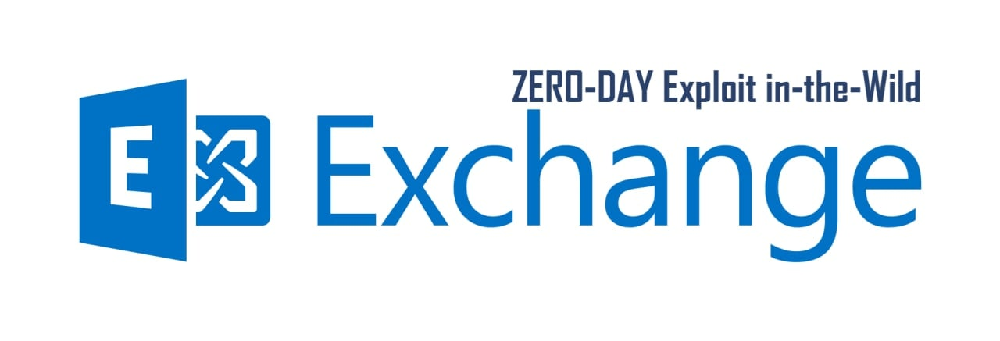
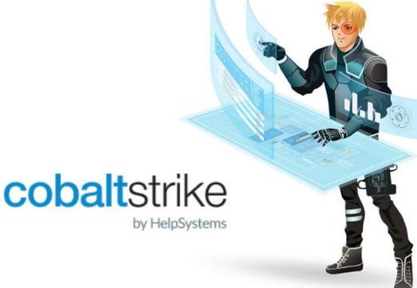

# cibsecurity
`2022-09-30`

<blockquote>
‼ CVE-2022-40944 ‼

Dairy Farm Shop Management System 1.0 is vulnerable to SQL Injection via sales-report-ds.php file.

📖 Read

via &quot;National Vulnerability Database&quot;.
</blockquote>

---

# cibsecurity
`2022-09-30`

<blockquote>
‼ CVE-2021-33354 ‼

Directory Traversal vulnerability in htmly before 2.8.1 allows remote attackers to perform arbitrary file deletions via modified file parameter.

📖 Read

via &quot;National Vulnerability Database&quot;.
</blockquote>

---

# cibsecurity
`2022-09-30`

<blockquote>
‼ CVE-2022-35155 ‼

Bus Pass Management System v1.0 was discovered to contain a reflected cross-site scripting (XSS) vulnerability via the searchdata parameter.

📖 Read

via &quot;National Vulnerability Database&quot;.
</blockquote>

---

# cibsecurity
`2022-09-30`

<blockquote>
‼ CVE-2022-20662 ‼

A vulnerability in the smart card login authentication of Cisco Duo for macOS could allow an unauthenticated attacker with physical access to bypass authentication. This vulnerability exists because the assigned user of a smart card is not properly matched with the authenticating user. An attacker could exploit this vulnerability by configuring a smart card login to bypass Duo authentication. A successful exploit could allow the attacker to use any personal identity verification (PIV) smart card for authentication, even if the smart card is not assigned to the authenticating user.

📖 Read

via &quot;National Vulnerability Database&quot;.
</blockquote>

---

# cibsecurity
`2022-09-30`

<blockquote>
‼ CVE-2022-36965 ‼

Insufficient sanitization of inputs in QoE application input field could lead to stored and Dom based XSS attack. This issue is fixed and released in SolarWinds Platform (2022.3.0).

📖 Read

via &quot;National Vulnerability Database&quot;.
</blockquote>

---

# cibsecurity
`2022-09-30`

<blockquote>
‼ CVE-2021-36855 ‼

Cross-Site Scripting (XSS) via Cross-Site Request Forgery (CSRF) vulnerability in Booking Ultra Pro plugin &lt;&#61; 1.1.4 at WordPress.

📖 Read

via &quot;National Vulnerability Database&quot;.
</blockquote>

---

# cibsecurity
`2022-09-30`

<blockquote>
‼ CVE-2022-40315 ‼

A limited SQL injection risk was identified in the &quot;browse list of users&quot; site administration page.

📖 Read

via &quot;National Vulnerability Database&quot;.
</blockquote>

---

# cibsecurity
`2022-09-30`

<blockquote>
‼ CVE-2022-21826 ‼

Pulse Secure version 9.115 and below may be susceptible to client-side http request smuggling, When the application receives a POST request, it ignores the request's Content-Length header and leaves the POST body on the TCP/TLS socket. This body ends up prefixing the next HTTP request sent down that connection, this means when someone loads website attacker may be able to make browser issue a POST to the application, enabling XSS.

📖 Read

via &quot;National Vulnerability Database&quot;.
</blockquote>

---

# cibsecurity
`2022-09-30`

<blockquote>
‼ CVE-2021-36839 ‼

Authenticated (admin+) Stored Cross-Site Scripting (XSS) vulnerability in Social Media Follow Buttons Bar plugin &lt;&#61; 4.73 at WordPress.

📖 Read

via &quot;National Vulnerability Database&quot;.
</blockquote>

---

# cibsecurity
`2022-09-30`

<blockquote>
‼ CVE-2022-40313 ‼

Recursive rendering of Mustache template helpers containing user input could, in some cases, result in an XSS risk or a page failing to load.

📖 Read

via &quot;National Vulnerability Database&quot;.
</blockquote>

---

# cibsecurity
`2022-09-30`

<blockquote>
‼ CVE-2022-36961 ‼

A verb used in Orion was vulnerable to SQL Injection, an authenticated attacker could leverage this for privilege escalation or remote code execution.

📖 Read

via &quot;National Vulnerability Database&quot;.
</blockquote>

---

# cibsecurity
`2022-09-30`

<blockquote>
‼ CVE-2021-36830 ‼

Authenticated (admin+) Stored Cross-Site Scripting (XSS) vulnerability in Comment Guestbook plugin &lt;&#61; 0.8.0 at WordPress.

📖 Read

via &quot;National Vulnerability Database&quot;.
</blockquote>

---

# cibsecurity
`2022-09-30`

<blockquote>
‼ CVE-2022-28851 ‼

Adobe Experience Manager versions 6.5.13.0 (and earlier) is affected by a reflected Cross-Site Scripting (XSS) vulnerability. If an attacker is able to convince a victim to visit a URL referencing a vulnerable page, malicious JavaScript content may be executed within the context of the victim's browser. Exploitation of this issue requires low-privilege access to AEM.

📖 Read

via &quot;National Vulnerability Database&quot;.
</blockquote>

---

# defcon_news
`2022-09-30`

<blockquote>
VNCERT/CC has just developed a tool to check Exchange's 0-day exploit http request blocking. &#35;exchange &#35;0day &#35;exploit &#35;vncertcc
https://www.reddit.com/r/netsec/comments/xs5xsz/vncertcc_has_just_developed_a_tool_to_check/
</blockquote>

<table><tr><td><b>→</b><a href="https://www.reddit.com/r/netsec/comments/xs5xsz/vncertcc_has_just_developed_a_tool_to_check/">
https://www.reddit.com/r/netsec/comments/xs5xsz/vncertcc_has_just_developed_a_tool_to_check/
</a>
<blockquote>
Posted in r/netsec by u/InterestingEmu4225 • 6 points and 0 comments
</blockquote>
</td></tr></table>

---

# cibsecurity
`2022-09-30`

<blockquote>
‼ CVE-2022-37461 ‼

Multiple cross-site scripting (XSS) vulnerabilities in Canon Medical Vitrea View 7.x before 7.7.6 allow remote attackers to inject arbitrary web script or HTML via (1) the input after the error subdirectory to the /vitrea-view/error/ subdirectory, or the (2) groupID, (3) offset, or (4) limit parameter to an Administrative Panel (Group and Users) page. There is a risk of an attacker retrieving patient information.

📖 Read

via &quot;National Vulnerability Database&quot;.
</blockquote>

---

# cibsecurity
`2022-09-30`

<blockquote>
‼ CVE-2022-41439 ‼

Billing System Project v1.0 was discovered to contain a SQL injection vulnerability via the id parameter at /phpinventory/edituser.php.

📖 Read

via &quot;National Vulnerability Database&quot;.
</blockquote>

---

# cibsecurity
`2022-09-30`

<blockquote>
‼ CVE-2022-41440 ‼

Billing System Project v1.0 was discovered to contain a SQL injection vulnerability via the id parameter at /phpinventory/editcategory.php.

📖 Read

via &quot;National Vulnerability Database&quot;.
</blockquote>

---

# cibsecurity
`2022-09-30`

<blockquote>
‼ CVE-2022-41437 ‼

Billing System Project v1.0 was discovered to contain a remote code execution (RCE) vulnerability via the component /php_action/createProduct.php.

📖 Read

via &quot;National Vulnerability Database&quot;.
</blockquote>

---

# MPSIEMChat
`2022-09-30`

<blockquote>
Здравствуйте, кратко опишу есть уязвимость в MS Exchange 0-day (ZDI-CAN-18333, ZDI-CAN-18802). Тут подробнее это описала GTSC https://gteltsc.vn/blog/warning-new-attack-campaign-utilized-a-new-0day-rce-vulnerability-on-microsoft-exchange-server-12715.html
 Вопрос заключается как с помощью SIEM можно отследить изменение DLL файлов по hash SHA256, есть ли такая возможность или чем лучше это сделать?
</blockquote>

<table><tr><td><b>→</b><a href="https://www.gteltsc.vn/blog/warning-new-attack-campaign-utilized-a-new-0day-rce-vulnerability-on-microsoft-exchange-server-12715.html">
https://www.gteltsc.vn/blog/warning-new-attack-campaign-utilized-a-new-0day-rce-vulnerability-on-microsoft-exchange-server-12715.html
</a>
</td></tr></table>

---

# cibsecurity
`2022-09-29`

<blockquote>
‼ CVE-2022-40472 ‼

ZKTeco Xiamen Information Technology ZKBio Time 8.0.7 Build: 20220721.14829 was discovered to contain a CSV injection vulnerability. This vulnerability allows attackers to execute arbitrary code via a crafted payload injected into the Content text field of the Add New Message module.

📖 Read

via &quot;National Vulnerability Database&quot;.
</blockquote>

---

# cibsecurity
`2022-09-29`

<blockquote>
‼ CVE-2022-35137 ‼

DGIOT Lightweight industrial IoT v4.5.4 was discovered to contain multiple cross-site scripting (XSS) vulnerabilities.

📖 Read

via &quot;National Vulnerability Database&quot;.
</blockquote>

---

# cibsecurity
`2022-09-29`

<blockquote>
‼ CVE-2022-33880 ‼

hms-staff.php in Projectworlds Hospital Management System Mini-Project through 2018-06-17 allows SQL injection via the type parameter.

📖 Read

via &quot;National Vulnerability Database&quot;.
</blockquote>

---

# freedomf0x
`2022-09-30`

<blockquote>
&#35;exploit
1. 0-Day RCE on Microsoft Exchange Server
https://gteltsc.vn/blog/warning-new-attack-campaign-utilized-a-new-0day-rce-vulnerability-on-microsoft-exchange-server-12715.html

2. CVE-2022-36934:
Integer overflow in WhatsApp leading to RCE in an established
https://infosecwriteups.com/cve-2022-36934-an-integer-overflow-in-whatsapp-leading-to-remote-code-execution-in-an-established-e0fc4e2cd900

3. CVE-2022-2566:
FFmpeg - Heap Out-Of-Bounds Write in build_open_gop_key_points
https://github.com/google/security-research/security/advisories/GHSA-vhxg-9wfx-7fcj
</blockquote>

---

# defcon_news
`2022-09-29`

<blockquote>
New attack campaign utilized a new 0-day RCE vulnerability on Microsoft Exchange Server
https://www.reddit.com/r/netsec/comments/xrh7f0/new_attack_campaign_utilized_a_new_0day_rce/
</blockquote>

<table><tr><td><b>→</b><a href="https://www.reddit.com/r/netsec/comments/xrh7f0/new_attack_campaign_utilized_a_new_0day_rce/">
https://www.reddit.com/r/netsec/comments/xrh7f0/new_attack_campaign_utilized_a_new_0day_rce/
</a>
<blockquote>
Posted in r/netsec by u/CyberMasterV • 133 points and 14 comments
</blockquote>
</td></tr></table>

---

# cibsecurity
`2022-09-29`

<blockquote>
‼ CVE-2022-40408 ‼

FeehiCMS v2.1.1 was discovered to contain a cross-site scripting (XSS) vulnerability via a crafted payload injected into the Comment box under the Single Page module.

📖 Read

via &quot;National Vulnerability Database&quot;.
</blockquote>

---

# defcon_news
`2022-09-29`

<blockquote>
Joomla AdsManager 3.2.0 SQL Injection
http://exploit.kitploit.com/2022/09/joomla-adsmanager-320-sql-injection.html
</blockquote>

<table><tr><td><b>→</b><a href="https://exploit.kitploit.com/2022/09/joomla-adsmanager-320-sql-injection.html?utm_source=dlvr.it&utm_medium=twitter">
https://exploit.kitploit.com/2022/09/joomla-adsmanager-320-sql-injection.html?utm_source=dlvr.it&utm_medium=twitter
</a>
<blockquote>
Exploit Collector is the ultimate collection of public exploits and exploitable vulnerabilities. Remote/Local Exploits, Shellcode and 0days.
</blockquote>
</td></tr></table>

---

# defcon_news
`2022-09-29`

<blockquote>
Online Examination System 1.0 SQL Injection
http://exploit.kitploit.com/2022/09/online-examination-system-10-sql.html
</blockquote>

<table><tr><td><b>→</b><a href="https://exploit.kitploit.com/2022/09/online-examination-system-10-sql.html?utm_source=dlvr.it&utm_medium=twitter">
https://exploit.kitploit.com/2022/09/online-examination-system-10-sql.html?utm_source=dlvr.it&utm_medium=twitter
</a>
<blockquote>
Exploit Collector is the ultimate collection of public exploits and exploitable vulnerabilities. Remote/Local Exploits, Shellcode and 0days.
</blockquote>
</td></tr></table>

---

# defcon_news
`2022-09-29`

<blockquote>
Joomla AdsManager 3.2.0 SQL Injection
https://packetstormsecurity.com/files/168556/joomlaadsmanager320-sql.txt
</blockquote>

<table><tr><td><b>→</b><a href="https://packetstormsecurity.com/files/168556/joomlaadsmanager320-sql.txt">
https://packetstormsecurity.com/files/168556/joomlaadsmanager320-sql.txt
</a>
<blockquote>
Information Security Services, News, Files, Tools, Exploits, Advisories and Whitepapers
</blockquote>
</td></tr></table>

---

# defcon_news
`2022-09-29`

<blockquote>
Online Examination System 1.0 SQL Injection
https://packetstormsecurity.com/files/168551/oes10-sql.txt
</blockquote>

<table><tr><td><b>→</b><a href="https://packetstormsecurity.com/files/168551/oes10-sql.txt">
https://packetstormsecurity.com/files/168551/oes10-sql.txt
</a>
<blockquote>
Information Security Services, News, Files, Tools, Exploits, Advisories and Whitepapers
</blockquote>
</td></tr></table>

---

# cibsecurity
`2022-09-29`

<blockquote>
🕴 XSS Flaw in Prevalent Media Imaging Tool Exposes Trove of Patient Data 🕴

Bugs in Canon Medical's Virea View could allow cyberattackers to access several sources of sensitive patient data.

📖 Read

via &quot;Dark Reading&quot;.
</blockquote>

<table><tr><td><b>→</b><a href="https://www.darkreading.com/attacks-breaches/xss-flaw-prevalent-media-imaging-tool-exposes-trove-patient-data">
https://www.darkreading.com/attacks-breaches/xss-flaw-prevalent-media-imaging-tool-exposes-trove-patient-data
</a>
<blockquote>
Bugs in Canon Medical's Virea View could allow cyberattackers to access several sources of sensitive patient data.
</blockquote>
</td></tr></table>

---

# defcon_news
`2022-09-29`

<blockquote>
XSS Flaw in Prevalent Media Imaging Tool Exposes Trove of Patient Data
https://www.darkreading.com/attacks-breaches/xss-flaw-prevalent-media-imaging-tool-exposes-trove-patient-data
</blockquote>

<table><tr><td><b>→</b><a href="https://www.darkreading.com/attacks-breaches/xss-flaw-prevalent-media-imaging-tool-exposes-trove-patient-data">
https://www.darkreading.com/attacks-breaches/xss-flaw-prevalent-media-imaging-tool-exposes-trove-patient-data
</a>
<blockquote>
Bugs in Canon Medical's Virea View could allow cyberattackers to access several sources of sensitive patient data.
</blockquote>
</td></tr></table>

---

# cibsecurity
`2022-09-29`

<blockquote>
‼ CVE-2021-42047 ‼

An issue was discovered in the Growth extension in MediaWiki through 1.36.2. On any Wiki with the Mentor Dashboard feature enabled, users can login with a mentor account and trigger an XSS payload (such as alert) via Growthexperiments-mentor-dashboard-mentee-overview-no-js-fallback.

📖 Read

via &quot;National Vulnerability Database&quot;.
</blockquote>

---

# cibsecurity
`2022-09-29`

<blockquote>
‼ CVE-2021-45788 ‼

Time-based SQL Injection vulnerabilities were found in Metersphere v1.15.4 via the &quot;orders&quot; parameter.

📖 Read

via &quot;National Vulnerability Database&quot;.
</blockquote>

---

# cibsecurity
`2022-09-29`

<blockquote>
‼ CVE-2021-45843 ‼

glFusion CMS v1.7.9 is affected by a reflected Cross Site Scripting (XSS) vulnerability. The value of the title request parameter is copied into the value of an HTML tag attribute which is encapsulated in double quotation marks. This input was echoed unmodified in the application's response.

📖 Read

via &quot;National Vulnerability Database&quot;.
</blockquote>

---

# cibsecurity
`2022-09-29`

<blockquote>
‼ CVE-2022-1719 ‼

Reflected XSS on ticket filter function in GitHub repository polonel/trudesk prior to 1.2.2. This vulnerability is capable of executing a malicious javascript code in web page

📖 Read

via &quot;National Vulnerability Database&quot;.
</blockquote>

---

# cibsecurity
`2022-09-29`

<blockquote>
‼ CVE-2020-15339 ‼

Zyxel CloudCNM SecuManager 3.1.0 and 3.1.1 allows live/CPEManager/AXCampaignManager/handle_campaign_script_link?script_name&#61; XSS.

📖 Read

via &quot;National Vulnerability Database&quot;.
</blockquote>

---

# cibsecurity
`2022-09-28`

<blockquote>
‼ CVE-2022-29089 ‼

Dell Networking OS10, versions prior to October 2021 with Smart Fabric Services enabled, contains an information disclosure vulnerability. A remote, unauthenticated attacker could potentially exploit this vulnerability by reverse engineering to retrieve sensitive information and access the REST API with admin privileges.

📖 Read

via &quot;National Vulnerability Database&quot;.
</blockquote>

---

# cibsecurity
`2022-09-28`

<blockquote>
‼ CVE-2022-34394 ‼

Dell OS10, version 10.5.3.4, contains an Improper Certificate Validation vulnerability in Support Assist. A remote unauthenticated attacker could potentially exploit this vulnerability, leading to unauthorized access to limited switch configuration data. The vulnerability could be leveraged by attackers to conduct man-in-the-middle attacks to gain access to the Support Assist information.

📖 Read

via &quot;National Vulnerability Database&quot;.
</blockquote>

---

# cibsecurity
`2022-09-28`

<blockquote>
‼ CVE-2022-3215 ‼

NIOHTTP1 and projects using it for generating HTTP responses can be subject to a HTTP Response Injection attack. This occurs when a HTTP/1.1 server accepts user generated input from an incoming request and reflects it into a HTTP/1.1 response header in some form. A malicious user can add newlines to their input (usually in encoded form) and &quot;inject&quot; those newlines into the returned HTTP response. This capability allows users to work around security headers and HTTP/1.1 framing headers by injecting entirely false responses or other new headers. The injected false responses may also be treated as the response to subsequent requests, which can lead to XSS, cache poisoning, and a number of other flaws. This issue was resolved by adding validation to the HTTPHeaders type, ensuring that there's no whitespace incorrectly present in the HTTP headers provided by users. As the existing API surface is non-failable, all invalid characters are replaced by linear whitespace.

📖 Read

via &quot;National Vulnerability Database&quot;.
</blockquote>

---

# cibsecurity
`2022-09-28`

<blockquote>
‼ CVE-2022-3193 ‼

An HTML injection/reflected Cross-site scripting (XSS) vulnerability was found in the ovirt-engine. A parameter &quot;error_description&quot; fails to sanitize the entry, allowing the vulnerability to trigger on the Windows Service Accounts home pages.

📖 Read

via &quot;National Vulnerability Database&quot;.
</blockquote>

---

# cibsecurity
`2022-09-28`

<blockquote>
‼ CVE-2021-41434 ‼

A stored Cross-Site Scripting (XSS) vulnerability exists in version 1.0 of the Expense Management System application that allows for arbitrary execution of JavaScript commands through index.php.

📖 Read

via &quot;National Vulnerability Database&quot;.
</blockquote>

---

# cibsecurity
`2022-09-28`

<blockquote>
‼ CVE-2022-35282 ‼

IBM WebSphere Application Server 7.0, 8.0, 8.5, and 9.0 is vulnerable to server-side request forgery (SSRF). By sending a specially crafted request, an attacker with local network access could exploit this vulnerability to obtain sensitive data.

📖 Read

via &quot;National Vulnerability Database&quot;.
</blockquote>

---

# cibsecurity
`2022-09-28`

<blockquote>
‼ CVE-2022-28812 ‼

In Carlo Gavazzi UWP3.0 in multiple versions and CPY Car Park Server in Version 2.8.3 a remote, unauthenticated attacker could make use of hard-coded credentials to gain SuperUser access to the device.

📖 Read

via &quot;National Vulnerability Database&quot;.
</blockquote>

---

# cibsecurity
`2022-09-28`

<blockquote>
‼ CVE-2022-28814 ‼

Carlo Gavazzi UWP3.0 in multiple versions and CPY Car Park Server in Version 2.8.3 was discovered to be vulnerable to a relative path traversal vulnerability which enables remote attackers to read arbitrary files and gain full control of the device.

📖 Read

via &quot;National Vulnerability Database&quot;.
</blockquote>

---

# cibsecurity
`2022-09-28`

<blockquote>
‼ CVE-2022-28815 ‼

In Carlo Gavazzi UWP3.0 in multiple versions and CPY Car Park Server in Version 2.8.3 the Sentilo Proxy server was discovered to contain a SQL injection vulnerability allowing an attacker to query other tables of the Sentilo service.

📖 Read

via &quot;National Vulnerability Database&quot;.
</blockquote>

---

# cibsecurity
`2022-09-28`

<blockquote>
‼ CVE-2022-28811 ‼

In Carlo Gavazzi UWP3.0 in multiple versions and CPY Car Park Server in Version 2.8.3 a remote, unauthenticated attacker could utilize an improper input validation on an API-submitted parameter to execute arbitrary OS commands.

📖 Read

via &quot;National Vulnerability Database&quot;.
</blockquote>

---

# cibsecurity
`2022-09-28`

<blockquote>
‼ CVE-2022-28813 ‼

In Carlo Gavazzi UWP3.0 in multiple versions and CPY Car Park Server in Version 2.8.3 a remote, unauthenticated attacker could make use of an SQL-injection to gain access to a volatile temporary database with the current states of the device.

📖 Read

via &quot;National Vulnerability Database&quot;.
</blockquote>

---

# cibsecurity
`2022-09-28`

<blockquote>
‼ CVE-2022-40082 ‼

Hertz v0.3.0 ws discovered to contain a path traversal vulnerability via the normalizePath function.

📖 Read

via &quot;National Vulnerability Database&quot;.
</blockquote>

---

# cibsecurity
`2022-09-28`

<blockquote>
‼ CVE-2022-28816 ‼

In Carlo Gavazzi UWP3.0 in multiple versions and CPY Car Park Server in Version 2.8.3 the Sentilo Proxy is prone to reflected XSS which only affects the Sentilo service.

📖 Read

via &quot;National Vulnerability Database&quot;.
</blockquote>

---

# cibsecurity
`2022-09-28`

<blockquote>
‼ CVE-2022-40912 ‼

ETAP Lighting International NV ETAP Safety Manager 1.0.0.32 is vulnerable to Cross Site Scripting (XSS). Input passed to the GET parameter 'action' is not properly sanitized before being returned to the user. This can be exploited to execute arbitrary HTML/JS code in a user's browser session in context of an affected site.

📖 Read

via &quot;National Vulnerability Database&quot;.
</blockquote>

---

# cibsecurity
`2022-09-28`

<blockquote>
‼ CVE-2022-22522 ‼

In Carlo Gavazzi UWP3.0 in multiple versions and CPY Car Park Server in Version 2.8.3 a remote, unauthenticated attacker could make use of hard-coded credentials to gain full access to the device.

📖 Read

via &quot;National Vulnerability Database&quot;.
</blockquote>

---

# cibsecurity
`2022-09-28`

<blockquote>
‼ CVE-2022-22524 ‼

In Carlo Gavazzi UWP3.0 in multiple versions and CPY Car Park Server in Version 2.8.3 an unauthenticated remote attacker could utilize a SQL-Injection vulnerability to gain full database access, modify users and stop services .

📖 Read

via &quot;National Vulnerability Database&quot;.
</blockquote>

---

# cibsecurity
`2022-09-28`

<blockquote>
‼ CVE-2022-40083 ‼

Labstack Echo v4.8.0 was discovered to contain an open redirect vulnerability via the Static Handler component. This vulnerability can be leveraged by attackers to cause a Server-Side Request Forgery (SSRF).

📖 Read

via &quot;National Vulnerability Database&quot;.
</blockquote>

---

# defcon_news
`2022-09-28`

<blockquote>
Serious Netlify Vulnerability Could Allow XSS, SSRF Attacks
https://latesthackingnews.com/2022/09/28/serious-netlify-vulnerability-could-allow-xss-ssrf-attacks/
</blockquote>

<table><tr><td><b>→</b><a href="https://latesthackingnews.com/2022/09/28/serious-netlify-vulnerability-could-allow-xss-ssrf-attacks/">
https://latesthackingnews.com/2022/09/28/serious-netlify-vulnerability-could-allow-xss-ssrf-attacks/
</a>
<blockquote>
A serious security vulnerability existed in the Netlify cloud computing platform that allowed cross-site scripting attacks. Netlify has released a patch for the flaw with version 1.2.3. Users must ensure updating their systems with the
</blockquote>
</td></tr></table>

---

# cibsecurity
`2022-09-28`

<blockquote>
⚠ WhatsApp “zero-day exploit” news scare – what you need to know ⚠

Is WhatsApp currently under active attack by cyercriminals? Is this a clear and current danger? How worried should WhatsApp users be?

📖 Read

via &quot;Naked Security&quot;.
</blockquote>

<table><tr><td><b>→</b><a href="https://nakedsecurity.sophos.com/2022/09/27/whatsapp-zero-day-exploit-news-scare-what-you-need-to-know/">
https://nakedsecurity.sophos.com/2022/09/27/whatsapp-zero-day-exploit-news-scare-what-you-need-to-know/
</a>
<blockquote>
Is WhatsApp currently under active attack by cyercriminals? Is this a clear and current danger? How worried should WhatsApp users be?
</blockquote>
</td></tr></table>

---

# cibsecurity
`2022-09-28`

<blockquote>
‼ CVE-2022-3332 ‼

A vulnerability classified as critical has been found in SourceCodester Food Ordering Management System. This affects an unknown part of the file router.php of the component POST Parameter Handler. The manipulation of the argument username leads to sql injection. It is possible to initiate the attack remotely. The exploit has been disclosed to the public and may be used. The associated identifier of this vulnerability is VDB-209583.

📖 Read

via &quot;National Vulnerability Database&quot;.
</blockquote>

---

# cibsecurity
`2022-09-28`

<blockquote>
‼ CVE-2022-40877 ‼

Exam Reviewer Management System 1.0 is vulnerable to SQL Injection via the ‘id’ parameter.

📖 Read

via &quot;National Vulnerability Database&quot;.
</blockquote>

---

# cibsecurity
`2022-09-28`

<blockquote>
‼ CVE-2022-40354 ‼

Online Tours &amp; Travels Management System v1.0 was discovered to contain a SQL injection vulnerability via the id parameter at /admin/update_booking.php.

📖 Read

via &quot;National Vulnerability Database&quot;.
</blockquote>

---

# cibsecurity
`2022-09-28`

<blockquote>
‼ CVE-2022-40353 ‼

Online Tours &amp; Travels Management System v1.0 was discovered to contain a SQL injection vulnerability via the id parameter at /admin/up_booking.php.

📖 Read

via &quot;National Vulnerability Database&quot;.
</blockquote>

---

# cibsecurity
`2022-09-28`

<blockquote>
‼ CVE-2022-41570 ‼

An issue was discovered in EyesOfNetwork (EON) through 5.3.11. Unauthenticated SQL injection can occur.

📖 Read

via &quot;National Vulnerability Database&quot;.
</blockquote>

---

# cibsecurity
`2022-09-28`

<blockquote>
‼ CVE-2022-40352 ‼

Online Tours &amp; Travels Management System v1.0 was discovered to contain a SQL injection vulnerability via the id parameter at /admin/update_traveller.php.

📖 Read

via &quot;National Vulnerability Database&quot;.
</blockquote>

---

# cibsecurity
`2022-09-28`

<blockquote>
‼ CVE-2022-41571 ‼

An issue was discovered in EyesOfNetwork (EON) through 5.3.11. Local file inclusion can occur.

📖 Read

via &quot;National Vulnerability Database&quot;.
</blockquote>

---

# cibsecurity
`2022-09-28`

<blockquote>
‼ CVE-2022-40199 ‼

Directory traversal vulnerability in EC-CUBE 3 series (EC-CUBE 3.0.0 to 3.0.18-p4 ) and EC-CUBE 4 series (EC-CUBE 4.0.0 to 4.1.2) allows a remote authenticated attacker with an administrative privilege to obtain the product's directory structure information.

📖 Read

via &quot;National Vulnerability Database&quot;.
</blockquote>

---

# cibsecurity
`2022-09-28`

<blockquote>
‼ CVE-2022-37209 ‼

JFinal CMS 5.1.0 is affected by: SQL Injection. These interfaces do not use the same component, nor do they have filters, but each uses its own SQL concatenation method, resulting in SQL injection.

📖 Read

via &quot;National Vulnerability Database&quot;.
</blockquote>

---

# cibsecurity
`2022-09-28`

<blockquote>
‼ CVE-2022-38335 ‼

Vtiger CRM v7.4.0 was discovered to contain a stored cross-site scripting (XSS) vulnerability via the e-mail template modules.

📖 Read

via &quot;National Vulnerability Database&quot;.
</blockquote>

---

# cibsecurity
`2022-09-28`

<blockquote>
‼ CVE-2022-37346 ‼

EC-CUBE plugin 'Product Image Bulk Upload Plugin' 1.0.0 and 4.1.0 contains an insufficient verification vulnerability when uploading files. Exploiting this vulnerability allows a remote unauthenticated attacker to upload arbitrary files other than image files. If a user with an administrative privilege of EC-CUBE where the vulnerable plugin is installed is led to upload a specially crafted file, an arbitrary script may be executed on the system.

📖 Read

via &quot;National Vulnerability Database&quot;.
</blockquote>

---

# cibsecurity
`2022-09-27`

<blockquote>
⚠ WhatsApp “zero-day exploit” news scare – what you need to know ⚠

Is WhatsApp currently under active attack by cyercriminals? Is this a clear and current danger? How worried should WhatsApp users be?

📖 Read

via &quot;Naked Security&quot;.
</blockquote>

<table><tr><td><b>→</b><a href="https://nakedsecurity.sophos.com/2022/09/27/whatsapp-zero-day-exploit-news-scare-what-you-need-to-know/">
https://nakedsecurity.sophos.com/2022/09/27/whatsapp-zero-day-exploit-news-scare-what-you-need-to-know/
</a>
<blockquote>
Is WhatsApp currently under active attack by cyercriminals? Is this a clear and current danger? How worried should WhatsApp users be?
</blockquote>
</td></tr></table>

---

# defcon_news
`2022-09-27`

<blockquote>
WhatsApp “zero-day exploit” news scare – what you need to know
https://nakedsecurity.sophos.com/2022/09/27/whatsapp-zero-day-exploit-news-scare-what-you-need-to-know/
</blockquote>

<table><tr><td><b>→</b><a href="https://nakedsecurity.sophos.com/2022/09/27/whatsapp-zero-day-exploit-news-scare-what-you-need-to-know/">
https://nakedsecurity.sophos.com/2022/09/27/whatsapp-zero-day-exploit-news-scare-what-you-need-to-know/
</a>
<blockquote>
Is WhatsApp currently under active attack by cyercriminals? Is this a clear and current danger? How worried should WhatsApp users be?
</blockquote>
</td></tr></table>

---

# defcon_news
`2022-09-27`

<blockquote>
Food Ordering Management System 1.0 SQL Injection
http://exploit.kitploit.com/2022/09/food-ordering-management-system-10-sql.html
</blockquote>

<table><tr><td><b>→</b><a href="https://exploit.kitploit.com/2022/09/food-ordering-management-system-10-sql.html?utm_source=dlvr.it&utm_medium=twitter">
https://exploit.kitploit.com/2022/09/food-ordering-management-system-10-sql.html?utm_source=dlvr.it&utm_medium=twitter
</a>
<blockquote>
Exploit Collector is the ultimate collection of public exploits and exploitable vulnerabilities. Remote/Local Exploits, Shellcode and 0days.
</blockquote>
</td></tr></table>

---

# defcon_news
`2022-09-27`

<blockquote>
Food Ordering Management System 1.0 SQL Injection
https://packetstormsecurity.com/files/168517/foms10-sql.txt
</blockquote>

<table><tr><td><b>→</b><a href="https://packetstormsecurity.com/files/168517/foms10-sql.txt">
https://packetstormsecurity.com/files/168517/foms10-sql.txt
</a>
<blockquote>
Information Security Services, News, Files, Tools, Exploits, Advisories and Whitepapers
</blockquote>
</td></tr></table>

---

# cibsecurity
`2022-09-26`

<blockquote>
‼ CVE-2022-30003 ‼

Sourcecodester Online Market Place Site 1.0 is vulnerable to Cross Site Scripting (XSS), allowing attackers to register as a Seller then create new products containing XSS payloads in the 'Product Title' and 'Short Description' fields.

📖 Read

via &quot;National Vulnerability Database&quot;.
</blockquote>

---

# cibsecurity
`2022-09-26`

<blockquote>
‼ CVE-2022-40043 ‼

Centreon v20.10.18 was discovered to contain a SQL injection vulnerability via the esc_name (Escalation Name) parameter at Configuration/Notifications/Escalations.

📖 Read

via &quot;National Vulnerability Database&quot;.
</blockquote>

---

# cibsecurity
`2022-09-26`

<blockquote>
‼ CVE-2022-40044 ‼

Centreon v20.10.18 was discovered to contain a cross-site scripting (XSS) vulnerability via the esc_name (Escalation Name) parameter at Configuration/Notifications/Escalations. This vulnerability allows attackers to execute arbitrary web scripts or HTML via injecting a crafted payload.

📖 Read

via &quot;National Vulnerability Database&quot;.
</blockquote>

---

# cibsecurity
`2022-09-26`

<blockquote>
‼ CVE-2022-40484 ‼

Wedding Planner v1.0 was discovered to contain a SQL injection vulnerability via the booking parameter at /admin/client_edit.php.

📖 Read

via &quot;National Vulnerability Database&quot;.
</blockquote>

---

# cibsecurity
`2022-09-26`

<blockquote>
‼ CVE-2022-40485 ‼

Wedding Planner v1.0 was discovered to contain a SQL injection vulnerability via the id parameter at /package_detail.php.

📖 Read

via &quot;National Vulnerability Database&quot;.
</blockquote>

---

# defcon_news
`2022-09-26`

<blockquote>
Online Diagnostic Lab Management System 1.0 SQL Injection / Shell Upload
http://exploit.kitploit.com/2022/09/online-diagnostic-lab-management-system.html
</blockquote>

<table><tr><td><b>→</b><a href="https://exploit.kitploit.com/2022/09/online-diagnostic-lab-management-system.html?utm_source=dlvr.it&utm_medium=twitter">
https://exploit.kitploit.com/2022/09/online-diagnostic-lab-management-system.html?utm_source=dlvr.it&utm_medium=twitter
</a>
<blockquote>
Exploit Collector is the ultimate collection of public exploits and exploitable vulnerabilities. Remote/Local Exploits, Shellcode and 0days.
</blockquote>
</td></tr></table>

---

# defcon_news
`2022-09-26`

<blockquote>
Online Diagnostic Lab Management System 1.0 SQL Injection / Shell Upload
https://packetstormsecurity.com/files/168498/odlms10-sqlbypassshell.txt
</blockquote>

<table><tr><td><b>→</b><a href="https://packetstormsecurity.com/files/168498/odlms10-sqlbypassshell.txt">
https://packetstormsecurity.com/files/168498/odlms10-sqlbypassshell.txt
</a>
<blockquote>
Information Security Services, News, Files, Tools, Exploits, Advisories and Whitepapers
</blockquote>
</td></tr></table>

---

# cibsecurity
`2022-09-26`

<blockquote>
‼ CVE-2022-40402 ‼

Wedding Planner v1.0 was discovered to contain a SQL injection vulnerability via the booking parameter at /admin/client_assign.php.

📖 Read

via &quot;National Vulnerability Database&quot;.
</blockquote>

---

# cibsecurity
`2022-09-26`

<blockquote>
‼ CVE-2022-40928 ‼

Online Leave Management System v1.0 is vulnerable to SQL Injection via /leave_system/classes/Master.php?f&#61;delete_application.

📖 Read

via &quot;National Vulnerability Database&quot;.
</blockquote>

---

# cibsecurity
`2022-09-26`

<blockquote>
‼ CVE-2022-40926 ‼

Online Leave Management System v1.0 is vulnerable to SQL Injection via /leave_system/classes/Master.php?f&#61;delete_leave_type.

📖 Read

via &quot;National Vulnerability Database&quot;.
</blockquote>

---

# cibsecurity
`2022-09-26`

<blockquote>
‼ CVE-2022-40927 ‼

Online Leave Management System v1.0 is vulnerable to SQL Injection via /leave_system/classes/Master.php?f&#61;delete_designation.

📖 Read

via &quot;National Vulnerability Database&quot;.
</blockquote>

---

# cibsecurity
`2022-09-26`

<blockquote>
‼ CVE-2022-2352 ‼

The Post SMTP Mailer/Email Log WordPress plugin before 2.1.7 does not have proper authorisation in some AJAX actions, which could allow high privilege users such as admin to perform blind SSRF on multisite installations for example.

📖 Read

via &quot;National Vulnerability Database&quot;.
</blockquote>

---

# Leakers_squad
`2022-09-26`

<blockquote>
My First XSS &#35;bugbounty

https://medium.com/@AvyuktSyrine/my-first-xss-d88ee864df82
</blockquote>

<table><tr><td><b>→</b><a href="https://medium.com/@AvyuktSyrine/my-first-xss-d88ee864df82">
https://medium.com/@AvyuktSyrine/my-first-xss-d88ee864df82
</a>
<blockquote>
Hey everyone, I am SYRINE. Cyber Security Enthusiast, eJPT Certified, and currently focusing on bug bounty.
</blockquote>
</td></tr></table>

---

# cibsecurity
`2022-09-26`

<blockquote>
‼ CVE-2022-38553 ‼

Academy Learning Management System before v5.9.1 was discovered to contain a reflected cross-site scripting (XSS) vulnerability via the Search parameter.

📖 Read

via &quot;National Vulnerability Database&quot;.
</blockquote>

---

# defcon_news
`2022-09-24`

<blockquote>
Hackers Actively Exploiting New Sophos Firewall RCE Vulnerability
https://thehackernews.com/2022/09/hackers-actively-exploiting-new-sophos.html
</blockquote>

---

# cibsecurity
`2022-09-24`

<blockquote>
‼ CVE-2022-39240 ‼

MyGraph is a permission management system. Versions prior to 1.0.4 are vulnerable to a storage XSS vulnerability leading to Remote Code Execution. This issue is patched in version 1.0.4. There is no known workaround.

📖 Read

via &quot;National Vulnerability Database&quot;.
</blockquote>

---

# cibsecurity
`2022-09-24`

<blockquote>
‼ CVE-2022-23461 ‼

Jodit Editor is a WYSIWYG editor written in pure TypeScript without the use of additional libraries. Jodit Editor is vulnerable to XSS attacks when pasting specially constructed input. This issue has not been fully patched. There are no known workarounds.

📖 Read

via &quot;National Vulnerability Database&quot;.
</blockquote>

---

# cibsecurity
`2022-09-23`

<blockquote>
‼ CVE-2022-38438 ‼

Adobe Experience Manager versions 6.5.13.0 (and earlier) is affected by a reflected Cross-Site Scripting (XSS) vulnerability. If an attacker is able to convince a victim to visit a URL referencing a vulnerable page, malicious JavaScript content may be executed within the context of the victim's browser. Exploitation of this issue requires low-privilege access to AEM.

📖 Read

via &quot;National Vulnerability Database&quot;.
</blockquote>

---

# cibsecurity
`2022-09-23`

<blockquote>
‼ CVE-2022-34348 ‼

IBM Sterling Partner Engagement Manager 6.1 is vulnerable to an XML External Entity Injection (XXE) attack when processing XML data. A remote attacker could exploit this vulnerability to expose sensitive information or consume memory resources. IBM X-Force ID: 230017.

📖 Read

via &quot;National Vulnerability Database&quot;.
</blockquote>

---

# cibsecurity
`2022-09-23`

<blockquote>
‼ CVE-2022-38439 ‼

Adobe Experience Manager versions 6.5.13.0 (and earlier) is affected by a reflected Cross-Site Scripting (XSS) vulnerability. If an attacker is able to convince a victim to visit a URL referencing a vulnerable page, malicious JavaScript content may be executed within the context of the victim's browser. Exploitation of this issue requires low-privilege access to AEM.

📖 Read

via &quot;National Vulnerability Database&quot;.
</blockquote>

---

# cibsecurity
`2022-09-23`

<blockquote>
‼ CVE-2022-22423 ‼

IBM Common Cryptographic Architecture (CCA 5.x MTM for 4767 and CCA 7.x MTM for 4769) could allow a local user to cause a denial of service due to improper input validation. IBM X-Force ID: 223596.

📖 Read

via &quot;National Vulnerability Database&quot;.
</blockquote>

---

# cibsecurity
`2022-09-23`

<blockquote>
‼ CVE-2022-36417 ‼

Multiple Stored Cross-Site Scripting (XSS) via Cross-Site Request Forgery (CSRF) vulnerability in 3D Tag Cloud plugin &lt;&#61; 3.8 at WordPress.

📖 Read

via &quot;National Vulnerability Database&quot;.
</blockquote>

---

# cibsecurity
`2022-09-23`

<blockquote>
‼ CVE-2022-40215 ‼

Multiple Authenticated Stored Cross-Site Scripting (XSS) vulnerabilities in Tabs plugin &lt;&#61; 3.7.1 at WordPress.

📖 Read

via &quot;National Vulnerability Database&quot;.
</blockquote>

---

# cibsecurity
`2022-09-23`

<blockquote>
🗓️ Netlify vulnerable to XSS, SSRF attacks via cache poisoning 🗓️

Issue has since been fixed

📖 Read

via &quot;The Daily Swig&quot;.
</blockquote>

<table><tr><td><b>→</b><a href="https://portswigger.net/daily-swig/netlify-vulnerable-to-xss-ssrf-attacks-via-cache-poisoning">
https://portswigger.net/daily-swig/netlify-vulnerable-to-xss-ssrf-attacks-via-cache-poisoning
</a>
<blockquote>
Issue has since been fixed
</blockquote>
</td></tr></table>

---

# cibsecurity
`2022-09-23`

<blockquote>
‼ CVE-2022-38061 ‼

Authenticated (author+) CSV Injection vulnerability in Export Post Info plugin &lt;&#61; 1.2.0 at WordPress.

📖 Read

via &quot;National Vulnerability Database&quot;.
</blockquote>

---

# cibsecurity
`2022-09-23`

<blockquote>
‼ CVE-2022-37338 ‼

Multiple Authenticated (contributor+) Stored Cross-Site Scripting (XSS) vulnerabilities in Blossom Recipe Maker plugin &lt;&#61; 1.0.7 at WordPress.

📖 Read

via &quot;National Vulnerability Database&quot;.
</blockquote>

---

# cibsecurity
`2022-09-23`

<blockquote>
‼ CVE-2022-37328 ‼

Authenticated (author+) Stored Cross-Site Scripting (XSS) vulnerability in Themes Awesome History Timeline plugin &lt;&#61; 1.0.5 at WordPress.

📖 Read

via &quot;National Vulnerability Database&quot;.
</blockquote>

---

# cibsecurity
`2022-09-23`

<blockquote>
‼ CVE-2022-40193 ‼

Unauthenticated Stored Cross-Site Scripting (XSS) vulnerability in Awesome Filterable Portfolio plugin &lt;&#61; 1.9.7 at WordPress.

📖 Read

via &quot;National Vulnerability Database&quot;.
</blockquote>

---

# cibsecurity
`2022-09-23`

<blockquote>
‼ CVE-2022-36791 ‼

Authenticated (contributor+) Stored Cross-Site Scripting (XSS) vulnerability in Awesome UG Torro Forms plugin &lt;&#61; 1.0.16 at WordPress.

📖 Read

via &quot;National Vulnerability Database&quot;.
</blockquote>

---

# cibsecurity
`2022-09-23`

<blockquote>
‼ CVE-2022-38703 ‼

Authenticated (admin+) Stored Cross-Site Scripting (XSS) vulnerability in Max Foundry Button Plugin MaxButtons plugin &lt;&#61; 9.2 at WordPress

📖 Read

via &quot;National Vulnerability Database&quot;.
</blockquote>

---

# cibsecurity
`2022-09-23`

<blockquote>
‼ CVE-2022-3236 ‼

A code injection vulnerability in the User Portal and Webadmin allows a remote attacker to execute code in Sophos Firewall version v19.0 MR1 and older.

📖 Read

via &quot;National Vulnerability Database&quot;.
</blockquote>

---

# cibsecurity
`2022-09-23`

<blockquote>
‼ CVE-2022-39227 ‼

python-jwt is a module for generating and verifying JSON Web Tokens. Versions prior to 3.3.4 are subject to Authentication Bypass by Spoofing, resulting in identity spoofing, session hijacking or authentication bypass. An attacker who obtains a JWT can arbitrarily forge its contents without knowing the secret key. Depending on the application, this may for example enable the attacker to spoof other user's identities, hijack their sessions, or bypass authentication. Users should upgrade to version 3.3.4. There are no known workarounds.

📖 Read

via &quot;National Vulnerability Database&quot;.
</blockquote>

---

# cibsecurity
`2022-09-23`

<blockquote>
‼ CVE-2022-39239 ‼

netlify-ipx is an on-Demand image optimization for Netlify using ipx. In versions prior to 1.2.3, an attacker can bypass the source image domain allowlist by sending specially crafted headers, causing the handler to load and return arbitrary images. Because the response is cached globally, this image will then be served to visitors without requiring those headers to be set. XSS can be achieved by requesting a malicious SVG with embedded scripts, which would then be served from the site domain. Note that this does not apply to images loaded in `&lt;img&gt;` tags, as scripts do not execute in this context. The image URL can be set in the header independently of the request URL, meaning any site images that have not previously been cached can have their cache poisoned. This problem has been fixed in version 1.2.3. As a workaround, cached content can be cleared by re-deploying the site.

📖 Read

via &quot;National Vulnerability Database&quot;.
</blockquote>

---

# cibsecurity
`2022-09-23`

<blockquote>
‼ CVE-2022-41319 ‼

A Reflected Cross-Site Scripting (XSS) vulnerability affects the Veritas Desktop Laptop Option (DLO) application login page (aka the DLOServer/restore/login.jsp URI). This affects versions before 9.8 (e.g., 9.1 through 9.7).

📖 Read

via &quot;National Vulnerability Database&quot;.
</blockquote>

---

# sysadm_in_channel
`2022-09-23`

<blockquote>
Open SysConf'22 - SSRF-уязвимости / Старый... Но не бесполезный IRC
 
Привет, мы идем вперед согласно своей правде и намерениям обнаруживая уязвимости и сигнализируя алертами об аномалиях в наших (и не только) системах.

Детали двух новых докладов на 14 Октября

История одного CVE
- Автор: @manfromkz. Senior Security Testing Engineer | OSCP | eWPTXv2 | eCPTXv2 | Master of Computer Sciencer
- Краткое описание: Рассказ о том, как простой пентест веб-приложения привел к выявлению SSRF-уязвимости в популярном менеджере рабочего стола для Linux.

Старый... Но не бесполезный
- Автор: @t2micro. DevOps
- Краткое описание: Применение протокола IRC в современной инфраструктуре для построения сервис-ориентированной модели алертинга.

От себя: Мурат и Ильяс мои хорошие друзья и экстра-профессионалы своего дела. Детали вышеприведенных докладов, которые будут представлены на Open SysConf'22 - это уникальный материал от первого лица, возможность не только послушать, но и задать вопросы, пообщаться в неформальной обстановке, обменяться опытом и знаниями простым и понятным форматом.

Перед зимней спячкой ув &lt;username&gt; обязательно приходи 14 Октября в SmartPoint г.Алматы, трансляции не будет, но будет возможность пообщаться в живую. Детали здесь - sysconf.io

Peace ✌️
</blockquote>

<table><tr><td><b>→</b><a href="https://sysconf.io/_nuxt/img/open_sysconf_logo_22x333.dcc5507.jpeg">
https://sysconf.io/_nuxt/img/open_sysconf_logo_22x333.dcc5507.jpeg
</a>
</td></tr></table>

---

# defcon_news
`2022-09-23`

<blockquote>
BigQuery SQL Injection Cheat Sheet
https://www.reddit.com/r/netsec/comments/xlqzdc/bigquery_sql_injection_cheat_sheet/
</blockquote>

<table><tr><td><b>→</b><a href="https://www.reddit.com/r/netsec/comments/xlqzdc/bigquery_sql_injection_cheat_sheet/">
https://www.reddit.com/r/netsec/comments/xlqzdc/bigquery_sql_injection_cheat_sheet/
</a>
<blockquote>
Posted in r/netsec by u/Gallus • 87 points and 3 comments
</blockquote>
</td></tr></table>

---

# freedomf0x
`2022-09-23`

<blockquote>
cve-2022-39197
Та самая XSS найденная в Cobalt Strike  4.7 
Еще раз прочитать про дырку
Скачать exploit

&#35;cobaltstrike &#35;exploit
</blockquote>

---

# ctfchat
`2022-09-22`

<blockquote>
бля у меня на xss рега от 2008 года
</blockquote>

---

# cibsecurity
`2022-09-22`

<blockquote>
‼ CVE-2022-40933 ‼

Online Pet Shop We App v1.0 by oretnom23 is vulnerable to SQL injection via /pet_shop/classes/Master.php?f&#61;delete_order,id.

📖 Read

via &quot;National Vulnerability Database&quot;.
</blockquote>

---

# cibsecurity
`2022-09-22`

<blockquote>
‼ CVE-2022-40935 ‼

Online Pet Shop We App v1.0 is vulnerable to SQL Injection via /pet_shop/classes/Master.php?f&#61;delete_category,id.

📖 Read

via &quot;National Vulnerability Database&quot;.
</blockquote>

---

# cibsecurity
`2022-09-22`

<blockquote>
‼ CVE-2022-40934 ‼

Online Pet Shop We App v1.0 is vulnerable to SQL injection via /pet_shop/classes/Master.php?f&#61;delete_sub_category,id

📖 Read

via &quot;National Vulnerability Database&quot;.
</blockquote>

---

# defcon_news
`2022-09-22`

<blockquote>
WorkOrder CMS 0.1.0 SQL Injection
http://exploit.kitploit.com/2022/09/workorder-cms-010-sql-injection.html
</blockquote>

<table><tr><td><b>→</b><a href="https://exploit.kitploit.com/2022/09/workorder-cms-010-sql-injection.html?utm_source=dlvr.it&utm_medium=twitter">
https://exploit.kitploit.com/2022/09/workorder-cms-010-sql-injection.html?utm_source=dlvr.it&utm_medium=twitter
</a>
<blockquote>
Exploit Collector is the ultimate collection of public exploits and exploitable vulnerabilities. Remote/Local Exploits, Shellcode and 0days.
</blockquote>
</td></tr></table>

---

# cibsecurity
`2022-09-22`

<blockquote>
‼ CVE-2022-38648 ‼

Server-Side Request Forgery (SSRF) vulnerability in Batik of Apache XML Graphics allows an attacker to fetch external resources. This issue affects Apache XML Graphics Batik 1.14.

📖 Read

via &quot;National Vulnerability Database&quot;.
</blockquote>

---

# cibsecurity
`2022-09-22`

<blockquote>
‼ CVE-2022-38398 ‼

Server-Side Request Forgery (SSRF) vulnerability in Batik of Apache XML Graphics allows an attacker to load a url thru the jar protocol. This issue affects Apache XML Graphics Batik 1.14.

📖 Read

via &quot;National Vulnerability Database&quot;.
</blockquote>

---

# cibsecurity
`2022-09-22`

<blockquote>
‼ CVE-2022-40146 ‼

Server-Side Request Forgery (SSRF) vulnerability in Batik of Apache XML Graphics allows an attacker to access files using a Jar url. This issue affects Apache XML Graphics Batik 1.14.

📖 Read

via &quot;National Vulnerability Database&quot;.
</blockquote>

---

# cibsecurity
`2022-09-22`

<blockquote>
‼ CVE-2022-40447 ‼

ZZCMS 2022 was discovered to contain a SQL injection vulnerability via the keyword parameter at /admin/baojia_list.php.

📖 Read

via &quot;National Vulnerability Database&quot;.
</blockquote>

---

# cibsecurity
`2022-09-22`

<blockquote>
‼ CVE-2022-40443 ‼

An absolute path traversal vulnerability in ZZCMS 2022 allows attackers to obtain sensitive information via a crafted GET request sent to /one/siteinfo.php.

📖 Read

via &quot;National Vulnerability Database&quot;.
</blockquote>

---

# cibsecurity
`2022-09-22`

<blockquote>
‼ CVE-2022-40446 ‼

ZZCMS 2022 was discovered to contain a SQL injection vulnerability via the component /admin/sendmailto.php?tomail&#61;&amp;groupid&#61;.

📖 Read

via &quot;National Vulnerability Database&quot;.
</blockquote>

---

# defcon_news
`2022-09-22`

<blockquote>
WorkOrder CMS 0.1.0 SQL Injection
https://packetstormsecurity.com/files/168464/workordercms010-sql.txt
</blockquote>

<table><tr><td><b>→</b><a href="https://packetstormsecurity.com/files/168464/workordercms010-sql.txt">
https://packetstormsecurity.com/files/168464/workordercms010-sql.txt
</a>
<blockquote>
Information Security Services, News, Files, Tools, Exploits, Advisories and Whitepapers
</blockquote>
</td></tr></table>

---

# sysadm_in_channel
`2022-09-22`

<blockquote>
/ Creosote - solution to searching for the tarfile vulnerability described by CVE-2007-4559

This CVE - Directory traversal vulnerability in the extract and extractall functions in the tarfile module in Python allows user-assisted remote attackers to overwrite arbitrary files via a .. (dot dot) sequence in filenames in a TAR archive, a related issue to CVE-2001-1267:

https://github.com/advanced-threat-research/Creosote
</blockquote>

<table><tr><td><b>→</b><a href="https://github.com/advanced-threat-research/Creosote">
https://github.com/advanced-threat-research/Creosote
</a>
<blockquote>
Creosote is our solution to searching for the tarfile vulnerability described by CVE-2007-4559. - GitHub - advanced-threat-research/Creosote: Creosote is our solution to searching for the tarfile v...
</blockquote>
</td></tr></table>

---

# defcon_news
`2022-09-22`

<blockquote>
Exploiting Web3’s Hidden Attack Surface: Universal XSS on Netlify’s Next.js Library
https://www.reddit.com/r/netsec/comments/xkrbgr/exploiting_web3s_hidden_attack_surface_universal/
</blockquote>

<table><tr><td><b>→</b><a href="https://www.reddit.com/r/netsec/comments/xkrbgr/exploiting_web3s_hidden_attack_surface_universal/">
https://www.reddit.com/r/netsec/comments/xkrbgr/exploiting_web3s_hidden_attack_surface_universal/
</a>
<blockquote>
Posted in r/netsec by u/Mempodipper • 4 points and 0 comments
</blockquote>
</td></tr></table>

---

# cibsecurity
`2022-09-22`

<blockquote>
‼ CVE-2022-39197 ‼

An XSS (Cross Site Scripting) vulnerability was found in HelpSystems Cobalt Strike through 4.7 that allowed a remote attacker to execute HTML on the Cobalt Strike teamserver. To exploit the vulnerability, one must first inspect a Cobalt Strike payload, and then modify the username field in the payload (or create a new payload with the extracted information and then modify that username field to be malformed).

📖 Read

via &quot;National Vulnerability Database&quot;.
</blockquote>

---

# cibsecurity
`2022-09-22`

<blockquote>
‼ CVE-2022-28982 ‼

A cross-site scripting (XSS) vulnerability in Liferay Portal v7.3.3 through v7.4.2 and Liferay DXP v7.3 before service pack 3 allows attackers to execute arbitrary web scripts or HTML via a crafted payload injected into the name of a tag.

📖 Read

via &quot;National Vulnerability Database&quot;.
</blockquote>

---

# cibsecurity
`2022-09-22`

<blockquote>
‼ CVE-2022-28980 ‼

Multiple cross-site scripting (XSS) vulnerabilities in Liferay Portal v7.4.3.4 and Liferay DXP v7.4 GA allows attackers to execute arbitrary web scripts or HTML via parameters with the filter_ prefix.

📖 Read

via &quot;National Vulnerability Database&quot;.
</blockquote>

---

# cibsecurity
`2022-09-22`

<blockquote>
‼ CVE-2022-28978 ‼

Stored cross-site scripting (XSS) vulnerability in the Site module's user membership administration page in Liferay Portal 7.0.1 through 7.4.1, and Liferay DXP 7.0 before fix pack 102, 7.1 before fix pack 26, 7.2 before fix pack 15, and 7.3 before service pack 3 allows remote attackers to inject arbitrary web script or HTML via the a user's name.

📖 Read

via &quot;National Vulnerability Database&quot;.
</blockquote>

---

# cibsecurity
`2022-09-22`

<blockquote>
‼ CVE-2022-35896 ‼

An issue SMM memory leak vulnerability in SMM driver (SMRAM was discovered in Insyde InsydeH2O with kernel 5.0 through 5.5. An attacker can dump SMRAM contents via the software SMI provided by the FvbServicesRuntimeDxe driver to read the contents of SMRAM, leading to information disclosure.

📖 Read

via &quot;National Vulnerability Database&quot;.
</blockquote>

---

# cibsecurity
`2022-09-22`

<blockquote>
‼ CVE-2022-28981 ‼

Path traversal vulnerability in the Hypermedia REST APIs module in Liferay Portal 7.4.0 through 7.4.2 allows remote attackers to access files outside of com.liferay.headless.discovery.web/META-INF/resources via the `parameter` parameter.

📖 Read

via &quot;National Vulnerability Database&quot;.
</blockquote>

---

# cibsecurity
`2022-09-22`

<blockquote>
‼ CVE-2022-28979 ‼

Liferay Portal v7.1.0 through v7.4.2 and Liferay DXP v7.3 before service pack 3 was discovered to contain a cross-site scripting (XSS) vulnerability in the Portal Search module's Custom Facet widget. This vulnerability allows attackers to execute arbitrary web scripts or HTML via a crafted payload injected into the Custom Parameter Name text field.

📖 Read

via &quot;National Vulnerability Database&quot;.
</blockquote>

---

# cibsecurity
`2022-09-21`

<blockquote>
‼ CVE-2022-38073 ‼

Multiple Authenticated (custom specific plugin role) Persistent Cross-Site Scripting (XSS) vulnerability in Awesome Support plugin &lt;&#61; 6.0.7 at WordPress.

📖 Read

via &quot;National Vulnerability Database&quot;.
</blockquote>

---

# cibsecurity
`2022-09-21`

<blockquote>
‼ CVE-2022-36365 ‼

Multiple Authenticated (contributor+) Stored Cross-Site Scripting (XSS) vulnerabilities in WHA Crossword plugin &lt;&#61; 1.1.10 at WordPress.

📖 Read

via &quot;National Vulnerability Database&quot;.
</blockquote>

---

# cibsecurity
`2022-09-21`

<blockquote>
‼ CVE-2022-36390 ‼

Authenticated (subscriber+) Reflected Cross-Site Scripting (XSS) vulnerability in Totalsoft Event Calendar – Calendar plugin &lt;&#61; 1.4.6 at WordPress.

📖 Read

via &quot;National Vulnerability Database&quot;.
</blockquote>

---

# cibsecurity
`2022-09-21`

<blockquote>
‼ CVE-2022-36383 ‼

Multiple Authenticated (contributor+) Stored Cross-Site Scripting (XSS) vulnerabilities in WHA Word Search Puzzles game plugin &lt;&#61; 2.0.1 at WordPress.

📖 Read

via &quot;National Vulnerability Database&quot;.
</blockquote>

---

# cibsecurity
`2022-09-21`

<blockquote>
‼ CVE-2022-40027 ‼

SourceCodester Simple Task Managing System v1.0 was discovered to contain a cross-site scripting (XSS) vulnerability via the component newTask.php. This vulnerability allows attackers to execute arbitrary web scripts or HTML via a crafted payload injected into the shortName parameter.

📖 Read

via &quot;National Vulnerability Database&quot;.
</blockquote>

---

# cibsecurity
`2022-09-21`

<blockquote>
‼ CVE-2022-40030 ‼

SourceCodester Simple Task Managing System v1.0 was discovered to contain a SQL injection vulnerability via the bookId parameter at changeStatus.php.

📖 Read

via &quot;National Vulnerability Database&quot;.
</blockquote>

---

# cibsecurity
`2022-09-21`

<blockquote>
‼ CVE-2022-40026 ‼

SourceCodester Simple Task Managing System v1.0 was discovered to contain a SQL injection vulnerability via the bookId parameter at board.php.

📖 Read

via &quot;National Vulnerability Database&quot;.
</blockquote>

---

# cibsecurity
`2022-09-21`

<blockquote>
‼ CVE-2022-30577 ‼

The Web Server component of TIBCO Software Inc.'s TIBCO EBX contains an easily exploitable vulnerability that allows a low privileged attacker with network access to execute Stored Cross Site Scripting (XSS) on the affected system. A successful attack using this vulnerability requires human interaction from a person other than the attacker. Affected releases are TIBCO Software Inc.'s TIBCO EBX: versions 6.0.0 through 6.0.8.

📖 Read

via &quot;National Vulnerability Database&quot;.
</blockquote>

---

# cibsecurity
`2022-09-21`

<blockquote>
‼ CVE-2022-40028 ‼

SourceCodester Simple Task Managing System v1.0 was discovered to contain a cross-site scripting (XSS) vulnerability via the component newProjectValidation.php. This vulnerability allows attackers to execute arbitrary web scripts or HTML via a crafted payload injected into the fullName parameter.

📖 Read

via &quot;National Vulnerability Database&quot;.
</blockquote>

---

# cibsecurity
`2022-09-21`

<blockquote>
‼ CVE-2022-40029 ‼

SourceCodester Simple Task Managing System v1.0 was discovered to contain a cross-site scripting (XSS) vulnerability via the component newProjectValidation.php. This vulnerability allows attackers to execute arbitrary web scripts or HTML via a crafted payload injected into the shortName parameter.

📖 Read

via &quot;National Vulnerability Database&quot;.
</blockquote>

---

# cibsecurity
`2022-09-21`

<blockquote>
‼ CVE-2022-30578 ‼

The Web Server component of TIBCO Software Inc.'s TIBCO EBX Add-ons contains an easily exploitable vulnerability that allows a low privileged attacker with network access to execute Stored Cross Site Scripting (XSS) on the affected system. A successful attack using this vulnerability requires human interaction from a person other than the attacker. Affected releases are TIBCO Software Inc.'s TIBCO EBX Add-ons: versions 5.4.1 and below.

📖 Read

via &quot;National Vulnerability Database&quot;.
</blockquote>

---

# cibsecurity
`2022-09-21`

<blockquote>
‼ CVE-2022-41239 ‼

Jenkins DotCi Plugin 2.40.00 and earlier does not escape the GitHub user name parameter provided to commit notifications when displaying them in a build cause, resulting in a stored cross-site scripting (XSS) vulnerability.

📖 Read

via &quot;National Vulnerability Database&quot;.
</blockquote>

---

# cibsecurity
`2022-09-21`

<blockquote>
‼ CVE-2022-41226 ‼

Jenkins Compuware Common Configuration Plugin 1.0.14 and earlier does not configure its XML parser to prevent XML external entity (XXE) attacks.

📖 Read

via &quot;National Vulnerability Database&quot;.
</blockquote>

---

# cibsecurity
`2022-09-21`

<blockquote>
‼ CVE-2022-41240 ‼

Jenkins Walti Plugin 1.0.1 and earlier does not escape the information provided by the Walti API, resulting in a stored cross-site scripting (XSS) vulnerability exploitable by attackers able to provide malicious API responses from Walti.

📖 Read

via &quot;National Vulnerability Database&quot;.
</blockquote>

---

# cibsecurity
`2022-09-21`

<blockquote>
‼ CVE-2022-41237 ‼

Jenkins DotCi Plugin 2.40.00 and earlier does not configure its YAML parser to prevent the instantiation of arbitrary types, resulting in a remote code execution vulnerability.

📖 Read

via &quot;National Vulnerability Database&quot;.
</blockquote>

---

# cibsecurity
`2022-09-21`

<blockquote>
‼ CVE-2022-41229 ‼

Jenkins NS-ND Integration Performance Publisher Plugin 4.8.0.134 and earlier does not escape configuration options of the Execute NetStorm/NetCloud Test build step, resulting in a stored cross-site scripting (XSS) vulnerability exploitable by attackers with Item/Configure permission.

📖 Read

via &quot;National Vulnerability Database&quot;.
</blockquote>

---

# cibsecurity
`2022-09-21`

<blockquote>
‼ CVE-2022-0495 ‼

The library automation system product KOHA developed by Parantez Teknoloji before version 19.05.03 has an unauthenticated SQL Injection vulnerability. This has been fixed in the version 19.05.03.01.

📖 Read

via &quot;National Vulnerability Database&quot;.
</blockquote>

---

# cibsecurity
`2022-09-21`

<blockquote>
‼ CVE-2022-2315 ‼

Database Software Accreditation Tracking/Presentation Module product before version 2 has an unauthenticated SQL Injection vulnerability. This is fixed in version 2.

📖 Read

via &quot;National Vulnerability Database&quot;.
</blockquote>

---

# cibsecurity
`2022-09-21`

<blockquote>
‼ CVE-2022-38619 ‼

SmartVista SVFE2 v2.2.22 was discovered to contain a SQL injection vulnerability via the UserForm:j_id90 parameter at /SVFE2/pages/feegroups/mcc_group.jsf.

📖 Read

via &quot;National Vulnerability Database&quot;.
</blockquote>

---

# cibsecurity
`2022-09-21`

<blockquote>
‼ CVE-2022-39220 ‼

SFTPGo is an SFTP server written in Go. Versions prior to 2.3.5 are subject to Cross-site scripting (XSS) vulnerabilities in the SFTPGo WebClient, allowing remote attackers to inject malicious code. This issue is patched in version 2.3.5. No known workarounds exist.

📖 Read

via &quot;National Vulnerability Database&quot;.
</blockquote>

---

# cibsecurity
`2022-09-20`

<blockquote>
‼ CVE-2022-37205 ‼

JFinal CMS 5.1.0 is affected by: SQL Injection. These interfaces do not use the same component, nor do they have filters, but each uses its own SQL concatenation method, resulting in SQL injection.

📖 Read

via &quot;National Vulnerability Database&quot;.
</blockquote>

---

# cibsecurity
`2022-09-20`

<blockquote>
‼ CVE-2022-37972 ‼

Microsoft Endpoint Configuration Manager Spoofing Vulnerability.

📖 Read

via &quot;National Vulnerability Database&quot;.
</blockquote>

---

# cibsecurity
`2022-09-20`

<blockquote>
‼ CVE-2022-38340 ‼

Safe Software FME Server v2022.0.1.1 and below was discovered to contain a Path Traversal vulnerability via the component fmedataupload.

📖 Read

via &quot;National Vulnerability Database&quot;.
</blockquote>

---

# cibsecurity
`2022-09-20`

<blockquote>
‼ CVE-2022-30579 ‼

The Web Player component of TIBCO Software Inc.'s TIBCO Spotfire Analytics Platform for AWS Marketplace and TIBCO Spotfire Server contains a difficult to exploit vulnerability that allows a low privileged attacker with network access to execute blind Server Side Request Forgery (SSRF) on the affected system. Affected releases are TIBCO Software Inc.'s TIBCO Spotfire Analytics Platform for AWS Marketplace: version 12.0.0 and TIBCO Spotfire Server: version 12.0.0.

📖 Read

via &quot;National Vulnerability Database&quot;.
</blockquote>

---

# cibsecurity
`2022-09-20`

<blockquote>
‼ CVE-2022-3245 ‼

HTML injection attack is closely related to Cross-site Scripting (XSS). HTML injection uses HTML to deface the page. XSS, as the name implies, injects JavaScript into the page. Both attacks exploit insufficient validation of user input.

📖 Read

via &quot;National Vulnerability Database&quot;.
</blockquote>

---

# cibsecurity
`2022-09-20`

<blockquote>
‼ CVE-2021-33076 ‼

Improper authentication in firmware for some Intel(R) SSD DC Products may allow an unauthenticated user to potentially enable escalation of privilege via physical access.

📖 Read

via &quot;National Vulnerability Database&quot;.
</blockquote>

---

# cibsecurity
`2022-09-20`

<blockquote>
‼ CVE-2022-32167 ‼

Cloudreve versions v1.0.0 through v3.5.3 are vulnerable to Stored Cross-Site Scripting (XSS), via the file upload functionality. A low privileged user will be able to share a file with an admin user, which could lead to privilege escalation.

📖 Read

via &quot;National Vulnerability Database&quot;.
</blockquote>

---

# freedomf0x
`2022-09-20`

<blockquote>
CRITICAL NOTE:

TO ALL COBALT STRIKE (CRACKED AND NOT) USERS:

https://cobaltstrike.com/blog/out-of-band-update-cobalt-strike-4-7-1/

In stock

TL;DR;
New Teamserver image is affected by an XSS on Beacon connection that will lead to RCE on server , please pay attention to not expose your server too much :)
</blockquote>

---

# cibsecurity
`2022-09-20`

<blockquote>
‼ CVE-2022-2177 ‼

Kayrasoft product before version 2 has an unauthenticated SQL Injection vulnerability. This is fixed in version 2.

📖 Read

via &quot;National Vulnerability Database&quot;.
</blockquote>

---

# cibsecurity
`2022-09-20`

<blockquote>
‼ CVE-2022-3004 ‼

Cross-site Scripting (XSS) - Stored in GitHub repository yetiforcecompany/yetiforcecrm prior to 6.4.0.

📖 Read

via &quot;National Vulnerability Database&quot;.
</blockquote>

---

# cibsecurity
`2022-09-20`

<blockquote>
‼ CVE-2022-3242 ‼

Code Injection in GitHub repository microweber/microweber prior to 1.3.2.

📖 Read

via &quot;National Vulnerability Database&quot;.
</blockquote>

---

# cibsecurity
`2022-09-20`

<blockquote>
‼ CVE-2022-3005 ‼

Cross-site Scripting (XSS) - Stored in GitHub repository yetiforcecompany/yetiforcecrm prior to 6.4.0.

📖 Read

via &quot;National Vulnerability Database&quot;.
</blockquote>

---

# cibsecurity
`2022-09-20`

<blockquote>
‼ CVE-2022-3000 ‼

Cross-site Scripting (XSS) - Stored in GitHub repository yetiforcecompany/yetiforcecrm prior to 6.4.0.

📖 Read

via &quot;National Vulnerability Database&quot;.
</blockquote>

---

# cibsecurity
`2022-09-20`

<blockquote>
‼ CVE-2022-2924 ‼

Cross-site Scripting (XSS) - Stored in GitHub repository yetiforcecompany/yetiforcecrm prior to 6.3.

📖 Read

via &quot;National Vulnerability Database&quot;.
</blockquote>

---

# cibsecurity
`2022-09-20`

<blockquote>
‼ CVE-2022-38339 ‼

Safe Software FME Server v2022.0.1.1 and below contains a cross-site scripting (XSS) vulnerability which allows attackers to execute arbitrary web scripts or HTML via a crafted payload injected into the login page.

📖 Read

via &quot;National Vulnerability Database&quot;.
</blockquote>

---

# cibsecurity
`2022-09-20`

<blockquote>
‼ CVE-2022-38527 ‼

UCMS v1.6.0 was discovered to contain a cross-site scripting (XSS) vulnerability via the Import function under the Site Management page.

📖 Read

via &quot;National Vulnerability Database&quot;.
</blockquote>

---

# cibsecurity
`2022-09-20`

<blockquote>
‼ CVE-2022-38509 ‼

Wedding Planner v1.0 was discovered to contain a SQL injection vulnerability via the booking_id parameter at /admin/budget.php.

📖 Read

via &quot;National Vulnerability Database&quot;.
</blockquote>

---

# cibsecurity
`2022-09-20`

<blockquote>
‼ CVE-2022-38545 ‼

Valine v1.4.18 was discovered to contain a remote code execution (RCE) vulnerability which allows attackers to execute arbitrary code via a crafted POST request.

📖 Read

via &quot;National Vulnerability Database&quot;.
</blockquote>

---

# cibsecurity
`2022-09-20`

<blockquote>
‼ CVE-2022-38550 ‼

A stored cross-site scripting (XSS) vulnerability in the /weibo/list component of Jeesns v2.0.0 allows attackers to execute arbitrary web scripts or HTML via a crafted payload.

📖 Read

via &quot;National Vulnerability Database&quot;.
</blockquote>

---

# cibsecurity
`2022-09-19`

<blockquote>
‼ CVE-2022-23766 ‼

An improper input validation vulnerability leading to arbitrary file execution was discovered in BigFileAgent. In order to cause arbitrary files to be executed, the attacker makes the victim access a web page d by them or inserts a script using XSS into a general website.

📖 Read

via &quot;National Vulnerability Database&quot;.
</blockquote>

---

# cibsecurity
`2022-09-19`

<blockquote>
‼ CVE-2022-23767 ‼

This vulnerability of SecureGate is SQL-Injection using login without password. A path traversal vulnerability is also identified during file transfer. An attacker can take advantage of these vulnerabilities to perform various attacks such as obtaining privileges and executing remote code, thereby taking over the victim’s system.

📖 Read

via &quot;National Vulnerability Database&quot;.
</blockquote>

---

# cibsecurity
`2022-09-19`

<blockquote>
‼ CVE-2022-38576 ‼

Interview Management System v1.0 was discovered to contain a SQL injection vulnerability via the component /interview/delete.php?action&#61;deletecand&amp;id&#61;.

📖 Read

via &quot;National Vulnerability Database&quot;.
</blockquote>

---

# cibsecurity
`2022-09-19`

<blockquote>
‼ CVE-2022-40608 ‼

IBM Spectrum Protect Plus 10.1.6 through 10.1.11 Microsoft File Systems restore operation can download any file on the target machine by manipulating the URL with a directory traversal attack. This results in the restore operation gaining access to files which the operator should not have access to. IBM X-Force ID: 235873.

📖 Read

via &quot;National Vulnerability Database&quot;.
</blockquote>

---

# cibsecurity
`2022-09-19`

<blockquote>
‼ CVE-2022-37203 ‼

JFinal CMS 5.1.0 is vulnerable to SQL Injection. These interfaces do not use the same component, nor do they have filters, but each uses its own SQL concatenation method, resulting in SQL injection.

📖 Read

via &quot;National Vulnerability Database&quot;.
</blockquote>

---

# cibsecurity
`2022-09-19`

<blockquote>
‼ CVE-2022-38425 ‼

Adobe Bridge version 12.0.2 (and earlier) and 11.1.3 (and earlier) are affected by a Use After Free vulnerability that could lead to disclosure of sensitive memory. An attacker could leverage this vulnerability to bypass mitigations such as ASLR. Exploitation of this issue requires user interaction in that a victim must open a malicious file.

📖 Read

via &quot;National Vulnerability Database&quot;.
</blockquote>

---

# cibsecurity
`2022-09-19`

<blockquote>
‼ CVE-2022-35709 ‼

Adobe Bridge version 12.0.2 (and earlier) and 11.1.3 (and earlier) are affected by a Use After Free vulnerability that could lead to disclosure of sensitive memory. An attacker could leverage this vulnerability to bypass mitigations such as ASLR. Exploitation of this issue requires user interaction in that a victim must open a malicious file.

📖 Read

via &quot;National Vulnerability Database&quot;.
</blockquote>

---

# cibsecurity
`2022-09-19`

<blockquote>
‼ CVE-2022-40715 ‼

An issue was discovered in NOKIA 1350OMS R14.2. An Absolute Path Traversal vulnerability exists for a specific endpoint via the logfile parameter, allowing a remote authenticated attacker to read files on the filesystem arbitrarily.

📖 Read

via &quot;National Vulnerability Database&quot;.
</blockquote>

---

# cibsecurity
`2022-09-19`

<blockquote>
‼ CVE-2022-35704 ‼

Adobe Bridge version 12.0.2 (and earlier) and 11.1.3 (and earlier) are affected by a Use After Free vulnerability that could result in arbitrary code execution in the context of the current user. Exploitation of this issue requires user interaction in that a victim must open a malicious file.

📖 Read

via &quot;National Vulnerability Database&quot;.
</blockquote>

---

# defcon_news
`2022-09-19`

<blockquote>
VIAVIWEB Wallpaper Admin SQL Injection / Shell Upload
http://exploit.kitploit.com/2022/09/viaviweb-wallpaper-admin-sql-injection.html
</blockquote>

<table><tr><td><b>→</b><a href="https://exploit.kitploit.com/2022/09/viaviweb-wallpaper-admin-sql-injection.html?utm_source=dlvr.it&utm_medium=twitter">
https://exploit.kitploit.com/2022/09/viaviweb-wallpaper-admin-sql-injection.html?utm_source=dlvr.it&utm_medium=twitter
</a>
<blockquote>
Exploit Collector is the ultimate collection of public exploits and exploitable vulnerabilities. Remote/Local Exploits, Shellcode and 0days.
</blockquote>
</td></tr></table>

---

# defcon_news
`2022-09-19`

<blockquote>
VIAVIWEB Wallpaper Admin SQL Injection / Shell Upload
https://packetstormsecurity.com/files/168419/viaviwebwallpaper-sqlshell.txt
</blockquote>

<table><tr><td><b>→</b><a href="https://packetstormsecurity.com/files/168419/viaviwebwallpaper-sqlshell.txt">
https://packetstormsecurity.com/files/168419/viaviwebwallpaper-sqlshell.txt
</a>
<blockquote>
Information Security Services, News, Files, Tools, Exploits, Advisories and Whitepapers
</blockquote>
</td></tr></table>

---

# cibsecurity
`2022-09-19`

<blockquote>
‼ CVE-2022-3141 ‼

The Translate Multilingual sites WordPress plugin before 2.3.3 is vulnerable to an authenticated SQL injection. By adding a new language (via the settings page) containing specific special characters, the backticks in the SQL query can be surpassed and a time-based blind payload can be injected.

📖 Read

via &quot;National Vulnerability Database&quot;.
</blockquote>

---

# cibsecurity
`2022-09-19`

<blockquote>
‼ CVE-2022-2754 ‼

The Ketchup Restaurant Reservations WordPress plugin through 1.0.0 does not validate and escape some reservation parameters before using them in SQL statements, which could allow unauthenticated attackers to perform SQL Injection attacks

📖 Read

via &quot;National Vulnerability Database&quot;.
</blockquote>

---

# defcon_news
`2022-09-19`

<blockquote>
PhotoSync 4.7 Local File Inclusion
http://exploit.kitploit.com/2022/09/photosync-47-local-file-inclusion.html
</blockquote>

<table><tr><td><b>→</b><a href="https://exploit.kitploit.com/2022/09/photosync-47-local-file-inclusion.html">
https://exploit.kitploit.com/2022/09/photosync-47-local-file-inclusion.html
</a>
<blockquote>
Exploit Collector is the ultimate collection of public exploits and exploitable vulnerabilities. Remote/Local Exploits, Shellcode and 0days.
</blockquote>
</td></tr></table>

---

# defcon_news
`2022-09-19`

<blockquote>
Owlfiles File Manager 12.0.1 Path Traversal / Local File Inclusion
http://exploit.kitploit.com/2022/09/owlfiles-file-manager-1201-path.html
</blockquote>

<table><tr><td><b>→</b><a href="https://exploit.kitploit.com/2022/09/owlfiles-file-manager-1201-path.html">
https://exploit.kitploit.com/2022/09/owlfiles-file-manager-1201-path.html
</a>
<blockquote>
Exploit Collector is the ultimate collection of public exploits and exploitable vulnerabilities. Remote/Local Exploits, Shellcode and 0days.
</blockquote>
</td></tr></table>

---

# defcon_news
`2022-09-19`

<blockquote>
PhotoSync 4.7 Local File Inclusion
https://packetstormsecurity.com/files/168415/photosync47-lfi.txt
</blockquote>

<table><tr><td><b>→</b><a href="https://packetstormsecurity.com/files/168415/photosync47-lfi.txt">
https://packetstormsecurity.com/files/168415/photosync47-lfi.txt
</a>
<blockquote>
Information Security Services, News, Files, Tools, Exploits, Advisories and Whitepapers
</blockquote>
</td></tr></table>

---

# defcon_news
`2022-09-19`

<blockquote>
Owlfiles File Manager 12.0.1 Path Traversal / Local File Inclusion
https://packetstormsecurity.com/files/168414/owlfilesfm1201-traversal.txt
</blockquote>

<table><tr><td><b>→</b><a href="https://packetstormsecurity.com/files/168414/owlfilesfm1201-traversal.txt">
https://packetstormsecurity.com/files/168414/owlfilesfm1201-traversal.txt
</a>
<blockquote>
Information Security Services, News, Files, Tools, Exploits, Advisories and Whitepapers
</blockquote>
</td></tr></table>

---

# defcon_news
`2022-09-19`

<blockquote>
OpenCart 3.x Newsletter Custom Popup 4.0 SQL Injection
https://packetstormsecurity.com/files/168412/opencart3xncp-sql.txt
</blockquote>

<table><tr><td><b>→</b><a href="https://packetstormsecurity.com/files/168412/opencart3xncp-sql.txt">
https://packetstormsecurity.com/files/168412/opencart3xncp-sql.txt
</a>
<blockquote>
Information Security Services, News, Files, Tools, Exploits, Advisories and Whitepapers
</blockquote>
</td></tr></table>

---

# defcon_news
`2022-09-19`

<blockquote>
OpenCart 3.x Newsletter Custom Popup 4.0 SQL Injection
http://exploit.kitploit.com/2022/09/opencart-3x-newsletter-custom-popup-40.html
</blockquote>

<table><tr><td><b>→</b><a href="https://exploit.kitploit.com/2022/09/opencart-3x-newsletter-custom-popup-40.html">
https://exploit.kitploit.com/2022/09/opencart-3x-newsletter-custom-popup-40.html
</a>
<blockquote>
Exploit Collector is the ultimate collection of public exploits and exploitable vulnerabilities. Remote/Local Exploits, Shellcode and 0days.
</blockquote>
</td></tr></table>

---

# cibsecurity
`2022-09-19`

<blockquote>
‼ CVE-2022-38617 ‼

SmartVista SVFE2 v2.2.22 was discovered to contain a SQL injection vulnerability via the voiceAudit:j_id97 parameter at /SVFE2/pages/audit/voiceaudit.jsf.

📖 Read

via &quot;National Vulnerability Database&quot;.
</blockquote>

---

# cibsecurity
`2022-09-19`

<blockquote>
‼ CVE-2022-40778 ‼

A stored Cross-Site Scripting (XSS) vulnerability in OPSWAT MetaDefender ICAP Server before 4.13.0 allows attackers to execute arbitrary JavaScript or HTML because of the blocked page response.

📖 Read

via &quot;National Vulnerability Database&quot;.
</blockquote>

---

# cibsecurity
`2022-09-18`

<blockquote>
‼ CVE-2022-40766 ‼

Modern Campus Omni CMS (formerly OU Campus) 10.2.4 allows login-page SQL injection via a '&quot; OR 1 &#61; 1 -- - , &lt;?php' substring.

📖 Read

via &quot;National Vulnerability Database&quot;.
</blockquote>

---

# cibsecurity
`2022-09-17`

<blockquote>
‼ CVE-2022-39960 ‼

The Netic Group Export add-on before 1.0.3 for Atlassian Jira does not perform authorization checks. This might allow an unauthenticated user to export all groups from the Jira instance by making a groupexport_download&#61;true request to a plugins/servlet/groupexportforjira/admin/ URI.

📖 Read

via &quot;National Vulnerability Database&quot;.
</blockquote>

---

# cibsecurity
`2022-09-17`

<blockquote>
‼ CVE-2022-3231 ‼

Cross-site Scripting (XSS) - Stored in GitHub repository librenms/librenms prior to 22.9.0.

📖 Read

via &quot;National Vulnerability Database&quot;.
</blockquote>

---

# cibsecurity
`2022-09-17`

<blockquote>
‼ CVE-2022-37247 ‼

Craft CMS 4.2.0.1 is vulnerable to stored a cross-site scripting (XSS) via /admin/settings/fields page.

📖 Read

via &quot;National Vulnerability Database&quot;.
</blockquote>

---

# cibsecurity
`2022-09-16`

<blockquote>
‼ CVE-2020-25491 ‼

6Kare Emakin 5.0.341.0 is affected by Cross Site Scripting (XSS) via the /rpc/membership/setProfile DisplayName field, which is mishandled when rendering the Activity Stream page.

📖 Read

via &quot;National Vulnerability Database&quot;.
</blockquote>

---

# cibsecurity
`2022-09-16`

<blockquote>
‼ CVE-2022-38621 ‼

Doufox v0.0.4 was discovered to contain a remote code execution (RCE) vulnerability via the edit file page. This vulnerability allows attackers to execute arbitrary code via a crafted PHP file.

📖 Read

via &quot;National Vulnerability Database&quot;.
</blockquote>

---

# cibsecurity
`2022-09-16`

<blockquote>
‼ CVE-2022-30681 ‼

Adobe Experience Manager versions 6.5.13.0 (and earlier) is affected by a reflected Cross-Site Scripting (XSS) vulnerability. If an attacker is able to convince a victim to visit a URL referencing a vulnerable page, malicious JavaScript content may be executed within the context of the victim's browser. Exploitation of this issue requires low-privilege access to AEM.

📖 Read

via &quot;National Vulnerability Database&quot;.
</blockquote>

---

# cibsecurity
`2022-09-16`

<blockquote>
‼ CVE-2022-30684 ‼

Adobe Experience Manager versions 6.5.13.0 (and earlier) is affected by a reflected Cross-Site Scripting (XSS) vulnerability. If an attacker is able to convince a victim to visit a URL referencing a vulnerable page, malicious JavaScript content may be executed within the context of the victim's browser. Exploitation of this issue requires low-privilege access to AEM.

📖 Read

via &quot;National Vulnerability Database&quot;.
</blockquote>

---

# cibsecurity
`2022-09-16`

<blockquote>
‼ CVE-2022-39005 ‼

The MPTCP module has the memory leak vulnerability. Successful exploitation of this vulnerability can cause memory leaks.

📖 Read

via &quot;National Vulnerability Database&quot;.
</blockquote>

---

# cibsecurity
`2022-09-16`

<blockquote>
‼ CVE-2022-30682 ‼

Adobe Experience Manager versions 6.5.13.0 (and earlier) is affected by a reflected Cross-Site Scripting (XSS) vulnerability. If an attacker is able to convince a victim to visit a URL referencing a vulnerable page, malicious JavaScript content may be executed within the context of the victim's browser. Exploitation of this issue requires low-privilege access to AEM.

📖 Read

via &quot;National Vulnerability Database&quot;.
</blockquote>

---

# cibsecurity
`2022-09-16`

<blockquote>
‼ CVE-2022-38434 ‼

Adobe Photoshop versions 22.5.8 (and earlier) and 23.4.2 (and earlier) are affected by a Use After Free vulnerability that could result in arbitrary code execution in the context of the current user. Exploitation of this issue requires user interaction in that a victim must open a malicious file.

📖 Read

via &quot;National Vulnerability Database&quot;.
</blockquote>

---

# cibsecurity
`2022-09-16`

<blockquote>
‼ CVE-2022-38428 ‼

Adobe Photoshop versions 22.5.8 (and earlier) and 23.4.2 (and earlier) are affected by a Use After Free vulnerability that could lead to disclosure of sensitive memory. An attacker could leverage this vulnerability to bypass mitigations such as ASLR. Exploitation of this issue requires user interaction in that a victim must open a malicious file.

📖 Read

via &quot;National Vulnerability Database&quot;.
</blockquote>

---

# cibsecurity
`2022-09-16`

<blockquote>
‼ CVE-2022-38408 ‼

Adobe Illustrator versions 26.4 (and earlier) and 25.4.7 (and earlier) are affected by an Improper Input Validation vulnerability that could result in arbitrary code execution in the context of the current user. Exploitation of this issue requires user interaction in that a victim must open a malicious file. requires user interaction in that a victim must open a malicious file.

📖 Read

via &quot;National Vulnerability Database&quot;.
</blockquote>

---

# cibsecurity
`2022-09-16`

<blockquote>
‼ CVE-2021-41731 ‼

Cross Site Scripting (XSS vulnerability exists in )Sourcecodester News247 News Magazine (CMS) PHP 5.6 or higher and MySQL 5.7 or higher via the blog category name field

📖 Read

via &quot;National Vulnerability Database&quot;.
</blockquote>

---

# cibsecurity
`2022-09-16`

<blockquote>
‼ CVE-2022-37248 ‼

Craft CMS 4.2.0.1 is vulnerable to Cross Site Scripting (XSS) via src/helpers/Cp.php.

📖 Read

via &quot;National Vulnerability Database&quot;.
</blockquote>

---

# cibsecurity
`2022-09-16`

<blockquote>
‼ CVE-2022-37775 ‼

Genesys PureConnect Interaction Web Tools Chat Service (up to at least 26- September- 2019) allows XSS within the Printable Chat History via the participant -&gt; name JSON POST parameter.

📖 Read

via &quot;National Vulnerability Database&quot;.
</blockquote>

---

# cibsecurity
`2022-09-16`

<blockquote>
‼ CVE-2021-42597 ‼

A Cross Site Scripting (XSS) vulnerability exists in Sourcecodester Storage Unit Rental Management System PHP 8.0.10 , Apache 2.4.14, SURMS V 1.0 via the Add New Tenant List Rent List form.

📖 Read

via &quot;National Vulnerability Database&quot;.
</blockquote>

---

# cibsecurity
`2022-09-16`

<blockquote>
‼ CVE-2022-38878 ‼

School Activity Updates with SMS Notification v1.0 is vulnerable to SQL Injection via /activity/admin/modules/event/index.php?view&#61;edit&amp;id&#61;.

📖 Read

via &quot;National Vulnerability Database&quot;.
</blockquote>

---

# cibsecurity
`2022-09-16`

<blockquote>
‼ CVE-2022-35193 ‼

TestLink v1.9.20 was discovered to contain a SQL injection vulnerability via /lib/execute/execNavigator.php.

📖 Read

via &quot;National Vulnerability Database&quot;.
</blockquote>

---

# cibsecurity
`2022-09-16`

<blockquote>
‼ CVE-2022-38832 ‼

School Activity Updates with SMS Notification v1.0 is vulnerable to SQL Injection via /activity/admin/modules/department/index.php?view&#61;edit&amp;id&#61;.

📖 Read

via &quot;National Vulnerability Database&quot;.
</blockquote>

---

# cibsecurity
`2022-09-16`

<blockquote>
‼ CVE-2022-38844 ‼

CSV Injection in Create Contacts in EspoCRM 7.1.8 allows remote authenticated users to run system commands via creating contacts with payloads capable of executing system commands. Admin user exporting contacts in CSV file may end up executing the malicious system commands on his system.

📖 Read

via &quot;National Vulnerability Database&quot;.
</blockquote>

---

# cibsecurity
`2022-09-16`

<blockquote>
‼ CVE-2022-38808 ‼

ywoa v6.1 is vulnerable to SQL Injection via backend/oa/visual/exportExcel.do interface.

📖 Read

via &quot;National Vulnerability Database&quot;.
</blockquote>

---

# cibsecurity
`2022-09-16`

<blockquote>
‼ CVE-2022-38823 ‼

In TOTOLINK T6 V4.1.5cu.709_B20210518, there is a hard coded password for root in /etc/shadow.sample.

📖 Read

via &quot;National Vulnerability Database&quot;.
</blockquote>

---

# cibsecurity
`2022-09-16`

<blockquote>
‼ CVE-2022-38843 ‼

EspoCRM version 7.1.8 is vulnerable to Unrestricted File Upload allowing attackers to upload malicious file with any extension to the server. Attacker may execute these malicious files to run unintended code on the server to compromise the server.

📖 Read

via &quot;National Vulnerability Database&quot;.
</blockquote>

---

# cibsecurity
`2022-09-16`

<blockquote>
‼ CVE-2022-38833 ‼

School Activity Updates with SMS Notification v1.0 is vulnerable to SQL Injection via /activity/admin/modules/modstudent/index.php?view&#61;view&amp;id&#61;.

📖 Read

via &quot;National Vulnerability Database&quot;.
</blockquote>

---

# cibsecurity
`2022-09-16`

<blockquote>
‼ CVE-2022-37250 ‼

Craft CMS 4.2.0.1 suffers from Stored Cross Site Scripting (XSS) in /admin/myaccount.

📖 Read

via &quot;National Vulnerability Database&quot;.
</blockquote>

---

# defcon_news
`2022-09-16`

<blockquote>
Rocket LMS 1.6 SQL Injection
http://exploit.kitploit.com/2022/09/rocket-lms-16-sql-injection.html
</blockquote>

<table><tr><td><b>→</b><a href="https://exploit.kitploit.com/2022/09/rocket-lms-16-sql-injection.html">
https://exploit.kitploit.com/2022/09/rocket-lms-16-sql-injection.html
</a>
<blockquote>
Exploit Collector is the ultimate collection of public exploits and exploitable vulnerabilities. Remote/Local Exploits, Shellcode and 0days.
</blockquote>
</td></tr></table>

---

# defcon_news
`2022-09-16`

<blockquote>
Social Share Button 2.2.3 SQL Injection
http://exploit.kitploit.com/2022/09/social-share-button-223-sql-injection.html
</blockquote>

<table><tr><td><b>→</b><a href="https://exploit.kitploit.com/2022/09/social-share-button-223-sql-injection.html">
https://exploit.kitploit.com/2022/09/social-share-button-223-sql-injection.html
</a>
<blockquote>
Exploit Collector is the ultimate collection of public exploits and exploitable vulnerabilities. Remote/Local Exploits, Shellcode and 0days.
</blockquote>
</td></tr></table>

---

# defcon_news
`2022-09-16`

<blockquote>
Social Share Button 2.2.3 SQL Injection
https://packetstormsecurity.com/files/168403/ssb223-sql.txt
</blockquote>

<table><tr><td><b>→</b><a href="https://packetstormsecurity.com/files/168403/ssb223-sql.txt">
https://packetstormsecurity.com/files/168403/ssb223-sql.txt
</a>
<blockquote>
Information Security Services, News, Files, Tools, Exploits, Advisories and Whitepapers
</blockquote>
</td></tr></table>

---

# defcon_news
`2022-09-16`

<blockquote>
Rocket LMS 1.6 SQL Injection
https://packetstormsecurity.com/files/168402/rocketlms16-sql.txt
</blockquote>

<table><tr><td><b>→</b><a href="https://packetstormsecurity.com/files/168402/rocketlms16-sql.txt">
https://packetstormsecurity.com/files/168402/rocketlms16-sql.txt
</a>
<blockquote>
Information Security Services, News, Files, Tools, Exploits, Advisories and Whitepapers
</blockquote>
</td></tr></table>

---

# cibsecurity
`2022-09-16`

<blockquote>
‼ CVE-2022-3223 ‼

Cross-site Scripting (XSS) - Stored in GitHub repository jgraph/drawio prior to 20.3.1.

📖 Read

via &quot;National Vulnerability Database&quot;.
</blockquote>

---

# cibsecurity
`2022-09-16`

<blockquote>
‼ CVE-2022-1194 ‼

The Mobile Events Manager WordPress plugin before 1.4.8 does not properly escape the Enquiry source field when exporting events, or the Paid for field when exporting transactions as CSV, leading to a CSV injection vulnerability.

📖 Read

via &quot;National Vulnerability Database&quot;.
</blockquote>

---

# cibsecurity
`2022-09-16`

<blockquote>
‼ CVE-2022-25654 ‼

Memory corruption in kernel due to improper input validation while processing ION commands in Snapdragon Auto, Snapdragon Connectivity, Snapdragon Consumer IOT, Snapdragon Industrial IOT, Snapdragon Wearables

📖 Read

via &quot;National Vulnerability Database&quot;.
</blockquote>

---

# cibsecurity
`2022-09-16`

<blockquote>
‼ CVE-2022-2912 ‼

The Craw Data WordPress plugin through 1.0.0 does not implement nonce checks, which could allow attackers to make a logged in admin change the url value performing unwanted crawls on third-party sites (SSRF).

📖 Read

via &quot;National Vulnerability Database&quot;.
</blockquote>

---

# cibsecurity
`2022-09-16`

<blockquote>
‼ CVE-2022-2798 ‼

The Affiliates Manager WordPress plugin before 2.9.14 does not validate and sanitise the affiliate data, which could allow users registering as affiliate to perform CSV injection attacks against an admin exporting the data

📖 Read

via &quot;National Vulnerability Database&quot;.
</blockquote>

---

# cibsecurity
`2022-09-15`

<blockquote>
‼ CVE-2022-38814 ‼

A stored cross-site scripting (XSS) vulnerability in the auth_settings component of FiberHome AN5506-02-B vRP2521 allows attackers to execute arbitrary web scripts or HTML via a crafted payload injected into the sncfg_loid text field.

📖 Read

via &quot;National Vulnerability Database&quot;.
</blockquote>

---

# defcon_news
`2022-09-15`

<blockquote>
Actively Exploited Zero-Day Vulnerability Found In WPGateway WordPress Plugin
https://latesthackingnews.com/2022/09/15/actively-exploited-zero-day-vulnerability-found-in-wpgateway-wordpress-plugin/
</blockquote>

<table><tr><td><b>→</b><a href="https://latesthackingnews.com/2022/09/15/actively-exploited-zero-day-vulnerability-found-in-wpgateway-wordpress-plugin/">
https://latesthackingnews.com/2022/09/15/actively-exploited-zero-day-vulnerability-found-in-wpgateway-wordpress-plugin/
</a>
<blockquote>
A zero-day vulnerability in the WPGateway WordPress plugin recently surfaced online following active exploits. The researchers have noticed millions of attack attempts against thousands of websites. For now, no official patch is available for the
</blockquote>
</td></tr></table>

---

# cibsecurity
`2022-09-15`

<blockquote>
‼ CVE-2022-1798 ‼

A path traversal vulnerability in KubeVirt versions up to 0.56 (and 0.55.1) on all platforms allows a user able to configure the kubevirt to read arbitrary files on the host filesystem which are publicly readable or which are readable for UID 107 or GID 107. /proc/self/&lt;&gt; is not accessible.

📖 Read

via &quot;National Vulnerability Database&quot;.
</blockquote>

---

# cibsecurity
`2022-09-15`

<blockquote>
‼ CVE-2022-37861 ‼

There is a remote code execution (RCE) vulnerability in Tenhot TWS-100 V4.0-201809201424 router device. It is necessary to know that the device account password is allowed to escape the execution system command through the network tools in the network diagnostic component.

📖 Read

via &quot;National Vulnerability Database&quot;.
</blockquote>

---

# cibsecurity
`2022-09-15`

<blockquote>
‼ CVE-2022-29649 ‼

Qsmart Next v4.1.2 was discovered to contain a cross-site scripting (XSS) vulnerability.

📖 Read

via &quot;National Vulnerability Database&quot;.
</blockquote>

---

# cibsecurity
`2022-09-15`

<blockquote>
‼ CVE-2022-3211 ‼

Cross-site Scripting (XSS) - Stored in GitHub repository pimcore/pimcore prior to 10.5.6.

📖 Read

via &quot;National Vulnerability Database&quot;.
</blockquote>

---

# cibsecurity
`2022-09-15`

<blockquote>
‼ CVE-2022-37207 ‼

JFinal CMS 5.1.0 is affected by: SQL Injection. These interfaces do not use the same component, nor do they have filters, but each uses its own SQL concatenation method, resulting in SQL injection

📖 Read

via &quot;National Vulnerability Database&quot;.
</blockquote>

---

# cibsecurity
`2022-09-15`

<blockquote>
🗓️ Open source CMS TYPO3 tackles XSS vulnerability 🗓️

Bug spawned by parsing problem in upstream package

📖 Read

via &quot;The Daily Swig&quot;.
</blockquote>

<table><tr><td><b>→</b><a href="https://portswigger.net/daily-swig/open-source-cms-typo3-tackles-xss-vulnerability">
https://portswigger.net/daily-swig/open-source-cms-typo3-tackles-xss-vulnerability
</a>
<blockquote>
Bug spawned by parsing problem in upstream package
</blockquote>
</td></tr></table>

---

# defcon_news
`2022-09-15`

<blockquote>
Six-Year-Old Blind SSRF Vulnerability Risks WordPress Sites To DDoS Attacks
https://latesthackingnews.com/2022/09/15/six-year-old-blind-ssrf-vulnerability-risks-wordpress-sites-to-ddos-attacks/
</blockquote>

<table><tr><td><b>→</b><a href="https://latesthackingnews.com/2022/09/15/six-year-old-blind-ssrf-vulnerability-risks-wordpress-sites-to-ddos-attacks/">
https://latesthackingnews.com/2022/09/15/six-year-old-blind-ssrf-vulnerability-risks-wordpress-sites-to-ddos-attacks/
</a>
<blockquote>
Researchers discovered a severe blind SSRF vulnerability in WordPress that could allow DDoS attacks. Notably, the vulnerability existed in the WordPress platform for at least six years. WordPress Blind SSRF Vulnerability According to a recent post from
</blockquote>
</td></tr></table>

---

# cibsecurity
`2022-09-14`

<blockquote>
📢 Trend Micro cautions against actively exploited Apex One RCE vulnerability 📢

The firm also patched a high severity security flaw that lets perpetrators bypass authentication

📖 Read

via &quot;ITPro&quot;.
</blockquote>

<table><tr><td><b>→</b><a href="https://www.itpro.co.uk/security/369066/trend-micro-cautions-against-actively-exploited-apex-one-rce-vulnerability">
https://www.itpro.co.uk/security/369066/trend-micro-cautions-against-actively-exploited-apex-one-rce-vulnerability
</a>
<blockquote>
The firm also patched a high severity security flaw that lets perpetrators bypass authentication
</blockquote>
</td></tr></table>

---

# cibsecurity
`2022-09-14`

<blockquote>
‼ CVE-2022-2277 ‼

Improper Input Validation vulnerability exists in the Hitachi Energy MicroSCADA X SYS600's ICCP stack during the ICCP communication establishment causes a denial-of-service when ICCP of SYS600 is request to forward any data item updates with timestamps too distant in the future to any remote ICCP system. By default, ICCP is not configured and not enabled. This issue affects: Hitachi Energy MicroSCADA X SYS600 version 10.2 to version 10.3.1. cpe:2.3:a:hitachienergy:microscada_x_sys600:10.2:*:*:*:*:*:*:* cpe:2.3:a:hitachienergy:microscada_x_sys600:10.2.1:*:*:*:*:*:*:* cpe:2.3:a:hitachienergy:microscada_x_sys600:10.3:*:*:*:*:*:*:* cpe:2.3:a:hitachienergy:microscada_x_sys600:10.3.1:*:*:*:*:*:*:*

📖 Read

via &quot;National Vulnerability Database&quot;.
</blockquote>

---

# cibsecurity
`2022-09-14`

<blockquote>
‼ CVE-2022-29922 ‼

Improper Input Validation vulnerability in the handling of a specially crafted IEC 61850 packet with a valid data item but with incorrect data type in the IEC 61850 OPC Server in the Hitachi Energy MicroSCADA X SYS600, MicroSCADA Pro SYS600. The vulnerability may cause a denial-of-service on the IEC 61850 OPC Server part of the SYS600 product. This issue affects: Hitachi Energy MicroSCADA Pro SYS600 version 9.4 FP2 Hotfix 4 and earlier versions Hitachi Energy MicroSCADA X SYS600 version 10 to version 10.3.1. cpe:2.3:a:hitachienergy:microscada_pro_sys600:9.0:*:*:*:*:*:*:* cpe:2.3:a:hitachienergy:microscada_pro_sys600:9.1:*:*:*:*:*:*:* cpe:2.3:a:hitachienergy:microscada_pro_sys600:9.2:*:*:*:*:*:*:* cpe:2.3:a:hitachienergy:microscada_pro_sys600:9.3:*:*:*:*:*:*:* cpe:2.3:a:hitachienergy:microscada_pro_sys600:9.4:*:*:*:*:*:*:* cpe:2.3:a:hitachienergy:microscada_x_sys600:10:*:*:*:*:*:*:* cpe:2.3:a:hitachienergy:microscada_x_sys600:10.1:*:*:*:*:*:*:* cpe:2.3:a:hitachienergy:microscada_x_sys600:10.1.1:*:*:*:*:*:*:* cpe:2.3:a:hitachienergy:microscada_x_sys600:10.2:*:*:*:*:*:*:* cpe:2.3:a:hitachienergy:microscada_x_sys600:10.2.1:*:*:*:*:*:*:* cpe:2.3:a:hitachienergy:microscada_x_sys600:10.3:*:*:*:*:*:*:* cpe:2.3:a:hitachienergy:microscada_x_sys600:10.3.1:*:*:*:*:*:*:*

📖 Read

via &quot;National Vulnerability Database&quot;.
</blockquote>

---

# cibsecurity
`2022-09-14`

<blockquote>
‼ CVE-2022-20231 ‼

In smc_intc_request_fiq of arm_gic.c, there is a possible out of bounds write due to improper input validation. This could lead to local escalation of privilege with System execution privileges needed. User interaction is not needed for exploitation.Product: AndroidVersions: Android kernelAndroid ID: A-211485702References: N/A

📖 Read

via &quot;National Vulnerability Database&quot;.
</blockquote>

---

# cibsecurity
`2022-09-14`

<blockquote>
‼ CVE-2022-22520 ‼

A remote, unauthenticated attacker can enumerate valid users by sending specific requests to the webservice of MB connect line mymbCONNECT24, mbCONNECT24 and Helmholz myREX24 and myREX24.virtual in all versions through v2.11.2.

📖 Read

via &quot;National Vulnerability Database&quot;.
</blockquote>

---

# Leakers_squad
`2022-09-14`

<blockquote>
Introducing 44 cybersecurity YouTube channels:

1. Hak5 — General cybersecurity coverage.
2. The XSS Rat — Everythug bounty hunting.
3. ITProTV — General cybersecurity coverage. 
4. Infosec Institute — Cybersecurity awareness.
5. Cyrill Gössi — Extensive cryptography videos. 
6. DC CyberSec — Generic cybersecurity coverage. 
7. Black Hat — Technical cybersecurity conferences.
8. David Bombal — Everything cybersecurity related.
9. Outpost Gray — Cybersecurity career development.
10. Bugcrowd — Bug bounty methodology and interviews.
11. Network Chuck — Everything cybersecurity related.
12. Professor Messer — Guides covering certifications.
13. Cyberspatial — Cybersecurity education and training.
14. OWASP Foundation — Web-application security content.
15. Nahamsec — Educational hacking and bug bounty videos.
16. Computerphile — Covers basic concepts and techniques.
17. InfoSec Live — Everything from tutorials to interviews.
18. InsiderPHD — How to get started with bug bounty hunting.
19. Security Weekly — Interviews with cybersecurity figures.
20. Hack eXPlorer — General tutorials, tips, and techniques.
21. Cyber CDH — Cybersecurity tools, tactics and techniques. 
22. John Hammond — Malware analysis, programming, and careers.
23. SANS Offensive Operations — Technical cybersecurity videos.
24. 13Cubed — Videos on tools, forensics, and incident response.
25. HackerSploit — Penetration testing, web-application hacking.
26. Z-winK University — Bug bounty education and demonstrations.
27. Peter Yaworski — Web-application hacking tips and interviews.
28. IppSec — Labs and capture-the-flag tutorials, HackTheBox etc.
29. Pentester Academy TV — Discussions and demonstrating attacks.
30. BlackPerl — Malware analysis, forensics and incident response.
31. Offensive Security — Educational content and lab walkthroughs.
32. Day Cyberwox — Useful cloud security content and walkthroughs. 
33. DEFCONConference — Everything from DEF CON cybersecurity event.
34. STÖK — Videos on tools, vulnerability analysis, and methodology.
35. MalwareTechBlog — Cybersecurity and reverse engineering content.
36. The Hated One — Research that explains cybersecurity conceptions.
37. Simply Cyber — Helps people with cybersecurity career development.
38. Black Hills Information Security — Everything cybersecurity related.
39. Security Now — Cybercrime news, hacking and web-application security.
40. The Cyber Mentor — Ethical hacking, web-application hacking, and tools.
41. Joe Collins — Everything Linux related, including tutorials and guides.
42. Null Byte — Cybersecurity for ethical hackers, and computer scientists.
43. LiveOverflow — Involves hacking, write-up videos, and capture-the-flags.
44. The PC Security Channel — Windows security, malware news, and tutorials.

✗ Make me admin in your channel for such posts @i5h4nt ✗

♥️Share &amp; Support Us♥️
</blockquote>

---

# cibsecurity
`2022-09-14`

<blockquote>
‼ CVE-2022-37137 ‼

PayMoney 3.3 is vulnerable to Stored Cross-Site Scripting (XSS) during replying the ticket. The XSS can be obtain from injecting under &quot;Message&quot; field with &quot;description&quot; parameter with the specially crafted payload to gain Stored XSS. The XSS then will prompt after that or can be access from the view ticket function.

📖 Read

via &quot;National Vulnerability Database&quot;.
</blockquote>

---

# cibsecurity
`2022-09-14`

<blockquote>
‼ CVE-2022-36669 ‼

Hospital Information System version 1.0 suffers from a remote SQL injection vulnerability that allows for authentication bypass.

📖 Read

via &quot;National Vulnerability Database&quot;.
</blockquote>

---

# cibsecurity
`2022-09-14`

<blockquote>
‼ CVE-2022-40626 ‼

An unauthenticated user can create a link with reflected Javascript code inside the backurl parameter and send it to other authenticated users in order to create a fake account with predefined login, password and role in Zabbix Frontend.

📖 Read

via &quot;National Vulnerability Database&quot;.
</blockquote>

---

# cibsecurity
`2022-09-14`

<blockquote>
‼ CVE-2022-2900 ‼

Server-Side Request Forgery (SSRF) in GitHub repository ionicabizau/parse-url prior to 8.1.0.

📖 Read

via &quot;National Vulnerability Database&quot;.
</blockquote>

---

# cibsecurity
`2022-09-14`

<blockquote>
‼ CVE-2022-36668 ‼

Garage Management System 1.0 is vulnerable to Stored Cross Site Scripting (XSS) on several parameters. The vulnerabilities exist during creating or editing the parts under parameters. Using the XSS payload, the Stored XSS triggered and can be used for further attack vector.

📖 Read

via &quot;National Vulnerability Database&quot;.
</blockquote>

---

# cibsecurity
`2022-09-14`

<blockquote>
‼ CVE-2020-19587 ‼

Cross Site Scripting (XSS) vulnerability in configMap parameters in Yellowfin Business Intelligence 7.3 allows remote attackers to run arbitrary code via MIAdminStyles.i4 Admin UI.

📖 Read

via &quot;National Vulnerability Database&quot;.
</blockquote>

---

# cibsecurity
`2022-09-14`

<blockquote>
‼ CVE-2022-37138 ‼

Loan Management System 1.0 is vulnerable to SQL Injection at the login page, which allows unauthorized users to login as Administrator after injecting username form.

📖 Read

via &quot;National Vulnerability Database&quot;.
</blockquote>

---

# defcon_news
`2022-09-14`

<blockquote>
Over 280,000 WordPress Sites Attacked Using WPGateway Plugin Zero-Day Vulnerability
https://thehackernews.com/2022/09/over-280000-wordpress-sites-attacked.html
</blockquote>

---

# freedomf0x
`2022-09-14`

<blockquote>
&#35;CVE-2022-32548

https://github.com/rftg1000/CVE-2022-32548-RCE-POC
</blockquote>

---

# freedomf0x
`2022-09-14`

<blockquote>
&#35;CVE-2022-37706

https://github.com/MaherAzzouzi/CVE-2022-37706-LPE-exploit
</blockquote>

---

# cibsecurity
`2022-09-14`

<blockquote>
‼ CVE-2022-37191 ‼

The component &quot;cuppa/api/index.php&quot; of CuppaCMS v1.0 is Vulnerable to LFI. An authenticated user can read system files via crafted POST request using [function] parameter value as LFI payload.

📖 Read

via &quot;National Vulnerability Database&quot;.
</blockquote>

---

# cibsecurity
`2022-09-14`

<blockquote>
‼ CVE-2022-31861 ‼

Cross site Scripting (XSS) in ThingsBoard IoT Platform through 3.3.4.1 via a crafted value being sent to the audit logs.

📖 Read

via &quot;National Vulnerability Database&quot;.
</blockquote>

---

# cibsecurity
`2022-09-14`

<blockquote>
‼ CVE-2021-36568 ‼

In certain Moodle products after creating a course, it is possible to add in a arbitrary &quot;Topic&quot; a resource, in this case a &quot;Database&quot; with the type &quot;Text&quot; where its values &quot;Field name&quot; and &quot;Field description&quot; are vulnerable to Cross Site Scripting Stored(XSS). This affects Moodle 3.11 and Moodle 3.10.4 and Moodle 3.9.7.

📖 Read

via &quot;National Vulnerability Database&quot;.
</blockquote>

---

# cibsecurity
`2022-09-13`

<blockquote>
‼ CVE-2022-39817 ‼

In NOKIA 1350 OMS R14.2, multiple SQL Injection vulnerabilities occur in /cgi-bin/R14.2/easy1350.pl via the id or host HTTP GET parameter, or /cgi-bin/R14.2/cgi-bin/R14.2/host.pl via the host HTTP GET parameter. Exploitation requires an authenticated attacker.

📖 Read

via &quot;National Vulnerability Database&quot;.
</blockquote>

---

# cibsecurity
`2022-09-13`

<blockquote>
‼ CVE-2022-39207 ‼

Onedev is an open source, self-hosted Git Server with CI/CD and Kanban. During CI/CD builds, it is possible to save build artifacts for later retrieval. They can be accessed through OneDev's web UI after the successful run of a build. These artifact files are served by the webserver in the same context as the UI without any further restrictions. This leads to Cross-Site Scripting (XSS) when a user creates a build artifact that contains HTML. When accessing the artifact, the content is rendered by the browser, including any JavaScript that it contains. Since all cookies (except for the rememberMe one) do not set the HttpOnly flag, an attacker could steal the session of a victim and use it to impersonate them. To exploit this issue, attackers need to be able to modify the content of artifacts, which usually means they need to be able to modify a project's build spec. The exploitation requires the victim to click on an attacker's link. It can be used to elevate privileges by targeting admins of a OneDev instance. In the worst case, this can lead to arbitrary code execution on the server, because admins can create Server Shell Executors and use them to run any command on the server. This issue has been patched in version 7.3.0. Users are advised to upgrade. There are no known workarounds for this issue.

📖 Read

via &quot;National Vulnerability Database&quot;.
</blockquote>

---

# cibsecurity
`2022-09-13`

<blockquote>
‼ CVE-2022-37962 ‼

Microsoft PowerPoint Remote Code Execution Vulnerability.

📖 Read

via &quot;National Vulnerability Database&quot;.
</blockquote>

---

# cibsecurity
`2022-09-13`

<blockquote>
‼ CVE-2022-38012 ‼

Microsoft Edge (Chromium-based) Remote Code Execution Vulnerability.

📖 Read

via &quot;National Vulnerability Database&quot;.
</blockquote>

---

# cibsecurity
`2022-09-13`

<blockquote>
‼ CVE-2022-38019 ‼

AV1 Video Extension Remote Code Execution Vulnerability.

📖 Read

via &quot;National Vulnerability Database&quot;.
</blockquote>

---

# cibsecurity
`2022-09-13`

<blockquote>
‼ CVE-2022-35841 ‼

Windows Enterprise App Management Service Remote Code Execution Vulnerability.

📖 Read

via &quot;National Vulnerability Database&quot;.
</blockquote>

---

# cibsecurity
`2022-09-13`

<blockquote>
‼ CVE-2022-35836 ‼

Microsoft OLE DB Provider for SQL Server Remote Code Execution Vulnerability. This CVE ID is unique from CVE-2022-34731, CVE-2022-34733, CVE-2022-35834, CVE-2022-35835, CVE-2022-35840.

📖 Read

via &quot;National Vulnerability Database&quot;.
</blockquote>

---

# cibsecurity
`2022-09-13`

<blockquote>
‼ CVE-2022-34726 ‼

Microsoft ODBC Driver Remote Code Execution Vulnerability. This CVE ID is unique from CVE-2022-34727, CVE-2022-34730, CVE-2022-34732, CVE-2022-34734.

📖 Read

via &quot;National Vulnerability Database&quot;.
</blockquote>

---

# cibsecurity
`2022-09-13`

<blockquote>
‼ CVE-2022-34730 ‼

Microsoft ODBC Driver Remote Code Execution Vulnerability. This CVE ID is unique from CVE-2022-34726, CVE-2022-34727, CVE-2022-34732, CVE-2022-34734.

📖 Read

via &quot;National Vulnerability Database&quot;.
</blockquote>

---

# cibsecurity
`2022-09-13`

<blockquote>
‼ CVE-2022-35834 ‼

Microsoft OLE DB Provider for SQL Server Remote Code Execution Vulnerability. This CVE ID is unique from CVE-2022-34731, CVE-2022-34733, CVE-2022-35835, CVE-2022-35836, CVE-2022-35840.

📖 Read

via &quot;National Vulnerability Database&quot;.
</blockquote>

---

# cibsecurity
`2022-09-13`

<blockquote>
‼ CVE-2022-34732 ‼

Microsoft ODBC Driver Remote Code Execution Vulnerability. This CVE ID is unique from CVE-2022-34726, CVE-2022-34727, CVE-2022-34730, CVE-2022-34734.

📖 Read

via &quot;National Vulnerability Database&quot;.
</blockquote>

---

# cibsecurity
`2022-09-13`

<blockquote>
‼ CVE-2022-35835 ‼

Microsoft OLE DB Provider for SQL Server Remote Code Execution Vulnerability. This CVE ID is unique from CVE-2022-34731, CVE-2022-34733, CVE-2022-35834, CVE-2022-35836, CVE-2022-35840.

📖 Read

via &quot;National Vulnerability Database&quot;.
</blockquote>

---

# cibsecurity
`2022-09-13`

<blockquote>
‼ CVE-2022-34722 ‼

Windows Internet Key Exchange (IKE) Protocol Extensions Remote Code Execution Vulnerability. This CVE ID is unique from CVE-2022-34721.

📖 Read

via &quot;National Vulnerability Database&quot;.
</blockquote>

---

# cibsecurity
`2022-09-13`

<blockquote>
‼ CVE-2022-35830 ‼

Remote Procedure Call Runtime Remote Code Execution Vulnerability.

📖 Read

via &quot;National Vulnerability Database&quot;.
</blockquote>

---

# cibsecurity
`2022-09-13`

<blockquote>
‼ CVE-2022-26929 ‼

.NET Framework Remote Code Execution Vulnerability.

📖 Read

via &quot;National Vulnerability Database&quot;.
</blockquote>

---

# cibsecurity
`2022-09-13`

<blockquote>
‼ CVE-2022-35298 ‼

SAP NetWeaver Enterprise Portal (KMC) - version 7.50, does not sufficiently encode user-controlled inputs, resulting in Cross-Site Scripting vulnerability. KMC servlet is vulnerable to XSS attack. The execution of script content by a victim registered on the portal could compromise the confidentiality and integrity of victim’s web browser session.

📖 Read

via &quot;National Vulnerability Database&quot;.
</blockquote>

---

# cibsecurity
`2022-09-13`

<blockquote>
‼ CVE-2022-36020 ‼

The typo3/html-sanitizer package is an HTML sanitizer, written in PHP, aiming to provide XSS-safe markup based on explicitly allowed tags, attributes and values. Due to a parsing issue in the upstream package `masterminds/html5`, malicious markup used in a sequence with special HTML comments cannot be filtered and sanitized. This allows for a bypass of the cross-site scripting mechanism of `typo3/html-sanitizer`. This issue has been addressed in versions 1.0.7 and 2.0.16 of the `typo3/html-sanitizer` package. Users are advised to upgrade. There are no known workarounds for this issue.

📖 Read

via &quot;National Vulnerability Database&quot;.
</blockquote>

---

# cibsecurity
`2022-09-13`

<blockquote>
‼ CVE-2022-38537 ‼

Archery v1.4.5 to v1.8.5 was discovered to contain multiple SQL injection vulnerabilities via the start_file, end_file, start_time, and stop_time parameters in the binlog2sql interface.

📖 Read

via &quot;National Vulnerability Database&quot;.
</blockquote>

---

# cibsecurity
`2022-09-13`

<blockquote>
‼ CVE-2022-38542 ‼

Archery v1.4.0 to v1.8.5 was discovered to contain a SQL injection vulnerability via the ThreadIDs parameter in the kill_session interface.

📖 Read

via &quot;National Vulnerability Database&quot;.
</blockquote>

---

# cibsecurity
`2022-09-13`

<blockquote>
‼ CVE-2022-38540 ‼

Archery v1.4.0 to v1.8.5 was discovered to contain a SQL injection vulnerability via the ThreadIDs parameter in the create_kill_session interface.

📖 Read

via &quot;National Vulnerability Database&quot;.
</blockquote>

---

# cibsecurity
`2022-09-13`

<blockquote>
‼ CVE-2022-38538 ‼

Archery v1.7.0 to v1.8.5 was discovered to contain a SQL injection vulnerability via the checksum parameter in the report module.

📖 Read

via &quot;National Vulnerability Database&quot;.
</blockquote>

---

# cibsecurity
`2022-09-13`

<blockquote>
‼ CVE-2022-38541 ‼

Archery v1.8.3 to v1.8.5 was discovered to contain multiple SQL injection vulnerabilities via the start_time and stop_time parameters in the my2sql interface.

📖 Read

via &quot;National Vulnerability Database&quot;.
</blockquote>

---

# cibsecurity
`2022-09-13`

<blockquote>
‼ CVE-2022-38616 ‼

SmartVista SVFE2 v2.2.22 was discovered to contain a SQL injection vulnerability via the UserForm:j_id90 parameter at /feegroups/tgrt_group.jsf.

📖 Read

via &quot;National Vulnerability Database&quot;.
</blockquote>

---

# defcon_news
`2022-09-13`

<blockquote>
Zero-Day Vulnerability Found In WordPress Plugin Backup Buddy
https://latesthackingnews.com/2022/09/13/zero-day-vulnerability-found-in-wordpress-plugin-backup-buddy/
</blockquote>

<table><tr><td><b>→</b><a href="https://latesthackingnews.com/2022/09/13/zero-day-vulnerability-found-in-wordpress-plugin-backup-buddy/">
https://latesthackingnews.com/2022/09/13/zero-day-vulnerability-found-in-wordpress-plugin-backup-buddy/
</a>
<blockquote>
A severe zero-day vulnerability in the Backup Buddy plugin has been revealed. The researchers detected millions of exploitation attempts for the flaw before it received a patch. Since the vulnerability has already caught the attention
</blockquote>
</td></tr></table>

---

# hackgit
`2022-09-13`

<blockquote>
​​CVE-2022-37706

A reliable exploit + write-up to elevate privileges to root. (Tested on Ubuntu 22.04).

https://github.com/MaherAzzouzi/CVE-2022-37706-LPE-exploit

&#35;cve &#35;exploit
</blockquote>

<table><tr><td><b>→</b><a href="https://telegra.ph/file/3415d1b752f3d289563fb.mp4">
https://telegra.ph/file/3415d1b752f3d289563fb.mp4
</a>
</td></tr></table>

---

# hackgit
`2022-09-13`

<blockquote>
​​CVE-2022-32548-RCE-POC

DrayTek unauthenticated remote code execution vulnerability (CVE-2022-32548) in /cgi-bin/wlogin.cgi via username field

https://github.com/rftg1000/CVE-2022-32548-RCE-POC

&#35;cve &#35;poc
</blockquote>

<table><tr><td><b>→</b><a href="https://telegra.ph/file/967538e39f2ebd5c0e67a.jpg">
https://telegra.ph/file/967538e39f2ebd5c0e67a.jpg
</a>
</td></tr></table>

---

# Leakers_squad
`2022-09-13`

<blockquote>
🔰 Bug Bounty Hunting – Offensive Approach to Hunt Bugs 🔰
by @TheStarkArmyX

01 Introduction
02 Information Gathering Basic Terminologies
03 Introduction of Burpsuite
04 Comprehensive XSS
05 Host Header Injection
06 URL Redirection
07 Parameter Tampering
08 HTML Injection
09 File Inclusion
10 Missinginsufficient SPF record
11 Insecure CORS Configuration
12 Server Side Request Forgery
13 Critical File Found
14 Source Code Disclosure
15 Cross Site Request Forgery
16 Hostile Subdomain Takeover
17 SOL Injection
18 Command Injection
19 File Uploading
20 XML External Entity Injection

🔗Direct Download Link :- https://bit.ly/3S1beCX

Contact for posting these content in your channel @Mr_Neophyte

♻️Share And Support us♻️
</blockquote>

<table><tr><td><b>→</b><a href="https://bit.ly/3S1beCX">
https://bit.ly/3S1beCX
</a>
<blockquote>
This Course is made by Vikash Chaudhary.
</blockquote>
</td></tr></table>

---

# cibsecurity
`2022-09-13`

<blockquote>
‼ CVE-2022-38298 ‼

Appsmith v1.7.11 was discovered to allow attackers to execute an authenticated Server-Side Request Forgery (SSRF) via redirecting incoming requests to the AWS internal metadata endpoint.

📖 Read

via &quot;National Vulnerability Database&quot;.
</blockquote>

---

# cibsecurity
`2022-09-13`

<blockquote>
‼ CVE-2022-38303 ‼

Online Leave Management System v1.0 was discovered to contain a SQL injection vulnerability via the id parameter at /employees/manage_leave_type.php.

📖 Read

via &quot;National Vulnerability Database&quot;.
</blockquote>

---

# cibsecurity
`2022-09-13`

<blockquote>
‼ CVE-2022-38302 ‼

Online Leave Management System v1.0 was discovered to contain a SQL injection vulnerability via the id parameter at /maintenance/manage_department.php.

📖 Read

via &quot;National Vulnerability Database&quot;.
</blockquote>

---

# cibsecurity
`2022-09-13`

<blockquote>
‼ CVE-2022-38304 ‼

Online Leave Management System v1.0 was discovered to contain a SQL injection vulnerability via the id parameter at /maintenance/manage_leave_type.php.

📖 Read

via &quot;National Vulnerability Database&quot;.
</blockquote>

---

# cibsecurity
`2022-09-12`

<blockquote>
‼ CVE-2022-38291 ‼

SLiMS Senayan Library Management System v9.4.2 was discovered to contain a cross-site scripting (XSS) vulnerability via the Search function. This vulnerability allows attackers to execute arbitrary web scripts or HTML via a crafted payload injected into the Search bar.

📖 Read

via &quot;National Vulnerability Database&quot;.
</blockquote>

---

# cibsecurity
`2022-09-12`

<blockquote>
‼ CVE-2022-38610 ‼

Garage Management System v1.0 was discovered to contain a SQL injection vulnerability via the id parameter at /garage/editclient.php.

📖 Read

via &quot;National Vulnerability Database&quot;.
</blockquote>

---

# cibsecurity
`2022-09-12`

<blockquote>
‼ CVE-2022-38606 ‼

Garage Management System v1.0 was discovered to contain a SQL injection vulnerability via the id parameter at /garage/editcategory.php.

📖 Read

via &quot;National Vulnerability Database&quot;.
</blockquote>

---

# cibsecurity
`2022-09-12`

<blockquote>
‼ CVE-2022-38605 ‼

Church Management System v1.0 was discovered to contain a SQL injection vulnerability via the id parameter at /admin/edit_event.php.

📖 Read

via &quot;National Vulnerability Database&quot;.
</blockquote>

---

# cibsecurity
`2022-09-12`

<blockquote>
‼ CVE-2022-1700 ‼

Improper Restriction of XML External Entity Reference ('XXE') vulnerability in the Policy Engine of Forcepoint Data Loss Prevention (DLP), which is also leveraged by Forcepoint One Endpoint (F1E), Web Security Content Gateway, Email Security with DLP enabled, and Cloud Security Gateway prior to June 20, 2022. The XML parser in the Policy Engine was found to be improperly configured to support external entities and external DTD (Document Type Definitions), which can lead to an XXE attack. This issue affects: Forcepoint Data Loss Prevention (DLP) versions prior to 8.8.2. Forcepoint One Endpoint (F1E) with Policy Engine versions prior to 8.8.2. Forcepoint Web Security Content Gateway versions prior to 8.5.5. Forcepoint Email Security with DLP enabled versions prior to 8.5.5. Forcepoint Cloud Security Gateway prior to June 20, 2022.

📖 Read

via &quot;National Vulnerability Database&quot;.
</blockquote>

---

# hackgit
`2022-09-12`

<blockquote>
​​CVE-2022-25260

JetBrains Hub pre-auth semi-blind server-side request forgery (SSRF)

https://github.com/yuriisanin/CVE-2022-25260

&#35;cve &#35;poc
</blockquote>

<table><tr><td><b>→</b><a href="https://telegra.ph/file/ac960c3bb87cba629a44d.mp4">
https://telegra.ph/file/ac960c3bb87cba629a44d.mp4
</a>
</td></tr></table>

---

# cibsecurity
`2022-09-12`

<blockquote>
‼ CVE-2022-36256 ‼

A SQL injection vulnerability in Stocks.java in sazanrjb InventoryManagementSystem 1.0 allows attackers to execute arbitrary SQL commands via the parameters such as &quot;productcode&quot;.

📖 Read

via &quot;National Vulnerability Database&quot;.
</blockquote>

---

# cibsecurity
`2022-09-12`

<blockquote>
‼ CVE-2022-38972 ‼

Cross-site scripting vulnerability in Movable Type plugin A-Form versions prior to 4.1.1 (for Movable Type 7 Series) and versions prior to 3.9.1 (for Movable Type 6 Series) allows a remote unauthenticated attacker to inject an arbitrary script.

📖 Read

via &quot;National Vulnerability Database&quot;.
</blockquote>

---

# cibsecurity
`2022-09-12`

<blockquote>
‼ CVE-2022-36255 ‼

A SQL injection vulnerability in SupplierDAO.java in sazanrjb InventoryManagementSystem 1.0 allows attackers to execute arbitrary SQL commands via the parameters such as &quot;searchTxt&quot;.

📖 Read

via &quot;National Vulnerability Database&quot;.
</blockquote>

---

# cibsecurity
`2022-09-12`

<blockquote>
‼ CVE-2022-36258 ‼

A SQL injection vulnerability in CustomerDAO.java in sazanrjb InventoryManagementSystem 1.0 allows attackers to execute arbitrary SQL commands via the parameters such as &quot;searchTxt&quot;.

📖 Read

via &quot;National Vulnerability Database&quot;.
</blockquote>

---

# cibsecurity
`2022-09-12`

<blockquote>
‼ CVE-2022-36259 ‼

A SQL injection vulnerability in ConnectionFactory.java in sazanrjb InventoryManagementSystem 1.0 allows attackers to execute arbitrary SQL commands via the parameters such as &quot;username&quot;, &quot;password&quot;, etc.

📖 Read

via &quot;National Vulnerability Database&quot;.
</blockquote>

---

# cibsecurity
`2022-09-12`

<blockquote>
‼ CVE-2022-36257 ‼

A SQL injection vulnerability in UserDAO.java in sazanrjb InventoryManagementSystem 1.0 allows attackers to execute arbitrary SQL commands via the parameters such as &quot;users&quot;, &quot;pass&quot;, etc.

📖 Read

via &quot;National Vulnerability Database&quot;.
</blockquote>

---

# cibsecurity
`2022-09-12`

<blockquote>
‼ CVE-2022-37796 ‼

In Simple Online Book Store System 1.0 in /admin_book.php the Title, Author, and Description parameters are vulnerable to Cross Site Scripting(XSS).

📖 Read

via &quot;National Vulnerability Database&quot;.
</blockquote>

---

# cibsecurity
`2022-09-12`

<blockquote>
‼ CVE-2022-36254 ‼

Multiple persistent cross-site scripting (XSS) vulnerabilities in index.php in tramyardg Hotel Management System 1.0 allow remote attackers to inject arbitrary web script or HTML via multiple parameters such as &quot;fullname&quot;.

📖 Read

via &quot;National Vulnerability Database&quot;.
</blockquote>

---

# cibsecurity
`2022-09-12`

<blockquote>
‼ CVE-2022-37794 ‼

In Library Management System 1.0 the /card/in-card.php file id_no parameters are vulnerable to SQL injection.

📖 Read

via &quot;National Vulnerability Database&quot;.
</blockquote>

---

# cibsecurity
`2022-09-11`

<blockquote>
‼ CVE-2022-40324 ‼

SysAid Help Desk before 22.1.65 allows XSS via the Linked SRs field, aka FR&#35; 67258.

📖 Read

via &quot;National Vulnerability Database&quot;.
</blockquote>

---

# cibsecurity
`2022-09-11`

<blockquote>
‼ CVE-2022-40322 ‼

SysAid Help Desk before 22.1.65 allows XSS, aka FR&#35; 66542 and 65579.

📖 Read

via &quot;National Vulnerability Database&quot;.
</blockquote>

---

# cibsecurity
`2022-09-11`

<blockquote>
‼ CVE-2022-40323 ‼

SysAid Help Desk before 22.1.65 allows XSS in the Password Services module, aka FR&#35; 67241.

📖 Read

via &quot;National Vulnerability Database&quot;.
</blockquote>

---

# cibsecurity
`2022-09-11`

<blockquote>
‼ CVE-2022-40325 ‼

SysAid Help Desk before 22.1.65 allows XSS via the Asset Dashboard, aka FR&#35; 67262.

📖 Read

via &quot;National Vulnerability Database&quot;.
</blockquote>

---

# freedomf0x
`2022-09-11`

<blockquote>
Александр Ларин
Специалист по тестированию на проникновение в T.Hunter

И на GrapQL есть свой injection
Graphql – это язык запросов к базам данных и среда обработки этих запросов.
Используется часто, разработан фэйсбуком.
Атаки – есть типичные для всех веб-приложений, такие как sql-инъекции, xss, ssrf и так далее. Есть специфичные атаки для этой технологии. Есть несколько способов уронить сервис с этой технологией, но все зависит от конкретной реализации. Статья на Habr

Регистрация
</blockquote>

---

# hackgit
`2022-09-11`

<blockquote>
​​CVE-2022-36804-RCE

Zimbra Unauthenticated Remote Code Execution Exploit.

https://github.com/mohamedbenchikh/CVE-2022-27925

&#35;cve &#35;exploit
</blockquote>

<table><tr><td><b>→</b><a href="https://telegra.ph/file/0b487f46fac72cc61c725.jpg">
https://telegra.ph/file/0b487f46fac72cc61c725.jpg
</a>
</td></tr></table>

---

# hackgit
`2022-09-10`

<blockquote>
​​CVE-2022-31188

OpenCV CVAT (Computer Vision Annotation Tool) SSRF.

CVAT is an open source Computer Vision Annotation Tool developed by Intel. Any user with &quot;Task Create&quot; authorization can trigger the SSRF vulnerability by sending a malicious HTTP request and gaining access to other open ports on the system.

https://github.com/emirpolatt/CVE-2022-31188

&#35;cve
</blockquote>

<table><tr><td><b>→</b><a href="https://telegra.ph/file/095de5d329d399d40b289.jpg">
https://telegra.ph/file/095de5d329d399d40b289.jpg
</a>
</td></tr></table>

---

# cibsecurity
`2022-09-09`

<blockquote>
‼ CVE-2021-44835 ‼

An issue was discovered in Active Intelligent Visualization 5. The Vdc header is used in a SQL query without being sanitized. This causes SQL injection.

📖 Read

via &quot;National Vulnerability Database&quot;.
</blockquote>

---

# cibsecurity
`2022-09-09`

<blockquote>
‼ CVE-2022-38639 ‼

A cross-site scripting (XSS) vulnerability in Markdown-Nice v1.8.22 allows attackers to execute arbitrary web scripts or HTML via a crafted payload injected into the Community Posting field.

📖 Read

via &quot;National Vulnerability Database&quot;.
</blockquote>

---

# cibsecurity
`2022-09-09`

<blockquote>
‼ CVE-2022-39809 ‼

An issue was discovered in WSO2 Enterprise Integrator 6.4.0. A Reflected Cross-Site Scripting (XSS) vulnerability has been identified in the Management Console under /carbon/mediation_secure_vault/properties/ajaxprocessor.jsp via the name parameter. Session hijacking or similar attacks would not be possible.

📖 Read

via &quot;National Vulnerability Database&quot;.
</blockquote>

---

# cibsecurity
`2022-09-09`

<blockquote>
‼ CVE-2022-39810 ‼

An issue was discovered in WSO2 Enterprise Integrator 6.4.0. A Reflected Cross-Site Scripting (XSS) vulnerability has been identified in the Management Console under /carbon/ndatasource/validateconnection/ajaxprocessor.jsp via the driver parameter. Session hijacking or similar attacks would not be possible.

📖 Read

via &quot;National Vulnerability Database&quot;.
</blockquote>

---

# cibsecurity
`2022-09-09`

<blockquote>
‼ CVE-2022-38615 ‼

SmartVista SVFE2 v2.2.22 was discovered to contain multiple SQL injection vulnerabilities via the UserForm:j_id88, UserForm:j_id90, and UserForm:j_id92 parameters at /SVFE2/pages/feegroups/service_group.jsf.

📖 Read

via &quot;National Vulnerability Database&quot;.
</blockquote>

---

# cibsecurity
`2022-09-09`

<blockquote>
‼ CVE-2022-40317 ‼

OpenKM 6.3.11 allows stored XSS related to the javascript&amp;colon; substring in an A element.

📖 Read

via &quot;National Vulnerability Database&quot;.
</blockquote>

---

# cibsecurity
`2022-09-09`

<blockquote>
‼ CVE-2022-38613 ‼

A Path Traversal vulnerability in SmartVista Cardgen v3.28.0 allows authenticated attackers to read arbitrary files in the system.

📖 Read

via &quot;National Vulnerability Database&quot;.
</blockquote>

---

# cibsecurity
`2022-09-09`

<blockquote>
‼ CVE-2022-28741 ‼

aEnrich a+HRD 5.x Learning Management Key Performance Indicator System has a local file inclusion (LFI) vulnerability that occurs due to missing input validation in v5.x

📖 Read

via &quot;National Vulnerability Database&quot;.
</blockquote>

---

# defcon_news
`2022-09-09`

<blockquote>
@Drive 2.8 Local File Inclusion
http://exploit.kitploit.com/2022/09/drive-28-local-file-inclusion.html
</blockquote>

<table><tr><td><b>→</b><a href="https://exploit.kitploit.com/2022/09/drive-28-local-file-inclusion.html">
https://exploit.kitploit.com/2022/09/drive-28-local-file-inclusion.html
</a>
<blockquote>
Exploit Collector is the ultimate collection of public exploits and exploitable vulnerabilities. Remote/Local Exploits, Shellcode and 0days.
</blockquote>
</td></tr></table>

---

# cibsecurity
`2022-09-09`

<blockquote>
‼ CVE-2022-35725 ‼

Authenticated (admin+) Stored Cross-Site Scripting (XSS) vulnerability in Hans Matzen's wp-forecast plugin &lt;&#61; 7.5 at WordPress.

📖 Read

via &quot;National Vulnerability Database&quot;.
</blockquote>

---

# cibsecurity
`2022-09-09`

<blockquote>
‼ CVE-2022-38279 ‼

JFinal CMS 5.1.0 is vulnerable to SQL Injection via /admin/imagealbum/list.

📖 Read

via &quot;National Vulnerability Database&quot;.
</blockquote>

---

# cibsecurity
`2022-09-09`

<blockquote>
‼ CVE-2022-38285 ‼

JFinal CMS 5.1.0 is vulnerable to SQL Injection via /system/menu/list.

📖 Read

via &quot;National Vulnerability Database&quot;.
</blockquote>

---

# cibsecurity
`2022-09-09`

<blockquote>
‼ CVE-2022-37404 ‼

Authenticated (admin+) Stored Cross-Site Scripting (XSS) vulnerability in Christian Salazar's add2fav plugin &lt;&#61; 1.0 at WordPress.

📖 Read

via &quot;National Vulnerability Database&quot;.
</blockquote>

---

# cibsecurity
`2022-09-09`

<blockquote>
‼ CVE-2022-40133 ‼

A use-after-free(UAF) vulnerability was found in function 'vmw_execbuf_tie_context' in drivers/gpu/vmxgfx/vmxgfx_execbuf.c in Linux kernel's vmwgfx driver with device file '/dev/dri/renderD128 (or Dxxx)'. This flaw allows a local attacker with a user account on the system to gain privilege, causing a denial of service(DoS).

📖 Read

via &quot;National Vulnerability Database&quot;.
</blockquote>

---

# cibsecurity
`2022-09-09`

<blockquote>
‼ CVE-2022-36376 ‼

Server-Side Request Forgery (SSRF) vulnerability in Rank Math SEO plugin &lt;&#61; 1.0.95 at WordPress.

📖 Read

via &quot;National Vulnerability Database&quot;.
</blockquote>

---

# cibsecurity
`2022-09-09`

<blockquote>
‼ CVE-2022-2526 ‼

A use-after-free vulnerability was found in systemd. This issue occurs due to the on_stream_io() function and dns_stream_complete() function in 'resolved-dns-stream.c' not incrementing the reference counting for the DnsStream object. Therefore, other functions and callbacks called can dereference the DNSStream object, causing the use-after-free when the reference is still used later.

📖 Read

via &quot;National Vulnerability Database&quot;.
</blockquote>

---

# cibsecurity
`2022-09-09`

<blockquote>
‼ CVE-2022-37335 ‼

Authenticated (author+) Stored Cross-Site Scripting (XSS) vulnerability in WHA's Word Search Puzzles game plugin &lt;&#61; 2.0.1 at WordPress.

📖 Read

via &quot;National Vulnerability Database&quot;.
</blockquote>

---

# cibsecurity
`2022-09-09`

<blockquote>
‼ CVE-2022-36849 ‼

Use after free vulnerability in sdp_mm_set_process_sensitive function of sdpmm driver prior to SMR Sep-2022 Release 1 allows attackers to perform malicious actions.

📖 Read

via &quot;National Vulnerability Database&quot;.
</blockquote>

---

# cibsecurity
`2022-09-09`

<blockquote>
‼ CVE-2022-37412 ‼

Authenticated (admin+) Reflected Cross-Site Scripting (XSS) vulnerability in Galerio &amp; Urda's Better Delete Revision plugin &lt;&#61; 1.6.1 at WordPress.

📖 Read

via &quot;National Vulnerability Database&quot;.
</blockquote>

---

# cibsecurity
`2022-09-09`

<blockquote>
‼ CVE-2022-38281 ‼

JFinal CMS 5.1.0 is vulnerable to SQL Injection via /admin/site/list.

📖 Read

via &quot;National Vulnerability Database&quot;.
</blockquote>

---

# cibsecurity
`2022-09-09`

<blockquote>
‼ CVE-2022-37299 ‼

An issue was discovered in Shirne CMS 1.2.0. There is a Path Traversal vulnerability which could cause arbitrary file read via /static/ueditor/php/controller.php

📖 Read

via &quot;National Vulnerability Database&quot;.
</blockquote>

---

# cibsecurity
`2022-09-09`

<blockquote>
‼ CVE-2022-38280 ‼

JFinal CMS 5.1.0 is vulnerable to SQL Injection via /admin/image/list.

📖 Read

via &quot;National Vulnerability Database&quot;.
</blockquote>

---

# cibsecurity
`2022-09-09`

<blockquote>
‼ CVE-2022-36855 ‼

A use after free vulnerability in iva_ctl driver prior to SMR Sep-2022 Release 1 allows attacker to cause memory access fault.

📖 Read

via &quot;National Vulnerability Database&quot;.
</blockquote>

---

# defcon_news
`2022-09-09`

<blockquote>
Online Notice Board 2022 SQL Injection
http://exploit.kitploit.com/2022/09/online-notice-board-2022-sql-injection.html
</blockquote>

<table><tr><td><b>→</b><a href="https://exploit.kitploit.com/2022/09/online-notice-board-2022-sql-injection.html">
https://exploit.kitploit.com/2022/09/online-notice-board-2022-sql-injection.html
</a>
<blockquote>
Exploit Collector is the ultimate collection of public exploits and exploitable vulnerabilities. Remote/Local Exploits, Shellcode and 0days.
</blockquote>
</td></tr></table>

---

# cibsecurity
`2022-09-09`

<blockquote>
‼ CVE-2022-40191 ‼

Authenticated (subscriber+) Stored Cross-Site Scripting (XSS) vulnerability in Ali Khallad's Contact Form By Mega Forms plugin &lt;&#61; 1.2.4 at WordPress.

📖 Read

via &quot;National Vulnerability Database&quot;.
</blockquote>

---

# cibsecurity
`2022-09-09`

<blockquote>
‼ CVE-2022-38457 ‼

A use-after-free(UAF) vulnerability was found in function 'vmw_cmd_res_check' in drivers/gpu/vmxgfx/vmxgfx_execbuf.c in Linux kernel's vmwgfx driver with device file '/dev/dri/renderD128 (or Dxxx)'. This flaw allows a local attacker with a user account on the system to gain privilege, causing a denial of service(DoS).

📖 Read

via &quot;National Vulnerability Database&quot;.
</blockquote>

---

# cibsecurity
`2022-09-09`

<blockquote>
‼ CVE-2022-36847 ‼

Use after free vulnerability in mtp_send_signal function of MTP driver prior to SMR Sep-2022 Release 1 allows attackers to perform malicious actions.

📖 Read

via &quot;National Vulnerability Database&quot;.
</blockquote>

---

# cibsecurity
`2022-09-09`

<blockquote>
‼ CVE-2022-38286 ‼

JFinal CMS 5.1.0 is vulnerable to SQL Injection via /system/role/list.

📖 Read

via &quot;National Vulnerability Database&quot;.
</blockquote>

---

# defcon_news
`2022-09-09`

<blockquote>
SACCO-2022 SQL Injection
http://exploit.kitploit.com/2022/09/sacco-2022-sql-injection.html
</blockquote>

<table><tr><td><b>→</b><a href="https://exploit.kitploit.com/2022/09/sacco-2022-sql-injection.html">
https://exploit.kitploit.com/2022/09/sacco-2022-sql-injection.html
</a>
<blockquote>
Exploit Collector is the ultimate collection of public exploits and exploitable vulnerabilities. Remote/Local Exploits, Shellcode and 0days.
</blockquote>
</td></tr></table>

---

# defcon_news
`2022-09-09`

<blockquote>
Online Notice Board 2022 SQL Injection
https://packetstormsecurity.com/files/168323/onb2022-sql.txt
</blockquote>

<table><tr><td><b>→</b><a href="https://packetstormsecurity.com/files/168323/onb2022-sql.txt">
https://packetstormsecurity.com/files/168323/onb2022-sql.txt
</a>
<blockquote>
Information Security Services, News, Files, Tools, Exploits, Advisories and Whitepapers
</blockquote>
</td></tr></table>

---

# defcon_news
`2022-09-09`

<blockquote>
@Drive 2.8 Local File Inclusion
https://packetstormsecurity.com/files/168316/atdrive28-lfi.txt
</blockquote>

<table><tr><td><b>→</b><a href="https://packetstormsecurity.com/files/168316/atdrive28-lfi.txt">
https://packetstormsecurity.com/files/168316/atdrive28-lfi.txt
</a>
<blockquote>
Information Security Services, News, Files, Tools, Exploits, Advisories and Whitepapers
</blockquote>
</td></tr></table>

---

# defcon_news
`2022-09-09`

<blockquote>
SACCO-2022 SQL Injection
https://packetstormsecurity.com/files/168310/sacco2022-sql.txt
</blockquote>

<table><tr><td><b>→</b><a href="https://packetstormsecurity.com/files/168310/sacco2022-sql.txt">
https://packetstormsecurity.com/files/168310/sacco2022-sql.txt
</a>
<blockquote>
Information Security Services, News, Files, Tools, Exploits, Advisories and Whitepapers
</blockquote>
</td></tr></table>

---

# cibsecurity
`2022-09-09`

<blockquote>
🗓️ Six-year-old blind SSRF vulnerability in WordPress Core feature could enable DDoS attacks 🗓️

Issue present in pingback requests feature

📖 Read

via &quot;The Daily Swig&quot;.
</blockquote>

<table><tr><td><b>→</b><a href="https://portswigger.net/daily-swig/six-year-old-blind-ssrf-vulnerability-in-wordpress-core-feature-could-enable-ddos-attacks">
https://portswigger.net/daily-swig/six-year-old-blind-ssrf-vulnerability-in-wordpress-core-feature-could-enable-ddos-attacks
</a>
<blockquote>
Issue present in pingback requests feature
</blockquote>
</td></tr></table>

---

# cibsecurity
`2022-09-09`

<blockquote>
🗓️ ManageEngine vulnerability posed code injection risk for password management software 🗓️

Authentication-free flaw opened the door to a raft of exploits

📖 Read

via &quot;The Daily Swig&quot;.
</blockquote>

<table><tr><td><b>→</b><a href="https://portswigger.net/daily-swig/manageengine-vulnerability-posed-code-injection-risk-for-password-management-software">
https://portswigger.net/daily-swig/manageengine-vulnerability-posed-code-injection-risk-for-password-management-software
</a>
<blockquote>
Authentication-free flaw opened the door to a raft of exploits
</blockquote>
</td></tr></table>

---

# cibsecurity
`2022-09-08`

<blockquote>
‼ CVE-2022-38268 ‼

School Activity Updates with SMS Notification v1.0 was discovered to contain a SQL injection vulnerability via the component /modules/autonumber/index.php?view&#61;edit&amp;id&#61;.

📖 Read

via &quot;National Vulnerability Database&quot;.
</blockquote>

---

# cibsecurity
`2022-09-08`

<blockquote>
‼ CVE-2022-38269 ‼

School Activity Updates with SMS Notification v1.0 was discovered to contain a SQL injection vulnerability via the component /modules/modstudent/index.php?view&#61;edit&amp;id&#61;.

📖 Read

via &quot;National Vulnerability Database&quot;.
</blockquote>

---

# cibsecurity
`2022-09-08`

<blockquote>
‼ CVE-2022-38267 ‼

School Activity Updates with SMS Notification v1.0 was discovered to contain a SQL injection vulnerability via the component /modules/user/index.php?view&#61;edit&amp;id&#61;.

📖 Read

via &quot;National Vulnerability Database&quot;.
</blockquote>

---

# cibsecurity
`2022-09-08`

<blockquote>
‼ CVE-2022-38265 ‼

Apartment Visitor Management System v1.0 was discovered to contain a SQL injection vulnerability via the editid parameter at /avms/edit-apartment.php.

📖 Read

via &quot;National Vulnerability Database&quot;.
</blockquote>

---

# cibsecurity
`2022-09-08`

<blockquote>
‼ CVE-2022-38260 ‼

Interview Management System v1.0 was discovered to contain a SQL injection vulnerability via the component /interview/delete.php?action&#61;questiondelete&amp;id&#61;.

📖 Read

via &quot;National Vulnerability Database&quot;.
</blockquote>

---

# cibsecurity
`2022-09-08`

<blockquote>
‼ CVE-2022-38255 ‼

Interview Management System v1.0 was discovered to contain a SQL injection vulnerability via the id parameter at /interview/editQuestion.php.

📖 Read

via &quot;National Vulnerability Database&quot;.
</blockquote>

---

# hackgit
`2022-09-08`

<blockquote>
​​xsser

Cross Site &quot;Scripter&quot; (aka XSSer) is an automatic -framework- to detect, exploit and report XSS vulnerabilities in web-based applications.

It provides several options to try to bypass certain filters and various special techniques for code injection.

XSSer has pre-installed [ &gt; 1300 XSS ] attacking vectors and can bypass-exploit code on several browsers/WAFs:

▫️ PHP-IDS
▫️ Imperva Incapsula WAF
▫️ WebKnight WAF
▫️ F5 Big IP WAF
▫️ Barracuda WAF
▫️ Mod-Security
▫️ QuickDefense
▫️ SucuriWAF 
▫️ Google Chrome
▫️ Internet Explorer
▫️ Mozilla's Gecko rendering engine, used by Firefox/Iceweasel
▫️ Netscape in IE rendering engine mode
▫️ Netscape in the Gecko rendering engine mode
▫️ Opera Browser

https://github.com/epsylon/xsser

Website:
https://xsser.03c8.net/
</blockquote>

<table><tr><td><b>→</b><a href="https://telegra.ph/file/febcde91ee11553671d8a.jpg">
https://telegra.ph/file/febcde91ee11553671d8a.jpg
</a>
</td></tr></table>

---

# cibsecurity
`2022-09-08`

<blockquote>
‼ CVE-2022-3138 ‼

Cross-site Scripting (XSS) - Generic in GitHub repository jgraph/drawio prior to 20.3.0.

📖 Read

via &quot;National Vulnerability Database&quot;.
</blockquote>

---

# cibsecurity
`2022-09-08`

<blockquote>
‼ CVE-2022-3148 ‼

Cross-site Scripting (XSS) - Generic in GitHub repository jgraph/drawio prior to 20.3.0.

📖 Read

via &quot;National Vulnerability Database&quot;.
</blockquote>

---

# hackgit
`2022-09-08`

<blockquote>
​​LORSRF

lorsrf is just a web pen-testing tool that I wrote to find the parameters that can be used to find SSRF or Out-of-band resource load by adding OAST host like Burp Collaborator to the parameter value, above of all, the request that will be received in Burp Collaborator will be an HTTP request without any real pieces of information about the target, i was thinking about how can i get vulnerable parameter/endpoint , Hence i made a simple feature is that allowed you to add some pieces of information of the target in your OAST host as a variables

https://github.com/knassar702/lorsrf
</blockquote>

<table><tr><td><b>→</b><a href="https://telegra.ph/file/dfb68997d079cbd39438c.jpg">
https://telegra.ph/file/dfb68997d079cbd39438c.jpg
</a>
</td></tr></table>

---

# cibsecurity
`2022-09-08`

<blockquote>
‼ CVE-2022-38400 ‼

Mailform Pro CGI 4.3.1 and earlier allow a remote unauthenticated attacker to obtain the user input data by having a use of the product to access a specially crafted URL.

📖 Read

via &quot;National Vulnerability Database&quot;.
</blockquote>

---

# cibsecurity
`2022-09-08`

<blockquote>
‼ CVE-2022-38394 ‼

Use of hard-coded credentials for the telnet server of CentreCOM AR260S V2 firmware versions prior to Ver.3.3.7 allows a remote unauthenticated attacker to execute an arbitrary OS command.

📖 Read

via &quot;National Vulnerability Database&quot;.
</blockquote>

---

# cibsecurity
`2022-09-08`

<blockquote>
📢 QNAP fixes zero-day vulnerability following Deadbolt ransomware attack 📢

The occurrence of the attack is the fourth in this year's Deadbolt attack series

📖 Read

via &quot;ITPro&quot;.
</blockquote>

<table><tr><td><b>→</b><a href="https://www.itpro.co.uk/security/ransomware/368995/qnap-fixes-zero-day-vulnerability-following-deadbolt-ransomware-attack">
https://www.itpro.co.uk/security/ransomware/368995/qnap-fixes-zero-day-vulnerability-following-deadbolt-ransomware-attack
</a>
<blockquote>
The occurrence of the attack is the fourth in this year's Deadbolt attack series
</blockquote>
</td></tr></table>

---

# cibsecurity
`2022-09-08`

<blockquote>
‼ CVE-2022-38247 ‼

Nagios XI v5.8.6 was discovered to contain a cross-site scripting (XSS) vulnerability via the System Settings page under the Admin panel.

📖 Read

via &quot;National Vulnerability Database&quot;.
</blockquote>

---

# cibsecurity
`2022-09-08`

<blockquote>
‼ CVE-2020-19914 ‼

Cross Site Scripting (XSS) in xiunobbs 4.0.4 allows remote attackers to execute arbitrary web script or HTML via the attachment upload function.

📖 Read

via &quot;National Vulnerability Database&quot;.
</blockquote>

---

# cibsecurity
`2022-09-08`

<blockquote>
‼ CVE-2022-38249 ‼

Nagios XI v5.8.6 was discovered to contain a cross-site scripting (XSS) vulnerability via the MTR component in version 1.0.4.

📖 Read

via &quot;National Vulnerability Database&quot;.
</blockquote>

---

# cibsecurity
`2022-09-08`

<blockquote>
‼ CVE-2022-38250 ‼

Nagios XI v5.8.6 was discovered to contain a SQL injection vulnerability via the mib_name parameter at the Manage MIBs page.

📖 Read

via &quot;National Vulnerability Database&quot;.
</blockquote>

---

# cibsecurity
`2022-09-08`

<blockquote>
‼ CVE-2022-38251 ‼

Nagios XI v5.8.6 was discovered to contain a cross-site scripting (XSS) vulnerability via the System Performance Settings page under the Admin panel.

📖 Read

via &quot;National Vulnerability Database&quot;.
</blockquote>

---

# cibsecurity
`2022-09-08`

<blockquote>
‼ CVE-2022-38248 ‼

Nagios XI before v5.8.7 was discovered to contain multiple cross-site scripting (XSS) vulnerabilities at auditlog.php.

📖 Read

via &quot;National Vulnerability Database&quot;.
</blockquote>

---

# cibsecurity
`2022-09-08`

<blockquote>
‼ CVE-2022-38254 ‼

Nagios XI before v5.8.7 was discovered to contain a cross-site scripting (XSS) vulnerability via the ajax.php script in CCM 3.1.5.

📖 Read

via &quot;National Vulnerability Database&quot;.
</blockquote>

---

# cibsecurity
`2022-09-07`

<blockquote>
‼ CVE-2022-3130 ‼

A vulnerability classified as critical has been found in codeprojects Online Driving School. This affects an unknown part of the file /login.php. The manipulation of the argument username leads to sql injection. It is possible to initiate the attack remotely. The exploit has been disclosed to the public and may be used. The identifier VDB-207873 was assigned to this vulnerability.

📖 Read

via &quot;National Vulnerability Database&quot;.
</blockquote>

---

# cibsecurity
`2022-09-07`

<blockquote>
‼ CVE-2022-37780 ‼

Phicomm FIR151B A2, FIR302E A2, FIR300B A2, FIR303B A2 routers V3.0.1.17 were discovered to contain a remote command execution (RCE) vulnerability via the pingAddr parameter of the tracert function.

📖 Read

via &quot;National Vulnerability Database&quot;.
</blockquote>

---

# defcon_news
`2022-09-07`

<blockquote>
FE File Explorer 11.0.4 Local File Inclusion
http://exploit.kitploit.com/2022/09/fe-file-explorer-1104-local-file.html
</blockquote>

<table><tr><td><b>→</b><a href="https://exploit.kitploit.com/2022/09/fe-file-explorer-1104-local-file.html">
https://exploit.kitploit.com/2022/09/fe-file-explorer-1104-local-file.html
</a>
<blockquote>
Exploit Collector is the ultimate collection of public exploits and exploitable vulnerabilities. Remote/Local Exploits, Shellcode and 0days.
</blockquote>
</td></tr></table>

---

# defcon_news
`2022-09-07`

<blockquote>
FTPManager 8.2 Local File Inclusion / Directory Traversal
http://exploit.kitploit.com/2022/09/ftpmanager-82-local-file-inclusion.html
</blockquote>

<table><tr><td><b>→</b><a href="https://exploit.kitploit.com/2022/09/ftpmanager-82-local-file-inclusion.html">
https://exploit.kitploit.com/2022/09/ftpmanager-82-local-file-inclusion.html
</a>
<blockquote>
Exploit Collector is the ultimate collection of public exploits and exploitable vulnerabilities. Remote/Local Exploits, Shellcode and 0days.
</blockquote>
</td></tr></table>

---

# defcon_news
`2022-09-07`

<blockquote>
FE File Explorer 11.0.4 Local File Inclusion
https://packetstormsecurity.com/files/168285/fefileexplorer1104-lfi.txt
</blockquote>

<table><tr><td><b>→</b><a href="https://packetstormsecurity.com/files/168285/fefileexplorer1104-lfi.txt">
https://packetstormsecurity.com/files/168285/fefileexplorer1104-lfi.txt
</a>
<blockquote>
Information Security Services, News, Files, Tools, Exploits, Advisories and Whitepapers
</blockquote>
</td></tr></table>

---

# defcon_news
`2022-09-07`

<blockquote>
FTPManager 8.2 Local File Inclusion / Directory Traversal
https://packetstormsecurity.com/files/168274/ftpmanager82-lfitraversal.txt
</blockquote>

<table><tr><td><b>→</b><a href="https://packetstormsecurity.com/files/168274/ftpmanager82-lfitraversal.txt">
https://packetstormsecurity.com/files/168274/ftpmanager82-lfitraversal.txt
</a>
<blockquote>
Information Security Services, News, Files, Tools, Exploits, Advisories and Whitepapers
</blockquote>
</td></tr></table>

---

# hackgit
`2022-09-07`

<blockquote>
​​Vulnerable Web App

sqli-postgres-rce-privesc-hacking-playground

This is free vulnerable app for novice pentesters &amp; developers to experiment with SQL Injection vulnerability and privilege escalation.

Recommended path:
▫️ exploit the SQLi vulnerability
▫️ get shell via vulnerable version of PostgreSQL
▫️ perform privilage escalation and become root 🥂

https://github.com/filipkarc/sqli-postgres-rce-privesc-hacking-playground

t.me/hackgit
</blockquote>

<table><tr><td><b>→</b><a href="https://telegra.ph/file/4fc47b69357d76340f4f4.jpg">
https://telegra.ph/file/4fc47b69357d76340f4f4.jpg
</a>
</td></tr></table>

---

# cibsecurity
`2022-09-07`

<blockquote>
‼ CVE-2022-37189 ‼

DDMAL MEI2Volpiano 0.8.2 is vulnerable to XML External Entity (XXE), leading to a Denial of Service. This occurs due to the usage of the unsafe 'xml.etree' library to parse untrusted XML input.

📖 Read

via &quot;National Vulnerability Database&quot;.
</blockquote>

---

# defcon_news
`2022-09-07`

<blockquote>
Critical RCE Vulnerability Affects Zyxel NAS Devices — Firmware Patch Released
https://thehackernews.com/2022/09/critical-rce-vulnerability-affects.html
</blockquote>

---

# hackgit
`2022-09-07`

<blockquote>
​​iscsicpl_bypassUAC

UAC bypass for x64 Windows 7-11

https://github.com/zha0gongz1/iscsicpl_bypassUAC
</blockquote>

<table><tr><td><b>→</b><a href="https://telegra.ph/file/504ef376b8f02fa4eddb7.jpg">
https://telegra.ph/file/504ef376b8f02fa4eddb7.jpg
</a>
</td></tr></table>

---

# freedomf0x
`2022-09-07`

<blockquote>
Exploits undocumented elevated COM interface ICMLuaUtil via process spoofing to edit registry then calls ColorDataProxy to trigger &#35;UAC bypass. Win 7 &amp; up.

https://github.com/hackerhouse-opensource/ColorDataProxyUACBypass/
</blockquote>

<table><tr><td><b>→</b><a href="https://github.com/hackerhouse-opensource/ColorDataProxyUACBypass">
https://github.com/hackerhouse-opensource/ColorDataProxyUACBypass
</a>
<blockquote>
Exploits undocumented elevated COM interface ICMLuaUtil via process spoofing to edit registry  then calls ColorDataProxy to trigger UAC bypass. Win 7 &amp; up. - GitHub - hackerhouse-opensource...
</blockquote>
</td></tr></table>

---

# cibsecurity
`2022-09-06`

<blockquote>
‼ CVE-2022-36663 ‼

Gluu Oxauth before v4.4.1 allows attackers to execute blind SSRF (Server-Side Request Forgery) attacks via a crafted request_uri parameter.

📖 Read

via &quot;National Vulnerability Database&quot;.
</blockquote>

---

# cibsecurity
`2022-09-06`

<blockquote>
‼ CVE-2022-37185 ‼

SQL injection vulnerability exists in the school information query interface (repschoolproj.php) of the EMS 6.2 system of the Office of the Thai Basic Education Commission, which can lead to data leakage.

📖 Read

via &quot;National Vulnerability Database&quot;.
</blockquote>

---

# cibsecurity
`2022-09-06`

<blockquote>
‼ CVE-2022-37253 ‼

Persistent cross-site scripting (XSS) in Crime Reporting System 1.0 allows a remote attacker to introduce arbitary Javascript via manipulation of an unsanitized POST parameter

📖 Read

via &quot;National Vulnerability Database&quot;.
</blockquote>

---

# cibsecurity
`2022-09-06`

<blockquote>
‼ CVE-2022-36057 ‼

Discourse-Chat is an asynchronous messaging plugin for the Discourse open-source discussion platform. Users of Discourse Chat can be affected by admin users inserting HTML into chat titles and descriptions, causing a Cross-Site Scripting (XSS) attack. Version 0.9 contains a patch for this issue.

📖 Read

via &quot;National Vulnerability Database&quot;.
</blockquote>

---

# cibsecurity
`2022-09-06`

<blockquote>
‼ CVE-2022-34656 ‼

Authenticated (admin+) Cross-Site Scripting (XSS) vulnerability in wpdevart Poll, Survey, Questionnaire and Voting system plugin &lt;&#61; 1.7.4 at WordPress.

📖 Read

via &quot;National Vulnerability Database&quot;.
</blockquote>

---

# cibsecurity
`2022-09-06`

<blockquote>
‼ CVE-2022-2717 ‼

The JoomSport – for Sports: Team &amp; League, Football, Hockey &amp; more plugin for WordPress is vulnerable to SQL Injection via the 'orderby' parameter on the joomsport-events-form page in versions up to, and including, 5.2.5 due to insufficient escaping on the user supplied parameter and lack of sufficient preparation on the existing SQL query. This makes it possible for authenticated attackers, with administrative privileges, to append additional SQL queries into already existing queries that can be used to extract sensitive information from the database.

📖 Read

via &quot;National Vulnerability Database&quot;.
</blockquote>

---

# cibsecurity
`2022-09-06`

<blockquote>
‼ CVE-2022-36038 ‼

CircuitVerse is an open-source platform which allows users to construct digital logic circuits online. A remote code execution (RCE) vulnerability in CircuitVerse allows authenticated attackers to execute arbitrary code via specially crafted JSON payloads. This issue may lead to Remote Code Execution (RCE). A patch is available in commit number 7b3023a99499a7675f10f2c1d9effdf10c35fb6e. There are currently no known workarounds.

📖 Read

via &quot;National Vulnerability Database&quot;.
</blockquote>

---

# cibsecurity
`2022-09-06`

<blockquote>
‼ CVE-2022-2633 ‼

The All-in-One Video Gallery plugin for WordPress is vulnerable to arbitrary file downloads and blind server-side request forgery via the 'dl' parameter found in the ~/public/video.php file in versions up to, and including 2.6.0. This makes it possible for unauthenticated users to download sensitive files hosted on the affected server and forge requests to the server.

📖 Read

via &quot;National Vulnerability Database&quot;.
</blockquote>

---

# cibsecurity
`2022-09-06`

<blockquote>
‼ CVE-2021-43080 ‼

An improper neutralization of input during web page generation vulnerability [CWE-79] in FortiOS version 7.2.0, version 6.4.0 through 6.4.9, version 7.0.0 through 7.0.5 may allow an authenticated attacker to perform a stored cross site scripting (XSS) attack through the URI parameter via the Threat Feed IP address section of the Security Fabric External connectors.

📖 Read

via &quot;National Vulnerability Database&quot;.
</blockquote>

---

# cibsecurity
`2022-09-06`

<blockquote>
‼ CVE-2022-26114 ‼

An improper neutralization of input during web page generation vulnerability [CWE-79] in the Webmail of FortiMail before 7.2.0 may allow an unauthenticated attacker to trigger a cross-site scripting (XSS) attack via sending specially crafted mail messages.

📖 Read

via &quot;National Vulnerability Database&quot;.
</blockquote>

---

# cibsecurity
`2022-09-06`

<blockquote>
‼ CVE-2022-37841 ‼

In TOTOLINK A860R V4.1.2cu.5182_B20201027 there is a hard coded password for root in /etc/shadow.sample.

📖 Read

via &quot;National Vulnerability Database&quot;.
</blockquote>

---

# defcon_news
`2022-09-06`

<blockquote>
Wifi HD Wireless Disk Drive 11 Local File Inclusion
http://exploit.kitploit.com/2022/09/wifi-hd-wireless-disk-drive-11-local.html
</blockquote>

<table><tr><td><b>→</b><a href="https://exploit.kitploit.com/2022/09/wifi-hd-wireless-disk-drive-11-local.html">
https://exploit.kitploit.com/2022/09/wifi-hd-wireless-disk-drive-11-local.html
</a>
<blockquote>
Exploit Collector is the ultimate collection of public exploits and exploitable vulnerabilities. Remote/Local Exploits, Shellcode and 0days.
</blockquote>
</td></tr></table>

---

# defcon_news
`2022-09-06`

<blockquote>
Wifi HD Wireless Disk Drive 11 Local File Inclusion
https://packetstormsecurity.com/files/168258/wifihdwdd11-lfi.txt
</blockquote>

<table><tr><td><b>→</b><a href="https://packetstormsecurity.com/files/168258/wifihdwdd11-lfi.txt">
https://packetstormsecurity.com/files/168258/wifihdwdd11-lfi.txt
</a>
<blockquote>
Information Security Services, News, Files, Tools, Exploits, Advisories and Whitepapers
</blockquote>
</td></tr></table>

---

# aptreports
`2022-09-06`

<blockquote>
&#35;technique 

Elevator allows to bypass the UAC and spawn an elevated process with full administrator privileges. This is done by abusing the behaviour of the RPC server that implements the UAC feature, as demonstrated by James Forshaw in his article Calling Local Windows RPC Servers from .NET. The tool does not require to drop an extra DLL or write to the Windows Registry (as is often the case with other UAC bypass techniques), and it has been successfully tested on Windows Server 2016, Windows Server 2019 and Windows 10 (it probably works on other versions of Windows).

https://github.com/Kudaes/Elevator
</blockquote>

<table><tr><td><b>→</b><a href="https://github.com/Kudaes/Elevator">
https://github.com/Kudaes/Elevator
</a>
<blockquote>
UAC bypass by abusing RPC and debug objects. Contribute to Kudaes/Elevator development by creating an account on GitHub.
</blockquote>
</td></tr></table>

---

# defcon_news
`2022-09-06`

<blockquote>
Unpatched Unauthenticated Blind SSRF in WordPress Core
https://www.reddit.com/r/netsec/comments/x7dtkb/unpatched_unauthenticated_blind_ssrf_in_wordpress/
</blockquote>

<table><tr><td><b>→</b><a href="https://www.reddit.com/r/netsec/comments/x7dtkb/unpatched_unauthenticated_blind_ssrf_in_wordpress/">
https://www.reddit.com/r/netsec/comments/x7dtkb/unpatched_unauthenticated_blind_ssrf_in_wordpress/
</a>
<blockquote>
Posted in r/netsec by u/monoimpact • 1 point and 0 comments
</blockquote>
</td></tr></table>

---

# hackgit
`2022-09-06`

<blockquote>
​​ColorDataProxyUACBypass

Exploits undocumented elevated COM interface ICMLuaUtil via process spoofing to edit registry then calls ColorDataProxy to trigger UAC bypass. Win 7 &amp; up.

https://github.com/hackerhouse-opensource/ColorDataProxyUACBypass

t.me/hackgit
</blockquote>

<table><tr><td><b>→</b><a href="https://telegra.ph/file/5f1300a8caa68f94167b3.jpg">
https://telegra.ph/file/5f1300a8caa68f94167b3.jpg
</a>
</td></tr></table>

---

# cibsecurity
`2022-09-05`

<blockquote>
‼ CVE-2022-38367 ‼

The Netic User Export add-on before 2.0.6 for Atlassian Jira does not perform authorization checks. This might allow an unauthenticated user to export all users from Jira by making an HTTP request to the affected endpoint.

📖 Read

via &quot;National Vulnerability Database&quot;.
</blockquote>

---

# cibsecurity
`2022-09-05`

<blockquote>
‼ CVE-2022-3122 ‼

A vulnerability was found in SourceCodester Clinics Patient Management System 1.0. It has been rated as critical. Affected by this issue is some unknown functionality of the file medicine_details.php. The manipulation of the argument medicine leads to sql injection. The attack may be launched remotely. The exploit has been disclosed to the public and may be used. VDB-207854 is the identifier assigned to this vulnerability.

📖 Read

via &quot;National Vulnerability Database&quot;.
</blockquote>

---

# defcon_news
`2022-09-05`

<blockquote>
Online Market Place Site 1.0 SQL Injection
http://exploit.kitploit.com/2022/09/online-market-place-site-10-sql.html
</blockquote>

<table><tr><td><b>→</b><a href="https://exploit.kitploit.com/2022/09/online-market-place-site-10-sql.html">
https://exploit.kitploit.com/2022/09/online-market-place-site-10-sql.html
</a>
<blockquote>
Exploit Collector is the ultimate collection of public exploits and exploitable vulnerabilities. Remote/Local Exploits, Shellcode and 0days.
</blockquote>
</td></tr></table>

---

# defcon_news
`2022-09-05`

<blockquote>
Online Market Place Site 1.0 SQL Injection
https://packetstormsecurity.com/files/168249/omps10-sql.txt
</blockquote>

<table><tr><td><b>→</b><a href="https://packetstormsecurity.com/files/168249/omps10-sql.txt">
https://packetstormsecurity.com/files/168249/omps10-sql.txt
</a>
<blockquote>
Information Security Services, News, Files, Tools, Exploits, Advisories and Whitepapers
</blockquote>
</td></tr></table>

---

# cibsecurity
`2022-09-05`

<blockquote>
‼ CVE-2022-2830 ‼

Deserialization of Untrusted Data vulnerability in the message processing component of Bitdefender GravityZone Console allows an attacker to pass unsafe commands to the environment. This issue affects: Bitdefender GravityZone Console On-Premise versions prior to 6.29.2-1. Bitdefender GravityZone Cloud Console versions prior to 6.27.2-2.

📖 Read

via &quot;National Vulnerability Database&quot;.
</blockquote>

---

# cibsecurity
`2022-09-05`

<blockquote>
‼ CVE-2022-3127 ‼

Cross-site Scripting (XSS) - Stored in GitHub repository jgraph/drawio prior to 20.2.8.

📖 Read

via &quot;National Vulnerability Database&quot;.
</blockquote>

---

# defcon_news
`2022-09-05`

<blockquote>
Walkthrough of an unauthenticated RCE affecting pfBlockerNG &lt;&#61; 2.1.4_26 (CVE-2022-31814)
https://www.reddit.com/r/netsec/comments/x6b5is/walkthrough_of_an_unauthenticated_rce_affecting/
</blockquote>

<table><tr><td><b>→</b><a href="https://www.reddit.com/r/netsec/comments/x6b5is/walkthrough_of_an_unauthenticated_rce_affecting/">
https://www.reddit.com/r/netsec/comments/x6b5is/walkthrough_of_an_unauthenticated_rce_affecting/
</a>
<blockquote>
Posted in r/netsec by u/IHTeam • 1 point and 0 comments
</blockquote>
</td></tr></table>

---

# defcon_news
`2022-09-04`

<blockquote>
Google Fix Another Chrome Zero-Day With An Emergency Update
https://latesthackingnews.com/2022/09/04/google-fix-another-chrome-zero-day-with-an-emergency-update/
</blockquote>

<table><tr><td><b>→</b><a href="https://latesthackingnews.com/2022/09/04/google-fix-another-chrome-zero-day-with-an-emergency-update/">
https://latesthackingnews.com/2022/09/04/google-fix-another-chrome-zero-day-with-an-emergency-update/
</a>
<blockquote>
Just a couple of weeks after a previous zero-day, Google has rolled out another emergency Chrome browser update patching another zero-day vulnerability. Chrome Zero-Day Fixed In Emergency According to the latest advisory from Google, a serious zero-day
</blockquote>
</td></tr></table>

---

# hackgit
`2022-09-04`

<blockquote>
​​Siofra 

A tool designed to identify and exploit DLL hijacking vulnerabilities in Windows programs. It is able to simulate the Windows loader in order to give visibility into all of the dependencies (and corresponding vulnerabilities) of a PE on disk, or alternatively an image file in memory corresponding to an active process. More significantly, the tool has the ability to easily generate DLLs to exploit these types of vulnerabilities via PE infection with dynamic shellcode creation. 

These infected DLLs retain the code (DllMain, exported functions) as well as the resources of a DLL to seamlessly preserve the functionality of the application loading them, while at the same time allowing the researcher to specify an executable payload to be either run as a separate process or loaded into the target as a module. Additionally, the tool contains automated methods of combining UAC auto-elevation criteria with the aforementioned functionality in order to scan for UAC bypass vulnerabilities.

https://github.com/Cybereason/siofra
</blockquote>

<table><tr><td><b>→</b><a href="https://telegra.ph/file/03f272e7e91ec9084194f.jpg">
https://telegra.ph/file/03f272e7e91ec9084194f.jpg
</a>
</td></tr></table>

---

# cibsecurity
`2022-09-04`

<blockquote>
‼ CVE-2022-3118 ‼

A vulnerability was found in Sourcecodehero ERP System Project. It has been rated as critical. This issue affects some unknown processing of the file /pages/processlogin.php. The manipulation of the argument user leads to sql injection. The attack may be initiated remotely. The exploit has been disclosed to the public and may be used. The identifier VDB-207845 was assigned to this vulnerability.

📖 Read

via &quot;National Vulnerability Database&quot;.
</blockquote>

---

# defcon_news
`2022-09-03`

<blockquote>
Google Release Urgent Chrome Update to Patch New Zero-Day Vulnerability
https://thehackernews.com/2022/09/google-release-urgent-chrome-update-to.html
</blockquote>

---

# cibsecurity
`2022-09-03`

<blockquote>
‼ CVE-2022-36754 ‼

Expense Management System v1.0 was discovered to contain a SQL injection vulnerability via the id parameter at /Home/debit_credit_p.

📖 Read

via &quot;National Vulnerability Database&quot;.
</blockquote>

---

# cibsecurity
`2022-09-02`

<blockquote>
‼ CVE-2022-34378 ‼

Dell PowerScale OneFS, versions 9.0.0 up to and including 9.1.0.20, 9.2.1.13, 9.3.0.6, and 9.4.0.3, contain a relative path traversal vulnerability. A low privileged local attacker could potentially exploit this vulnerability, leading to denial of service.

📖 Read

via &quot;National Vulnerability Database&quot;.
</blockquote>

---

# cibsecurity
`2022-09-02`

<blockquote>
‼ CVE-2021-27693 ‼

Server-side Request Forgery (SSRF) vulnerability in PublicCMS before 4.0.202011.b via /publiccms/admin/ueditor when the action is catchimage.

📖 Read

via &quot;National Vulnerability Database&quot;.
</blockquote>

---

# cibsecurity
`2022-09-02`

<blockquote>
‼ CVE-2020-22669 ‼

Modsecurity owasp-modsecurity-crs 3.2.0 (Paranoia level at PL1) has a SQL injection bypass vulnerability. Attackers can use the comment characters and variable assignments in the SQL syntax to bypass Modsecurity WAF protection and implement SQL injection attacks on Web applications.

📖 Read

via &quot;National Vulnerability Database&quot;.
</blockquote>

---

# hackgit
`2022-09-02`

<blockquote>
​​CVE-2022-21371

The Oracle Fusion Middleware's Oracle WebLogic Server product (Web Container component) is vulnerable to local file inclusion. An easily exploited vulnerability could allow an unauthenticated attacker with HTTP network access to compromise Oracle WebLogic Server. A successful attack on this vulnerability, provide hackers complete access to Oracle WebLogic Server's whole data store or unrestricted access to sensitive data.

https://github.com/Vulnmachines/Oracle-WebLogic-CVE-2022-21371

&#35;cve
</blockquote>

<table><tr><td><b>→</b><a href="https://telegra.ph/file/581b44cddc1fb996ca3c8.jpg">
https://telegra.ph/file/581b44cddc1fb996ca3c8.jpg
</a>
</td></tr></table>

---

# cibsecurity
`2022-09-02`

<blockquote>
‼ CVE-2022-36594 ‼

Mapper v4.0.0 to v4.2.0 was discovered to contain a SQL injection vulnerability via the ids parameter at the selectByIds function.

📖 Read

via &quot;National Vulnerability Database&quot;.
</blockquote>

---

# cibsecurity
`2022-09-02`

<blockquote>
‼ CVE-2022-36759 ‼

Online Food Ordering System v1.0 was discovered to contain a SQL injection vulnerability via the component /dishes.php?res_id&#61;.

📖 Read

via &quot;National Vulnerability Database&quot;.
</blockquote>

---

# cibsecurity
`2022-09-01`

<blockquote>
‼ CVE-2022-2256 ‼

A Stored Cross-site scripting (XSS) vulnerability was found in keycloak as shipped in Red Hat Single Sign-On 7. This flaw allows a privileged attacker to execute malicious scripts in the admin console, abusing the default roles functionality.

📖 Read

via &quot;National Vulnerability Database&quot;.
</blockquote>

---

# cibsecurity
`2022-09-01`

<blockquote>
‼ CVE-2022-36602 ‼

InnoSilicon A10 a10_20200924_120556 was discovered to contain a remote code execution (RCE) vulnerability in the setPlatformAPI function.

📖 Read

via &quot;National Vulnerability Database&quot;.
</blockquote>

---

# cibsecurity
`2022-09-01`

<blockquote>
‼ CVE-2022-36773 ‼

IBM Cognos Analytics 11.1.7, 11.2.0, and 11.2.1 is vulnerable to an XML External Entity Injection (XXE) attack when processing XML data. A remote attacker could exploit this vulnerability to expose sensitive information or consume memory resources. IBM X-Force ID: 233571.

📖 Read

via &quot;National Vulnerability Database&quot;.
</blockquote>

---

# cibsecurity
`2022-09-01`

<blockquote>
‼ CVE-2022-34372 ‼

Dell PowerProtect Cyber Recovery versions before 19.11.0.2 contain an authentication bypass vulnerability. A remote unauthenticated attacker may potentially access and interact with the docker registry API leading to an authentication bypass. The attacker may potentially alter the docker images leading to a loss of integrity and confidentiality

📖 Read

via &quot;National Vulnerability Database&quot;.
</blockquote>

---

# cibsecurity
`2022-09-01`

<blockquote>
‼ CVE-2022-36583 ‼

DedeCMS V5.7.97 was discovered to contain multiple cross-site scripting (XSS) vulnerabilities at /dede/co_do.php via the dopost, rpok, and aid parameters.

📖 Read

via &quot;National Vulnerability Database&quot;.
</blockquote>

---

# cibsecurity
`2022-09-01`

<blockquote>
‼ CVE-2022-36796 ‼

Cross-Site Request Forgery (CSRF) vulnerability leading to Stored Cross-Site Scripting (XSS) in CallRail, Inc. CallRail Phone Call Tracking plugin &lt;&#61; 0.4.9 at WordPress.

📖 Read

via &quot;National Vulnerability Database&quot;.
</blockquote>

---

# cibsecurity
`2022-09-01`

<blockquote>
‼ CVE-2022-36355 ‼

Authenticated (contributor+) Stored Cross-Site Scripting (XSS) vulnerability in PluginlySpeaking Easy Org Chart plugin &lt;&#61; 3.1 at WordPress.

📖 Read

via &quot;National Vulnerability Database&quot;.
</blockquote>

---

# defcon_news
`2022-09-01`

<blockquote>
Code-Injection Bugs Bite Google, Apache Open Source GitHub Projects
https://www.darkreading.com/vulnerabilities-threats/code-injection-bugs-google-apache-open-source-github-projects
</blockquote>

<table><tr><td><b>→</b><a href="https://www.darkreading.com/vulnerabilities-threats/code-injection-bugs-google-apache-open-source-github-projects">
https://www.darkreading.com/vulnerabilities-threats/code-injection-bugs-google-apache-open-source-github-projects
</a>
<blockquote>
The insecurities exist in CI/CD pipelines and can be used by attackers to subvert modern development and roll out malicious code at deployment.
</blockquote>
</td></tr></table>

---

# cibsecurity
`2022-09-01`

<blockquote>
🕴 Code-Injection Bugs Bite Google, Apache Open Source GitHub Projects 🕴

The insecurities exist in CI/CD pipelines and can be used by attackers to subvert modern development and roll out malicious code at deployment.

📖 Read

via &quot;Dark Reading&quot;.
</blockquote>

<table><tr><td><b>→</b><a href="https://www.darkreading.com/vulnerabilities-threats/code-injection-bugs-google-apache-open-source-github-projects">
https://www.darkreading.com/vulnerabilities-threats/code-injection-bugs-google-apache-open-source-github-projects
</a>
<blockquote>
The insecurities exist in CI/CD pipelines and can be used by attackers to subvert modern development and roll out malicious code at deployment.
</blockquote>
</td></tr></table>

---

# defcon_news
`2022-09-01`

<blockquote>
Doctor's Appointment System 1.0 SQL Injection
http://exploit.kitploit.com/2022/09/doctors-appointment-system-10-sql.html
</blockquote>

<table><tr><td><b>→</b><a href="https://exploit.kitploit.com/2022/09/doctors-appointment-system-10-sql.html">
https://exploit.kitploit.com/2022/09/doctors-appointment-system-10-sql.html
</a>
<blockquote>
Exploit Collector is the ultimate collection of public exploits and exploitable vulnerabilities. Remote/Local Exploits, Shellcode and 0days.
</blockquote>
</td></tr></table>

---

# defcon_news
`2022-09-01`

<blockquote>
Doctor's Appointment System 1.0 SQL Injection
https://packetstormsecurity.com/files/168212/doctorsapptsys10-sql.txt
</blockquote>

<table><tr><td><b>→</b><a href="https://packetstormsecurity.com/files/168212/doctorsapptsys10-sql.txt">
https://packetstormsecurity.com/files/168212/doctorsapptsys10-sql.txt
</a>
<blockquote>
Information Security Services, News, Files, Tools, Exploits, Advisories and Whitepapers
</blockquote>
</td></tr></table>

---

# cibsecurity
`2022-09-01`

<blockquote>
‼ CVE-2022-38790 ‼

Weave GitOps Enterprise before 0.9.0-rc.5 has a cross-site scripting (XSS) bug allowing a malicious user to inject a javascript: link in the UI. When clicked by a victim user, the script will execute with the victim's permission. The exposure appears in Weave GitOps Enterprise UI via a GitopsCluster dashboard link. An annotation can be added to a GitopsCluster custom resource.

📖 Read

via &quot;National Vulnerability Database&quot;.
</blockquote>

---

# cibsecurity
`2022-09-01`

<blockquote>
‼ CVE-2022-3072 ‼

Cross-site Scripting (XSS) - Stored in GitHub repository francoisjacquet/rosariosis prior to 8.9.3.

📖 Read

via &quot;National Vulnerability Database&quot;.
</blockquote>

---

