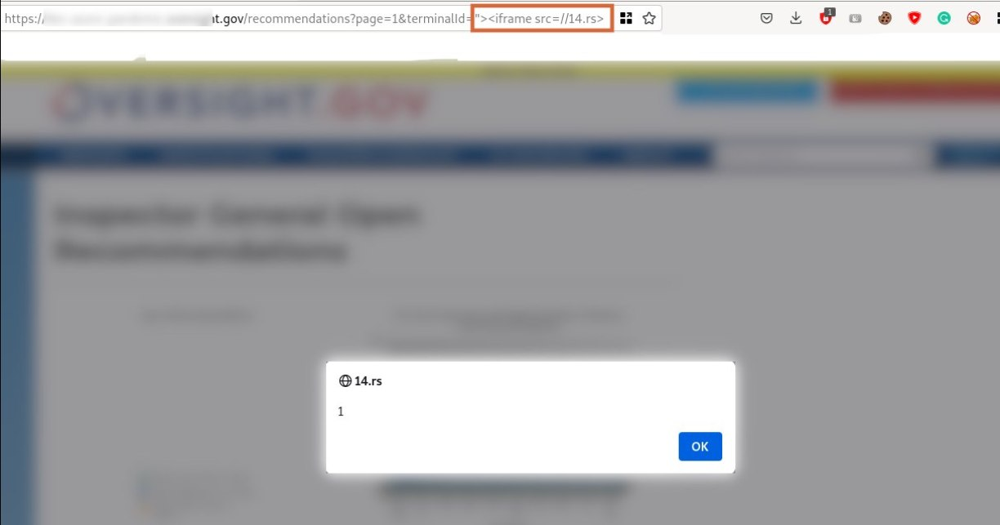

# cibsecurity
`2023-03-23`

* https://web.nvd.nist.gov/view/vuln/detail?vulnId=CVE-2023-27060

<blockquote>
‼ CVE-2023-27060 ‼

LightCMS v1.3.7 was discovered to contain a remote code execution (RCE) vulnerability via the image:make function.

📖 Read

via &quot;National Vulnerability Database&quot;.
</blockquote>

---

# cibsecurity
`2023-03-23`

* https://web.nvd.nist.gov/view/vuln/detail?vulnId=CVE-2023-27054

<blockquote>
‼ CVE-2023-27054 ‼

A cross-site scripting (XSS) vulnerability in MiroTalk P2P before commit f535b35 allows attackers to execute arbitrary web scripts or HTML via a crafted payload injected into the Name parameter under the settings module.

📖 Read

via &quot;National Vulnerability Database&quot;.
</blockquote>

---

# cibsecurity
`2023-03-22`

* https://web.nvd.nist.gov/view/vuln/detail?vulnId=CVE-2023-28663

<blockquote>
‼ CVE-2023-28663 ‼

The Formidable PRO2PDF WordPress Plugin, version &lt; 3.11, is affected by an authenticated SQL injection vulnerability in the ‘fieldmap’ parameter in the fpropdf_export_file action.

📖 Read

via &quot;National Vulnerability Database&quot;.
</blockquote>

---

# cibsecurity
`2023-03-22`

* https://web.nvd.nist.gov/view/vuln/detail?vulnId=CVE-2022-45004

<blockquote>
‼ CVE-2022-45004 ‼

Gophish through 0.12.1 was discovered to contain a cross-site scripting (XSS) vulnerability via a crafted landing page.

📖 Read

via &quot;National Vulnerability Database&quot;.
</blockquote>

---

# cibsecurity
`2023-03-22`

* https://web.nvd.nist.gov/view/vuln/detail?vulnId=CVE-2023-28661

<blockquote>
‼ CVE-2023-28661 ‼

The WP Popup Banners WordPress Plugin, version &lt;&#61; 1.2.5, is affected by an authenticated SQL injection vulnerability in the 'value' parameter in the get_popup_data action.

📖 Read

via &quot;National Vulnerability Database&quot;.
</blockquote>

---

# cibsecurity
`2023-03-22`

* https://web.nvd.nist.gov/view/vuln/detail?vulnId=CVE-2023-28662

<blockquote>
‼ CVE-2023-28662 ‼

The Gift Cards (Gift Vouchers and Packages) WordPress Plugin, version &lt;&#61; 4.3.1, is affected by an unauthenticated SQL injection vulnerability in the template parameter in the wpgv_doajax_voucher_pdf_save_func action.

📖 Read

via &quot;National Vulnerability Database&quot;.
</blockquote>

---

# cibsecurity
`2023-03-22`

* https://web.nvd.nist.gov/view/vuln/detail?vulnId=CVE-2023-28660

<blockquote>
‼ CVE-2023-28660 ‼

The Events Made Easy WordPress Plugin, version &lt;&#61; 2.3.14 is affected by an authenticated SQL injection vulnerability in the 'search_name' parameter in the eme_recurrences_list action.

📖 Read

via &quot;National Vulnerability Database&quot;.
</blockquote>

---

# cibsecurity
`2023-03-22`

* https://web.nvd.nist.gov/view/vuln/detail?vulnId=CVE-2023-28659

<blockquote>
‼ CVE-2023-28659 ‼

The Waiting: One-click Countdowns WordPress Plugin, version &lt;&#61; 0.6.2, is affected by an authenticated SQL injection vulnerability in the pbc_down[meta][id] parameter of the pbc_save_downs action.

📖 Read

via &quot;National Vulnerability Database&quot;.
</blockquote>

---

# cibsecurity
`2023-03-22`

* https://web.nvd.nist.gov/view/vuln/detail?vulnId=CVE-2023-21615

<blockquote>
‼ CVE-2023-21615 ‼

Experience Manager versions 6.5.15.0 (and earlier) are affected by a reflected Cross-Site Scripting (XSS) vulnerability. If a low-privileged attacker is able to convince a victim to visit a URL referencing a vulnerable page, malicious JavaScript content may be executed within the context of the victim's browser.

📖 Read

via &quot;National Vulnerability Database&quot;.
</blockquote>

---

# cibsecurity
`2023-03-22`

* https://web.nvd.nist.gov/view/vuln/detail?vulnId=CVE-2023-26426

<blockquote>
‼ CVE-2023-26426 ‼

Illustrator version 26.5.2 (and earlier) and 27.2.0 (and earlier) are affected by a Use After Free vulnerability that could result in arbitrary code execution in the context of the current user. Exploitation of this issue requires user interaction in that a victim must open a malicious file.

📖 Read

via &quot;National Vulnerability Database&quot;.
</blockquote>

---

# cibsecurity
`2023-03-22`

* https://web.nvd.nist.gov/view/vuln/detail?vulnId=CVE-2023-22254

<blockquote>
‼ CVE-2023-22254 ‼

Experience Manager versions 6.5.15.0 (and earlier) are affected by a reflected Cross-Site Scripting (XSS) vulnerability. If a low-privileged attacker is able to convince a victim to visit a URL referencing a vulnerable page, malicious JavaScript content may be executed within the context of the victim's browser.

📖 Read

via &quot;National Vulnerability Database&quot;.
</blockquote>

---

# cibsecurity
`2023-03-22`

* https://web.nvd.nist.gov/view/vuln/detail?vulnId=CVE-2023-21616

<blockquote>
‼ CVE-2023-21616 ‼

Experience Manager versions 6.5.15.0 (and earlier) are affected by a reflected Cross-Site Scripting (XSS) vulnerability. If a low-privileged attacker is able to convince a victim to visit a URL referencing a vulnerable page, malicious JavaScript content may be executed within the context of the victim's browser.

📖 Read

via &quot;National Vulnerability Database&quot;.
</blockquote>

---

# cibsecurity
`2023-03-22`

* https://web.nvd.nist.gov/view/vuln/detail?vulnId=CVE-2023-22269

<blockquote>
‼ CVE-2023-22269 ‼

Experience Manager versions 6.5.15.0 (and earlier) are affected by a reflected Cross-Site Scripting (XSS) vulnerability. If a low-privileged attacker is able to convince a victim to visit a URL referencing a vulnerable page, malicious JavaScript content may be executed within the context of the victim's browser.

📖 Read

via &quot;National Vulnerability Database&quot;.
</blockquote>

---

# cibsecurity
`2023-03-22`

* https://web.nvd.nist.gov/view/vuln/detail?vulnId=CVE-2023-22252

<blockquote>
‼ CVE-2023-22252 ‼

Experience Manager versions 6.5.15.0 (and earlier) are affected by a reflected Cross-Site Scripting (XSS) vulnerability. If a low-privileged attacker is able to convince a victim to visit a URL referencing a vulnerable page, malicious JavaScript content may be executed within the context of the victim's browser.

📖 Read

via &quot;National Vulnerability Database&quot;.
</blockquote>

---

# cibsecurity
`2023-03-22`

* https://web.nvd.nist.gov/view/vuln/detail?vulnId=CVE-2023-22253

<blockquote>
‼ CVE-2023-22253 ‼

Experience Manager versions 6.5.15.0 (and earlier) are affected by a reflected Cross-Site Scripting (XSS) vulnerability. If a low-privileged attacker is able to convince a victim to visit a URL referencing a vulnerable page, malicious JavaScript content may be executed within the context of the victim's browser.

📖 Read

via &quot;National Vulnerability Database&quot;.
</blockquote>

---

# cibsecurity
`2023-03-22`

* https://web.nvd.nist.gov/view/vuln/detail?vulnId=CVE-2023-26913

<blockquote>
‼ CVE-2023-26913 ‼

** UNSUPPORTED WHEN ASSIGNED ** EVOLUCARE ECSIMAGING (aka ECS Imaging) &lt; 6.21.5 is vulnerable to Cross Site Scripting (XSS) via new_movie. php.

📖 Read

via &quot;National Vulnerability Database&quot;.
</blockquote>

---

# cibsecurity
`2023-03-22`

* https://web.nvd.nist.gov/view/vuln/detail?vulnId=CVE-2023-1571

<blockquote>
‼ CVE-2023-1571 ‼

A vulnerability, which was classified as critical, was found in DataGear up to 4.5.0. This affects an unknown part of the file /analysisProject/pagingQueryData. The manipulation of the argument queryOrder leads to sql injection. It is possible to initiate the attack remotely. The exploit has been disclosed to the public and may be used. Upgrading to version 4.5.1 is able to address this issue. It is recommended to upgrade the affected component. The associated identifier of this vulnerability is VDB-223563.

📖 Read

via &quot;National Vulnerability Database&quot;.
</blockquote>

---

# cibsecurity
`2023-03-22`

* https://web.nvd.nist.gov/view/vuln/detail?vulnId=CVE-2023-1281

<blockquote>
‼ CVE-2023-1281 ‼

Use After Free vulnerability in Linux kernel traffic control index filter (tcindex) allows Privilege Escalation. The imperfect hash area can be updated while packets are traversing, which will cause a use-after-free when 'tcf_exts_exec()' is called with the destroyed tcf_ext. A local attacker user can use this vulnerability to elevate its privileges to root. This issue affects Linux Kernel: from 4.14 before git commit ee059170b1f7e94e55fa6cadee544e176a6e59c2.

📖 Read

via &quot;National Vulnerability Database&quot;.
</blockquote>

---

# cibsecurity
`2023-03-22`

* https://web.nvd.nist.gov/view/vuln/detail?vulnId=CVE-2023-1564

<blockquote>
‼ CVE-2023-1564 ‼

A vulnerability was found in SourceCodester Air Cargo Management System 1.0 and classified as critical. Affected by this issue is some unknown functionality of the file admin/transactions/update_status.php of the component GET Parameter Handler. The manipulation of the argument id leads to sql injection. The attack may be launched remotely. The exploit has been disclosed to the public and may be used. The identifier of this vulnerability is VDB-223556.

📖 Read

via &quot;National Vulnerability Database&quot;.
</blockquote>

---

# cibsecurity
`2023-03-22`

* https://web.nvd.nist.gov/view/vuln/detail?vulnId=CVE-2023-27638

<blockquote>
‼ CVE-2023-27638 ‼

An issue was discovered in the tshirtecommerce (aka Custom Product Designer) component 2.1.4 for PrestaShop. An HTTP request can be forged with a compromised tshirtecommerce_design_cart_id GET parameter in order to exploit an insecure parameter in the functions hookActionCartSave and updateCustomizationTable, which could lead to a SQL injection. This is exploited in the wild in March 2023.

📖 Read

via &quot;National Vulnerability Database&quot;.
</blockquote>

---

# cibsecurity
`2023-03-22`

* https://web.nvd.nist.gov/view/vuln/detail?vulnId=CVE-2023-27637

<blockquote>
‼ CVE-2023-27637 ‼

An issue was discovered in the tshirtecommerce (aka Custom Product Designer) component 2.1.4 for PrestaShop. An HTTP request can be forged with a compromised product_id GET parameter in order to exploit an insecure parameter in the front controller file designer.php, which could lead to a SQL injection. This is exploited in the wild in March 2023.

📖 Read

via &quot;National Vulnerability Database&quot;.
</blockquote>

---

# cibsecurity
`2023-03-22`

* https://web.nvd.nist.gov/view/vuln/detail?vulnId=CVE-2023-1563

<blockquote>
‼ CVE-2023-1563 ‼

A vulnerability has been found in SourceCodester Student Study Center Desk Management System 1.0 and classified as critical. Affected by this vulnerability is an unknown functionality of the file /admin/assign/assign.php. The manipulation of the argument id leads to sql injection. The attack can be launched remotely. The exploit has been disclosed to the public and may be used. The associated identifier of this vulnerability is VDB-223555.

📖 Read

via &quot;National Vulnerability Database&quot;.
</blockquote>

---

# cibsecurity
`2023-03-22`

* https://web.nvd.nist.gov/view/vuln/detail?vulnId=CVE-2023-1556

<blockquote>
‼ CVE-2023-1556 ‼

A vulnerability was found in SourceCodester Judging Management System 1.0. It has been declared as critical. Affected by this vulnerability is an unknown functionality of the file summary_results.php. The manipulation of the argument main_event_id leads to sql injection. The attack can be launched remotely. The exploit has been disclosed to the public and may be used. The identifier VDB-223549 was assigned to this vulnerability.

📖 Read

via &quot;National Vulnerability Database&quot;.
</blockquote>

---

# cibsecurity
`2023-03-21`

* https://web.nvd.nist.gov/view/vuln/detail?vulnId=CVE-2018-25082

<blockquote>
‼ CVE-2018-25082 ‼

A vulnerability was found in zwczou WeChat SDK Python 0.3.0 and classified as critical. This issue affects the function validate/to_xml. The manipulation leads to xml external entity reference. The attack may be initiated remotely. Upgrading to version 0.5.5 is able to address this issue. The name of the patch is e54abadc777715b6dcb545c13214d1dea63df6c9. It is recommended to upgrade the affected component. The associated identifier of this vulnerability is VDB-223403.

📖 Read

via &quot;National Vulnerability Database&quot;.
</blockquote>

---

# cibsecurity
`2023-03-21`

* https://web.nvd.nist.gov/view/vuln/detail?vulnId=CVE-2023-27569

<blockquote>
‼ CVE-2023-27569 ‼

The eo_tags package before 1.3.0 for PrestaShop allows SQL injection via an HTTP User-Agent or Referer header.

📖 Read

via &quot;National Vulnerability Database&quot;.
</blockquote>

---

# cibsecurity
`2023-03-21`

* https://web.nvd.nist.gov/view/vuln/detail?vulnId=CVE-2023-25684

<blockquote>
‼ CVE-2023-25684 ‼

IBM Security Guardium Key Lifecycle Manager 3.0, 3.0.1, 4.0, 4.1, and 4.1.1 is vulnerable to SQL injection. A remote attacker could send specially crafted SQL statements, which could allow the attacker to view, add, modify or delete information in the back-end database. IBM X-Force ID: 247597.

📖 Read

via &quot;National Vulnerability Database&quot;.
</blockquote>

---

# cibsecurity
`2023-03-21`

* https://web.nvd.nist.gov/view/vuln/detail?vulnId=CVE-2023-27570

<blockquote>
‼ CVE-2023-27570 ‼

The eo_tags package before 1.4.19 for PrestaShop allows SQL injection via a crafted _ga cookie.

📖 Read

via &quot;National Vulnerability Database&quot;.
</blockquote>

---

# cibsecurity
`2023-03-21`

* https://web.nvd.nist.gov/view/vuln/detail?vulnId=CVE-2023-27874

<blockquote>
‼ CVE-2023-27874 ‼

IBM Aspera Faspex 4.4.2 is vulnerable to an XML external entity injection (XXE) attack when processing XML data. A remote authenticated attacker could exploit this vulnerability to execute arbitrary commands. IBM X-Force ID: 249845.

📖 Read

via &quot;National Vulnerability Database&quot;.
</blockquote>

---

# defcon_news
`2023-03-21`

<blockquote>
Mitigating SSRF in 2023
https://www.reddit.com/r/netsec/comments/11ximoh/mitigating_ssrf_in_2023/
</blockquote>

<table><tr><td><b>→</b><a href="https://www.reddit.com/r/netsec/comments/11ximoh/mitigating_ssrf_in_2023/">
https://www.reddit.com/r/netsec/comments/11ximoh/mitigating_ssrf_in_2023/
</a>
<blockquote>
470K subscribers in the netsec community. /r/netsec is a community-curated aggregator of technical information security content. Our mission is to…
</blockquote>
</td></tr></table>

---

# cibsecurity
`2023-03-21`

* https://web.nvd.nist.gov/view/vuln/detail?vulnId=CVE-2023-1153

<blockquote>
‼ CVE-2023-1153 ‼

Improper Neutralization of Special Elements used in an SQL Command ('SQL Injection') vulnerability in Pacsrapor allows SQL Injection, Command Line Execution through SQL Injection.This issue affects Pacsrapor: before 1.22.

📖 Read

via &quot;National Vulnerability Database&quot;.
</blockquote>

---

# cibsecurity
`2023-03-21`

* https://web.nvd.nist.gov/view/vuln/detail?vulnId=CVE-2023-27984

<blockquote>
‼ CVE-2023-27984 ‼

A CWE-20: Improper Input Validation vulnerability exists in Custom Reports that could cause a macro to be executed, potentially leading to remote code execution when a user opens a malicious report file planted by an attacker. Affected Products: IGSS Data Server(IGSSdataServer.exe)(V16.0.0.23040 and prior), IGSS Dashboard(DashBoard.exe)(V16.0.0.23040 and prior), Custom Reports(RMS16.dll)(V16.0.0.23040 and prior).

📖 Read

via &quot;National Vulnerability Database&quot;.
</blockquote>

---

# cibsecurity
`2023-03-21`

* https://web.nvd.nist.gov/view/vuln/detail?vulnId=CVE-2023-1545

<blockquote>
‼ CVE-2023-1545 ‼

SQL Injection in GitHub repository nilsteampassnet/teampass prior to 3.0.0.23.

📖 Read

via &quot;National Vulnerability Database&quot;.
</blockquote>

---

# cibsecurity
`2023-03-21`

* https://web.nvd.nist.gov/view/vuln/detail?vulnId=CVE-2023-1527

<blockquote>
‼ CVE-2023-1527 ‼

Cross-site Scripting (XSS) - Generic in GitHub repository tsolucio/corebos prior to 8.0.

📖 Read

via &quot;National Vulnerability Database&quot;.
</blockquote>

---

# cibsecurity
`2023-03-21`

* https://web.nvd.nist.gov/view/vuln/detail?vulnId=CVE-2012-10009

<blockquote>
‼ CVE-2012-10009 ‼

A vulnerability was found in 404like Plugin up to 1.0.2. It has been classified as critical. Affected is the function checkPage of the file 404Like.php. The manipulation of the argument searchWord leads to sql injection. It is possible to launch the attack remotely. Upgrading to version 1.0.2 is able to address this issue. The name of the patch is 2c4b589d27554910ab1fd104ddbec9331b540f7f. It is recommended to upgrade the affected component. The identifier of this vulnerability is VDB-223404.

📖 Read

via &quot;National Vulnerability Database&quot;.
</blockquote>

---

# cibsecurity
`2023-03-20`

* https://web.nvd.nist.gov/view/vuln/detail?vulnId=CVE-2023-1517

<blockquote>
‼ CVE-2023-1517 ‼

Cross-site Scripting (XSS) - DOM in GitHub repository pimcore/pimcore prior to 10.5.19.

📖 Read

via &quot;National Vulnerability Database&quot;.
</blockquote>

---

# cibsecurity
`2023-03-20`

* https://web.nvd.nist.gov/view/vuln/detail?vulnId=CVE-2023-0875

<blockquote>
‼ CVE-2023-0875 ‼

The WP Meta SEO WordPress plugin before 4.5.3 does not properly sanitize and escape inputs into SQL queries, leading to a blind SQL Injection vulnerability that can be exploited by subscriber+ users.

📖 Read

via &quot;National Vulnerability Database&quot;.
</blockquote>

---

# cibsecurity
`2023-03-20`

* https://web.nvd.nist.gov/view/vuln/detail?vulnId=CVE-2023-27586

<blockquote>
‼ CVE-2023-27586 ‼

CairoSVG is an SVG converter based on Cairo, a 2D graphics library. Prior to version 2.7.0, Cairo can send requests to external hosts when processing SVG files. A malicious actor could send a specially crafted SVG file that allows them to perform a server-side request forgery or denial of service. Version 2.7.0 disables CairoSVG's ability to access other files online by default.

📖 Read

via &quot;National Vulnerability Database&quot;.
</blockquote>

---

# proxy_bar
`2023-03-20`

<blockquote>
bypass for the FortiWeb (Fortinet) WAF
usage:
&quot;&gt;&lt;iframe src&#61;//14.rs&gt;
то есть вместо стандартной полезной нагрузки XSS для выполнения js
</blockquote>

---

# cibsecurity
`2023-03-20`

* https://web.nvd.nist.gov/view/vuln/detail?vulnId=CVE-2023-1515

<blockquote>
‼ CVE-2023-1515 ‼

Cross-site Scripting (XSS) - Stored in GitHub repository pimcore/pimcore prior to 10.5.19.

📖 Read

via &quot;National Vulnerability Database&quot;.
</blockquote>

---

# cibsecurity
`2023-03-20`

* https://web.nvd.nist.gov/view/vuln/detail?vulnId=CVE-2023-22680

<blockquote>
‼ CVE-2023-22680 ‼

Auth. (admin+) Stored Cross-Site Scripting (XSS) vulnerability in Altanic No API Amazon Affiliate plugin &lt;&#61; 4.2.2 versions.

📖 Read

via &quot;National Vulnerability Database&quot;.
</blockquote>

---

# cibsecurity
`2023-03-20`

* https://web.nvd.nist.gov/view/vuln/detail?vulnId=CVE-2022-47591

<blockquote>
‼ CVE-2022-47591 ‼

Reflected Cross-Site Scripting (XSS) vulnerability in Mickael Austoni Map Multi Marker plugin &lt;&#61; 3.2.1 versions.

📖 Read

via &quot;National Vulnerability Database&quot;.
</blockquote>

---

# cibsecurity
`2023-03-20`

* https://web.nvd.nist.gov/view/vuln/detail?vulnId=CVE-2023-22682

<blockquote>
‼ CVE-2023-22682 ‼

Reflected Cross-Site Scripting (XSS) vulnerability in Manuel Masia | Pixedelic.Com Camera slideshow plugin &lt;&#61; 1.4.0.1 versions.

📖 Read

via &quot;National Vulnerability Database&quot;.
</blockquote>

---

# cibsecurity
`2023-03-20`

* https://web.nvd.nist.gov/view/vuln/detail?vulnId=CVE-2023-22679

<blockquote>
‼ CVE-2023-22679 ‼

Auth. (admin+) Stored Cross-Site Scripting (XSS) vulnerability in Nicolas Lemoine WP Better Emails plugin &lt;&#61; 0.4 versions.

📖 Read

via &quot;National Vulnerability Database&quot;.
</blockquote>

---

# cibsecurity
`2023-03-20`

* https://web.nvd.nist.gov/view/vuln/detail?vulnId=CVE-2022-47592

<blockquote>
‼ CVE-2022-47592 ‼

Reflected Cross-Site Scripting (XSS) vulnerability in Dmytriy.Cooperman MagicForm plugin &lt;&#61; 0.1 versions.

📖 Read

via &quot;National Vulnerability Database&quot;.
</blockquote>

---

# cibsecurity
`2023-03-20`

* https://web.nvd.nist.gov/view/vuln/detail?vulnId=CVE-2023-28424

<blockquote>
‼ CVE-2023-28424 ‼

Soko if the code that powers packages.gentoo.org. Prior to version 1.0.2, the two package search handlers, `Search` and `SearchFeed`, implemented in `pkg/app/handler/packages/search.go`, are affected by a SQL injection via the `q` parameter. As a result, unauthenticated attackers can execute arbitrary SQL queries on `https://packages.gentoo.org/`. It was also demonstrated that primitive was enough to gain code execution in the context of the PostgreSQL container. The issue was addressed in commit `4fa6e4b619c0362728955b6ec56eab0e0cbf1e23y` of version 1.0.2 using prepared statements to interpolate user-controlled data in SQL queries.

📖 Read

via &quot;National Vulnerability Database&quot;.
</blockquote>

---

# cibsecurity
`2023-03-20`

* https://web.nvd.nist.gov/view/vuln/detail?vulnId=CVE-2023-23718

<blockquote>
‼ CVE-2023-23718 ‼

Auth. (admin+) Cross-Site Scripting (XSS) vulnerability in Esstat17 Page Loading Effects plugin &lt;&#61; 2.0.0 versions.

📖 Read

via &quot;National Vulnerability Database&quot;.
</blockquote>

---

# defcon_news
`2023-03-20`

<blockquote>
101+ News Portal 1.0 SQL Injection
https://packetstormsecurity.com/files/171401/101newsportal10-sql.txt
</blockquote>

<table><tr><td><b>→</b><a href="https://packetstormsecurity.com/files/171401/101newsportal10-sql.txt">
https://packetstormsecurity.com/files/171401/101newsportal10-sql.txt
</a>
<blockquote>
Information Security Services, News, Files, Tools, Exploits, Advisories and Whitepapers
</blockquote>
</td></tr></table>

---

# defcon_news
`2023-03-20`

<blockquote>
Online Pizza Ordering System 1.0 SQL Injection
https://packetstormsecurity.com/files/171393/opoo10-sql.txt
</blockquote>

<table><tr><td><b>→</b><a href="https://packetstormsecurity.com/files/171393/opoo10-sql.txt">
https://packetstormsecurity.com/files/171393/opoo10-sql.txt
</a>
<blockquote>
Information Security Services, News, Files, Tools, Exploits, Advisories and Whitepapers
</blockquote>
</td></tr></table>

---

# defcon_news
`2023-03-20`

<blockquote>
Human Resources Management System 1.0 SQL Injection
https://packetstormsecurity.com/files/171392/hrms10-sql.txt
</blockquote>

<table><tr><td><b>→</b><a href="https://packetstormsecurity.com/files/171392/hrms10-sql.txt">
https://packetstormsecurity.com/files/171392/hrms10-sql.txt
</a>
<blockquote>
Information Security Services, News, Files, Tools, Exploits, Advisories and Whitepapers
</blockquote>
</td></tr></table>

---

# defcon_news
`2023-03-20`

<blockquote>
Yoga Class Registration 1.0 SQL Injection
https://packetstormsecurity.com/files/171391/ycr10-sql.txt
</blockquote>

<table><tr><td><b>→</b><a href="https://packetstormsecurity.com/files/171391/ycr10-sql.txt">
https://packetstormsecurity.com/files/171391/ycr10-sql.txt
</a>
<blockquote>
Information Security Services, News, Files, Tools, Exploits, Advisories and Whitepapers
</blockquote>
</td></tr></table>

---

# cibsecurity
`2023-03-20`

* https://web.nvd.nist.gov/view/vuln/detail?vulnId=CVE-2023-1250

<blockquote>
‼ CVE-2023-1250 ‼

Improper Input Validation vulnerability in OTRS AG OTRS (ACL modules), OTRS AG ((OTRS)) Community Edition (ACL modules) allows Local Execution of Code. When creating/importing an ACL it was possible to inject code that gets executed via manipulated comments and ACL-names This issue affects OTRS: from 7.0.X before 7.0.42, from 8.0.X before 8.0.31; ((OTRS)) Community Edition: from 6.0.1 through 6.0.34.

📖 Read

via &quot;National Vulnerability Database&quot;.
</blockquote>

---

# cibsecurity
`2023-03-20`

* https://web.nvd.nist.gov/view/vuln/detail?vulnId=CVE-2023-1503

<blockquote>
‼ CVE-2023-1503 ‼

A vulnerability classified as critical has been found in SourceCodester Alphaware Simple E-Commerce System 1.0. This affects an unknown part of the file admin/admin_index.php. The manipulation of the argument username/password with the input admin' AND (SELECT 8062 FROM (SELECT(SLEEP(5)))meUD)-- hLiX leads to sql injection. It is possible to initiate the attack remotely. The exploit has been disclosed to the public and may be used. The associated identifier of this vulnerability is VDB-223407.

📖 Read

via &quot;National Vulnerability Database&quot;.
</blockquote>

---

# cibsecurity
`2023-03-20`

* https://web.nvd.nist.gov/view/vuln/detail?vulnId=CVE-2023-1504

<blockquote>
‼ CVE-2023-1504 ‼

A vulnerability classified as critical was found in SourceCodester Alphaware Simple E-Commerce System 1.0. This vulnerability affects unknown code. The manipulation of the argument email/password with the input test1%40test.com ' AND (SELECT 6077 FROM (SELECT(SLEEP(5)))dltn) AND 'PhRa'&#61;'PhRa leads to sql injection. The attack can be initiated remotely. The exploit has been disclosed to the public and may be used. The identifier of this vulnerability is VDB-223408.

📖 Read

via &quot;National Vulnerability Database&quot;.
</blockquote>

---

# cibsecurity
`2023-03-20`

* https://web.nvd.nist.gov/view/vuln/detail?vulnId=CVE-2023-1248

<blockquote>
‼ CVE-2023-1248 ‼

Improper Input Validation vulnerability in OTRS AG OTRS (Ticket Actions modules), OTRS AG ((OTRS)) Community Edition (Ticket Actions modules) allows Cross-Site Scripting (XSS).This issue affects OTRS: from 7.0.X before 7.0.42; ((OTRS)) Community Edition: from 6.0.1 through 6.0.34.

📖 Read

via &quot;National Vulnerability Database&quot;.
</blockquote>

---

# cibsecurity
`2023-03-20`

* https://web.nvd.nist.gov/view/vuln/detail?vulnId=CVE-2023-1502

<blockquote>
‼ CVE-2023-1502 ‼

A vulnerability was found in SourceCodester Alphaware Simple E-Commerce System 1.0. It has been rated as critical. Affected by this issue is some unknown functionality of the file function/edit_customer.php. The manipulation of the argument firstname/mi/lastname with the input a' RLIKE SLEEP(5) AND 'dAbu'&#61;'dAbu leads to sql injection. The attack may be launched remotely. The exploit has been disclosed to the public and may be used. VDB-223406 is the identifier assigned to this vulnerability.

📖 Read

via &quot;National Vulnerability Database&quot;.
</blockquote>

---

# cibsecurity
`2023-03-20`

* https://web.nvd.nist.gov/view/vuln/detail?vulnId=CVE-2023-1505

<blockquote>
‼ CVE-2023-1505 ‼

A vulnerability, which was classified as critical, has been found in SourceCodester E-Commerce System 1.0. This issue affects some unknown processing of the file /ecommerce/admin/settings/setDiscount.php. The manipulation of the argument id with the input 201737 AND (SELECT 8973 FROM (SELECT(SLEEP(5)))OoAD) leads to sql injection. The attack may be initiated remotely. The exploit has been disclosed to the public and may be used. The identifier VDB-223409 was assigned to this vulnerability.

📖 Read

via &quot;National Vulnerability Database&quot;.
</blockquote>

---

# cibsecurity
`2023-03-20`

* https://web.nvd.nist.gov/view/vuln/detail?vulnId=CVE-2022-4933

<blockquote>
‼ CVE-2022-4933 ‼

A vulnerability, which was classified as critical, has been found in ATM Consulting dolibarr_module_quicksupplierprice up to 1.1.6. Affected by this issue is the function upatePrice of the file script/interface.php. The manipulation leads to sql injection. The attack may be launched remotely. Upgrading to version 1.1.7 is able to address this issue. The name of the patch is ccad1e4282b0e393a32fcc852e82ec0e0af5446f. It is recommended to upgrade the affected component. VDB-223382 is the identifier assigned to this vulnerability.

📖 Read

via &quot;National Vulnerability Database&quot;.
</blockquote>

---

# defcon_news
`2023-03-19`

<blockquote>
TD Bank: Reflected XSS on Admin Login Page
https://vulners.com/hackerone/H1:1858495?utm_source&#61;rss&amp;utm_medium&#61;rss&amp;utm_campaign&#61;rss
</blockquote>

<table><tr><td><b>→</b><a href="https://vulners.com/hackerone/H1:1858495?utm_source=rss&utm_medium=rss&utm_campaign=rss">
https://vulners.com/hackerone/H1:1858495?utm_source=rss&utm_medium=rss&utm_campaign=rss
</a>
<blockquote>
When you try to access private pages on the domain https://td.intelliresponse.com/a6 you are redirected to a login page, which has reflected values in the DOM from the URL on the parameter 'win'. Once there is no proper handle for the data reflected, it turns out into a vulnerable path on the application that could be used to perform a Cross Site Scripting attack. Proof of Concept Access the current URL and the alert with your cookie will pop up on the screen: https://td.intelliresponse.com/a6/shared/popupLogin.jsp?win&#61;%22%3E%3Cscript%3Ealert(document.cookie)%3C/script%3E Steps To Reproduce:  Access the endpoint https://td.intelliresponse.com/a6 Now redirected to the login page, see the win parameter on the URL and modify with some payload starting with &quot;&gt;, and add some text or script in front. See on your screen the payload completed reflected.   Supporting Material/References: {F2149294} Recommendation/Remediation/Fix: Mitigations for XSS typically involve sanitizing data input (to make sure input does not…
</blockquote>
</td></tr></table>

---

# cibsecurity
`2023-03-19`

* https://web.nvd.nist.gov/view/vuln/detail?vulnId=CVE-2023-1498

<blockquote>
‼ CVE-2023-1498 ‼

A vulnerability classified as critical has been found in code-projects Responsive Hotel Site 1.0. Affected is an unknown function of the file messages.php of the component Newsletter Log Handler. The manipulation of the argument title leads to sql injection. It is possible to launch the attack remotely. The exploit has been disclosed to the public and may be used. VDB-223398 is the identifier assigned to this vulnerability.

📖 Read

via &quot;National Vulnerability Database&quot;.
</blockquote>

---

# cibsecurity
`2023-03-19`

* https://web.nvd.nist.gov/view/vuln/detail?vulnId=CVE-2023-1499

<blockquote>
‼ CVE-2023-1499 ‼

A vulnerability classified as critical was found in code-projects Simple Art Gallery 1.0. Affected by this vulnerability is an unknown functionality of the file adminHome.php. The manipulation of the argument reach_city leads to sql injection. The attack can be launched remotely. The exploit has been disclosed to the public and may be used. The associated identifier of this vulnerability is VDB-223399.

📖 Read

via &quot;National Vulnerability Database&quot;.
</blockquote>

---

# cibsecurity
`2023-03-19`

* https://web.nvd.nist.gov/view/vuln/detail?vulnId=CVE-2023-1496

<blockquote>
‼ CVE-2023-1496 ‼

Cross-site Scripting (XSS) - Reflected in GitHub repository imgproxy/imgproxy prior to 3.14.0.

📖 Read

via &quot;National Vulnerability Database&quot;.
</blockquote>

---

# proxy_bar
`2023-03-19`

* https://github.com/hackerhouse-opensource/iscsicpl_bypassUAC

<blockquote>
UAC bypass for x64 Windows 7 - 11
Понятно 
iscsicpl.exe уязвим к перехвату порядка поиска DLL при запуске 32-битного бинарного файла Microsoft на 64-битном хосте через SysWOW64.
</blockquote>

---

# ctfchat
`2023-03-19`

<blockquote>
Ну дальше так и не продвинулись, искали rce в xxe
</blockquote>

---

# ctfchat
`2023-03-19`

<blockquote>
С xxe вытащили просто и глядели
</blockquote>

---

# ctfchat
`2023-03-19`

<blockquote>
spice - там просто local file inclusion был через параметр article
читаешь getSecret - получаешь ключ подписи JWT
подписываешь JWT под админом
потом через параметр bf_base16 можешь подавать на вход brainfuck в hex, который исполняется и вывод передается в функцию passthru() - она исполняет поданный аргумент как shell команду
получаешь RCE, делаешь ls - там flag.txt
читаешь его - там написано, что флан в env
исполняешь env
получаешь флаг
</blockquote>

---

# cibsecurity
`2023-03-18`

* https://web.nvd.nist.gov/view/vuln/detail?vulnId=CVE-2023-1482

<blockquote>
‼ CVE-2023-1482 ‼

A vulnerability, which was classified as problematic, was found in HkCms 2.2.4.230206. This affects an unknown part of the file /admin.php/appcenter/local.html?type&#61;addon of the component External Plugin Handler. The manipulation leads to code injection. It is possible to initiate the attack remotely. The exploit has been disclosed to the public and may be used. The identifier VDB-223365 was assigned to this vulnerability.

📖 Read

via &quot;National Vulnerability Database&quot;.
</blockquote>

---

# cibsecurity
`2023-03-18`

* https://web.nvd.nist.gov/view/vuln/detail?vulnId=CVE-2023-1483

<blockquote>
‼ CVE-2023-1483 ‼

A vulnerability has been found in XiaoBingBy TeaCMS up to 2.0.2 and classified as critical. This vulnerability affects unknown code of the file /admin/getallarticleinfo. The manipulation of the argument searchInfo leads to sql injection. The attack can be initiated remotely. VDB-223366 is the identifier assigned to this vulnerability.

📖 Read

via &quot;National Vulnerability Database&quot;.
</blockquote>

---

# Leakers_squad
`2023-03-18`

* https://github.com/sqlmapproject/sqlmap
* https://github.com/ron190/jsql-injection
* https://github.com/Neohapsis/bbqsql
* https://github.com/codingo/NoSQLMap
* https://kalilinuxtutorials.com/whitewidow/
* https://github.com/stamparm/DSSS
* https://github.com/dtag-dev-sec/explo
* https://github.com/awnumar/blind-sql-bitshifting
* https://github.com/leviathan-framework/leviathan
* https://github.com/JohnTroony/Blisqy
* https://t.me/leakers_Squad/1841

<blockquote>
Open Source SQL Injection Tools 

1 SQLMap – Automatic SQL Injection And Database Takeover Tool

2 jSQL Injection – Java Tool For Automatic SQL Database Injection

3 BBQSQL – A Blind SQL-Injection Exploitation Tool

4 NoSQLMap – Automated NoSQL Database Pwnage

5 Whitewidow – SQL Vulnerability Scanner

6 DSSS – Damn Small SQLi Scanner

7 explo – Human And Machine Readable Web Vulnerability Testing Format

8 Blind-Sql-Bitshifting – Blind SQL-Injection via Bitshifting

9 Leviathan – Wide Range Mass Audit Toolkit

10 Blisqy – Exploit Time-based blind-SQL-injection in HTTP-Headers (MySQL/MariaDB)

⚠️𝗠𝗔𝗞𝗘 @JokerFrozen 𝗔𝗗𝗠𝗜𝗡 𝗜𝗡 𝗬𝗢𝗨𝗥 𝗖𝗛𝗔𝗡𝗡𝗘𝗟 𝗙𝗢𝗥 𝗔𝗠𝗔𝗭𝗜𝗡𝗚 𝗣𝗢𝗦𝗧𝗦 𝗧𝗛𝗔𝗧 𝗛𝗘𝗟𝗣𝗦 𝗧𝗢 ❤️ 𝗚𝗥𝗢𝗪 𝗬𝗢𝗨𝗥 𝗖𝗛𝗔𝗡𝗡𝗘𝗟 𝟭𝟬𝟭%💗

If you want to report any copyright violation, please write to us at  @Leakers_squad_bot and we will ensure to remove that post within 48 hours
Read this
</blockquote>

<table><tr><td><b>→</b><a href="https://github.com/sqlmapproject/sqlmap">
https://github.com/sqlmapproject/sqlmap
</a>
<blockquote>
Automatic SQL injection and database takeover tool - GitHub - sqlmapproject/sqlmap: Automatic SQL injection and database takeover tool
</blockquote>
</td></tr></table>

---

# defcon_news
`2023-03-18`

<blockquote>
Internet Bug Bounty: RCE vulnerability in apache-airflow-providers-apache-sqoop 3.1.0
https://vulners.com/hackerone/H1:1891795?utm_source&#61;rss&amp;utm_medium&#61;rss&amp;utm_campaign&#61;rss
</blockquote>

<table><tr><td><b>→</b><a href="https://vulners.com/hackerone/H1:1891795">
https://vulners.com/hackerone/H1:1891795
</a>
<blockquote>
In airflow.providers.apache.sqoop.hooks.sqoop.SqoopHook._prepare_command, users can control -libjars through libjars in Connection. -libjars makes sure each MR task gets these jars in classpath, So I can set this as a malicious Jar package, causing arbitrary system commands to be executed on the machine performing the MR task. This is a screenshot of my email reporting this vulnerability  ██████████ Impact Remote Code...
</blockquote>
</td></tr></table>

---

# cibsecurity
`2023-03-17`

* https://web.nvd.nist.gov/view/vuln/detail?vulnId=CVE-2023-27591

<blockquote>
‼ CVE-2023-27591 ‼

Miniflux is a feed reader. Prior to version 2.0.43, an unauthenticated user can retrieve Prometheus metrics from a publicly reachable Miniflux instance where the `METRICS_COLLECTOR` configuration option is enabled and `METRICS_ALLOWED_NETWORKS` is set to `127.0.0.1/8` (the default). A patch is available in Miniflux 2.0.43. As a workaround, set `METRICS_COLLECTOR` to `false` (default) or run Miniflux behind a trusted reverse-proxy.

📖 Read

via &quot;National Vulnerability Database&quot;.
</blockquote>

---

# cibsecurity
`2023-03-17`

* https://web.nvd.nist.gov/view/vuln/detail?vulnId=CVE-2023-28112

<blockquote>
‼ CVE-2023-28112 ‼

Discourse is an open-source discussion platform. Prior to version 3.1.0.beta3 of the `beta` and `tests-passed` branches, some user provided URLs were being passed to FastImage without SSRF protection. Insufficient protections could enable attackers to trigger outbound network connections from the Discourse server to private IP addresses. This affects any site running the `tests-passed` or `beta` branches versions 3.1.0.beta2 and prior. This issue is patched in version 3.1.0.beta3 of the `beta` and `tests-passed` branches. There are no known workarounds.

📖 Read

via &quot;National Vulnerability Database&quot;.
</blockquote>

---

# cibsecurity
`2023-03-17`

* https://web.nvd.nist.gov/view/vuln/detail?vulnId=CVE-2023-28111

<blockquote>
‼ CVE-2023-28111 ‼

Discourse is an open-source discussion platform. Prior to version 3.1.0.beta3 of the `beta` and `tests-passed` branches, attackers are able to bypass Discourse's server-side request forgery (SSRF) protection for private IPv4 addresses by using a IPv4-mapped IPv6 address. The issue is patched in the latest beta and tests-passed version of Discourse. version 3.1.0.beta3 of the `beta` and `tests-passed` branches. There are no known workarounds.

📖 Read

via &quot;National Vulnerability Database&quot;.
</blockquote>

---

# cibsecurity
`2023-03-17`

* https://web.nvd.nist.gov/view/vuln/detail?vulnId=CVE-2023-1475

<blockquote>
‼ CVE-2023-1475 ‼

A vulnerability, which was classified as critical, has been found in SourceCodester Canteen Management System 1.0. This issue affects the function query of the file createuser.php. The manipulation of the argument uemail leads to sql injection. The attack may be initiated remotely. The exploit has been disclosed to the public and may be used. The identifier VDB-223337 was assigned to this vulnerability.

📖 Read

via &quot;National Vulnerability Database&quot;.
</blockquote>

---

# cibsecurity
`2023-03-17`

* https://web.nvd.nist.gov/view/vuln/detail?vulnId=CVE-2023-1471

<blockquote>
‼ CVE-2023-1471 ‼

The WP Popup Banners plugin for WordPress is vulnerable to SQL Injection via the 'banner_id' parameter in versions up to, and including, 1.2.5 due to insufficient escaping on the user supplied parameter and lack of sufficient preparation on the existing SQL query. This makes it possible for authenticated attackers with minimal permissions, such as a subscrber, to append additional SQL queries into already existing queries that can be used to extract sensitive information from the database.

📖 Read

via &quot;National Vulnerability Database&quot;.
</blockquote>

---

# cibsecurity
`2023-03-17`

* https://web.nvd.nist.gov/view/vuln/detail?vulnId=CVE-2022-45814

<blockquote>
‼ CVE-2022-45814 ‼

Stored Cross-Site Scripting (XSS) vulnerability in Fabian von Allmen WP Calendar plugin &lt;&#61; 1.5.3 versions.

📖 Read

via &quot;National Vulnerability Database&quot;.
</blockquote>

---

# cibsecurity
`2023-03-17`

* https://web.nvd.nist.gov/view/vuln/detail?vulnId=CVE-2022-45817

<blockquote>
‼ CVE-2022-45817 ‼

Cross-Site Scripting (XSS) vulnerability in Erin Garscadden GC Testimonials plugin &lt;&#61; 1.3.2 versions.

📖 Read

via &quot;National Vulnerability Database&quot;.
</blockquote>

---

# cibsecurity
`2023-03-17`

* https://web.nvd.nist.gov/view/vuln/detail?vulnId=CVE-2022-43461

<blockquote>
‼ CVE-2022-43461 ‼

Stored Cross-Site Scripting (XSS) vulnerability in John West Slideshow SE plugin &lt;&#61; 2.5.5 versions.

📖 Read

via &quot;National Vulnerability Database&quot;.
</blockquote>

---

# Leakers_squad
`2023-03-17`

* https://t.me/leakers_Squad/1841

<blockquote>
Top 10 Hacking And CyberSecurity Course For FREE

Link 1 :https://www.udemy.com/course/burp-suite/

link 2 :https://www.udemy.com/course/sql-injection-ethical-hacking/

link 3 :https://www.udemy.com/course/computer-hacking-fundamentals/

link 4 :https://www.udemy.com/course/ethical-hacking-basics-kali-20211/

link 5 :https://www.udemy.com/course/foundations-of-hacking-and-pentesting-android-apps/

link 6 :https://www.udemy.com/course/ethical-hacking-for-beginners-in-hindi/

link 7 :https://www.udemy.com/course/lees-web-hacking-cross-site-scripting-sql-injection/

link 8:https://www.udemy.com/course/ethical-hacking-with-parrot-security-os/

link 9 :https://www.udemy.com/course/ethical-hacking-for-beginners-beginner-to-advance/

link 10 : https://www.udemy.com/course/introduction-to-dark-web-anonymity-and-cryptocurrency/

✦•━━━━━━━━━━━━━━━━━•✦

Make @stranger_0_0 admin for this type of posts😉❤️

If you want to report any copyright violation, please write to us at  @Leakers_squad_bot and we will ensure to remove that post within 48 hours
Read this
</blockquote>

<table><tr><td><b>→</b><a href="https://www.udemy.com/course/burp-suite/">
https://www.udemy.com/course/burp-suite/
</a>
<blockquote>
Learn how to make you web application testing easier and faster with the Burp Suite. - Free Course
</blockquote>
</td></tr></table>

---

# cibsecurity
`2023-03-17`

* https://web.nvd.nist.gov/view/vuln/detail?vulnId=CVE-2023-1468

<blockquote>
‼ CVE-2023-1468 ‼

A vulnerability classified as critical was found in SourceCodester Student Study Center Desk Management System 1.0. Affected by this vulnerability is an unknown functionality of the file admin/?page&#61;reports&amp;date_from&#61;2023-02-17&amp;date_to&#61;2023-03-17 of the component Report Handler. The manipulation of the argument date_from/date_to leads to sql injection. The attack can be launched remotely. The associated identifier of this vulnerability is VDB-223327.

📖 Read

via &quot;National Vulnerability Database&quot;.
</blockquote>

---

# cibsecurity
`2023-03-17`

* https://web.nvd.nist.gov/view/vuln/detail?vulnId=CVE-2023-1466

<blockquote>
‼ CVE-2023-1466 ‼

A vulnerability was found in SourceCodester Student Study Center Desk Management System 1.0. It has been rated as critical. This issue affects the function view_student of the file admin/?page&#61;students/view_student. The manipulation of the argument id with the input 3' AND (SELECT 2100 FROM (SELECT(SLEEP(5)))FWlC) AND 'butz'&#61;'butz leads to sql injection. The attack may be initiated remotely. The exploit has been disclosed to the public and may be used. The identifier VDB-223325 was assigned to this vulnerability.

📖 Read

via &quot;National Vulnerability Database&quot;.
</blockquote>

---

# cibsecurity
`2023-03-17`

* https://web.nvd.nist.gov/view/vuln/detail?vulnId=CVE-2023-1454

<blockquote>
‼ CVE-2023-1454 ‼

A vulnerability classified as critical has been found in jeecg-boot 3.5.0. This affects an unknown part of the file jmreport/qurestSql. The manipulation of the argument apiSelectId leads to sql injection. It is possible to initiate the attack remotely. The exploit has been disclosed to the public and may be used. The associated identifier of this vulnerability is VDB-223299.

📖 Read

via &quot;National Vulnerability Database&quot;.
</blockquote>

---

# cibsecurity
`2023-03-17`

* https://web.nvd.nist.gov/view/vuln/detail?vulnId=CVE-2023-1441

<blockquote>
‼ CVE-2023-1441 ‼

A vulnerability has been found in SourceCodester Automatic Question Paper Generator System 1.0 and classified as critical. Affected by this vulnerability is an unknown functionality of the file admin/courses/view_course.php of the component GET Parameter Handler. The manipulation of the argument id leads to sql injection. The attack can be launched remotely. The exploit has been disclosed to the public and may be used. The identifier VDB-223285 was assigned to this vulnerability.

📖 Read

via &quot;National Vulnerability Database&quot;.
</blockquote>

---

# cibsecurity
`2023-03-17`

* https://web.nvd.nist.gov/view/vuln/detail?vulnId=CVE-2023-1455

<blockquote>
‼ CVE-2023-1455 ‼

A vulnerability classified as critical was found in SourceCodester Online Pizza Ordering System 1.0. This vulnerability affects unknown code of the file admin/ajax.php?action&#61;login2 of the component Login Page. The manipulation of the argument email with the input abc%40qq.com' AND (SELECT 9110 FROM (SELECT(SLEEP(5)))XSlc) AND 'jFNl'&#61;'jFNl leads to sql injection. The attack can be initiated remotely. The exploit has been disclosed to the public and may be used. The identifier of this vulnerability is VDB-223300.

📖 Read

via &quot;National Vulnerability Database&quot;.
</blockquote>

---

# cibsecurity
`2023-03-17`

* https://web.nvd.nist.gov/view/vuln/detail?vulnId=CVE-2023-1439

<blockquote>
‼ CVE-2023-1439 ‼

A vulnerability, which was classified as critical, has been found in SourceCodester Medicine Tracker System 1.0. This issue affects some unknown processing of the file medicines/view_details.php of the component GET Parameter Handler. The manipulation of the argument GET leads to sql injection. The attack may be initiated remotely. The exploit has been disclosed to the public and may be used. The associated identifier of this vulnerability is VDB-223283.

📖 Read

via &quot;National Vulnerability Database&quot;.
</blockquote>

---

# cibsecurity
`2023-03-17`

* https://web.nvd.nist.gov/view/vuln/detail?vulnId=CVE-2023-1152

<blockquote>
‼ CVE-2023-1152 ‼

Improper Neutralization of Special Elements used in an SQL Command ('SQL Injection') vulnerability in Utarit Information Technologies Persolus allows SQL Injection. This issue affects Persolus: before 2.03.93.

📖 Read

via &quot;National Vulnerability Database&quot;.
</blockquote>

---

# cibsecurity
`2023-03-17`

* https://web.nvd.nist.gov/view/vuln/detail?vulnId=CVE-2023-1459

<blockquote>
‼ CVE-2023-1459 ‼

A vulnerability was found in SourceCodester Canteen Management System 1.0 and classified as critical. Affected by this issue is some unknown functionality of the file changeUsername.php. The manipulation of the argument username leads to sql injection. The attack may be launched remotely. The exploit has been disclosed to the public and may be used. The identifier of this vulnerability is VDB-223304.

📖 Read

via &quot;National Vulnerability Database&quot;.
</blockquote>

---

# cibsecurity
`2023-03-17`

* https://web.nvd.nist.gov/view/vuln/detail?vulnId=CVE-2023-1440

<blockquote>
‼ CVE-2023-1440 ‼

A vulnerability, which was classified as critical, was found in SourceCodester Automatic Question Paper Generator System 1.0. Affected is an unknown function of the file users/user/manage_user.php of the component GET Parameter Handler. The manipulation of the argument id leads to sql injection. It is possible to launch the attack remotely. The exploit has been disclosed to the public and may be used. The identifier of this vulnerability is VDB-223284.

📖 Read

via &quot;National Vulnerability Database&quot;.
</blockquote>

---

# cibsecurity
`2023-03-17`

* https://web.nvd.nist.gov/view/vuln/detail?vulnId=CVE-2023-1461

<blockquote>
‼ CVE-2023-1461 ‼

A vulnerability was found in SourceCodester Canteen Management System 1.0. It has been declared as critical. This vulnerability affects the function query of the file createCategories.php. The manipulation of the argument categoriesStatus leads to sql injection. The attack can be initiated remotely. VDB-223306 is the identifier assigned to this vulnerability.

📖 Read

via &quot;National Vulnerability Database&quot;.
</blockquote>

---

# cibsecurity
`2023-03-17`

* https://web.nvd.nist.gov/view/vuln/detail?vulnId=CVE-2023-27059

<blockquote>
‼ CVE-2023-27059 ‼

A cross-site scripting (XSS) vulnerability in the Edit Group function of ChurchCRM v4.5.3 allows attackers to execute arbitrary web scripts or HTML via a crafted payload injected into the Edit Group Name text field.

📖 Read

via &quot;National Vulnerability Database&quot;.
</blockquote>

---

# cibsecurity
`2023-03-16`

* https://web.nvd.nist.gov/view/vuln/detail?vulnId=CVE-2023-0598

<blockquote>
‼ CVE-2023-0598 ‼

GE Digital Proficy iFIX 2022, GE Digital Proficy iFIX v6.1, and GE Digital Proficy iFIX v6.5 are vulnerable to code injection, which may allow an attacker to insert malicious configuration files in the expected web server execution path and gain full control of the HMI software.

📖 Read

via &quot;National Vulnerability Database&quot;.
</blockquote>

---

# cibsecurity
`2023-03-16`

* https://web.nvd.nist.gov/view/vuln/detail?vulnId=CVE-2023-1256

<blockquote>
‼ CVE-2023-1256 ‼

The listed versions of AVEVA Plant SCADA and AVEVA Telemetry Server are vulnerable to an improper authorization exploit which could allow an unauthenticated user to remotely read data, cause denial of service, and tamper with alarm states.

📖 Read

via &quot;National Vulnerability Database&quot;.
</blockquote>

---

# cibsecurity
`2023-03-16`

* https://web.nvd.nist.gov/view/vuln/detail?vulnId=CVE-2023-27040

<blockquote>
‼ CVE-2023-27040 ‼

Simple Image Gallery v1.0 was discovered to contain a remote code execution (RCE) vulnerability via the username parameter.

📖 Read

via &quot;National Vulnerability Database&quot;.
</blockquote>

---

# cibsecurity
`2023-03-16`

* https://web.nvd.nist.gov/view/vuln/detail?vulnId=CVE-2023-27041

<blockquote>
‼ CVE-2023-27041 ‼

School Registration and Fee System v1.0 was discovered to contain a SQL injection vulnerability via the id parameter at/bilal final/edit_user.php.

📖 Read

via &quot;National Vulnerability Database&quot;.
</blockquote>

---

# cibsecurity
`2023-03-16`

* https://web.nvd.nist.gov/view/vuln/detail?vulnId=CVE-2023-28155

<blockquote>
‼ CVE-2023-28155 ‼

** UNSUPPORTED WHEN ASSIGNED ** The Request package through 2.88.1 for Node.js allows a bypass of SSRF mitigations via an attacker-controller server that does a cross-protocol redirect (HTTP to HTTPS, or HTTPS to HTTP). NOTE: This vulnerability only affects products that are no longer supported by the maintainer.

📖 Read

via &quot;National Vulnerability Database&quot;.
</blockquote>

---

# cibsecurity
`2023-03-16`

* https://web.nvd.nist.gov/view/vuln/detail?vulnId=CVE-2023-27707

<blockquote>
‼ CVE-2023-27707 ‼

SQL injection vulnerability found in DedeCMS v.5.7.106 allows a remote attacker to execute arbitrary code via the rank_* parameter in the /dede/group_store.php endpoint.

📖 Read

via &quot;National Vulnerability Database&quot;.
</blockquote>

---

# cibsecurity
`2023-03-16`

* https://web.nvd.nist.gov/view/vuln/detail?vulnId=CVE-2023-27709

<blockquote>
‼ CVE-2023-27709 ‼

SQL injection vulnerability found in DedeCMS v.5.7.106 allows a remote attacker to execute arbitrary code via the rank_* parameter in the /dedestory_catalog.php endpoint.

📖 Read

via &quot;National Vulnerability Database&quot;.
</blockquote>

---

# cibsecurity
`2023-03-16`

* https://web.nvd.nist.gov/view/vuln/detail?vulnId=CVE-2023-27037

<blockquote>
‼ CVE-2023-27037 ‼

Qibosoft QiboCMS v7 was discovered to contain a remote code execution (RCE) vulnerability via the Get_Title function at label_set_rs.php

📖 Read

via &quot;National Vulnerability Database&quot;.
</blockquote>

---

# cibsecurity
`2023-03-16`

* https://web.nvd.nist.gov/view/vuln/detail?vulnId=CVE-2021-36821

<blockquote>
‼ CVE-2021-36821 ‼

Unauth. Stored Cross-Site Scripting (XSS) vulnerability in WPMU DEV Forminator – Contact Form, Payment Form &amp; Custom Form Builder plugin &lt;&#61; 1.14.11 versions.

📖 Read

via &quot;National Vulnerability Database&quot;.
</blockquote>

---

# cibsecurity
`2023-03-16`

* https://web.nvd.nist.gov/view/vuln/detail?vulnId=CVE-2023-27250

<blockquote>
‼ CVE-2023-27250 ‼

Online Book Store Project v1.0 is vulnerable to SQL Injection via /bookstore/bookPerPub.php.

📖 Read

via &quot;National Vulnerability Database&quot;.
</blockquote>

---

# cibsecurity
`2023-03-16`

* https://web.nvd.nist.gov/view/vuln/detail?vulnId=CVE-2023-1429

<blockquote>
‼ CVE-2023-1429 ‼

Cross-site Scripting (XSS) - Reflected in GitHub repository pimcore/pimcore prior to 10.5.19.

📖 Read

via &quot;National Vulnerability Database&quot;.
</blockquote>

---

# defcon_news
`2023-03-16`

<blockquote>
NPM request Library SSRF Cross Protocol Redirect Bypass
https://www.reddit.com/r/netsec/comments/11stv21/npm_request_library_ssrf_cross_protocol_redirect/
</blockquote>

<table><tr><td><b>→</b><a href="https://www.reddit.com/r/netsec/comments/11stv21/npm_request_library_ssrf_cross_protocol_redirect/">
https://www.reddit.com/r/netsec/comments/11stv21/npm_request_library_ssrf_cross_protocol_redirect/
</a>
<blockquote>
Posted by u/nibblesec - 23 votes and no comments
</blockquote>
</td></tr></table>

---

# cibsecurity
`2023-03-16`

* https://web.nvd.nist.gov/view/vuln/detail?vulnId=CVE-2023-24571

<blockquote>
‼ CVE-2023-24571 ‼

Dell BIOS contains an Improper Input Validation vulnerability. A local authenticated malicious user with administrator privileges could potentially exploit this vulnerability to perform arbitrary code execution.

📖 Read

via &quot;National Vulnerability Database&quot;.
</blockquote>

---

# cibsecurity
`2023-03-16`

* https://web.nvd.nist.gov/view/vuln/detail?vulnId=CVE-2022-38971

<blockquote>
‼ CVE-2022-38971 ‼

Stored Cross-Site Scripting (XSS) vulnerability in ThemeKraft Post Form – Registration Form – Profile Form for User Profiles and Content Forms for User Submissions plugin &lt;&#61; 2.7.5 versions.

📖 Read

via &quot;National Vulnerability Database&quot;.
</blockquote>

---

# cibsecurity
`2023-03-16`

* https://web.nvd.nist.gov/view/vuln/detail?vulnId=CVE-2022-40699

<blockquote>
‼ CVE-2022-40699 ‼

Cross-Site Scripting (XSS) vulnerability in Dario Curvino Yasr – Yet Another Stars Rating plugin &lt;&#61; 3.1.2 versions.

📖 Read

via &quot;National Vulnerability Database&quot;.
</blockquote>

---

# cibsecurity
`2023-03-16`

* https://web.nvd.nist.gov/view/vuln/detail?vulnId=CVE-2023-26784

<blockquote>
‼ CVE-2023-26784 ‼

SQL Injection vulnerability found in Kirin Fortress Machine v.1.7-2020-0610 allows attackers to execute arbitrary code via the /admin.php?controller&#61;admin_commonuser parameter.

📖 Read

via &quot;National Vulnerability Database&quot;.
</blockquote>

---

# cibsecurity
`2023-03-16`

* https://web.nvd.nist.gov/view/vuln/detail?vulnId=CVE-2023-26951

<blockquote>
‼ CVE-2023-26951 ‼

onekeyadmin v1.3.9 was discovered to contain a stored cross-site scripting (XSS) vulnerability via the Member List module.

📖 Read

via &quot;National Vulnerability Database&quot;.
</blockquote>

---

# cibsecurity
`2023-03-15`

* https://web.nvd.nist.gov/view/vuln/detail?vulnId=CVE-2023-26912

<blockquote>
‼ CVE-2023-26912 ‼

Cross site scripting (XSS) vulnerability in xenv S-mall-ssm thru commit 3d9e77f7d80289a30f67aaba1ae73e375d33ef71 on Feb 17, 2020, allows local attackers to execute arbitrary code via the evaluate button.

📖 Read

via &quot;National Vulnerability Database&quot;.
</blockquote>

---

# cibsecurity
`2023-03-15`

* https://web.nvd.nist.gov/view/vuln/detail?vulnId=CVE-2023-25345

<blockquote>
‼ CVE-2023-25345 ‼

Directory traversal vulnerability in swig-templates thru 2.0.4 and swig thru 1.4.2, allows attackers to read arbitrary files via the include or extends tags.

📖 Read

via &quot;National Vulnerability Database&quot;.
</blockquote>

---

# cibsecurity
`2023-03-15`

* https://web.nvd.nist.gov/view/vuln/detail?vulnId=CVE-2023-25804

<blockquote>
‼ CVE-2023-25804 ‼

Roxy-WI is a Web interface for managing Haproxy, Nginx, Apache, and Keepalived servers. Versions prior to 6.3.5.0 have a limited path traversal vulnerability. An SSH key can be saved into an unintended location, for example the `/tmp` folder using a payload `../../../../../tmp/test111_dev`. This issue has been fixed in version 6.3.5.0.

📖 Read

via &quot;National Vulnerability Database&quot;.
</blockquote>

---

# cibsecurity
`2023-03-15`

* https://web.nvd.nist.gov/view/vuln/detail?vulnId=CVE-2023-1416

<blockquote>
‼ CVE-2023-1416 ‼

A vulnerability classified as critical has been found in Simple Art Gallery 1.0. Affected is an unknown function of the file adminHome.php. The manipulation of the argument social_facebook leads to sql injection. It is possible to launch the attack remotely. The exploit has been disclosed to the public and may be used. The identifier of this vulnerability is VDB-223128.

📖 Read

via &quot;National Vulnerability Database&quot;.
</blockquote>

---

# cibsecurity
`2023-03-15`

* https://web.nvd.nist.gov/view/vuln/detail?vulnId=CVE-2022-37402

<blockquote>
‼ CVE-2022-37402 ‼

Stored Cross-site Scripting (XSS) vulnerability in AFS Analytics plugin &lt;&#61; 4.18 versions.

📖 Read

via &quot;National Vulnerability Database&quot;.
</blockquote>

---

# cibsecurity
`2023-03-15`

* https://web.nvd.nist.gov/view/vuln/detail?vulnId=CVE-2023-1379

<blockquote>
‼ CVE-2023-1379 ‼

A vulnerability was found in SourceCodester Friendly Island Pizza Website and Ordering System 1.0. It has been rated as critical. This issue affects some unknown processing of the file addmem.php of the component POST Parameter Handler. The manipulation of the argument firstname leads to sql injection. The attack may be initiated remotely. The exploit has been disclosed to the public and may be used. The associated identifier of this vulnerability is VDB-223127.

📖 Read

via &quot;National Vulnerability Database&quot;.
</blockquote>

---

# cibsecurity
`2023-03-15`

* https://web.nvd.nist.gov/view/vuln/detail?vulnId=CVE-2023-24728

<blockquote>
‼ CVE-2023-24728 ‼

Simple Customer Relationship Management System v1.0 as discovered to contain a SQL injection vulnerability via the contact parameter in the user profile update function.

📖 Read

via &quot;National Vulnerability Database&quot;.
</blockquote>

---

# cibsecurity
`2023-03-15`

* https://web.nvd.nist.gov/view/vuln/detail?vulnId=CVE-2023-24726

<blockquote>
‼ CVE-2023-24726 ‼

Art Gallery Management System v1.0 was discovered to contain a SQL injection vulnerability via the viewid parameter on the enquiry page.

📖 Read

via &quot;National Vulnerability Database&quot;.
</blockquote>

---

# cibsecurity
`2023-03-15`

* https://web.nvd.nist.gov/view/vuln/detail?vulnId=CVE-2023-24731

<blockquote>
‼ CVE-2023-24731 ‼

Simple Customer Relationship Management System v1.0 as discovered to contain a SQL injection vulnerability via the query parameter in the user profile update function.

📖 Read

via &quot;National Vulnerability Database&quot;.
</blockquote>

---

# cibsecurity
`2023-03-15`

* https://web.nvd.nist.gov/view/vuln/detail?vulnId=CVE-2023-24730

<blockquote>
‼ CVE-2023-24730 ‼

Simple Customer Relationship Management System v1.0 as discovered to contain a SQL injection vulnerability via the company parameter in the user profile update function.

📖 Read

via &quot;National Vulnerability Database&quot;.
</blockquote>

---

# cibsecurity
`2023-03-15`

* https://web.nvd.nist.gov/view/vuln/detail?vulnId=CVE-2022-44580

<blockquote>
‼ CVE-2022-44580 ‼

SQL Injection (SQLi) vulnerability in RichPlugins Plugin for Google Reviews plugin &lt;&#61; 2.2.3 versions.

📖 Read

via &quot;National Vulnerability Database&quot;.
</blockquote>

---

# cibsecurity
`2023-03-15`

* https://web.nvd.nist.gov/view/vuln/detail?vulnId=CVE-2023-24732

<blockquote>
‼ CVE-2023-24732 ‼

Simple Customer Relationship Management System v1.0 as discovered to contain a SQL injection vulnerability via the gender parameter in the user profile update function.

📖 Read

via &quot;National Vulnerability Database&quot;.
</blockquote>

---

# cibsecurity
`2023-03-15`

* https://web.nvd.nist.gov/view/vuln/detail?vulnId=CVE-2023-24729

<blockquote>
‼ CVE-2023-24729 ‼

Simple Customer Relationship Management System v1.0 as discovered to contain a SQL injection vulnerability via the address parameter in the user profile update function.

📖 Read

via &quot;National Vulnerability Database&quot;.
</blockquote>

---

# cibsecurity
`2023-03-15`

* https://web.nvd.nist.gov/view/vuln/detail?vulnId=CVE-2023-1407

<blockquote>
‼ CVE-2023-1407 ‼

A vulnerability classified as critical was found in SourceCodester Student Study Center Desk Management System 1.0. Affected by this vulnerability is an unknown functionality of the file /admin/user/manage_user.php. The manipulation of the argument id leads to sql injection. The attack can be launched remotely. The exploit has been disclosed to the public and may be used. The associated identifier of this vulnerability is VDB-223111.

📖 Read

via &quot;National Vulnerability Database&quot;.
</blockquote>

---

# freedomf0x
`2023-03-15`

<blockquote>
Local privilege escalation via PetitPotam (perfectly on Windows 21H2 10.0.20348.1547)

https://github.com/wh0amitz/PetitPotato

&#35;lpe &#35;poc &#35;exploit
</blockquote>

---

# cibsecurity
`2023-03-15`

* https://web.nvd.nist.gov/view/vuln/detail?vulnId=CVE-2023-1327

<blockquote>
‼ CVE-2023-1327 ‼

Netgear RAX30 (AX2400), prior to version 1.0.6.74, was affected by an authentication bypass vulnerability, allowing an unauthenticated attacker to gain administrative access to the device's web management interface by resetting the admin password.

📖 Read

via &quot;National Vulnerability Database&quot;.
</blockquote>

---

# sysadm_in_channel
`2023-03-15`

<blockquote>
/ Windows SmartScreen Security Feature Bypass Vulnerability

Impact: Security Feature Bypass, CVE-2023-24880

— https://msrc.microsoft.com/update-guide/vulnerability/CVE-2023-24880

/ Internet Control Message Protocol (ICMP) Remote Code Execution Vulnerability

Impact: Remote Code Execution Max Severity: Critical

— https://msrc.microsoft.com/update-guide/vulnerability/CVE-2023-23415

P.S. thx for the link for RCE my dear friend ✌️
</blockquote>

---

# cibsecurity
`2023-03-14`

* https://www.darkreading.com/vulnerabilities-threats/microsoft-zero-day-bugs-security-feature-bypass

<blockquote>
🕴 Microsoft Zero-Day Bugs Allow Security Feature Bypass 🕴

Security vendors urge organizations to fix the actively exploited bugs, in Microsoft Outlook and the Mark of the Web feature, immediately.

📖 Read

via &quot;Dark Reading&quot;.
</blockquote>

<table><tr><td><b>→</b><a href="https://www.darkreading.com/vulnerabilities-threats/microsoft-zero-day-bugs-security-feature-bypass">
https://www.darkreading.com/vulnerabilities-threats/microsoft-zero-day-bugs-security-feature-bypass
</a>
<blockquote>
Security vendors urge organizations to fix the actively exploited bugs, in Microsoft Outlook and the Mark of the Web feature, immediately.
</blockquote>
</td></tr></table>

---

# cibsecurity
`2023-03-14`

* https://web.nvd.nist.gov/view/vuln/detail?vulnId=CVE-2023-27588

<blockquote>
‼ CVE-2023-27588 ‼

Hasura is an open-source product that provides users GraphQL or REST APIs. A path traversal vulnerability has been discovered within Hasura GraphQL Engine prior to versions 1.3.4, 2.55.1, 2.20.1, and 2.21.0-beta1. Projects running on Hasura Cloud were not vulnerable. Self-hosted Hasura Projects with deployments that are publicly exposed and not protected by a WAF or other HTTP protection layer should be upgraded to version 1.3.4, 2.55.1, 2.20.1, or 2.21.0-beta1 to receive a patch.

📖 Read

via &quot;National Vulnerability Database&quot;.
</blockquote>

---

# cibsecurity
`2023-03-14`

* https://web.nvd.nist.gov/view/vuln/detail?vulnId=CVE-2023-27070

<blockquote>
‼ CVE-2023-27070 ‼

A stored cross-site scripting (XSS) vulnerability in TotalJS OpenPlatform commit b80b09d allows attackers to execute arbitrary web scripts or HTML via a crafted payload injected into the platform name field.

📖 Read

via &quot;National Vulnerability Database&quot;.
</blockquote>

---

# cibsecurity
`2023-03-14`

* https://web.nvd.nist.gov/view/vuln/detail?vulnId=CVE-2023-24909

<blockquote>
‼ CVE-2023-24909 ‼

Microsoft PostScript and PCL6 Class Printer Driver Remote Code Execution Vulnerability

📖 Read

via &quot;National Vulnerability Database&quot;.
</blockquote>

---

# cibsecurity
`2023-03-14`

* https://web.nvd.nist.gov/view/vuln/detail?vulnId=CVE-2023-25206

<blockquote>
‼ CVE-2023-25206 ‼

PrestaShop ws_productreviews &lt; 3.6.2 is vulnerable to SQL Injection.

📖 Read

via &quot;National Vulnerability Database&quot;.
</blockquote>

---

# cibsecurity
`2023-03-14`

* https://web.nvd.nist.gov/view/vuln/detail?vulnId=CVE-2023-27069

<blockquote>
‼ CVE-2023-27069 ‼

A stored cross-site scripting (XSS) vulnerability in TotalJS OpenPlatform commit b80b09d allows attackers to execute arbitrary web scripts or HTML via a crafted payload injected into the account name field.

📖 Read

via &quot;National Vulnerability Database&quot;.
</blockquote>

---

# cibsecurity
`2023-03-14`

* https://web.nvd.nist.gov/view/vuln/detail?vulnId=CVE-2023-24913

<blockquote>
‼ CVE-2023-24913 ‼

Microsoft PostScript and PCL6 Class Printer Driver Remote Code Execution Vulnerability

📖 Read

via &quot;National Vulnerability Database&quot;.
</blockquote>

---

# cibsecurity
`2023-03-14`

* https://web.nvd.nist.gov/view/vuln/detail?vulnId=CVE-2023-24876

<blockquote>
‼ CVE-2023-24876 ‼

Microsoft PostScript and PCL6 Class Printer Driver Remote Code Execution Vulnerability

📖 Read

via &quot;National Vulnerability Database&quot;.
</blockquote>

---

# cibsecurity
`2023-03-14`

* https://web.nvd.nist.gov/view/vuln/detail?vulnId=CVE-2023-23399

<blockquote>
‼ CVE-2023-23399 ‼

Microsoft Excel Remote Code Execution Vulnerability

📖 Read

via &quot;National Vulnerability Database&quot;.
</blockquote>

---

# cibsecurity
`2023-03-14`

* https://web.nvd.nist.gov/view/vuln/detail?vulnId=CVE-2023-23413

<blockquote>
‼ CVE-2023-23413 ‼

Microsoft PostScript and PCL6 Class Printer Driver Remote Code Execution Vulnerability

📖 Read

via &quot;National Vulnerability Database&quot;.
</blockquote>

---

# cibsecurity
`2023-03-14`

* https://web.nvd.nist.gov/view/vuln/detail?vulnId=CVE-2023-23395

<blockquote>
‼ CVE-2023-23395 ‼

Microsoft SharePoint Server Spoofing Vulnerability

📖 Read

via &quot;National Vulnerability Database&quot;.
</blockquote>

---

# cibsecurity
`2023-03-14`

* https://web.nvd.nist.gov/view/vuln/detail?vulnId=CVE-2023-23408

<blockquote>
‼ CVE-2023-23408 ‼

Azure Apache Ambari Spoofing Vulnerability

📖 Read

via &quot;National Vulnerability Database&quot;.
</blockquote>

---

# cibsecurity
`2023-03-14`

* https://web.nvd.nist.gov/view/vuln/detail?vulnId=CVE-2023-23416

<blockquote>
‼ CVE-2023-23416 ‼

Windows Cryptographic Services Remote Code Execution Vulnerability

📖 Read

via &quot;National Vulnerability Database&quot;.
</blockquote>

---

# cibsecurity
`2023-03-14`

* https://web.nvd.nist.gov/view/vuln/detail?vulnId=CVE-2023-23391

<blockquote>
‼ CVE-2023-23391 ‼

Office for Android Spoofing Vulnerability

📖 Read

via &quot;National Vulnerability Database&quot;.
</blockquote>

---

# cibsecurity
`2023-03-14`

* https://web.nvd.nist.gov/view/vuln/detail?vulnId=CVE-2023-23402

<blockquote>
‼ CVE-2023-23402 ‼

Windows Media Remote Code Execution Vulnerability

📖 Read

via &quot;National Vulnerability Database&quot;.
</blockquote>

---

# cibsecurity
`2023-03-14`

* https://web.nvd.nist.gov/view/vuln/detail?vulnId=CVE-2023-23400

<blockquote>
‼ CVE-2023-23400 ‼

Windows DNS Server Remote Code Execution Vulnerability

📖 Read

via &quot;National Vulnerability Database&quot;.
</blockquote>

---

# cibsecurity
`2023-03-14`

* https://web.nvd.nist.gov/view/vuln/detail?vulnId=CVE-2023-23383

<blockquote>
‼ CVE-2023-23383 ‼

Service Fabric Explorer Spoofing Vulnerability

📖 Read

via &quot;National Vulnerability Database&quot;.
</blockquote>

---

# cibsecurity
`2023-03-14`

* https://web.nvd.nist.gov/view/vuln/detail?vulnId=CVE-2023-23404

<blockquote>
‼ CVE-2023-23404 ‼

Windows Point-to-Point Tunneling Protocol Remote Code Execution Vulnerability

📖 Read

via &quot;National Vulnerability Database&quot;.
</blockquote>

---

# cibsecurity
`2023-03-14`

* https://web.nvd.nist.gov/view/vuln/detail?vulnId=CVE-2023-23398

<blockquote>
‼ CVE-2023-23398 ‼

Microsoft Excel Spoofing Vulnerability

📖 Read

via &quot;National Vulnerability Database&quot;.
</blockquote>

---

# cibsecurity
`2023-03-14`

* https://web.nvd.nist.gov/view/vuln/detail?vulnId=CVE-2023-21708

<blockquote>
‼ CVE-2023-21708 ‼

Remote Procedure Call Runtime Remote Code Execution Vulnerability

📖 Read

via &quot;National Vulnerability Database&quot;.
</blockquote>

---

# cibsecurity
`2023-03-14`

* https://web.nvd.nist.gov/view/vuln/detail?vulnId=CVE-2023-1394

<blockquote>
‼ CVE-2023-1394 ‼

A vulnerability was found in SourceCodester Online Graduate Tracer System 1.0. It has been classified as critical. This affects the function mysqli_query of the file bsitemp.php. The manipulation of the argument id leads to sql injection. It is possible to initiate the attack remotely. The exploit has been disclosed to the public and may be used. The identifier VDB-222981 was assigned to this vulnerability.

📖 Read

via &quot;National Vulnerability Database&quot;.
</blockquote>

---

# cibsecurity
`2023-03-14`

* https://web.nvd.nist.gov/view/vuln/detail?vulnId=CVE-2023-27074

<blockquote>
‼ CVE-2023-27074 ‼

BP Monitoring Management System v1.0 was discovered to contain a SQL injection vulnerability via the emailid parameter in the login page.

📖 Read

via &quot;National Vulnerability Database&quot;.
</blockquote>

---

# cibsecurity
`2023-03-14`

* https://web.nvd.nist.gov/view/vuln/detail?vulnId=CVE-2023-27268

<blockquote>
‼ CVE-2023-27268 ‼

SAP NetWeaver AS Java (Object Analyzing Service) - version 7.50, does not perform necessary authorization checks, allowing an unauthenticated attacker to attach to an open interface and make use of an open naming and directory API to access a service which will enable them to access but not modify server settings and data with no effect on availability., resulting in escalation of privileges.

📖 Read

via &quot;National Vulnerability Database&quot;.
</blockquote>

---

# cibsecurity
`2023-03-14`

* https://web.nvd.nist.gov/view/vuln/detail?vulnId=CVE-2023-25616

<blockquote>
‼ CVE-2023-25616 ‼

In some scenario, SAP Business Objects Business Intelligence Platform (CMC) - versions 420, 430, Program Object execution can lead to code injection vulnerability which could allow an attacker to gain access to resources that are allowed by extra privileges. Successful attack could highly impact the confidentiality, Integrity, and Availability of the system.

📖 Read

via &quot;National Vulnerability Database&quot;.
</blockquote>

---

# cibsecurity
`2023-03-14`

* https://web.nvd.nist.gov/view/vuln/detail?vulnId=CVE-2023-27498

<blockquote>
‼ CVE-2023-27498 ‼

SAP Host Agent (SAPOSCOL) - version 7.22, allows an unauthenticated attacker with network access to a server port assigned to the SAP Start Service to submit a crafted request which results in a memory corruption error. This error can be used to reveal but not modify any technical information about the server. It can also make a particular service temporarily unavailable

📖 Read

via &quot;National Vulnerability Database&quot;.
</blockquote>

---

# cibsecurity
`2023-03-14`

* https://web.nvd.nist.gov/view/vuln/detail?vulnId=CVE-2023-26457

<blockquote>
‼ CVE-2023-26457 ‼

SAP Content Server - version 7.53, does not sufficiently encode user-controlled inputs, resulting in Cross-Site Scripting (XSS) vulnerability. After successful exploitation, an attacker can read and modify some sensitive information but cannot delete the data.

📖 Read

via &quot;National Vulnerability Database&quot;.
</blockquote>

---

# cibsecurity
`2023-03-14`

* https://web.nvd.nist.gov/view/vuln/detail?vulnId=CVE-2023-23857

<blockquote>
‼ CVE-2023-23857 ‼

Due to missing authentication check, SAP NetWeaver AS for Java - version 7.50, allows an unauthenticated attacker to attach to an open interface and make use of an open naming and directory API to access services which can be used to perform unauthorized operations affecting users and services across systems. On a successful exploitation, the attacker can read and modify some sensitive information but can also be used to lock up any element or operation of the system making that it unresponsive or unavailable.

📖 Read

via &quot;National Vulnerability Database&quot;.
</blockquote>

---

# cibsecurity
`2023-03-14`

* https://web.nvd.nist.gov/view/vuln/detail?vulnId=CVE-2022-23791

<blockquote>
‼ CVE-2022-23791 ‼

Improper Neutralization of Input During Web Page Generation ('Cross-site Scripting') vulnerability in Firmanet Software and Technology Customer Relation Manager allows Cross-Site Scripting (XSS).This issue affects Customer Relation Manager: before 2022.03.13.

📖 Read

via &quot;National Vulnerability Database&quot;.
</blockquote>

---

# cibsecurity
`2023-03-14`

* https://web.nvd.nist.gov/view/vuln/detail?vulnId=CVE-2022-47595

<blockquote>
‼ CVE-2022-47595 ‼

Improper Limitation of a Pathname to a Restricted Directory ('Path Traversal') vulnerability in WP Go Maps (formerly WP Google Maps) plugin &lt;&#61; 9.0.15 versions.

📖 Read

via &quot;National Vulnerability Database&quot;.
</blockquote>

---

# cibsecurity
`2023-03-14`

* https://web.nvd.nist.gov/view/vuln/detail?vulnId=CVE-2022-23790

<blockquote>
‼ CVE-2022-23790 ‼

Improper Neutralization of Input During Web Page Generation ('Cross-site Scripting') vulnerability in Firmanet Software and Technology Customer Relation Manager allows Cross-Site Scripting (XSS).This issue affects Customer Relation Manager: before 2022.03.13.

📖 Read

via &quot;National Vulnerability Database&quot;.
</blockquote>

---

# cibsecurity
`2023-03-14`

* https://web.nvd.nist.gov/view/vuln/detail?vulnId=CVE-2023-24279

<blockquote>
‼ CVE-2023-24279 ‼

A cross-site scripting (XSS) vulnerability in Open Networking Foundation ONOS from version v1.9.0 to v2.7.0 allows attackers to execute arbitrary web scripts or HTML via a crafted payload injected into the url parameter of the API documentation dashboard.

📖 Read

via &quot;National Vulnerability Database&quot;.
</blockquote>

---

# cibsecurity
`2023-03-14`

* https://web.nvd.nist.gov/view/vuln/detail?vulnId=CVE-2023-0353

<blockquote>
‼ CVE-2023-0353 ‼

Akuvox E11 uses a weak encryption algorithm for stored passwords and uses a hard-coded password for decryption which could allow the encrypted passwords to be decrypted from the configuration file.

📖 Read

via &quot;National Vulnerability Database&quot;.
</blockquote>

---

# cibsecurity
`2023-03-13`

* https://web.nvd.nist.gov/view/vuln/detail?vulnId=CVE-2023-1378

<blockquote>
‼ CVE-2023-1378 ‼

A vulnerability classified as critical was found in SourceCodester Friendly Island Pizza Website and Ordering System 1.0. This vulnerability affects unknown code of the file paypalsuccess.php of the component POST Parameter Handler. The manipulation of the argument cusid leads to sql injection. The attack can be initiated remotely. The exploit has been disclosed to the public and may be used. The identifier of this vulnerability is VDB-222904.

📖 Read

via &quot;National Vulnerability Database&quot;.
</blockquote>

---

# cibsecurity
`2023-03-13`

* https://web.nvd.nist.gov/view/vuln/detail?vulnId=CVE-2023-0219

<blockquote>
‼ CVE-2023-0219 ‼

The FluentSMTP WordPress plugin before 2.2.3 does not sanitize or escape email content, making it vulnerable to stored cross-site scripting attacks (XSS) when an administrator views the email logs. This exploit requires other plugins to enable users to send emails with unfiltered HTML.

📖 Read

via &quot;National Vulnerability Database&quot;.
</blockquote>

---

# cibsecurity
`2023-03-13`

* https://web.nvd.nist.gov/view/vuln/detail?vulnId=CVE-2023-0037

<blockquote>
‼ CVE-2023-0037 ‼

The 10Web Map Builder for Google Maps WordPress plugin before 1.0.73 does not properly sanitise and escape some parameters before using them in an SQL statement via an AJAX action available to unauthenticated users, leading to a SQL injection

📖 Read

via &quot;National Vulnerability Database&quot;.
</blockquote>

---

# cibsecurity
`2023-03-13`

* https://web.nvd.nist.gov/view/vuln/detail?vulnId=CVE-2022-38074

<blockquote>
‼ CVE-2022-38074 ‼

SQL Injection vulnerability in VeronaLabs WP Statistics plugin &lt;&#61; 13.2.10 versions.

📖 Read

via &quot;National Vulnerability Database&quot;.
</blockquote>

---

# cibsecurity
`2023-03-13`

* https://web.nvd.nist.gov/view/vuln/detail?vulnId=CVE-2022-31474

<blockquote>
‼ CVE-2022-31474 ‼

Directory Traversal vulnerability in iThemes BackupBuddy plugin 8.5.8.0 - 8.7.4.1 versions.

📖 Read

via &quot;National Vulnerability Database&quot;.
</blockquote>

---

# cibsecurity
`2023-03-12`

* https://web.nvd.nist.gov/view/vuln/detail?vulnId=CVE-2023-1358

<blockquote>
‼ CVE-2023-1358 ‼

A vulnerability, which was classified as critical, was found in SourceCodester Gadget Works Online Ordering System 1.0. This affects an unknown part of the file /philosophy/admin/login.php of the component POST Parameter Handler. The manipulation of the argument user_email leads to sql injection. It is possible to initiate the attack remotely. The exploit has been disclosed to the public and may be used. The identifier VDB-222861 was assigned to this vulnerability.

📖 Read

via &quot;National Vulnerability Database&quot;.
</blockquote>

---

# cibsecurity
`2023-03-12`

* https://web.nvd.nist.gov/view/vuln/detail?vulnId=CVE-2023-1357

<blockquote>
‼ CVE-2023-1357 ‼

A vulnerability, which was classified as critical, has been found in SourceCodester Simple Bakery Shop Management System 1.0. Affected by this issue is some unknown functionality of the component Admin Login. The manipulation of the argument username/password with the input admin' or 1&#61;1 -- leads to sql injection. The attack may be launched remotely. The exploit has been disclosed to the public and may be used. The identifier of this vulnerability is VDB-222860.

📖 Read

via &quot;National Vulnerability Database&quot;.
</blockquote>

---

# cibsecurity
`2023-03-12`

* https://web.nvd.nist.gov/view/vuln/detail?vulnId=CVE-2023-1360

<blockquote>
‼ CVE-2023-1360 ‼

A vulnerability was found in SourceCodester Employee Payslip Generator with Sending Mail 1.2.0 and classified as critical. This issue affects some unknown processing of the file classes/Users.php?f&#61;save of the component New User Creation. The manipulation of the argument username leads to sql injection. The attack may be initiated remotely. The exploit has been disclosed to the public and may be used. The associated identifier of this vulnerability is VDB-222863.

📖 Read

via &quot;National Vulnerability Database&quot;.
</blockquote>

---

# cibsecurity
`2023-03-11`

* https://web.nvd.nist.gov/view/vuln/detail?vulnId=CVE-2023-1352

<blockquote>
‼ CVE-2023-1352 ‼

A vulnerability, which was classified as critical, has been found in SourceCodester Design and Implementation of Covid-19 Directory on Vaccination System 1.0. This issue affects some unknown processing of the file /admin/login.php. The manipulation of the argument txtusername/txtpassword leads to sql injection. The attack may be initiated remotely. The exploit has been disclosed to the public and may be used. The associated identifier of this vulnerability is VDB-222851.

📖 Read

via &quot;National Vulnerability Database&quot;.
</blockquote>

---

# cibsecurity
`2023-03-11`

* https://web.nvd.nist.gov/view/vuln/detail?vulnId=CVE-2023-1351

<blockquote>
‼ CVE-2023-1351 ‼

A vulnerability classified as critical has been found in SourceCodester Computer Parts Sales and Inventory System 1.0. This affects an unknown part of the file cust_transac.php. The manipulation of the argument phonenumber leads to sql injection. It is possible to initiate the attack remotely. The exploit has been disclosed to the public and may be used. The identifier VDB-222849 was assigned to this vulnerability.

📖 Read

via &quot;National Vulnerability Database&quot;.
</blockquote>

---

# cibsecurity
`2023-03-10`

* https://web.nvd.nist.gov/view/vuln/detail?vulnId=CVE-2023-27905

<blockquote>
‼ CVE-2023-27905 ‼

Jenkins update-center2 3.13 and 3.14 renders the required Jenkins core version on plugin download index pages without sanitization, resulting in a stored cross-site scripting (XSS) vulnerability exploitable by attackers able to provide a plugin for hosting.

📖 Read

via &quot;National Vulnerability Database&quot;.
</blockquote>

---

# cibsecurity
`2023-03-10`

* https://web.nvd.nist.gov/view/vuln/detail?vulnId=CVE-2023-27898

<blockquote>
‼ CVE-2023-27898 ‼

Jenkins 2.270 through 2.393 (both inclusive), LTS 2.277.1 through 2.375.3 (both inclusive) does not escape the Jenkins version a plugin depends on when rendering the error message stating its incompatibility with the current version of Jenkins, resulting in a stored cross-site scripting (XSS) vulnerability exploitable by attackers able to provide plugins to the configured update sites and have this message shown by Jenkins instances.

📖 Read

via &quot;National Vulnerability Database&quot;.
</blockquote>

---

# cibsecurity
`2023-03-10`

* https://web.nvd.nist.gov/view/vuln/detail?vulnId=CVE-2022-44574

<blockquote>
‼ CVE-2022-44574 ‼

An improper authentication vulnerability exists in Avalanche version 6.3.x and below allows unauthenticated attacker to modify properties on specific port.

📖 Read

via &quot;National Vulnerability Database&quot;.
</blockquote>

---

# cibsecurity
`2023-03-10`

* https://web.nvd.nist.gov/view/vuln/detail?vulnId=CVE-2021-27788

<blockquote>
‼ CVE-2021-27788 ‼

HCL Verse is susceptible to a Cross Site Scripting (XSS) vulnerability. By tricking a user into clicking a crafted URL, a remote unauthenticated attacker could execute script in a victim's web browser to perform operations as the victim and/or steal the victim's cookies, session tokens, or other sensitive information.

📖 Read

via &quot;National Vulnerability Database&quot;.
</blockquote>

---

# sysadm_in_channel
`2023-03-10`

<blockquote>
/ Vulnerability CVE-2023-27532 in a Veeam Backup &amp; Replication component allows an unauthenticated user operating within the backup infrastructure network perimeter to obtain encrypted credentials stored in the configuration database. This may lead to an attacker gaining access to the backup infrastructure hosts:

https://www.veeam.com/kb4424
</blockquote>

<table><tr><td><b>→</b><a href="https://www.veeam.com/kb4424">
https://www.veeam.com/kb4424
</a>
<blockquote>
Vulnerability CVE-2023-27532 in a Veeam Backup &amp; Replication component allows an unauthenticated user operating within the backup infrastructure network perimeter to obtain encrypted credentials stored in the configuration database. This may lead to an attacker gaining access to the backup infrastructure hosts.
</blockquote>
</td></tr></table>

---

# cibsecurity
`2023-03-10`

* https://web.nvd.nist.gov/view/vuln/detail?vulnId=CVE-2023-1318

<blockquote>
‼ CVE-2023-1318 ‼

Cross-site Scripting (XSS) - Generic in GitHub repository osticket/osticket prior to v1.16.6.

📖 Read

via &quot;National Vulnerability Database&quot;.
</blockquote>

---

# cibsecurity
`2023-03-10`

* https://web.nvd.nist.gov/view/vuln/detail?vulnId=CVE-2023-1321

<blockquote>
‼ CVE-2023-1321 ‼

A vulnerability has been found in lmxcms 1.41 and classified as critical. Affected by this vulnerability is the function update of the file AcquisiAction.class.php. The manipulation of the argument id with the input -1 and updatexml(0,concat(0x7e,user()),1)&#35; leads to sql injection. The attack can be launched remotely. The exploit has been disclosed to the public and may be used. The associated identifier of this vulnerability is VDB-222727.

📖 Read

via &quot;National Vulnerability Database&quot;.
</blockquote>

---

# cibsecurity
`2023-03-10`

* https://web.nvd.nist.gov/view/vuln/detail?vulnId=CVE-2023-1316

<blockquote>
‼ CVE-2023-1316 ‼

Cross-site Scripting (XSS) - Stored in GitHub repository osticket/osticket prior to v1.16.6.

📖 Read

via &quot;National Vulnerability Database&quot;.
</blockquote>

---

# cibsecurity
`2023-03-10`

* https://web.nvd.nist.gov/view/vuln/detail?vulnId=CVE-2023-1315

<blockquote>
‼ CVE-2023-1315 ‼

Cross-site Scripting (XSS) - Reflected in GitHub repository osticket/osticket prior to v1.16.6.

📖 Read

via &quot;National Vulnerability Database&quot;.
</blockquote>

---

# cibsecurity
`2023-03-10`

* https://web.nvd.nist.gov/view/vuln/detail?vulnId=CVE-2023-1319

<blockquote>
‼ CVE-2023-1319 ‼

Cross-site Scripting (XSS) - Stored in GitHub repository osticket/osticket prior to v1.16.6.

📖 Read

via &quot;National Vulnerability Database&quot;.
</blockquote>

---

# cibsecurity
`2023-03-10`

* https://web.nvd.nist.gov/view/vuln/detail?vulnId=CVE-2023-1317

<blockquote>
‼ CVE-2023-1317 ‼

Cross-site Scripting (XSS) - Reflected in GitHub repository osticket/osticket prior to v1.16.6.

📖 Read

via &quot;National Vulnerability Database&quot;.
</blockquote>

---

# cibsecurity
`2023-03-10`

* https://web.nvd.nist.gov/view/vuln/detail?vulnId=CVE-2023-1320

<blockquote>
‼ CVE-2023-1320 ‼

Cross-site Scripting (XSS) - Stored in GitHub repository osticket/osticket prior to v1.16.6.

📖 Read

via &quot;National Vulnerability Database&quot;.
</blockquote>

---

# cibsecurity
`2023-03-10`

* https://web.nvd.nist.gov/view/vuln/detail?vulnId=CVE-2023-1322

<blockquote>
‼ CVE-2023-1322 ‼

A vulnerability was found in lmxcms 1.41 and classified as critical. Affected by this issue is the function reply of the file BookAction.class.php. The manipulation of the argument id with the input 1) and updatexml(0,concat(0x7e,user()),1)&#35; leads to sql injection. The attack may be launched remotely. The exploit has been disclosed to the public and may be used. The identifier of this vulnerability is VDB-222728.

📖 Read

via &quot;National Vulnerability Database&quot;.
</blockquote>

---

# cibsecurity
`2023-03-10`

* https://web.nvd.nist.gov/view/vuln/detail?vulnId=CVE-2022-48111

<blockquote>
‼ CVE-2022-48111 ‼

A cross-site scripting (XSS) vulnerability in the check_login function of SIPE s.r.l WI400 between version 8 and 11 included allows attackers to execute arbitrary web scripts or HTML via a crafted payload injected into the f parameter.

📖 Read

via &quot;National Vulnerability Database&quot;.
</blockquote>

---

# cibsecurity
`2023-03-10`

* https://web.nvd.nist.gov/view/vuln/detail?vulnId=CVE-2023-27161

<blockquote>
‼ CVE-2023-27161 ‼

Jellyfin up to v10.7.7 was discovered to contain a Server-Side Request Forgery (SSRF) via the component /Repositories. This vulnerability allows attackers to access network resources and sensitive information via a crafted POST request.

📖 Read

via &quot;National Vulnerability Database&quot;.
</blockquote>

---

# cibsecurity
`2023-03-10`

* https://web.nvd.nist.gov/view/vuln/detail?vulnId=CVE-2023-24774

<blockquote>
‼ CVE-2023-24774 ‼

Funadmin v3.2.0 was discovered to contain a SQL injection vulnerability via the selectFields parameter at \controller\auth\Auth.php.

📖 Read

via &quot;National Vulnerability Database&quot;.
</blockquote>

---

# cibsecurity
`2023-03-10`

* https://web.nvd.nist.gov/view/vuln/detail?vulnId=CVE-2023-1308

<blockquote>
‼ CVE-2023-1308 ‼

A vulnerability classified as critical has been found in SourceCodester Online Graduate Tracer System 1.0. Affected is an unknown function of the file admin/adminlog.php. The manipulation of the argument user leads to sql injection. It is possible to launch the attack remotely. The exploit has been disclosed to the public and may be used. The identifier of this vulnerability is VDB-222696.

📖 Read

via &quot;National Vulnerability Database&quot;.
</blockquote>

---

# cibsecurity
`2023-03-10`

* https://web.nvd.nist.gov/view/vuln/detail?vulnId=CVE-2023-1311

<blockquote>
‼ CVE-2023-1311 ‼

A vulnerability, which was classified as critical, was found in SourceCodester Friendly Island Pizza Website and Ordering System 1.0. This affects an unknown part of the file large.php of the component GET Parameter Handler. The manipulation of the argument id leads to sql injection. It is possible to initiate the attack remotely. The exploit has been disclosed to the public and may be used. The associated identifier of this vulnerability is VDB-222699.

📖 Read

via &quot;National Vulnerability Database&quot;.
</blockquote>

---

# cibsecurity
`2023-03-10`

* https://web.nvd.nist.gov/view/vuln/detail?vulnId=CVE-2023-1309

<blockquote>
‼ CVE-2023-1309 ‼

A vulnerability classified as critical was found in SourceCodester Online Graduate Tracer System 1.0. Affected by this vulnerability is an unknown functionality of the file admin/search_it.php. The manipulation of the argument input leads to sql injection. The attack can be launched remotely. The exploit has been disclosed to the public and may be used. The identifier VDB-222697 was assigned to this vulnerability.

📖 Read

via &quot;National Vulnerability Database&quot;.
</blockquote>

---

# cibsecurity
`2023-03-10`

* https://web.nvd.nist.gov/view/vuln/detail?vulnId=CVE-2023-1091

<blockquote>
‼ CVE-2023-1091 ‼

Improper Neutralization of Special Elements used in an SQL Command ('SQL Injection') vulnerability in Alpata Licensed Warehousing Automation System allows Command Line Execution through SQL Injection.This issue affects Licensed Warehousing Automation System: through 2023.1.01.

📖 Read

via &quot;National Vulnerability Database&quot;.
</blockquote>

---

# cibsecurity
`2023-03-10`

* https://web.nvd.nist.gov/view/vuln/detail?vulnId=CVE-2023-1310

<blockquote>
‼ CVE-2023-1310 ‼

A vulnerability, which was classified as critical, has been found in SourceCodester Online Graduate Tracer System 1.0. Affected by this issue is some unknown functionality of the file admin/prof.php. The manipulation of the argument id leads to sql injection. The attack may be launched remotely. The exploit has been disclosed to the public and may be used. VDB-222698 is the identifier assigned to this vulnerability.

📖 Read

via &quot;National Vulnerability Database&quot;.
</blockquote>

---

# cibsecurity
`2023-03-09`

* https://web.nvd.nist.gov/view/vuln/detail?vulnId=CVE-2023-27207

<blockquote>
‼ CVE-2023-27207 ‼

Online Pizza Ordering System 1.0 was discovered to contain a SQL injection vulnerability via the id parameter at /admin/manage_user.php.

📖 Read

via &quot;National Vulnerability Database&quot;.
</blockquote>

---

# cibsecurity
`2023-03-09`

* https://web.nvd.nist.gov/view/vuln/detail?vulnId=CVE-2023-27208

<blockquote>
‼ CVE-2023-27208 ‼

A cross-site scripting (XSS) vulnerability in /php-opos/login.php of Online Pizza Ordering System 1.0 allows attackers to execute arbitrary web scripts or HTML via a crafted payload injected into the redirect parameter.

📖 Read

via &quot;National Vulnerability Database&quot;.
</blockquote>

---

# cibsecurity
`2023-03-09`

* https://web.nvd.nist.gov/view/vuln/detail?vulnId=CVE-2023-0050

<blockquote>
‼ CVE-2023-0050 ‼

An issue has been discovered in GitLab affecting all versions starting from 13.7 before 15.7.8, all versions starting from 15.8 before 15.8.4, all versions starting from 15.9 before 15.9.2. A specially crafted Kroki diagram could lead to a stored XSS on the client side which allows attackers to perform arbitrary actions on behalf of victims.

📖 Read

via &quot;National Vulnerability Database&quot;.
</blockquote>

---

# cibsecurity
`2023-03-09`

* https://web.nvd.nist.gov/view/vuln/detail?vulnId=CVE-2023-27211

<blockquote>
‼ CVE-2023-27211 ‼

A cross-site scripting (XSS) vulnerability in /admin/navbar.php of Online Pizza Ordering System 1.0 allows attackers to execute arbitrary web scripts or HTML via a crafted payload injected into the page parameter.

📖 Read

via &quot;National Vulnerability Database&quot;.
</blockquote>

---

# cibsecurity
`2023-03-09`

* https://web.nvd.nist.gov/view/vuln/detail?vulnId=CVE-2023-27204

<blockquote>
‼ CVE-2023-27204 ‼

Best POS Management System 1.0 was discovered to contain a SQL injection vulnerability via the id parameter at /kruxton/manage_user.php.

📖 Read

via &quot;National Vulnerability Database&quot;.
</blockquote>

---

# cibsecurity
`2023-03-09`

* https://web.nvd.nist.gov/view/vuln/detail?vulnId=CVE-2023-27202

<blockquote>
‼ CVE-2023-27202 ‼

Best POS Management System 1.0 was discovered to contain a SQL injection vulnerability via the id parameter at /kruxton/receipt.php.

📖 Read

via &quot;National Vulnerability Database&quot;.
</blockquote>

---

# cibsecurity
`2023-03-09`

* https://web.nvd.nist.gov/view/vuln/detail?vulnId=CVE-2023-27213

<blockquote>
‼ CVE-2023-27213 ‼

Online Student Management System v1.0 was discovered to contain a SQL injection vulnerability via the searchdata parameter at /eduauth/student/search.php.

📖 Read

via &quot;National Vulnerability Database&quot;.
</blockquote>

---

# cibsecurity
`2023-03-09`

* https://web.nvd.nist.gov/view/vuln/detail?vulnId=CVE-2023-27210

<blockquote>
‼ CVE-2023-27210 ‼

Online Pizza Ordering System 1.0 was discovered to contain a SQL injection vulnerability via the id parameter at /admin/view_order.php.

📖 Read

via &quot;National Vulnerability Database&quot;.
</blockquote>

---

# cibsecurity
`2023-03-10`

* https://web.nvd.nist.gov/view/vuln/detail?vulnId=CVE-2023-27212

<blockquote>
‼ CVE-2023-27212 ‼

A cross-site scripting (XSS) vulnerability in /php-opos/signup.php of Online Pizza Ordering System 1.0 allows attackers to execute arbitrary web scripts or HTML via a crafted payload injected into the redirect parameter.

📖 Read

via &quot;National Vulnerability Database&quot;.
</blockquote>

---

# cibsecurity
`2023-03-09`

* https://web.nvd.nist.gov/view/vuln/detail?vulnId=CVE-2023-1288

<blockquote>
‼ CVE-2023-1288 ‼

An XML External Entity injection (XXE) vulnerability in ENOVIA Live Collaboration V6R2013xE allows Remote File inclusions.

📖 Read

via &quot;National Vulnerability Database&quot;.
</blockquote>

---

# cibsecurity
`2023-03-09`

* https://web.nvd.nist.gov/view/vuln/detail?vulnId=CVE-2022-29056

<blockquote>
‼ CVE-2022-29056 ‼

A improper restriction of excessive authentication attempts vulnerability [CWE-307] in Fortinet FortiMail version 6.4.0, version 6.2.0 through 6.2.4 and before 6.0.9 allows a remote unauthenticated attacker to partially exhaust CPU and memory via sending numerous HTTP requests to the login form.

📖 Read

via &quot;National Vulnerability Database&quot;.
</blockquote>

---

# cibsecurity
`2023-03-09`

* https://web.nvd.nist.gov/view/vuln/detail?vulnId=CVE-2023-1290

<blockquote>
‼ CVE-2023-1290 ‼

A vulnerability, which was classified as critical, has been found in SourceCodester Sales Tracker Management System 1.0. Affected by this issue is some unknown functionality of the file admin/clients/view_client.php. The manipulation of the argument id leads to sql injection. The attack may be launched remotely. The exploit has been disclosed to the public and may be used. The identifier of this vulnerability is VDB-222644.

📖 Read

via &quot;National Vulnerability Database&quot;.
</blockquote>

---

# cibsecurity
`2023-03-09`

* https://web.nvd.nist.gov/view/vuln/detail?vulnId=CVE-2023-1293

<blockquote>
‼ CVE-2023-1293 ‼

A vulnerability was found in SourceCodester Online Graduate Tracer System 1.0 and classified as critical. This issue affects the function mysqli_query of the file admin_cs.php. The manipulation leads to sql injection. The attack may be initiated remotely. The exploit has been disclosed to the public and may be used. The associated identifier of this vulnerability is VDB-222647.

📖 Read

via &quot;National Vulnerability Database&quot;.
</blockquote>

---

# cibsecurity
`2023-03-09`

* https://web.nvd.nist.gov/view/vuln/detail?vulnId=CVE-2023-1291

<blockquote>
‼ CVE-2023-1291 ‼

A vulnerability, which was classified as critical, was found in SourceCodester Sales Tracker Management System 1.0. This affects an unknown part of the file admin/clients/manage_client.php. The manipulation of the argument id leads to sql injection. It is possible to initiate the attack remotely. The exploit has been disclosed to the public and may be used. The identifier VDB-222645 was assigned to this vulnerability.

📖 Read

via &quot;National Vulnerability Database&quot;.
</blockquote>

---

# cibsecurity
`2023-03-09`

* https://web.nvd.nist.gov/view/vuln/detail?vulnId=CVE-2023-26208

<blockquote>
‼ CVE-2023-26208 ‼

A improper restriction of excessive authentication attempts vulnerability [CWE-307] in Fortinet FortiAuthenticator 6.4.x and before allows a remote unauthenticated attacker to partially exhaust CPU and memory via sending numerous HTTP requests to the login form.

📖 Read

via &quot;National Vulnerability Database&quot;.
</blockquote>

---

# cibsecurity
`2023-03-09`

* https://web.nvd.nist.gov/view/vuln/detail?vulnId=CVE-2023-1294

<blockquote>
‼ CVE-2023-1294 ‼

A vulnerability was found in SourceCodester File Tracker Manager System 1.0. It has been classified as critical. Affected is an unknown function of the file /file_manager/login.php of the component POST Parameter Handler. The manipulation of the argument username leads to sql injection. It is possible to launch the attack remotely. The exploit has been disclosed to the public and may be used. The identifier of this vulnerability is VDB-222648.

📖 Read

via &quot;National Vulnerability Database&quot;.
</blockquote>

---

# cibsecurity
`2023-03-09`

* https://web.nvd.nist.gov/view/vuln/detail?vulnId=CVE-2023-26209

<blockquote>
‼ CVE-2023-26209 ‼

A improper restriction of excessive authentication attempts vulnerability [CWE-307] in Fortinet FortiDeceptor 3.1.x and before allows a remote unauthenticated attacker to partially exhaust CPU and memory via sending numerous HTTP requests to the login form.

📖 Read

via &quot;National Vulnerability Database&quot;.
</blockquote>

---

# cibsecurity
`2023-03-09`

* https://web.nvd.nist.gov/view/vuln/detail?vulnId=CVE-2023-1292

<blockquote>
‼ CVE-2023-1292 ‼

A vulnerability has been found in SourceCodester Sales Tracker Management System 1.0 and classified as critical. This vulnerability affects the function delete_client of the file classes/Master.php. The manipulation of the argument id leads to sql injection. The attack can be initiated remotely. The exploit has been disclosed to the public and may be used. VDB-222646 is the identifier assigned to this vulnerability.

📖 Read

via &quot;National Vulnerability Database&quot;.
</blockquote>

---

# cibsecurity
`2023-03-10`

* https://www.darkreading.com/application-security/critical-rce-bug-fortinet-secure-web-gateway-takeover

<blockquote>
🕴 Critical RCE Bug Opens Fortinet's Secure Web Gateway to Takeover 🕴

Users should patch an unauthenticated remote code execution bug impacting FortiOS and FortiProxy administrative interfaces ASAP, Fortinet says.

📖 Read

via &quot;Dark Reading&quot;.
</blockquote>

<table><tr><td><b>→</b><a href="https://www.darkreading.com/application-security/critical-rce-bug-fortinet-secure-web-gateway-takeover">
https://www.darkreading.com/application-security/critical-rce-bug-fortinet-secure-web-gateway-takeover
</a>
<blockquote>
Users should patch an unauthenticated remote code execution bug impacting FortiOS and FortiProxy administrative interfaces ASAP, Fortinet says.
</blockquote>
</td></tr></table>

---

# cibsecurity
`2023-03-09`

* https://web.nvd.nist.gov/view/vuln/detail?vulnId=CVE-2023-1286

<blockquote>
‼ CVE-2023-1286 ‼

Cross-site Scripting (XSS) - Stored in GitHub repository pimcore/pimcore prior to 10.5.19.

📖 Read

via &quot;National Vulnerability Database&quot;.
</blockquote>

---

# cibsecurity
`2023-03-09`

* https://web.nvd.nist.gov/view/vuln/detail?vulnId=CVE-2023-1251

<blockquote>
‼ CVE-2023-1251 ‼

Improper Neutralization of Special Elements used in an SQL Command ('SQL Injection') vulnerability in Akinsoft Wolvox. This issue affects Wolvox: before 8.02.03.

📖 Read

via &quot;National Vulnerability Database&quot;.
</blockquote>

---

# proxy_bar
`2023-03-09`

* https://github.com/xforcered/Windows_LPE_AFD_CVE-2023-21768

<blockquote>
CVE-2023-21768 Local Privilege Escalation
Windows 11 22H2
POC exploit 
*
usage:
Windows_AFD_LPE_CVE-2023-21768.exe &lt;pid&gt;
где &lt;pid&gt;  это id процесса который нужно повысить до system

&#35;windows &#35;lpe
</blockquote>

---

# cibsecurity
`2023-03-08`

* https://web.nvd.nist.gov/view/vuln/detail?vulnId=CVE-2023-24777

<blockquote>
‼ CVE-2023-24777 ‼

Funadmin v3.2.0 was discovered to contain a SQL injection vulnerability via the id parameter at /databases/table/list.

📖 Read

via &quot;National Vulnerability Database&quot;.
</blockquote>

---

# cibsecurity
`2023-03-08`

* https://web.nvd.nist.gov/view/vuln/detail?vulnId=CVE-2021-33353

<blockquote>
‼ CVE-2021-33353 ‼

Directory Traversal vulnerability in Wyomind Help Desk Magento 2 extension v.1.3.6 and before fixed in v.1.3.7 allows attacker to execute arbitrary code via the file attachment directory setting.

📖 Read

via &quot;National Vulnerability Database&quot;.
</blockquote>

---

# cibsecurity
`2023-03-08`

* https://web.nvd.nist.gov/view/vuln/detail?vulnId=CVE-2023-1283

<blockquote>
‼ CVE-2023-1283 ‼

Code Injection in GitHub repository builderio/qwik prior to 0.21.0.

📖 Read

via &quot;National Vulnerability Database&quot;.
</blockquote>

---

# cibsecurity
`2023-03-09`

* https://web.nvd.nist.gov/view/vuln/detail?vulnId=CVE-2023-24782

<blockquote>
‼ CVE-2023-24782 ‼

Funadmin v3.2.0 was discovered to contain a SQL injection vulnerability via the id parameter at /databases/database/edit.

📖 Read

via &quot;National Vulnerability Database&quot;.
</blockquote>

---

# cibsecurity
`2023-03-08`

* https://web.nvd.nist.gov/view/vuln/detail?vulnId=CVE-2023-23760

<blockquote>
‼ CVE-2023-23760 ‼

A path traversal vulnerability was identified in GitHub Enterprise Server that allowed remote code execution when building a GitHub Pages site. To exploit this vulnerability, an attacker would need permission to create and build a GitHub Pages site on the GitHub Enterprise Server instance. This vulnerability affected all versions of GitHub Enterprise Server prior to versions 3.8 and was fixed in versions 3.7.7, 3.6.10, 3.5.14, and 3.4.17. This vulnerability was reported via the GitHub Bug Bounty program.

📖 Read

via &quot;National Vulnerability Database&quot;.
</blockquote>

---

# cibsecurity
`2023-03-08`

* https://web.nvd.nist.gov/view/vuln/detail?vulnId=CVE-2023-1276

<blockquote>
‼ CVE-2023-1276 ‼

A vulnerability, which was classified as critical, has been found in SUL1SS_shop. This issue affects some unknown processing of the file application\merch\controller\Order.php. The manipulation of the argument keyword leads to sql injection. The attack may be initiated remotely. The exploit has been disclosed to the public and may be used. This product does not use versioning. This is why information about affected and unaffected releases are unavailable. The associated identifier of this vulnerability is VDB-222599.

📖 Read

via &quot;National Vulnerability Database&quot;.
</blockquote>

---

# cibsecurity
`2023-03-08`

* https://web.nvd.nist.gov/view/vuln/detail?vulnId=CVE-2023-26922

<blockquote>
‼ CVE-2023-26922 ‼

SQL injection vulnerability found in Varisicte matrix-gui v.2 allows a remote attacker to execute arbitrary code via the shell_exect parameter to the \www\pages\matrix-gui-2.0 endpoint.

📖 Read

via &quot;National Vulnerability Database&quot;.
</blockquote>

---

# cibsecurity
`2023-03-08`

* https://web.nvd.nist.gov/view/vuln/detail?vulnId=CVE-2023-24773

<blockquote>
‼ CVE-2023-24773 ‼

Funadmin v3.2.0 was discovered to contain a SQL injection vulnerability via the id parameter at /databases/database/list.

📖 Read

via &quot;National Vulnerability Database&quot;.
</blockquote>

---

# cibsecurity
`2023-03-08`

* https://web.nvd.nist.gov/view/vuln/detail?vulnId=CVE-2023-26952

<blockquote>
‼ CVE-2023-26952 ‼

onekeyadmin v1.3.9 was discovered to contain a stored cross-site scripting (XSS) vulnerability via the Add Menu module.

📖 Read

via &quot;National Vulnerability Database&quot;.
</blockquote>

---

# cibsecurity
`2023-03-08`

* https://web.nvd.nist.gov/view/vuln/detail?vulnId=CVE-2023-26950

<blockquote>
‼ CVE-2023-26950 ‼

onekeyadmin v1.3.9 was discovered to contain a stored cross-site scripting (XSS) vulnerability via the Title parameter under the Adding Categories module.

📖 Read

via &quot;National Vulnerability Database&quot;.
</blockquote>

---

# cibsecurity
`2023-03-08`

* https://web.nvd.nist.gov/view/vuln/detail?vulnId=CVE-2023-1267

<blockquote>
‼ CVE-2023-1267 ‼

Improper Neutralization of Special Elements used in an SQL Command ('SQL Injection') vulnerability in Ulkem Company PtteM Kart.This issue affects PtteM Kart: before 2.1.

📖 Read

via &quot;National Vulnerability Database&quot;.
</blockquote>

---

# cibsecurity
`2023-03-08`

* https://web.nvd.nist.gov/view/vuln/detail?vulnId=CVE-2023-24657

<blockquote>
‼ CVE-2023-24657 ‼

phpipam v1.6 was discovered to contain a reflected cross-site scripting (XSS) vulnerability via the closeClass parameter at /subnet-masks/popup.php.

📖 Read

via &quot;National Vulnerability Database&quot;.
</blockquote>

---

# defcon_news
`2023-03-08`

<blockquote>
Lazarus Group Exploits Zero-Day Vulnerability to Hack South Korean Financial Entity
https://thehackernews.com/2023/03/lazarus-group-exploits-zero-day.html
</blockquote>

---

# proxy_bar
`2023-03-08`

<blockquote>
0-CLICK Microsoft Word RCE exploit
CVE-2023-21716 Python
PoC (take 2) open(&quot;t3zt.rtf&quot;,&quot;wb&quot;).write((&quot;{\\rtf1{\n{\\fonttbl&quot; + &quot;&quot;.join([ (&quot;{\\f%dA;}\n&quot; % i) for i in range(0,32761) ]) + &quot;}\n{\\rtlch no crash??}\n}}\n&quot;).encode('utf-8'))
</blockquote>

---

# cibsecurity
`2023-03-08`

* https://web.nvd.nist.gov/view/vuln/detail?vulnId=CVE-2023-24780

<blockquote>
‼ CVE-2023-24780 ‼

Funadmin v3.2.0 was discovered to contain a SQL injection vulnerability via the id parameter at /databases/table/columns.

📖 Read

via &quot;National Vulnerability Database&quot;.
</blockquote>

---

# cibsecurity
`2023-03-07`

* https://web.nvd.nist.gov/view/vuln/detail?vulnId=CVE-2023-20634

<blockquote>
‼ CVE-2023-20634 ‼

In widevine, there is a possible out of bounds write due to improper input validation. This could lead to local escalation of privilege with System execution privileges needed. User interaction is not needed for exploitation. Patch ID: ALPS07635697; Issue ID: ALPS07635697.

📖 Read

via &quot;National Vulnerability Database&quot;.
</blockquote>

---

# cibsecurity
`2023-03-07`

* https://web.nvd.nist.gov/view/vuln/detail?vulnId=CVE-2023-1003

<blockquote>
‼ CVE-2023-1003 ‼

A vulnerability, which was classified as critical, was found in Typora up to 1.5.5. Affected is an unknown function of the component WSH JScript Handler. The manipulation leads to code injection. An attack has to be approached locally. The exploit has been disclosed to the public and may be used. Upgrading to version 1.5.8 is able to address this issue. It is recommended to upgrade the affected component. The identifier of this vulnerability is VDB-221736.

📖 Read

via &quot;National Vulnerability Database&quot;.
</blockquote>

---

# defcon_news
`2023-03-07`

<blockquote>
Using Subnet Filtering for Enhanced SSRF Protection
https://www.reddit.com/r/netsec/comments/11l9icf/using_subnet_filtering_for_enhanced_ssrf/
</blockquote>

---

# defcon_news
`2023-03-07`

<blockquote>
Arris DG3450 AR01.02.056.18_041520_711.NCS.10 XSS / Missing Authentication
http://exploit.kitploit.com/2023/03/arris-dg3450-ar010205618041520711ncs10.html
</blockquote>

<table><tr><td><b>→</b><a href="https://exploit.kitploit.com/2023/03/arris-dg3450-ar010205618041520711ncs10.html">
https://exploit.kitploit.com/2023/03/arris-dg3450-ar010205618041520711ncs10.html
</a>
<blockquote>
Exploit Collector is the ultimate collection of public exploits and exploitable vulnerabilities. Remote/Local Exploits, Shellcode and 0days.
</blockquote>
</td></tr></table>

---

# defcon_news
`2023-03-07`

<blockquote>
Arris DG3450 AR01.02.056.18_041520_711.NCS.10 XSS / Missing Authentication
https://packetstormsecurity.com/files/171283/SA-20230306-0.txt
</blockquote>

<table><tr><td><b>→</b><a href="https://packetstormsecurity.com/files/171283/SA-20230306-0.txt">
https://packetstormsecurity.com/files/171283/SA-20230306-0.txt
</a>
<blockquote>
Information Security Services, News, Files, Tools, Exploits, Advisories and Whitepapers
</blockquote>
</td></tr></table>

---

# cibsecurity
`2023-03-07`

* https://web.nvd.nist.gov/view/vuln/detail?vulnId=CVE-2023-24775

<blockquote>
‼ CVE-2023-24775 ‼

Funadmin v3.2.0 was discovered to contain a SQL injection vulnerability via the selectFields parameter at \member\Member.php.

📖 Read

via &quot;National Vulnerability Database&quot;.
</blockquote>

---

# cibsecurity
`2023-03-07`

* https://web.nvd.nist.gov/view/vuln/detail?vulnId=CVE-2023-25230

<blockquote>
‼ CVE-2023-25230 ‼

loonflow r2.0.14 is vulnerable to server-side request forgery (SSRF).

📖 Read

via &quot;National Vulnerability Database&quot;.
</blockquote>

---

# cibsecurity
`2023-03-07`

* https://web.nvd.nist.gov/view/vuln/detail?vulnId=CVE-2022-41333

<blockquote>
‼ CVE-2022-41333 ‼

An uncontrolled resource consumption vulnerability [CWE-400] in FortiRecorder version 6.4.3 and below, 6.0.11 and below login authentication mechanism may allow an unauthenticated attacker to make the device unavailable via crafted GET requests.

📖 Read

via &quot;National Vulnerability Database&quot;.
</blockquote>

---

# cibsecurity
`2023-03-07`

* https://web.nvd.nist.gov/view/vuln/detail?vulnId=CVE-2022-42476

<blockquote>
‼ CVE-2022-42476 ‼

A relative path traversal vulnerability [CWE-23] in Fortinet FortiOS version 7.2.0 through 7.2.2, 7.0.0 through 7.0.8 and before 6.4.11, FortiProxy version 7.2.0 through 7.2.2 and 7.0.0 through 7.0.8 allows privileged VDOM administrators to escalate their privileges to super admin of the box via crafted CLI requests.

📖 Read

via &quot;National Vulnerability Database&quot;.
</blockquote>

---

# cibsecurity
`2023-03-07`

* https://web.nvd.nist.gov/view/vuln/detail?vulnId=CVE-2023-25223

<blockquote>
‼ CVE-2023-25223 ‼

CRMEB &lt;&#61;1.3.4 is vulnerable to SQL Injection via /api/admin/user/list.

📖 Read

via &quot;National Vulnerability Database&quot;.
</blockquote>

---

# cibsecurity
`2023-03-07`

* https://web.nvd.nist.gov/view/vuln/detail?vulnId=CVE-2023-26953

<blockquote>
‼ CVE-2023-26953 ‼

onekeyadmin v1.3.9 was discovered to contain a stored cross-site scripting (XSS) vulnerability via the Add Administrator module.

📖 Read

via &quot;National Vulnerability Database&quot;.
</blockquote>

---

# cibsecurity
`2023-03-07`

* https://web.nvd.nist.gov/view/vuln/detail?vulnId=CVE-2023-24781

<blockquote>
‼ CVE-2023-24781 ‼

Funadmin v3.2.0 was discovered to contain a SQL injection vulnerability via the selectFields parameter at \member\MemberLevel.php.

📖 Read

via &quot;National Vulnerability Database&quot;.
</blockquote>

---

# cibsecurity
`2023-03-07`

* https://web.nvd.nist.gov/view/vuln/detail?vulnId=CVE-2023-1253

<blockquote>
‼ CVE-2023-1253 ‼

A vulnerability, which was classified as critical, was found in SourceCodester Health Center Patient Record Management System 1.0. This affects an unknown part of the file login.php. The manipulation of the argument username leads to sql injection. It is possible to initiate the attack remotely. The exploit has been disclosed to the public and may be used. The associated identifier of this vulnerability is VDB-222483.

📖 Read

via &quot;National Vulnerability Database&quot;.
</blockquote>

---

# cibsecurity
`2023-03-07`

* https://www.darkreading.com/threat-intelligence/remcos-rat-spyware-machines-cloud-servers

<blockquote>
🕴 Remcos RAT Spyware Scurries Into Machines via Cloud Servers 🕴

Attackers use phishing emails that appear to come from reputable organizations, dropping the payload using public cloud servers and an old Windows UAC bypass technique.

📖 Read

via &quot;Dark Reading&quot;.
</blockquote>

<table><tr><td><b>→</b><a href="https://www.darkreading.com/threat-intelligence/remcos-rat-spyware-machines-cloud-servers">
https://www.darkreading.com/threat-intelligence/remcos-rat-spyware-machines-cloud-servers
</a>
<blockquote>
Attackers use phishing emails that appear to come from reputable organizations, dropping the payload using public cloud servers and an old Windows UAC bypass technique.
</blockquote>
</td></tr></table>

---

# cibsecurity
`2023-03-07`

* https://web.nvd.nist.gov/view/vuln/detail?vulnId=CVE-2021-44196

<blockquote>
‼ CVE-2021-44196 ‼

Improper Neutralization of Script-Related HTML Tags in a Web Page (Basic XSS) vulnerability in UBIT Information Technologies Student Information Management System.This issue affects Student Information Management System: before 20211126.

📖 Read

via &quot;National Vulnerability Database&quot;.
</blockquote>

---

# cibsecurity
`2023-03-07`

* https://web.nvd.nist.gov/view/vuln/detail?vulnId=CVE-2023-26954

<blockquote>
‼ CVE-2023-26954 ‼

onekeyadmin v1.3.9 was discovered to contain a stored cross-site scripting (XSS) vulnerability via the User Group module.

📖 Read

via &quot;National Vulnerability Database&quot;.
</blockquote>

---

# cibsecurity
`2023-03-07`

* https://web.nvd.nist.gov/view/vuln/detail?vulnId=CVE-2021-44197

<blockquote>
‼ CVE-2021-44197 ‼

Improper Neutralization of Script-Related HTML Tags in a Web Page (Basic XSS) vulnerability in UBIT Information Technologies Student Information Management System.This issue affects Student Information Management System: before 20211126.

📖 Read

via &quot;National Vulnerability Database&quot;.
</blockquote>

---

# cibsecurity
`2023-03-07`

* https://web.nvd.nist.gov/view/vuln/detail?vulnId=CVE-2023-26955

<blockquote>
‼ CVE-2023-26955 ‼

onekeyadmin v1.3.9 was discovered to contain a stored cross-site scripting (XSS) vulnerability via the Admin Group module.

📖 Read

via &quot;National Vulnerability Database&quot;.
</blockquote>

---

# cibsecurity
`2023-03-07`

* https://web.nvd.nist.gov/view/vuln/detail?vulnId=CVE-2023-1245

<blockquote>
‼ CVE-2023-1245 ‼

Cross-site Scripting (XSS) - Stored in GitHub repository answerdev/answer prior to 1.0.6.

📖 Read

via &quot;National Vulnerability Database&quot;.
</blockquote>

---

# cibsecurity
`2023-03-07`

* https://web.nvd.nist.gov/view/vuln/detail?vulnId=CVE-2023-1241

<blockquote>
‼ CVE-2023-1241 ‼

Cross-site Scripting (XSS) - Stored in GitHub repository answerdev/answer prior to 1.0.6.

📖 Read

via &quot;National Vulnerability Database&quot;.
</blockquote>

---

# cibsecurity
`2023-03-07`

* https://web.nvd.nist.gov/view/vuln/detail?vulnId=CVE-2023-1237

<blockquote>
‼ CVE-2023-1237 ‼

Cross-site Scripting (XSS) - Stored in GitHub repository answerdev/answer prior to 1.0.6.

📖 Read

via &quot;National Vulnerability Database&quot;.
</blockquote>

---

# cibsecurity
`2023-03-07`

* https://web.nvd.nist.gov/view/vuln/detail?vulnId=CVE-2023-1244

<blockquote>
‼ CVE-2023-1244 ‼

Cross-site Scripting (XSS) - Stored in GitHub repository answerdev/answer prior to 1.0.6.

📖 Read

via &quot;National Vulnerability Database&quot;.
</blockquote>

---

# cibsecurity
`2023-03-07`

* https://web.nvd.nist.gov/view/vuln/detail?vulnId=CVE-2023-1247

<blockquote>
‼ CVE-2023-1247 ‼

Cross-site Scripting (XSS) - Reflected in GitHub repository pimcore/pimcore prior to 11.0.0.

📖 Read

via &quot;National Vulnerability Database&quot;.
</blockquote>

---

# cibsecurity
`2023-03-07`

* https://web.nvd.nist.gov/view/vuln/detail?vulnId=CVE-2023-1238

<blockquote>
‼ CVE-2023-1238 ‼

Cross-site Scripting (XSS) - Stored in GitHub repository answerdev/answer prior to 1.0.6.

📖 Read

via &quot;National Vulnerability Database&quot;.
</blockquote>

---

# cibsecurity
`2023-03-07`

* https://web.nvd.nist.gov/view/vuln/detail?vulnId=CVE-2023-1243

<blockquote>
‼ CVE-2023-1243 ‼

Cross-site Scripting (XSS) - Stored in GitHub repository answerdev/answer prior to 1.0.6.

📖 Read

via &quot;National Vulnerability Database&quot;.
</blockquote>

---

# cibsecurity
`2023-03-07`

* https://web.nvd.nist.gov/view/vuln/detail?vulnId=CVE-2022-3760

<blockquote>
‼ CVE-2022-3760 ‼

Improper Neutralization of Special Elements used in an SQL Command ('SQL Injection') vulnerability in Mia Technology Mia-Med.This issue affects Mia-Med: before 1.0.0.58.

📖 Read

via &quot;National Vulnerability Database&quot;.
</blockquote>

---

# cibsecurity
`2023-03-07`

* https://web.nvd.nist.gov/view/vuln/detail?vulnId=CVE-2023-1242

<blockquote>
‼ CVE-2023-1242 ‼

Cross-site Scripting (XSS) - Stored in GitHub repository answerdev/answer prior to 1.0.6.

📖 Read

via &quot;National Vulnerability Database&quot;.
</blockquote>

---

# cibsecurity
`2023-03-07`

* https://web.nvd.nist.gov/view/vuln/detail?vulnId=CVE-2023-1239

<blockquote>
‼ CVE-2023-1239 ‼

Cross-site Scripting (XSS) - Reflected in GitHub repository answerdev/answer prior to 1.0.6.

📖 Read

via &quot;National Vulnerability Database&quot;.
</blockquote>

---

# cibsecurity
`2023-03-07`

* https://web.nvd.nist.gov/view/vuln/detail?vulnId=CVE-2023-1240

<blockquote>
‼ CVE-2023-1240 ‼

Cross-site Scripting (XSS) - Stored in GitHub repository answerdev/answer prior to 1.0.6.

📖 Read

via &quot;National Vulnerability Database&quot;.
</blockquote>

---

# cibsecurity
`2023-03-07`

* https://web.nvd.nist.gov/view/vuln/detail?vulnId=CVE-2008-10004

<blockquote>
‼ CVE-2008-10004 ‼

A vulnerability was found in Email Registration 5.x-2.1. It has been declared as critical. This vulnerability affects the function email_registration_user of the file email_registration.module. The manipulation of the argument namenew leads to sql injection. The attack can be initiated remotely. Upgrading to version 6.x-1.0 is able to address this issue. The name of the patch is 126c141b7db038c778a2dc931d38766aad8d1112. It is recommended to upgrade the affected component. VDB-222334 is the identifier assigned to this vulnerability.

📖 Read

via &quot;National Vulnerability Database&quot;.
</blockquote>

---

# cibsecurity
`2023-03-07`

* https://web.nvd.nist.gov/view/vuln/detail?vulnId=CVE-2023-1212

<blockquote>
‼ CVE-2023-1212 ‼

Cross-site Scripting (XSS) - Stored in GitHub repository phpipam/phpipam prior to v1.5.2.

📖 Read

via &quot;National Vulnerability Database&quot;.
</blockquote>

---

# cibsecurity
`2023-03-07`

* https://web.nvd.nist.gov/view/vuln/detail?vulnId=CVE-2023-1211

<blockquote>
‼ CVE-2023-1211 ‼

SQL Injection in GitHub repository phpipam/phpipam prior to v1.5.2.

📖 Read

via &quot;National Vulnerability Database&quot;.
</blockquote>

---

# cibsecurity
`2023-03-06`

* https://web.nvd.nist.gov/view/vuln/detail?vulnId=CVE-2023-24217

<blockquote>
‼ CVE-2023-24217 ‼

AgileBio Electronic Lab Notebook v4.234 was discovered to contain a local file inclusion vulnerability.

📖 Read

via &quot;National Vulnerability Database&quot;.
</blockquote>

---

# cibsecurity
`2023-03-06`

* https://web.nvd.nist.gov/view/vuln/detail?vulnId=CVE-2023-24737

<blockquote>
‼ CVE-2023-24737 ‼

PMB v7.4.6 was discovered to contain a reflected cross-site scripting (XSS) vulnerability via the query parameter at /admin/convert/export_z3950.php.

📖 Read

via &quot;National Vulnerability Database&quot;.
</blockquote>

---

# cibsecurity
`2023-03-06`

* https://web.nvd.nist.gov/view/vuln/detail?vulnId=CVE-2021-36713

<blockquote>
‼ CVE-2021-36713 ‼

Cross Site Scripting (XSS) vulnerability in the DataTables plug-in 1.9.2 for jQuery allows attackers to run arbitrary code via the sBaseName parameter to function _fnCreateCookie. NOTE: 1.9.2 is a version from 2012.

📖 Read

via &quot;National Vulnerability Database&quot;.
</blockquote>

---

# cibsecurity
`2023-03-06`

* https://web.nvd.nist.gov/view/vuln/detail?vulnId=CVE-2021-36399

<blockquote>
‼ CVE-2021-36399 ‼

In Moodle, ID numbers displayed in the quiz override screens required additional sanitizing to prevent a stored XSS risk.

📖 Read

via &quot;National Vulnerability Database&quot;.
</blockquote>

---

# cibsecurity
`2023-03-06`

* https://web.nvd.nist.gov/view/vuln/detail?vulnId=CVE-2021-36392

<blockquote>
‼ CVE-2021-36392 ‼

In Moodle, an SQL injection risk was identified in the library fetching a user's enrolled courses.

📖 Read

via &quot;National Vulnerability Database&quot;.
</blockquote>

---

# cibsecurity
`2023-03-06`

* https://web.nvd.nist.gov/view/vuln/detail?vulnId=CVE-2021-36396

<blockquote>
‼ CVE-2021-36396 ‼

In Moodle, insufficient redirect handling made it possible to blindly bypass cURL blocked hosts/allowed ports restrictions, resulting in a blind SSRF risk.

📖 Read

via &quot;National Vulnerability Database&quot;.
</blockquote>

---

# cibsecurity
`2023-03-06`

* https://web.nvd.nist.gov/view/vuln/detail?vulnId=CVE-2023-24733

<blockquote>
‼ CVE-2023-24733 ‼

PMB v7.4.6 was discovered to contain a reflected cross-site scripting (XSS) vulnerability via the query parameter at /admin/convert/export_z3950_new.php.

📖 Read

via &quot;National Vulnerability Database&quot;.
</blockquote>

---

# cibsecurity
`2023-03-06`

* https://web.nvd.nist.gov/view/vuln/detail?vulnId=CVE-2021-36398

<blockquote>
‼ CVE-2021-36398 ‼

In moodle, ID numbers displayed in the web service token list required additional sanitizing to prevent a stored XSS risk.

📖 Read

via &quot;National Vulnerability Database&quot;.
</blockquote>

---

# cibsecurity
`2023-03-06`

* https://web.nvd.nist.gov/view/vuln/detail?vulnId=CVE-2023-24736

<blockquote>
‼ CVE-2023-24736 ‼

PMB v7.4.6 was discovered to contain a remote code execution (RCE) vulnerability via the component /sauvegarde/restaure_act.php.

📖 Read

via &quot;National Vulnerability Database&quot;.
</blockquote>

---

# cibsecurity
`2023-03-06`

* https://web.nvd.nist.gov/view/vuln/detail?vulnId=CVE-2022-42248

<blockquote>
‼ CVE-2022-42248 ‼

QlikView 12.60.2 was discovered to contain a stored cross-site scripting (XSS) vulnerability in the QvsViewClient functionality.

📖 Read

via &quot;National Vulnerability Database&quot;.
</blockquote>

---

# cibsecurity
`2023-03-06`

* https://web.nvd.nist.gov/view/vuln/detail?vulnId=CVE-2021-36393

<blockquote>
‼ CVE-2021-36393 ‼

In Moodle, an SQL injection risk was identified in the library fetching a user's recent courses.

📖 Read

via &quot;National Vulnerability Database&quot;.
</blockquote>

---

# defcon_news
`2023-03-06`

<blockquote>
HackerOne: SQL Injection in CVE Discovery Search
https://vulners.com/hackerone/H1:1893800?utm_source&#61;rss&amp;utm_medium&#61;rss&amp;utm_campaign&#61;rss
</blockquote>

<table><tr><td><b>→</b><a href="https://vulners.com/hackerone/H1:1893800?utm_source=rss&utm_medium=rss&utm_campaign=rss">
https://vulners.com/hackerone/H1:1893800?utm_source=rss&utm_medium=rss&utm_campaign=rss
</a>
<blockquote>
Summary: Unsanitized user-controlled inputs in the CVE Discovery Search allow for SQL injection. Description: Search terms are split on whitespace but no additional sanitization is applied, allowing arbitrary SQL statements, such as a blind or timing-based attack.  Steps To Reproduce  Visit https://hackerone.com/intelligence/cve_discovery Enter a search term that normally returns results, plus an injection payload such as //AND//'1%'&#61;'1 and confirm that the results are still returned Change the payload to //AND//'1%'&#61;'0 and confirm that no results are returned  Optional: Your Environment (Browser version, Device, etc)  Chrome  Optional: Supporting Material/References (Screenshots) {F2211684} {F2211685} Impact Disclosure of  data in Analytics Database, including report, team, and asset...
</blockquote>
</td></tr></table>

---

# cibsecurity
`2023-03-06`

* https://web.nvd.nist.gov/view/vuln/detail?vulnId=CVE-2023-27472

<blockquote>
‼ CVE-2023-27472 ‼

quickentity-editor-next is an open source, system local, video game asset editor. In affected versions HTML tags in entity names are not sanitised (XSS vulnerability). Allows arbitrary code execution within the browser sandbox, among other things, simply from loading a file containing a script tag in any entity name. This issue has been patched in version 1.28.1 of the application. Users are advised to upgrade. There are no known workarounds for this vulnerability.

📖 Read

via &quot;National Vulnerability Database&quot;.
</blockquote>

---

# cibsecurity
`2023-03-06`

* https://web.nvd.nist.gov/view/vuln/detail?vulnId=CVE-2023-24763

<blockquote>
‼ CVE-2023-24763 ‼

In the module &quot;Xen Forum&quot; (xenforum) for PrestaShop, an authenticated user can perform SQL injection in versions up to 2.13.0.

📖 Read

via &quot;National Vulnerability Database&quot;.
</blockquote>

---

# cibsecurity
`2023-03-06`

* https://web.nvd.nist.gov/view/vuln/detail?vulnId=CVE-2023-24776

<blockquote>
‼ CVE-2023-24776 ‼

Funadmin v3.2.0 was discovered to contain a remote code execution (RCE) vulnerability via the component \controller\Addon.php.

📖 Read

via &quot;National Vulnerability Database&quot;.
</blockquote>

---

# cibsecurity
`2023-03-06`

* https://web.nvd.nist.gov/view/vuln/detail?vulnId=CVE-2023-1197

<blockquote>
‼ CVE-2023-1197 ‼

Cross-site Scripting (XSS) - Stored in GitHub repository uvdesk/community-skeleton prior to 1.1.0.

📖 Read

via &quot;National Vulnerability Database&quot;.
</blockquote>

---

# cibsecurity
`2023-03-06`

* https://web.nvd.nist.gov/view/vuln/detail?vulnId=CVE-2023-24789

<blockquote>
‼ CVE-2023-24789 ‼

jeecg-boot v3.4.4 was discovered to contain an authenticated SQL injection vulnerability via the building block report component.

📖 Read

via &quot;National Vulnerability Database&quot;.
</blockquote>

---

# cibsecurity
`2023-03-06`

* https://web.nvd.nist.gov/view/vuln/detail?vulnId=CVE-2023-0979

<blockquote>
‼ CVE-2023-0979 ‼

Improper Neutralization of Special Elements used in an SQL Command ('SQL Injection') vulnerability in MedData Informatics MedDataPACS.This issue affects MedDataPACS : before 2023-03-03.

📖 Read

via &quot;National Vulnerability Database&quot;.
</blockquote>

---

# defcon_news
`2023-03-06`

<blockquote>
Purchase Order Management 1.0 SQL Injection
http://exploit.kitploit.com/2023/03/purchase-order-management-10-sql.html
</blockquote>

<table><tr><td><b>→</b><a href="https://exploit.kitploit.com/2023/03/purchase-order-management-10-sql.html">
https://exploit.kitploit.com/2023/03/purchase-order-management-10-sql.html
</a>
<blockquote>
Exploit Collector is the ultimate collection of public exploits and exploitable vulnerabilities. Remote/Local Exploits, Shellcode and 0days.
</blockquote>
</td></tr></table>

---

# defcon_news
`2023-03-06`

<blockquote>
Purchase Order Management 1.0 SQL Injection
https://packetstormsecurity.com/files/171237/pom10-sql.txt
</blockquote>

<table><tr><td><b>→</b><a href="https://packetstormsecurity.com/files/171237/pom10-sql.txt">
https://packetstormsecurity.com/files/171237/pom10-sql.txt
</a>
<blockquote>
Information Security Services, News, Files, Tools, Exploits, Advisories and Whitepapers
</blockquote>
</td></tr></table>

---

# cibsecurity
`2023-03-06`

* https://web.nvd.nist.gov/view/vuln/detail?vulnId=CVE-2023-0078

<blockquote>
‼ CVE-2023-0078 ‼

The Resume Builder WordPress plugin through 3.1.1 does not sanitize and escape some parameters related to Resume, which could allow users with a role as low as subscriber to perform Stored XSS attacks against higher privilege users

📖 Read

via &quot;National Vulnerability Database&quot;.
</blockquote>

---

# sysadm_in_channel
`2023-03-06`

<blockquote>
/ Microsoft Word Remote Code Execution Vulnerability

Workaround for CVE-2023-21716:

https://msrc.microsoft.com/update-guide/vulnerability/CVE-2023-21716
</blockquote>

---

# cibsecurity
`2023-03-06`

* https://web.nvd.nist.gov/view/vuln/detail?vulnId=CVE-2023-22857

<blockquote>
‼ CVE-2023-22857 ‼

A stored Cross-site Scripting (XSS) vulnerability in BlogEngine.NET 3.3.8.0, allows injection of arbitrary JavaScript in the security context of a blog visitor through an injection of a malicious payload into a blog post.

📖 Read

via &quot;National Vulnerability Database&quot;.
</blockquote>

---

# cibsecurity
`2023-03-06`

* https://web.nvd.nist.gov/view/vuln/detail?vulnId=CVE-2023-22856

<blockquote>
‼ CVE-2023-22856 ‼

A stored Cross-site Scripting (XSS) vulnerability in BlogEngine.NET 3.3.8.0, allows injection of arbitrary JavaScript in the security context of a blog visitor through an upload of a specially crafted file.

📖 Read

via &quot;National Vulnerability Database&quot;.
</blockquote>

---

# cibsecurity
`2023-03-06`

* https://web.nvd.nist.gov/view/vuln/detail?vulnId=CVE-2023-26107

<blockquote>
‼ CVE-2023-26107 ‼

All versions of the package sketchsvg are vulnerable to Arbitrary Code Injection when invoking shell.exec without sanitization nor parametrization while concatenating the current directory as part of the command string.

📖 Read

via &quot;National Vulnerability Database&quot;.
</blockquote>

---

# cibsecurity
`2023-03-06`

* https://web.nvd.nist.gov/view/vuln/detail?vulnId=CVE-2015-10091

<blockquote>
‼ CVE-2015-10091 ‼

A vulnerability has been found in ByWater Solutions bywater-koha-xslt and classified as critical. This vulnerability affects the function StringSearch of the file admin/systempreferences.pl. The manipulation of the argument name leads to sql injection. The attack can be initiated remotely. Continious delivery with rolling releases is used by this product. Therefore, no version details of affected nor updated releases are available. The name of the patch is 9513b93c828dfbc4413f9e0df63647401aaf4e58. It is recommended to apply a patch to fix this issue. VDB-222322 is the identifier assigned to this vulnerability.

📖 Read

via &quot;National Vulnerability Database&quot;.
</blockquote>

---

# cibsecurity
`2023-03-06`

* https://web.nvd.nist.gov/view/vuln/detail?vulnId=CVE-2023-22424

<blockquote>
‼ CVE-2023-22424 ‼

Use-after-free vulnerability exists in Kostac PLC Programming Software (Former name: Koyo PLC Programming Software) Version 1.6.9.0 and earlier. With the abnormal value given as the maximum number of columns for the PLC program, the process accesses the freed memory. As a result, opening a specially crafted project file may lead to information disclosure and/or arbitrary code execution.

📖 Read

via &quot;National Vulnerability Database&quot;.
</blockquote>

---

# cibsecurity
`2023-03-06`

* https://web.nvd.nist.gov/view/vuln/detail?vulnId=CVE-2023-22336

<blockquote>
‼ CVE-2023-22336 ‼

Path traversal vulnerability in SS1 Ver.13.0.0.40 and earlier and Rakuraku PC Cloud Agent Ver.2.1.8 and earlier allows a remote attacker to upload a specially crafted file to an arbitrary directory. As a result of exploiting this vulnerability with CVE-2023-22335 and CVE-2023-22344 vulnerabilities together, it may allow a remote attacker to execute an arbitrary code with SYSTEM privileges by sending a specially crafted script to the affected device.

📖 Read

via &quot;National Vulnerability Database&quot;.
</blockquote>

---

# cibsecurity
`2023-03-05`

* https://web.nvd.nist.gov/view/vuln/detail?vulnId=CVE-2023-1181

<blockquote>
‼ CVE-2023-1181 ‼

Cross-site Scripting (XSS) - Stored in GitHub repository icret/easyimages2.0 prior to 2.6.7.

📖 Read

via &quot;National Vulnerability Database&quot;.
</blockquote>

---

# hackgit
`2023-03-07`

* https://telegra.ph/file/76a12c039384d5b136a9d.jpg
* https://t.me/hackgit
* https://github.com/trufflesecurity/xsshunter
* https://github.com/rs-loves-bugs/xsshunter

<blockquote>
​​XSSHunter

The fastest way to set up XSS Hunter to test and find blind cross-site scripting vulnerabilities.

https://github.com/trufflesecurity/xsshunter

XSSHunter repository is not in a deploy-able state. This fork fixes that. https://github.com/rs-loves-bugs/xsshunter

&#35;pentesting &#35;bugbounty &#35;redteam
</blockquote>

<table><tr><td><b>→</b><a href="https://telegra.ph/file/76a12c039384d5b136a9d.jpg">
https://telegra.ph/file/76a12c039384d5b136a9d.jpg
</a>
</td></tr></table>

---

# cibsecurity
`2023-03-05`

* https://web.nvd.nist.gov/view/vuln/detail?vulnId=CVE-2008-10003

<blockquote>
‼ CVE-2008-10003 ‼

A vulnerability was found in iGamingModules flashgames 1.1.0. It has been classified as critical. Affected is an unknown function of the file game.php. The manipulation of the argument lid leads to sql injection. It is possible to launch the attack remotely. The name of the patch is 6e57683704885be32eea2ea614f80c9bb8f012c5. It is recommended to apply a patch to fix this issue. The identifier of this vulnerability is VDB-222288.

📖 Read

via &quot;National Vulnerability Database&quot;.
</blockquote>

---

# cibsecurity
`2023-03-05`

* https://web.nvd.nist.gov/view/vuln/detail?vulnId=CVE-2014-125091

<blockquote>
‼ CVE-2014-125091 ‼

A vulnerability has been found in codepeople cp-polls Plugin 1.0.1 and classified as critical. This vulnerability affects unknown code of the file cp-admin-int-message-list.inc.php. The manipulation of the argument lu leads to sql injection. The attack can be initiated remotely. Upgrading to version 1.0.2 is able to address this issue. The name of the patch is 6d7168cbf12d1c183bacc5cd5678f6f5b0d518d2. It is recommended to upgrade the affected component. The identifier of this vulnerability is VDB-222268.

📖 Read

via &quot;National Vulnerability Database&quot;.
</blockquote>

---

# hackgit
`2023-03-04`

* https://telegra.ph/file/5056381db56ca5bb85331.png
* https://t.me/hackgit
* https://github.com/s0md3v/XSStrike

<blockquote>
​​XSStrike

Advanced &#35;XSS Detection Suite

XSStrike is a Cross Site Scripting detection suite equipped with four hand written parsers, an intelligent payload generator, a powerful fuzzing engine and an incredibly fast crawler.

Instead of injecting payloads and checking it works like all the other tools do, XSStrike analyses the response with multiple parsers and then crafts payloads that are guaranteed to work by context analysis integrated with a fuzzing engine.

https://github.com/s0md3v/XSStrike

&#35;pentesting &#35;bugbounty
</blockquote>

<table><tr><td><b>→</b><a href="https://telegra.ph/file/5056381db56ca5bb85331.png">
https://telegra.ph/file/5056381db56ca5bb85331.png
</a>
</td></tr></table>

---

# cibsecurity
`2023-03-04`

* https://web.nvd.nist.gov/view/vuln/detail?vulnId=CVE-2023-26491

<blockquote>
‼ CVE-2023-26491 ‼

RSSHub is an open source and extensible RSS feed generator. When the URL parameters contain certain special characters, it returns an error page that does not properly handle XSS vulnerabilities, allowing for the execution of arbitrary JavaScript code. Users who access the deliberately constructed URL are affected. This vulnerability was fixed in version c910c4d28717fb860fbe064736641f379fab2c91. Please upgrade to this or a later version, there are no known workarounds.

📖 Read

via &quot;National Vulnerability Database&quot;.
</blockquote>

---

# cibsecurity
`2023-03-04`

* https://web.nvd.nist.gov/view/vuln/detail?vulnId=CVE-2023-26487

<blockquote>
‼ CVE-2023-26487 ‼

Vega is a visualization grammar, a declarative format for creating, saving, and sharing interactive visualization designs.`lassoAppend' function accepts 3 arguments and internally invokes `push` function on the 1st argument specifying array consisting of 2nd and 3rd arguments as `push` call argument. The type of the 1st argument is supposed to be an array, but it's not enforced. This makes it possible to specify any object with a `push` function as the 1st argument, `push` function can be set to any function that can be access via `event.view` (no all such functions can be exploited due to invalid context or signature, but some can, e.g. `console.log`). The issue is that`lassoAppend` doesn't enforce proper types of its arguments. This issue opens various XSS vectors, but exact impact and severity depends on the environment (e.g. Core JS `setImmediate` polyfill basically allows `eval`-like functionality). This issue was patched in 5.23.0.

📖 Read

via &quot;National Vulnerability Database&quot;.
</blockquote>

---

# cibsecurity
`2023-03-04`

* https://web.nvd.nist.gov/view/vuln/detail?vulnId=CVE-2023-26047

<blockquote>
‼ CVE-2023-26047 ‼

teler-waf is a Go HTTP middleware that provides teler IDS functionality to protect against web-based attacks. In teler-waf prior to version v0.2.0 is vulnerable to a bypass attack when a specific case-sensitive hex entities payload with special characters such as CR/LF and horizontal tab is used. This vulnerability allows an attacker to execute arbitrary JavaScript code on the victim's browser and compromise the security of the web application. An attacker can exploit this vulnerability to bypass common web attack threat rules in teler-waf and launch cross-site scripting (XSS) attacks. The attacker can execute arbitrary JavaScript code on the victim's browser and steal sensitive information, such as login credentials and session tokens, or take control of the victim's browser and perform malicious actions. This issue has been patched in version 0.2.0.

📖 Read

via &quot;National Vulnerability Database&quot;.
</blockquote>

---

# cibsecurity
`2023-03-03`

* https://web.nvd.nist.gov/view/vuln/detail?vulnId=CVE-2023-23313

<blockquote>
‼ CVE-2023-23313 ‼

Certain Draytek products are vulnerable to Cross Site Scripting (XSS) via the wlogin.cgi script and user_login.cgi script of the router's web application management portal. This affects Vigor3910, Vigor1000B, Vigor2962 v4.3.2.1; Vigor2865 and Vigor2866 v4.4.1.0; Vigor2927 v4.4.2.2; and Vigor2915, Vigor2765, Vigor2766, Vigor2135 v4.4.2.0; Vigor2763 v4.4.2.1; Vigor2862 and Vigor2926 v3.9.9.0; Vigor2925 v3.9.3; Vigor2952 and Vigor3220 v3.9.7.3; Vigor2133 and Vigor2762 v3.9.6.4; and Vigor2832 v3.9.6.2.

📖 Read

via &quot;National Vulnerability Database&quot;.
</blockquote>

---

# cibsecurity
`2023-03-03`

* https://web.nvd.nist.gov/view/vuln/detail?vulnId=CVE-2023-23927

<blockquote>
‼ CVE-2023-23927 ‼

Craft is a platform for creating digital experiences. When you insert a payload inside a label name or instruction of an entry type, an cross-site scripting (XSS) happens in the quick post widget on the admin dashboard. This issue has been fixed in version 4.3.7.

📖 Read

via &quot;National Vulnerability Database&quot;.
</blockquote>

---

# cibsecurity
`2023-03-03`

* https://web.nvd.nist.gov/view/vuln/detail?vulnId=CVE-2022-46973

<blockquote>
‼ CVE-2022-46973 ‼

Report v0.9.8.6 was discovered to contain a Server-Side Request Forgery (SSRF) vulnerability.

📖 Read

via &quot;National Vulnerability Database&quot;.
</blockquote>

---

# cibsecurity
`2023-03-03`

* https://web.nvd.nist.gov/view/vuln/detail?vulnId=CVE-2023-26492

<blockquote>
‼ CVE-2023-26492 ‼

Directus is a real-time API and App dashboard for managing SQL database content. Directus is vulnerable to Server-Side Request Forgery (SSRF) when importing a file from a remote web server (POST to `/files/import`). An attacker can bypass the security controls by performing a DNS rebinding attack and view sensitive data from internal servers or perform a local port scan. An attacker can exploit this vulnerability to access highly sensitive internal server(s) and steal sensitive information. This issue was fixed in version 9.23.0.

📖 Read

via &quot;National Vulnerability Database&quot;.
</blockquote>

---

# cibsecurity
`2023-03-03`

* https://web.nvd.nist.gov/view/vuln/detail?vulnId=CVE-2023-24642

<blockquote>
‼ CVE-2023-24642 ‼

Judging Management System v1.0 was discovered to contain a SQL injection vulnerability via the sid parameter at /php-jms/updateTxtview.php.

📖 Read

via &quot;National Vulnerability Database&quot;.
</blockquote>

---

# cibsecurity
`2023-03-03`

* https://web.nvd.nist.gov/view/vuln/detail?vulnId=CVE-2023-24641

<blockquote>
‼ CVE-2023-24641 ‼

Judging Management System v1.0 was discovered to contain a SQL injection vulnerability via the sid parameter at /php-jms/updateview.php.

📖 Read

via &quot;National Vulnerability Database&quot;.
</blockquote>

---

# cibsecurity
`2023-03-03`

* https://web.nvd.nist.gov/view/vuln/detail?vulnId=CVE-2023-24643

<blockquote>
‼ CVE-2023-24643 ‼

Judging Management System v1.0 was discovered to contain a SQL injection vulnerability via the sid parameter at /php-jms/updateBlankTxtview.php.

📖 Read

via &quot;National Vulnerability Database&quot;.
</blockquote>

---

# cibsecurity
`2023-03-03`

* https://web.nvd.nist.gov/view/vuln/detail?vulnId=CVE-2023-20062

<blockquote>
‼ CVE-2023-20062 ‼

Multiple vulnerabilities in Cisco Unified Intelligence Center could allow an authenticated, remote attacker to collect sensitive information or perform a server-side request forgery (SSRF) attack on an affected system. Cisco plans to release software updates that address these vulnerabilities.

📖 Read

via &quot;National Vulnerability Database&quot;.
</blockquote>

---

# cibsecurity
`2023-03-03`

* https://web.nvd.nist.gov/view/vuln/detail?vulnId=CVE-2023-20061

<blockquote>
‼ CVE-2023-20061 ‼

Multiple vulnerabilities in Cisco Unified Intelligence Center could allow an authenticated, remote attacker to collect sensitive information or perform a server-side request forgery (SSRF) attack on an affected system. Cisco plans to release software updates that address these vulnerabilities.

📖 Read

via &quot;National Vulnerability Database&quot;.
</blockquote>

---

# cibsecurity
`2023-03-03`

* https://web.nvd.nist.gov/view/vuln/detail?vulnId=CVE-2023-20104

<blockquote>
‼ CVE-2023-20104 ‼

A vulnerability in the file upload functionality of Cisco Webex App for Web could allow an unauthenticated, remote attacker to conduct a cross-site scripting (XSS) attack against a user of the interface. This vulnerability is due to insufficient validation of user-supplied input. An attacker could exploit this vulnerability by sending an arbitrary file to a user and persuading that user to browse to a specific URL. A successful exploit could allow the attacker to execute arbitrary script code in the context of the affected interface or access sensitive, browser-based information.

📖 Read

via &quot;National Vulnerability Database&quot;.
</blockquote>

---

# cibsecurity
`2023-03-03`

* https://web.nvd.nist.gov/view/vuln/detail?vulnId=CVE-2023-20069

<blockquote>
‼ CVE-2023-20069 ‼

A vulnerability in the web-based management interface of Cisco Prime Infrastructure and Cisco Evolved Programmable Network (EPN) Manager could allow an authenticated, remote attacker to conduct a stored cross-site scripting (XSS) attack against a user of the interface on an affected device. This vulnerability is due to insufficient validation of user-supplied input. An attacker could exploit this vulnerability by persuading a user of an affected interface to click a crafted link. A successful exploit could allow the attacker to execute arbitrary script code in the context of the affected interface or access sensitive, browser-based information. To exploit this vulnerability, the attacker would need to have valid credentials to access the web-based management interface of the affected device.

📖 Read

via &quot;National Vulnerability Database&quot;.
</blockquote>

---

# sysadm_in_channel
`2023-03-03`

<blockquote>
/ Gitpod remote code execution 0-day vulnerability via WebSockets

https://snyk.io/blog/gitpod-remote-code-execution-vulnerability-websockets/
</blockquote>

<table><tr><td><b>→</b><a href="https://snyk.io/blog/gitpod-remote-code-execution-vulnerability-websockets/">
https://snyk.io/blog/gitpod-remote-code-execution-vulnerability-websockets/
</a>
<blockquote>
In this post, we present the first findings from our current research into Cloud Development Environments (CDEs) — which allowed a full account takeover through visiting a link, exploiting a commonly misunderstood vulnerability (WebSocket Hijacking), and leveraging a practical SameSite cookie bypass.
</blockquote>
</td></tr></table>

---

# cibsecurity
`2023-03-03`

* https://web.nvd.nist.gov/view/vuln/detail?vulnId=CVE-2023-0457

<blockquote>
‼ CVE-2023-0457 ‼

Plaintext Storage of a Password vulnerability in Mitsubishi Electric Corporation MELSEC iQ-F Series FX5U(C) CPU modules all models all versions, FX5UJ CPU modules all models all versions, FX5S CPU modules all models all versions, FX5-ENET all versions and FX5-ENET/IP all versions allows a remote unauthenticated attacker to disclose plaintext credentials stored in project files and login into FTP server or Web server.

📖 Read

via &quot;National Vulnerability Database&quot;.
</blockquote>

---

# cibsecurity
`2023-03-02`

* https://web.nvd.nist.gov/view/vuln/detail?vulnId=CVE-2022-46501

<blockquote>
‼ CVE-2022-46501 ‼

Accruent LLC Maintenance Connection 2021 (all) &amp; 2022.2 was discovered to contain a SQL injection vulnerability via the E-Mail to Work Order function.

📖 Read

via &quot;National Vulnerability Database&quot;.
</blockquote>

---

# cibsecurity
`2023-03-02`

* https://web.nvd.nist.gov/view/vuln/detail?vulnId=CVE-2023-0656

<blockquote>
‼ CVE-2023-0656 ‼

A Stack-based buffer overflow vulnerability in the SonicOS allows a remote unauthenticated attacker to cause Denial of Service (DoS), which could cause an impacted firewall to crash.

📖 Read

via &quot;National Vulnerability Database&quot;.
</blockquote>

---

# cibsecurity
`2023-03-02`

* https://web.nvd.nist.gov/view/vuln/detail?vulnId=CVE-2023-22381

<blockquote>
‼ CVE-2023-22381 ‼

A code injection vulnerability was identified in GitHub Enterprise Server that allowed setting arbitrary environment variables from a single environment variable value in GitHub Actions when using a Windows based runner. To exploit this vulnerability, an attacker would need existing permission to control the value of environment variables for use with GitHub Actions. This vulnerability affected all versions of GitHub Enterprise Server prior to 3.8.0 and was fixed in versions 3.4.15, 3.5.12, 3.6.8, 3.7.5. This vulnerability was reported via the GitHub Bug Bounty program.

📖 Read

via &quot;National Vulnerability Database&quot;.
</blockquote>

---

# cibsecurity
`2023-03-02`

* https://web.nvd.nist.gov/view/vuln/detail?vulnId=CVE-2021-4328

<blockquote>
‼ CVE-2021-4328 ‼

A vulnerability has been found in ???CMS and classified as critical. Affected by this vulnerability is the function goods_detail of the file ApiController.class.php. The manipulation of the argument goods_id leads to sql injection. The attack can be launched remotely. The exploit has been disclosed to the public and may be used. This product does not use versioning. This is why information about affected and unaffected releases are unavailable. The associated identifier of this vulnerability is VDB-222223.

📖 Read

via &quot;National Vulnerability Database&quot;.
</blockquote>

---

# cibsecurity
`2023-03-02`

* https://web.nvd.nist.gov/view/vuln/detail?vulnId=CVE-2023-26780

<blockquote>
‼ CVE-2023-26780 ‼

CleverStupidDog yf-exam v 1.8.0 is vulnerable to SQL Injection.

📖 Read

via &quot;National Vulnerability Database&quot;.
</blockquote>

---

# cibsecurity
`2023-03-02`

* https://web.nvd.nist.gov/view/vuln/detail?vulnId=CVE-2023-25361

<blockquote>
‼ CVE-2023-25361 ‼

A use-after-free vulnerability in WebCore::RenderLayer::setNextSibling in WebKitGTK before 2.36.8 allows attackers to execute code remotely.

📖 Read

via &quot;National Vulnerability Database&quot;.
</blockquote>

---

# cibsecurity
`2023-03-02`

* https://web.nvd.nist.gov/view/vuln/detail?vulnId=CVE-2023-25362

<blockquote>
‼ CVE-2023-25362 ‼

A use-after-free vulnerability in WebCore::RenderLayer::repaintBlockSelectionGaps in WebKitGTK before 2.36.8 allows attackers to execute code remotely.

📖 Read

via &quot;National Vulnerability Database&quot;.
</blockquote>

---

# cibsecurity
`2023-03-02`

* https://web.nvd.nist.gov/view/vuln/detail?vulnId=CVE-2023-25363

<blockquote>
‼ CVE-2023-25363 ‼

A use-after-free vulnerability in WebCore::RenderLayer::updateDescendantDependentFlags in WebKitGTK before 2.36.8 allows attackers to execute code remotely.

📖 Read

via &quot;National Vulnerability Database&quot;.
</blockquote>

---

# cibsecurity
`2023-03-02`

* https://web.nvd.nist.gov/view/vuln/detail?vulnId=CVE-2023-25360

<blockquote>
‼ CVE-2023-25360 ‼

A use-after-free vulnerability in WebCore::RenderLayer::renderer in WebKitGTK before 2.36.8 allows attackers to execute code remotely.

📖 Read

via &quot;National Vulnerability Database&quot;.
</blockquote>

---

# cibsecurity
`2023-03-02`

* https://web.nvd.nist.gov/view/vuln/detail?vulnId=CVE-2023-25358

<blockquote>
‼ CVE-2023-25358 ‼

A use-after-free vulnerability in WebCore::RenderLayer::addChild in WebKitGTK before 2.36.8 allows attackers to execute code remotely.

📖 Read

via &quot;National Vulnerability Database&quot;.
</blockquote>

---

# defcon_news
`2023-03-02`

<blockquote>
Real Estate CRM Pro 5.7 SQL Injection
http://exploit.kitploit.com/2023/03/real-estate-crm-pro-57-sql-injection.html
</blockquote>

<table><tr><td><b>→</b><a href="https://exploit.kitploit.com/2023/03/real-estate-crm-pro-57-sql-injection.html">
https://exploit.kitploit.com/2023/03/real-estate-crm-pro-57-sql-injection.html
</a>
<blockquote>
Exploit Collector is the ultimate collection of public exploits and exploitable vulnerabilities. Remote/Local Exploits, Shellcode and 0days.
</blockquote>
</td></tr></table>

---

# defcon_news
`2023-03-02`

<blockquote>
Real Estate CRM Pro 5.7 SQL Injection
https://packetstormsecurity.com/files/171209/realestatecrmpro57-sql.txt
</blockquote>

<table><tr><td><b>→</b><a href="https://packetstormsecurity.com/files/171209/realestatecrmpro57-sql.txt">
https://packetstormsecurity.com/files/171209/realestatecrmpro57-sql.txt
</a>
<blockquote>
Information Security Services, News, Files, Tools, Exploits, Advisories and Whitepapers
</blockquote>
</td></tr></table>

---

# cibsecurity
`2023-03-02`

* https://web.nvd.nist.gov/view/vuln/detail?vulnId=CVE-2021-3854

<blockquote>
‼ CVE-2021-3854 ‼

Improper Neutralization of Special Elements used in an SQL Command ('SQL Injection') vulnerability in Glox Technology Useroam Hotspot allows SQL Injection. This issue affects Useroam Hotspot: before 5.1.0.15.

📖 Read

via &quot;National Vulnerability Database&quot;.
</blockquote>

---

# cibsecurity
`2023-03-02`

* https://web.nvd.nist.gov/view/vuln/detail?vulnId=CVE-2023-22462

<blockquote>
‼ CVE-2023-22462 ‼

Grafana is an open-source platform for monitoring and observability. On 2023-01-01 during an internal audit of Grafana, a member of the security team found a stored XSS vulnerability affecting the core plugin &quot;Text&quot;. The stored XSS vulnerability requires several user interactions in order to be fully exploited. The vulnerability was possible due to React's render cycle that will pass though the unsanitized HTML code, but in the next cycle the HTML is cleaned up and saved in Grafana's database. An attacker needs to have the Editor role in order to change a Text panel to include JavaScript. Another user needs to edit the same Text panel, and click on &quot;Markdown&quot; or &quot;HTML&quot; for the code to be executed. This means that vertical privilege escalation is possible, where a user with Editor role can change to a known password for a user having Admin role if the user with Admin role executes malicious JavaScript viewing a dashboard. This issue has been patched in versions 9.2.10 and 9.3.4.

📖 Read

via &quot;National Vulnerability Database&quot;.
</blockquote>

---

# cibsecurity
`2023-03-02`

* https://web.nvd.nist.gov/view/vuln/detail?vulnId=CVE-2023-1147

<blockquote>
‼ CVE-2023-1147 ‼

Cross-site Scripting (XSS) - Stored in GitHub repository flatpressblog/flatpress prior to 1.3.

📖 Read

via &quot;National Vulnerability Database&quot;.
</blockquote>

---

# cibsecurity
`2023-03-02`

* https://web.nvd.nist.gov/view/vuln/detail?vulnId=CVE-2023-1106

<blockquote>
‼ CVE-2023-1106 ‼

Cross-site Scripting (XSS) - Reflected in GitHub repository flatpressblog/flatpress prior to 1.3.

📖 Read

via &quot;National Vulnerability Database&quot;.
</blockquote>

---

# cibsecurity
`2023-03-02`

* https://web.nvd.nist.gov/view/vuln/detail?vulnId=CVE-2023-26046

<blockquote>
‼ CVE-2023-26046 ‼

teler-waf is a Go HTTP middleware that provides teler IDS functionality to protect against web-based attacks. In teler-waf prior to version 0.1.1 is vulnerable to bypassing common web attack rules when a specific HTML entities payload is used. This vulnerability allows an attacker to execute arbitrary JavaScript code on the victim's browser and compromise the security of the web application. The vulnerability exists due to teler-waf failure to properly sanitize and filter HTML entities in user input. An attacker can exploit this vulnerability to bypass common web attack threat rules in teler-waf and launch cross-site scripting (XSS) attacks. The attacker can execute arbitrary JavaScript code on the victim's browser and steal sensitive information, such as login credentials and session tokens, or take control of the victim's browser and perform malicious actions. This issue has been fixed in version 0.1.1.

📖 Read

via &quot;National Vulnerability Database&quot;.
</blockquote>

---

# cibsecurity
`2023-03-02`

* https://web.nvd.nist.gov/view/vuln/detail?vulnId=CVE-2023-1148

<blockquote>
‼ CVE-2023-1148 ‼

Cross-site Scripting (XSS) - Stored in GitHub repository flatpressblog/flatpress prior to 1.3.

📖 Read

via &quot;National Vulnerability Database&quot;.
</blockquote>

---

# cibsecurity
`2023-03-02`

* https://web.nvd.nist.gov/view/vuln/detail?vulnId=CVE-2023-1107

<blockquote>
‼ CVE-2023-1107 ‼

Cross-site Scripting (XSS) - Stored in GitHub repository flatpressblog/flatpress prior to 1.3.

📖 Read

via &quot;National Vulnerability Database&quot;.
</blockquote>

---

# cibsecurity
`2023-03-02`

* https://web.nvd.nist.gov/view/vuln/detail?vulnId=CVE-2023-1146

<blockquote>
‼ CVE-2023-1146 ‼

Cross-site Scripting (XSS) - Generic in GitHub repository flatpressblog/flatpress prior to 1.3.

📖 Read

via &quot;National Vulnerability Database&quot;.
</blockquote>

---

# cibsecurity
`2023-03-01`

* https://web.nvd.nist.gov/view/vuln/detail?vulnId=CVE-2023-1130

<blockquote>
‼ CVE-2023-1130 ‼

A vulnerability, which was classified as critical, was found in SourceCodester Computer Parts Sales and Inventory System 1.0. This affects an unknown part of the file processlogin. The manipulation of the argument user leads to sql injection. It is possible to initiate the attack remotely. The exploit has been disclosed to the public and may be used. The identifier VDB-222105 was assigned to this vulnerability.

📖 Read

via &quot;National Vulnerability Database&quot;.
</blockquote>

---

# cibsecurity
`2023-03-01`

* https://web.nvd.nist.gov/view/vuln/detail?vulnId=CVE-2022-4901

<blockquote>
‼ CVE-2022-4901 ‼

Multiple stored XSS vulnerabilities in Sophos Connect versions older than 2.2.90 allow Javascript code to run in the local UI via a malicious VPN configuration that must be manually loaded by the victim.

📖 Read

via &quot;National Vulnerability Database&quot;.
</blockquote>

---

# cibsecurity
`2023-03-01`

* https://web.nvd.nist.gov/view/vuln/detail?vulnId=CVE-2023-0507

<blockquote>
‼ CVE-2023-0507 ‼

Grafana is an open-source platform for monitoring and observability. Starting with the 8.1 branch, Grafana had a stored XSS vulnerability affecting the core plugin GeoMap. The stored XSS vulnerability was possible due to map attributions weren't properly sanitized and allowed arbitrary JavaScript to be executed in the context of the currently authorized user of the Grafana instance. An attacker needs to have the Editor role in order to change a panel to include a map attribution containing JavaScript. This means that vertical privilege escalation is possible, where a user with Editor role can change to a known password for a user having Admin role if the user with Admin role executes malicious JavaScript viewing a dashboard. Users may upgrade to version 8.5.21, 9.2.13 and 9.3.8 to receive a fix.

📖 Read

via &quot;National Vulnerability Database&quot;.
</blockquote>

---

# cibsecurity
`2023-03-01`

* https://web.nvd.nist.gov/view/vuln/detail?vulnId=CVE-2023-23315

<blockquote>
‼ CVE-2023-23315 ‼

The PrestaShop e-commerce platform module stripejs contains a Blind SQL injection vulnerability up to version 4.5.5. The method `stripejsValidationModuleFrontController::initContent()` has sensitive SQL calls that can be executed with a trivial http call and exploited to forge a SQL injection.

📖 Read

via &quot;National Vulnerability Database&quot;.
</blockquote>

---

# cibsecurity
`2023-03-01`

* https://web.nvd.nist.gov/view/vuln/detail?vulnId=CVE-2023-0594

<blockquote>
‼ CVE-2023-0594 ‼

Grafana is an open-source platform for monitoring and observability. Starting with the 7.0 branch, Grafana had a stored XSS vulnerability in the trace view visualization. The stored XSS vulnerability was possible due the value of a span's attributes/resources were not properly sanitized and this will be rendered when the span's attributes/resources are expanded. An attacker needs to have the Editor role in order to change the value of a trace view visualization to contain JavaScript. This means that vertical privilege escalation is possible, where a user with Editor role can change to a known password for a user having Admin role if the user with Admin role executes malicious JavaScript viewing a dashboard. Users may upgrade to version 8.5.21, 9.2.13 and 9.3.8 to receive a fix.

📖 Read

via &quot;National Vulnerability Database&quot;.
</blockquote>

---

# cibsecurity
`2023-03-01`

* https://web.nvd.nist.gov/view/vuln/detail?vulnId=CVE-2023-1116

<blockquote>
‼ CVE-2023-1116 ‼

Cross-site Scripting (XSS) - Stored in GitHub repository pimcore/pimcore prior to 10.5.18.

📖 Read

via &quot;National Vulnerability Database&quot;.
</blockquote>

---

# cibsecurity
`2023-03-01`

* https://web.nvd.nist.gov/view/vuln/detail?vulnId=CVE-2023-1117

<blockquote>
‼ CVE-2023-1117 ‼

Cross-site Scripting (XSS) - Stored in GitHub repository pimcore/pimcore prior to 10.5.18.

📖 Read

via &quot;National Vulnerability Database&quot;.
</blockquote>

---

# cibsecurity
`2023-03-01`

* https://web.nvd.nist.gov/view/vuln/detail?vulnId=CVE-2023-1064

<blockquote>
‼ CVE-2023-1064 ‼

Improper Neutralization of Special Elements used in an SQL Command ('SQL Injection') vulnerability in Uzay Baskul Weighbridge Automation Software allows SQL Injection.This issue affects Weighbridge Automation Software: before 1.1.

📖 Read

via &quot;National Vulnerability Database&quot;.
</blockquote>

---

# cibsecurity
`2023-03-01`

* https://web.nvd.nist.gov/view/vuln/detail?vulnId=CVE-2023-1115

<blockquote>
‼ CVE-2023-1115 ‼

Cross-site Scripting (XSS) - Stored in GitHub repository pimcore/pimcore prior to 10.5.18.

📖 Read

via &quot;National Vulnerability Database&quot;.
</blockquote>

---

# cibsecurity
`2023-03-01`

* https://web.nvd.nist.gov/view/vuln/detail?vulnId=CVE-2023-20075

<blockquote>
‼ CVE-2023-20075 ‼

Vulnerability in the CLI of Cisco Secure Email Gateway could allow an authenticated, remote attacker to execute arbitrary commands. These vulnerability is due to improper input validation in the CLI. An attacker could exploit this vulnerability by injecting operating system commands into a legitimate command. A successful exploit could allow the attacker to escape the restricted command prompt and execute arbitrary commands on the underlying operating system. To successfully exploit this vulnerability, an attacker would need valid Administrator credentials.

📖 Read

via &quot;National Vulnerability Database&quot;.
</blockquote>

---

# cibsecurity
`2023-03-01`

* https://web.nvd.nist.gov/view/vuln/detail?vulnId=CVE-2023-22757

<blockquote>
‼ CVE-2023-22757 ‼

There are buffer overflow vulnerabilities in multiple underlying operating system processes that could lead to unauthenticated remote code execution by sending specially crafted packets via the PAPI protocol. Successful exploitation of these vulnerabilities result in the ability to execute arbitrary code as a privileged user on the underlying operating system.

📖 Read

via &quot;National Vulnerability Database&quot;.
</blockquote>

---

# cibsecurity
`2023-03-01`

* https://web.nvd.nist.gov/view/vuln/detail?vulnId=CVE-2023-22778

<blockquote>
‼ CVE-2023-22778 ‼

A vulnerability in the ArubaOS web management interface could allow an authenticated remote attacker to conduct a stored cross-site scripting (XSS) attack against a user of the interface. A successful exploit could allow an attacker to execute arbitrary script code in a victim's browser in the context of the affected interface.

📖 Read

via &quot;National Vulnerability Database&quot;.
</blockquote>

---

# cibsecurity
`2023-03-01`

* https://web.nvd.nist.gov/view/vuln/detail?vulnId=CVE-2023-22747

<blockquote>
‼ CVE-2023-22747 ‼

There are multiple command injection vulnerabilities that could lead to unauthenticated remote code execution by sending specially crafted packets destined to the PAPI (Aruba Networks access point management protocol) UDP port (8211). Successful exploitation of these vulnerabilities result in the ability to execute arbitrary code as a privileged user on the underlying operating system.

📖 Read

via &quot;National Vulnerability Database&quot;.
</blockquote>

---

# cibsecurity
`2023-03-01`

* https://web.nvd.nist.gov/view/vuln/detail?vulnId=CVE-2023-22776

<blockquote>
‼ CVE-2023-22776 ‼

An authenticated path traversal vulnerability exists in the ArubaOS command line interface. Successful exploitation of this vulnerability results in the ability to read arbitrary files on the underlying operating system, including sensitive system files.

📖 Read

via &quot;National Vulnerability Database&quot;.
</blockquote>

---

# cibsecurity
`2023-03-01`

* https://web.nvd.nist.gov/view/vuln/detail?vulnId=CVE-2023-1103

<blockquote>
‼ CVE-2023-1103 ‼

Cross-site Scripting (XSS) - Stored in GitHub repository flatpressblog/flatpress prior to 1.3.

📖 Read

via &quot;National Vulnerability Database&quot;.
</blockquote>

---

# cibsecurity
`2023-03-01`

* https://web.nvd.nist.gov/view/vuln/detail?vulnId=CVE-2023-26608

<blockquote>
‼ CVE-2023-26608 ‼

SOLDR (System of Orchestration, Lifecycle control, Detection and Response) 1.1.0 allows stored XSS via the module editor.

📖 Read

via &quot;National Vulnerability Database&quot;.
</blockquote>

---

# cibsecurity
`2023-03-01`

* https://web.nvd.nist.gov/view/vuln/detail?vulnId=CVE-2023-1104

<blockquote>
‼ CVE-2023-1104 ‼

Cross-site Scripting (XSS) - Stored in GitHub repository flatpressblog/flatpress prior to 1.3.

📖 Read

via &quot;National Vulnerability Database&quot;.
</blockquote>

---

