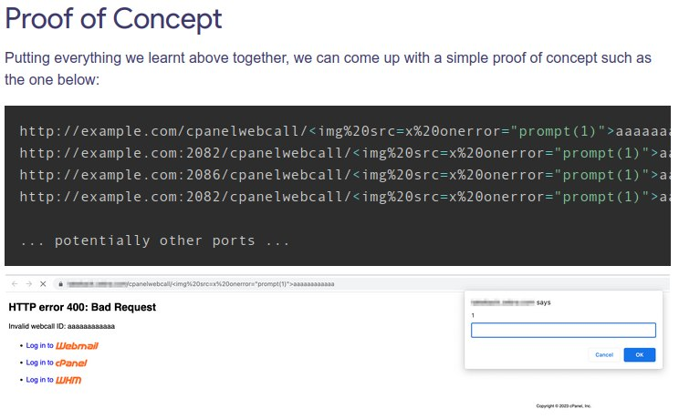
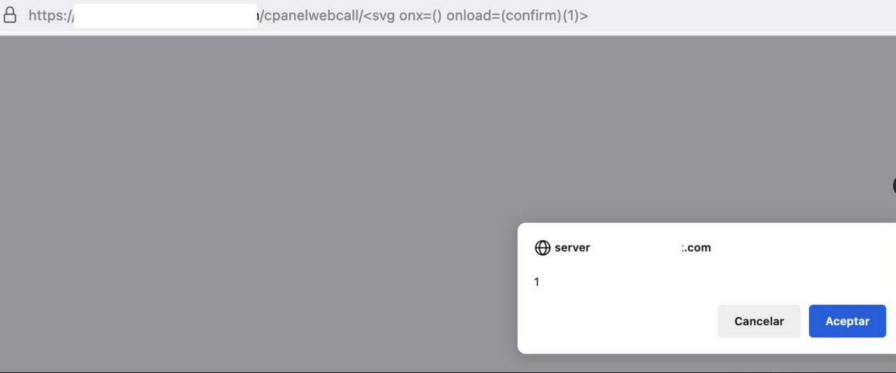

# cibsecurity
`2023-04-30`

* https://web.nvd.nist.gov/view/vuln/detail?vulnId=CVE-2023-2428

<blockquote>
‼ CVE-2023-2428 ‼

Cross-site Scripting (XSS) - Stored in GitHub repository thorsten/phpmyfaq prior to 3.1.13.

📖 Read

via &quot;National Vulnerability Database&quot;.
</blockquote>

---

# defcon_news
`2023-04-29`

<blockquote>
Apache Superset Shipped With Unpatched RCE Vulnerability
https://latesthackingnews.com/2023/04/29/apache-superset-shipped-with-unpatched-rce-vulnerability/
</blockquote>

<table><tr><td><b>→</b><a href="https://latesthackingnews.com/2023/04/29/apache-superset-shipped-with-unpatched-rce-vulnerability/">
https://latesthackingnews.com/2023/04/29/apache-superset-shipped-with-unpatched-rce-vulnerability/
</a>
<blockquote>
Researchers spotted a severe unpatched remote code execution vulnerability shipped by default in Apache Superset. The vulnerability existed due to a dangerous default configuration, making thousands of Superset instances open to the public. Apache Superset Has
</blockquote>
</td></tr></table>

---

# proxy_bar
`2023-04-29`

* https://blog.assetnote.io/2023/04/26/xss-million-websites-cpanel/

<blockquote>
И еще раз о CVE-2023-29489 cPanel и XSS
Finding XSS in a million websites

&#35;cPanel &#35;xss
</blockquote>

---

# cibsecurity
`2023-04-28`

* https://web.nvd.nist.gov/view/vuln/detail?vulnId=CVE-2020-23647

<blockquote>
‼ CVE-2020-23647 ‼

Cross Site Scripting (XSS) vulnerability in BoxBilling 4.19, 4.19.1, 4.20, and 4.21 allows remote attackers to run arbitrary code via the message field on the submit new ticket form.

📖 Read

via &quot;National Vulnerability Database&quot;.
</blockquote>

---

# cibsecurity
`2023-04-28`

* https://web.nvd.nist.gov/view/vuln/detail?vulnId=CVE-2023-30405

<blockquote>
‼ CVE-2023-30405 ‼

A cross-site scripting (XSS) vulnerability in Aigital Wireless-N Repeater Mini_Router v0.131229 allows attackers to execute arbitrary web scripts or HTML via a crafted payload injected into the wl_ssid parameter at /boafrm/formHomeWlanSetup.

📖 Read

via &quot;National Vulnerability Database&quot;.
</blockquote>

---

# cibsecurity
`2023-04-28`

* https://web.nvd.nist.gov/view/vuln/detail?vulnId=CVE-2023-26813

<blockquote>
‼ CVE-2023-26813 ‼

SQL injection vulnerability in com.xnx3.wangmarket.plugin.dataDictionary.controller.DataDictionaryPluginController.java in wangmarket CMS 4.10 allows remote attackers to run arbitrary SQL commands via the TableName parameter to /plugin/dataDictionary/tableView.do.

📖 Read

via &quot;National Vulnerability Database&quot;.
</blockquote>

---

# cibsecurity
`2023-04-28`

* https://web.nvd.nist.gov/view/vuln/detail?vulnId=CVE-2023-26781

<blockquote>
‼ CVE-2023-26781 ‼

SQL injection vulnerability in mccms 2.6 allows remote attackers to run arbitrary SQL commands via Author Center -&gt;Reader Comments -&gt;Search.

📖 Read

via &quot;National Vulnerability Database&quot;.
</blockquote>

---

# cibsecurity
`2023-04-28`

* https://web.nvd.nist.gov/view/vuln/detail?vulnId=CVE-2020-21643

<blockquote>
‼ CVE-2020-21643 ‼

Cross Site Scripting (XSS) vulnerability in HongCMS 3.0 allows attackers to run arbitrary code via the callback parameter to /ajax/myshop.

📖 Read

via &quot;National Vulnerability Database&quot;.
</blockquote>

---

# cibsecurity
`2023-04-28`

* https://web.nvd.nist.gov/view/vuln/detail?vulnId=CVE-2023-30125

<blockquote>
‼ CVE-2023-30125 ‼

EyouCms V1.6.1-UTF8-sp1 is vulnerable to Cross Site Scripting (XSS).

📖 Read

via &quot;National Vulnerability Database&quot;.
</blockquote>

---

# cibsecurity
`2023-04-28`

* https://web.nvd.nist.gov/view/vuln/detail?vulnId=CVE-2023-2371

<blockquote>
‼ CVE-2023-2371 ‼

A vulnerability classified as critical was found in SourceCodester Online DJ Management System 1.0. Affected by this vulnerability is an unknown functionality of the file admin/inquiries/view_details.php of the component GET Parameter Handler. The manipulation of the argument id leads to sql injection. The attack can be launched remotely. The exploit has been disclosed to the public and may be used. The associated identifier of this vulnerability is VDB-227647.

📖 Read

via &quot;National Vulnerability Database&quot;.
</blockquote>

---

# cibsecurity
`2023-04-28`

* https://web.nvd.nist.gov/view/vuln/detail?vulnId=CVE-2023-28819

<blockquote>
‼ CVE-2023-28819 ‼

Concrete CMS (previously concrete5) before 9.1 is vulnerable to Stored XSS in uploaded file and folder names.

📖 Read

via &quot;National Vulnerability Database&quot;.
</blockquote>

---

# cibsecurity
`2023-04-28`

* https://web.nvd.nist.gov/view/vuln/detail?vulnId=CVE-2023-28820

<blockquote>
‼ CVE-2023-28820 ‼

Concrete CMS (previously concrete5) before 9.1 is vulnerable to stored XSS in RSS Displayer via the href attribute because the link element input was not sanitized.

📖 Read

via &quot;National Vulnerability Database&quot;.
</blockquote>

---

# cibsecurity
`2023-04-28`

* https://web.nvd.nist.gov/view/vuln/detail?vulnId=CVE-2023-28476

<blockquote>
‼ CVE-2023-28476 ‼

Concrete CMS (previously concrete5) before 9.2 is vulnerable to Stored XSS on Tags on uploaded files.

📖 Read

via &quot;National Vulnerability Database&quot;.
</blockquote>

---

# cibsecurity
`2023-04-28`

* https://web.nvd.nist.gov/view/vuln/detail?vulnId=CVE-2023-2370

<blockquote>
‼ CVE-2023-2370 ‼

A vulnerability classified as critical has been found in SourceCodester Online DJ Management System 1.0. Affected is an unknown function of the file admin/events/manage_event.php of the component GET Parameter Handler. The manipulation of the argument id leads to sql injection. It is possible to launch the attack remotely. The exploit has been disclosed to the public and may be used. VDB-227646 is the identifier assigned to this vulnerability.

📖 Read

via &quot;National Vulnerability Database&quot;.
</blockquote>

---

# cibsecurity
`2023-04-28`

* https://web.nvd.nist.gov/view/vuln/detail?vulnId=CVE-2023-30123

<blockquote>
‼ CVE-2023-30123 ‼

wuzhicms v4.1.0 is vulnerable to Cross Site Scripting (XSS) in the Member Center, Account Settings.

📖 Read

via &quot;National Vulnerability Database&quot;.
</blockquote>

---

# cibsecurity
`2023-04-28`

* https://web.nvd.nist.gov/view/vuln/detail?vulnId=CVE-2023-28475

<blockquote>
‼ CVE-2023-28475 ‼

Concrete CMS (previously concrete5) before 9.2 is vulnerable to Reflected XSS on the Reply form because msgID was not sanitized.

📖 Read

via &quot;National Vulnerability Database&quot;.
</blockquote>

---

# cibsecurity
`2023-04-28`

* https://web.nvd.nist.gov/view/vuln/detail?vulnId=CVE-2023-28474

<blockquote>
‼ CVE-2023-28474 ‼

Concrete CMS (previously concrete5) before 9.2 is vulnerable to Stored XSS on Saved Presets on search.

📖 Read

via &quot;National Vulnerability Database&quot;.
</blockquote>

---

# cibsecurity
`2023-04-28`

* https://web.nvd.nist.gov/view/vuln/detail?vulnId=CVE-2023-30183

<blockquote>
‼ CVE-2023-30183 ‼

Wangmarket CMS v4.10 was discovered to contain a SQL injection vulnerability via the component /plugin/dataDictionary/tableView.do?tableName&#61;.

📖 Read

via &quot;National Vulnerability Database&quot;.
</blockquote>

---

# cibsecurity
`2023-04-28`

* https://web.nvd.nist.gov/view/vuln/detail?vulnId=CVE-2023-28471

<blockquote>
‼ CVE-2023-28471 ‼

Concrete CMS (previously concrete5) before 9.2 is vulnerable to Stored XSS via a container name.

📖 Read

via &quot;National Vulnerability Database&quot;.
</blockquote>

---

# cibsecurity
`2023-04-28`

* https://web.nvd.nist.gov/view/vuln/detail?vulnId=CVE-2023-2368

<blockquote>
‼ CVE-2023-2368 ‼

A vulnerability was found in SourceCodester Faculty Evaluation System 1.0. It has been declared as critical. This vulnerability affects unknown code of the file index.php?page&#61;manage_questionnaire. The manipulation of the argument id leads to sql injection. The attack can be initiated remotely. The exploit has been disclosed to the public and may be used. The identifier of this vulnerability is VDB-227644.

📖 Read

via &quot;National Vulnerability Database&quot;.
</blockquote>

---

# cibsecurity
`2023-04-28`

* https://web.nvd.nist.gov/view/vuln/detail?vulnId=CVE-2023-2369

<blockquote>
‼ CVE-2023-2369 ‼

A vulnerability was found in SourceCodester Faculty Evaluation System 1.0. It has been rated as critical. This issue affects some unknown processing of the file admin/manage_restriction.php. The manipulation of the argument id leads to sql injection. The attack may be initiated remotely. The exploit has been disclosed to the public and may be used. The identifier VDB-227645 was assigned to this vulnerability.

📖 Read

via &quot;National Vulnerability Database&quot;.
</blockquote>

---

# cibsecurity
`2023-04-28`

* https://web.nvd.nist.gov/view/vuln/detail?vulnId=CVE-2023-2367

<blockquote>
‼ CVE-2023-2367 ‼

A vulnerability was found in SourceCodester Faculty Evaluation System 1.0. It has been classified as critical. This affects an unknown part of the file /admin/manage_academic.php. The manipulation of the argument id leads to sql injection. It is possible to initiate the attack remotely. The exploit has been disclosed to the public and may be used. The associated identifier of this vulnerability is VDB-227643.

📖 Read

via &quot;National Vulnerability Database&quot;.
</blockquote>

---

# cibsecurity
`2023-04-28`

* https://web.nvd.nist.gov/view/vuln/detail?vulnId=CVE-2023-2366

<blockquote>
‼ CVE-2023-2366 ‼

A vulnerability was found in SourceCodester Faculty Evaluation System 1.0 and classified as critical. Affected by this issue is some unknown functionality of the file ajax.php?action&#61;delete_class. The manipulation of the argument id leads to sql injection. The attack may be launched remotely. The exploit has been disclosed to the public and may be used. VDB-227642 is the identifier assigned to this vulnerability.

📖 Read

via &quot;National Vulnerability Database&quot;.
</blockquote>

---

# cibsecurity
`2023-04-28`

* https://web.nvd.nist.gov/view/vuln/detail?vulnId=CVE-2023-2365

<blockquote>
‼ CVE-2023-2365 ‼

A vulnerability has been found in SourceCodester Faculty Evaluation System 1.0 and classified as critical. Affected by this vulnerability is an unknown functionality of the file ajax.php?action&#61;delete_subject. The manipulation of the argument id leads to sql injection. The attack can be launched remotely. The exploit has been disclosed to the public and may be used. The identifier VDB-227641 was assigned to this vulnerability.

📖 Read

via &quot;National Vulnerability Database&quot;.
</blockquote>

---

# defcon_news
`2023-04-28`

<blockquote>
Piwigo 13.5.0 SQL Injection
https://packetstormsecurity.com/files/172059/TSI-ADV032023.txt
</blockquote>

<table><tr><td><b>→</b><a href="https://packetstormsecurity.com/files/172059/TSI-ADV032023.txt">
https://packetstormsecurity.com/files/172059/TSI-ADV032023.txt
</a>
<blockquote>
Information Security Services, News, Files, Tools, Exploits, Advisories and Whitepapers
</blockquote>
</td></tr></table>

---

# cibsecurity
`2023-04-28`

* https://web.nvd.nist.gov/view/vuln/detail?vulnId=CVE-2023-30467

<blockquote>
‼ CVE-2023-30467 ‼

This vulnerability exists in Milesight 4K/H.265 Series NVR models (MS-Nxxxx-xxG, MS-Nxxxx-xxE, MS-Nxxxx-xxT, MS-Nxxxx-xxH and MS-Nxxxx-xxC), due to improper authorization at the Milesight NVR web-based management interface. A remote attacker could exploit this vulnerability by sending a specially crafted http requests on the targeted device.Successful exploitation of this vulnerability could allow remote attacker to perform unauthorized activities on the targeted device.

📖 Read

via &quot;National Vulnerability Database&quot;.
</blockquote>

---

# cibsecurity
`2023-04-28`

* https://web.nvd.nist.gov/view/vuln/detail?vulnId=CVE-2023-2363

<blockquote>
‼ CVE-2023-2363 ‼

A vulnerability, which was classified as critical, has been found in SourceCodester Resort Reservation System 1.0. This issue affects some unknown processing of the file view_room.php. The manipulation of the argument id leads to sql injection. The attack may be initiated remotely. The exploit has been disclosed to the public and may be used. The associated identifier of this vulnerability is VDB-227639.

📖 Read

via &quot;National Vulnerability Database&quot;.
</blockquote>

---

# cibsecurity
`2023-04-28`

* https://web.nvd.nist.gov/view/vuln/detail?vulnId=CVE-2023-30466

<blockquote>
‼ CVE-2023-30466 ‼

This vulnerability exists in Milesight 4K/H.265 Series NVR models (MS-Nxxxx-xxG, MS-Nxxxx-xxE, MS-Nxxxx-xxT, MS-Nxxxx-xxH and MS-Nxxxx-xxC), due to a weak password reset mechanism at the Milesight NVR web-based management interface. A remote attacker could exploit this vulnerability by sending a specially crafted http requests on the targeted device.Successful exploitation of this vulnerability could allow remote attacker to account takeover on the targeted device.

📖 Read

via &quot;National Vulnerability Database&quot;.
</blockquote>

---

# RalfHackerChannel
`2023-04-28`

* https://twitter.com/testanull/

<blockquote>
Microsoft Exchange Powershell Remoting Deserialization leading to RCE (CVE-2023-21707) 

👤 by testanull

While analyzing CVE-2022-41082, also known as Proxy Not Shell, researcher discovered CVE-2023-21707 vulnerability which he has detailed in this blog.
The vulnerability allows a privileged user to trigger RCE during a deserialization of untrusted data.

📝 Contents:
● Introduction 
● The new variant
● Payload delivery
● Demo
● References

https://starlabs.sg/blog/2023/04-microsoft-exchange-powershell-remoting-deserialization-leading-to-rce-cve-2023-21707/
</blockquote>

---

# proxy_bar
`2023-04-28`

<blockquote>
CVE-2023-29489
cPanel

&#35;cPanel &#35;xss
</blockquote>

---

# cibsecurity
`2023-04-28`

* https://web.nvd.nist.gov/view/vuln/detail?vulnId=CVE-2023-2361

<blockquote>
‼ CVE-2023-2361 ‼

Cross-site Scripting (XSS) - Stored in GitHub repository pimcore/pimcore prior to 10.5.21.

📖 Read

via &quot;National Vulnerability Database&quot;.
</blockquote>

---

# cibsecurity
`2023-04-27`

* https://web.nvd.nist.gov/view/vuln/detail?vulnId=CVE-2023-29489

<blockquote>
‼ CVE-2023-29489 ‼

An issue was discovered in cPanel before 11.109.9999.116. XSS can occur on the cpsrvd error page via an invalid webcall ID, aka SEC-669. The fixed versions are 11.109.9999.116, 11.108.0.13, 11.106.0.18, and 11.102.0.31.

📖 Read

via &quot;National Vulnerability Database&quot;.
</blockquote>

---

# cibsecurity
`2023-04-27`

* https://web.nvd.nist.gov/view/vuln/detail?vulnId=CVE-2023-21712

<blockquote>
‼ CVE-2023-21712 ‼

Windows Point-to-Point Tunneling Protocol Remote Code Execution Vulnerability

📖 Read

via &quot;National Vulnerability Database&quot;.
</blockquote>

---

# defcon_news
`2023-04-27`

<blockquote>
ChurchCRM 4.5.3 SQL Injection
https://packetstormsecurity.com/files/172047/churchcrm453event-sql.txt
</blockquote>

<table><tr><td><b>→</b><a href="https://packetstormsecurity.com/files/172047/churchcrm453event-sql.txt">
https://packetstormsecurity.com/files/172047/churchcrm453event-sql.txt
</a>
<blockquote>
Information Security Services, News, Files, Tools, Exploits, Advisories and Whitepapers
</blockquote>
</td></tr></table>

---

# cibsecurity
`2023-04-27`

* https://web.nvd.nist.gov/view/vuln/detail?vulnId=CVE-2023-30852

<blockquote>
‼ CVE-2023-30852 ‼

Pimcore is an open source data and experience management platform. Prior to version 10.5.21, the `/admin/misc/script-proxy` API endpoint that is accessible by an authenticated administrator user is vulnerable to arbitrary JavaScript and CSS file read via the `scriptPath` and `scripts` parameters. The `scriptPath` parameter is not sanitized properly and is vulnerable to path traversal attack. Any JavaScript/CSS file from the application server can be read by specifying sufficient number of `../` patterns to go out from the application webroot followed by path of the folder where the file is located in the &quot;scriptPath&quot; parameter and the file name in the &quot;scripts&quot; parameter. The JavaScript file is successfully read only if the web application has read access to it. Users should update to version 10.5.21 to receive a patch or, as a workaround, apply the patch manual.

📖 Read

via &quot;National Vulnerability Database&quot;.
</blockquote>

---

# cibsecurity
`2023-04-27`

* https://web.nvd.nist.gov/view/vuln/detail?vulnId=CVE-2023-30850

<blockquote>
‼ CVE-2023-30850 ‼

Pimcore is an open source data and experience management platform. Prior to version 10.5.21, a SQL Injection vulnerability exists in the admin translations API. Users should update to version 10.5.21 to receive a patch or, as a workaround, or apply the patch manually.

📖 Read

via &quot;National Vulnerability Database&quot;.
</blockquote>

---

# cibsecurity
`2023-04-27`

* https://web.nvd.nist.gov/view/vuln/detail?vulnId=CVE-2023-30849

<blockquote>
‼ CVE-2023-30849 ‼

Pimcore is an open source data and experience management platform. Prior to version 10.5.21, A SQL injection vulnerability exists in the translation export API. Users should update to version 10.5.21 to receive a patch or, as a workaround, or apply the patch manually.

📖 Read

via &quot;National Vulnerability Database&quot;.
</blockquote>

---

# cibsecurity
`2023-04-27`

* https://web.nvd.nist.gov/view/vuln/detail?vulnId=CVE-2023-30848

<blockquote>
‼ CVE-2023-30848 ‼

Pimcore is an open source data and experience management platform. Prior to version 10.5.21, the admin search find API has a SQL injection vulnerability. Users should upgrade to version 10.5.21 to receive a patch or, as a workaround, apply the patch manually.

📖 Read

via &quot;National Vulnerability Database&quot;.
</blockquote>

---

# cibsecurity
`2023-04-27`

* https://web.nvd.nist.gov/view/vuln/detail?vulnId=CVE-2023-2342

<blockquote>
‼ CVE-2023-2342 ‼

Cross-site Scripting (XSS) - Reflected in GitHub repository pimcore/pimcore prior to 10.5.21.

📖 Read

via &quot;National Vulnerability Database&quot;.
</blockquote>

---

# cibsecurity
`2023-04-27`

* https://web.nvd.nist.gov/view/vuln/detail?vulnId=CVE-2023-2348

<blockquote>
‼ CVE-2023-2348 ‼

A vulnerability was found in SourceCodester Service Provider Management System 1.0. It has been rated as critical. This issue affects some unknown processing of the file /admin/user/manage_user.php. The manipulation of the argument id leads to sql injection. The attack may be initiated remotely. The exploit has been disclosed to the public and may be used. The associated identifier of this vulnerability is VDB-227591.

📖 Read

via &quot;National Vulnerability Database&quot;.
</blockquote>

---

# cibsecurity
`2023-04-27`

* https://web.nvd.nist.gov/view/vuln/detail?vulnId=CVE-2023-30349

<blockquote>
‼ CVE-2023-30349 ‼

JFinal CMS v5.1.0 was discovered to contain a remote code execution (RCE) vulnerability via the ActionEnter function.

📖 Read

via &quot;National Vulnerability Database&quot;.
</blockquote>

---

# cibsecurity
`2023-04-27`

* https://web.nvd.nist.gov/view/vuln/detail?vulnId=CVE-2023-2343

<blockquote>
‼ CVE-2023-2343 ‼

Cross-site Scripting (XSS) - DOM in GitHub repository pimcore/pimcore prior to 10.5.21.

📖 Read

via &quot;National Vulnerability Database&quot;.
</blockquote>

---

# cibsecurity
`2023-04-27`

* https://web.nvd.nist.gov/view/vuln/detail?vulnId=CVE-2023-2346

<blockquote>
‼ CVE-2023-2346 ‼

A vulnerability was found in SourceCodester Service Provider Management System 1.0. It has been classified as critical. This affects an unknown part of the file /admin/inquiries/view_inquiry.php. The manipulation of the argument id leads to sql injection. It is possible to initiate the attack remotely. The exploit has been disclosed to the public and may be used. The identifier VDB-227589 was assigned to this vulnerability.

📖 Read

via &quot;National Vulnerability Database&quot;.
</blockquote>

---

# cibsecurity
`2023-04-27`

* https://web.nvd.nist.gov/view/vuln/detail?vulnId=CVE-2023-30338

<blockquote>
‼ CVE-2023-30338 ‼

Multiple stored cross-site scripting (XSS) vulnerabilities in Emlog Pro v2.0.3 allows attackers to execute arbitrary web scripts or HTML via a crafted payload injected into the Article Title or Article Summary parameters.

📖 Read

via &quot;National Vulnerability Database&quot;.
</blockquote>

---

# cibsecurity
`2023-04-27`

* https://web.nvd.nist.gov/view/vuln/detail?vulnId=CVE-2023-2347

<blockquote>
‼ CVE-2023-2347 ‼

A vulnerability was found in SourceCodester Service Provider Management System 1.0. It has been declared as critical. This vulnerability affects unknown code of the file /admin/services/manage_service.php. The manipulation of the argument id leads to sql injection. The attack can be initiated remotely. The exploit has been disclosed to the public and may be used. VDB-227590 is the identifier assigned to this vulnerability.

📖 Read

via &quot;National Vulnerability Database&quot;.
</blockquote>

---

# cibsecurity
`2023-04-27`

* https://web.nvd.nist.gov/view/vuln/detail?vulnId=CVE-2023-2341

<blockquote>
‼ CVE-2023-2341 ‼

Cross-site Scripting (XSS) - Generic in GitHub repository pimcore/pimcore prior to 10.5.21.

📖 Read

via &quot;National Vulnerability Database&quot;.
</blockquote>

---

# cibsecurity
`2023-04-27`

* https://web.nvd.nist.gov/view/vuln/detail?vulnId=CVE-2023-2344

<blockquote>
‼ CVE-2023-2344 ‼

A vulnerability has been found in SourceCodester Service Provider Management System 1.0 and classified as critical. Affected by this vulnerability is an unknown functionality of the file /classes/Master.php?f&#61;save_service of the component HTTP POST Request Handler. The manipulation of the argument name leads to sql injection. The attack can be launched remotely. The exploit has been disclosed to the public and may be used. The associated identifier of this vulnerability is VDB-227587.

📖 Read

via &quot;National Vulnerability Database&quot;.
</blockquote>

---

# cibsecurity
`2023-04-27`

* https://web.nvd.nist.gov/view/vuln/detail?vulnId=CVE-2023-2339

<blockquote>
‼ CVE-2023-2339 ‼

Cross-site Scripting (XSS) - Reflected in GitHub repository pimcore/pimcore prior to 10.5.21.

📖 Read

via &quot;National Vulnerability Database&quot;.
</blockquote>

---

# cibsecurity
`2023-04-27`

* https://web.nvd.nist.gov/view/vuln/detail?vulnId=CVE-2023-2328

<blockquote>
‼ CVE-2023-2328 ‼

Cross-site Scripting (XSS) - Generic in GitHub repository pimcore/pimcore prior to 10.5.21.

📖 Read

via &quot;National Vulnerability Database&quot;.
</blockquote>

---

# cibsecurity
`2023-04-27`

* https://web.nvd.nist.gov/view/vuln/detail?vulnId=CVE-2023-2327

<blockquote>
‼ CVE-2023-2327 ‼

Cross-site Scripting (XSS) - Stored in GitHub repository pimcore/pimcore prior to 10.5.21.

📖 Read

via &quot;National Vulnerability Database&quot;.
</blockquote>

---

# cibsecurity
`2023-04-27`

* https://web.nvd.nist.gov/view/vuln/detail?vulnId=CVE-2023-28770

<blockquote>
‼ CVE-2023-28770 ‼

The sensitive information exposure vulnerability in the CGI “Export_Log� and the binary “zcmd� in Zyxel DX5401-B0 firmware versions prior to V5.17(ABYO.1)C0 could allow a remote unauthenticated attacker to read the system files and to retrieve the password of the supervisor from the encrypted file.

📖 Read

via &quot;National Vulnerability Database&quot;.
</blockquote>

---

# cibsecurity
`2023-04-27`

* https://web.nvd.nist.gov/view/vuln/detail?vulnId=CVE-2023-2323

<blockquote>
‼ CVE-2023-2323 ‼

Cross-site Scripting (XSS) - Stored in GitHub repository pimcore/pimcore prior to 10.5.21.

📖 Read

via &quot;National Vulnerability Database&quot;.
</blockquote>

---

# cibsecurity
`2023-04-27`

* https://web.nvd.nist.gov/view/vuln/detail?vulnId=CVE-2023-22901

<blockquote>
‼ CVE-2023-22901 ‼

ChangingTec MOTP system has a path traversal vulnerability. A remote attacker with administrator’s privilege can exploit this vulnerability to access arbitrary system files.

📖 Read

via &quot;National Vulnerability Database&quot;.
</blockquote>

---

# cibsecurity
`2023-04-27`

* https://web.nvd.nist.gov/view/vuln/detail?vulnId=CVE-2023-2297

<blockquote>
‼ CVE-2023-2297 ‼

The Profile Builder – User Profile &amp; User Registration Forms plugin for WordPress is vulnerable to unauthorized password resets in versions up to, and including 3.9.0. This is due to the plugin using native password reset functionality, with insufficient validation on the password reset function (wppb_front_end_password_recovery). The function uses the plaintext value of a password reset key instead of a hashed value which means it can easily be retrieved and subsequently used. An attacker can leverage CVE-2023-0814, or another vulnerability like SQL Injection in another plugin or theme installed on the site to successfully exploit this vulnerability.

📖 Read

via &quot;National Vulnerability Database&quot;.
</blockquote>

---

# cibsecurity
`2023-04-27`

* https://web.nvd.nist.gov/view/vuln/detail?vulnId=CVE-2023-20852

<blockquote>
‼ CVE-2023-20852 ‼

aEnrich Technology a+HRD has a vulnerability of Deserialization of Untrusted Data within its MSMQ interpreter. An unauthenticated remote attacker can exploit this vulnerability to execute arbitrary system commands to perform arbitrary system operation or disrupt service.

📖 Read

via &quot;National Vulnerability Database&quot;.
</blockquote>

---

# cibsecurity
`2023-04-27`

* https://web.nvd.nist.gov/view/vuln/detail?vulnId=CVE-2023-20853

<blockquote>
‼ CVE-2023-20853 ‼

aEnrich Technology a+HRD has a vulnerability of Deserialization of Untrusted Data within its MSMQ asynchronized message process. An unauthenticated remote attacker can exploit this vulnerability to execute arbitrary system commands to perform arbitrary system operation or disrupt service.

📖 Read

via &quot;National Vulnerability Database&quot;.
</blockquote>

---

# cibsecurity
`2023-04-26`

* https://web.nvd.nist.gov/view/vuln/detail?vulnId=CVE-2023-29442

<blockquote>
‼ CVE-2023-29442 ‼

Zoho ManageEngine Applications Manager through 16390 allows DOM XSS.

📖 Read

via &quot;National Vulnerability Database&quot;.
</blockquote>

---

# cibsecurity
`2023-04-26`

* https://web.nvd.nist.gov/view/vuln/detail?vulnId=CVE-2023-28008

<blockquote>
‼ CVE-2023-28008 ‼

HCL Workload Automation 9.4, 9.5, and 10.1 are vulnerable to an XML External Entity Injection (XXE) attack when processing XML data. A remote attacker could exploit this vulnerability to expose sensitive information or consume memory resources.

📖 Read

via &quot;National Vulnerability Database&quot;.
</blockquote>

---

# cibsecurity
`2023-04-26`

* https://web.nvd.nist.gov/view/vuln/detail?vulnId=CVE-2023-28009

<blockquote>
‼ CVE-2023-28009 ‼

HCL Workload Automation is vulnerable to an XML External Entity Injection (XXE) attack when processing XML data. A remote attacker could exploit this vulnerability to expose sensitive information or consume memory resources.

📖 Read

via &quot;National Vulnerability Database&quot;.
</blockquote>

---

# cibsecurity
`2023-04-26`

* https://web.nvd.nist.gov/view/vuln/detail?vulnId=CVE-2023-29443

<blockquote>
‼ CVE-2023-29443 ‼

Zoho ManageEngine ServiceDesk Plus through 14104 allows admin users to conduct an XXE attack.

📖 Read

via &quot;National Vulnerability Database&quot;.
</blockquote>

---

# cibsecurity
`2023-04-26`

* https://web.nvd.nist.gov/view/vuln/detail?vulnId=CVE-2023-30212

<blockquote>
‼ CVE-2023-30212 ‼

OURPHP &lt;&#61; 7.2.0 is vulnerale to Cross Site Scripting (XSS) via /client/manage/ourphp_out.php.

📖 Read

via &quot;National Vulnerability Database&quot;.
</blockquote>

---

# cibsecurity
`2023-04-26`

* https://web.nvd.nist.gov/view/vuln/detail?vulnId=CVE-2023-30211

<blockquote>
‼ CVE-2023-30211 ‼

OURPHP &lt;&#61; 7.2.0 is vulnerable to SQL Injection.

📖 Read

via &quot;National Vulnerability Database&quot;.
</blockquote>

---

# cibsecurity
`2023-04-26`

* https://web.nvd.nist.gov/view/vuln/detail?vulnId=CVE-2022-27979

<blockquote>
‼ CVE-2022-27979 ‼

A cross-site scripting (XSS) vulnerability in ToolJet v1.6.0 allows attackers to execute arbitrary web scripts or HTML via a crafted payload injected into the Comment Body component.

📖 Read

via &quot;National Vulnerability Database&quot;.
</blockquote>

---

# cibsecurity
`2023-04-26`

* https://web.nvd.nist.gov/view/vuln/detail?vulnId=CVE-2023-30210

<blockquote>
‼ CVE-2023-30210 ‼

OURPHP &lt;&#61; 7.2.0 is vulnerable to Cross Site Scripting (XSS) via ourphp_tz.php.

📖 Read

via &quot;National Vulnerability Database&quot;.
</blockquote>

---

# defcon_news
`2023-04-26`

<blockquote>
Reddit: Blind SSRF with Escalation possibilities in matrix preview_link API
https://vulners.com/hackerone/H1:1960765?utm_source&#61;rss&amp;utm_medium&#61;rss&amp;utm_campaign&#61;rss
</blockquote>

<table><tr><td><b>→</b><a href="https://vulners.com/hackerone/H1:1960765">
https://vulners.com/hackerone/H1:1960765
</a>
<blockquote>
Summary: Reddit' new chat is based on Matrix software which has preview_link functionality which doesn't filter the URL before sending the request Impact: Attacker can enumerate services by grabbing og:title and port scanning, also possible RCE...
</blockquote>
</td></tr></table>

---

# cibsecurity
`2023-04-26`

* https://web.nvd.nist.gov/view/vuln/detail?vulnId=CVE-2023-30269

<blockquote>
‼ CVE-2023-30269 ‼

CLTPHP &lt;&#61;6.0 is vulnerable to Improper Input Validation via application/admin/controller/Template.php.

📖 Read

via &quot;National Vulnerability Database&quot;.
</blockquote>

---

# cibsecurity
`2023-04-26`

* https://web.nvd.nist.gov/view/vuln/detail?vulnId=CVE-2023-30112

<blockquote>
‼ CVE-2023-30112 ‼

Medicine Tracker System in PHP 1.0.0 is vulnerable to SQL Injection.

📖 Read

via &quot;National Vulnerability Database&quot;.
</blockquote>

---

# cibsecurity
`2023-04-26`

* https://web.nvd.nist.gov/view/vuln/detail?vulnId=CVE-2023-30267

<blockquote>
‼ CVE-2023-30267 ‼

CLTPHP &lt;&#61;6.0 is vulnerable to Cross Site Scripting (XSS) via application/home/controller/Changyan.php.

📖 Read

via &quot;National Vulnerability Database&quot;.
</blockquote>

---

# cibsecurity
`2023-04-26`

* https://web.nvd.nist.gov/view/vuln/detail?vulnId=CVE-2022-25273

<blockquote>
‼ CVE-2022-25273 ‼

Drupal core's form API has a vulnerability where certain contributed or custom modules' forms may be vulnerable to improper input validation. This could allow an attacker to inject disallowed values or overwrite data. Affected forms are uncommon, but in certain cases an attacker could alter critical or sensitive data.

📖 Read

via &quot;National Vulnerability Database&quot;.
</blockquote>

---

# defcon_news
`2023-04-26`

<blockquote>
PHP Restaurants 1.0 SQL Injection / Cross Site Scripting
https://packetstormsecurity.com/files/172040/phprestaurants10-sqlxss.txt
</blockquote>

<table><tr><td><b>→</b><a href="https://packetstormsecurity.com/files/172040/phprestaurants10-sqlxss.txt">
https://packetstormsecurity.com/files/172040/phprestaurants10-sqlxss.txt
</a>
<blockquote>
Information Security Services, News, Files, Tools, Exploits, Advisories and Whitepapers
</blockquote>
</td></tr></table>

---

# defcon_news
`2023-04-26`

<blockquote>
Online Book Store 1.0 SQL Injection
https://packetstormsecurity.com/files/172032/obs10process-sql.txt
</blockquote>

<table><tr><td><b>→</b><a href="https://packetstormsecurity.com/files/172032/obs10process-sql.txt">
https://packetstormsecurity.com/files/172032/obs10process-sql.txt
</a>
<blockquote>
Information Security Services, News, Files, Tools, Exploits, Advisories and Whitepapers
</blockquote>
</td></tr></table>

---

# cibsecurity
`2023-04-26`

* https://web.nvd.nist.gov/view/vuln/detail?vulnId=CVE-2023-30111

<blockquote>
‼ CVE-2023-30111 ‼

Medicine Tracker System in PHP 1.0.0 is vulnerable to Cross Site Scripting (XSS).

📖 Read

via &quot;National Vulnerability Database&quot;.
</blockquote>

---

# cibsecurity
`2023-04-26`

* https://web.nvd.nist.gov/view/vuln/detail?vulnId=CVE-2023-30106

<blockquote>
‼ CVE-2023-30106 ‼

Sourcecodester Medicine Tracker System in PHP 1.0.0 is vulnerable to Cross Site Scripting (XSS) via page&#61;about.

📖 Read

via &quot;National Vulnerability Database&quot;.
</blockquote>

---

# cibsecurity
`2023-04-26`

* https://web.nvd.nist.gov/view/vuln/detail?vulnId=CVE-2023-27843

<blockquote>
‼ CVE-2023-27843 ‼

SQL injection vulnerability found in PrestaShop askforaquote v.5.4.2 and before allow a remote attacker to gain privileges via the QuotesProduct::deleteProduct component.

📖 Read

via &quot;National Vulnerability Database&quot;.
</blockquote>

---

# cibsecurity
`2023-04-26`

* https://web.nvd.nist.gov/view/vuln/detail?vulnId=CVE-2012-5872

<blockquote>
‼ CVE-2012-5872 ‼

ARC (aka ARC2) through 2011-12-01 allows blind SQL Injection in getTriplePatternSQL in ARC2_StoreSelectQueryHandler.php via comments in a SPARQL WHERE clause.

📖 Read

via &quot;National Vulnerability Database&quot;.
</blockquote>

---

# cibsecurity
`2023-04-26`

* https://web.nvd.nist.gov/view/vuln/detail?vulnId=CVE-2012-5873

<blockquote>
‼ CVE-2012-5873 ‼

ARC (aka ARC2) through 2011-12-01 allows reflected XSS via the end_point.php query parameter in an output&#61;htmltab action.

📖 Read

via &quot;National Vulnerability Database&quot;.
</blockquote>

---

# cibsecurity
`2023-04-26`

* https://web.nvd.nist.gov/view/vuln/detail?vulnId=CVE-2023-30404

<blockquote>
‼ CVE-2023-30404 ‼

Aigital Wireless-N Repeater Mini_Router v0.131229 was discovered to contain a remote code execution (RCE) vulnerability via the sysCmd parameter in the formSysCmd function. This vulnerability is exploited via a crafted HTTP request.

📖 Read

via &quot;National Vulnerability Database&quot;.
</blockquote>

---

# cibsecurity
`2023-04-26`

* https://web.nvd.nist.gov/view/vuln/detail?vulnId=CVE-2023-31223

<blockquote>
‼ CVE-2023-31223 ‼

Dradis before 4.8.0 allows persistent XSS by authenticated author users, related to avatars.

📖 Read

via &quot;National Vulnerability Database&quot;.
</blockquote>

---

# cibsecurity
`2023-04-25`

* https://web.nvd.nist.gov/view/vuln/detail?vulnId=CVE-2023-25461

<blockquote>
‼ CVE-2023-25461 ‼

Auth. (admin+) Stored Cross-Site Scripting (XSS) vulnerability in namithjawahar Wp-Insert plugin &lt;&#61; 2.5.0 versions.

📖 Read

via &quot;National Vulnerability Database&quot;.
</blockquote>

---

# cibsecurity
`2023-04-26`

* https://web.nvd.nist.gov/view/vuln/detail?vulnId=CVE-2023-23866

<blockquote>
‼ CVE-2023-23866 ‼

Auth. (contributor+) Stored Cross-Site Scripting (XSS) vulnerability in Carlos Moreira Interactive Geo Maps plugin &lt;&#61; 1.5.8 versions.

📖 Read

via &quot;National Vulnerability Database&quot;.
</blockquote>

---

# cibsecurity
`2023-04-25`

* https://web.nvd.nist.gov/view/vuln/detail?vulnId=CVE-2023-23889

<blockquote>
‼ CVE-2023-23889 ‼

Auth. (contributor+) Stored Cross-Site Scripting (XSS) vulnerability in Fullworks Quick Paypal Payments plugin &lt;&#61; 5.7.25 versions.

📖 Read

via &quot;National Vulnerability Database&quot;.
</blockquote>

---

# cibsecurity
`2023-04-25`

* https://web.nvd.nist.gov/view/vuln/detail?vulnId=CVE-2023-23710

<blockquote>
‼ CVE-2023-23710 ‼

Auth. (admin+) Stored Cross-Site Scripting (XSS) vulnerability in miniOrange WordPress Social Login and Register (Discord, Google, Twitter, LinkedIn) plugin &lt;&#61; 7.5.14 versions.

📖 Read

via &quot;National Vulnerability Database&quot;.
</blockquote>

---

# cibsecurity
`2023-04-25`

* https://web.nvd.nist.gov/view/vuln/detail?vulnId=CVE-2023-24005

<blockquote>
‼ CVE-2023-24005 ‼

Auth. (admin+) Stored Cross-Site Scripting (XSS) vulnerability in Winwar Media Inline Tweet Sharer – Twitter Sharing Plugin plugin &lt;&#61; 2.5.3 versions.

📖 Read

via &quot;National Vulnerability Database&quot;.
</blockquote>

---

# cibsecurity
`2023-04-25`

* https://web.nvd.nist.gov/view/vuln/detail?vulnId=CVE-2023-23995

<blockquote>
‼ CVE-2023-23995 ‼

Auth. (admin+) Stored Cross-Site Scripting (XSS) vulnerability in Tim Reeves &amp; David Stöckl TinyMCE Custom Styles plugin &lt;&#61; 1.1.2 versions.

📖 Read

via &quot;National Vulnerability Database&quot;.
</blockquote>

---

# cibsecurity
`2023-04-25`

* https://web.nvd.nist.gov/view/vuln/detail?vulnId=CVE-2021-45071

<blockquote>
‼ CVE-2021-45071 ‼

Cross-site scripting (XSS) issue Odoo Community 15.0 and earlier and Odoo Enterprise 15.0 and earlier, allows remote attackers to inject arbitrary web script in the browser of a victim, via crafted uploaded file names.

📖 Read

via &quot;National Vulnerability Database&quot;.
</blockquote>

---

# cibsecurity
`2023-04-25`

* https://web.nvd.nist.gov/view/vuln/detail?vulnId=CVE-2023-30838

<blockquote>
‼ CVE-2023-30838 ‼

PrestaShop is an Open Source e-commerce web application. Prior to versions 8.0.4 and 1.7.8.9, the `ValidateCore::isCleanHTML()` method of Prestashop misses hijackable events which can lead to cross-site scripting (XSS) injection, allowed by the presence of pre-setup `@keyframes` methods. This XSS, which hijacks HTML attributes, can be triggered without any interaction by the visitor/administrator, which makes it as dangerous as a trivial XSS attack. Contrary to other attacks which target HTML attributes and are triggered without user interaction (such as onload / onerror which suffer from a very limited scope), this one can hijack every HTML element, which increases the danger due to a complete HTML elements scope. Versions 8.0.4 and 1.7.8.9 contain a fix for this issue.

📖 Read

via &quot;National Vulnerability Database&quot;.
</blockquote>

---

# cibsecurity
`2023-04-25`

* https://web.nvd.nist.gov/view/vuln/detail?vulnId=CVE-2021-26263

<blockquote>
‼ CVE-2021-26263 ‼

Cross-site scripting (XSS) issue in Discuss app of Odoo Community 14.0 through 15.0, and Odoo Enterprise 14.0 through 15.0, allows remote attackers to inject arbitrary web script in the browser of a victim, by posting crafted contents.

📖 Read

via &quot;National Vulnerability Database&quot;.
</blockquote>

---

# cibsecurity
`2023-04-25`

* https://web.nvd.nist.gov/view/vuln/detail?vulnId=CVE-2023-30177

<blockquote>
‼ CVE-2023-30177 ‼

CraftCMS 3.7.59 is vulnerable Cross Site Scripting (XSS). An attacker can inject javascript code into Volume Name.

📖 Read

via &quot;National Vulnerability Database&quot;.
</blockquote>

---

# cibsecurity
`2023-04-25`

* https://web.nvd.nist.gov/view/vuln/detail?vulnId=CVE-2023-25314

<blockquote>
‼ CVE-2023-25314 ‼

Cross Site Scripting (XSS) vulnerability in World Wide Broadcast Network AVideo before 12.4, allows attackers to gain sensitive information via the success parameter to /user.

📖 Read

via &quot;National Vulnerability Database&quot;.
</blockquote>

---

# cibsecurity
`2023-04-25`

* https://web.nvd.nist.gov/view/vuln/detail?vulnId=CVE-2022-47608

<blockquote>
‼ CVE-2022-47608 ‼

Auth. (admin+) Stored Cross-Site Scripting (XSS) vulnerability in Fullworks Quick Contact Form plugin &lt;&#61; 8.0.3.1 versions.

📖 Read

via &quot;National Vulnerability Database&quot;.
</blockquote>

---

# cibsecurity
`2023-04-25`

* https://web.nvd.nist.gov/view/vuln/detail?vulnId=CVE-2023-25484

<blockquote>
‼ CVE-2023-25484 ‼

Auth. (admin+) Stored Cross-Site Scripting (XSS) vulnerability in Oliver Schlöbe Simple Yearly Archive plugin &lt;&#61; 2.1.8 versions.

📖 Read

via &quot;National Vulnerability Database&quot;.
</blockquote>

---

# cibsecurity
`2023-04-25`

* https://web.nvd.nist.gov/view/vuln/detail?vulnId=CVE-2023-25479

<blockquote>
‼ CVE-2023-25479 ‼

Auth. (admin+) Stored Cross-Site Scripting (XSS) vulnerability in Podlove Podlove Subscribe button plugin &lt;&#61; 1.3.7 versions.

📖 Read

via &quot;National Vulnerability Database&quot;.
</blockquote>

---

# cibsecurity
`2023-04-25`

* https://web.nvd.nist.gov/view/vuln/detail?vulnId=CVE-2023-26057

<blockquote>
‼ CVE-2023-26057 ‼

An XXE issue was discovered in Nokia NetAct before 22 FP2211 via an XML document to the Configuration Dashboard page. Input validation and a proper XML parser configuration are missing. For an external attacker, it is very difficult to exploit this, because a few dynamically created parameters such as Jsession-id, a CSRF token, and an Nxsrf token would be needed. The attack can realistically only be performed by an internal user.

📖 Read

via &quot;National Vulnerability Database&quot;.
</blockquote>

---

# cibsecurity
`2023-04-25`

* https://web.nvd.nist.gov/view/vuln/detail?vulnId=CVE-2023-27619

<blockquote>
‼ CVE-2023-27619 ‼

Auth (subscriber+) Reflected Cross-Site Scripting (XSS) vulnerability in Macho Themes Regina Lite theme &lt;&#61; 2.0.7 versions.

📖 Read

via &quot;National Vulnerability Database&quot;.
</blockquote>

---

# cibsecurity
`2023-04-25`

* https://web.nvd.nist.gov/view/vuln/detail?vulnId=CVE-2022-45837

<blockquote>
‼ CVE-2022-45837 ‼

Reflected Cross-Site Scripting (XSS) vulnerability in Denis ???????? plugin &lt;&#61; 6.0.1 versions.

📖 Read

via &quot;National Vulnerability Database&quot;.
</blockquote>

---

# cibsecurity
`2023-04-25`

* https://web.nvd.nist.gov/view/vuln/detail?vulnId=CVE-2023-25347

<blockquote>
‼ CVE-2023-25347 ‼

A stored cross-site scripting (XSS) vulnerability in ChurchCRM 4.5.3, allows remote attackers to inject arbitrary web script or HTML via input fields. These input fields are located in the &quot;Title&quot; Input Field in EventEditor.php.

📖 Read

via &quot;National Vulnerability Database&quot;.
</blockquote>

---

# cibsecurity
`2023-04-25`

* https://web.nvd.nist.gov/view/vuln/detail?vulnId=CVE-2023-26058

<blockquote>
‼ CVE-2023-26058 ‼

An XXE issue was discovered in Nokia NetAct before 22 FP2211 via an XML document to a Performance Manager page. Input validation and a proper XML parser configuration are missing. For an external attacker, it is very difficult to exploit this, because a few dynamically created parameters such as Jsession-id, a CSRF token, and an Nxsrf token would be needed. The attack can realistically only be performed by an internal user.

📖 Read

via &quot;National Vulnerability Database&quot;.
</blockquote>

---

# cibsecurity
`2023-04-25`

* https://web.nvd.nist.gov/view/vuln/detail?vulnId=CVE-2023-26843

<blockquote>
‼ CVE-2023-26843 ‼

A stored Cross-site scripting (XSS) vulnerability in ChurchCRM 4.5.3 allows remote attackers to inject arbitrary web script or HTML via the NoteEditor.php.

📖 Read

via &quot;National Vulnerability Database&quot;.
</blockquote>

---

# cibsecurity
`2023-04-25`

* https://web.nvd.nist.gov/view/vuln/detail?vulnId=CVE-2023-25710

<blockquote>
‼ CVE-2023-25710 ‼

Auth. (admin+) Stored Cross-Site Scripting (XSS) vulnerability in DIGITALBLUE Click to Call or Chat Buttons plugin &lt;&#61; 1.4.0 versions.

📖 Read

via &quot;National Vulnerability Database&quot;.
</blockquote>

---

# cibsecurity
`2023-04-25`

* https://web.nvd.nist.gov/view/vuln/detail?vulnId=CVE-2023-25490

<blockquote>
‼ CVE-2023-25490 ‼

Auth. (admin+) Stored Cross-Site Scripting (XSS) vulnerability in Eric Teubert Archivist – Custom Archive Templates plugin &lt;&#61; 1.7.4 versions.

📖 Read

via &quot;National Vulnerability Database&quot;.
</blockquote>

---

# cibsecurity
`2023-04-25`

* https://web.nvd.nist.gov/view/vuln/detail?vulnId=CVE-2023-25346

<blockquote>
‼ CVE-2023-25346 ‼

A reflected cross-site scripting (XSS) vulnerability in ChurchCRM 4.5.3 allows remote attackers to inject arbitrary web script or HTML via the id parameter of /churchcrm/v2/family/not-found.

📖 Read

via &quot;National Vulnerability Database&quot;.
</blockquote>

---

# cibsecurity
`2023-04-25`

* https://web.nvd.nist.gov/view/vuln/detail?vulnId=CVE-2023-25348

<blockquote>
‼ CVE-2023-25348 ‼

ChurchCRM 4.5.3 was discovered to contain a CSV injection vulnerability via the Last Name and First Name input fields when creating a new person. These vulnerabilities allow attackers to execute arbitrary code via a crafted excel file.

📖 Read

via &quot;National Vulnerability Database&quot;.
</blockquote>

---

# cibsecurity
`2023-04-25`

* https://web.nvd.nist.gov/view/vuln/detail?vulnId=CVE-2023-30417

<blockquote>
‼ CVE-2023-30417 ‼

A cross-site scripting (XSS) vulnerability in Pear-Admin-Boot up to v2.0.2 allows attackers to execute arbitrary web scripts or HTML via a crafted payload injected into the Title of a private message.

📖 Read

via &quot;National Vulnerability Database&quot;.
</blockquote>

---

# aptreports
`2023-04-13`

<blockquote>
&#35;ParsedReport &#35;CompletenessLow
12-04-2023

Dirty Vanity: A New Approach to Code Injection &amp; EDR Bypass

https://www.deepinstinct.com/blog/dirty-vanity-a-new-approach-to-code-injection-edr-bypass

Report completeness: Low

Threats:
Dirty_vanity_technique
Credential_dumping_technique
Code_cave_technique
Hook

IOCs:
File: 6
Path: 1

Softs:
unix, windows subsystem for linux

Functions:
CreateInfo, NtForkUserProcess

Win API:
RtlCreateProcessReflection, RtlCloneUserProcess, NtCreateUserProcess, GetCurrentProcess, NtCreateUserProcessFunc, NtCreateProcessEx, NtCreateProcess, MmInitializeProcessAddressSpace, WriteProcessMemory, NtMapViewOfSection, have more...

Links:
https://github.com/hasherezade/pe-sieve/blob/master/utils/process\_reflection.cpp
https://gist.github.com/GeneralTesler/68903f7eb00f047d32a4d6c55da5a05c
https://gist.github.com/juntalis/4366916
https://gist.github.com/Cr4sh/126d844c28a7fbfd25c6
https://github.com/rainerzufalldererste/windows\_x64\_shellcode\_template
https://github.com/deepinstinct/Dirty-Vanity
</blockquote>

<table><tr><td><b>→</b><a href="https://www.deepinstinct.com/blog/dirty-vanity-a-new-approach-to-code-injection-edr-bypass">
https://www.deepinstinct.com/blog/dirty-vanity-a-new-approach-to-code-injection-edr-bypass
</a>
<blockquote>
Dirty Vanity is a new code-injection technique that abuses forking, a lesser-known mechanism that exists in Windows operating systems. In this post, we will dive deep into forking, explore its legitimate use, and show how it can be manipulated into blind-sighting EDRs by injecting malicious code.
</blockquote>
</td></tr></table>

---

# cibsecurity
`2023-04-13`

* https://web.nvd.nist.gov/view/vuln/detail?vulnId=CVE-2023-2014

<blockquote>
‼ CVE-2023-2014 ‼

Cross-site Scripting (XSS) - Generic in GitHub repository microweber/microweber prior to 1.3.3.

📖 Read

via &quot;National Vulnerability Database&quot;.
</blockquote>

---

# Leakers_squad
`2023-04-13`

* https://telegra.ph/file/af0bc6f0c130ba91d06bb.jpg
* https://t.me/leakers_Squad/1841

<blockquote>
🌀Network and Web Hacking🌀

🔹Pentesting Routers
🔹Attacking SSH with Metasploit, Nmap, Medusa, Hydra, Ncrack
🔹SNMP attacks
🔹Bypassing Firewalls
🔹Payloads and Shells
🔹HTTP/HTTPS tunneling
🔹Port Forwaring, Pivoting, Reverse Connects
🔹Privilege Escalation and UAC bypass
🔹Hash Dumping and Mimikatz
🔹Windows Sessions, Stations and Desktops
🔹Impersonation attacks
🔹WMIC post exploitation
🔹Hidden bind shells
🔹Bitsadmin by Its_me_kali
🔹Browser Password Recovery
🔹PAC Attacks
🔹DNS Poisoning
🔹Veil Framework 
🔹DLL Injection using Appinit_DLLs
🔹Stripping Manifest Files for DLL Hijacking
🔹Attacking with DLL Forwarding 
🔹Anti-Forensics techniques
🔹SSL/TLS misconfigurations
🔹Command Injection
🔹SQL Injection
🔹Cross-Site Scripting (XSS)
🔹Local and Remote File Inclusion (LFI / RFI)
🔹Cross-Site Request Forgery (CSRF)
🔹And other interesting topics

❇️Download Link :: https://bit.ly/3LywtvX
(click on first website)

Contact for posting these content in your channel @Mr_Neophyte

Share with Your Friends and Team✔️

If you want to report any copyright violation, please write to us at  @Leakers_squad_bot and we will ensure to remove that post within 48 hours
Read this
</blockquote>

<table><tr><td><b>→</b><a href="https://telegra.ph/file/af0bc6f0c130ba91d06bb.jpg">
https://telegra.ph/file/af0bc6f0c130ba91d06bb.jpg
</a>
</td></tr></table>

---

# cibsecurity
`2023-04-13`

* https://web.nvd.nist.gov/view/vuln/detail?vulnId=CVE-2023-26384

<blockquote>
‼ CVE-2023-26384 ‼

Adobe Substance 3D Stager version 2.0.1 (and earlier) is affected by a Use After Free vulnerability that could result in arbitrary code execution in the context of the current user. Exploitation of this issue requires user interaction in that a victim must open a malicious file.

📖 Read

via &quot;National Vulnerability Database&quot;.
</blockquote>

---

# cibsecurity
`2023-04-13`

* https://web.nvd.nist.gov/view/vuln/detail?vulnId=CVE-2023-26392

<blockquote>
‼ CVE-2023-26392 ‼

Adobe Substance 3D Stager version 2.0.1 (and earlier) is affected by a Use After Free vulnerability that could result in arbitrary code execution in the context of the current user. Exploitation of this issue requires user interaction in that a victim must open a malicious file.

📖 Read

via &quot;National Vulnerability Database&quot;.
</blockquote>

---

# cibsecurity
`2023-04-13`

* https://web.nvd.nist.gov/view/vuln/detail?vulnId=CVE-2023-22235

<blockquote>
‼ CVE-2023-22235 ‼

InCopy versions 18.1 (and earlier), 17.4 (and earlier) are affected by a Use After Free vulnerability that could result in arbitrary code execution in the context of the current user. Exploitation of this issue requires user interaction in that a victim must open a malicious file.

📖 Read

via &quot;National Vulnerability Database&quot;.
</blockquote>

---

# cibsecurity
`2023-04-13`

* https://web.nvd.nist.gov/view/vuln/detail?vulnId=CVE-2023-26388

<blockquote>
‼ CVE-2023-26388 ‼

Adobe Substance 3D Stager version 2.0.1 (and earlier) is affected by an Improper Input Validation vulnerability that could result in arbitrary code execution in the context of the current user. Exploitation of this issue requires user interaction in that a victim must open a malicious file.

📖 Read

via &quot;National Vulnerability Database&quot;.
</blockquote>

---

# defcon_news
`2023-04-12`

<blockquote>
TikTok: Unrestricted File Upload on https://partner.tiktokshop.com/wsos_v2/oec_partner/upload
https://vulners.com/hackerone/H1:1890284?utm_source&#61;rss&amp;utm_medium&#61;rss&amp;utm_campaign&#61;rss
</blockquote>

<table><tr><td><b>→</b><a href="https://vulners.com/hackerone/H1:1890284?utm_source=rss&utm_medium=rss&utm_campaign=rss">
https://vulners.com/hackerone/H1:1890284?utm_source=rss&utm_medium=rss&utm_campaign=rss
</a>
<blockquote>
An unrestricted file upload vulnerability was found on a partner.tiktokshop.com endpoint, where if the content-type in the header was changed, any extension could be uploaded. We thank @h4x0r_dz for reporting this to our...
</blockquote>
</td></tr></table>

---

# cibsecurity
`2023-04-12`

* https://web.nvd.nist.gov/view/vuln/detail?vulnId=CVE-2023-26417

<blockquote>
‼ CVE-2023-26417 ‼

Adobe Acrobat Reader versions 23.001.20093 (and earlier) and 20.005.30441 (and earlier) are affected by a Use After Free vulnerability that could result in arbitrary code execution in the context of the current user. Exploitation of this issue requires user interaction in that a victim must open a malicious file.

📖 Read

via &quot;National Vulnerability Database&quot;.
</blockquote>

---

# cibsecurity
`2023-04-12`

* https://web.nvd.nist.gov/view/vuln/detail?vulnId=CVE-2023-26418

<blockquote>
‼ CVE-2023-26418 ‼

Adobe Acrobat Reader versions 23.001.20093 (and earlier) and 20.005.30441 (and earlier) are affected by a Use After Free vulnerability that could result in arbitrary code execution in the context of the current user. Exploitation of this issue requires user interaction in that a victim must open a malicious file.

📖 Read

via &quot;National Vulnerability Database&quot;.
</blockquote>

---

# cibsecurity
`2023-04-12`

* https://web.nvd.nist.gov/view/vuln/detail?vulnId=CVE-2023-26423

<blockquote>
‼ CVE-2023-26423 ‼

Adobe Acrobat Reader versions 23.001.20093 (and earlier) and 20.005.30441 (and earlier) are affected by a Use After Free vulnerability that could result in arbitrary code execution in the context of the current user. Exploitation of this issue requires user interaction in that a victim must open a malicious file.

📖 Read

via &quot;National Vulnerability Database&quot;.
</blockquote>

---

# cibsecurity
`2023-04-12`

* https://web.nvd.nist.gov/view/vuln/detail?vulnId=CVE-2023-26420

<blockquote>
‼ CVE-2023-26420 ‼

Adobe Acrobat Reader versions 23.001.20093 (and earlier) and 20.005.30441 (and earlier) are affected by a Use After Free vulnerability that could result in arbitrary code execution in the context of the current user. Exploitation of this issue requires user interaction in that a victim must open a malicious file.

📖 Read

via &quot;National Vulnerability Database&quot;.
</blockquote>

---

# cibsecurity
`2023-04-12`

* https://web.nvd.nist.gov/view/vuln/detail?vulnId=CVE-2023-26422

<blockquote>
‼ CVE-2023-26422 ‼

Adobe Acrobat Reader versions 23.001.20093 (and earlier) and 20.005.30441 (and earlier) are affected by a Use After Free vulnerability that could result in arbitrary code execution in the context of the current user. Exploitation of this issue requires user interaction in that a victim must open a malicious file.

📖 Read

via &quot;National Vulnerability Database&quot;.
</blockquote>

---

# cibsecurity
`2023-04-12`

* https://web.nvd.nist.gov/view/vuln/detail?vulnId=CVE-2023-26405

<blockquote>
‼ CVE-2023-26405 ‼

Adobe Acrobat Reader versions 23.001.20093 (and earlier) and 20.005.30441 (and earlier) are affected by an Improper Input Validation vulnerability that could result in arbitrary code execution in the context of the current user. Exploitation of this issue requires user interaction in that a victim must open a malicious file.

📖 Read

via &quot;National Vulnerability Database&quot;.
</blockquote>

---

# cibsecurity
`2023-04-12`

* https://web.nvd.nist.gov/view/vuln/detail?vulnId=CVE-2023-26424

<blockquote>
‼ CVE-2023-26424 ‼

Adobe Acrobat Reader versions 23.001.20093 (and earlier) and 20.005.30441 (and earlier) are affected by a Use After Free vulnerability that could result in arbitrary code execution in the context of the current user. Exploitation of this issue requires user interaction in that a victim must open a malicious file.

📖 Read

via &quot;National Vulnerability Database&quot;.
</blockquote>

---

# cibsecurity
`2023-04-12`

* https://web.nvd.nist.gov/view/vuln/detail?vulnId=CVE-2023-30520

<blockquote>
‼ CVE-2023-30520 ‼

Jenkins Quay.io trigger Plugin 0.1 and earlier does not limit URL schemes for repository homepage URLs submitted via Quay.io trigger webhooks, resulting in a stored cross-site scripting (XSS) vulnerability exploitable by attackers able to submit crafted Quay.io trigger webhook payloads.

📖 Read

via &quot;National Vulnerability Database&quot;.
</blockquote>

---

# aptreports
`2023-04-12`

* https://vulners.com/cve/CVE-2022-37969
* https://vulners.com/cve/CVE-2022-24521
* https://vulners.com/cve/CVE-2023-23376
* https://vulners.com/cve/CVE-2023-28252

<blockquote>
&#35;ParsedReport &#35;CompletenessLow
11-04-2023

Nokoyawa ransomware attacks with Windows zero-day

https://securelist.com/nokoyawa-ransomware-attacks-with-windows-zero-day/109483

Report completeness: Low

Actors/Campaigns:
Mysterysnail

Threats:
Nokoyawa
Puzzlemaker
Trojan.win32.generic
Ransom.win32.generic
Cobalt_strike

Industry:
Energy, Healthcare, Retail

Geo:
Asia, America

CVEs:
CVE-2022-37969  [Vulners]
    CVSS V3.1: 7.8, 
    Vulners: Exploitation: True
    X-Force: Risk: 7.8
    X-Force: Patch: Official fix
    Soft:
    - microsoft windows 10 (-, 1607, 1809, 20h2, 21h1, 21h2)
    - microsoft windows server 2008 (r2, -)
    - microsoft windows 7 (-)
    - microsoft windows server 2012 (r2, -)
    - microsoft windows server 2016 (-)
    have more...
CVE-2022-24521  [Vulners]
    CVSS V3.1: 7.8, 
    Vulners: Exploitation: True
    X-Force: Risk: 7.8
    X-Force: Patch: Official fix
    Soft:
    - microsoft windows server 2008 (r2, *)
    - microsoft windows server 2012 (r2, -)
    - microsoft windows 10 (1607, -, 1809, 1909, 20h2, 21h1, 21h2)
    - microsoft windows 8.1 (-)
    - microsoft windows server 2016 (-, 20h2)
    have more...
CVE-2023-23376  [Vulners]
    CVSS V3.1: 7.8, 
    Vulners: Exploitation: True
    X-Force: Risk: 7.8
    X-Force: Patch: Official fix
    Soft:
    - microsoft windows server 2008 (r2, -)
    - microsoft windows server 2012 (r2, -)
    - microsoft windows server 2016 (-)
    - microsoft windows server 2019 (-)
    - microsoft windows server 2022 (-)
    have more...
CVE-2023-28252  [Vulners]
    CVSS V3.1: Unknown, 
    Vulners: Exploitation: True
    X-Force: Risk: Unknown
    X-Force: Patch: Unknown

IOCs:
File: 1
Path: 4
Hash: 5
Domain: 4

Softs:
windows common log file system driver

Win API:
CreateLogFile, AddLogContainer, AddLogContainerSet, NtQuerySystemInformation

Links:
https://github.com/ionescu007/clfs-docs
</blockquote>

<table><tr><td><b>→</b><a href="https://securelist.com/nokoyawa-ransomware-attacks-with-windows-zero-day/109483/">
https://securelist.com/nokoyawa-ransomware-attacks-with-windows-zero-day/109483/
</a>
<blockquote>
In February 2023, we found a zero-day exploit, supporting different versions and builds of Windows, including Windows 11. This particular zero-day was used by a sophisticated cybercrime group that carries out ransomware attacks.
</blockquote>
</td></tr></table>

---

# cibsecurity
`2023-04-12`

* https://web.nvd.nist.gov/view/vuln/detail?vulnId=CVE-2023-1872

<blockquote>
‼ CVE-2023-1872 ‼

A use-after-free vulnerability in the Linux Kernel io_uring system can be exploited to achieve local privilege escalation. The io_file_get_fixed function lacks the presence of ctx-&gt;uring_lock which can lead to a Use-After-Free vulnerability due a race condition with fixed files getting unregistered. We recommend upgrading past commit da24142b1ef9fd5d36b76e36bab328a5b27523e8.

📖 Read

via &quot;National Vulnerability Database&quot;.
</blockquote>

---

# cibsecurity
`2023-04-12`

* https://web.nvd.nist.gov/view/vuln/detail?vulnId=CVE-2023-1829

<blockquote>
‼ CVE-2023-1829 ‼

A use-after-free vulnerability in the Linux Kernel traffic control index filter (tcindex) can be exploited to achieve local privilege escalation. The tcindex_delete function which does not properly deactivate filters in case of a perfect hashes while deleting the underlying structure which can later lead to double freeing the structure. A local attacker user can use this vulnerability to elevate its privileges to root. We recommend upgrading past commit 8c710f75256bb3cf05ac7b1672c82b92c43f3d28.

📖 Read

via &quot;National Vulnerability Database&quot;.
</blockquote>

---

# cibsecurity
`2023-04-12`

* https://krebsonsecurity.com/2023/04/microsoft-apple-patch-tuesday-april-2023-edition/

<blockquote>
♟️ Microsoft (&amp; Apple) Patch Tuesday, April 2023 Edition ♟️

Microsoft today released software updates to plug 100 security holes in its Windows operating systems and other software, including a zero-day vulnerability that is already being used in active attacks. Not to be outdone, Apple has released a set of important updates addressing two zero-day vulnerabilities that are being used to attack iPhones, iPads and Macs.

📖 Read

via &quot;Krebs on Security&quot;.
</blockquote>

<table><tr><td><b>→</b><a href="https://krebsonsecurity.com/2023/04/microsoft-apple-patch-tuesday-april-2023-edition/">
https://krebsonsecurity.com/2023/04/microsoft-apple-patch-tuesday-april-2023-edition/
</a>
<blockquote>
Microsoft today released software updates to plug 100 security holes in its Windows operating systems and other software, including a zero-day vulnerability that is already being used in active attacks. Not to be outdone, Apple has released a set of…
</blockquote>
</td></tr></table>

---

# cibsecurity
`2023-04-11`

* https://web.nvd.nist.gov/view/vuln/detail?vulnId=CVE-2023-28228

<blockquote>
‼ CVE-2023-28228 ‼

Windows Spoofing Vulnerability

📖 Read

via &quot;National Vulnerability Database&quot;.
</blockquote>

---

# cibsecurity
`2023-04-11`

* https://web.nvd.nist.gov/view/vuln/detail?vulnId=CVE-2023-28311

<blockquote>
‼ CVE-2023-28311 ‼

Microsoft Word Remote Code Execution Vulnerability

📖 Read

via &quot;National Vulnerability Database&quot;.
</blockquote>

---

# cibsecurity
`2023-04-11`

* https://web.nvd.nist.gov/view/vuln/detail?vulnId=CVE-2023-23375

<blockquote>
‼ CVE-2023-23375 ‼

Microsoft ODBC and OLE DB Remote Code Execution Vulnerability

📖 Read

via &quot;National Vulnerability Database&quot;.
</blockquote>

---

# cibsecurity
`2023-04-11`

* https://web.nvd.nist.gov/view/vuln/detail?vulnId=CVE-2023-28243

<blockquote>
‼ CVE-2023-28243 ‼

Microsoft PostScript and PCL6 Class Printer Driver Remote Code Execution Vulnerability

📖 Read

via &quot;National Vulnerability Database&quot;.
</blockquote>

---

# cibsecurity
`2023-04-11`

* https://web.nvd.nist.gov/view/vuln/detail?vulnId=CVE-2023-28237

<blockquote>
‼ CVE-2023-28237 ‼

Windows Kernel Remote Code Execution Vulnerability

📖 Read

via &quot;National Vulnerability Database&quot;.
</blockquote>

---

# cibsecurity
`2023-04-11`

* https://web.nvd.nist.gov/view/vuln/detail?vulnId=CVE-2023-28299

<blockquote>
‼ CVE-2023-28299 ‼

Visual Studio Spoofing Vulnerability

📖 Read

via &quot;National Vulnerability Database&quot;.
</blockquote>

---

# cibsecurity
`2023-04-11`

* https://web.nvd.nist.gov/view/vuln/detail?vulnId=CVE-2023-28255

<blockquote>
‼ CVE-2023-28255 ‼

Windows DNS Server Remote Code Execution Vulnerability

📖 Read

via &quot;National Vulnerability Database&quot;.
</blockquote>

---

# cibsecurity
`2023-04-11`

* https://web.nvd.nist.gov/view/vuln/detail?vulnId=CVE-2023-28304

<blockquote>
‼ CVE-2023-28304 ‼

Microsoft ODBC and OLE DB Remote Code Execution Vulnerability

📖 Read

via &quot;National Vulnerability Database&quot;.
</blockquote>

---

# cibsecurity
`2023-04-11`

* https://web.nvd.nist.gov/view/vuln/detail?vulnId=CVE-2023-28278

<blockquote>
‼ CVE-2023-28278 ‼

Windows DNS Server Remote Code Execution Vulnerability

📖 Read

via &quot;National Vulnerability Database&quot;.
</blockquote>

---

# cibsecurity
`2023-04-11`

* https://web.nvd.nist.gov/view/vuln/detail?vulnId=CVE-2023-24927

<blockquote>
‼ CVE-2023-24927 ‼

Microsoft PostScript and PCL6 Class Printer Driver Remote Code Execution Vulnerability

📖 Read

via &quot;National Vulnerability Database&quot;.
</blockquote>

---

# cibsecurity
`2023-04-11`

* https://web.nvd.nist.gov/view/vuln/detail?vulnId=CVE-2023-28296

<blockquote>
‼ CVE-2023-28296 ‼

Visual Studio Remote Code Execution Vulnerability

📖 Read

via &quot;National Vulnerability Database&quot;.
</blockquote>

---

# cibsecurity
`2023-04-11`

* https://web.nvd.nist.gov/view/vuln/detail?vulnId=CVE-2023-24924

<blockquote>
‼ CVE-2023-24924 ‼

Microsoft PostScript and PCL6 Class Printer Driver Remote Code Execution Vulnerability

📖 Read

via &quot;National Vulnerability Database&quot;.
</blockquote>

---

# cibsecurity
`2023-04-11`

* https://web.nvd.nist.gov/view/vuln/detail?vulnId=CVE-2023-24886

<blockquote>
‼ CVE-2023-24886 ‼

Microsoft PostScript and PCL6 Class Printer Driver Remote Code Execution Vulnerability

📖 Read

via &quot;National Vulnerability Database&quot;.
</blockquote>

---

# cibsecurity
`2023-04-11`

* https://web.nvd.nist.gov/view/vuln/detail?vulnId=CVE-2023-24885

<blockquote>
‼ CVE-2023-24885 ‼

Microsoft PostScript and PCL6 Class Printer Driver Remote Code Execution Vulnerability

📖 Read

via &quot;National Vulnerability Database&quot;.
</blockquote>

---

# cibsecurity
`2023-04-11`

* https://web.nvd.nist.gov/view/vuln/detail?vulnId=CVE-2023-24884

<blockquote>
‼ CVE-2023-24884 ‼

Microsoft PostScript and PCL6 Class Printer Driver Remote Code Execution Vulnerability

📖 Read

via &quot;National Vulnerability Database&quot;.
</blockquote>

---

# cibsecurity
`2023-04-11`

* https://web.nvd.nist.gov/view/vuln/detail?vulnId=CVE-2023-21727

<blockquote>
‼ CVE-2023-21727 ‼

Remote Procedure Call Runtime Remote Code Execution Vulnerability

📖 Read

via &quot;National Vulnerability Database&quot;.
</blockquote>

---

# cibsecurity
`2023-04-11`

* https://web.nvd.nist.gov/view/vuln/detail?vulnId=CVE-2023-28219

<blockquote>
‼ CVE-2023-28219 ‼

Layer 2 Tunneling Protocol Remote Code Execution Vulnerability

📖 Read

via &quot;National Vulnerability Database&quot;.
</blockquote>

---

# cibsecurity
`2023-04-11`

* https://web.nvd.nist.gov/view/vuln/detail?vulnId=CVE-2023-24925

<blockquote>
‼ CVE-2023-24925 ‼

Microsoft PostScript and PCL6 Class Printer Driver Remote Code Execution Vulnerability

📖 Read

via &quot;National Vulnerability Database&quot;.
</blockquote>

---

# cibsecurity
`2023-04-11`

* https://web.nvd.nist.gov/view/vuln/detail?vulnId=CVE-2023-24893

<blockquote>
‼ CVE-2023-24893 ‼

Visual Studio Code Remote Code Execution Vulnerability

📖 Read

via &quot;National Vulnerability Database&quot;.
</blockquote>

---

# cibsecurity
`2023-04-11`

* https://web.nvd.nist.gov/view/vuln/detail?vulnId=CVE-2023-24887

<blockquote>
‼ CVE-2023-24887 ‼

Microsoft PostScript and PCL6 Class Printer Driver Remote Code Execution Vulnerability

📖 Read

via &quot;National Vulnerability Database&quot;.
</blockquote>

---

# cibsecurity
`2023-04-11`

* https://web.nvd.nist.gov/view/vuln/detail?vulnId=CVE-2023-1986

<blockquote>
‼ CVE-2023-1986 ‼

A vulnerability, which was classified as critical, was found in SourceCodester Online Computer and Laptop Store 1.0. Affected is the function delete_order of the file /classes/master.php?f&#61;delete_order. The manipulation of the argument id leads to sql injection. It is possible to launch the attack remotely. The exploit has been disclosed to the public and may be used. VDB-225534 is the identifier assigned to this vulnerability.

📖 Read

via &quot;National Vulnerability Database&quot;.
</blockquote>

---

# cibsecurity
`2023-04-11`

* https://web.nvd.nist.gov/view/vuln/detail?vulnId=CVE-2023-1987

<blockquote>
‼ CVE-2023-1987 ‼

A vulnerability has been found in SourceCodester Online Computer and Laptop Store 1.0 and classified as critical. Affected by this vulnerability is the function update_order_status of the file /classes/Master.php?f&#61;update_order_status. The manipulation of the argument id leads to sql injection. The attack can be launched remotely. The exploit has been disclosed to the public and may be used. The associated identifier of this vulnerability is VDB-225535.

📖 Read

via &quot;National Vulnerability Database&quot;.
</blockquote>

---

# cibsecurity
`2023-04-11`

* https://web.nvd.nist.gov/view/vuln/detail?vulnId=CVE-2023-1984

<blockquote>
‼ CVE-2023-1984 ‼

A vulnerability classified as critical was found in SourceCodester Complaint Management System 1.0. This vulnerability affects unknown code of the file /users/check_availability.php of the component POST Parameter Handler. The manipulation of the argument email leads to sql injection. The attack can be initiated remotely. The exploit has been disclosed to the public and may be used. The identifier of this vulnerability is VDB-225532.

📖 Read

via &quot;National Vulnerability Database&quot;.
</blockquote>

---

# cibsecurity
`2023-04-11`

* https://web.nvd.nist.gov/view/vuln/detail?vulnId=CVE-2023-1985

<blockquote>
‼ CVE-2023-1985 ‼

A vulnerability, which was classified as critical, has been found in SourceCodester Online Computer and Laptop Store 1.0. This issue affects the function save_brand of the file /classes/Master.php?f&#61;save_brand. The manipulation of the argument name leads to sql injection. The attack may be initiated remotely. The exploit has been disclosed to the public and may be used. The identifier VDB-225533 was assigned to this vulnerability.

📖 Read

via &quot;National Vulnerability Database&quot;.
</blockquote>

---

# cibsecurity
`2023-04-11`

* https://web.nvd.nist.gov/view/vuln/detail?vulnId=CVE-2023-22642

<blockquote>
‼ CVE-2023-22642 ‼

An improper certificate validation vulnerability [CWE-295] in FortiAnalyzer and FortiManager 7.2.0 through 7.2.1, 7.0.0 through 7.0.5, 6.4.8 through 6.4.10 may allow a remote and unauthenticated attacker to perform a Man-in-the-Middle attack on the communication channel between the device and the remote FortiGuard server hosting outbreakalert ressources.

📖 Read

via &quot;National Vulnerability Database&quot;.
</blockquote>

---

# cibsecurity
`2023-04-11`

* https://web.nvd.nist.gov/view/vuln/detail?vulnId=CVE-2022-41331

<blockquote>
‼ CVE-2022-41331 ‼

A missing authentication for critical function vulnerability [CWE-306] in FortiPresence infrastructure server before version 1.2.1 allows a remote, unauthenticated attacker to access the Redis and MongoDB instances via crafted authentication requests.

📖 Read

via &quot;National Vulnerability Database&quot;.
</blockquote>

---

# cibsecurity
`2023-04-11`

* https://web.nvd.nist.gov/view/vuln/detail?vulnId=CVE-2022-41330

<blockquote>
‼ CVE-2022-41330 ‼

An improper neutralization of input during web page generation vulnerability ('Cross-site Scripting') [CWE-79] in Fortinet FortiOS version 7.2.0 through 7.2.3, version 7.0.0 through 7.0.9, version 6.4.0 through 6.4.11 and before 6.2.12 and FortiProxy version 7.2.0 through 7.2.1 and before 7.0.7 allows an unauthenticated attacker to perform an XSS attack via crafted HTTP GET requests.

📖 Read

via &quot;National Vulnerability Database&quot;.
</blockquote>

---

# cibsecurity
`2023-04-11`

* https://web.nvd.nist.gov/view/vuln/detail?vulnId=CVE-2023-1983

<blockquote>
‼ CVE-2023-1983 ‼

A vulnerability was found in SourceCodester Sales Tracker Management System 1.0. It has been rated as critical. Affected by this issue is some unknown functionality of the file /admin/products/manage_product.php of the component GET Parameter Handler. The manipulation of the argument id leads to sql injection. The attack may be launched remotely. The exploit has been disclosed to the public and may be used. VDB-225530 is the identifier assigned to this vulnerability.

📖 Read

via &quot;National Vulnerability Database&quot;.
</blockquote>

---

# cibsecurity
`2023-04-11`

* https://web.nvd.nist.gov/view/vuln/detail?vulnId=CVE-2022-42477

<blockquote>
‼ CVE-2022-42477 ‼

An improper input validation vulnerability [CWE-20] in FortiAnalyzer version 7.2.1 and below, version 7.0.6 and below, 6.4 all versions may allow an authenticated attacker to disclose file system information via custom dataset SQL queries.

📖 Read

via &quot;National Vulnerability Database&quot;.
</blockquote>

---

# cibsecurity
`2023-04-11`

* https://web.nvd.nist.gov/view/vuln/detail?vulnId=CVE-2022-43955

<blockquote>
‼ CVE-2022-43955 ‼

An improper neutralization of input during web page generation [CWE-79] in the FortiWeb web interface 7.0.0 through 7.0.3, 6.3.0 through 6.3.21, 6.4 all versions, 6.2 all versions, 6.1 all versions and 6.0 all versions may allow an unauthenticated and remote attacker to perform a reflected cross site scripting attack (XSS) via injecting malicious payload in log entries used to build report.

📖 Read

via &quot;National Vulnerability Database&quot;.
</blockquote>

---

# cibsecurity
`2023-04-11`

* https://web.nvd.nist.gov/view/vuln/detail?vulnId=CVE-2022-43951

<blockquote>
‼ CVE-2022-43951 ‼

An exposure of sensitive information to an unauthorized actor vulnerability [CWE-200] in FortiNAC 9.4.1 and below, 9.2.6 and below, 9.1.8 and below, 8.8.11 and below, 8.7.6 and below may allow an unauthenticated attacker to access sensitive information via crafted HTTP requests.

📖 Read

via &quot;National Vulnerability Database&quot;.
</blockquote>

---

# cibsecurity
`2023-04-11`

* https://web.nvd.nist.gov/view/vuln/detail?vulnId=CVE-2022-35850

<blockquote>
‼ CVE-2022-35850 ‼

An improper neutralization of script-related HTML tags in a web page vulnerability [CWE-80] in FortiAuthenticator versions 6.4.0 through 6.4.4, 6.3.0 through 6.3.3, all versions of 6.2 and 6.1 may allow a remote unauthenticated attacker to trigger a reflected cross site scripting (XSS) attack via the &quot;reset-password&quot; page.

📖 Read

via &quot;National Vulnerability Database&quot;.
</blockquote>

---

# cibsecurity
`2023-04-11`

* https://web.nvd.nist.gov/view/vuln/detail?vulnId=CVE-2022-42470

<blockquote>
‼ CVE-2022-42470 ‼

A relative path traversal vulnerability in Fortinet FortiClient (Windows) 7.0.0 - 7.0.7, 6.4.0 - 6.4.9, 6.2.0 - 6.2.9 and 6.0.0 - 6.0.10 allows an attacker to execute unauthorized code or commands via sending a crafted request to a specific named pipe.

📖 Read

via &quot;National Vulnerability Database&quot;.
</blockquote>

---

# cibsecurity
`2023-04-11`

* https://web.nvd.nist.gov/view/vuln/detail?vulnId=CVE-2023-26847

<blockquote>
‼ CVE-2023-26847 ‼

A stored cross-site scripting (XSS) vulnerability in OpenCATS v0.9.7 allows attackers to execute arbitrary web scripts or HTML via a crafted payload injected into the state parameter at opencats/index.php?m&#61;candidates.

📖 Read

via &quot;National Vulnerability Database&quot;.
</blockquote>

---

# cibsecurity
`2023-04-11`

* https://web.nvd.nist.gov/view/vuln/detail?vulnId=CVE-2023-26846

<blockquote>
‼ CVE-2023-26846 ‼

A stored cross-site scripting (XSS) vulnerability in OpenCATS v0.9.7 allows attackers to execute arbitrary web scripts or HTML via a crafted payload injected into the city parameter at opencats/index.php?m&#61;candidates.

📖 Read

via &quot;National Vulnerability Database&quot;.
</blockquote>

---

# cibsecurity
`2023-04-11`

* https://web.nvd.nist.gov/view/vuln/detail?vulnId=CVE-2023-30465

<blockquote>
‼ CVE-2023-30465 ‼

Improper Neutralization of Special Elements used in an SQL Command ('SQL Injection') vulnerability in Apache Software Foundation Apache InLong.This issue affects Apache InLong: from 1.4.0 through 1.5.0. By manipulating the &quot;orderType&quot; parameter and the ordering of the returned content using an SQL injection attack, an attacker can extract the username of the   user with ID 1 from the &quot;user&quot; table, one character at a time.  Users are advised to upgrade to Apache InLong's 1.6.0 or cherry-pick [1] to solve it. https://programmer.help/blogs/jdbc-deserialization-vulnerability-learning.html [1] https://github.com/apache/inlong/issues/7529 https://github.com/apache/inlong/issues/7529

📖 Read

via &quot;National Vulnerability Database&quot;.
</blockquote>

---

# cibsecurity
`2023-04-11`

* https://web.nvd.nist.gov/view/vuln/detail?vulnId=CVE-2023-23277

<blockquote>
‼ CVE-2023-23277 ‼

Snippet-box 1.0.0 is vulnerable to Cross Site Scripting (XSS). Remote attackers can render arbitrary web script or HTML from the &quot;Snippet code&quot; form field.

📖 Read

via &quot;National Vulnerability Database&quot;.
</blockquote>

---

# freedomf0x
`2023-04-11`

<blockquote>
GodPotato. Windows LPE:
* Windows Server 2012 - Windows Server 2022 ;
* Windows8 - Windows 11

https://github.com/BeichenDream/GodPotato

&#35;poc &#35;lpe
</blockquote>

---

# RalfHackerChannel
`2023-04-11`

<blockquote>
В семействе картошек пополнение - GodPotato. Windows LPE:
* Windows Server 2012 - Windows Server 2022 ;
* Windows8 - Windows 11

https://github.com/BeichenDream/GodPotato

&#35;git &#35;soft &#35;lpe
</blockquote>

<table><tr><td><b>→</b><a href="https://github.com/BeichenDream/GodPotato">
https://github.com/BeichenDream/GodPotato
</a>
<blockquote>
Contribute to BeichenDream/GodPotato development by creating an account on GitHub.
</blockquote>
</td></tr></table>

---

# cibsecurity
`2023-04-11`

* https://web.nvd.nist.gov/view/vuln/detail?vulnId=CVE-2023-28828

<blockquote>
‼ CVE-2023-28828 ‼

A vulnerability has been identified in Polarion ALM (All versions &lt; V2304.0). The application contains a XML External Entity Injection (XXE) vulnerability. This could allow an attacker to view files on the application server filesystem.

📖 Read

via &quot;National Vulnerability Database&quot;.
</blockquote>

---

# cibsecurity
`2023-04-11`

* https://web.nvd.nist.gov/view/vuln/detail?vulnId=CVE-2023-26293

<blockquote>
‼ CVE-2023-26293 ‼

A vulnerability has been identified in TIA Portal V15 (All versions), TIA Portal V16 (All versions), TIA Portal V17 (All versions), TIA Portal V18 (All versions &lt; V18 Update 1). Affected products contain a path traversal vulnerability that could allow the creation or overwrite of arbitrary files in the engineering system. If the user is tricked to open a malicious PC system configuration file, an attacker could exploit this vulnerability to achieve arbitrary code execution.

📖 Read

via &quot;National Vulnerability Database&quot;.
</blockquote>

---

# cibsecurity
`2023-04-11`

* https://web.nvd.nist.gov/view/vuln/detail?vulnId=CVE-2023-28340

<blockquote>
‼ CVE-2023-28340 ‼

Zoho ManageEngine Applications Manager through 16320 allows the admin user to conduct an XXE attack.

📖 Read

via &quot;National Vulnerability Database&quot;.
</blockquote>

---

# cibsecurity
`2023-04-11`

* https://web.nvd.nist.gov/view/vuln/detail?vulnId=CVE-2023-28341

<blockquote>
‼ CVE-2023-28341 ‼

Stored Cross site scripting (XSS) vulnerability in Zoho ManageEngine Applications Manager through 16340 allows an unauthenticated user to inject malicious javascript on the incorrect login details page.

📖 Read

via &quot;National Vulnerability Database&quot;.
</blockquote>

---

# cibsecurity
`2023-04-11`

* https://web.nvd.nist.gov/view/vuln/detail?vulnId=CVE-2023-28761

<blockquote>
‼ CVE-2023-28761 ‼

In SAP NetWeaver Enterprise Portal - version 7.50, an unauthenticated attacker can attach to an open interface and make use of an open API to access a service which will enable them to access or modify server settings and data, leading to limited impact on confidentiality and integrity.

📖 Read

via &quot;National Vulnerability Database&quot;.
</blockquote>

---

# Leakers_squad
`2023-04-11`

* https://t.me/leakers_Squad/1841

<blockquote>
Top 9 eBooks 💻
&#35;Books

💻 Hacking Web Applications - Hacking Exposed
💻 Hacking for Dummies 
💻 Network Security Bible 
💻 Reversing - Secrets of Reverse Engineering 
💻 Ethical Hacking and Countermeasures 
💻 The Little Black Book of Computer Viruses 
💻 XSS Attacks - Cross Site Scripting Exploits and Defense 
💻 The Shellcoder's Handbook 
💻 Wireshark for Security Professionals 

🔗Link : https://bit.ly/3LywtvX
(click on first website)

Contact for posting these content in your channel @Mr_Neophyte

Share with Your Friends and Team✔️

If you want to report any copyright violation, please write to us at  @Leakers_squad_bot and we will ensure to remove that post within 48 hours
Read this
</blockquote>

---

# cibsecurity
`2023-04-11`

* https://web.nvd.nist.gov/view/vuln/detail?vulnId=CVE-2023-24721

<blockquote>
‼ CVE-2023-24721 ‼

A cross-site scripting (XSS) vulnerability in LiveAction LiveSP v21.1.2 allows attackers to execute arbitrary web scripts or HTML.

📖 Read

via &quot;National Vulnerability Database&quot;.
</blockquote>

---

# cibsecurity
`2023-04-10`

* https://web.nvd.nist.gov/view/vuln/detail?vulnId=CVE-2015-10100

<blockquote>
‼ CVE-2015-10100 ‼

A vulnerability, which was classified as critical, has been found in Dynamic Widgets Plugin up to 1.5.10. This issue affects some unknown processing of the file classes/dynwid_class.php. The manipulation leads to sql injection. The attack may be initiated remotely. Upgrading to version 1.5.11 is able to address this issue. The name of the patch is d0a19c6efcdc86d7093b369bc9e29a0629e57795. It is recommended to upgrade the affected component. The identifier VDB-225353 was assigned to this vulnerability.

📖 Read

via &quot;National Vulnerability Database&quot;.
</blockquote>

---

# cibsecurity
`2023-04-10`

* https://web.nvd.nist.gov/view/vuln/detail?vulnId=CVE-2023-1969

<blockquote>
‼ CVE-2023-1969 ‼

A vulnerability classified as critical was found in SourceCodester Online Eyewear Shop 1.0. This vulnerability affects unknown code of the file /admin/inventory/manage_stock.php of the component GET Parameter Handler. The manipulation of the argument id leads to sql injection. The attack can be initiated remotely. The exploit has been disclosed to the public and may be used. VDB-225406 is the identifier assigned to this vulnerability.

📖 Read

via &quot;National Vulnerability Database&quot;.
</blockquote>

---

# cibsecurity
`2023-04-10`

* https://web.nvd.nist.gov/view/vuln/detail?vulnId=CVE-2023-1971

<blockquote>
‼ CVE-2023-1971 ‼

** UNSUPPPORTED WHEN ASSIGNED ** ** UNSUPPORTED WHEN ASSIGNED ** A vulnerability, which was classified as critical, was found in yuan1994 tpAdmin 1.3.12. Affected is the function remote of the file application\admin\controller\Upload.php. The manipulation of the argument url leads to server-side request forgery. It is possible to launch the attack remotely. The exploit has been disclosed to the public and may be used. The identifier of this vulnerability is VDB-225408. NOTE: This vulnerability only affects products that are no longer supported by the maintainer.

📖 Read

via &quot;National Vulnerability Database&quot;.
</blockquote>

---

# defcon_news
`2023-04-10`

<blockquote>
ChurchCRM 4.5.1 SQL Injection
https://packetstormsecurity.com/files/171805/churchcrm451-sql.txt
</blockquote>

<table><tr><td><b>→</b><a href="https://packetstormsecurity.com/files/171805/churchcrm451-sql.txt">
https://packetstormsecurity.com/files/171805/churchcrm451-sql.txt
</a>
<blockquote>
Information Security Services, News, Files, Tools, Exploits, Advisories and Whitepapers
</blockquote>
</td></tr></table>

---

# defcon_news
`2023-04-10`

<blockquote>
NotrinosERP 0.7 SQL Injection
https://packetstormsecurity.com/files/171804/notrinoserp07-sql.txt
</blockquote>

<table><tr><td><b>→</b><a href="https://packetstormsecurity.com/files/171804/notrinoserp07-sql.txt">
https://packetstormsecurity.com/files/171804/notrinoserp07-sql.txt
</a>
<blockquote>
Information Security Services, News, Files, Tools, Exploits, Advisories and Whitepapers
</blockquote>
</td></tr></table>

---

# defcon_news
`2023-04-10`

<blockquote>
Medicine Tracker System 1.0 SQL Injection
https://packetstormsecurity.com/files/171780/mts10-sql.txt
</blockquote>

<table><tr><td><b>→</b><a href="https://packetstormsecurity.com/files/171780/mts10-sql.txt">
https://packetstormsecurity.com/files/171780/mts10-sql.txt
</a>
<blockquote>
Information Security Services, News, Files, Tools, Exploits, Advisories and Whitepapers
</blockquote>
</td></tr></table>

---

# defcon_news
`2023-04-10`

<blockquote>
Restaurant Management System 1.0 SQL Injection
https://packetstormsecurity.com/files/171776/rms10-sql.txt
</blockquote>

<table><tr><td><b>→</b><a href="https://packetstormsecurity.com/files/171776/rms10-sql.txt">
https://packetstormsecurity.com/files/171776/rms10-sql.txt
</a>
<blockquote>
Information Security Services, News, Files, Tools, Exploits, Advisories and Whitepapers
</blockquote>
</td></tr></table>

---

# cibsecurity
`2023-04-10`

* https://web.nvd.nist.gov/view/vuln/detail?vulnId=CVE-2023-24181

<blockquote>
‼ CVE-2023-24181 ‼

LuCI openwrt-22.03 branch git-22.361.69894-438c598 was discovered to contain a reflected cross-site scripting (XSS) vulnerability via the component /openvpn/pageswitch.htm.

📖 Read

via &quot;National Vulnerability Database&quot;.
</blockquote>

---

# cibsecurity
`2023-04-10`

* https://web.nvd.nist.gov/view/vuln/detail?vulnId=CVE-2023-1425

<blockquote>
‼ CVE-2023-1425 ‼

The WordPress CRM, Email &amp; Marketing Automation for WordPress | Award Winner — Groundhogg WordPress plugin before 2.7.9.4 does not properly sanitise and escape a parameter before using it in a SQL statement, leading to a SQL injection exploitable by high privilege users such as admins

📖 Read

via &quot;National Vulnerability Database&quot;.
</blockquote>

---

# cibsecurity
`2023-04-10`

* https://web.nvd.nist.gov/view/vuln/detail?vulnId=CVE-2023-1406

<blockquote>
‼ CVE-2023-1406 ‼

The JetEngine WordPress plugin before 3.1.3.1 includes uploaded files without adequately ensuring that they are not executable, leading to a remote code execution vulnerability.

📖 Read

via &quot;National Vulnerability Database&quot;.
</blockquote>

---

# cibsecurity
`2023-04-10`

* https://web.nvd.nist.gov/view/vuln/detail?vulnId=CVE-2023-29376

<blockquote>
‼ CVE-2023-29376 ‼

An issue was discovered in Progress Sitefinity 13.3 before 13.3.7647, 14.0 before 14.0.7736, 14.1 before 14.1.7826, 14.2 before 14.2.7930, and 14.3 before 14.3.8025. There is potential XSS by privileged users in Sitefinity to media libraries.

📖 Read

via &quot;National Vulnerability Database&quot;.
</blockquote>

---

# cibsecurity
`2023-04-10`

* https://web.nvd.nist.gov/view/vuln/detail?vulnId=CVE-2023-1478

<blockquote>
‼ CVE-2023-1478 ‼

The Hummingbird WordPress plugin before 3.4.2 does not validate the generated file path for page cache files before writing them, leading to a path traversal vulnerability in the page cache module.

📖 Read

via &quot;National Vulnerability Database&quot;.
</blockquote>

---

# cibsecurity
`2023-04-10`

* https://web.nvd.nist.gov/view/vuln/detail?vulnId=CVE-2022-39048

<blockquote>
‼ CVE-2022-39048 ‼

ServiceNow Tokyo allows XSS.

📖 Read

via &quot;National Vulnerability Database&quot;.
</blockquote>

---

# cibsecurity
`2023-04-10`

* https://web.nvd.nist.gov/view/vuln/detail?vulnId=CVE-2015-10099

<blockquote>
‼ CVE-2015-10099 ‼

A vulnerability classified as critical has been found in CP Appointment Calendar Plugin up to 1.1.5. This affects the function dex_process_ready_to_go_appointment of the file dex_appointments.php. The manipulation of the argument itemnumber leads to sql injection. It is possible to initiate the attack remotely. The name of the patch is e29a9cdbcb0f37d887dd302a05b9e8bf213da01d. It is recommended to apply a patch to fix this issue. The associated identifier of this vulnerability is VDB-225351.

📖 Read

via &quot;National Vulnerability Database&quot;.
</blockquote>

---

# cibsecurity
`2023-04-10`

* https://web.nvd.nist.gov/view/vuln/detail?vulnId=CVE-2020-36077

<blockquote>
‼ CVE-2020-36077 ‼

SQL injection vulnerability found in Tailor Mangement System v.1 allows a remote attacker to execute arbitrary code via the customer parameter of the orderadd.php file

📖 Read

via &quot;National Vulnerability Database&quot;.
</blockquote>

---

# cibsecurity
`2023-04-10`

* https://web.nvd.nist.gov/view/vuln/detail?vulnId=CVE-2023-26860

<blockquote>
‼ CVE-2023-26860 ‼

SQL injection vulnerability found in PrestaShop Igbudget v.1.0.3 and before allow a remote attacker to gain privileges via the LgBudgetBudgetModuleFrontController::displayAjaxGenerateBudget component.

📖 Read

via &quot;National Vulnerability Database&quot;.
</blockquote>

---

# cibsecurity
`2023-04-10`

* https://web.nvd.nist.gov/view/vuln/detail?vulnId=CVE-2023-27603

<blockquote>
‼ CVE-2023-27603 ‼

In Apache Linkis &lt;&#61;1.3.1, due to the Manager module engineConn material upload does not check the zip path, This is a Zip Slip issue, which will lead to a potential RCE vulnerability. We recommend users upgrade the version of Linkis to version 1.3.2.

📖 Read

via &quot;National Vulnerability Database&quot;.
</blockquote>

---

# cibsecurity
`2023-04-09`

* https://www.itpro.co.uk/security/data-breaches/370409/the-goanywhere-data-breach-explained

<blockquote>
📢 The GoAnywhere data breach explained 📢

How a zero-day vulnerability in Fortra’s GoAnywhere MFT product led to an array of high-profile cyber attacks around the world

📖 Read

via &quot;ITPro&quot;.
</blockquote>

<table><tr><td><b>→</b><a href="https://www.itpro.co.uk/security/data-breaches/370409/the-goanywhere-data-breach-explained">
https://www.itpro.co.uk/security/data-breaches/370409/the-goanywhere-data-breach-explained
</a>
<blockquote>
How a zero-day vulnerability in Fortra’s GoAnywhere MFT product led to an array of high-profile cyber attacks around the world
</blockquote>
</td></tr></table>

---

# cibsecurity
`2023-04-08`

* https://web.nvd.nist.gov/view/vuln/detail?vulnId=CVE-2023-1953

<blockquote>
‼ CVE-2023-1953 ‼

A vulnerability was found in SourceCodester Online Computer and Laptop Store 1.0. It has been declared as critical. This vulnerability affects unknown code of the file /admin/sales/index.php. The manipulation of the argument date_start/date_end leads to sql injection. The attack can be initiated remotely. The exploit has been disclosed to the public and may be used. The identifier of this vulnerability is VDB-225340.

📖 Read

via &quot;National Vulnerability Database&quot;.
</blockquote>

---

# cibsecurity
`2023-04-08`

* https://web.nvd.nist.gov/view/vuln/detail?vulnId=CVE-2023-1958

<blockquote>
‼ CVE-2023-1958 ‼

A vulnerability, which was classified as critical, was found in SourceCodester Online Computer and Laptop Store 1.0. This affects an unknown part of the file /classes/Master.php?f&#61;delete_sub_category. The manipulation of the argument id leads to sql injection. It is possible to initiate the attack remotely. The exploit has been disclosed to the public and may be used. The identifier VDB-225345 was assigned to this vulnerability.

📖 Read

via &quot;National Vulnerability Database&quot;.
</blockquote>

---

# cibsecurity
`2023-04-08`

* https://web.nvd.nist.gov/view/vuln/detail?vulnId=CVE-2023-1955

<blockquote>
‼ CVE-2023-1955 ‼

A vulnerability classified as critical has been found in SourceCodester Online Computer and Laptop Store 1.0. Affected is an unknown function of the file login.php of the component User Registration. The manipulation of the argument email leads to sql injection. It is possible to launch the attack remotely. The exploit has been disclosed to the public and may be used. VDB-225342 is the identifier assigned to this vulnerability.

📖 Read

via &quot;National Vulnerability Database&quot;.
</blockquote>

---

# cibsecurity
`2023-04-08`

* https://web.nvd.nist.gov/view/vuln/detail?vulnId=CVE-2023-1959

<blockquote>
‼ CVE-2023-1959 ‼

A vulnerability has been found in SourceCodester Online Computer and Laptop Store 1.0 and classified as critical. This vulnerability affects unknown code of the file /classes/Master.php?f&#61;save_category. The manipulation of the argument category leads to sql injection. The attack can be initiated remotely. The exploit has been disclosed to the public and may be used. VDB-225346 is the identifier assigned to this vulnerability.

📖 Read

via &quot;National Vulnerability Database&quot;.
</blockquote>

---

# cibsecurity
`2023-04-08`

* https://web.nvd.nist.gov/view/vuln/detail?vulnId=CVE-2023-1954

<blockquote>
‼ CVE-2023-1954 ‼

A vulnerability was found in SourceCodester Online Computer and Laptop Store 1.0. It has been rated as critical. This issue affects the function save_inventory of the file /admin/product/manage.php. The manipulation of the argument id leads to sql injection. The attack may be initiated remotely. The exploit has been disclosed to the public and may be used. The identifier VDB-225341 was assigned to this vulnerability.

📖 Read

via &quot;National Vulnerability Database&quot;.
</blockquote>

---

# cibsecurity
`2023-04-08`

* https://web.nvd.nist.gov/view/vuln/detail?vulnId=CVE-2023-1957

<blockquote>
‼ CVE-2023-1957 ‼

A vulnerability, which was classified as critical, has been found in SourceCodester Online Computer and Laptop Store 1.0. Affected by this issue is some unknown functionality of the file /classes/Master.php?f&#61;save_sub_category of the component Subcategory Handler. The manipulation of the argument sub_category leads to sql injection. The attack may be launched remotely. The exploit has been disclosed to the public and may be used. The identifier of this vulnerability is VDB-225344.

📖 Read

via &quot;National Vulnerability Database&quot;.
</blockquote>

---

# cibsecurity
`2023-04-07`

* https://web.nvd.nist.gov/view/vuln/detail?vulnId=CVE-2023-27033

<blockquote>
‼ CVE-2023-27033 ‼

Prestashop cdesigner v3.1.3 to v3.1.8 was discovered to contain a code injection vulnerability via the component CdesignerSaverotateModuleFrontController::initContent().

📖 Read

via &quot;National Vulnerability Database&quot;.
</blockquote>

---

# cibsecurity
`2023-04-07`

* https://web.nvd.nist.gov/view/vuln/detail?vulnId=CVE-2023-1941

<blockquote>
‼ CVE-2023-1941 ‼

A vulnerability, which was classified as critical, has been found in SourceCodester Simple and Beautiful Shopping Cart System 1.0. This issue affects some unknown processing of the file login.php. The manipulation of the argument username/password leads to sql injection. The attack may be initiated remotely. The exploit has been disclosed to the public and may be used. The identifier VDB-225317 was assigned to this vulnerability.

📖 Read

via &quot;National Vulnerability Database&quot;.
</blockquote>

---

# cibsecurity
`2023-04-07`

* https://web.nvd.nist.gov/view/vuln/detail?vulnId=CVE-2023-1940

<blockquote>
‼ CVE-2023-1940 ‼

A vulnerability classified as critical was found in SourceCodester Simple and Beautiful Shopping Cart System 1.0. This vulnerability affects unknown code of the file delete_user_query.php. The manipulation of the argument user_id leads to sql injection. The attack can be initiated remotely. The exploit has been disclosed to the public and may be used. The identifier of this vulnerability is VDB-225316.

📖 Read

via &quot;National Vulnerability Database&quot;.
</blockquote>

---

# cibsecurity
`2023-04-07`

* https://web.nvd.nist.gov/view/vuln/detail?vulnId=CVE-2023-1909

<blockquote>
‼ CVE-2023-1909 ‼

A vulnerability, which was classified as critical, was found in PHPGurukul BP Monitoring Management System 1.0. Affected is an unknown function of the file profile.php of the component User Profile Update Handler. The manipulation of the argument name/mobno leads to sql injection. It is possible to launch the attack remotely. The exploit has been disclosed to the public and may be used. VDB-225318 is the identifier assigned to this vulnerability.

📖 Read

via &quot;National Vulnerability Database&quot;.
</blockquote>

---

# cibsecurity
`2023-04-07`

* https://web.nvd.nist.gov/view/vuln/detail?vulnId=CVE-2023-28710

<blockquote>
‼ CVE-2023-28710 ‼

Improper Input Validation vulnerability in Apache Software Foundation Apache Airflow Spark Provider.This issue affects Apache Airflow Spark Provider: before 4.0.1.

📖 Read

via &quot;National Vulnerability Database&quot;.
</blockquote>

---

# cibsecurity
`2023-04-07`

* https://web.nvd.nist.gov/view/vuln/detail?vulnId=CVE-2023-28781

<blockquote>
‼ CVE-2023-28781 ‼

Unauth. Stored Cross-Site Scripting (XSS) vulnerability in Cimatti Consulting WordPress Contact Forms by Cimatti plugin &lt;&#61; 1.5.4 versions.

📖 Read

via &quot;National Vulnerability Database&quot;.
</blockquote>

---

# cibsecurity
`2023-04-07`

* https://web.nvd.nist.gov/view/vuln/detail?vulnId=CVE-2023-25442

<blockquote>
‼ CVE-2023-25442 ‼

Auth. (admin+) Stored Cross-site Scripting (XSS) vulnerability in Marcel Pol Zeno Font Resizer plugin &lt;&#61; 1.7.9 versions.

📖 Read

via &quot;National Vulnerability Database&quot;.
</blockquote>

---

# cibsecurity
`2023-04-07`

* https://web.nvd.nist.gov/view/vuln/detail?vulnId=CVE-2023-28789

<blockquote>
‼ CVE-2023-28789 ‼

Unauth. Reflected Cross-Site Scripting (XSS) vulnerability in Cimatti Consulting WordPress Contact Forms by Cimatti plugin &lt;&#61; 1.5.4 versions.

📖 Read

via &quot;National Vulnerability Database&quot;.
</blockquote>

---

# cibsecurity
`2023-04-07`

* https://web.nvd.nist.gov/view/vuln/detail?vulnId=CVE-2023-28707

<blockquote>
‼ CVE-2023-28707 ‼

Improper Input Validation vulnerability in Apache Software Foundation Apache Airflow Drill Provider.This issue affects Apache Airflow Drill Provider: before 2.3.2.

📖 Read

via &quot;National Vulnerability Database&quot;.
</blockquote>

---

# cibsecurity
`2023-04-07`

* https://web.nvd.nist.gov/view/vuln/detail?vulnId=CVE-2023-29170

<blockquote>
‼ CVE-2023-29170 ‼

Auth. (admin+) Stored Cross-site Scripting (XSS) vulnerability in PI Websolution Product Enquiry for WooCommerce, WooCommerce product catalog plugin &lt;&#61; 2.2.12 versions.

📖 Read

via &quot;National Vulnerability Database&quot;.
</blockquote>

---

# cibsecurity
`2023-04-07`

* https://web.nvd.nist.gov/view/vuln/detail?vulnId=CVE-2023-29172

<blockquote>
‼ CVE-2023-29172 ‼

Unauth. Reflected Cross-Site Scripting (XSS) vulnerability in PropertyHive plugin &lt;&#61; 1.5.46 versions.

📖 Read

via &quot;National Vulnerability Database&quot;.
</blockquote>

---

# cibsecurity
`2023-04-07`

* https://web.nvd.nist.gov/view/vuln/detail?vulnId=CVE-2023-28706

<blockquote>
‼ CVE-2023-28706 ‼

Improper Control of Generation of Code ('Code Injection') vulnerability in Apache Software Foundation Apache Airflow Hive Provider.This issue affects Apache Airflow Hive Provider: before 6.0.0.

📖 Read

via &quot;National Vulnerability Database&quot;.
</blockquote>

---

# cibsecurity
`2023-04-07`

* https://web.nvd.nist.gov/view/vuln/detail?vulnId=CVE-2023-27620

<blockquote>
‼ CVE-2023-27620 ‼

Auth. (contributor+) Stored Cross-site Scripting (XSS) vulnerability in RoboSoft Photo Gallery, Images, Slider in Rbs Image Gallery plugin &lt;&#61; 3.2.12 versions.

📖 Read

via &quot;National Vulnerability Database&quot;.
</blockquote>

---

# cibsecurity
`2023-04-07`

* https://web.nvd.nist.gov/view/vuln/detail?vulnId=CVE-2023-23799

<blockquote>
‼ CVE-2023-23799 ‼

Auth. (admin+) Stored Cross-site Scripting (XSS) vulnerability in Leonardo Giacone Easy Panorama plugin &lt;&#61; 1.1.4 versions.

📖 Read

via &quot;National Vulnerability Database&quot;.
</blockquote>

---

# cibsecurity
`2023-04-10`

* https://web.nvd.nist.gov/view/vuln/detail?vulnId=CVE-2023-29388

<blockquote>
‼ CVE-2023-29388 ‼

Unauth. Reflected Cross-Site Scripting (XSS) vulnerability in impleCode Product Catalog Simple plugin &lt;&#61; 1.6.17 versions.

📖 Read

via &quot;National Vulnerability Database&quot;.
</blockquote>

---

# cibsecurity
`2023-04-07`

* https://web.nvd.nist.gov/view/vuln/detail?vulnId=CVE-2023-23994

<blockquote>
‼ CVE-2023-23994 ‼

Auth. (admin+) Stored Cross-Site Scripting (XSS) vulnerability in Marcel Bootsman Auto Hide Admin Bar plugin &lt;&#61; 1.6.1 versions.

📖 Read

via &quot;National Vulnerability Database&quot;.
</blockquote>

---

# cibsecurity
`2023-04-07`

* https://web.nvd.nist.gov/view/vuln/detail?vulnId=CVE-2023-25464

<blockquote>
‼ CVE-2023-25464 ‼

Auth. (admin+) Stored Cross-Site Scripting (XSS) vulnerability in StreamWeasels Twitch Player plugin &lt;&#61; 2.1.0 versions.

📖 Read

via &quot;National Vulnerability Database&quot;.
</blockquote>

---

# cibsecurity
`2023-04-07`

* https://web.nvd.nist.gov/view/vuln/detail?vulnId=CVE-2023-25702

<blockquote>
‼ CVE-2023-25702 ‼

Auth. (admin+) Stored Cross-site Scripting (XSS) vulnerability in Fullworks Quick Paypal Payments plugin &lt;&#61; 5.7.25 versions.

📖 Read

via &quot;National Vulnerability Database&quot;.
</blockquote>

---

# cibsecurity
`2023-04-07`

* https://web.nvd.nist.gov/view/vuln/detail?vulnId=CVE-2023-28993

<blockquote>
‼ CVE-2023-28993 ‼

Unauth. Reflected Cross-Site Scripting (XSS) vulnerability in Ignazio Scimone Albo Pretorio On Line plugin &lt;&#61; 4.6.1 versions.

📖 Read

via &quot;National Vulnerability Database&quot;.
</blockquote>

---

# cibsecurity
`2023-04-07`

* https://web.nvd.nist.gov/view/vuln/detail?vulnId=CVE-2023-25049

<blockquote>
‼ CVE-2023-25049 ‼

Auth. (admin+) Stored Cross-Site Scripting (XSS) vulnerability in impleCode eCommerce Product Catalog Plugin for WordPress plugin &lt;&#61; 3.3.4 versions.

📖 Read

via &quot;National Vulnerability Database&quot;.
</blockquote>

---

# cibsecurity
`2023-04-07`

* https://web.nvd.nist.gov/view/vuln/detail?vulnId=CVE-2023-25711

<blockquote>
‼ CVE-2023-25711 ‼

Unauth. Reflected Cross-Site Scripting (XSS) vulnerability in WPGlobus WPGlobus Translate Options plugin &lt;&#61; 2.1.0 versions.

📖 Read

via &quot;National Vulnerability Database&quot;.
</blockquote>

---

# cibsecurity
`2023-04-07`

* https://web.nvd.nist.gov/view/vuln/detail?vulnId=CVE-2023-25020

<blockquote>
‼ CVE-2023-25020 ‼

Unauth. Stored Cross-Site Scripting (XSS) vulnerability in Kiboko Labs Arigato Autoresponder and Newsletter plugin &lt;&#61; 2.7.1.1 versions.

📖 Read

via &quot;National Vulnerability Database&quot;.
</blockquote>

---

# cibsecurity
`2023-04-07`

* https://web.nvd.nist.gov/view/vuln/detail?vulnId=CVE-2023-25031

<blockquote>
‼ CVE-2023-25031 ‼

Auth. (admin+) Stored Cross-Site Scripting (XSS) vulnerability in Kiboko Labs Arigato Autoresponder and Newsletter plugin &lt;&#61; 2.7.1 versions.

📖 Read

via &quot;National Vulnerability Database&quot;.
</blockquote>

---

# cibsecurity
`2023-04-07`

* https://web.nvd.nist.gov/view/vuln/detail?vulnId=CVE-2023-25716

<blockquote>
‼ CVE-2023-25716 ‼

Auth (admin+) Stored Cross-Site Scripting (XSS) vulnerability in gqevu6bsiz Announce from the Dashboard plugin &lt;&#61; 1.5.1 versions.

📖 Read

via &quot;National Vulnerability Database&quot;.
</blockquote>

---

# cibsecurity
`2023-04-07`

* https://web.nvd.nist.gov/view/vuln/detail?vulnId=CVE-2023-1726

<blockquote>
‼ CVE-2023-1726 ‼

Improper Neutralization of Input During Web Page Generation ('Cross-site Scripting') vulnerability in Proliz OBS allows Stored XSS for an authenticated user.This issue affects OBS: before 23.04.01.

📖 Read

via &quot;National Vulnerability Database&quot;.
</blockquote>

---

# cibsecurity
`2023-04-07`

* https://web.nvd.nist.gov/view/vuln/detail?vulnId=CVE-2023-29094

<blockquote>
‼ CVE-2023-29094 ‼

Auth. (admin+) Stored Cross-site Scripting (XSS) vulnerability in PI Websolution Product page shipping calculator for WooCommerce plugin &lt;&#61; 1.3.20 versions.

📖 Read

via &quot;National Vulnerability Database&quot;.
</blockquote>

---

# cibsecurity
`2023-04-07`

* https://web.nvd.nist.gov/view/vuln/detail?vulnId=CVE-2023-25041

<blockquote>
‼ CVE-2023-25041 ‼

Unauth. Reflected Cross-Site Scripting (XSS) vulnerability in Cththemes Monolit theme &lt;&#61; 2.0.6 versions.

📖 Read

via &quot;National Vulnerability Database&quot;.
</blockquote>

---

# cibsecurity
`2023-04-07`

* https://web.nvd.nist.gov/view/vuln/detail?vulnId=CVE-2023-25713

<blockquote>
‼ CVE-2023-25713 ‼

Unauth. Stored Cross-Site Scripting (XSS) vulnerability in Fullworks Quick Paypal Payments plugin &lt;&#61; 5.7.25 versions.

📖 Read

via &quot;National Vulnerability Database&quot;.
</blockquote>

---

# cibsecurity
`2023-04-07`

* https://web.nvd.nist.gov/view/vuln/detail?vulnId=CVE-2023-23885

<blockquote>
‼ CVE-2023-23885 ‼

Auth. (contributor+) Stored Cross-Site Scripting (XSS) vulnerability in Fullworks Quick Contact Form plugin &lt;&#61; 8.0.3.1 versions.

📖 Read

via &quot;National Vulnerability Database&quot;.
</blockquote>

---

# cibsecurity
`2023-04-07`

* https://web.nvd.nist.gov/view/vuln/detail?vulnId=CVE-2023-25712

<blockquote>
‼ CVE-2023-25712 ‼

Auth. (admin+) Stored Cross-Site Scripting (XSS) vulnerability in WP-Buddy Google Analytics Opt-Out plugin &lt;&#61; 2.3.4 versions.

📖 Read

via &quot;National Vulnerability Database&quot;.
</blockquote>

---

# cibsecurity
`2023-04-07`

* https://web.nvd.nist.gov/view/vuln/detail?vulnId=CVE-2023-25705

<blockquote>
‼ CVE-2023-25705 ‼

Auth. (admin+) Stored Cross-Site Scripting (XSS) vulnerability in Go Prayer WP Prayer plugin &lt;&#61; 1.9.6 versions.

📖 Read

via &quot;National Vulnerability Database&quot;.
</blockquote>

---

# cibsecurity
`2023-04-07`

* https://web.nvd.nist.gov/view/vuln/detail?vulnId=CVE-2023-29236

<blockquote>
‼ CVE-2023-29236 ‼

Unauth. Reflected Cross-Site Scripting (XSS) vulnerability in Cththemes Outdoor theme &lt;&#61; 3.9.6 versions.

📖 Read

via &quot;National Vulnerability Database&quot;.
</blockquote>

---

# cibsecurity
`2023-04-07`

* https://web.nvd.nist.gov/view/vuln/detail?vulnId=CVE-2023-25059

<blockquote>
‼ CVE-2023-25059 ‼

Auth. (admin+) Stored Cross-Site Scripting (XSS) vulnerability in avalex GmbH avalex – Automatically secure legal texts plugin &lt;&#61; 3.0.3 versions.

📖 Read

via &quot;National Vulnerability Database&quot;.
</blockquote>

---

# cibsecurity
`2023-04-07`

* https://web.nvd.nist.gov/view/vuln/detail?vulnId=CVE-2023-24402

<blockquote>
‼ CVE-2023-24402 ‼

Auth. (admin+) Cross-Site Scripting (XSS) vulnerability in Veribo, Roland Murg WP Booking System – Booking Calendar plugin &lt;&#61; 2.0.18 versions.

📖 Read

via &quot;National Vulnerability Database&quot;.
</blockquote>

---

# cibsecurity
`2023-04-07`

* https://web.nvd.nist.gov/view/vuln/detail?vulnId=CVE-2023-25061

<blockquote>
‼ CVE-2023-25061 ‼

Auth. (contributor+) Stored Cross-Site Scripting (XSS) vulnerability in Kiboko Labs Arigato Autoresponder and Newsletter plugin &lt;&#61; 2.7.1.1 versions.

📖 Read

via &quot;National Vulnerability Database&quot;.
</blockquote>

---

# cibsecurity
`2023-04-07`

* https://web.nvd.nist.gov/view/vuln/detail?vulnId=CVE-2023-26820

<blockquote>
‼ CVE-2023-26820 ‼

siteproxy v1.0 was discovered to contain a path traversal vulnerability via the component index.js.

📖 Read

via &quot;National Vulnerability Database&quot;.
</blockquote>

---

# cibsecurity
`2023-04-07`

* https://web.nvd.nist.gov/view/vuln/detail?vulnId=CVE-2023-29474

<blockquote>
‼ CVE-2023-29474 ‼

inventory in Atos Unify OpenScape 4000 Platform and OpenScape 4000 Manager Platform 10 R1 before 10 R1.34.4 allows an unauthenticated attacker to run arbitrary commands on the platform operating system and achieve administrative access, aka OSFOURK-23552.

📖 Read

via &quot;National Vulnerability Database&quot;.
</blockquote>

---

# cibsecurity
`2023-04-07`

* https://web.nvd.nist.gov/view/vuln/detail?vulnId=CVE-2023-29473

<blockquote>
‼ CVE-2023-29473 ‼

webservice in Atos Unify OpenScape 4000 Platform and OpenScape 4000 Manager Platform 10 R1 before 10 R1.34.4 allows an unauthenticated attacker to run arbitrary commands on the platform operating system and achieve administrative access, aka OSFOURK-23710.

📖 Read

via &quot;National Vulnerability Database&quot;.
</blockquote>

---

# cibsecurity
`2023-04-07`

* https://web.nvd.nist.gov/view/vuln/detail?vulnId=CVE-2023-29475

<blockquote>
‼ CVE-2023-29475 ‼

inventory in Atos Unify OpenScape 4000 Platform and OpenScape 4000 Manager Platform 10 R1 before 10 R1.34.4 allows an unauthenticated attacker to run arbitrary commands on the platform operating system and achieve administrative access, aka OSFOURK-23543.

📖 Read

via &quot;National Vulnerability Database&quot;.
</blockquote>

---

# cibsecurity
`2023-04-06`

* https://web.nvd.nist.gov/view/vuln/detail?vulnId=CVE-2023-20680

<blockquote>
‼ CVE-2023-20680 ‼

In adsp, there is a possible out of bounds write due to improper input validation. This could lead to local escalation of privilege with System execution privileges needed. User interaction is not needed for exploitation. Patch ID: ALPS07664785; Issue ID: ALPS07664785.

📖 Read

via &quot;National Vulnerability Database&quot;.
</blockquote>

---

# cibsecurity
`2023-04-06`

* https://web.nvd.nist.gov/view/vuln/detail?vulnId=CVE-2023-20681

<blockquote>
‼ CVE-2023-20681 ‼

In adsp, there is a possible out of bounds write due to improper input validation. This could lead to local escalation of privilege with System execution privileges needed. User interaction is not needed for exploitation. Patch ID: ALPS07696134; Issue ID: ALPS07696134.

📖 Read

via &quot;National Vulnerability Database&quot;.
</blockquote>

---

# cibsecurity
`2023-04-06`

* https://web.nvd.nist.gov/view/vuln/detail?vulnId=CVE-2023-26083

<blockquote>
‼ CVE-2023-26083 ‼

Memory leak vulnerability in Mali GPU Kernel Driver in Midgard GPU Kernel Driver all versions from r6p0 - r32p0, Bifrost GPU Kernel Driver all versions from r0p0 - r42p0, Valhall GPU Kernel Driver all versions from r19p0 - r42p0, and Avalon GPU Kernel Driver all versions from r41p0 - r42p0 allows a non-privileged user to make valid GPU processing operations that expose sensitive kernel metadata.

📖 Read

via &quot;National Vulnerability Database&quot;.
</blockquote>

---

# cibsecurity
`2023-04-06`

* https://web.nvd.nist.gov/view/vuln/detail?vulnId=CVE-2023-29010

<blockquote>
‼ CVE-2023-29010 ‼

Budibase is a low code platform for creating internal tools, workflows, and admin panels. Versions prior to 2.4.3 (07 March 2023) are vulnerable to Server-Side Request Forgery. This can lead to an attacker gaining access to a Budibase AWS secret key. Users of Budibase cloud need to take no action. Self-host users who run Budibase on the public internet and are using a cloud provider that allows HTTP access to metadata information should ensure that when they deploy Budibase live, their internal metadata endpoint is not exposed.

📖 Read

via &quot;National Vulnerability Database&quot;.
</blockquote>

---

# cibsecurity
`2023-04-06`

* https://web.nvd.nist.gov/view/vuln/detail?vulnId=CVE-2020-36072

<blockquote>
‼ CVE-2020-36072 ‼

SQL injection vulnerability found in Tailor Management System v.1 allows a remote attacker to execute arbitrary code via the id parameter.

📖 Read

via &quot;National Vulnerability Database&quot;.
</blockquote>

---

# cibsecurity
`2023-04-06`

* https://web.nvd.nist.gov/view/vuln/detail?vulnId=CVE-2023-22985

<blockquote>
‼ CVE-2023-22985 ‼

Sourcecodester Simple Guestbook Management System version 1 is vulnerable to Cross Site Scripting (XSS) via Name, Referrer, Location, and Comments.

📖 Read

via &quot;National Vulnerability Database&quot;.
</blockquote>

---

# cibsecurity
`2023-04-06`

* https://web.nvd.nist.gov/view/vuln/detail?vulnId=CVE-2023-24378

<blockquote>
‼ CVE-2023-24378 ‼

Auth. (contributor+) Stored Cross-Site Scripting (XSS) vulnerability in Codeat Glossary plugin &lt;&#61; 2.1.27 versions.

📖 Read

via &quot;National Vulnerability Database&quot;.
</blockquote>

---

# cibsecurity
`2023-04-06`

* https://web.nvd.nist.gov/view/vuln/detail?vulnId=CVE-2023-25062

<blockquote>
‼ CVE-2023-25062 ‼

Auth. (admin+) Stored Cross-Site Scripting (XSS) vulnerability in PINPOINT.WORLD Pinpoint Booking System plugin &lt;&#61; 2.9.9.2.8 versions.

📖 Read

via &quot;National Vulnerability Database&quot;.
</blockquote>

---

# cibsecurity
`2023-04-06`

* https://web.nvd.nist.gov/view/vuln/detail?vulnId=CVE-2023-24374

<blockquote>
‼ CVE-2023-24374 ‼

Auth. (contributor+) Stored Cross-Site Scripting (XSS) vulnerability in Photon WP Material Design Icons for Page Builders plugin &lt;&#61; 1.4.2 versions.

📖 Read

via &quot;National Vulnerability Database&quot;.
</blockquote>

---

# cibsecurity
`2023-04-06`

* https://web.nvd.nist.gov/view/vuln/detail?vulnId=CVE-2020-36073

<blockquote>
‼ CVE-2020-36073 ‼

SQL injection vulnerability found in Tailor Management System v.1 allows a remote attacker to execute arbitrary code via the detail parameter of the document.php page.

📖 Read

via &quot;National Vulnerability Database&quot;.
</blockquote>

---

# cibsecurity
`2023-04-06`

* https://web.nvd.nist.gov/view/vuln/detail?vulnId=CVE-2023-23891

<blockquote>
‼ CVE-2023-23891 ‼

Auth. (contributor+) Stored Cross-Site Scripting (XSS) vulnerability in OceanWP Ocean Extra plugin &lt;&#61; 2.1.1 versions. Needs the OceanWP theme installed and activated.

📖 Read

via &quot;National Vulnerability Database&quot;.
</blockquote>

---

# cibsecurity
`2023-04-06`

* https://web.nvd.nist.gov/view/vuln/detail?vulnId=CVE-2020-36071

<blockquote>
‼ CVE-2020-36071 ‼

SQL injection vulnerability found in Tailor Management System v.1 allows a remote authenticated attacker to execute arbitrary code via the customer parameter of the email.php page.

📖 Read

via &quot;National Vulnerability Database&quot;.
</blockquote>

---

# cibsecurity
`2023-04-06`

* https://web.nvd.nist.gov/view/vuln/detail?vulnId=CVE-2020-36074

<blockquote>
‼ CVE-2020-36074 ‼

SQL injection vulnerability found in Tailor Mangement System v.1 allows a remote attacker to execute arbitrary code via the title parameter.

📖 Read

via &quot;National Vulnerability Database&quot;.
</blockquote>

---

# cibsecurity
`2023-04-06`

* https://web.nvd.nist.gov/view/vuln/detail?vulnId=CVE-2023-24396

<blockquote>
‼ CVE-2023-24396 ‼

Auth. (admin+) Stored Cross-Site Scripting (XSS) vulnerability in E4J s.R.L. VikBooking Hotel Booking Engine &amp; PMS plugin &lt;&#61; 1.5.11 versions.

📖 Read

via &quot;National Vulnerability Database&quot;.
</blockquote>

---

# defcon_news
`2023-04-06`

<blockquote>
Mitel MiCollab AWV 8.1.2.4 / 9.1.3 Directory Traversal / LFI
https://packetstormsecurity.com/files/171751/mma913-traversallfi.txt
</blockquote>

<table><tr><td><b>→</b><a href="https://packetstormsecurity.com/files/171751/mma913-traversallfi.txt">
https://packetstormsecurity.com/files/171751/mma913-traversallfi.txt
</a>
<blockquote>
Information Security Services, News, Files, Tools, Exploits, Advisories and Whitepapers
</blockquote>
</td></tr></table>

---

# defcon_news
`2023-04-06`

<blockquote>
Intern Record System 1.0 SQL Injection
https://packetstormsecurity.com/files/171740/internrs10-sql.txt
</blockquote>

<table><tr><td><b>→</b><a href="https://packetstormsecurity.com/files/171740/internrs10-sql.txt">
https://packetstormsecurity.com/files/171740/internrs10-sql.txt
</a>
<blockquote>
Information Security Services, News, Files, Tools, Exploits, Advisories and Whitepapers
</blockquote>
</td></tr></table>

---

# defcon_news
`2023-04-06`

<blockquote>
Simple Task Managing System 1.0 SQL Injection
https://packetstormsecurity.com/files/171739/stms10-sql.txt
</blockquote>

<table><tr><td><b>→</b><a href="https://packetstormsecurity.com/files/171739/stms10-sql.txt">
https://packetstormsecurity.com/files/171739/stms10-sql.txt
</a>
<blockquote>
Information Security Services, News, Files, Tools, Exploits, Advisories and Whitepapers
</blockquote>
</td></tr></table>

---

# defcon_news
`2023-04-06`

<blockquote>
Provide Server 14.4 XSS / Cross Site Request Forgery / Code Execution
https://packetstormsecurity.com/files/171734/provideserver144-xssxsrfexec.txt
</blockquote>

<table><tr><td><b>→</b><a href="https://packetstormsecurity.com/files/171734/provideserver144-xssxsrfexec.txt">
https://packetstormsecurity.com/files/171734/provideserver144-xssxsrfexec.txt
</a>
<blockquote>
Information Security Services, News, Files, Tools, Exploits, Advisories and Whitepapers
</blockquote>
</td></tr></table>

---

# defcon_news
`2023-04-06`

<blockquote>
itech TrainSmart r1044 SQL Injection
https://packetstormsecurity.com/files/171731/trainsmart1044-sql.txt
</blockquote>

<table><tr><td><b>→</b><a href="https://packetstormsecurity.com/files/171731/trainsmart1044-sql.txt">
https://packetstormsecurity.com/files/171731/trainsmart1044-sql.txt
</a>
<blockquote>
Information Security Services, News, Files, Tools, Exploits, Advisories and Whitepapers
</blockquote>
</td></tr></table>

---

# cibsecurity
`2023-04-06`

* https://web.nvd.nist.gov/view/vuln/detail?vulnId=CVE-2023-1908

<blockquote>
‼ CVE-2023-1908 ‼

A vulnerability was found in SourceCodester Simple Mobile Comparison Website 1.0. It has been classified as critical. Affected is an unknown function of the file /admin/categories/view_category.php of the component GET Parameter Handler. The manipulation of the argument id leads to sql injection. It is possible to launch the attack remotely. The exploit has been disclosed to the public and may be used. VDB-225150 is the identifier assigned to this vulnerability.

📖 Read

via &quot;National Vulnerability Database&quot;.
</blockquote>

---

# cibsecurity
`2023-04-06`

* https://web.nvd.nist.gov/view/vuln/detail?vulnId=CVE-2023-23980

<blockquote>
‼ CVE-2023-23980 ‼

Auth. (admin+) Stored Cross-Site Scripting (XSS) vulnerability in MailOptin Popup Builder Team MailOptin plugin &lt;&#61; 1.2.54.0 versions.

📖 Read

via &quot;National Vulnerability Database&quot;.
</blockquote>

---

# cibsecurity
`2023-04-06`

* https://web.nvd.nist.gov/view/vuln/detail?vulnId=CVE-2023-23987

<blockquote>
‼ CVE-2023-23987 ‼

Auth. (admin+) Stored Cross-Site Scripting (XSS) vulnerability in WPEverest User Registration plugin &lt;&#61; 2.3.0 versions.

📖 Read

via &quot;National Vulnerability Database&quot;.
</blockquote>

---

# cibsecurity
`2023-04-06`

* https://web.nvd.nist.gov/view/vuln/detail?vulnId=CVE-2023-24002

<blockquote>
‼ CVE-2023-24002 ‼

Auth. (admin+) Stored Cross-Site Scripting (XSS) vulnerability in WPdevart YouTube Embed, Playlist and Popup by WpDevArt plugin &lt;&#61; 2.6.3 versions.

📖 Read

via &quot;National Vulnerability Database&quot;.
</blockquote>

---

# cibsecurity
`2023-04-06`

* https://web.nvd.nist.gov/view/vuln/detail?vulnId=CVE-2023-24001

<blockquote>
‼ CVE-2023-24001 ‼

Auth. (admin+) Stored Cross-Site Scripting (XSS) vulnerability in Yannick Lefebvre Modal Dialog plugin &lt;&#61; 3.5.9 versions.

📖 Read

via &quot;National Vulnerability Database&quot;.
</blockquote>

---

# cibsecurity
`2023-04-06`

* https://web.nvd.nist.gov/view/vuln/detail?vulnId=CVE-2023-23971

<blockquote>
‼ CVE-2023-23971 ‼

Auth. (admin+) Stored Cross-Site Scripting (XSS) vulnerability in CodePeople WP Time Slots Booking Form plugin &lt;&#61; 1.1.81 versions.

📖 Read

via &quot;National Vulnerability Database&quot;.
</blockquote>

---

# cibsecurity
`2023-04-06`

* https://web.nvd.nist.gov/view/vuln/detail?vulnId=CVE-2023-23815

<blockquote>
‼ CVE-2023-23815 ‼

Auth. (contributor+) Stored Cross-Site Scripting (XSS) vulnerability in Alan Jackson Multi-column Tag Map plugin &lt;&#61; 17.0.24 versions.

📖 Read

via &quot;National Vulnerability Database&quot;.
</blockquote>

---

# cibsecurity
`2023-04-06`

* https://web.nvd.nist.gov/view/vuln/detail?vulnId=CVE-2023-24006

<blockquote>
‼ CVE-2023-24006 ‼

Auth. (admin+) Cross-Site Scripting (XSS) vulnerability in Link Software LLC WP Terms Popup plugin &lt;&#61; 2.6.0 versions.

📖 Read

via &quot;National Vulnerability Database&quot;.
</blockquote>

---

# cibsecurity
`2023-04-06`

* https://web.nvd.nist.gov/view/vuln/detail?vulnId=CVE-2023-23979

<blockquote>
‼ CVE-2023-23979 ‼

Unauth. Stored Cross-Site Scripting (XSS) vulnerability in Fullworks Quick Event Manager plugin &lt;&#61; 9.7.4 versions.

📖 Read

via &quot;National Vulnerability Database&quot;.
</blockquote>

---

# cibsecurity
`2023-04-06`

* https://web.nvd.nist.gov/view/vuln/detail?vulnId=CVE-2023-24003

<blockquote>
‼ CVE-2023-24003 ‼

Auth. (contributor+) Stored Cross-Site Scripting (XSS) vulnerability in Timersys WP Popups – WordPress Popup plugin &lt;&#61; 2.1.4.8 versions.

📖 Read

via &quot;National Vulnerability Database&quot;.
</blockquote>

---

# cibsecurity
`2023-04-06`

* https://web.nvd.nist.gov/view/vuln/detail?vulnId=CVE-2023-23982

<blockquote>
‼ CVE-2023-23982 ‼

Auth. (admin+) Stored Cross-Site Scripting (XSS) vulnerability in WPGear.Pro WPFrom Email plugin &lt;&#61; 1.8.8 versions.

📖 Read

via &quot;National Vulnerability Database&quot;.
</blockquote>

---

# cibsecurity
`2023-04-06`

* https://web.nvd.nist.gov/view/vuln/detail?vulnId=CVE-2023-23981

<blockquote>
‼ CVE-2023-23981 ‼

Auth. (admin+) Stored Cross-Site Scripting (XSS) vulnerability in QuantumCloud Conversational Forms for ChatBot plugin &lt;&#61; 1.1.6 versions.

📖 Read

via &quot;National Vulnerability Database&quot;.
</blockquote>

---

# cibsecurity
`2023-04-07`

* https://web.nvd.nist.gov/view/vuln/detail?vulnId=CVE-2022-31889

<blockquote>
‼ CVE-2022-31889 ‼

Cross Site Scripting (XSS) vulnerability in audit/templates/auditlogs.tmpl.php in osTicket osTicket-plugins before commit a7842d494889fd5533d13deb3c6a7789768795ae.

📖 Read

via &quot;National Vulnerability Database&quot;.
</blockquote>

---

# cibsecurity
`2023-04-05`

* https://web.nvd.nist.gov/view/vuln/detail?vulnId=CVE-2023-0523

<blockquote>
‼ CVE-2023-0523 ‼

An issue has been discovered in GitLab affecting all versions starting from 15.6 before 15.8.5, 15.9 before 15.9.4, and 15.10 before 15.10.1. An XSS was possible via a malicious email address for certain instances.

📖 Read

via &quot;National Vulnerability Database&quot;.
</blockquote>

---

# cibsecurity
`2023-04-05`

* https://web.nvd.nist.gov/view/vuln/detail?vulnId=CVE-2022-3513

<blockquote>
‼ CVE-2022-3513 ‼

An issue has been discovered in GitLab affecting all versions starting from 12.8 before 15.8.5, all versions starting from 15.9 before 15.9.4, all versions starting from 15.10 before 15.10.1. A specially crafted payload could lead to a reflected XSS on the client side which allows attackers to perform arbitrary actions on behalf of victims on self-hosted instances running without strict CSP.

📖 Read

via &quot;National Vulnerability Database&quot;.
</blockquote>

---

# cibsecurity
`2023-04-05`

* https://web.nvd.nist.gov/view/vuln/detail?vulnId=CVE-2023-24747

<blockquote>
‼ CVE-2023-24747 ‼

Jfinal CMS v5.1 was discovered to contain a cross-site scripting (XSS) vulnerability via the component /system/dict/list.

📖 Read

via &quot;National Vulnerability Database&quot;.
</blockquote>

---

# cibsecurity
`2023-04-05`

* https://web.nvd.nist.gov/view/vuln/detail?vulnId=CVE-2023-20145

<blockquote>
‼ CVE-2023-20145 ‼

Multiple vulnerabilities in the web-based management interface of Cisco Small Business RV016, RV042, RV042G, RV082, RV320, and RV325 Routers could allow an unauthenticated, remote attacker to conduct cross-site scripting (XSS) attacks against a user of the interface. These vulnerabilities are due to insufficient input validation by the web-based management interface. An attacker could exploit these vulnerabilities by sending crafted HTTP requests to an affected device and then persuading a user to visit specific web pages that include malicious payloads. A successful exploit could allow the attacker to execute arbitrary script code in the context of the affected interface or access sensitive, browser-based information. Cisco has not released software updates that address these vulnerabilities.

📖 Read

via &quot;National Vulnerability Database&quot;.
</blockquote>

---

# cibsecurity
`2023-04-05`

* https://web.nvd.nist.gov/view/vuln/detail?vulnId=CVE-2023-1522

<blockquote>
‼ CVE-2023-1522 ‼

SQL Injection in the Hardware Inventory report of Security Center 5.11.2.

📖 Read

via &quot;National Vulnerability Database&quot;.
</blockquote>

---

# cibsecurity
`2023-04-05`

* https://web.nvd.nist.gov/view/vuln/detail?vulnId=CVE-2023-20134

<blockquote>
‼ CVE-2023-20134 ‼

Multiple vulnerabilities in the web interface of Cisco Webex Meetings could allow an authenticated, remote attacker to conduct a stored cross-site scripting (XSS) attack or upload arbitrary files as recordings. For more information about these vulnerabilities, see the Details section of this advisory.

📖 Read

via &quot;National Vulnerability Database&quot;.
</blockquote>

---

# cibsecurity
`2023-04-05`

* https://web.nvd.nist.gov/view/vuln/detail?vulnId=CVE-2023-20151

<blockquote>
‼ CVE-2023-20151 ‼

Multiple vulnerabilities in the web-based management interface of Cisco Small Business RV016, RV042, RV042G, RV082, RV320, and RV325 Routers could allow an unauthenticated, remote attacker to conduct cross-site scripting (XSS) attacks against a user of the interface. These vulnerabilities are due to insufficient input validation by the web-based management interface. An attacker could exploit these vulnerabilities by sending crafted HTTP requests to an affected device and then persuading a user to visit specific web pages that include malicious payloads. A successful exploit could allow the attacker to execute arbitrary script code in the context of the affected interface or access sensitive, browser-based information. Cisco has not released software updates that address these vulnerabilities.

📖 Read

via &quot;National Vulnerability Database&quot;.
</blockquote>

---

# cibsecurity
`2023-04-05`

* https://web.nvd.nist.gov/view/vuln/detail?vulnId=CVE-2023-20143

<blockquote>
‼ CVE-2023-20143 ‼

Multiple vulnerabilities in the web-based management interface of Cisco Small Business RV016, RV042, RV042G, RV082, RV320, and RV325 Routers could allow an unauthenticated, remote attacker to conduct cross-site scripting (XSS) attacks against a user of the interface. These vulnerabilities are due to insufficient input validation by the web-based management interface. An attacker could exploit these vulnerabilities by sending crafted HTTP requests to an affected device and then persuading a user to visit specific web pages that include malicious payloads. A successful exploit could allow the attacker to execute arbitrary script code in the context of the affected interface or access sensitive, browser-based information. Cisco has not released software updates that address these vulnerabilities.

📖 Read

via &quot;National Vulnerability Database&quot;.
</blockquote>

---

# cibsecurity
`2023-04-05`

* https://web.nvd.nist.gov/view/vuln/detail?vulnId=CVE-2023-1879

<blockquote>
‼ CVE-2023-1879 ‼

Cross-site Scripting (XSS) - Stored in GitHub repository thorsten/phpmyfaq prior to 3.1.12.

📖 Read

via &quot;National Vulnerability Database&quot;.
</blockquote>

---

# cibsecurity
`2023-04-05`

* https://web.nvd.nist.gov/view/vuln/detail?vulnId=CVE-2023-1880

<blockquote>
‼ CVE-2023-1880 ‼

Cross-site Scripting (XSS) - Reflected in GitHub repository thorsten/phpmyfaq prior to 3.1.12.

📖 Read

via &quot;National Vulnerability Database&quot;.
</blockquote>

---

# cibsecurity
`2023-04-05`

* https://web.nvd.nist.gov/view/vuln/detail?vulnId=CVE-2023-20068

<blockquote>
‼ CVE-2023-20068 ‼

A vulnerability in the web-based management interface of Cisco Prime Infrastructure Software could allow an unauthenticated, remote attacker to conduct a reflected cross-site scripting (XSS) attack against a user of the interface on an affected device. This vulnerability is due to insufficient validation of user-supplied input. An attacker could exploit this vulnerability by persuading a user of the web-based management interface on an affected device to click a crafted link. A successful exploit could allow the attacker to execute arbitrary script code in the context of the affected interface or to access sensitive, browser-based information.

📖 Read

via &quot;National Vulnerability Database&quot;.
</blockquote>

---

# cibsecurity
`2023-04-05`

* https://web.nvd.nist.gov/view/vuln/detail?vulnId=CVE-2022-43664

<blockquote>
‼ CVE-2022-43664 ‼

A use-after-free vulnerability exists within the way Ichitaro Word Processor 2022, version 1.0.1.57600, processes protected documents. A specially crafted document can trigger reuse of freed memory, which can lead to further memory corruption and potentially result in arbitrary code execution. An attacker can provide a malicious document to trigger this vulnerability.

📖 Read

via &quot;National Vulnerability Database&quot;.
</blockquote>

---

# cibsecurity
`2023-04-05`

* https://web.nvd.nist.gov/view/vuln/detail?vulnId=CVE-2023-28633

<blockquote>
‼ CVE-2023-28633 ‼

GLPI is a free asset and IT management software package. Starting in version 0.84 and prior to versions 9.5.13 and 10.0.7, usage of RSS feeds is subject to server-side request forgery (SSRF). In case the remote address is not a valid RSS feed, an RSS autodiscovery feature is triggered. This feature does not check safety or URLs. Versions 9.5.13 and 10.0.7 contain a patch for this issue.

📖 Read

via &quot;National Vulnerability Database&quot;.
</blockquote>

---

# cibsecurity
`2023-04-05`

* https://web.nvd.nist.gov/view/vuln/detail?vulnId=CVE-2023-20030

<blockquote>
‼ CVE-2023-20030 ‼

A vulnerability in the web-based management interface of Cisco Identity Services Engine (ISE) could allow an authenticated, remote attacker to access sensitive information, conduct a server-side request forgery (SSRF) attack through an affected device, or negatively impact the responsiveness of the web-based management interface itself. This vulnerability is due to improper handling of XML External Entity (XXE) entries when parsing certain XML files. An attacker could exploit this vulnerability by uploading a crafted XML file that contains references to external entities. A successful exploit could allow the attacker to retrieve files from the local system, resulting in the disclosure of confidential information. A successful exploit could also cause the web application to perform arbitrary HTTP requests on behalf of the attacker or consume memory resources to reduce the availability of the web-based management interface. To successfully exploit this vulnerability, an attacker would need valid Super Admin or Policy Admin credentials.

📖 Read

via &quot;National Vulnerability Database&quot;.
</blockquote>

---

# cibsecurity
`2023-04-05`

* https://web.nvd.nist.gov/view/vuln/detail?vulnId=CVE-2023-1884

<blockquote>
‼ CVE-2023-1884 ‼

Cross-site Scripting (XSS) - Generic in GitHub repository thorsten/phpmyfaq prior to 3.1.12.

📖 Read

via &quot;National Vulnerability Database&quot;.
</blockquote>

---

# cibsecurity
`2023-04-05`

* https://web.nvd.nist.gov/view/vuln/detail?vulnId=CVE-2023-1878

<blockquote>
‼ CVE-2023-1878 ‼

Cross-site Scripting (XSS) - Stored in GitHub repository thorsten/phpmyfaq prior to 3.1.12.

📖 Read

via &quot;National Vulnerability Database&quot;.
</blockquote>

---

# cibsecurity
`2023-04-05`

* https://web.nvd.nist.gov/view/vuln/detail?vulnId=CVE-2023-1882

<blockquote>
‼ CVE-2023-1882 ‼

Cross-site Scripting (XSS) - DOM in GitHub repository thorsten/phpmyfaq prior to 3.1.12.

📖 Read

via &quot;National Vulnerability Database&quot;.
</blockquote>

---

# cibsecurity
`2023-04-05`

* https://web.nvd.nist.gov/view/vuln/detail?vulnId=CVE-2023-25330

<blockquote>
‼ CVE-2023-25330 ‼

A SQL injection vulnerability in Mybatis plus below 3.5.3.1 allows remote attackers to execute arbitrary SQL commands via the tenant ID valuer.

📖 Read

via &quot;National Vulnerability Database&quot;.
</blockquote>

---

# cibsecurity
`2023-04-05`

* https://web.nvd.nist.gov/view/vuln/detail?vulnId=CVE-2023-26856

<blockquote>
‼ CVE-2023-26856 ‼

Dynamic Transaction Queuing System v1.0 was discovered to contain a SQL injection vulnerability via the name parameter at /admin/ajax.php?action&#61;login.

📖 Read

via &quot;National Vulnerability Database&quot;.
</blockquote>

---

# cibsecurity
`2023-04-05`

* https://web.nvd.nist.gov/view/vuln/detail?vulnId=CVE-2023-26789

<blockquote>
‼ CVE-2023-26789 ‼

Veritas NetBackUp OpsCenter Version 9.1.0.1 is vulnerable to Reflected Cross-site scripting (XSS). The Web App fails to adequately sanitize special characters. By leveraging this issue, an attacker is able to cause arbitrary HTML and JavaScript code to be executed in a user's browser.

📖 Read

via &quot;National Vulnerability Database&quot;.
</blockquote>

---

# cibsecurity
`2023-04-05`

* https://web.nvd.nist.gov/view/vuln/detail?vulnId=CVE-2023-1845

<blockquote>
‼ CVE-2023-1845 ‼

A vulnerability, which was classified as critical, was found in SourceCodester Online Payroll System 1.0. This affects an unknown part of the file /admin/employee_row.php. The manipulation of the argument id leads to sql injection. It is possible to initiate the attack remotely. The exploit has been disclosed to the public and may be used. The identifier VDB-224985 was assigned to this vulnerability.

📖 Read

via &quot;National Vulnerability Database&quot;.
</blockquote>

---

# cibsecurity
`2023-04-05`

* https://web.nvd.nist.gov/view/vuln/detail?vulnId=CVE-2023-1848

<blockquote>
‼ CVE-2023-1848 ‼

A vulnerability was found in SourceCodester Online Payroll System 1.0. It has been classified as critical. Affected is an unknown function of the file /admin/attendance_row.php. The manipulation of the argument id leads to sql injection. It is possible to launch the attack remotely. The exploit has been disclosed to the public and may be used. The identifier of this vulnerability is VDB-224988.

📖 Read

via &quot;National Vulnerability Database&quot;.
</blockquote>

---

# cibsecurity
`2023-04-05`

* https://web.nvd.nist.gov/view/vuln/detail?vulnId=CVE-2023-26536

<blockquote>
‼ CVE-2023-26536 ‼

Auth. (contributor+) Cross-Site Scripting (XSS) vulnerability in Jonk @ Follow me Darling Sp*tify Play Button for WordPress plugin &lt;&#61; 2.05 versions.

📖 Read

via &quot;National Vulnerability Database&quot;.
</blockquote>

---

# cibsecurity
`2023-04-05`

* https://web.nvd.nist.gov/view/vuln/detail?vulnId=CVE-2023-1849

<blockquote>
‼ CVE-2023-1849 ‼

A vulnerability was found in SourceCodester Online Payroll System 1.0. It has been declared as critical. Affected by this vulnerability is an unknown functionality of the file /admin/cashadvance_row.php. The manipulation of the argument id leads to sql injection. The attack can be launched remotely. The exploit has been disclosed to the public and may be used. The identifier VDB-224989 was assigned to this vulnerability.

📖 Read

via &quot;National Vulnerability Database&quot;.
</blockquote>

---

# cibsecurity
`2023-04-05`

* https://web.nvd.nist.gov/view/vuln/detail?vulnId=CVE-2023-1856

<blockquote>
‼ CVE-2023-1856 ‼

A vulnerability has been found in SourceCodester Air Cargo Management System 1.0 and classified as critical. Affected by this vulnerability is an unknown functionality of the file /admin/transactions/track_shipment.php of the component GET Parameter Handler. The manipulation of the argument id leads to sql injection. The attack can be launched remotely. The exploit has been disclosed to the public and may be used. The associated identifier of this vulnerability is VDB-224995.

📖 Read

via &quot;National Vulnerability Database&quot;.
</blockquote>

---

# cibsecurity
`2023-04-05`

* https://web.nvd.nist.gov/view/vuln/detail?vulnId=CVE-2023-1850

<blockquote>
‼ CVE-2023-1850 ‼

A vulnerability was found in SourceCodester Online Payroll System 1.0. It has been rated as critical. Affected by this issue is some unknown functionality of the file /admin/login.php. The manipulation of the argument username leads to sql injection. The attack may be launched remotely. The exploit has been disclosed to the public and may be used. VDB-224990 is the identifier assigned to this vulnerability.

📖 Read

via &quot;National Vulnerability Database&quot;.
</blockquote>

---

# cibsecurity
`2023-04-05`

* https://web.nvd.nist.gov/view/vuln/detail?vulnId=CVE-2023-1846

<blockquote>
‼ CVE-2023-1846 ‼

A vulnerability has been found in SourceCodester Online Payroll System 1.0 and classified as critical. This vulnerability affects unknown code of the file /admin/deduction_row.php. The manipulation of the argument id leads to sql injection. The attack can be initiated remotely. The exploit has been disclosed to the public and may be used. VDB-224986 is the identifier assigned to this vulnerability.

📖 Read

via &quot;National Vulnerability Database&quot;.
</blockquote>

---

# cibsecurity
`2023-04-05`

* https://web.nvd.nist.gov/view/vuln/detail?vulnId=CVE-2023-1847

<blockquote>
‼ CVE-2023-1847 ‼

A vulnerability was found in SourceCodester Online Payroll System 1.0 and classified as critical. This issue affects some unknown processing of the file attendance.php. The manipulation of the argument employee leads to sql injection. The attack may be initiated remotely. The exploit has been disclosed to the public and may be used. The associated identifier of this vulnerability is VDB-224987.

📖 Read

via &quot;National Vulnerability Database&quot;.
</blockquote>

---

# Leakers_squad
`2023-04-05`

<blockquote>
☠️ About Penetration Testing ☠️

Penetration testing is also known as pen testing or ethical hacking. It describes the intentional launching of simulated cyberattacks that seek out exploitable vulnerabilities in computer systems, networks, websites, and applications

❤️‍🔥Following are the important modules of pentesting −
⬛️Black Box Penetration Testing
⬜️White Box Penetration Testing
🔲Grey Box Penetration Testing
❤️‍🔥Types 
🍎External Network Penetration Testing. 
🍎Internal Network Penetration Testing.
🍎Social Engineering Testing. 
🍎Physical Penetration Testing. 
🍎Wireless Penetration Testing. 
🍎Application Penetration Testing.

❤️‍🔥Basic Course 
🔗Link : https://bit.ly/3LywtvX
(click on first website)

ADDED✔️
❤️‍🔥Pentest Handbook: SQL Injection To Shell Uploading 
🟢Pentesting Lab Preparation 
📋Pentesting Tools 

Contact for posting these content in your channel @Mr_Neophyte

Share with Your Friends and Team✔️
</blockquote>

---

# aptreports
`2023-04-04`

<blockquote>
&#35;ParsedReport &#35;ChatGPT &#35;Translated
Автотекст: (RSTReportsAnalyser + ChatGPT + Google Translate|DeepL)

------
Основная идея: Rilide - это вредоносное расширение для браузера, замаскированное под легитимное расширение Google Drive, способное выполнять такие вредоносные действия, как мониторинг истории просмотров, создание скриншотов и кража средств с различных криптовалютных бирж. Он был распространен с помощью двух кампаний и является ярким примером растущей сложности вредоносных расширений для браузеров.
-----

Компания Trustwave SpiderLabs недавно обнаружила вредоносное расширение для браузера под названием Rilide, которое нацелено на браузеры на базе Chromium, такие как Google Chrome, Microsoft Edge, Brave и Opera. Rilide маскируется под легитимное расширение Google Drive и способен выполнять различные вредоносные действия, включая мониторинг истории просмотров, создание скриншотов и кражу средств с различных криптовалютных бирж. Вредоносная программа также использует поддельные диалоги, чтобы обманом заставить пользователей раскрыть свои коды двухфакторной аутентификации (2FA).

Rilide распространялся посредством двух кампаний. Первая представляла собой вредоносный файл Microsoft Publisher, который был частью Ekipa RAT, троянца удаленного доступа (RAT). Ekipa RAT часто продается на подпольных форумах, а Microsoft устранила недостаток безопасности в феврале 2023 года. Вторая кампания использовала кражу Aurora, которая представляет собой вредоносное ПО как услуга (MaaS), доступное на русскоязычных подпольных форумах. Aurora предназначен для получения данных из нескольких веб-браузеров, криптовалютных кошельков и локальных систем. Aurora также распространялась через кампании, выдававшие себя за законные программы установки Team Viewer и драйверов NVIDIA.

Полезная нагрузка сохранялась в каталоге %temp% с именем файла .exe, состоящим из 10 алфавитно-цифровых символов, и выполнялась с помощью команды start-process PowerShell. Полезная нагрузка была упакована с помощью VMProtect, коммерческого упаковщика, и содержала закодированный в base64 блоб данных, хранящий URL-адрес загрузчика Rilide на основе Rust. Этот загрузчик отвечал за установку расширения Rilide для браузеров на базе Chromium.

Rilide использует несколько встроенных функций хрома для проведения XSS-атаки и загрузки внешних ресурсов. Он может перехватывать URL-адреса из текущего домена, захватывать и перехватывать скриншоты активных вкладок, а также заменять подтверждения электронной почты запросами авторизации с устройства, когда пользователь заходит в почтовый ящик через тот же веб-браузер. Более того, он поддерживает функцию автоматического вывода средств, которая обманом заставляет пользователя предоставить код авторизации.

Похожие расширения были обнаружены в объявлениях о продаже, а исходный код был недавно утечен на подпольном форуме из-за спора об оплате. Обращение к домену командно-административного управления ashgrrwt.click привело к дополнительным загрузчикам Rilide, связанным с пользователем GitHub gulantin.

Rilide является ярким примером растущей сложности вредоносных расширений браузера и потенциальной опасности, которую они представляют. Несмотря на то, что предстоящее введение в действие манифеста v3 может усложнить деятельность угрожающих субъектов, важно сохранять бдительность и скептицизм при получении незапрашиваемых электронных писем или сообщений, а также оставаться в курсе последних угроз кибербезопасности и лучших практик.
</blockquote>

---

# defcon_news
`2023-04-04`

<blockquote>
Remote Code Execution Vulnerability in Azure Pipelines Can Lead To Software Supply Chain Attack
https://www.reddit.com/r/netsec/comments/12bqyl4/remote_code_execution_vulnerability_in_azure/
</blockquote>

<table><tr><td><b>→</b><a href="https://www.reddit.com/r/netsec/comments/12bqyl4/remote_code_execution_vulnerability_in_azure/">
https://www.reddit.com/r/netsec/comments/12bqyl4/remote_code_execution_vulnerability_in_azure/
</a>
<blockquote>
Posted by u/roy_6472 - No votes and no comments
</blockquote>
</td></tr></table>

---

# cibsecurity
`2023-04-06`

* https://web.nvd.nist.gov/view/vuln/detail?vulnId=CVE-2020-20914

<blockquote>
‼ CVE-2020-20914 ‼

SQL Injection vulnerability found in San Luan PublicCMS v.4.0 allows a remote attacker to execute arbitrary code via the sql parameter.

📖 Read

via &quot;National Vulnerability Database&quot;.
</blockquote>

---

# cibsecurity
`2023-04-04`

* https://web.nvd.nist.gov/view/vuln/detail?vulnId=CVE-2023-23870

<blockquote>
‼ CVE-2023-23870 ‼

Auth. (admin+) Stored Cross-Site Scripting (XSS) vulnerability in wpdevart Responsive Vertical Icon Menu plugin &lt;&#61; 1.5.8 versions.

📖 Read

via &quot;National Vulnerability Database&quot;.
</blockquote>

---

# cibsecurity
`2023-04-04`

* https://web.nvd.nist.gov/view/vuln/detail?vulnId=CVE-2023-23977

<blockquote>
‼ CVE-2023-23977 ‼

Auth. (contributor+) Stored Cross-Site Scripting (XSS) vulnerability in Team Heateor WordPress Social Comments Plugin for Vkontakte Comments and Disqus Comments plugin &lt;&#61; 1.6.1 versions.

📖 Read

via &quot;National Vulnerability Database&quot;.
</blockquote>

---

# cibsecurity
`2023-04-04`

* https://web.nvd.nist.gov/view/vuln/detail?vulnId=CVE-2023-23821

<blockquote>
‼ CVE-2023-23821 ‼

Auth. (admin+) Stored Cross-Site Scripting (XSS) vulnerability in Marcin Pietrzak Interactive Polish Map plugin &lt;&#61; 1.2 versions.

📖 Read

via &quot;National Vulnerability Database&quot;.
</blockquote>

---

# cibsecurity
`2023-04-04`

* https://web.nvd.nist.gov/view/vuln/detail?vulnId=CVE-2023-23685

<blockquote>
‼ CVE-2023-23685 ‼

Auth. (contributor+) Stored Cross-Site Scripting (XSS) vulnerability in RadiusTheme Portfolio – WordPress Portfolio plugin &lt;&#61; 2.8.10 versions.

📖 Read

via &quot;National Vulnerability Database&quot;.
</blockquote>

---

# cibsecurity
`2023-04-04`

* https://web.nvd.nist.gov/view/vuln/detail?vulnId=CVE-2023-23686

<blockquote>
‼ CVE-2023-23686 ‼

Auth. (contributor+) Stored Cross-Site Scripting (XSS) vulnerability in Brett Shumaker Simple Staff List plugin &lt;&#61; 2.2.2 versions.

📖 Read

via &quot;National Vulnerability Database&quot;.
</blockquote>

---

# cibsecurity
`2023-04-04`

* https://web.nvd.nist.gov/view/vuln/detail?vulnId=CVE-2022-47870

<blockquote>
‼ CVE-2022-47870 ‼

A Cross Site Scripting (XSS) vulnerability in the web SQL monitor login page in Redgate SQL Monitor 12.1.31.893 allows remote attackers to inject arbitrary web Script or HTML via the returnUrl parameter.

📖 Read

via &quot;National Vulnerability Database&quot;.
</blockquote>

---

# cibsecurity
`2023-04-04`

* https://web.nvd.nist.gov/view/vuln/detail?vulnId=CVE-2023-23878

<blockquote>
‼ CVE-2023-23878 ‼

Auth. (editor+) Stored Cross-Site Scripting (XSS) vulnerability in flippercode WordPress Plugin for Google Maps – WP MAPS plugin &lt;&#61; 4.3.9 versions.

📖 Read

via &quot;National Vulnerability Database&quot;.
</blockquote>

---

# cibsecurity
`2023-04-04`

* https://web.nvd.nist.gov/view/vuln/detail?vulnId=CVE-2020-36692

<blockquote>
‼ CVE-2020-36692 ‼

A reflected XSS via POST vulnerability in report scheduler of Sophos Web Appliance versions older than 4.3.10.4 allows execution of JavaScript code in the victim browser via a malicious form that must be manually submitted by the victim while logged in to SWA.

📖 Read

via &quot;National Vulnerability Database&quot;.
</blockquote>

---

# cibsecurity
`2023-04-04`

* https://web.nvd.nist.gov/view/vuln/detail?vulnId=CVE-2023-1827

<blockquote>
‼ CVE-2023-1827 ‼

A vulnerability has been found in SourceCodester Centralized Covid Vaccination Records System 1.0 and classified as critical. This vulnerability affects unknown code of the file /vaccinated/admin/maintenance/manage_location.php of the component GET Parameter Handler. The manipulation of the argument id leads to sql injection. The attack can be initiated remotely. The exploit has been disclosed to the public and may be used. VDB-224842 is the identifier assigned to this vulnerability.

📖 Read

via &quot;National Vulnerability Database&quot;.
</blockquote>

---

# cibsecurity
`2023-04-04`

* https://web.nvd.nist.gov/view/vuln/detail?vulnId=CVE-2023-24724

<blockquote>
‼ CVE-2023-24724 ‼

A stored cross site scripting (XSS) vulnerability was discovered in the user management module of the SAS 9.4 Admin Console, due to insufficient validation and sanitization of data input into the user creation and editing form fields.

📖 Read

via &quot;National Vulnerability Database&quot;.
</blockquote>

---

# defcon_news
`2023-04-04`

<blockquote>
Super FabriXss: an RCE vulnerability in Azure Service Fabric Explorer
https://www.malwarebytes.com/blog/news/2023/04/super-fabrixss-an-rce-vulnerability-in-azure-service-fabric-explorer
</blockquote>

<table><tr><td><b>→</b><a href="https://www.malwarebytes.com/blog/news/2023/04/super-fabrixss-an-rce-vulnerability-in-azure-service-fabric-explorer?utm_source=dlvr.it&utm_medium=twitter">
https://www.malwarebytes.com/blog/news/2023/04/super-fabrixss-an-rce-vulnerability-in-azure-service-fabric-explorer?utm_source=dlvr.it&utm_medium=twitter
</a>
<blockquote>
Researchers disclosed how they found a remote code execution vulnerability in Azure Service Fabric Explorer.
</blockquote>
</td></tr></table>

---

# cibsecurity
`2023-04-03`

* https://web.nvd.nist.gov/view/vuln/detail?vulnId=CVE-2022-43941

<blockquote>
‼ CVE-2022-43941 ‼

Hitachi Vantara Pentaho Business Analytics Server versions before 9.4.0.1 and 9.3.0.2, including 8.3.x do not correctly protect the Post Analysis service endpoint of the data access plugin against out-of-band XML External Entity Reference.

📖 Read

via &quot;National Vulnerability Database&quot;.
</blockquote>

---

# cibsecurity
`2023-04-03`

* https://web.nvd.nist.gov/view/vuln/detail?vulnId=CVE-2023-28836

<blockquote>
‼ CVE-2023-28836 ‼

Wagtail is an open source content management system built on Django. Starting in version 1.5 and prior to versions 4.1.4 and 4.2.2, a stored cross-site scripting (XSS) vulnerability exists on ModelAdmin views within the Wagtail admin interface. A user with a limited-permission editor account for the Wagtail admin could potentially craft pages and documents that, when viewed by a user with higher privileges, could perform actions with that user's credentials. The vulnerability is not exploitable by an ordinary site visitor without access to the Wagtail admin, and only affects sites with ModelAdmin enabled. For page, the vulnerability is in the &quot;Choose a parent page&quot; ModelAdmin view (`ChooseParentView`), available when managing pages via ModelAdmin. For documents, the vulnerability is in the ModelAdmin Inspect view (`InspectView`) when displaying document fields. Patched versions have been released as Wagtail 4.1.4 and Wagtail 4.2.2. Site owners who are unable to upgrade to the new versions can disable or override the corresponding functionality.

📖 Read

via &quot;National Vulnerability Database&quot;.
</blockquote>

---

# defcon_news
`2023-04-03`

<blockquote>
WordPress Paid Memberships Pro 2.9.8 SQL Injection
https://packetstormsecurity.com/files/171661/wppaidmembershipspro298-sql.txt
</blockquote>

<table><tr><td><b>→</b><a href="https://packetstormsecurity.com/files/171661/wppaidmembershipspro298-sql.txt">
https://packetstormsecurity.com/files/171661/wppaidmembershipspro298-sql.txt
</a>
<blockquote>
Information Security Services, News, Files, Tools, Exploits, Advisories and Whitepapers
</blockquote>
</td></tr></table>

---

# defcon_news
`2023-04-03`

<blockquote>
GLPI 10.0.2 SQL Injection / Remote Code Execution
https://packetstormsecurity.com/files/171656/glpi1002-sqlexec.txt
</blockquote>

<table><tr><td><b>→</b><a href="https://packetstormsecurity.com/files/171656/glpi1002-sqlexec.txt">
https://packetstormsecurity.com/files/171656/glpi1002-sqlexec.txt
</a>
<blockquote>
Information Security Services, News, Files, Tools, Exploits, Advisories and Whitepapers
</blockquote>
</td></tr></table>

---

# defcon_news
`2023-04-03`

<blockquote>
GLPI Activity Local File Inclusion
https://packetstormsecurity.com/files/171655/glpiactivity310-lfi.txt
</blockquote>

<table><tr><td><b>→</b><a href="https://packetstormsecurity.com/files/171655/glpiactivity310-lfi.txt">
https://packetstormsecurity.com/files/171655/glpiactivity310-lfi.txt
</a>
<blockquote>
Information Security Services, News, Files, Tools, Exploits, Advisories and Whitepapers
</blockquote>
</td></tr></table>

---

# defcon_news
`2023-04-03`

<blockquote>
GLPI Glpiinventory 1.0.1 Local File Inclusion
https://packetstormsecurity.com/files/171654/glpiinventory101-lfi.txt
</blockquote>

<table><tr><td><b>→</b><a href="https://packetstormsecurity.com/files/171654/glpiinventory101-lfi.txt">
https://packetstormsecurity.com/files/171654/glpiinventory101-lfi.txt
</a>
<blockquote>
Information Security Services, News, Files, Tools, Exploits, Advisories and Whitepapers
</blockquote>
</td></tr></table>

---

# defcon_news
`2023-04-03`

<blockquote>
GLPI Manageentities Local File Inclusion
https://packetstormsecurity.com/files/171653/glpime402-lfi.txt
</blockquote>

<table><tr><td><b>→</b><a href="https://packetstormsecurity.com/files/171653/glpime402-lfi.txt">
https://packetstormsecurity.com/files/171653/glpime402-lfi.txt
</a>
<blockquote>
Information Security Services, News, Files, Tools, Exploits, Advisories and Whitepapers
</blockquote>
</td></tr></table>

---

# defcon_news
`2023-04-03`

<blockquote>
Art Gallery Management System Project 1.0 SQL Injection
https://packetstormsecurity.com/files/171643/agmsp10-sql.txt
</blockquote>

<table><tr><td><b>→</b><a href="https://packetstormsecurity.com/files/171643/agmsp10-sql.txt">
https://packetstormsecurity.com/files/171643/agmsp10-sql.txt
</a>
<blockquote>
Information Security Services, News, Files, Tools, Exploits, Advisories and Whitepapers
</blockquote>
</td></tr></table>

---

# cibsecurity
`2023-04-03`

* https://web.nvd.nist.gov/view/vuln/detail?vulnId=CVE-2023-1124

<blockquote>
‼ CVE-2023-1124 ‼

The Shopping Cart &amp; eCommerce Store WordPress plugin before 5.4.3 does not validate HTTP requests, allowing authenticated users with admin privileges to perform LFI attacks.

📖 Read

via &quot;National Vulnerability Database&quot;.
</blockquote>

---

# cibsecurity
`2023-04-03`

* https://web.nvd.nist.gov/view/vuln/detail?vulnId=CVE-2023-1765

<blockquote>
‼ CVE-2023-1765 ‼

Improper Neutralization of Special Elements used in an SQL Command ('SQL Injection') vulnerability in Akbim Computer Panon allows SQL Injection.This issue affects Panon: before 1.0.2.

📖 Read

via &quot;National Vulnerability Database&quot;.
</blockquote>

---

# cibsecurity
`2023-04-03`

* https://web.nvd.nist.gov/view/vuln/detail?vulnId=CVE-2022-27665

<blockquote>
‼ CVE-2022-27665 ‼

Reflected XSS (via AngularJS sandbox escape expressions) exists in Progress Ipswitch WS_FTP Server 8.6.0. This can lead to execution of malicious code and commands on the client due to improper handling of user-provided input. By inputting malicious payloads in the subdirectory searchbar or Add folder filename boxes, it is possible to execute client-side commands. For example, there is Client-Side Template Injection via subFolderPath to the ThinClient/WtmApiService.asmx/GetFileSubTree URI.

📖 Read

via &quot;National Vulnerability Database&quot;.
</blockquote>

---

# cibsecurity
`2023-04-03`

* https://web.nvd.nist.gov/view/vuln/detail?vulnId=CVE-2023-26529

<blockquote>
‼ CVE-2023-26529 ‼

Auth. (admin+) Stored Cross-Site Scripting (XSS) vulnerability in DupeOff.Com DupeOff plugin &lt;&#61; 1.6 versions.

📖 Read

via &quot;National Vulnerability Database&quot;.
</blockquote>

---

# cibsecurity
`2023-04-02`

* https://web.nvd.nist.gov/view/vuln/detail?vulnId=CVE-2023-1792

<blockquote>
‼ CVE-2023-1792 ‼

A vulnerability was found in SourceCodester Simple Mobile Comparison Website 1.0 and classified as critical. Affected by this issue is some unknown functionality of the file /admin/fields/manage_field.php of the component GET Parameter Handler. The manipulation of the argument id leads to sql injection. The attack may be launched remotely. The exploit has been disclosed to the public and may be used. The identifier of this vulnerability is VDB-224744.

📖 Read

via &quot;National Vulnerability Database&quot;.
</blockquote>

---

# cibsecurity
`2023-04-02`

* https://web.nvd.nist.gov/view/vuln/detail?vulnId=CVE-2023-1791

<blockquote>
‼ CVE-2023-1791 ‼

A vulnerability has been found in SourceCodester Simple Task Allocation System 1.0 and classified as critical. Affected by this vulnerability is an unknown functionality of the file manage_user.php. The manipulation of the argument id leads to sql injection. The attack can be launched remotely. The exploit has been disclosed to the public and may be used. The associated identifier of this vulnerability is VDB-224743.

📖 Read

via &quot;National Vulnerability Database&quot;.
</blockquote>

---

# cibsecurity
`2023-04-02`

* https://web.nvd.nist.gov/view/vuln/detail?vulnId=CVE-2023-1793

<blockquote>
‼ CVE-2023-1793 ‼

A vulnerability was found in SourceCodester Police Crime Record Management System 1.0. It has been classified as critical. This affects an unknown part of the file /officer/assigncase.php of the component GET Parameter Handler. The manipulation of the argument caseid leads to sql injection. It is possible to initiate the attack remotely. The exploit has been disclosed to the public and may be used. The identifier VDB-224745 was assigned to this vulnerability.

📖 Read

via &quot;National Vulnerability Database&quot;.
</blockquote>

---

# cibsecurity
`2023-04-01`

* https://web.nvd.nist.gov/view/vuln/detail?vulnId=CVE-2023-1789

<blockquote>
‼ CVE-2023-1789 ‼

Improper Input Validation in GitHub repository firefly-iii/firefly-iii prior to 6.0.0.

📖 Read

via &quot;National Vulnerability Database&quot;.
</blockquote>

---

