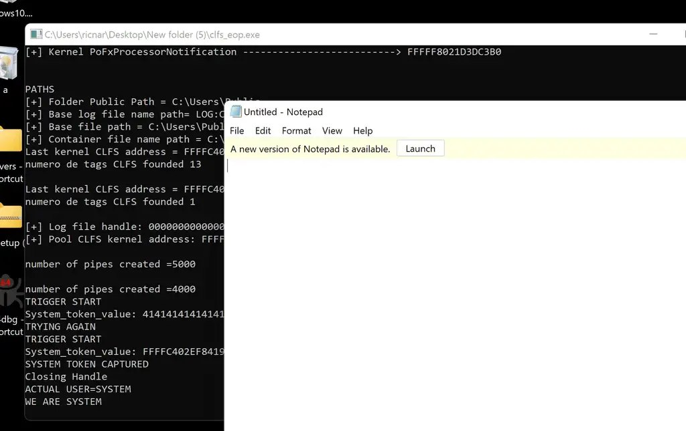
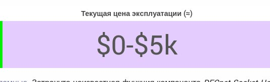
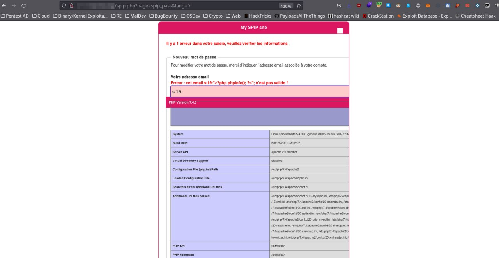
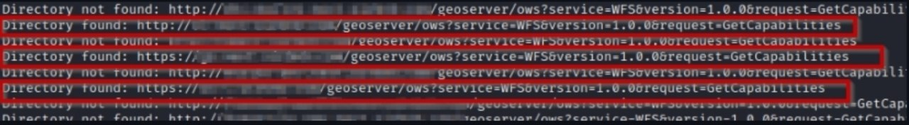

# cibsecurity
`2023-06-30`

* https://web.nvd.nist.gov/view/vuln/detail?vulnId=CVE-2023-35947

<blockquote>
‼ CVE-2023-35947 ‼

Gradle is a build tool with a focus on build automation and support for multi-language development. In affected versions when unpacking Tar archives, Gradle did not check that files could be written outside of the unpack location. This could lead to important files being overwritten anywhere the Gradle process has write permissions. For a build reading Tar entries from a Tar archive, this issue could allow Gradle to disclose information from sensitive files through an arbitrary file read. To exploit this behavior, an attacker needs to either control the source of an archive already used by the build or modify the build to interact with a malicious archive. It is unlikely that this would go unnoticed. A fix has been released in Gradle 7.6.2 and 8.2 to protect against this vulnerability. Starting from these versions, Gradle will refuse to handle Tar archives which contain path traversal elements in a Tar entry name. Users are advised to upgrade. There are no known workarounds for this vulnerability.&#35;&#35;&#35; ImpactThis is a path traversal vulnerability when Gradle deals with Tar archives, often referenced as TarSlip, a variant of ZipSlip.* When unpacking Tar archives, Gradle did not check that files could be written outside of the unpack location. This could lead to important files being overwritten anywhere the Gradle process has write permissions.* For a build reading Tar entries from a Tar archive, this issue could allow Gradle to disclose information from sensitive files through an arbitrary file read.To exploit this behavior, an attacker needs to either control the source of an archive already used by the build or modify the build to interact with a malicious archive. It is unlikely that this would go unnoticed.Gradle uses Tar archives for its [Build Cache](https://docs.gradle.org/current/userguide/build_cache.html). These archives are safe when created by Gradle. But if an attacker had control of a remote build cache server, they could inject malicious build cache entries that leverage this vulnerability. This attack vector could also be exploited if a man-in-the-middle can be performed between the remote cache and the build.&#35;&#35;&#35; PatchesA fix has been released in Gradle 7.6.2 and 8.2 to protect against this vulnerability. Starting from these versions, Gradle will refuse to handle Tar archives which contain path traversal elements in a Tar entry name.It is recommended that users upgrade to a patched version.&#35;&#35;&#35; WorkaroundsThere is no workaround.* If your build deals with Tar archives that you do not fully trust, you need to inspect them to confirm they do not attempt to leverage this vulnerability.* If you use the Gradle remote build cache, make sure only trusted parties have write access to it and that connections to the remote cache are properly secured.&#35;&#35;&#35; References* [CWE-22: Improper Limitation of a Pathname to a Restricted Directory ('Path Traversal')](https://cwe.mitre.org/data/definitions/22.html)* [Gradle Build Cache](https://docs.gradle.org/current/userguide/build_cache.html)* [ZipSlip](https://security.snyk.io/research/zip-slip-vulnerability)

📖 Read

via &quot;National Vulnerability Database&quot;.
</blockquote>

---

# cibsecurity
`2023-06-30`

* https://web.nvd.nist.gov/view/vuln/detail?vulnId=CVE-2023-36477

<blockquote>
‼ CVE-2023-36477 ‼

XWiki Platform is a generic wiki platform offering runtime services for applications built on top of it. Any user with edit rights can edit all pages in the `CKEditor' space. This makes it possible to perform a variety of harmful actions, such as removing technical documents, leading to loss of service and editing the javascript configuration of CKEditor, leading to persistent XSS. This issue has been patched in XWiki 14.10.6 and XWiki 15.1. This issue has been patched on the CKEditor Integration extension 1.64.9 for XWiki version older than 14.6RC1. Users are advised to upgrade. Users unable to upgrade may manually address the issue by restricting the `edit` and `delete` rights to a trusted user or group (e.g. the `XWiki.XWikiAdminGroup` group), implicitly disabling those rights for all other users. See commit `9d9d86179` for details.

📖 Read

via &quot;National Vulnerability Database&quot;.
</blockquote>

---

# defcon_news
`2023-06-30`

<blockquote>
TD Bank: Reflected XSS on marketsandresearch.td.com
https://vulners.com/hackerone/H1:1873305?utm_source&#61;rss&amp;utm_medium&#61;rss&amp;utm_campaign&#61;rss
</blockquote>

<table><tr><td><b>→</b><a href="https://vulners.com/hackerone/H1:1873305?utm_source=rss&utm_medium=rss&utm_campaign=rss">
https://vulners.com/hackerone/H1:1873305?utm_source=rss&utm_medium=rss&utm_campaign=rss
</a>
<blockquote>
Summary: Hi TD security team, there is a reflected XSS vulnerability at http://marketsandresearch.td.com. As you are most likely aware, XSS vulnerabilities can have significant security implications, including allowing an attacker to inject...
</blockquote>
</td></tr></table>

---

# defcon_news
`2023-06-30`

<blockquote>
Internet Bug Bounty:  CVE-2022-23520: Incomplete fix for CVE-2022-32209 (XSS in Rails::Html::Sanitizer under certain configurations)
https://vulners.com/hackerone/H1:1805893?utm_source&#61;rss&amp;utm_medium&#61;rss&amp;utm_campaign&#61;rss
</blockquote>

<table><tr><td><b>→</b><a href="https://vulners.com/hackerone/H1:1805893?utm_source=rss&utm_medium=rss&utm_campaign=rss">
https://vulners.com/hackerone/H1:1805893?utm_source=rss&utm_medium=rss&utm_campaign=rss
</a>
<blockquote>
The following is from: https://hackerone.com/reports/1654310 While building a PoC for CVE-2022-32209, I noticed that I could not fix my vulnerable application by updating https://github.com/rails/rails-html-sanitizer from 1.4.2 to 1.4.3 even though...
</blockquote>
</td></tr></table>

---

# defcon_news
`2023-06-30`

<blockquote>
Uber: DOM based XSS via insecure parameter on [ https://uberpay-mock-psp.uber.com ]
https://vulners.com/hackerone/H1:1767151?utm_source&#61;rss&amp;utm_medium&#61;rss&amp;utm_campaign&#61;rss
</blockquote>

---

# proxy_bar
`2023-06-30`

* https://github.com/fortra/CVE-2023-28252

<blockquote>
Ребят, тут Windows Common Log File System  протёк 
Есть патч от апреля, так что не 0-Day
CVE-2023-28252
POC exploit
 
&#35;windows &#35;lpe
</blockquote>

---

# cibsecurity
`2023-06-30`

* https://web.nvd.nist.gov/view/vuln/detail?vulnId=CVE-2023-35175

<blockquote>
‼ CVE-2023-35175 ‼

Certain HP LaserJet Pro print products are potentially vulnerable to Potential Remote Code Execution and/or Elevation of Privilege via Server-Side Request Forgery (SSRF) using the Web Service Eventing model.

📖 Read

via &quot;National Vulnerability Database&quot;.
</blockquote>

---

# cibsecurity
`2023-07-01`

* https://web.nvd.nist.gov/view/vuln/detail?vulnId=CVE-2023-34840

<blockquote>
‼ CVE-2023-34840 ‼

angular-ui-notification v0.1.0, v0.2.0, and v0.3.6 was discovered to contain a cross-site scripting (XSS) vulnerability.

📖 Read

via &quot;National Vulnerability Database&quot;.
</blockquote>

---

# cibsecurity
`2023-06-30`

* https://web.nvd.nist.gov/view/vuln/detail?vulnId=CVE-2023-37302

<blockquote>
‼ CVE-2023-37302 ‼

An issue was discovered in SiteLinksView.php in Wikibase in MediaWiki through 1.39.3. There is XSS via a crafted badge title attribute. This is also related to lack of escaping in wbTemplate (from resources/wikibase/templates.js) for quotes (which can be in a title attribute).

📖 Read

via &quot;National Vulnerability Database&quot;.
</blockquote>

---

# cibsecurity
`2023-06-30`

* https://web.nvd.nist.gov/view/vuln/detail?vulnId=CVE-2023-37304

<blockquote>
‼ CVE-2023-37304 ‼

An issue was discovered in the DoubleWiki extension for MediaWiki through 1.39.3. includes/DoubleWiki.php allows XSS via the column alignment feature.

📖 Read

via &quot;National Vulnerability Database&quot;.
</blockquote>

---

# defcon_news
`2023-06-30`

<blockquote>
Consensys: CSV Injection at https://assets-paris-demo.codefi.network/
https://vulners.com/hackerone/H1:1748961?utm_source&#61;rss&amp;utm_medium&#61;rss&amp;utm_campaign&#61;rss
</blockquote>

---

# defcon_news
`2023-06-30`

<blockquote>
U.S. Department of State: Bypassing Whitelist to perform SSRF for internal host scanning
https://vulners.com/hackerone/H1:1747596?utm_source&#61;rss&amp;utm_medium&#61;rss&amp;utm_campaign&#61;rss
</blockquote>

<table><tr><td><b>→</b><a href="https://vulners.com/hackerone/H1:1747596?utm_source=rss&utm_medium=rss&utm_campaign=rss">
https://vulners.com/hackerone/H1:1747596?utm_source=rss&utm_medium=rss&utm_campaign=rss
</a>
<blockquote>
Hello I have managed to identify a misconfiguration on the server side request forgery protections under host geonode.state.gov/proxy/?url&#61; This is using a whitelist protection to ensure only allowed domains and requested in the url e.g....
</blockquote>
</td></tr></table>

---

# defcon_news
`2023-06-30`

<blockquote>
Stripe: XSS vulnerability without a content security bypass in a `CUSTOM` App through Button tag
https://vulners.com/hackerone/H1:1823216?utm_source&#61;rss&amp;utm_medium&#61;rss&amp;utm_campaign&#61;rss
</blockquote>

<table><tr><td><b>→</b><a href="https://vulners.com/hackerone/H1:1823216?utm_source=rss&utm_medium=rss&utm_campaign=rss">
https://vulners.com/hackerone/H1:1823216?utm_source=rss&utm_medium=rss&utm_campaign=rss
</a>
<blockquote>
Summary: Hi security team members, Hope you are well and doing great :) I found a Possible XSS vulnerability in CUSTOM App through the Button tag but I was not able to bypass a content security policy. This report is similar to my previous...
</blockquote>
</td></tr></table>

---

# defcon_news
`2023-06-30`

<blockquote>
Equifax-vdp: reflected XSS in [www.equifax.com]
https://vulners.com/hackerone/H1:1818172?utm_source&#61;rss&amp;utm_medium&#61;rss&amp;utm_campaign&#61;rss
</blockquote>

<table><tr><td><b>→</b><a href="https://vulners.com/hackerone/H1:1818172?utm_source=rss&utm_medium=rss&utm_campaign=rss">
https://vulners.com/hackerone/H1:1818172?utm_source=rss&utm_medium=rss&utm_campaign=rss
</a>
<blockquote>
hi , I hope you are well, i found reflected XSS in this endpoint via q  parameter: https://www.equifax.com/personal/search?q&#61;broook Steps:  open https://www.equifax.com/personal/search?q&#61;broook view the source code of the page and search for word...
</blockquote>
</td></tr></table>

---

# defcon_news
`2023-06-30`

<blockquote>
Reddit: Reflected XSS via File Upload
https://vulners.com/hackerone/H1:1816181?utm_source&#61;rss&amp;utm_medium&#61;rss&amp;utm_campaign&#61;rss
</blockquote>

<table><tr><td><b>→</b><a href="https://vulners.com/hackerone/H1:1816181?utm_source=rss&utm_medium=rss&utm_campaign=rss">
https://vulners.com/hackerone/H1:1816181?utm_source=rss&utm_medium=rss&utm_campaign=rss
</a>
<blockquote>
Summary: Reflected XSS in &quot; https://reddit.zendesk.com/hc/en-us/requests/new &quot; via file upload Impact: !! attacker can send that email to victim and steal user account or cookies Cross site scripting attacks can have devastating consequences. Code...
</blockquote>
</td></tr></table>

---

# defcon_news
`2023-06-30`

<blockquote>
8x8 Bounty: connect.8x8.com: Blind SSRF via /api/v2/chats/image-check allows for Internal Ports scan
https://vulners.com/hackerone/H1:1875484?utm_source&#61;rss&amp;utm_medium&#61;rss&amp;utm_campaign&#61;rss
</blockquote>

<table><tr><td><b>→</b><a href="https://vulners.com/hackerone/H1:1875484?utm_source=rss&utm_medium=rss&utm_campaign=rss">
https://vulners.com/hackerone/H1:1875484?utm_source=rss&utm_medium=rss&utm_campaign=rss
</a>
<blockquote>
@yassinek3ch reported to us a Blind SSRF in the 8x8 Connect application, in the ChatApps module, which potentially could have allowed for internal port scans. The vulnerable API path was /api/v2/chats/image-check via the url JSON parameter....
</blockquote>
</td></tr></table>

---

# cibsecurity
`2023-06-30`

* https://web.nvd.nist.gov/view/vuln/detail?vulnId=CVE-2023-33276

<blockquote>
‼ CVE-2023-33276 ‼

The web interface of Gira Giersiepen Gira KNX/IP-Router 3.1.3683.0 and 3.3.8.0 responds with a &quot;404 - Not Found&quot; status code if a path is accessed that does not exist. However, the value of the path is reflected in the response. As the application will reflect the supplied path without context-sensitive HTML encoding, it is vulnerable to reflective cross-site scripting (XSS).

📖 Read

via &quot;National Vulnerability Database&quot;.
</blockquote>

---

# cibsecurity
`2023-06-30`

* https://web.nvd.nist.gov/view/vuln/detail?vulnId=CVE-2023-37299

<blockquote>
‼ CVE-2023-37299 ‼

Joplin before 2.11.5 allows XSS via an AREA element of an image map.

📖 Read

via &quot;National Vulnerability Database&quot;.
</blockquote>

---

# cibsecurity
`2023-07-01`

* https://web.nvd.nist.gov/view/vuln/detail?vulnId=CVE-2023-37298

<blockquote>
‼ CVE-2023-37298 ‼

Joplin before 2.11.5 allows XSS via a USE element in an SVG document.

📖 Read

via &quot;National Vulnerability Database&quot;.
</blockquote>

---

# defcon_news
`2023-06-30`

<blockquote>
IBM: Moodle XSS on s-immerscio.comprehend.ibm.com
https://vulners.com/hackerone/H1:1848551?utm_source&#61;rss&amp;utm_medium&#61;rss&amp;utm_campaign&#61;rss
</blockquote>

<table><tr><td><b>→</b><a href="https://vulners.com/hackerone/H1:1848551?utm_source=rss&utm_medium=rss&utm_campaign=rss">
https://vulners.com/hackerone/H1:1848551?utm_source=rss&utm_medium=rss&utm_campaign=rss
</a>
<blockquote>
Cross-site scripting against IBM website was reported to IBM, analyzed and have been remediated. Thank you to our external...
</blockquote>
</td></tr></table>

---

# defcon_news
`2023-06-30`

<blockquote>
Equifax-vdp: reflected XSS in [www.equifax.com]
https://vulners.com/hackerone/H1:1818163?utm_source&#61;rss&amp;utm_medium&#61;rss&amp;utm_campaign&#61;rss
</blockquote>

<table><tr><td><b>→</b><a href="https://vulners.com/hackerone/H1:1818163?utm_source=rss&utm_medium=rss&utm_campaign=rss">
https://vulners.com/hackerone/H1:1818163?utm_source=rss&utm_medium=rss&utm_campaign=rss
</a>
<blockquote>
hi , I hope you are well, i found reflected XSS in this endpoint: https://www.equifax.com/personal/help/search?search&#61;broook Steps:  open https://www.equifax.com/personal/help/search?search&#61;broook  view the source code of the page and search for...
</blockquote>
</td></tr></table>

---

# defcon_news
`2023-06-30`

<blockquote>
Internet Bug Bounty: CVE-2022-23519: Rails::Html::SafeListSanitizer vulnerable to XSS when certain tags are allowed (math+style || svg+style)
https://vulners.com/hackerone/H1:1805899?utm_source&#61;rss&amp;utm_medium&#61;rss&amp;utm_campaign&#61;rss
</blockquote>

<table><tr><td><b>→</b><a href="https://vulners.com/hackerone/H1:1805899?utm_source=rss&utm_medium=rss&utm_campaign=rss">
https://vulners.com/hackerone/H1:1805899?utm_source=rss&utm_medium=rss&utm_campaign=rss
</a>
<blockquote>
The following is from: https://hackerone.com/reports/1656627 Intro The Rails HTML sanitzier allows to set certain combinations of tags in it's allow list that are not properly handled.  Similar to the report 1530898, which identified the...
</blockquote>
</td></tr></table>

---

# defcon_news
`2023-06-30`

<blockquote>
Mars: Stored XSS via ' profile ' at https://www.miroyalcanin.cl/
https://vulners.com/hackerone/H1:1921606?utm_source&#61;rss&amp;utm_medium&#61;rss&amp;utm_campaign&#61;rss
</blockquote>

<table><tr><td><b>→</b><a href="https://www.miroyalcanin.cl/">
https://www.miroyalcanin.cl/
</a>
<blockquote>
Registrate para acceder a contenidos y promociones exclusivas a través de Mi Royal Canin.
</blockquote>
</td></tr></table>

---

# defcon_news
`2023-06-30`

<blockquote>
Reversing Citrix Gateway for XSS
https://www.reddit.com/r/netsec/comments/14n28jb/reversing_citrix_gateway_for_xss/
</blockquote>

<table><tr><td><b>→</b><a href="https://www.reddit.com/r/netsec/comments/14n28jb/reversing_citrix_gateway_for_xss/">
https://www.reddit.com/r/netsec/comments/14n28jb/reversing_citrix_gateway_for_xss/
</a>
<blockquote>
Explore this post and more from the netsec community
</blockquote>
</td></tr></table>

---

# cibsecurity
`2023-06-30`

* https://web.nvd.nist.gov/view/vuln/detail?vulnId=CVE-2023-3478

<blockquote>
‼ CVE-2023-3478 ‼

A vulnerability classified as critical was found in IBOS OA 4.5.5. Affected by this vulnerability is the function actionEdit of the file ?r&#61;dashboard/roleadmin/edit&amp;op&#61;member of the component Add User Handler. The manipulation of the argument id leads to sql injection. The attack can be launched remotely. The exploit has been disclosed to the public and may be used. The associated identifier of this vulnerability is VDB-232759. NOTE: The vendor was contacted early about this disclosure but did not respond in any way.

📖 Read

via &quot;National Vulnerability Database&quot;.
</blockquote>

---

# cibsecurity
`2023-06-30`

* https://web.nvd.nist.gov/view/vuln/detail?vulnId=CVE-2023-3479

<blockquote>
‼ CVE-2023-3479 ‼

Cross-site Scripting (XSS) - Reflected in GitHub repository hestiacp/hestiacp prior to 1.7.8.

📖 Read

via &quot;National Vulnerability Database&quot;.
</blockquote>

---

# cibsecurity
`2023-06-30`

* https://web.nvd.nist.gov/view/vuln/detail?vulnId=CVE-2023-3473

<blockquote>
‼ CVE-2023-3473 ‼

A vulnerability, which was classified as critical, was found in Campcodes Retro Cellphone Online Store 1.0. Affected is an unknown function of the file /admin/edit_product.php. The manipulation of the argument username leads to sql injection. It is possible to launch the attack remotely. The exploit has been disclosed to the public and may be used. The identifier of this vulnerability is VDB-232752.

📖 Read

via &quot;National Vulnerability Database&quot;.
</blockquote>

---

# cibsecurity
`2023-06-30`

* https://web.nvd.nist.gov/view/vuln/detail?vulnId=CVE-2023-2846

<blockquote>
‼ CVE-2023-2846 ‼

Authentication Bypass by Capture-replay vulnerability in Mitsubishi Electric Corporation MELSEC iQ-F Series main modules allows a remote unauthenticated attacker to cancel the password/keyword setting and login to the affected products by sending specially crafted packets.

📖 Read

via &quot;National Vulnerability Database&quot;.
</blockquote>

---

# cibsecurity
`2023-06-29`

* https://web.nvd.nist.gov/view/vuln/detail?vulnId=CVE-2020-26710

<blockquote>
‼ CVE-2020-26710 ‼

easy-parse v0.1.1 was discovered to contain a XML External Entity Injection (XXE) vulnerability which allows attackers to execute arbitrary code via a crafted XML file.

📖 Read

via &quot;National Vulnerability Database&quot;.
</blockquote>

---

# cibsecurity
`2023-06-29`

* https://web.nvd.nist.gov/view/vuln/detail?vulnId=CVE-2020-26709

<blockquote>
‼ CVE-2020-26709 ‼

py-xml v1.0 was discovered to contain an XML External Entity Injection (XXE) vulnerability which allows attackers to execute arbitrary code via a crafted XML file.

📖 Read

via &quot;National Vulnerability Database&quot;.
</blockquote>

---

# cibsecurity
`2023-06-29`

* https://web.nvd.nist.gov/view/vuln/detail?vulnId=CVE-2020-26708

<blockquote>
‼ CVE-2020-26708 ‼

requests-xml v0.2.3 was discovered to contain an XML External Entity Injection (XXE) vulnerability which allows attackers to execute arbitrary code via a crafted XML file.

📖 Read

via &quot;National Vulnerability Database&quot;.
</blockquote>

---

# cibsecurity
`2023-06-29`

* https://web.nvd.nist.gov/view/vuln/detail?vulnId=CVE-2023-37254

<blockquote>
‼ CVE-2023-37254 ‼

An issue was discovered in the Cargo extension for MediaWiki through 1.39.3. XSS can occur in Special:CargoQuery via a crafted page item when using the default format.

📖 Read

via &quot;National Vulnerability Database&quot;.
</blockquote>

---

# cibsecurity
`2023-06-29`

* https://web.nvd.nist.gov/view/vuln/detail?vulnId=CVE-2023-36488

<blockquote>
‼ CVE-2023-36488 ‼

ILIAS 7.21 allows stored Cross Site Scripting (XSS).

📖 Read

via &quot;National Vulnerability Database&quot;.
</blockquote>

---

# cibsecurity
`2023-06-29`

* https://web.nvd.nist.gov/view/vuln/detail?vulnId=CVE-2023-34599

<blockquote>
‼ CVE-2023-34599 ‼

Multiple Cross-Site Scripting (XSS) vulnerabilities have been identified in Gibbon v25.0.0, which enable attackers to execute arbitrary Javascript code.

📖 Read

via &quot;National Vulnerability Database&quot;.
</blockquote>

---

# cibsecurity
`2023-06-29`

* https://web.nvd.nist.gov/view/vuln/detail?vulnId=CVE-2023-3457

<blockquote>
‼ CVE-2023-3457 ‼

A vulnerability was found in SourceCodester Shopping Website 1.0. It has been classified as critical. Affected is an unknown function of the file index.php. The manipulation of the argument username leads to sql injection. It is possible to launch the attack remotely. The exploit has been disclosed to the public and may be used. VDB-232674 is the identifier assigned to this vulnerability.

📖 Read

via &quot;National Vulnerability Database&quot;.
</blockquote>

---

# cibsecurity
`2023-06-29`

* https://web.nvd.nist.gov/view/vuln/detail?vulnId=CVE-2023-34487

<blockquote>
‼ CVE-2023-34487 ‼

itsourcecode Online Hotel Management System Project In PHP v1.0.0 is vulnerable to SQL Injection. SQL injection points exist in the login password input box. This vulnerability can be exploited through time-based blind injection.

📖 Read

via &quot;National Vulnerability Database&quot;.
</blockquote>

---

# cibsecurity
`2023-06-29`

* https://web.nvd.nist.gov/view/vuln/detail?vulnId=CVE-2023-3458

<blockquote>
‼ CVE-2023-3458 ‼

A vulnerability was found in SourceCodester Shopping Website 1.0. It has been declared as critical. Affected by this vulnerability is an unknown functionality of the file forgot-password.php. The manipulation of the argument contact leads to sql injection. The attack can be launched remotely. The exploit has been disclosed to the public and may be used. The associated identifier of this vulnerability is VDB-232675.

📖 Read

via &quot;National Vulnerability Database&quot;.
</blockquote>

---

# cibsecurity
`2023-06-29`

* https://web.nvd.nist.gov/view/vuln/detail?vulnId=CVE-2023-34486

<blockquote>
‼ CVE-2023-34486 ‼

itsourcecode Online Hotel Management System Project In PHP v1.0.0 is vulnerable to Cross Site Scripting (XSS). Remote code execution can be achieved by entering malicious code in the date selection box.

📖 Read

via &quot;National Vulnerability Database&quot;.
</blockquote>

---

# cibsecurity
`2023-06-29`

* https://web.nvd.nist.gov/view/vuln/detail?vulnId=CVE-2023-34598

<blockquote>
‼ CVE-2023-34598 ‼

Gibbon v25.0.0 is vulnerable to a Local File Inclusion (LFI) where it's possible to include the content of several files present in the installation folder in the server's response.

📖 Read

via &quot;National Vulnerability Database&quot;.
</blockquote>

---

# cibsecurity
`2023-06-29`

* https://web.nvd.nist.gov/view/vuln/detail?vulnId=CVE-2023-34735

<blockquote>
‼ CVE-2023-34735 ‼

Property Cloud Platform Management Center 1.0 is vulnerable to error-based SQL injection.

📖 Read

via &quot;National Vulnerability Database&quot;.
</blockquote>

---

# it_secur
`2023-06-29`

<blockquote>
История одной XSS в Telegram: https://habr.com/ru/articles/744316/
</blockquote>

<table><tr><td><b>→</b><a href="https://habr.com/ru/articles/744316/">
https://habr.com/ru/articles/744316/
</a>
<blockquote>
Статья име­ет озна­коми­тель­ный харак­тер и пред­назна­чена для спе­циалис­тов по безопас­ности, про­водя­щих тес­тирова­ние в рам­ках кон­трак­та. Автор не несет...
</blockquote>
</td></tr></table>

---

# freedomf0x
`2023-06-29`

* https://github.com/TurtleARM/CVE-2023-3338

<blockquote>
CVE-2023-3338 
Linux kernel LPE 
exploit
пока не дорого)

&#35;linux &#35;lpe
</blockquote>

---

# proxy_bar
`2023-06-29`

* https://github.com/TurtleARM/CVE-2023-3338

<blockquote>
CVE-2023-3338 
Linux kernel LPE 
exploit
пока не дорого)

&#35;linux &#35;lpe
</blockquote>

---

# cibsecurity
`2023-06-29`

* https://web.nvd.nist.gov/view/vuln/detail?vulnId=CVE-2022-23264

<blockquote>
‼ CVE-2022-23264 ‼

Microsoft Edge (Chromium-based) Spoofing Vulnerability

📖 Read

via &quot;National Vulnerability Database&quot;.
</blockquote>

---

# cibsecurity
`2023-06-29`

* https://web.nvd.nist.gov/view/vuln/detail?vulnId=CVE-2023-34647

<blockquote>
‼ CVE-2023-34647 ‼

PHPgurukl Hostel Management System v.1.0 is vulnerable to Cross Site Scripting (XSS).

📖 Read

via &quot;National Vulnerability Database&quot;.
</blockquote>

---

# cibsecurity
`2023-06-28`

* https://web.nvd.nist.gov/view/vuln/detail?vulnId=CVE-2023-34650

<blockquote>
‼ CVE-2023-34650 ‼

PHPgurukl Small CRM v.1.0 is vulnerable to Cross Site Scripting (XSS).

📖 Read

via &quot;National Vulnerability Database&quot;.
</blockquote>

---

# cibsecurity
`2023-06-28`

* https://web.nvd.nist.gov/view/vuln/detail?vulnId=CVE-2023-3389

<blockquote>
‼ CVE-2023-3389 ‼

A use-after-free vulnerability in the Linux Kernel io_uring subsystem can be exploited to achieve local privilege escalation.Racing a io_uring cancel poll request with a linked timeout can cause a UAF in a hrtimer.We recommend upgrading past commit 4716c73b188566865bdd79c3a6709696a224ac04 for 5.10 stable and 0e388fce7aec40992eadee654193cad345d62663 for 5.15 stable.

📖 Read

via &quot;National Vulnerability Database&quot;.
</blockquote>

---

# cibsecurity
`2023-06-28`

* https://web.nvd.nist.gov/view/vuln/detail?vulnId=CVE-2023-34652

<blockquote>
‼ CVE-2023-34652 ‼

PHPgurukl Hostel Management System v.1.0 is vulnerable to Cross Site Scripting (XSS) via Add New Course.

📖 Read

via &quot;National Vulnerability Database&quot;.
</blockquote>

---

# cibsecurity
`2023-06-28`

* https://web.nvd.nist.gov/view/vuln/detail?vulnId=CVE-2023-34761

<blockquote>
‼ CVE-2023-34761 ‼

An unauthenticated attacker within BLE proximity can remotely connect to a 7-Eleven LED Message Cup, Hello Cup 1.3.1 for Android, and bypass the application's client-side chat censor filter.

📖 Read

via &quot;National Vulnerability Database&quot;.
</blockquote>

---

# cibsecurity
`2023-06-28`

* https://web.nvd.nist.gov/view/vuln/detail?vulnId=CVE-2023-34651

<blockquote>
‼ CVE-2023-34651 ‼

PHPgurukl Hospital Management System v.1.0 is vulnerable to Cross Site Scripting (XSS).

📖 Read

via &quot;National Vulnerability Database&quot;.
</blockquote>

---

# cibsecurity
`2023-06-28`

* https://web.nvd.nist.gov/view/vuln/detail?vulnId=CVE-2023-33592

<blockquote>
‼ CVE-2023-33592 ‼

Lost and Found Information System v1.0 was discovered to contain a SQL injection vulnerability via the component /php-lfis/admin/?page&#61;system_info/contact_information.

📖 Read

via &quot;National Vulnerability Database&quot;.
</blockquote>

---

# cibsecurity
`2023-06-28`

* https://web.nvd.nist.gov/view/vuln/detail?vulnId=CVE-2023-3390

<blockquote>
‼ CVE-2023-3390 ‼

A use-after-free vulnerability was found in the Linux kernel's netfilter subsystem in net/netfilter/nf_tables_api.c.Mishandled error handling with NFT_MSG_NEWRULE makes it possible to use a dangling pointer in the same transaction causing a use-after-free vulnerability. This flaw allows a local attacker with user access to cause a privilege escalation issue.We recommend upgrading past commit 1240eb93f0616b21c675416516ff3d74798fdc97.

📖 Read

via &quot;National Vulnerability Database&quot;.
</blockquote>

---

# cibsecurity
`2023-06-28`

* https://web.nvd.nist.gov/view/vuln/detail?vulnId=CVE-2023-3449

<blockquote>
‼ CVE-2023-3449 ‼

A vulnerability has been found in IBOS OA 4.5.5 and classified as critical. This vulnerability affects the function actionExport of the file ?r&#61;recruit/interview/export&amp;interviews&#61;x of the component Interview Management Export. The manipulation of the argument interviews leads to sql injection. The exploit has been disclosed to the public and may be used. VDB-232546 is the identifier assigned to this vulnerability. NOTE: The vendor was contacted early about this disclosure but did not respond in any way.

📖 Read

via &quot;National Vulnerability Database&quot;.
</blockquote>

---

# cibsecurity
`2023-06-28`

* https://web.nvd.nist.gov/view/vuln/detail?vulnId=CVE-2023-21192

<blockquote>
‼ CVE-2023-21192 ‼

In setInputMethodWithSubtypeIdLocked of InputMethodManagerService.java, there is a possible way to setup input methods that are not enabled due to improper input validation. This could lead to local escalation of privilege with no additional execution privileges needed. User interaction is not needed for exploitation.Product: AndroidVersions: Android-13Android ID: A-227207653

📖 Read

via &quot;National Vulnerability Database&quot;.
</blockquote>

---

# cibsecurity
`2023-06-28`

* https://web.nvd.nist.gov/view/vuln/detail?vulnId=CVE-2023-21203

<blockquote>
‼ CVE-2023-21203 ‼

In startWpsPbcInternal of sta_iface.cpp, there is a possible out of bounds read due to improper input validation. This could lead to local escalation of privilege with System execution privileges needed. User interaction is not needed for exploitation.Product: AndroidVersions: Android-13Android ID: A-262246082

📖 Read

via &quot;National Vulnerability Database&quot;.
</blockquote>

---

# cibsecurity
`2023-06-28`

* https://web.nvd.nist.gov/view/vuln/detail?vulnId=CVE-2023-21210

<blockquote>
‼ CVE-2023-21210 ‼

In initiateHs20IconQueryInternal of sta_iface.cpp, there is a possible out of bounds read due to improper input validation. This could lead to local information disclosure with System execution privileges needed. User interaction is not needed for exploitation.Product: AndroidVersions: Android-13Android ID: A-262236331

📖 Read

via &quot;National Vulnerability Database&quot;.
</blockquote>

---

# cibsecurity
`2023-06-28`

* https://web.nvd.nist.gov/view/vuln/detail?vulnId=CVE-2023-21156

<blockquote>
‼ CVE-2023-21156 ‼

In BuildGetRadioNode of protocolmiscbulider.cpp, there is a possible out of bounds read due to improper input validation. This could lead to local information disclosure from the modem with System execution privileges needed. User interaction is not needed for exploitation.Product: AndroidVersions: Android kernelAndroid ID: A-264540759References: N/A

📖 Read

via &quot;National Vulnerability Database&quot;.
</blockquote>

---

# cibsecurity
`2023-06-28`

* https://web.nvd.nist.gov/view/vuln/detail?vulnId=CVE-2023-20188

<blockquote>
‼ CVE-2023-20188 ‼

A vulnerability in the web-based management interface of Cisco Small Business 200 Series Smart Switches, Cisco Small Business 300 Series Managed Switches, and Cisco Small Business 500 Series Stackable Managed Switches could allow an authenticated, remote attacker to conduct a stored cross-site scripting (XSS) attack against a user of the interface on an affected device. This vulnerability is due to insufficient validation of user-supplied input. An attacker could exploit this vulnerability by persuading a user of an affected interface to view a page containing malicious HTML or script content. A successful exploit could allow the attacker to execute arbitrary script code in the context of the affected interface or access sensitive, browser-based information. To exploit this vulnerability, the attacker would need to have valid credentials to access the web-based management interface of the affected device. Cisco has not released software updates to address this vulnerability.

📖 Read

via &quot;National Vulnerability Database&quot;.
</blockquote>

---

# cibsecurity
`2023-06-28`

* https://web.nvd.nist.gov/view/vuln/detail?vulnId=CVE-2023-20120

<blockquote>
‼ CVE-2023-20120 ‼

Multiple vulnerabilities in the web-based management interface of Cisco AsyncOS Software for Cisco Secure Email and Web Manager; Cisco Secure Email Gateway, formerly Cisco Email Security Appliance (ESA); and Cisco Secure Web Appliance, formerly Cisco Web Security Appliance (WSA), could allow a remote attacker to conduct a cross-site scripting (XSS) attack against a user of the interface. For more information about these vulnerabilities, see the Details section of this advisory.

📖 Read

via &quot;National Vulnerability Database&quot;.
</blockquote>

---

# cibsecurity
`2023-06-28`

* https://web.nvd.nist.gov/view/vuln/detail?vulnId=CVE-2023-3445

<blockquote>
‼ CVE-2023-3445 ‼

Cross-site Scripting (XSS) - Stored in GitHub repository spinacms/spina prior to 2.15.1.

📖 Read

via &quot;National Vulnerability Database&quot;.
</blockquote>

---

# cibsecurity
`2023-06-28`

* https://web.nvd.nist.gov/view/vuln/detail?vulnId=CVE-2023-20028

<blockquote>
‼ CVE-2023-20028 ‼

Multiple vulnerabilities in the web-based management interface of Cisco AsyncOS Software for Cisco Secure Email and Web Manager; Cisco Secure Email Gateway, formerly Cisco Email Security Appliance (ESA); and Cisco Secure Web Appliance, formerly Cisco Web Security Appliance (WSA), could allow a remote attacker to conduct a cross-site scripting (XSS) attack against a user of the interface. For more information about these vulnerabilities, see the Details section of this advisory.

📖 Read

via &quot;National Vulnerability Database&quot;.
</blockquote>

---

# defcon_news
`2023-06-28`

<blockquote>
SPIP 4.2.3 SQL Injection
https://packetstormsecurity.com/files/173184/spip423-sql.txt
</blockquote>

<table><tr><td><b>→</b><a href="https://packetstormsecurity.com/files/173184/spip423-sql.txt">
https://packetstormsecurity.com/files/173184/spip423-sql.txt
</a>
<blockquote>
Information Security Services, News, Files, Tools, Exploits, Advisories and Whitepapers
</blockquote>
</td></tr></table>

---

# defcon_news
`2023-06-28`

<blockquote>
Alumni Club Management Tools 2.2.7 SQL Injection
https://packetstormsecurity.com/files/173171/acmt227-sql.txt
</blockquote>

<table><tr><td><b>→</b><a href="https://packetstormsecurity.com/files/173171/acmt227-sql.txt">
https://packetstormsecurity.com/files/173171/acmt227-sql.txt
</a>
<blockquote>
Information Security Services, News, Files, Tools, Exploits, Advisories and Whitepapers
</blockquote>
</td></tr></table>

---

# defcon_news
`2023-06-28`

<blockquote>
ALTISA CMS 5.2.1 SQL Injection
https://packetstormsecurity.com/files/173170/altisacms521-sql.txt
</blockquote>

<table><tr><td><b>→</b><a href="https://packetstormsecurity.com/files/173170/altisacms521-sql.txt">
https://packetstormsecurity.com/files/173170/altisacms521-sql.txt
</a>
<blockquote>
Information Security Services, News, Files, Tools, Exploits, Advisories and Whitepapers
</blockquote>
</td></tr></table>

---

# defcon_news
`2023-06-28`

<blockquote>
Advanced Testimonials Manager 4.1.1 SQL Injection
https://packetstormsecurity.com/files/173169/atm411-sql.txt
</blockquote>

<table><tr><td><b>→</b><a href="https://packetstormsecurity.com/files/173169/atm411-sql.txt">
https://packetstormsecurity.com/files/173169/atm411-sql.txt
</a>
<blockquote>
Information Security Services, News, Files, Tools, Exploits, Advisories and Whitepapers
</blockquote>
</td></tr></table>

---

# cibsecurity
`2023-06-28`

* https://web.nvd.nist.gov/view/vuln/detail?vulnId=CVE-2023-3034

<blockquote>
‼ CVE-2023-3034 ‼

Reflected XSS affects the ‘mode’ parameter in the /admin functionality of the web application in versions &lt;&#61;2.0.44

📖 Read

via &quot;National Vulnerability Database&quot;.
</blockquote>

---

# cibsecurity
`2023-06-28`

* https://web.nvd.nist.gov/view/vuln/detail?vulnId=CVE-2023-32623

<blockquote>
‼ CVE-2023-32623 ‼

Directory traversal vulnerability in Snow Monkey Forms versions v5.1.0 and earlier allows a remote unauthenticated attacker to delete arbitrary files on the server.

📖 Read

via &quot;National Vulnerability Database&quot;.
</blockquote>

---

# defcon_news
`2023-06-28`

<blockquote>
Critical SQL Injection Flaws Expose Gentoo Soko to Remote Code Execution
https://thehackernews.com/2023/06/critical-sql-injection-flaws-expose.html
</blockquote>

---

# cibsecurity
`2023-06-28`

* https://web.nvd.nist.gov/view/vuln/detail?vulnId=CVE-2023-25001

<blockquote>
‼ CVE-2023-25001 ‼

A maliciously crafted SKP file in Autodesk Navisworks 2023 and 2022 be used to trigger use-after-free vulnerability. Exploitation of this vulnerability may lead to code execution.

📖 Read

via &quot;National Vulnerability Database&quot;.
</blockquote>

---

# cibsecurity
`2023-06-28`

* https://web.nvd.nist.gov/view/vuln/detail?vulnId=CVE-2023-25002

<blockquote>
‼ CVE-2023-25002 ‼

A maliciously crafted SKP file in Autodesk products is used to trigger use-after-free vulnerability. Exploitation of this vulnerability may lead to code execution.

📖 Read

via &quot;National Vulnerability Database&quot;.
</blockquote>

---

# cibsecurity
`2023-06-27`

* https://web.nvd.nist.gov/view/vuln/detail?vulnId=CVE-2020-18414

<blockquote>
‼ CVE-2020-18414 ‼

Stored cross site scripting (XSS) vulnerability in Chaoji CMS v2.18 that allows attackers to execute arbitrary code via /index.php?admin-master-webset.

📖 Read

via &quot;National Vulnerability Database&quot;.
</blockquote>

---

# cibsecurity
`2023-06-27`

* https://web.nvd.nist.gov/view/vuln/detail?vulnId=CVE-2023-34830

<blockquote>
‼ CVE-2023-34830 ‼

i-doit Open v24 was discovered to contain a reflected cross-site scripting (XSS) vulnerability via the timeout parameter on the login page.

📖 Read

via &quot;National Vulnerability Database&quot;.
</blockquote>

---

# defcon_news
`2023-06-27`

<blockquote>
Office Suite Premium 10.9.1.42602 Local File Inclusion
https://packetstormsecurity.com/files/173146/osp109142602-lfi.txt
</blockquote>

<table><tr><td><b>→</b><a href="https://packetstormsecurity.com/files/173146/osp109142602-lfi.txt">
https://packetstormsecurity.com/files/173146/osp109142602-lfi.txt
</a>
<blockquote>
Information Security Services, News, Files, Tools, Exploits, Advisories and Whitepapers
</blockquote>
</td></tr></table>

---

# defcon_news
`2023-06-27`

<blockquote>
Thinu-CMS Blog System 1.5 SQL Injection
https://packetstormsecurity.com/files/173119/thinucmsblogsystem15-sql.txt
</blockquote>

<table><tr><td><b>→</b><a href="https://packetstormsecurity.com/files/173119/thinucmsblogsystem15-sql.txt">
https://packetstormsecurity.com/files/173119/thinucmsblogsystem15-sql.txt
</a>
<blockquote>
Information Security Services, News, Files, Tools, Exploits, Advisories and Whitepapers
</blockquote>
</td></tr></table>

---

# cibsecurity
`2023-06-27`

* https://web.nvd.nist.gov/view/vuln/detail?vulnId=CVE-2023-32604

<blockquote>
‼ CVE-2023-32604 ‼

Affected versions Trend Micro Apex Central (on-premise) are vulnerable to potential authenticated reflected cross-site scripting (XSS) attacks due to user input validation and sanitization issues. Please note: an attacker must first obtain authentication to Apex Central on the target system in order to exploit this vulnerability.This is similar to, but not identical to CVE-2023-32605.

📖 Read

via &quot;National Vulnerability Database&quot;.
</blockquote>

---

# cibsecurity
`2023-06-27`

* https://web.nvd.nist.gov/view/vuln/detail?vulnId=CVE-2023-32535

<blockquote>
‼ CVE-2023-32535 ‼

Certain dashboard widgets on Trend Micro Apex Central (on-premise) are vulnerable to cross-site scripting (XSS) attacks that may allow an attacker to achieve remote code execution on affected servers.This is similar to, but not identical to CVE-2023-32531 through 32534.

📖 Read

via &quot;National Vulnerability Database&quot;.
</blockquote>

---

# cibsecurity
`2023-06-27`

* https://web.nvd.nist.gov/view/vuln/detail?vulnId=CVE-2023-32536

<blockquote>
‼ CVE-2023-32536 ‼

Affected versions Trend Micro Apex Central (on-premise) are vulnerable to potential authenticated reflected cross-site scripting (XSS) attacks due to user input validation and sanitization issues. Please note: an attacker must first obtain authentication to Apex Central on the target system in order to exploit this vulnerability.This is similar to, but not identical to CVE-2023-32537.

📖 Read

via &quot;National Vulnerability Database&quot;.
</blockquote>

---

# cibsecurity
`2023-06-27`

* https://web.nvd.nist.gov/view/vuln/detail?vulnId=CVE-2023-32531

<blockquote>
‼ CVE-2023-32531 ‼

Certain dashboard widgets on Trend Micro Apex Central (on-premise) are vulnerable to cross-site scripting (XSS) attacks that may allow an attacker to achieve remote code execution on affected servers.This is similar to, but not identical to CVE-2023-32532 through 32535.

📖 Read

via &quot;National Vulnerability Database&quot;.
</blockquote>

---

# cibsecurity
`2023-06-27`

* https://web.nvd.nist.gov/view/vuln/detail?vulnId=CVE-2023-32533

<blockquote>
‼ CVE-2023-32533 ‼

Certain dashboard widgets on Trend Micro Apex Central (on-premise) are vulnerable to cross-site scripting (XSS) attacks that may allow an attacker to achieve remote code execution on affected servers.This is similar to, but not identical to CVE-2023-32531 through 32535.

📖 Read

via &quot;National Vulnerability Database&quot;.
</blockquote>

---

# cibsecurity
`2023-06-27`

* https://web.nvd.nist.gov/view/vuln/detail?vulnId=CVE-2023-32529

<blockquote>
‼ CVE-2023-32529 ‼

Vulnerable modules of Trend Micro Apex Central (on-premise) contain vulnerabilities which would allow authenticated users to perform a SQL injection that could lead to remote code execution.Please note: an attacker must first obtain authentication on the target system in order to exploit these vulnerabilities.This is similar to, but not identical to CVE-2023-32530.

📖 Read

via &quot;National Vulnerability Database&quot;.
</blockquote>

---

# cibsecurity
`2023-06-27`

* https://web.nvd.nist.gov/view/vuln/detail?vulnId=CVE-2023-32537

<blockquote>
‼ CVE-2023-32537 ‼

Affected versions Trend Micro Apex Central (on-premise) are vulnerable to potential authenticated reflected cross-site scripting (XSS) attacks due to user input validation and sanitization issues. Please note: an attacker must first obtain authentication to Apex Central on the target system in order to exploit this vulnerability.This is similar to, but not identical to CVE-2023-32536.

📖 Read

via &quot;National Vulnerability Database&quot;.
</blockquote>

---

# cibsecurity
`2023-06-27`

* https://web.nvd.nist.gov/view/vuln/detail?vulnId=CVE-2023-32553

<blockquote>
‼ CVE-2023-32553 ‼

An Improper access control vulnerability in Trend Micro Apex One and Apex One as a Service could allow an unauthenticated user under certain circumstances to disclose sensitive information on agents.This is similar to, but not identical to CVE-2023-32552.

📖 Read

via &quot;National Vulnerability Database&quot;.
</blockquote>

---

# cibsecurity
`2023-06-27`

* https://web.nvd.nist.gov/view/vuln/detail?vulnId=CVE-2023-32552

<blockquote>
‼ CVE-2023-32552 ‼

An Improper access control vulnerability in Trend Micro Apex One and Apex One as a Service could allow an unauthenticated user under certain circumstances to disclose sensitive information on agents.This is similar to, but not identical to CVE-2023-32553

📖 Read

via &quot;National Vulnerability Database&quot;.
</blockquote>

---

# cibsecurity
`2023-06-27`

* https://web.nvd.nist.gov/view/vuln/detail?vulnId=CVE-2023-32532

<blockquote>
‼ CVE-2023-32532 ‼

Certain dashboard widgets on Trend Micro Apex Central (on-premise) are vulnerable to cross-site scripting (XSS) attacks that may allow an attacker to achieve remote code execution on affected servers.This is similar to, but not identical to CVE-2023-32531 through 32535.

📖 Read

via &quot;National Vulnerability Database&quot;.
</blockquote>

---

# cibsecurity
`2023-06-27`

* https://web.nvd.nist.gov/view/vuln/detail?vulnId=CVE-2023-32557

<blockquote>
‼ CVE-2023-32557 ‼

A path traversal vulnerability in the Trend Micro Apex One and Apex One as a Service could allow an unauthenticated attacker to upload an arbitrary file to the Management Server which could lead to remote code execution with system privileges.

📖 Read

via &quot;National Vulnerability Database&quot;.
</blockquote>

---

# cibsecurity
`2023-06-27`

* https://web.nvd.nist.gov/view/vuln/detail?vulnId=CVE-2023-32530

<blockquote>
‼ CVE-2023-32530 ‼

Vulnerable modules of Trend Micro Apex Central (on-premise) contain vulnerabilities which would allow authenticated users to perform a SQL injection that could lead to remote code execution.Please note: an attacker must first obtain authentication on the target system in order to exploit these vulnerabilities.This is similar to, but not identical to CVE-2023-32529.

📖 Read

via &quot;National Vulnerability Database&quot;.
</blockquote>

---

# cibsecurity
`2023-06-27`

* https://web.nvd.nist.gov/view/vuln/detail?vulnId=CVE-2023-32534

<blockquote>
‼ CVE-2023-32534 ‼

Certain dashboard widgets on Trend Micro Apex Central (on-premise) are vulnerable to cross-site scripting (XSS) attacks that may allow an attacker to achieve remote code execution on affected servers.This is similar to, but not identical to CVE-2023-32531 through 32535.

📖 Read

via &quot;National Vulnerability Database&quot;.
</blockquote>

---

# cibsecurity
`2023-06-27`

* https://web.nvd.nist.gov/view/vuln/detail?vulnId=CVE-2023-32605

<blockquote>
‼ CVE-2023-32605 ‼

Affected versions Trend Micro Apex Central (on-premise) are vulnerable to potential authenticated reflected cross-site scripting (XSS) attacks due to user input validation and sanitization issues. Please note: an attacker must first obtain authentication to Apex Central on the target system in order to exploit this vulnerability.This is similar to, but not identical to CVE-2023-32604.

📖 Read

via &quot;National Vulnerability Database&quot;.
</blockquote>

---

# cibsecurity
`2023-06-26`

* https://web.nvd.nist.gov/view/vuln/detail?vulnId=CVE-2023-33176

<blockquote>
‼ CVE-2023-33176 ‼

BigBlueButton is an open source virtual classroom designed to help teachers teach and learners learn. In affected versions are affected by a Server-Side Request Forgery (SSRF) vulnerability. In an `insertDocument` API request the user is able to supply a URL from which the presentation should be downloaded. This URL was being used without having been successfully validated first. An update to the `followRedirect` method in the `PresentationUrlDownloadService` has been made to validate all URLs to be used for presentation download. Two new properties `presentationDownloadSupportedProtocols` and `presentationDownloadBlockedHosts` have also been added to `bigbluebutton.properties` to allow administrators to define what protocols a URL must use and to explicitly define hosts that a presentation cannot be downloaded from. All URLs passed to `insertDocument` must conform to the requirements of the two previously mentioned properties. Additionally, these URLs must resolve to valid addresses, and these addresses must not be local or loopback addresses. There are no workarounds. Users are advised to upgrade to a patched version of BigBlueButton.

📖 Read

via &quot;National Vulnerability Database&quot;.
</blockquote>

---

# cibsecurity
`2023-06-26`

* https://web.nvd.nist.gov/view/vuln/detail?vulnId=CVE-2022-40010

<blockquote>
‼ CVE-2022-40010 ‼

Tenda AC6 AC1200 Smart Dual-Band WiFi Router 15.03.06.50_multi was discovered to contain a cross-site scripting (XSS) vulnerability via the deviceId parameter in the Parental Control module.

📖 Read

via &quot;National Vulnerability Database&quot;.
</blockquote>

---

# cibsecurity
`2023-06-26`

* https://web.nvd.nist.gov/view/vuln/detail?vulnId=CVE-2023-33580

<blockquote>
‼ CVE-2023-33580 ‼

Phpgurukul Student Study Center Management System V1.0 is vulnerable to Cross Site Scripting (XSS) in the &quot;Admin Name&quot; field on Admin Profile page.

📖 Read

via &quot;National Vulnerability Database&quot;.
</blockquote>

---

# cibsecurity
`2023-06-26`

* https://web.nvd.nist.gov/view/vuln/detail?vulnId=CVE-2023-28485

<blockquote>
‼ CVE-2023-28485 ‼

A stored cross-site scripting (Stored XSS) vulnerability in file preview in WeKan before 6.75 allows remote authenticated users to inject arbitrary web script or HTML via names of file attachments. Any user can obtain the privilege to rename within their own board (where they have BoardAdmin access), and renameAttachment does not block XSS payloads.

📖 Read

via &quot;National Vulnerability Database&quot;.
</blockquote>

---

# defcon_news
`2023-06-26`

<blockquote>
Automattic: Stored XSS on wordpress.com
https://vulners.com/hackerone/H1:2012636?utm_source&#61;rss&amp;utm_medium&#61;rss&amp;utm_campaign&#61;rss
</blockquote>

<table><tr><td><b>→</b><a href="https://vulners.com/hackerone/H1:2012636">
https://vulners.com/hackerone/H1:2012636
</a>
<blockquote>
Summary: Hello team, I found a Stored XSS vulnerability in WordPress.com via app.crowdsignal.com. It is similar to report &#35;1987172. Platform(s) Affected: wordpress.com 1 .Go to https://app.crowdsignal.com/dashboard and create a poll. 2. Enter the...
</blockquote>
</td></tr></table>

---

# cibsecurity
`2023-06-26`

* https://web.nvd.nist.gov/view/vuln/detail?vulnId=CVE-2023-36301

<blockquote>
‼ CVE-2023-36301 ‼

Talend Data Catalog before 8.0-20230221 contain a directory traversal vulnerability in HeaderImageServlet.

📖 Read

via &quot;National Vulnerability Database&quot;.
</blockquote>

---

# cibsecurity
`2023-06-26`

* https://web.nvd.nist.gov/view/vuln/detail?vulnId=CVE-2023-29438

<blockquote>
‼ CVE-2023-29438 ‼

Auth. (admin+) Stored Cross-Site Scripting (XSS) vulnerability in Eric Martin SimpleModal Contact Form (SMCF) plugin &lt;&#61; 1.2.9 versions.

📖 Read

via &quot;National Vulnerability Database&quot;.
</blockquote>

---

# cibsecurity
`2023-06-26`

* https://web.nvd.nist.gov/view/vuln/detail?vulnId=CVE-2023-29430

<blockquote>
‼ CVE-2023-29430 ‼

Unauth. Reflected Cross-Site Scripting (XSS) vulnerability in CTHthemes TheRoof plugin &lt;&#61; 1.0.3 versions.

📖 Read

via &quot;National Vulnerability Database&quot;.
</blockquote>

---

# cibsecurity
`2023-06-26`

* https://web.nvd.nist.gov/view/vuln/detail?vulnId=CVE-2023-28988

<blockquote>
‼ CVE-2023-28988 ‼

Auth. (admin+) Stored Cross-Site Scripting (XSS) vulnerability in PI Websolution Direct checkout, Add to cart redirect, Quick purchase button, Buy now button, Quick View button for WooCommerce plugin &lt;&#61; 2.1.48 versions.

📖 Read

via &quot;National Vulnerability Database&quot;.
</blockquote>

---

# cibsecurity
`2023-06-26`

* https://web.nvd.nist.gov/view/vuln/detail?vulnId=CVE-2023-29424

<blockquote>
‼ CVE-2023-29424 ‼

Auth. (admin+) Stored Cross-Site Scripting (XSS) vulnerability in Plainware ShiftController Employee Shift Scheduling plugin &lt;&#61; 4.9.23 versions.

📖 Read

via &quot;National Vulnerability Database&quot;.
</blockquote>

---

# defcon_news
`2023-06-26`

<blockquote>
Fortinet Addressed Critical RCE Vulnerability In FortiNAC Systems
https://latesthackingnews.com/2023/06/26/fortinet-addressed-critical-rce-vulnerability-in-fortinac-systems/
</blockquote>

<table><tr><td><b>→</b><a href="https://latesthackingnews.com/2023/06/26/fortinet-addressed-critical-rce-vulnerability-in-fortinac-systems/">
https://latesthackingnews.com/2023/06/26/fortinet-addressed-critical-rce-vulnerability-in-fortinac-systems/
</a>
<blockquote>
The cybersecurity and technology provider, Fortinet, has recently addressed multiple security flaws affecting FortiNAC systems. This includes patching a critical remote code execution vulnerability that allowed unauthenticated code execution on the target FortiNAC system. FortiNAC Vulnerability
</blockquote>
</td></tr></table>

---

# cibsecurity
`2023-06-26`

* https://web.nvd.nist.gov/view/vuln/detail?vulnId=CVE-2023-36675

<blockquote>
‼ CVE-2023-36675 ‼

An issue was discovered in MediaWiki before 1.35.11, 1.36.x through 1.38.x before 1.38.7, 1.39.x before 1.39.4, and 1.40.x before 1.40.1. BlockLogFormatter.php in BlockLogFormatter allows XSS in the partial blocks feature.

📖 Read

via &quot;National Vulnerability Database&quot;.
</blockquote>

---

# cibsecurity
`2023-06-25`

* https://web.nvd.nist.gov/view/vuln/detail?vulnId=CVE-2023-36663

<blockquote>
‼ CVE-2023-36663 ‼

it-novum openITCOCKPIT (aka open IT COCKPIT) 4.6.4 before 4.6.5 allows SQL Injection (by authenticated users) via the sort parameter of the API interface.

📖 Read

via &quot;National Vulnerability Database&quot;.
</blockquote>

---

# proxy_bar
`2023-06-25`

* https://github.com/nuts7/CVE-2023-27372

<blockquote>
CVE-2023-27372
SPIP (before 4.2.1)
RCE
EXploit

&#35;spip &#35;rce
</blockquote>

---

# elliot_cybersec
`2023-06-24`

* https://portswigger.net/web-security/ssrf
* https://github.com/incredibleindishell/SSRF_Vulnerable_Lab
* https://github.com/ScaleSec/vulnado/blob/master/exercises/03-ssrf.md
* https://learn.snyk.io/lessons/ssrf-server-side-request-forgery/javascript/
* https://application.security/free-application-security-training/server-side-request-forgery-in-capital-one

<blockquote>
🔬 Бесплатные лаборатории для практики эксплуатации SSRF | Привет, друг. На связи Эллиот.

В списке представлены онлайн лаборатории и те, которые вы можете поднять на собственной тестовой среде.

🗄 PortSwigger SSRF Labs 
🗄 Server-Side Request Forgery (SSRF) vulnerable Lab
🗄 Vulnado SSRF Lab
🗄 Snyk SSRF Lab 
🗄 Kontra SSRF Lab 

&#35;Web &#35;SSRF
</blockquote>

---

# cibsecurity
`2023-06-24`

* https://web.nvd.nist.gov/view/vuln/detail?vulnId=CVE-2023-3197

<blockquote>
‼ CVE-2023-3197 ‼

The MStore API plugin for WordPress is vulnerable to Unauthenticated Blind SQL Injection via the 'id' parameter in versions up to, and including, 4.0.1 due to insufficient escaping on the user supplied parameters and lack of sufficient preparation on the existing SQL query. This makes it possible for unauthenticated attackers to append additional SQL queries into already existing queries that can be used to extract sensitive information from the database.

📖 Read

via &quot;National Vulnerability Database&quot;.
</blockquote>

---

# Leakers_squad
`2023-06-29`

* https://t.me/leakers_Squad/1841

<blockquote>
Top 10 Hacking And CyberSecurity Course For FREE

Link 1 :https://www.udemy.com/course/burp-suite/

link 2 :https://www.udemy.com/course/sql-injection-ethical-hacking/

link 3 :https://www.udemy.com/course/computer-hacking-fundamentals/

link 4 :https://www.udemy.com/course/ethical-hacking-basics-kali-20211/

link 5 :https://www.udemy.com/course/foundations-of-hacking-and-pentesting-android-apps/

link 6 :https://www.udemy.com/course/ethical-hacking-for-beginners-in-hindi/

link 7 :https://www.udemy.com/course/lees-web-hacking-cross-site-scripting-sql-injection/

link 8:https://www.udemy.com/course/ethical-hacking-with-parrot-security-os/

link 9 :https://www.udemy.com/course/ethical-hacking-for-beginners-beginner-to-advance/

link 10 : https://www.udemy.com/course/introduction-to-dark-web-anonymity-and-cryptocurrency/

✦•━━━━━━━━━━━━━━━━━•✦

Make @stranger_0_0 admin for this type of posts😉❤️

If you want to report any copyright violation, please write to us at  @Leakers_squad_bot and we will ensure to remove that post within 48 hours
Read this
</blockquote>

<table><tr><td><b>→</b><a href="https://www.udemy.com/course/burp-suite/">
https://www.udemy.com/course/burp-suite/
</a>
<blockquote>
Learn how to make you web application testing easier and faster with the Burp Suite. - Free Course
</blockquote>
</td></tr></table>

---

# cibsecurity
`2023-06-23`

* https://web.nvd.nist.gov/view/vuln/detail?vulnId=CVE-2023-35159

<blockquote>
‼ CVE-2023-35159 ‼

XWiki Platform is a generic wiki platform offering runtime services for applications built on top of it. Users are able to forge an URL with a payload allowing to inject Javascript in the page (XSS). It's possible to exploit the deletespace template to perform a XSS, e.g. by using URL such as: &gt; xwiki/bin/deletespace/Sandbox/?xredirect&#61;javascript:alert(document.domain). This vulnerability exists since XWiki 3.4-milestone-1. The vulnerability has been patched in XWiki 14.10.5 and 15.1-rc-1.

📖 Read

via &quot;National Vulnerability Database&quot;.
</blockquote>

---

# defcon_news
`2023-06-23`

<blockquote>
MOVEit SQL Injection
https://packetstormsecurity.com/files/173110/moveit_cve_2023_34362.rb.txt
</blockquote>

<table><tr><td><b>→</b><a href="https://packetstormsecurity.com/files/173110/moveit_cve_2023_34362.rb.txt">
https://packetstormsecurity.com/files/173110/moveit_cve_2023_34362.rb.txt
</a>
<blockquote>
Information Security Services, News, Files, Tools, Exploits, Advisories and Whitepapers
</blockquote>
</td></tr></table>

---

# defcon_news
`2023-06-23`

<blockquote>
Adapt Inventory Management System 1.0.0 SQL Injection
https://packetstormsecurity.com/files/173097/aims100-sql.txt
</blockquote>

<table><tr><td><b>→</b><a href="https://packetstormsecurity.com/files/173097/aims100-sql.txt">
https://packetstormsecurity.com/files/173097/aims100-sql.txt
</a>
<blockquote>
Information Security Services, News, Files, Tools, Exploits, Advisories and Whitepapers
</blockquote>
</td></tr></table>

---

# cibsecurity
`2023-06-23`

* https://web.nvd.nist.gov/view/vuln/detail?vulnId=CVE-2023-29100

<blockquote>
‼ CVE-2023-29100 ‼

Unauth. Reflected Cross-Site Scripting (XSS) vulnerability in Dream-Theme The7 plugin &lt;&#61; 11.6.0 versions.

📖 Read

via &quot;National Vulnerability Database&quot;.
</blockquote>

---

# cibsecurity
`2023-06-23`

* https://web.nvd.nist.gov/view/vuln/detail?vulnId=CVE-2023-28751

<blockquote>
‼ CVE-2023-28751 ‼

Auth. (admin+) Stored Cross-Site Scripting (XSS) vulnerability in Wpmet Wp Ultimate Review plugin &lt;&#61; 2.0.3 versions.

📖 Read

via &quot;National Vulnerability Database&quot;.
</blockquote>

---

# cibsecurity
`2023-06-23`

* https://web.nvd.nist.gov/view/vuln/detail?vulnId=CVE-2023-32580

<blockquote>
‼ CVE-2023-32580 ‼

Auth. (admin+) Stored Cross-Site Scripting (XSS) vulnerability in WPExperts Password Protected plugin &lt;&#61; 2.6.2 versions.

📖 Read

via &quot;National Vulnerability Database&quot;.
</blockquote>

---

# cibsecurity
`2023-06-23`

* https://web.nvd.nist.gov/view/vuln/detail?vulnId=CVE-2023-34012

<blockquote>
‼ CVE-2023-34012 ‼

Unauth. Reflected Cross-Site Scripting (XSS) vulnerability in Premium Addons for Elementor Premium Addons PRO plugin &lt;&#61; 2.8.24 versions.

📖 Read

via &quot;National Vulnerability Database&quot;.
</blockquote>

---

# cibsecurity
`2023-06-23`

* https://web.nvd.nist.gov/view/vuln/detail?vulnId=CVE-2023-35048

<blockquote>
‼ CVE-2023-35048 ‼

Auth. (admin+) Stored Cross-Site Scripting (XSS) vulnerability in MagePeople Team Booking and Rental Manager for Bike plugin &lt;&#61; 1.2.1 versions.

📖 Read

via &quot;National Vulnerability Database&quot;.
</blockquote>

---

# cibsecurity
`2023-06-23`

* https://web.nvd.nist.gov/view/vuln/detail?vulnId=CVE-2023-27427

<blockquote>
‼ CVE-2023-27427 ‼

Auth. (admin+) Stored Cross-Site Scripting (XSS) vulnerability in NTZApps CRM Memberships plugin &lt;&#61; 1.6 versions.

📖 Read

via &quot;National Vulnerability Database&quot;.
</blockquote>

---

# cibsecurity
`2023-06-23`

* https://web.nvd.nist.gov/view/vuln/detail?vulnId=CVE-2023-34021

<blockquote>
‼ CVE-2023-34021 ‼

Unauth. Reflected Cross-Site Scripting (XSS) vulnerability in Andy Moyle Church Admin plugin &lt;&#61; 3.7.29 versions.

📖 Read

via &quot;National Vulnerability Database&quot;.
</blockquote>

---

# elliot_cybersec
`2023-06-23`

* https://habr.com/ru/company/vds/blog/454614/
* https://portswigger.net/web-security/xxe
* https://github.com/jbarone/xxelab
* https://gosecure.github.io/xxe-workshop/#0
* https://github.com/c0ny1/xxe-lab
* https://www.appsecengineer.com//courses-collection/injections-xxe-and-insecure-deserialization
* https://github.com/HLOverflow/XXE-study

<blockquote>
📚 Бесплатные лаборатории для освоения атаки XXE | Привет, друг. На связи Эллиот.

Если вы давно хотели отточить свои навыки эксплуатации XXE уязвимостей, то теперь вы можете сделать это, благодаря данной небольшой подборке:

🗄 PortSwigger XXE Labs
🗄 JBarone XXE Labs
🗄 GoSecure XXE Labs 
🗄 c0ny1 XXE Labs
🗄 AppSecEnginner XXE Labs
🗄 HLOverflow XXE Labs

&#35;Web &#35;XXE
</blockquote>

---

# cibsecurity
`2023-06-23`

* https://web.nvd.nist.gov/view/vuln/detail?vulnId=CVE-2023-28034

<blockquote>
‼ CVE-2023-28034 ‼

Dell BIOS contains an improper input validation vulnerability. A local authenticated malicious user with administrator privileges may potentially exploit this vulnerability in order to modify a UEFI variable.

📖 Read

via &quot;National Vulnerability Database&quot;.
</blockquote>

---

# cibsecurity
`2023-06-23`

* https://web.nvd.nist.gov/view/vuln/detail?vulnId=CVE-2023-28031

<blockquote>
‼ CVE-2023-28031 ‼

Dell BIOS contains an improper input validation vulnerability. A local authenticated malicious user with administrator privileges may potentially exploit this vulnerability in order to modify a UEFI variable.

📖 Read

via &quot;National Vulnerability Database&quot;.
</blockquote>

---

# cibsecurity
`2023-06-23`

* https://web.nvd.nist.gov/view/vuln/detail?vulnId=CVE-2023-28027

<blockquote>
‼ CVE-2023-28027 ‼

Dell BIOS contains an improper input validation vulnerability. A local authenticated malicious user with administrator privileges may potentially exploit this vulnerability in order to modify a UEFI variable.

📖 Read

via &quot;National Vulnerability Database&quot;.
</blockquote>

---

# cibsecurity
`2023-06-22`

* https://web.nvd.nist.gov/view/vuln/detail?vulnId=CVE-2023-27452

<blockquote>
‼ CVE-2023-27452 ‼

Auth. (admin+) Stored Cross-Site Scripting (XSS) vulnerability in Wow-Company Button Generator – easily Button Builder plugin &lt;&#61; 2.3.3 versions.

📖 Read

via &quot;National Vulnerability Database&quot;.
</blockquote>

---

# defcon_news
`2023-06-22`

<blockquote>
ACJWEB DESIGNER 1.0 SQL Injection
https://packetstormsecurity.com/files/173073/acjwebdesigner10-sql.txt
</blockquote>

<table><tr><td><b>→</b><a href="https://packetstormsecurity.com/files/173073/acjwebdesigner10-sql.txt">
https://packetstormsecurity.com/files/173073/acjwebdesigner10-sql.txt
</a>
<blockquote>
Information Security Services, News, Files, Tools, Exploits, Advisories and Whitepapers
</blockquote>
</td></tr></table>

---

# cibsecurity
`2023-06-22`

* https://web.nvd.nist.gov/view/vuln/detail?vulnId=CVE-2023-27413

<blockquote>
‼ CVE-2023-27413 ‼

Auth. (contributor+) Stored Cross-Site Scripting (XSS) vulnerability in Shazzad Hossain Khan W4 Post List plugin &lt;&#61; 2.4.4 versions.

📖 Read

via &quot;National Vulnerability Database&quot;.
</blockquote>

---

# cibsecurity
`2023-06-22`

* https://web.nvd.nist.gov/view/vuln/detail?vulnId=CVE-2023-28166

<blockquote>
‼ CVE-2023-28166 ‼

Unauth. Reflected Cross-Site Scripting (XSS) vulnerability in Aakif Kadiwala Tags Cloud Manager plugin &lt;&#61; 1.0.0 versions.

📖 Read

via &quot;National Vulnerability Database&quot;.
</blockquote>

---

# cibsecurity
`2023-06-21`

* https://web.nvd.nist.gov/view/vuln/detail?vulnId=CVE-2023-33591

<blockquote>
‼ CVE-2023-33591 ‼

User Registration &amp; Login and User Management System v1.0 was discovered to contain a cross-site scripting (XSS) vulnerability via the component /admin/search-result.php.

📖 Read

via &quot;National Vulnerability Database&quot;.
</blockquote>

---

# cibsecurity
`2023-06-21`

* https://web.nvd.nist.gov/view/vuln/detail?vulnId=CVE-2023-3110

<blockquote>
‼ CVE-2023-3110 ‼

Description: A vulnerability in SiLabs Unify Gateway 1.3.1 and earlier allows an unauthenticated attacker within Z-Wave range to overflow a stack buffer, leading to arbitrary code execution.

📖 Read

via &quot;National Vulnerability Database&quot;.
</blockquote>

---

# cibsecurity
`2023-06-21`

* https://web.nvd.nist.gov/view/vuln/detail?vulnId=CVE-2023-0972

<blockquote>
‼ CVE-2023-0972 ‼

Description: A vulnerability in SiLabs Z/IP Gateway 7.18.01 and earlier allows an unauthenticated attacker within Z-Wave range to overflow a stack buffer, leading to arbitrary code execution.

📖 Read

via &quot;National Vulnerability Database&quot;.
</blockquote>

---

# cibsecurity
`2023-06-21`

* https://web.nvd.nist.gov/view/vuln/detail?vulnId=CVE-2023-0026

<blockquote>
‼ CVE-2023-0026 ‼

An Improper Input Validation vulnerability in the Routing Protocol Daemon (rpd) of Juniper Networks Junos OS and Junos OS Evolved allows an unauthenticated, network-based attacker to cause a Denial of Service (DoS). When a BGP update message is received over an established BGP session, and that message contains a specific, optional transitive attribute, this session will be torn down with an update message error. This issue cannot propagate beyond an affected system as the processing error occurs as soon as the update is received. This issue is exploitable remotely as the respective attribute can propagate through unaffected systems and intermediate AS (if any). Continuous receipt of a BGP update containing this attribute will create a sustained Denial of Service (DoS) condition. Some customers have experienced these BGP session flaps which prompted Juniper SIRT to release this advisory out of cycle before fixed releases are widely available as there is an effective workaround. This issue affects: Juniper Networks Junos OS 15.1R1 and later versions prior to 20.4R3-S8; 21.1 version 21.1R1 and later versions prior to 21.2R3-S6; 21.3 versions prior to 21.3R3-S5; 21.4 versions prior to 21.4R3-S4; 22.1 versions prior to 22.1R3-S4; 22.2 versions prior to 22.2R3-S2; 22.3 versions prior to 22.2R3-S2; 22.4 versions prior to 22.4R2-S1, 22.4R3; 23.1 versions prior to 23.1R1-S1, 23.1R2. Juniper Networks Junos OS Evolved All versions prior to 20.4R3-S8-EVO; 21.1 version 21.1R1-EVO and later versions prior to 21.2R3-S6-EVO; 21.3 versions prior to 21.3R3-S5-EVO; 21.4 versions prior to 21.4R3-S4-EVO; 22.1 versions prior to 22.1R3-S4-EVO; 22.2 versions prior to 22.2R3-S2-EVO; 22.3 versions prior to 22.3R2-S2-EVO, 22.3R3-S1-EVO; 22.4 versions prior to 22.4R2-S1-EVO, 22.4R3-EVO; 23.1 versions prior to 23.1R1-S1-EVO, 23.1R2-EVO.

📖 Read

via &quot;National Vulnerability Database&quot;.
</blockquote>

---

# cibsecurity
`2023-06-21`

* https://web.nvd.nist.gov/view/vuln/detail?vulnId=CVE-2023-27432

<blockquote>
‼ CVE-2023-27432 ‼

Unauth. Reflected Cross-Site Scripting (XSS) vulnerability in WpSimpleTools Manage Upload Limit plugin &lt;&#61; 1.0.4 versions.

📖 Read

via &quot;National Vulnerability Database&quot;.
</blockquote>

---

# cibsecurity
`2023-06-21`

* https://web.nvd.nist.gov/view/vuln/detail?vulnId=CVE-2023-27443

<blockquote>
‼ CVE-2023-27443 ‼

Auth. (contributor+) Stored Cross-Site Scripting (XSS) vulnerability in Grant Kimball Simple Vimeo Shortcode plugin &lt;&#61; 2.9.1 versions.

📖 Read

via &quot;National Vulnerability Database&quot;.
</blockquote>

---

# cibsecurity
`2023-06-21`

* https://web.nvd.nist.gov/view/vuln/detail?vulnId=CVE-2023-27450

<blockquote>
‼ CVE-2023-27450 ‼

Unauth. Stored Cross-Site Scripting (XSS) vulnerability in Teplitsa of social technologies Leyka plugin &lt;&#61; 3.29.2 versions.

📖 Read

via &quot;National Vulnerability Database&quot;.
</blockquote>

---

# cibsecurity
`2023-06-20`

* https://web.nvd.nist.gov/view/vuln/detail?vulnId=CVE-2020-20636

<blockquote>
‼ CVE-2020-20636 ‼

SQL injection vulnerability found in Joyplus-cms v.1.6.0 allows a remote attacker to access sensitive information via the id parameter of the goodbad() function.

📖 Read

via &quot;National Vulnerability Database&quot;.
</blockquote>

---

# cibsecurity
`2023-06-20`

* https://web.nvd.nist.gov/view/vuln/detail?vulnId=CVE-2023-35095

<blockquote>
‼ CVE-2023-35095 ‼

Auth. (admin+) Stored Cross-Site Scripting (XSS) vulnerability in Flothemes Flo Forms – Easy Drag &amp; Drop Form Builder plugin &lt;&#61; 1.0.40 versions.

📖 Read

via &quot;National Vulnerability Database&quot;.
</blockquote>

---

# defcon_news
`2023-06-20`

<blockquote>
WordPress Kero jQuery/HTML Dashboard PRO 2.3.86 SQL Injection
https://packetstormsecurity.com/files/173033/wpkero2386-sql.txt
</blockquote>

<table><tr><td><b>→</b><a href="https://packetstormsecurity.com/files/173033/wpkero2386-sql.txt">
https://packetstormsecurity.com/files/173033/wpkero2386-sql.txt
</a>
<blockquote>
Information Security Services, News, Files, Tools, Exploits, Advisories and Whitepapers
</blockquote>
</td></tr></table>

---

# defcon_news
`2023-06-20`

<blockquote>
Jobpilot 2.61 SQL Injection
https://packetstormsecurity.com/files/173028/jobpilot261-sql.txt
</blockquote>

<table><tr><td><b>→</b><a href="https://packetstormsecurity.com/files/173028/jobpilot261-sql.txt">
https://packetstormsecurity.com/files/173028/jobpilot261-sql.txt
</a>
<blockquote>
Information Security Services, News, Files, Tools, Exploits, Advisories and Whitepapers
</blockquote>
</td></tr></table>

---

# defcon_news
`2023-06-20`

<blockquote>
Groomify 1.0 SQL Injection
https://packetstormsecurity.com/files/173027/groomify10-sql.txt
</blockquote>

<table><tr><td><b>→</b><a href="https://packetstormsecurity.com/files/173027/groomify10-sql.txt">
https://packetstormsecurity.com/files/173027/groomify10-sql.txt
</a>
<blockquote>
Information Security Services, News, Files, Tools, Exploits, Advisories and Whitepapers
</blockquote>
</td></tr></table>

---

# defcon_news
`2023-06-20`

<blockquote>
The Shop 2.5 SQL Injection
https://packetstormsecurity.com/files/173026/theshop25-sql.txt
</blockquote>

<table><tr><td><b>→</b><a href="https://packetstormsecurity.com/files/173026/theshop25-sql.txt">
https://packetstormsecurity.com/files/173026/theshop25-sql.txt
</a>
<blockquote>
Information Security Services, News, Files, Tools, Exploits, Advisories and Whitepapers
</blockquote>
</td></tr></table>

---

# cibsecurity
`2023-06-20`

* https://web.nvd.nist.gov/view/vuln/detail?vulnId=CVE-2023-35097

<blockquote>
‼ CVE-2023-35097 ‼

Unauth. Reflected Cross-Site Scripting (XSS) vulnerability in Internet Marketing Dojo WP Affiliate Links plugin &lt;&#61; 0.1.1 versions.

📖 Read

via &quot;National Vulnerability Database&quot;.
</blockquote>

---

# cibsecurity
`2023-06-19`

* https://web.nvd.nist.gov/view/vuln/detail?vulnId=CVE-2023-35772

<blockquote>
‼ CVE-2023-35772 ‼

Unauth. Reflected Cross-Site Scripting (XSS) vulnerability in Alain Gonzalez Google Map Shortcode plugin &lt;&#61; 3.1.2 versions.

📖 Read

via &quot;National Vulnerability Database&quot;.
</blockquote>

---

# defcon_news
`2023-06-19`

<blockquote>
elearning-SES 1.0 Sql Injection
https://packetstormsecurity.com/files/173003/elearningses10-sql.txt
</blockquote>

<table><tr><td><b>→</b><a href="https://packetstormsecurity.com/files/173003/elearningses10-sql.txt">
https://packetstormsecurity.com/files/173003/elearningses10-sql.txt
</a>
<blockquote>
Information Security Services, News, Files, Tools, Exploits, Advisories and Whitepapers
</blockquote>
</td></tr></table>

---

# cibsecurity
`2023-06-19`

* https://web.nvd.nist.gov/view/vuln/detail?vulnId=CVE-2023-2805

<blockquote>
‼ CVE-2023-2805 ‼

The SupportCandy WordPress plugin before 3.1.7 does not properly sanitise and escape the agents[] parameter in the set_add_agent_leaves AJAX function before using it in a SQL statement, leading to a SQL injection exploitable by high privilege users such as admin.

📖 Read

via &quot;National Vulnerability Database&quot;.
</blockquote>

---

# cibsecurity
`2023-06-19`

* https://web.nvd.nist.gov/view/vuln/detail?vulnId=CVE-2023-34603

<blockquote>
‼ CVE-2023-34603 ‼

JeecgBoot up to v 3.5.1 was discovered to contain a SQL injection vulnerability via the component queryFilterTableDictInfo at org.jeecg.modules.api.controller.SystemApiController.

📖 Read

via &quot;National Vulnerability Database&quot;.
</blockquote>

---

# cibsecurity
`2023-06-18`

* https://web.nvd.nist.gov/view/vuln/detail?vulnId=CVE-2023-35811

<blockquote>
‼ CVE-2023-35811 ‼

An issue was discovered in SugarCRM Enterprise before 11.0.6 and 12.x before 12.0.3. Two SQL Injection vectors have been identified in the REST API. By using crafted requests, custom SQL code can be injected through the REST API because of missing input validation. Regular user privileges can use used for exploitation. Editions other than Enterprise are also affected.

📖 Read

via &quot;National Vulnerability Database&quot;.
</blockquote>

---

# cibsecurity
`2023-06-17`

* https://web.nvd.nist.gov/view/vuln/detail?vulnId=CVE-2023-28287

<blockquote>
‼ CVE-2023-28287 ‼

Microsoft Publisher Remote Code Execution Vulnerability

📖 Read

via &quot;National Vulnerability Database&quot;.
</blockquote>

---

# cibsecurity
`2023-06-16`

* https://web.nvd.nist.gov/view/vuln/detail?vulnId=CVE-2023-33438

<blockquote>
‼ CVE-2023-33438 ‼

A stored Cross-site scripting (XSS) vulnerability in Wolters Kluwer TeamMate+ 35.0.11.0 allows remote attackers to inject arbitrary web script or HTML.

📖 Read

via &quot;National Vulnerability Database&quot;.
</blockquote>

---

# cibsecurity
`2023-06-16`

* https://web.nvd.nist.gov/view/vuln/detail?vulnId=CVE-2023-30453

<blockquote>
‼ CVE-2023-30453 ‼

The Teamlead Reminder plugin through 2.6.5 for Jira allows persistent XSS via the message parameter.

📖 Read

via &quot;National Vulnerability Database&quot;.
</blockquote>

---

# defcon_news
`2023-06-16`

<blockquote>
Quickad Classified Ads CMS 10.4 SQL Injection
https://packetstormsecurity.com/files/172957/classifiedsads104-sql.txt
</blockquote>

<table><tr><td><b>→</b><a href="https://packetstormsecurity.com/files/172957/classifiedsads104-sql.txt">
https://packetstormsecurity.com/files/172957/classifiedsads104-sql.txt
</a>
<blockquote>
Information Security Services, News, Files, Tools, Exploits, Advisories and Whitepapers
</blockquote>
</td></tr></table>

---

# cibsecurity
`2023-06-16`

* https://web.nvd.nist.gov/view/vuln/detail?vulnId=CVE-2023-35783

<blockquote>
‼ CVE-2023-35783 ‼

The ke_search (aka Faceted Search) extension before 4.0.3, 4.1.x through 4.6.x before 4.6.6, and 5.x before 5.0.2 for TYPO3 allows XSS via indexed data.

📖 Read

via &quot;National Vulnerability Database&quot;.
</blockquote>

---

# Leakers_squad
`2023-06-16`

* https://t.me/leakers_Squad/1841

<blockquote>
https://hacklido.com/blog/476-all-about-xss-cross-site-scripting-basic-knowledge

If you want to report any copyright violation, please write to us at  @Leakers_squad_bot and we will ensure to remove that post within 48 hours
Read this
</blockquote>

<table><tr><td><b>→</b><a href="https://hacklido.com/blog/476-all-about-xss-cross-site-scripting-basic-knowledge">
https://hacklido.com/blog/476-all-about-xss-cross-site-scripting-basic-knowledge
</a>
<blockquote>
Hi i am Deepak , part time bug hunter pursuing B.com In this write-up i will discuss about XSS not in deep but for beginners who want to learn about XSS...
</blockquote>
</td></tr></table>

---

# cibsecurity
`2023-06-16`

* https://web.nvd.nist.gov/view/vuln/detail?vulnId=CVE-2023-26527

<blockquote>
‼ CVE-2023-26527 ‼

Auth. (admin+) Stored Cross-Site Scripting (XSS) vulnerability in WPIndeed Debug Assistant plugin &lt;&#61; 1.4 versions.

📖 Read

via &quot;National Vulnerability Database&quot;.
</blockquote>

---

# cibsecurity
`2023-06-16`

* https://web.nvd.nist.gov/view/vuln/detail?vulnId=CVE-2023-26537

<blockquote>
‼ CVE-2023-26537 ‼

Auth. (admin+) Stored Cross-Site Scripting (XSS) vulnerability in nicolly WP No External Links plugin &lt;&#61; 1.0.2 versions.

📖 Read

via &quot;National Vulnerability Database&quot;.
</blockquote>

---

# proxy_bar
`2023-06-16`

* https://github.com/lanleft/CVE2023-1829

<blockquote>
CVE-2023-1829
LPE exploit
Tested on Ubuntu22.04  -_ -

&#35;linux &#35;exploit
</blockquote>

---

# Social_engineering
`2023-06-16`

* https://github.com/xalgord/Massive-Web-Application-Penetration-Testing-Bug-Bounty-Notes#phase-1--history
* https://github.com/xalgord/Massive-Web-Application-Penetration-Testing-Bug-Bounty-Notes#phase-2--web-and-server-technology
* https://github.com/xalgord/Massive-Web-Application-Penetration-Testing-Bug-Bounty-Notes#phase-3--setting-up-the-lab-with-burpsuite-and-bwapp
* https://github.com/xalgord/Massive-Web-Application-Penetration-Testing-Bug-Bounty-Notes#phase-4--mapping-the-application-and-attack-surface
* https://github.com/xalgord/Massive-Web-Application-Penetration-Testing-Bug-Bounty-Notes#phase-5--understanding-and-exploiting-owasp-top-10-vulnerabilities
* https://github.com/xalgord/Massive-Web-Application-Penetration-Testing-Bug-Bounty-Notes#phase-6--session-management-testing
* https://github.com/xalgord/Massive-Web-Application-Penetration-Testing-Bug-Bounty-Notes#phase-7--bypassing-client-side-controls
* https://github.com/xalgord/Massive-Web-Application-Penetration-Testing-Bug-Bounty-Notes#phase-8--attacking-authenticationlogin
* https://github.com/xalgord/Massive-Web-Application-Penetration-Testing-Bug-Bounty-Notes#phase-9---attacking-access-controls-idor-priv-esc-hidden-files-and-directories
* https://github.com/xalgord/Massive-Web-Application-Penetration-Testing-Bug-Bounty-Notes#phase-10--attacking-input-validations-all-injections-xss-and-mics
* https://github.com/xalgord/Massive-Web-Application-Penetration-Testing-Bug-Bounty-Notes#phase-11--generating-and-testing-error-codes
* https://github.com/xalgord/Massive-Web-Application-Penetration-Testing-Bug-Bounty-Notes#phase-12--weak-cryptography-testing
* https://github.com/xalgord/Massive-Web-Application-Penetration-Testing-Bug-Bounty-Notes#phase-13--business-logic-vulnerability
* https://www.mindmeister.com/ru/1756305170
* https://t.me/Social_engineering/2221
* https://t.me/Social_engineering
* https://t.me/+owNymgMzqsg4ZDEy

<blockquote>
👨‍💻 Тестирование на проникновение. От новичка, до эксперта.

🖖🏻 Приветствую тебя user_name.

•  Делюсь интересным репозиторием, в котором собраны ссылки на полезный видеоматериал для изучения сегодняшней темы:

•  Phase 1 – History;
•  Phase 2 – Web and Server Technology;
•  Phase 3 – Setting up the lab with BurpSuite and bWAPP;
•  Phase 4 – Mapping the application and attack surface;
•  Phase 5 – Understanding and exploiting OWASP top 10 vulnerabilities;
•  Phase 6 – Session management testing;
•  Phase 7 – Bypassing client-side controls;
•  Phase 8 – Attacking authentication/login;
•  Phase 9 - Attacking access controls (IDOR, Priv esc, hidden files and directories);
•  Phase 10 – Attacking Input validations (All injections, XSS and mics);
•  Phase 11 – Generating and testing error codes;
•  Phase 12 – Weak cryptography testing;
•  Phase 13 – Business logic vulnerability.

•  В дополнение: MindMap по пентесту с обучающим материалом на русском языке — включает в себя инструменты, курсы, дистрибутивы, полезный видеоматериал и многое другое. В связке с роадмапом из прошлой публикации, обучение станет более эффективным и увлекательным.

S.E. ▪️ infosec.work ▪️ &#35;Пентест
</blockquote>

---

# cibsecurity
`2023-06-16`

* https://web.nvd.nist.gov/view/vuln/detail?vulnId=CVE-2023-32026

<blockquote>
‼ CVE-2023-32026 ‼

Microsoft ODBC Driver for SQL Server Remote Code Execution Vulnerability

📖 Read

via &quot;National Vulnerability Database&quot;.
</blockquote>

---

# cibsecurity
`2023-06-16`

* https://web.nvd.nist.gov/view/vuln/detail?vulnId=CVE-2023-32027

<blockquote>
‼ CVE-2023-32027 ‼

Microsoft ODBC Driver for SQL Server Remote Code Execution Vulnerability

📖 Read

via &quot;National Vulnerability Database&quot;.
</blockquote>

---

# cibsecurity
`2023-06-16`

* https://web.nvd.nist.gov/view/vuln/detail?vulnId=CVE-2023-29349

<blockquote>
‼ CVE-2023-29349 ‼

Microsoft ODBC and OLE DB Remote Code Execution Vulnerability

📖 Read

via &quot;National Vulnerability Database&quot;.
</blockquote>

---

# cibsecurity
`2023-06-16`

* https://web.nvd.nist.gov/view/vuln/detail?vulnId=CVE-2023-32025

<blockquote>
‼ CVE-2023-32025 ‼

Microsoft ODBC Driver for SQL Server Remote Code Execution Vulnerability

📖 Read

via &quot;National Vulnerability Database&quot;.
</blockquote>

---

# cibsecurity
`2023-06-16`

* https://web.nvd.nist.gov/view/vuln/detail?vulnId=CVE-2023-2080

<blockquote>
‼ CVE-2023-2080 ‼

Improper Neutralization of Special Elements used in an SQL Command ('SQL Injection') vulnerability in Forcepoint Cloud Security Gateway (CSG) Portal on Web Cloud Security Gateway, Email Security Cloud allows Blind SQL Injection.

📖 Read

via &quot;National Vulnerability Database&quot;.
</blockquote>

---

# sysadm_in_channel
`2023-06-16`

<blockquote>
/ Two XSS Vulnerabilities in Azure with Embedded postMessage IFrames

https://orca.security/resources/blog/examining-two-xss-vulnerabilities-in-azure-services/
</blockquote>

---

# cibsecurity
`2023-06-15`

* https://web.nvd.nist.gov/view/vuln/detail?vulnId=CVE-2023-29322

<blockquote>
‼ CVE-2023-29322 ‼

Adobe Experience Manager versions 6.5.16.0 (and earlier) is affected by a reflected Cross-Site Scripting (XSS) vulnerability. If a low-privileged attacker is able to convince a victim to visit a URL referencing a vulnerable page, malicious JavaScript content may be executed within the context of the victim's browser.

📖 Read

via &quot;National Vulnerability Database&quot;.
</blockquote>

---

# defcon_news
`2023-06-15`

<blockquote>
projectSend r1605 CSV Injection
https://packetstormsecurity.com/files/172913/projectsendr1605-csvinject.txt
</blockquote>

<table><tr><td><b>→</b><a href="https://packetstormsecurity.com/files/172913/projectsendr1605-csvinject.txt">
https://packetstormsecurity.com/files/172913/projectsendr1605-csvinject.txt
</a>
<blockquote>
Information Security Services, News, Files, Tools, Exploits, Advisories and Whitepapers
</blockquote>
</td></tr></table>

---

# aptreports
`2023-06-15`

<blockquote>
&#35;ParsedReport &#35;ChatGPT &#35;Translated
Autotext: (RSTReportsAnalyser + ChatGPT + Google Translate|DeepL)

------
Основная идея: Mystic Stealer - это штамм вредоносного ПО с функциями антианализа и уклонения от защиты, такими как истечение срока действия двоичных файлов, антивиртуализация, импорт Windows API по хэшу, шифрованный двоичный пользовательский протокол и полиморфная обфускация строк. Он способен похищать данные и учетные данные пользователей и рекламируется на подпольных форумах за ежемесячную арендную плату.
-----

Mystic Stealer - это штамм вредоносного ПО, предназначенного для кражи пользовательских данных и учетных данных из зараженной системы. Впервые он был анонсирован в апреле 2023 года и нацелен на веб-браузеры, расширения браузеров, криптовалютные кошельки, Steam и Telegram. Mystic Stealer сильно обфусцирован с помощью полиморфной обфускации строк, разрешения импорта на основе хэша и вычисления констант во время выполнения, и общается со своими командными и управляющими серверами с помощью пользовательского двоичного протокола, зашифрованного с помощью RC4. Он способен собирать такую информацию, как имя хоста системы, имя пользователя и GUID, данные автозаполнения, историю просмотров, произвольные файлы, cookies, а также информацию, связанную с криптовалютными кошельками и учетными данными Steam и Telegram.

Разработчики Mystic Stealer предоставляют веб-панель управления, реализованную на Python Django, для взаимодействия криминальных пользователей с программой. Панель управления находится вне диапазона на отдельном открытом сервисном порту, который вредоносная программа использует для C2-коммуникаций. Продавец Mystic Stealer рекламировал проект на таких подпольных форумах, как WWH (WWH-Club), BHF (Best Hack Forums) и XSS. Он выставлен на аренду по цене $150 в месяц.

Mystic Stealer был связан с множеством IP-адресов хостинга серверов в различных географических регионах, включая, но не ограничиваясь регистрацией во Франции, Германии, России, США и Китае. Был выявлен кластер серверов C2, обозначенный как кластер &quot;Grand&quot;, который первоначально работал и обслуживал панели управления Mystic Stealer. В последнее время многие из этих сайтов, по-видимому, перешли в автономный режим, а вышестоящая CDN сообщила о сбоях в соединении.

Mystic Stealer обладает такими функциями защиты от анализа и уклонения от защиты, как истечение срока действия двоичных файлов, антивиртуализация, импорт Windows API по хэшу, шифрованный двоичный пользовательский протокол и полиморфная обфускация строк. Он способен загружать дополнительные полезные нагрузки вредоносного ПО и обладает способностью к персистенции. Zscaler обнаруживает индикаторы, связанные с Mystic Stealer, на различных уровнях со следующими названиями угроз. Сигнатуры Suricata обнаруживают начальный обмен ключами соединения C2.
</blockquote>

---

# aptreports
`2023-06-15`

<blockquote>
&#35;ParsedReport &#35;CompletenessLow
15-06-2023

Fake Security Researcher GitHub Repositories Deliver Malicious Implant. Key Takeaways

https://vulncheck.com/blog/fake-repos-deliver-malicious-implant

Report completeness: Low

Threats:
Findzip

Victims:
Security researchers

IOCs:
File: 2

Softs:
chrome, discord, whatsapp

Algorithms:
zip

Languages:
python

Links:
https://github.com/researchkendra91/signal-zeroday-exploit
https://github.com/darthvander20/whatsapp-zero-day-exploit/blob/main/poc.py
</blockquote>

<table><tr><td><b>→</b><a href="https://vulncheck.com/blog/fake-repos-deliver-malicious-implant">
https://vulncheck.com/blog/fake-repos-deliver-malicious-implant
</a>
<blockquote>
VulnCheck discovers a network of fake security researcher accounts promoting hidden malware.
</blockquote>
</td></tr></table>

---

# cibsecurity
`2023-06-15`

* https://web.nvd.nist.gov/view/vuln/detail?vulnId=CVE-2023-34666

<blockquote>
‼ CVE-2023-34666 ‼

Cross-site scripting (XSS) vulnerability in Phpgurukul Cyber Cafe Management System 1.0 allows remote attackers to inject arbitrary web script or HTML via the admin username parameter.

📖 Read

via &quot;National Vulnerability Database&quot;.
</blockquote>

---

# cibsecurity
`2023-06-15`

* https://web.nvd.nist.gov/view/vuln/detail?vulnId=CVE-2023-24420

<blockquote>
‼ CVE-2023-24420 ‼

Unauth. Reflected Cross-Site Scripting (XSS) vulnerability in Zestard Technologies Admin side data storage for Contact Form 7 plugin &lt;&#61; 1.1.1 versions.

📖 Read

via &quot;National Vulnerability Database&quot;.
</blockquote>

---

# defcon_news
`2023-06-15`

<blockquote>
XSS Vulnerabilities In Azure Led To Unauthorized Access In User Sessions
https://packetstormsecurity.com/news/view/34723/XSS-Vulnerabilities-In-Azure-Led-To-Unauthorized-Access-In-User-Sessions.html
</blockquote>

<table><tr><td><b>→</b><a href="https://packetstormsecurity.com/news/view/34723/XSS-Vulnerabilities-In-Azure-Led-To-Unauthorized-Access-In-User-Sessions.html">
https://packetstormsecurity.com/news/view/34723/XSS-Vulnerabilities-In-Azure-Led-To-Unauthorized-Access-In-User-Sessions.html
</a>
<blockquote>
Microsoft addressed two cross-site scripting (XSS) vulnerabilities in Azure Bastion and Azure Container Registry (ACR) leading to unauthorized access to user sessions.
</blockquote>
</td></tr></table>

---

# cibsecurity
`2023-06-15`

* https://web.nvd.nist.gov/view/vuln/detail?vulnId=CVE-2023-3275

<blockquote>
‼ CVE-2023-3275 ‼

A vulnerability classified as critical was found in PHPGurukul Rail Pass Management System 1.0. Affected by this vulnerability is an unknown functionality of the file /view-pass-detail.php of the component POST Request Handler. The manipulation of the argument searchdata leads to sql injection. The attack can be launched remotely. The identifier VDB-231625 was assigned to this vulnerability.

📖 Read

via &quot;National Vulnerability Database&quot;.
</blockquote>

---

# Leakers_squad
`2023-06-15`

* https://t.me/leakers_Squad/1841

<blockquote>
How to Bypass Adminpanel by SQL injection

Posted by @TheGodEye

If you want to report any copyright violation, please write to us at  @Leakers_squad_bot and we will ensure to remove that post within 48 hours
Read this
</blockquote>

---

# cibsecurity
`2023-06-14`

* https://web.nvd.nist.gov/view/vuln/detail?vulnId=CVE-2023-34565

<blockquote>
‼ CVE-2023-34565 ‼

Netbox 3.5.1 is vulnerable to Cross Site Scripting (XSS) in the &quot;Create Wireless LAN Groups&quot; function.

📖 Read

via &quot;National Vulnerability Database&quot;.
</blockquote>

---

# cibsecurity
`2023-06-14`

* https://www.darkreading.com/application-security/xss-vulnerabilities-microsoft-azure-cloud

<blockquote>
🕴 XSS Vulnerabilities Found in Microsoft Azure Cloud Services 🕴

Microsoft quickly issued patches for the two security issues, which could allow unauthorized access to cloud sessions.

📖 Read

via &quot;Dark Reading&quot;.
</blockquote>

<table><tr><td><b>→</b><a href="https://www.darkreading.com/application-security/xss-vulnerabilities-microsoft-azure-cloud">
https://www.darkreading.com/application-security/xss-vulnerabilities-microsoft-azure-cloud
</a>
<blockquote>
Microsoft quickly issued patches for the two security issues, which could allow unauthorized access to cloud sessions.
</blockquote>
</td></tr></table>

---

# cibsecurity
`2023-06-14`

* https://web.nvd.nist.gov/view/vuln/detail?vulnId=CVE-2023-31671

<blockquote>
‼ CVE-2023-31671 ‼

PrestaShop postfinance &lt;&#61; 17.1.13 is vulnerable to SQL Injection via PostfinanceValidationModuleFrontController::postProcess().

📖 Read

via &quot;National Vulnerability Database&quot;.
</blockquote>

---

# cibsecurity
`2023-06-14`

* https://web.nvd.nist.gov/view/vuln/detail?vulnId=CVE-2023-0010

<blockquote>
‼ CVE-2023-0010 ‼

A reflected cross-site scripting (XSS) vulnerability in the Captive Portal feature of Palo Alto Networks PAN-OS software can allow a JavaScript payload to be executed in the context of an authenticated Captive Portal user’s browser when they click on a specifically crafted link.

📖 Read

via &quot;National Vulnerability Database&quot;.
</blockquote>

---

# cibsecurity
`2023-06-14`

* https://web.nvd.nist.gov/view/vuln/detail?vulnId=CVE-2023-34865

<blockquote>
‼ CVE-2023-34865 ‼

Directory traversal vulnerability in ujcms 6.0.2 allows attackers to move files via the rename feature.

📖 Read

via &quot;National Vulnerability Database&quot;.
</blockquote>

---

# cibsecurity
`2023-06-14`

* https://web.nvd.nist.gov/view/vuln/detail?vulnId=CVE-2023-35144

<blockquote>
‼ CVE-2023-35144 ‼

Jenkins Maven Repository Server Plugin 1.10 and earlier does not escape project and build display names on the Build Artifacts As Maven Repository page, resulting in a stored cross-site scripting (XSS) vulnerability.

📖 Read

via &quot;National Vulnerability Database&quot;.
</blockquote>

---

# Leakers_squad
`2023-06-16`

* https://t.me/leakers_Squad/1841

<blockquote>
Website hacking Course👽

Topic👽

1 installing metasploit framework
2 installing Nessus
3 installing vega
4 blind sql injection
5 Adminpanel bypass by sqli injection
6 password dump by Sql injection
7 dios of sqli injection
8 routed quirey
9 CSRF
10 subdomain
11 knockpy
11 LFI Attack
12 RFI attack
13 shell uploading (xss+rce) 
14 xss attack
15 reflected xss attack
16 defacement 
17 owsap zap scanner
18 installing hackbar

Posted by @TheGodEye

If you want to report any copyright violation, please write to us at  @Leakers_squad_bot and we will ensure to remove that post within 48 hours
Read this
</blockquote>

---

# cibsecurity
`2023-06-14`

* https://web.nvd.nist.gov/view/vuln/detail?vulnId=CVE-2023-32029

<blockquote>
‼ CVE-2023-32029 ‼

Microsoft Excel Remote Code Execution Vulnerability

📖 Read

via &quot;National Vulnerability Database&quot;.
</blockquote>

---

# cibsecurity
`2023-06-14`

* https://web.nvd.nist.gov/view/vuln/detail?vulnId=CVE-2023-32008

<blockquote>
‼ CVE-2023-32008 ‼

Windows Resilient File System (ReFS) Remote Code Execution Vulnerability

📖 Read

via &quot;National Vulnerability Database&quot;.
</blockquote>

---

# cibsecurity
`2023-06-14`

* https://web.nvd.nist.gov/view/vuln/detail?vulnId=CVE-2023-32018

<blockquote>
‼ CVE-2023-32018 ‼

Windows Hello Remote Code Execution Vulnerability

📖 Read

via &quot;National Vulnerability Database&quot;.
</blockquote>

---

# cibsecurity
`2023-06-14`

* https://web.nvd.nist.gov/view/vuln/detail?vulnId=CVE-2023-33126

<blockquote>
‼ CVE-2023-33126 ‼

.NET and Visual Studio Remote Code Execution Vulnerability

📖 Read

via &quot;National Vulnerability Database&quot;.
</blockquote>

---

# cibsecurity
`2023-06-14`

* https://web.nvd.nist.gov/view/vuln/detail?vulnId=CVE-2023-29365

<blockquote>
‼ CVE-2023-29365 ‼

Windows Media Remote Code Execution Vulnerability

📖 Read

via &quot;National Vulnerability Database&quot;.
</blockquote>

---

# cibsecurity
`2023-06-14`

* https://web.nvd.nist.gov/view/vuln/detail?vulnId=CVE-2023-21565

<blockquote>
‼ CVE-2023-21565 ‼

Azure DevOps Server Spoofing Vulnerability

📖 Read

via &quot;National Vulnerability Database&quot;.
</blockquote>

---

# cibsecurity
`2023-06-14`

* https://web.nvd.nist.gov/view/vuln/detail?vulnId=CVE-2023-33130

<blockquote>
‼ CVE-2023-33130 ‼

Microsoft SharePoint Server Spoofing Vulnerability

📖 Read

via &quot;National Vulnerability Database&quot;.
</blockquote>

---

# cibsecurity
`2023-06-14`

* https://web.nvd.nist.gov/view/vuln/detail?vulnId=CVE-2023-33146

<blockquote>
‼ CVE-2023-33146 ‼

Microsoft Office Remote Code Execution Vulnerability

📖 Read

via &quot;National Vulnerability Database&quot;.
</blockquote>

---

# cibsecurity
`2023-06-14`

* https://web.nvd.nist.gov/view/vuln/detail?vulnId=CVE-2023-29362

<blockquote>
‼ CVE-2023-29362 ‼

Remote Desktop Client Remote Code Execution Vulnerability

📖 Read

via &quot;National Vulnerability Database&quot;.
</blockquote>

---

# cibsecurity
`2023-06-14`

* https://web.nvd.nist.gov/view/vuln/detail?vulnId=CVE-2023-32014

<blockquote>
‼ CVE-2023-32014 ‼

Windows Pragmatic General Multicast (PGM) Remote Code Execution Vulnerability

📖 Read

via &quot;National Vulnerability Database&quot;.
</blockquote>

---

# cibsecurity
`2023-06-14`

* https://web.nvd.nist.gov/view/vuln/detail?vulnId=CVE-2023-33144

<blockquote>
‼ CVE-2023-33144 ‼

Visual Studio Code Spoofing Vulnerability

📖 Read

via &quot;National Vulnerability Database&quot;.
</blockquote>

---

# cibsecurity
`2023-06-14`

* https://web.nvd.nist.gov/view/vuln/detail?vulnId=CVE-2023-29367

<blockquote>
‼ CVE-2023-29367 ‼

iSCSI Target WMI Provider Remote Code Execution Vulnerability

📖 Read

via &quot;National Vulnerability Database&quot;.
</blockquote>

---

# cibsecurity
`2023-06-14`

* https://web.nvd.nist.gov/view/vuln/detail?vulnId=CVE-2023-29363

<blockquote>
‼ CVE-2023-29363 ‼

Windows Pragmatic General Multicast (PGM) Remote Code Execution Vulnerability

📖 Read

via &quot;National Vulnerability Database&quot;.
</blockquote>

---

# cibsecurity
`2023-06-14`

* https://web.nvd.nist.gov/view/vuln/detail?vulnId=CVE-2023-32015

<blockquote>
‼ CVE-2023-32015 ‼

Windows Pragmatic General Multicast (PGM) Remote Code Execution Vulnerability

📖 Read

via &quot;National Vulnerability Database&quot;.
</blockquote>

---

# cibsecurity
`2023-06-14`

* https://web.nvd.nist.gov/view/vuln/detail?vulnId=CVE-2023-32017

<blockquote>
‼ CVE-2023-32017 ‼

Microsoft PostScript Printer Driver Remote Code Execution Vulnerability

📖 Read

via &quot;National Vulnerability Database&quot;.
</blockquote>

---

# cibsecurity
`2023-06-14`

* https://web.nvd.nist.gov/view/vuln/detail?vulnId=CVE-2023-29372

<blockquote>
‼ CVE-2023-29372 ‼

Microsoft WDAC OLE DB provider for SQL Server Remote Code Execution Vulnerability

📖 Read

via &quot;National Vulnerability Database&quot;.
</blockquote>

---

# cibsecurity
`2023-06-14`

* https://web.nvd.nist.gov/view/vuln/detail?vulnId=CVE-2023-29366

<blockquote>
‼ CVE-2023-29366 ‼

Windows Geolocation Service Remote Code Execution Vulnerability

📖 Read

via &quot;National Vulnerability Database&quot;.
</blockquote>

---

# cibsecurity
`2023-06-13`

* https://web.nvd.nist.gov/view/vuln/detail?vulnId=CVE-2023-34537

<blockquote>
‼ CVE-2023-34537 ‼

A Reflected XSS was discovered in HotelDruid version 3.0.5, an attacker can issue malicious code/command on affected webpage's parameter to trick user on browser and/or exfiltrate data.

📖 Read

via &quot;National Vulnerability Database&quot;.
</blockquote>

---

# defcon_news
`2023-06-13`

<blockquote>
Online Thesis Archiving System 1.0 SQL Injection
https://packetstormsecurity.com/files/172885/otas10-sql.txt
</blockquote>

<table><tr><td><b>→</b><a href="https://packetstormsecurity.com/files/172885/otas10-sql.txt">
https://packetstormsecurity.com/files/172885/otas10-sql.txt
</a>
<blockquote>
Information Security Services, News, Files, Tools, Exploits, Advisories and Whitepapers
</blockquote>
</td></tr></table>

---

# defcon_news
`2023-06-13`

<blockquote>
MOVEit Transfer SQL Injection / Remote Code Execution
https://packetstormsecurity.com/files/172883/CVE-2023-34362-master.zip
</blockquote>

<table><tr><td><b>→</b><a href="https://packetstormsecurity.com/files/172883/CVE-2023-34362-master.zip">
https://packetstormsecurity.com/files/172883/CVE-2023-34362-master.zip
</a>
<blockquote>
Information Security Services, News, Files, Tools, Exploits, Advisories and Whitepapers
</blockquote>
</td></tr></table>

---

# cibsecurity
`2023-06-13`

* https://krebsonsecurity.com/2023/06/microsoft-patch-tuesday-june-2023-edition/

<blockquote>
♟️ Microsoft Patch Tuesday, June 2023 Edition ♟️

Microsoft Corp. today released software updates to fix dozens of security vulnerabilities in its Windows operating systems and other software. This month's relatively light patch load has another added bonus for system administrators everywhere: It appears to be the first Patch Tuesday since March 2022 that isn't marred by the active exploitation of a zero-day vulnerability in Microsoft's products.

📖 Read

via &quot;Krebs on Security&quot;.
</blockquote>

<table><tr><td><b>→</b><a href="https://krebsonsecurity.com/2023/06/microsoft-patch-tuesday-june-2023-edition/">
https://krebsonsecurity.com/2023/06/microsoft-patch-tuesday-june-2023-edition/
</a>
<blockquote>
Microsoft Corp. today released software updates to fix dozens of security vulnerabilities in its Windows operating systems and other software. This month's relatively light patch load has another added bonus for system administrators everywhere: It appears to be the first…
</blockquote>
</td></tr></table>

---

# cibsecurity
`2023-06-13`

* https://web.nvd.nist.gov/view/vuln/detail?vulnId=CVE-2023-34122

<blockquote>
‼ CVE-2023-34122 ‼

Improper input validation in the installer for Zoom for Windows clients before 5.14.0 may allow an authenticated user to potentially enable an escalation of privilege via local access.

📖 Read

via &quot;National Vulnerability Database&quot;.
</blockquote>

---

# elliot_cybersec
`2023-06-13`

<blockquote>
☁️ Адреса облачных ресурсов, для обращения через SSRF | Привет, друг. На связи Эллиот

Когда вы нашли SSRF, то следующий ваш шаг, это попытаться получить доступ к внутренним ресурсам и найти там что-то ценное.

И если для AWS довольно много примеров и статей, то что делать с другими облачными ресурсами? Ниже приведён список интересных URL адресов для Oracle Cloud, Alibaba и Digital Ocean.

Oracle Cloud:

http://192.0.0.192/latest/
http://192.0.0.192/latest/user-data/
http://192.0.0.192/latest/meta-data/
http://192.0.0.192/latest/attributes/

Alibaba:

http://100.100.100.200/latest/meta-data/
http://100.100.100.200/latest/meta-data/instance-id
http://100.100.100.200/latest/meta-data/image-id

Digital Ocean:

http://169.254.169.254/metadata/v1.json
http://169.254.169.254/metadata/v1/ 
http://169.254.169.254/metadata/v1/id
http://169.254.169.254/metadata/v1/user-data
http://169.254.169.254/metadata/v1/hostname
http://169.254.169.254/metadata/v1/region
http://169.254.169.254/metadata/v1/interfaces/public/0/ipv6/address

&#35;Web &#35;SSRF &#35;Cloud
</blockquote>

---

# defcon_news
`2023-06-13`

<blockquote>
GitHub Security Lab: JavaScript: Add some new XSS sinks and sources of Next.js (and some extra improvements)
https://vulners.com/hackerone/H1:2018679?utm_source&#61;rss&amp;utm_medium&#61;rss&amp;utm_campaign&#61;rss
</blockquote>

<table><tr><td><b>→</b><a href="https://vulners.com/hackerone/H1:2018679?utm_source=rss&utm_medium=rss&utm_campaign=rss">
https://vulners.com/hackerone/H1:2018679?utm_source=rss&utm_medium=rss&utm_campaign=rss
</a>
<blockquote>
This bug was reported directly to GitHub Security...
</blockquote>
</td></tr></table>

---

# cibsecurity
`2023-06-13`

* https://web.nvd.nist.gov/view/vuln/detail?vulnId=CVE-2023-35064

<blockquote>
‼ CVE-2023-35064 ‼

Improper Neutralization of Special Elements used in an SQL Command ('SQL Injection') vulnerability in Satos Satos Mobile allows SQL Injection through SOAP Parameter Tampering.This issue affects Satos Mobile: before 20230607.

📖 Read

via &quot;National Vulnerability Database&quot;.
</blockquote>

---

# proxy_bar
`2023-06-13`

<blockquote>
CVE-2023-20887 
VMWare vRealize Network Insight Pre-Authenticated 
RCE exploit

&#35;vmware &#35;rce &#35;exploit
</blockquote>

---

# cibsecurity
`2023-06-13`

* https://web.nvd.nist.gov/view/vuln/detail?vulnId=CVE-2023-33991

<blockquote>
‼ CVE-2023-33991 ‼

SAP UI5 Variant Management - versions SAP_UI 750, SAP_UI 754, SAP_UI 755, SAP_UI 756, SAP_UI 757, UI_700 200, does not sufficiently encode user-controlled inputs on reading data from the server, resulting in Stored Cross-Site Scripting (Stored XSS) vulnerability. After successful exploitation, an attacker with user level access can cause high impact on confidentiality, modify some information and can cause unavailability of the application at user level.

📖 Read

via &quot;National Vulnerability Database&quot;.
</blockquote>

---

# cibsecurity
`2023-06-12`

* https://web.nvd.nist.gov/view/vuln/detail?vulnId=CVE-2023-28933

<blockquote>
‼ CVE-2023-28933 ‼

Auth. (admin+) Stored Cross-Site Scripting (XSS) vulnerability in StPeteDesign Call Now Accessibility Button plugin &lt;&#61; 1.1 versions.

📖 Read

via &quot;National Vulnerability Database&quot;.
</blockquote>

---

# cibsecurity
`2023-06-12`

* https://web.nvd.nist.gov/view/vuln/detail?vulnId=CVE-2023-32961

<blockquote>
‼ CVE-2023-32961 ‼

Unauth. Reflected Cross-Site Scripting (XSS) vulnerability in Katie Seaborn Zotpress plugin &lt;&#61; 7.3.3 versions.

📖 Read

via &quot;National Vulnerability Database&quot;.
</blockquote>

---

# cibsecurity
`2023-06-12`

* https://web.nvd.nist.gov/view/vuln/detail?vulnId=CVE-2023-34581

<blockquote>
‼ CVE-2023-34581 ‼

Sourcecodester Service Provider Management System v1.0 is vulnerable to SQL Injection via the ID parameter in /php-spms/?page&#61;services/view&amp;id&#61;2

📖 Read

via &quot;National Vulnerability Database&quot;.
</blockquote>

---

# cibsecurity
`2023-06-12`

* https://web.nvd.nist.gov/view/vuln/detail?vulnId=CVE-2023-33492

<blockquote>
‼ CVE-2023-33492 ‼

EyouCMS 1.6.2 is vulnerable to Cross Site Scripting (XSS).

📖 Read

via &quot;National Vulnerability Database&quot;.
</blockquote>

---

# it_secur
`2023-06-12`

* https://www.sstic.org/2023/news/
* https://www.sstic.org/2023/presentation/bug_hunting_in_steam_remote_play/
* https://www.sstic.org/2023/presentation/abusing_client-side_desync_on_werkzeug_to_perform_xss_on_default_configurations/
* https://www.sstic.org/2023/presentation/exploring_openssl_engines_to_smash_cryptography/
* https://www.sstic.org/2023/presentation/securite_des_voitures_connectees_tesla/
* https://www.sstic.org/2023/presentation/construction_et_analyse_de_passe-partout_biometriques/
* https://www.sstic.org/2023/presentation/chromedump/
* https://www.sstic.org/2023/presentation/reverse_de_piles_protocolaires_embarquees_esp32/
* https://www.sstic.org/2023/presentation/your_mind_is_mine_how_to_automatically_steal_dl_models_from_android_apps/
* https://www.sstic.org/2023/presentation/securite_dun_reseau_mobile_et_responsabilite_dun_operateur/
* https://www.sstic.org/2023/presentation/Retro-ingenierie_de_systemes_embarques_AUTOSAR/

<blockquote>
Выложили доклады с SSTIC 2023

Вот некоторые из них:
— Bug hunting in Steam: a journey into the Remote Play protocol
— Abusing Client-Side Desync on Werkzeug to perform XSS on default configurations
— Exploring OpenSSL Engines to Smash Cryptography
— Connected car safety: Tesla or aren't you there?
— Construction and analysis of biometric master keys
— ChromeDump: All your scripts are belong to us
— Reverse engineering and diversion of on-board protocol batteries, a case study on the ESP32 system
— Your Mind is Mine: How to Automatically Steal DL Models From Android Apps
— Mobile network security and operator liability
— Reverse engineering of AUTOSAR embedded systems

Больше тут https://www.sstic.org/2023/programme/
</blockquote>

---

# proxy_bar
`2023-06-12`

* https://github.com/win3zz/CVE-2023-25157
* https://github.com/0x2458bughunt/CVE-2023-25157

<blockquote>
CVE-2023-25157
GeoServer SQL Injection - POC exploit
GeoServer SQL Injection - check vuln script
</blockquote>

---

# cibsecurity
`2023-06-12`

* https://web.nvd.nist.gov/view/vuln/detail?vulnId=CVE-2023-35036

<blockquote>
‼ CVE-2023-35036 ‼

In Progress MOVEit Transfer before 2021.0.7 (13.0.7), 2021.1.5 (13.1.5), 2022.0.5 (14.0.5), 2022.1.6 (14.1.6), and 2023.0.2 (15.0.2), SQL injection vulnerabilities have been found in the MOVEit Transfer web application that could allow an unauthenticated attacker to gain unauthorized access to MOVEit Transfer's database. An attacker could submit a crafted payload to a MOVEit Transfer application endpoint that could result in modification and disclosure of MOVEit database content.

📖 Read

via &quot;National Vulnerability Database&quot;.
</blockquote>

---

# defcon_news
`2023-06-12`

<blockquote>
Ormesson-Immobilier CMS 8 SQL Injection
https://packetstormsecurity.com/files/172863/oicms8-sql.txt
</blockquote>

<table><tr><td><b>→</b><a href="https://packetstormsecurity.com/files/172863/oicms8-sql.txt">
https://packetstormsecurity.com/files/172863/oicms8-sql.txt
</a>
<blockquote>
Information Security Services, News, Files, Tools, Exploits, Advisories and Whitepapers
</blockquote>
</td></tr></table>

---

# defcon_news
`2023-06-12`

<blockquote>
osCommerce 4 Local File Inclusion
https://packetstormsecurity.com/files/172862/oscommerce4-lfi.txt
</blockquote>

<table><tr><td><b>→</b><a href="https://packetstormsecurity.com/files/172862/oscommerce4-lfi.txt">
https://packetstormsecurity.com/files/172862/oscommerce4-lfi.txt
</a>
<blockquote>
Information Security Services, News, Files, Tools, Exploits, Advisories and Whitepapers
</blockquote>
</td></tr></table>

---

# cibsecurity
`2023-06-11`

* https://web.nvd.nist.gov/view/vuln/detail?vulnId=CVE-2023-22586

<blockquote>
‼ CVE-2023-22586 ‼

The Danfoss AK-EM100 web applications allow for Local File Inclusion in the file parameter.

📖 Read

via &quot;National Vulnerability Database&quot;.
</blockquote>

---

# elliot_cybersec
`2023-06-11`

* https://github.com/takshal/freq
* https://github.com/tomnomnom/waybackurls
* https://github.com/tomnomnom/gf
* https://github.com/s0md3v/uro
* https://github.com/tomnomnom/qsreplace
* https://github.com/takshal/freq

<blockquote>
🖇 Ещё один способ автоматизации поиска XSS | Привет, друг. На связи Эллиот.

Инструмент под названием freq можно использовать для автоматизации поиска XSS и SQLi.

Достаточно собрать URL адреса с wayback, отобрать наиболее подходящие с помощью gf, убрать дубликаты с помощью uro, вставить свой пэйлоад с помощью qsreplace и передать на freq.

echo testphp.vulnweb.com | waybackurls | gf xss | uro | qsreplace '&quot;&gt;&lt;img src&#61;x onerror&#61;alert(1);&gt;' | freq

&#35;Web &#35;XSS
</blockquote>

---

# cibsecurity
`2023-06-10`

* https://web.nvd.nist.gov/view/vuln/detail?vulnId=CVE-2023-3191

<blockquote>
‼ CVE-2023-3191 ‼

Cross-site Scripting (XSS) - Stored in GitHub repository nilsteampassnet/teampass prior to 3.0.9.

📖 Read

via &quot;National Vulnerability Database&quot;.
</blockquote>

---

# defcon_news
`2023-06-10`

<blockquote>
New Critical MOVEit Transfer SQL Injection Vulnerabilities Discovered - Patch Now!
https://thehackernews.com/2023/06/new-critical-moveit-transfer-sql.html
</blockquote>

---

# cibsecurity
`2023-06-10`

* https://web.nvd.nist.gov/view/vuln/detail?vulnId=CVE-2023-3188

<blockquote>
‼ CVE-2023-3188 ‼

Server-Side Request Forgery (SSRF) in GitHub repository owncast/owncast prior to 0.1.0.

📖 Read

via &quot;National Vulnerability Database&quot;.
</blockquote>

---

# defcon_news
`2023-06-09`

<blockquote>
U.S. Dept Of Defense: CVE-2023-29489 XSS in cpanel at [www.███] - Securado, Oman
https://vulners.com/hackerone/H1:1982630?utm_source&#61;rss&amp;utm_medium&#61;rss&amp;utm_campaign&#61;rss
</blockquote>

<table><tr><td><b>→</b><a href="https://vulners.com/hackerone/H1:1982630?utm_source=rss&utm_medium=rss&utm_campaign=rss">
https://vulners.com/hackerone/H1:1982630?utm_source=rss&utm_medium=rss&utm_campaign=rss
</a>
<blockquote>
Description: There is a cross-site scripting vulnerability found on cpanel application hosted on the website. Cpanel is not updated because auto update feature is disabled. Impact An attacker can steal cookies or hijack browser session. System...
</blockquote>
</td></tr></table>

---

# defcon_news
`2023-06-09`

<blockquote>
Zyxel IKE Packet Decoder Unauthenticated Remote Code Execution
https://packetstormsecurity.com/files/172820/zyxel_ike_decoder_rce_cve_2023_28771.rb.txt
</blockquote>

<table><tr><td><b>→</b><a href="https://packetstormsecurity.com/files/172820/zyxel_ike_decoder_rce_cve_2023_28771.rb.txt">
https://packetstormsecurity.com/files/172820/zyxel_ike_decoder_rce_cve_2023_28771.rb.txt
</a>
<blockquote>
Information Security Services, News, Files, Tools, Exploits, Advisories and Whitepapers
</blockquote>
</td></tr></table>

---

# defcon_news
`2023-06-09`

<blockquote>
XSS-Exploitation-Tool - An XSS Exploitation Tool
http://www.kitploit.com/2023/06/xss-exploitation-tool-xss-exploitation.html
</blockquote>

<table><tr><td><b>→</b><a href="https://www.kitploit.com/2023/06/xss-exploitation-tool-xss-exploitation.html">
https://www.kitploit.com/2023/06/xss-exploitation-tool-xss-exploitation.html
</a>
</td></tr></table>

---

# cibsecurity
`2023-06-09`

* https://web.nvd.nist.gov/view/vuln/detail?vulnId=CVE-2023-1895

<blockquote>
‼ CVE-2023-1895 ‼

The Getwid – Gutenberg Blocks plugin for WordPress is vulnerable to Server Side Request Forgery via the get_remote_content REST API endpoint in versions up to, and including, 1.8.3. This can allow authenticated attackers with subscriber-level permissions or above to make web requests to arbitrary locations originating from the web application and can be used to query and modify information from internal services.

📖 Read

via &quot;National Vulnerability Database&quot;.
</blockquote>

---

# cibsecurity
`2023-06-10`

* https://web.nvd.nist.gov/view/vuln/detail?vulnId=CVE-2023-32751

<blockquote>
‼ CVE-2023-32751 ‼

Pydio Cells through 4.1.2 allows XSS. Pydio Cells implements the download of files using presigned URLs which are generated using the Amazon AWS SDK for JavaScript [1]. The secrets used to sign these URLs are hardcoded and exposed through the JavaScript files of the web application. Therefore, it is possible to generate valid signatures for arbitrary download URLs. By uploading an HTML file and modifying the download URL to serve the file inline instead of as an attachment, any included JavaScript code is executed when the URL is opened in a browser, leading to a cross-site scripting vulnerability.

📖 Read

via &quot;National Vulnerability Database&quot;.
</blockquote>

---

# cibsecurity
`2023-06-08`

* https://web.nvd.nist.gov/view/vuln/detail?vulnId=CVE-2023-32750

<blockquote>
‼ CVE-2023-32750 ‼

Pydio Cells through 4.1.2 allows SSRF. For longer running processes, Pydio Cells allows for the creation of jobs, which are run in the background. The job &quot;remote-download&quot; can be used to cause the backend to send a HTTP GET request to a specified URL and save the response to a new file. The response file is then available in a user-specified folder in Pydio Cells.

📖 Read

via &quot;National Vulnerability Database&quot;.
</blockquote>

---

# cibsecurity
`2023-06-08`

* https://krebsonsecurity.com/2023/06/barracuda-urges-replacing-not-patching-its-email-security-gateways/

<blockquote>
♟️ Barracuda Urges Replacing — Not Patching — Its Email Security Gateways ♟️

It's not often that a zero-day vulnerability causes a network security vendor to urge customers to physically remove and decommission an entire line of affected hardware -- as opposed to just applying software updates. But experts say that is exactly what transpired this week with Barracuda Networks, as the company struggled to combat a sprawling malware threat which appears to have undermined its email security appliances in such a fundamental way that they can no longer be safely updated with software fixes.

📖 Read

via &quot;Krebs on Security&quot;.
</blockquote>

<table><tr><td><b>→</b><a href="https://krebsonsecurity.com/2023/06/barracuda-urges-replacing-not-patching-its-email-security-gateways/">
https://krebsonsecurity.com/2023/06/barracuda-urges-replacing-not-patching-its-email-security-gateways/
</a>
<blockquote>
It's not often that a zero-day vulnerability causes a network security vendor to urge customers to physically remove and decommission an entire line of affected hardware -- as opposed to just applying software updates. But experts say that is exactly…
</blockquote>
</td></tr></table>

---

# aptreports
`2023-06-08`

<blockquote>
&#35;ParsedReport &#35;ChatGPT &#35;Translated
Autotext: (RSTReportsAnalyser + ChatGPT + Google Translate|DeepL)

------
Основная идея: Организациям, использующим продукт Progress MOVEit Transfer, рекомендуется как можно скорее устранить критическую уязвимость (CVE-2023-34362), поскольку она активно эксплуатируется бандой cl0p ransomware. Qualys Threat Research Unit и VMDR выпустили ресурсы по обнаружению уязвимых активов и поиску действий после эксплуатации, соответственно.
-----

CVE-2023-34362 - это уязвимость SQL Injection в продукте Progress MOVEit Transfer, которая затрагивает все версии до 2021.0.6 (13.0.6), 2021.1.4 (13.1.4), 2022.0.4 (14.0.4), 2022.1.5 (14.1.5) и 2023.0.1 (15.0.1). Эта уязвимость позволяет неаутентифицированному удаленному злоумышленнику собрать информацию из базы данных бэкенда, включая хранящийся в ней контент. Затем злоумышленники могут сбросить веб-оболочку LEMURLOOT, которая дает им доступ к выполнению множества действий, таких как извлечение системных настроек Azure, запрос конфиденциальных данных, создание пользователей, выполнение команд или загрузка файлов с объекта.

Банда cl0p ransomware активно использует эту уязвимость и утверждает, что она поразила сотни организаций. Они предлагают выкуп за похищенные данные или их бесплатное удаление для определенных групп, таких как правительственные, городские или полицейские организации, больницы, детские дома, дома престарелых или благотворительные фонды. Если выкуп не будет выплачен в течение 3 дней, злоумышленники угрожают обнародовать всю информацию.

Организациям, использующим это программное обеспечение, рекомендуется как можно скорее исправить эту критическую уязвимость. Qualys Threat Research Unit выпустила QID 378543, с помощью которого клиенты могут сканировать свои устройства для обнаружения уязвимых активов. VMDR также позволяет проактивно отслеживать эти угрозы с помощью прямой трансляции, предоставляемой для определения приоритетов угроз. В средах, которые подозревают, что они могли быть скомпрометированы, можно отслеживать действия после эксплойта путем поиска хэшей и имен файлов, указанных в документе IOC, предоставленном консультантом по безопасности MOVEit.
</blockquote>

---

# defcon_news
`2023-06-08`

<blockquote>
Expert Restaurant eCommerce 1.0 SQL Injection
https://packetstormsecurity.com/files/172796/ere10-sql.txt
</blockquote>

<table><tr><td><b>→</b><a href="https://packetstormsecurity.com/files/172796/ere10-sql.txt">
https://packetstormsecurity.com/files/172796/ere10-sql.txt
</a>
<blockquote>
Information Security Services, News, Files, Tools, Exploits, Advisories and Whitepapers
</blockquote>
</td></tr></table>

---

# defcon_news
`2023-06-08`

<blockquote>
NETXPERTS CMS 0.1 SQL Injection
https://packetstormsecurity.com/files/172792/netxpertscms01-sql.txt
</blockquote>

<table><tr><td><b>→</b><a href="https://packetstormsecurity.com/files/172792/netxpertscms01-sql.txt">
https://packetstormsecurity.com/files/172792/netxpertscms01-sql.txt
</a>
<blockquote>
Information Security Services, News, Files, Tools, Exploits, Advisories and Whitepapers
</blockquote>
</td></tr></table>

---

# cibsecurity
`2023-06-08`

* https://web.nvd.nist.gov/view/vuln/detail?vulnId=CVE-2023-33657

<blockquote>
‼ CVE-2023-33657 ‼

A use-after-free vulnerability exists in NanoMQ 0.17.2. The vulnerability can be triggered by calling the function nni_mqtt_msg_get_publish_property() in the file mqtt_msg.c. This vulnerability is caused by improper data tracing, and an attacker could exploit it to cause a denial of service attack.

📖 Read

via &quot;National Vulnerability Database&quot;.
</blockquote>

---

# Leakers_squad
`2023-06-08`

* https://t.me/leakers_Squad/1841

<blockquote>
&#61;&#61;&#61;&#61;&#61;&#61;&#61;&#61;&#61;&#61;&#61;&#61;&#61;&#61;&#61;&#61;&#61;&#61;&#61;&#61;&#61;&#61;&#61;&#61;&#61;&#61;&#61;&#61;&#61;&#61;&#61;&#61;&#61;&#61;&#61;&#61;

    🍎  @TheGodEye Presents  - SQL Injection Attack🍎

&#61;&#61;&#61;&#61;&#61;&#61;&#61;&#61;&#61;&#61;&#61;&#61;&#61;&#61;&#61;&#61;&#61;&#61;&#61;&#61;&#61;&#61;&#61;&#61;&#61;&#61;&#61;&#61;&#61;&#61;&#61;&#61;&#61;&#61;&#61;&#61;

💉 Web Pentesting Part 1 - SQL Injection (OWASP Juice shop)

Files :- bit.ly/thegodeye 

Content :- Tutorial 

Hacking OWASP Juice Shop and gaining admin.

Tools Used :- 
                    &gt; Burpsuite 
 
💖Video created By @TheGodEye 💖

⚠️ Don't share without credit
     Else gay

If you want to report any copyright violation, please write to us at  @Leakers_squad_bot and we will ensure to remove that post within 48 hours
Read this
</blockquote>

---

# cibsecurity
`2023-06-07`

* https://web.nvd.nist.gov/view/vuln/detail?vulnId=CVE-2023-3146

<blockquote>
‼ CVE-2023-3146 ‼

A vulnerability, which was classified as critical, was found in SourceCodester Online Discussion Forum Site 1.0. This affects an unknown part of the file admin\categories\manage_category.php. The manipulation of the argument id leads to sql injection. It is possible to initiate the attack remotely. The exploit has been disclosed to the public and may be used. The associated identifier of this vulnerability is VDB-231015.

📖 Read

via &quot;National Vulnerability Database&quot;.
</blockquote>

---

# cibsecurity
`2023-06-07`

* https://web.nvd.nist.gov/view/vuln/detail?vulnId=CVE-2023-3145

<blockquote>
‼ CVE-2023-3145 ‼

A vulnerability, which was classified as critical, has been found in SourceCodester Online Discussion Forum Site 1.0. Affected by this issue is some unknown functionality of the file classes\Users.php?f&#61;registration. The manipulation of the argument username leads to sql injection. The attack may be launched remotely. The exploit has been disclosed to the public and may be used. VDB-231014 is the identifier assigned to this vulnerability.

📖 Read

via &quot;National Vulnerability Database&quot;.
</blockquote>

---

# defcon_news
`2023-06-07`

<blockquote>
Wizcyb Interactive 2.0 SQL Injection
https://packetstormsecurity.com/files/172774/wizcyb20-sql.txt
</blockquote>

<table><tr><td><b>→</b><a href="https://packetstormsecurity.com/files/172774/wizcyb20-sql.txt">
https://packetstormsecurity.com/files/172774/wizcyb20-sql.txt
</a>
<blockquote>
Information Security Services, News, Files, Tools, Exploits, Advisories and Whitepapers
</blockquote>
</td></tr></table>

---

# defcon_news
`2023-06-07`

<blockquote>
Expert Job Portal Management System 1.0 SQL Injection
https://packetstormsecurity.com/files/172767/ejpms10-sql.txt
</blockquote>

<table><tr><td><b>→</b><a href="https://packetstormsecurity.com/files/172767/ejpms10-sql.txt">
https://packetstormsecurity.com/files/172767/ejpms10-sql.txt
</a>
<blockquote>
Information Security Services, News, Files, Tools, Exploits, Advisories and Whitepapers
</blockquote>
</td></tr></table>

---

# cibsecurity
`2023-06-07`

* https://nakedsecurity.sophos.com/2023/06/06/chrome-zero-day-this-exploit-is-in-the-wild-so-check-your-version-now/

<blockquote>
⚠ Chrome zero-day: “This exploit is in the wild”, so check your version now ⚠

Chrome 0-day patched now, Edge patch coming soon.

📖 Read

via &quot;Naked Security&quot;.
</blockquote>

<table><tr><td><b>→</b><a href="https://nakedsecurity.sophos.com/2023/06/06/chrome-zero-day-this-exploit-is-in-the-wild-so-check-your-version-now/">
https://nakedsecurity.sophos.com/2023/06/06/chrome-zero-day-this-exploit-is-in-the-wild-so-check-your-version-now/
</a>
<blockquote>
Chrome and Edge 0-days patched.
</blockquote>
</td></tr></table>

---

# cibsecurity
`2023-06-07`

* https://web.nvd.nist.gov/view/vuln/detail?vulnId=CVE-2023-2186

<blockquote>
‼ CVE-2023-2186 ‼

On Triangle MicroWorks' SCADA Data Gateway version &lt;&#61; v5.01.03, an unauthenticated attacker can send a specially crafted broadcast message including format string characters to the SCADA Data Gateway to perform unrestricted memory reads.An unauthenticated user can use this format string vulnerability to repeatedly crash the GTWWebMonitor.exe process to DoS the Web Monitor. Furthermore, an authenticated user can leverage this vulnerability to leak memory from the GTWWebMonitor.exe process. This could be leveraged in an exploit chain to gain code execution.

📖 Read

via &quot;National Vulnerability Database&quot;.
</blockquote>

---

# cibsecurity
`2023-06-06`

* https://web.nvd.nist.gov/view/vuln/detail?vulnId=CVE-2023-29632

<blockquote>
‼ CVE-2023-29632 ‼

PrestaShop jmspagebuilder 3.x is vulnerable to SQL Injection via ajax_jmspagebuilder.php.

📖 Read

via &quot;National Vulnerability Database&quot;.
</blockquote>

---

# defcon_news
`2023-06-06`

<blockquote>
WordPress Getwid Gutenberg Blocks 1.8.3 Improper Authorization / SSRF
https://packetstormsecurity.com/files/172762/wpggb183-ssrf.txt
</blockquote>

<table><tr><td><b>→</b><a href="https://packetstormsecurity.com/files/172762/wpggb183-ssrf.txt">
https://packetstormsecurity.com/files/172762/wpggb183-ssrf.txt
</a>
<blockquote>
Information Security Services, News, Files, Tools, Exploits, Advisories and Whitepapers
</blockquote>
</td></tr></table>

---

# cibsecurity
`2023-06-06`

* https://nakedsecurity.sophos.com/2023/06/06/chrome-zero-day-this-exploit-is-in-the-wild-so-check-your-version-now/

<blockquote>
⚠ Chrome zero-day: “This exploit is in the wild”, so check your version now ⚠

Chrome 0-day patched now, Edge patch coming soon.

📖 Read

via &quot;Naked Security&quot;.
</blockquote>

<table><tr><td><b>→</b><a href="https://nakedsecurity.sophos.com/2023/06/06/chrome-zero-day-this-exploit-is-in-the-wild-so-check-your-version-now/">
https://nakedsecurity.sophos.com/2023/06/06/chrome-zero-day-this-exploit-is-in-the-wild-so-check-your-version-now/
</a>
<blockquote>
Chrome and Edge 0-days patched.
</blockquote>
</td></tr></table>

---

# defcon_news
`2023-06-06`

<blockquote>
Chrome zero-day: “This exploit is in the wild”, so check your version now
https://nakedsecurity.sophos.com/2023/06/06/chrome-zero-day-this-exploit-is-in-the-wild-so-check-your-version-now/
</blockquote>

<table><tr><td><b>→</b><a href="https://nakedsecurity.sophos.com/2023/06/06/chrome-zero-day-this-exploit-is-in-the-wild-so-check-your-version-now/">
https://nakedsecurity.sophos.com/2023/06/06/chrome-zero-day-this-exploit-is-in-the-wild-so-check-your-version-now/
</a>
<blockquote>
Chrome and Edge 0-days patched.
</blockquote>
</td></tr></table>

---

# cibsecurity
`2023-06-06`

* https://nakedsecurity.sophos.com/2023/06/05/moveit-zero-day-exploit-used-by-data-breach-gangs-the-how-the-why-and-what-to-do/

<blockquote>
⚠ MOVEit zero-day exploit used by data breach gangs: The how, the why, and what to do… ⚠

Little Bobby Tables is back!

📖 Read

via &quot;Naked Security&quot;.
</blockquote>

<table><tr><td><b>→</b><a href="https://nakedsecurity.sophos.com/2023/06/05/moveit-zero-day-exploit-used-by-data-breach-gangs-the-how-the-why-and-what-to-do/">
https://nakedsecurity.sophos.com/2023/06/05/moveit-zero-day-exploit-used-by-data-breach-gangs-the-how-the-why-and-what-to-do/
</a>
<blockquote>
Little Bobby Tables is back!
</blockquote>
</td></tr></table>

---

# cibsecurity
`2023-06-06`

* https://web.nvd.nist.gov/view/vuln/detail?vulnId=CVE-2023-34103

<blockquote>
‼ CVE-2023-34103 ‼

Avo is an open source ruby on rails admin panel creation framework. In affected versions some avo fields are vulnerable to Cross Site Scripting (XSS) when rendering html based content. Attackers do need form edit privilege in order to successfully exploit this vulnerability, but the results are stored and no specific timing is required. This issue has been addressed in commit `7891c01e` which is expected to be included in the next release of avo. Users are advised to configure CSP headers for their application and to limit untrusted user access as a mitigation.

📖 Read

via &quot;National Vulnerability Database&quot;.
</blockquote>

---

# cibsecurity
`2023-06-06`

* https://web.nvd.nist.gov/view/vuln/detail?vulnId=CVE-2023-29344

<blockquote>
‼ CVE-2023-29344 ‼

Microsoft Office Remote Code Execution Vulnerability

📖 Read

via &quot;National Vulnerability Database&quot;.
</blockquote>

---

# cibsecurity
`2023-06-05`

* https://nakedsecurity.sophos.com/2023/06/05/moveit-zero-day-exploit-used-by-data-breach-gangs-the-how-the-why-and-what-to-do/

<blockquote>
⚠ MOVEit zero-day exploit used by data breach gangs: The how, the why, and what to do… ⚠

Little Bobby Tables is back!

📖 Read

via &quot;Naked Security&quot;.
</blockquote>

<table><tr><td><b>→</b><a href="https://nakedsecurity.sophos.com/2023/06/05/moveit-zero-day-exploit-used-by-data-breach-gangs-the-how-the-why-and-what-to-do/">
https://nakedsecurity.sophos.com/2023/06/05/moveit-zero-day-exploit-used-by-data-breach-gangs-the-how-the-why-and-what-to-do/
</a>
<blockquote>
Little Bobby Tables is back!
</blockquote>
</td></tr></table>

---

# defcon_news
`2023-06-05`

<blockquote>
MOVEit zero-day exploit used by data breach gangs: The how, the why, and what to do…
https://nakedsecurity.sophos.com/2023/06/05/moveit-zero-day-exploit-used-by-data-breach-gangs-the-how-the-why-and-what-to-do/
</blockquote>

<table><tr><td><b>→</b><a href="https://nakedsecurity.sophos.com/2023/06/05/moveit-zero-day-exploit-used-by-data-breach-gangs-the-how-the-why-and-what-to-do/">
https://nakedsecurity.sophos.com/2023/06/05/moveit-zero-day-exploit-used-by-data-breach-gangs-the-how-the-why-and-what-to-do/
</a>
<blockquote>
Little Bobby Tables is back!
</blockquote>
</td></tr></table>

---

# defcon_news
`2023-06-05`

<blockquote>
Enrollment System Project 1.0 Authentication Bypass / SQL Injection
https://packetstormsecurity.com/files/172718/esp10-sql.txt
</blockquote>

<table><tr><td><b>→</b><a href="https://packetstormsecurity.com/files/172718/esp10-sql.txt">
https://packetstormsecurity.com/files/172718/esp10-sql.txt
</a>
<blockquote>
Information Security Services, News, Files, Tools, Exploits, Advisories and Whitepapers
</blockquote>
</td></tr></table>

---

# defcon_news
`2023-06-05`

<blockquote>
MotoCMS 3.4.3 SQL Injection
https://packetstormsecurity.com/files/172698/motocms343-sql.txt
</blockquote>

<table><tr><td><b>→</b><a href="https://packetstormsecurity.com/files/172698/motocms343-sql.txt">
https://packetstormsecurity.com/files/172698/motocms343-sql.txt
</a>
<blockquote>
Information Security Services, News, Files, Tools, Exploits, Advisories and Whitepapers
</blockquote>
</td></tr></table>

---

# it_secur
`2023-06-05`

* https://github.com/xalgord/Massive-Web-Application-Penetration-Testing-Bug-Bounty-Notes#phase-1--history
* https://github.com/xalgord/Massive-Web-Application-Penetration-Testing-Bug-Bounty-Notes#phase-2--web-and-server-technology
* https://github.com/xalgord/Massive-Web-Application-Penetration-Testing-Bug-Bounty-Notes#phase-3--setting-up-the-lab-with-burpsuite-and-bwapp
* https://github.com/xalgord/Massive-Web-Application-Penetration-Testing-Bug-Bounty-Notes#phase-4--mapping-the-application-and-attack-surface
* https://github.com/xalgord/Massive-Web-Application-Penetration-Testing-Bug-Bounty-Notes#phase-5--understanding-and-exploiting-owasp-top-10-vulnerabilities
* https://github.com/xalgord/Massive-Web-Application-Penetration-Testing-Bug-Bounty-Notes#phase-6--session-management-testing
* https://github.com/xalgord/Massive-Web-Application-Penetration-Testing-Bug-Bounty-Notes#phase-7--bypassing-client-side-controls
* https://github.com/xalgord/Massive-Web-Application-Penetration-Testing-Bug-Bounty-Notes#phase-8--attacking-authenticationlogin
* https://github.com/xalgord/Massive-Web-Application-Penetration-Testing-Bug-Bounty-Notes#phase-9---attacking-access-controls-idor-priv-esc-hidden-files-and-directories
* https://github.com/xalgord/Massive-Web-Application-Penetration-Testing-Bug-Bounty-Notes#phase-10--attacking-input-validations-all-injections-xss-and-mics
* https://github.com/xalgord/Massive-Web-Application-Penetration-Testing-Bug-Bounty-Notes#phase-11--generating-and-testing-error-codes
* https://github.com/xalgord/Massive-Web-Application-Penetration-Testing-Bug-Bounty-Notes#phase-12--weak-cryptography-testing
* https://github.com/xalgord/Massive-Web-Application-Penetration-Testing-Bug-Bounty-Notes#phase-13--business-logic-vulnerability

<blockquote>
👨‍💻 Pentration Testing, Beginners To Expert!

•  Phase 1 – History;
•  Phase 2 – Web and Server Technology;
•  Phase 3 – Setting up the lab with BurpSuite and bWAPP;
•  Phase 4 – Mapping the application and attack surface;
•  Phase 5 – Understanding and exploiting OWASP top 10 vulnerabilities;
•  Phase 6 – Session management testing;
•  Phase 7 – Bypassing client-side controls;
•  Phase 8 – Attacking authentication/login;
•  Phase 9 - Attacking access controls (IDOR, Priv esc, hidden files and directories);
•  Phase 10 – Attacking Input validations (All injections, XSS and mics);
•  Phase 11 – Generating and testing error codes;
•  Phase 12 – Weak cryptography testing;
•  Phase 13 – Business logic vulnerability.

🧷 https://github.com/xalgord/Massive-Web-Application-Penetration-Testing-Bug-Bounty-Notes

&#35;Пентест
</blockquote>

<table><tr><td><b>→</b><a href="https://github.com/xalgord/Massive-Web-Application-Penetration-Testing-Bug-Bounty-Notes">
https://github.com/xalgord/Massive-Web-Application-Penetration-Testing-Bug-Bounty-Notes
</a>
<blockquote>
A comprehensive guide for web application penetration testing and bug bounty hunting, covering methodologies, tools, and resources for identifying and exploiting vulnerabilities. - xalgord/Massive-...
</blockquote>
</td></tr></table>

---

# defcon_news
`2023-06-05`

<blockquote>
Gmail Spoofing Vulnerability Sparks Google Priority 1 Probe
https://packetstormsecurity.com/news/view/34689/Gmail-Spoofing-Vulnerability-Sparks-Google-Priority-1-Probe.html
</blockquote>

<table><tr><td><b>→</b><a href="https://packetstormsecurity.com/news/view/34689/Gmail-Spoofing-Vulnerability-Sparks-Google-Priority-1-Probe.html">
https://packetstormsecurity.com/news/view/34689/Gmail-Spoofing-Vulnerability-Sparks-Google-Priority-1-Probe.html
</a>
<blockquote>
Investigation began days after the company dismissed initial concerns about a vulnerability within an authentication feature rolled out to all Gmail and Google Workspace accounts.
</blockquote>
</td></tr></table>

---

# sysadm_in_channel
`2023-06-05`

<blockquote>
/ Zyxel’s guidance for the recent attacks on the ZyWALL devices

— some firewall versions could allow an unauthenticated attacker to execute some OS commands remotely by sending crafted packets to an affected device

https://www.zyxel.com/global/en/support/security-advisories/zyxels-guidance-for-the-recent-attacks-on-the-zywall-devices
</blockquote>

<table><tr><td><b>→</b><a href="https://www.zyxel.com/global/en/support/security-advisories/zyxels-guidance-for-the-recent-attacks-on-the-zywall-devices">
https://www.zyxel.com/global/en/support/security-advisories/zyxels-guidance-for-the-recent-attacks-on-the-zywall-devices
</a>
</td></tr></table>

---

# cibsecurity
`2023-06-04`

* https://web.nvd.nist.gov/view/vuln/detail?vulnId=CVE-2015-10111

<blockquote>
‼ CVE-2015-10111 ‼

A vulnerability was found in Watu Quiz Plugin up to 2.6.7 on WordPress. It has been rated as critical. This issue affects the function watu_exams of the file controllers/exam.php of the component Exam Handler. The manipulation of the argument quiz leads to sql injection. The attack may be initiated remotely. Upgrading to version 2.6.8 is able to address this issue. The name of the patch is bf42e7cfd819a3e76cf3e1465697e89f4830590c. It is recommended to upgrade the affected component. The associated identifier of this vulnerability is VDB-230651.

📖 Read

via &quot;National Vulnerability Database&quot;.
</blockquote>

---

# cibsecurity
`2023-06-04`

* https://web.nvd.nist.gov/view/vuln/detail?vulnId=CVE-2023-3094

<blockquote>
‼ CVE-2023-3094 ‼

A vulnerability classified as critical has been found in code-projects Agro-School Management System 1.0. Affected is the function doUpdateQuestion of the file btn_functions.php. The manipulation of the argument question_id leads to sql injection. It is possible to launch the attack remotely. The exploit has been disclosed to the public and may be used. VDB-230670 is the identifier assigned to this vulnerability.

📖 Read

via &quot;National Vulnerability Database&quot;.
</blockquote>

---

# Social_engineering
`2023-06-04`

* https://t.me/Social_engineering/2205
* https://t.me/Social_engineering/1737
* https://t.me/Social_engineering/1259
* https://xakep.ru/tag/lockbit/
* https://xss.is/threads/88153/
* https://xakep.ru/tag/lockbit/
* https://hstechdocs.helpsystems.com/manuals/cobaltstrike/current/userguide/content/topics/welcome_main.htm#_Toc65482705
* http://xssforumv3isucukbxhdhwz67hoa5e2voakcfkuieq4ch257vsburuid.onion/threads/88153/
* https://xss.is/threads/88153/
* https://t.me/Social_engineering/2357
* https://t.me/Social_engineering/2205?single
* https://t.me/Social_engineering
* https://t.me/+owNymgMzqsg4ZDEy

<blockquote>
👨‍💻 Cobalt Strike 4.7. Актуальное руководство.

🖖🏻 Приветствую тебя user_name.

•  Cobalt Strike — это легитимный коммерческий инструмент, созданный для пентестеров и red team и ориентированный на эксплуатацию и постэксплуатацию. Инструмент давно используется хакерами, начиная от правительственных APT-группировок и заканчивая операторами шифровальщиков.

•  Недавно на форуме XSS появилась информация, что при поддержке LockBitSupp был оформлен перевод официального руководства по Cobalt Strike'у версии 4.7. Скачать данное руководство можно в нашем облаке: https://t.me/it_secur/343 или по ссылкам ниже.

•  Источники:
 - Оригинальная версия руководства.
 - Топик на форуме XSS [onion], [clearnet].

•  Дополнительно:
 - Cobalt Strike от А до Я.
 - Бесплатный курс по изучению фреймворка CS.

S.E. ▪️ infosec.work
</blockquote>

---

# Leakers_squad
`2023-06-04`

* https://t.me/leakers_Squad/1841

<blockquote>
XSS RAT | 005: API testing and securing guide[MEDIOR]

Info : https://thexssrat.podia.com/free-api-testing-and-securing-guide

If you want to report any copyright violation, please write to us at  @Leakers_squad_bot and we will ensure to remove that post within 48 hours
Read this
</blockquote>

---

# cibsecurity
`2023-06-03`

* https://web.nvd.nist.gov/view/vuln/detail?vulnId=CVE-2023-32582

<blockquote>
‼ CVE-2023-32582 ‼

Auth. (admin+) Stored Cross-Site Scripting (XSS) vulnerability in Kyle Maurer Don8 plugin &lt;&#61; 0.4 versions.

📖 Read

via &quot;National Vulnerability Database&quot;.
</blockquote>

---

# defcon_news
`2023-06-02`

<blockquote>
TikTok: Reflected Cross-site Scripting (XSS) at https://www.tiktok.com/
https://vulners.com/hackerone/H1:1915808?utm_source&#61;rss&amp;utm_medium&#61;rss&amp;utm_campaign&#61;rss
</blockquote>

<table><tr><td><b>→</b><a href="https://www.tiktok.com/">
https://www.tiktok.com/
</a>
<blockquote>
TikTok - trends start here. On a device or on the web, viewers can watch and discover millions of personalized short videos. Download the app to get started.
</blockquote>
</td></tr></table>

---

# cibsecurity
`2023-06-02`

* https://web.nvd.nist.gov/view/vuln/detail?vulnId=CVE-2023-33761

<blockquote>
‼ CVE-2023-33761 ‼

eMedia Consulting simpleRedak up to v2.47.23.05 was discovered to contain a reflected cross-site scripting (XSS) vulnerability via the component /view/cb/format_642.php.

📖 Read

via &quot;National Vulnerability Database&quot;.
</blockquote>

---

# cibsecurity
`2023-06-02`

* https://web.nvd.nist.gov/view/vuln/detail?vulnId=CVE-2023-3073

<blockquote>
‼ CVE-2023-3073 ‼

Cross-site Scripting (XSS) - Stored in GitHub repository tsolucio/corebos prior to 8.

📖 Read

via &quot;National Vulnerability Database&quot;.
</blockquote>

---

# cibsecurity
`2023-06-02`

* https://web.nvd.nist.gov/view/vuln/detail?vulnId=CVE-2023-3074

<blockquote>
‼ CVE-2023-3074 ‼

Cross-site Scripting (XSS) - Stored in GitHub repository tsolucio/corebos prior to 8.

📖 Read

via &quot;National Vulnerability Database&quot;.
</blockquote>

---

# cibsecurity
`2023-06-02`

* https://web.nvd.nist.gov/view/vuln/detail?vulnId=CVE-2023-3070

<blockquote>
‼ CVE-2023-3070 ‼

Cross-site Scripting (XSS) - Stored in GitHub repository tsolucio/corebos prior to 8.

📖 Read

via &quot;National Vulnerability Database&quot;.
</blockquote>

---

# cibsecurity
`2023-06-02`

* https://web.nvd.nist.gov/view/vuln/detail?vulnId=CVE-2023-3067

<blockquote>
‼ CVE-2023-3067 ‼

Cross-site Scripting (XSS) - Stored in GitHub repository zadam/trilium prior to 0.59.4.

📖 Read

via &quot;National Vulnerability Database&quot;.
</blockquote>

---

# cibsecurity
`2023-06-02`

* https://web.nvd.nist.gov/view/vuln/detail?vulnId=CVE-2023-3068

<blockquote>
‼ CVE-2023-3068 ‼

A vulnerability classified as critical has been found in Campcodes Retro Cellphone Online Store 1.0. Affected is an unknown function of the file /admin/modal_add_product.php. The manipulation of the argument category leads to sql injection. It is possible to launch the attack remotely. The exploit has been disclosed to the public and may be used. The identifier of this vulnerability is VDB-230580.

📖 Read

via &quot;National Vulnerability Database&quot;.
</blockquote>

---

# defcon_news
`2023-06-02`

<blockquote>
U.S. Dept Of Defense: Reflected xss on https://█████████
https://vulners.com/hackerone/H1:1988560?utm_source&#61;rss&amp;utm_medium&#61;rss&amp;utm_campaign&#61;rss
</blockquote>

<table><tr><td><b>→</b><a href="https://vulners.com/hackerone/H1:1988560?utm_source=rss&utm_medium=rss&utm_campaign=rss">
https://vulners.com/hackerone/H1:1988560?utm_source=rss&utm_medium=rss&utm_campaign=rss
</a>
<blockquote>
Description: The domain  ███ is vulnerable to reflective xss. By clicking the following link you will get an alert message: https:// █████/sec.html?redirect&#61;javascript:alert(document.cookie);//:// ██████/ The error occurs due to a flaw in the check...
</blockquote>
</td></tr></table>

---

# defcon_news
`2023-06-02`

<blockquote>
U.S. Dept Of Defense: DOM-XSS
https://vulners.com/hackerone/H1:1982099?utm_source&#61;rss&amp;utm_medium&#61;rss&amp;utm_campaign&#61;rss
</blockquote>

<table><tr><td><b>→</b><a href="https://vulners.com/hackerone/H1:1982099?utm_source=rss&utm_medium=rss&utm_campaign=rss">
https://vulners.com/hackerone/H1:1982099?utm_source=rss&utm_medium=rss&utm_campaign=rss
</a>
<blockquote>
hello defense team : I found DOM-XSS-SiteMinder on this subdomain : https:// ████/ Impact An attacker with access to the Siteminder CA could perform a cross-site scripting attack, which it would use to cause information leaks, privilege escalation,...
</blockquote>
</td></tr></table>

---

# cibsecurity
`2023-06-02`

* https://web.nvd.nist.gov/view/vuln/detail?vulnId=CVE-2023-3062

<blockquote>
‼ CVE-2023-3062 ‼

A vulnerability was found in code-projects Agro-School Management System 1.0. It has been classified as critical. Affected is an unknown function of the file index.php. The manipulation of the argument password leads to sql injection. It is possible to launch the attack remotely. The identifier of this vulnerability is VDB-230568.

📖 Read

via &quot;National Vulnerability Database&quot;.
</blockquote>

---

# cibsecurity
`2023-06-02`

* https://web.nvd.nist.gov/view/vuln/detail?vulnId=CVE-2023-34362

<blockquote>
‼ CVE-2023-34362 ‼

In Progress MOVEit Transfer before 2021.0.6 (13.0.6), 2021.1.4 (13.1.4), 2022.0.4 (14.0.4), 2022.1.5 (14.1.5), and 2023.0.1 (15.0.1), a SQL injection vulnerability has been found in the MOVEit Transfer web application that could allow an unauthenticated attacker to gain access to MOVEit Transfer's database. Depending on the database engine being used (MySQL, Microsoft SQL Server, or Azure SQL), an attacker may be able to infer information about the structure and contents of the database, and execute SQL statements that alter or delete database elements. NOTE: this is exploited in the wild in May and June 2023; exploitation of unpatched systems can occur via HTTP or HTTPS.

📖 Read

via &quot;National Vulnerability Database&quot;.
</blockquote>

---

# cibsecurity
`2023-06-02`

* https://web.nvd.nist.gov/view/vuln/detail?vulnId=CVE-2023-30149

<blockquote>
‼ CVE-2023-30149 ‼

SQL injection vulnerability in the City Autocomplete (cityautocomplete) module from ebewe.net for PrestaShop, prior to version 1.8.12 (for PrestaShop version 1.5/1.6) or prior to 2.0.3 (for PrestaShop version 1.7), allows remote attackers to execute arbitrary SQL commands via the type, input_name. or q parameter in the autocompletion.php front controller.

📖 Read

via &quot;National Vulnerability Database&quot;.
</blockquote>

---

# defcon_news
`2023-06-02`

<blockquote>
Biig Order CMS 2 SQL Injection
https://packetstormsecurity.com/files/172683/biigorder2-sql.txt
</blockquote>

<table><tr><td><b>→</b><a href="https://packetstormsecurity.com/files/172683/biigorder2-sql.txt">
https://packetstormsecurity.com/files/172683/biigorder2-sql.txt
</a>
<blockquote>
Information Security Services, News, Files, Tools, Exploits, Advisories and Whitepapers
</blockquote>
</td></tr></table>

---

# cibsecurity
`2023-06-02`

* https://web.nvd.nist.gov/view/vuln/detail?vulnId=CVE-2023-28705

<blockquote>
‼ CVE-2023-28705 ‼

Openfind Mail2000 has insufficient filtering special characters of email content of its content filtering function. A remote attacker can exploit this vulnerability using phishing emails that contain malicious web pages injected with JavaScript. When users access the system and open the email, it triggers an XSS (Reflected Cross-site scripting) attack.

📖 Read

via &quot;National Vulnerability Database&quot;.
</blockquote>

---

# Leakers_squad
`2023-06-02`

* https://t.me/Hacker_Spotted
* https://t.me/Hacker_Spotted
* https://t.me/leakers_Squad/1841

<blockquote>
👨‍💻👨‍💻🌐SQL INJECTION 🌐👨‍💻👨‍💻

👨‍💻 Topic: How To Find SQL Injection Bug. 

💬 Comment: This Method Allow To Find Bug on website of SQL injection this is easiest method ever. This is just as example of bug finding want to find like pro?

For more &gt; join here

If you want to report any copyright violation, please write to us at  @Leakers_squad_bot and we will ensure to remove that post within 48 hours
Read this
</blockquote>

---

# cibsecurity
`2023-06-02`

* https://web.nvd.nist.gov/view/vuln/detail?vulnId=CVE-2023-2060

<blockquote>
‼ CVE-2023-2060 ‼

Weak Password Requirements vulnerability in FTP function on Mitsubishi Electric Corporation MELSEC iQ-R Series EtherNet/IP module RJ71EIP91 and MELSEC iQ-F Series EtherNet/IP module FX5-ENET/IP allows a remote unauthenticated attacker to access to the module via FTP by dictionary attack or password sniffing.

📖 Read

via &quot;National Vulnerability Database&quot;.
</blockquote>

---

# defcon_news
`2023-06-02`

<blockquote>
MOVEit Transfer Under Attack: Zero-Day Vulnerability Actively Being Exploited
https://thehackernews.com/2023/06/moveit-transfer-under-attack-zero-day.html
</blockquote>

---

# defcon_news
`2023-06-01`

<blockquote>
Rukovoditel 3.3.1 CSV Injection
https://packetstormsecurity.com/files/172665/rukovoditel331-csvinject.txt
</blockquote>

<table><tr><td><b>→</b><a href="https://packetstormsecurity.com/files/172665/rukovoditel331-csvinject.txt">
https://packetstormsecurity.com/files/172665/rukovoditel331-csvinject.txt
</a>
<blockquote>
Information Security Services, News, Files, Tools, Exploits, Advisories and Whitepapers
</blockquote>
</td></tr></table>

---

# defcon_news
`2023-06-01`

<blockquote>
[Fixed] [CVE-2021-33690] SSRF vulnerability in SAP NetWeaver DI
https://www.reddit.com/r/netsec/comments/13xc5u8/fixed_cve202133690_ssrf_vulnerability_in_sap/
</blockquote>

<table><tr><td><b>→</b><a href="https://www.reddit.com/r/netsec/comments/13xc5u8/fixed_cve202133690_ssrf_vulnerability_in_sap/">
https://www.reddit.com/r/netsec/comments/13xc5u8/fixed_cve202133690_ssrf_vulnerability_in_sap/
</a>
<blockquote>
Posted by u/vah_13 - No votes and no comments
</blockquote>
</td></tr></table>

---

# defcon_news
`2023-06-01`

<blockquote>
[CVE-2021-33690] SSRF vulnerability in SAP NetWeaver DI || CVSS 9.9/10 || RedRays
https://www.reddit.com/r/netsec/comments/13xbr2w/cve202133690_ssrf_vulnerability_in_sap_netweaver/
</blockquote>

<table><tr><td><b>→</b><a href="https://www.reddit.com/r/netsec/comments/13xbr2w/cve202133690_ssrf_vulnerability_in_sap_netweaver/">
https://www.reddit.com/r/netsec/comments/13xbr2w/cve202133690_ssrf_vulnerability_in_sap_netweaver/
</a>
<blockquote>
Posted by u/vah_13 - No votes and no comments
</blockquote>
</td></tr></table>

---

# cibsecurity
`2023-06-01`

* https://web.nvd.nist.gov/view/vuln/detail?vulnId=CVE-2023-29159

<blockquote>
‼ CVE-2023-29159 ‼

Directory traversal vulnerability in Starlette versions 0.13.5 and later and prior to 0.27.0 allows a remote unauthenticated attacker to view files in a web service which was built using Starlette.

📖 Read

via &quot;National Vulnerability Database&quot;.
</blockquote>

---

