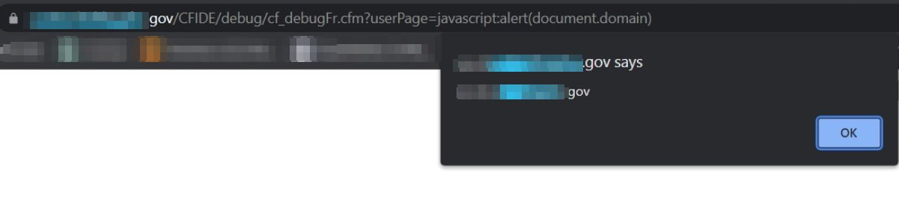

# defcon_news
`2023-07-26`

<blockquote>
Journal Management Software 1.2.4 SQL Injection
https://packetstormsecurity.com/files/173748/jms124-sql.txt
</blockquote>

<table><tr><td><b>→</b><a href="https://packetstormsecurity.com/files/173748/jms124-sql.txt">
https://packetstormsecurity.com/files/173748/jms124-sql.txt
</a>
<blockquote>
Information Security Services, News, Files, Tools, Exploits, Advisories and Whitepapers
</blockquote>
</td></tr></table>

---

# defcon_news
`2023-07-26`

<blockquote>
Joomla VirtueMart 2.6.12.2 SQL Injection
https://packetstormsecurity.com/files/173746/joomlavirtuemart26122-sql.txt
</blockquote>

<table><tr><td><b>→</b><a href="https://packetstormsecurity.com/files/173746/joomlavirtuemart26122-sql.txt">
https://packetstormsecurity.com/files/173746/joomlavirtuemart26122-sql.txt
</a>
<blockquote>
Information Security Services, News, Files, Tools, Exploits, Advisories and Whitepapers
</blockquote>
</td></tr></table>

---

# defcon_news
`2023-07-26`

<blockquote>
Availability Booking Calendar PHP XSS / Arbitrary File Upload
https://packetstormsecurity.com/files/173765/abcphp-uploadxss.txt
</blockquote>

<table><tr><td><b>→</b><a href="https://packetstormsecurity.com/files/173765/abcphp-uploadxss.txt">
https://packetstormsecurity.com/files/173765/abcphp-uploadxss.txt
</a>
<blockquote>
Information Security Services, News, Files, Tools, Exploits, Advisories and Whitepapers
</blockquote>
</td></tr></table>

---

# defcon_news
`2023-07-26`

<blockquote>
Joomla Jomestate 4.0 SQL Injection
https://packetstormsecurity.com/files/173738/joomlajomestate40-sql.txt
</blockquote>

<table><tr><td><b>→</b><a href="https://packetstormsecurity.com/files/173738/joomlajomestate40-sql.txt">
https://packetstormsecurity.com/files/173738/joomlajomestate40-sql.txt
</a>
<blockquote>
Information Security Services, News, Files, Tools, Exploits, Advisories and Whitepapers
</blockquote>
</td></tr></table>

---

# defcon_news
`2023-07-26`

<blockquote>
Joomla Fireboard 1.3 SQL Injection
https://packetstormsecurity.com/files/173737/joomlafireboard13-sql.txt
</blockquote>

<table><tr><td><b>→</b><a href="https://packetstormsecurity.com/files/173737/joomlafireboard13-sql.txt">
https://packetstormsecurity.com/files/173737/joomlafireboard13-sql.txt
</a>
<blockquote>
Information Security Services, News, Files, Tools, Exploits, Advisories and Whitepapers
</blockquote>
</td></tr></table>

---

# cibsecurity
`2023-07-26`

* https://web.nvd.nist.gov/view/vuln/detail?vulnId=CVE-2023-38433

<blockquote>
‼ CVE-2023-38433 ‼

Fujitsu Real-time Video Transmission Gear &quot;IP series&quot; use hard-coded credentials, which may allow a remote unauthenticated attacker to initialize or reboot the products, and as a result, terminate the video transmission. Affected products and versions are as follows: IP-HE950E firmware versions V01L001 to V01L053, IP-HE950D firmware versions V01L001 to V01L053, IP-HE900E firmware versions V01L001 to V01L010, IP-HE900D firmware versions V01L001 to V01L004, IP-900E / IP-920E firmware versions V01L001 to V02L061, IP-900D / IP-900?D / IP-920D firmware versions V01L001 to V02L061, IP-90 firmware versions V01L001 to V01L013, and IP-9610 firmware versions V01L001 to V02L007.

📖 Read

via &quot;National Vulnerability Database&quot;.
</blockquote>

---

# cibsecurity
`2023-07-26`

* https://web.nvd.nist.gov/view/vuln/detail?vulnId=CVE-2023-3946

<blockquote>
‼ CVE-2023-3946 ‼

A reflected cross-site scripting (XSS) vulnerability in ePO prior to 5.10 SP1 Update 1allows a remote unauthenticated attacker to potentially obtain access to an ePO administrator's session by convincing the authenticated ePO administrator to click on a carefully crafted link. This would lead to limited access to sensitive information and limited ability to alter some information in ePO.

📖 Read

via &quot;National Vulnerability Database&quot;.
</blockquote>

---

# cibsecurity
`2023-07-26`

* https://web.nvd.nist.gov/view/vuln/detail?vulnId=CVE-2023-38555

<blockquote>
‼ CVE-2023-38555 ‼

Authentication bypass vulnerability in Fujitsu network devices Si-R series and SR-M series allows a network-adjacent unauthenticated attacker to obtain, change, and/or reset configuration settings of the affected products. Affected products and versions are as follows: Si-R 30B all versions, Si-R 130B all versions, Si-R 90brin all versions, Si-R570B all versions, Si-R370B all versions, Si-R220D all versions, Si-R G100 V02.54 and earlier, Si-R G200 V02.54 and earlier, Si-R G100B V04.12 and earlier, Si-R G110B V04.12 and earlier, Si-R G200B V04.12 and earlier, Si-R G210 V20.52 and earlier, Si-R G211 V20.52 and earlier, Si-R G120 V20.52 and earlier, Si-R G121 V20.52 and earlier, and SR-M 50AP1 all versions.

📖 Read

via &quot;National Vulnerability Database&quot;.
</blockquote>

---

# cibsecurity
`2023-07-25`

* https://web.nvd.nist.gov/view/vuln/detail?vulnId=CVE-2023-37677

<blockquote>
‼ CVE-2023-37677 ‼

Pligg CMS v2.0.2 (also known as Kliqqi) was discovered to contain a remote code execution (RCE) vulnerability in the component admin_editor.php.

📖 Read

via &quot;National Vulnerability Database&quot;.
</blockquote>

---

# cibsecurity
`2023-07-25`

* https://web.nvd.nist.gov/view/vuln/detail?vulnId=CVE-2023-37258

<blockquote>
‼ CVE-2023-37258 ‼

DataEase is an open source data visualization analysis tool. Prior to version 1.18.9, DataEase has a SQL injection vulnerability that can bypass blacklists. The vulnerability has been fixed in v1.18.9. There are no known workarounds.

📖 Read

via &quot;National Vulnerability Database&quot;.
</blockquote>

---

# cibsecurity
`2023-07-25`

* https://web.nvd.nist.gov/view/vuln/detail?vulnId=CVE-2020-35698

<blockquote>
‼ CVE-2020-35698 ‼

Thinkific Thinkific Online Course Creation Platform 1.0 is affected by: Cross Site Scripting (XSS). The impact is: execute arbitrary code (remote). The component is: Affected Source code of the website CMS which is been used by many to host their online courses using the Thinkific Platform. The attack vector is: To exploit the vulnerability any user has to just visit the link - https://hacktify.thinkific.com/account/billing?success&#61;%E2%80%AA%3Cscript%3Ealert(1)%3C/script%3E. ¶¶ Thinkific is a Website based Learning Platform Product which is used by thousands of users worldwide. There is a Cross Site Scripting (XSS) based vulnerability in the code of the CMS where any attacker can execute a XSS attack. Proof of Concept &amp; Steps to Reproduce: Step1 : Go to Google.com Step 2 : Search for this Dork site:thinkific.com -www Step 3 : You will get a list of websites which are running on the thinkific domains. Step 4 : Create account and signin in any of the website Step 5 : Add this endpoint at the end of the domain and you will see that there is a XSS Alert /account/billing?success&#61;%E2%80%AA&lt;script&gt;alert(1)&lt;/script&gt; Step 6 : Choose any domains from google for any website this exploit will work on all the websites as it is a code based flaw in the CMS Step 7 : Thousands of websites are vulnerable due to this vulnerable code in the CMS itself which is giving rise to the XSS attack.

📖 Read

via &quot;National Vulnerability Database&quot;.
</blockquote>

---

# cibsecurity
`2023-07-25`

* https://web.nvd.nist.gov/view/vuln/detail?vulnId=CVE-2023-38435

<blockquote>
‼ CVE-2023-38435 ‼

An improper neutralization of input during web page generation ('Cross-site Scripting') [CWE-79] vulnerability in Apache Felix Healthcheck Webconsole Plugin version 2.0.2 and prior may allow an attacker to perform a reflected cross-site scripting (XSS) attack.Upgrade to Apache Felix Healthcheck Webconsole Plugin 2.1.0 or higher.

📖 Read

via &quot;National Vulnerability Database&quot;.
</blockquote>

---

# cibsecurity
`2023-07-25`

* https://web.nvd.nist.gov/view/vuln/detail?vulnId=CVE-2023-36503

<blockquote>
‼ CVE-2023-36503 ‼

Auth. (contributor+) Cross-Site Scripting (XSS) vulnerability in Max Foundry WordPress Button Plugin MaxButtons plugin &lt;&#61; 9.5.3 versions.

📖 Read

via &quot;National Vulnerability Database&quot;.
</blockquote>

---

# cibsecurity
`2023-07-25`

* https://web.nvd.nist.gov/view/vuln/detail?vulnId=CVE-2023-36385

<blockquote>
‼ CVE-2023-36385 ‼

Unauth. Reflected Cross-Site Scripting (XSS) vulnerability in wpxpo PostX – Gutenberg Post Grid Blocks plugin &lt;&#61; 2.9.9 versions.

📖 Read

via &quot;National Vulnerability Database&quot;.
</blockquote>

---

# cibsecurity
`2023-07-25`

* https://web.nvd.nist.gov/view/vuln/detail?vulnId=CVE-2023-34369

<blockquote>
‼ CVE-2023-34369 ‼

Auth. (admin+) Stored Cross-Site Scripting (XSS) vulnerability in GrandSlambert Login Configurator plugin &lt;&#61; 2.1 versions.

📖 Read

via &quot;National Vulnerability Database&quot;.
</blockquote>

---

# cibsecurity
`2023-07-25`

* https://web.nvd.nist.gov/view/vuln/detail?vulnId=CVE-2023-39175

<blockquote>
‼ CVE-2023-39175 ‼

In JetBrains TeamCity before 2023.05.2 reflected XSS via GitHub integration was possible

📖 Read

via &quot;National Vulnerability Database&quot;.
</blockquote>

---

# cibsecurity
`2023-07-25`

* https://web.nvd.nist.gov/view/vuln/detail?vulnId=CVE-2023-36501

<blockquote>
‼ CVE-2023-36501 ‼

Unauth. Reflected Cross-Site Scripting (XSS) vulnerability in Michael Winkler teachPress plugin &lt;&#61; 9.0.2 versions.

📖 Read

via &quot;National Vulnerability Database&quot;.
</blockquote>

---

# cibsecurity
`2023-07-25`

* https://web.nvd.nist.gov/view/vuln/detail?vulnId=CVE-2023-34017

<blockquote>
‼ CVE-2023-34017 ‼

Unauth. Reflected Cross-Site Scripting (XSS) vulnerability in FiveStarPlugins Five Star Restaurant Reservations plugin &lt;&#61; 2.6.7 versions.

📖 Read

via &quot;National Vulnerability Database&quot;.
</blockquote>

---

# defcon_news
`2023-07-25`

<blockquote>
WordPress WP Brutal AI Cross Site Request Forgery / SQL Injection
https://packetstormsecurity.com/files/173732/wpbrutalai-sqlxsrf.txt
</blockquote>

<table><tr><td><b>→</b><a href="https://packetstormsecurity.com/files/173732/wpbrutalai-sqlxsrf.txt">
https://packetstormsecurity.com/files/173732/wpbrutalai-sqlxsrf.txt
</a>
<blockquote>
Information Security Services, News, Files, Tools, Exploits, Advisories and Whitepapers
</blockquote>
</td></tr></table>

---

# defcon_news
`2023-07-25`

<blockquote>
CMSgrafia 7 SQL Injection
https://packetstormsecurity.com/files/173705/cmsgrafia7-sql.txt
</blockquote>

<table><tr><td><b>→</b><a href="https://packetstormsecurity.com/files/173705/cmsgrafia7-sql.txt">
https://packetstormsecurity.com/files/173705/cmsgrafia7-sql.txt
</a>
<blockquote>
Information Security Services, News, Files, Tools, Exploits, Advisories and Whitepapers
</blockquote>
</td></tr></table>

---

# defcon_news
`2023-07-25`

<blockquote>
BRSS CMS 2.1 SQL Injection
https://packetstormsecurity.com/files/173716/brsscms21-sql.txt
</blockquote>

<table><tr><td><b>→</b><a href="https://packetstormsecurity.com/files/173716/brsscms21-sql.txt">
https://packetstormsecurity.com/files/173716/brsscms21-sql.txt
</a>
<blockquote>
Information Security Services, News, Files, Tools, Exploits, Advisories and Whitepapers
</blockquote>
</td></tr></table>

---

# defcon_news
`2023-07-25`

<blockquote>
WordPress Events Manager 5.61 SQL Injection
https://packetstormsecurity.com/files/173701/wpeventsmanager561-sql.txt
</blockquote>

<table><tr><td><b>→</b><a href="https://packetstormsecurity.com/files/173701/wpeventsmanager561-sql.txt">
https://packetstormsecurity.com/files/173701/wpeventsmanager561-sql.txt
</a>
<blockquote>
Information Security Services, News, Files, Tools, Exploits, Advisories and Whitepapers
</blockquote>
</td></tr></table>

---

# cibsecurity
`2023-07-25`

* https://web.nvd.nist.gov/view/vuln/detail?vulnId=CVE-2023-35043

<blockquote>
‼ CVE-2023-35043 ‼

Unauth. Stored Cross-Site Scripting (XSS) vulnerability in Neha Goel Recent Posts Slider plugin &lt;&#61; 1.1 versions.

📖 Read

via &quot;National Vulnerability Database&quot;.
</blockquote>

---

# cibsecurity
`2023-07-25`

* https://web.nvd.nist.gov/view/vuln/detail?vulnId=CVE-2023-33925

<blockquote>
‼ CVE-2023-33925 ‼

Unauth. Reflected Cross-Site Scripting (XSS) vulnerability in PluginForage WooCommerce Product Categories Selection Widget plugin &lt;&#61; 2.0 versions.

📖 Read

via &quot;National Vulnerability Database&quot;.
</blockquote>

---

# cibsecurity
`2023-07-25`

* https://web.nvd.nist.gov/view/vuln/detail?vulnId=CVE-2023-3486

<blockquote>
‼ CVE-2023-3486 ‼

An authentication bypass exists in PaperCut NG versions 22.0.12 and prior that could allow a remote, unauthenticated attacker to upload arbitrary files to the PaperCut NG host’s file storage. This could exhaust system resources and prevent the service from operating as expected.

📖 Read

via &quot;National Vulnerability Database&quot;.
</blockquote>

---

# cibsecurity
`2023-07-25`

* https://web.nvd.nist.gov/view/vuln/detail?vulnId=CVE-2023-23833

<blockquote>
‼ CVE-2023-23833 ‼

Auth. (contributor+) Cross-Site Scripting (XSS) vulnerability in Steven Henty Drop Shadow Boxes plugin &lt;&#61; 1.7.10 versions.

📖 Read

via &quot;National Vulnerability Database&quot;.
</blockquote>

---

# defcon_news
`2023-07-25`

<blockquote>
Casbaneiro Banking Malware Goes Under the Radar with UAC Bypass Technique
https://thehackernews.com/2023/07/casbaneiro-banking-malware-goes-under.html
</blockquote>

---

# cibsecurity
`2023-07-25`

* https://web.nvd.nist.gov/view/vuln/detail?vulnId=CVE-2023-35088

<blockquote>
‼ CVE-2023-35088 ‼

Improper Neutralization of Special Elements Used in an SQL Command ('SQL Injection') vulnerability in Apache Software Foundation Apache InLong.This issue affects Apache InLong: from 1.4.0 through 1.7.0. In the toAuditCkSql method, the groupId, streamId, auditId, and dt are directly concatenated into the SQL query statement, which may lead to SQL injection attacks.Users are advised to upgrade to Apache InLong's 1.8.0 or cherry-pick [1] to solve it.[1] https://github.com/apache/inlong/pull/8198

📖 Read

via &quot;National Vulnerability Database&quot;.
</blockquote>

---

# cibsecurity
`2023-07-25`

* https://web.nvd.nist.gov/view/vuln/detail?vulnId=CVE-2023-3882

<blockquote>
‼ CVE-2023-3882 ‼

A vulnerability, which was classified as critical, has been found in Campcodes Beauty Salon Management System 1.0. Affected by this issue is some unknown functionality of the file /admin/edit-accepted-appointment.php. The manipulation of the argument contactno leads to sql injection. The attack may be launched remotely. The exploit has been disclosed to the public and may be used. The identifier of this vulnerability is VDB-235244.

📖 Read

via &quot;National Vulnerability Database&quot;.
</blockquote>

---

# cibsecurity
`2023-07-25`

* https://web.nvd.nist.gov/view/vuln/detail?vulnId=CVE-2023-3881

<blockquote>
‼ CVE-2023-3881 ‼

A vulnerability classified as critical was found in Campcodes Beauty Salon Management System 1.0. Affected by this vulnerability is an unknown functionality of the file /admin/forgot-password.php. The manipulation of the argument contactno leads to sql injection. The attack can be launched remotely. The exploit has been disclosed to the public and may be used. The associated identifier of this vulnerability is VDB-235243.

📖 Read

via &quot;National Vulnerability Database&quot;.
</blockquote>

---

# cibsecurity
`2023-07-25`

* https://web.nvd.nist.gov/view/vuln/detail?vulnId=CVE-2023-3046

<blockquote>
‼ CVE-2023-3046 ‼

Improper Neutralization of Special Elements used in an SQL Command ('SQL Injection') vulnerability in Biltay Technology Scienta allows SQL Injection.This issue affects Scienta: before 20230630.1953.

📖 Read

via &quot;National Vulnerability Database&quot;.
</blockquote>

---

# cibsecurity
`2023-07-25`

* https://web.nvd.nist.gov/view/vuln/detail?vulnId=CVE-2023-34434

<blockquote>
‼ CVE-2023-34434 ‼

Deserialization of Untrusted Data Vulnerability in Apache Software Foundation Apache InLong.This issue affects Apache InLong: from 1.4.0 through 1.7.0. The attacker could bypass the current logic and achieve arbitrary file reading. To solve it, users are advised to upgrade to Apache InLong's 1.8.0 or cherry-pick https://github.com/apache/inlong/pull/8130 .

📖 Read

via &quot;National Vulnerability Database&quot;.
</blockquote>

---

# cibsecurity
`2023-07-25`

* https://web.nvd.nist.gov/view/vuln/detail?vulnId=CVE-2023-35066

<blockquote>
‼ CVE-2023-35066 ‼

Improper Neutralization of Special Elements used in an SQL Command ('SQL Injection') vulnerability in Infodrom Software E-Invoice Approval System allows SQL Injection.This issue affects E-Invoice Approval System: before v.20230701.

📖 Read

via &quot;National Vulnerability Database&quot;.
</blockquote>

---

# cibsecurity
`2023-07-25`

* https://web.nvd.nist.gov/view/vuln/detail?vulnId=CVE-2023-3873

<blockquote>
‼ CVE-2023-3873 ‼

A vulnerability, which was classified as critical, has been found in Campcodes Beauty Salon Management System 1.0. This issue affects some unknown processing of the file /admin/index.php. The manipulation of the argument username leads to sql injection. The attack may be initiated remotely. The exploit has been disclosed to the public and may be used. The associated identifier of this vulnerability is VDB-235235.

📖 Read

via &quot;National Vulnerability Database&quot;.
</blockquote>

---

# cibsecurity
`2023-07-25`

* https://web.nvd.nist.gov/view/vuln/detail?vulnId=CVE-2023-3875

<blockquote>
‼ CVE-2023-3875 ‼

A vulnerability has been found in Campcodes Beauty Salon Management System 0.1.0 and classified as critical. Affected by this vulnerability is an unknown functionality of the file /admin/del_feedback.php. The manipulation of the argument id leads to sql injection. The attack can be launched remotely. The exploit has been disclosed to the public and may be used. The identifier VDB-235237 was assigned to this vulnerability.

📖 Read

via &quot;National Vulnerability Database&quot;.
</blockquote>

---

# cibsecurity
`2023-07-25`

* https://web.nvd.nist.gov/view/vuln/detail?vulnId=CVE-2023-3878

<blockquote>
‼ CVE-2023-3878 ‼

A vulnerability was found in Campcodes Beauty Salon Management System 1.0. It has been declared as critical. This vulnerability affects unknown code of the file /admin/about-us.php. The manipulation of the argument pagedes leads to sql injection. The attack can be initiated remotely. The exploit has been disclosed to the public and may be used. The identifier of this vulnerability is VDB-235240.

📖 Read

via &quot;National Vulnerability Database&quot;.
</blockquote>

---

# cibsecurity
`2023-07-25`

* https://web.nvd.nist.gov/view/vuln/detail?vulnId=CVE-2023-3874

<blockquote>
‼ CVE-2023-3874 ‼

A vulnerability, which was classified as critical, was found in Campcodes Beauty Salon Management System 1.0. Affected is an unknown function of the file /admin/admin-profile.php. The manipulation of the argument adminname leads to sql injection. It is possible to launch the attack remotely. The exploit has been disclosed to the public and may be used. The identifier of this vulnerability is VDB-235236.

📖 Read

via &quot;National Vulnerability Database&quot;.
</blockquote>

---

# cibsecurity
`2023-07-25`

* https://web.nvd.nist.gov/view/vuln/detail?vulnId=CVE-2023-3876

<blockquote>
‼ CVE-2023-3876 ‼

A vulnerability was found in Campcodes Beauty Salon Management System 1.0 and classified as critical. Affected by this issue is some unknown functionality of the file /admin/search-appointment.php. The manipulation of the argument searchdata leads to sql injection. The attack may be launched remotely. The exploit has been disclosed to the public and may be used. VDB-235238 is the identifier assigned to this vulnerability.

📖 Read

via &quot;National Vulnerability Database&quot;.
</blockquote>

---

# cibsecurity
`2023-07-25`

* https://web.nvd.nist.gov/view/vuln/detail?vulnId=CVE-2023-32639

<blockquote>
‼ CVE-2023-32639 ‼

Applicant Programme Ver.7.06 and earlier improperly restricts XML external entity references (XXE). By processing a specially crafted XML file, arbitrary files on the system may be read by an attacker.

📖 Read

via &quot;National Vulnerability Database&quot;.
</blockquote>

---

# cibsecurity
`2023-07-25`

* https://web.nvd.nist.gov/view/vuln/detail?vulnId=CVE-2023-3877

<blockquote>
‼ CVE-2023-3877 ‼

A vulnerability was found in Campcodes Beauty Salon Management System 1.0. It has been classified as critical. This affects an unknown part of the file /admin/add-services.php. The manipulation of the argument cost leads to sql injection. It is possible to initiate the attack remotely. The exploit has been disclosed to the public and may be used. The associated identifier of this vulnerability is VDB-235239.

📖 Read

via &quot;National Vulnerability Database&quot;.
</blockquote>

---

# cibsecurity
`2023-07-25`

* https://web.nvd.nist.gov/view/vuln/detail?vulnId=CVE-2023-37361

<blockquote>
‼ CVE-2023-37361 ‼

REDCap 12.0.26 LTS and 12.3.2 Standard allows SQL Injection via scheduling, repeatforms, purpose, app_title, or randomization.

📖 Read

via &quot;National Vulnerability Database&quot;.
</blockquote>

---

# cibsecurity
`2023-07-25`

* https://web.nvd.nist.gov/view/vuln/detail?vulnId=CVE-2023-3880

<blockquote>
‼ CVE-2023-3880 ‼

A vulnerability classified as critical has been found in Campcodes Beauty Salon Management System 1.0. Affected is an unknown function of the file /admin/del_service.php. The manipulation of the argument editid leads to sql injection. It is possible to launch the attack remotely. The exploit has been disclosed to the public and may be used. VDB-235242 is the identifier assigned to this vulnerability.

📖 Read

via &quot;National Vulnerability Database&quot;.
</blockquote>

---

# cibsecurity
`2023-07-25`

* https://web.nvd.nist.gov/view/vuln/detail?vulnId=CVE-2023-33777

<blockquote>
‼ CVE-2023-33777 ‼

An issue in /functions/fbaorder.php of Prestashop amazon before v5.2.24 allows attackers to execute a directory traversal attack.

📖 Read

via &quot;National Vulnerability Database&quot;.
</blockquote>

---

# cibsecurity
`2023-07-25`

* https://web.nvd.nist.gov/view/vuln/detail?vulnId=CVE-2023-3879

<blockquote>
‼ CVE-2023-3879 ‼

A vulnerability was found in Campcodes Beauty Salon Management System 1.0. It has been rated as critical. This issue affects some unknown processing of the file /admin/del_category.php. The manipulation of the argument id leads to sql injection. The attack may be initiated remotely. The exploit has been disclosed to the public and may be used. The identifier VDB-235241 was assigned to this vulnerability.

📖 Read

via &quot;National Vulnerability Database&quot;.
</blockquote>

---

# defcon_news
`2023-07-25`

<blockquote>
Ivanti Releases Urgent Patch for EPMM Zero-Day Vulnerability Under Active Exploitation
https://thehackernews.com/2023/07/ivanti-releases-urgent-patch-for-epmm.html
</blockquote>

---

# cibsecurity
`2023-07-25`

* https://web.nvd.nist.gov/view/vuln/detail?vulnId=CVE-2023-26045

<blockquote>
‼ CVE-2023-26045 ‼

NodeBB is Node.js based forum software. Starting in version 2.5.0 and prior to version 2.8.7, due to the use of the object destructuring assignment syntax in the user export code path, combined with a path traversal vulnerability, a specially crafted payload could invoke the user export logic to arbitrarily execute javascript files on the local disk. This issue is patched in version 2.8.7. As a workaround, site maintainers can cherry pick the fix into their codebase to patch the exploit.

📖 Read

via &quot;National Vulnerability Database&quot;.
</blockquote>

---

# cibsecurity
`2023-07-25`

* https://web.nvd.nist.gov/view/vuln/detail?vulnId=CVE-2023-3871

<blockquote>
‼ CVE-2023-3871 ‼

A vulnerability classified as critical has been found in Campcodes Beauty Salon Management System 1.0. This affects an unknown part of the file /admin/edit_category.php. The manipulation of the argument id leads to sql injection. It is possible to initiate the attack remotely. The exploit has been disclosed to the public and may be used. The identifier VDB-235233 was assigned to this vulnerability.

📖 Read

via &quot;National Vulnerability Database&quot;.
</blockquote>

---

# cibsecurity
`2023-07-24`

* https://web.nvd.nist.gov/view/vuln/detail?vulnId=CVE-2021-39421

<blockquote>
‼ CVE-2021-39421 ‼

A cross-site scripting (XSS) vulnerability in SeedDMS v6.0.15 allows attackers to execute arbitrary web scripts or HTML via a crafted payload.

📖 Read

via &quot;National Vulnerability Database&quot;.
</blockquote>

---

# cibsecurity
`2023-07-24`

* https://web.nvd.nist.gov/view/vuln/detail?vulnId=CVE-2023-37613

<blockquote>
‼ CVE-2023-37613 ‼

A cross-site scripting (XSS) vulnerability in Assembly Software Trialworks v11.4 allows attackers to execute arbitrary web scripts or HTML via injecting a crafted payload into the asset src parameter.

📖 Read

via &quot;National Vulnerability Database&quot;.
</blockquote>

---

# cibsecurity
`2023-07-24`

* https://web.nvd.nist.gov/view/vuln/detail?vulnId=CVE-2023-34478

<blockquote>
‼ CVE-2023-34478 ‼

Apache Shiro, before 1.12.0 or 2.0.0-alpha-3, may be susceptible to a path traversal attack that results in an authentication bypass when used together with APIs or other web frameworks that route requests based on non-normalized requests.Mitigation: Update to Apache Shiro 1.12.0+ or 2.0.0-alpha-3+

📖 Read

via &quot;National Vulnerability Database&quot;.
</blockquote>

---

# cibsecurity
`2023-07-24`

* https://web.nvd.nist.gov/view/vuln/detail?vulnId=CVE-2023-3384

<blockquote>
‼ CVE-2023-3384 ‼

A flaw was found in the Quay registry. While the image labels created through Quay undergo validation both in the UI and backend by applying a regex (validation.py), the same validation isnot performed when the label comes from an image. This flaw allows an attacker to publish a malicious image to a public registry containing a script that can be executed via Cross-site scripting (XSS).

📖 Read

via &quot;National Vulnerability Database&quot;.
</blockquote>

---

# defcon_news
`2023-07-24`

<blockquote>
Unauthenticated RCE chain on Apache OpenMeetings
https://www.reddit.com/r/netsec/comments/15895t4/unauthenticated_rce_chain_on_apache_openmeetings/
</blockquote>

<table><tr><td><b>→</b><a href="https://www.reddit.com/r/netsec/comments/15895t4/unauthenticated_rce_chain_on_apache_openmeetings/">
https://www.reddit.com/r/netsec/comments/15895t4/unauthenticated_rce_chain_on_apache_openmeetings/
</a>
<blockquote>
Explore this post and more from the netsec community
</blockquote>
</td></tr></table>

---

# cibsecurity
`2023-07-25`

* https://web.nvd.nist.gov/view/vuln/detail?vulnId=CVE-2023-2761

<blockquote>
‼ CVE-2023-2761 ‼

The User Activity Log WordPress plugin before 1.6.3 does not properly sanitise and escape the `txtsearch` parameter before using it in a SQL statement in some admin pages, leading to a SQL injection exploitable by high privilege users such as admin.

📖 Read

via &quot;National Vulnerability Database&quot;.
</blockquote>

---

# cibsecurity
`2023-07-24`

* https://web.nvd.nist.gov/view/vuln/detail?vulnId=CVE-2023-3859

<blockquote>
‼ CVE-2023-3859 ‼

A vulnerability was found in phpscriptpoint Car Listing 1.6 and classified as critical. This issue affects some unknown processing of the file /search.php of the component GET Parameter Handler. The manipulation of the argument brand_id/model_id/car_condition/car_category_id/body_type_id/fuel_type_id/transmission_type_id/year/mileage_start/mileage_end/country/state/city leads to sql injection. The attack may be initiated remotely. The associated identifier of this vulnerability is VDB-235211. NOTE: The vendor was contacted early about this disclosure but did not respond in any way.

📖 Read

via &quot;National Vulnerability Database&quot;.
</blockquote>

---

# cibsecurity
`2023-07-24`

* https://web.nvd.nist.gov/view/vuln/detail?vulnId=CVE-2023-3854

<blockquote>
‼ CVE-2023-3854 ‼

A vulnerability classified as critical has been found in phpscriptpoint BloodBank 1.1. Affected is an unknown function of the file /search of the component POST Parameter Handler. The manipulation of the argument country/city/blood_group_id leads to sql injection. It is possible to launch the attack remotely. VDB-235206 is the identifier assigned to this vulnerability. NOTE: The vendor was contacted early about this disclosure but did not respond in any way.

📖 Read

via &quot;National Vulnerability Database&quot;.
</blockquote>

---

# cibsecurity
`2023-07-23`

* https://web.nvd.nist.gov/view/vuln/detail?vulnId=CVE-2023-3850

<blockquote>
‼ CVE-2023-3850 ‼

A vulnerability has been found in SourceCodester Lost and Found Information System 1.0 and classified as critical. Affected by this vulnerability is an unknown functionality of the file /classes/Master.php?f&#61;delete_category of the component HTTP POST Request Handler. The manipulation of the argument id leads to sql injection. The attack can be launched remotely. The identifier VDB-235201 was assigned to this vulnerability.

📖 Read

via &quot;National Vulnerability Database&quot;.
</blockquote>

---

# cibsecurity
`2023-07-23`

* https://web.nvd.nist.gov/view/vuln/detail?vulnId=CVE-2023-3839

<blockquote>
‼ CVE-2023-3839 ‼

A vulnerability, which was classified as problematic, has been found in DedeBIZ 6.2.10. Affected by this issue is some unknown functionality of the file /admin/sys_sql_query.php. The manipulation of the argument sqlquery leads to sql injection. The attack may be launched remotely. The complexity of an attack is rather high. The exploitation is known to be difficult. The exploit has been disclosed to the public and may be used. VDB-235190 is the identifier assigned to this vulnerability. NOTE: The vendor was contacted early about this disclosure but did not respond in any way.

📖 Read

via &quot;National Vulnerability Database&quot;.
</blockquote>

---

# cibsecurity
`2023-07-22`

* https://web.nvd.nist.gov/view/vuln/detail?vulnId=CVE-2023-3826

<blockquote>
‼ CVE-2023-3826 ‼

A vulnerability has been found in IBOS OA 4.5.5 and classified as critical. Affected by this vulnerability is an unknown functionality of the file /?r&#61;recruit/resume/edit&amp;op&#61;status of the component Interview Handler. The manipulation of the argument resumeid leads to sql injection. The attack can be launched remotely. The exploit has been disclosed to the public and may be used. The associated identifier of this vulnerability is VDB-235147. NOTE: The vendor was contacted early about this disclosure but did not respond in any way.

📖 Read

via &quot;National Vulnerability Database&quot;.
</blockquote>

---

# cibsecurity
`2023-07-21`

* https://web.nvd.nist.gov/view/vuln/detail?vulnId=CVE-2023-38173

<blockquote>
‼ CVE-2023-38173 ‼

Microsoft Edge for Android Spoofing Vulnerability

📖 Read

via &quot;National Vulnerability Database&quot;.
</blockquote>

---

# cibsecurity
`2023-07-21`

* https://web.nvd.nist.gov/view/vuln/detail?vulnId=CVE-2023-25841

<blockquote>
‼ CVE-2023-25841 ‼

There is a stored Cross-site Scripting vulnerability in Esri ArcGIS Server versions 10.8.1 – 11.0 on Windows and Linux platforms that may allow a remote, unauthenticated attacker to create crafted content which when clicked could potentially execute arbitrary JavaScript code in the victim’s browser.Mitigation: Disable anonymous access to ArcGIS Feature services with edit capabilities.

📖 Read

via &quot;National Vulnerability Database&quot;.
</blockquote>

---

# cibsecurity
`2023-07-21`

* https://web.nvd.nist.gov/view/vuln/detail?vulnId=CVE-2023-35392

<blockquote>
‼ CVE-2023-35392 ‼

Microsoft Edge (Chromium-based) Spoofing Vulnerability

📖 Read

via &quot;National Vulnerability Database&quot;.
</blockquote>

---

# cibsecurity
`2023-07-21`

* https://web.nvd.nist.gov/view/vuln/detail?vulnId=CVE-2023-37742

<blockquote>
‼ CVE-2023-37742 ‼

WebBoss.io CMS before v3.6.8.1 was discovered to contain a reflected cross-site scripting (XSS) vulnerability.

📖 Read

via &quot;National Vulnerability Database&quot;.
</blockquote>

---

# cibsecurity
`2023-07-21`

* https://web.nvd.nist.gov/view/vuln/detail?vulnId=CVE-2023-3822

<blockquote>
‼ CVE-2023-3822 ‼

Cross-site Scripting (XSS) - Reflected in GitHub repository pimcore/pimcore prior to 10.6.4.

📖 Read

via &quot;National Vulnerability Database&quot;.
</blockquote>

---

# cibsecurity
`2023-07-21`

* https://web.nvd.nist.gov/view/vuln/detail?vulnId=CVE-2023-3820

<blockquote>
‼ CVE-2023-3820 ‼

SQL Injection in GitHub repository pimcore/pimcore prior to 10.6.4.

📖 Read

via &quot;National Vulnerability Database&quot;.
</blockquote>

---

# cibsecurity
`2023-07-21`

* https://web.nvd.nist.gov/view/vuln/detail?vulnId=CVE-2023-3821

<blockquote>
‼ CVE-2023-3821 ‼

Cross-site Scripting (XSS) - Stored in GitHub repository pimcore/pimcore prior to 10.6.4.

📖 Read

via &quot;National Vulnerability Database&quot;.
</blockquote>

---

# defcon_news
`2023-07-21`

<blockquote>
CMS TSS-EST 1.0.0 SQL Injection
https://packetstormsecurity.com/files/173672/cmstssest100-sql.txt
</blockquote>

<table><tr><td><b>→</b><a href="https://packetstormsecurity.com/files/173672/cmstssest100-sql.txt">
https://packetstormsecurity.com/files/173672/cmstssest100-sql.txt
</a>
<blockquote>
Information Security Services, News, Files, Tools, Exploits, Advisories and Whitepapers
</blockquote>
</td></tr></table>

---

# defcon_news
`2023-07-21`

<blockquote>
Wifi Soft Unibox Administration 3.0 / 3.1 SQL Injection
https://packetstormsecurity.com/files/173669/wsua31-sql.txt
</blockquote>

<table><tr><td><b>→</b><a href="https://packetstormsecurity.com/files/173669/wsua31-sql.txt">
https://packetstormsecurity.com/files/173669/wsua31-sql.txt
</a>
<blockquote>
Information Security Services, News, Files, Tools, Exploits, Advisories and Whitepapers
</blockquote>
</td></tr></table>

---

# defcon_news
`2023-07-21`

<blockquote>
CMS SAUDI SOFTECH 5.0.2 SQL Injection
https://packetstormsecurity.com/files/173667/cmssaudisoftech502-sql.txt
</blockquote>

<table><tr><td><b>→</b><a href="https://packetstormsecurity.com/files/173667/cmssaudisoftech502-sql.txt">
https://packetstormsecurity.com/files/173667/cmssaudisoftech502-sql.txt
</a>
<blockquote>
Information Security Services, News, Files, Tools, Exploits, Advisories and Whitepapers
</blockquote>
</td></tr></table>

---

# cibsecurity
`2023-07-21`

* https://web.nvd.nist.gov/view/vuln/detail?vulnId=CVE-2023-3811

<blockquote>
‼ CVE-2023-3811 ‼

A vulnerability was found in Hospital Management System 1.0. It has been rated as critical. This issue affects some unknown processing of the file patientprofile.php. The manipulation of the argument address leads to sql injection. The attack may be initiated remotely. The exploit has been disclosed to the public and may be used. The associated identifier of this vulnerability is VDB-235079.

📖 Read

via &quot;National Vulnerability Database&quot;.
</blockquote>

---

# cibsecurity
`2023-07-21`

* https://web.nvd.nist.gov/view/vuln/detail?vulnId=CVE-2023-32625

<blockquote>
‼ CVE-2023-32625 ‼

Cross-site request forgery (CSRF) vulnerability in TS Webfonts for SAKURA 3.1.2 and earlier allows a remote unauthenticated attacker to hijack the authentication of a user and to change settings by having a user view a malicious page.

📖 Read

via &quot;National Vulnerability Database&quot;.
</blockquote>

---

# cibsecurity
`2023-07-21`

* https://web.nvd.nist.gov/view/vuln/detail?vulnId=CVE-2023-32624

<blockquote>
‼ CVE-2023-32624 ‼

Cross-site scripting vulnerability in TS Webfonts for SAKURA 3.1.0 and earlier allows a remote unauthenticated attacker to inject an arbitrary script.

📖 Read

via &quot;National Vulnerability Database&quot;.
</blockquote>

---

# cibsecurity
`2023-07-21`

* https://web.nvd.nist.gov/view/vuln/detail?vulnId=CVE-2023-3801

<blockquote>
‼ CVE-2023-3801 ‼

A vulnerability was found in IBOS OA 4.5.5. It has been declared as critical. Affected by this vulnerability is the function actionEdit of the file ?r&#61;officialdoc/officialdoc/edit of the component Mobile Notification Handler. The manipulation leads to sql injection. The exploit has been disclosed to the public and may be used. The identifier VDB-235069 was assigned to this vulnerability. NOTE: The vendor was contacted early about this disclosure but did not respond in any way.

📖 Read

via &quot;National Vulnerability Database&quot;.
</blockquote>

---

# cibsecurity
`2023-07-21`

* https://web.nvd.nist.gov/view/vuln/detail?vulnId=CVE-2023-3808

<blockquote>
‼ CVE-2023-3808 ‼

A vulnerability was found in Hospital Management System 1.0 and classified as critical. Affected by this issue is some unknown functionality of the file patientforgotpassword.php. The manipulation leads to sql injection. The attack may be launched remotely. The exploit has been disclosed to the public and may be used. The identifier of this vulnerability is VDB-235076.

📖 Read

via &quot;National Vulnerability Database&quot;.
</blockquote>

---

# cibsecurity
`2023-07-21`

* https://web.nvd.nist.gov/view/vuln/detail?vulnId=CVE-2023-3810

<blockquote>
‼ CVE-2023-3810 ‼

A vulnerability was found in Hospital Management System 1.0. It has been declared as critical. This vulnerability affects unknown code of the file patientappointment.php. The manipulation of the argument loginid/password/mobileno/appointmentdate/appointmenttime/patiente/dob/doct/city leads to sql injection. The attack can be initiated remotely. The exploit has been disclosed to the public and may be used. VDB-235078 is the identifier assigned to this vulnerability.

📖 Read

via &quot;National Vulnerability Database&quot;.
</blockquote>

---

# cibsecurity
`2023-07-21`

* https://web.nvd.nist.gov/view/vuln/detail?vulnId=CVE-2023-3809

<blockquote>
‼ CVE-2023-3809 ‼

A vulnerability was found in Hospital Management System 1.0. It has been classified as critical. This affects an unknown part of the file patient.php. The manipulation of the argument address leads to sql injection. It is possible to initiate the attack remotely. The exploit has been disclosed to the public and may be used. The identifier VDB-235077 was assigned to this vulnerability.

📖 Read

via &quot;National Vulnerability Database&quot;.
</blockquote>

---

# cibsecurity
`2023-07-21`

* https://web.nvd.nist.gov/view/vuln/detail?vulnId=CVE-2023-3807

<blockquote>
‼ CVE-2023-3807 ‼

A vulnerability has been found in Campcodes Beauty Salon Management System 1.0 and classified as critical. Affected by this vulnerability is an unknown functionality of the file edit_product.php. The manipulation of the argument id leads to sql injection. The attack can be launched remotely. The exploit has been disclosed to the public and may be used. The associated identifier of this vulnerability is VDB-235075.

📖 Read

via &quot;National Vulnerability Database&quot;.
</blockquote>

---

# cibsecurity
`2023-07-21`

* https://web.nvd.nist.gov/view/vuln/detail?vulnId=CVE-2023-3795

<blockquote>
‼ CVE-2023-3795 ‼

A vulnerability classified as critical was found in Bug Finder ChainCity Real Estate Investment Platform 1.0. Affected by this vulnerability is an unknown functionality of the file /property of the component GET Parameter Handler. The manipulation of the argument name leads to sql injection. The associated identifier of this vulnerability is VDB-235063. NOTE: The vendor was contacted early about this disclosure but did not respond in any way.

📖 Read

via &quot;National Vulnerability Database&quot;.
</blockquote>

---

# cibsecurity
`2023-07-20`

* https://web.nvd.nist.gov/view/vuln/detail?vulnId=CVE-2023-30200

<blockquote>
‼ CVE-2023-30200 ‼

In the module “Image: WebP, Compress, Zoom, Lazy load, Alt &amp; More� (ultimateimagetool) in versions up to 2.1.02 from Advanced Plugins for PrestaShop, a guest can download personal informations without restriction by performing a path traversal attack.

📖 Read

via &quot;National Vulnerability Database&quot;.
</blockquote>

---

# cibsecurity
`2023-07-20`

* https://web.nvd.nist.gov/view/vuln/detail?vulnId=CVE-2023-3793

<blockquote>
‼ CVE-2023-3793 ‼

A vulnerability was found in Weaver e-cology. It has been rated as critical. This issue affects some unknown processing of the file filelFileDownloadForOutDoc.class of the component HTTP POST Request Handler. The manipulation of the argument fileid with the input 1+WAITFOR+DELAY leads to sql injection. Upgrading to version 10.58.0 is able to address this issue. It is recommended to upgrade the affected component. The identifier VDB-235061 was assigned to this vulnerability.

📖 Read

via &quot;National Vulnerability Database&quot;.
</blockquote>

---

# cibsecurity
`2023-07-20`

* https://web.nvd.nist.gov/view/vuln/detail?vulnId=CVE-2023-31753

<blockquote>
‼ CVE-2023-31753 ‼

SQL injection vulnerability in diskusi.php in eNdonesia 8.7, allows an attacker to execute arbitrary SQL commands via the &quot;rid&#61;&quot; parameter.

📖 Read

via &quot;National Vulnerability Database&quot;.
</blockquote>

---

# cibsecurity
`2023-07-20`

* https://web.nvd.nist.gov/view/vuln/detail?vulnId=CVE-2023-38203

<blockquote>
‼ CVE-2023-38203 (coldfusion) ‼

Adobe ColdFusion versions 2018u17 (and earlier), 2021u7 (and earlier) and 2023u1 (and earlier) are affected by a Deserialization of Untrusted Data vulnerability that could result in Arbitrary code execution. Exploitation of this issue does not require user interaction.

📖 Read

via &quot;National Vulnerability Database&quot;.
</blockquote>

---

# defcon_news
`2023-07-20`

<blockquote>
Hikvision Hybrid SAN Ds-a71024 SQL Injection
https://packetstormsecurity.com/files/173653/hvhsdsa71024-sql.txt
</blockquote>

<table><tr><td><b>→</b><a href="https://packetstormsecurity.com/files/173653/hvhsdsa71024-sql.txt">
https://packetstormsecurity.com/files/173653/hvhsdsa71024-sql.txt
</a>
<blockquote>
Information Security Services, News, Files, Tools, Exploits, Advisories and Whitepapers
</blockquote>
</td></tr></table>

---

# defcon_news
`2023-07-20`

<blockquote>
CMS porViaX 2.0 SQL Injection
https://packetstormsecurity.com/files/173647/cmsporviax20-sql.txt
</blockquote>

<table><tr><td><b>→</b><a href="https://packetstormsecurity.com/files/173647/cmsporviax20-sql.txt">
https://packetstormsecurity.com/files/173647/cmsporviax20-sql.txt
</a>
<blockquote>
Information Security Services, News, Files, Tools, Exploits, Advisories and Whitepapers
</blockquote>
</td></tr></table>

---

# defcon_news
`2023-07-20`

<blockquote>
CMS D-Creations 1.0 SQL Injection
https://packetstormsecurity.com/files/173630/cmsdcreations10-sql.txt
</blockquote>

<table><tr><td><b>→</b><a href="https://packetstormsecurity.com/files/173630/cmsdcreations10-sql.txt">
https://packetstormsecurity.com/files/173630/cmsdcreations10-sql.txt
</a>
<blockquote>
Information Security Services, News, Files, Tools, Exploits, Advisories and Whitepapers
</blockquote>
</td></tr></table>

---

# cibsecurity
`2023-07-20`

* https://web.nvd.nist.gov/view/vuln/detail?vulnId=CVE-2023-37290

<blockquote>
‼ CVE-2023-37290 ‼

InfoDoc Document On-line Submission and Approval System lacks sufficient restrictions on the available tags within its HTML to PDF conversion function, and allowing an unauthenticated attackers to load remote or local resources through HTML tags such as iframe. This vulnerability allows unauthenticated remote attackers to perform Server-Side Request Forgery (SSRF) attacks, gaining unauthorized access to arbitrary system files and uncovering the internal network topology.

📖 Read

via &quot;National Vulnerability Database&quot;.
</blockquote>

---

# cibsecurity
`2023-07-20`

* https://www.itpro.com/security/cyber-attacks/openssh-vulnerability-uncovered-by-researchers-rce-exploit-developed

<blockquote>
📢 OpenSSH vulnerability uncovered by researchers, RCE exploit developed 📢

 Attackers can remotely manipulate common libraries to execute arbitrary code 

📖 Read

via &quot;ITPro&quot;.
</blockquote>

<table><tr><td><b>→</b><a href="https://www.itpro.com/security/cyber-attacks/openssh-vulnerability-uncovered-by-researchers-rce-exploit-developed">
https://www.itpro.com/security/cyber-attacks/openssh-vulnerability-uncovered-by-researchers-rce-exploit-developed
</a>
<blockquote>
Attackers can remotely manipulate common libraries to execute arbitrary code
</blockquote>
</td></tr></table>

---

# defcon_news
`2023-07-20`

<blockquote>
One LFI bypass to rule them all (using base64)
https://www.reddit.com/r/netsec/comments/154jgu7/one_lfi_bypass_to_rule_them_all_using_base64/
</blockquote>

<table><tr><td><b>→</b><a href="https://www.reddit.com/r/netsec/comments/154jgu7/one_lfi_bypass_to_rule_them_all_using_base64/">
https://www.reddit.com/r/netsec/comments/154jgu7/one_lfi_bypass_to_rule_them_all_using_base64/
</a>
<blockquote>
Explore this post and more from the netsec community
</blockquote>
</td></tr></table>

---

# defcon_news
`2023-07-20`

<blockquote>
Exploiting XSS in hidden inputs and meta tags
https://www.reddit.com/r/netsec/comments/154524a/exploiting_xss_in_hidden_inputs_and_meta_tags/
</blockquote>

<table><tr><td><b>→</b><a href="https://www.reddit.com/r/netsec/comments/154524a/exploiting_xss_in_hidden_inputs_and_meta_tags/">
https://www.reddit.com/r/netsec/comments/154524a/exploiting_xss_in_hidden_inputs_and_meta_tags/
</a>
<blockquote>
Explore this post and more from the netsec community
</blockquote>
</td></tr></table>

---

# cibsecurity
`2023-07-19`

* https://web.nvd.nist.gov/view/vuln/detail?vulnId=CVE-2023-3466

<blockquote>
‼ CVE-2023-3466 ‼

Reflected Cross-Site Scripting (XSS)

📖 Read

via &quot;National Vulnerability Database&quot;.
</blockquote>

---

# cibsecurity
`2023-07-19`

* https://web.nvd.nist.gov/view/vuln/detail?vulnId=CVE-2023-3519

<blockquote>
‼ CVE-2023-3519 ‼

Unauthenticated remote code execution

📖 Read

via &quot;National Vulnerability Database&quot;.
</blockquote>

---

# cibsecurity
`2023-07-19`

* https://web.nvd.nist.gov/view/vuln/detail?vulnId=CVE-2023-27379

<blockquote>
‼ CVE-2023-27379 ‼

A use-after-free vulnerability exists in the JavaScript engine of Foxit Software’s PDF Reader, version 12.1.2.15332. By prematurely deleting objects associated with pages, a specially crafted PDF document can trigger the reuse of previously freed memory, which can lead to arbitrary code execution. An attacker needs to trick the user into opening the malicious file to trigger this vulnerability. Exploitation is also possible if a user visits a specially crafted, malicious site if the browser plugin extension is enabled.

📖 Read

via &quot;National Vulnerability Database&quot;.
</blockquote>

---

# cibsecurity
`2023-07-19`

* https://web.nvd.nist.gov/view/vuln/detail?vulnId=CVE-2023-28744

<blockquote>
‼ CVE-2023-28744 ‼

A use-after-free vulnerability exists in the JavaScript engine of Foxit Software's PDF Reader, version 12.1.1.15289. A specially crafted PDF document can trigger the reuse of previously freed memory by manipulating form fields of a specific type. This can lead to memory corruption and arbitrary code execution. An attacker needs to trick the user into opening the malicious file to trigger this vulnerability. Exploitation is also possible if a user visits a specially crafted, malicious site if the browser plugin extension is enabled.

📖 Read

via &quot;National Vulnerability Database&quot;.
</blockquote>

---

# cibsecurity
`2023-07-19`

* https://web.nvd.nist.gov/view/vuln/detail?vulnId=CVE-2023-33866

<blockquote>
‼ CVE-2023-33866 ‼

A use-after-free vulnerability exists in the JavaScript engine of Foxit Software’s PDF Reader, version 12.1.2.15332. By prematurely deleting objects associated with pages, a specially crafted PDF document can trigger the reuse of previously freed memory, which can lead to arbitrary code execution. An attacker needs to trick the user into opening the malicious file to trigger this vulnerability. Exploitation is also possible if a user visits a specially crafted, malicious site if the browser plugin extension is enabled.

📖 Read

via &quot;National Vulnerability Database&quot;.
</blockquote>

---

# cibsecurity
`2023-07-19`

* https://web.nvd.nist.gov/view/vuln/detail?vulnId=CVE-2023-33876

<blockquote>
‼ CVE-2023-33876 ‼

A use-after-free vulnerability exists in the way Foxit Reader 12.1.2.15332 handles destroying annotations. A specially-crafted Javascript code inside a malicious PDF document can trigger reuse of a previously freed object which can lead to memory corruption and result in arbitrary code execution. A specially-crafted Javascript code inside a malicious PDF document can cause memory corruption and lead to remote code execution. Exploitation is also possible if a user visits a specially-crafted, malicious site if the browser plugin extension is enabled.

📖 Read

via &quot;National Vulnerability Database&quot;.
</blockquote>

---

# defcon_news
`2023-07-19`

<blockquote>
BookingWizz 5.5.0 SQL Injection
https://packetstormsecurity.com/files/173580/bookingwizz550-sql.txt
</blockquote>

<table><tr><td><b>→</b><a href="https://packetstormsecurity.com/files/173580/bookingwizz550-sql.txt">
https://packetstormsecurity.com/files/173580/bookingwizz550-sql.txt
</a>
<blockquote>
Information Security Services, News, Files, Tools, Exploits, Advisories and Whitepapers
</blockquote>
</td></tr></table>

---

# proxy_bar
`2023-07-19`

<blockquote>
ColdFusion  XSS
POC:
{{host}}/CFIDE/debug/cf_debugFr.cfm?userPage&#61;javascript:alert(document.domain)
</blockquote>

---

# cibsecurity
`2023-07-19`

* https://web.nvd.nist.gov/view/vuln/detail?vulnId=CVE-2023-28754

<blockquote>
‼ CVE-2023-28754 ‼

Deserialization of Untrusted Data vulnerability in Apache ShardingSphere-Agent, which allows attackers to execute arbitrary code by constructing a special YAML configuration file.The attacker needs to have permission to modify the ShardingSphere Agent YAML configuration file on the target machine, and the target machine can access the URL with the arbitrary code JAR.An attacker can use SnakeYAML to deserialize java.net.URLClassLoader and make it load a JAR from a specified URL, and then deserialize javax.script.ScriptEngineManager to load code using that ClassLoader. When the ShardingSphere JVM process starts and uses the ShardingSphere-Agent, the arbitrary code specified by the attacker will be executed during the deserialization of the YAML configuration file by the Agent.This issue affects ShardingSphere-Agent: through 5.3.2. This vulnerability is fixed in Apache ShardingSphere 5.4.0.

📖 Read

via &quot;National Vulnerability Database&quot;.
</blockquote>

---

# cibsecurity
`2023-07-19`

* https://web.nvd.nist.gov/view/vuln/detail?vulnId=CVE-2023-32635

<blockquote>
‼ CVE-2023-32635 ‼

XBRL data create application version 7.0 and earlier improperly restricts XML external entity references (XXE). By processing a specially crafted XBRL file, arbitrary files on the system may be read by an attacker.

📖 Read

via &quot;National Vulnerability Database&quot;.
</blockquote>

---

# cibsecurity
`2023-07-19`

* https://web.nvd.nist.gov/view/vuln/detail?vulnId=CVE-2023-29260

<blockquote>
‼ CVE-2023-29260 ‼

IBM Sterling Connect:Express for UNIX 1.5 is vulnerable to server-side request forgery (SSRF). This may allow an authenticated attacker to send unauthorized requests from the system, potentially leading to network enumeration or facilitating other attacks. IBM X-Force ID: 252135.

📖 Read

via &quot;National Vulnerability Database&quot;.
</blockquote>

---

# cibsecurity
`2023-07-19`

* https://web.nvd.nist.gov/view/vuln/detail?vulnId=CVE-2023-3751

<blockquote>
‼ CVE-2023-3751 ‼

A vulnerability was found in Super Store Finder 3.6. It has been declared as critical. Affected by this vulnerability is an unknown functionality of the file /index.php of the component POST Parameter Handler. The manipulation of the argument products leads to sql injection. The attack can be launched remotely. The identifier VDB-234421 was assigned to this vulnerability. NOTE: The vendor was contacted early about this disclosure but did not respond in any way.

📖 Read

via &quot;National Vulnerability Database&quot;.
</blockquote>

---

# cibsecurity
`2023-07-19`

* https://web.nvd.nist.gov/view/vuln/detail?vulnId=CVE-2023-22508

<blockquote>
‼ CVE-2023-22508 ‼

This High severity RCE (Remote Code Execution) vulnerability known as CVE-2023-22508 was introduced in version 7.19.8 of Confluence Data Center &amp; Server.This RCE (Remote Code Execution) vulnerability, with a CVSS Score of 8.5, allows an authenticated attacker to execute arbitrary code which has high impact to confidentiality, high impact to integrity, high impact to availability, and no user interaction.Atlassian recommends that you upgrade your instance to latest version. If you're unable to upgrade to latest, upgrade to this fixed version: 8.2.0. See the release notes ([https://confluence.atlassian.com/doc/confluence-release-notes-327.html|https://confluence.atlassian.com/doc/confluence-release-notes-327.html]). You can download the latest version of Data Center &amp; Server from the download center ([https://www.atlassian.com/software/confluence/download-archives|https://www.atlassian.com/software/confluence/download-archives]).This vulnerability was discovered by a private user and reported via our Bug Bounty program.

📖 Read

via &quot;National Vulnerability Database&quot;.
</blockquote>

---

# cibsecurity
`2023-07-19`

* https://web.nvd.nist.gov/view/vuln/detail?vulnId=CVE-2023-3527

<blockquote>
‼ CVE-2023-3527 ‼

A CSV injection vulnerability was found in the Avaya Call Management System (CMS) Supervisor web application which allows a user with administrative privileges to input crafted data which, when exported to a CSV file, may attempt arbitrary command execution on the system used to open the file by a spreadsheet software such as Microsoft Excel. 

📖 Read

via &quot;National Vulnerability Database&quot;.
</blockquote>

---

# cibsecurity
`2023-07-18`

* https://web.nvd.nist.gov/view/vuln/detail?vulnId=CVE-2023-22047

<blockquote>
‼ CVE-2023-22047 ‼

Vulnerability in the PeopleSoft Enterprise PeopleTools product of Oracle PeopleSoft (component: Portal). Supported versions that are affected are 8.59 and 8.60. Easily exploitable vulnerability allows unauthenticated attacker with network access via HTTP to compromise PeopleSoft Enterprise PeopleTools. Successful attacks of this vulnerability can result in unauthorized access to critical data or complete access to all PeopleSoft Enterprise PeopleTools accessible data. CVSS 3.1 Base Score 7.5 (Confidentiality impacts). CVSS Vector: (CVSS:3.1/AV:N/AC:L/PR:N/UI:N/S:U/C:H/I:N/A:N).

📖 Read

via &quot;National Vulnerability Database&quot;.
</blockquote>

---

# cibsecurity
`2023-07-18`

* https://web.nvd.nist.gov/view/vuln/detail?vulnId=CVE-2023-22049

<blockquote>
‼ CVE-2023-22049 ‼

Vulnerability in the Oracle Java SE, Oracle GraalVM Enterprise Edition, Oracle GraalVM for JDK product of Oracle Java SE (component: Libraries). Supported versions that are affected are Oracle Java SE: 8u371, 8u371-perf, 11.0.19, 17.0.7, 20.0.1; Oracle GraalVM Enterprise Edition: 20.3.10, 21.3.6, 22.3.2; Oracle GraalVM for JDK: 17.0.7 and 20.0.1. Difficult to exploit vulnerability allows unauthenticated attacker with network access via multiple protocols to compromise Oracle Java SE, Oracle GraalVM Enterprise Edition, Oracle GraalVM for JDK. Successful attacks of this vulnerability can result in unauthorized update, insert or delete access to some of Oracle Java SE, Oracle GraalVM Enterprise Edition, Oracle GraalVM for JDK accessible data. Note: This vulnerability can be exploited by using APIs in the specified Component, e.g., through a web service which supplies data to the APIs. This vulnerability also applies to Java deployments, typically in clients running sandboxed Java Web Start applications or sandboxed Java applets, that load and run untrusted code (e.g., code that comes from the internet) and rely on the Java sandbox for security. CVSS 3.1 Base Score 3.7 (Integrity impacts). CVSS Vector: (CVSS:3.1/AV:N/AC:H/PR:N/UI:N/S:U/C:N/I:L/A:N).

📖 Read

via &quot;National Vulnerability Database&quot;.
</blockquote>

---

# cibsecurity
`2023-07-18`

* https://web.nvd.nist.gov/view/vuln/detail?vulnId=CVE-2023-22035

<blockquote>
‼ CVE-2023-22035 ‼

Vulnerability in the Oracle Scripting product of Oracle E-Business Suite (component: iSurvey Module). Supported versions that are affected are 12.2.3-12.2.12. Easily exploitable vulnerability allows unauthenticated attacker with network access via HTTP to compromise Oracle Scripting. Successful attacks require human interaction from a person other than the attacker and while the vulnerability is in Oracle Scripting, attacks may significantly impact additional products (scope change). Successful attacks of this vulnerability can result in unauthorized update, insert or delete access to some of Oracle Scripting accessible data as well as unauthorized read access to a subset of Oracle Scripting accessible data. CVSS 3.1 Base Score 6.1 (Confidentiality and Integrity impacts). CVSS Vector: (CVSS:3.1/AV:N/AC:L/PR:N/UI:R/S:C/C:L/I:L/A:N).

📖 Read

via &quot;National Vulnerability Database&quot;.
</blockquote>

---

# cibsecurity
`2023-07-18`

* https://web.nvd.nist.gov/view/vuln/detail?vulnId=CVE-2023-22055

<blockquote>
‼ CVE-2023-22055 ‼

Vulnerability in the JD Edwards EnterpriseOne Tools product of Oracle JD Edwards (component: Web Runtime SEC). Supported versions that are affected are Prior to 9.2.7.4. Easily exploitable vulnerability allows unauthenticated attacker with network access via HTTP to compromise JD Edwards EnterpriseOne Tools. Successful attacks require human interaction from a person other than the attacker and while the vulnerability is in JD Edwards EnterpriseOne Tools, attacks may significantly impact additional products (scope change). Successful attacks of this vulnerability can result in unauthorized update, insert or delete access to some of JD Edwards EnterpriseOne Tools accessible data as well as unauthorized read access to a subset of JD Edwards EnterpriseOne Tools accessible data. CVSS 3.1 Base Score 6.1 (Confidentiality and Integrity impacts). CVSS Vector: (CVSS:3.1/AV:N/AC:L/PR:N/UI:R/S:C/C:L/I:L/A:N).

📖 Read

via &quot;National Vulnerability Database&quot;.
</blockquote>

---

# cibsecurity
`2023-07-18`

* https://web.nvd.nist.gov/view/vuln/detail?vulnId=CVE-2023-22505

<blockquote>
‼ CVE-2023-22505 ‼

This High severity RCE (Remote Code Execution) vulnerability known as CVE-2023-22505 was introduced in version 8.0.0 of Confluence Data Center &amp; Server.This RCE (Remote Code Execution) vulnerability, with a CVSS Score of 8, allows an authenticated attacker to execute arbitrary code which has high impact to confidentiality, high impact to integrity, high impact to availability, and no user interaction.Atlassian recommends that you upgrade your instance to latest version. If you're unable to upgrade to latest, upgrade to one of these fixed versions: 8.3.2, 8.4.0. See the release notes ([https://confluence.atlassian.com/doc/confluence-release-notes-327.html).|https://confluence.atlassian.com/doc/confluence-release-notes-327.html).] You can download the latest version of Confluence Data Center &amp; Server from the download center ([https://www.atlassian.com/software/confluence/download-archives).|https://www.atlassian.com/software/confluence/download-archives).] This vulnerability was discovered by a private user and reported via our Bug Bounty program.

📖 Read

via &quot;National Vulnerability Database&quot;.
</blockquote>

---

# cibsecurity
`2023-07-18`

* https://web.nvd.nist.gov/view/vuln/detail?vulnId=CVE-2023-2913

<blockquote>
‼ CVE-2023-2913 ‼

An executable used in Rockwell Automation ThinManager ThinServer can be configured to enable an API feature in the HTTPS Server Settings. This feature is disabled by default. When the API is enabled and handling requests, a path traversal vulnerability exists that allows a remote actor to leverage the privileges of the server’s file system and read arbitrary files stored in it. A malicious user could exploit this vulnerability by executing a path that contains manipulating variables.

📖 Read

via &quot;National Vulnerability Database&quot;.
</blockquote>

---

# cibsecurity
`2023-07-18`

* https://web.nvd.nist.gov/view/vuln/detail?vulnId=CVE-2023-22042

<blockquote>
‼ CVE-2023-22042 ‼

Vulnerability in the Oracle Applications Framework product of Oracle E-Business Suite (component: Diagnostics). Supported versions that are affected are 12.2.3-12.3.12. Easily exploitable vulnerability allows unauthenticated attacker with network access via HTTP to compromise Oracle Applications Framework. Successful attacks require human interaction from a person other than the attacker and while the vulnerability is in Oracle Applications Framework, attacks may significantly impact additional products (scope change). Successful attacks of this vulnerability can result in unauthorized update, insert or delete access to some of Oracle Applications Framework accessible data as well as unauthorized read access to a subset of Oracle Applications Framework accessible data. CVSS 3.1 Base Score 6.1 (Confidentiality and Integrity impacts). CVSS Vector: (CVSS:3.1/AV:N/AC:L/PR:N/UI:R/S:C/C:L/I:L/A:N).

📖 Read

via &quot;National Vulnerability Database&quot;.
</blockquote>

---

# cibsecurity
`2023-07-18`

* https://web.nvd.nist.gov/view/vuln/detail?vulnId=CVE-2021-37522

<blockquote>
‼ CVE-2021-37522 ‼

SQL injection vulnerability in HKing2802 Locke-Bot 2.0.2 allows remote attackers to run arbitrary SQL commands via crafted string to /src/db.js, /commands/mute.js, /modules/event/messageDelete.js.

📖 Read

via &quot;National Vulnerability Database&quot;.
</blockquote>

---

# cibsecurity
`2023-07-18`

* https://web.nvd.nist.gov/view/vuln/detail?vulnId=CVE-2023-35189

<blockquote>
‼ CVE-2023-35189 ‼

Iagona ScrutisWeb versions 2.1.37 and prior are vulnerable to a remote code execution vulnerability that could allow an unauthenticated user to upload a malicious payload and execute it.

📖 Read

via &quot;National Vulnerability Database&quot;.
</blockquote>

---

# cibsecurity
`2023-07-18`

* https://web.nvd.nist.gov/view/vuln/detail?vulnId=CVE-2023-33312

<blockquote>
‼ CVE-2023-33312 ‼

Unauth. Reflected Cross-Site Scripting (XSS) vulnerability in wppal Easy Captcha plugin &lt;&#61; 1.0 versions.

📖 Read

via &quot;National Vulnerability Database&quot;.
</blockquote>

---

# cibsecurity
`2023-07-18`

* https://web.nvd.nist.gov/view/vuln/detail?vulnId=CVE-2023-33329

<blockquote>
‼ CVE-2023-33329 ‼

Auth. (admin+) Reflected Cross-Site Scripting (XSS) vulnerability in Hijiri Custom Post Type Generator plugin &lt;&#61; 2.4.2 versions.

📖 Read

via &quot;National Vulnerability Database&quot;.
</blockquote>

---

# cibsecurity
`2023-07-18`

* https://web.nvd.nist.gov/view/vuln/detail?vulnId=CVE-2023-35763

<blockquote>
‼ CVE-2023-35763 ‼

Iagona ScrutisWeb versions 2.1.37 and prior are vulnerable to a cryptographic vulnerability that could allow an unauthenticated user to decrypt encrypted passwords into plaintext.

📖 Read

via &quot;National Vulnerability Database&quot;.
</blockquote>

---

# cibsecurity
`2023-07-18`

* https://web.nvd.nist.gov/view/vuln/detail?vulnId=CVE-2023-38257

<blockquote>
‼ CVE-2023-38257 ‼

Iagona ScrutisWeb versions 2.1.37 and prior are vulnerable to an insecure direct object reference vulnerability that could allow an unauthenticated user to view profile information, including user login names and encrypted passwords.

📖 Read

via &quot;National Vulnerability Database&quot;.
</blockquote>

---

# cibsecurity
`2023-07-18`

* https://web.nvd.nist.gov/view/vuln/detail?vulnId=CVE-2023-37259

<blockquote>
‼ CVE-2023-37259 ‼

matrix-react-sdk is a react-based SDK for inserting a Matrix chat/voip client into a web page. The Export Chat feature includes certain attacker-controlled elements in the generated document without sufficient escaping, leading to stored Cross site scripting (XSS). Since the Export Chat feature generates a separate document, an attacker can only inject code run from the `null` origin, restricting the impact. However, the attacker can still potentially use the XSS to leak message contents. A malicious homeserver is a potential attacker since the affected inputs are controllable server-side. This issue has been addressed in commit `22fcd34c60` which is included in release version 3.76.0. Users are advised to upgrade. The only known workaround for this issue is to disable or to not use the Export Chat feature.

📖 Read

via &quot;National Vulnerability Database&quot;.
</blockquote>

---

# cibsecurity
`2023-07-18`

* https://web.nvd.nist.gov/view/vuln/detail?vulnId=CVE-2023-33231

<blockquote>
‼ CVE-2023-33231 ‼

XSS attack was possible in DPA 2023.2 due to insufficient input validation

📖 Read

via &quot;National Vulnerability Database&quot;.
</blockquote>

---

# cibsecurity
`2023-07-18`

* https://web.nvd.nist.gov/view/vuln/detail?vulnId=CVE-2023-36383

<blockquote>
‼ CVE-2023-36383 ‼

Auth. (editor+) Stored Cross-Site Scripting (XSS) vulnerability in MagePeople Team Event Manager and Tickets Selling Plugin for WooCommerce plugin &lt;&#61; 3.9.5 versions.

📖 Read

via &quot;National Vulnerability Database&quot;.
</blockquote>

---

# cibsecurity
`2023-07-18`

* https://web.nvd.nist.gov/view/vuln/detail?vulnId=CVE-2023-32965

<blockquote>
‼ CVE-2023-32965 ‼

Unauth. Reflected Cross-Site Scripting (XSS) vulnerability in CRUDLab Jazz Popups plugin &lt;&#61; 1.8.7 versions.

📖 Read

via &quot;National Vulnerability Database&quot;.
</blockquote>

---

# cibsecurity
`2023-07-18`

* https://web.nvd.nist.gov/view/vuln/detail?vulnId=CVE-2023-36384

<blockquote>
‼ CVE-2023-36384 ‼

Unauth. Reflected Cross-Site Scripting (XSS) vulnerability in CodePeople Booking Calendar Contact Form plugin &lt;&#61; 1.2.40 versions.

📖 Read

via &quot;National Vulnerability Database&quot;.
</blockquote>

---

# cibsecurity
`2023-07-18`

* https://web.nvd.nist.gov/view/vuln/detail?vulnId=CVE-2022-47421

<blockquote>
‼ CVE-2022-47421 ‼

Auth. (admin+) Stored Cross-Site Scripting (XSS) vulnerability in Repute InfoSystems ARMember (free), Repute InfoSystems ARMember (premium) plugins.

📖 Read

via &quot;National Vulnerability Database&quot;.
</blockquote>

---

# cibsecurity
`2023-07-18`

* https://web.nvd.nist.gov/view/vuln/detail?vulnId=CVE-2023-24390

<blockquote>
‼ CVE-2023-24390 ‼

Auth. (admin+) Stored Cross-Site Scripting (XSS) vulnerability in WeSecur Security plugin &lt;&#61; 1.2.1 versions.

📖 Read

via &quot;National Vulnerability Database&quot;.
</blockquote>

---

# cibsecurity
`2023-07-18`

* https://web.nvd.nist.gov/view/vuln/detail?vulnId=CVE-2023-23660

<blockquote>
‼ CVE-2023-23660 ‼

Auth. (subscriber+) SQL Injection (SQLi) vulnerability in MainWP MainWP Maintenance Extension plugin &lt;&#61; 4.1.1 versions.

📖 Read

via &quot;National Vulnerability Database&quot;.
</blockquote>

---

# cibsecurity
`2023-07-18`

* https://web.nvd.nist.gov/view/vuln/detail?vulnId=CVE-2018-25088

<blockquote>
‼ CVE-2018-25088 ‼

A vulnerability, which was classified as critical, was found in Blue Yonder postgraas_server up to 2.0.0b2. Affected is the function _create_pg_connection/create_postgres_db of the file postgraas_server/backends/postgres_cluster/postgres_cluster_driver.py of the component PostgreSQL Backend Handler. The manipulation leads to sql injection. Upgrading to version 2.0.0 is able to address this issue. The patch is identified as 7cd8d016edc74a78af0d81c948bfafbcc93c937c. It is recommended to upgrade the affected component. VDB-234246 is the identifier assigned to this vulnerability.

📖 Read

via &quot;National Vulnerability Database&quot;.
</blockquote>

---

# defcon_news
`2023-07-18`

<blockquote>
CCOM Events CMS 0.1.02 SQL Injection
https://packetstormsecurity.com/files/173567/ccomeventscms0102-sql.txt
</blockquote>

<table><tr><td><b>→</b><a href="https://packetstormsecurity.com/files/173567/ccomeventscms0102-sql.txt">
https://packetstormsecurity.com/files/173567/ccomeventscms0102-sql.txt
</a>
<blockquote>
Information Security Services, News, Files, Tools, Exploits, Advisories and Whitepapers
</blockquote>
</td></tr></table>

---

# defcon_news
`2023-07-18`

<blockquote>
Capitol Matrimonial Banquet Centre 1.5 SQL Injection
https://packetstormsecurity.com/files/173555/cmbc15-sql.txt
</blockquote>

<table><tr><td><b>→</b><a href="https://packetstormsecurity.com/files/173555/cmbc15-sql.txt">
https://packetstormsecurity.com/files/173555/cmbc15-sql.txt
</a>
<blockquote>
Information Security Services, News, Files, Tools, Exploits, Advisories and Whitepapers
</blockquote>
</td></tr></table>

---

# defcon_news
`2023-07-18`

<blockquote>
Business Website CMS 1.9 SQL Injection
https://packetstormsecurity.com/files/173548/bwcms19-sql.txt
</blockquote>

<table><tr><td><b>→</b><a href="https://packetstormsecurity.com/files/173548/bwcms19-sql.txt">
https://packetstormsecurity.com/files/173548/bwcms19-sql.txt
</a>
<blockquote>
Information Security Services, News, Files, Tools, Exploits, Advisories and Whitepapers
</blockquote>
</td></tr></table>

---

# defcon_news
`2023-07-18`

<blockquote>
Bloly 1.3 SQL Injection
https://packetstormsecurity.com/files/173543/bloly13-sql.txt
</blockquote>

<table><tr><td><b>→</b><a href="https://packetstormsecurity.com/files/173543/bloly13-sql.txt">
https://packetstormsecurity.com/files/173543/bloly13-sql.txt
</a>
<blockquote>
Information Security Services, News, Files, Tools, Exploits, Advisories and Whitepapers
</blockquote>
</td></tr></table>

---

# defcon_news
`2023-07-18`

<blockquote>
Ruby: Stored XSS in RDoc hyperlinks through javascript scheme
https://vulners.com/hackerone/H1:1977258?utm_source&#61;rss&amp;utm_medium&#61;rss&amp;utm_campaign&#61;rss
</blockquote>

<table><tr><td><b>→</b><a href="https://vulners.com/hackerone/H1:1977258?utm_source=rss&utm_medium=rss&utm_campaign=rss">
https://vulners.com/hackerone/H1:1977258?utm_source=rss&utm_medium=rss&utm_campaign=rss
</a>
<blockquote>
Hello, I found that it is possible to bypass the XSS filtering made in a series of patches to solve &#35;1187156 report.  The &#35;1187156 wasn't sent by me, I found the 'hyperlinks' fixes from investigating the git log. PoC Create the file with the...
</blockquote>
</td></tr></table>

---

# defcon_news
`2023-07-18`

<blockquote>
Ruby: XSS exploit of RDoc documentation generated by rdoc (CVE-2013-0256)
https://vulners.com/hackerone/H1:1977168?utm_source&#61;rss&amp;utm_medium&#61;rss&amp;utm_campaign&#61;rss
</blockquote>

<table><tr><td><b>→</b><a href="https://vulners.com/hackerone/H1:1977168?utm_source=rss&utm_medium=rss&utm_campaign=rss">
https://vulners.com/hackerone/H1:1977168?utm_source=rss&utm_medium=rss&utm_campaign=rss
</a>
<blockquote>
The exploit exists in paragraph formatting that allows malicious code to be injected into the generated documentation. PoC For example, let's create the example file with the following content: \x[\&lt;script&gt;alert(1);&lt;/script&gt;\] Now, run rdoc: sh...
</blockquote>
</td></tr></table>

---

# cibsecurity
`2023-07-17`

* https://web.nvd.nist.gov/view/vuln/detail?vulnId=CVE-2021-37384

<blockquote>
‼ CVE-2021-37384 ‼

A remote command execution (RCE) vulnerability in the web interface component of Furukawa 423-41W/AC before v1.1.4 and LD421-21W before v1.3.3 allows unauthenticated attackers to send arbitrary commands to the device via unspecified vectors.

📖 Read

via &quot;National Vulnerability Database&quot;.
</blockquote>

---

# cibsecurity
`2023-07-17`

* https://web.nvd.nist.gov/view/vuln/detail?vulnId=CVE-2023-3577

<blockquote>
‼ CVE-2023-3577 ‼

Mattermost fails to properly restrict requests to localhost/intranet during the interactive dialog, which could allow an attacker to perform a limited blind SSRF.

📖 Read

via &quot;National Vulnerability Database&quot;.
</blockquote>

---

# cibsecurity
`2023-07-17`

* https://web.nvd.nist.gov/view/vuln/detail?vulnId=CVE-2023-2963

<blockquote>
‼ CVE-2023-2963 ‼

Improper Neutralization of Special Elements used in an SQL Command ('SQL Injection') vulnerability in Oliva Expertise Oliva Expertise EKS allows SQL Injection.This issue affects Oliva Expertise EKS: before 1.2.

📖 Read

via &quot;National Vulnerability Database&quot;.
</blockquote>

---

# cibsecurity
`2023-07-17`

* https://web.nvd.nist.gov/view/vuln/detail?vulnId=CVE-2023-31853

<blockquote>
‼ CVE-2023-31853 ‼

Cudy LT400 1.13.4 is vulnerable Cross Site Scripting (XSS) in /cgi-bin/luci/admin/network/bandwidth via the icon parameter.

📖 Read

via &quot;National Vulnerability Database&quot;.
</blockquote>

---

# cibsecurity
`2023-07-17`

* https://web.nvd.nist.gov/view/vuln/detail?vulnId=CVE-2023-3376

<blockquote>
‼ CVE-2023-3376 ‼

Improper Neutralization of Special Elements used in an SQL Command ('SQL Injection') vulnerability in Digital Strategy Zekiweb allows SQL Injection.This issue affects Zekiweb: before 2.

📖 Read

via &quot;National Vulnerability Database&quot;.
</blockquote>

---

# cibsecurity
`2023-07-17`

* https://web.nvd.nist.gov/view/vuln/detail?vulnId=CVE-2023-31851

<blockquote>
‼ CVE-2023-31851 ‼

Cudy LT400 1.13.4 is has a cross-site scripting (XSS) vulnerability in /cgi-bin/luci/admin/network/wireless/status via the iface parameter.

📖 Read

via &quot;National Vulnerability Database&quot;.
</blockquote>

---

# defcon_news
`2023-07-17`

<blockquote>
BloodBank 1.1 SQL Injection
https://packetstormsecurity.com/files/173539/bloodbank11-sql.txt
</blockquote>

<table><tr><td><b>→</b><a href="https://packetstormsecurity.com/files/173539/bloodbank11-sql.txt">
https://packetstormsecurity.com/files/173539/bloodbank11-sql.txt
</a>
<blockquote>
Information Security Services, News, Files, Tools, Exploits, Advisories and Whitepapers
</blockquote>
</td></tr></table>

---

# defcon_news
`2023-07-17`

<blockquote>
Carlisting 1.6 SQL Injection
https://packetstormsecurity.com/files/173533/carlisting16-sql.txt
</blockquote>

<table><tr><td><b>→</b><a href="https://packetstormsecurity.com/files/173533/carlisting16-sql.txt">
https://packetstormsecurity.com/files/173533/carlisting16-sql.txt
</a>
<blockquote>
Information Security Services, News, Files, Tools, Exploits, Advisories and Whitepapers
</blockquote>
</td></tr></table>

---

# defcon_news
`2023-07-17`

<blockquote>
RecipePoint 1.9 SQL Injection
https://packetstormsecurity.com/files/173532/recipepoint19-sql.txt
</blockquote>

<table><tr><td><b>→</b><a href="https://packetstormsecurity.com/files/173532/recipepoint19-sql.txt">
https://packetstormsecurity.com/files/173532/recipepoint19-sql.txt
</a>
<blockquote>
Information Security Services, News, Files, Tools, Exploits, Advisories and Whitepapers
</blockquote>
</td></tr></table>

---

# defcon_news
`2023-07-17`

<blockquote>
News Portal 4.0 SQL Injection
https://packetstormsecurity.com/files/173527/newsportal40-sql.txt
</blockquote>

<table><tr><td><b>→</b><a href="https://packetstormsecurity.com/files/173527/newsportal40-sql.txt">
https://packetstormsecurity.com/files/173527/newsportal40-sql.txt
</a>
<blockquote>
Information Security Services, News, Files, Tools, Exploits, Advisories and Whitepapers
</blockquote>
</td></tr></table>

---

# defcon_news
`2023-07-17`

<blockquote>
WordPress Force Images Download 1.8 CSRF / SSRF
https://packetstormsecurity.com/files/173513/wpfid18-xsrfssrf.txt
</blockquote>

<table><tr><td><b>→</b><a href="https://packetstormsecurity.com/files/173513/wpfid18-xsrfssrf.txt">
https://packetstormsecurity.com/files/173513/wpfid18-xsrfssrf.txt
</a>
<blockquote>
Information Security Services, News, Files, Tools, Exploits, Advisories and Whitepapers
</blockquote>
</td></tr></table>

---

# cibsecurity
`2023-07-17`

* https://web.nvd.nist.gov/view/vuln/detail?vulnId=CVE-2023-2912

<blockquote>
‼ CVE-2023-2912 ‼

Use After Free vulnerability in Secomea SiteManager Embedded allows Obstruction.

📖 Read

via &quot;National Vulnerability Database&quot;.
</blockquote>

---

# defcon_news
`2023-07-17`

<blockquote>
brsisCMS 1.0.2 SQL Injection
https://packetstormsecurity.com/files/173501/brsiscms102-sql.txt
</blockquote>

<table><tr><td><b>→</b><a href="https://packetstormsecurity.com/files/173501/brsiscms102-sql.txt">
https://packetstormsecurity.com/files/173501/brsiscms102-sql.txt
</a>
<blockquote>
Information Security Services, News, Files, Tools, Exploits, Advisories and Whitepapers
</blockquote>
</td></tr></table>

---

# defcon_news
`2023-07-17`

<blockquote>
BrightCube LMS 2.0.1 SQL Injection
https://packetstormsecurity.com/files/173500/brightcubelms201-sql.txt
</blockquote>

<table><tr><td><b>→</b><a href="https://packetstormsecurity.com/files/173500/brightcubelms201-sql.txt">
https://packetstormsecurity.com/files/173500/brightcubelms201-sql.txt
</a>
<blockquote>
Information Security Services, News, Files, Tools, Exploits, Advisories and Whitepapers
</blockquote>
</td></tr></table>

---

# defcon_news
`2023-07-17`

<blockquote>
Brigadasoft CMS 2.1 SQL Injection
https://packetstormsecurity.com/files/173499/brigadasoftcms21-sql.txt
</blockquote>

<table><tr><td><b>→</b><a href="https://packetstormsecurity.com/files/173499/brigadasoftcms21-sql.txt">
https://packetstormsecurity.com/files/173499/brigadasoftcms21-sql.txt
</a>
<blockquote>
Information Security Services, News, Files, Tools, Exploits, Advisories and Whitepapers
</blockquote>
</td></tr></table>

---

# cibsecurity
`2023-07-17`

* https://web.nvd.nist.gov/view/vuln/detail?vulnId=CVE-2023-2760

<blockquote>
‼ CVE-2023-2760 ‼

An SQL injection vulnerability exists in TapHome core HandleMessageUpdateDevicePropertiesRequest function before version 2023.2, allowing low privileged users to inject arbitrary SQL directives into an SQL query and execute arbitrary SQL commands and get full reading access. This may also lead to limited write access and temporary Denial-of-Service.

📖 Read

via &quot;National Vulnerability Database&quot;.
</blockquote>

---

# cibsecurity
`2023-07-17`

* https://web.nvd.nist.gov/view/vuln/detail?vulnId=CVE-2023-3693

<blockquote>
‼ CVE-2023-3693 ‼

A vulnerability classified as critical was found in SourceCodester Life Insurance Management System 1.0. This vulnerability affects unknown code of the file login.php. The manipulation of the argument username leads to sql injection. The attack can be initiated remotely. The exploit has been disclosed to the public and may be used. The identifier of this vulnerability is VDB-234244.

📖 Read

via &quot;National Vulnerability Database&quot;.
</blockquote>

---

# cibsecurity
`2023-07-16`

* https://web.nvd.nist.gov/view/vuln/detail?vulnId=CVE-2023-3687

<blockquote>
‼ CVE-2023-3687 ‼

A vulnerability was found in Bylancer QuickVCard 2.1. It has been rated as critical. This issue affects some unknown processing of the file /blog of the component GET Parameter Handler. The manipulation of the argument s leads to sql injection. The attack may be initiated remotely. The identifier VDB-234233 was assigned to this vulnerability. NOTE: The vendor was contacted early about this disclosure but did not respond in any way.

📖 Read

via &quot;National Vulnerability Database&quot;.
</blockquote>

---

# cibsecurity
`2023-07-16`

* https://web.nvd.nist.gov/view/vuln/detail?vulnId=CVE-2023-3688

<blockquote>
‼ CVE-2023-3688 ‼

A vulnerability classified as critical has been found in Bylancer QuickJob 6.1. Affected is an unknown function of the component GET Parameter Handler. The manipulation of the argument keywords/gender leads to sql injection. It is possible to launch the attack remotely. VDB-234234 is the identifier assigned to this vulnerability. NOTE: The vendor was contacted early about this disclosure but did not respond in any way.

📖 Read

via &quot;National Vulnerability Database&quot;.
</blockquote>

---

# cibsecurity
`2023-07-16`

* https://web.nvd.nist.gov/view/vuln/detail?vulnId=CVE-2023-3686

<blockquote>
‼ CVE-2023-3686 ‼

A vulnerability was found in Bylancer QuickAI OpenAI 3.8.1. It has been declared as critical. This vulnerability affects unknown code of the file /blog of the component GET Parameter Handler. The manipulation of the argument s leads to sql injection. The attack can be initiated remotely. The identifier of this vulnerability is VDB-234232. NOTE: The vendor was contacted early about this disclosure but did not respond in any way.

📖 Read

via &quot;National Vulnerability Database&quot;.
</blockquote>

---

# proxy_bar
`2023-07-16`

* https://github.com/redfr0g/CVE-2023-20110

<blockquote>
CVE-2023-20110
Cisco Smart Software Manager On-Prem SQL Injection Vulnerability 
exploit

&#35;cisco &#35;sql &#35;exploit
</blockquote>

---

# cibsecurity
`2023-07-16`

* https://web.nvd.nist.gov/view/vuln/detail?vulnId=CVE-2023-2268

<blockquote>
‼ CVE-2023-2268 ‼

Plane version 0.7.1 allows an unauthenticated attacker to view all stored server files of all users.

📖 Read

via &quot;National Vulnerability Database&quot;.
</blockquote>

---

# cibsecurity
`2023-07-15`

* https://web.nvd.nist.gov/view/vuln/detail?vulnId=CVE-2023-3682

<blockquote>
‼ CVE-2023-3682 ‼

A vulnerability, which was classified as critical, was found in Nesote Inout Blockchain EasyPayments 1.0. Affected is an unknown function of the file /index.php/payment/getcoinaddress of the component POST Parameter Handler. The manipulation of the argument coinid leads to sql injection. It is possible to launch the attack remotely. The identifier of this vulnerability is VDB-234228. NOTE: The vendor was contacted early about this disclosure but did not respond in any way.

📖 Read

via &quot;National Vulnerability Database&quot;.
</blockquote>

---

# cibsecurity
`2023-07-15`

* https://web.nvd.nist.gov/view/vuln/detail?vulnId=CVE-2023-3679

<blockquote>
‼ CVE-2023-3679 ‼

A vulnerability was found in SourceCodester Lost and Found Information System 1.0. It has been rated as critical. Affected by this issue is some unknown functionality of the file /classes/Master.php?f&#61;save_inquiry of the component HTTP POST Request Handler. The manipulation of the argument id leads to sql injection. The attack may be launched remotely. The identifier of this vulnerability is VDB-234224.

📖 Read

via &quot;National Vulnerability Database&quot;.
</blockquote>

---

# cibsecurity
`2023-07-15`

* https://web.nvd.nist.gov/view/vuln/detail?vulnId=CVE-2023-3680

<blockquote>
‼ CVE-2023-3680 ‼

A vulnerability classified as critical has been found in SourceCodester Lost and Found Information System 1.0. This affects an unknown part of the file /classes/Master.php?f&#61;save_item of the component HTTP POST Request Handler. The manipulation of the argument id leads to sql injection. It is possible to initiate the attack remotely. The identifier VDB-234225 was assigned to this vulnerability.

📖 Read

via &quot;National Vulnerability Database&quot;.
</blockquote>

---

# cibsecurity
`2023-07-15`

* https://web.nvd.nist.gov/view/vuln/detail?vulnId=CVE-2023-3678

<blockquote>
‼ CVE-2023-3678 ‼

A vulnerability was found in SourceCodester AC Repair and Services System 1.0. It has been declared as critical. Affected by this vulnerability is an unknown functionality of the file /classes/Master.php?f&#61;delete_inquiry of the component HTTP POST Request Handler. The manipulation of the argument id leads to sql injection. The attack can be launched remotely. The associated identifier of this vulnerability is VDB-234223.

📖 Read

via &quot;National Vulnerability Database&quot;.
</blockquote>

---

# cibsecurity
`2023-07-14`

* https://web.nvd.nist.gov/view/vuln/detail?vulnId=CVE-2023-24896

<blockquote>
‼ CVE-2023-24896 ‼

Dynamics 365 Finance Spoofing Vulnerability

📖 Read

via &quot;National Vulnerability Database&quot;.
</blockquote>

---

# cibsecurity
`2023-07-14`

* https://web.nvd.nist.gov/view/vuln/detail?vulnId=CVE-2023-37223

<blockquote>
‼ CVE-2023-37223 ‼

Cross Site Scripting (XSS) vulnerability in Archer Platform before v.6.13 and fixed in v.6.12.0.6 and v.6.13.0 allows a remote authenticated attacker to execute arbitrary code via a crafted malicious script.

📖 Read

via &quot;National Vulnerability Database&quot;.
</blockquote>

---

# cibsecurity
`2023-07-14`

* https://web.nvd.nist.gov/view/vuln/detail?vulnId=CVE-2023-36887

<blockquote>
‼ CVE-2023-36887 ‼

Microsoft Edge (Chromium-based) Remote Code Execution Vulnerability

📖 Read

via &quot;National Vulnerability Database&quot;.
</blockquote>

---

# cibsecurity
`2023-07-14`

* https://web.nvd.nist.gov/view/vuln/detail?vulnId=CVE-2023-36883

<blockquote>
‼ CVE-2023-36883 ‼

Microsoft Edge for iOS Spoofing Vulnerability

📖 Read

via &quot;National Vulnerability Database&quot;.
</blockquote>

---

# cibsecurity
`2023-07-14`

* https://web.nvd.nist.gov/view/vuln/detail?vulnId=CVE-2023-36833

<blockquote>
‼ CVE-2023-36833 ‼

A Use After Free vulnerability in the packet forwarding engine (PFE) of Juniper Networks Junos OS Evolved on PTX10001-36MR, and PTX10004, PTX10008, PTX10016 with LC1201/1202 allows an adjacent, unauthenticated attacker to cause a Denial of Service (DoS).The process 'aftman-bt' will crash after multiple flaps on a multicast-only fast reroute (MoFRR) enabled interface. This will cause the respective FPC to stop forwarding traffic and it needs to be rebooted to restore the service.An indication that the system experienced this issue is the following log message:  &lt;date&gt; &lt;hostname&gt; evo-aftmand-bt[&lt;pid&gt;]: [Error] jexpr_fdb: sanity check failed, ... , app_name L3 Mcast RoutesThis issue affects Juniper Networks Junos OS Evolved on PTX10001-36MR, PTX10004, PTX10008, PTX10016 with LC1201/1202:21.2 version 21.2R1-EVO and later versions;21.3 version 21.3R1-EVO and later versions;21.4 versions prior to 21.4R3-S3-EVO;22.1 version 22.1R1-EVO and later versions;22.2 versions prior to 22.2R3-S2-EVO;22.3 versions prior to 22.3R3-EVO;22.4 versions prior to 22.4R1-S2-EVO, 22.4R2-EVO.

📖 Read

via &quot;National Vulnerability Database&quot;.
</blockquote>

---

# cibsecurity
`2023-07-14`

* https://web.nvd.nist.gov/view/vuln/detail?vulnId=CVE-2023-35692

<blockquote>
‼ CVE-2023-35692 ‼

In getLocationCache of GeoLocation.java, there is a possible way to send a mock location during an emergency call due to improper input validation. This could lead to local escalation of privilege with no additional execution privileges needed. User interaction is not needed for exploitation.

📖 Read

via &quot;National Vulnerability Database&quot;.
</blockquote>

---

# cibsecurity
`2023-07-14`

* https://web.nvd.nist.gov/view/vuln/detail?vulnId=CVE-2023-3673

<blockquote>
‼ CVE-2023-3673 ‼

SQL Injection in GitHub repository pimcore/pimcore prior to 10.5.24.

📖 Read

via &quot;National Vulnerability Database&quot;.
</blockquote>

---

# cibsecurity
`2023-07-14`

* https://web.nvd.nist.gov/view/vuln/detail?vulnId=CVE-2023-3434

<blockquote>
‼ CVE-2023-3434 ‼

Improper Input Validation in the hyperlink interpretation in Savoir-faire Linux's Jami (version 20222284) on Windows. This allows an attacker to send a custom HTML anchor tag to pass a string value to the Windows QRC Handler through the Jami messenger.

📖 Read

via &quot;National Vulnerability Database&quot;.
</blockquote>

---

# cibsecurity
`2023-07-14`

* https://web.nvd.nist.gov/view/vuln/detail?vulnId=CVE-2023-3672

<blockquote>
‼ CVE-2023-3672 ‼

Cross-site Scripting (XSS) - DOM in GitHub repository plaidweb/webmention.js prior to 0.5.5.

📖 Read

via &quot;National Vulnerability Database&quot;.
</blockquote>

---

# defcon_news
`2023-07-14`

<blockquote>
Zero-day deploys remote code execution vulnerability via Word documents
https://www.malwarebytes.com/blog/news/2023/07/zero-day-deploys-remote-code-execution-vulnerability-via-word-documents
</blockquote>

<table><tr><td><b>→</b><a href="https://www.malwarebytes.com/blog/news/2023/07/zero-day-deploys-remote-code-execution-vulnerability-via-word-documents">
https://www.malwarebytes.com/blog/news/2023/07/zero-day-deploys-remote-code-execution-vulnerability-via-word-documents
</a>
<blockquote>
We take a look at reports of an exploit being deployed via booby trapped Word documents.
</blockquote>
</td></tr></table>

---

# cibsecurity
`2023-07-13`

* https://web.nvd.nist.gov/view/vuln/detail?vulnId=CVE-2023-35945

<blockquote>
‼ CVE-2023-35945 ‼

Envoy is a cloud-native high-performance edge/middle/service proxy. Envoy’s HTTP/2 codec may leak a header map and bookkeeping structures upon receiving `RST_STREAM` immediately followed by the `GOAWAY` frames from an upstream server. In nghttp2, cleanup of pending requests due to receipt of the `GOAWAY` frame skips de-allocation of the bookkeeping structure and pending compressed header. The error return [code path] is taken if connection is already marked for not sending more requests due to `GOAWAY` frame. The clean-up code is right after the return statement, causing memory leak. Denial of service through memory exhaustion. This vulnerability was patched in versions(s) 1.26.3, 1.25.8, 1.24.9, 1.23.11.

📖 Read

via &quot;National Vulnerability Database&quot;.
</blockquote>

---

# cibsecurity
`2023-07-13`

* https://web.nvd.nist.gov/view/vuln/detail?vulnId=CVE-2023-36473

<blockquote>
‼ CVE-2023-36473 ‼

Discourse is an open source discussion platform. A CSP (Content Security Policy) nonce reuse vulnerability could allow XSS attacks to bypass CSP protection. There are no known XSS vectors at the moment, but should one be discovered, this vulnerability would allow the XSS attack to completely bypass CSP. The vulnerability is patched in the latest tests-passed, beta and stable branches.

📖 Read

via &quot;National Vulnerability Database&quot;.
</blockquote>

---

# cibsecurity
`2023-07-13`

* https://web.nvd.nist.gov/view/vuln/detail?vulnId=CVE-2022-42045

<blockquote>
‼ CVE-2022-42045 ‼

Certain Zemana products are vulnerable to Arbitrary code injection. This affects Watchdog Anti-Malware 4.1.422 and Zemana AntiMalware 3.2.28.

📖 Read

via &quot;National Vulnerability Database&quot;.
</blockquote>

---

# aptreports
`2023-07-13`

* https://vulners.com/cve/CVE-2023-20871
* https://vulners.com/cve/CVE-2023-35829
* https://vulners.com/cve/CVE-2022-34918

<blockquote>
&#35;ParsedReport &#35;CompletenessLow
13-07-2023

PoC Exploit: Fake Proof of Concept with Backdoor Malware

https://www.uptycs.com/blog/new-poc-exploit-backdoor-malware

Report completeness: Low

Victims:
Systems with cve-2023-35829 and cve-2023-20871 vulnerabilities

CVEs:
CVE-2023-20871  [Vulners]
    CVSS V3.1: 7.8, 
    Vulners: Exploitation: Unknown
    X-Force: Risk: 7.3
    X-Force: Patch: Official fix
    Soft:
    - vmware fusion (&lt;13.0.2)

CVE-2023-35829  [Vulners]
    CVSS V3.1: Unknown, 
    Vulners: Exploitation: Unknown
    X-Force: Risk: 7.8
    X-Force: Patch: Official fix

CVE-2022-34918  [Vulners]
    CVSS V3.1: 7.8, 
    Vulners: Exploitation: Unknown
    X-Force: Risk: 7.4
    X-Force: Patch: Official fix
    Soft:
    - linux linux kernel (&lt;5.10.130, &lt;5.15.54, &lt;5.18.11)
    - debian debian linux (11.0)
    - canonical ubuntu linux (14.04, 18.04, 20.04, 16.04, 22.04)
    - netapp h300s firmware (-)
    - netapp h500s firmware (-)
    have more...

ChatGPT TTPs:
do not use without manual check
T1036.003, T1486, T1179, T1059, T1083, T1063, T1053, T1135, T1098, T1482, have more...

IOCs:
Url: 5
Domain: 1
Hash: 1
IP: 1

Soft:
curl

Functions:
copy_to_kworker, add_to_bashrc, check_for_pidfile, curl_func, new_sn, prepare_root_shell, setup_modprobe_payoad

Links:
https://github.com/randorisec/CVE-2022-34918-LPE-PoC
https://github.com/ChriSanders22/CVE-2023-35829-poc/
https://github.com/ChriSanders22/CVE-2023-20871-poc/
https://github.com/apkc/CVE-2023-35829-poc
</blockquote>

<table><tr><td><b>→</b><a href="https://www.uptycs.com/blog/new-poc-exploit-backdoor-malware">
https://www.uptycs.com/blog/new-poc-exploit-backdoor-malware
</a>
<blockquote>
Uptycs reveals how newly discovered fake PoC malware includes a backdoor for data theft, offering strategies for detection, recovery &amp; prevention.
</blockquote>
</td></tr></table>

---

# defcon_news
`2023-07-13`

<blockquote>
Инъекция XSS в скрытых полях ввода и мета-тегах
https://codeby.net/threads/inekcija-xss-v-skrytyx-poljax-vvoda-i-meta-tegax.82093/
</blockquote>

<table><tr><td><b>→</b><a href="https://codeby.net/threads/inekcija-xss-v-skrytyx-poljax-vvoda-i-meta-tegax.82093/">
https://codeby.net/threads/inekcija-xss-v-skrytyx-poljax-vvoda-i-meta-tegax.82093/
</a>
<blockquote>
Это перевод статьи с PortSwigger
Введение
В этом посте автор покажет, как вы можете использовать новую функцию всплывающих окон HTML в Chrome для эксплуатации XSS в мета-тегах и скрытых полях...
</blockquote>
</td></tr></table>

---

# cibsecurity
`2023-07-13`

* https://web.nvd.nist.gov/view/vuln/detail?vulnId=CVE-2023-31705

<blockquote>
‼ CVE-2023-31705 ‼

A Reflected Cross-site scripting (XSS) vulnerability in Sourcecodester Task Reminder System 1.0 allows an authenticated user to inject malicious javascript into the page parameter.

📖 Read

via &quot;National Vulnerability Database&quot;.
</blockquote>

---

# cibsecurity
`2023-07-13`

* https://web.nvd.nist.gov/view/vuln/detail?vulnId=CVE-2023-35070

<blockquote>
‼ CVE-2023-35070 ‼

Improper Neutralization of Special Elements used in an SQL Command ('SQL Injection') vulnerability in VegaGroup Web Collection allows SQL Injection.This issue affects Web Collection: before 31197.

📖 Read

via &quot;National Vulnerability Database&quot;.
</blockquote>

---

# defcon_news
`2023-07-13`

<blockquote>
BKMobile CMS 1.5.0 SQL Injection
https://packetstormsecurity.com/files/173471/bkmobilecms150-sql.txt
</blockquote>

<table><tr><td><b>→</b><a href="https://packetstormsecurity.com/files/173471/bkmobilecms150-sql.txt">
https://packetstormsecurity.com/files/173471/bkmobilecms150-sql.txt
</a>
<blockquote>
Information Security Services, News, Files, Tools, Exploits, Advisories and Whitepapers
</blockquote>
</td></tr></table>

---

# defcon_news
`2023-07-13`

<blockquote>
Bayfront CMS 1.0 SQL Injection
https://packetstormsecurity.com/files/173446/bfcms10-sql.txt
</blockquote>

<table><tr><td><b>→</b><a href="https://packetstormsecurity.com/files/173446/bfcms10-sql.txt">
https://packetstormsecurity.com/files/173446/bfcms10-sql.txt
</a>
<blockquote>
Information Security Services, News, Files, Tools, Exploits, Advisories and Whitepapers
</blockquote>
</td></tr></table>

---

# defcon_news
`2023-07-13`

<blockquote>
ARTISTRY LIMITED LMS 0.5 SQL Injection
https://packetstormsecurity.com/files/173445/artistrylimitedlms05-sql.txt
</blockquote>

<table><tr><td><b>→</b><a href="https://packetstormsecurity.com/files/173445/artistrylimitedlms05-sql.txt">
https://packetstormsecurity.com/files/173445/artistrylimitedlms05-sql.txt
</a>
<blockquote>
Information Security Services, News, Files, Tools, Exploits, Advisories and Whitepapers
</blockquote>
</td></tr></table>

---

# defcon_news
`2023-07-13`

<blockquote>
Vaidya-Mitra 1.0 SQL Injection
https://packetstormsecurity.com/files/173441/vaidyamitra10-sql.txt
</blockquote>

<table><tr><td><b>→</b><a href="https://packetstormsecurity.com/files/173441/vaidyamitra10-sql.txt">
https://packetstormsecurity.com/files/173441/vaidyamitra10-sql.txt
</a>
<blockquote>
Information Security Services, News, Files, Tools, Exploits, Advisories and Whitepapers
</blockquote>
</td></tr></table>

---

# cibsecurity
`2023-07-13`

* https://web.nvd.nist.gov/view/vuln/detail?vulnId=CVE-2023-3661

<blockquote>
‼ CVE-2023-3661 ‼

A vulnerability was found in SourceCodester AC Repair and Services System 1.0. It has been classified as critical. This affects an unknown part of the file /classes/Master.php?f&#61;save_inquiry. The manipulation of the argument id leads to sql injection. It is possible to initiate the attack remotely. The associated identifier of this vulnerability is VDB-234015.

📖 Read

via &quot;National Vulnerability Database&quot;.
</blockquote>

---

# cibsecurity
`2023-07-13`

* https://web.nvd.nist.gov/view/vuln/detail?vulnId=CVE-2023-29457

<blockquote>
‼ CVE-2023-29457 ‼

Reflected XSS attacks, occur when a malicious script is reflected off a web application to the victim's browser. The script can be activated through Action form fields, which can be sent as request to a website with a vulnerability that enables execution of malicious scripts.

📖 Read

via &quot;National Vulnerability Database&quot;.
</blockquote>

---

# cibsecurity
`2023-07-13`

* https://web.nvd.nist.gov/view/vuln/detail?vulnId=CVE-2023-3658

<blockquote>
‼ CVE-2023-3658 ‼

A vulnerability, which was classified as critical, was found in SourceCodester AC Repair and Services System 1.0. Affected is an unknown function of the file Master.php?f&#61;delete_book of the component HTTP POST Request Handler. The manipulation of the argument id leads to sql injection. It is possible to launch the attack remotely. The identifier of this vulnerability is VDB-234012.

📖 Read

via &quot;National Vulnerability Database&quot;.
</blockquote>

---

# cibsecurity
`2023-07-13`

* https://web.nvd.nist.gov/view/vuln/detail?vulnId=CVE-2023-3657

<blockquote>
‼ CVE-2023-3657 ‼

A vulnerability, which was classified as critical, has been found in SourceCodester AC Repair and Services System 1.0. This issue affects some unknown processing of the file Master.php?f&#61;save_book of the component HTTP POST Request Handler. The manipulation of the argument id leads to sql injection. The attack may be initiated remotely. The associated identifier of this vulnerability is VDB-234011.

📖 Read

via &quot;National Vulnerability Database&quot;.
</blockquote>

---

# cibsecurity
`2023-07-13`

* https://web.nvd.nist.gov/view/vuln/detail?vulnId=CVE-2023-29455

<blockquote>
‼ CVE-2023-29455 ‼

Reflected XSS attacks, also known as non-persistent attacks, occur when a malicious script is reflected off a web application to the victim's browser. The script is activated through a link, which sends a request to a website with a vulnerability that enables execution of malicious scripts.

📖 Read

via &quot;National Vulnerability Database&quot;.
</blockquote>

---

# cibsecurity
`2023-07-13`

* https://web.nvd.nist.gov/view/vuln/detail?vulnId=CVE-2023-29454

<blockquote>
‼ CVE-2023-29454 ‼

Stored or persistent cross-site scripting (XSS) is a type of XSS where the attacker first sends the payload to the web application, then the application saves the payload (e.g., in a database or server-side text files), and finally, the application unintentionally executes the payload for every victim visiting its web pages.

📖 Read

via &quot;National Vulnerability Database&quot;.
</blockquote>

---

# cibsecurity
`2023-07-13`

* https://web.nvd.nist.gov/view/vuln/detail?vulnId=CVE-2023-1547

<blockquote>
‼ CVE-2023-1547 ‼

Improper Neutralization of Special Elements used in an SQL Command ('SQL Injection') vulnerability in Elra Parkmatik allows SQL Injection through SOAP Parameter Tampering, Command Line Execution through SQL Injection.This issue affects Parkmatik: before 02.01-a51.

📖 Read

via &quot;National Vulnerability Database&quot;.
</blockquote>

---

# cibsecurity
`2023-07-13`

* https://web.nvd.nist.gov/view/vuln/detail?vulnId=CVE-2023-2957

<blockquote>
‼ CVE-2023-2957 ‼

Improper Neutralization of Special Elements used in an SQL Command ('SQL Injection') vulnerability in Lisa Software Florist Site allows SQL Injection.This issue affects Florist Site: before 3.0.

📖 Read

via &quot;National Vulnerability Database&quot;.
</blockquote>

---

# cibsecurity
`2023-07-13`

* https://web.nvd.nist.gov/view/vuln/detail?vulnId=CVE-2023-35069

<blockquote>
‼ CVE-2023-35069 ‼

Improper Limitation of a Pathname to a Restricted Directory ('Path Traversal') vulnerability in Bullwark allows Path Traversal.This issue affects Bullwark: before BLW-2016E-960H.

📖 Read

via &quot;National Vulnerability Database&quot;.
</blockquote>

---

# cibsecurity
`2023-07-13`

* https://web.nvd.nist.gov/view/vuln/detail?vulnId=CVE-2023-37415

<blockquote>
‼ CVE-2023-37415 ‼

Improper Input Validation vulnerability in Apache Software Foundation Apache Airflow Apache Hive Provider.Patching on top of CVE-2023-35797Before 6.1.2 the proxy_user option can also inject semicolon.This issue affects Apache Airflow Apache Hive Provider: before 6.1.2.It is recommended updating provider version to 6.1.2 in order to avoid this vulnerability.

📖 Read

via &quot;National Vulnerability Database&quot;.
</blockquote>

---

# cibsecurity
`2023-07-13`

* https://web.nvd.nist.gov/view/vuln/detail?vulnId=CVE-2023-37567

<blockquote>
‼ CVE-2023-37567 ‼

ELECOM wireless LAN router WRC-1167GHBK3-A v1.24 and earlier allows a remote unauthenticated attacker to execute an arbitrary command by sending a specially crafted request to a certain port of the web management page.

📖 Read

via &quot;National Vulnerability Database&quot;.
</blockquote>

---

# cibsecurity
`2023-07-13`

* https://web.nvd.nist.gov/view/vuln/detail?vulnId=CVE-2023-34131

<blockquote>
‼ CVE-2023-34131 ‼

Exposure of sensitive information to an unauthorized actor vulnerability in SonicWall GMS and Analytics enables an unauthenticated attacker to access restricted web pages. This issue affects GMS: 9.3.2-SP1 and earlier versions; Analytics: 2.5.0.4-R7 and earlier versions.

📖 Read

via &quot;National Vulnerability Database&quot;.
</blockquote>

---

# cibsecurity
`2023-07-12`

* https://web.nvd.nist.gov/view/vuln/detail?vulnId=CVE-2023-26564

<blockquote>
‼ CVE-2023-26564 ‼

The Syncfusion EJ2 ASPCore File Provider 3ac357f is vulnerable to Models/PhysicalFileProvider.cs directory traversal. As a result, an unauthenticated attacker can list files within a directory, download any file, or upload any file to any directory accessible by the web server.

📖 Read

via &quot;National Vulnerability Database&quot;.
</blockquote>

---

# cibsecurity
`2023-07-12`

* https://web.nvd.nist.gov/view/vuln/detail?vulnId=CVE-2023-26563

<blockquote>
‼ CVE-2023-26563 ‼

The Syncfusion EJ2 Node File Provider 0102271 is vulnerable to filesystem-server.js directory traversal. As a result, an unauthenticated attacker can: - On Windows, list files in any directory, read any file, delete any file, upload any file to any directory accessible by the web server. - On Linux, read any file, download any directory, delete any file, upload any file to any directory accessible by the web server.

📖 Read

via &quot;National Vulnerability Database&quot;.
</blockquote>

---

# cibsecurity
`2023-07-12`

* https://web.nvd.nist.gov/view/vuln/detail?vulnId=CVE-2023-3644

<blockquote>
‼ CVE-2023-3644 ‼

A vulnerability was found in SourceCodester Service Provider Management System 1.0. It has been declared as critical. This vulnerability affects unknown code of the file /classes/Master.php?f&#61;save_inquiry. The manipulation of the argument id leads to sql injection. The attack can be initiated remotely. VDB-233890 is the identifier assigned to this vulnerability.

📖 Read

via &quot;National Vulnerability Database&quot;.
</blockquote>

---

# cibsecurity
`2023-07-12`

* https://web.nvd.nist.gov/view/vuln/detail?vulnId=CVE-2023-37942

<blockquote>
‼ CVE-2023-37942 ‼

Jenkins External Monitor Job Type Plugin 206.v9a_94ff0b_4a_10 and earlier does not configure its XML parser to prevent XML external entity (XXE) attacks.

📖 Read

via &quot;National Vulnerability Database&quot;.
</blockquote>

---

# cibsecurity
`2023-07-12`

* https://web.nvd.nist.gov/view/vuln/detail?vulnId=CVE-2023-37630

<blockquote>
‼ CVE-2023-37630 ‼

Online Piggery Management System 1.0 is vulnerable to Cross Site Scripting (XSS). An unauthenticated user can POST JavaScript code to &quot;manage-breed.php&quot; resulting in Persistent XSS.

📖 Read

via &quot;National Vulnerability Database&quot;.
</blockquote>

---

# cibsecurity
`2023-07-12`

* https://web.nvd.nist.gov/view/vuln/detail?vulnId=CVE-2023-37629

<blockquote>
‼ CVE-2023-37629 ‼

Online Piggery Management System 1.0 is vulnerable to File Upload. An unauthenticated user can upload a php file by sending a POST request to &quot;add-pig.php.&quot;

📖 Read

via &quot;National Vulnerability Database&quot;.
</blockquote>

---

# cibsecurity
`2023-07-12`

* https://web.nvd.nist.gov/view/vuln/detail?vulnId=CVE-2023-29300

<blockquote>
‼ CVE-2023-29300 ‼

Adobe ColdFusion versions 2018u16 (and earlier), 2021u6 (and earlier) and 2023.0.0.330468 (and earlier) are affected by a Deserialization of Untrusted Data vulnerability that could result in Arbitrary code execution. Exploitation of this issue does not require user interaction.

📖 Read

via &quot;National Vulnerability Database&quot;.
</blockquote>

---

# cibsecurity
`2023-07-12`

* https://web.nvd.nist.gov/view/vuln/detail?vulnId=CVE-2023-37628

<blockquote>
‼ CVE-2023-37628 ‼

Online Piggery Management System 1.0 is vulnerable to SQL Injection.

📖 Read

via &quot;National Vulnerability Database&quot;.
</blockquote>

---

# defcon_news
`2023-07-12`

<blockquote>
Nedal CMS 1.2 SQL Injection
https://packetstormsecurity.com/files/173418/nedalcms12-sql.txt
</blockquote>

<table><tr><td><b>→</b><a href="https://packetstormsecurity.com/files/173418/nedalcms12-sql.txt">
https://packetstormsecurity.com/files/173418/nedalcms12-sql.txt
</a>
<blockquote>
Information Security Services, News, Files, Tools, Exploits, Advisories and Whitepapers
</blockquote>
</td></tr></table>

---

# cibsecurity
`2023-07-12`

* https://web.nvd.nist.gov/view/vuln/detail?vulnId=CVE-2023-37627

<blockquote>
‼ CVE-2023-37627 ‼

Code-projects Online Restaurant Management System 1.0 is vulnerable to SQL Injection. Through SQL injection, an attacker can bypass the admin panel and view order records, add items, delete items etc.

📖 Read

via &quot;National Vulnerability Database&quot;.
</blockquote>

---

# sysadm_in_channel
`2023-07-12`

<blockquote>
/ Storm-0978 attacks reveal financial and espionage motive

New phishing campaign:

https://www.microsoft.com/en-us/security/blog/2023/07/11/storm-0978-attacks-reveal-financial-and-espionage-motives/

And Office and Windows HTML Remote Code Execution Vulnerability:

https://msrc.microsoft.com/update-guide/vulnerability/CVE-2023-36884
</blockquote>

<table><tr><td><b>→</b><a href="https://www.microsoft.com/en-us/security/blog/2023/07/11/storm-0978-attacks-reveal-financial-and-espionage-motives/">
https://www.microsoft.com/en-us/security/blog/2023/07/11/storm-0978-attacks-reveal-financial-and-espionage-motives/
</a>
<blockquote>
Microsoft has identified a phishing campaign conducted by the threat actor tracked as Storm-0978 targeting defense and government entities in Europe and North America. The campaign involved the abuse of CVE-2023-36884, which included a zero-day remote code execution vulnerability exploited via Microsoft Word documents.
</blockquote>
</td></tr></table>

---

# cibsecurity
`2023-07-12`

* https://web.nvd.nist.gov/view/vuln/detail?vulnId=CVE-2023-38066

<blockquote>
‼ CVE-2023-38066 ‼

In JetBrains TeamCity before 2023.05.1 reflected XSS via the Referer header was possible during artifact downloads

📖 Read

via &quot;National Vulnerability Database&quot;.
</blockquote>

---

# cibsecurity
`2023-07-12`

* https://web.nvd.nist.gov/view/vuln/detail?vulnId=CVE-2023-38063

<blockquote>
‼ CVE-2023-38063 ‼

In JetBrains TeamCity before 2023.05.1 stored XSS while running custom builds was possible

📖 Read

via &quot;National Vulnerability Database&quot;.
</blockquote>

---

# cibsecurity
`2023-07-12`

* https://web.nvd.nist.gov/view/vuln/detail?vulnId=CVE-2023-38061

<blockquote>
‼ CVE-2023-38061 ‼

In JetBrains TeamCity before 2023.05.1 stored XSS when using a custom theme was possible

📖 Read

via &quot;National Vulnerability Database&quot;.
</blockquote>

---

# cibsecurity
`2023-07-12`

* https://web.nvd.nist.gov/view/vuln/detail?vulnId=CVE-2023-38065

<blockquote>
‼ CVE-2023-38065 ‼

In JetBrains TeamCity before 2023.05.1 stored XSS while viewing the build log was possible

📖 Read

via &quot;National Vulnerability Database&quot;.
</blockquote>

---

# cibsecurity
`2023-07-12`

* https://web.nvd.nist.gov/view/vuln/detail?vulnId=CVE-2023-3023

<blockquote>
‼ CVE-2023-3023 ‼

The WP EasyCart plugin for WordPress is vulnerable to time-based SQL Injection via the ‘orderby’ parameter in versions up to, and including, 5.4.10 due to insufficient escaping on the user supplied parameter and lack of sufficient preparation on the existing SQL query. This makes it possible for authenticated attackers, with administrator-level or above permissions, to append additional SQL queries into already existing queries that can be used to extract sensitive information from the database.

📖 Read

via &quot;National Vulnerability Database&quot;.
</blockquote>

---

# cibsecurity
`2023-07-12`

* https://web.nvd.nist.gov/view/vuln/detail?vulnId=CVE-2023-37200

<blockquote>
‼ CVE-2023-37200 ‼

A CWE-611: Improper Restriction of XML External Entity Reference vulnerability exists thatcould cause loss of confidentiality when replacing a project file on the local filesystem and aftermanual restart of the server.

📖 Read

via &quot;National Vulnerability Database&quot;.
</blockquote>

---

# cibsecurity
`2023-07-12`

* https://web.nvd.nist.gov/view/vuln/detail?vulnId=CVE-2023-2762

<blockquote>
‼ CVE-2023-2762 ‼

A Use-After-Free vulnerability in SLDPRT file reading procedure exists in SOLIDWORKS Desktop from Release SOLIDWORKS 2021 through Release SOLIDWORKS 2023. This vulnerability could allow an attacker to execute arbitrary code while opening a specially crafted SLDPRT file.

📖 Read

via &quot;National Vulnerability Database&quot;.
</blockquote>

---

# cibsecurity
`2023-07-12`

* https://web.nvd.nist.gov/view/vuln/detail?vulnId=CVE-2023-37196

<blockquote>
‼ CVE-2023-37196 ‼

A CWE-89: Improper Neutralization of Special Elements vulnerability used in an SQL Command('SQL Injection') vulnerability exists that could allow a user already authenticated on DCE toaccess unauthorized content, change, or delete content, or perform unauthorized actions whentampering with the alert settings of endpoints on DCE.

📖 Read

via &quot;National Vulnerability Database&quot;.
</blockquote>

---

# defcon_news
`2023-07-12`

<blockquote>
CVE-2023-36884 MS Office Zero-Day Vulnerability Exploited For Espionage - Detection and Mitigation
https://www.reddit.com/r/netsec/comments/14xcujc/cve202336884_ms_office_zeroday_vulnerability/
</blockquote>

<table><tr><td><b>→</b><a href="https://www.reddit.com/r/netsec/comments/14xcujc/cve202336884_ms_office_zeroday_vulnerability/">
https://www.reddit.com/r/netsec/comments/14xcujc/cve202336884_ms_office_zeroday_vulnerability/
</a>
<blockquote>
Explore this post and more from the netsec community
</blockquote>
</td></tr></table>

---

# cibsecurity
`2023-07-12`

* https://web.nvd.nist.gov/view/vuln/detail?vulnId=CVE-2023-3127

<blockquote>
‼ CVE-2023-3127 ‼

An unauthenticated user could log into iSTAR Ultra, iSTAR Ultra LT, iSTAR Ultra G2, and iSTAR Edge G2 with administrator rights.

📖 Read

via &quot;National Vulnerability Database&quot;.
</blockquote>

---

# defcon_news
`2023-07-12`

<blockquote>
Apple issues Rapid Security Response for zero-day vulnerability
https://www.malwarebytes.com/blog/news/2023/07/apple-issues-rapid-security-response-for-zero-day-vulnerability
</blockquote>

<table><tr><td><b>→</b><a href="https://www.malwarebytes.com/blog/news/2023/07/apple-issues-rapid-security-response-for-zero-day-vulnerability">
https://www.malwarebytes.com/blog/news/2023/07/apple-issues-rapid-security-response-for-zero-day-vulnerability
</a>
<blockquote>
Apple has issued an update for a zero-day vulnerability in the WebKit browser engine which may be actively exploited.
</blockquote>
</td></tr></table>

---

# defcon_news
`2023-07-12`

<blockquote>
Bee-yond Capacity: Unauthenticated RCE in Extreme Networks/Aerohive Wireless APs - CVE-2023-35803
https://www.reddit.com/r/netsec/comments/14x7zp1/beeyond_capacity_unauthenticated_rce_in_extreme/
</blockquote>

<table><tr><td><b>→</b><a href="https://www.reddit.com/r/netsec/comments/14x7zp1/beeyond_capacity_unauthenticated_rce_in_extreme/">
https://www.reddit.com/r/netsec/comments/14x7zp1/beeyond_capacity_unauthenticated_rce_in_extreme/
</a>
<blockquote>
Explore this post and more from the netsec community
</blockquote>
</td></tr></table>

---

# cibsecurity
`2023-07-11`

* https://krebsonsecurity.com/2023/07/apple-microsoft-patch-tuesday-july-2023-edition/

<blockquote>
♟️ Apple &amp; Microsoft Patch Tuesday, July 2023 Edition ♟️

Microsoft Corp. today released software updates to quash 130 security bugs in its Windows operating systems and related software, including at least five flaws that are already seeing active exploitation. Meanwhile, Apple customers have their own zero-day woes again this month: On Monday, Apple issued (and then quickly pulled) an emergency update to fix a zero-day vulnerability that is being exploited on MacOS and iOS devices.

📖 Read

via &quot;Krebs on Security&quot;.
</blockquote>

<table><tr><td><b>→</b><a href="https://krebsonsecurity.com/2023/07/apple-microsoft-patch-tuesday-july-2023-edition/">
https://krebsonsecurity.com/2023/07/apple-microsoft-patch-tuesday-july-2023-edition/
</a>
<blockquote>
Microsoft Corp. today released software updates to quash 130 security bugs in its Windows operating systems and related software, including at least five flaws that are already seeing active exploitation. Meanwhile, Apple customers have their own zero-day woes again this…
</blockquote>
</td></tr></table>

---

# cibsecurity
`2023-07-11`

* https://web.nvd.nist.gov/view/vuln/detail?vulnId=CVE-2023-23756

<blockquote>
‼ CVE-2023-23756 ‼

Improper Neutralization of Input During Web Page Generation ('Cross-site Scripting') vulnerability in advcomsys.com oneVote component for Joomla. It allows XSS Targeting Non-Script Elements.

📖 Read

via &quot;National Vulnerability Database&quot;.
</blockquote>

---

# cibsecurity
`2023-07-11`

* https://web.nvd.nist.gov/view/vuln/detail?vulnId=CVE-2023-32047

<blockquote>
‼ CVE-2023-32047 ‼

Paint 3D Remote Code Execution Vulnerability

📖 Read

via &quot;National Vulnerability Database&quot;.
</blockquote>

---

# cibsecurity
`2023-07-11`

* https://web.nvd.nist.gov/view/vuln/detail?vulnId=CVE-2023-35309

<blockquote>
‼ CVE-2023-35309 ‼

Microsoft Message Queuing Remote Code Execution Vulnerability

📖 Read

via &quot;National Vulnerability Database&quot;.
</blockquote>

---

# cibsecurity
`2023-07-11`

* https://web.nvd.nist.gov/view/vuln/detail?vulnId=CVE-2023-35300

<blockquote>
‼ CVE-2023-35300 ‼

Remote Procedure Call Runtime Remote Code Execution Vulnerability

📖 Read

via &quot;National Vulnerability Database&quot;.
</blockquote>

---

# cibsecurity
`2023-07-11`

* https://web.nvd.nist.gov/view/vuln/detail?vulnId=CVE-2023-35315

<blockquote>
‼ CVE-2023-35315 ‼

Windows Layer-2 Bridge Network Driver Remote Code Execution Vulnerability

📖 Read

via &quot;National Vulnerability Database&quot;.
</blockquote>

---

# cibsecurity
`2023-07-11`

* https://web.nvd.nist.gov/view/vuln/detail?vulnId=CVE-2023-33159

<blockquote>
‼ CVE-2023-33159 ‼

Microsoft SharePoint Server Spoofing Vulnerability

📖 Read

via &quot;National Vulnerability Database&quot;.
</blockquote>

---

# cibsecurity
`2023-07-11`

* https://web.nvd.nist.gov/view/vuln/detail?vulnId=CVE-2023-32052

<blockquote>
‼ CVE-2023-32052 ‼

Microsoft Power Apps Spoofing Vulnerability

📖 Read

via &quot;National Vulnerability Database&quot;.
</blockquote>

---

# cibsecurity
`2023-07-11`

* https://web.nvd.nist.gov/view/vuln/detail?vulnId=CVE-2023-33161

<blockquote>
‼ CVE-2023-33161 ‼

Microsoft Excel Remote Code Execution Vulnerability

📖 Read

via &quot;National Vulnerability Database&quot;.
</blockquote>

---

# cibsecurity
`2023-07-11`

* https://web.nvd.nist.gov/view/vuln/detail?vulnId=CVE-2023-3624

<blockquote>
‼ CVE-2023-3624 ‼

A vulnerability classified as critical has been found in Nesote Inout Blockchain FiatExchanger 3.0. This affects an unknown part of the file /index.php/coins/update_marketboxslider of the component POST Parameter Handler. The manipulation of the argument marketcurrency leads to sql injection. It is possible to initiate the attack remotely. The identifier VDB-233577 was assigned to this vulnerability. NOTE: The vendor was contacted early about this disclosure but did not respond in any way.

📖 Read

via &quot;National Vulnerability Database&quot;.
</blockquote>

---

# cibsecurity
`2023-07-11`

* https://web.nvd.nist.gov/view/vuln/detail?vulnId=CVE-2023-34116

<blockquote>
‼ CVE-2023-34116 ‼

Improper input validation in the Zoom Desktop Client for Windows before version 5.15.0 may allow an unauthorized user to enable an escalation of privilege via network access.

📖 Read

via &quot;National Vulnerability Database&quot;.
</blockquote>

---

# cibsecurity
`2023-07-11`

* https://web.nvd.nist.gov/view/vuln/detail?vulnId=CVE-2023-3621

<blockquote>
‼ CVE-2023-3621 ‼

A vulnerability was found in IBOS OA 4.5.5. It has been classified as critical. Affected is the function createDeleteCommand of the file ?r&#61;article/default/delete of the component Delete Packet. The manipulation leads to sql injection. It is possible to launch the attack remotely. The exploit has been disclosed to the public and may be used. VDB-233574 is the identifier assigned to this vulnerability. NOTE: The vendor was contacted early about this disclosure but did not respond in any way.

📖 Read

via &quot;National Vulnerability Database&quot;.
</blockquote>

---

# cibsecurity
`2023-07-11`

* https://web.nvd.nist.gov/view/vuln/detail?vulnId=CVE-2023-3619

<blockquote>
‼ CVE-2023-3619 ‼

A vulnerability was found in SourceCodester AC Repair and Services System 1.0 and classified as critical. This issue affects some unknown processing of the file Master.php?f&#61;save_service of the component HTTP POST Request Handler. The manipulation of the argument id leads to sql injection. The attack may be initiated remotely. The identifier VDB-233573 was assigned to this vulnerability.

📖 Read

via &quot;National Vulnerability Database&quot;.
</blockquote>

---

# cibsecurity
`2023-07-11`

* https://web.nvd.nist.gov/view/vuln/detail?vulnId=CVE-2022-23447

<blockquote>
‼ CVE-2022-23447 ‼

An improper limitation of a pathname to a restricted directory ('Path Traversal') vulnerability [CWE-22] in FortiExtender management interface 7.0.0 through 7.0.3, 4.2.0 through 4.2.4, 4.1.1 through 4.1.8, 4.0.0 through 4.0.2, 3.3.0 through 3.3.2, 3.2.1 through 3.2.3, 5.3 all versions may allow an unauthenticated and remote attacker to retrieve arbitrary files from the underlying filesystem via specially crafted web requests.

📖 Read

via &quot;National Vulnerability Database&quot;.
</blockquote>

---

# cibsecurity
`2023-07-11`

* https://web.nvd.nist.gov/view/vuln/detail?vulnId=CVE-2023-26861

<blockquote>
‼ CVE-2023-26861 ‼

SQL injection vulnerability found in PrestaShop vivawallet v.1.7.10 and before allows a remote attacker to gain privileges via the vivawallet() module.

📖 Read

via &quot;National Vulnerability Database&quot;.
</blockquote>

---

# defcon_news
`2023-07-11`

<blockquote>
Super Store Finder 3.6 SQL Injection
https://packetstormsecurity.com/files/173389/ssfinder36-sql.txt
</blockquote>

<table><tr><td><b>→</b><a href="https://packetstormsecurity.com/files/173389/ssfinder36-sql.txt">
https://packetstormsecurity.com/files/173389/ssfinder36-sql.txt
</a>
<blockquote>
Information Security Services, News, Files, Tools, Exploits, Advisories and Whitepapers
</blockquote>
</td></tr></table>

---

# defcon_news
`2023-07-11`

<blockquote>
QuickOrder 6.3.7 SQL Injection
https://packetstormsecurity.com/files/173386/quickorder637-sql.txt
</blockquote>

<table><tr><td><b>→</b><a href="https://packetstormsecurity.com/files/173386/quickorder637-sql.txt">
https://packetstormsecurity.com/files/173386/quickorder637-sql.txt
</a>
<blockquote>
Information Security Services, News, Files, Tools, Exploits, Advisories and Whitepapers
</blockquote>
</td></tr></table>

---

# defcon_news
`2023-07-11`

<blockquote>
Ateme TITAN File 3.9 Job Callbacks Server-Side Request Forgery
https://packetstormsecurity.com/files/173384/ZSL-2023-5781.txt
</blockquote>

<table><tr><td><b>→</b><a href="https://packetstormsecurity.com/files/173384/ZSL-2023-5781.txt">
https://packetstormsecurity.com/files/173384/ZSL-2023-5781.txt
</a>
<blockquote>
Information Security Services, News, Files, Tools, Exploits, Advisories and Whitepapers
</blockquote>
</td></tr></table>

---

# defcon_news
`2023-07-11`

<blockquote>
Qatanna POS Software 1.0 Blind SQL Injection
https://packetstormsecurity.com/files/173383/qatannapos10-sql.txt
</blockquote>

<table><tr><td><b>→</b><a href="https://packetstormsecurity.com/files/173383/qatannapos10-sql.txt">
https://packetstormsecurity.com/files/173383/qatannapos10-sql.txt
</a>
<blockquote>
Information Security Services, News, Files, Tools, Exploits, Advisories and Whitepapers
</blockquote>
</td></tr></table>

---

# defcon_news
`2023-07-11`

<blockquote>
QuickQR 6.3.7 SQL Injection
https://packetstormsecurity.com/files/173379/quickqr637-sql.txt
</blockquote>

<table><tr><td><b>→</b><a href="https://packetstormsecurity.com/files/173379/quickqr637-sql.txt">
https://packetstormsecurity.com/files/173379/quickqr637-sql.txt
</a>
<blockquote>
Information Security Services, News, Files, Tools, Exploits, Advisories and Whitepapers
</blockquote>
</td></tr></table>

---

# defcon_news
`2023-07-11`

<blockquote>
QuickJob 6.1 SQL Injection
https://packetstormsecurity.com/files/173378/quickjob61-sql.txt
</blockquote>

<table><tr><td><b>→</b><a href="https://packetstormsecurity.com/files/173378/quickjob61-sql.txt">
https://packetstormsecurity.com/files/173378/quickjob61-sql.txt
</a>
<blockquote>
Information Security Services, News, Files, Tools, Exploits, Advisories and Whitepapers
</blockquote>
</td></tr></table>

---

# defcon_news
`2023-07-11`

<blockquote>
QuickVCard 2.1 SQL Injection
https://packetstormsecurity.com/files/173377/quickvcard21-sql.txt
</blockquote>

<table><tr><td><b>→</b><a href="https://packetstormsecurity.com/files/173377/quickvcard21-sql.txt">
https://packetstormsecurity.com/files/173377/quickvcard21-sql.txt
</a>
<blockquote>
Information Security Services, News, Files, Tools, Exploits, Advisories and Whitepapers
</blockquote>
</td></tr></table>

---

# defcon_news
`2023-07-11`

<blockquote>
Inout Blockchain EasyPayments 1.0.1 SQL Injection
https://packetstormsecurity.com/files/173373/iobcep101-sql.txt
</blockquote>

<table><tr><td><b>→</b><a href="https://packetstormsecurity.com/files/173373/iobcep101-sql.txt">
https://packetstormsecurity.com/files/173373/iobcep101-sql.txt
</a>
<blockquote>
Information Security Services, News, Files, Tools, Exploits, Advisories and Whitepapers
</blockquote>
</td></tr></table>

---

# defcon_news
`2023-07-11`

<blockquote>
Inout Blockchain AltExchanger 2.0 SQL Injection
https://packetstormsecurity.com/files/173372/iobcae20-sql.txt
</blockquote>

<table><tr><td><b>→</b><a href="https://packetstormsecurity.com/files/173372/iobcae20-sql.txt">
https://packetstormsecurity.com/files/173372/iobcae20-sql.txt
</a>
<blockquote>
Information Security Services, News, Files, Tools, Exploits, Advisories and Whitepapers
</blockquote>
</td></tr></table>

---

# defcon_news
`2023-07-11`

<blockquote>
QuickAI OpenAI 3.8.1 SQL Injection
https://packetstormsecurity.com/files/173371/quickaiopenai381-sql.txt
</blockquote>

<table><tr><td><b>→</b><a href="https://packetstormsecurity.com/files/173371/quickaiopenai381-sql.txt">
https://packetstormsecurity.com/files/173371/quickaiopenai381-sql.txt
</a>
<blockquote>
Information Security Services, News, Files, Tools, Exploits, Advisories and Whitepapers
</blockquote>
</td></tr></table>

---

# defcon_news
`2023-07-11`

<blockquote>
Rukovoditel Project Management CRM 2.4.1 Local File Inclusion
https://packetstormsecurity.com/files/173365/rpmcrm241-lfi.txt
</blockquote>

<table><tr><td><b>→</b><a href="https://packetstormsecurity.com/files/173365/rpmcrm241-lfi.txt">
https://packetstormsecurity.com/files/173365/rpmcrm241-lfi.txt
</a>
<blockquote>
Information Security Services, News, Files, Tools, Exploits, Advisories and Whitepapers
</blockquote>
</td></tr></table>

---

# defcon_news
`2023-07-11`

<blockquote>
Inout Blockchain FiatExchanger 3.0 SQL Injection
https://packetstormsecurity.com/files/173364/inoutbcfe30-sql.txt
</blockquote>

<table><tr><td><b>→</b><a href="https://packetstormsecurity.com/files/173364/inoutbcfe30-sql.txt">
https://packetstormsecurity.com/files/173364/inoutbcfe30-sql.txt
</a>
<blockquote>
Information Security Services, News, Files, Tools, Exploits, Advisories and Whitepapers
</blockquote>
</td></tr></table>

---

# defcon_news
`2023-07-11`

<blockquote>
CANDOO Strategic CMS 2.0 SQL Injection
https://packetstormsecurity.com/files/173362/candooscms20-sql.txt
</blockquote>

<table><tr><td><b>→</b><a href="https://packetstormsecurity.com/files/173362/candooscms20-sql.txt">
https://packetstormsecurity.com/files/173362/candooscms20-sql.txt
</a>
<blockquote>
Information Security Services, News, Files, Tools, Exploits, Advisories and Whitepapers
</blockquote>
</td></tr></table>

---

# cibsecurity
`2023-07-11`

* https://web.nvd.nist.gov/view/vuln/detail?vulnId=CVE-2023-37658

<blockquote>
‼ CVE-2023-37658 ‼

fast-poster v2.15.0 is vulnerable to Cross Site Scripting (XSS). File upload check binary of img, but without strictly check file suffix at /server/fast.py -&gt; ApiUploadHandler.post causes stored XSS

📖 Read

via &quot;National Vulnerability Database&quot;.
</blockquote>

---

# cibsecurity
`2023-07-11`

* https://web.nvd.nist.gov/view/vuln/detail?vulnId=CVE-2023-3617

<blockquote>
‼ CVE-2023-3617 ‼

A vulnerability was found in SourceCodester Best POS Management System 1.0. It has been classified as critical. This affects an unknown part of the file admin_class.php of the component Login Page. The manipulation of the argument username leads to sql injection. It is possible to initiate the attack remotely. The exploit has been disclosed to the public and may be used. The identifier VDB-233565 was assigned to this vulnerability.

📖 Read

via &quot;National Vulnerability Database&quot;.
</blockquote>

---

# cibsecurity
`2023-07-11`

* https://web.nvd.nist.gov/view/vuln/detail?vulnId=CVE-2023-37657

<blockquote>
‼ CVE-2023-37657 ‼

TwoNav v2.0.28-20230624 is vulnerable to Cross Site Scripting (XSS).

📖 Read

via &quot;National Vulnerability Database&quot;.
</blockquote>

---

# cibsecurity
`2023-07-11`

* https://web.nvd.nist.gov/view/vuln/detail?vulnId=CVE-2023-36293

<blockquote>
‼ CVE-2023-36293 ‼

SQL injection vulnerability in wmanager v.1.0.7 and before allows a remote attacker to obtain sensitive information via a crafted script to the company.php component.

📖 Read

via &quot;National Vulnerability Database&quot;.
</blockquote>

---

# cibsecurity
`2023-07-11`

* https://web.nvd.nist.gov/view/vuln/detail?vulnId=CVE-2023-2746

<blockquote>
‼ CVE-2023-2746 ‼

The Rockwell Automation Enhanced HIM software contains an API that the application uses that is not protected sufficiently and uses incorrect Cross-Origin Resource Sharing (CORS) settings and, as a result, is vulnerable to a Cross Site Request Forgery (CSRF) attack. To exploit this vulnerability, a malicious user would have to convince a user to click on an untrusted link through a social engineering attack or successfully perform a Cross Site Scripting Attack (XSS). Exploitation of a CSRF could potentially lead to sensitive information disclosure and full remote access to the affected products.

📖 Read

via &quot;National Vulnerability Database&quot;.
</blockquote>

---

# cibsecurity
`2023-07-11`

* https://web.nvd.nist.gov/view/vuln/detail?vulnId=CVE-2023-3620

<blockquote>
‼ CVE-2023-3620 ‼

Cross-site Scripting (XSS) - Stored in GitHub repository amauric/tarteaucitron.js prior to v1.13.1.

📖 Read

via &quot;National Vulnerability Database&quot;.
</blockquote>

---

# cibsecurity
`2023-07-11`

* https://www.darkreading.com/endpoint/romcom-spies-nato-summit-zelensky-arrival

<blockquote>
🕴 RomCom Spies Target NATO Summit Ahead of Zelensky’s Arrival 🕴

As NATO mulls Ukrainian membership, the threat group is targeting supporters of Ukraine with a backdoor and exploitation of the Microsoft remote code execution (RCE) flaw known as Follina.

📖 Read

via &quot;Dark Reading&quot;.
</blockquote>

<table><tr><td><b>→</b><a href="https://www.darkreading.com/endpoint/romcom-spies-nato-summit-zelensky-arrival">
https://www.darkreading.com/endpoint/romcom-spies-nato-summit-zelensky-arrival
</a>
<blockquote>
As NATO mulls Ukrainian membership, the threat group is targeting supporters of Ukraine with a backdoor and exploitation of the Microsoft remote code execution (RCE) flaw known as Follina.
</blockquote>
</td></tr></table>

---

# defcon_news
`2023-07-11`

<blockquote>
Exploiting XSS in hidden inputs and meta tags using popovertarget
https://www.reddit.com/r/netsec/comments/14wsmqq/exploiting_xss_in_hidden_inputs_and_meta_tags/
</blockquote>

<table><tr><td><b>→</b><a href="https://www.reddit.com/r/netsec/comments/14wsmqq/exploiting_xss_in_hidden_inputs_and_meta_tags/">
https://www.reddit.com/r/netsec/comments/14wsmqq/exploiting_xss_in_hidden_inputs_and_meta_tags/
</a>
<blockquote>
Posted by albinowax - No votes and no comments
</blockquote>
</td></tr></table>

---

# cibsecurity
`2023-07-11`

* https://web.nvd.nist.gov/view/vuln/detail?vulnId=CVE-2023-36386

<blockquote>
‼ CVE-2023-36386 ‼

A vulnerability has been identified in RUGGEDCOM ROX MX5000 (All versions &lt; V2.16.0), RUGGEDCOM ROX MX5000RE (All versions &lt; V2.16.0), RUGGEDCOM ROX RX1400 (All versions &lt; V2.16.0), RUGGEDCOM ROX RX1500 (All versions &lt; V2.16.0), RUGGEDCOM ROX RX1501 (All versions &lt; V2.16.0), RUGGEDCOM ROX RX1510 (All versions &lt; V2.16.0), RUGGEDCOM ROX RX1511 (All versions &lt; V2.16.0), RUGGEDCOM ROX RX1512 (All versions &lt; V2.16.0), RUGGEDCOM ROX RX1524 (All versions &lt; V2.16.0), RUGGEDCOM ROX RX1536 (All versions &lt; V2.16.0), RUGGEDCOM ROX RX5000 (All versions &lt; V2.16.0). A reflected cross-site scripting (XSS) vulnerability exists in the web interface of the affected application that could allow an attacker to execute malicious javascript code by tricking users into accessing a malicious link. The value is reflected in the response without sanitization while throwing an“invalid params element name� error on the get_elements parameters.

📖 Read

via &quot;National Vulnerability Database&quot;.
</blockquote>

---

# cibsecurity
`2023-07-11`

* https://web.nvd.nist.gov/view/vuln/detail?vulnId=CVE-2023-36389

<blockquote>
‼ CVE-2023-36389 ‼

A vulnerability has been identified in RUGGEDCOM ROX MX5000 (All versions &lt; V2.16.0), RUGGEDCOM ROX MX5000RE (All versions &lt; V2.16.0), RUGGEDCOM ROX RX1400 (All versions &lt; V2.16.0), RUGGEDCOM ROX RX1500 (All versions &lt; V2.16.0), RUGGEDCOM ROX RX1501 (All versions &lt; V2.16.0), RUGGEDCOM ROX RX1510 (All versions &lt; V2.16.0), RUGGEDCOM ROX RX1511 (All versions &lt; V2.16.0), RUGGEDCOM ROX RX1512 (All versions &lt; V2.16.0), RUGGEDCOM ROX RX1524 (All versions &lt; V2.16.0), RUGGEDCOM ROX RX1536 (All versions &lt; V2.16.0), RUGGEDCOM ROX RX5000 (All versions &lt; V2.16.0). A reflected cross-site scripting (XSS) vulnerability exists in the web interface of the affected application that could allow an attacker to execute malicious javascript code by tricking users into accessing a malicious link. The malformed value is reflecteddirectly in the response without sanitization while throwing an “invalid path� error.

📖 Read

via &quot;National Vulnerability Database&quot;.
</blockquote>

---

# cibsecurity
`2023-07-11`

* https://web.nvd.nist.gov/view/vuln/detail?vulnId=CVE-2023-36390

<blockquote>
‼ CVE-2023-36390 ‼

A vulnerability has been identified in RUGGEDCOM ROX MX5000 (All versions &lt; V2.16.0), RUGGEDCOM ROX MX5000RE (All versions &lt; V2.16.0), RUGGEDCOM ROX RX1400 (All versions &lt; V2.16.0), RUGGEDCOM ROX RX1500 (All versions &lt; V2.16.0), RUGGEDCOM ROX RX1501 (All versions &lt; V2.16.0), RUGGEDCOM ROX RX1510 (All versions &lt; V2.16.0), RUGGEDCOM ROX RX1511 (All versions &lt; V2.16.0), RUGGEDCOM ROX RX1512 (All versions &lt; V2.16.0), RUGGEDCOM ROX RX1524 (All versions &lt; V2.16.0), RUGGEDCOM ROX RX1536 (All versions &lt; V2.16.0), RUGGEDCOM ROX RX5000 (All versions &lt; V2.16.0). A reflected cross-site scripting (XSS) vulnerability exists in the web interface of the affected application that could allow an attacker to execute malicious javascript code by tricking users into accessing a malicious link. The value is reflected in the responsewithout sanitization while throwing an “invalid params element name� error on the action parameters.

📖 Read

via &quot;National Vulnerability Database&quot;.
</blockquote>

---

# cibsecurity
`2023-07-11`

* https://web.nvd.nist.gov/view/vuln/detail?vulnId=CVE-2023-30963

<blockquote>
‼ CVE-2023-30963 ‼

A security defect was discovered in Foundry Frontend which enabled users to perform Stored XSS attacks in Slate if Foundry's CSP were to be bypassed. This defect was resolved with the release of Foundry Frontend 6.229.0. The service was rolled out to all affected Foundry instances. No further intervention is required.

📖 Read

via &quot;National Vulnerability Database&quot;.
</blockquote>

---

# cibsecurity
`2023-07-11`

* https://web.nvd.nist.gov/view/vuln/detail?vulnId=CVE-2023-24489

<blockquote>
‼ CVE-2023-24489 ‼

A vulnerability has been discovered in the customer-managed ShareFile storage zones controller which, if exploited, could allow an unauthenticated attacker to remotely compromise the customer-managed ShareFile storage zones controller.

📖 Read

via &quot;National Vulnerability Database&quot;.
</blockquote>

---

# cibsecurity
`2023-07-10`

* https://web.nvd.nist.gov/view/vuln/detail?vulnId=CVE-2023-36940

<blockquote>
‼ CVE-2023-36940 ‼

Cross Site Scripting (XSS) vulnerability in PHPGurukul Online Fire Reporting System Using PHP and MySQL v.1.2 allows attackers to execute arbitrary code via a crafted payload injected into the search field.

📖 Read

via &quot;National Vulnerability Database&quot;.
</blockquote>

---

# cibsecurity
`2023-07-10`

* https://web.nvd.nist.gov/view/vuln/detail?vulnId=CVE-2023-36939

<blockquote>
‼ CVE-2023-36939 ‼

Cross-Site Scripting (XSS) vulnerability in Hostel Management System v2.1 allows an attacker to execute arbitrary code via a crafted payload to the search booking field.

📖 Read

via &quot;National Vulnerability Database&quot;.
</blockquote>

---

# cibsecurity
`2023-07-10`

* https://web.nvd.nist.gov/view/vuln/detail?vulnId=CVE-2016-15034

<blockquote>
‼ CVE-2016-15034 ‼

A vulnerability was found in Dynacase Webdesk and classified as critical. Affected by this issue is the function freedomrss_search of the file freedomrss_search.php. The manipulation leads to sql injection. Upgrading to version 3.2-20180305 is able to address this issue. The patch is identified as 750a9b35af182950c952faf6ddfdcc50a2b25f8b. It is recommended to upgrade the affected component. VDB-233366 is the identifier assigned to this vulnerability.

📖 Read

via &quot;National Vulnerability Database&quot;.
</blockquote>

---

# cibsecurity
`2023-07-10`

* https://web.nvd.nist.gov/view/vuln/detail?vulnId=CVE-2023-36936

<blockquote>
‼ CVE-2023-36936 ‼

Cross-Site Scripting (XSS) vulnerability in PHPGurukul Online Security Guards Hiring System using PHP and MySQL 1.0 allows attackers to execute arbitrary code via a crafted payload to the search booking box.

📖 Read

via &quot;National Vulnerability Database&quot;.
</blockquote>

---

# cibsecurity
`2023-07-10`

* https://web.nvd.nist.gov/view/vuln/detail?vulnId=CVE-2023-2029

<blockquote>
‼ CVE-2023-2029 ‼

The PrePost SEO WordPress plugin through 3.0 does not properly sanitize some of its settings, which could allow high-privilege users to perform Stored Cross-Site Scripting (XSS) attacks even when the unfiltered_html capability is disallowed (for example in multisite setup)

📖 Read

via &quot;National Vulnerability Database&quot;.
</blockquote>

---

# cibsecurity
`2023-07-10`

* https://web.nvd.nist.gov/view/vuln/detail?vulnId=CVE-2023-28958

<blockquote>
‼ CVE-2023-28958 ‼

IBM Watson Knowledge Catalog on Cloud Pak for Data 4.0 is potentially vulnerable to CSV Injection. A remote attacker could execute arbitrary commands on the system, caused by improper validation of csv file contents. IBM X-Force ID: 251782.

📖 Read

via &quot;National Vulnerability Database&quot;.
</blockquote>

---

# cibsecurity
`2023-07-10`

* https://web.nvd.nist.gov/view/vuln/detail?vulnId=CVE-2023-2026

<blockquote>
‼ CVE-2023-2026 ‼

The Image Protector WordPress plugin through 1.1 does not properly sanitize some of its settings, which could allow high-privilege users to perform Stored Cross-Site Scripting (XSS) attacks even when the unfiltered_html capability is disallowed (for example in multisite setup).

📖 Read

via &quot;National Vulnerability Database&quot;.
</blockquote>

---

# cibsecurity
`2023-07-10`

* https://web.nvd.nist.gov/view/vuln/detail?vulnId=CVE-2023-3045

<blockquote>
‼ CVE-2023-3045 ‼

Improper Neutralization of Special Elements used in an SQL Command ('SQL Injection') vulnerability in Tise Technology Parking Web Report allows SQL Injection.This issue affects Parking Web Report: before 2.1.

📖 Read

via &quot;National Vulnerability Database&quot;.
</blockquote>

---

# cibsecurity
`2023-07-10`

* https://web.nvd.nist.gov/view/vuln/detail?vulnId=CVE-2021-42083

<blockquote>
‼ CVE-2021-42083 ‼

An authenticated attacker is able to create alerts that trigger a stored XSS attack. 

📖 Read

via &quot;National Vulnerability Database&quot;.
</blockquote>

---

# cibsecurity
`2023-07-08`

* https://web.nvd.nist.gov/view/vuln/detail?vulnId=CVE-2023-3551

<blockquote>
‼ CVE-2023-3551 ‼

Code Injection in GitHub repository nilsteampassnet/teampass prior to 3.0.10.

📖 Read

via &quot;National Vulnerability Database&quot;.
</blockquote>

---

# cibsecurity
`2023-07-08`

* https://web.nvd.nist.gov/view/vuln/detail?vulnId=CVE-2023-32000

<blockquote>
‼ CVE-2023-32000 ‼

A Cross-Site Scripting (XSS) vulnerability found in UniFi Network (Version 7.3.83 and earlier) allows a malicious actor with Site Administrator credentials to escalate privileges by persuading an Administrator to visit a malicious web page.

📖 Read

via &quot;National Vulnerability Database&quot;.
</blockquote>

---

# cibsecurity
`2023-07-08`

* https://web.nvd.nist.gov/view/vuln/detail?vulnId=CVE-2023-37270

<blockquote>
‼ CVE-2023-37270 ‼

Piwigo is open source photo gallery software. Prior to version 13.8.0, there is a SQL Injection vulnerability in the login of the administrator screen. The SQL statement that acquires the HTTP Header `User-Agent` is vulnerable at the endpoint that records user information when logging in to the administrator screen. It is possible to execute arbitrary SQL statements. Someone who wants to exploit the vulnerability must be log in to the administrator screen, even with low privileges. Any SQL statement can be executed. Doing so may leak information from the database. Version 13.8.0 contains a fix for this issue. As another mitigation, those who want to execute a SQL statement verbatim with user-enterable parameters should be sure to escape the parameter contents appropriately.

📖 Read

via &quot;National Vulnerability Database&quot;.
</blockquote>

---

# cibsecurity
`2023-07-08`

* https://web.nvd.nist.gov/view/vuln/detail?vulnId=CVE-2023-37269

<blockquote>
‼ CVE-2023-37269 ‼

Winter is a free, open-source content management system (CMS) based on the Laravel PHP framework. Users with the `backend.manage_branding` permission can upload SVGs as the application logo. Prior to version 1.2.3, SVG uploads were not sanitized, which could have allowed a stored cross-site scripting (XSS) attack. To exploit the vulnerability, an attacker would already need to have developer or super user level permissions in Winter CMS. This means they would already have extensive access and control within the system. Additionally, to execute the XSS, the attacker would need to convince the victim to directly visit the URL of the maliciously uploaded SVG, and the application would have to be using local storage where uploaded files are served under the same domain as the application itself instead of a CDN. This is because all SVGs in Winter CMS are rendered through an `img` tag, which prevents any payloads from being executed directly. These two factors significantly limit the potential harm of this vulnerability. This issue has been patched in v1.2.3 through the inclusion of full support for SVG uploads and automatic sanitization of uploaded SVG files. As a workaround, one may apply the patches manually.

📖 Read

via &quot;National Vulnerability Database&quot;.
</blockquote>

---

# cibsecurity
`2023-07-07`

* https://web.nvd.nist.gov/view/vuln/detail?vulnId=CVE-2021-32495

<blockquote>
‼ CVE-2021-32495 ‼

Radare2 has a use-after-free vulnerability in pyc parser's get_none_object function. Attacker can read freed memory afterwards. This will allow attackers to cause denial of service.

📖 Read

via &quot;National Vulnerability Database&quot;.
</blockquote>

---

# cibsecurity
`2023-07-07`

* https://www.darkreading.com/endpoint/moveit-transfer-another-critical-data-theft-bug

<blockquote>
🕴 MOVEit Transfer Faces Another Critical Data-Theft Bug 🕴

Users need to patch the latest SQL injection vulnerability as soon as possible. Meanwhile, Cl0p's data extortion rampage gallops on.

📖 Read

via &quot;Dark Reading&quot;.
</blockquote>

<table><tr><td><b>→</b><a href="https://www.darkreading.com/endpoint/moveit-transfer-another-critical-data-theft-bug">
https://www.darkreading.com/endpoint/moveit-transfer-another-critical-data-theft-bug
</a>
<blockquote>
Users need to patch the latest SQL injection vulnerability as soon as possible. Meanwhile, Cl0p's data extortion rampage gallops on.
</blockquote>
</td></tr></table>

---

# cibsecurity
`2023-07-07`

* https://web.nvd.nist.gov/view/vuln/detail?vulnId=CVE-2023-37064

<blockquote>
‼ CVE-2023-37064 ‼

Chamilo 1.11.x up to 1.11.20 allows users with admin privilege account to insert XSS in the extra fields management section.

📖 Read

via &quot;National Vulnerability Database&quot;.
</blockquote>

---

# cibsecurity
`2023-07-07`

* https://web.nvd.nist.gov/view/vuln/detail?vulnId=CVE-2023-37063

<blockquote>
‼ CVE-2023-37063 ‼

Chamilo 1.11.x up to 1.11.20 allows users with admin privilege account to insert XSS in the careers &amp; promotions management section.

📖 Read

via &quot;National Vulnerability Database&quot;.
</blockquote>

---

# cibsecurity
`2023-07-07`

* https://web.nvd.nist.gov/view/vuln/detail?vulnId=CVE-2023-37062

<blockquote>
‼ CVE-2023-37062 ‼

Chamilo 1.11.x up to 1.11.20 allows users with admin privilege account to insert XSS in the course categories' definition.

📖 Read

via &quot;National Vulnerability Database&quot;.
</blockquote>

---

# cibsecurity
`2023-07-07`

* https://web.nvd.nist.gov/view/vuln/detail?vulnId=CVE-2023-33664

<blockquote>
‼ CVE-2023-33664 ‼

ai-dev aicombinationsonfly before v0.3.1 was discovered to contain a SQL injection vulnerability via the component /includes/ajax.php.

📖 Read

via &quot;National Vulnerability Database&quot;.
</blockquote>

---

# cibsecurity
`2023-07-07`

* https://web.nvd.nist.gov/view/vuln/detail?vulnId=CVE-2023-37061

<blockquote>
‼ CVE-2023-37061 ‼

Chamilo 1.11.x up to 1.11.20 allows users with an admin privilege account to insert XSS in the languages management section.

📖 Read

via &quot;National Vulnerability Database&quot;.
</blockquote>

---

# cibsecurity
`2023-07-07`

* https://web.nvd.nist.gov/view/vuln/detail?vulnId=CVE-2023-37066

<blockquote>
‼ CVE-2023-37066 ‼

Chamilo 1.11.x up to 1.11.20 allows users with admin privilege account to insert XSS in the skills wheel.

📖 Read

via &quot;National Vulnerability Database&quot;.
</blockquote>

---

# cibsecurity
`2023-07-07`

* https://web.nvd.nist.gov/view/vuln/detail?vulnId=CVE-2023-37067

<blockquote>
‼ CVE-2023-37067 ‼

Chamilo 1.11.x up to 1.11.20 allows users with admin privilege account to insert XSS in the classes/usergroups management section.

📖 Read

via &quot;National Vulnerability Database&quot;.
</blockquote>

---

# cibsecurity
`2023-07-07`

* https://web.nvd.nist.gov/view/vuln/detail?vulnId=CVE-2023-29998

<blockquote>
‼ CVE-2023-29998 ‼

A Cross-site scripting (XSS) vulnerability in the content editor in Gis3W g3w-suite 3.5 allows remote authenticated users to inject arbitrary web script or HTML and gain privileges via the description parameter.

📖 Read

via &quot;National Vulnerability Database&quot;.
</blockquote>

---

# cibsecurity
`2023-07-07`

* https://web.nvd.nist.gov/view/vuln/detail?vulnId=CVE-2023-27845

<blockquote>
‼ CVE-2023-27845 ‼

SQL injection vulnerability found in PrestaShop lekerawen_ocs before v.1.4.1 allow a remote attacker to gain privileges via the KerawenHelper::setCartOperationInfo, and KerawenHelper::resetCheckoutSessionData components.

📖 Read

via &quot;National Vulnerability Database&quot;.
</blockquote>

---

# cibsecurity
`2023-07-07`

* https://web.nvd.nist.gov/view/vuln/detail?vulnId=CVE-2023-37065

<blockquote>
‼ CVE-2023-37065 ‼

Chamilo 1.11.x up to 1.11.20 allows users with admin privilege account to insert XSS in the session category management section.

📖 Read

via &quot;National Vulnerability Database&quot;.
</blockquote>

---

# cibsecurity
`2023-07-07`

* https://web.nvd.nist.gov/view/vuln/detail?vulnId=CVE-2023-3534

<blockquote>
‼ CVE-2023-3534 ‼

A vulnerability was found in SourceCodester Shopping Website 1.0. It has been classified as critical. Affected is an unknown function of the file check_availability.php. The manipulation of the argument email leads to sql injection. It is possible to launch the attack remotely. The exploit has been disclosed to the public and may be used. VDB-233286 is the identifier assigned to this vulnerability.

📖 Read

via &quot;National Vulnerability Database&quot;.
</blockquote>

---

# cibsecurity
`2023-07-07`

* https://web.nvd.nist.gov/view/vuln/detail?vulnId=CVE-2023-37308

<blockquote>
‼ CVE-2023-37308 ‼

Zoho ManageEngine ADAudit Plus before 7100 allows XSS via the username field.

📖 Read

via &quot;National Vulnerability Database&quot;.
</blockquote>

---

# cibsecurity
`2023-07-07`

* https://web.nvd.nist.gov/view/vuln/detail?vulnId=CVE-2023-33008

<blockquote>
‼ CVE-2023-33008 ‼

Deserialization of Untrusted Data vulnerability in Apache Software Foundation Apache Johnzon.A malicious attacker can craft up some JSON input that uses large numbers (numbers such as 1e20000000) that Apache Johnzon will deserialize into BigDecimal and maybe use numbers too large which may result in a slow conversion (Denial of service risk). Apache Johnzon 1.2.21 mitigates this by setting a scale limit of 1000 (by default) to the BigDecimal. This issue affects Apache Johnzon: through 1.2.20.

📖 Read

via &quot;National Vulnerability Database&quot;.
</blockquote>

---

# cibsecurity
`2023-07-07`

* https://web.nvd.nist.gov/view/vuln/detail?vulnId=CVE-2023-3532

<blockquote>
‼ CVE-2023-3532 ‼

Cross-site Scripting (XSS) - Stored in GitHub repository outline/outline prior to 0.70.1.

📖 Read

via &quot;National Vulnerability Database&quot;.
</blockquote>

---

# defcon_news
`2023-07-07`

<blockquote>
Apache RocketMQ 5.1.0 Arbitrary Code Injection
https://packetstormsecurity.com/files/173339/apache_rocketmq_update_config.rb.txt
</blockquote>

<table><tr><td><b>→</b><a href="https://packetstormsecurity.com/files/173339/apache_rocketmq_update_config.rb.txt">
https://packetstormsecurity.com/files/173339/apache_rocketmq_update_config.rb.txt
</a>
<blockquote>
Information Security Services, News, Files, Tools, Exploits, Advisories and Whitepapers
</blockquote>
</td></tr></table>

---

# defcon_news
`2023-07-07`

<blockquote>
Lost And Found Information System 1.0 SQL Injection
https://packetstormsecurity.com/files/173331/lfis10-sql.txt
</blockquote>

<table><tr><td><b>→</b><a href="https://packetstormsecurity.com/files/173331/lfis10-sql.txt">
https://packetstormsecurity.com/files/173331/lfis10-sql.txt
</a>
<blockquote>
Information Security Services, News, Files, Tools, Exploits, Advisories and Whitepapers
</blockquote>
</td></tr></table>

---

# defcon_news
`2023-07-07`

<blockquote>
Aplikasi Sistem Informasi Kelulusan CMS 1.0.9 Local File Inclusion
https://packetstormsecurity.com/files/173326/asikcms109-lfi.txt
</blockquote>

<table><tr><td><b>→</b><a href="https://packetstormsecurity.com/files/173326/asikcms109-lfi.txt">
https://packetstormsecurity.com/files/173326/asikcms109-lfi.txt
</a>
<blockquote>
Information Security Services, News, Files, Tools, Exploits, Advisories and Whitepapers
</blockquote>
</td></tr></table>

---

# defcon_news
`2023-07-07`

<blockquote>
AGVirtues Galeria 2.0 SQL Injection
https://packetstormsecurity.com/files/173325/agvirtuesgaleria20-sql.txt
</blockquote>

<table><tr><td><b>→</b><a href="https://packetstormsecurity.com/files/173325/agvirtuesgaleria20-sql.txt">
https://packetstormsecurity.com/files/173325/agvirtuesgaleria20-sql.txt
</a>
<blockquote>
Information Security Services, News, Files, Tools, Exploits, Advisories and Whitepapers
</blockquote>
</td></tr></table>

---

# cibsecurity
`2023-07-07`

* https://web.nvd.nist.gov/view/vuln/detail?vulnId=CVE-2023-20899

<blockquote>
‼ CVE-2023-20899 ‼

VMware SD-WAN (Edge) contains a bypass authentication vulnerability. An unauthenticated attacker can download the Diagnostic bundle of the application under VMware SD-WAN Management.

📖 Read

via &quot;National Vulnerability Database&quot;.
</blockquote>

---

# cibsecurity
`2023-07-06`

* https://web.nvd.nist.gov/view/vuln/detail?vulnId=CVE-2023-3531

<blockquote>
‼ CVE-2023-3531 ‼

Cross-site Scripting (XSS) - Stored in GitHub repository nilsteampassnet/teampass prior to 3.0.10.

📖 Read

via &quot;National Vulnerability Database&quot;.
</blockquote>

---

# cibsecurity
`2023-07-06`

* https://web.nvd.nist.gov/view/vuln/detail?vulnId=CVE-2023-1298

<blockquote>
‼ CVE-2023-1298 ‼

ServiceNow has released upgrades and patches that address a Reflected Cross-Site scripting (XSS) vulnerability that was identified in the ServiceNow Polaris Layout. This vulnerability would enable an authenticated user to inject arbitrary scripts.

📖 Read

via &quot;National Vulnerability Database&quot;.
</blockquote>

---

# cibsecurity
`2023-07-06`

* https://web.nvd.nist.gov/view/vuln/detail?vulnId=CVE-2023-36459

<blockquote>
‼ CVE-2023-36459 ‼

Mastodon is a free, open-source social network server based on ActivityPub. Starting in version 1.3 and prior to versions 3.5.9, 4.0.5, and 4.1.3, an attacker using carefully crafted oEmbed data can bypass the HTML sanitization performed by Mastodon and include arbitrary HTML in oEmbed preview cards. This introduces a vector for cross-site scripting (XSS) payloads that can be rendered in the user's browser when a preview card for a malicious link is clicked through. Versions 3.5.9, 4.0.5, and 4.1.3 contain a patch for this issue.

📖 Read

via &quot;National Vulnerability Database&quot;.
</blockquote>

---

# cibsecurity
`2023-07-06`

* https://web.nvd.nist.gov/view/vuln/detail?vulnId=CVE-2023-3528

<blockquote>
‼ CVE-2023-3528 ‼

A vulnerability was found in ThinuTech ThinuCMS 1.5. It has been rated as critical. Affected by this issue is some unknown functionality of the file /category.php. The manipulation of the argument cat_id leads to sql injection. The attack may be launched remotely. The identifier of this vulnerability is VDB-233252.

📖 Read

via &quot;National Vulnerability Database&quot;.
</blockquote>

---

# cibsecurity
`2023-07-06`

* https://web.nvd.nist.gov/view/vuln/detail?vulnId=CVE-2023-30321

<blockquote>
‼ CVE-2023-30321 ‼

Cross Site Scripting (XSS) vulnerability in textMessage field in /src/chatbotapp/LoginServlet.java in wliang6 ChatEngine commit fded8e710ad59f816867ad47d7fc4862f6502f3e, allows attackers to execute arbitrary code.

📖 Read

via &quot;National Vulnerability Database&quot;.
</blockquote>

---

# cibsecurity
`2023-07-06`

* https://web.nvd.nist.gov/view/vuln/detail?vulnId=CVE-2023-30319

<blockquote>
‼ CVE-2023-30319 ‼

Cross Site Scripting (XSS) vulnerability in username field in /src/chatbotapp/LoginServlet.java in wliang6 ChatEngine commit fded8e710ad59f816867ad47d7fc4862f6502f3e, allows attackers to execute arbitrary code.

📖 Read

via &quot;National Vulnerability Database&quot;.
</blockquote>

---

# cibsecurity
`2023-07-06`

* https://web.nvd.nist.gov/view/vuln/detail?vulnId=CVE-2023-30320

<blockquote>
‼ CVE-2023-30320 ‼

Cross Site Scripting (XSS) vulnerability in textMessage field in /src/chatbotapp/chatWindow.java in wliang6 ChatEngine commit fded8e710ad59f816867ad47d7fc4862f6502f3e, allows attackers to execute arbitrary code.

📖 Read

via &quot;National Vulnerability Database&quot;.
</blockquote>

---

# cibsecurity
`2023-07-06`

* https://web.nvd.nist.gov/view/vuln/detail?vulnId=CVE-2023-24497

<blockquote>
‼ CVE-2023-24497 ‼

Cross-site scripting (xss) vulnerabilities exist in the requestHandlers.js detail_device functionality of Milesight VPN v2.0.2. A specially-crafted HTTP request can lead to arbitrary Javascript code injection. An attacker can send an HTTP request to trigger these vulnerabilities.This XSS is exploited through the remote_subnet field of the database

📖 Read

via &quot;National Vulnerability Database&quot;.
</blockquote>

---

# cibsecurity
`2023-07-06`

* https://web.nvd.nist.gov/view/vuln/detail?vulnId=CVE-2023-36970

<blockquote>
‼ CVE-2023-36970 ‼

A Cross-site scripting (XSS) vulnerability in CMS Made Simple v2.2.17 allows remote attackers to inject arbitrary web script or HTML via the File Upload function.

📖 Read

via &quot;National Vulnerability Database&quot;.
</blockquote>

---

# cibsecurity
`2023-07-06`

* https://web.nvd.nist.gov/view/vuln/detail?vulnId=CVE-2023-24496

<blockquote>
‼ CVE-2023-24496 ‼

Cross-site scripting (xss) vulnerabilities exist in the requestHandlers.js detail_device functionality of Milesight VPN v2.0.2. A specially-crafted HTTP request can lead to arbitrary Javascript code injection. An attacker can send an HTTP request to trigger these vulnerabilities.This XSS is exploited through the name field of the database.

📖 Read

via &quot;National Vulnerability Database&quot;.
</blockquote>

---

# cibsecurity
`2023-07-06`

* https://web.nvd.nist.gov/view/vuln/detail?vulnId=CVE-2023-30323

<blockquote>
‼ CVE-2023-30323 ‼

SQL Injection vulnerability in username field in /src/chatbotapp/chatWindow.java in Payatu ChatEngine v.1.0, allows attackers to gain sensitive information.

📖 Read

via &quot;National Vulnerability Database&quot;.
</blockquote>

---

# cibsecurity
`2023-07-06`

* https://web.nvd.nist.gov/view/vuln/detail?vulnId=CVE-2023-37122

<blockquote>
‼ CVE-2023-37122 ‼

A stored cross-site scripting (XSS) vulnerability in Bagecms v3.1.0 allows attackers to execute arbitrary web scripts or HTML via a crafted payload injected into the Custom Settings module.

📖 Read

via &quot;National Vulnerability Database&quot;.
</blockquote>

---

# cibsecurity
`2023-07-06`

* https://web.nvd.nist.gov/view/vuln/detail?vulnId=CVE-2023-30322

<blockquote>
‼ CVE-2023-30322 ‼

Cross Site Scripting (XSS) vulnerability in username field in /src/chatbotapp/chatWindow.java in Payatu ChatEngine v.1.0, allows attackers to execute arbitrary code.

📖 Read

via &quot;National Vulnerability Database&quot;.
</blockquote>

---

# cibsecurity
`2023-07-06`

* https://web.nvd.nist.gov/view/vuln/detail?vulnId=CVE-2023-22319

<blockquote>
‼ CVE-2023-22319 ‼

A sql injection vulnerability exists in the requestHandlers.js LoginAuth functionality of Milesight VPN v2.0.2. A specially-crafted network request can lead to authentication bypass. An attacker can send a malicious packet to trigger this vulnerability.

📖 Read

via &quot;National Vulnerability Database&quot;.
</blockquote>

---

# cibsecurity
`2023-07-06`

* https://web.nvd.nist.gov/view/vuln/detail?vulnId=CVE-2020-21862

<blockquote>
‼ CVE-2020-21862 ‼

Directory traversal vulnerability in DuxCMS 2.1 allows attackers to delete arbitrary files via /admin/AdminBackup/del.

📖 Read

via &quot;National Vulnerability Database&quot;.
</blockquote>

---

# cibsecurity
`2023-07-06`

* https://web.nvd.nist.gov/view/vuln/detail?vulnId=CVE-2023-37132

<blockquote>
‼ CVE-2023-37132 ‼

A stored cross-site scripting (XSS) vulnerability in the custom variables module of eyoucms v1.6.3 allows attackers to execute arbitrary web scripts or HTML via a crafted payload.

📖 Read

via &quot;National Vulnerability Database&quot;.
</blockquote>

---

# cibsecurity
`2023-07-06`

* https://web.nvd.nist.gov/view/vuln/detail?vulnId=CVE-2023-30326

<blockquote>
‼ CVE-2023-30326 ‼

Cross Site Scripting (XSS) vulnerability in username field in /WebContent/WEB-INF/lib/chatbox.jsp in wliang6 ChatEngine commit fded8e710ad59f816867ad47d7fc4862f6502f3e, allows attackers to execute arbitrary code.

📖 Read

via &quot;National Vulnerability Database&quot;.
</blockquote>

---

# cibsecurity
`2023-07-06`

* https://web.nvd.nist.gov/view/vuln/detail?vulnId=CVE-2023-37125

<blockquote>
‼ CVE-2023-37125 ‼

A stored cross-site scripting (XSS) vulnerability in the Management Custom label module of SEACMS v12.1 allows attackers to execute arbitrary web scripts or HTML via a crafted payload.

📖 Read

via &quot;National Vulnerability Database&quot;.
</blockquote>

---

# cibsecurity
`2023-07-06`

* https://web.nvd.nist.gov/view/vuln/detail?vulnId=CVE-2022-48512

<blockquote>
‼ CVE-2022-48512 ‼

Use After Free (UAF) vulnerability in the Vdecoderservice service. Successful exploitation of this vulnerability may cause the image decoding feature to perform abnormally.

📖 Read

via &quot;National Vulnerability Database&quot;.
</blockquote>

---

# cibsecurity
`2023-07-06`

* https://web.nvd.nist.gov/view/vuln/detail?vulnId=CVE-2021-46894

<blockquote>
‼ CVE-2021-46894 ‼

Use After Free (UAF) vulnerability in the uinput module.Successful exploitation of this vulnerability may lead to kernel privilege escalation.

📖 Read

via &quot;National Vulnerability Database&quot;.
</blockquote>

---

# Leakers_squad
`2023-07-06`

* https://t.me/leakers_Squad/1841

<blockquote>
✅ WebSecurity - Web Applications Security Scanner  Best Powerful Tool for Termux  ✅

⚠️ABOUT- This information is only for educationla purpose and we are not responsible for any kind of illegal activity done by this tool🛡

🔴 FEATURES 🔴

1- sᴄᴀɴ ᴀ ᴜʀʟ ᴏʀ ʟɪsᴛ ᴏғ ᴜʀʟ’s
2- ᴅᴇᴛᴇᴄᴛ ᴀɴᴅ ᴇxᴘʟᴏɪᴛ ʀᴇᴍᴏᴛᴇ ᴄᴏᴅᴇ ɪɴᴊᴇᴄᴛɪᴏɴ ᴠᴜʟɴᴇʀᴀʙɪʟɪᴛɪᴇs.
3- ʀᴇᴍᴏᴛᴇ ᴄᴏᴍᴍᴀɴᴅ ᴇxᴇᴄᴜᴛɪᴏɴ ᴠᴜʟɴᴇʀᴀʙɪʟɪᴛɪᴇs.
4- sϙʟ ɪɴᴊᴇᴄᴛɪᴏɴ ᴠᴜʟɴᴇʀᴀʙɪʟɪᴛɪᴇs.
5- ᴛʏᴘɪᴄᴀʟ xss ᴠᴜʟɴᴇʀᴀʙɪʟɪᴛɪᴇs.
6- ᴅᴇᴛᴇᴄᴛ ᴡᴇʙᴋɴɪɢʜᴛ ᴡᴀғ.
7- ɪᴍᴘʀᴏᴠᴇᴅ ᴘᴀʏʟᴏᴀᴅs ᴛᴏ ʙʏᴘᴀss sᴇᴄᴜʀɪᴛʏ ғɪʟᴛᴇʀs/ᴡᴀғ’s.
8- ғɪɴɢᴇʀ-ᴘʀɪɴᴛ ᴛʜᴇ ʙᴀᴄᴋᴇɴᴅ ᴛᴇᴄʜɴᴏʟᴏɢɪᴇs.

📀 INSTALLATION 📀

$ apt install git 

$ apt install python 

$ apt install python2 

$ git clone https://github.com/zigoo0/webpwn3r

$ cd webpwn3r

$ chmod +x * 

$ ls

$ python2 scan.py

BY @Mr_Neophyte
Contact for posting these content in your channel

✔️Share with Your Friends.

If you want to report any copyright violation, please write to us at  @Leakers_squad_bot and we will ensure to remove that post within 48 hours
Read this
</blockquote>

---

# defcon_news
`2023-07-06`

<blockquote>
Arlisistem 3.0 SQL Injection
https://packetstormsecurity.com/files/173313/arlisistem30-sql.txt
</blockquote>

<table><tr><td><b>→</b><a href="https://packetstormsecurity.com/files/173313/arlisistem30-sql.txt">
https://packetstormsecurity.com/files/173313/arlisistem30-sql.txt
</a>
<blockquote>
Information Security Services, News, Files, Tools, Exploits, Advisories and Whitepapers
</blockquote>
</td></tr></table>

---

# cibsecurity
`2023-07-06`

* https://web.nvd.nist.gov/view/vuln/detail?vulnId=CVE-2023-30678

<blockquote>
‼ CVE-2023-30678 ‼

Potential zip path traversal vulnerability in Calendar application prior to version 12.4.07.15 in Android 13 allows attackers to write arbitrary file.

📖 Read

via &quot;National Vulnerability Database&quot;.
</blockquote>

---

# cibsecurity
`2023-07-06`

* https://web.nvd.nist.gov/view/vuln/detail?vulnId=CVE-2023-30658

<blockquote>
‼ CVE-2023-30658 ‼

Improper input validation vulnerability in DataProfile prior to SMR Jul-2023 Release 1 allows local attackers to launch privileged activities.

📖 Read

via &quot;National Vulnerability Database&quot;.
</blockquote>

---

# cibsecurity
`2023-07-06`

* https://web.nvd.nist.gov/view/vuln/detail?vulnId=CVE-2023-30665

<blockquote>
‼ CVE-2023-30665 ‼

Improper input validation vulnerability in OnOemServiceMode in libsec-ril prior to SMR Jul-2023 Release 1 allows local attackers to cause an Out-Of-Bounds read.

📖 Read

via &quot;National Vulnerability Database&quot;.
</blockquote>

---

# cibsecurity
`2023-07-06`

* https://web.nvd.nist.gov/view/vuln/detail?vulnId=CVE-2023-30663

<blockquote>
‼ CVE-2023-30663 ‼

Improper input validation vulnerability in OemPersonalizationSetLock in libsec-ril prior to SMR Jul-2023 Release 1 allows local attackers to cause an Out-Of-Bounds write.

📖 Read

via &quot;National Vulnerability Database&quot;.
</blockquote>

---

# cibsecurity
`2023-07-06`

* https://web.nvd.nist.gov/view/vuln/detail?vulnId=CVE-2023-30666

<blockquote>
‼ CVE-2023-30666 ‼

Improper input validation vulnerability in DoOemImeiSetPreconfig in libsec-ril prior to SMR Jul-2023 Release 1 allows local attackers to cause an Out-Of-Bounds write.

📖 Read

via &quot;National Vulnerability Database&quot;.
</blockquote>

---

# cibsecurity
`2023-07-06`

* https://web.nvd.nist.gov/view/vuln/detail?vulnId=CVE-2023-27225

<blockquote>
‼ CVE-2023-27225 ‼

A cross-site scripting (XSS) vulnerability in User Registration &amp; Login and User Management System with Admin Panel v3 allows attackers to execute arbitrary web scripts or HTML via a crafted payload injected into the first and last name field.

📖 Read

via &quot;National Vulnerability Database&quot;.
</blockquote>

---

# cibsecurity
`2023-07-06`

* https://web.nvd.nist.gov/view/vuln/detail?vulnId=CVE-2023-30659

<blockquote>
‼ CVE-2023-30659 ‼

Improper input validation vulnerability in Transaction prior to SMR Jul-2023 Release 1 allows local attackers to launch privileged activities.

📖 Read

via &quot;National Vulnerability Database&quot;.
</blockquote>

---

# cibsecurity
`2023-07-06`

* https://web.nvd.nist.gov/view/vuln/detail?vulnId=CVE-2023-3521

<blockquote>
‼ CVE-2023-3521 ‼

Cross-site Scripting (XSS) - Reflected in GitHub repository fossbilling/fossbilling prior to 0.5.4.

📖 Read

via &quot;National Vulnerability Database&quot;.
</blockquote>

---

# cibsecurity
`2023-07-05`

* https://web.nvd.nist.gov/view/vuln/detail?vulnId=CVE-2023-35924

<blockquote>
‼ CVE-2023-35924 ‼

GLPI is a free asset and IT management software package. Starting in version 10.0.0 and prior to version 10.0.8, GLPI inventory endpoint can be used to drive a SQL injection attack. By default, GLPI inventory endpoint requires no authentication. Version 10.0.8 has a patch for this issue. As a workaround, one may disable native inventory.

📖 Read

via &quot;National Vulnerability Database&quot;.
</blockquote>

---

# cibsecurity
`2023-07-06`

* https://web.nvd.nist.gov/view/vuln/detail?vulnId=CVE-2023-34654

<blockquote>
‼ CVE-2023-34654 ‼

taocms &lt;&#61;3.0.2 is vulnerable to Cross Site Scripting (XSS).

📖 Read

via &quot;National Vulnerability Database&quot;.
</blockquote>

---

# cibsecurity
`2023-07-06`

* https://web.nvd.nist.gov/view/vuln/detail?vulnId=CVE-2023-34244

<blockquote>
‼ CVE-2023-34244 ‼

GLPI is a free asset and IT management software package. Starting in version 9.4.0 and prior to version 10.0.8, a malicious link can be crafted by an unauthenticated user that can exploit a reflected XSS in case any authenticated user opens the crafted link. Users should upgrade to version 10.0.8 to receive a patch.

📖 Read

via &quot;National Vulnerability Database&quot;.
</blockquote>

---

# cibsecurity
`2023-07-05`

* https://web.nvd.nist.gov/view/vuln/detail?vulnId=CVE-2023-35940

<blockquote>
‼ CVE-2023-35940 ‼

GLPI is a free asset and IT management software package. Starting in version 9.5.0 and prior to version 10.0.8, an incorrect rights check on a file allows an unauthenticated user to be able to access dashboards data. Version 10.0.8 contains a patch for this issue.

📖 Read

via &quot;National Vulnerability Database&quot;.
</blockquote>

---

# cibsecurity
`2023-07-05`

* https://web.nvd.nist.gov/view/vuln/detail?vulnId=CVE-2023-36808

<blockquote>
‼ CVE-2023-36808 ‼

GLPI is a free asset and IT management software package. Starting in version 0.80 and prior to version 10.0.8, Computer Virtual Machine form and GLPI inventory request can be used to perform a SQL injection attack. Version 10.0.8 has a patch for this issue. As a workaround, one may disable native inventory.

📖 Read

via &quot;National Vulnerability Database&quot;.
</blockquote>

---

# cibsecurity
`2023-07-05`

* https://web.nvd.nist.gov/view/vuln/detail?vulnId=CVE-2023-33335

<blockquote>
‼ CVE-2023-33335 ‼

Cross Site Scripting (XSS) in Sophos Sophos iView (The EOL was December 31st 2020) in grpname parameter that allows arbitrary script to be executed.

📖 Read

via &quot;National Vulnerability Database&quot;.
</blockquote>

---

# cibsecurity
`2023-07-05`

* https://web.nvd.nist.gov/view/vuln/detail?vulnId=CVE-2020-23452

<blockquote>
‼ CVE-2020-23452 ‼

A cross-site scripting (XSS) vulnerability in Selenium Grid v3.141.59 allows attackers to execute arbitrary web scripts or HTML via a crafted payload injected into the hub parameter under the /grid/console page.

📖 Read

via &quot;National Vulnerability Database&quot;.
</blockquote>

---

# cibsecurity
`2023-07-05`

* https://web.nvd.nist.gov/view/vuln/detail?vulnId=CVE-2023-36934

<blockquote>
‼ CVE-2023-36934 ‼

In Progress MOVEit Transfer before 2020.1.11 (12.1.11), 2021.0.9 (13.0.9), 2021.1.7 (13.1.7), 2022.0.7 (14.0.7), 2022.1.8 (14.1.8), and 2023.0.4 (15.0.4), a SQL injection vulnerability has been identified in the MOVEit Transfer web application that could allow an unauthenticated attacker to gain unauthorized access to the MOVEit Transfer database. An attacker could submit a crafted payload to a MOVEit Transfer application endpoint that could result in modification and disclosure of MOVEit database content.

📖 Read

via &quot;National Vulnerability Database&quot;.
</blockquote>

---

# cibsecurity
`2023-07-05`

* https://web.nvd.nist.gov/view/vuln/detail?vulnId=CVE-2023-36932

<blockquote>
‼ CVE-2023-36932 ‼

In Progress MOVEit Transfer before 2020.1.11 (12.1.11), 2021.0.9 (13.0.9), 2021.1.7 (13.1.7), 2022.0.7 (14.0.7), 2022.1.8 (14.1.8), and 2023.0.4 (15.0.4), multiple SQL injection vulnerabilities have been identified in the MOVEit Transfer web application that could allow an authenticated attacker to gain unauthorized access to the MOVEit Transfer database. An attacker could submit a crafted payload to a MOVEit Transfer application endpoint that could result in modification and disclosure of MOVEit database content.

📖 Read

via &quot;National Vulnerability Database&quot;.
</blockquote>

---

# cibsecurity
`2023-07-05`

* https://web.nvd.nist.gov/view/vuln/detail?vulnId=CVE-2023-35978

<blockquote>
‼ CVE-2023-35978 ‼

A vulnerability in ArubaOS could allow an unauthenticated remote attacker to conduct a reflected cross-site scripting (XSS) attack against a user of the web-based management interface. A successful exploit could allow an attacker to execute arbitrary script code in a victim's browser in the context of the affected interface.

📖 Read

via &quot;National Vulnerability Database&quot;.
</blockquote>

---

# cibsecurity
`2023-07-05`

* https://web.nvd.nist.gov/view/vuln/detail?vulnId=CVE-2023-35975

<blockquote>
‼ CVE-2023-35975 ‼

An authenticated path traversal vulnerability exists in the ArubaOS command line interface. Successful exploitation of this vulnerability results in the ability to delete arbitrary files in the underlying operating system.

📖 Read

via &quot;National Vulnerability Database&quot;.
</blockquote>

---

# cibsecurity
`2023-07-05`

* https://web.nvd.nist.gov/view/vuln/detail?vulnId=CVE-2023-35971

<blockquote>
‼ CVE-2023-35971 ‼

A vulnerability in the ArubaOS web-based management interface could allow an unauthenticated remote attacker to conduct a stored cross-site scripting (XSS) attack against a user of the interface. A successful exploit could allow an attacker to execute arbitrary script code in a victim's browser in the context of the affected interface.

📖 Read

via &quot;National Vulnerability Database&quot;.
</blockquote>

---

# defcon_news
`2023-07-05`

<blockquote>
Beauty Salon Management System 1.0 SQL Injection
https://packetstormsecurity.com/files/173309/beautysalonms10-sql.txt
</blockquote>

<table><tr><td><b>→</b><a href="https://packetstormsecurity.com/files/173309/beautysalonms10-sql.txt">
https://packetstormsecurity.com/files/173309/beautysalonms10-sql.txt
</a>
<blockquote>
Information Security Services, News, Files, Tools, Exploits, Advisories and Whitepapers
</blockquote>
</td></tr></table>

---

# defcon_news
`2023-07-05`

<blockquote>
Super Store Finder PHP Script 3.6 SQL Injection
https://packetstormsecurity.com/files/173302/superstorefinder36-sql.txt
</blockquote>

<table><tr><td><b>→</b><a href="https://packetstormsecurity.com/files/173302/superstorefinder36-sql.txt">
https://packetstormsecurity.com/files/173302/superstorefinder36-sql.txt
</a>
<blockquote>
Information Security Services, News, Files, Tools, Exploits, Advisories and Whitepapers
</blockquote>
</td></tr></table>

---

# defcon_news
`2023-07-05`

<blockquote>
AppleZeed CMS 2.0 SQL Injection
https://packetstormsecurity.com/files/173308/applezeedcms20-sql.txt
</blockquote>

<table><tr><td><b>→</b><a href="https://packetstormsecurity.com/files/173308/applezeedcms20-sql.txt">
https://packetstormsecurity.com/files/173308/applezeedcms20-sql.txt
</a>
<blockquote>
Information Security Services, News, Files, Tools, Exploits, Advisories and Whitepapers
</blockquote>
</td></tr></table>

---

# defcon_news
`2023-07-05`

<blockquote>
ApnaTrademark CMS 2.5 SQL Injection
https://packetstormsecurity.com/files/173306/apnatrademarkcms25-sql.txt
</blockquote>

<table><tr><td><b>→</b><a href="https://packetstormsecurity.com/files/173306/apnatrademarkcms25-sql.txt">
https://packetstormsecurity.com/files/173306/apnatrademarkcms25-sql.txt
</a>
<blockquote>
Information Security Services, News, Files, Tools, Exploits, Advisories and Whitepapers
</blockquote>
</td></tr></table>

---

# cibsecurity
`2023-07-05`

* https://web.nvd.nist.gov/view/vuln/detail?vulnId=CVE-2023-2880

<blockquote>
‼ CVE-2023-2880 ‼

Frauscher Sensortechnik GmbH FDS001 for FAdC/FAdCi v1.3.3 and all previous versions are vulnerable to a path traversal vulnerability of the web interface by a crafted URL without authentication. This enables an remote attacker to read all files on the filesystem of the FDS001 device.

📖 Read

via &quot;National Vulnerability Database&quot;.
</blockquote>

---

# cibsecurity
`2023-07-05`

* https://web.nvd.nist.gov/view/vuln/detail?vulnId=CVE-2023-35786

<blockquote>
‼ CVE-2023-35786 ‼

Zoho ManageEngine ADManager Plus before 7183 allows admin users to exploit an XXE issue to view files.

📖 Read

via &quot;National Vulnerability Database&quot;.
</blockquote>

---

# defcon_news
`2023-07-04`

<blockquote>
WordPress WP AutoComplete Search 1.0.4 SQL Injection
https://packetstormsecurity.com/files/173293/wpautocomplete104-sql.txt
</blockquote>

<table><tr><td><b>→</b><a href="https://packetstormsecurity.com/files/173293/wpautocomplete104-sql.txt">
https://packetstormsecurity.com/files/173293/wpautocomplete104-sql.txt
</a>
<blockquote>
Information Security Services, News, Files, Tools, Exploits, Advisories and Whitepapers
</blockquote>
</td></tr></table>

---

# defcon_news
`2023-07-04`

<blockquote>
Allhandsmarketing CMS 3.01 SQL Injection
https://packetstormsecurity.com/files/173289/ahmcms301-sql.txt
</blockquote>

<table><tr><td><b>→</b><a href="https://packetstormsecurity.com/files/173289/ahmcms301-sql.txt">
https://packetstormsecurity.com/files/173289/ahmcms301-sql.txt
</a>
<blockquote>
Information Security Services, News, Files, Tools, Exploits, Advisories and Whitepapers
</blockquote>
</td></tr></table>

---

# defcon_news
`2023-07-04`

<blockquote>
Anuranan SBAdmin 2.0 SQL Injection
https://packetstormsecurity.com/files/173282/anuranansbadmin20-sql.txt
</blockquote>

<table><tr><td><b>→</b><a href="https://packetstormsecurity.com/files/173282/anuranansbadmin20-sql.txt">
https://packetstormsecurity.com/files/173282/anuranansbadmin20-sql.txt
</a>
<blockquote>
Information Security Services, News, Files, Tools, Exploits, Advisories and Whitepapers
</blockquote>
</td></tr></table>

---

# defcon_news
`2023-07-04`

<blockquote>
PodcastGenerator 3.2.9 Server-Side Request Forgery
https://packetstormsecurity.com/files/173286/podcastgenerator329-ssrf.txt
</blockquote>

<table><tr><td><b>→</b><a href="https://packetstormsecurity.com/files/173286/podcastgenerator329-ssrf.txt">
https://packetstormsecurity.com/files/173286/podcastgenerator329-ssrf.txt
</a>
<blockquote>
Information Security Services, News, Files, Tools, Exploits, Advisories and Whitepapers
</blockquote>
</td></tr></table>

---

# cibsecurity
`2023-07-04`

* https://web.nvd.nist.gov/view/vuln/detail?vulnId=CVE-2023-1273

<blockquote>
‼ CVE-2023-1273 ‼

The ND Shortcodes WordPress plugin before 7.0 does not validate some shortcode attributes before using them to generate paths passed to include function/s, allowing any authenticated users such as subscriber to perform LFI attacks

📖 Read

via &quot;National Vulnerability Database&quot;.
</blockquote>

---

# cibsecurity
`2023-07-03`

* https://web.nvd.nist.gov/view/vuln/detail?vulnId=CVE-2023-36816

<blockquote>
‼ CVE-2023-36816 ‼

2FA is a Web app to manage Two-Factor Authentication (2FA) accounts and generate their security codes. Cross site scripting (XSS) injection can be done via the account/service field. This was tested in docker-compose environment. This vulnerability has been patched in version 4.0.3.

📖 Read

via &quot;National Vulnerability Database&quot;.
</blockquote>

---

# cibsecurity
`2023-07-03`

* https://web.nvd.nist.gov/view/vuln/detail?vulnId=CVE-2023-35797

<blockquote>
‼ CVE-2023-35797 ‼

Improper Input Validation vulnerability in Apache Software Foundation Apache Airflow Hive Provider.This issue affects Apache Airflow Apache Hive Provider: before 6.1.1.Before version 6.1.1 it was possible to bypass the security check to RCE viaprincipal parameter. For this to be exploited it requires access to modifying the connection details.It is recommended updating provider version to 6.1.1 in order to avoid this vulnerability.

📖 Read

via &quot;National Vulnerability Database&quot;.
</blockquote>

---

# defcon_news
`2023-07-03`

<blockquote>
Technical Details of CVE-2023-30990 - Unauthenticated RCE in IBM i DDM Service
https://www.reddit.com/r/netsec/comments/14pgt9x/technical_details_of_cve202330990_unauthenticated/
</blockquote>

<table><tr><td><b>→</b><a href="https://www.reddit.com/r/netsec/comments/14pgt9x/technical_details_of_cve202330990_unauthenticated/">
https://www.reddit.com/r/netsec/comments/14pgt9x/technical_details_of_cve202330990_unauthenticated/
</a>
<blockquote>
Posted by buherator - No votes and no comments
</blockquote>
</td></tr></table>

---

# Leakers_squad
`2023-07-03`

<blockquote>
✅Topic:Admin Access Via SQL Injection.                                                                                                         🕚Duration: 11:50                                                                                                                                  🔔Covered Topic: Dork,sql injection,admin page,etc.                                                              

♦️In this video I showed you how to find SQL Injection bug and access the admin Login. First I had only web address with the help of dorks I found paths and directory for the vulnerable page. Then I simply use some small technique to find SQL Bug. After Finding bug I just found the column and vulnerable column. Then I inject my tools to get admin login. 

🙈Give 100+ Reactions for Price Tampering.
</blockquote>

---

# defcon_news
`2023-07-02`

<blockquote>
phpFK 9.2 Beta Cross Site Scripting / SQL Injection
https://packetstormsecurity.com/files/173254/phpfk92beta-sqlxss.txt
</blockquote>

<table><tr><td><b>→</b><a href="https://packetstormsecurity.com/files/173254/phpfk92beta-sqlxss.txt">
https://packetstormsecurity.com/files/173254/phpfk92beta-sqlxss.txt
</a>
<blockquote>
Information Security Services, News, Files, Tools, Exploits, Advisories and Whitepapers
</blockquote>
</td></tr></table>

---

# defcon_news
`2023-07-02`

<blockquote>
Alumni Club Management Tools 2.2.7 SQL Injection / Arbitrary File Upload
https://packetstormsecurity.com/files/173250/acmt227-sqlupload.txt
</blockquote>

<table><tr><td><b>→</b><a href="https://packetstormsecurity.com/files/173250/acmt227-sqlupload.txt">
https://packetstormsecurity.com/files/173250/acmt227-sqlupload.txt
</a>
<blockquote>
Information Security Services, News, Files, Tools, Exploits, Advisories and Whitepapers
</blockquote>
</td></tr></table>

---

# defcon_news
`2023-07-01`

<blockquote>
U.S. Dept Of Defense: Blind Sql Injection https:/████████
https://vulners.com/hackerone/H1:2020429?utm_source&#61;rss&amp;utm_medium&#61;rss&amp;utm_campaign&#61;rss
</blockquote>

<table><tr><td><b>→</b><a href="https://vulners.com/hackerone/H1:2020429?utm_source=rss&utm_medium=rss&utm_campaign=rss">
https://vulners.com/hackerone/H1:2020429?utm_source=rss&utm_medium=rss&utm_campaign=rss
</a>
<blockquote>
Description: found on the websitehttps:// ████████ weakness is vulnerable to a blind sql injection. POC: https:/ █████████/0'XOR(if(now()&#61;sysdate(),sleep(15),0))XOR'Z &#61;&gt; 15.896 Tests Payload performed:     0'XOR(if(now()&#61;sysdate(),sleep(15),0))XOR'Z...
</blockquote>
</td></tr></table>

---

# cibsecurity
`2023-07-01`

* https://web.nvd.nist.gov/view/vuln/detail?vulnId=CVE-2023-28324

<blockquote>
‼ CVE-2023-28324 ‼

A improper input validation vulnerability exists in Ivanti Endpoint Manager 2022 and below that could allow privilege escalation or remote code execution.

📖 Read

via &quot;National Vulnerability Database&quot;.
</blockquote>

---

# cibsecurity
`2023-07-01`

* https://web.nvd.nist.gov/view/vuln/detail?vulnId=CVE-2023-28323

<blockquote>
‼ CVE-2023-28323 ‼

A deserialization of untrusted data exists in EPM 2022 Su3 and all prior versions that allows an unauthenticated user to elevate rights. This exploit could potentially be used in conjunction with other OS (Operating System) vulnerabilities to escalate privileges on the machine or be used as a stepping stone to get to other network attached machines.

📖 Read

via &quot;National Vulnerability Database&quot;.
</blockquote>

---

