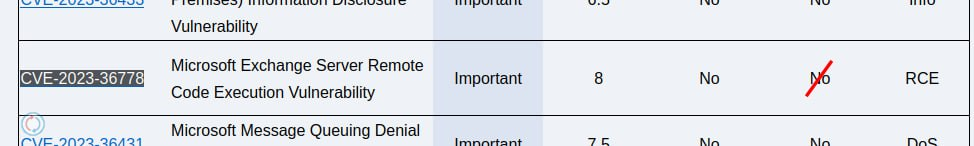
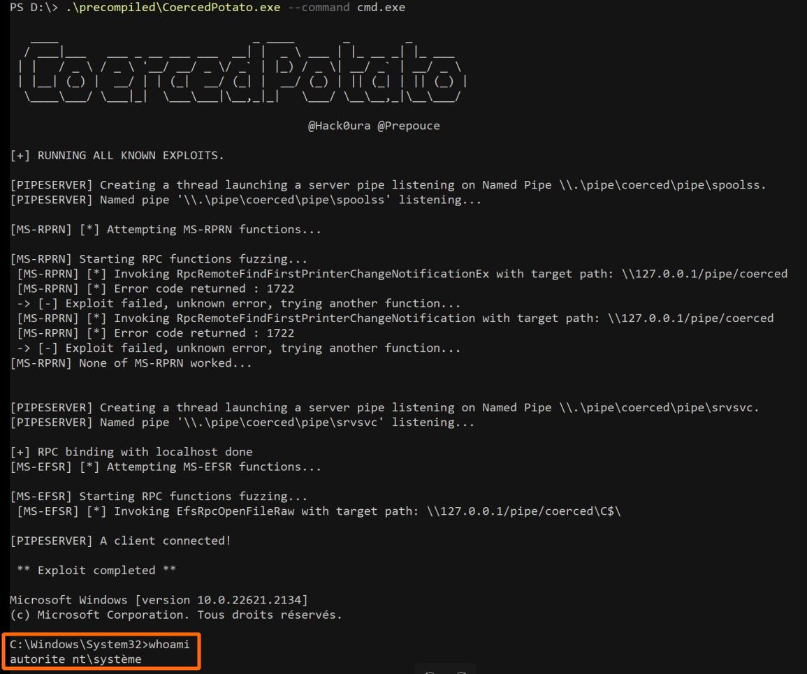

# cibsecurity
`2023-10-18`

* https://web.nvd.nist.gov/view/vuln/detail?vulnId=CVE-2023-45608

<blockquote>
‼ CVE-2023-45608 ‼

Auth. (contributor+) Stored Cross-Site Scripting (XSS) vulnerability in Nicola Modugno Smart Cookie Kit plugin &lt;&#61; 2.3.1 versions.

📖 Read

via &quot;National Vulnerability Database&quot;.
</blockquote>

---

# cibsecurity
`2023-10-18`

* https://web.nvd.nist.gov/view/vuln/detail?vulnId=CVE-2023-32089

<blockquote>
‼ CVE-2023-32089 ‼

Pega Platform versions 8.1 to 8.8.2 are affected by an XSS issue with Pin description

📖 Read

via &quot;National Vulnerability Database&quot;.
</blockquote>

---

# cibsecurity
`2023-10-18`

* https://web.nvd.nist.gov/view/vuln/detail?vulnId=CVE-2023-46006

<blockquote>
‼ CVE-2023-46006 ‼

Sourcecodester Best Courier Management System 1.0 is vulnerable to SQL Injection via the parameter id in /edit_user.php.

📖 Read

via &quot;National Vulnerability Database&quot;.
</blockquote>

---

# cibsecurity
`2023-10-18`

* https://web.nvd.nist.gov/view/vuln/detail?vulnId=CVE-2023-45067

<blockquote>
‼ CVE-2023-45067 ‼

Auth. (contributor+) Stored Cross-Site Scripting (XSS) vulnerability in Ashish Ajani WordPress Simple HTML Sitemap plugin &lt;&#61; 2.1 versions.

📖 Read

via &quot;National Vulnerability Database&quot;.
</blockquote>

---

# cibsecurity
`2023-10-18`

* https://web.nvd.nist.gov/view/vuln/detail?vulnId=CVE-2023-31217

<blockquote>
‼ CVE-2023-31217 ‼

Auth. (contributor+) Stored Cross-Site Scripting (XSS) vulnerability in MyTechTalky User Location and IP plugin &lt;&#61; 1.6 versions.

📖 Read

via &quot;National Vulnerability Database&quot;.
</blockquote>

---

# cibsecurity
`2023-10-18`

* https://web.nvd.nist.gov/view/vuln/detail?vulnId=CVE-2023-32088

<blockquote>
‼ CVE-2023-32088 ‼

Pega Platform versions 8.1 to Infinity 23.1.0 are affected by an XSS issue with ad-hoc case creation

📖 Read

via &quot;National Vulnerability Database&quot;.
</blockquote>

---

# cibsecurity
`2023-10-18`

* https://web.nvd.nist.gov/view/vuln/detail?vulnId=CVE-2023-45073

<blockquote>
‼ CVE-2023-45073 ‼

Auth. (admin+) Stored Cross-Site Scripting (XSS) vulnerability in Michael Koch Mendeley Plugin plugin &lt;&#61; 1.3.2 versions.

📖 Read

via &quot;National Vulnerability Database&quot;.
</blockquote>

---

# cibsecurity
`2023-10-18`

* https://web.nvd.nist.gov/view/vuln/detail?vulnId=CVE-2023-45071

<blockquote>
‼ CVE-2023-45071 ‼

Unauth. Stored Cross-Site Scripting (XSS) vulnerability in 10Web Form Builder Team Form Maker by 10Web – Mobile-Friendly Drag &amp; Drop Contact Form Builder plugin &lt;&#61; 1.15.18 versions.

📖 Read

via &quot;National Vulnerability Database&quot;.
</blockquote>

---

# cibsecurity
`2023-10-18`

* https://web.nvd.nist.gov/view/vuln/detail?vulnId=CVE-2023-45065

<blockquote>
‼ CVE-2023-45065 ‼

Unauth. Reflected Cross-Site Scripting (XSS) vulnerability in Mad Fish Digital Bulk NoIndex &amp; NoFollow Toolkit plugin &lt;&#61; 1.42 versions.

📖 Read

via &quot;National Vulnerability Database&quot;.
</blockquote>

---

# cibsecurity
`2023-10-18`

* https://web.nvd.nist.gov/view/vuln/detail?vulnId=CVE-2023-46005

<blockquote>
‼ CVE-2023-46005 ‼

Sourcecodester Best Courier Management System 1.0 is vulnerable to SQL Injection via the parameter id in /edit_branch.php.

📖 Read

via &quot;National Vulnerability Database&quot;.
</blockquote>

---

# cibsecurity
`2023-10-18`

* https://web.nvd.nist.gov/view/vuln/detail?vulnId=CVE-2023-45070

<blockquote>
‼ CVE-2023-45070 ‼

Unauth. Reflected Cross-Site Scripting (XSS) vulnerability in 10Web Form Builder Team Form Maker by 10Web – Mobile-Friendly Drag &amp; Drop Contact Form Builder plugin &lt;&#61; 1.15.18 versions.

📖 Read

via &quot;National Vulnerability Database&quot;.
</blockquote>

---

# cibsecurity
`2023-10-18`

* https://web.nvd.nist.gov/view/vuln/detail?vulnId=CVE-2023-32087

<blockquote>
‼ CVE-2023-32087 ‼

Pega Platform versions 8.1 to Infinity 23.1.0 are affected by an XSS issue with task creation

📖 Read

via &quot;National Vulnerability Database&quot;.
</blockquote>

---

# cibsecurity
`2023-10-18`

* https://web.nvd.nist.gov/view/vuln/detail?vulnId=CVE-2023-46007

<blockquote>
‼ CVE-2023-46007 ‼

Sourcecodester Best Courier Management System 1.0 is vulnerable to SQL Injection via the parameter id in /edit_staff.php.

📖 Read

via &quot;National Vulnerability Database&quot;.
</blockquote>

---

# cibsecurity
`2023-10-18`

* https://web.nvd.nist.gov/view/vuln/detail?vulnId=CVE-2023-45072

<blockquote>
‼ CVE-2023-45072 ‼

Auth. (admin+) Stored Cross-Site Scripting (XSS) vulnerability in Kardi Order auto complete for WooCommerce plugin &lt;&#61; 1.2.0 versions.

📖 Read

via &quot;National Vulnerability Database&quot;.
</blockquote>

---

# cibsecurity
`2023-10-18`

* https://web.nvd.nist.gov/view/vuln/detail?vulnId=CVE-2023-45727

<blockquote>
‼ CVE-2023-45727 ‼

Proself Enterprise/Standard Edition Ver5.62 and earlier, Proself Gateway Edition Ver1.65 and earlier, and Proself Mail Sanitize Edition Ver1.08 and earlier allow a remote unauthenticated attacker to conduct XML External Entity (XXE) attacks. By processing a specially crafted request containing malformed XML data, arbitrary files on the server containing account information may be read by the attacker.

📖 Read

via &quot;National Vulnerability Database&quot;.
</blockquote>

---

# cibsecurity
`2023-10-18`

* https://web.nvd.nist.gov/view/vuln/detail?vulnId=CVE-2023-45057

<blockquote>
‼ CVE-2023-45057 ‼

Auth. (admin+) Stored Cross-Site Scripting (XSS) vulnerability in Hitsteps Web Analytics plugin &lt;&#61; 5.86 versions.

📖 Read

via &quot;National Vulnerability Database&quot;.
</blockquote>

---

# cibsecurity
`2023-10-18`

* https://web.nvd.nist.gov/view/vuln/detail?vulnId=CVE-2023-45049

<blockquote>
‼ CVE-2023-45049 ‼

Auth. (contributor+) Stored Cross-Site Scripting (XSS) vulnerability in Ciprian Popescu YouTube Playlist Player plugin &lt;&#61; 4.6.7 versions.

📖 Read

via &quot;National Vulnerability Database&quot;.
</blockquote>

---

# cibsecurity
`2023-10-18`

* https://web.nvd.nist.gov/view/vuln/detail?vulnId=CVE-2023-45064

<blockquote>
‼ CVE-2023-45064 ‼

Unauth. Reflected Cross-Site Scripting (XSS) vulnerability in Daisuke Takahashi(Extend Wings) OPcache Dashboard plugin &lt;&#61; 0.3.1 versions.

📖 Read

via &quot;National Vulnerability Database&quot;.
</blockquote>

---

# cibsecurity
`2023-10-18`

* https://web.nvd.nist.gov/view/vuln/detail?vulnId=CVE-2023-45054

<blockquote>
‼ CVE-2023-45054 ‼

Unauth. Reflected Cross-Site Scripting (XSS) vulnerability in AWESOME TOGI Product Category Tree plugin &lt;&#61; 2.5 versions.

📖 Read

via &quot;National Vulnerability Database&quot;.
</blockquote>

---

# cibsecurity
`2023-10-18`

* https://web.nvd.nist.gov/view/vuln/detail?vulnId=CVE-2023-45059

<blockquote>
‼ CVE-2023-45059 ‼

Auth. (contributor+) Stored Cross-Site Scripting (XSS) vulnerability in Gumroad plugin &lt;&#61; 3.1.0 versions.

📖 Read

via &quot;National Vulnerability Database&quot;.
</blockquote>

---

# cibsecurity
`2023-10-18`

* https://web.nvd.nist.gov/view/vuln/detail?vulnId=CVE-2023-45056

<blockquote>
‼ CVE-2023-45056 ‼

Auth. (admin+) Stored Cross-Site Scripting (XSS) vulnerability in 100plugins Open User Map plugin &lt;&#61; 1.3.26 versions.

📖 Read

via &quot;National Vulnerability Database&quot;.
</blockquote>

---

# cibsecurity
`2023-10-18`

* https://web.nvd.nist.gov/view/vuln/detail?vulnId=CVE-2023-25476

<blockquote>
‼ CVE-2023-25476 ‼

Unauth. Reflected Cross-Site Scripting (XSS) vulnerability in Ezoic AmpedSense – AdSense Split Tester plugin &lt;&#61; 4.68 versions.

📖 Read

via &quot;National Vulnerability Database&quot;.
</blockquote>

---

# cibsecurity
`2023-10-18`

* https://web.nvd.nist.gov/view/vuln/detail?vulnId=CVE-2023-45008

<blockquote>
‼ CVE-2023-45008 ‼

Auth. (admin+) Stored Cross-Site Scripting (XSS) vulnerability in WPJohnny Comment Reply Email plugin &lt;&#61; 1.0.3 versions.

📖 Read

via &quot;National Vulnerability Database&quot;.
</blockquote>

---

# cibsecurity
`2023-10-18`

* https://web.nvd.nist.gov/view/vuln/detail?vulnId=CVE-2023-45062

<blockquote>
‼ CVE-2023-45062 ‼

Unauth. Reflected Cross-Site Scripting (XSS) vulnerability in Thomas Scholl canvasio3D Light plugin &lt;&#61; 2.4.6 versions.

📖 Read

via &quot;National Vulnerability Database&quot;.
</blockquote>

---

# cibsecurity
`2023-10-18`

* https://web.nvd.nist.gov/view/vuln/detail?vulnId=CVE-2023-45051

<blockquote>
‼ CVE-2023-45051 ‼

Auth. (admin+) Stored Cross-Site Scripting (XSS) vulnerability in Gopi Ramasamy Image vertical reel scroll slideshow plugin &lt;&#61; 9.0 versions.

📖 Read

via &quot;National Vulnerability Database&quot;.
</blockquote>

---

# cibsecurity
`2023-10-18`

* https://web.nvd.nist.gov/view/vuln/detail?vulnId=CVE-2023-39331

<blockquote>
‼ CVE-2023-39331 ‼

A previously disclosed vulnerability (CVE-2023-30584) was patched insufficiently in commit 205f1e6. The new path traversal vulnerability arises because the implementation does not protect itself against the application overwriting built-in utility functions with user-defined implementations.Please note that at the time this CVE was issued, the permission model is an experimental feature of Node.js.

📖 Read

via &quot;National Vulnerability Database&quot;.
</blockquote>

---

# cibsecurity
`2023-10-18`

* https://web.nvd.nist.gov/view/vuln/detail?vulnId=CVE-2023-22089

<blockquote>
‼ CVE-2023-22089 ‼

Vulnerability in the Oracle WebLogic Server product of Oracle Fusion Middleware (component: Core). Supported versions that are affected are 12.2.1.4.0 and 14.1.1.0.0. Easily exploitable vulnerability allows unauthenticated attacker with network access via T3, IIOP to compromise Oracle WebLogic Server. Successful attacks of this vulnerability can result in takeover of Oracle WebLogic Server. CVSS 3.1 Base Score 9.8 (Confidentiality, Integrity and Availability impacts). CVSS Vector: (CVSS:3.1/AV:N/AC:L/PR:N/UI:N/S:U/C:H/I:H/A:H).

📖 Read

via &quot;National Vulnerability Database&quot;.
</blockquote>

---

# cibsecurity
`2023-10-18`

* https://web.nvd.nist.gov/view/vuln/detail?vulnId=CVE-2023-22072

<blockquote>
‼ CVE-2023-22072 ‼

Vulnerability in the Oracle WebLogic Server product of Oracle Fusion Middleware (component: Core). The supported version that is affected is 12.2.1.3.0. Easily exploitable vulnerability allows unauthenticated attacker with network access via T3, IIOP to compromise Oracle WebLogic Server. Successful attacks of this vulnerability can result in takeover of Oracle WebLogic Server. CVSS 3.1 Base Score 9.8 (Confidentiality, Integrity and Availability impacts). CVSS Vector: (CVSS:3.1/AV:N/AC:L/PR:N/UI:N/S:U/C:H/I:H/A:H).

📖 Read

via &quot;National Vulnerability Database&quot;.
</blockquote>

---

# cibsecurity
`2023-10-18`

* https://web.nvd.nist.gov/view/vuln/detail?vulnId=CVE-2023-41713

<blockquote>
‼ CVE-2023-41713 ‼

SonicOS Use of Hard-coded Password vulnerability in the 'dynHandleBuyToolbar' demo function.

📖 Read

via &quot;National Vulnerability Database&quot;.
</blockquote>

---

# cibsecurity
`2023-10-18`

* https://web.nvd.nist.gov/view/vuln/detail?vulnId=CVE-2023-41631

<blockquote>
‼ CVE-2023-41631 ‼

eSST Monitoring v2.147.1 was discovered to contain a remote code execution (RCE) vulnerability via the file upload function.

📖 Read

via &quot;National Vulnerability Database&quot;.
</blockquote>

---

# cibsecurity
`2023-10-17`

* https://web.nvd.nist.gov/view/vuln/detail?vulnId=CVE-2023-43794

<blockquote>
‼ CVE-2023-43794 ‼

Nocodb is an open source Airtable alternative. Affected versions of nocodb contain a SQL injection vulnerability, that allows an authenticated attacker with creator access to query the underlying database. By supplying a specially crafted payload to the given an attacker can inject arbitrary SQL queries to be executed. Since this is a blind SQL injection, an attacker may need to use time-based payloads which would include a function to delay execution for a given number of seconds. The response time indicates, whether the result of the query execution was true or false. Depending on the result, the HTTP response will be returned after a given number of seconds, indicating TRUE, or immediately, indicating FALSE. In that way, an attacker can reveal the data present in the database. This vulnerability has been addressed in version 0.111.0. Users are advised to upgrade. There are no known workarounds for this vulnerability. This issue is also tracked as `GHSL-2023-141`.

📖 Read

via &quot;National Vulnerability Database&quot;.
</blockquote>

---

# cibsecurity
`2023-10-17`

* https://web.nvd.nist.gov/view/vuln/detail?vulnId=CVE-2023-45951

<blockquote>
‼ CVE-2023-45951 ‼

lylme_spage v1.7.0 was discovered to contain a SQL injection vulnerability via the $userip parameter at function.php.

📖 Read

via &quot;National Vulnerability Database&quot;.
</blockquote>

---

# cibsecurity
`2023-10-17`

* https://www.techrepublic.com/article/cisco-ios-xe-software-zero-day-vulnerability/

<blockquote>
🦿 New Critical Zero-Day Vulnerability Affects Web UI of Cisco IOS XE Software &amp; Allows Attackers to Compromise Routers 🦿

The number of devices exposing the web UI on the internet, a timeline and technical details about this malicious activity, and tips for mitigating this zero-day threat are featured.

📖 Read

via &quot;Tech Republic&quot;.
</blockquote>

<table><tr><td><b>→</b><a href="https://www.techrepublic.com/article/cisco-ios-xe-software-zero-day-vulnerability/">
https://www.techrepublic.com/article/cisco-ios-xe-software-zero-day-vulnerability/
</a>
<blockquote>
This new, critical zero-day vulnerability affecting the web UI of Cisco IOS XE software is being exploited in the wild.
</blockquote>
</td></tr></table>

---

# cibsecurity
`2023-10-17`

* https://web.nvd.nist.gov/view/vuln/detail?vulnId=CVE-2023-45004

<blockquote>
‼ CVE-2023-45004 ‼

Unauth. Reflected Cross-Site Scripting (XSS) vulnerability in wp3sixty Woo Custom Emails plugin &lt;&#61; 2.2 versions.

📖 Read

via &quot;National Vulnerability Database&quot;.
</blockquote>

---

# cibsecurity
`2023-10-17`

* https://web.nvd.nist.gov/view/vuln/detail?vulnId=CVE-2023-42628

<blockquote>
‼ CVE-2023-42628 ‼

Stored cross-site scripting (XSS) vulnerability in the Wiki widget in Liferay Portal 7.1.0 through 7.4.3.87, and Liferay DXP 7.0 fix pack 83 through 102, 7.1 fix pack 28 and earlier, 7.2 fix pack 20 and earlier, 7.3 update 33 and earlier, and 7.4 before update 88 allows remote attackers to inject arbitrary web script or HTML into a parent wiki page via a crafted payload injected into a wiki page's ‘Content’ text field.

📖 Read

via &quot;National Vulnerability Database&quot;.
</blockquote>

---

# cibsecurity
`2023-10-17`

* https://web.nvd.nist.gov/view/vuln/detail?vulnId=CVE-2023-45007

<blockquote>
‼ CVE-2023-45007 ‼

Unauth. Reflected Cross-Site Scripting (XSS) vulnerability in Fotomoto plugin &lt;&#61; 1.2.8 versions.

📖 Read

via &quot;National Vulnerability Database&quot;.
</blockquote>

---

# cibsecurity
`2023-10-17`

* https://web.nvd.nist.gov/view/vuln/detail?vulnId=CVE-2023-45006

<blockquote>
‼ CVE-2023-45006 ‼

Unauth. Reflected Cross-Site Scripting (XSS) vulnerability in ByConsole WooODT Lite – WooCommerce Order Delivery or Pickup with Date Time Location plugin &lt;&#61; 2.4.6 versions.

📖 Read

via &quot;National Vulnerability Database&quot;.
</blockquote>

---

# cibsecurity
`2023-10-17`

* https://web.nvd.nist.gov/view/vuln/detail?vulnId=CVE-2023-42627

<blockquote>
‼ CVE-2023-42627 ‼

Multiple stored cross-site scripting (XSS) vulnerabilities in the Commerce module in Liferay Portal 7.3.5 through 7.4.3.91, and Liferay DXP 7.3 update 33 and earlier, and 7.4 before update 92 allow remote attackers to inject arbitrary web script or HTML via a crafted payload injected into a (1) Shipping Name, (2) Shipping Phone Number, (3) Shipping Address, (4) Shipping Address 2, (5) Shipping Address 3, (6) Shipping Zip, (7) Shipping City, (8) Shipping Region (9), Shipping Country, (10) Billing Name, (11) Billing Phone Number, (12) Billing Address, (13) Billing Address 2, (14) Billing Address 3, (15) Billing Zip, (16) Billing City, (17) Billing Region, (18) Billing Country, or (19) Region Code.

📖 Read

via &quot;National Vulnerability Database&quot;.
</blockquote>

---

# cibsecurity
`2023-10-17`

* https://web.nvd.nist.gov/view/vuln/detail?vulnId=CVE-2023-44990

<blockquote>
‼ CVE-2023-44990 ‼

Auth. (admin+) Stored Cross-Site Scripting (XSS) vulnerability in realmag777 WOLF – WordPress Posts Bulk Editor and Manager Professional plugin &lt;&#61; 1.0.7.1 versions.

📖 Read

via &quot;National Vulnerability Database&quot;.
</blockquote>

---

# cibsecurity
`2023-10-17`

* https://web.nvd.nist.gov/view/vuln/detail?vulnId=CVE-2023-45003

<blockquote>
‼ CVE-2023-45003 ‼

Unauth. Reflected Cross-Site Scripting (XSS) vulnerability in Arrow Plugins Social Feed | Custom Feed for Social Media Networks plugin &lt;&#61; 2.2.0 versions.

📖 Read

via &quot;National Vulnerability Database&quot;.
</blockquote>

---

# cibsecurity
`2023-10-17`

* https://web.nvd.nist.gov/view/vuln/detail?vulnId=CVE-2023-45005

<blockquote>
‼ CVE-2023-45005 ‼

Unauth. Reflected Cross-Site Scripting (XSS) vulnerability in Castos Seriously Simple Stats plugin &lt;&#61; 1.5.1 versions.

📖 Read

via &quot;National Vulnerability Database&quot;.
</blockquote>

---

# cibsecurity
`2023-10-17`

* https://web.nvd.nist.gov/view/vuln/detail?vulnId=CVE-2023-44311

<blockquote>
‼ CVE-2023-44311 ‼

Multiple reflected cross-site scripting (XSS) vulnerabilities in the Plugin for OAuth 2.0 module's OAuth2ProviderApplicationRedirect class in Liferay Portal 7.4.3.41 through 7.4.3.89, and Liferay DXP 7.4 update 41 through update 89 allow remote attackers to inject arbitrary web script or HTML via the (1) code, or (2) error parameter. This issue is caused by an incomplete fix in CVE-2023-33941.

📖 Read

via &quot;National Vulnerability Database&quot;.
</blockquote>

---

# cibsecurity
`2023-10-17`

* https://web.nvd.nist.gov/view/vuln/detail?vulnId=CVE-2023-44310

<blockquote>
‼ CVE-2023-44310 ‼

Stored cross-site scripting (XSS) vulnerability in Page Tree menu Liferay Portal 7.3.6 through 7.4.3.78, and Liferay DXP 7.3 fix pack 1 through update 23, and 7.4 before update 79 allows remote attackers to inject arbitrary web script or HTML via a crafted payload injected into page's &quot;Name&quot; text field.

📖 Read

via &quot;National Vulnerability Database&quot;.
</blockquote>

---

# cibsecurity
`2023-10-17`

* https://web.nvd.nist.gov/view/vuln/detail?vulnId=CVE-2023-45010

<blockquote>
‼ CVE-2023-45010 ‼

Auth. (admin+) Stored Cross-Site Scripting (XSS) vulnerability in Alex MacArthur Complete Open Graph plugin &lt;&#61; 3.4.5 versions.

📖 Read

via &quot;National Vulnerability Database&quot;.
</blockquote>

---

# Leakers_squad
`2023-10-18`

* https://t.me/leakers_Squad/1841

<blockquote>
Top 10 Hacking And CyberSecurity Course For FREE

Link 1 :https://www.udemy.com/course/burp-suite/

link 2 :https://www.udemy.com/course/sql-injection-ethical-hacking/

link 3 :https://www.udemy.com/course/computer-hacking-fundamentals/

link 4 :https://www.udemy.com/course/ethical-hacking-basics-kali-20211/

link 5 :https://www.udemy.com/course/foundations-of-hacking-and-pentesting-android-apps/

link 6 :https://www.udemy.com/course/ethical-hacking-for-beginners-in-hindi/

link 7 :https://www.udemy.com/course/lees-web-hacking-cross-site-scripting-sql-injection/

link 8:https://www.udemy.com/course/ethical-hacking-with-parrot-security-os/

link 9 :https://www.udemy.com/course/ethical-hacking-for-beginners-beginner-to-advance/

link 10 : https://www.udemy.com/course/introduction-to-dark-web-anonymity-and-cryptocurrency/

BY @Mr_Neophyte
Contact for posting these content in your channel

✔️Share with Your Mate.

If you want to report any copyright violation, please write to us at  @Leakers_squad_bot and we will ensure to remove that post within 48 hours
Read this
</blockquote>

<table><tr><td><b>→</b><a href="https://www.udemy.com/course/burp-suite/">
https://www.udemy.com/course/burp-suite/
</a>
<blockquote>
Learn how to make you web application testing easier and faster with the Burp Suite. - Free Course
</blockquote>
</td></tr></table>

---

# cibsecurity
`2023-10-17`

* https://web.nvd.nist.gov/view/vuln/detail?vulnId=CVE-2021-29913

<blockquote>
‼ CVE-2021-29913 ‼

IBM Security Verify Privilege On-Premise 11.5 could allow an authenticated user to obtain sensitive information or perform unauthorized actions due to improper input validation. IBM X-Force ID: 207898.

📖 Read

via &quot;National Vulnerability Database&quot;.
</blockquote>

---

# cibsecurity
`2023-10-17`

* https://web.nvd.nist.gov/view/vuln/detail?vulnId=CVE-2023-45152

<blockquote>
‼ CVE-2023-45152 ‼

Engelsystem is a shift planning system for chaos events. A Blind SSRF in the &quot;Import schedule&quot; functionality makes it possible to perform a port scan against the local environment. This vulnerability has been fixed in commit ee7d30b33. If a patch cannot be deployed, operators should ensure that no HTTP(s) services listen on localhost and/or systems only reachable from the host running the engelsystem software. If such services are necessary, they should utilize additional authentication.

📖 Read

via &quot;National Vulnerability Database&quot;.
</blockquote>

---

# defcon_news
`2023-10-17`

<blockquote>
Warning: Unpatched Cisco Zero-Day Vulnerability Actively Targeted in the Wild
https://thehackernews.com/2023/10/warning-unpatched-cisco-zero-day.html
</blockquote>

---

# cibsecurity
`2023-10-17`

* https://web.nvd.nist.gov/view/vuln/detail?vulnId=CVE-2023-43658

<blockquote>
‼ CVE-2023-43658 ‼

dicourse-calendar is a plugin for the Discourse messaging platform which adds the ability to create a dynamic calendar in the first post of a topic. Improper escaping of event titles could lead to Cross-site Scripting (XSS) within the 'email preview' UI when a site has CSP disabled. Having CSP disabled is a non-default configuration, so the vast majority of sites are unaffected. This problem is resolved in the latest version of the discourse-calendar plugin. Users are advised to upgrade. Users unable to upgrade should ensure CSP is enabled on the forum.

📖 Read

via &quot;National Vulnerability Database&quot;.
</blockquote>

---

# cibsecurity
`2023-10-16`

* https://web.nvd.nist.gov/view/vuln/detail?vulnId=CVE-2023-5057

<blockquote>
‼ CVE-2023-5057 ‼

The ActivityPub WordPress plugin before 1.0.0 does not escape user metadata before outputting them in mentions, which could allow users with a role of Contributor and above to perform Stored XSS attacks

📖 Read

via &quot;National Vulnerability Database&quot;.
</blockquote>

---

# cibsecurity
`2023-10-16`

* https://web.nvd.nist.gov/view/vuln/detail?vulnId=CVE-2023-4862

<blockquote>
‼ CVE-2023-4862 ‼

The File Manager Pro WordPress plugin before 1.8.1 does not adequately validate and escape some inputs, leading to XSS by high-privilege users.

📖 Read

via &quot;National Vulnerability Database&quot;.
</blockquote>

---

# cibsecurity
`2023-10-16`

* https://web.nvd.nist.gov/view/vuln/detail?vulnId=CVE-2023-3279

<blockquote>
‼ CVE-2023-3279 ‼

The WordPress Gallery Plugin WordPress plugin before 3.39 does not validate some block attributes before using them to generate paths passed to include function/s, allowing Admin users to perform LFI attacks

📖 Read

via &quot;National Vulnerability Database&quot;.
</blockquote>

---

# cibsecurity
`2023-10-16`

* https://web.nvd.nist.gov/view/vuln/detail?vulnId=CVE-2023-4798

<blockquote>
‼ CVE-2023-4798 ‼

The User Avatar WordPress plugin before 1.2.2 does not properly sanitize and escape certain of its shortcodes attributes, which could allow relatively low-privileged users like contributors to conduct Stored XSS attacks.

📖 Read

via &quot;National Vulnerability Database&quot;.
</blockquote>

---

# cibsecurity
`2023-10-16`

* https://web.nvd.nist.gov/view/vuln/detail?vulnId=CVE-2023-45144

<blockquote>
‼ CVE-2023-45144 ‼

com.xwiki.identity-oauth:identity-oauth-ui is a package to aid in building identity and service providers based on OAuth authorizations. When a user logs in via the OAuth method, the identityOAuth parameters sent in the GET request is vulnerable to cross site scripting (XSS) and XWiki syntax injection. This allows remote code execution via the groovy macro and thus affects the confidentiality, integrity and availability of the whole XWiki installation. The issue has been fixed in Identity OAuth version 1.6. There are no known workarounds for this vulnerability and users are advised to upgrade.

📖 Read

via &quot;National Vulnerability Database&quot;.
</blockquote>

---

# cibsecurity
`2023-10-16`

* https://web.nvd.nist.gov/view/vuln/detail?vulnId=CVE-2023-45683

<blockquote>
‼ CVE-2023-45683 ‼

github.com/crewjam/saml is a saml library for the go language. In affected versions the package does not validate the ACS Location URI according to the SAML binding being parsed. If abused, this flaw allows attackers to register malicious Service Providers at the IdP and inject Javascript in the ACS endpoint definition, achieving Cross-Site-Scripting (XSS) in the IdP context during the redirection at the end of a SAML SSO Flow. Consequently, an attacker may perform any authenticated action as the victim once the victim’s browser loaded the SAML IdP initiated SSO link for the malicious service provider. Note: SP registration is commonly an unrestricted operation in IdPs, hence not requiring particular permissions or publicly accessible to ease the IdP interoperability. This issue is fixed in version 0.4.14. Users unable to upgrade may perform external validation of URLs provided in SAML metadata, or restrict the ability for end-users to upload arbitrary metadata.

📖 Read

via &quot;National Vulnerability Database&quot;.
</blockquote>

---

# cibsecurity
`2023-10-16`

* https://web.nvd.nist.gov/view/vuln/detail?vulnId=CVE-2023-20198

<blockquote>
‼ CVE-2023-20198 ‼

Cisco is aware of active exploitation of a previously unknown vulnerability in the web UI feature of Cisco IOS XE Software when exposed to the internet or to untrusted networks. This vulnerability allows a remote, unauthenticated attacker to create an account on an affected system with privilege level 15 access. The attacker can then use that account to gain control of the affected system. For steps to close the attack vector for this vulnerability, see the Recommendations section of this advisory  Cisco will provide updates on the status of this investigation and when a software patch is available.

📖 Read

via &quot;National Vulnerability Database&quot;.
</blockquote>

---

# defcon_news
`2023-10-16`

<blockquote>
NLB mKlik Makedonija 3.3.12 SQL Injection
https://packetstormsecurity.com/files/175113/ZSL-2023-5797.txt
</blockquote>

<table><tr><td><b>→</b><a href="https://packetstormsecurity.com/files/175113/ZSL-2023-5797.txt?utm_source=dlvr.it&utm_medium=twitter">
https://packetstormsecurity.com/files/175113/ZSL-2023-5797.txt?utm_source=dlvr.it&utm_medium=twitter
</a>
<blockquote>
Information Security Services, News, Files, Tools, Exploits, Advisories and Whitepapers
</blockquote>
</td></tr></table>

---

# defcon_news
`2023-10-16`

<blockquote>
WordPress WP ERP 1.12.2 SQL Injection
https://packetstormsecurity.com/files/175106/wperp1122-sql.txt
</blockquote>

<table><tr><td><b>→</b><a href="https://packetstormsecurity.com/files/175106/wperp1122-sql.txt?utm_source=dlvr.it&utm_medium=twitter">
https://packetstormsecurity.com/files/175106/wperp1122-sql.txt?utm_source=dlvr.it&utm_medium=twitter
</a>
<blockquote>
Information Security Services, News, Files, Tools, Exploits, Advisories and Whitepapers
</blockquote>
</td></tr></table>

---

# defcon_news
`2023-10-16`

<blockquote>
ChurchCRM 4.5.4 SQL Injection
https://packetstormsecurity.com/files/175105/churchcrm454-sql.txt
</blockquote>

<table><tr><td><b>→</b><a href="https://packetstormsecurity.com/files/175105/churchcrm454-sql.txt?utm_source=dlvr.it&utm_medium=twitter">
https://packetstormsecurity.com/files/175105/churchcrm454-sql.txt?utm_source=dlvr.it&utm_medium=twitter
</a>
<blockquote>
Information Security Services, News, Files, Tools, Exploits, Advisories and Whitepapers
</blockquote>
</td></tr></table>

---

# cibsecurity
`2023-10-16`

* https://web.nvd.nist.gov/view/vuln/detail?vulnId=CVE-2023-46066

<blockquote>
‼ CVE-2023-46066 ‼

Auth. (editor+) Stored Cross-Site Scripting (XSS) vulnerability in Codedrafty Mediabay – Media Library Folders plugin &lt;&#61; 1.6 versions.

📖 Read

via &quot;National Vulnerability Database&quot;.
</blockquote>

---

# cibsecurity
`2023-10-16`

* https://web.nvd.nist.gov/view/vuln/detail?vulnId=CVE-2023-44987

<blockquote>
‼ CVE-2023-44987 ‼

Auth. (admin+) Stored Cross-Site Scripting (XSS) vulnerability in Timely - Appointment software Timely Booking Button plugin &lt;&#61; 2.0.2 versions.

📖 Read

via &quot;National Vulnerability Database&quot;.
</blockquote>

---

# defcon_news
`2023-10-16`

<blockquote>
Signal Debunks Zero-Day Vulnerability Reports, Finds No Evidence
https://thehackernews.com/2023/10/signal-debunks-zero-day-vulnerability.html
</blockquote>

---

# cibsecurity
`2023-10-16`

* https://web.nvd.nist.gov/view/vuln/detail?vulnId=CVE-2023-5591

<blockquote>
‼ CVE-2023-5591 ‼

SQL Injection in GitHub repository librenms/librenms prior to 23.10.0.

📖 Read

via &quot;National Vulnerability Database&quot;.
</blockquote>

---

# cibsecurity
`2023-10-16`

* https://web.nvd.nist.gov/view/vuln/detail?vulnId=CVE-2023-5587

<blockquote>
‼ CVE-2023-5587 ‼

A vulnerability was found in SourceCodester Free Hospital Management System for Small Practices 1.0 and classified as critical. Affected by this issue is some unknown functionality of the file /vm/admin/doctors.php of the component Parameter Handler. The manipulation of the argument search leads to sql injection. The attack may be launched remotely. The exploit has been disclosed to the public and may be used. VDB-242186 is the identifier assigned to this vulnerability.

📖 Read

via &quot;National Vulnerability Database&quot;.
</blockquote>

---

# cibsecurity
`2023-10-16`

* https://web.nvd.nist.gov/view/vuln/detail?vulnId=CVE-2023-5589

<blockquote>
‼ CVE-2023-5589 ‼

A vulnerability was found in SourceCodester Judging Management System 1.0. It has been declared as critical. This vulnerability affects unknown code of the file login.php. The manipulation of the argument password leads to sql injection. The attack can be initiated remotely. The exploit has been disclosed to the public and may be used. The identifier of this vulnerability is VDB-242188.

📖 Read

via &quot;National Vulnerability Database&quot;.
</blockquote>

---

# cibsecurity
`2023-10-15`

* https://web.nvd.nist.gov/view/vuln/detail?vulnId=CVE-2023-38312

<blockquote>
‼ CVE-2023-38312 ‼

A directory traversal vulnerability in Valve Counter-Strike 8684 allows a client (with remote control access to a game server) to read arbitrary files from the underlying server via the motdfile console variable.

📖 Read

via &quot;National Vulnerability Database&quot;.
</blockquote>

---

# defcon_news
`2023-10-15`

<blockquote>
HBSQLI - Automated Tool For Testing Header Based Blind SQL Injection
http://www.kitploit.com/2023/10/hbsqli-automated-tool-for-testing.html
</blockquote>

<table><tr><td><b>→</b><a href="https://www.kitploit.com/2023/10/hbsqli-automated-tool-for-testing.html">
https://www.kitploit.com/2023/10/hbsqli-automated-tool-for-testing.html
</a>
</td></tr></table>

---

# cibsecurity
`2023-10-14`

* https://web.nvd.nist.gov/view/vuln/detail?vulnId=CVE-2022-32755

<blockquote>
‼ CVE-2022-32755 ‼

IBM Security Directory Server 6.4.0 is vulnerable to an XML External Entity Injection (XXE) attack when processing XML data. A remote attacker could exploit this vulnerability to expose sensitive information or consume memory resources. IBM X-Force ID: 228505.

📖 Read

via &quot;National Vulnerability Database&quot;.
</blockquote>

---

# cibsecurity
`2023-10-14`

* https://web.nvd.nist.gov/view/vuln/detail?vulnId=CVE-2023-45852

<blockquote>
‼ CVE-2023-45852 ‼

In Vitogate 300 2.1.3.0, /cgi-bin/vitogate.cgi allows an unauthenticated attacker to bypass authentication and execute arbitrary commands via shell metacharacters in the ipaddr params JSON data for the put method.

📖 Read

via &quot;National Vulnerability Database&quot;.
</blockquote>

---

# cibsecurity
`2023-10-14`

* https://web.nvd.nist.gov/view/vuln/detail?vulnId=CVE-2023-30154

<blockquote>
‼ CVE-2023-30154 ‼

Multiple improper neutralization of SQL parameters in module AfterMail (aftermailpresta) for PrestaShop, before version 2.2.1, allows remote attackers to perform SQL injection attacks via `id_customer`, `id_conf`, `id_product` and `token` parameters in `aftermailajax.php via the 'id_product' parameter in hooks DisplayRightColumnProduct and DisplayProductButtons.

📖 Read

via &quot;National Vulnerability Database&quot;.
</blockquote>

---

# cibsecurity
`2023-10-14`

* https://web.nvd.nist.gov/view/vuln/detail?vulnId=CVE-2023-45674

<blockquote>
‼ CVE-2023-45674 ‼

Farmbot-Web-App is a web control interface for the Farmbot farm automation platform. An SQL injection vulnerability was found in FarmBot's web app that allows authenticated attackers to extract arbitrary data from its database (including the user table). This issue may lead to Information Disclosure. This issue has been patched in version 15.8.4. Users are advised to upgrade. There are no known workarounds for this issue.

📖 Read

via &quot;National Vulnerability Database&quot;.
</blockquote>

---

# cibsecurity
`2023-10-14`

* https://web.nvd.nist.gov/view/vuln/detail?vulnId=CVE-2023-30148

<blockquote>
‼ CVE-2023-30148 ‼

Multiple Stored Cross Site Scripting (XSS) vulnerabilities in Opart opartmultihtmlblock before version 2.0.12 and Opart multihtmlblock* version 1.0.0, allows remote authenticated users to inject arbitrary web script or HTML via the body_text or body_text_rude field in /sourcefiles/BlockhtmlClass.php and /sourcefiles/blockhtml.php.

📖 Read

via &quot;National Vulnerability Database&quot;.
</blockquote>

---

# cibsecurity
`2023-10-13`

* https://web.nvd.nist.gov/view/vuln/detail?vulnId=CVE-2023-45391

<blockquote>
‼ CVE-2023-45391 ‼

A stored cross-site scripting (XSS) vulnerability in the Create A New Employee function of Granding UTime Master v9.0.7-Build:Apr 4,2023 allows authenticated attackers to execute arbitrary web scripts or HTML via a crafted payload injected into the First Name parameter.

📖 Read

via &quot;National Vulnerability Database&quot;.
</blockquote>

---

# cibsecurity
`2023-10-13`

* https://web.nvd.nist.gov/view/vuln/detail?vulnId=CVE-2023-4517

<blockquote>
‼ CVE-2023-4517 ‼

Cross-site Scripting (XSS) - Stored in GitHub repository hestiacp/hestiacp prior to 1.8.6.

📖 Read

via &quot;National Vulnerability Database&quot;.
</blockquote>

---

# cibsecurity
`2023-10-13`

* https://web.nvd.nist.gov/view/vuln/detail?vulnId=CVE-2023-4829

<blockquote>
‼ CVE-2023-4829 ‼

Cross-site Scripting (XSS) - Stored in GitHub repository froxlor/froxlor prior to 2.0.22.

📖 Read

via &quot;National Vulnerability Database&quot;.
</blockquote>

---

# cibsecurity
`2023-10-13`

* https://web.nvd.nist.gov/view/vuln/detail?vulnId=CVE-2023-45162

<blockquote>
‼ CVE-2023-45162 ‼

Affected 1E Platform versions have a Blind SQL Injection vulnerability that can lead to arbitrary code execution. Application of the relevant hotfix remediates this issue.for v8.1.2 apply hotfix Q23166for v8.4.1 apply hotfix Q23164for v9.0.1 apply hotfix Q23173SaaS implementations on v23.7.1 will automatically have hotfix Q23173 applied. Customers with SaaS versions below this are urged to upgrade urgently - please contact 1E to arrange this

📖 Read

via &quot;National Vulnerability Database&quot;.
</blockquote>

---

# defcon_news
`2023-10-13`

<blockquote>
WordPress Core 6.3.1 XSS / DoS / Arbitrary Shortcode Execution
https://packetstormsecurity.com/files/175088/wpcore631-exec.txt
</blockquote>

<table><tr><td><b>→</b><a href="https://packetstormsecurity.com/files/175088/wpcore631-exec.txt">
https://packetstormsecurity.com/files/175088/wpcore631-exec.txt
</a>
<blockquote>
Information Security Services, News, Files, Tools, Exploits, Advisories and Whitepapers
</blockquote>
</td></tr></table>

---

# cibsecurity
`2023-10-13`

* https://web.nvd.nist.gov/view/vuln/detail?vulnId=CVE-2023-5572

<blockquote>
‼ CVE-2023-5572 ‼

Server-Side Request Forgery (SSRF) in GitHub repository vriteio/vrite prior to 0.3.0.

📖 Read

via &quot;National Vulnerability Database&quot;.
</blockquote>

---

# cibsecurity
`2023-10-13`

* https://web.nvd.nist.gov/view/vuln/detail?vulnId=CVE-2023-38000

<blockquote>
‼ CVE-2023-38000 ‼

Auth. Stored (contributor+) Cross-Site Scripting (XSS) vulnerability in WordPress core 6.3 through 6.3.1, from 6.2 through 6.2.2, from 6.1 through 6.1.3, from 6.0 through 6.0.5, from 5.9 through 5.9.7 and Gutenberg plugin &lt;&#61; 16.8.0 versions.

📖 Read

via &quot;National Vulnerability Database&quot;.
</blockquote>

---

# cibsecurity
`2023-10-13`

* https://web.nvd.nist.gov/view/vuln/detail?vulnId=CVE-2023-5571

<blockquote>
‼ CVE-2023-5571 ‼

Improper Input Validation in GitHub repository vriteio/vrite prior to 0.3.0.

📖 Read

via &quot;National Vulnerability Database&quot;.
</blockquote>

---

# cibsecurity
`2023-10-13`

* https://web.nvd.nist.gov/view/vuln/detail?vulnId=CVE-2023-38221

<blockquote>
‼ CVE-2023-38221 ‼

Adobe Commerce versions 2.4.7-beta1 (and earlier), 2.4.6-p2 (and earlier), 2.4.5-p4 (and earlier) and 2.4.4-p5 (and earlier) are affected by an Improper Neutralization of Special Elements used in an SQL Command ('SQL Injection') vulnerability that could lead in arbitrary code execution by an admin-privilege authenticated attacker. Exploitation of this issue does not require user interaction and attack complexity is high as it requires knowledge of tooling beyond just using the UI.

📖 Read

via &quot;National Vulnerability Database&quot;.
</blockquote>

---

# cibsecurity
`2023-10-13`

* https://web.nvd.nist.gov/view/vuln/detail?vulnId=CVE-2023-38218

<blockquote>
‼ CVE-2023-38218 ‼

Adobe Commerce versions 2.4.7-beta1 (and earlier), 2.4.6-p2 (and earlier), 2.4.5-p4 (and earlier) and 2.4.4-p5 (and earlier) are affected by an improper input validation vulnerability. An authenticated attacker can trigger an insecure direct object reference in the `V1/customers/me` endpoint to achieve information exposure and privilege escalation.

📖 Read

via &quot;National Vulnerability Database&quot;.
</blockquote>

---

# cibsecurity
`2023-10-13`

* https://web.nvd.nist.gov/view/vuln/detail?vulnId=CVE-2023-26367

<blockquote>
‼ CVE-2023-26367 ‼

Adobe Commerce versions 2.4.7-beta1 (and earlier), 2.4.6-p2 (and earlier), 2.4.5-p4 (and earlier) and 2.4.4-p5 (and earlier) are affected by an Improper Input Validation vulnerability that could lead to arbitrary file system read by an admin-privilege authenticated attacker. Exploitation of this issue does not require user interaction.

📖 Read

via &quot;National Vulnerability Database&quot;.
</blockquote>

---

# cibsecurity
`2023-10-13`

* https://web.nvd.nist.gov/view/vuln/detail?vulnId=CVE-2023-38219

<blockquote>
‼ CVE-2023-38219 ‼

Adobe Commerce versions 2.4.7-beta1 (and earlier), 2.4.6-p2 (and earlier), 2.4.5-p4 (and earlier) and 2.4.4-p5 (and earlier) are affected by a stored Cross-Site Scripting (XSS) vulnerability that could be abused by a low-privileged attacker to inject malicious scripts into vulnerable form fields. Malicious JavaScript may be executed in a victim’s browser when they browse to the page containing the vulnerable field. Payload is stored in an admin area, resulting in high confidentiality and integrity impact.

📖 Read

via &quot;National Vulnerability Database&quot;.
</blockquote>

---

# cibsecurity
`2023-10-13`

* https://web.nvd.nist.gov/view/vuln/detail?vulnId=CVE-2023-38250

<blockquote>
‼ CVE-2023-38250 ‼

Adobe Commerce versions 2.4.7-beta1 (and earlier), 2.4.6-p2 (and earlier), 2.4.5-p4 (and earlier) and 2.4.4-p5 (and earlier) are affected by an Improper Neutralization of Special Elements used in an SQL Command ('SQL Injection') vulnerability that could lead in arbitrary code execution by an admin-privilege authenticated attacker. Exploitation of this issue does not require user interaction and attack complexity is high as it requires knowledge of tooling beyond just using the UI.

📖 Read

via &quot;National Vulnerability Database&quot;.
</blockquote>

---

# cibsecurity
`2023-10-13`

* https://web.nvd.nist.gov/view/vuln/detail?vulnId=CVE-2023-26366

<blockquote>
‼ CVE-2023-26366 ‼

Adobe Commerce versions 2.4.7-beta1 (and earlier), 2.4.6-p2 (and earlier), 2.4.5-p4 (and earlier) and 2.4.4-p5 (and earlier) are affected by a Server-Side Request Forgery (SSRF) vulnerability that could lead to arbitrary file system read. A high-privileged authenticated attacker can force the application to make arbitrary requests via injection of arbitrary URLs. Exploitation of this issue does not require user interaction, scope is changed due to the fact that an attacker can enforce file read outside the application's path boundary.

📖 Read

via &quot;National Vulnerability Database&quot;.
</blockquote>

---

# cibsecurity
`2023-10-13`

* https://web.nvd.nist.gov/view/vuln/detail?vulnId=CVE-2023-38249

<blockquote>
‼ CVE-2023-38249 ‼

Adobe Commerce versions 2.4.7-beta1 (and earlier), 2.4.6-p2 (and earlier), 2.4.5-p4 (and earlier) and 2.4.4-p5 (and earlier) are affected by an Improper Neutralization of Special Elements used in an SQL Command ('SQL Injection') vulnerability that could lead in arbitrary code execution by an admin-privilege authenticated attacker. Exploitation of this issue does not require user interaction and attack complexity is high as it requires knowledge of tooling beyond just using the UI.

📖 Read

via &quot;National Vulnerability Database&quot;.
</blockquote>

---

# defcon_news
`2023-10-13`

<blockquote>
2023 microsoft office XSS
https://www.reddit.com/r/netsec/comments/175wdm3/2023_microsoft_office_xss/
</blockquote>

<table><tr><td><b>→</b><a href="https://www.reddit.com/r/netsec/comments/175wdm3/2023_microsoft_office_xss/">
https://www.reddit.com/r/netsec/comments/175wdm3/2023_microsoft_office_xss/
</a>
<blockquote>
Posted by Z4ck_01 - 1 vote and no comments
</blockquote>
</td></tr></table>

---

# cibsecurity
`2023-10-13`

* https://web.nvd.nist.gov/view/vuln/detail?vulnId=CVE-2023-41262

<blockquote>
‼ CVE-2023-41262 ‼

An issue was discovered in /fcgi/scrut_fcgi.fcgi in Plixer Scrutinizer before 19.3.1. The csvExportReport endpoint action generateCSV is vulnerable to SQL injection through the sorting parameter, allowing an unauthenticated user to execute arbitrary SQL statements in the context of the application's backend database server.

📖 Read

via &quot;National Vulnerability Database&quot;.
</blockquote>

---

# cibsecurity
`2023-10-13`

* https://web.nvd.nist.gov/view/vuln/detail?vulnId=CVE-2023-41263

<blockquote>
‼ CVE-2023-41263 ‼

An issue was discovered in Plixer Scrutinizer before 19.3.1. It exposes debug logs to unauthenticated users at the /debug/ URL path. With knowledge of valid IP addresses and source types, an unauthenticated attacker can download debug logs containing application-related information.

📖 Read

via &quot;National Vulnerability Database&quot;.
</blockquote>

---

# cibsecurity
`2023-10-13`

* https://web.nvd.nist.gov/view/vuln/detail?vulnId=CVE-2023-41261

<blockquote>
‼ CVE-2023-41261 ‼

An issue was discovered in /fcgi/scrut_fcgi.fcgi in Plixer Scrutinizer before 19.3.1. The csvExportReport endpoint action generateCSV does not require authentication and allows an unauthenticated user to export a report and access the results.

📖 Read

via &quot;National Vulnerability Database&quot;.
</blockquote>

---

# cibsecurity
`2023-10-13`

* https://web.nvd.nist.gov/view/vuln/detail?vulnId=CVE-2023-22392

<blockquote>
‼ CVE-2023-22392 ‼

A Missing Release of Memory after Effective Lifetime vulnerability in the Packet Forwarding Engine (PFE) of Juniper Networks Junos OS allows an adjacent, unauthenticated attacker to cause a Denial of Service (DoS).PTX3000, PTX5000, QFX10000, PTX1000, PTX10002, and PTX10004, PTX10008 and PTX10016 with LC110x FPCs do not support certain flow-routes. Once a flow-route is received over an established BGP session and an attempt is made to install the resulting filter into the PFE, FPC heap memory is leaked. The FPC heap memory can be monitored using the CLI command &quot;show chassis fpc&quot;.The following syslog messages can be observed if the respective filter derived from a flow-route cannot be installed.expr_dfw_sfm_range_add:661 SFM packet-length Unable to get a sfm entry for updating the hwexpr_dfw_hw_sfm_add:750 Unable to add the filter secondarymatch to the hardwareexpr_dfw_base_hw_add:52 Failed to add h/w sfm data.expr_dfw_base_hw_create:114 Failed to add h/w data.expr_dfw_base_pfe_inst_create:241 Failed to create base inst for sfilter 0 on PFE 0 for __flowspec_default_inet__expr_dfw_flt_inst_change:1368 Failed to create __flowspec_default_inet__ on PFE 0expr_dfw_hw_pgm_fnum:465 dfw_pfe_inst_old not found for pfe_index 0!expr_dfw_bp_pgm_flt_num:548 Failed to pgm bind-point in hw: generic failureexpr_dfw_bp_topo_handler:1102 Failed to program fnum.expr_dfw_entry_process_change:679 Failed to change instance for filter __flowspec_default_inet__.This issue affects Juniper Networks Junos OS:on PTX1000, PTX10002, and PTX10004, PTX10008 and PTX10016 with LC110x FPCs: * All versions prior to 20.4R3-S5; * 21.1 versions prior to 21.1R3-S4; * 21.2 versions prior to 21.2R3-S2; * 21.3 versions prior to 21.3R3; * 21.4 versions prior to 21.4R2-S2, 21.4R3; * 22.1 versions prior to 22.1R1-S2, 22.1R2.on PTX3000, PTX5000, QFX10000: * All versions prior to 20.4R3-S8; * 21.1 version 21.1R1 and later versions; * 21.2 versions prior to 21.2R3-S6; * 21.3 versions prior to 21.3R3-S5; * 21.4 versions prior to 21.4R3-S4; * 22.1 versions prior to 22.1R3-S3 * 22.2 versions prior to 22.2R3-S1 * 22.3 versions prior to 22.3R2-S2, 22.3R3 * 22.4 versions prior to 22.4R2.

📖 Read

via &quot;National Vulnerability Database&quot;.
</blockquote>

---

# cibsecurity
`2023-10-12`

* https://web.nvd.nist.gov/view/vuln/detail?vulnId=CVE-2023-27314

<blockquote>
‼ CVE-2023-27314 ‼

ONTAP 9 versions prior to 9.8P19, 9.9.1P16, 9.10.1P12, 9.11.1P8, 9.12.1P2 and 9.13.1 are susceptible to a vulnerability which could allow a remote unauthenticated attacker to cause a crash of the HTTP service.

📖 Read

via &quot;National Vulnerability Database&quot;.
</blockquote>

---

# cibsecurity
`2023-10-12`

* https://web.nvd.nist.gov/view/vuln/detail?vulnId=CVE-2023-5046

<blockquote>
‼ CVE-2023-5046 ‼

Improper Neutralization of Special Elements used in an SQL Command ('SQL Injection') vulnerability in Biltay Technology Procost allows SQL Injection, Command Line Execution through SQL Injection.This issue affects Procost: before 1390.

📖 Read

via &quot;National Vulnerability Database&quot;.
</blockquote>

---

# cibsecurity
`2023-10-12`

* https://web.nvd.nist.gov/view/vuln/detail?vulnId=CVE-2023-23651

<blockquote>
‼ CVE-2023-23651 ‼

Auth. (subscriber+) SQL Injection (SQLi) vulnerability in MainWP Google Analytics Extension plugin &lt;&#61; 4.0.4 versions.

📖 Read

via &quot;National Vulnerability Database&quot;.
</blockquote>

---

# cibsecurity
`2023-10-12`

* https://web.nvd.nist.gov/view/vuln/detail?vulnId=CVE-2023-5045

<blockquote>
‼ CVE-2023-5045 ‼

Improper Neutralization of Special Elements used in an SQL Command ('SQL Injection') vulnerability in Biltay Technology Kayisi allows SQL Injection, Command Line Execution through SQL Injection.This issue affects Kayisi: before 1286.

📖 Read

via &quot;National Vulnerability Database&quot;.
</blockquote>

---

# cibsecurity
`2023-10-12`

* https://web.nvd.nist.gov/view/vuln/detail?vulnId=CVE-2023-23737

<blockquote>
‼ CVE-2023-23737 ‼

Unauth. SQL Injection (SQLi) vulnerability in MainWP MainWP Broken Links Checker Extension plugin &lt;&#61; 4.0 versions.

📖 Read

via &quot;National Vulnerability Database&quot;.
</blockquote>

---

# defcon_news
`2023-10-12`

<blockquote>
Dawa Pharma 1.0-2022 SQL Injection
https://packetstormsecurity.com/files/175078/dawapharma10-sql.txt
</blockquote>

<table><tr><td><b>→</b><a href="https://packetstormsecurity.com/files/175078/dawapharma10-sql.txt?utm_source=dlvr.it&utm_medium=twitter">
https://packetstormsecurity.com/files/175078/dawapharma10-sql.txt?utm_source=dlvr.it&utm_medium=twitter
</a>
<blockquote>
Information Security Services, News, Files, Tools, Exploits, Advisories and Whitepapers
</blockquote>
</td></tr></table>

---

# proxy_bar
`2023-10-12`

* https://www.zerodayinitiative.com/blog/2023/10/10/the-october-2023-security-update-review

<blockquote>
ДатаСексуалы на месте ? 
Вся туса в сборе: 0day,rce,dos,eop,xss и дюша метЁлкин 
Переходите сразу к таблице
Только вот с CVE-2023-36778 НЕ угадали
</blockquote>

---

# cibsecurity
`2023-10-11`

* https://web.nvd.nist.gov/view/vuln/detail?vulnId=CVE-2023-44961

<blockquote>
‼ CVE-2023-44961 ‼

SQL Injection vulnerability in Koha Library Software 23.0.5.04 and before allows a remote attacker to obtain sensitive information via the intranet/cgi bin/cataloging/ysearch.pl. component.

📖 Read

via &quot;National Vulnerability Database&quot;.
</blockquote>

---

# cibsecurity
`2023-10-11`

* https://web.nvd.nist.gov/view/vuln/detail?vulnId=CVE-2023-34354

<blockquote>
‼ CVE-2023-34354 ‼

A stored cross-site scripting (XSS) vulnerability exists in the upload_brand.cgi functionality of peplink Surf SOHO HW1 v6.3.5 (in QEMU). A specially crafted HTTP request can lead to execution of arbitrary javascript in another user's browser. An attacker can make an authenticated HTTP request to trigger this vulnerability.

📖 Read

via &quot;National Vulnerability Database&quot;.
</blockquote>

---

# finsecurity
`2023-10-11`

<blockquote>
Добрый вечер, ребята есть вопрос про sql injection  кто может помочь? Мне бы уточнить коль что
</blockquote>

---

# defcon_news
`2023-10-11`

<blockquote>
Smart School 6.4.1 SQL Injection
https://packetstormsecurity.com/files/175071/smartschool641-sql.txt
</blockquote>

<table><tr><td><b>→</b><a href="https://packetstormsecurity.com/files/175071/smartschool641-sql.txt?utm_source=dlvr.it&utm_medium=twitter">
https://packetstormsecurity.com/files/175071/smartschool641-sql.txt?utm_source=dlvr.it&utm_medium=twitter
</a>
<blockquote>
Information Security Services, News, Files, Tools, Exploits, Advisories and Whitepapers
</blockquote>
</td></tr></table>

---

# defcon_news
`2023-10-11`

<blockquote>
Gaatitrack 1.0-2023 SQL Injection
https://packetstormsecurity.com/files/175037/gaatitrack102023-sql.txt
</blockquote>

<table><tr><td><b>→</b><a href="https://packetstormsecurity.com/files/175037/gaatitrack102023-sql.txt">
https://packetstormsecurity.com/files/175037/gaatitrack102023-sql.txt
</a>
<blockquote>
Information Security Services, News, Files, Tools, Exploits, Advisories and Whitepapers
</blockquote>
</td></tr></table>

---

# cibsecurity
`2023-10-11`

* https://web.nvd.nist.gov/view/vuln/detail?vulnId=CVE-2023-37538

<blockquote>
‼ CVE-2023-37538 ‼

HCL Digital Experience is susceptible to cross site scripting (XSS). One subcomponent is vulnerable to reflected XSS. In reflected XSS, an attacker must induce a victim to click on a crafted URL from some delivery mechanism (email, other web site).

📖 Read

via &quot;National Vulnerability Database&quot;.
</blockquote>

---

# cibsecurity
`2023-10-11`

* https://web.nvd.nist.gov/view/vuln/detail?vulnId=CVE-2023-44095

<blockquote>
‼ CVE-2023-44095 ‼

Use-After-Free (UAF) vulnerability in the surfaceflinger module.Successful exploitation of this vulnerability can cause system crash.

📖 Read

via &quot;National Vulnerability Database&quot;.
</blockquote>

---

# cibsecurity
`2023-10-11`

* https://web.nvd.nist.gov/view/vuln/detail?vulnId=CVE-2023-38216

<blockquote>
‼ CVE-2023-38216 ‼

Adobe Bridge versions 12.0.4 (and earlier) and 13.0.3 (and earlier) are affected by a Use After Free vulnerability that could lead to disclosure of sensitive memory. An attacker could leverage this vulnerability to bypass mitigations such as ASLR. Exploitation of this issue requires user interaction in that a victim must open a malicious file.

📖 Read

via &quot;National Vulnerability Database&quot;.
</blockquote>

---

# cibsecurity
`2023-10-11`

* https://web.nvd.nist.gov/view/vuln/detail?vulnId=CVE-2023-4990

<blockquote>
‼ CVE-2023-4990 ‼

Directory traversal vulnerability in MCL-Net versions prior to 4.6 Update Package (P01) may allow attackers to read arbitrary files.

📖 Read

via &quot;National Vulnerability Database&quot;.
</blockquote>

---

# proxy_bar
`2023-10-11`

* https://github.com/chompie1337/Windows_MSKSSRV_LPE_CVE-2023-36802

<blockquote>
CVE-2023-36802 
windows Local Privilege Escalation
Usage:
Windows_MSKSSRV_LPE_CVE-2023-6802.exe &lt;pid&gt;
где pid — это идентификатор процесса (в десятичном формате), который требуется повысить до SYSTEM
POC

&#35;win &#35;lpe
</blockquote>

---

# proxy_bar
`2023-10-11`

* https://daniel.haxx.se/blog/2023/10/11/how-i-made-a-heap-overflow-in-curl/

<blockquote>
Update:
How I made a heap overflow in curl

&#35;curl &#35;libcurl &#35;ssrf
</blockquote>

---

# cibsecurity
`2023-10-11`

* https://web.nvd.nist.gov/view/vuln/detail?vulnId=CVE-2023-45194

<blockquote>
‼ CVE-2023-45194 ‼

Use of default credentials vulnerability in MR-GM2 firmware Ver. 3.00.03 and earlier, and MR-GM3 (-D/-K/-S/-DK/-DKS/-M/-W) firmware Ver. 1.03.45 and earlier allows a network-adjacent unauthenticated attacker to intercept wireless LAN communication, when the affected product performs the communication without changing the pre-shared key from the factory-default configuration.

📖 Read

via &quot;National Vulnerability Database&quot;.
</blockquote>

---

# cibsecurity
`2023-10-11`

* https://web.nvd.nist.gov/view/vuln/detail?vulnId=CVE-2023-36126

<blockquote>
‼ CVE-2023-36126 ‼

There is a Cross Site Scripting (XSS) vulnerability in the &quot;theme&quot; parameter of preview.php in PHPJabbers Appointment Scheduler v3.0

📖 Read

via &quot;National Vulnerability Database&quot;.
</blockquote>

---

# cibsecurity
`2023-10-11`

* https://web.nvd.nist.gov/view/vuln/detail?vulnId=CVE-2023-26220

<blockquote>
‼ CVE-2023-26220 ‼

The Spotfire Library component of TIBCO Software Inc.'s Spotfire Analyst and Spotfire Server contains an easily exploitable vulnerability that allows a low privileged attacker with network access to execute a Stored Cross Site Scripting (XSS) on the affected system. A successful attack using this vulnerability requires human interaction from a person other than the attacker. Affected releases are TIBCO Software Inc.'s Spotfire Analyst: versions 11.4.7 and below, versions 11.5.0, 11.6.0, 11.7.0, 11.8.0, 12.0.0, 12.0.1, 12.0.2, 12.0.3, and 12.0.4, versions 12.1.0 and 12.1.1 and Spotfire Server: versions 11.4.11 and below, versions 11.5.0, 11.6.0, 11.6.1, 11.6.2, 11.6.3, 11.7.0, 11.8.0, 11.8.1, 12.0.0, 12.0.1, 12.0.2, 12.0.3, 12.0.4, and 12.0.5, versions 12.1.0 and 12.1.1.

📖 Read

via &quot;National Vulnerability Database&quot;.
</blockquote>

---

# cibsecurity
`2023-10-10`

* https://web.nvd.nist.gov/view/vuln/detail?vulnId=CVE-2023-45648

<blockquote>
‼ CVE-2023-45648 ‼

Improper Input Validation vulnerability in Apache Tomcat.Tomcat from 11.0.0-M1 through 11.0.0-M11, from 10.1.0-M1 through 10.1.13, from 9.0.0-M1 through 9.0.81 and from 8.5.0 through 8.5.93 did not correctly parse HTTP trailer headers. A specially crafted, invalid trailer header could cause Tomcat to treat a single request as multiple requests leading to the possibility of request smuggling when behind a reverse proxy.Users are recommended to upgrade to version 11.0.0-M12 onwards, 10.1.14 onwards, 9.0.81 onwards or 8.5.94 onwards, which fix the issue.

📖 Read

via &quot;National Vulnerability Database&quot;.
</blockquote>

---

# cibsecurity
`2023-10-10`

* https://web.nvd.nist.gov/view/vuln/detail?vulnId=CVE-2023-5497

<blockquote>
‼ CVE-2023-5497 ‼

A vulnerability classified as critical has been found in Tongda OA 2017 11.10. Affected is an unknown function of the file general/hr/salary/welfare_manage/delete.php. The manipulation of the argument WELFARE_ID leads to sql injection. It is possible to launch the attack remotely. The exploit has been disclosed to the public and may be used. VDB-241650 is the identifier assigned to this vulnerability.

📖 Read

via &quot;National Vulnerability Database&quot;.
</blockquote>

---

# cibsecurity
`2023-10-10`

* https://web.nvd.nist.gov/view/vuln/detail?vulnId=CVE-2023-41765

<blockquote>
‼ CVE-2023-41765 ‼

Layer 2 Tunneling Protocol Remote Code Execution Vulnerability

📖 Read

via &quot;National Vulnerability Database&quot;.
</blockquote>

---

# cibsecurity
`2023-10-10`

* https://web.nvd.nist.gov/view/vuln/detail?vulnId=CVE-2023-41771

<blockquote>
‼ CVE-2023-41771 ‼

Layer 2 Tunneling Protocol Remote Code Execution Vulnerability

📖 Read

via &quot;National Vulnerability Database&quot;.
</blockquote>

---

# cibsecurity
`2023-10-10`

* https://web.nvd.nist.gov/view/vuln/detail?vulnId=CVE-2023-36780

<blockquote>
‼ CVE-2023-36780 ‼

Skype for Business Remote Code Execution Vulnerability

📖 Read

via &quot;National Vulnerability Database&quot;.
</blockquote>

---

# cibsecurity
`2023-10-10`

* https://web.nvd.nist.gov/view/vuln/detail?vulnId=CVE-2023-36718

<blockquote>
‼ CVE-2023-36718 ‼

Microsoft Virtual Trusted Platform Module Remote Code Execution Vulnerability

📖 Read

via &quot;National Vulnerability Database&quot;.
</blockquote>

---

# cibsecurity
`2023-10-10`

* https://web.nvd.nist.gov/view/vuln/detail?vulnId=CVE-2023-36571

<blockquote>
‼ CVE-2023-36571 ‼

Microsoft Message Queuing Remote Code Execution Vulnerability

📖 Read

via &quot;National Vulnerability Database&quot;.
</blockquote>

---

# cibsecurity
`2023-10-10`

* https://web.nvd.nist.gov/view/vuln/detail?vulnId=CVE-2023-41767

<blockquote>
‼ CVE-2023-41767 ‼

Layer 2 Tunneling Protocol Remote Code Execution Vulnerability

📖 Read

via &quot;National Vulnerability Database&quot;.
</blockquote>

---

# cibsecurity
`2023-10-10`

* https://web.nvd.nist.gov/view/vuln/detail?vulnId=CVE-2023-41773

<blockquote>
‼ CVE-2023-41773 ‼

Layer 2 Tunneling Protocol Remote Code Execution Vulnerability

📖 Read

via &quot;National Vulnerability Database&quot;.
</blockquote>

---

# cibsecurity
`2023-10-10`

* https://web.nvd.nist.gov/view/vuln/detail?vulnId=CVE-2023-36710

<blockquote>
‼ CVE-2023-36710 ‼

Windows Media Foundation Core Remote Code Execution Vulnerability

📖 Read

via &quot;National Vulnerability Database&quot;.
</blockquote>

---

# cibsecurity
`2023-10-10`

* https://web.nvd.nist.gov/view/vuln/detail?vulnId=CVE-2023-36573

<blockquote>
‼ CVE-2023-36573 ‼

Microsoft Message Queuing Remote Code Execution Vulnerability

📖 Read

via &quot;National Vulnerability Database&quot;.
</blockquote>

---

# cibsecurity
`2023-10-10`

* https://web.nvd.nist.gov/view/vuln/detail?vulnId=CVE-2023-38166

<blockquote>
‼ CVE-2023-38166 ‼

Layer 2 Tunneling Protocol Remote Code Execution Vulnerability

📖 Read

via &quot;National Vulnerability Database&quot;.
</blockquote>

---

# cibsecurity
`2023-10-10`

* https://web.nvd.nist.gov/view/vuln/detail?vulnId=CVE-2023-36574

<blockquote>
‼ CVE-2023-36574 ‼

Microsoft Message Queuing Remote Code Execution Vulnerability

📖 Read

via &quot;National Vulnerability Database&quot;.
</blockquote>

---

# cibsecurity
`2023-10-10`

* https://web.nvd.nist.gov/view/vuln/detail?vulnId=CVE-2023-36578

<blockquote>
‼ CVE-2023-36578 ‼

Microsoft Message Queuing Remote Code Execution Vulnerability

📖 Read

via &quot;National Vulnerability Database&quot;.
</blockquote>

---

# cibsecurity
`2023-10-10`

* https://web.nvd.nist.gov/view/vuln/detail?vulnId=CVE-2023-36789

<blockquote>
‼ CVE-2023-36789 ‼

Skype for Business Remote Code Execution Vulnerability

📖 Read

via &quot;National Vulnerability Database&quot;.
</blockquote>

---

# cibsecurity
`2023-10-10`

* https://web.nvd.nist.gov/view/vuln/detail?vulnId=CVE-2023-36415

<blockquote>
‼ CVE-2023-36415 ‼

Azure Identity SDK Remote Code Execution Vulnerability

📖 Read

via &quot;National Vulnerability Database&quot;.
</blockquote>

---

# cibsecurity
`2023-10-10`

* https://web.nvd.nist.gov/view/vuln/detail?vulnId=CVE-2023-36417

<blockquote>
‼ CVE-2023-36417 ‼

Microsoft SQL ODBC Driver Remote Code Execution Vulnerability

📖 Read

via &quot;National Vulnerability Database&quot;.
</blockquote>

---

# cibsecurity
`2023-10-10`

* https://web.nvd.nist.gov/view/vuln/detail?vulnId=CVE-2023-36592

<blockquote>
‼ CVE-2023-36592 ‼

Microsoft Message Queuing Remote Code Execution Vulnerability

📖 Read

via &quot;National Vulnerability Database&quot;.
</blockquote>

---

# cibsecurity
`2023-10-10`

* https://web.nvd.nist.gov/view/vuln/detail?vulnId=CVE-2023-35349

<blockquote>
‼ CVE-2023-35349 ‼

Microsoft Message Queuing Remote Code Execution Vulnerability

📖 Read

via &quot;National Vulnerability Database&quot;.
</blockquote>

---

# cibsecurity
`2023-10-10`

* https://web.nvd.nist.gov/view/vuln/detail?vulnId=CVE-2023-36414

<blockquote>
‼ CVE-2023-36414 ‼

Azure Identity SDK Remote Code Execution Vulnerability

📖 Read

via &quot;National Vulnerability Database&quot;.
</blockquote>

---

# cibsecurity
`2023-10-10`

* https://web.nvd.nist.gov/view/vuln/detail?vulnId=CVE-2023-36902

<blockquote>
‼ CVE-2023-36902 ‼

Windows Runtime Remote Code Execution Vulnerability

📖 Read

via &quot;National Vulnerability Database&quot;.
</blockquote>

---

# cibsecurity
`2023-10-10`

* https://web.nvd.nist.gov/view/vuln/detail?vulnId=CVE-2023-5495

<blockquote>
‼ CVE-2023-5495 ‼

A vulnerability was found in QDocs Smart School 6.4.1. It has been classified as critical. This affects an unknown part of the file /course/filterRecords/ of the component HTTP POST Request Handler. The manipulation of the argument searchdata[0][title]/searchdata[0][searchfield]/searchdata[0][searchvalue] leads to sql injection. It is possible to initiate the attack remotely. The associated identifier of this vulnerability is VDB-241647. NOTE: The vendor was contacted early about this disclosure but did not respond in any way.

📖 Read

via &quot;National Vulnerability Database&quot;.
</blockquote>

---

# cibsecurity
`2023-10-10`

* https://web.nvd.nist.gov/view/vuln/detail?vulnId=CVE-2023-42782

<blockquote>
‼ CVE-2023-42782 ‼

A insufficient verification of data authenticity vulnerability [CWE-345] in FortiAnalyzer version 7.4.0 and below 7.2.3 allows a remote unauthenticated attacker to send messages to the syslog server of FortiAnalyzer via the knoweldge of an authorized device serial number.

📖 Read

via &quot;National Vulnerability Database&quot;.
</blockquote>

---

# cibsecurity
`2023-10-10`

* https://web.nvd.nist.gov/view/vuln/detail?vulnId=CVE-2023-36555

<blockquote>
‼ CVE-2023-36555 ‼

An improper neutralization of script-related html tags in a web page (basic xss) in Fortinet FortiOS 7.2.0 - 7.2.4 allows an attacker to execute unauthorized code or commands via the SAML and Security Fabric components.

📖 Read

via &quot;National Vulnerability Database&quot;.
</blockquote>

---

# cibsecurity
`2023-10-10`

* https://web.nvd.nist.gov/view/vuln/detail?vulnId=CVE-2023-41675

<blockquote>
‼ CVE-2023-41675 ‼

A use after free vulnerability [CWE-416] in FortiOS version 7.2.0 through 7.2.4 and version 7.0.0 through 7.0.10 and FortiProxy version 7.2.0 through 7.2.2 and version 7.0.0 through 7.0.8 may allow an unauthenticated remote attacker to crash the WAD process via multiple crafted packets reaching proxy policies or firewall policies with proxy mode alongside SSL deep packet inspection.

📖 Read

via &quot;National Vulnerability Database&quot;.
</blockquote>

---

# cibsecurity
`2023-10-10`

* https://web.nvd.nist.gov/view/vuln/detail?vulnId=CVE-2023-30805

<blockquote>
‼ CVE-2023-30805 ‼

The Sangfor Next-Gen Application Firewall version NGAF8.0.17 is vulnerable to an operating system command injection vulnerability. A remote and unauthenticated attacker can execute arbitrary commands by sending a crafted HTTP POST request to the /LogInOut.php endpoint. This is due to mishandling of shell meta-characters in the &quot;un&quot; parameter.

📖 Read

via &quot;National Vulnerability Database&quot;.
</blockquote>

---

# cibsecurity
`2023-10-10`

* https://web.nvd.nist.gov/view/vuln/detail?vulnId=CVE-2023-30803

<blockquote>
‼ CVE-2023-30803 ‼

The Sangfor Next-Gen Application Firewall version NGAF8.0.17 is vulnerable to an authentication bypass vulnerability. A remote and unauthenticated attacker can bypass authentication and access administrative functionality by sending HTTP requests using a crafted Y-forwarded-for header.

📖 Read

via &quot;National Vulnerability Database&quot;.
</blockquote>

---

# cibsecurity
`2023-10-10`

* https://web.nvd.nist.gov/view/vuln/detail?vulnId=CVE-2023-30806

<blockquote>
‼ CVE-2023-30806 ‼

The Sangfor Next-Gen Application Firewall version NGAF8.0.17 is vulnerable to an operating system command injection vulnerability. A remote and unauthenticated attacker can execute arbitrary commands by sending a crafted HTTP POST request to the /cgi-bin/login.cgi endpoint. This is due to mishandling of shell meta-characters in the PHPSESSID cookie.

📖 Read

via &quot;National Vulnerability Database&quot;.
</blockquote>

---

# cibsecurity
`2023-10-10`

* https://web.nvd.nist.gov/view/vuln/detail?vulnId=CVE-2023-30804

<blockquote>
‼ CVE-2023-30804 ‼

The Sangfor Next-Gen Application Firewall version NGAF8.0.17 is vulnerable to an authenticated file disclosure vulnerability. A remote and authenticated attacker can read arbitrary system files using the svpn_html/loadfile.php endpoint. This issue is exploitable by a remote and unauthenticated attacker when paired with CVE-2023-30803.

📖 Read

via &quot;National Vulnerability Database&quot;.
</blockquote>

---

# cibsecurity
`2023-10-10`

* https://web.nvd.nist.gov/view/vuln/detail?vulnId=CVE-2023-30802

<blockquote>
‼ CVE-2023-30802 ‼

The Sangfor Next-Gen Application Firewall version NGAF8.0.17 is vulnerable to a source code disclosure vulnerability. A remote and unauthenticated attacker can obtain PHP source code by sending an HTTP request with an invalid Content-Length field.

📖 Read

via &quot;National Vulnerability Database&quot;.
</blockquote>

---

# defcon_news
`2023-10-10`

<blockquote>
HTTP/2 Rapid Reset Zero-Day Vulnerability Exploited to Launch Record DDoS Attacks
https://thehackernews.com/2023/10/http2-rapid-reset-zero-day.html
</blockquote>

---

# defcon_news
`2023-10-10`

<blockquote>
Webedition CMS 2.9.8.8 Server-Side Request Forgery
https://packetstormsecurity.com/files/175021/webeditioncms2988-ssrf.txt
</blockquote>

<table><tr><td><b>→</b><a href="https://packetstormsecurity.com/files/175021/webeditioncms2988-ssrf.txt">
https://packetstormsecurity.com/files/175021/webeditioncms2988-ssrf.txt
</a>
<blockquote>
Information Security Services, News, Files, Tools, Exploits, Advisories and Whitepapers
</blockquote>
</td></tr></table>

---

# cibsecurity
`2023-10-10`

* https://web.nvd.nist.gov/view/vuln/detail?vulnId=CVE-2023-41373

<blockquote>
‼ CVE-2023-41373 ‼

A directory traversal vulnerability exists in the BIG-IP Configuration Utility that may allow an authenticated attacker to execute commands on the BIG-IP system. For BIG-IP system running in Appliance mode, a successful exploit can allow the attacker to cross a security boundary. Note: Software versions which have reached End of Technical Support (EoTS) are not evaluated.

📖 Read

via &quot;National Vulnerability Database&quot;.
</blockquote>

---

# cibsecurity
`2023-10-10`

* https://web.nvd.nist.gov/view/vuln/detail?vulnId=CVE-2023-44763

<blockquote>
‼ CVE-2023-44763 ‼

Concrete CMS v9.2.1 is affected by Arbitrary File Upload vulnerability via the Thumbnail&quot; file upload, which allows Cross-Site Scripting (XSS).

📖 Read

via &quot;National Vulnerability Database&quot;.
</blockquote>

---

# sysadm_in_channel
`2023-10-10`

<blockquote>
/ HTTP/2 Zero-Day Vulnerability Results in Record-Breaking DDoS Attacks

https://blog.cloudflare.com/zero-day-rapid-reset-http2-record-breaking-ddos-attack/
</blockquote>

<table><tr><td><b>→</b><a href="https://blog.cloudflare.com/zero-day-rapid-reset-http2-record-breaking-ddos-attack/">
https://blog.cloudflare.com/zero-day-rapid-reset-http2-record-breaking-ddos-attack/
</a>
<blockquote>
The “HTTP/2 Rapid Reset” attack exploits a weakness in the HTTP/2 protocol to generate enormous, hyper-volumetric DDoS attacks. Cloudflare has mitigated a barrage of these attacks in recent months, including an attack three times larger than any previous attack we’ve observed
</blockquote>
</td></tr></table>

---

# cibsecurity
`2023-10-10`

* https://web.nvd.nist.gov/view/vuln/detail?vulnId=CVE-2023-35796

<blockquote>
‼ CVE-2023-35796 ‼

A vulnerability has been identified in SINEMA Server V14 (All versions). The affected application improperly sanitizes certain SNMP configuration data retrieved from monitored devices. An attacker with access to a monitored device could perform a stored cross-site scripting (XSS) attack that may lead to arbitrary code execution with `SYSTEM` privileges on the application server. (ZDI-CAN-19823)

📖 Read

via &quot;National Vulnerability Database&quot;.
</blockquote>

---

# RalfHackerChannel
`2023-10-10`

<blockquote>
🥔 Coerced Potato

New tool for local privilege escalation on a Windows machine, from a service account to NT SYSTEM. Should work on any recent versions of Windows.

⚙️ Tool:
https://github.com/hackvens/CoercedPotato

📝 Research:
https://blog.hackvens.fr/articles/CoercedPotato.html

&#35;windows &#35;lpe &#35;seimpersonateprivilege &#35;potato
</blockquote>

---

# cibsecurity
`2023-10-10`

* https://web.nvd.nist.gov/view/vuln/detail?vulnId=CVE-2020-18336

<blockquote>
‼ CVE-2020-18336 ‼

Cross Site Scripting (XSS) vulnerability found in Typora v.0.9.65 allows a remote attacker to obtain sensitive information via the PDF file exporting function.

📖 Read

via &quot;National Vulnerability Database&quot;.
</blockquote>

---

# cibsecurity
`2023-10-10`

* https://web.nvd.nist.gov/view/vuln/detail?vulnId=CVE-2023-42474

<blockquote>
‼ CVE-2023-42474 ‼

SAP BusinessObjects Web Intelligence - version 420, has a URL with parameter that could be vulnerable to XSS attack. The attacker could send a malicious link to a user that would possibly allow an attacker to retrieve the sensitive information.

📖 Read

via &quot;National Vulnerability Database&quot;.
</blockquote>

---

# cibsecurity
`2023-10-10`

* https://web.nvd.nist.gov/view/vuln/detail?vulnId=CVE-2023-43899

<blockquote>
‼ CVE-2023-43899 ‼

hansun CMS v1.0 was discovered to contain a SQL injection vulnerability via the component /ajax/ajax_login.ashx.

📖 Read

via &quot;National Vulnerability Database&quot;.
</blockquote>

---

# cibsecurity
`2023-10-09`

* https://web.nvd.nist.gov/view/vuln/detail?vulnId=CVE-2023-44812

<blockquote>
‼ CVE-2023-44812 ‼

Cross Site Scripting (XSS) vulnerability in mooSocial v.3.1.8 allows a remote attacker to execute arbitrary code via a crafted payload to the admin_redirect_url parameter of the user login function.

📖 Read

via &quot;National Vulnerability Database&quot;.
</blockquote>

---

# cibsecurity
`2023-10-09`

* https://web.nvd.nist.gov/view/vuln/detail?vulnId=CVE-2023-44392

<blockquote>
‼ CVE-2023-44392 ‼

Garden provides automation for Kubernetes development and testing. Prior tov ersions 0.13.17 and 0.12.65, Garden has a dependency on the cryo library, which is vulnerable to code injection due to an insecure implementation of deserialization. Garden stores serialized objects using cryo in the Kubernetes `ConfigMap` resources prefixed with `test-result` and `run-result` to cache Garden test and run results. These `ConfigMaps` are stored either in the `garden-system` namespace or the configured user namespace. When a user invokes the command `garden test` or `garden run` objects stored in the `ConfigMap` are retrieved and deserialized. This can be used by an attacker with access to the Kubernetes cluster to store malicious objects in the `ConfigMap`, which can trigger a remote code execution on the users machine when cryo deserializes the object. In order to exploit this vulnerability, an attacker must have access to the Kubernetes cluster used to deploy garden remote environments. Further, a user must actively invoke either a `garden test` or `garden run` which has previously cached results. The issue has been patched in Garden versions `0.13.17` (Bonsai) and `0.12.65` (Acorn). Only Garden versions prior to these are vulnerable. No known workarounds are available.

📖 Read

via &quot;National Vulnerability Database&quot;.
</blockquote>

---

# cibsecurity
`2023-10-09`

* https://web.nvd.nist.gov/view/vuln/detail?vulnId=CVE-2023-44813

<blockquote>
‼ CVE-2023-44813 ‼

Cross Site Scripting (XSS) vulnerability in mooSocial v.3.1.8 allows a remote attacker to execute arbitrary code via a crafted payload to the mode parameter of the invite friend login function.

📖 Read

via &quot;National Vulnerability Database&quot;.
</blockquote>

---

# cibsecurity
`2023-10-09`

* https://web.nvd.nist.gov/view/vuln/detail?vulnId=CVE-2023-44393

<blockquote>
‼ CVE-2023-44393 ‼

Piwigo is an open source photo gallery application. Prior to version 14.0.0beta4, a reflected cross-site scripting (XSS) vulnerability is in the` /admin.php?page&#61;plugins&amp;tab&#61;new&amp;installstatus&#61;ok&amp;plugin_id&#61;[here]` page. This vulnerability can be exploited by an attacker to inject malicious HTML and JS code into the HTML page, which could then be executed by admin users when they visit the URL with the payload. The vulnerability is caused by the insecure injection of the `plugin_id` value from the URL into the HTML page. An attacker can exploit this vulnerability by crafting a malicious URL that contains a specially crafted `plugin_id` value. When a victim who is logged in as an administrator visits this URL, the malicious code will be injected into the HTML page and executed. This vulnerability can be exploited by any attacker who has access to a malicious URL. However, only users who are logged in as administrators are affected. This is because the vulnerability is only present on the `/admin.php?page&#61;plugins&amp;tab&#61;new&amp;installstatus&#61;ok&amp;plugin_id&#61;[here]` page, which is only accessible to administrators. Version 14.0.0.beta4 contains a patch for this issue.

📖 Read

via &quot;National Vulnerability Database&quot;.
</blockquote>

---

# cibsecurity
`2023-10-09`

* https://web.nvd.nist.gov/view/vuln/detail?vulnId=CVE-2023-43643

<blockquote>
‼ CVE-2023-43643 ‼

AntiSamy is a library for performing fast, configurable cleansing of HTML coming from untrusted sources. Prior to version 1.7.4, there is a potential for a mutation XSS (mXSS) vulnerability in AntiSamy caused by flawed parsing of the HTML being sanitized. To be subject to this vulnerability the `preserveComments` directive must be enabled in your policy file and also allow for certain tags at the same time. As a result, certain crafty inputs can result in elements in comment tags being interpreted as executable when using AntiSamy's sanitized output. This issue has been patched in AntiSamy 1.7.4 and later.

📖 Read

via &quot;National Vulnerability Database&quot;.
</blockquote>

---

# defcon_news
`2023-10-09`

<blockquote>
eClass Junior 4.0 SQL Injection
https://packetstormsecurity.com/files/174990/eclassjunior40-sql.txt
</blockquote>

<table><tr><td><b>→</b><a href="https://packetstormsecurity.com/files/174990/eclassjunior40-sql.txt">
https://packetstormsecurity.com/files/174990/eclassjunior40-sql.txt
</a>
<blockquote>
Information Security Services, News, Files, Tools, Exploits, Advisories and Whitepapers
</blockquote>
</td></tr></table>

---

# defcon_news
`2023-10-09`

<blockquote>
eClass IP 2.5 SQL Injection
https://packetstormsecurity.com/files/174989/eclassip25-sql.txt
</blockquote>

<table><tr><td><b>→</b><a href="https://packetstormsecurity.com/files/174989/eclassip25-sql.txt">
https://packetstormsecurity.com/files/174989/eclassip25-sql.txt
</a>
<blockquote>
Information Security Services, News, Files, Tools, Exploits, Advisories and Whitepapers
</blockquote>
</td></tr></table>

---

# cibsecurity
`2023-10-09`

* https://web.nvd.nist.gov/view/vuln/detail?vulnId=CVE-2023-45612

<blockquote>
‼ CVE-2023-45612 ‼

In JetBrains Ktor before 2.3.5 default configuration of ContentNegotiation with XML format was vulnerable to XXE

📖 Read

via &quot;National Vulnerability Database&quot;.
</blockquote>

---

# cibsecurity
`2023-10-09`

* https://web.nvd.nist.gov/view/vuln/detail?vulnId=CVE-2023-39854

<blockquote>
‼ CVE-2023-39854 ‼

The web interface of ATX Ucrypt through 3.5 allows authenticated users (or attackers using default credentials for the admin, master, or user account) to include files via a URL in the /hydra/view/get_cc_url url parameter. There can be resultant SSRF.

📖 Read

via &quot;National Vulnerability Database&quot;.
</blockquote>

---

# cibsecurity
`2023-10-09`

* https://web.nvd.nist.gov/view/vuln/detail?vulnId=CVE-2023-45373

<blockquote>
‼ CVE-2023-45373 ‼

An issue was discovered in the ProofreadPage extension for MediaWiki before 1.35.12, 1.36.x through 1.39.x before 1.39.5, and 1.40.x before 1.40.1. XSS can occur via formatNumNoSeparators.

📖 Read

via &quot;National Vulnerability Database&quot;.
</blockquote>

---

# cibsecurity
`2023-10-09`

* https://web.nvd.nist.gov/view/vuln/detail?vulnId=CVE-2023-45352

<blockquote>
‼ CVE-2023-45352 ‼

Atos Unify OpenScape Common Management Portal V10 before V10 R4.17.0 and V10 R5.1.0 allows an authenticated attacker to execute arbitrary code on the operating system via a Common Management Portal web interface Path traversal vulnerability allowing write access outside the intended folders. This is also known as OCMP-6592.

📖 Read

via &quot;National Vulnerability Database&quot;.
</blockquote>

---

# cibsecurity
`2023-10-08`

* https://web.nvd.nist.gov/view/vuln/detail?vulnId=CVE-2023-40652

<blockquote>
‼ CVE-2023-40652 ‼

In jpg driver, there is a possible out of bounds write due to improper input validation. This could lead to local denial of service with System execution privileges needed

📖 Read

via &quot;National Vulnerability Database&quot;.
</blockquote>

---

# cibsecurity
`2023-10-07`

* https://web.nvd.nist.gov/view/vuln/detail?vulnId=CVE-2023-36123

<blockquote>
‼ CVE-2023-36123 ‼

Directory Traversal vulnerability in Hex-Dragon Plain Craft Launcher 2 version Alpha 1.3.9, allows local attackers to execute arbitrary code and gain sensitive information.

📖 Read

via &quot;National Vulnerability Database&quot;.
</blockquote>

---

# cibsecurity
`2023-10-06`

* https://web.nvd.nist.gov/view/vuln/detail?vulnId=CVE-2023-5452

<blockquote>
‼ CVE-2023-5452 ‼

Cross-site Scripting (XSS) - Stored in GitHub repository snipe/snipe-it prior to v6.2.2.

📖 Read

via &quot;National Vulnerability Database&quot;.
</blockquote>

---

# cibsecurity
`2023-10-06`

* https://web.nvd.nist.gov/view/vuln/detail?vulnId=CVE-2023-45239

<blockquote>
‼ CVE-2023-45239 ‼

A lack of input validation exists in tac_plus prior to commit 4fdf178 which, when pre or post auth commands are enabled, allows an attacker who can control the username, rem-addr, or NAC address sent to tac_plus to inject shell commands and gain remote code execution on the tac_plus server.

📖 Read

via &quot;National Vulnerability Database&quot;.
</blockquote>

---

# cibsecurity
`2023-10-06`

* https://web.nvd.nist.gov/view/vuln/detail?vulnId=CVE-2023-21252

<blockquote>
‼ CVE-2023-21252 ‼

In validatePassword of WifiConfigurationUtil.java, there is a possible way to get the device into a boot loop due to improper input validation. This could lead to local denial of service with no additional execution privileges needed. User interaction is not needed for exploitation.

📖 Read

via &quot;National Vulnerability Database&quot;.
</blockquote>

---

# cibsecurity
`2023-10-06`

* https://web.nvd.nist.gov/view/vuln/detail?vulnId=CVE-2023-44384

<blockquote>
‼ CVE-2023-44384 ‼

Discourse-jira is a Discourse plugin allows Jira projects, issue types, fields and field options will be synced automatically. An administrator user can make an SSRF attack by setting the Jira URL to an arbitrary location and enabling the `discourse_jira_verbose_log` site setting. A moderator user could manipulate the request path to the Jira API, allowing them to perform arbitrary GET requests using the Jira API credentials, potentially with elevated permissions, used by the application.

📖 Read

via &quot;National Vulnerability Database&quot;.
</blockquote>

---

# cibsecurity
`2023-10-06`

* https://web.nvd.nist.gov/view/vuln/detail?vulnId=CVE-2023-39928

<blockquote>
‼ CVE-2023-39928 ‼

A use-after-free vulnerability exists in the MediaRecorder API of Webkit WebKitGTK 2.40.5. A specially crafted web page can abuse this vulnerability to cause memory corruption and potentially arbitrary code execution. A user would need to to visit a malicious webpage to trigger this vulnerability.

📖 Read

via &quot;National Vulnerability Database&quot;.
</blockquote>

---

# cibsecurity
`2023-10-06`

* https://web.nvd.nist.gov/view/vuln/detail?vulnId=CVE-2023-23366

<blockquote>
‼ CVE-2023-23366 ‼

A path traversal vulnerability has been reported to affect Music Station. If exploited, the vulnerability could allow authenticated users to read the contents of unexpected files and expose sensitive data via a network.We have already fixed the vulnerability in the following version:Music Station 5.3.22 and later

📖 Read

via &quot;National Vulnerability Database&quot;.
</blockquote>

---

# cibsecurity
`2023-10-06`

* https://web.nvd.nist.gov/view/vuln/detail?vulnId=CVE-2023-23365

<blockquote>
‼ CVE-2023-23365 ‼

A path traversal vulnerability has been reported to affect Music Station. If exploited, the vulnerability could allow authenticated users to read the contents of unexpected files and expose sensitive data via a network.We have already fixed the vulnerability in the following version:Music Station 5.3.22 and later

📖 Read

via &quot;National Vulnerability Database&quot;.
</blockquote>

---

# cibsecurity
`2023-10-06`

* https://web.nvd.nist.gov/view/vuln/detail?vulnId=CVE-2023-42445

<blockquote>
‼ CVE-2023-42445 ‼

Gradle is a build tool with a focus on build automation and support for multi-language development. In some cases, when Gradle parses XML files, resolving XML external entities is not disabled. Combined with an Out Of Band XXE attack (OOB-XXE), just parsing XML can lead to exfiltration of local text files to a remote server. Gradle parses XML files for several purposes. Most of the time, Gradle parses XML files it generated or were already present locally. Only Ivy XML descriptors and Maven POM files can be fetched from remote repositories and parsed by Gradle. In Gradle 7.6.3 and 8.4, resolving XML external entities has been disabled for all use cases to protect against this vulnerability. Gradle will now refuse to parse XML files that have XML external entities.

📖 Read

via &quot;National Vulnerability Database&quot;.
</blockquote>

---

# cibsecurity
`2023-10-06`

* https://web.nvd.nist.gov/view/vuln/detail?vulnId=CVE-2023-44766

<blockquote>
‼ CVE-2023-44766 ‼

A Cross Site Scripting (XSS) vulnerability in Concrete CMS v.9.2.1 allows an attacker to execute arbitrary code via a crafted script to the SEO - Extra from Page Settings.

📖 Read

via &quot;National Vulnerability Database&quot;.
</blockquote>

---

# cibsecurity
`2023-10-06`

* https://web.nvd.nist.gov/view/vuln/detail?vulnId=CVE-2023-44770

<blockquote>
‼ CVE-2023-44770 ‼

A Cross-Site Scripting (XSS) vulnerability in Zenario CMS v.9.4.59197 allows an attacker to execute arbitrary code via a crafted script to the Organizer - Spare alias.

📖 Read

via &quot;National Vulnerability Database&quot;.
</blockquote>

---

# cibsecurity
`2023-10-06`

* https://web.nvd.nist.gov/view/vuln/detail?vulnId=CVE-2023-44761

<blockquote>
‼ CVE-2023-44761 ‼

Multiple Cross Site Scripting (XSS) vulnerabilities in Concrete CMS v.9.2.1 allow a local attacker to execute arbitrary code via a crafted script to the Forms of the Data objects.

📖 Read

via &quot;National Vulnerability Database&quot;.
</blockquote>

---

# cibsecurity
`2023-10-06`

* https://web.nvd.nist.gov/view/vuln/detail?vulnId=CVE-2023-44762

<blockquote>
‼ CVE-2023-44762 ‼

A Cross Site Scripting (XSS) vulnerability in Concrete CMS v.9.2.1 allows an attacker to execute arbitrary code via a crafted script to the Tags from Settings - Tags.

📖 Read

via &quot;National Vulnerability Database&quot;.
</blockquote>

---

# cibsecurity
`2023-10-06`

* https://web.nvd.nist.gov/view/vuln/detail?vulnId=CVE-2023-44764

<blockquote>
‼ CVE-2023-44764 ‼

A Cross Site Scripting (XSS) vulnerability in Concrete CMS v.9.2.1 allows an attacker to execute arbitrary code via a crafted script to the SITE parameter from installation or in the Settings.

📖 Read

via &quot;National Vulnerability Database&quot;.
</blockquote>

---

# cibsecurity
`2023-10-06`

* https://web.nvd.nist.gov/view/vuln/detail?vulnId=CVE-2023-44765

<blockquote>
‼ CVE-2023-44765 ‼

A Cross Site Scripting (XSS) vulnerability in Concrete CMS v.9.2.1 allows an attacker to execute arbitrary code via a crafted script to Plural Handle of the Data Objects from System &amp; Settings.

📖 Read

via &quot;National Vulnerability Database&quot;.
</blockquote>

---

# cibsecurity
`2023-10-06`

* https://web.nvd.nist.gov/view/vuln/detail?vulnId=CVE-2023-44771

<blockquote>
‼ CVE-2023-44771 ‼

A Cross-Site Scripting (XSS) vulnerability in Zenario CMS v.9.4.59197 allows a local attacker to execute arbitrary code via a crafted script to the Page Layout.

📖 Read

via &quot;National Vulnerability Database&quot;.
</blockquote>

---

# cibsecurity
`2023-10-06`

* https://web.nvd.nist.gov/view/vuln/detail?vulnId=CVE-2023-44758

<blockquote>
‼ CVE-2023-44758 ‼

GDidees CMS 3.0 is affected by a Cross-Site Scripting (XSS) vulnerability that allows attackers to execute arbitrary code via a crafted payload to the Page Title.

📖 Read

via &quot;National Vulnerability Database&quot;.
</blockquote>

---

# cibsecurity
`2023-10-06`

* https://web.nvd.nist.gov/view/vuln/detail?vulnId=CVE-2023-4530

<blockquote>
‼ CVE-2023-4530 ‼

Improper Neutralization of Special Elements used in an SQL Command ('SQL Injection') vulnerability in Turna Advertising Administration Panel allows SQL Injection.This issue affects Advertising Administration Panel: before 1.1.

📖 Read

via &quot;National Vulnerability Database&quot;.
</blockquote>

---

# cibsecurity
`2023-10-05`

* https://web.nvd.nist.gov/view/vuln/detail?vulnId=CVE-2023-43983

<blockquote>
‼ CVE-2023-43983 ‼

Presto Changeo attributegrid up to 2.0.3 was discovered to contain a SQL injection vulnerability via the component disable_json.php.

📖 Read

via &quot;National Vulnerability Database&quot;.
</blockquote>

---

# cibsecurity
`2023-10-05`

* https://web.nvd.nist.gov/view/vuln/detail?vulnId=CVE-2023-44024

<blockquote>
‼ CVE-2023-44024 ‼

SQL injection vulnerability in KnowBand Module One Page Checkout, Social Login &amp; Mailchimp (supercheckout) v.8.0.3 and before allows a remote attacker to execute arbitrary code via a crafted request to the updateCheckoutBehaviour function in the supercheckout.php component.

📖 Read

via &quot;National Vulnerability Database&quot;.
</blockquote>

---

# cibsecurity
`2023-10-05`

* https://web.nvd.nist.gov/view/vuln/detail?vulnId=CVE-2023-40920

<blockquote>
‼ CVE-2023-40920 ‼

Prixan prixanconnect up to v1.62 was discovered to contain a SQL injection vulnerability via the component CartsGuruCatalogModuleFrontController::importProducts().

📖 Read

via &quot;National Vulnerability Database&quot;.
</blockquote>

---

# cibsecurity
`2023-10-05`

* https://web.nvd.nist.gov/view/vuln/detail?vulnId=CVE-2023-43072

<blockquote>
‼ CVE-2023-43072 ‼

Dell SmartFabric Storage Software v1.4 (and earlier) contains an improper access control vulnerability in the CLI. A local possibly unauthenticated attacker could potentially exploit this vulnerability, leading to ability to execute arbritrary shell commands.

📖 Read

via &quot;National Vulnerability Database&quot;.
</blockquote>

---

# cibsecurity
`2023-10-05`

* https://web.nvd.nist.gov/view/vuln/detail?vulnId=CVE-2023-43070

<blockquote>
‼ CVE-2023-43070 ‼

Dell SmartFabric Storage Software v1.4 (and earlier) contains a Path Traversal Vulnerability in the HTTP interface. A remote authenticated attacker could potentially exploit this vulnerability, leading to modify or write arbitrary files to arbitrary locations in the license container.

📖 Read

via &quot;National Vulnerability Database&quot;.
</blockquote>

---

# cibsecurity
`2023-10-05`

* https://web.nvd.nist.gov/view/vuln/detail?vulnId=CVE-2023-43260

<blockquote>
‼ CVE-2023-43260 ‼

Milesight UR5X, UR32L, UR32, UR35, UR41 before v35.3.0.7 was discovered to contain a cross-site scripting (XSS) vulnerability via the admin panel.

📖 Read

via &quot;National Vulnerability Database&quot;.
</blockquote>

---

# cibsecurity
`2023-10-05`

* https://web.nvd.nist.gov/view/vuln/detail?vulnId=CVE-2023-32485

<blockquote>
‼ CVE-2023-32485 ‼

Dell SmartFabric Storage Software version 1.3 and lower contain an improper input validation vulnerability. A remote unauthenticated attacker may exploit this vulnerability and escalate privileges up to the highest administration level. This is a critical severity vulnerability affecting user authentication. Dell recommends customers to upgrade at the earliest opportunity.

📖 Read

via &quot;National Vulnerability Database&quot;.
</blockquote>

---

# cibsecurity
`2023-10-05`

* https://web.nvd.nist.gov/view/vuln/detail?vulnId=CVE-2023-43073

<blockquote>
‼ CVE-2023-43073 ‼

Dell SmartFabric Storage Software v1.4 (and earlier) contains an Improper Input Validation vulnerability in RADIUS configuration. An authenticated remote attacker could potentially exploit this vulnerability, leading to gaining unauthorized access to data.

📖 Read

via &quot;National Vulnerability Database&quot;.
</blockquote>

---

# cibsecurity
`2023-10-05`

* https://web.nvd.nist.gov/view/vuln/detail?vulnId=CVE-2023-5423

<blockquote>
‼ CVE-2023-5423 ‼

A vulnerability has been found in SourceCodester Online Pizza Ordering System 1.0 and classified as critical. This vulnerability affects unknown code of the file /admin/ajax.php?action&#61;confirm_order. The manipulation of the argument id leads to sql injection. The attack can be initiated remotely. The identifier of this vulnerability is VDB-241384.

📖 Read

via &quot;National Vulnerability Database&quot;.
</blockquote>

---

# cibsecurity
`2023-10-05`

* https://web.nvd.nist.gov/view/vuln/detail?vulnId=CVE-2023-44390

<blockquote>
‼ CVE-2023-44390 ‼

HtmlSanitizer is a .NET library for cleaning HTML fragments and documents from constructs that can lead to XSS attacks. The vulnerability occurs in configurations where foreign content is allowed, i.e. either `svg` or `math` are in the list of allowed elements. In the case an application sanitizes user input with a vulnerable configuration, an attacker could bypass the sanitization and inject arbitrary HTML, including JavaScript code. Note that in the default configuration the vulnerability is not present. The vulnerability has been fixed in versions 8.0.723 and 8.1.722-beta (preview version).

📖 Read

via &quot;National Vulnerability Database&quot;.
</blockquote>

---

# cibsecurity
`2023-10-05`

* https://web.nvd.nist.gov/view/vuln/detail?vulnId=CVE-2022-4145

<blockquote>
‼ CVE-2022-4145 ‼

A content spoofing flaw was found in OpenShift's OAuth endpoint. This flaw allows a remote, unauthenticated attacker to inject text into a webpage, enabling the obfuscation of a phishing operation.

📖 Read

via &quot;National Vulnerability Database&quot;.
</blockquote>

---

# defcon_news
`2023-10-05`

<blockquote>
Beyond XSS: Explore the Web Front-end Security Universe
https://www.reddit.com/r/netsec/comments/170d0ww/beyond_xss_explore_the_web_frontend_security/
</blockquote>

<table><tr><td><b>→</b><a href="https://www.reddit.com/r/netsec/comments/170d0ww/beyond_xss_explore_the_web_frontend_security/">
https://www.reddit.com/r/netsec/comments/170d0ww/beyond_xss_explore_the_web_frontend_security/
</a>
<blockquote>
Explore this post and more from the netsec community
</blockquote>
</td></tr></table>

---

# cibsecurity
`2023-10-05`

* https://web.nvd.nist.gov/view/vuln/detail?vulnId=CVE-2023-43877

<blockquote>
‼ CVE-2023-43877 ‼

Rite CMS 3.0 has Multiple Cross-Site scripting (XSS) vulnerabilities that allow attackers to execute arbitrary code via a payload crafted in the Home Page fields in the Administration menu.

📖 Read

via &quot;National Vulnerability Database&quot;.
</blockquote>

---

# cibsecurity
`2023-10-04`

* https://web.nvd.nist.gov/view/vuln/detail?vulnId=CVE-2023-42808

<blockquote>
‼ CVE-2023-42808 ‼

Common Voice is the web app for Mozilla Common Voice, a platform for collecting speech donations in order to create public domain datasets for training voice recognition-related tools. Version 1.88.2 is vulnerable to reflected Cross-Site Scripting given that user-controlled data flows to a path expression (path of a network request). This issue may lead to reflected Cross-Site Scripting (XSS) in the context of Common Voice’s server origin. As of time of publication, it is unknown whether any patches or workarounds exist.

📖 Read

via &quot;National Vulnerability Database&quot;.
</blockquote>

---

# cibsecurity
`2023-10-04`

* https://web.nvd.nist.gov/view/vuln/detail?vulnId=CVE-2023-5399

<blockquote>
‼ CVE-2023-5399 ‼

A?CWE-22: Improper Limitation of a Pathname to a Restricted Directory ('Path Traversal')?vulnerability exists?that could cause?a path traversal issue?when?using the File Command. 

📖 Read

via &quot;National Vulnerability Database&quot;.
</blockquote>

---

# cibsecurity
`2023-10-04`

* https://web.nvd.nist.gov/view/vuln/detail?vulnId=CVE-2023-27121

<blockquote>
‼ CVE-2023-27121 ‼

A cross-site scripting (XSS) vulnerability in the component /framework/cron/action/humanize of Pleasant Solutions Pleasant Password Server v7.11.41.0 allows attackers to execute arbitrary web scripts or HTML via a crafted payload injected into the cronString parameter.

📖 Read

via &quot;National Vulnerability Database&quot;.
</blockquote>

---

# cibsecurity
`2023-10-04`

* https://web.nvd.nist.gov/view/vuln/detail?vulnId=CVE-2023-39191

<blockquote>
‼ CVE-2023-39191 ‼

An improper input validation flaw was found in the eBPF subsystem in the Linux kernel. The issue occurs due to a lack of proper validation of dynamic pointers within user-supplied eBPF programs prior to executing them. This may allow an attacker with CAP_BPF privileges to escalate privileges and execute arbitrary code in the context of the kernel.

📖 Read

via &quot;National Vulnerability Database&quot;.
</blockquote>

---

# cibsecurity
`2023-10-04`

* https://web.nvd.nist.gov/view/vuln/detail?vulnId=CVE-2023-5391

<blockquote>
‼ CVE-2023-5391 ‼

A?CWE-502:?Deserialization of untrusted data?vulnerability exists?that could allow an attacker to execute arbitrary code on the targeted system by sending a specifically crafted packet to the application. 

📖 Read

via &quot;National Vulnerability Database&quot;.
</blockquote>

---

# cibsecurity
`2023-10-04`

* https://web.nvd.nist.gov/view/vuln/detail?vulnId=CVE-2022-36277

<blockquote>
‼ CVE-2022-36277 ‼

The 'sReferencia', 'sDescripcion', 'txtCodigo' and 'txtDescripcion' parameters, in the frmGestionStock.aspx and frmEditServicio.aspx files in TCMAN GIM v8.0.1, could allow an attacker to perform persistent XSS attacks.

📖 Read

via &quot;National Vulnerability Database&quot;.
</blockquote>

---

# cibsecurity
`2023-10-04`

* https://web.nvd.nist.gov/view/vuln/detail?vulnId=CVE-2022-36276

<blockquote>
‼ CVE-2022-36276 ‼

TCMAN GIM v8.0.1 is vulnerable to a SQL injection via the 'SqlWhere' parameter inside the function 'BuscarESM'. The exploitation of this vulnerability might allow a remote attacker to directly interact with the database.

📖 Read

via &quot;National Vulnerability Database&quot;.
</blockquote>

---

# cibsecurity
`2023-10-04`

* https://web.nvd.nist.gov/view/vuln/detail?vulnId=CVE-2023-3665

<blockquote>
‼ CVE-2023-3665 ‼

A code injection vulnerability in Trellix ENS 10.7.0 April 2023 release and earlier, allowed a local user to disable the ENS AMSI component via environment variables,leading to denial of service and or the execution of arbitrary code.

📖 Read

via &quot;National Vulnerability Database&quot;.
</blockquote>

---

# cibsecurity
`2023-10-04`

* https://web.nvd.nist.gov/view/vuln/detail?vulnId=CVE-2023-5374

<blockquote>
‼ CVE-2023-5374 ‼

A vulnerability classified as critical was found in SourceCodester Online Computer and Laptop Store 1.0. Affected by this vulnerability is an unknown functionality of the file products.php. The manipulation of the argument c leads to sql injection. The attack can be launched remotely. The exploit has been disclosed to the public and may be used. The associated identifier of this vulnerability is VDB-241255.

📖 Read

via &quot;National Vulnerability Database&quot;.
</blockquote>

---

# defcon_news
`2023-10-04`

<blockquote>
Progress Software WS_FTP Unauthenticated Remote Code Execution
https://packetstormsecurity.com/files/174917/ws_ftp_rce_cve_2023_40044.rb.txt
</blockquote>

<table><tr><td><b>→</b><a href="https://packetstormsecurity.com/files/174917/ws_ftp_rce_cve_2023_40044.rb.txt">
https://packetstormsecurity.com/files/174917/ws_ftp_rce_cve_2023_40044.rb.txt
</a>
<blockquote>
Information Security Services, News, Files, Tools, Exploits, Advisories and Whitepapers
</blockquote>
</td></tr></table>

---

# cibsecurity
`2023-10-04`

* https://web.nvd.nist.gov/view/vuln/detail?vulnId=CVE-2023-4496

<blockquote>
‼ CVE-2023-4496 ‼

Easy Chat Server, in its 3.1 version and before, does not sufficiently encrypt user-controlled inputs, resulting in a Cross-Site Scripting (XSS) vulnerability stored via /body2.ghp (POST method), in the mtowho parameter.

📖 Read

via &quot;National Vulnerability Database&quot;.
</blockquote>

---

# cibsecurity
`2023-10-04`

* https://web.nvd.nist.gov/view/vuln/detail?vulnId=CVE-2023-3038

<blockquote>
‼ CVE-2023-3038 ‼

SQL injection vulnerability in HelpDezk Community affecting version 1.1.10. This vulnerability could allow a remote attacker to send a specially crafted SQL query to the rows parameter of the jsonGrid route and extract all the information stored in the application.

📖 Read

via &quot;National Vulnerability Database&quot;.
</blockquote>

---

# cibsecurity
`2023-10-04`

* https://web.nvd.nist.gov/view/vuln/detail?vulnId=CVE-2023-4037

<blockquote>
‼ CVE-2023-4037 ‼

Blind SQL injection vulnerability in the Conacwin 3.7.1.2 web interface, the exploitation of which could allow a local attacker to obtain sensitive data stored in the database by sending a specially crafted SQL query to the xml parameter.

📖 Read

via &quot;National Vulnerability Database&quot;.
</blockquote>

---

# cibsecurity
`2023-10-04`

* https://web.nvd.nist.gov/view/vuln/detail?vulnId=CVE-2023-4090

<blockquote>
‼ CVE-2023-4090 ‼

Cross-site Scripting (XSS) reflected vulnerability on WideStand until 5.3.5 version, which generates one of the meta tags directly using the content of the queried URL, which would allow an attacker to inject HTML/Javascript code into the response.

📖 Read

via &quot;National Vulnerability Database&quot;.
</blockquote>

---

# cibsecurity
`2023-10-04`

* https://web.nvd.nist.gov/view/vuln/detail?vulnId=CVE-2023-4495

<blockquote>
‼ CVE-2023-4495 ‼

Easy Chat Server, in its 3.1 version and before, does not sufficiently encrypt user-controlled inputs, resulting in a Cross-Site Scripting (XSS) vulnerability stored via /registresult.htm (POST method), in the Resume parameter. The XSS is loaded from /register.ghp.

📖 Read

via &quot;National Vulnerability Database&quot;.
</blockquote>

---

# cibsecurity
`2023-10-04`

* https://web.nvd.nist.gov/view/vuln/detail?vulnId=CVE-2023-5373

<blockquote>
‼ CVE-2023-5373 ‼

A vulnerability classified as critical has been found in SourceCodester Online Computer and Laptop Store 1.0. Affected is the function register of the file Master.php. The manipulation of the argument email leads to sql injection. It is possible to launch the attack remotely. The exploit has been disclosed to the public and may be used. VDB-241254 is the identifier assigned to this vulnerability.

📖 Read

via &quot;National Vulnerability Database&quot;.
</blockquote>

---

# cibsecurity
`2023-10-04`

* https://web.nvd.nist.gov/view/vuln/detail?vulnId=CVE-2023-4497

<blockquote>
‼ CVE-2023-4497 ‼

Easy Chat Server, in its 3.1 version and before, does not sufficiently encrypt user-controlled inputs, resulting in a Cross-Site Scripting (XSS) vulnerability stored via /registresult.htm (POST method), in the Icon parameter. The XSS is loaded from /users.ghp.

📖 Read

via &quot;National Vulnerability Database&quot;.
</blockquote>

---

# cibsecurity
`2023-10-04`

* https://web.nvd.nist.gov/view/vuln/detail?vulnId=CVE-2023-3701

<blockquote>
‼ CVE-2023-3701 ‼

Aqua Drive, in its 2.4 version, is vulnerable to a relative path traversal vulnerability. By exploiting this vulnerability, an authenticated non privileged user could access/modify stored resources of other users. It could also be possible to access and modify the source and configuration files of the cloud disk platform, affecting the integrity and availability of the entire platform.

📖 Read

via &quot;National Vulnerability Database&quot;.
</blockquote>

---

# cibsecurity
`2023-10-04`

* https://web.nvd.nist.gov/view/vuln/detail?vulnId=CVE-2023-3512

<blockquote>
‼ CVE-2023-3512 ‼

Relative path traversal vulnerability in Setelsa Security's ConacWin CB, in its 3.8.2.2 version and earlier, the exploitation of which could allow an attacker to perform an arbitrary download of files from the system via the &quot;Download file&quot; parameter.

📖 Read

via &quot;National Vulnerability Database&quot;.
</blockquote>

---

# cibsecurity
`2023-10-04`

* https://web.nvd.nist.gov/view/vuln/detail?vulnId=CVE-2023-39649

<blockquote>
‼ CVE-2023-39649 ‼

Improper neutralization of SQL parameter in Theme Volty CMS Category Slider module for PrestaShop. In the module “Theme Volty CMS Category Slider� (tvcmscategoryslider) up to version 4.0.1 from Theme Volty for PrestaShop, a guest can perform SQL injection in affected versions.

📖 Read

via &quot;National Vulnerability Database&quot;.
</blockquote>

---

# cibsecurity
`2023-10-04`

* https://web.nvd.nist.gov/view/vuln/detail?vulnId=CVE-2023-39646

<blockquote>
‼ CVE-2023-39646 ‼

Improper neutralization of SQL parameter in Theme Volty CMS Category Chain Slider module for PrestaShop. In the module “Theme Volty CMS Category Chain Slide&quot;(tvcmscategorychainslider) up to version 4.0.1 from Theme Volty for PrestaShop, a guest can perform SQL injection in affected versions.

📖 Read

via &quot;National Vulnerability Database&quot;.
</blockquote>

---

# cibsecurity
`2023-10-04`

* https://web.nvd.nist.gov/view/vuln/detail?vulnId=CVE-2023-39651

<blockquote>
‼ CVE-2023-39651 ‼

Improper neutralization of SQL parameter in Theme Volty CMS BrandList module for PrestaShop In the module “Theme Volty CMS BrandList� (tvcmsbrandlist) up to version 4.0.1 from Theme Volty for PrestaShop, a guest can perform SQL injection in affected versions.

📖 Read

via &quot;National Vulnerability Database&quot;.
</blockquote>

---

# cibsecurity
`2023-10-04`

* https://web.nvd.nist.gov/view/vuln/detail?vulnId=CVE-2023-39647

<blockquote>
‼ CVE-2023-39647 ‼

Improper neutralization of SQL parameter in Theme Volty CMS Category Product module for PrestaShop. In the module “Theme Volty CMS Category Product� (tvcmscategoryproduct) up to version 4.0.1 from Theme Volty for PrestaShop, a guest can perform SQL injection in affected versions.

📖 Read

via &quot;National Vulnerability Database&quot;.
</blockquote>

---

# cibsecurity
`2023-10-04`

* https://web.nvd.nist.gov/view/vuln/detail?vulnId=CVE-2023-39648

<blockquote>
‼ CVE-2023-39648 ‼

Improper neutralization of SQL parameter in Theme Volty CMS Testimonial module for PrestaShop. In the module “Theme Volty CMS Testimonial� (tvcmstestimonial) up to version 4.0.1 from Theme Volty for PrestaShop, a guest can perform SQL injection in affected versions.

📖 Read

via &quot;National Vulnerability Database&quot;.
</blockquote>

---

# cibsecurity
`2023-10-03`

* https://web.nvd.nist.gov/view/vuln/detail?vulnId=CVE-2023-43952

<blockquote>
‼ CVE-2023-43952 ‼

SSCMS 7.2.2 was discovered to contain a stored cross-site scripting (XSS) vulnerability via the Material Management component.

📖 Read

via &quot;National Vulnerability Database&quot;.
</blockquote>

---

# cibsecurity
`2023-10-03`

* https://web.nvd.nist.gov/view/vuln/detail?vulnId=CVE-2023-43951

<blockquote>
‼ CVE-2023-43951 ‼

SSCMS 7.2.2 was discovered to contain a cross-site scripting (XSS) vulnerability via the Column Management component.

📖 Read

via &quot;National Vulnerability Database&quot;.
</blockquote>

---

# cibsecurity
`2023-10-03`

* https://web.nvd.nist.gov/view/vuln/detail?vulnId=CVE-2023-40519

<blockquote>
‼ CVE-2023-40519 ‼

A cross-site scripting (XSS) vulnerability in the bpk-common/auth/login/index.html login portal in Broadpeak Centralized Accounts Management Auth Agent 01.01.00.19219575_ee9195b0, 01.01.01.30097902_fd999e76, and 00.12.01.9565588_1254b459 allows remote attackers to inject arbitrary web script or HTML via the disconnectMessage parameter.

📖 Read

via &quot;National Vulnerability Database&quot;.
</blockquote>

---

# cibsecurity
`2023-10-03`

* https://web.nvd.nist.gov/view/vuln/detail?vulnId=CVE-2023-43953

<blockquote>
‼ CVE-2023-43953 ‼

SSCMS 7.2.2 was discovered to contain a cross-site scripting (XSS) vulnerability via the Content Management component.

📖 Read

via &quot;National Vulnerability Database&quot;.
</blockquote>

---

# cibsecurity
`2023-10-03`

* https://web.nvd.nist.gov/view/vuln/detail?vulnId=CVE-2023-39645

<blockquote>
‼ CVE-2023-39645 ‼

Theme volty tvcmspaymenticon up to v4.0.1 was discovered to contain a SQL injection vulnerability via the component /tvcmspaymenticon/ajax.php?action&#61;update_position&amp;recordsArray.

📖 Read

via &quot;National Vulnerability Database&quot;.
</blockquote>

---

# defcon_news
`2023-10-03`

<blockquote>
SAP Enable Now Manager 10.6.5 Build 2804 Cloud Edition CSRF / XSS / Redirect
https://packetstormsecurity.com/files/174899/SA-20230927-0.txt
</blockquote>

<table><tr><td><b>→</b><a href="https://packetstormsecurity.com/files/174899/SA-20230927-0.txt?utm_source=dlvr.it&utm_medium=twitter">
https://packetstormsecurity.com/files/174899/SA-20230927-0.txt?utm_source=dlvr.it&utm_medium=twitter
</a>
<blockquote>
Information Security Services, News, Files, Tools, Exploits, Advisories and Whitepapers
</blockquote>
</td></tr></table>

---

# cibsecurity
`2023-10-03`

* https://web.nvd.nist.gov/view/vuln/detail?vulnId=CVE-2023-32671

<blockquote>
‼ CVE-2023-32671 ‼

A stored XSS vulnerability has been found on BuddyBoss Platform affecting version 2.2.9. This vulnerability allows an attacker to store a malicious javascript payload via POST request when sending an invitation.

📖 Read

via &quot;National Vulnerability Database&quot;.
</blockquote>

---

# cibsecurity
`2023-10-03`

* https://web.nvd.nist.gov/view/vuln/detail?vulnId=CVE-2023-4100

<blockquote>
‼ CVE-2023-4100 ‼

Allows an attacker to perform XSS attacks stored on certain resources. Exploiting this vulnerability can lead to a DoS condition, among other actions.

📖 Read

via &quot;National Vulnerability Database&quot;.
</blockquote>

---

# cibsecurity
`2023-10-03`

* https://web.nvd.nist.gov/view/vuln/detail?vulnId=CVE-2023-5350

<blockquote>
‼ CVE-2023-5350 ‼

SQL Injection in GitHub repository salesagility/suitecrm prior to 7.14.1.

📖 Read

via &quot;National Vulnerability Database&quot;.
</blockquote>

---

# cibsecurity
`2023-10-03`

* https://web.nvd.nist.gov/view/vuln/detail?vulnId=CVE-2023-5351

<blockquote>
‼ CVE-2023-5351 ‼

Cross-site Scripting (XSS) - Stored in GitHub repository salesagility/suitecrm prior to 7.14.1.

📖 Read

via &quot;National Vulnerability Database&quot;.
</blockquote>

---

# cibsecurity
`2023-10-03`

* https://web.nvd.nist.gov/view/vuln/detail?vulnId=CVE-2022-47893

<blockquote>
‼ CVE-2022-47893 ‼

There is a remote code execution vulnerability that affects all versions of NetMan 204. A remote attacker could upload a firmware file containing a webshell, that could allow him to execute arbitrary code as root.

📖 Read

via &quot;National Vulnerability Database&quot;.
</blockquote>

---

# cibsecurity
`2023-10-03`

* https://web.nvd.nist.gov/view/vuln/detail?vulnId=CVE-2023-44218

<blockquote>
‼ CVE-2023-44218 ‼

A flaw within the SonicWall NetExtender Pre-Logon feature enables an unauthorized user to gain access to the host Windows operating system with 'SYSTEM' level privileges, leading to a local privilege escalation (LPE) vulnerability.

📖 Read

via &quot;National Vulnerability Database&quot;.
</blockquote>

---

# cibsecurity
`2023-10-03`

* https://web.nvd.nist.gov/view/vuln/detail?vulnId=CVE-2023-3656

<blockquote>
‼ CVE-2023-3656 ‼

cashIT! - serving solutions. Devices from &quot;PoS/ Dienstleistung, Entwicklung &amp; Vertrieb GmbH&quot; to 03.A06rks 2023.02.37 are affected by an unauthenticated remote code execution vulnerability. This vulnerability can be triggered by an HTTP endpoint exposed to the network.

📖 Read

via &quot;National Vulnerability Database&quot;.
</blockquote>

---

# cibsecurity
`2023-10-03`

* https://web.nvd.nist.gov/view/vuln/detail?vulnId=CVE-2023-42771

<blockquote>
‼ CVE-2023-42771 ‼

Authentication bypass vulnerability in ACERA 1320 firmware ver.01.26 and earlier, and ACERA 1310 firmware ver.01.26 and earlier allows a network-adjacent unauthenticated attacker who can access the affected product to download configuration files and/or log files, and upload configuration files and/or firmware. They are affected when running in ST(Standalone) mode.

📖 Read

via &quot;National Vulnerability Database&quot;.
</blockquote>

---

# cibsecurity
`2023-10-03`

* https://web.nvd.nist.gov/view/vuln/detail?vulnId=CVE-2023-5345

<blockquote>
‼ CVE-2023-5345 ‼

A use-after-free vulnerability in the Linux kernel's fs/smb/client component can be exploited to achieve local privilege escalation.In case of an error in smb3_fs_context_parse_param, ctx-&gt;password was freed but the field was not set to NULL which could lead to double free.We recommend upgrading past commit e6e43b8aa7cd3c3af686caf0c2e11819a886d705.

📖 Read

via &quot;National Vulnerability Database&quot;.
</blockquote>

---

# cibsecurity
`2023-10-03`

* https://web.nvd.nist.gov/view/vuln/detail?vulnId=CVE-2023-43627

<blockquote>
‼ CVE-2023-43627 ‼

Path traversal vulnerability in ACERA 1320 firmware ver.01.26 and earlier, and ACERA 1310 firmware ver.01.26 and earlier allows a network-adjacent authenticated attacker to alter critical information such as system files by sending a specially crafted request. They are affected when running in ST(Standalone) mode.

📖 Read

via &quot;National Vulnerability Database&quot;.
</blockquote>

---

# cibsecurity
`2023-10-03`

* https://web.nvd.nist.gov/view/vuln/detail?vulnId=CVE-2023-43980

<blockquote>
‼ CVE-2023-43980 ‼

Presto Changeo testsitecreator up to v1.1.1 was discovered to contain a SQL injection vulnerability via the component disable_json.php.

📖 Read

via &quot;National Vulnerability Database&quot;.
</blockquote>

---

# cibsecurity
`2023-10-02`

* https://web.nvd.nist.gov/view/vuln/detail?vulnId=CVE-2023-43835

<blockquote>
‼ CVE-2023-43835 ‼

Super Store Finder 3.7 and below is vulnerable to authenticated Arbitrary PHP Code Injection that could lead to Remote Code Execution when settings overwrite config.inc.php content.

📖 Read

via &quot;National Vulnerability Database&quot;.
</blockquote>

---

# cibsecurity
`2023-10-02`

* https://web.nvd.nist.gov/view/vuln/detail?vulnId=CVE-2023-43836

<blockquote>
‼ CVE-2023-43836 ‼

There is a SQL injection vulnerability in the Jizhicms 2.4.9 backend, which users can use to obtain database information

📖 Read

via &quot;National Vulnerability Database&quot;.
</blockquote>

---

# cibsecurity
`2023-10-02`

* https://web.nvd.nist.gov/view/vuln/detail?vulnId=CVE-2023-43267

<blockquote>
‼ CVE-2023-43267 ‼

A cross-site scripting (XSS) vulnerability in the publish article function of emlog pro v2.1.14 allows attackers to execute arbitrary web scripts or HTML via a crafted payload injected into the title field.

📖 Read

via &quot;National Vulnerability Database&quot;.
</blockquote>

---

# cibsecurity
`2023-10-02`

* https://web.nvd.nist.gov/view/vuln/detail?vulnId=CVE-2015-10124

<blockquote>
‼ CVE-2015-10124 ‼

A vulnerability was found in Most Popular Posts Widget Plugin up to 0.8 on WordPress. It has been classified as critical. Affected is the function add_views/show_views of the file functions.php. The manipulation leads to sql injection. It is possible to launch the attack remotely. Upgrading to version 0.9 is able to address this issue. The patch is identified as a99667d11ac8d320006909387b100e9a8b5c12e1. It is recommended to upgrade the affected component. VDB-241026 is the identifier assigned to this vulnerability.

📖 Read

via &quot;National Vulnerability Database&quot;.
</blockquote>

---

# cibsecurity
`2023-10-02`

* https://web.nvd.nist.gov/view/vuln/detail?vulnId=CVE-2023-3744

<blockquote>
‼ CVE-2023-3744 ‼

Server-Side Request Forgery vulnerability in SLims version 9.6.0. This vulnerability could allow an authenticated attacker to send requests to internal services or upload the contents of relevant files via the &quot;scrape_image.php&quot; file in the imageURL parameter.

📖 Read

via &quot;National Vulnerability Database&quot;.
</blockquote>

---

# cibsecurity
`2023-10-02`

* https://web.nvd.nist.gov/view/vuln/detail?vulnId=CVE-2023-44263

<blockquote>
‼ CVE-2023-44263 ‼

Auth. (admin+) Stored Cross-Site Scripting (XSS) vulnerability in Riyaz Social Metrics plugin &lt;&#61; 2.2 versions.

📖 Read

via &quot;National Vulnerability Database&quot;.
</blockquote>

---

# cibsecurity
`2023-10-02`

* https://web.nvd.nist.gov/view/vuln/detail?vulnId=CVE-2023-44228

<blockquote>
‼ CVE-2023-44228 ‼

Auth. (admin+) Stored Cross-Site Scripting (XSS) vulnerability in Gopi Ramasamy Onclick show popup plugin &lt;&#61; 8.1 versions.

📖 Read

via &quot;National Vulnerability Database&quot;.
</blockquote>

---

# cibsecurity
`2023-10-02`

* https://web.nvd.nist.gov/view/vuln/detail?vulnId=CVE-2023-44242

<blockquote>
‼ CVE-2023-44242 ‼

Auth. (contributor+) Stored Cross-Site Scripting (XSS) vulnerability in 2J Slideshow Team Slideshow, Image Slider by 2J plugin &lt;&#61; 1.3.54 versions.

📖 Read

via &quot;National Vulnerability Database&quot;.
</blockquote>

---

# cibsecurity
`2023-10-02`

* https://web.nvd.nist.gov/view/vuln/detail?vulnId=CVE-2023-44262

<blockquote>
‼ CVE-2023-44262 ‼

Auth. (admin+) Stored Cross-Site Scripting (XSS) vulnerability in Renzo Johnson Blocks plugin &lt;&#61; 1.6.41 versions.

📖 Read

via &quot;National Vulnerability Database&quot;.
</blockquote>

---

# cibsecurity
`2023-10-02`

* https://web.nvd.nist.gov/view/vuln/detail?vulnId=CVE-2023-44230

<blockquote>
‼ CVE-2023-44230 ‼

Auth. (admin+) Stored Cross-Site Scripting (XSS) vulnerability in Gopi Ramasamy Popup contact form plugin &lt;&#61; 7.1 versions.

📖 Read

via &quot;National Vulnerability Database&quot;.
</blockquote>

---

# cibsecurity
`2023-10-02`

* https://web.nvd.nist.gov/view/vuln/detail?vulnId=CVE-2023-44265

<blockquote>
‼ CVE-2023-44265 ‼

Auth. (admin+) Stored Cross-Site Scripting (XSS) vulnerability in Gopi Ramasamy Popup contact form plugin &lt;&#61; 7.1 versions.

📖 Read

via &quot;National Vulnerability Database&quot;.
</blockquote>

---

# cibsecurity
`2023-10-02`

* https://web.nvd.nist.gov/view/vuln/detail?vulnId=CVE-2023-44245

<blockquote>
‼ CVE-2023-44245 ‼

Unauth. Reflected Cross-Site Scripting (XSS) vulnerability in Leap Contractor Contact Form Website to Workflow Tool plugin &lt;&#61; 4.0.0 versions.

📖 Read

via &quot;National Vulnerability Database&quot;.
</blockquote>

---

# cibsecurity
`2023-10-02`

* https://web.nvd.nist.gov/view/vuln/detail?vulnId=CVE-2023-44239

<blockquote>
‼ CVE-2023-44239 ‼

Auth. (admin+) Stored Cross-Site Scripting (XSS) vulnerability in Jobin Jose WWM Social Share On Image Hover plugin &lt;&#61; 2.2 versions.

📖 Read

via &quot;National Vulnerability Database&quot;.
</blockquote>

---

# cibsecurity
`2023-10-02`

* https://web.nvd.nist.gov/view/vuln/detail?vulnId=CVE-2023-44144

<blockquote>
‼ CVE-2023-44144 ‼

Unauth. Reflected Cross-Site Scripting (XSS) vulnerability in Dreamfox Payment gateway per Product for WooCommerce plugin &lt;&#61; 3.2.7 versions.

📖 Read

via &quot;National Vulnerability Database&quot;.
</blockquote>

---

# cibsecurity
`2023-10-02`

* https://web.nvd.nist.gov/view/vuln/detail?vulnId=CVE-2023-44264

<blockquote>
‼ CVE-2023-44264 ‼

Auth. (contributor+) Stored Cross-Site Scripting (XSS) vulnerability in Arrow Plugins The Awesome Feed – Custom Feed plugin &lt;&#61; 2.2.5 versions.

📖 Read

via &quot;National Vulnerability Database&quot;.
</blockquote>

---

# cibsecurity
`2023-10-02`

* https://web.nvd.nist.gov/view/vuln/detail?vulnId=CVE-2023-44145

<blockquote>
‼ CVE-2023-44145 ‼

Auth. (admin+) Stored Cross-Site Scripting (XSS) vulnerability in jesweb.Dev Anchor Episodes Index (Spotify for Podcasters) plugin &lt;&#61; 2.1.7 versions.

📖 Read

via &quot;National Vulnerability Database&quot;.
</blockquote>

---

# cibsecurity
`2023-10-02`

* https://web.nvd.nist.gov/view/vuln/detail?vulnId=CVE-2023-44266

<blockquote>
‼ CVE-2023-44266 ‼

Auth. (admin+) Stored Cross-Site Scripting (XSS) vulnerability in Jewel Theme WP Adminify plugin &lt;&#61; 3.1.6 versions.

📖 Read

via &quot;National Vulnerability Database&quot;.
</blockquote>

---

# defcon_news
`2023-10-02`

<blockquote>
Another Chrome Zero-Day Under Attack Received A Fix
https://latesthackingnews.com/2023/10/02/another-chrome-zero-day-under-attack-received-a-fix/
</blockquote>

<table><tr><td><b>→</b><a href="https://latesthackingnews.com/2023/10/02/another-chrome-zero-day-under-attack-received-a-fix/">
https://latesthackingnews.com/2023/10/02/another-chrome-zero-day-under-attack-received-a-fix/
</a>
<blockquote>
Heads up, Chrome users! Google has just released a major security update for its Chrome browser as it patched an actively exploited zero-day. All Chrome desktop users must rush to update their systems to avoid
</blockquote>
</td></tr></table>

---

# cibsecurity
`2023-10-01`

* https://web.nvd.nist.gov/view/vuln/detail?vulnId=CVE-2023-5322

<blockquote>
‼ CVE-2023-5322 ‼

** UNSUPPPORTED WHEN ASSIGNED ** ** UNSUPPORTED WHEN ASSIGNED ** A vulnerability was found in D-Link DAR-7000 up to 20151231. It has been rated as critical. Affected by this issue is some unknown functionality of the file /sysmanage/edit_manageadmin.php. The manipulation of the argument id leads to sql injection. The attack may be launched remotely. The exploit has been disclosed to the public and may be used. The identifier of this vulnerability is VDB-240992. NOTE: This vulnerability only affects products that are no longer supported by the maintainer. NOTE: Vendor was contacted early and confirmed immediately that the product is end-of-life. It should be retired and replaced.

📖 Read

via &quot;National Vulnerability Database&quot;.
</blockquote>

---

# cibsecurity
`2023-10-01`

* https://web.nvd.nist.gov/view/vuln/detail?vulnId=CVE-2023-43730

<blockquote>
‼ CVE-2023-43730 ‼

Os Commerce is currently susceptible to a Cross-Site Scripting (XSS) vulnerability.This vulnerability allows attackers to inject JS through the &quot;countries_name[1]&quot; parameter,potentially leading to unauthorized execution of scripts within a user's web browser.

📖 Read

via &quot;National Vulnerability Database&quot;.
</blockquote>

---

# cibsecurity
`2023-10-01`

* https://web.nvd.nist.gov/view/vuln/detail?vulnId=CVE-2023-43728

<blockquote>
‼ CVE-2023-43728 ‼

Os Commerce is currently susceptible to a Cross-Site Scripting (XSS) vulnerability.This vulnerability allows attackers to inject JS through the &quot;stock_delivery_terms_text[1]&quot; parameter,potentially leading to unauthorized execution of scripts within a user's web browser.

📖 Read

via &quot;National Vulnerability Database&quot;.
</blockquote>

---

# cibsecurity
`2023-10-01`

* https://web.nvd.nist.gov/view/vuln/detail?vulnId=CVE-2023-43725

<blockquote>
‼ CVE-2023-43725 ‼

Os Commerce is currently susceptible to a Cross-Site Scripting (XSS) vulnerability.This vulnerability allows attackers to inject JS through the &quot;orders_products_status_name_long[1]&quot; parameter,potentially leading to unauthorized execution of scripts within a user's web browser.

📖 Read

via &quot;National Vulnerability Database&quot;.
</blockquote>

---

# cibsecurity
`2023-10-01`

* https://web.nvd.nist.gov/view/vuln/detail?vulnId=CVE-2023-43719

<blockquote>
‼ CVE-2023-43719 ‼

Os Commerce is currently susceptible to a Cross-Site Scripting (XSS) vulnerability.This vulnerability allows attackers to inject JS through the &quot;SHIPPING_GENDER_TITLE[1]&quot; parameter,potentially leading to unauthorized execution of scripts within a user's web browser.

📖 Read

via &quot;National Vulnerability Database&quot;.
</blockquote>

---

# cibsecurity
`2023-10-01`

* https://web.nvd.nist.gov/view/vuln/detail?vulnId=CVE-2023-43726

<blockquote>
‼ CVE-2023-43726 ‼

Os Commerce is currently susceptible to a Cross-Site Scripting (XSS) vulnerability.This vulnerability allows attackers to inject JS through the &quot;orders_products_status_manual_name_long[1]&quot; parameter,potentially leading to unauthorized execution of scripts within a user's web browser.

📖 Read

via &quot;National Vulnerability Database&quot;.
</blockquote>

---

# cibsecurity
`2023-10-01`

* https://web.nvd.nist.gov/view/vuln/detail?vulnId=CVE-2023-43729

<blockquote>
‼ CVE-2023-43729 ‼

Os Commerce is currently susceptible to a Cross-Site Scripting (XSS) vulnerability.This vulnerability allows attackers to inject JS through the &quot;xsell_type_name[1]&quot; parameter,potentially leading to unauthorized execution of scripts within a user's web browser.

📖 Read

via &quot;National Vulnerability Database&quot;.
</blockquote>

---

# cibsecurity
`2023-10-01`

* https://web.nvd.nist.gov/view/vuln/detail?vulnId=CVE-2023-43732

<blockquote>
‼ CVE-2023-43732 ‼

Os Commerce is currently susceptible to a Cross-Site Scripting (XSS) vulnerability.This vulnerability allows attackers to inject JS through the &quot;tax_class_title&quot; parameter,potentially leading to unauthorized execution of scripts within a user's web browser.

📖 Read

via &quot;National Vulnerability Database&quot;.
</blockquote>

---

# cibsecurity
`2023-10-01`

* https://web.nvd.nist.gov/view/vuln/detail?vulnId=CVE-2023-5112

<blockquote>
‼ CVE-2023-5112 ‼

Os Commerce is currently susceptible to a Cross-Site Scripting (XSS) vulnerability.This vulnerability allows attackers to inject JS through the &quot;specials_type_name[1]&quot; parameter,potentially leading to unauthorized execution of scripts within a user's web browser.

📖 Read

via &quot;National Vulnerability Database&quot;.
</blockquote>

---

# cibsecurity
`2023-10-01`

* https://web.nvd.nist.gov/view/vuln/detail?vulnId=CVE-2023-43734

<blockquote>
‼ CVE-2023-43734 ‼

Os Commerce is currently susceptible to a Cross-Site Scripting (XSS) vulnerability.This vulnerability allows attackers to inject JS through the &quot;name&quot; parameter,potentially leading to unauthorized execution of scripts within a user's web browser.

📖 Read

via &quot;National Vulnerability Database&quot;.
</blockquote>

---

# cibsecurity
`2023-10-01`

* https://web.nvd.nist.gov/view/vuln/detail?vulnId=CVE-2023-43735

<blockquote>
‼ CVE-2023-43735 ‼

Os Commerce is currently susceptible to a Cross-Site Scripting (XSS) vulnerability.This vulnerability allows attackers to inject JS through the &quot;formats_titles[7]&quot; parameter,potentially leading to unauthorized execution of scripts within a user's web browser.

📖 Read

via &quot;National Vulnerability Database&quot;.
</blockquote>

---

# cibsecurity
`2023-10-01`

* https://web.nvd.nist.gov/view/vuln/detail?vulnId=CVE-2023-43721

<blockquote>
‼ CVE-2023-43721 ‼

Os Commerce is currently susceptible to a Cross-Site Scripting (XSS) vulnerability.This vulnerability allows attackers to inject JS through the &quot;PACKING_SLIPS_SUMMARY_TITLE[1]&quot; parameter,potentially leading to unauthorized execution of scripts within a user's web browser.

📖 Read

via &quot;National Vulnerability Database&quot;.
</blockquote>

---

# cibsecurity
`2023-10-01`

* https://web.nvd.nist.gov/view/vuln/detail?vulnId=CVE-2023-43733

<blockquote>
‼ CVE-2023-43733 ‼

Os Commerce is currently susceptible to a Cross-Site Scripting (XSS) vulnerability.This vulnerability allows attackers to inject JS through the &quot;company_address&quot; parameter,potentially leading to unauthorized execution of scripts within a user's web browser.

📖 Read

via &quot;National Vulnerability Database&quot;.
</blockquote>

---

# cibsecurity
`2023-10-01`

* https://web.nvd.nist.gov/view/vuln/detail?vulnId=CVE-2023-43717

<blockquote>
‼ CVE-2023-43717 ‼

Os Commerce is currently susceptible to a Cross-Site Scripting (XSS) vulnerability.This vulnerability allows attackers to inject JS through the &quot;MSEARCH_HIGHLIGHT_ENABLE_TITLE[1]&quot; parameter,potentially leading to unauthorized execution of scripts within a user's web browser.

📖 Read

via &quot;National Vulnerability Database&quot;.
</blockquote>

---

# cibsecurity
`2023-10-01`

* https://web.nvd.nist.gov/view/vuln/detail?vulnId=CVE-2023-43718

<blockquote>
‼ CVE-2023-43718 ‼

Os Commerce is currently susceptible to a Cross-Site Scripting (XSS) vulnerability.This vulnerability allows attackers to inject JS through the &quot;MSEARCH_ENABLE_TITLE[1]&quot; parameter,potentially leading to unauthorized execution of scripts within a user's web browser.

📖 Read

via &quot;National Vulnerability Database&quot;.
</blockquote>

---

# cibsecurity
`2023-10-01`

* https://web.nvd.nist.gov/view/vuln/detail?vulnId=CVE-2023-43727

<blockquote>
‼ CVE-2023-43727 ‼

Os Commerce is currently susceptible to a Cross-Site Scripting (XSS) vulnerability.This vulnerability allows attackers to inject JS through the &quot;stock_indication_text[1]&quot; parameter,potentially leading to unauthorized execution of scripts within a user's web browser.

📖 Read

via &quot;National Vulnerability Database&quot;.
</blockquote>

---

# cibsecurity
`2023-10-01`

* https://web.nvd.nist.gov/view/vuln/detail?vulnId=CVE-2023-5111

<blockquote>
‼ CVE-2023-5111 ‼

Os Commerce is currently susceptible to a Cross-Site Scripting (XSS) vulnerability.This vulnerability allows attackers to inject JS through the &quot;featured_type_name[1]&quot; parameter,potentially leading to unauthorized execution of scripts within a user's web browser.

📖 Read

via &quot;National Vulnerability Database&quot;.
</blockquote>

---

# cibsecurity
`2023-10-01`

* https://web.nvd.nist.gov/view/vuln/detail?vulnId=CVE-2023-43723

<blockquote>
‼ CVE-2023-43723 ‼

Os Commerce is currently susceptible to a Cross-Site Scripting (XSS) vulnerability.This vulnerability allows attackers to inject JS through the &quot;orders_status_name[1]&quot; parameter,potentially leading to unauthorized execution of scripts within a user's web browser.

📖 Read

via &quot;National Vulnerability Database&quot;.
</blockquote>

---

# cibsecurity
`2023-10-01`

* https://web.nvd.nist.gov/view/vuln/detail?vulnId=CVE-2023-43731

<blockquote>
‼ CVE-2023-43731 ‼

Os Commerce is currently susceptible to a Cross-Site Scripting (XSS) vulnerability.This vulnerability allows attackers to inject JS through the &quot;zone_name&quot; parameter,potentially leading to unauthorized execution of scripts within a user's web browser.

📖 Read

via &quot;National Vulnerability Database&quot;.
</blockquote>

---

# cibsecurity
`2023-10-01`

* https://web.nvd.nist.gov/view/vuln/detail?vulnId=CVE-2023-43724

<blockquote>
‼ CVE-2023-43724 ‼

Os Commerce is currently susceptible to a Cross-Site Scripting (XSS) vulnerability.This vulnerability allows attackers to inject JS through the &quot;derb6zmklgtjuhh2cn5chn2qjbm2stgmfa4.oastify.comscription[1][name]&quot; parameter,potentially leading to unauthorized execution of scripts within a user's web browser.

📖 Read

via &quot;National Vulnerability Database&quot;.
</blockquote>

---

# cibsecurity
`2023-10-01`

* https://web.nvd.nist.gov/view/vuln/detail?vulnId=CVE-2023-43720

<blockquote>
‼ CVE-2023-43720 ‼

Os Commerce is currently susceptible to a Cross-Site Scripting (XSS) vulnerability.This vulnerability allows attackers to inject JS through the &quot;BILLING_GENDER_TITLE[1]&quot; parameter,potentially leading to unauthorized execution of scripts within a user's web browser.

📖 Read

via &quot;National Vulnerability Database&quot;.
</blockquote>

---

