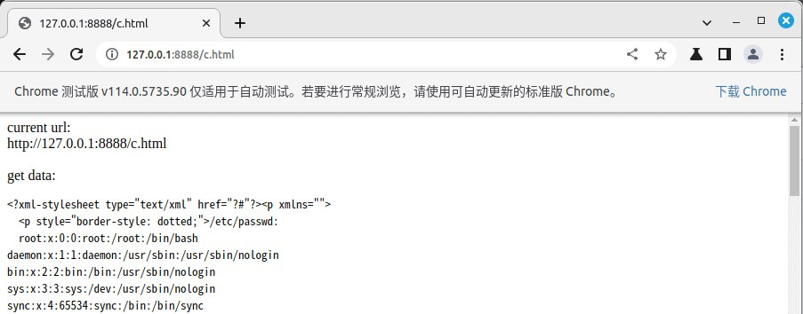
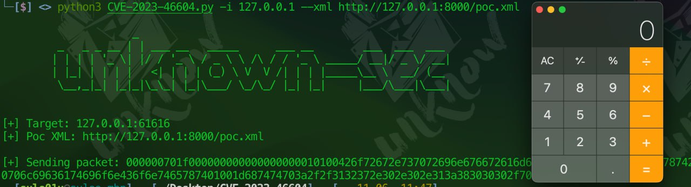
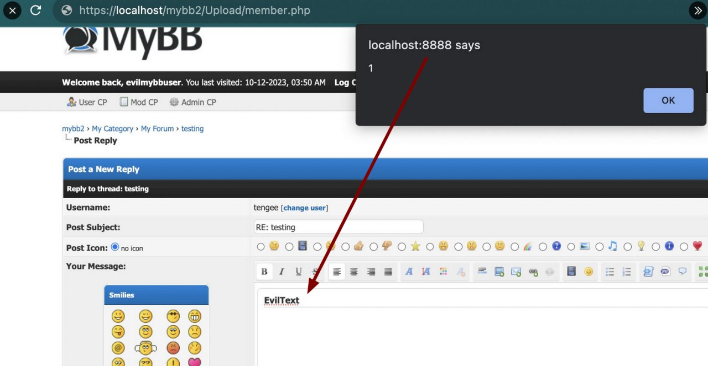
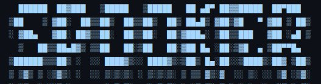
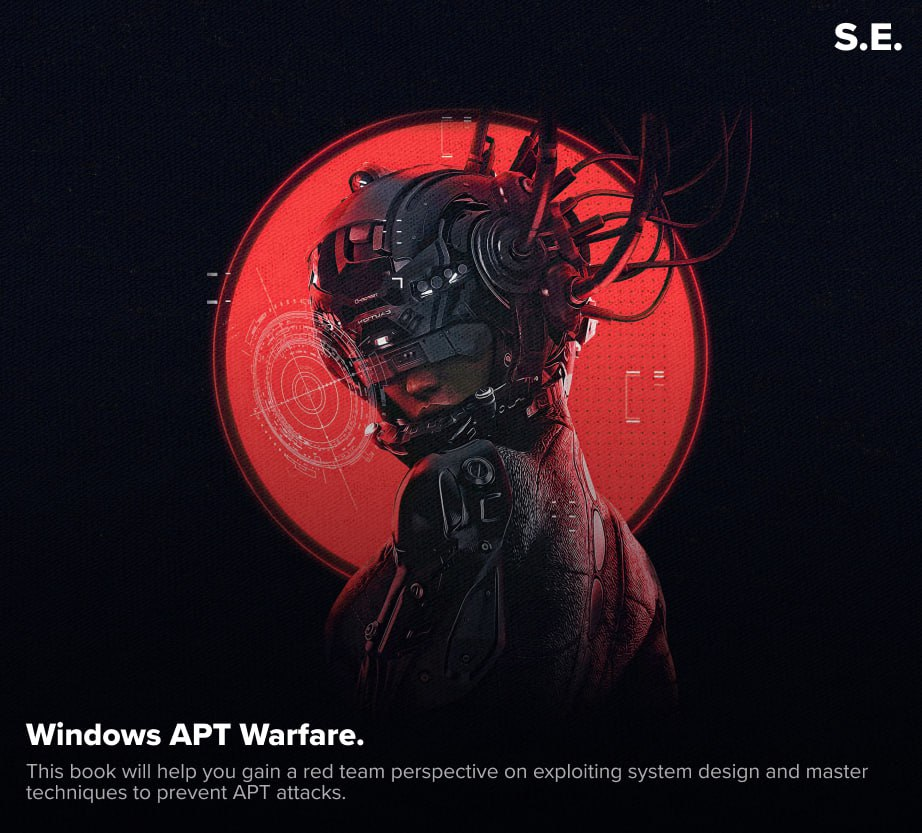
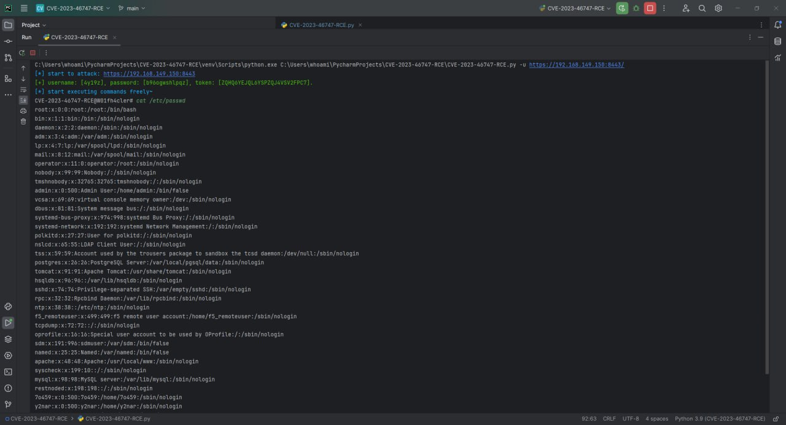

# it_secur
`2023-11-30`

<blockquote>
⚙ All in One. Hacking tools.

•  Hackingtool — это комплексный хакерский инструмент, который включает в себя все основные тулзы пентестеров и хакеров.

•  Репозиторий имеет 29.6K звёзд и постоянно обновляется. Включает в себя инструменты из следующих категорий:

 - Anonymously Hiding Tools;
 - Information gathering tools;
 - Wordlist Generator;
 - Wireless attack tools;
 - SQL Injection Tools;
 - Phishing attack tools;
 - Web Attack tools;
 - Post exploitation tools;
 - Forensic tools;
 - Payload creation tools;
 - Exploit framework;
 - Reverse engineering tools;
 - DDOS Attack Tools;
 - Remote Administrator Tools (RAT);
 - XSS Attack Tools;
 - Steganograhy tools;
 - SocialMedia Bruteforce;
 - Android Hacking tools;
 - IDN Homograph Attack;
 - Email Verify tools;
 - Hash cracking tools;
 - Wifi Deauthenticate;
 - SocialMedia Finder;
 - Payload Injector;
 - Web crawling;
 - Mix tools.

•  https://github.com/Z4nzu/hackingtool

&#35;ИБ
</blockquote>

---

# defcon_news
`2023-11-29`

<blockquote>
Update now! Chrome fixes actively exploited zero-day vulnerability
https://www.malwarebytes.com/blog/news/2023/11/update-now-chrome-fixes-actively-exploited-zero-day-vulnerability
</blockquote>

<table><tr><td><b>→</b><a href="https://www.malwarebytes.com/blog/news/2023/11/update-now-chrome-fixes-actively-exploited-zero-day-vulnerability">
https://www.malwarebytes.com/blog/news/2023/11/update-now-chrome-fixes-actively-exploited-zero-day-vulnerability
</a>
<blockquote>
Google's released an update to Chrome which includes seven security fixes. Make sure you're using the latest version!
</blockquote>
</td></tr></table>

---

# defcon_news
`2023-11-29`

<blockquote>
Google Patches Seventh Chrome Zero-Day Of 2023
https://packetstormsecurity.com/news/view/35242/Google-Patches-Seventh-Chrome-Zero-Day-Of-2023.html
</blockquote>

<table><tr><td><b>→</b><a href="https://packetstormsecurity.com/news/view/35242/Google-Patches-Seventh-Chrome-Zero-Day-Of-2023.html">
https://packetstormsecurity.com/news/view/35242/Google-Patches-Seventh-Chrome-Zero-Day-Of-2023.html
</a>
<blockquote>
The latest Chrome security update addresses the seventh exploited zero-day vulnerability documented in the browser in 2023.
</blockquote>
</td></tr></table>

---

# freedomf0x
`2023-11-29`

<blockquote>
Недавно решил пройти задачи, связанные с client-side на rootme.
Первым типом таких тасков выбрал XSS. Поэтому в этой статье кратко рассказал о разновидностях этой атаки и продемонстрировал решение Self XSS - DOM Secrets
</blockquote>

---

# sysadm_in_channel
`2023-11-28`

<blockquote>
/ Analysis of CVE-2023-46214 + PoC. Remote Code Execution (RCE) vulnerability in Splunk Enterprise

https://blog.hrncirik.net/cve-2023-46214-analysis
</blockquote>

<table><tr><td><b>→</b><a href="https://blog.hrncirik.net/cve-2023-46214-analysis">
https://blog.hrncirik.net/cve-2023-46214-analysis
</a>
<blockquote>
CVE-2023-46214 is a Remote Code Execution (RCE) vulnerability found in Splunk Enterprise which was disclosed on November 16, 2023 in the Splunk security advisory SVD-2023-1104. The description of the vulnerability essentially states that Splunk Enterprise versions below 9.0.7 and 9.1.2 are not safely sanitizing user supplied extensible stylesheet language transformations (XSLT).
</blockquote>
</td></tr></table>

---

# defcon_news
`2023-11-22`

<blockquote>
XXE, You Can Depend On Me (OpenCMS CVE-2023-42344 and Friends) - watchTowr Labs
https://www.reddit.com/r/netsec/comments/180wvw5/xxe_you_can_depend_on_me_opencms_cve202342344_and/
</blockquote>

<table><tr><td><b>→</b><a href="https://www.reddit.com/r/netsec/comments/180wvw5/xxe_you_can_depend_on_me_opencms_cve202342344_and/?utm_source=dlvr.it&utm_medium=twitter">
https://www.reddit.com/r/netsec/comments/180wvw5/xxe_you_can_depend_on_me_opencms_cve202342344_and/?utm_source=dlvr.it&utm_medium=twitter
</a>
<blockquote>
Explore this post and more from the netsec community
</blockquote>
</td></tr></table>

---

# cibsecurity
`2023-11-21`

<blockquote>
🕴 Exploit for Critical Windows Defender Bypass Goes Public 🕴

Threat actors were actively exploiting CVE-2023-36025 in Windows SmartScreen as a zero-day vulnerability before Microsoft patched it in November.

📖 Read

via &quot;Dark Reading&quot;.
</blockquote>

<table><tr><td><b>→</b><a href="https://www.darkreading.com/vulnerabilities-threats/exploit-critical-windows-defender-bypass-public">
https://www.darkreading.com/vulnerabilities-threats/exploit-critical-windows-defender-bypass-public
</a>
</td></tr></table>

---

# defcon_news
`2023-11-20`

<blockquote>
PHPJabbers Availability Booking Calendar 5.0 CSV Injection
https://packetstormsecurity.com/files/175804/phpjabbersabc50-csvinject.txt
</blockquote>

<table><tr><td><b>→</b><a href="https://packetstormsecurity.com/files/175804/phpjabbersabc50-csvinject.txt?utm_source=dlvr.it&utm_medium=twitter">
https://packetstormsecurity.com/files/175804/phpjabbersabc50-csvinject.txt?utm_source=dlvr.it&utm_medium=twitter
</a>
<blockquote>
Information Security Services, News, Files, Tools, Exploits, Advisories and Whitepapers
</blockquote>
</td></tr></table>

---

# defcon_news
`2023-11-20`

<blockquote>
CVE-2023-45878: Vulnerability in Gibbon Edu Leads to Unauthenticated RCE
https://www.reddit.com/r/netsec/comments/17zjtmj/cve202345878_vulnerability_in_gibbon_edu_leads_to/
</blockquote>

<table><tr><td><b>→</b><a href="https://www.reddit.com/r/netsec/comments/17zjtmj/cve202345878_vulnerability_in_gibbon_edu_leads_to/?utm_source=dlvr.it&utm_medium=twitter">
https://www.reddit.com/r/netsec/comments/17zjtmj/cve202345878_vulnerability_in_gibbon_edu_leads_to/?utm_source=dlvr.it&utm_medium=twitter
</a>
<blockquote>
Explore this post and more from the netsec community
</blockquote>
</td></tr></table>

---

# defcon_news
`2023-11-19`

<blockquote>
XXE уязвимости
https://codeby.net/threads/xxe-ujazvimosti.82591/
</blockquote>

<table><tr><td><b>→</b><a href="https://codeby.net/threads/xxe-ujazvimosti.82591/">
https://codeby.net/threads/xxe-ujazvimosti.82591/
</a>
<blockquote>
Привет уважаемые форумчане!

Перед тем, как мы начнем рассматривать очень интересную и сложную тему, мне бы хотелось сказать несколько слов. Меня можно поздравить, я перестал быть куратором курса...
</blockquote>
</td></tr></table>

---

# freedomf0x
`2023-11-19`

<blockquote>
&#35;LPE exploit for CVE-2023-2598
https://github.com/ysanatomic/io_uring_LPE-CVE-2023-2598
</blockquote>

---

# freedomf0x
`2023-11-19`

<blockquote>
&#35;CVE-2023-46214
Splunk RCE - PoC
https://github.com/nathan31337/Splunk-RCE-poc
</blockquote>

---

# RalfHackerChannel
`2023-11-19`

<blockquote>
CVE-2023-46214: Splunk RCE

https://github.com/nathan31337/Splunk-RCE-poc

&#35;git &#35;exploit &#35;pentest &#35;redteam
</blockquote>

<table><tr><td><b>→</b><a href="https://github.com/nathan31337/Splunk-RCE-poc">
https://github.com/nathan31337/Splunk-RCE-poc
</a>
<blockquote>
Contribute to nathan31337/Splunk-RCE-poc development by creating an account on GitHub.
</blockquote>
</td></tr></table>

---

# proxy_bar
`2023-11-19`

<blockquote>
CVE-2023-46214 - Splunk RCE
*
Proof of concept exploit

&#35;splunk
</blockquote>

---

# proxy_bar
`2023-11-18`

<blockquote>
CVE-2023-4357 Chrome XXE
*
POC
прикольно, осталось песочницу обойти 👌

&#35;chrome &#35;sandbox
</blockquote>

---

# defcon_news
`2023-11-17`

<blockquote>
U.S. Dept Of Defense: XSS in Cisco Endpoint
https://vulners.com/hackerone/H1:2233421?utm_source&#61;rss&amp;utm_medium&#61;rss&amp;utm_campaign&#61;rss
</blockquote>

<table><tr><td><b>→</b><a href="https://vulners.com/hackerone/H1:2233421?utm_source=rss&utm_medium=rss&utm_campaign=rss">
https://vulners.com/hackerone/H1:2233421?utm_source=rss&utm_medium=rss&utm_campaign=rss
</a>
<blockquote>
Description: Multiple vulnerabilities in the web services interface of Cisco Adaptive Security Appliance (ASA) Software and Cisco Firepower Threat Defense (FTD) Software could allow an unauthenticated, remote attacker to conduct cross-site...
</blockquote>
</td></tr></table>

---

# it_secur
`2023-11-16`

<blockquote>
🔝 OWASP API Security Top 10 2023.

•  API1:2023 - Broken Object Level Authorization;
•  API2:2023 - Broken Authentication;
•  API3:2023 - Broken Object Property Level Authorization;
•  API4:2023 - Unrestricted Resource Consumption;
•  API5:2023 - Broken Function Level Authorization;
•  API6:2023 - Unrestricted Access to Sensitive Business Flows;
•  API7:2023 - Server Side Request Forgery;
•  API8:2023 - Security Misconfiguration;
•  API9:2023 - Improper Inventory Management;
•  API10:2023 - Unsafe Consumption of APIs.

➡ https://blog.devsecopsguides.com

&#35;DevSecOps &#35;Security &#35;API
</blockquote>

---

# freedomf0x
`2023-11-15`

<blockquote>
CVE-2023-36427

&#35;LPE &#35;POC

https://github.com/tandasat/CVE-2023-36427&#35;cve-2023-36427
</blockquote>

---

# defcon_news
`2023-11-14`

<blockquote>
Apache ActiveMQ Unauthenticated Remote Code Execution
https://packetstormsecurity.com/files/175676/apache_activemq_rce_cve_2023_46604.rb.txt
</blockquote>

<table><tr><td><b>→</b><a href="https://packetstormsecurity.com/files/175676/apache_activemq_rce_cve_2023_46604.rb.txt?utm_source=dlvr.it&utm_medium=twitter">
https://packetstormsecurity.com/files/175676/apache_activemq_rce_cve_2023_46604.rb.txt?utm_source=dlvr.it&utm_medium=twitter
</a>
<blockquote>
Information Security Services, News, Files, Tools, Exploits, Advisories and Whitepapers
</blockquote>
</td></tr></table>

---

# defcon_news
`2023-11-14`

<blockquote>
Cisco IOX XE Unauthenticated Remote Code Execution
https://packetstormsecurity.com/files/175674/cisco_ios_xe_rce.rb.txt
</blockquote>

<table><tr><td><b>→</b><a href="https://packetstormsecurity.com/files/175674/cisco_ios_xe_rce.rb.txt?utm_source=dlvr.it&utm_medium=twitter">
https://packetstormsecurity.com/files/175674/cisco_ios_xe_rce.rb.txt?utm_source=dlvr.it&utm_medium=twitter
</a>
<blockquote>
Information Security Services, News, Files, Tools, Exploits, Advisories and Whitepapers
</blockquote>
</td></tr></table>

---

# defcon_news
`2023-11-14`

<blockquote>
WordPress Contact Form To Any API 1.1.2 SQL Injection
https://packetstormsecurity.com/files/175654/wpcftaa112-sql.txt
</blockquote>

<table><tr><td><b>→</b><a href="https://packetstormsecurity.com/files/175654/wpcftaa112-sql.txt">
https://packetstormsecurity.com/files/175654/wpcftaa112-sql.txt
</a>
<blockquote>
Information Security Services, News, Files, Tools, Exploits, Advisories and Whitepapers
</blockquote>
</td></tr></table>

---

# defcon_news
`2023-11-14`

<blockquote>
Penglead 2.0 SQL Injection
https://packetstormsecurity.com/files/175649/penglead20-sql.txt
</blockquote>

<table><tr><td><b>→</b><a href="https://packetstormsecurity.com/files/175649/penglead20-sql.txt">
https://packetstormsecurity.com/files/175649/penglead20-sql.txt
</a>
<blockquote>
Information Security Services, News, Files, Tools, Exploits, Advisories and Whitepapers
</blockquote>
</td></tr></table>

---

# defcon_news
`2023-11-13`

<blockquote>
Travel 1.0 SQL Injection
https://packetstormsecurity.com/files/175642/travel10-sql.txt
</blockquote>

<table><tr><td><b>→</b><a href="https://packetstormsecurity.com/files/175642/travel10-sql.txt?utm_source=dlvr.it&utm_medium=twitter">
https://packetstormsecurity.com/files/175642/travel10-sql.txt?utm_source=dlvr.it&utm_medium=twitter
</a>
<blockquote>
Information Security Services, News, Files, Tools, Exploits, Advisories and Whitepapers
</blockquote>
</td></tr></table>

---

# defcon_news
`2023-11-13`

<blockquote>
Elementor Website Builder SQL Injection
https://packetstormsecurity.com/files/175639/ewb3-sql.txt
</blockquote>

<table><tr><td><b>→</b><a href="https://packetstormsecurity.com/files/175639/ewb3-sql.txt?utm_source=dlvr.it&utm_medium=twitter">
https://packetstormsecurity.com/files/175639/ewb3-sql.txt?utm_source=dlvr.it&utm_medium=twitter
</a>
<blockquote>
Information Security Services, News, Files, Tools, Exploits, Advisories and Whitepapers
</blockquote>
</td></tr></table>

---

# cibsecurity
`2023-11-10`

<blockquote>
🦿 Microsoft and SysAid Find Clop Malware Vulnerability 🦿

SysAid has patched a zero-day vulnerability that could allow attackers to exfiltrate data and launch ransomware.

📖 Read

via &quot;Tech Republic&quot;.
</blockquote>

<table><tr><td><b>→</b><a href="https://www.techrepublic.com/article/sysaid-clop-malware-vulnerability-exploitation/">
https://www.techrepublic.com/article/sysaid-clop-malware-vulnerability-exploitation/
</a>
<blockquote>
SysAid has patched a zero-day vulnerability that could allow attackers to exfiltrate data and launch ransomware.
</blockquote>
</td></tr></table>

---

# sysadm_in_channel
`2023-11-09`

<blockquote>
Veeam ONE allows an unauthenticated user to gain information about the SQL server connection Veeam ONE uses to access its configuration database. 

This may lead to remote code execution on the SQL server hosting the Veeam ONE configuration database.

Ande next: CVE-2023-38548
A vulnerability in Veeam ONE allows an unprivileged user who has access to the Veeam ONE Web Client the ability to acquire the NTLM hash of the account used by the Veeam ONE Reporting Service..: 

https://www.veeam.com/kb4508
</blockquote>

<table><tr><td><b>→</b><a href="https://www.veeam.com/kb4508">
https://www.veeam.com/kb4508
</a>
<blockquote>
Security update regarding: CVE-2023-38547 | CVE-2023-38548 | CVE-2023-38549 | CVE-2023-41723
</blockquote>
</td></tr></table>

---

# proxy_bar
`2023-11-08`

<blockquote>
CVE-2023-46604 ActiveMQ RCE
exploit + xml

&#35;activemq
</blockquote>

---

# defcon_news
`2023-11-07`

<blockquote>
Session-Hijacking-Visual-Exploitation: Session Hijacking Visual Exploitation
https://www.reddit.com/r/netsec/comments/17pts1w/sessionhijackingvisualexploitation_session/
</blockquote>

<table><tr><td><b>→</b><a href="https://www.reddit.com/r/netsec/comments/17pts1w/sessionhijackingvisualexploitation_session/">
https://www.reddit.com/r/netsec/comments/17pts1w/sessionhijackingvisualexploitation_session/
</a>
<blockquote>
Explore this post and more from the netsec community
</blockquote>
</td></tr></table>

---

# defcon_news
`2023-11-07`

<blockquote>
Session Hijacking Visual Exploitation, New release with Office Documents Poisoning
https://www.reddit.com/r/netsec/comments/17prl4u/session_hijacking_visual_exploitation_new_release/
</blockquote>

<table><tr><td><b>→</b><a href="https://www.reddit.com/r/netsec/comments/17prl4u/session_hijacking_visual_exploitation_new_release/">
https://www.reddit.com/r/netsec/comments/17prl4u/session_hijacking_visual_exploitation_new_release/
</a>
<blockquote>
Posted by nibblesec - No votes and no comments
</blockquote>
</td></tr></table>

---

# cibsecurity
`2023-11-06`

<blockquote>
‼ CVE-2023-5771 ‼

Proofpoint Enterprise Protection contains a stored XSS vulnerability in the AdminUI. An unauthenticated attacker can send a specially crafted email with HTML in the subject which triggers XSS when viewing quarantined messages.  This issue affects Proofpoint Enterprise Protection: from 8.20.0 before patch 4796, from 8.18.6 before patch 4795 and all other prior versions.

📖 Read

via &quot;National Vulnerability Database&quot;.
</blockquote>

---

# cibsecurity
`2023-11-06`

<blockquote>
‼ CVE-2023-5082 ‼

The History Log by click5 WordPress plugin before 1.0.13 does not properly sanitise and escape a parameter before using it in a SQL statement, leading to a SQL injection exploitable by admin users when using the Smash Balloon Social Photo Feed plugin alongside it.

📖 Read

via &quot;National Vulnerability Database&quot;.
</blockquote>

---

# cibsecurity
`2023-11-06`

<blockquote>
‼ CVE-2023-5530 ‼

The Ninja Forms Contact Form WordPress plugin before 3.6.34 does not sanitize and escape its label fields, which could allow high privilege users such as admin to perform Stored XSS attacks. Only users with the unfiltered_html capability can perform this, and such users are already allowed to use JS in posts/comments etc however the vendor acknowledged and fixed the issue

📖 Read

via &quot;National Vulnerability Database&quot;.
</blockquote>

---

# cibsecurity
`2023-11-06`

<blockquote>
‼ CVE-2023-46251 ‼

MyBB is a free and open source forum software. Custom MyCode (BBCode) for the visual editor (_SCEditor_) doesn't escape input properly when rendering HTML, resulting in a DOM-based XSS vulnerability. This weakness can be exploited by pointing a victim to a page where the visual editor is active (e.g. as a post or Private Message) and operates on a maliciously crafted MyCode message. This may occur on pages where message content is pre-filled using a GET/POST parameter, or on reply pages where a previously saved malicious message is quoted. The impact is be mitigated when: 1. the visual editor is disabled globally (_Admin CP ? Configuration ? Settings ? Clickable Smilies and BB Code: [Clickable MyCode Editor](https://github.com/mybb/mybb/blob/mybb_1836/install/resources/settings.xml&#35;L2087-L2094)_ is set to _Off_), or 2. the visual editor is disabled for individual user accounts (_User CP ? Your Profile ? Edit Options_: _Show the MyCode formatting options on the posting pages_ checkbox is not checked). MyBB 1.8.37 resolves this issue with the commit `6dcaf0b4d`. Users are advised to upgrade. Users unable to upgrade may mitigate the impact without upgrading MyBB by changing the following setting (_Admin CP ? Configuration ? Settings_):- _Clickable Smilies and BB Code ? [Clickable MyCode Editor](https://github.com/mybb/mybb/blob/mybb_1836/install/resources/settings.xml&#35;L2087-L2094)_: _Off_. Similarly, individual MyBB forum users are able to disable the visual editor by diabling the account option (_User CP ? Your Profile ? Edit Options_) _Show the MyCode formatting options on the posting pages_.

📖 Read

via &quot;National Vulnerability Database&quot;.
</blockquote>

---

# proxy_bar
`2023-11-06`

<blockquote>
CVE-2023-46251 - Stored DOM XSS
MyBB &lt; 1.8.37
usage:
[size&#61;'1337px;\&quot;&gt;&gt;\&lt;img/src&#61;ccc/ onerror&#61;alert`1`//id&#61;name //&amp;pt;']eviltext[/size]

UPD: impact
</blockquote>

---

# cibsecurity
`2023-11-06`

<blockquote>
‼ CVE-2023-47185 ‼

Unauth. Stored Cross-Site Scripting (XSS) vulnerability in gVectors Team Comments — wpDiscuz plugin &lt;&#61; 7.6.11 versions.

📖 Read

via &quot;National Vulnerability Database&quot;.
</blockquote>

---

# freedomf0x
`2023-11-06`

<blockquote>
🔥 Bitrix24 Multiple Vulnerabilities

Multiple high-risk vulnerabilities found in Bitrix24 v22.0.300. These include Remote Command Execution, Cross-Site Scripting, Prototype Pollution, Insecure File Access, and Denial of Service.

🌐 Details and PoC's:

🔗 CVE-2023-1713 (RCE)
🔗 CVE-2023-1714 (RCE)
🔗 CVE-2023-1715 (XSS)
🔗 CVE-2023-1717 (XSS)
🔗 CVE-2023-1718 (DoS)
🔗 CVE-2023-1719 (IDOR)

&#35;bitrix24 &#35;rce &#35;xss &#35;dos &#35;idor
</blockquote>

<table><tr><td><b>→</b><a href="https://starlabs.sg/advisories/23/23-1713/">
https://starlabs.sg/advisories/23/23-1713/
</a>
<blockquote>
Summary    Product Bitrix24     Vendor Bitrix24   Severity High   Affected Versions Bitrix24 22.0.300 (latest version as of writing)   Tested Versions Bitrix24 22.0.300 (latest version as of writing)   CVE Identifier CVE-2023-1713   CVE Description Insecure temporary file creation in bitrix/modules/crm/lib/order/import/instagram.php in Bitrix24 22.0.300 hosted on Apache HTTP Server allows remote authenticated attackers to execute arbitrary code via uploading a crafted “.
</blockquote>
</td></tr></table>

---

# cibsecurity
`2023-11-06`

<blockquote>
‼ CVE-2023-47184 ‼

Auth. (admin+) Stored Cross-Site Scripting (XSS) vulnerability in Proper Fraction LLC. Admin Bar &amp; Dashboard Access Control plugin &lt;&#61; 1.2.8 versions.

📖 Read

via &quot;National Vulnerability Database&quot;.
</blockquote>

---

# cibsecurity
`2023-11-06`

<blockquote>
‼ CVE-2023-40609 ‼

Improper Neutralization of Special Elements used in an SQL Command ('SQL Injection') vulnerability in Aiyaz, maheshpatel Contact form 7 Custom validation allows SQL Injection.This issue affects Contact form 7 Custom validation: from n/a through 1.1.3.

📖 Read

via &quot;National Vulnerability Database&quot;.
</blockquote>

---

# cibsecurity
`2023-11-06`

<blockquote>
‼ CVE-2023-38382 ‼

Improper Neutralization of Special Elements used in an SQL Command ('SQL Injection') vulnerability in Daniel Söderström / Sidney van de Stouwe Subscribe to Category allows SQL Injection.This issue affects Subscribe to Category: from n/a through 2.7.4.

📖 Read

via &quot;National Vulnerability Database&quot;.
</blockquote>

---

# cibsecurity
`2023-11-06`

<blockquote>
‼ CVE-2022-46849 ‼

Improper Neutralization of Special Elements used in an SQL Command ('SQL Injection') vulnerability in Weblizar Coming Soon Page – Responsive Coming Soon &amp; Maintenance Mode allows SQL Injection.This issue affects Coming Soon Page – Responsive Coming Soon &amp; Maintenance Mode: from n/a through 1.5.9.

📖 Read

via &quot;National Vulnerability Database&quot;.
</blockquote>

---

# cibsecurity
`2023-11-06`

<blockquote>
‼ CVE-2023-4699 ‼

Insufficient Verification of Data Authenticity vulnerability in Mitsubishi Electric Corporation MELSEC-F Series main modules and MELSEC iQ-F Series CPU modules allows a remote unauthenticated attacker to reset the memory of the products to factory default state and cause denial-of-service (DoS) condition on the products by sending specific packets.

📖 Read

via &quot;National Vulnerability Database&quot;.
</blockquote>

---

# cibsecurity
`2023-11-06`

<blockquote>
‼ CVE-2023-45055 ‼

Improper Neutralization of Special Elements used in an SQL Command ('SQL Injection') vulnerability in InspireUI MStore API allows SQL Injection.This issue affects MStore API: from n/a through 4.0.6.

📖 Read

via &quot;National Vulnerability Database&quot;.
</blockquote>

---

# cibsecurity
`2023-11-06`

<blockquote>
‼ CVE-2022-47420 ‼

Improper Neutralization of Special Elements used in an SQL Command ('SQL Injection') vulnerability in Online ADA Accessibility Suite by Online ADA allows SQL Injection.This issue affects Accessibility Suite by Online ADA: from n/a through 4.11.

📖 Read

via &quot;National Vulnerability Database&quot;.
</blockquote>

---

# cibsecurity
`2023-11-06`

<blockquote>
‼ CVE-2022-47428 ‼

Improper Neutralization of Special Elements used in an SQL Command ('SQL Injection') vulnerability in WpDevArt Booking calendar, Appointment Booking System allows SQL Injection.This issue affects Booking calendar, Appointment Booking System: from n/a through 3.2.7.

📖 Read

via &quot;National Vulnerability Database&quot;.
</blockquote>

---

# cibsecurity
`2023-11-06`

<blockquote>
‼ CVE-2023-46823 ‼

Improper Neutralization of Special Elements used in an SQL Command ('SQL Injection') vulnerability in Avirtum ImageLinks Interactive Image Builder for WordPress allows SQL Injection.This issue affects ImageLinks Interactive Image Builder for WordPress: from n/a through 1.5.4.

📖 Read

via &quot;National Vulnerability Database&quot;.
</blockquote>

---

# cibsecurity
`2023-11-06`

<blockquote>
‼ CVE-2022-47432 ‼

Improper Neutralization of Special Elements used in an SQL Command ('SQL Injection') vulnerability in Kemal YAZICI - PluginPress Shortcode IMDB allows SQL Injection.This issue affects Shortcode IMDB: from n/a through 6.0.8.

📖 Read

via &quot;National Vulnerability Database&quot;.
</blockquote>

---

# cibsecurity
`2023-11-06`

<blockquote>
‼ CVE-2023-28748 ‼

Improper Neutralization of Special Elements used in an SQL Command ('SQL Injection') vulnerability in biztechc Copy or Move Comments allows SQL Injection.This issue affects Copy or Move Comments: from n/a through 5.0.4.

📖 Read

via &quot;National Vulnerability Database&quot;.
</blockquote>

---

# cibsecurity
`2023-11-06`

<blockquote>
‼ CVE-2023-45074 ‼

Improper Neutralization of Special Elements used in an SQL Command ('SQL Injection') vulnerability in Page Visit Counter Advanced Page Visit Counter – Most Wanted Analytics Plugin for WordPress allows SQL Injection.This issue affects Advanced Page Visit Counter – Most Wanted Analytics Plugin for WordPress: from n/a through 7.1.1.

📖 Read

via &quot;National Vulnerability Database&quot;.
</blockquote>

---

# cibsecurity
`2023-11-06`

<blockquote>
‼ CVE-2022-45373 ‼

Improper Neutralization of Special Elements used in an SQL Command ('SQL Injection') vulnerability in Jason Crouse, VeronaLabs Slimstat Analytics allows SQL Injection.This issue affects Slimstat Analytics: from n/a through 5.0.4.

📖 Read

via &quot;National Vulnerability Database&quot;.
</blockquote>

---

# cibsecurity
`2023-11-06`

<blockquote>
‼ CVE-2023-46782 ‼

Auth. (contributor+) Stored Cross-Site Scripting (XSS) vulnerability in Chris Yee MomentoPress for Momento360 plugin &lt;&#61; 1.0.1 versions.

📖 Read

via &quot;National Vulnerability Database&quot;.
</blockquote>

---

# cibsecurity
`2023-11-06`

<blockquote>
‼ CVE-2023-46783 ‼

Auth. (contributor+) Stored Cross-Site Scripting (XSS) vulnerability in Bright Plugins Pre-Orders for WooCommerce plugin &lt;&#61; 1.2.13 versions.

📖 Read

via &quot;National Vulnerability Database&quot;.
</blockquote>

---

# cibsecurity
`2023-11-06`

<blockquote>
‼ CVE-2023-45830 ‼

Improper Neutralization of Special Elements used in an SQL Command ('SQL Injection') vulnerability in Online ADA Accessibility Suite by Online ADA allows SQL Injection.This issue affects Accessibility Suite by Online ADA: from n/a through 4.11.

📖 Read

via &quot;National Vulnerability Database&quot;.
</blockquote>

---

# it_secur
`2023-11-06`

<blockquote>
Пара полезных каналов для тех, кто увлекается кибербезопасностью:

🏳️ Mr. Robot - реальные кейсы, OSINT, уроки по соц. инженерии и анонимности, обзоры инструментов с github.

🐥 Лаборатория Хакера — полезные github-инструменты для пентеста, сетевой разведки, xss, криптографии.
</blockquote>

---

# cibsecurity
`2023-11-06`

<blockquote>
‼ CVE-2023-46802 ‼

e-Tax software Version3.0.10 and earlier improperly restricts XML external entity references (XXE) due to the configuration of the embedded XML parser. By processing a specially crafted XML file, arbitrary files on the system may be read by an attacker.

📖 Read

via &quot;National Vulnerability Database&quot;.
</blockquote>

---

# cibsecurity
`2023-11-06`

<blockquote>
‼ CVE-2023-32825 ‼

In bluethooth service, there is a possible out of bounds reads due to improper input validation. This could lead to local information disclosure with no additional execution privileges needed. User interaction is not needed for exploitation. Patch ID: ALPS07884130; Issue ID: ALPS07884130.

📖 Read

via &quot;National Vulnerability Database&quot;.
</blockquote>

---

# cibsecurity
`2023-11-06`

<blockquote>
‼ CVE-2023-4625 ‼

Improper Restriction of Excessive Authentication Attempts vulnerability in Mitsubishi Electric Corporation MELSEC iQ-F Series CPU modules Web server function allows a remote unauthenticated attacker to prevent legitimate users from logging into the Web server function for a certain period after the attacker has attempted to log in illegally by continuously attempting unauthorized login to the Web server function. The impact of this vulnerability will persist while the attacker continues to attempt unauthorized login.

📖 Read

via &quot;National Vulnerability Database&quot;.
</blockquote>

---

# proxy_bar
`2023-11-05`

<blockquote>
Maltrail - Система обнаружения вредоносного трафика
RCE Exploit  (version Maltrail-0.53)
*
exploit.py
</blockquote>

---

# Social_engineering
`2023-11-05`

<blockquote>
📚 APT война с Виндой.

•  Появился перевод книги Windows APT Warfare от известного, в узких кругах, Yashechka. Перевод разделен на 2 части. Первая опубликована на habr, а вторая часть на форуме XSS.

•  Очень интересное чтиво для тех, кто занимается ассемблером, малварью и информационной безопасностью.

•  Ссылка на книгу (оригинал).
•  Ссылки на перевод: Часть 1 и часть 2.

•  P.S. Для прочтения второй части требуется регистрация на форуме XSS. Регистрация открыта и доступна каждому. Переходим по ссылке, регистрируемся, читаем и делимся с друзьями.

S.E. ▪️ infosec.work
</blockquote>

---

# cibsecurity
`2023-11-05`

<blockquote>
‼ CVE-2023-40922 ‼

kerawen before v2.5.1 was discovered to contain a SQL injection vulnerability via the ocs_id_cart parameter at KerawenDeliveryModuleFrontController::initContent().

📖 Read

via &quot;National Vulnerability Database&quot;.
</blockquote>

---

# cibsecurity
`2023-11-05`

<blockquote>
‼ CVE-2023-46381 ‼

LOYTEC LINX-212 firmware 6.2.4 and LVIS-3ME12-A1 firmware 6.2.2 and LIOB-586 firmware 6.2.3 devices lack authentication for the preinstalled version of LWEB-802 via an lweb802_pre/ URI. An unauthenticated attacker can edit any project (or create a new project) and control its GUI.

📖 Read

via &quot;National Vulnerability Database&quot;.
</blockquote>

---

# cibsecurity
`2023-11-04`

<blockquote>
‼ CVE-2023-35910 ‼

Improper Neutralization of Special Elements used in an SQL Command ('SQL Injection') vulnerability in Nucleus_genius Quasar form free – Contact Form Builder for WordPress allows SQL Injection.This issue affects Quasar form free – Contact Form Builder for WordPress: from n/a through 6.0.

📖 Read

via &quot;National Vulnerability Database&quot;.
</blockquote>

---

# cibsecurity
`2023-11-04`

<blockquote>
‼ CVE-2023-36677 ‼

Improper Neutralization of Special Elements used in an SQL Command ('SQL Injection') vulnerability in Smartypants SP Project &amp; Document Manager allows SQL Injection.This issue affects SP Project &amp; Document Manager: from n/a through 4.67.

📖 Read

via &quot;National Vulnerability Database&quot;.
</blockquote>

---

# cibsecurity
`2023-11-03`

<blockquote>
‼ CVE-2023-41725 ‼

Ivanti Avalanche EnterpriseServer Service Unrestricted File Upload Local Privilege Escalation Vulnerability

📖 Read

via &quot;National Vulnerability Database&quot;.
</blockquote>

---

# cibsecurity
`2023-11-03`

<blockquote>
‼ CVE-2022-47588 ‼

Improper Neutralization of Special Elements used in an SQL Command ('SQL Injection') vulnerability in Tips and Tricks HQ, Peter Petreski Simple Photo Gallery simple-photo-gallery allows SQL Injection.This issue affects Simple Photo Gallery: from n/a through v1.8.1.

📖 Read

via &quot;National Vulnerability Database&quot;.
</blockquote>

---

# cibsecurity
`2023-11-03`

<blockquote>
‼ CVE-2023-3961 ‼

A path traversal vulnerability was identified in Samba when processing client pipe names connecting to Unix domain sockets within a private directory. Samba typically uses this mechanism to connect SMB clients to remote procedure call (RPC) services like SAMR LSA or SPOOLSS, which Samba initiates on demand. However, due to inadequate sanitization of incoming client pipe names, allowing a client to send a pipe name containing Unix directory traversal characters (../). This could result in SMB clients connecting as root to Unix domain sockets outside the private directory. If an attacker or client managed to send a pipe name resolving to an external service using an existing Unix domain socket, it could potentially lead to unauthorized access to the service and consequential adverse events, including compromise or service crashes.

📖 Read

via &quot;National Vulnerability Database&quot;.
</blockquote>

---

# cibsecurity
`2023-11-07`

<blockquote>
‼ CVE-2022-45805 ‼

Improper Neutralization of Special Elements used in an SQL Command ('SQL Injection') vulnerability in Paytm Paytm Payment Gateway paytm-payments allows SQL Injection.This issue affects Paytm Payment Gateway: from n/a through 2.7.3.

📖 Read

via &quot;National Vulnerability Database&quot;.
</blockquote>

---

# cibsecurity
`2023-11-03`

<blockquote>
‼ CVE-2022-47426 ‼

Improper Neutralization of Special Elements used in an SQL Command ('SQL Injection') vulnerability in Neshan Maps Platform Neshan Maps neshan-maps allows SQL Injection.This issue affects Neshan Maps: from n/a through 1.1.4.

📖 Read

via &quot;National Vulnerability Database&quot;.
</blockquote>

---

# cibsecurity
`2023-11-03`

<blockquote>
‼ CVE-2023-26015 ‼

Improper Neutralization of Special Elements used in an SQL Command ('SQL Injection') vulnerability in Chris Richardson MapPress Maps for WordPress mappress-google-maps-for-wordpress allows SQL Injection.This issue affects MapPress Maps for WordPress: from n/a through 2.85.4.

📖 Read

via &quot;National Vulnerability Database&quot;.
</blockquote>

---

# cibsecurity
`2023-11-03`

<blockquote>
‼ CVE-2023-41652 ‼

Improper Neutralization of Special Elements used in an SQL Command ('SQL Injection') vulnerability in David F. Carr RSVPMaker rsvpmaker allows SQL Injection.This issue affects RSVPMaker: from n/a through 10.6.6.

📖 Read

via &quot;National Vulnerability Database&quot;.
</blockquote>

---

# cibsecurity
`2023-11-03`

<blockquote>
‼ CVE-2023-34383 ‼

Improper Neutralization of Special Elements used in an SQL Command ('SQL Injection') vulnerability in weDevs WP Project Manager wedevs-project-manager allows SQL Injection.This issue affects WP Project Manager: from n/a through 2.6.0.

📖 Read

via &quot;National Vulnerability Database&quot;.
</blockquote>

---

# cibsecurity
`2023-11-03`

<blockquote>
‼ CVE-2022-46859 ‼

Improper Neutralization of Special Elements used in an SQL Command ('SQL Injection') vulnerability in Spiffy Plugins Spiffy Calendar spiffy-calendar allows SQL Injection.This issue affects Spiffy Calendar: from n/a through 4.9.1.

📖 Read

via &quot;National Vulnerability Database&quot;.
</blockquote>

---

# cibsecurity
`2023-11-03`

<blockquote>
‼ CVE-2023-25960 ‼

Improper Neutralization of Special Elements used in an SQL Command ('SQL Injection') vulnerability in Zendrop Zendrop – Global Dropshipping zendrop-dropshipping-and-fulfillment allows SQL Injection.This issue affects Zendrop – Global Dropshipping: from n/a through 1.0.0.

📖 Read

via &quot;National Vulnerability Database&quot;.
</blockquote>

---

# cibsecurity
`2023-11-03`

<blockquote>
‼ CVE-2022-46808 ‼

Improper Neutralization of Special Elements used in an SQL Command ('SQL Injection') vulnerability in Repute Infosystems ARMember armember-membership allows SQL Injection.This issue affects ARMember: from n/a through 3.4.11.

📖 Read

via &quot;National Vulnerability Database&quot;.
</blockquote>

---

# cibsecurity
`2023-11-03`

<blockquote>
‼ CVE-2023-4592 ‼

A Cross-Site Scripting vulnerability has been detected in WPN-XM Serverstack affecting version 0.8.6. This vulnerability could allow a remote attacker to send a specially crafted JavaScript payload through the /tools/webinterface/index.php parameter and retrieve the cookie session details of an authenticated user, resulting in a session hijacking.

📖 Read

via &quot;National Vulnerability Database&quot;.
</blockquote>

---

# cibsecurity
`2023-11-03`

<blockquote>
‼ CVE-2022-47445 ‼

Improper Neutralization of Special Elements used in an SQL Command ('SQL Injection') vulnerability in Web-X Be POPIA Compliant be-popia-compliant allows SQL Injection.This issue affects Be POPIA Compliant: from n/a through 1.2.0.

📖 Read

via &quot;National Vulnerability Database&quot;.
</blockquote>

---

# cibsecurity
`2023-11-03`

<blockquote>
‼ CVE-2023-4591 ‼

A local file inclusion vulnerability has been found in WPN-XM Serverstack affecting version 0.8.6, which would allow an unauthenticated user to perform a local file inclusion (LFI) via the /tools/webinterface/index.php?page parameter by sending a GET request. This vulnerability could lead to the loading of a PHP file on the server, leading to a critical webshell exploit.

📖 Read

via &quot;National Vulnerability Database&quot;.
</blockquote>

---

# cibsecurity
`2023-11-03`

<blockquote>
‼ CVE-2023-4769 ‼

A SSRF vulnerability has been found in ManageEngine Desktop Central affecting version 9.1.0, specifically the /smtpConfig.do component. This vulnerability could allow an authenticated attacker to launch targeted attacks, such as a cross-port attack, service enumeration and other attacks via HTTP requests.

📖 Read

via &quot;National Vulnerability Database&quot;.
</blockquote>

---

# cibsecurity
`2023-11-03`

<blockquote>
‼ CVE-2023-36022 ‼

Microsoft Edge (Chromium-based) Remote Code Execution Vulnerability

📖 Read

via &quot;National Vulnerability Database&quot;.
</blockquote>

---

# cibsecurity
`2023-11-03`

<blockquote>
‼ CVE-2023-46954 ‼

SQL Injection vulnerability in Relativity ODA LLC RelativityOne v.12.1.537.3 Patch 2 and earlier allows a remote attacker to execute arbitrary code via the name parameter.

📖 Read

via &quot;National Vulnerability Database&quot;.
</blockquote>

---

# cibsecurity
`2023-11-03`

<blockquote>
‼ CVE-2023-35896 ‼

IBM Content Navigator 3.0.13 is vulnerable to server-side request forgery (SSRF). This may allow an authenticated attacker to send unauthorized requests from the system, potentially leading to network enumeration or facilitating other attacks. IBM X-Force ID: 259247.

📖 Read

via &quot;National Vulnerability Database&quot;.
</blockquote>

---

# cibsecurity
`2023-11-03`

<blockquote>
‼ CVE-2023-36034 ‼

Microsoft Edge (Chromium-based) Remote Code Execution Vulnerability

📖 Read

via &quot;National Vulnerability Database&quot;.
</blockquote>

---

# cibsecurity
`2023-11-03`

<blockquote>
‼ CVE-2023-36029 ‼

Microsoft Edge (Chromium-based) Spoofing Vulnerability

📖 Read

via &quot;National Vulnerability Database&quot;.
</blockquote>

---

# cibsecurity
`2023-11-02`

<blockquote>
‼ CVE-2023-5929 ‼

A vulnerability was found in Campcodes Simple Student Information System 1.0. It has been classified as critical. This affects an unknown part of the file /admin/students/manage_academic.php. The manipulation of the argument id leads to sql injection. The exploit has been disclosed to the public and may be used. The identifier VDB-244329 was assigned to this vulnerability.

📖 Read

via &quot;National Vulnerability Database&quot;.
</blockquote>

---

# cibsecurity
`2023-11-02`

<blockquote>
‼ CVE-2023-5927 ‼

A vulnerability has been found in Campcodes Simple Student Information System 1.0 and classified as critical. Affected by this vulnerability is an unknown functionality of the file /admin/courses/manage_course.php. The manipulation of the argument id leads to sql injection. The exploit has been disclosed to the public and may be used. The associated identifier of this vulnerability is VDB-244327.

📖 Read

via &quot;National Vulnerability Database&quot;.
</blockquote>

---

# cibsecurity
`2023-11-02`

<blockquote>
‼ CVE-2023-5928 ‼

A vulnerability was found in Campcodes Simple Student Information System 1.0 and classified as critical. Affected by this issue is some unknown functionality of the file /admin/departments/manage_department.php. The manipulation of the argument id leads to sql injection. The exploit has been disclosed to the public and may be used. The identifier of this vulnerability is VDB-244328.

📖 Read

via &quot;National Vulnerability Database&quot;.
</blockquote>

---

# cibsecurity
`2023-11-02`

<blockquote>
‼ CVE-2023-5926 ‼

A vulnerability, which was classified as critical, was found in Campcodes Simple Student Information System 1.0. Affected is an unknown function of the file /admin/students/update_status.php. The manipulation of the argument student_id leads to sql injection. The exploit has been disclosed to the public and may be used. VDB-244326 is the identifier assigned to this vulnerability.

📖 Read

via &quot;National Vulnerability Database&quot;.
</blockquote>

---

# cibsecurity
`2023-11-02`

<blockquote>
‼ CVE-2023-5925 ‼

A vulnerability, which was classified as critical, has been found in Campcodes Simple Student Information System 1.0. This issue affects some unknown processing of the file /classes/Master.php. The manipulation of the argument f leads to sql injection. The exploit has been disclosed to the public and may be used. The identifier VDB-244325 was assigned to this vulnerability.

📖 Read

via &quot;National Vulnerability Database&quot;.
</blockquote>

---

# cibsecurity
`2023-11-02`

<blockquote>
‼ CVE-2023-5923 ‼

A vulnerability classified as critical has been found in Campcodes Simple Student Information System 1.0. This affects an unknown part of the file /admin/index.php. The manipulation of the argument id leads to sql injection. The exploit has been disclosed to the public and may be used. The associated identifier of this vulnerability is VDB-244323.

📖 Read

via &quot;National Vulnerability Database&quot;.
</blockquote>

---

# cibsecurity
`2023-11-02`

<blockquote>
‼ CVE-2023-5924 ‼

A vulnerability classified as critical was found in Campcodes Simple Student Information System 1.0. This vulnerability affects unknown code of the file /admin/courses/view_course.php. The manipulation of the argument id leads to sql injection. The exploit has been disclosed to the public and may be used. The identifier of this vulnerability is VDB-244324.

📖 Read

via &quot;National Vulnerability Database&quot;.
</blockquote>

---

# cibsecurity
`2023-11-02`

<blockquote>
‼ CVE-2023-46925 ‼

Reportico 7.1.21 is vulnerable to Cross Site Scripting (XSS).

📖 Read

via &quot;National Vulnerability Database&quot;.
</blockquote>

---

# cibsecurity
`2023-11-02`

<blockquote>
‼ CVE-2023-45333 ‼

Online Food Ordering System v1.0 is vulnerable to multiple Unauthenticated SQL Injection vulnerabilities. The 'verified' parameter of the routers/add-users.php resource does not validate the characters received and they are sent unfiltered to the database.

📖 Read

via &quot;National Vulnerability Database&quot;.
</blockquote>

---

# cibsecurity
`2023-11-02`

<blockquote>
‼ CVE-2023-45331 ‼

Online Food Ordering System v1.0 is vulnerable to multiple Unauthenticated SQL Injection vulnerabilities. The 'contact' parameter of the routers/add-users.php resource does not validate the characters received and they are sent unfiltered to the database.

📖 Read

via &quot;National Vulnerability Database&quot;.
</blockquote>

---

# cibsecurity
`2023-11-02`

<blockquote>
‼ CVE-2023-46725 ‼

FoodCoopShop is open source software for food coops and local shops. Versions prior to 3.6.1 are vulnerable to server-side request forgery. In the Network module, a manufacturer account can use the `/api/updateProducts.json` endpoint to make the server send a request to an arbitrary host. This means that the server can be used as a proxy into the internal network where the server is. Furthermore, the checks on a valid image are not adequate, leading to a time of check time of use issue. For example, by using a custom server that returns 200 on HEAD requests, then return a valid image on first GET request and then a 302 redirect to final target on second GET request, the server will copy whatever file is at the redirect destination, making this a full SSRF. Version 3.6.1 fixes this vulnerability.

📖 Read

via &quot;National Vulnerability Database&quot;.
</blockquote>

---

# cibsecurity
`2023-11-02`

<blockquote>
‼ CVE-2023-45344 ‼

Online Food Ordering System v1.0 is vulnerable to multiple Unauthenticated SQL Injection vulnerabilities. The '*_balance' parameter of the routers/user-router.php resource does not validate the characters received and they are sent unfiltered to the database.

📖 Read

via &quot;National Vulnerability Database&quot;.
</blockquote>

---

# cibsecurity
`2023-11-02`

<blockquote>
‼ CVE-2023-45323 ‼

Online Food Ordering System v1.0 is vulnerable to multiple Unauthenticated SQL Injection vulnerabilities. The 'name' parameter of the routers/add-item.php resource does not validate the characters received and they are sent unfiltered to the database.

📖 Read

via &quot;National Vulnerability Database&quot;.
</blockquote>

---

# cibsecurity
`2023-11-02`

<blockquote>
‼ CVE-2023-45329 ‼

Online Food Ordering System v1.0 is vulnerable to multiple Unauthenticated SQL Injection vulnerabilities. The 'role' parameter of the routers/add-users.php resource does not validate the characters received and they are sent unfiltered to the database.

📖 Read

via &quot;National Vulnerability Database&quot;.
</blockquote>

---

# cibsecurity
`2023-11-02`

<blockquote>
‼ CVE-2023-45326 ‼

Online Food Ordering System v1.0 is vulnerable to multiple Unauthenticated SQL Injection vulnerabilities. The 'email' parameter of the routers/add-users.php resource does not validate the characters received and they are sent unfiltered to the database.

📖 Read

via &quot;National Vulnerability Database&quot;.
</blockquote>

---

# cibsecurity
`2023-11-02`

<blockquote>
‼ CVE-2023-45328 ‼

Online Food Ordering System v1.0 is vulnerable to multiple Unauthenticated SQL Injection vulnerabilities. The 'password' parameter of the routers/add-users.php resource does not validate the characters received and they are sent unfiltered to the database.

📖 Read

via &quot;National Vulnerability Database&quot;.
</blockquote>

---

# cibsecurity
`2023-11-02`

<blockquote>
‼ CVE-2023-45337 ‼

Online Food Ordering System v1.0 is vulnerable to multiple Unauthenticated SQL Injection vulnerabilities. The 'username' parameter of the routers/router.php resource does not validate the characters received and they are sent unfiltered to the database.

📖 Read

via &quot;National Vulnerability Database&quot;.
</blockquote>

---

# cibsecurity
`2023-11-02`

<blockquote>
‼ CVE-2023-45340 ‼

Online Food Ordering System v1.0 is vulnerable to multiple Unauthenticated SQL Injection vulnerabilities. The 'phone' parameter of the routers/details-router.php resource does not validate the characters received and they are sent unfiltered to the database.

📖 Read

via &quot;National Vulnerability Database&quot;.
</blockquote>

---

# cibsecurity
`2023-11-02`

<blockquote>
‼ CVE-2023-45334 ‼

Online Food Ordering System v1.0 is vulnerable to multiple Unauthenticated SQL Injection vulnerabilities. The 'status' parameter of the routers/edit-orders.php resource does not validate the characters received and they are sent unfiltered to the database.

📖 Read

via &quot;National Vulnerability Database&quot;.
</blockquote>

---

# cibsecurity
`2023-11-02`

<blockquote>
‼ CVE-2023-45332 ‼

Online Food Ordering System v1.0 is vulnerable to multiple Unauthenticated SQL Injection vulnerabilities. The 'deleted' parameter of the routers/add-users.php resource does not validate the characters received and they are sent unfiltered to the database.

📖 Read

via &quot;National Vulnerability Database&quot;.
</blockquote>

---

# cibsecurity
`2023-11-02`

<blockquote>
‼ CVE-2023-45339 ‼

Online Food Ordering System v1.0 is vulnerable to multiple Unauthenticated SQL Injection vulnerabilities. The 'type' parameter of the routers/add-ticket.php resource does not validate the characters received and they are sent unfiltered to the database.

📖 Read

via &quot;National Vulnerability Database&quot;.
</blockquote>

---

# cibsecurity
`2023-11-02`

<blockquote>
‼ CVE-2023-45342 ‼

Online Food Ordering System v1.0 is vulnerable to multiple Unauthenticated SQL Injection vulnerabilities. The 'phone' parameter of the routers/register-router.php resource does not validate the characters received and they are sent unfiltered to the database.

📖 Read

via &quot;National Vulnerability Database&quot;.
</blockquote>

---

# cibsecurity
`2023-11-02`

<blockquote>
‼ CVE-2023-45346 ‼

Online Food Ordering System v1.0 is vulnerable to multiple Unauthenticated SQL Injection vulnerabilities. The '*_role' parameter of the routers/user-router.php resource does not validate the characters received and they are sent unfiltered to the database.

📖 Read

via &quot;National Vulnerability Database&quot;.
</blockquote>

---

# cibsecurity
`2023-11-02`

<blockquote>
‼ CVE-2023-45345 ‼

Online Food Ordering System v1.0 is vulnerable to multiple Unauthenticated SQL Injection vulnerabilities. The '*_deleted' parameter of the routers/user-router.php resource does not validate the characters received and they are sent unfiltered to the database.

📖 Read

via &quot;National Vulnerability Database&quot;.
</blockquote>

---

# cibsecurity
`2023-11-02`

<blockquote>
‼ CVE-2023-45336 ‼

Online Food Ordering System v1.0 is vulnerable to multiple Unauthenticated SQL Injection vulnerabilities. The 'password' parameter of the routers/router.php resource does not validate the characters received and they are sent unfiltered to the database.

📖 Read

via &quot;National Vulnerability Database&quot;.
</blockquote>

---

# cibsecurity
`2023-11-02`

<blockquote>
‼ CVE-2023-43193 ‼

Submitty before v22.06.00 is vulnerable to Cross Site Scripting (XSS). An attacker can create a malicious link in the forum that leads to XSS.

📖 Read

via &quot;National Vulnerability Database&quot;.
</blockquote>

---

# cibsecurity
`2023-11-02`

<blockquote>
‼ CVE-2023-5918 ‼

A vulnerability, which was classified as critical, was found in SourceCodester Visitor Management System 1.0. Affected is an unknown function of the file manage_user.php. The manipulation of the argument id leads to sql injection. It is possible to launch the attack remotely. The identifier of this vulnerability is VDB-244308.

📖 Read

via &quot;National Vulnerability Database&quot;.
</blockquote>

---

# proxy_bar
`2023-11-02`

<blockquote>
exploit for cve-2023-46747 
F5 BIG-IP unauthenticated remote code execution 
*
exploit
</blockquote>

---

# cibsecurity
`2023-11-02`

<blockquote>
‼ CVE-2023-45113 ‼

Online Examination System v1.0 is vulnerable to multiple Unauthenticated SQL Injection vulnerabilities. The 'name' parameter of the feed.php resource does not validate the characters received and they are sent unfiltered to the database.

📖 Read

via &quot;National Vulnerability Database&quot;.
</blockquote>

---

# cibsecurity
`2023-11-02`

<blockquote>
‼ CVE-2023-45017 ‼

Online Bus Booking System v1.0 is vulnerable to multiple Unauthenticated SQL Injection vulnerabilities. The 'destination' parameter of the search.php resource does not validate the characters received and they are sent unfiltered to the database.

📖 Read

via &quot;National Vulnerability Database&quot;.
</blockquote>

---

# cibsecurity
`2023-11-02`

<blockquote>
‼ CVE-2023-45111 ‼

Online Examination System v1.0 is vulnerable to multiple Unauthenticated SQL Injection vulnerabilities. The 'email' parameter of the feed.php resource does not validate the characters received and they are sent unfiltered to the database.

📖 Read

via &quot;National Vulnerability Database&quot;.
</blockquote>

---

# cibsecurity
`2023-11-02`

<blockquote>
‼ CVE-2023-45015 ‼

Online Bus Booking System v1.0 is vulnerable to multiple Unauthenticated SQL Injection vulnerabilities. The 'date' parameter of the bus_info.php resource does not validate the characters received and they are sent unfiltered to the database.

📖 Read

via &quot;National Vulnerability Database&quot;.
</blockquote>

---

# cibsecurity
`2023-11-02`

<blockquote>
‼ CVE-2023-45112 ‼

Online Examination System v1.0 is vulnerable to multiple Unauthenticated SQL Injection vulnerabilities. The 'feedback' parameter of the feed.php resource does not validate the characters received and they are sent unfiltered to the database.

📖 Read

via &quot;National Vulnerability Database&quot;.
</blockquote>

---

# cibsecurity
`2023-11-02`

<blockquote>
‼ CVE-2023-45018 ‼

Online Bus Booking System v1.0 is vulnerable to multiple Unauthenticated SQL Injection vulnerabilities. The 'username' parameter of the includes/login.php resource does not validate the characters received and they are sent unfiltered to the database.

📖 Read

via &quot;National Vulnerability Database&quot;.
</blockquote>

---

# cibsecurity
`2023-11-02`

<blockquote>
‼ CVE-2023-45014 ‼

Online Bus Booking System v1.0 is vulnerable to multiple Unauthenticated SQL Injection vulnerabilities. The 'bus_id' parameter of the bus_info.php resource does not validate the characters received and they are sent unfiltered to the database.

📖 Read

via &quot;National Vulnerability Database&quot;.
</blockquote>

---

# cibsecurity
`2023-11-02`

<blockquote>
‼ CVE-2023-45013 ‼

Online Bus Booking System v1.0 is vulnerable to multiple Unauthenticated SQL Injection vulnerabilities. The 'user_query' parameter of the bus_info.php resource does not validate the characters received and they are sent unfiltered to the database.

📖 Read

via &quot;National Vulnerability Database&quot;.
</blockquote>

---

# cibsecurity
`2023-11-02`

<blockquote>
‼ CVE-2023-45114 ‼

Online Examination System v1.0 is vulnerable to multiple Unauthenticated SQL Injection vulnerabilities. The 'subject' parameter of the feed.php resource does not validate the characters received and they are sent unfiltered to the database.

📖 Read

via &quot;National Vulnerability Database&quot;.
</blockquote>

---

# cibsecurity
`2023-11-02`

<blockquote>
‼ CVE-2023-45012 ‼

Online Bus Booking System v1.0 is vulnerable to multiple Unauthenticated SQL Injection vulnerabilities. The 'user_email' parameter of the bus_info.php resource does not validate the characters received and they are sent unfiltered to the database.

📖 Read

via &quot;National Vulnerability Database&quot;.
</blockquote>

---

# cibsecurity
`2023-11-02`

<blockquote>
‼ CVE-2023-45016 ‼

Online Bus Booking System v1.0 is vulnerable to multiple Unauthenticated SQL Injection vulnerabilities. The 'source' parameter of the search.php resource does not validate the characters received and they are sent unfiltered to the database.

📖 Read

via &quot;National Vulnerability Database&quot;.
</blockquote>

---

# cibsecurity
`2023-11-02`

<blockquote>
‼ CVE-2023-45019 ‼

Online Bus Booking System v1.0 is vulnerable to multiple Unauthenticated SQL Injection vulnerabilities. The 'category' parameter of the category.php resource does not validate the characters received and they are sent unfiltered to the database.

📖 Read

via &quot;National Vulnerability Database&quot;.
</blockquote>

---

# cibsecurity
`2023-11-02`

<blockquote>
‼ CVE-2023-44025 ‼

SQL injection vulnerability in addify Addifyfreegifts v.1.0.2 and before allows a remote attacker to execute arbitrary code via a crafted script to the getrulebyid function in the AddifyfreegiftsModel.php component.

📖 Read

via &quot;National Vulnerability Database&quot;.
</blockquote>

---

# cibsecurity
`2023-11-02`

<blockquote>
‼ CVE-2023-46448 ‼

Reflected Cross-Site Scripting (XSS) vulnerability in dmpop Mejiro Commit Versions Prior To 3096393 allows attackers to run arbitrary code via crafted string in metadata of uploaded images.

📖 Read

via &quot;National Vulnerability Database&quot;.
</blockquote>

---

# cibsecurity
`2023-11-01`

<blockquote>
‼ CVE-2023-5480 ‼

Inappropriate implementation in Payments in Google Chrome prior to 119.0.6045.105 allowed a remote attacker to bypass XSS preventions via a malicious file. (Chromium security severity: High)

📖 Read

via &quot;National Vulnerability Database&quot;.
</blockquote>

---

# cibsecurity
`2023-11-01`

<blockquote>
‼ CVE-2023-5766 ‼

A remote code execution vulnerability in Remote Desktop Manager 2023.2.33 and earlier on Windows allows an attacker to remotely execute code from another windows user session on the same host via a specially crafted TCP packet.

📖 Read

via &quot;National Vulnerability Database&quot;.
</blockquote>

---

# cibsecurity
`2023-11-01`

<blockquote>
‼ CVE-2023-40062 ‼

SolarWinds Platform Incomplete List of Disallowed Inputs Remote Code Execution Vulnerability. If executed, this vulnerability would allow a low-privileged user to execute commands with SYSTEM privileges.

📖 Read

via &quot;National Vulnerability Database&quot;.
</blockquote>

---

# cibsecurity
`2023-11-01`

<blockquote>
‼ CVE-2023-20005 ‼

Multiple vulnerabilities in the web-based management interface of Cisco Firepower Management Center (FMC) Software could allow an unauthenticated, remote attacker to conduct a stored cross-site scripting (XSS) attack against a user of the interface of an affected device. These vulnerabilities are due to insufficient validation of user-supplied input by the web-based management interface. An attacker could exploit these vulnerabilities by inserting crafted input into various data fields in an affected interface. A successful exploit could allow the attacker to execute arbitrary script code in the context of the interface, or access sensitive, browser-based information. In some cases, it is also possible to cause a temporary availability impact to portions of the FMC Dashboard.

📖 Read

via &quot;National Vulnerability Database&quot;.
</blockquote>

---

# cibsecurity
`2023-11-01`

<blockquote>
‼ CVE-2023-5178 ‼

A use-after-free vulnerability was found in drivers/nvme/target/tcp.c` in `nvmet_tcp_free_crypto` due to a logical bug in the NVMe-oF/TCP subsystem in the Linux kernel. This issue may allow a malicious user to cause a use-after-free and double-free problem, which may permit remote code execution or lead to local privilege escalation in case that the attacker already has local privileges.

📖 Read

via &quot;National Vulnerability Database&quot;.
</blockquote>

---

# cibsecurity
`2023-11-01`

<blockquote>
‼ CVE-2023-33226 ‼

The Network Configuration Manager was susceptible to a Directory Traversal Remote Code Execution Vulnerability. This vulnerability allows a low-level user to perform the actions with SYSTEM privileges.

📖 Read

via &quot;National Vulnerability Database&quot;.
</blockquote>

---

# cibsecurity
`2023-11-01`

<blockquote>
‼ CVE-2023-33227 ‼

The Network Configuration Manager was susceptible to a Directory Traversal Remote Code Execution Vulnerability This vulnerability allows a low level user to perform the actions with SYSTEM privileges.

📖 Read

via &quot;National Vulnerability Database&quot;.
</blockquote>

---

# cibsecurity
`2023-11-01`

<blockquote>
‼ CVE-2023-46911 ‼

There is a Cross Site Scripting (XSS) vulnerability in the choose_style_tree.do interface of Jspxcms v10.2.0 backend.

📖 Read

via &quot;National Vulnerability Database&quot;.
</blockquote>

---

# cibsecurity
`2023-11-01`

<blockquote>
‼ CVE-2023-20206 ‼

Multiple vulnerabilities in the web-based management interface of Cisco Firepower Management Center (FMC) Software could allow an unauthenticated, remote attacker to conduct a stored cross-site scripting (XSS) attack against a user of the interface of an affected device. These vulnerabilities are due to insufficient validation of user-supplied input by the web-based management interface. An attacker could exploit these vulnerabilities by inserting crafted input into various data fields in an affected interface. A successful exploit could allow the attacker to execute arbitrary script code in the context of the interface, or access sensitive, browser-based information. In some cases, it is also possible to cause a temporary availability impact to portions of the FMC Dashboard.

📖 Read

via &quot;National Vulnerability Database&quot;.
</blockquote>

---

# cibsecurity
`2023-11-01`

<blockquote>
‼ CVE-2023-20074 ‼

Multiple vulnerabilities in the web-based management interface of Cisco Firepower Management Center (FMC) Software could allow an unauthenticated, remote attacker to conduct a stored cross-site scripting (XSS) attack against a user of the interface of an affected device. These vulnerabilities are due to insufficient validation of user-supplied input by the web-based management interface. An attacker could exploit these vulnerabilities by inserting crafted input into various data fields in an affected interface. A successful exploit could allow the attacker to execute arbitrary script code in the context of the interface, or access sensitive, browser-based information. In some cases, it is also possible to cause a temporary availability impact to portions of the FMC Dashboard.

📖 Read

via &quot;National Vulnerability Database&quot;.
</blockquote>

---

# cibsecurity
`2023-11-01`

<blockquote>
‼ CVE-2022-48457 ‼

In TeleService, there is a possible system crash due to improper input validation. This could lead to local denial of service with no additional execution privileges needed

📖 Read

via &quot;National Vulnerability Database&quot;.
</blockquote>

---

# defcon_news
`2023-11-01`

<blockquote>
Critical phpFox RCE Vulnerability Risked Social Networks
https://www.reddit.com/r/netsec/comments/17l9uju/critical_phpfox_rce_vulnerability_risked_social/
</blockquote>

<table><tr><td><b>→</b><a href="https://www.reddit.com/r/netsec/comments/17l9uju/critical_phpfox_rce_vulnerability_risked_social/">
https://www.reddit.com/r/netsec/comments/17l9uju/critical_phpfox_rce_vulnerability_risked_social/
</a>
<blockquote>
Explore this post and more from the netsec community
</blockquote>
</td></tr></table>

---

# cibsecurity
`2023-11-01`

<blockquote>
‼ CVE-2023-4197 ‼

Improper input validation in Dolibarr ERP CRM &lt;&#61; v18.0.1 fails to strip certain PHP code from user-supplied input when creating a Website, allowing an attacker to inject and evaluate arbitrary PHP code.

📖 Read

via &quot;National Vulnerability Database&quot;.
</blockquote>

---

# cibsecurity
`2023-11-01`

<blockquote>
‼ CVE-2023-47094 ‼

An issue was discovered in Virtualmin 7.7. A Stored Cross-Site Scripting (XSS) vulnerability was discovered in the Account Plans tab of System Settings via the Plan Name field. Whenever the module is accessed, the XSS payload is executed.

📖 Read

via &quot;National Vulnerability Database&quot;.
</blockquote>

---

# cibsecurity
`2023-11-01`

<blockquote>
‼ CVE-2023-5894 ‼

Cross-site Scripting (XSS) - Stored in GitHub repository pkp/ojs prior to 3.3.0-16.

📖 Read

via &quot;National Vulnerability Database&quot;.
</blockquote>

---

# cibsecurity
`2023-11-01`

<blockquote>
‼ CVE-2023-47095 ‼

An issue was discovered in Virtualmin 7.7. The Custom Fields feature of Edit Virtual Server under System Customization allows XSS.

📖 Read

via &quot;National Vulnerability Database&quot;.
</blockquote>

---

# cibsecurity
`2023-11-01`

<blockquote>
‼ CVE-2023-47096 ‼

An issue was discovered in Virtualmin 7.7. The Cloudmin Services Client under System Settings allows XSS.

📖 Read

via &quot;National Vulnerability Database&quot;.
</blockquote>

---

# cibsecurity
`2023-11-01`

<blockquote>
‼ CVE-2023-47099 ‼

An issue was discovered in Virtualmin 7.7. The Create Virtual Server functionality allows XSS attacks against anyone who accesses the Virtual Server Summary tab.

📖 Read

via &quot;National Vulnerability Database&quot;.
</blockquote>

---

# cibsecurity
`2023-11-01`

<blockquote>
‼ CVE-2023-5896 ‼

Cross-site Scripting (XSS) - Stored in GitHub repository pkp/pkp-lib prior to 3.4.0-4.

📖 Read

via &quot;National Vulnerability Database&quot;.
</blockquote>

---

# cibsecurity
`2023-11-01`

<blockquote>
‼ CVE-2023-5895 ‼

Cross-site Scripting (XSS) - DOM in GitHub repository pkp/pkp-lib prior to 3.3.0-16.

📖 Read

via &quot;National Vulnerability Database&quot;.
</blockquote>

---

# cibsecurity
`2023-11-01`

<blockquote>
‼ CVE-2023-5891 ‼

Cross-site Scripting (XSS) - Reflected in GitHub repository pkp/pkp-lib prior to 3.3.0-16.

📖 Read

via &quot;National Vulnerability Database&quot;.
</blockquote>

---

# cibsecurity
`2023-11-01`

<blockquote>
‼ CVE-2023-47097 ‼

An issue was discovered in Virtualmin 7.7. The Server Templates feature under System Settings allows XSS.

📖 Read

via &quot;National Vulnerability Database&quot;.
</blockquote>

---

# cibsecurity
`2023-11-01`

<blockquote>
‼ CVE-2023-5890 ‼

Cross-site Scripting (XSS) - Stored in GitHub repository pkp/pkp-lib prior to 3.3.0-16.

📖 Read

via &quot;National Vulnerability Database&quot;.
</blockquote>

---

