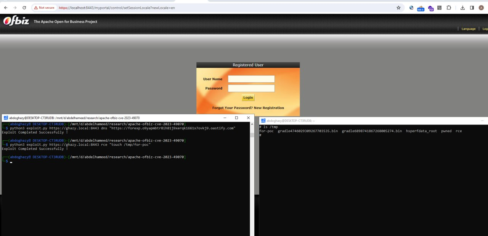

# defcon_news
`2023-12-22`

<blockquote>
Hospital Management System 4.0 XSS / Shell Upload / SQL Injection
https://packetstormsecurity.com/files/176302/hms40-sqlxssshellupload.txt
</blockquote>

<table><tr><td><b>→</b><a href="https://packetstormsecurity.com/files/176302/hms40-sqlxssshellupload.txt">
https://packetstormsecurity.com/files/176302/hms40-sqlxssshellupload.txt
</a>
<blockquote>
Information Security Services, News, Files, Tools, Exploits, Advisories and Whitepapers
</blockquote>
</td></tr></table>

---

# defcon_news
`2023-12-22`

<blockquote>
GilaCMS 1.15.4 SQL Injection
https://packetstormsecurity.com/files/176301/gilacms1154-sql.txt
</blockquote>

<table><tr><td><b>→</b><a href="https://packetstormsecurity.com/files/176301/gilacms1154-sql.txt">
https://packetstormsecurity.com/files/176301/gilacms1154-sql.txt
</a>
<blockquote>
Information Security Services, News, Files, Tools, Exploits, Advisories and Whitepapers
</blockquote>
</td></tr></table>

---

# defcon_news
`2023-12-21`

<blockquote>
Critical RCE Vulnerability Patched in Backup Migration Plugin
https://blog.sucuri.net/2023/12/critical-rce-vulnerability-patched-in-backup-migration-plugin.html
</blockquote>

<table><tr><td><b>→</b><a href="https://blog.sucuri.net/2023/12/critical-rce-vulnerability-patched-in-backup-migration-plugin.html">
https://blog.sucuri.net/2023/12/critical-rce-vulnerability-patched-in-backup-migration-plugin.html
</a>
<blockquote>
Get insights on the severe vulnerability in the Backup Migration WordPress plugin and its latest critical security patch. Understand its impact, patch details, and the vital role of auto-updates and firewalls in securing your website.
</blockquote>
</td></tr></table>

---

# defcon_news
`2023-12-21`

<blockquote>
Google Rushes To Patch Eighth Chrome Zero Day This Year
https://packetstormsecurity.com/news/view/35326/Google-Rushes-To-Patch-Eighth-Chrome-Zero-Day-This-Year.html
</blockquote>

<table><tr><td><b>→</b><a href="https://packetstormsecurity.com/news/view/35326/Google-Rushes-To-Patch-Eighth-Chrome-Zero-Day-This-Year.html">
https://packetstormsecurity.com/news/view/35326/Google-Rushes-To-Patch-Eighth-Chrome-Zero-Day-This-Year.html
</a>
<blockquote>
Google warns of in-the-wild exploitation of CVE-2023-7024, a new Chrome vulnerability, the eighth documented this year.
</blockquote>
</td></tr></table>

---

# defcon_news
`2023-12-21`

<blockquote>
Urgent: New Chrome Zero-Day Vulnerability Exploited in the Wild - Update ASAP
https://thehackernews.com/2023/12/urgent-new-chrome-zero-day.html
</blockquote>

---

# freedomf0x
`2023-12-20`

<blockquote>
1. &#35;CVE-2023-50917:
&#35;MajorDoMo Unauthenticated &#35;RCE

https://github.com/Chocapikk/CVE-2023-50917

2. CVE-2023-41772:
UIFuckUp &#35;exploit to gain system privileges as user on &#35;Windows 10 (&gt;&#61;1809) and 11

https://github.com/R41N3RZUF477/CVE-2023-41772

3. CVE-2023-49786:
&#35;Asterisk 20.1.0 - DoS via DTLS

https://packetstormsecurity.com/files/176251/Asterisk-20.1.0-Denial-Of-Service.html
</blockquote>

<table><tr><td><b>→</b><a href="https://github.com/Chocapikk/CVE-2023-50917">
https://github.com/Chocapikk/CVE-2023-50917
</a>
<blockquote>
MajorDoMo Unauthenticated RCE: Deep Dive &amp; Exploitation Techniques - GitHub - Chocapikk/CVE-2023-50917: MajorDoMo Unauthenticated RCE: Deep Dive &amp; Exploitation Techniques
</blockquote>
</td></tr></table>

---

# freedomf0x
`2023-12-19`

<blockquote>
&#35;SharePoint Pre-Auth Code Injection &#35;RCE chain &#35;CVE-2023-29357 &amp; CVE-2023-24955 &#35;PoC

https://gist.github.com/testanull/dac6029d306147e6cc8dce9424d09868
</blockquote>

<table><tr><td><b>→</b><a href="https://gist.github.com/testanull/dac6029d306147e6cc8dce9424d09868">
https://gist.github.com/testanull/dac6029d306147e6cc8dce9424d09868
</a>
<blockquote>
SharePoint Pre-Auth Code Injection RCE chain CVE-2023-29357 &amp; CVE-2023-24955 PoC - SharePwn_public.py
</blockquote>
</td></tr></table>

---

# freedomf0x
`2023-12-16`

<blockquote>
1. &#35;CVE-2023-6295:
so-widgets-bundle &lt; 1.51.0 - Admin+ &#35;LFI

https://0day.work/cve-2023-6295-so-widgets-bundle-1-51-0-admin-local-file-inclusion

2. CVE-2023-49954:
SQL Injection in 3CX CRM Integration

https://github.com/CVE-2023-49954/CVE-2023-49954.github.io

3. &#35;Whatsapp &#35;Exploit to spoofing impersonate of reply message

https://github.com/lichti/whats-spoofing
</blockquote>

<table><tr><td><b>→</b><a href="https://0day.work/cve-2023-6295-so-widgets-bundle-1-51-0-admin-local-file-inclusion/">
https://0day.work/cve-2023-6295-so-widgets-bundle-1-51-0-admin-local-file-inclusion/
</a>
<blockquote>
In this blog post I'll describe the details of CVE-2023-6295, a local file inclusion in WordPress' so-widgets-bundle plugin.
</blockquote>
</td></tr></table>

---

# defcon_news
`2023-12-15`

<blockquote>
CVE-2023-47271: Remote Code Execution Vulnerability in PKP-WAL &lt;&#61; 3.4.0-3
https://www.reddit.com/r/netsec/comments/18ifr59/cve202347271_remote_code_execution_vulnerability/
</blockquote>

<table><tr><td><b>→</b><a href="https://www.reddit.com/r/netsec/comments/18ifr59/cve202347271_remote_code_execution_vulnerability/">
https://www.reddit.com/r/netsec/comments/18ifr59/cve202347271_remote_code_execution_vulnerability/
</a>
<blockquote>
Posted by eg1x - 1 vote and no comments
</blockquote>
</td></tr></table>

---

# proxy_bar
`2023-12-15`

* https://github.com/abdoghazy2015/ofbiz-CVE-2023-49070-RCE-POC

<blockquote>
CVE-2023-49070 - Apache ofbiz
pre-auth RCE POC

&#35;apache
</blockquote>

---

# defcon_news
`2023-12-14`

<blockquote>
&quot;История одного взлома: Моя свадьба с SQL Injection. Как я нашел себя в объятиях 'Бэд Бой' базы данных и вышел оттуда целым!&quot;
https://codeby.net/threads/istorija-odnogo-vzloma-moja-svadba-s-sql-injection-kak-ja-nashel-sebja-v-objatijax-behd-boj-bazy-dannyx-i-vyshel-ottuda-celym.82451/
</blockquote>

<table><tr><td><b>→</b><a href="https://codeby.net/threads/istorija-odnogo-vzloma-moja-svadba-s-sql-injection-kak-ja-nashel-sebja-v-objatijax-behd-boj-bazy-dannyx-i-vyshel-ottuda-celym.82451/">
https://codeby.net/threads/istorija-odnogo-vzloma-moja-svadba-s-sql-injection-kak-ja-nashel-sebja-v-objatijax-behd-boj-bazy-dannyx-i-vyshel-ottuda-celym.82451/
</a>
<blockquote>
Да, я прошел курс по SQL Injection Master и теперь мое ядро базы данных полным ходом работает на чистом &quot;юморе&quot;! Мои знания на момент начала курса по sql были минимальные, делать простые выборки...
</blockquote>
</td></tr></table>

---

# defcon_news
`2023-12-14`

<blockquote>
New Hacker Group 'GambleForce' Tageting APAC Firms Using SQL Injection Attacks
https://thehackernews.com/2023/12/new-hacker-group-gambleforce-tageting.html
</blockquote>

---

# freedomf0x
`2023-12-14`

<blockquote>
1. &#35;CVE-2023-36424:

&#35;Windows Kernel Pool (clfs.sys) Corruption Privilege Escalation

https://ssd-disclosure.com/ssd-advisory-windows-kernel-pool-clfs-sys-corruption-privilege-escalation

2. CVE-2023-46818:

ISPConfig &lt;&#61;3.2.11 (language_edit.php) &#35;PHP Code Injection

https://seclists.org/fulldisclosure/2023/Dec/2

3. CVE-2023-26035:

Unauth &#35;RCE in ZoneMinder Snapshots

https://github.com/rvizx/CVE-2023-26035
</blockquote>

---

# defcon_news
`2023-12-13`

<blockquote>
New WordPress Update Addressed A POP Chain RCE Vulnerability
https://latesthackingnews.com/2023/12/13/new-wordpress-update-addressed-a-pop-chain-rce-vulnerability/
</blockquote>

<table><tr><td><b>→</b><a href="https://latesthackingnews.com/2023/12/13/new-wordpress-update-addressed-a-pop-chain-rce-vulnerability/">
https://latesthackingnews.com/2023/12/13/new-wordpress-update-addressed-a-pop-chain-rce-vulnerability/
</a>
<blockquote>
Heads up, WordPress admins! Ensure updating your websites at the earliest as a severe remote code execution (RCE) vulnerability threatens WordPress sites, triggering full website takeover. WordPress patched the flaw with the latest version 6.4.2. A
</blockquote>
</td></tr></table>

---

# defcon_news
`2023-12-13`

<blockquote>
Sensing Vulnerabilities in your pfSense Firewall: From XSS to RCE
https://www.reddit.com/r/netsec/comments/18govys/sensing_vulnerabilities_in_your_pfsense_firewall/
</blockquote>

<table><tr><td><b>→</b><a href="https://www.reddit.com/r/netsec/comments/18govys/sensing_vulnerabilities_in_your_pfsense_firewall/">
https://www.reddit.com/r/netsec/comments/18govys/sensing_vulnerabilities_in_your_pfsense_firewall/
</a>
<blockquote>
Explore this post and more from the netsec community
</blockquote>
</td></tr></table>

---

# sysadm_in_channel
`2023-12-13`

<blockquote>
/ pfSense Security: Sensing Code Vulnerabilities 

Attackers can combine the vulnerabilities to execute arbitrary code on the pfSense appliance remotely. An attacker can trick an authenticated pfSense user into clicking on a maliciously crafted link containing an XSS payload that exploits the command injection vulnerability:

https://www.sonarsource.com/blog/pfsense-vulnerabilities-sonarcloud/
</blockquote>

<table><tr><td><b>→</b><a href="https://www.sonarsource.com/blog/pfsense-vulnerabilities-sonarcloud/">
https://www.sonarsource.com/blog/pfsense-vulnerabilities-sonarcloud/
</a>
<blockquote>
Our Clean Code solution SonarCloud discovered multiple vulnerabilities leading to remote code execution on pfSense CE 2.7.0. Let's see how SonarCloud found them and how it can keep your code clean.
</blockquote>
</td></tr></table>

---

# defcon_news
`2023-12-12`

<blockquote>
New Critical RCE Vulnerability Discovered in Apache Struts 2 - Patch Now
https://thehackernews.com/2023/12/new-critical-rce-vulnerability.html
</blockquote>

---

# defcon_news
`2023-12-11`

<blockquote>
WordPress Bravo Translate 1.2 SQL Injection
https://packetstormsecurity.com/files/176137/wpbravotranslate12-sql.txt
</blockquote>

<table><tr><td><b>→</b><a href="https://packetstormsecurity.com/files/176137/wpbravotranslate12-sql.txt?utm_source=dlvr.it&utm_medium=twitter">
https://packetstormsecurity.com/files/176137/wpbravotranslate12-sql.txt?utm_source=dlvr.it&utm_medium=twitter
</a>
<blockquote>
Information Security Services, News, Files, Tools, Exploits, Advisories and Whitepapers
</blockquote>
</td></tr></table>

---

# defcon_news
`2023-12-11`

<blockquote>
wrapwrap: using PHP filters to wrap a file with a prefix and suffix (SSRF, file read)
https://www.reddit.com/r/netsec/comments/18fppnh/wrapwrap_using_php_filters_to_wrap_a_file_with_a/
</blockquote>

<table><tr><td><b>→</b><a href="https://www.reddit.com/r/netsec/comments/18fppnh/wrapwrap_using_php_filters_to_wrap_a_file_with_a/">
https://www.reddit.com/r/netsec/comments/18fppnh/wrapwrap_using_php_filters_to_wrap_a_file_with_a/
</a>
<blockquote>
Explore this post and more from the netsec community
</blockquote>
</td></tr></table>

---

# freedomf0x
`2023-12-11`

<blockquote>
&#35;exploit

1. &#35;SonicWall WXA - Authentication Bypass and &#35;RCE Vulnerability

https://www.praetorian.com/blog/sonicwall-wxa-authentication-bypass-and-rce-vulnerability

2. &#35;CVE-2023-49964:
FreeMarker Server-Side Template Injection in &#35;Alfresco

https://github.com/mbadanoiu/CVE-2023-49964

3. CVE-2022-21392:
&#35;LPE via NMR SUID in &#35;Oracle Enterprise Manager

https://github.com/mbadanoiu/CVE-2022-21392
</blockquote>

<table><tr><td><b>→</b><a href="https://www.praetorian.com/blog/sonicwall-wxa-authentication-bypass-and-rce-vulnerability/">
https://www.praetorian.com/blog/sonicwall-wxa-authentication-bypass-and-rce-vulnerability/
</a>
<blockquote>
We found that SonicWall WXA distributed a hardcoded key to the end-user , which can lead to unauthenticated remote code execution.
</blockquote>
</td></tr></table>

---

# freedomf0x
`2023-12-10`

<blockquote>
&#35;CVE-2023-30547
&#35;PoC &#35;Exploit for VM2 Sandbox Escape Vulnerability

https://github.com/rvizx/CVE-2023-30547
</blockquote>

<table><tr><td><b>→</b><a href="https://github.com/rvizx/CVE-2023-30547">
https://github.com/rvizx/CVE-2023-30547
</a>
<blockquote>
PoC Exploit  for VM2 Sandbox Escape Vulnerability. Contribute to rvizx/CVE-2023-30547 development by creating an account on GitHub.
</blockquote>
</td></tr></table>

---

# defcon_news
`2023-12-10`

<blockquote>
New payload to exploit Error-based SQL injection - Oracle database
https://www.reddit.com/r/netsec/comments/18eyrrt/new_payload_to_exploit_errorbased_sql_injection/
</blockquote>

<table><tr><td><b>→</b><a href="https://www.reddit.com/r/netsec/comments/18eyrrt/new_payload_to_exploit_errorbased_sql_injection/">
https://www.reddit.com/r/netsec/comments/18eyrrt/new_payload_to_exploit_errorbased_sql_injection/
</a>
<blockquote>
Explore this post and more from the netsec community
</blockquote>
</td></tr></table>

---

# Leakers_squad
`2023-12-09`

<blockquote>
🔤Networking Basics🔤

Networking provides access to a vast amount of information available on the internet. 

🔓Basic network protocols: 
Understand the fundamentals of protocols like TCP/IP, UDP, ICMP, and HTTP. 

🔓Network scanning: 
Learn about tools and techniques used to discover and map network resources, such as port scanning, network sniffing, and network mapping. 

🔓Network vulnerabilities: 
Identify common network vulnerabilities, including misconfigurations, weak authentication, open ports, insecure protocols, and weak encryption. 

🔓Exploitation techniques: 
Familiarize yourself with exploitation methods, such as packet injection, man-in-the-middle attacks, DNS spoofing, ARP poisoning, and session hijacking. 

🔓Network security tools: 
Gain knowledge of various security tools like Wireshark, Nmap, Metasploit, Burp Suite, Snort, and tcpdump for network monitoring, analysis, and penetration testing.

🔓Firewall and IDS/IPS evasion: 
Understand how to bypass firewalls and intrusion detection/prevention systems to avoid detection while conducting network attacks. 

🔓Social engineering in network hacking:
 
Study techniques used to manipulate people for gaining unauthorized access to networks, like phishing, pretexting, baiting, and shoulder surfing. 

🔓Wireless network hacking: 
Learn about the security vulnerabilities present in wireless networks, such as Wi-Fi cracking, WEP/WPA2 attacks, rogue access points, and wireless packet injection. 

🔓Network forensics: 
Acquire knowledge on investigating and analyzing network-based security incidents, examining network logs, packet captures, and identifying potentials network breaches.
 
🔓Network hardening: 
Understand techniques to secure networks by implementing security best practices, including proper network segmentation, regular patching, strong authentication measures, and encryption.

☘PASS : @its_me_kali 

♡ ㅤ    ❍ㅤ    ⎙ㅤ  ⌲           
ˡᶦᵏᵉ  ᶜᵒᵐᵐᵉⁿᵗ  ˢᵃᵛᵉ  ˢʰᵃʳᵉ
</blockquote>

---

# defcon_news
`2023-12-08`

<blockquote>
HackerOne: Server Side Request Forgery (SSRF) via Analytics Reports
https://vulners.com/hackerone/H1:2262382?utm_source&#61;rss&amp;utm_medium&#61;rss&amp;utm_campaign&#61;rss
</blockquote>

<table><tr><td><b>→</b><a href="https://vulners.com/hackerone/H1:2262382?utm_source=rss&utm_medium=rss&utm_campaign=rss">
https://vulners.com/hackerone/H1:2262382?utm_source=rss&utm_medium=rss&utm_campaign=rss
</a>
<blockquote>
Hello Gents, I would like to report an issue where attackers are able to read internal files via an SSRF vulnerability. Proof of concept  {F2878644}  Impact SSRF. Thanks and have a nice...
</blockquote>
</td></tr></table>

---

# it_secur
`2023-12-08`

* https://hadess.io/user-account-control-uncontrol-mastering-the-art-of-bypassing-windows-uac/

<blockquote>
🛡 Mastering the Art of Bypassing Windows UAC.

•  Вы наверняка знаете, что UAC (User Account Control) – механизм, поддерживаемый всеми последними версиями Windows, который призван предотвратить несанкционированные административные действия, потенциально опасные для системы. UAC Bypass является достаточно распространённой атакой среди вредоносного ПО.

•  В этой статье мы рассмотрим механику работы UAC и разберемся с некоторыми рабочими методами по обходу UAC:

➡️ https://hadess.io/

&#35;ИБ
</blockquote>

---

# defcon_news
`2023-12-08`

<blockquote>
ISPConfig 3.2.11 PHP Code Injection
https://packetstormsecurity.com/files/176126/KIS-2023-13.txt
</blockquote>

<table><tr><td><b>→</b><a href="https://packetstormsecurity.com/files/176126/KIS-2023-13.txt?utm_source=dlvr.it&utm_medium=twitter">
https://packetstormsecurity.com/files/176126/KIS-2023-13.txt?utm_source=dlvr.it&utm_medium=twitter
</a>
<blockquote>
Information Security Services, News, Files, Tools, Exploits, Advisories and Whitepapers
</blockquote>
</td></tr></table>

---

# defcon_news
`2023-12-08`

<blockquote>
osCommerce 4 SQL Injection
https://packetstormsecurity.com/files/176124/oscommerce4-sql.txt
</blockquote>

<table><tr><td><b>→</b><a href="https://packetstormsecurity.com/files/176124/oscommerce4-sql.txt?utm_source=dlvr.it&utm_medium=twitter">
https://packetstormsecurity.com/files/176124/oscommerce4-sql.txt?utm_source=dlvr.it&utm_medium=twitter
</a>
<blockquote>
Information Security Services, News, Files, Tools, Exploits, Advisories and Whitepapers
</blockquote>
</td></tr></table>

---

# defcon_news
`2023-12-08`

<blockquote>
WordPress 6.4.2 Patches Remote Code Execution Vulnerability
https://packetstormsecurity.com/news/view/35282/WordPress-6.4.2-Patches-Remote-Code-Execution-Vulnerability.html
</blockquote>

<table><tr><td><b>→</b><a href="https://packetstormsecurity.com/news/view/35282/WordPress-6.4.2-Patches-Remote-Code-Execution-Vulnerability.html">
https://packetstormsecurity.com/news/view/35282/WordPress-6.4.2-Patches-Remote-Code-Execution-Vulnerability.html
</a>
<blockquote>
WordPress 6.4.2 patches a flaw that could be chained with another vulnerability to execute arbitrary code.
</blockquote>
</td></tr></table>

---

# defcon_news
`2023-12-07`

<blockquote>
CVE-2023-46818: PHP Code Injection Vulnerability in ISPConfig &lt;&#61; 3.2.11
https://www.reddit.com/r/netsec/comments/18czyrt/cve202346818_php_code_injection_vulnerability_in/
</blockquote>

<table><tr><td><b>→</b><a href="https://www.reddit.com/r/netsec/comments/18czyrt/cve202346818_php_code_injection_vulnerability_in/">
https://www.reddit.com/r/netsec/comments/18czyrt/cve202346818_php_code_injection_vulnerability_in/
</a>
<blockquote>
Posted by eg1x - 4 votes and no comments
</blockquote>
</td></tr></table>

---

# defcon_news
`2023-12-06`

<blockquote>
Unicode XSS via Combining Characters
https://www.reddit.com/r/netsec/comments/18bctu4/unicode_xss_via_combining_characters/
</blockquote>

<table><tr><td><b>→</b><a href="https://www.reddit.com/r/netsec/comments/18bctu4/unicode_xss_via_combining_characters/">
https://www.reddit.com/r/netsec/comments/18bctu4/unicode_xss_via_combining_characters/
</a>
<blockquote>
Explore this post and more from the netsec community
</blockquote>
</td></tr></table>

---

# defcon_news
`2023-12-05`

<blockquote>
Argument injection leading to unauthenticated RCE and authentication bypass in Atos Unify OpenScape Session Border Controller (and Branch, BCF products)
https://www.reddit.com/r/netsec/comments/18b692k/argument_injection_leading_to_unauthenticated_rce/
</blockquote>

<table><tr><td><b>→</b><a href="https://www.reddit.com/r/netsec/comments/18b692k/argument_injection_leading_to_unauthenticated_rce/">
https://www.reddit.com/r/netsec/comments/18b692k/argument_injection_leading_to_unauthenticated_rce/
</a>
<blockquote>
Explore this post and more from the netsec community
</blockquote>
</td></tr></table>

---

# defcon_news
`2023-12-04`

<blockquote>
PHPJabbers Appointment Scheduler 3.0 CSV Injection
https://packetstormsecurity.com/files/176058/phpjabbersas30-csvinject.txt
</blockquote>

<table><tr><td><b>→</b><a href="https://packetstormsecurity.com/files/176058/phpjabbersas30-csvinject.txt?utm_source=dlvr.it&utm_medium=twitter">
https://packetstormsecurity.com/files/176058/phpjabbersas30-csvinject.txt?utm_source=dlvr.it&utm_medium=twitter
</a>
<blockquote>
Information Security Services, News, Files, Tools, Exploits, Advisories and Whitepapers
</blockquote>
</td></tr></table>

---

# defcon_news
`2023-12-04`

<blockquote>
PHPJabbers Car Rental 3.0 CSV Injection
https://packetstormsecurity.com/files/176045/phpjabberscarrental30-csvinject.txt
</blockquote>

<table><tr><td><b>→</b><a href="https://packetstormsecurity.com/files/176045/phpjabberscarrental30-csvinject.txt">
https://packetstormsecurity.com/files/176045/phpjabberscarrental30-csvinject.txt
</a>
<blockquote>
Information Security Services, News, Files, Tools, Exploits, Advisories and Whitepapers
</blockquote>
</td></tr></table>

---

# defcon_news
`2023-12-04`

<blockquote>
PHPJabbers Shuttle Booking Software 2.0 CSV Injection
https://packetstormsecurity.com/files/176038/phpjabberssbs20-csvinject.txt
</blockquote>

<table><tr><td><b>→</b><a href="https://packetstormsecurity.com/files/176038/phpjabberssbs20-csvinject.txt">
https://packetstormsecurity.com/files/176038/phpjabberssbs20-csvinject.txt
</a>
<blockquote>
Information Security Services, News, Files, Tools, Exploits, Advisories and Whitepapers
</blockquote>
</td></tr></table>

---

# defcon_news
`2023-12-04`

<blockquote>
PHPJabbers Time Slots Booking Calendar 4.0 CSV Injection
https://packetstormsecurity.com/files/176034/phpjabberstsbc40-csvinject.txt
</blockquote>

<table><tr><td><b>→</b><a href="https://packetstormsecurity.com/files/176034/phpjabberstsbc40-csvinject.txt">
https://packetstormsecurity.com/files/176034/phpjabberstsbc40-csvinject.txt
</a>
<blockquote>
Information Security Services, News, Files, Tools, Exploits, Advisories and Whitepapers
</blockquote>
</td></tr></table>

---

# defcon_news
`2023-12-04`

<blockquote>
GaatiTrack Courier Management System 1.0 SQL Injection
https://packetstormsecurity.com/files/176030/gaatitrackcms10-sql.txt
</blockquote>

<table><tr><td><b>→</b><a href="https://packetstormsecurity.com/files/176030/gaatitrackcms10-sql.txt">
https://packetstormsecurity.com/files/176030/gaatitrackcms10-sql.txt
</a>
<blockquote>
Information Security Services, News, Files, Tools, Exploits, Advisories and Whitepapers
</blockquote>
</td></tr></table>

---

# Social_engineering
`2023-12-03`

* https://t.me/Social_engineering/3049
* https://habr.com/ru/articles/766760/
* https://xss.is/threads/87501/
* https://t.me/it_secur/1104
* https://t.me/it_secur/1104
* https://t.me/+f3QUaCXnHwBlMWQy
* https://t.me/+owNymgMzqsg4ZDEy

<blockquote>
📚 APT война с Виндой.

•  Если Вы активный читатель S.E., то наверняка помните, что ранее я делился с Вами ссылками на перевод книги &quot;APT война с Виндой&quot;. 

•  Дело в том, что часть этой книги была опубликована на хабре, а вторая часть на XSS. Но мир не без добрых людей, перевод данной книги был собран в единый pdf файл и теперь не нужно прыгать по страничкам на разных ресурсах.

☁️ Я залил книгу в наше облако, можете переходить, скачивать, читать и делиться с друзьями. Приятного чтения и хороших выходных &#61;)

S.E. ▪️ infosec.work
</blockquote>

---

