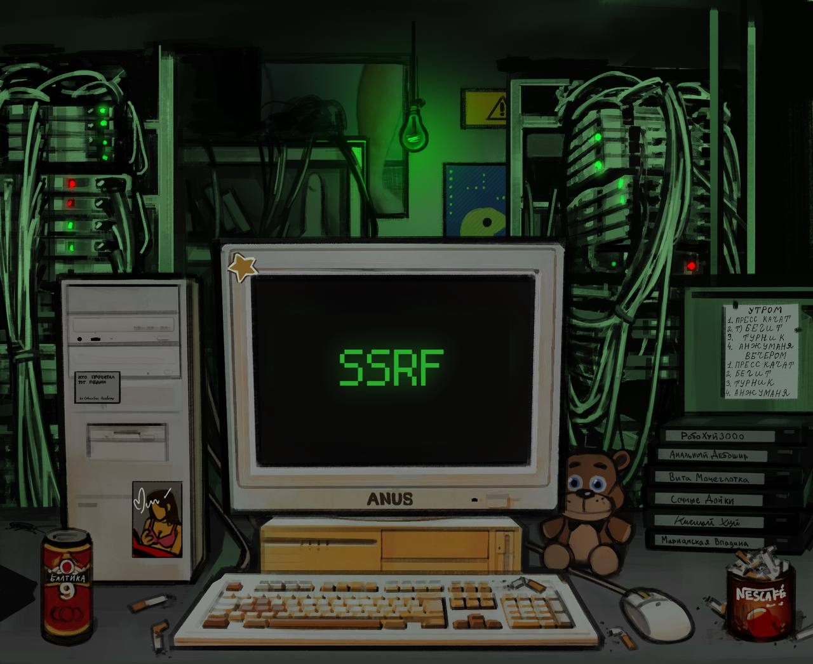

# sysadm_in_channel
`2024-03-06`

<blockquote>
/ VMware ESXi, Workstation, and Fusion contain a use-after-free vulnerability (Critical)

A malicious actor with local administrative privileges on a virtual machine may exploit this issue to execute code as the virtual machine's VMX process running on the host..:

https://www.vmware.com/security/advisories/VMSA-2024-0006.html
</blockquote>

<table><tr><td><b>→</b><a href="https://www.vmware.com/security/advisories/VMSA-2024-0006.html">
https://www.vmware.com/security/advisories/VMSA-2024-0006.html
</a>
<blockquote>
VMware ESXi, Workstation, and Fusion updates address multiple security vulnerabilities (CVE-2024-22252, CVE-2024-22253, CVE-2024-22254, CVE-2024-22255)
</blockquote>
</td></tr></table>

---

# it_secur
`2024-03-05`

* https://blog.devsecopsguides.com/attacking-ios#heading-launching-the-debugserver-on-the-device
* https://blog.devsecopsguides.com/attacking-ios#heading-dumping-application-memory
* https://blog.devsecopsguides.com/attacking-ios#heading-inspecting-binaries
* https://blog.devsecopsguides.com/attacking-ios#heading-defeating-certificate-pinning
* https://blog.devsecopsguides.com/attacking-ios#heading-basic-authentication
* https://blog.devsecopsguides.com/attacking-ios#heading-tls-certificate-pinning
* https://blog.devsecopsguides.com/attacking-ios#heading-nsurlsession
* https://blog.devsecopsguides.com/attacking-ios#heading-risks-of-third-party-networking-apis
* https://blog.devsecopsguides.com/attacking-ios#heading-url-schemes-and-the-openurl-method
* https://blog.devsecopsguides.com/attacking-ios#heading-universal-links
* https://blog.devsecopsguides.com/attacking-ios#heading-using-and-abusing-uiwebviews
* https://blog.devsecopsguides.com/attacking-ios#heading-wkwebview
* https://blog.devsecopsguides.com/attacking-ios#heading-nslog-leakage
* https://blog.devsecopsguides.com/attacking-ios#heading-keylogging-and-the-autocorrection-database
* https://blog.devsecopsguides.com/attacking-ios#heading-dealing-with-sensitive-data-in-snapshots
* https://blog.devsecopsguides.com/attacking-ios#heading-leaks-due-to-state-preservation
* https://blog.devsecopsguides.com/attacking-ios#heading-format-strings
* https://blog.devsecopsguides.com/attacking-ios#heading-buffer-overflows-and-the-stack
* https://blog.devsecopsguides.com/attacking-ios#heading-integer-overflows-and-the-heap
* https://blog.devsecopsguides.com/attacking-ios#heading-client-side-cross-site-scripting
* https://blog.devsecopsguides.com/attacking-ios#heading-sql-injection
* https://blog.devsecopsguides.com/attacking-ios#heading-xml-injection
* https://blog.devsecopsguides.com/attacking-ios#heading-keychain
* https://blog.devsecopsguides.com/attacking-ios#heading-encryption-with-commoncrypto
* https://blog.devsecopsguides.com/attacking-ios#heading-references

<blockquote>
🍎 Attacking IOS.

•  Небольшое руководство, которое описывает различные методы для компрометации iOS устройств.

 - Launching the debugserver on the Device;
 - Dumping Application Memory;
 - Inspecting Binaries;
 - Defeating Certificate Pinning;
 - Basic Authentication;
 - TLS Certificate Pinning;
 - NSURLSession;
 - Risks of Third-Party Networking APIs;
 - URL Schemes and the openURL Method;
 - Universal Links;
 - Using (and Abusing) UIWebViews;
 - WKWebView;
 - NSLog Leakage;
 - Keylogging and the Autocorrection Database;
 - Dealing with Sensitive Data in Snapshots;
 - Leaks Due to State Preservation;
 - Format Strings;
 - Buffer Overflows and the Stack;
 - Integer Overflows and the Heap;
 - Client-Side Cross-Site Scripting;
 - SQL Injection;
 - XML Injection;
 - Keychain;
 - Encryption with CommonCrypto;
 - References.

&#35;devsecopsguides &#35;hack
</blockquote>

---

# cybersec_academy
`2024-03-01`

* https://t.me/cybersec_academy

<blockquote>
👋 Приветствую в мире цифровой безопасности!

Сегодня поговорим о распространенной уязвимости - &quot;Межсайтовое выполнение команд&quot; (Server-Side Request Forgery - SSRF), которая может нанести серьезный ущерб вашей системе.

⏺SSRF - это атака, при которой злоумышленник может заставить сервер выполнять запросы к другим ресурсам (внутренним или внешним) от вашего имени, что может привести к утечке конфиденциальных данных или даже к компрометации сервера.

⏺Потенциальные последствия атаки SSRF включают в себя доступ к внутренним сетям, обход брандмауэров и других мер защиты, а также использование сервера для атак на другие системы.

ZeroDay | &#35;SSRF &#35;Уязвимости &#35;безопасность
</blockquote>

---

# cibsecurity
`2024-03-01`

* https://www.darkreading.com/vulnerabilities-threats/microsoft-zero-day-used-by-lazarus-in-rootkit-attack

<blockquote>
🕵️‍♂️ Microsoft Zero Day Used by Lazarus in Rootkit Attack 🕵️‍♂️

North Korean state actors Lazarus Group used a Windows AppLocker zero day, along with a new and improved rootkit, in a recent cyberattack, researchers report.

📖 Read more.

🔗 Via &quot;Dark Reading&quot;

----------
👁️ Seen on @cibsecurity
</blockquote>

<table><tr><td><b>→</b><a href="https://www.darkreading.com/vulnerabilities-threats/microsoft-zero-day-used-by-lazarus-in-rootkit-attack">
https://www.darkreading.com/vulnerabilities-threats/microsoft-zero-day-used-by-lazarus-in-rootkit-attack
</a>
<blockquote>
North Korean state actors Lazarus Group used a Windows AppLocker zero-day, along with a new and improved rootkit, in a recent cyberattack, researchers report.
</blockquote>
</td></tr></table>

---

