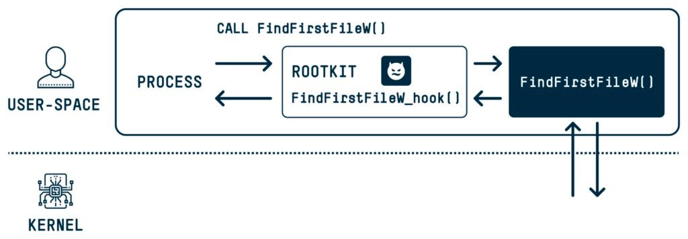

# proxy_bar
`2024-04-27`

<blockquote>
Доброго утра
CVE-2024-26218 Windows Kernel Elevation of Privilege Vulnerability
*
Proof-of-Concept

&#35;win &#35;lpe
</blockquote>

---

# cibsecurity
`2024-04-26`

<blockquote>
🖋️ Hackers Exploiting WP-Automatic Plugin Bug to Create Admin Accounts on WordPress Sites 🖋️

Threat actors are attempting to actively exploit a critical security flaw in the WPAutomatic plugin for WordPress that could allow site takeovers. The shortcoming, tracked as CVE202427956, carries a CVSS score of 9.9 out of a maximum of 10. It impacts all versions of the plugin prior to 3.9.2.0. &quot;This vulnerability, a SQL injection SQLi flaw, poses a severe threat as.

📖 Read more.

🔗 Via &quot;The Hacker News&quot;

----------
👁️ Seen on @cibsecurity
</blockquote>

---

# proxy_bar
`2024-04-25`

<blockquote>
Топ платформ для обучения и тренировки навыкам кибербезопасности и этичного хакинга

&#35;подборка

С каждым днем, цифровая безопасность становится одной из наиболее приоритетных задач для организаций и частных лиц. Каждый день появляются новые угрозы, требующие постоянного повышения уровня защиты и знаний, для их предотвращения. И лучше всего это делать на практике. Мы подготовили подборку обучающих платформ которые могут быть полезны как представителям «синих», так и «красных» команд.

• Attack-Defense: Платформа для практики в области информационной безопасности с более чем 1800 лабораторными работами.

• Alert to win: Учебная платформа, предлагающая задачи на выполнение кода JavaScript для обучения векторам XSS атак.

• CryptoHack: Платформа для изучения криптографии через решение задач и взлом небезопасного кода.

• CMD Challenge: Серия испытаний, предназначенных для проверки ваших навыков работы с командной строкой.

• Exploitation Education: Платформа с ресурсами для обучения методам эксплуатации уязвимостей.

• HackTheBox: Платформа для тестирования и улучшения навыков взлома и пентестинга.

• Hackthis: Сайт, предлагающий различные испытания для хакеров для тестирования и развития их навыков.

• Hacker101: Платформа CTF от HackerOne, предназначенная для обучения основам взлома и пентестинга.

• Hacking-Lab: Платформа для обучения и соревнований в области кибербезопасности.

• OverTheWire: Серия варгеймов, предназначенных для обучения навыкам информационной безопасности.

• PentesterLab: Ресурс для обучения пентестингу и поиску уязвимостей через практические упражнения.

• Hackaflag BR: Бразильская платформа для соревнований по кибербезопасности.

• PentestIT LAB: Виртуальная лаборатория для практики взлома и пентестинга.

• PicoCTF: Платформа соревнований по информационной безопасности, ориентированная на студентов.

• Root-Me: Платформа для всех, кто хочет улучшить свои навыки в области кибербезопасности через практические задачи.

• The Cryptopals Crypto Challenges: Набор задач, разработанных для обучения прикладной криптографии.

• Try Hack Me: Платформа для изучения кибербезопасности через интерактивные упражнения.

• Vulnhub: Ресурс для обучения пентестингу и взлому через практику на виртуальных машинах.

• W3Challs: Платформа для веб-разработчиков и пентестеров для тестирования и улучшения своих навыков.

• WeChall: Сайт для обучения и практики навыков в области информационной безопасности через участие в различных вызовах и заданиях.

• LetsDefend: Платформа для обучения сетевой защите и реагированию на инциденты.

• Vulnmachines: Платформа предлагает различные VM для практики навыков взлома и пентестинга.

• Rangeforce: Образовательная платформа для обучения кибербезопасности с помощью симуляций и модулей обучения.

• Pwn College: Образовательная инициатива, направленная на обучение навыкам кибербезопасности через серию практических заданий.                                                         

• Codeby Games Уникальная платформа для специалистов информационной безопасности и программистов, желающих прокачивать свои навыки в области кибербезопасности, выполняя задания на захват флага (CTF).

• Hackerhub Предоставляет бесплатные виртуальные машины для улучшения ваших навыков информационной безопасности.

LH | Новости | Курсы | Мемы

&#35;рекомендация
&#35;рекомендации
</blockquote>

---

# defcon_news
`2024-04-24`

<blockquote>
Grafana backend sql injection affected all version
https://www.reddit.com/r/netsec/comments/1cbrrg8/grafana_backend_sql_injection_affected_all_version/
</blockquote>

<table><tr><td><b>→</b><a href="https://www.reddit.com/r/netsec/comments/1cbrrg8/grafana_backend_sql_injection_affected_all_version/">
https://www.reddit.com/r/netsec/comments/1cbrrg8/grafana_backend_sql_injection_affected_all_version/
</a>
<blockquote>
Explore this post and more from the netsec community
</blockquote>
</td></tr></table>

---

# proxy_bar
`2024-04-22`

<blockquote>
CVE-2024-21111  VirtualBox (Local Privilege Escalation) 

exploit

&#35;virtualbox &#35;windows &#35;lpe
</blockquote>

---

# sysadm_in_channel
`2024-04-22`

<blockquote>
MagicDot: A Hacker’s Magic Show of Disappearing Dots and Spaces

This action is completed by most user-space APIs in Windows. By exploiting this known issue, I was able to uncover:

🔹 One remote code execution (RCE) vulnerability (CVE-2023-36396) in Windows’s new extraction logic for all newly supported archive types that allowed me to craft a malicious archive that would write anywhere I chose on a remote computer once extracted, leading to code execution.
🔹 Two elevation of privilege (EoP) vulnerabilities: one (CVE-2023-32054) that allowed me to write into files without the required privileges by manipulating the restoration process of a previous version from a shadow copy and another that allowed me to delete files without the required privileges.

With Demo..:

https://www.safebreach.com/blog/magicdot-a-hackers-magic-show-of-disappearing-dots-and-spaces/
</blockquote>

---

# cibsecurity
`2024-04-17`

<blockquote>
🖋️ Hackers Exploit Fortinet Flaw, Deploy ScreenConnect, Metasploit in New Campaign 🖋️

Cybersecurity researchers have discovered a new campaign that's exploiting a recently disclosed security flaw in Fortinet FortiClient EMS devices to deliver ScreenConnect and Metasploit Powerfun payloads. The activity entails the exploitation of CVE202348788 CVSS score 9.3, a critical SQL injection flaw that could permit an unauthenticated attacker to execute unauthorized code or.

📖 Read more.

🔗 Via &quot;The Hacker News&quot;

----------
👁️ Seen on @cibsecurity
</blockquote>

---

# cibsecurity
`2024-04-17`

<blockquote>
🖋️ Critical Atlassian Flaw Exploited to Deploy Linux Variant of Cerber Ransomware 🖋️

Threat actors are exploiting unpatched Atlassian servers to deploy a Linux variant of Cerber aka C3RB3R ransomware. The attacks leverage CVE202322518 CVSS score 9.1, a critical security vulnerability impacting the Atlassian Confluence Data Center and Server that allows an unauthenticated attacker to reset Confluence and create an administrator account. Armed with this access, a.

📖 Read more.

🔗 Via &quot;The Hacker News&quot;

----------
👁️ Seen on @cibsecurity
</blockquote>

---

# sysadm_in_channel
`2024-04-22`

<blockquote>
/ Palo Alto - Putting The Protecc In GlobalProtect (CVE-2024-3400)

A command injection vulnerability in the GlobalProtect feature of Palo Alto Networks PAN-OS software for specific PAN-OS versions and distinct feature configurations may enable an unauthenticated attacker to execute arbitrary code with root privileges on the firewall.

Technial details:

- https://labs.watchtowr.com/palo-alto-putting-the-protecc-in-globalprotect-cve-2024-3400/

Up:

- https://www.paloaltonetworks.com/blog/2024/04/more-on-the-pan-os-cve/
</blockquote>

<table><tr><td><b>→</b><a href="https://labs.watchtowr.com/palo-alto-putting-the-protecc-in-globalprotect-cve-2024-3400/">
https://labs.watchtowr.com/palo-alto-putting-the-protecc-in-globalprotect-cve-2024-3400/
</a>
<blockquote>
Welcome to April 2024, again. We’re back, again.

Over the weekend, we were all greeted by now-familiar news—a nation-state was exploiting a “sophisticated” vulnerability for full compromise in yet another enterprise-grade SSLVPN device.

We’ve seen all the commentary around the certification process of these devices for certain
</blockquote>
</td></tr></table>

---

# defcon_news
`2024-04-15`

<blockquote>
Приглашаем на курс SQL Injection Master, запись до 24 апреля.
https://codeby.net/threads/priglashaem-na-kurs-sql-injection-master-zapis-do-24-aprelja.83295/
</blockquote>

<table><tr><td><b>→</b><a href="https://codeby.net/threads/priglashaem-na-kurs-sql-injection-master-zapis-do-24-aprelja.83295/">
https://codeby.net/threads/priglashaem-na-kurs-sql-injection-master-zapis-do-24-aprelja.83295/
</a>
<blockquote>
Друзья, приглашаем вас на курс SQL Injection Master, где подробно разбирается эксплуатация SQL-инъекций, одной из наиболее опасных атак на веб-приложения. Вы освоите базовый синтаксис языка...
</blockquote>
</td></tr></table>

---

# cibsecurity
`2024-04-15`

<blockquote>
🖋️ Palo Alto Networks Releases Urgent Fixes for Exploited PAN-OS Vulnerability 🖋️

Palo Alto Networks has released hotfixes to address a maximumseverity security flaw impacting PANOS software that has come under active exploitation in the wild. Tracked as CVE20243400 CVSS score 10.0, the critical vulnerability is a case of command injection in the GlobalProtect feature that an unauthenticated attacker could weaponize to execute arbitrary code with root.

📖 Read more.

🔗 Via &quot;The Hacker News&quot;

----------
👁️ Seen on @cibsecurity
</blockquote>

---

# cibsecurity
`2024-04-11`

<blockquote>
🖋️ Fortinet Rolls Out Critical Security Patches for FortiClientLinux Vulnerability 🖋️

Fortinet has released patches to address a critical security flaw impacting FortiClientLinux that could be exploited to achieve arbitrary code execution. Tracked as CVE202345590, the vulnerability carries a CVSS score of 9.4 out of a maximum of 10. &quot;An Improper Control of Generation of Code 'Code Injection' vulnerability CWE94 in FortiClientLinux may allow an unauthenticated attacker to.

📖 Read more.

🔗 Via &quot;The Hacker News&quot;

----------
👁️ Seen on @cibsecurity
</blockquote>

---

# sysadm_in_channel
`2024-04-11`

<blockquote>
/ CVE-2024-3273: D-Link NAS RCE Exploited in the Wild

A remote code execution vulnerability in D-Link NAS devices is actively being exploited and is tracked under CVE-2024-3273. The vulnerability is believed to affect as many as 92,000 devices

https://www.greynoise.io/blog/cve-2024-3273-d-link-nas-rce-exploited-in-the-wild
</blockquote>

<table><tr><td><b>→</b><a href="https://www.greynoise.io/blog/cve-2024-3273-d-link-nas-rce-exploited-in-the-wild">
https://www.greynoise.io/blog/cve-2024-3273-d-link-nas-rce-exploited-in-the-wild
</a>
<blockquote>
Check out this blog to stay informed about a critical remote code execution vulnerability affecting D-Link NAS devices. It is being tracked under CVE-2024-3273 and believed to affect as many as 92,000 devices.
</blockquote>
</td></tr></table>

---

# proxy_bar
`2024-04-09`

<blockquote>
CVE-2024-2879 LayerSlider плагин для WordPress
*
Версии LayerSlider 7.9.11 - 7.10.0 - Unauthenticated SQL Injection
*
Недостаточне экранирование позволяет добавлять дополнительные SQL-запросы к уже существующим, как итог &#61; можно использовать для извлечения конфиденциальной информации из базы данных.
*
POC usage:
sqlmap &quot;https:://OLOLO.com/wp-admin/admin-ajax.php?action&#61;ls_get_popup_markup&amp;id[where]&#61;&quot; --risk&#61;3 --level&#61;4 --dbms&#61;mysql --technique&#61;T or sqlmap -r request.txt --risk&#61;3 --level&#61;4 --dbms&#61;mysql --technique&#61;T

&#35;wordpress
</blockquote>

---

# proxy_bar
`2024-04-06`

<blockquote>
CVE-2024-30850
*
chaos-rat RCE
*
exploit
</blockquote>

---

# cibsecurity
`2024-04-04`

<blockquote>
🕵️‍♂️ Critical Security Flaw Exposes 1 Million WordPress Sites to SQL Injection 🕵️‍♂️

A researcher received a 5,500 bug bounty for discovering a vulnerability CVE20242879 in LayerSlider, a plugin with more than a million active installations.

📖 Read more.

🔗 Via &quot;Dark Reading&quot;

----------
👁️ Seen on @cibsecurity
</blockquote>

<table><tr><td><b>→</b><a href="https://www.darkreading.com/remote-workforce/critical-security-flaw-wordpress-sql-injection">
https://www.darkreading.com/remote-workforce/critical-security-flaw-wordpress-sql-injection
</a>
<blockquote>
A researcher received a $5,500 bug bounty for discovering a vulnerability (CVE-2024-2879) in LayerSlider, a plug-in with more than a million active installations.
</blockquote>
</td></tr></table>

---

