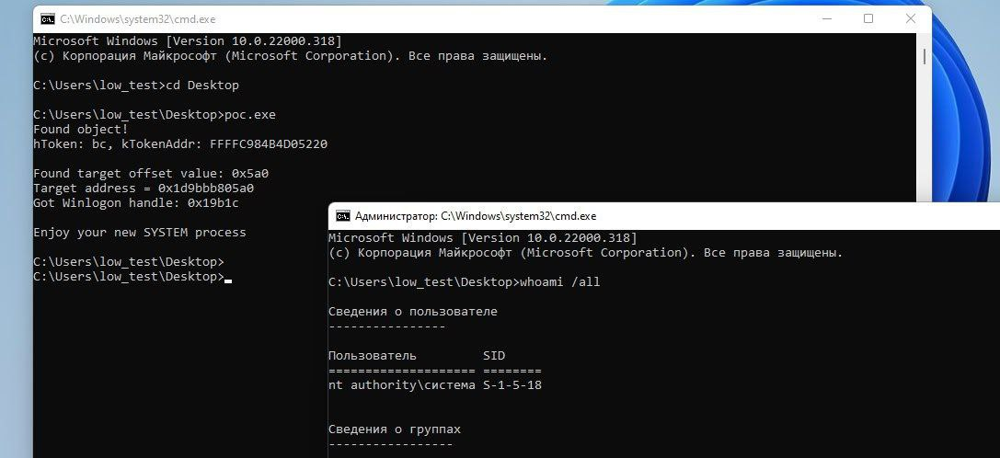
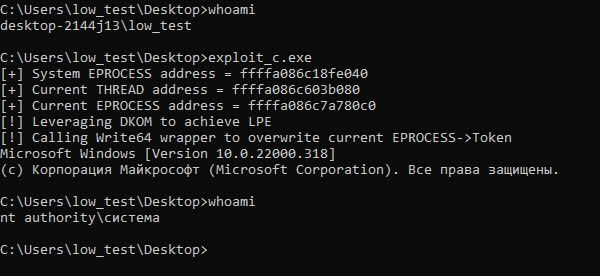

# defcon_news
`2024-06-27`

<blockquote>
Common Ecommerce Vulnerabilities: Reflected XSS
https://www.hackerone.com/vulnerability-management/reflected-xss-ecommerce
</blockquote>

<table><tr><td><b>→</b><a href="https://www.hackerone.com/vulnerability-management/reflected-xss-ecommerce">
https://www.hackerone.com/vulnerability-management/reflected-xss-ecommerce
</a>
<blockquote>
With an example from Shopify, learn about the impact of Reflected XSS vulnerabilities in e-commerce and how to remediate them.
</blockquote>
</td></tr></table>

---

# defcon_news
`2024-06-26`

<blockquote>
Why nested deserialization is harmful: Magento XXE (CVE-2024-34102)
https://www.reddit.com/r/netsec/comments/1dovfzi/why_nested_deserialization_is_harmful_magento_xxe/
</blockquote>

<table><tr><td><b>→</b><a href="https://www.reddit.com/r/netsec/comments/1dovfzi/why_nested_deserialization_is_harmful_magento_xxe/">
https://www.reddit.com/r/netsec/comments/1dovfzi/why_nested_deserialization_is_harmful_magento_xxe/
</a>
<blockquote>
Posted by Mempodipper - 1 vote and no comments
</blockquote>
</td></tr></table>

---

# RalfHackerChannel
`2024-06-26`

<blockquote>
CVE-2024-30088: Windows LPE

PATCHED: June 11, 2024

https://github.com/tykawaii98/CVE-2024-30088

P.S. Протестил на Win11, работает

P.P.S. @Acrono: Протестил на Win10 22H2 (19045) и на Win Server 2019, полет нормальный!

&#35;git &#35;exploit &#35;lpe &#35;pentest &#35;redteam
</blockquote>

<table><tr><td><b>→</b><a href="None">
None
</a>
</td></tr></table>

---

# defcon_news
`2024-06-25`

<blockquote>
How to Find XSS
https://www.hackerone.com/ethical-hacker/how-to-find-xss
</blockquote>

<table><tr><td><b>→</b><a href="https://www.hackerone.com/ethical-hacker/how-to-find-xss">
https://www.hackerone.com/ethical-hacker/how-to-find-xss
</a>
<blockquote>
Security researcher Haoxi Tan breaks down the best practices and tools for finding the different types of XSS vulnerabilities.
</blockquote>
</td></tr></table>

---

# defcon_news
`2024-06-24`

<blockquote>
Critical RCE Vulnerability Discovered in Ollama AI Infrastructure Tool
https://thehackernews.com/2024/06/critical-rce-vulnerability-discovered.html
</blockquote>

<table><tr><td><b>→</b><a href="None">
None
</a>
</td></tr></table>

---

# cibsecurity
`2024-06-21`

<blockquote>
🖋️ New Rust-based Fickle Malware Uses PowerShell for UAC Bypass and Data Exfiltration 🖋️

A new Rustbased information stealer malware called Fickle Stealer has been observed being delivered via multiple attack chains with the goal of harvesting sensitive information from compromised hosts. Fortinet FortiGuard Labs said it's aware of four different distribution methods  namely VBA dropper, VBA downloader, link downloader, and executable downloader  with some of them using a.

📖 Read more.

🔗 Via &quot;The Hacker News&quot;

----------
👁️ Seen on @cibsecurity
</blockquote>

<table><tr><td><b>→</b><a href="None">
None
</a>
</td></tr></table>

---

# defcon_news
`2024-06-20`

<blockquote>
New Rust-based Fickle Malware Uses PowerShell for UAC Bypass and Data Exfiltration
https://thehackernews.com/2024/06/new-rust-based-fickle-malware-uses.html
</blockquote>

<table><tr><td><b>→</b><a href="None">
None
</a>
</td></tr></table>

---

# cibsecurity
`2024-06-12`

<blockquote>
🖋️ Black Basta Ransomware May Have Exploited MS Windows Zero-Day Flaw 🖋️

Threat actors linked to the Black Basta ransomware may have exploited a recently disclosed privilege escalation flaw in the Microsoft Windows Error Reporting Service as zeroday, according to new findings from Symantec. The security flaw in question is CVE202426169 CVSS score 7.8, an elevation of privilege bug in the Windows Error Reporting Service that could be exploited to achieve SYSTEM.

📖 Read more.

🔗 Via &quot;The Hacker News&quot;

----------
👁️ Seen on @cibsecurity
</blockquote>

<table><tr><td><b>→</b><a href="None">
None
</a>
</td></tr></table>

---

# cibsecurity
`2024-06-12`

<blockquote>
🖋️ Black Basta Ransomware May Have Exploited MS Windows Zero-Day Flaw 🖋️

Threat actors linked to the Black Basta ransomware may have exploited a recently disclosed privilege escalation flaw in the Microsoft Windows Error Reporting Service as zeroday, according to new findings from Symantec. The security flaw in question is CVE202426169 CVSS score 7.8, an elevation of privilege bug in the Windows Error Reporting Service that could be exploited to achieve SYSTEM.

📖 Read more.

🔗 Via &quot;The Hacker News&quot;

----------
👁️ Seen on @cibsecurity
</blockquote>

<table><tr><td><b>→</b><a href="None">
None
</a>
</td></tr></table>

---

# defcon_news
`2024-06-12`

<blockquote>
Black Basta Ransomware May Have Exploited MS Windows Zero-Day Flaw
https://thehackernews.com/2024/06/black-basta-ransomware-may-have.html
</blockquote>

<table><tr><td><b>→</b><a href="None">
None
</a>
</td></tr></table>

---

# sysadm_in_channel
`2024-06-12`

<blockquote>
/ Microsoft Message Queuing (MSMQ) Remote Code Execution Vulnerability 

https://msrc.microsoft.com/update-guide/vulnerability/CVE-2024-30080
</blockquote>

<table><tr><td><b>→</b><a href="None">
None
</a>
</td></tr></table>

---

# freedomf0x
`2024-06-11`

<blockquote>
&#35;CVE-2024-26229 &#35;windows &#35;LPE

https://github.com/varwara/CVE-2024-26229
</blockquote>

<table><tr><td><b>→</b><a href="https://github.com/varwara/CVE-2024-26229">
https://github.com/varwara/CVE-2024-26229
</a>
<blockquote>
CWE-781: Improper Address Validation in IOCTL with METHOD_NEITHER I/O Control Code - varwara/CVE-2024-26229
</blockquote>
</td></tr></table>

---

# cibsecurity
`2024-06-11`

<blockquote>
🖋️ Arm Warns of Actively Exploited Zero-Day Vulnerability in Mali GPU Drivers 🖋️

Arm is warning of a security vulnerability impacting Mali GPU Kernel Driver that it said has been actively exploited in the wild. Tracked as CVE20244610, the useafterfree issue impacts the following products   Bifrost GPU Kernel Driver all versions from r34p0 to r40p0 Valhall GPU Kernel Driver all versions from r34p0 to r40p0  &quot;A local nonprivileged user can make improper GPU memory.

📖 Read more.

🔗 Via &quot;The Hacker News&quot;

----------
👁️ Seen on @cibsecurity
</blockquote>

<table><tr><td><b>→</b><a href="None">
None
</a>
</td></tr></table>

---

# RalfHackerChannel
`2024-06-11`

<blockquote>
CVE-2024-26229: Windows LPE

PATCHED: Apr 9, 2024

https://github.com/RalfHacker/CVE-2024-26229-exploit

P.S. Чуть поправил оригинальный эксплоит

&#35;git &#35;exploit &#35;lpe &#35;pentest &#35;redteam
</blockquote>

<table><tr><td><b>→</b><a href="None">
None
</a>
</td></tr></table>

---

# defcon_news
`2024-06-11`

<blockquote>
Arm Warns of Actively Exploited Zero-Day Vulnerability in Mali GPU Drivers
https://thehackernews.com/2024/06/arm-warns-of-actively-exploited-zero.html
</blockquote>

<table><tr><td><b>→</b><a href="None">
None
</a>
</td></tr></table>

---

