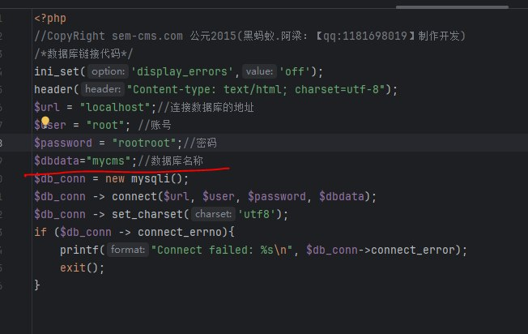

# MPSIEMChat
`2024-06-28`

<blockquote>
Коллеги, нужна помощь по таблице Common_whitelist_regex
Пишем исключение для правила PTAF_XSS_Attack_Detected. Allert.key имеет следующий вид 
xss vulnerability in response (html context)|site.ru|ip|yandex llc 
В поле specific_regex прописываем
.*\|.*\|.*\|yandex llc
Цель - чтобы не регистрировались инциденты с ip принадлежащих yandex.
Но исключение не работает.  Подскажите в чем может быть косяк?
</blockquote>

---

# defcon_news
`2024-06-27`

<blockquote>
Common Ecommerce Vulnerabilities: Reflected XSS
https://www.hackerone.com/vulnerability-management/reflected-xss-ecommerce
</blockquote>

<table><tr><td><b>→</b><a href="https://www.hackerone.com/vulnerability-management/reflected-xss-ecommerce">
https://www.hackerone.com/vulnerability-management/reflected-xss-ecommerce
</a>
<blockquote>
With an example from Shopify, learn about the impact of Reflected XSS vulnerabilities in e-commerce and how to remediate them.
</blockquote>
</td></tr></table>

---

# cibsecurity
`2024-06-27`

<blockquote>
🖋️ Prompt Injection Flaw in Vanna AI Exposes Databases to RCE Attacks 🖋️

Cybersecurity researchers have disclosed a highseverity security flaw in the Vanna.AI library that could be exploited to achieve remote code execution vulnerability via prompt injection techniques. The vulnerability, tracked as CVE20245565 CVSS score 8.1, relates to a case of prompt injection in the &quot;ask&quot; function that could be exploited to trick the library into executing arbitrary.

📖 Read more.

🔗 Via &quot;The Hacker News&quot;

----------
👁️ Seen on @cibsecurity
</blockquote>

---

# cibsecurity
`2024-06-27`

<blockquote>
🖋️ Prompt Injection Flaw in Vanna AI Exposes Databases to RCE Attacks 🖋️

Cybersecurity researchers have disclosed a highseverity security flaw in the Vanna.AI library that could be exploited to achieve remote code execution vulnerability via prompt injection techniques. The vulnerability, tracked as CVE20245565 CVSS score 8.1, relates to a case of prompt injection in the &quot;ask&quot; function that could be exploited to trick the library into executing arbitrary.

📖 Read more.

🔗 Via &quot;The Hacker News&quot;

----------
👁️ Seen on @cibsecurity
</blockquote>

---

# cibsecurity
`2024-06-27`

<blockquote>
🖋️ Critical SQLi Vulnerability Found in Fortra FileCatalyst Workflow Application 🖋️

A critical security flaw has been disclosed in Fortra FileCatalyst Workflow that, if left unpatched, could allow an attacker to tamper with the application database. Tracked as CVE20245276, the vulnerability carries a CVSS score of 9.8. It impacts FileCatalyst Workflow versions 5.1.6 Build 135 and earlier. It has been addressed in version 5.1.6 build 139. &quot;An SQL injection vulnerability in.

📖 Read more.

🔗 Via &quot;The Hacker News&quot;

----------
👁️ Seen on @cibsecurity
</blockquote>

---

# defcon_news
`2024-06-26`

<blockquote>
Why nested deserialization is harmful: Magento XXE (CVE-2024-34102)
https://www.reddit.com/r/netsec/comments/1dovfzi/why_nested_deserialization_is_harmful_magento_xxe/
</blockquote>

<table><tr><td><b>→</b><a href="https://www.reddit.com/r/netsec/comments/1dovfzi/why_nested_deserialization_is_harmful_magento_xxe/">
https://www.reddit.com/r/netsec/comments/1dovfzi/why_nested_deserialization_is_harmful_magento_xxe/
</a>
<blockquote>
Posted by Mempodipper - 1 vote and no comments
</blockquote>
</td></tr></table>

---

# cibsecurity
`2024-06-26`

<blockquote>
🖋️ Critical RCE Vulnerability Discovered in Ollama AI Infrastructure Tool 🖋️

Cybersecurity researchers have detailed a nowpatched security flaw affecting the Ollama opensource artificial intelligence AI infrastructure platform that could be exploited to achieve remote code execution. Tracked as CVE202437032, the vulnerability has been codenamed Probllama by cloud security firm Wiz. Following responsible disclosure on May 5, 2024, the issue was addressed in version.

📖 Read more.

🔗 Via &quot;The Hacker News&quot;

----------
👁️ Seen on @cibsecurity
</blockquote>

---

# cibsecurity
`2024-06-26`

<blockquote>
🖋️ New Cyberthreat 'Boolka' Deploying BMANAGER Trojan via SQLi Attacks 🖋️

A previously undocumented threat actor dubbed Boolka has been observed compromising websites with malicious scripts to deliver a modular trojan codenamed BMANAGER. &quot;The threat actor behind this campaign has been carrying out opportunistic SQL injection attacks against websites in various countries since at least 2022,&quot; GroupIB researchers Rustam Mirkasymov and Martijn van den Berk said in a.

📖 Read more.

🔗 Via &quot;The Hacker News&quot;

----------
👁️ Seen on @cibsecurity
</blockquote>

---

# RalfHackerChannel
`2024-06-26`

<blockquote>
CVE-2024-30088: Windows LPE

PATCHED: June 11, 2024

https://github.com/tykawaii98/CVE-2024-30088

P.S. Протестил на Win11, работает

P.P.S. @Acrono: Протестил на Win10 22H2 (19045) и на Win Server 2019, полет нормальный!

&#35;git &#35;exploit &#35;lpe &#35;pentest &#35;redteam
</blockquote>

---

# defcon_news
`2024-06-25`

<blockquote>
How to Find XSS
https://www.hackerone.com/ethical-hacker/how-to-find-xss
</blockquote>

<table><tr><td><b>→</b><a href="https://www.hackerone.com/ethical-hacker/how-to-find-xss">
https://www.hackerone.com/ethical-hacker/how-to-find-xss
</a>
<blockquote>
Security researcher Haoxi Tan breaks down the best practices and tools for finding the different types of XSS vulnerabilities.
</blockquote>
</td></tr></table>

---

# defcon_news
`2024-06-24`

<blockquote>
Critical RCE Vulnerability Discovered in Ollama AI Infrastructure Tool
https://thehackernews.com/2024/06/critical-rce-vulnerability-discovered.html
</blockquote>

---

# cibsecurity
`2024-06-21`

<blockquote>
🖋️ New Rust-based Fickle Malware Uses PowerShell for UAC Bypass and Data Exfiltration 🖋️

A new Rustbased information stealer malware called Fickle Stealer has been observed being delivered via multiple attack chains with the goal of harvesting sensitive information from compromised hosts. Fortinet FortiGuard Labs said it's aware of four different distribution methods  namely VBA dropper, VBA downloader, link downloader, and executable downloader  with some of them using a.

📖 Read more.

🔗 Via &quot;The Hacker News&quot;

----------
👁️ Seen on @cibsecurity
</blockquote>

---

# defcon_news
`2024-06-20`

<blockquote>
New Rust-based Fickle Malware Uses PowerShell for UAC Bypass and Data Exfiltration
https://thehackernews.com/2024/06/new-rust-based-fickle-malware-uses.html
</blockquote>

---

# cibsecurity
`2024-06-14`

<blockquote>
🦅 CVE-2024-4577: Ongoing Exploitation of a Critical PHP Vulnerability 🦅

    Overview    On May 7, 2024, Devcore Principal Security Researcher Orange Tsai discovered and reported a critical Remote Code Execution RCE vulnerability, CVE20244577, to the PHP official team. This vulnerability stems from errors in character encoding conversions, particularly affecting the &quot;Best Fit&quot; feature on Windows operating systems.     Exploiting this flaw could potentially enable threat actors TAs to remotely execute arbitrary code, posing significant security risks to PHP installations across all versions running on Windows platforms. Recognizing the severity of the issue, the PHP development team promptly addressed CVE20244577 by releasing an official patch on June 6, 2024.&quot;    On June 8th, cybersecurity researchers at Imperva reported the first instance of TAs exploiting ...

📖 Read more.

🔗 Via &quot;CYBLE&quot;

----------
👁️ Seen on @cibsecurity
</blockquote>

<table><tr><td><b>→</b><a href="https://cyble.com/blog/cve-2024-4577-ongoing-exploitation-of-a-critical-php-vulnerability/">
https://cyble.com/blog/cve-2024-4577-ongoing-exploitation-of-a-critical-php-vulnerability/
</a>
<blockquote>
Cyble analyzes the exploitation of recently patched PHP vulnerability CVE-2024-4577
</blockquote>
</td></tr></table>

---

# cibsecurity
`2024-06-14`

<blockquote>
🕵️‍♂️ PoC Exploit Emerges for Critical RCE Bug in Ivanti Endpoint Manager 🕵️‍♂️

A new month, a new highrisk Ivanti bug for attackers to exploit  this time, an SQL injection issue in its centralized endpoint manager.

📖 Read more.

🔗 Via &quot;Dark Reading&quot;

----------
👁️ Seen on @cibsecurity
</blockquote>

<table><tr><td><b>→</b><a href="https://www.darkreading.com/application-security/poc-exploit-critical-rce-bug-ivanti-endpoint-manager">
https://www.darkreading.com/application-security/poc-exploit-critical-rce-bug-ivanti-endpoint-manager
</a>
<blockquote>
A new month, a new high-risk Ivanti bug for attackers to exploit — this time, an SQL injection issue in its centralized endpoint manager.
</blockquote>
</td></tr></table>

---

# cibsecurity
`2024-06-12`

<blockquote>
🕵️‍♂️ TellYouthePass Ransomware Group Exploits Critical PHP Flaw 🕵️‍♂️

An RCE vulnerability that affects the Web scripting language on Windows systems is easy to exploit and can provide a broad attack surface.

📖 Read more.

🔗 Via &quot;Dark Reading&quot;

----------
👁️ Seen on @cibsecurity
</blockquote>

<table><tr><td><b>→</b><a href="https://www.darkreading.com/vulnerabilities-threats/tellyouthepass-ransomware-exploits-critical-php-flaw">
https://www.darkreading.com/vulnerabilities-threats/tellyouthepass-ransomware-exploits-critical-php-flaw
</a>
<blockquote>
An RCE vulnerability that affects the Web scripting language on Windows systems is easy to exploit and can provide a broad attack surface.
</blockquote>
</td></tr></table>

---

# defcon_news
`2024-06-12`

<blockquote>
CVE-2024-29824 Deep Dive: Ivanti EPM SQL Injection Remote Code Execution Vulnerability, IOCs, and POC
https://www.reddit.com/r/netsec/comments/1de88ws/cve202429824_deep_dive_ivanti_epm_sql_injection/
</blockquote>

<table><tr><td><b>→</b><a href="https://www.reddit.com/r/netsec/comments/1de88ws/cve202429824_deep_dive_ivanti_epm_sql_injection/">
https://www.reddit.com/r/netsec/comments/1de88ws/cve202429824_deep_dive_ivanti_epm_sql_injection/
</a>
<blockquote>
Explore this post and more from the netsec community
</blockquote>
</td></tr></table>

---

# cibsecurity
`2024-06-12`

<blockquote>
🖋️ Black Basta Ransomware May Have Exploited MS Windows Zero-Day Flaw 🖋️

Threat actors linked to the Black Basta ransomware may have exploited a recently disclosed privilege escalation flaw in the Microsoft Windows Error Reporting Service as zeroday, according to new findings from Symantec. The security flaw in question is CVE202426169 CVSS score 7.8, an elevation of privilege bug in the Windows Error Reporting Service that could be exploited to achieve SYSTEM.

📖 Read more.

🔗 Via &quot;The Hacker News&quot;

----------
👁️ Seen on @cibsecurity
</blockquote>

---

# cibsecurity
`2024-06-12`

<blockquote>
🖋️ Black Basta Ransomware May Have Exploited MS Windows Zero-Day Flaw 🖋️

Threat actors linked to the Black Basta ransomware may have exploited a recently disclosed privilege escalation flaw in the Microsoft Windows Error Reporting Service as zeroday, according to new findings from Symantec. The security flaw in question is CVE202426169 CVSS score 7.8, an elevation of privilege bug in the Windows Error Reporting Service that could be exploited to achieve SYSTEM.

📖 Read more.

🔗 Via &quot;The Hacker News&quot;

----------
👁️ Seen on @cibsecurity
</blockquote>

---

# defcon_news
`2024-06-12`

<blockquote>
Black Basta Ransomware May Have Exploited MS Windows Zero-Day Flaw
https://thehackernews.com/2024/06/black-basta-ransomware-may-have.html
</blockquote>

---

# sysadm_in_channel
`2024-06-12`

<blockquote>
/ Microsoft Message Queuing (MSMQ) Remote Code Execution Vulnerability 

https://msrc.microsoft.com/update-guide/vulnerability/CVE-2024-30080
</blockquote>

---

# freedomf0x
`2024-06-11`

<blockquote>
&#35;CVE-2024-26229 &#35;windows &#35;LPE

https://github.com/varwara/CVE-2024-26229
</blockquote>

<table><tr><td><b>→</b><a href="https://github.com/varwara/CVE-2024-26229">
https://github.com/varwara/CVE-2024-26229
</a>
<blockquote>
CWE-781: Improper Address Validation in IOCTL with METHOD_NEITHER I/O Control Code - varwara/CVE-2024-26229
</blockquote>
</td></tr></table>

---

# cibsecurity
`2024-06-11`

<blockquote>
🖋️ Arm Warns of Actively Exploited Zero-Day Vulnerability in Mali GPU Drivers 🖋️

Arm is warning of a security vulnerability impacting Mali GPU Kernel Driver that it said has been actively exploited in the wild. Tracked as CVE20244610, the useafterfree issue impacts the following products   Bifrost GPU Kernel Driver all versions from r34p0 to r40p0 Valhall GPU Kernel Driver all versions from r34p0 to r40p0  &quot;A local nonprivileged user can make improper GPU memory.

📖 Read more.

🔗 Via &quot;The Hacker News&quot;

----------
👁️ Seen on @cibsecurity
</blockquote>

---

# RalfHackerChannel
`2024-06-11`

<blockquote>
CVE-2024-26229: Windows LPE

PATCHED: Apr 9, 2024

https://github.com/RalfHacker/CVE-2024-26229-exploit

P.S. Чуть поправил оригинальный эксплоит

&#35;git &#35;exploit &#35;lpe &#35;pentest &#35;redteam
</blockquote>

---

# defcon_news
`2024-06-11`

<blockquote>
Arm Warns of Actively Exploited Zero-Day Vulnerability in Mali GPU Drivers
https://thehackernews.com/2024/06/arm-warns-of-actively-exploited-zero.html
</blockquote>

---

# RalfHackerChannel
`2024-06-10`

<blockquote>
🖥 Veeam Enterprise Manager Authentication Bypass

May 21st, Veeam published an advisory stating that all the versions BEFORE Veeam Backup Enterprise Manager 12.1.2.172 is affected by an authentication bypass allowing an unauthenticated attacker to bypass the authentication and log in to the Veeam Backup Enterprise Manager web interface as any user. , the CVSS for this vulnerability is 9.8.

🔗 Source: 
https://summoning.team/blog/veeam-enterprise-manager-cve-2024-29849-auth-bypass/

🔗 PoC: 
https://github.com/sinsinology/CVE-2024-29849

&#35;veeam &#35;authentication &#35;bypass &#35;cve
</blockquote>

---

# proxy_bar
`2024-06-06`

<blockquote>
CVE-2024-36801 SemСms
*
sql injection для версии Semcms v 4.8
*
SQLi + POC
</blockquote>

---

# defcon_news
`2024-06-05`

<blockquote>
X-Recon - A Utility For Detecting Webpage Inputs And Conducting XSS Scans
http://www.kitploit.com/2024/06/x-recon-utility-for-detecting-webpage.html
</blockquote>

<table><tr><td><b>→</b><a href="https://www.kitploit.com/2024/06/x-recon-utility-for-detecting-webpage.html?utm_source=dlvr.it&utm_medium=twitter">
https://www.kitploit.com/2024/06/x-recon-utility-for-detecting-webpage.html?utm_source=dlvr.it&utm_medium=twitter
</a>
</td></tr></table>

---

# cibsecurity
`2024-06-05`

<blockquote>
🖋️ Zyxel Releases Patches for Firmware Vulnerabilities in EoL NAS Models 🖋️

Zyxel has released security updates to address critical flaws impacting two of its networkattached storage NAS devices that have currently reached endoflife EoL status. Successful exploitation of three of the five vulnerabilities could permit an unauthenticated attacker to execute operating system OS commands and arbitrary code on affected installations. Impacted models include NAS326.

📖 Read more.

🔗 Via &quot;The Hacker News&quot;

----------
👁️ Seen on @cibsecurity
</blockquote>

---

