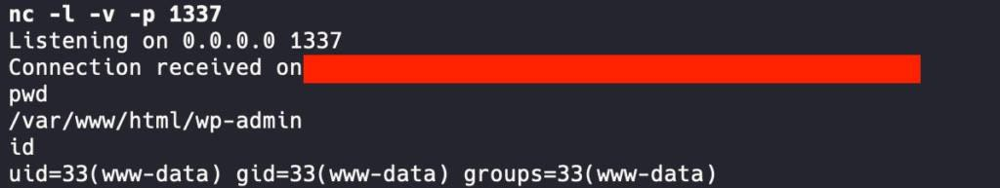
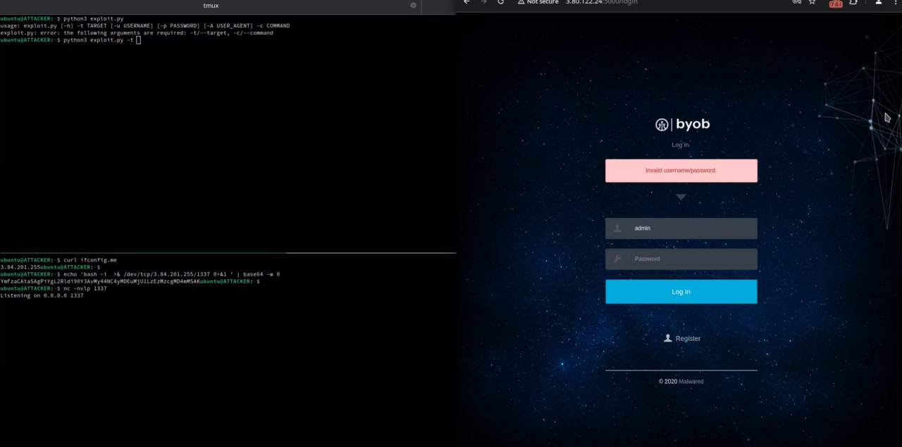

# proxy_bar
`2024-08-29`

<blockquote>
CVE-2024-5932 
*
WordPress GiveWP POP to RCE
*
POC exploit
</blockquote>

---

# cibsecurity
`2024-08-28`

<blockquote>
🦅 CVE-2024-39717 Exposes Critical Vulnerability in Versa Director 🦅

    Key Takeaways      This CVE202439717 vulnerability impacts Versa Director, a key platform for managing Versa SDWAN solutions used by ISPs and MSPs.   CVE202439717 involves an unrestricted file upload flaw that allows authenticated users to upload malicious files disguised as .png images.   Exploitation of this flaw can lead to unauthorized access and potential system compromise, posing a serious risk to affected organizations.   Cybles scan reveals 31 internetexposed instances of Versa Director, with 16 in the U.S., indicating significant potential for exploitation.   An APT actor has exploited the vulnerability due to a failure to implement recommended firewall and hardening measures.   Users are advised to upgrade to Versa Director version 22.1.4 or later and follow additional sec...

📖 Read more.

🔗 Via &quot;CYBLE&quot;

----------
👁️ Seen on @cibsecurity
</blockquote>

<table><tr><td><b>→</b><a href="https://cyble.com/blog/cve-2024-39717-exposes-critical-vulnerability-in-versa-director/">
https://cyble.com/blog/cve-2024-39717-exposes-critical-vulnerability-in-versa-director/
</a>
<blockquote>
CISA warns of CVE-2024-39717 in Versa Director, urging updates to version 22.1.4, MFA usage, and strengthening network security to prevent exploitation.
</blockquote>
</td></tr></table>

---

# defcon_news
`2024-08-28`

<blockquote>
Vtiger CRM (&lt;&#61; 8.1.0) SQL Injection in MailManager module - Shielder
https://www.reddit.com/r/netsec/comments/1f36k32/vtiger_crm_810_sql_injection_in_mailmanager/
</blockquote>

<table><tr><td><b>→</b><a href="https://www.reddit.com/r/netsec/comments/1f36k32/vtiger_crm_810_sql_injection_in_mailmanager/">
https://www.reddit.com/r/netsec/comments/1f36k32/vtiger_crm_810_sql_injection_in_mailmanager/
</a>
<blockquote>
Explore this post and more from the netsec community
</blockquote>
</td></tr></table>

---

# defcon_news
`2024-08-27`

<blockquote>
Taking the Crossroads: The Versa Director Zero-Day Exploitation
https://www.reddit.com/r/netsec/comments/1f2j3mp/taking_the_crossroads_the_versa_director_zeroday/
</blockquote>

<table><tr><td><b>→</b><a href="https://www.reddit.com/r/netsec/comments/1f2j3mp/taking_the_crossroads_the_versa_director_zeroday/">
https://www.reddit.com/r/netsec/comments/1f2j3mp/taking_the_crossroads_the_versa_director_zeroday/
</a>
<blockquote>
Explore this post and more from the netsec community
</blockquote>
</td></tr></table>

---

# defcon_news
`2024-08-27`

<blockquote>
Back to School - Exploiting a Remote Code Execution Vulnerability in Moodle
https://www.reddit.com/r/netsec/comments/1f2c497/back_to_school_exploiting_a_remote_code_execution/
</blockquote>

<table><tr><td><b>→</b><a href="https://www.reddit.com/r/netsec/comments/1f2c497/back_to_school_exploiting_a_remote_code_execution/">
https://www.reddit.com/r/netsec/comments/1f2c497/back_to_school_exploiting_a_remote_code_execution/
</a>
<blockquote>
Explore this post and more from the netsec community
</blockquote>
</td></tr></table>

---

# cibsecurity
`2024-08-26`

<blockquote>
🦅 Weekly IT Vulnerability Report for August 20, 2024: Urgent Fixes Recommended for GitHub, PHP, Windows, and SAP 🦅

  Key Takeaways     CVE20246800 GitHub Enterprise Server poses the risk of data breaches and supply chain attacks.      CVE202438063, a critical Remote Code Execution RCE vulnerability in Windows, may enable cyber attacks on a mass scale, affecting both government and private entities.     Overview    Cyble Research and Intelligence Labs CRIL researchers investigated 12 vulnerabilities from August 14 to August 20, ranging in severity from medium to critical.    CRIL researchers also observed five instances of vulnerabilities and Proof of Concept POC exploits discussed on underground channels and cybercrime forums during that period.    Based on Cybles assessments of the relative cyber threats presented by the vulnerabilities and exploits, five vulnerabilities stand out as warranting pri...

📖 Read more.

🔗 Via &quot;CYBLE&quot;

----------
👁️ Seen on @cibsecurity
</blockquote>

<table><tr><td><b>→</b><a href="https://cyble.com/blog/weekly-it-vulnerability-report-august-2024/">
https://cyble.com/blog/weekly-it-vulnerability-report-august-2024/
</a>
<blockquote>
Weekly IT Vulnerability Report: This vulnerability report flags urgent fixes for critical flaws in GitHub, PHP, Windows, and SAP, including remote code execution risks.
</blockquote>
</td></tr></table>

---

# cibsecurity
`2024-08-23`

<blockquote>
🦅 Comprehensive Analysis of Critical Vulnerabilities in Atlassian Products 🦅

  Key Takeaways    CERTIn's August 2024 bulletin emphasizes the urgent need for organizations to update their Atlassian products due to critical vulnerabilities. Prompt patch application is essential to address these highseverity issues and mitigate risks.      The vulnerabilities uncovered span a range of severe risks, including arbitrary code execution, crosssite scripting XSS, and privilege escalation. These affect multiple Atlassian products, such as Bamboo, Confluence, and Jira, posing significant security threats.      Critical vulnerabilities are linked to specific versions of Atlassian software Bamboo versions prior to 9.6.5, Confluence versions before 8.9.5, Crowd versions below 5.3.2, Jira versions older than 9.17.1, and Jira Service Management versions before 5.17.1.       No...

📖 Read more.

🔗 Via &quot;CYBLE&quot;

----------
👁️ Seen on @cibsecurity
</blockquote>

<table><tr><td><b>→</b><a href="https://cyble.com/blog/key-vulnerabilities-in-atlassian-products/">
https://cyble.com/blog/key-vulnerabilities-in-atlassian-products/
</a>
<blockquote>
CERT-In's August 2024 bulletin reveals critical vulnerabilities in Atlassian products like Bamboo and Confluence, detailing high-severity risks and mitigation strategies.
</blockquote>
</td></tr></table>

---

# cibsecurity
`2024-08-23`

<blockquote>
🖋️ Hardcoded Credential Vulnerability Found in SolarWinds Web Help Desk 🖋️

SolarWinds has issued patches to address a new security flaw in its Web Help Desk WHD software that could allow remote unauthenticated users to gain unauthorized access to susceptible instances. &quot;The SolarWinds Web Help Desk WHD software is affected by a hardcoded credential vulnerability, allowing a remote unauthenticated user to access internal functionality and modify data,&quot; the company.

📖 Read more.

🔗 Via &quot;The Hacker News&quot;

----------
👁️ Seen on @cibsecurity
</blockquote>

---

# cibsecurity
`2024-08-21`

<blockquote>
🖋️ Microsoft Patches Critical Copilot Studio Vulnerability Exposing Sensitive Data 🖋️

Cybersecurity researchers have disclosed a critical security flaw impacting Microsoft's Copilot Studio that could be exploited to access sensitive information. Tracked as CVE202438206 CVSS score 8.5, the vulnerability has been described as an information disclosure bug stemming from a serverside request forgery SSRF attack. &quot;An authenticated attacker can bypass ServerSide Request.

📖 Read more.

🔗 Via &quot;The Hacker News&quot;

----------
👁️ Seen on @cibsecurity
</blockquote>

---

# proxy_bar
`2024-08-16`

<blockquote>
BYOB (Build Your Own Botnet) Unauthenticated RCE
*
writeup + video
*
Exploit
</blockquote>

---

# sysadm_in_channel
`2024-08-15`

<blockquote>
/ Windows TCP/IP Remote Code Execution Vulnerability

Mitigations - Systems are not affected if IPv6 is disabled on the target machine...)

https://msrc.microsoft.com/update-guide/vulnerability/CVE-2024-38063
</blockquote>

---

# cibsecurity
`2024-08-15`

<blockquote>
🖋️ SolarWinds Releases Patch for Critical Flaw in Web Help Desk Software 🖋️

SolarWinds has released patches to address a critical security vulnerability in its Web Help Desk software that could be exploited to execute arbitrary code on susceptible instances. The flaw, tracked as CVE202428986 CVSS score 9.8, has been described as a deserialization bug. &quot;SolarWinds Web Help Desk was found to be susceptible to a Java deserialization remote code execution vulnerability.

📖 Read more.

🔗 Via &quot;The Hacker News&quot;

----------
👁️ Seen on @cibsecurity
</blockquote>

---

# defcon_news
`2024-08-14`

<blockquote>
Wormable Substack XSS
https://www.reddit.com/r/netsec/comments/1eql0xd/wormable_substack_xss/
</blockquote>

<table><tr><td><b>→</b><a href="https://www.reddit.com/r/netsec/comments/1eql0xd/wormable_substack_xss/">
https://www.reddit.com/r/netsec/comments/1eql0xd/wormable_substack_xss/
</a>
<blockquote>
Explore this post and more from the netsec community
</blockquote>
</td></tr></table>

---

# defcon_news
`2024-08-13`

<blockquote>
How to find XML External Entity (XXE) vulnerabilities in Code ​(C++)
https://www.reddit.com/r/netsec/comments/1eqzg64/how_to_find_xml_external_entity_xxe/
</blockquote>

<table><tr><td><b>→</b><a href="https://www.reddit.com/r/netsec/comments/1eqzg64/how_to_find_xml_external_entity_xxe/">
https://www.reddit.com/r/netsec/comments/1eqzg64/how_to_find_xml_external_entity_xxe/
</a>
<blockquote>
Explore this post and more from the netsec community
</blockquote>
</td></tr></table>

---

# defcon_news
`2024-08-12`

<blockquote>
SQL Injection Isn't Dead - Smuggling Queries at the Protocol Level
https://www.reddit.com/r/netsec/comments/1eqm0ia/sql_injection_isnt_dead_smuggling_queries_at_the/
</blockquote>

<table><tr><td><b>→</b><a href="https://www.reddit.com/r/netsec/comments/1eqm0ia/sql_injection_isnt_dead_smuggling_queries_at_the/">
https://www.reddit.com/r/netsec/comments/1eqm0ia/sql_injection_isnt_dead_smuggling_queries_at_the/
</a>
<blockquote>
Posted by lormayna - 12 votes and no comments
</blockquote>
</td></tr></table>

---

# freedomf0x
`2024-08-12`

<blockquote>
Tools from the &#35;DEFCON 32 talk &quot;SHIM me what you got - Manipulating Shim and Office for Code Injection&quot;

https://github.com/deepinstinct/ShimMe
</blockquote>

<table><tr><td><b>→</b><a href="https://github.com/deepinstinct/ShimMe">
https://github.com/deepinstinct/ShimMe
</a>
<blockquote>
Contribute to deepinstinct/ShimMe development by creating an account on GitHub.
</blockquote>
</td></tr></table>

---

# cibsecurity
`2024-08-08`

<blockquote>
🖋️ Critical Security Flaw in WhatsUp Gold Under Active Attack - Patch Now 🖋️

A critical security flaw impacting Progress Software WhatsUp Gold is seeing active exploitation attempts, making it essential that users move quickly to apply the latest. The vulnerability in question is CVE20244885 CVSS score 9.8, an unauthenticated remote code execution bug impacting versions of the network monitoring application released before 2023.1.3. &quot;The.

📖 Read more.

🔗 Via &quot;The Hacker News&quot;

----------
👁️ Seen on @cibsecurity
</blockquote>

---

# proxy_bar
`2024-08-07`

<blockquote>
CVE-2024-6782 
*
Caliber 6.9.0 ~ 7.14.0  remote code execution
*
exploit
</blockquote>

---

# cibsecurity
`2024-08-06`

<blockquote>
🖋️ New Zero-Day Flaw in Apache OFBiz ERP Allows Remote Code Execution 🖋️

A new zeroday preauthentication remote code execution vulnerability has been disclosed in the Apache OFBiz opensource enterprise resource planning ERP system that could allow threat actors to achieve remote code execution on affected instances. Tracked as CVE202438856, the flaw has a CVSS score of 9.8 out of a maximum of 10.0. It affects Apache OFBiz versions prior to 18.12.15. &quot;The.

📖 Read more.

🔗 Via &quot;The Hacker News&quot;

----------
👁️ Seen on @cibsecurity
</blockquote>

---

# proxy_bar
`2024-08-02`

<blockquote>
Windows AppLocker Driver (appid.sys) 
*
LPE
*
exploit

&#35;windows &#35;lpe
</blockquote>

---

# defcon_news
`2024-08-01`

<blockquote>
Windows AppLocker Driver LPE Vulnerability - CVE-2024-21338
https://www.reddit.com/r/netsec/comments/1ehjatd/windows_applocker_driver_lpe_vulnerability/
</blockquote>

<table><tr><td><b>→</b><a href="https://www.reddit.com/r/netsec/comments/1ehjatd/windows_applocker_driver_lpe_vulnerability/">
https://www.reddit.com/r/netsec/comments/1ehjatd/windows_applocker_driver_lpe_vulnerability/
</a>
<blockquote>
Explore this post and more from the netsec community
</blockquote>
</td></tr></table>

---

# cibsecurity
`2024-08-01`

<blockquote>
🕵️‍♂️ Dangerous XSS Bugs in RedCAP Threaten Academic &amp; Scientific Research 🕵️‍♂️

The security vulnerabilities, CVE202437394, CVE202437395, and CVE202437396, could lay open proprietary and sensitive research to data thieves.

📖 Read more.

🔗 Via &quot;Dark Reading&quot;

----------
👁️ Seen on @cibsecurity
</blockquote>

<table><tr><td><b>→</b><a href="https://www.darkreading.com/threat-intelligence/dangerous-xss-bugs-redcap-academic-scientific-research">
https://www.darkreading.com/threat-intelligence/dangerous-xss-bugs-redcap-academic-scientific-research
</a>
<blockquote>
The security vulnerabilities, CVE-2024-37394, CVE-2024-37395, and CVE-2024-37396, could lay open proprietary and sensitive research to data thieves.
</blockquote>
</td></tr></table>

---

