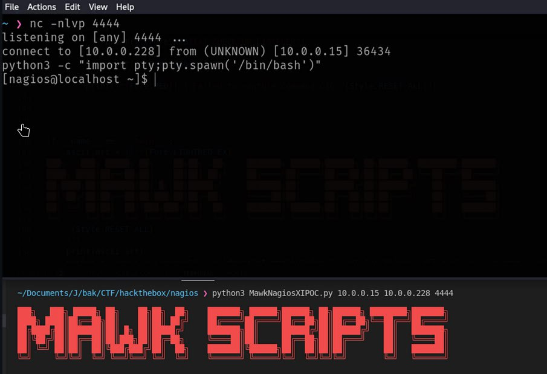
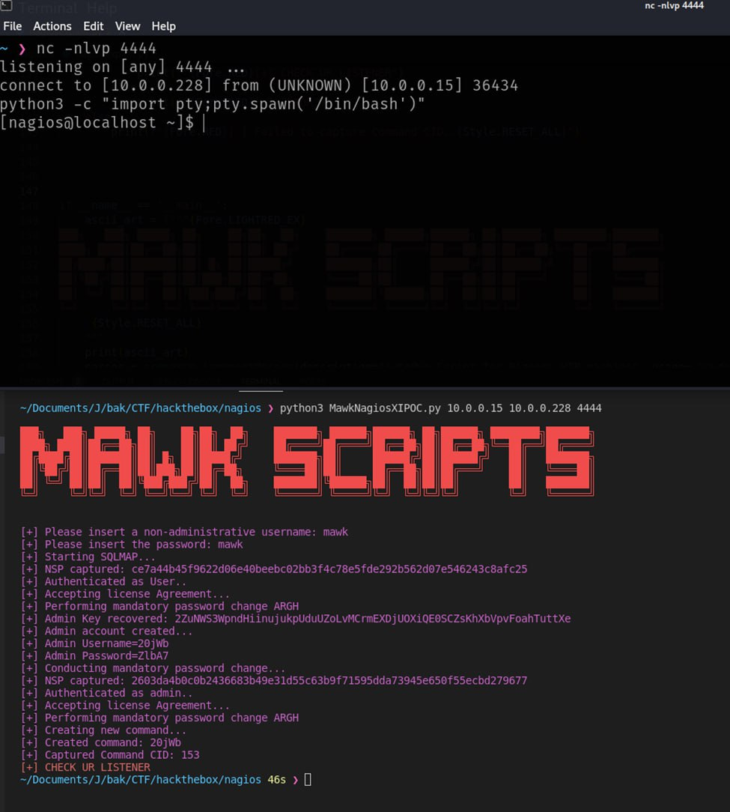

# cibsecurity
`2024-09-11`

<blockquote>
🦅 Major ICS Security Flaws Disclosed in LOYTEC, Hughes, and Baxter Products 🦅

  Key Takeaways      Three major advisories from CISA address 17 vulnerabilities across products from LOYTEC Electronics GmbH, Hughes Network Systems, and Baxter.   Multiple products are affected by vulnerabilities allowing for the cleartext transmission of sensitive data, such as passwords, which could be exploited through ManintheMiddle MitM attacks. Despite being reported in 2021, these vulnerabilities are now publicly disclosed due to the vendor's lack of response.   With 629 internetexposed instances, primarily in Italy and France, the likelihood of exploitation is high. Proof of Concepts PoCs for these vulnerabilities is publicly available.   Other notable vulnerabilities include insufficiently protected credentials and SQL injection, affecting critical infrastructure systems.    ...

📖 Read more.

🔗 Via &quot;CYBLE&quot;

----------
👁️ Seen on @cibsecurity
</blockquote>

<table><tr><td><b>→</b><a href="https://cyble.com/blog/major-ics-security-flaws-disclosed-in-loytec-hughes-and-baxter-products/">
https://cyble.com/blog/major-ics-security-flaws-disclosed-in-loytec-hughes-and-baxter-products/
</a>
<blockquote>
CISA warns of critical ICS vulnerabilities in LOYTEC, Hughes, and Baxter products, exposing sensitive data and systems to high-risk attacks.
</blockquote>
</td></tr></table>

---

# cibsecurity
`2024-09-11`

<blockquote>
🖋️ Ivanti Releases Urgent Security Updates for Endpoint Manager Vulnerabilities 🖋️

Ivanti has released software updates to address multiple security flaws impacting Endpoint Manager EPM, including 10 critical vulnerabilities that could result in remote code execution. A brief description of the issues is as follows   CVE202429847 CVSS score 10.0  A deserialization of untrusted data vulnerability that allows a remote unauthenticated attacker to achieve code execution.

📖 Read more.

🔗 Via &quot;The Hacker News&quot;

----------
👁️ Seen on @cibsecurity
</blockquote>

---

# cibsecurity
`2024-09-10`

<blockquote>
🦅 The Re-Emergence of CVE-2024-32113: How CVE-2024-45195 has amplified Exploitation Risks 🦅

  Overview   On September 7, 2024, Cyble Global Sensor Intelligence CGSI identified the active exploitation of CVE202432113, a critical path traversal vulnerability in the Apache OFBiz opensource enterprise resource planning ERP system. This flaw was initially addressed on April 12, 2024, with a formal patch released on May 8, 2024. CVE202432113 allows Threat Actors TAs to execute arbitrary commands by sending specially crafted requests, enabling them to gain unauthorized access and execute arbitrary commands.   On September 4, 2024, the identification of CVE202445195 reignited concerns surrounding Apache OFBiz by revealing a bypass for several previously addressed vulnerabilities, notably CVE202432113. This development has intensified the exploitation of CVE202432113, as attackers expl...

📖 Read more.

🔗 Via &quot;CYBLE&quot;

----------
👁️ Seen on @cibsecurity
</blockquote>

<table><tr><td><b>→</b><a href="https://cyble.com/blog/the-re-emergence-of-cve-2024-32113-how-cve-2024-45195-has-amplified-exploitation-risks/">
https://cyble.com/blog/the-re-emergence-of-cve-2024-32113-how-cve-2024-45195-has-amplified-exploitation-risks/
</a>
<blockquote>
The Cyble Global Sensor Intelligence Network (CGSI) detected active exploitation attempts of the Apache OFBiz vulnerability CVE-2024-32113, leading to unauthorized remote code execution.
</blockquote>
</td></tr></table>

---

# cibsecurity
`2024-09-10`

<blockquote>
🕵️‍♂️ Gallup Poll Bugs Open Door to Election Misinformation 🕵️‍♂️

Researchers flagged a pair of Gallup polling site XSS vulnerabilities that could have allowed malicious actors to execute arbitrary code, access sensitive data, or take over a victim account.

📖 Read more.

🔗 Via &quot;Dark Reading&quot;

----------
👁️ Seen on @cibsecurity
</blockquote>

<table><tr><td><b>→</b><a href="https://www.darkreading.com/vulnerabilities-threats/gallup-poll-bugs-open-door-to-election-misinformation">
https://www.darkreading.com/vulnerabilities-threats/gallup-poll-bugs-open-door-to-election-misinformation
</a>
<blockquote>
Researchers flagged a pair of Gallup polling site XSS vulnerabilities that could have allowed malicious actors to execute arbitrary code, access sensitive data, or take over a victim account.
</blockquote>
</td></tr></table>

---

# defcon_news
`2024-09-10`

<blockquote>
New Chrome Zero-Day
https://www.schneier.com/blog/archives/2024/09/new-chrome-zero-day.html
</blockquote>

---

# cibsecurity
`2024-09-09`

<blockquote>
🖋️ Progress Software Issues Patch for Vulnerability in LoadMaster and MT Hypervisor 🖋️

Progress Software has released security updates for a maximumseverity flaw in LoadMaster and MultiTenant MT hypervisor that could result in the execution of arbitrary operating system commands. Tracked as CVE20247591 CVSS score 10.0, the vulnerability has been described as an improper input validation bug that results in OS command injection. &quot;It is possible for unauthenticated, remote.

📖 Read more.

🔗 Via &quot;The Hacker News&quot;

----------
👁️ Seen on @cibsecurity
</blockquote>

---

# cibsecurity
`2024-09-06`

<blockquote>
🖋️ Apache OFBiz Update Fixes High-Severity Flaw Leading to Remote Code Execution 🖋️

A new security flaw has been addressed in the Apache OFBiz opensource enterprise resource planning ERP system that, if successfully exploited, could lead to unauthenticated remote code execution on Linux and Windows. The highseverity vulnerability, tracked as CVE202445195 CVSS score 7.5, affects all versions of the software before 18.12.16.   &quot;An attacker with no valid.

📖 Read more.

🔗 Via &quot;The Hacker News&quot;

----------
👁️ Seen on @cibsecurity
</blockquote>

---

# defcon_news
`2024-09-05`

<blockquote>
Windows Wi-Fi Driver RCE Vulnerability - CVE-2024-30078
https://www.reddit.com/r/netsec/comments/1f9qa6p/windows_wifi_driver_rce_vulnerability_cve202430078/
</blockquote>

<table><tr><td><b>→</b><a href="https://www.reddit.com/r/netsec/comments/1f9qa6p/windows_wifi_driver_rce_vulnerability_cve202430078/">
https://www.reddit.com/r/netsec/comments/1f9qa6p/windows_wifi_driver_rce_vulnerability_cve202430078/
</a>
<blockquote>
Explore this post and more from the netsec community
</blockquote>
</td></tr></table>

---

# cibsecurity
`2024-09-05`

<blockquote>
🖋️ Veeam Releases Security Updates to Fix 18 Flaws, Including 5 Critical Issues 🖋️

Veeam has shipped security updates to address a total of 18 security flaws impacting its software products, including five critical vulnerabilities that could result in remote code execution. The list of shortcomings is below   CVE202440711 CVSS score 9.8  A vulnerability in Veeam Backup  Replication that allows unauthenticated remote code execution.   CVE202442024 CVSS score 9.1.

📖 Read more.

🔗 Via &quot;The Hacker News&quot;

----------
👁️ Seen on @cibsecurity
</blockquote>

---

# proxy_bar
`2024-09-05`

<blockquote>
CVE-2024-24401 NAGIOS 
*
Authenticated SQL Injection
*
POC exploit
</blockquote>

---

# RalfHackerChannel
`2024-09-05`

<blockquote>
👩‍💻 Nagios XI — RCE

Nagios XI 2024R1.01 has a vulnerability in the monitoringwizard.php component, allowing authenticated SQL injection (CVE-2024-24401) that lets attackers create an admin account and remote code execution. 

🔗 Source:
https://github.com/MAWK0235/CVE-2024-24401

&#35;nagios &#35;sql &#35;rce &#35;privesc &#35;poc &#35;exploit
</blockquote>

---

# defcon_news
`2024-09-02`

<blockquote>
SQL Injection Attack on Airport Security
https://www.schneier.com/blog/archives/2024/09/sql-injection-attack-on-airport-security.html
</blockquote>

---

# cibsecurity
`2024-09-01`

<blockquote>
🖋️ North Korean Hackers Deploy FudModule Rootkit via Chrome Zero-Day Exploit 🖋️

A recently patched security flaw in Google Chrome and other Chromium web browsers was exploited as a zeroday by North Korean actors in a campaign designed to deliver the FudModule rootkit. The development is indicative of the persistent efforts made by the nationstate adversary, which had made a habit of incorporating rafts of Windows zeroday exploits into its arsenal in recent months.

📖 Read more.

🔗 Via &quot;The Hacker News&quot;

----------
👁️ Seen on @cibsecurity
</blockquote>

---

