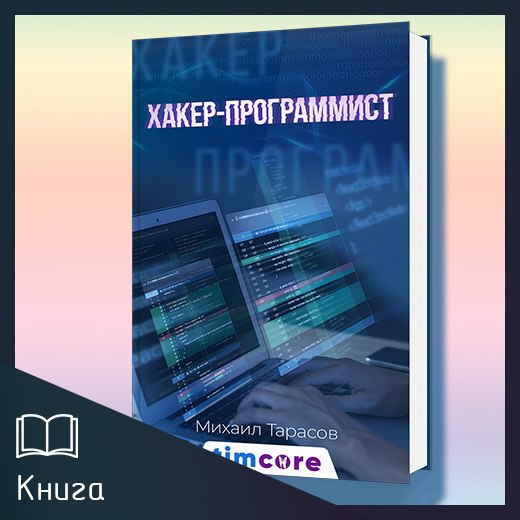
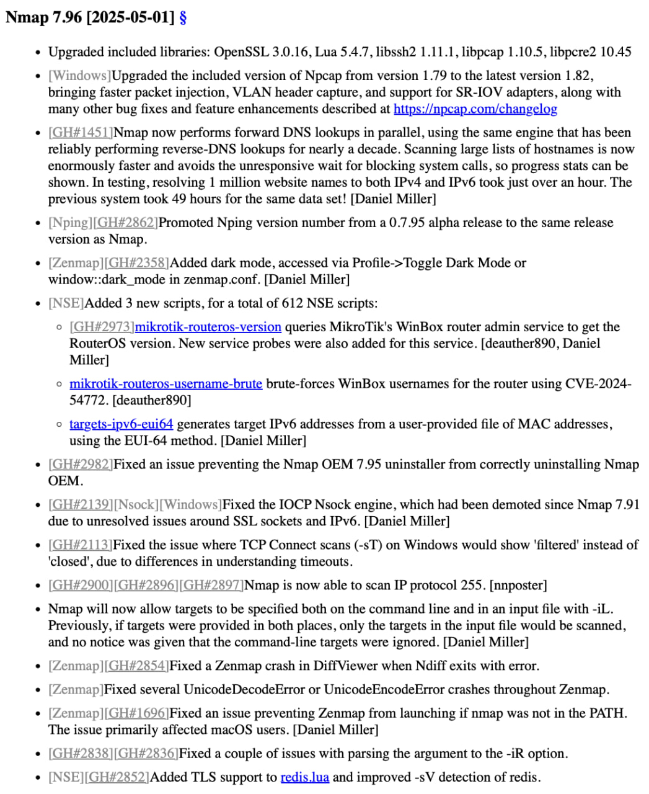

# Social_engineering
`2025-05-31`

* https://t.me/Social_engineering/2059
* https://t.me/it_secur/1050
* https://t.me/tg_infosec/1962
* https://xss.is/threads/135191/
* https://xss.is/members/380052/
* https://habr.com/ru/post/771776/
* https://habr.com/ru/articles/547250/
* https://habr.com/ru/articles/701200/
* https://habr.com/ru/articles/546034/
* https://yggdrasil-network.github.io/
* https://t.me/+f3QUaCXnHwBlMWQy
* https://t.me/+owNymgMzqsg4ZDEy
* https://t.me/SE_VirusTotal_bot

<blockquote>
📶 Yggdrasil Network - что, зачем и почему.

•  Yggdrasil — это распределённая Mesh сеть, которая работет в Overlay режиме, позволяя сделать интернет поверх интернета. Причем, сеть может одновременно работать в двух режимах — через интернет и без интернета, соединяясь напрямую с физически соседними пирами (через Ethernet, Wi-Fi или Bluetooth) работая на 3-ем уровне модели OSI.

•  Если говорить простым языком, то Yggdrasil — это оверлейная сеть, которая призвана воплотить концепцию нулевой настройки сетей — вам не нужно знать маршруты, вам не нужно ничего настраивать — всё должно работать из коробки и сразу.

•  Если данная тема вам показалась интересной, то я рекомендую прочитать статью от одного из авторов форума XSS. Материал содержит плюсы и минусы Yggdrasil, настройку и выход в сеть. Ну и обратите внимание на доп. материал, там много полезной информации по теме:

➡ Скачать материал можно в нашем облаке.

➡ Источник: https://xss.is
➡ Автор: @hermano

•  Дополнительно:

➡Yggdrasil-mesh глазами пентестера;
➡Yggdrasil Network: Заря бытовых меш-сетей, или интернет будущего;
➡Новый виток развития Yggdrasil;
➡Криптографическое образование адреса IPv6 в Yggdrasil;
➡Yggdrasil Network.

S.E. ▪️ infosec.work ▪️ VT
</blockquote>

---

# books_security_and_programming
`2025-05-27`

<blockquote>
[Мои разработки] Vulnerable Web App - Учебное приложение (v3.0)

Предоставляю Вашему вниманию веб-приложение для изучения типичных уязвимостей веб-безопасности. Только для образовательных целей!

Vulnerable Web App - это образовательная платформа для изучения веб-уязвимостей, разработанная для специалистов по информационной безопасности, студентов и всех, кто интересуется веб-безопасностью. Проект представляет собой набор интерактивных лабораторий, которые позволяют пользователям практиковать обнаружение и эксплуатацию различных уязвимостей в безопасной среде.

🚨 Предупреждение

Это приложение содержит намеренные уязвимости и должно использоваться только в учебных целях в изолированной среде. Не размещайте его на публичных серверах!

📋 Содержание

Приложение демонстрирует следующие уязвимости:

1. Уязвимости аутентификации (SQL-инъекции, слабые пароли)
2. Файловые уязвимости (Path Traversal, небезопасная загрузка)
3. API уязвимости (недостаточная аутентификация, Mass Assignment)
4. Cross-Site Scripting (XSS)
- Reflected XSS
- Stored XSS
- DOM-based XSS
5. Cross-Site Request Forgery (CSRF)
6. Server-Side Request Forgery (SSRF)
7. Нарушение контроля доступа (IDOR) ⭐️ новое
8. JWT (JSON Web Token) уязвимости ⭐️ новое
9. XXE (XML External Entity) инъекции ⭐️ новое
10. NoSQL инъекции ⭐️ новое

🔄 Что нового в версии 3.0

В третье обновление добавлены 4 новых типа уязвимостей:

- IDOR (Insecure Direct Object References): изучите, как злоумышленники могут получать доступ к чужим данным путём прямого указания идентификаторов объектов
- JWT уязвимости: исследуйте проблемы безопасности с JSON Web Token, включая подделку токенов и использование &quot;none&quot; алгоритма
- XXE инъекции: узнайте, как злоумышленники могут использовать XML-парсеры для чтения системных файлов и выполнения других атак
- NoSQL инъекции: изучите уязвимости, специфичные для нереляционных баз данных, в частности MongoDB

Основные обновления:

- Добавлена новая лаборатория по NoSQL-инъекциям
- Четыре уровня сложности заданий для изучения уязвимостей MongoDB
- Практические задания по обходу аутентификации, манипуляции операторами и инъекциям в агрегационный конвейер
- Подробные решения с примерами кода в едином стиле

- Улучшенный интерфейс всех лабораторий
- Переработан дизайн раздела решений в хакерском стиле
- Улучшена навигация между заданиями
- Добавлены визуальные индикаторы прогресса

- Оптимизация и исправления
- Исправлены ошибки в работе интерактивных элементов
- Оптимизирована загрузка ресурсов

📚 Доступные лаборатории
В текущей версии приложения доступны следующие лаборатории:

1. XSS (Cross-Site Scripting) - изучение различных типов XSS-уязвимостей, включая Reflected, Stored и DOM-based XSS
2. SQL Инъекции - практика эксплуатации уязвимостей SQL-инъекций, обход аутентификации и извлечение данных
3. IDOR (Insecure Direct Object References) - изучение уязвимостей контроля доступа
4. JWT (JSON Web Tokens) - исследование уязвимостей в механизмах аутентификации на основе токенов
5. XXE (XML External Entity) - практика эксплуатации XXE-уязвимостей
6. NoSQL Инъекции - НОВОЕ! Изучение уязвимостей в MongoDB и других NoSQL базах данных 

Цена скриптов: 5000 руб. Все последующие обновления бесплатны, после приобретения. 

Для заказа, пишите по контакту: @timcore1
</blockquote>

---

# books_security_and_programming
`2025-05-21`

<blockquote>
&#35;blog
&#35;hacking                                                                                                  

Почти завершил написание данной книги. Она будет бесплатная.

Книга подойдет как новичкам в Rust, так и опытным хакерам, желающим освоить современный язык для своих задач.

Вот содержание:

Содержание книги &quot;Хакинг на Rust&quot;

Введение
• Почему Rust? Преимущества языка для кибербезопасности.
• Безопасность, скорость и контроль: как Rust меняет подход к хакингу.
• Цели книги и структура.

Часть 1: Основы Rust для хакеров

1. Знакомство с Rust
Установка и настройка среды (Rustup, Cargo).
Hello, World! Первые шаги в коде.
Особенности синтаксиса: макросы, шаблоны, перечисления.

2. Система владения (Ownership)
Правила владения и заимствования.
Управление памятью без сборщика мусора.
Как это предотвращает уязвимости (например, use-after-free).

3. Типы данных и структуры
Примитивы, строки, коллекции.
Структуры, перечисления и паттерн-матчинг.
Обработка ошибок: Result и Option.

4. Низкоуровневое программирование
Работа с указателями и сырыми данными (unsafe).
Взаимодействие с памятью: стек vs. куча.
FFI: интеграция с C-библиотеками.

Часть 2: Инструменты хакера на Rust

5. Создание эксплойтов
Буферные переполнения и их обход в Rust.
Пример: эксплуатация уязвимостей через unsafe.
Инструменты для анализа бинарников (например, gdb + Rust).

6. Сетевые атаки
Написание сетевых сканеров и снифферов.
Работа с сокетами: TCP/UDP, raw sockets.
Пример: ARP-спуфинг на Rust.

7. Фаззинг и тестирование на устойчивость
Инструменты: cargo-fuzz, afl.rs.
Генерация тестовых данных для обнаружения уязвимостей.
Анализ крашей и отладка.

8. Криптоанализ и безопасность
Реализация и взлом алгоритмов шифрования.
Атаки на слабые генераторы случайных чисел.
Пример: подбор ключей с использованием многопоточности.

Часть 3: Продвинутые темы

9. Обход защиты
Антидебаггинг-техники в Rust.
Обфускация кода и скрытие сигнатур.
Работа с DEP и ASLR.

10. Интеграция с другими языками
Расширение Python-скриптов через Rust (PyO3).
Встраивание Rust в C/C++ проекты.
Пример: ускорение фаззера написанного на Python.

11. Создание инструментов для пентеста
Сканеры уязвимостей (SQLi, XSS).
Автоматизация атак с помощью Cargo.
Пример: brute-force атака на API.

Часть 4: Безопасность кода на Rust

12. Пишем безопасный код
Избегание уязвимостей: целочисленные переполнения, гонки данных.
Статический анализ: clippy, rust-analyzer.
Формальная верификация с помощью Kani.

13. Этический хакинг и Rust
Руководство по ответственному раскрытию уязвимостей.
Использование Rust в CTF-соревнованиях.
Кейсы: как Rust помог в реальных аудитах безопасности.

Заключение
Будущее Rust в кибербезопасности.
Советы по дальнейшему развитию.
Призыв к ответственному использованию знаний.

Книга подойдет как новичкам в Rust, так и опытным хакерам, желающим освоить современный язык для своих задач.
</blockquote>

---

# Social_engineering
`2025-05-21`

* https://github.com/vavkamil/awesome-vulnerable-apps/#Online
* https://github.com/vavkamil/awesome-vulnerable-apps/#Paid
* https://github.com/vavkamil/awesome-vulnerable-apps/#Vulnerable-VMs
* https://github.com/vavkamil/awesome-vulnerable-apps/#Cloud-Security
* https://github.com/vavkamil/awesome-vulnerable-apps/#SSO-Single-Sign-On
* https://github.com/vavkamil/awesome-vulnerable-apps/#Mobile-Security
* https://github.com/vavkamil/awesome-vulnerable-apps/#OWASP-Top-10
* https://github.com/vavkamil/awesome-vulnerable-apps/#SQL-Injection
* https://github.com/vavkamil/awesome-vulnerable-apps/#XSS-Injection
* https://github.com/vavkamil/awesome-vulnerable-apps/#Server-Side-Request-Forgery
* https://github.com/vavkamil/awesome-vulnerable-apps/#CORS-Misconfiguration
* https://github.com/vavkamil/awesome-vulnerable-apps/#XXE-Injection
* https://github.com/vavkamil/awesome-vulnerable-apps/#Request-Smuggling
* https://github.com/vavkamil/awesome-vulnerable-apps/#Technologies
* https://github.com/vavkamil/awesome-vulnerable-apps/#WordPress
* https://github.com/vavkamil/awesome-vulnerable-apps/#Node.js
* https://github.com/vavkamil/awesome-vulnerable-apps/#Firmware
* https://github.com/vavkamil/awesome-vulnerable-apps/#Uncategorized
* https://t.me/+f3QUaCXnHwBlMWQy
* https://t.me/+owNymgMzqsg4ZDEy
* https://t.me/SE_VirusTotal_bot

<blockquote>
👾 Уязвимые приложения...

•  Подборка заранее уязвимых приложений, сервисов, ОС и прочего добра для вашего обучения, либо тестирования различного рода сканеров, тут уже решать вам.

 - Online;
 - Paid;
 - Vulnerable VMs;
 - Cloud Security;
 - SSO - Single Sign On;
 - Mobile Security;
➡OWASP Top 10;
- SQL Injection;
- XSS Injection;
- Server Side Request Forgery;
- CORS Misconfiguration;
- XXE Injection;
- Request Smuggling;
➡Technologies;
- WordPress;
- Node.js;
- Firmware;
- Uncategorized.

➡ https://github.com/vavkamil/awesome-vulnerable-apps/

S.E. ▪️ infosec.work ▪️ VT
</blockquote>

---

# books_security_and_programming
`2025-05-18`

<blockquote>
&#35; XSS-CSRF Scanner

Многофункциональный инструмент для автоматизированного поиска уязвимостей XSS и CSRF в веб-приложениях, разработанный для специалистов по информационной безопасности.

&#35;&#35; Предупреждение

ВАЖНО: Данный инструмент предназначен ТОЛЬКО для легального использования:
- Программы Bug Bounty
- Тестирование на проникновение с разрешения владельца
- Тестирование собственных приложений

Сканирование систем без авторизации ЗАПРЕЩЕНО и может нарушать закон.

&#35;&#35; Возможности

&#35;&#35;&#35; Обнаружение XSS
- Reflected XSS: Автоматический поиск отраженных XSS уязвимостей через параметры URL, заголовки и формы
- Stored XSS: Анализ сохраняемых данных и выявление инъекций в формах
- DOM-based XSS: Обнаружение манипуляций с DOM через JavaScript-источники
- Контекстный анализ: Определение контекста внедрения (HTML, атрибуты, JavaScript, комментарии)
- Обход WAF: Генерация полезных нагрузок для преодоления защитных механизмов
- Интеллектуальная генерация payload: Интеграция с OpenAI для создания обфусцированных векторов атаки

&#35;&#35;&#35; Обнаружение CSRF
- Анализ форм: Проверка наличия и корректности CSRF-токенов
- Заголовки безопасности: Проверка SameSite, X-CSRF-Token и других защитных заголовков
- Генерация PoC: Автоматическое создание HTML-страниц для проверки уязвимостей
- Анализ защит: Оценка эффективности защитных механизмов и предложения по обходу

&#35;&#35;&#35; Автоматизация и сканирование
- Краулер: Автоматическое сканирование веб-сайтов с настраиваемой глубиной обхода
- Многопоточность: Параллельное выполнение задач для повышения скорости сканирования
- Интеграция с прокси: Работа через прокси (Burp Suite, ZAP) для углубленного анализа
- Гибкие настройки HTTP: Настройка заголовков, cookies и других параметров запросов

&#35;&#35;&#35; Отчетность и аналитика
- Многоформатность: Генерация отчетов в HTML, JSON или вывод в консоль
- Приоритизация уязвимостей: Оценка и сортировка найденных уязвимостей по степени опасности
- Детальное описание: Подробная информация о каждой найденной уязвимости и рекомендации по устранению
- PoC-эксплойты: Готовые примеры эксплуатации обнаруженных уязвимостей
</blockquote>

---

# books_security_and_programming
`2025-05-17`

<blockquote>
Здравствуйте, дорогие друзья!!!

    Внимание! Акция!!!

    Продлится 3 дня, с 17-го по 19-е мая включительно, а именно скидка 30% на мою электронную книгу-сборник «Хакер-программист»! 📚

    Если Вы интересуетесь этичным хакингом и программированием, то эта книга станет для Вас настоящим кладезем знаний. Внутри Вы найдете 17 подробных разделов, которые охватывают все аспекты этой увлекательной и важной темы:

    1. Заработок для хакера
    https://vk.com/market/product/elektronnaya-kniga-zarabotok-dlya-khakera-44038255-9584632
    2. Основы хакинга
    https://vk.com/market/product/elektronnaya-kniga-osnovy-khakinga-44038255-9237103
    3. Kali Linux для начинающих
    https://vk.com/market/product/elektronnaya-kniga-kali-linux-dlya-nachinayuschikh-bazovy-uroven-44038255-4996935
    4. Программирование на Go для начинающих
    https://vk.com/market/product/elektronnaya-kniga-programmirovanie-na-go-dlya-nachinayuschikh-44038255-9562398
    5. Программирование на Ассемблере для начинающих
    https://vk.com/market/product/elektronnaya-kniga-programmirovanie-na-assemblere-dlya-nachinayuschikh-44038255-9664238
    6. Хакинг на JavaScript
   https://vk.com/market/product/elektronnaya-kniga-khaking-na-javascript-44038255-9092464
    7. Хакинг на Ruby
    https://vk.com/market/product/elektronnaya-kniga-khaking-na-ruby-44038255-9553339
    8. Хакерские инструменты на PHP8
   https://vk.com/market/product/elektronnaya-kniga-khakerskie-instrumenty-na-php8-44038255-9060882
    9. Хакинг bWAPP - buggy web application. Эксплуатация 100 уязвимостей
    https://vk.com/market/product/elektronnaya-kniga-khaking-bwapp-buggy-web-application-expluatatsia-100-uyazvimostey-44038255-8337216
    10. Хакинг DVWA. Полное прохождение
    https://vk.com/market/product/kniga-uyazvimosti-dvwa-polnoe-prokhozhdenie-mikhail-tarasov-timcore-44038255-7367979
    11. Уязвимость SQL инъекция. Практическое руководство для хакеров
    https://vk.com/market/product/kniga-uyazvimost-sql-inektsia-prakticheskoe-rukovodstvo-dlya-khakerov-44038255-8556247
    12. Уязвимость Cross-Site Scripting XSS. Практическое руководство
    https://vk.com/market/product/kniga-uyazvimost-cross-site-scripting-xss-prakticheskoe-rukovodstvo-dlya-khakerov-44038255-8411529
    13. Пост-эксплуатация веб-сервера
    https://vk.com/market/product/kniga-post-expluatatsia-veb-servera-44038255-8442259
    14. Cross Site Request Forgery (CSRF)
    https://vk.com/market/product/elektronnaya-kniga-uyazvimost-csrf-44038255-9345816
    15. Прохождение CTF. Мистер Робот. Практический курс
    https://vk.com/market/product/elektronnaya-kniga-mr-robot-1-ctf-walkthrough-reshenie-zadania-ctf-prakticheskoe-posobie-dlya-khaker-44038255-9357732
    16. CTF. VulnHub - 8 райтапов
    https://vk.com/market/product/elektronnaya-kniga-capture-the-flag-ctf-vulnhub-8-raytapov-44038255-9267197
    17. Kali Linux для продвинутого тестирования на проникновение
    https://vk.com/market/product/elektronnaya-kniga-kali-linux-dlya-prodvinutogo-testirovania-na-proniknovenie-44038255-8574265

    Объем книги  – 4074 страницы, наполненные полезной информацией и практическими примерами. Стоимость книги составляет 3500 рублей.

    🔗 Заказать книгу можно, написав по контакту: @timcore1
    Не упустите возможность стать настоящим профессионалом в области этичного хакинга и программирования! 💻🔒
</blockquote>

---

# it_books_tg_archive
`2025-05-14`

<blockquote>
Не просто кнопка &quot;Загрузить&quot;: Секреты работы с файлами в React

🎓 19 мая в 20:00 — бесплатный вебинар для разработчиков, которые хотят делать удобную и безопасную загрузку файлов в React-приложениях.

Что покажем:
— Drag &amp; Drop, предпросмотр, валидация — всё, что ждали от UX;
— Обработка PDF, Excel и изображений прямо в браузере;
— Как не «положить» интерфейс при загрузке тяжёлых файлов;
— Защита от XSS, проверка MIME-типов и другие нюансы безопасности.

📌 Для фронтендеров и fullstack-разработчиков, которым важна клиентская оптимизация.

В программе — реальные примеры кода, которые можно сразу использовать.
Урок пройдет в преддверии старта курса «React.js Developer». Каждый участник вебинара получит скидку на обучение.

Регистрация: https://clck.ru/3M4cjG

Реклама. ООО «Отус онлайн-образование», ОГРН 1177746618576
</blockquote>

---

# it_books_tg
`2025-05-14`

<blockquote>
Не просто кнопка &quot;Загрузить&quot;: Секреты работы с файлами в React

🎓 19 мая в 20:00 — бесплатный вебинар для разработчиков, которые хотят делать удобную и безопасную загрузку файлов в React-приложениях.

Что покажем:
— Drag &amp; Drop, предпросмотр, валидация — всё, что ждали от UX;
— Обработка PDF, Excel и изображений прямо в браузере;
— Как не «положить» интерфейс при загрузке тяжёлых файлов;
— Защита от XSS, проверка MIME-типов и другие нюансы безопасности.

📌 Для фронтендеров и fullstack-разработчиков, которым важна клиентская оптимизация.

В программе — реальные примеры кода, которые можно сразу использовать.
Урок пройдет в преддверии старта курса «React.js Developer». Каждый участник вебинара получит скидку на обучение.

Регистрация: https://clck.ru/3M4ceX

Реклама. ООО «Отус онлайн-образование», ОГРН 1177746618576
</blockquote>

---

# books_security_and_programming
`2025-05-14`

<blockquote>
Здравствуйте, дорогие друзья.  Внимание!!!

Майская распродажа классического базового видеокурса - «Этичный взлом.», 2 дня, с 14-го по 15-е мая включительно.
Скидка 84%, и итоговая цена в этот период составляет всего 4000 рублей.

            Плюс бонус: 13 моих книг:

            1. «Хакинг на JavaScript».
            2. «Хакерские инструменты на PHP8».
            3. «Заработок для хакера».
            4. «Capture the Flag (CTF). VulnHub 8 райтапов».
            5. «Cross Site Request Forgery».
            6. «Kali Linux для продвинутого тестирования на проникновение».
            7. «Программирование на Go для начинающих».
            8. ««Программирование на С для начинающих».
            9. «Прохождение CTF Мистер Робот Практический курс».
            10. «Руководство по подготовке сертифицированного этичного хакера (CEH)».
            11. «Уязвимость SQL-инъекция. Практическое руководство для хакеров».
            12. «Уязвимость-Cross-Site-Scripting-XSS-Практическое-руководство».
            13. «Программирование на PHP8 для начинающих»

Предоставляю Вашему вниманию видеокурс, который состоит из 20-ти модулей. Курс ориентирован как для начинающих этичных хакеров, так и для более опытных специалистов.

Итого продолжительность: 41 час 14 минут.
Выжимка из моего 8-ми летнего опыта.

Стоимость: 4 000 рублей.
Отзывы вот тут: https://vk.com/topic-44038255_49120521
И вот тут: https://timcore.ru/otzyvy-o-moej-rabote/

            1 модуль — Видеокурс — «Пентест с помощью Kali Linux.» — 6 часов.
            2 модуль — Видеокурс — «Kali Linux для начинающих». — 7 часов.
            3 модуль — Видеокурс — «Тестирование на проникновение (пентест) с помощью Nmap, OpenVAS и Metasploit». — 3 часа 30 минут.
            4 модуль — Видеокурс — Уязвимости DVWA (Полное прохождение). — 3 часа 19 минут.
            5 модуль — Миникурс «Хакинг систем» ~ 1 час.
            6 модуль — Видеокурс — «SQL-Инъекция» — : 1 час 50 минут.
            7 модуль — Видеокурс: «Курс молодого бойца. Решение CTF.» — 1 час 15 минут.
            8 модуль — Миникурс. CTF. Web. Задания с Root-Me для не новичков. ~ 1 час.
            9 — 18 модуль. Видеокурс: «Хакинг bWAPP (buggy web application). Эксплуатация 100+ уязвимостей.» — 8 часов
           19 модуль - Электронная книга: «Хакинг с помощью искусственного интеллекта» ~ 7 часов.
           20 модуль - Курс: «ChatGPT для Этичных Хакеров и Пентестеров» ~ 4 часа.

В курсе мы рассмотрим инструменты для начинающего пентестера, и пройдемся по основным векторам атак на системы. Также взглянем и попрактикуемся с уязвимостями веб-приложения DVWA, и познакомимся с SQL-инъекциями. Также мы примем участие в CTF-соревнованиях на начальном и среднем уровне. Далее будет разбор 10-ти
категорий уязвимостей, по методологии OWASP Top-10. И в завершении Вы изучите два модуля по Искусственному интеллекту.

Итого продолжительность: 41 час 14 минут.

Стоимость: 4000 рублей.
Отзывы о курсе вот здесь: https://vk.com/topic-44038255_49120521
И вот тут: https://timcore.ru/otzyvy-o-moej-rabote/

Содержание вот тут: https://timcore.ru/kurs-jeticheskij-vzlom/

Для приобретения пишите по контакту в телеграме: @timcore1
</blockquote>

---

# it_secur
`2025-05-12`

* https://t.me/it_secur/1563
* https://nmap.org/changelog
* https://nmap.org/nsedoc/
* https://mikrotik.com/supportsec/cve-2024-54772
* https://nmap.org/changelog
* https://nmap.org/book/toc.html
* https://www.deepl.com/ru/translator
* https://nmap.org/man/ru/
* https://www.stationx.net/nmap-cheat-sheet/
* https://t.me/it_secur/2728
* https://t.me/it_secur/2195
* https://t.me/it_secur/1904
* https://t.me/it_secur/2090
* https://xakep.ru/2016/02/25/pimp-my-nmap/#toc16.
* https://www.infosecmatter.com/nmap-nse-library/
* https://www.hackingarticles.in/category/nmap/

<blockquote>
•  Nmap (Network Mapper) — эталон среди сканеров портов и один из важнейших инструментов пентестера. В первую очередь используется для сканирования портов, но, кроме этого, имеет огромную массу полезных функций, что, по сути, делает Nmap супер-комбайном для исследования сетей.

•  В прошлый четверг был опубликован новый релиз Nmap 7.96, который включает в себя большое кол-во нововведений. Подробнее под спойлером:

•  Добавлены новые идентификаторы версий приложений, операционных систем и сервисов. Расширено число определяемых сетевых протоколов, например, добавлена поддержка IP‑протокола с номером 255 (зарезервирован);
•  В состав включены новые NSE‑скрипты для обеспечения автоматизации различных действий с Nmap: targets‑ipv6-eui64 для генерирования IPv6-адресов на основе MAC‑адреса, mikrotik‑routeros‑version для получения сведений о маршрутизаторах MikroTik и mikrotik‑routeros‑username‑brute для подбора имён пользователей (CVE-2024–54 772) на маршрутизаторах MikroTik;
•  В GUI Zenmap добавлен тёмный режим оформления, включаемый через настройку «Profile→Toggle Dark Mode» или параметр window::dark_mode в zenmap.conf;
•  В Ncat изменён применяемый по умолчанию режим закрытия соединений и добавлена опция «‑q» для задержки перед выходом после окончания (EOF) стандартного ввода (stdin). Обеспечена совместимость со всеми движками Nsock (‑nsock‑engine&#61;iocp или ‑nsock‑engine&#61;poll) на платформе Windows;
•  В Nsock улучшено управление списком событий;
•  В Nmap реализована возможность одновременного указания списка проверяемых хостов в командной строке и через файл (ранее в подобном случае сканировались только хосты из файла, а хосты из командной строки игнорировались);
•  В Nmap обеспечена отправка DNS‑запросов по определению имён хостов в параллельном режиме. Сканирование по большим спискам имён хостов теперь выполняется заметно быстрее (раньше на определение имён 1 миллиона хостов тратилось 49 часов, а теперь чуть больше часа);
•  В готовых сборках обновлены версии Lua 5.4.7, libssh2 1.11.1, libpcap 1.10.5, libpcre 10.45.

•  Помимо обновления, подробное описание которого есть вот тут, на сайте Nmap есть отличная книга по работе с данным инструментом. Учитывайте, что книга на англ. языке. Если есть трудности с переводом, то воспользуйтесь deepl.

•  Дополнительно:

➡Справочное руководство Nmap — официальное справочное руководство на русском языке;
➡Nmap Cheat Sheet 2025 — актуальная шпаргалка, которая поможет вам автоматизировать свою работу и сократить время на выполнение определенных задач;
➡Неочевидные функции nmap — очень объемная статья с форума XSS, которая описывает неочевидные функции Nmap и его возможности. Материал будет полезен пентестерам и &#35;ИБ специалистам;
➡Nmap + Grafana — в этой статье описано создание панели управления Nmap с помощью Grafana и Docker, чтобы получить полноценный обзор сети и открытых служб;
➡Прокачай свой nmap — статья от журнала ][акер, которая поможет не только разобраться с основами, но еще и даст необходимую информацию по написанию собственных скриптов;
➡Nmap NSE Library — множество доступных сценариев NSE, которые разбиты на разные категории.
➡Nmap для пентестера — полезный материал, который подойдет опытным специалистам.

&#35;Nmap
</blockquote>

---

# elliot_cybersec
`2025-05-11`

* https://portswigger.net/research/exploiting-xss-in-hidden-inputs-and-meta-tags

<blockquote>
⚫ Как использовать XSS в метатегах и hidden полях | Привет, друг. На связи Эллиот.

В Chrome появился новый функционал всплывающих окон, который можно реализовать с помощью HTML и без JavaScript.

Но мы с вами знаем, что все новое — хорошо забытое старое. Разбираемся, как проэксплуатировать XSS в метатегах и скрытых полях ввода.

⏺ Ссылка на чтиво

&#35;XSS &#35;HTML
</blockquote>

---

# progbook
`2025-05-07`

* https://t.me/progbook

<blockquote>
🎮 Код из книги: Защита RESTful сервисов с помощью JWT в Spring Security

Проблема: безопасность становится одной из самых приоритетных задач, особенно когда речь идет о защите RESTful сервисов, облачных приложений и микросервисов. Управление безопасностью с использованием Spring Security может быть сложным из-за множества настроек и различных механизмов аутентификации и авторизации. 

Решение: Spring Security предлагает богатые возможности для защиты веб-приложений, включая поддержку аутентификации, авторизации, защиты от атак CSRF, а также различных механизмов работы с сессиями. В книге &quot;Spring Security, 4th Edition&quot; автор описывает использование JWT (JSON Web Token) для аутентификации пользователей, что позволяет легко и безопасно управлять сессиями и авторизацией.

Пример кода для аутентификации с использованием JWT в Spring Security:
public class JwtAuthenticationFilter extends UsernamePasswordAuthenticationFilter {
    private final AuthenticationManager authenticationManager;
    private final JwtTokenProvider jwtTokenProvider;

    public JwtAuthenticationFilter(AuthenticationManager authenticationManager, JwtTokenProvider jwtTokenProvider) {
        this.authenticationManager &#61; authenticationManager;
        this.jwtTokenProvider &#61; jwtTokenProvider;
    }

    @Override
    public Authentication attemptAuthentication(HttpServletRequest request, HttpServletResponse response) throws AuthenticationException {
        try {
            UserCredentials credentials &#61; new ObjectMapper().readValue(request.getInputStream(), UserCredentials.class);
            UsernamePasswordAuthenticationToken authToken &#61; new UsernamePasswordAuthenticationToken(credentials.getUsername(), credentials.getPassword());
            return authenticationManager.authenticate(authToken);
        } catch (IOException e) {
            throw new AuthenticationServiceException(&quot;Unable to read authentication request&quot;, e);
        }
    }

    @Override
    protected void successfulAuthentication(HttpServletRequest request, HttpServletResponse response, FilterChain chain, Authentication authResult) throws IOException, ServletException {
        String token &#61; jwtTokenProvider.generateToken(authResult.getName());
        response.addHeader(&quot;Authorization&quot;, &quot;Bearer &quot; + token);
    }
}

Преимущества:

— Управление безопасностью с помощью JWT позволяет избежать необходимости хранить сессии на сервере, улучшая масштабируемость и безопасность.
— Использование Spring Security предоставляет надежные и проверенные механизмы защиты от атак, таких как CSRF, XSS и SQL Injection.

🐸 Книги для программистов
</blockquote>

---

# Social_engineering
`2025-07-23`

* https://t.me/S_E_Book/3178
* https://t.me/+f3QUaCXnHwBlMWQy
* https://t.me/+owNymgMzqsg4ZDEy
* https://t.me/SE_VirusTotal_bot

<blockquote>
👣 Подделка фингерпринтов в linux.

•  Фингерпринт – это чума 21-го века. Беда в том, что от него практически нельзя скрыться. Телеметрию снимают практически все сайты: им же надо знать, кто их аудитория. Java-скрипты используются не только для красивого дизайна, но и для выполнения целевых действий незащищенным браузером. А уж про межсайтовые куки я вообще молчу: поискал телевизор на одном сайте – увидел рекламу этого товара через минуту на другом. 

•  Хорошо это или плохо – вопрос спорный. Хорошо для бизнеса – продавать стало гораздо удобнее. Плохо для людей: они знают все про ваши потребности, болевые точки и интересы. Не знают только вашего имени. Но найти его – секундное дело. Если вы простой юзер – расслабьтесь и не переживайте. Ничего плохого с вами не случится. Но если вы ведете интересный образ жизни, то вам нужно учиться следы за собой заметать. Так, на всякий случай. Как раз об этом и пойдет речь в данной статье...

•  В очередной раз делюсь с вами авторским материалом с форума XSS, где автор разбирает возможные методы подделки фингерпринта в Linux. Содержание следующее:

➡Базовая подделка фингерпринта;
➡Подделка фингирпринтов с реальными данными;
➡Методы автозапуска linux;
➡Оптимизация кода;
➡Выводы.

•  После прочтения данного материала вы поймете, как работают отпечатки устройств и почему их подмена — это не просто паранойя, а реальный способ защиты от слежки. Увидите на практике, что из себя представляет подмена аппаратных и сетевых отпечатков Linux. Научитесь менять MAC-адреса, TTL, часовые пояса, разрешения экрана и даже маскировать баннеры SSH и FTP, чтобы не светить систему. Ну и разберётесь, где брать правдоподобные данные — от OUI для MAC до списков разрешений экрана... Приятного чтения.

➡ Скачать материал можно в нашем облаке.

‼ Статья предназначена для специалистов ИБ и представлена в ознакомительных целях.

S.E. ▪️ infosec.work ▪️ VT
</blockquote>

---

# books_security_and_programming
`2025-05-05`

<blockquote>
Здравствуйте, дорогие друзья!

Внимание!!! Акция!!! Скидка 29% на электронную книгу: «Профессия — Пентестер»
Акция продлится 3 дня. С 5 по 7-е мая включительно!!! 

Цена со скидкой: 1200 руб.

🚨 Хотите стать востребованным пентестером и зарабатывать на этичном хакинге?
📖 385 страниц знаний, которые перевернут Вашу карьеру!

🔥 Электронная книга «Профессия — Пентестер» — Ваш ключ к миру кибербезопасности!
Цена: 1200 руб. (Это дешевле, чем чашка кофе в день за месяц!)

Содержание книги вот тут: https://vk.com/hacker_timcore?w&#61;wall-44038255_10086

Для приобретения, пишите по контакту: @timcore1

    ✨ Почему эта книга — MUST-HAVE?
    ✅ Для новичков и профи: От основ сетей до взлома IoT и облачных систем.
    ✅ Практика с первого дня: Работа с Nmap, Metasploit, Burp Suite, Kali Linux, Wireshark.
    ✅ Полный цикл пентеста: Разведка, эксплуатация уязвимостей, социальная инженерия, отчетность.
    ✅ Карьера мечты: Как получить CEH/OSCP, найти заказы на фрилансе и зарабатывать на bug bounty.
    ✅ Реальные кейсы: Анализ успехов и провалов — учись на чужих ошибках!

    📚 Что внутри?
    — Создание лаборатории (VirtualBox, Docker) + инструменты для атак и защиты.
    — Взлом Wi-Fi, MITM-атаки, фишинг, эксплуатация SQLi/XSS — шаг за шагом.
    — Секреты отчетов: Как презентовать результаты и стать незаменимым для заказчика.
    — Автоматизация на Python, AI в пентестинге, блокчейн-безопасность — тренды 2024!

    💡 «Но это же дорого?»

Сравните:

        Курсы по этичному хакингу — от 30 000 руб.

        Эта книга &#61; 385 страниц концентрата опыта + готовые схемы действий.
        Вы экономите время и деньги!

    🛡 Помни: Пентестинг — это легально, если действовать по правилам.
    В книге — только этичные методы с официальным разрешением!

    🔥 Жмите «Купить» и взломайте путь к успешной карьере!

    P.S. Мечтаете о работе, где взламывают системы легально? Эта книга — Ваш старт. Не откладывайте! 🚀

    Содержание книги вот тут: https://vk.com/hacker_timcore?w&#61;wall-44038255_10086

    Для приобретения, пишите по контакту: @timcore1
</blockquote>

---

# books_security_and_programming
`2025-05-02`

<blockquote>
🚀 Стартуйте в IT с PHP8: Пак из 2-х Книг + 2 Видеокурса! 🚀

Цена за весь комплект: 1100 рублей.     

Превратите свои мечты о карьере в IT в реальность с помощью мощных обучающих материалов по PHP8 — от новичка до профи!    

🎁 Бесплатный подарок для старта: &quot;Программирование на PHP8 для начинающих&quot;  

Почему эта книга — ваш must-have? 
✅ От основ до продвинутых фишек : синтаксис, ООП, REST API, защита от хакеров (XSS, CSRF).
✅ Практика вместо теории : создайте своё первое веб-приложение и запустите его на сервер.
✅ PHP8 — актуальность и скорость : освойте новинки языка, включая JIT-компиляцию.
✅ Бесплатно!  Никаких скрытых платежей — просто знания, которые изменят вашу жизнь.   

🔥 Успейте получить книгу — пишите в личные сообщения паблика!   
 
📚 Для профессионалов: &quot;Хакерские инструменты на PHP8&quot; (124 стр.)  

Хотите стать гуру кибербезопасности? 
🔹 Создавайте инструменты для пентестинга : сканеры уязвимостей, эксплойты, анализ сетей.
🔹 Работайте с протоколами : HTTP, FTP, TCP/UDP — взлом, защита, автоматизация.
🔹 Криптография и фазинг : шифрование данных, генерация пейлоадов, безопасное хранение.
🔹 Реальные кейсы : коды для анализа логов, мониторинга систем, аудита безопасности.   

💸 Цена: всего 1100 руб.  
 
📹 Видеокурсы: Учиться легко!  

1. &quot;PHP8: От новичка до разработчика&quot; (32 урока + 100 задач!)  

— Полная база : от установки среды до работы с базами данных.
— Практика на каждом шаге : закрепляйте знания, решая задачи.
— Поддержка кураторов : не останетесь один на один с ошибками!
Акция:  Бесплатный доступ пока курс в открытом доступе!  
 
2. &quot;Создание движка на PHP с нуля&quot;  

— Без шаблонов!  Пишите движок с чистого листа — безопасный, быстрый, уникальный.
— Для тех, кто знает HTML/CSS/PHP : прокачайте навыки до уровня Middle.
— Бесплатно!  Успейте получить доступ к курсу, пока он доступен.
   
💡 Почему именно PHP?  

PHP — язык 80% сайтов в мире! 
— Востребованность: от стартапов до корпораций.
— Зарплаты от 100 000 руб./мес. для Junior-разработчиков.
— Своя ниша в кибербезопасности: создавайте инструменты для защиты и атак.
   
🚀 Действуйте сейчас!  

    1. Получите бесплатную книгу  — начните с основ.  
    2. Подключите курсы  — прокачайтесь до уровня разработчика.  
    3. Станьте гуру безопасности  — купите &quot;Хакерские инструменты&quot; со скидкой.
     

Не упустите шанс войти в IT — завтра будет дороже!    

👉 Пишите по контакту: @timcore1  или переходите по ссылке: https://vk.com/uslugi-44038255?section&#61;album_4

P.S. Время — ваш главный ресурс. Инвестируйте его в себя уже сегодня!    

👨💻 Ваш путь в IT начинается здесь. Готовы к взлёту?  🚀
</blockquote>

---

