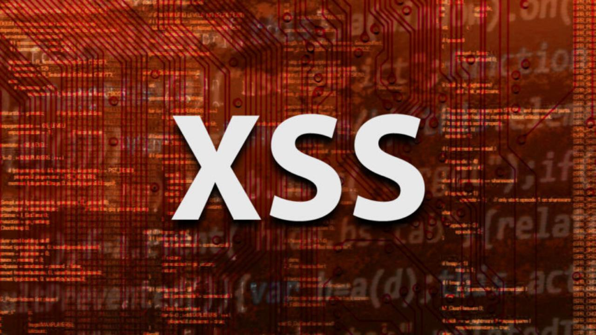
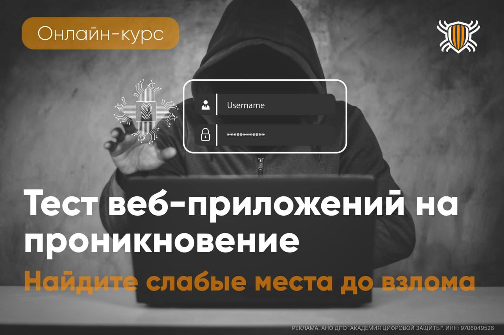
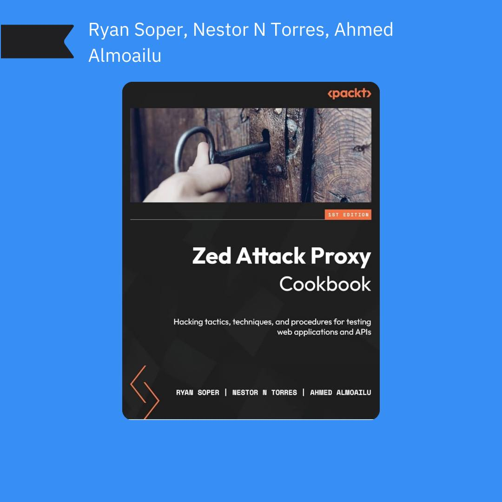

# svplatform
`2025-09-30`

* https://www.securityvision.ru/blog/chto-takoe-xss-uyazvimosti-i-kak-zashchititsya-ot-nikh-s-pomoshchyu-content-security-policy/

<blockquote>
❤️  Что такое XSS-уязвимости и как защититься от них с помощью Content Security Policy

Веб-приложения стали традиционной целью современных кибератак ввиду их сетевой доступности, обработки ценной для атакующих информации и подверженности распространенным веб-уязвимостям.

❗️  Веб-инъекции - один из наиболее популярных векторов кибератак на веб-приложения, в котором злоумышленники пользуются отсутствием должной проверки безопасности вводимых пользователями данных в веб-приложениях.

🛡  Уязвимости типа XSS давно известны и широко используются атакующими, поэтому для защиты от них разработаны стандарты безопасности, такие как Content Security Policy.

📎  В новой статье в блоге рассмотрели XSS-атаки и методы защиты от них.
</blockquote>

---

# it_secur
`2025-09-29`

* https://web-pentest.codeby.school/?erid=2VtzqvqcrwX&utm_source=tg&utm_medium=cpc&utm_campaign=%D0%B2%D0%B0%D0%BF%D1%820907

<blockquote>
Как найти слабые места в веб-приложении до того, как их найдут хакеры?

Расскажем на обновленном курсе WAPT от Академии Кодебай! 🛡 Это на 100% практический курс по пентесту, где вы попробуете изученные техники взлома в 65-ти заданиях нашей лаборатории!

🔴 Каждую неделю — вебинары с куратором! 

Старт 2 октября! Регистрация здесь.

Содержание курса:
✦ эксплуатация всех актуальных типов уязвимостей, активный / пассивный фаззинг
✦ SQL Injection и CMD Injection, Cross Site Scripting, PHP injection, Server Side Template injection
✦ техники повышения привилегий, Client-side атаки (XSS, CSRF)

Получите практические навыки как в рабочих задачах, так и в Bug Bounty. 

🚀 @CodebyManagerBot
</blockquote>

---

# elliot_cybersec
`2025-09-14`

* https://habr.com/ru/articles/725134/
* https://habr.com/ru/articles/726390/
* https://habr.com/ru/articles/729322/
* https://portswigger.net/web-security/sql-injection/union-attacks

<blockquote>
💉 SQL-инъекции для самых маленьких | Привет, друг. На связи Эллиот.

SQL-инъекция (SQLi) - это уязвимость веб-безопасности, которая позволяет злоумышленнику вмешиваться в запросы, которые приложение делает к своей базе данных. 

Как правило, это позволяет просматривать данные, которые он обычно не может получить. 

Это могут быть других пользователей, или любые другие данные, доступ к которым имеет само приложение. 

— Во многих случаях злоумышленник может изменять или удалять эти данные, вызывая постоянные изменения в содержимом или поведении приложения.

⏺ Ссылка на чтиво
⏺ Часть 2. UNION запросы
⏺ Часть 3
⏺ Ссылка на оригинал

&#35;SQL &#35;Injection &#35;Web &#35;Пентест &#35;CTF &#35;Attack
</blockquote>

---

# progbook
`2025-09-11`

* https://t.me/progbook_extra/2835
* https://t.me/progbook

<blockquote>
📚 Zed Attack Proxy Cookbook:
Hacking tactics, techniques, and procedures for testing web applications and APIs (2023)

Книга знакомит с OWASP ZAP — мощным инструментом для тестирования безопасности, который поможет найти и проэксплуатировать баги в веб-приложениях. Она откроет секреты сканирования веб-приложений и API.

🚀 Что тебя ждёт?

🟡 Рецепты по настройке и использованию ZAP
🟡 Атаки типа XXE и десериализация Java? Легко!
🟡 Интеграция ZAP в CI/CD pipeline для автоматизации тестирования
🟡 Аутентификация, авторизация, сессии, бизнес-логика — не останется без внимания

💻 Для кого?

Идеально для всех, кто работает в сфере кибербеза: пентестеров, DevSecOps, инженеров по безопасности и студентов, стремящихся освоить реальные навыки.

🔗 Скачать

🐸 Книги для программистов
</blockquote>

---

# elliot_cybersec
`2025-09-11`

* https://kali.tools/?p=3027
* https://kali.tools/?p=3034
* https://kali.tools/?p=4325
* https://kali.tools/?p=2038
* https://kali.tools/?p=1752
* https://kali.tools/?p=1589
* https://kali.tools/?p=3020
* https://kali.tools/?p=208
* https://kali.tools/?p=108
* https://kali.tools/?p=116
* https://kali.tools/?p=3189
* https://kali.tools/?p=1216
* https://kali.tools/?p=122
* https://kali.tools/?p=4980
* https://kali.tools/?p=2850
* https://kali.tools/?p=7444
* https://kali.tools/?p=2759
* https://kali.tools/?p=3581
* https://kali.tools/?p=6669
* https://kali.tools/?p=4717
* https://kali.tools/?p=1786
* https://kali.tools/?p=1241
* https://kali.tools/?p=706
* https://kali.tools/?p=5526
* https://kali.tools/?p=127
* https://kali.tools/?p=1551
* https://kali.tools/?p=2295
* https://kali.tools/?p=1259

<blockquote>
😎 Список инструментов Kali Linux (Часть 6) | Привет, друг. На связи Эллиот.

Веб приложения
1. adfind
2. Admin Page Finder
3. Amass
4. apache-users
5. Arachni
6. ATSCAN
7. BBQSQL
8. BlindElephant
9. BruteXSS
10. Burp Suite
11. Cangibrina
12. CutyCapt
13. DAVTest
14. deblaze
15. DIRB
16. DirBuster
17. dirsearch
18. droopescan
19. fimap
20. Findomain
21. FunkLoad
22. Gobuster
23. GoVHost
24. Grabber
25. hsecscan
26. hURL
27. identYwaf
28. Interlace
29. IronWASP
30. jboss-autopwn
31. joomscan
32. jSQL Injection
33. lulzbuster
34. Maltego
35. Metasploit
36. Nikto
37. NoSQLMap
38. PadBuster
39. Paros
40. Parsero

&#35;Kali &#35;Linux &#35;Tools &#35;Пентест &#35;Web &#35;XSS &#35;Injection &#35;Bruteforce
</blockquote>

---

# books_security_and_programming
`2025-09-04`

<blockquote>
Здравствуйте, дорогие друзья. Внимание!!!

Сентябрьская распродажа классического базового видеокурса - «Этичный взлом.», 3 дня, с 4-го по 6-е сентября включительно.

Скидка 84%, и итоговая цена в этот период составляет всего 4000 рублей.

            Плюс бонус: 12 моих книг:

            1. «Хакинг на JavaScript».
            2. «Хакерские инструменты на PHP8».
            3. «Заработок для хакера».
            4. «Capture the Flag (CTF). VulnHub 8 райтапов».
            5. «Cross Site Request Forgery».
            6. «Программирование на Go для начинающих».
            7. ««Программирование на С для начинающих».
            8. «Прохождение CTF Мистер Робот Практический курс».
            9. «Руководство по подготовке сертифицированного этичного хакера (CEH)».
            10. «Уязвимость SQL-инъекция. Практическое руководство для хакеров».
            11. «Уязвимость-Cross-Site-Scripting-XSS-Практическое-руководство».
            12. «Программирование на PHP8 для начинающих»
     

Предоставляю Вашему вниманию видеокурс, который состоит из 20-ти модулей. Курс ориентирован как для начинающих этичных хакеров, так и для более опытных специалистов.

Итого продолжительность: 41 час 14 минут.
Выжимка из моего 8-ми летнего опыта.

Стоимость: 4 000 рублей.
Отзывы вот тут: https://vk.com/topic-44038255_49120521
И вот тут: https://timcore.ru/otzyvy-o-moej-rabote/

            1 модуль — Видеокурс — «Пентест с помощью Kali Linux.» — 6 часов.
            2 модуль — Видеокурс — «Kali Linux для начинающих». — 7 часов.
            3 модуль — Видеокурс — «Тестирование на проникновение (пентест) с помощью Nmap, OpenVAS и Metasploit». — 3 часа 30 минут.
            4 модуль — Видеокурс — Уязвимости DVWA (Полное прохождение). — 3 часа 19 минут.
            5 модуль — Миникурс «Хакинг систем» ~ 1 час.
            6 модуль — Видеокурс — «SQL-Инъекция» — : 1 час 50 минут.
            7 модуль — Видеокурс: «Курс молодого бойца. Решение CTF.» — 1 час 15 минут.
            8 модуль — Миникурс. CTF. Web. Задания с Root-Me для не новичков. ~ 1 час.
            9 — 18 модуль. Видеокурс: «Хакинг bWAPP (buggy web application). Эксплуатация 100+ уязвимостей.» — 8 часов
           19 модуль - Электронная книга: «Хакинг с помощью искусственного интеллекта» ~ 7 часов.
           20 модуль - Курс: «ChatGPT для Этичных Хакеров и Пентестеров» ~ 4 часа.

В курсе мы рассмотрим инструменты для начинающего пентестера, и пройдемся по основным векторам атак на системы. Также взглянем и попрактикуемся с уязвимостями веб-приложения DVWA, и познакомимся с SQL-инъекциями. Также мы примем участие в CTF-соревнованиях на начальном и среднем уровне. Далее будет разбор 10-ти
категорий уязвимостей, по методологии OWASP Top-10. И в завершении Вы изучите два модуля по Искусственному интеллекту.

Итого продолжительность: 41 час 14 минут.

Стоимость: 4000 рублей.
Отзывы о курсе вот здесь: https://vk.com/topic-44038255_49120521
И вот тут: https://timcore.ru/otzyvy-o-moej-rabote/

Содержание вот тут: https://timcore.ru/kurs-jeticheskij-vzlom/

Для приобретения пишите по контакту: @timcore1
</blockquote>

---

