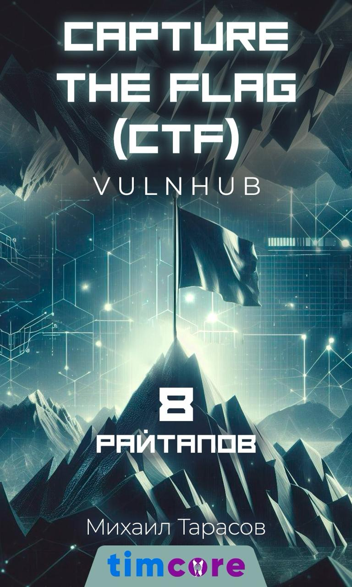
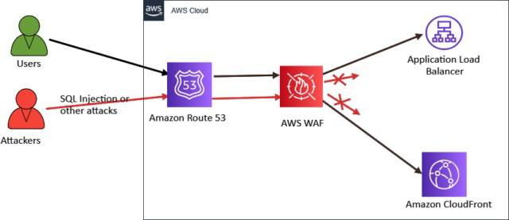
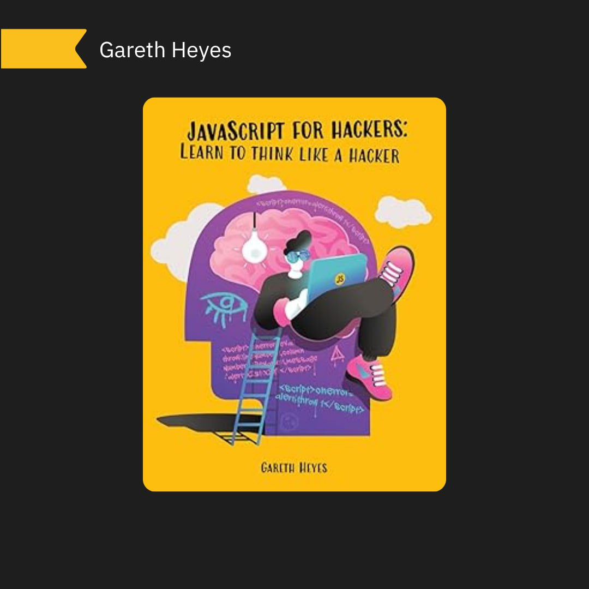
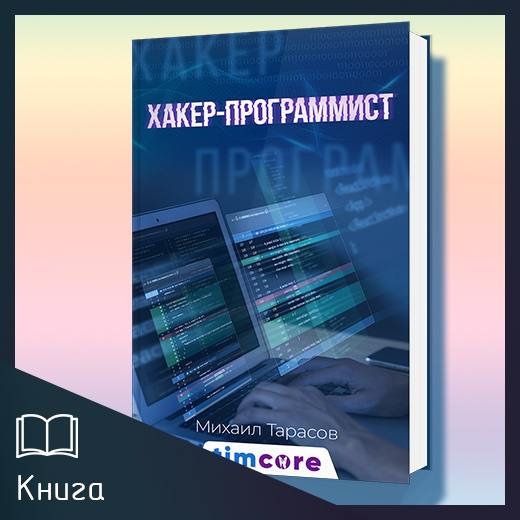

# elliot_cybersec
`2025-10-27`

* https://beefproject.com/
* https://en.wikipedia.org/wiki/Watering_hole_attack
* https://en.wikipedia.org/wiki/Phishing#Spear_phishing
* https://ru.wikipedia.org/wiki/APT
* https://habr.com/ru/companies/owasp/articles/348928/
* https://github.com/beefproject/beef

<blockquote>
🤨 The Browser Exploitation Framework Project: от XSS до полного контроля | Привет, друг. На связи Эллиот.

BeEF – платформа для эксплуатации клиент-сайд уязвимостей, таких как XSS.

Эксплуатации XSS уязвимостей зачастую уделяется мало внимания, т.к. вектора атаки нацелены на пользователей веб-приложения, а не на веб-приложение или веб-сервер. 

— BeEF позволяет реализовывать атакующие векторы, использующие в качестве точки входа веб-браузер. Такие атаки могут использоваться в контексте watering hole и spear phishing атак, а также в контексте APT.

⏺ Ссылка на чтиво
⏺ Ссылка на GitHub

&#35;BeEF &#35;Vulnerability &#35;XSS &#35;OWASP &#35;Пентест &#35;Web &#35;Browser
</blockquote>

---

# books_security_and_programming
`2025-10-27`

<blockquote>
Эй, хакеры, кодеры и те, кто рвётся в мир эксплойтов! 🔥 
Я — Михаил Тарасов (Timcore), и я решил прокачать Вашу библиотеку знаний. Бесплатно раздаю 9 своих авторских книг по хакингу, CTF, уязвимостям и программированию. Это не вода — это чистый хардкор: от SQL-инъекций до Rust-хаков. Хочешь прокачать скиллы и ломать системы как профи? Лови шанс, пока не поздно! 
 
Вот что ты получишь в рассылке (PDF формат): 

1. Capture the Flag (CTF). VulnHub 8 райтапов — Реальные walkthroughs для тренировок на VulnHub. 
2. Cross Site Request Forgery — Как эксплуатировать CSRF и защищаться от него. 
3. Программирование на Go для начинающих — Быстрый старт в Go для автоматизации. 
4. Программирование на PHP8 для начинающих — Современный PHP для веб-эксплойтов. 
5. Программирование на С для начинающих — База для low-level хаков. 
6. Прохождение CTF Мистер Робот Практический курс — Шаг за шагом по легендарному CTF. 
7. Уязвимость SQL-инъекция. Практическое руководство для хакеров — Эксплойты SQLi в действии. 
8. Уязвимость-Cross-Site-Scripting-XSS-Практическое-руководство — XSS от А до Я, с примерами. 
9. Хакинг на Rust — Безопасный и мощный Rust для пентеста. 
 
Это не просто книги — это твои инструменты для доминирования в CTF, поиска уязвимостей и создания своих эксплойтов. Я написал их на основе реального опыта: ломал, фиксил, учил других. Бесплатно? Да, потому что знания должны быть доступны. Но только для тех, кто готов действовать! 
 
Как забрать? по контакту в телеграм: @timcore1: &quot;Хочу книги Timcore&quot; — и я пришлю ссылку на скачивание. Не тяни, раздача ограничена! 
 
&#35;хакинг &#35;CTF &#35;эксплойты &#35;программирование &#35;Timcore 
Поделись с друзьями — пусть все прокачаются! 🚀
</blockquote>

---

# books_security_and_programming
`2025-10-23`

<blockquote>
Здравствуйте, дорогие друзья!

Электронная книга: «Хакинг с помощью искусственного интеллекта»: Полностью переработанное издание - готова!

Твой sqlmap устарел.
Пока ты ищешь XSS, автономный AI-агент уже получил RCE через уязвимость в ML-пайплайне. Пока ты сканируешь порты, deepfake-копия CEO уже выводит деньги со счетов.
Мир разделился на тех, кто использует AI для атаки, и тех, кого взломают с его помощью.

«Хакинг с помощью искусственного интеллекта»” — это твой арсенал на 2025 год.

742 страницы. Ноль теории для новичков. Только концентрированная практика, которая ставит тебя на шаг впереди.

С этой книгой ты научишься:
 • Ломать модели: Проводить jailbreak GPT-5. Извлекать системные промпты из Claude. Отравлять датасеты. Обходить распознавание лиц с помощью adversarial-патчей и атаковать Tesla Autopilot.
 • Создавать оружие: Писать автономных пентест-агентов, интегрируя GPT с BurpSuite. Генерировать shellcode с помощью LLM. Взламывать пароли, используя PassGAN.
 • Атаковать инфраструктуру: Красть ML-модели через API, потратив $200. Находить бэкдоры в MLOps-пайплайнах и моделях с Hugging Face. Захватывать умные дома через voice injection.
 • Зарабатывать: Превращать prompt injection в чек на $10,000 от Google, OpenAI или Anthropic. Внутри — рабочие методики, цели и примеры успешных репортов.

Это не для всех.
Это не учебник по Python. Это руководство по offensive AI. Для пентестеров, red team’еров и багхантеров, которые хотят атаковать, а не защищаться от вчерашних угроз.

Цена: 2000 рублей.

Стоимость одного ужина. Или одна десятая минимальной выплаты за уязвимость в AI-системе. Это инвестиция, которая окупится с первого же найденного бага или сэкономленных 100 часов ручной работы.

Содержание и покупка по ссылке: https://timcourse.ru/courses/elektronnaya-kniga-haking-s-pomoshyu-iskusstvennogo-intellekta-polnostyu-pererabotannoe-izdanie/

Также можете написать в личные сообщения паблика, перейдя по ссылке на товар: https://vk.com/market/product/elektronnaya-kniga-khaking-s-pomoschyu-iskusstvennogo-intellekta-polnostyu-pererabotanno-44038255-12507287

Либо по контакту в телеграм: @timcore1
</blockquote>

---

# cybersec_academy
`2025-10-22`

* https://t.me/cybersec_academy

<blockquote>
API Gateway vs WAF: что выбрать?

👋 Приветствую в мире цифровой безопасности!

Сегодня разберём, как защитить веб-приложения и API: через WAF или API Gateway.

⏺WAF (Web Application Firewall) - это как щит приложения. Фильтрует подозрительные запросы, блокирует SQL-инъекции, XSS, CSRF и прочие классические веб-атаки. Тут все классно работает с  фронтендом и серверной логикой, но с API часто сталкивается с ограничениями: сложные или нестандартные запросы он может пропустить, а специфические механизмы авторизации просто не понять…

⏺API Gateway - контролит полностью ваш API. Он проверяет аутентификацию и права, лимитирует частоту запросов, валидирует данные и шифрует трафик. Это как единый пост охраны для всех ваших эндпоинтов: любые странные действия заметит и остановит. API Gateway может централизованно управлять доступом, снижает нагрузку на бекенд и защищает от злоупотреблений со стороны клиентов или сторонних сервисов.

ZeroDay | &#35;API &#35;WAF
</blockquote>

---

# progbook
`2025-10-18`

* https://t.me/progbook_extra/2930
* https://t.me/boost/progbook
* https://t.me/progbook

<blockquote>
📚 JavaScript for hackers: Learn to think like a hacker (2022)

Ты когда-нибудь задумывался, как тот самый «чёрный ящик» — браузер — выглядит глазами хакера? Книга объясняет не как ломать систему, а как думать о её слабых местах. 

📦 Что внутри:

• Основы мышления хакера — почему баги появляются там, где ты их не ждёшь.

• Как искать уязвимости в браузере и в JavaScript — не пошаговые рецепты взлома, а методика поиска.

• Интересные техники фаззинга — как быстро проверить миллионы вариантов.

• Обходы SOP и прочие хитрости — разбор на примерах найденных автором идей (на уровне концепций).

• Prototype pollution — что это такое и как бороться.

• Современные XSS-техники — обзор трендов и что с ними делать в коде.

😎 Для кого полезна: фронтендеров, QA, пентестеров и тимлидов, которые хотят, чтобы код был не только быстрый, но и безопасный.

🔗 Скачать
🤞 Поддержать канал бустом

🐸 Книги для программистов
</blockquote>

---

# books_security_and_programming
`2025-10-14`

<blockquote>
Здравствуйте, дорогие друзья!

Предоставляю Вашему вниманию новую электронную книгу, которую можно оформить по предзаказу:

🔥 Предзаказ открыт: «Хакинг с помощью искусственного интеллекта» — Edition 2.0

В 2024 году вы читали первую версию. В 2025 году правила игры изменились полностью.
Что произошло за год?
Пока вы изучали базовый deepfake и adversarial attacks, мир ушёл вперёд:
 • Автономные AI-агенты теперь самостоятельно ищут уязвимости
 • Prompt injection стала новой SQL Injection — только опаснее
 • Real-time voice cloning используется для кражи миллионов (реальные кейсы 2024)
 • RAG-системы и multimodal AI открыли attack surface, о которых раньше никто не думал

Старое издание устарело через 6 месяцев. Новое — это полная перезагрузка.
Edition 2.0 — это не обновление, это другая книга
300+ страниц практического контента:
 • 30 глав вместо 16
 • Реальные PoC и код для каждой атаки
 • Кейсы 2024-2025: от взлома через GPT-4 до $25M deepfake-мошенничества
 • Cheat sheet с 50 prompt injection payload’ами

Чему вы научитесь?
Атаковать:
 • Ломать GPT-4, Claude, Gemini через jailbreak’и нового поколения
 • Создавать autonomous pentesting agents (GPT + BurpSuite)
 • Красть ML-модели через API за $200
 • Обходить все корпоративные AI-боты и выливать внутренние данные
 • Использовать AI для генерации эксплойтов в реальном времени
Защищать:
 • Строить AI Red Team процессы по методологии 2025
 • Внедрять guardrails и защиту от prompt injection
 • Проводить adversarial training правильно
 • Мониторить аномальные запросы к LLM
Зарабатывать:
 • Bug bounty для AI-систем: что платят OpenAI, Google, Anthropic
 • Как репортить уязвимости в LLM ($10k+ за prompt injection)
 • Легальные способы монетизации AI security навыков

Почему это важно именно сейчас?
EU AI Act вступил в силу. GPT-5 на подходе. Автономные агенты уже в production у крупных компаний. Через год эти знания будут стоить в 5 раз дороже — или станут обязательными для выживания в индустрии.

Что внутри, чего не было раньше?
 • Часть про autonomous AI agents — как они атакуют и защищаются
 • RAG и multimodal атаки — новый фронт войны
 • Edge AI и IoT — взлом умных домов через on-device ML
 • Supply chain атаки на Hugging Face и MLOps
 • Законы и grey zones — что легально, а за что сядешь
 • AI vs AI warfare — когда нейросеть атакует нейросеть
Кому это нужно?
 • Этичным хакерам, которые хотят быть на передовой
 • Bug bounty охотникам, ищущим новые векторы
 • Pentester’ам, готовым к AI-эре
 • Security инженерам, защищающим корпоративные LLM
 • Всем, кто понимает: AI security — это не будущее, это настоящее

💰 Предзаказ: 1100₽ (вместо 1700₽ после релиза)

Что получаете:
 • Электронную книгу сразу после релиза
 • Все обновления и дополнения бесплатно
 • Бонус: эксклюзивные PoC-скрипты, которых нет в книге
Релиз: начало ноября 2025

Предзаказ закроется через 2 недели — или когда наберётся 500 человек.
Это не просто книга. Это оружие для тех, кто понимает: мир AI security только начинается, и кто первым освоит новые техники — тот будет диктовать правила.

Готовы ломать то, что ещё вчера казалось неломаемым?

Содержание книги: https://vk.com/hacker_timcore?w&#61;wall-44038255_10983

Для оформления предзаказа, пишите по контакту: @timcore1
</blockquote>

---

# books_security_and_programming
`2025-10-09`

<blockquote>
Здравствуйте, дорогие друзья. Внимание!!!

Октябрьская распродажа классического базового видеокурса - «Этичный взлом.», 3 дня, с 9-го по 11-е октября включительно.

Скидка 84%, и итоговая цена в этот период составляет всего 4000 рублей.

            Плюс бонус: 12 моих книг:

            1. «Хакинг на JavaScript».
            2. «Хакерские инструменты на PHP8».
            3. «Заработок для хакера».
            4. «Capture the Flag (CTF). VulnHub 8 райтапов».
            5. «Cross Site Request Forgery».
            6. «Программирование на Go для начинающих».
            7. ««Программирование на С для начинающих».
            8. «Прохождение CTF Мистер Робот Практический курс».
            9. «Руководство по подготовке сертифицированного этичного хакера (CEH)».
            10. «Уязвимость SQL-инъекция. Практическое руководство для хакеров».
            11. «Уязвимость-Cross-Site-Scripting-XSS-Практическое-руководство».
            12. «Программирование на PHP8 для начинающих»
     

Предоставляю Вашему вниманию видеокурс, который состоит из 20-ти модулей. Курс ориентирован как для начинающих этичных хакеров, так и для более опытных специалистов.

Итого продолжительность: 41 час 14 минут.
Выжимка из моего 8-ми летнего опыта.

Стоимость: 4 000 рублей.
Отзывы вот тут: https://vk.com/topic-44038255_49120521
И вот тут: https://timcore.ru/otzyvy-o-moej-rabote/

            1 модуль — Видеокурс — «Пентест с помощью Kali Linux.» — 6 часов.
            2 модуль — Видеокурс — «Kali Linux для начинающих». — 7 часов.
            3 модуль — Видеокурс — «Тестирование на проникновение (пентест) с помощью Nmap, OpenVAS и Metasploit». — 3 часа 30 минут.
            4 модуль — Видеокурс — Уязвимости DVWA (Полное прохождение). — 3 часа 19 минут.
            5 модуль — Миникурс «Хакинг систем» ~ 1 час.
            6 модуль — Видеокурс — «SQL-Инъекция» — : 1 час 50 минут.
            7 модуль — Видеокурс: «Курс молодого бойца. Решение CTF.» — 1 час 15 минут.
            8 модуль — Миникурс. CTF. Web. Задания с Root-Me для не новичков. ~ 1 час.
            9 — 18 модуль. Видеокурс: «Хакинг bWAPP (buggy web application). Эксплуатация 100+ уязвимостей.» — 8 часов
           19 модуль - Электронная книга: «Хакинг с помощью искусственного интеллекта» ~ 7 часов.
           20 модуль - Курс: «ChatGPT для Этичных Хакеров и Пентестеров» ~ 4 часа.

В курсе мы рассмотрим инструменты для начинающего пентестера, и пройдемся по основным векторам атак на системы. Также взглянем и попрактикуемся с уязвимостями веб-приложения DVWA, и познакомимся с SQL-инъекциями. Также мы примем участие в CTF-соревнованиях на начальном и среднем уровне. Далее будет разбор 10-ти
категорий уязвимостей, по методологии OWASP Top-10. И в завершении Вы изучите два модуля по Искусственному интеллекту.

Итого продолжительность: 41 час 14 минут.

Стоимость: 4000 рублей.
Отзывы о курсе вот здесь: https://vk.com/topic-44038255_49120521
И вот тут: https://timcore.ru/otzyvy-o-moej-rabote/

Содержание вот тут: https://timcore.ru/kurs-jeticheskij-vzlom/

Для приобретения пишите по контакту: @timcore1
</blockquote>

---

# books_security_and_programming
`2025-10-06`

<blockquote>
Здравствуйте, дорогие друзья!!!

    Внимание! Акция!!!

    Продлится 3 дня, с 6-го по 8-е октября включительно, а именно скидка 30% на мою электронную книгу-сборник «Хакер-программист»! 📚

    Если Вы интересуетесь этичным хакингом и программированием, то эта книга станет для Вас настоящим кладезем знаний. Внутри Вы найдете 17 подробных разделов, которые охватывают все аспекты этой увлекательной и важной темы:

    1. Заработок для хакера
    https://vk.com/market/product/elektronnaya-kniga-zarabotok-dlya-khakera-44038255-9584632
    2. Основы хакинга
    https://vk.com/market/product/elektronnaya-kniga-osnovy-khakinga-44038255-9237103
    3. Kali Linux для начинающих
    https://vk.com/market/product/elektronnaya-kniga-kali-linux-dlya-nachinayuschikh-bazovy-uroven-44038255-4996935
    4. Программирование на Go для начинающих
    https://vk.com/market/product/elektronnaya-kniga-programmirovanie-na-go-dlya-nachinayuschikh-44038255-9562398
    5. Программирование на Ассемблере для начинающих
    https://vk.com/market/product/elektronnaya-kniga-programmirovanie-na-assemblere-dlya-nachinayuschikh-44038255-9664238
    6. Хакинг на JavaScript
   https://vk.com/market/product/elektronnaya-kniga-khaking-na-javascript-44038255-9092464
    7. Хакинг на Ruby
    https://vk.com/market/product/elektronnaya-kniga-khaking-na-ruby-44038255-9553339
    8. Хакерские инструменты на PHP8
   https://vk.com/market/product/elektronnaya-kniga-khakerskie-instrumenty-na-php8-44038255-9060882
    9. Хакинг bWAPP - buggy web application. Эксплуатация 100 уязвимостей
    https://vk.com/market/product/elektronnaya-kniga-khaking-bwapp-buggy-web-application-expluatatsia-100-uyazvimostey-44038255-8337216
    10. Хакинг DVWA. Полное прохождение
    https://vk.com/market/product/kniga-uyazvimosti-dvwa-polnoe-prokhozhdenie-mikhail-tarasov-timcore-44038255-7367979
    11. Уязвимость SQL инъекция. Практическое руководство для хакеров
    https://vk.com/market/product/kniga-uyazvimost-sql-inektsia-prakticheskoe-rukovodstvo-dlya-khakerov-44038255-8556247
    12. Уязвимость Cross-Site Scripting XSS. Практическое руководство
    https://vk.com/market/product/kniga-uyazvimost-cross-site-scripting-xss-prakticheskoe-rukovodstvo-dlya-khakerov-44038255-8411529
    13. Пост-эксплуатация веб-сервера
    https://vk.com/market/product/kniga-post-expluatatsia-veb-servera-44038255-8442259
    14. Cross Site Request Forgery (CSRF)
    https://vk.com/market/product/elektronnaya-kniga-uyazvimost-csrf-44038255-9345816
    15. Прохождение CTF. Мистер Робот. Практический курс
    https://vk.com/market/product/elektronnaya-kniga-mr-robot-1-ctf-walkthrough-reshenie-zadania-ctf-prakticheskoe-posobie-dlya-khaker-44038255-9357732
    16. CTF. VulnHub - 8 райтапов
    https://vk.com/market/product/elektronnaya-kniga-capture-the-flag-ctf-vulnhub-8-raytapov-44038255-9267197
    17. Kali Linux для продвинутого тестирования на проникновение
    https://vk.com/market/product/elektronnaya-kniga-kali-linux-dlya-prodvinutogo-testirovania-na-proniknovenie-44038255-8574265

    Объем книги  – 4074 страницы, наполненные полезной информацией и практическими примерами. 
    Стоимость книги составляет 3500 рублей.

    🔗 Заказать книгу можно, написав по контакту в телеграм: @timcore1

    Не упустите возможность стать настоящим профессионалом в области этичного хакинга и программирования! 💻🔒
</blockquote>

---

# books_security_and_programming
`2025-10-02`

<blockquote>
Здравствуйте, дорогие друзья!

🔥 Акция на 3 книги по хакингу: -60% скидка!

Только 3 дня — со 2 по 4 октября! Три книги по цене одной: всего 1300 рублей вместо 3900.

Получи мощный арсенал знаний по кибербезопасности на трёх языках программирования. Это не просто теория — это практические навыки для реальных задач в Bug Bounty, пентестинге и разработке безопасного кода.

Что входит в набор
1. «Хакинг на JavaScript 2.0» — от XSS-эксплойтов до создания C2-серверов на Node.js. Научишься обходить WAF, писать парсеры и автоматизировать атаки. 8 глав практики + этика Bug Bounty.
Полное содержание → https://vk.com/hacker_timcore?w&#61;wall-44038255_10673

2. «Хакинг на Ruby» — сетевое программирование, взлом паролей, веб-сканеры уязвимостей и автоматизация пентестинга. С тестами и вопросами для самопроверки после каждого раздела.
Полное содержание → https://vk.com/market/product/elektronnaya-kniga-khaking-na-ruby-44038255-9553339

3. «Хакинг на Rust» — фаззинг, обход DEP/ASLR, эксплуатация уязвимостей памяти и создание безопасного кода. Язык будущего для критичных систем.
Полное содержание → https://vk.com/hacker_timcore?w&#61;wall-44038255_10652

Почему стоит взять

Три языка &#61; три подхода к безопасности. JavaScript для веб-атак, Ruby для быстрой автоматизации, Rust для низкоуровневого контроля. Все книги с реальными кейсами, примерами кода и фокусом на этичный хакинг.

Акция действует 72 часа. После 4 октября цена вернётся к обычной.
Прокачай скиллы сейчас — завтра может быть поздно.

Для приобретения пишите с по контакту в тг: @timcore1
</blockquote>

---

