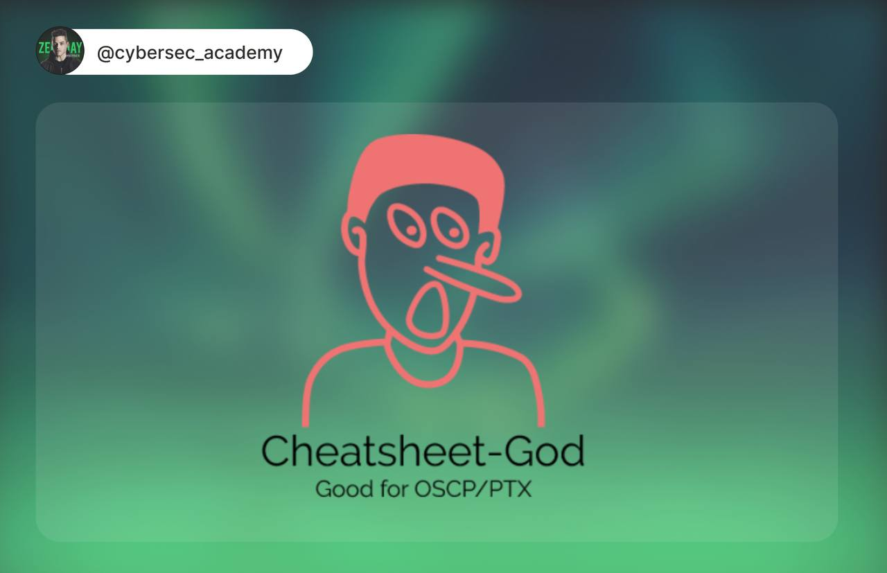
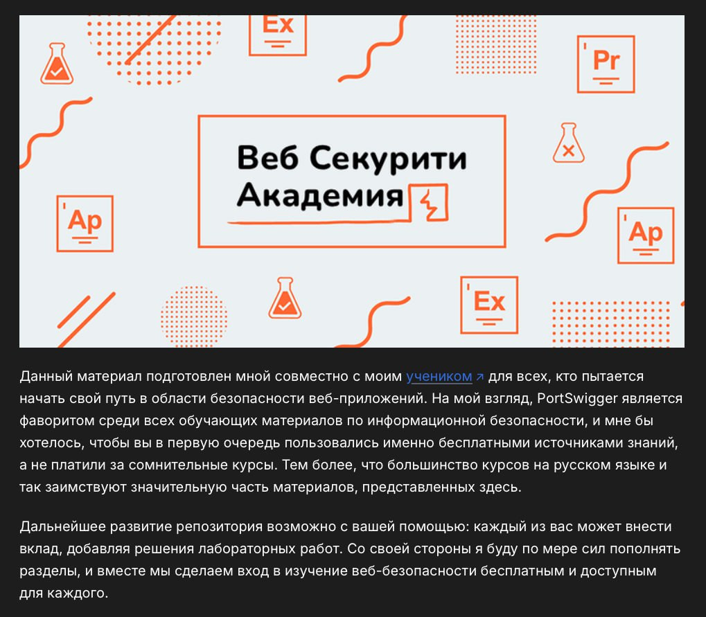

# cybersec_academy
`2025-12-16`

* https://github.com/OlivierLaflamme/Cheatsheet-God
* https://t.me/cybersec_academy

<blockquote>
Cheatsheet‑God: один репозиторий вместо сотни закладок

👋 Приветствую в мире цифровой безопасности!

Поговорим о еще одном инструменте безопасности.

⏺Что это такое по сути: Cheatsheet‑God - это офлайн‑банк шпаргалок, техник, синтаксиса и методологий для пентеста. Не сканер и не эксплойт‑фреймворк, а такой сборник того, что проверять, куда смотреть и какими командами работать на каждом этапе атаки.

⏺Почему он до сих пор полезен: репозиторий собирался под OSCP и реальные пентесты. Там есть проверенные цепочки действий: от первичного доступа до пост‑эксплуатации. В 2025 это всё ещё актуально, потому что базовые ошибки и векторы не меняются так быстро, как инструменты.

⏺Что внутри: репозиторий разбит на десятки файлов, каждый - под отдельную тему.
Примеры направлений:
• privilege escalation (Linux / Windows)
• password attacks и hash‑атаки
• BOF и exploit writing
• Active Directory и доменные сценарии
• web‑атаки, SQLi, XSS, file inclusion
• post‑exploitation и lateral movement

ZeroDay | &#35;Инструмент
</blockquote>

---

# it_secur
`2025-12-15`

* https://wr3dmast3r.gitbook.io/portswiggerfundamental
* https://wr3dmast3r.gitbook.io/portswiggerfundamental/readme/sqli
* https://wr3dmast3r.gitbook.io/portswiggerfundamental/readme/authentication-vulnerabilities
* https://wr3dmast3r.gitbook.io/portswiggerfundamental/readme/path-traversal
* https://wr3dmast3r.gitbook.io/portswiggerfundamental/readme/os-command-injection
* https://wr3dmast3r.gitbook.io/portswiggerfundamental/readme/business-logic
* https://wr3dmast3r.gitbook.io/portswiggerfundamental/readme/information-disclosure
* https://wr3dmast3r.gitbook.io/portswiggerfundamental/readme/access-control-vulnerabilities
* https://wr3dmast3r.gitbook.io/portswiggerfundamental/readme/file-upload
* https://wr3dmast3r.gitbook.io/portswiggerfundamental/readme/race-conditions
* https://wr3dmast3r.gitbook.io/portswiggerfundamental/readme/ssrf
* https://wr3dmast3r.gitbook.io/portswiggerfundamental/readme/xxe
* https://wr3dmast3r.gitbook.io/portswiggerfundamental/readme/nosql
* https://wr3dmast3r.gitbook.io/portswiggerfundamental/readme/api
* https://wr3dmast3r.gitbook.io/portswiggerfundamental/readme/web-cache-deception
* https://wr3dmast3r.gitbook.io/portswiggerfundamental/readme/xss
* https://wr3dmast3r.gitbook.io/portswiggerfundamental/readme/csrf
* https://wr3dmast3r.gitbook.io/portswiggerfundamental/readme/cors
* https://wr3dmast3r.gitbook.io/portswiggerfundamental/readme/clickjacking
* https://wr3dmast3r.gitbook.io/portswiggerfundamental/readme/dom-based
* https://wr3dmast3r.gitbook.io/portswiggerfundamental/readme/websocket
* https://wr3dmast3r.gitbook.io/portswiggerfundamental/readme/insecure-deserialization
* https://wr3dmast3r.gitbook.io/portswiggerfundamental/readme/web-llm
* https://wr3dmast3r.gitbook.io/portswiggerfundamental/readme/graphql
* https://wr3dmast3r.gitbook.io/portswiggerfundamental/readme/ssti
* https://wr3dmast3r.gitbook.io/portswiggerfundamental/readme/web-cache-poisoning
* https://wr3dmast3r.gitbook.io/portswiggerfundamental/readme/host-header-attacks
* https://wr3dmast3r.gitbook.io/portswiggerfundamental/readme/http-request-smuggling
* https://wr3dmast3r.gitbook.io/portswiggerfundamental/readme/oauth
* https://wr3dmast3r.gitbook.io/portswiggerfundamental/readme/jwt
* https://wr3dmast3r.gitbook.io/portswiggerfundamental/readme/prototype-pollution
* https://wr3dmast3r.gitbook.io/portswiggerfundamental/readme/essential-skills

<blockquote>
•  Нашел очень крутой материал по безопасности веб-приложений. Автор потратил около 6 месяцев на подготовку этого руководства и выкатил всю информацию совершенно бесплатно. Сам материал разделен на 3 части: для абсолютных новичков, для опытных специалистов и для экспертов.

•  Для абсолютных новичков рекомендуется начать изучение с серверных тем. Эти уязвимости, как правило, легче освоить, поскольку вам нужно понимать только то, что происходит на сервере. Данный материал и лабораторные работы помогут вам развить основные знания и навыки, которые будут полезны вам снова и снова.

➡SQL-инъекции;
➡Уязвимости аутентификации;
➡Обход пути (path traversal);
➡Инъекция команд ОС;
➡Уязвимости бизнес-логики;
➡Уязвимости, связанные с раскрытием информации;
➡Уязвимости контроля доступа и эскалация привилегий;
➡Уязвимости загрузки файлов;
➡Состояния гонки (race conditions);
➡Подделка запросов на стороне сервера (SSRF);
➡Внедрение внешних сущностей XML (XXE);
➡Инъекция NoSQL;
➡Тестирование API;
➡Обман веб-кэша (web cache deception).

•  Уязвимости на стороне клиента вносят дополнительный уровень сложности, что делает их немного более сложными для понимания. Этот материал и лабораторные работы помогут вам развить навыки, которые вы уже освоили ранее, и научат вас выявлять и эксплуатировать также некоторые сложные клиентские векторы атак.

➡Межсайтовый скриптинг (XSS);
➡Межсайтовая подделка запросов (CSRF);
➡Совместное использование ресурсов между источниками (CORS);
➡Кликджекинг (UI redressing);
➡Уязвимости на основе DOM (DOM-based vulnerabilities);
➡Тестирование уязвимостей безопасности WebSockets.

•  Темы, которые перечислены ниже, как правило, требуют более глубокого понимания и более широких знаний. Рекомендуется сначала разобраться с основами, прежде чем приступать к этим лабораторным работам. Некоторые из них основаны на новаторских методиках, разработанных исследовательской командой мирового уровня.

➡Небезопасная десериализация;
➡Атаки на веб-LLM;
➡Уязвимости GraphQL API;
➡(SSTI) Инъекция шаблона на стороне сервера;
➡Отравление веб-кэша (web cache poisoning);
➡Атаки через HTTP заголовок Host;
➡Контрабанда HTTP-запросов (HTTP request smuggling);
➡Уязвимости аутентификации OAuth 2.0;
➡Атаки на JWT;
➡Что такое загрязнение прототипов (prototype pollution);
➡Ключевые навыки.

&#35;Web
</blockquote>

---

# cybersec_academy
`2025-12-05`

* https://t.me/cybersec_academy

<blockquote>
3 приёма для веб‑пентеста

👋 Приветствую в мире цифровой безопасности!

Расскажу сегодня о трех полезных фишках именно для веб-пентеста.

⏺Blind SSRF через favicon-hash: Подмена пути на /favicon.ico с редиректом на ваш сервер. Многие прокси разрешают favicon без проверки домена.
Если хэш favicon меняется, значит и SSRF-трафик точно дошёл до вас.

GET /favicon.ico HTTP/1.1
Host: internal.service

➡️Защита: строгие allowlist доменов, отключение «favicon fallback».

⏺Cookie-forcing через незаполненные поддомены: Если у домена есть a.example.com, но нет b.example.com, вы можете поднять свой b. и выставить cookies на весь .example.com.
При следующем запросе браузер отправит ваши куки в реальное приложение, а это часто ломает auth‑логику.

Set-Cookie: session&#61;evil; Domain&#61;.example.com

➡️Защита: запрет wildcard‑cookie, политика Host-Only, закрытие неиспользуемых поддоменов.

⏺Cache-Poisoning через хитрый параметр: Многие CDN кэшируют URL вроде:
/api/user?nocache&#61;1&amp;x&#61;
Если добавить пустой параметр или нестандартный разделитель (;, %00), CDN кэширует вашу версию ответа, а пользователь получает поддельный контент.

/api/user?nocache&#61;1&amp;x&#61;%00inject

➡️Защита: нормализация URL, запрет необычных разделителей, строгая политика кэширования.

ZeroDay | &#35;пентест
</blockquote>

---

